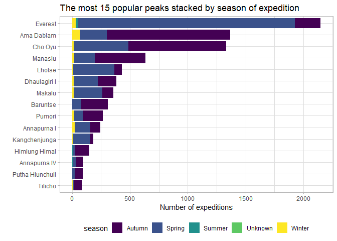

You will have to create 3 plots based on the datasets and instructions detailed below. You will find the plots themeselves in the `assignments/assignment_2_plots`. Your task is to write the code that will reproduce the plots as closely as possible.

# Skills needed to solve this assignment

-   Using R and RStudio, reading data
-   Reporting using RMarkdown
-   Using Git and Github (for submitting the task)
-   Data manipulation (e.g. dplyr, tidyr), and working with factors (forcats)
-   Data visuzlization (ggplot2)


## Task 1: Climbing expeditions

The 2020-09-22 TidyTueday datasets are about climbing expeditions. From the three datasets, use the "expeditions". Reproduce the plot below! Notice a few things:

-   Use `forcats::fct_lump()` to get the 15 most frequent peaks, and drop the "Other" category.
-   The bars are ordered by the sum of all expeditions (use `fct_reorder()`).
-   The bar colors use the viridis palette and light theme.


```
## 
## -- Column specification --------------------------------------------------------
## cols(
##   expedition_id = col_character(),
##   peak_id = col_character(),
##   peak_name = col_character(),
##   year = col_double(),
##   season = col_character(),
##   basecamp_date = col_date(format = ""),
##   highpoint_date = col_date(format = ""),
##   termination_date = col_date(format = ""),
##   termination_reason = col_character(),
##   highpoint_metres = col_double(),
##   members = col_double(),
##   member_deaths = col_double(),
##   hired_staff = col_double(),
##   hired_staff_deaths = col_double(),
##   oxygen_used = col_logical(),
##   trekking_agency = col_character()
## )
```

```
## spec_tbl_df [10,364 x 16] (S3: spec_tbl_df/tbl_df/tbl/data.frame)
##  $ expedition_id     : chr [1:10364] "ANN260101" "ANN269301" "ANN273101" "ANN278301" ...
##  $ peak_id           : chr [1:10364] "ANN2" "ANN2" "ANN2" "ANN2" ...
##  $ peak_name         : chr [1:10364] "Annapurna II" "Annapurna II" "Annapurna II" "Annapurna II" ...
##  $ year              : num [1:10364] 1960 1969 1973 1978 1979 ...
##  $ season            : chr [1:10364] "Spring" "Autumn" "Spring" "Autumn" ...
##  $ basecamp_date     : Date[1:10364], format: "1960-03-15" "1969-09-25" ...
##  $ highpoint_date    : Date[1:10364], format: "1960-05-17" "1969-10-22" ...
##  $ termination_date  : Date[1:10364], format: NA "1969-10-26" ...
##  $ termination_reason: chr [1:10364] "Success (main peak)" "Success (main peak)" "Success (main peak)" "Bad weather (storms, high winds)" ...
##  $ highpoint_metres  : num [1:10364] 7937 7937 7937 7000 7160 ...
##  $ members           : num [1:10364] 10 10 6 2 3 6 7 19 9 5 ...
##  $ member_deaths     : num [1:10364] 0 0 0 0 0 1 0 0 1 0 ...
##  $ hired_staff       : num [1:10364] 9 0 8 0 0 2 2 0 3 0 ...
##  $ hired_staff_deaths: num [1:10364] 0 0 0 0 0 0 0 0 0 0 ...
##  $ oxygen_used       : logi [1:10364] TRUE FALSE FALSE FALSE FALSE FALSE ...
##  $ trekking_agency   : chr [1:10364] NA NA NA NA ...
##  - attr(*, "spec")=
##   .. cols(
##   ..   expedition_id = col_character(),
##   ..   peak_id = col_character(),
##   ..   peak_name = col_character(),
##   ..   year = col_double(),
##   ..   season = col_character(),
##   ..   basecamp_date = col_date(format = ""),
##   ..   highpoint_date = col_date(format = ""),
##   ..   termination_date = col_date(format = ""),
##   ..   termination_reason = col_character(),
##   ..   highpoint_metres = col_double(),
##   ..   members = col_double(),
##   ..   member_deaths = col_double(),
##   ..   hired_staff = col_double(),
##   ..   hired_staff_deaths = col_double(),
##   ..   oxygen_used = col_logical(),
##   ..   trekking_agency = col_character()
##   .. )
```

<!-- -->

## Task 2: PhDs awarded

The 2019-02-19 TidyTueday dataset is about phd-s awarded by year and field. There is only one dataset, it is called `phd_by_field`. Reproduce the plot below!

Notes:

-   First you have to aggregate the data to count all phd-s by broad fields.
-   To make the x axis breaks pretty, use `scales::pretty_breaks()`, to make the y axis labels comma formatted, use `scales::comma_format()`.
-   The line size is 1.2, the colors are from the brewer "Dark2" palette. The theme is set to minimal.


```
## 
## -- Column specification --------------------------------------------------------
## cols(
##   broad_field = col_character(),
##   major_field = col_character(),
##   field = col_character(),
##   year = col_double(),
##   n_phds = col_double()
## )
```

```
## spec_tbl_df [3,370 x 5] (S3: spec_tbl_df/tbl_df/tbl/data.frame)
##  $ broad_field: chr [1:3370] "Life sciences" "Life sciences" "Life sciences" "Life sciences" ...
##  $ major_field: chr [1:3370] "Agricultural sciences and natural resources" "Agricultural sciences and natural resources" "Agricultural sciences and natural resources" "Agricultural sciences and natural resources" ...
##  $ field      : chr [1:3370] "Agricultural economics" "Agricultural and horticultural plant breeding" "Agricultural animal breeding" "Agronomy and crop science" ...
##  $ year       : num [1:3370] 2008 2008 2008 2008 2008 ...
##  $ n_phds     : num [1:3370] 111 28 3 68 41 18 77 182 52 96 ...
##  - attr(*, "spec")=
##   .. cols(
##   ..   broad_field = col_character(),
##   ..   major_field = col_character(),
##   ..   field = col_character(),
##   ..   year = col_double(),
##   ..   n_phds = col_double()
##   .. )
```

```
## `summarise()` has grouped output by 'broad_field'. You can override using the `.groups` argument.
```

<!-- -->

## Task 3: Commute in the US

The 2019-11-05 TidyTueday dataset is about commuting to work in each city in the US by bike or on foot. There is only one dataset, it is called `commute`. Reproduce the plot below!

Notes:

-   First you have to aggregate the data to count all commutes by state.
-   Both axis scales are log transformed and the labels comma formatted, using `scales::comma_format()`
-   The point size is 2, . The theme is set to light.


```
## 
## -- Column specification --------------------------------------------------------
## cols(
##   city = col_character(),
##   state = col_character(),
##   city_size = col_character(),
##   mode = col_character(),
##   n = col_double(),
##   percent = col_double(),
##   moe = col_double(),
##   state_abb = col_character(),
##   state_region = col_character()
## )
```

```
## # A tibble: 6 x 9
##   city       state    city_size mode      n percent   moe state_abb state_region
##   <chr>      <chr>    <chr>     <chr> <dbl>   <dbl> <dbl> <chr>     <chr>       
## 1 Aberdeen ~ South D~ Small     Bike    110     0.8   0.5 SD        North Centr~
## 2 Acworth c~ Georgia  Small     Bike      0     0     0.4 GA        South       
## 3 Addison v~ Illinois Small     Bike     43     0.2   0.3 IL        North Centr~
## 4 Adelanto ~ Califor~ Small     Bike      0     0     0.5 CA        West        
## 5 Adrian ci~ Michigan Small     Bike    121     1.5   1   MI        North Centr~
## 6 Agawam To~ Massach~ Small     Bike      0     0     0.2 MA        Northeast
```

```
## spec_tbl_df [3,496 x 9] (S3: spec_tbl_df/tbl_df/tbl/data.frame)
##  $ city        : chr [1:3496] "Aberdeen city" "Acworth city" "Addison village" "Adelanto city" ...
##  $ state       : chr [1:3496] "South Dakota" "Georgia" "Illinois" "California" ...
##  $ city_size   : chr [1:3496] "Small" "Small" "Small" "Small" ...
##  $ mode        : chr [1:3496] "Bike" "Bike" "Bike" "Bike" ...
##  $ n           : num [1:3496] 110 0 43 0 121 0 84 23 0 576 ...
##  $ percent     : num [1:3496] 0.8 0 0.2 0 1.5 0 0.8 0.2 0 1.5 ...
##  $ moe         : num [1:3496] 0.5 0.4 0.3 0.5 1 0.2 1.1 0.3 0.2 0.4 ...
##  $ state_abb   : chr [1:3496] "SD" "GA" "IL" "CA" ...
##  $ state_region: chr [1:3496] "North Central" "South" "North Central" "West" ...
##  - attr(*, "spec")=
##   .. cols(
##   ..   city = col_character(),
##   ..   state = col_character(),
##   ..   city_size = col_character(),
##   ..   mode = col_character(),
##   ..   n = col_double(),
##   ..   percent = col_double(),
##   ..   moe = col_double(),
##   ..   state_abb = col_character(),
##   ..   state_region = col_character()
##   .. )
```

```
## `summarise()` has grouped output by 'state_region', 'state_abb'. You can override using the `.groups` argument.
```

```
## New names:
## * state_region -> state_region...1
## * state_abb -> state_abb...2
## * mode -> mode...3
## * state_region -> state_region...5
## * state_abb -> state_abb...6
## * ...
```

<!-- -->
