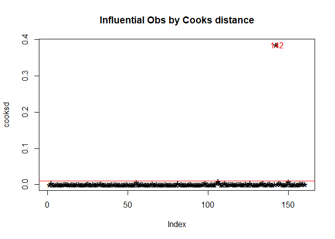
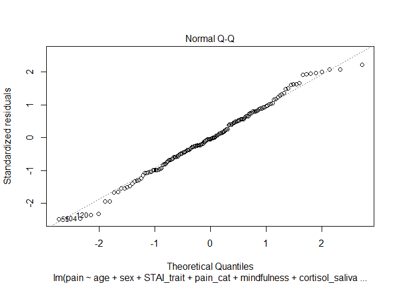

In this lab assignment you are going to work with (simulated) data related to perioperative pain and its psychological and hormonal predictors. In the assignment you will assess the added benefit of including some psychological and hormonal predictors to the already established demographic predictors of pain.

In this assignment you will set up a hierarchical regression model to predict postoperative pain after wisdom tooth surgery. 

# Research problem

The amount of pain experienced around and after surgeries are highly variable between and within individuals. In order to improve surgical pain management regimens we need to understand what influences pain around surgical procedures and predict the amount of pain an individual will experience.

Your first study in this area is related to assessing the influence of trait and state psychological measures on pain, and to see whether taking into account these variables can improve our understanding of postoperative pain.

# Procedures and measures

Use the data file called ‘assignment_3_dataset’, from the 'data/' folder.

You have collected data from 160 adults who were scheduled to undergo surgical extraction of the third mandibular molar (wisdom tooth surgery). Patients filled out a form in the waiting room before their surgery. The form contained questions about their sex, age, and weight, and psychological questionnaires assessing anxiety, pain catastrophizing, and mindfulness (see descriptions below). You also got blood samples and saliva samples from participants in the waiting room 5 minutes before their operations to determine the serum (a component of the blood) and salivary cortisol levels of participants. Participants were contacted 5 hours after the surgery to see how much pain they were experiencing. The __level of pain__ at that moment was recorded using a numerical rating scale using a __scale of 0 to 10__, where 0 means “no pain” and 10 means “worst pain I can imagine”. 

__The State Trait Anxiety Inventory:__ T measures trait anxiety on a scale of 20 to 80, higher scores mean higher anxiety. Anxiety has been found in many studies to positively correlate with the level of pain experienced. This is __variable STAI_trait__ in the dataset.

__The Pain Catastrophizing Scale__ measures the extent of pain catastrophizing, which is characterized by a tendency to magnify the threat value of a pain stimulus and to feel helpless in the presence of pain, as well as by a relative inability to prevent or inhibit pain-related thoughts in anticipation of, during, or following a painful event. The total score on this scale ranges from 0 to 52, higher scores mean higher catastrophizing. Pain catastrophizing is one of the well-established predictors of clinical pain. This is __variable pain_cat__ in the dataset.

__The Mindful Attention Awareness Scale (MAAS)__ measures dispositional mindfulness, which may be described as a tendency to turn attention to present-moment experiences in an open, non-judgmental way. The MAAS total score ranges from 1 to 6 (an average of the item scores), with higher scores representing higher dispositional mindfulness. Trait mindfulness has been theorized to serve as a protective factor against pain, as the individual would be more objective about their pain experience and tend to associate less discomfort, despair, and hopelessness to the pain-related sensations. This is __variable mindfulness__ in the dataset.

__Cortisol__ is a stress hormone associated with acute and chronic stress. Cortisol levels are thought to be positively associated with pain experience. Cortisol can be __measured from both blood and the saliva__, although, serum cortisol is often regarded in medical research as more reliably related to stress (serum is a component of the blood plasma). These are __variables cortisol_serum__, and __cortisol_saliva__ in the dataset.

# Research question

Previous studies and meta-analyses showed that age and sex are often predictors of pain (age is negatively associated with pain, while sex is a predictor more dependent on the type of the procedure). You would like to determine the extent to which taking into account psychological and hormonal variables aside from the already used demographic variables would improve our understanding of postoperative pain.

To answer this research question you will __need to compare two models__ (with a hierarchical regression). The __simpler model__ should contain __age and sex as predictors of pain__, while the __more complex model__ should contain the __predictors: age, sex, STAI, pain catastrophizing, mindfulness, and cortisol measures__. Notice that the predictors used in the simpler model are a subset of the predictors used in more complex model. __You will have to do model comparison to assess whether substantial new information was gained about pain in the more complex model compared to the simpler model.__  

# What to report

As usual, before you can interpret your model, you will need to run data and model diagnostics. First, check the variables included in the more complex model (age, sex, STAI, pain catastrophizing, mindfulness, and cortisol measures as predictors, and pain as an outcome) for __coding errors__, and the model itself for __influential outliers__ (for example using Cook’s distance). Furthermore, check the final model to see if the __assumptions of linear regression hold true__, that is, __normality__ (of the residuals), __linearity__ (of the relationship), __homogeneity of variance__ (also called homoscedasticity) and that there is no excess __multicollinearity__ (“uncorrelated predictors” in Navarro’s words). If you find anything amiss during these checks, make the appropriate decision or correction and report your findings and actions in your report. 

__Note:__ If you do any changes, such as exclude cases, or exclude predictors from the model, you will have to re-run the above checks for your final data and model.

Report the results of the simpler model and the more complex model. For both models you should report the model test statistics (adj.R2, F, df, and p value). Also, report the statistics describing the coefficients of the predictors in a table format (unstandardized regression coefficients and 95% confidence intervals, standardized regression coefficients (B and Beta values), and p values).

Write up the regression equation of the more complex model in the form of 𝑌 = 𝑏0 + 𝑏1 ∗ X1 + 𝑏2 ∗ X2 +…+ bn * Xn, in which you use the actual regression coefficients of your models. (b0 stands for the intercept and b1, b2 … bn stand for the model coefficients for each of the predictors, and X1, X2, … Xn denote the predictors).

Compare the two models in terms of how much variance they explain of pain’s variability in the sample. Report Akaike information criterion (AIC) for both models and the F test statistic and p value of the likelihood ratio test comparing the two models.

# What to discuss

In your discussion of the findings, briefly interpret the results of the above analyses, and indicate whether you think that anything was gained by including the psychological and hormone measures in the model.

# Solution

## Read the data

Read the dataset used in this assignment. Pay attention to the extension of the datafile.


```r
library(readxl)
library(tidyverse)
```

```
## -- Attaching packages --------------------------------------- tidyverse 1.3.0 --
```

```
## v ggplot2 3.3.3     v purrr   0.3.4
## v tibble  3.1.1     v dplyr   1.0.6
## v tidyr   1.1.3     v stringr 1.4.0
## v readr   1.4.0     v forcats 0.5.1
```

```
## Warning: package 'tibble' was built under R version 4.0.5
```

```
## Warning: package 'dplyr' was built under R version 4.0.5
```

```
## -- Conflicts ------------------------------------------ tidyverse_conflicts() --
## x dplyr::filter() masks stats::filter()
## x dplyr::lag()    masks stats::lag()
```

```r
library(psych)
```

```
## Warning: package 'psych' was built under R version 4.0.5
```

```
## 
## Attaching package: 'psych'
```

```
## The following objects are masked from 'package:ggplot2':
## 
##     %+%, alpha
```

```r
library(car)
```

```
## Warning: package 'car' was built under R version 4.0.5
```

```
## Loading required package: carData
```

```
## 
## Attaching package: 'car'
```

```
## The following object is masked from 'package:psych':
## 
##     logit
```

```
## The following object is masked from 'package:dplyr':
## 
##     recode
```

```
## The following object is masked from 'package:purrr':
## 
##     some
```

```r
library(broom)
library(DT)
```

```
## Warning: package 'DT' was built under R version 4.0.5
```

```r
pain <- read_excel("E:/Google Drive UMM/PhD ELTE/Semester 2/R programming/public_r_data_analysis_2021_fall-master/public_r_data_analysis_2021_fall-master/data/assignment_3_dataset.xlsx")
```

## Data and model diagnostics 
### Data diagnostics
#### Descriptives of the variables

Run an exploratory data analysis (EDA) to investigate the dataset.


```r
glimpse(pain)
```

```
## Rows: 160
## Columns: 12
## $ ID               <chr> "ID_1", "ID_2", "ID_3", "ID_4", "ID_5", "ID_6", "ID_7~
## $ pain             <dbl> 5, 4, 5, 7, 4, 6, 4, 5, 4, 5, 6, 3, 4, 5, 7, 4, 4, 4,~
## $ sex              <chr> "female", "female", "female", "female", "male", "fema~
## $ age              <dbl> 38, 36, 51, 39, 48, 45, 45, 35, 39, 33, 46, 42, 36, 4~
## $ STAI_trait       <dbl> 39, 46, 49, 48, 36, 37, 34, 39, 31, 38, 37, 35, 37, 3~
## $ pain_cat         <dbl> 25, 31, 32, 41, 26, 28, 22, 32, 27, 36, 26, 29, 26, 4~
## $ cortisol_serum   <dbl> 4.67, 6.01, 5.18, 6.65, 2.95, 4.32, 5.32, 5.26, 3.36,~
## $ cortisol_saliva  <dbl> 4.78, 6.71, 4.75, 6.68, 3.20, 4.36, 5.19, 5.53, 3.30,~
## $ mindfulness      <dbl> 3.83, 2.82, 3.93, 1.90, 4.39, 3.01, 4.97, 2.95, 3.43,~
## $ weight           <dbl> 62.14, 97.13, 78.96, 78.50, 76.88, 47.22, 55.10, 68.2~
## $ IQ               <dbl> 99, 71, 97, 97, 129, 115, 74, 98, 93, 76, 81, 103, 10~
## $ household_income <dbl> 52505, 64993, 68598, 47822, 100580, 43960, 65548, 436~
```

```r
summary(pain)
```

```
##       ID                 pain            sex                 age       
##  Length:160         Min.   : 1.000   Length:160         Min.   :24.00  
##  Class :character   1st Qu.: 4.000   Class :character   1st Qu.:38.00  
##  Mode  :character   Median : 5.000   Mode  :character   Median :41.00  
##                     Mean   : 5.194                      Mean   :40.74  
##                     3rd Qu.: 6.000                      3rd Qu.:44.00  
##                     Max.   :50.000                      Max.   :53.00  
##    STAI_trait       pain_cat     cortisol_serum  cortisol_saliva
##  Min.   :26.00   Min.   :14.00   Min.   :2.700   Min.   :2.530  
##  1st Qu.:37.00   1st Qu.:27.00   1st Qu.:4.268   1st Qu.:4.120  
##  Median :40.00   Median :30.00   Median :4.995   Median :5.035  
##  Mean   :40.09   Mean   :29.88   Mean   :4.941   Mean   :4.952  
##  3rd Qu.:43.00   3rd Qu.:32.25   3rd Qu.:5.633   3rd Qu.:5.753  
##  Max.   :52.00   Max.   :42.00   Max.   :7.110   Max.   :7.190  
##   mindfulness        weight            IQ         household_income
##  Min.   :1.000   Min.   :33.80   Min.   : 52.00   Min.   :  5548  
##  1st Qu.:2.595   1st Qu.:62.15   1st Qu.: 91.75   1st Qu.: 53489  
##  Median :3.115   Median :68.77   Median :101.00   Median : 72149  
##  Mean   :3.204   Mean   :68.57   Mean   :100.74   Mean   : 70426  
##  3rd Qu.:3.830   3rd Qu.:74.65   3rd Qu.:109.00   3rd Qu.: 87734  
##  Max.   :6.220   Max.   :97.13   Max.   :144.00   Max.   :139268
```

```r
colSums(is.na(pain))
```

```
##               ID             pain              sex              age 
##                0                0                0                0 
##       STAI_trait         pain_cat   cortisol_serum  cortisol_saliva 
##                0                0                0                0 
##      mindfulness           weight               IQ household_income 
##                0                0                0                0
```
I found one outlier in pain variable, thus I decide to remove it. Based on the data structure above, sex variable is need to be adjusted based on the nature of the data.

#### Correct coding errors

If you find values in the dataset during the EDA, that are not correct based on the provided descriptions of the variables of the dataset please correct them here.


```r
pain <- pain %>%
  mutate(sex = as.factor(sex)) %>% 
  mutate(sex = recode_factor(sex, "female" = "woman"))
summary(pain)
```

```
##       ID                 pain           sex          age          STAI_trait   
##  Length:160         Min.   : 1.000   woman:84   Min.   :24.00   Min.   :26.00  
##  Class :character   1st Qu.: 4.000   male :76   1st Qu.:38.00   1st Qu.:37.00  
##  Mode  :character   Median : 5.000              Median :41.00   Median :40.00  
##                     Mean   : 5.194              Mean   :40.74   Mean   :40.09  
##                     3rd Qu.: 6.000              3rd Qu.:44.00   3rd Qu.:43.00  
##                     Max.   :50.000              Max.   :53.00   Max.   :52.00  
##     pain_cat     cortisol_serum  cortisol_saliva  mindfulness   
##  Min.   :14.00   Min.   :2.700   Min.   :2.530   Min.   :1.000  
##  1st Qu.:27.00   1st Qu.:4.268   1st Qu.:4.120   1st Qu.:2.595  
##  Median :30.00   Median :4.995   Median :5.035   Median :3.115  
##  Mean   :29.88   Mean   :4.941   Mean   :4.952   Mean   :3.204  
##  3rd Qu.:32.25   3rd Qu.:5.633   3rd Qu.:5.753   3rd Qu.:3.830  
##  Max.   :42.00   Max.   :7.110   Max.   :7.190   Max.   :6.220  
##      weight            IQ         household_income
##  Min.   :33.80   Min.   : 52.00   Min.   :  5548  
##  1st Qu.:62.15   1st Qu.: 91.75   1st Qu.: 53489  
##  Median :68.77   Median :101.00   Median : 72149  
##  Mean   :68.57   Mean   :100.74   Mean   : 70426  
##  3rd Qu.:74.65   3rd Qu.:109.00   3rd Qu.: 87734  
##  Max.   :97.13   Max.   :144.00   Max.   :139268
```

### Model diagnostics
#### Build the more complex model

In order to test the more complex model for outliers and to test the assumptions first build the model.


```r
complex_mod <- lm(pain ~ age + sex + STAI_trait + pain_cat + mindfulness + cortisol_serum + cortisol_saliva, data = pain)
summary(complex_mod)
```

```
## 
## Call:
## lm(formula = pain ~ age + sex + STAI_trait + pain_cat + mindfulness + 
##     cortisol_serum + cortisol_saliva, data = pain)
## 
## Residuals:
##    Min     1Q Median     3Q    Max 
## -3.874 -1.072 -0.209  0.527 43.678 
## 
## Coefficients:
##                  Estimate Std. Error t value Pr(>|t|)
## (Intercept)     -2.009962   5.253537  -0.383    0.703
## age              0.001216   0.073615   0.017    0.987
## sexmale         -0.065604   0.641907  -0.102    0.919
## STAI_trait      -0.012388   0.085089  -0.146    0.884
## pain_cat         0.094006   0.087834   1.070    0.286
## mindfulness      0.073098   0.380279   0.192    0.848
## cortisol_serum  -0.048785   0.748362  -0.065    0.948
## cortisol_saliva  0.985497   0.767880   1.283    0.201
## 
## Residual standard error: 3.791 on 152 degrees of freedom
## Multiple R-squared:  0.08499,	Adjusted R-squared:  0.04285 
## F-statistic: 2.017 on 7 and 152 DF,  p-value: 0.05639
```

#### Checking for influential outliers

Check for outlier values in the model.


```r
cooksd <- cooks.distance(complex_mod)

plot(cooksd, pch="*", cex=2, main="Influential Obs by Cooks distance")
abline(h = 3*mean(cooksd, na.rm=T), col="red")
text(x=1:length(cooksd)+1, y=cooksd, labels=ifelse(cooksd>4*mean(cooksd, na.rm=T),names(cooksd),""), col="red")
```

<!-- -->

```r
pain_final <- pain[-142, ]

complex_mod_clean <- lm(pain ~ age + sex + STAI_trait + pain_cat + mindfulness + cortisol_serum + cortisol_saliva, data = pain_final)
summary(complex_mod_clean)
```

```
## 
## Call:
## lm(formula = pain ~ age + sex + STAI_trait + pain_cat + mindfulness + 
##     cortisol_serum + cortisol_saliva, data = pain_final)
## 
## Residuals:
##     Min      1Q  Median      3Q     Max 
## -3.2331 -0.7638 -0.0435  0.7736  2.9558 
## 
## Coefficients:
##                 Estimate Std. Error t value Pr(>|t|)   
## (Intercept)      1.35209    1.72405   0.784  0.43412   
## age             -0.02395    0.02413  -0.992  0.32256   
## sexmale          0.31689    0.21061   1.505  0.13451   
## STAI_trait      -0.02554    0.02788  -0.916  0.36119   
## pain_cat         0.09491    0.02878   3.298  0.00122 **
## mindfulness     -0.12942    0.12474  -1.038  0.30114   
## cortisol_serum   0.16662    0.24529   0.679  0.49801   
## cortisol_saliva  0.43773    0.25209   1.736  0.08452 . 
## ---
## Signif. codes:  0 '***' 0.001 '**' 0.01 '*' 0.05 '.' 0.1 ' ' 1
## 
## Residual standard error: 1.242 on 151 degrees of freedom
## Multiple R-squared:  0.3648,	Adjusted R-squared:  0.3354 
## F-statistic: 12.39 on 7 and 151 DF,  p-value: 1.768e-12
```

#### Checking assumptions

Check the normality assumption.


```r
plot(complex_mod_clean, which = 2)
```

<!-- -->
In the plot above we can see that the residuals are roughly normally distributed.


Check the linearity assumption.


```r
plot(complex_mod_clean, which = 1)
```

<!-- -->
The plot above indicates that there is no pattern in the residual plot. This suggests that we can assume linear relationship between the predictors and the outcome variables.

Check the homoscedasticty assumption (homogeneity of variance).


```r
plot(complex_mod_clean, which = 3)
```

<!-- -->
This plot shows if residuals are spread equally along the ranges of predictors. It can be seen that the variances of the residual points doesn't increase with the value of the fitted outcome variable, suggesting constant variances in the residuals errors (or heteroscedasticity).

Check the multicollinearity assumption.

(VIF above 5), or a VIF threshold of 3 is recommended in this paper: http://onlinelibrary.wiley.com/doi/10.1111/j.2041-210X.2009.00001.x/full

Some info about VIF: 
https://statisticalhorizons.com/multicollinearity
http://blog.minitab.com/blog/understanding-statistics/handling-multicollinearity-in-regression-analysis


```r
vif(complex_mod_clean)
```

```
##             age             sex      STAI_trait        pain_cat     mindfulness 
##        1.526619        1.140617        2.117744        1.948680        1.530694 
##  cortisol_serum cortisol_saliva 
##        6.065266        6.622923
```

```r
cor.test(pain_final$cortisol_serum, pain_final$cortisol_saliva)
```

```
## 
## 	Pearson's product-moment correlation
## 
## data:  pain_final$cortisol_serum and pain_final$cortisol_saliva
## t = 27.255, df = 157, p-value < 2.2e-16
## alternative hypothesis: true correlation is not equal to 0
## 95 percent confidence interval:
##  0.8769531 0.9323752
## sample estimates:
##      cor 
## 0.908583
```
VIF of cortisol_serum adn cortisol_saliva are above 5.Pearson's correlation coeficient between those variables are high, above 0.90. Thus, I decide to drop one variable which has lower effect from previous regression analysis which is cortisol_serum and keep cortisol_saliva.

### Making decision based on model diagnostics

If based on the assumption tests you decide to drop a predictor variable you should do that here. Create your updated model.


```r
complex_mod_final <- lm(pain ~ age + sex + STAI_trait + pain_cat + mindfulness + cortisol_saliva, data = pain_final)
summary(complex_mod_final)
```

```
## 
## Call:
## lm(formula = pain ~ age + sex + STAI_trait + pain_cat + mindfulness + 
##     cortisol_saliva, data = pain_final)
## 
## Residuals:
##     Min      1Q  Median      3Q     Max 
## -3.3045 -0.7315 -0.0800  0.7903  3.0861 
## 
## Coefficients:
##                 Estimate Std. Error t value Pr(>|t|)    
## (Intercept)      1.31715    1.72022   0.766 0.445052    
## age             -0.02236    0.02398  -0.933 0.352549    
## sexmale          0.31188    0.21011   1.484 0.139783    
## STAI_trait      -0.02736    0.02771  -0.987 0.325008    
## pain_cat         0.09927    0.02800   3.545 0.000522 ***
## mindfulness     -0.12800    0.12450  -1.028 0.305536    
## cortisol_saliva  0.58590    0.12613   4.645  7.3e-06 ***
## ---
## Signif. codes:  0 '***' 0.001 '**' 0.01 '*' 0.05 '.' 0.1 ' ' 1
## 
## Residual standard error: 1.24 on 152 degrees of freedom
## Multiple R-squared:  0.3629,	Adjusted R-squared:  0.3377 
## F-statistic: 14.43 on 6 and 152 DF,  p-value: 5.475e-13
```

#### Checking outliers of the updated model


```r
cooksd2 <- cooks.distance(complex_mod_final)

plot(cooksd2, pch="*", cex=2, main="Influential Obs by Cooks distance")
abline(h = 3*mean(cooksd2, na.rm=T), col="red")
text(x=1:length(cooksd2)+1, y=cooksd2, labels=ifelse(cooksd2>4*mean(cooksd2, na.rm=T),names(cooksd2),""), col="red")
```

<!-- -->

```r
pain_final <- pain_final[c(-105, -106, -149, -81),]

complex_mod_final <- lm(pain ~ age + sex + STAI_trait + pain_cat + mindfulness + cortisol_saliva, data = pain_final)
summary(complex_mod_final)
```

```
## 
## Call:
## lm(formula = pain ~ age + sex + STAI_trait + pain_cat + mindfulness + 
##     cortisol_saliva, data = pain_final)
## 
## Residuals:
##      Min       1Q   Median       3Q      Max 
## -2.81310 -0.70548 -0.05038  0.75213  2.52672 
## 
## Coefficients:
##                   Estimate Std. Error t value Pr(>|t|)    
## (Intercept)      0.3460135  1.6301662   0.212 0.832199    
## age             -0.0234512  0.0229198  -1.023 0.307890    
## sexmale          0.3472562  0.1992415   1.743 0.083430 .  
## STAI_trait      -0.0006069  0.0272043  -0.022 0.982233    
## pain_cat         0.1060612  0.0268573   3.949 0.000121 ***
## mindfulness     -0.0840213  0.1167905  -0.719 0.473017    
## cortisol_saliva  0.5016771  0.1231631   4.073 7.53e-05 ***
## ---
## Signif. codes:  0 '***' 0.001 '**' 0.01 '*' 0.05 '.' 0.1 ' ' 1
## 
## Residual standard error: 1.157 on 148 degrees of freedom
## Multiple R-squared:  0.3981,	Adjusted R-squared:  0.3737 
## F-statistic: 16.32 on 6 and 148 DF,  p-value: 2.274e-14
```

After re-checking the outliers, I still found several data which have high Cook's distance (data no 105, 106, 149, 81), thus I decide to remove those data from the final model.

#### Checking assumptions of the updated model

Normality assumption


```r
plot(complex_mod_final, which = 2)
```

<!-- -->

Linearity assumption


```r
plot(complex_mod_final, which = 1)
```

<!-- -->

Homoscedasticty assumption (homogeneity of variance)


```r
plot(complex_mod_final, which = 3)
```

<!-- -->

Multicollinearity assumption


```r
vif(complex_mod_final)
```

```
##             age             sex      STAI_trait        pain_cat     mindfulness 
##        1.550720        1.147090        2.226380        1.885904        1.534431 
## cortisol_saliva 
##        1.780388
```

The updated regression model has met the assumption of linearity, normality of residuals, homoscedasticity, and multicolinearity.

## Model comparison
Report the results of the simpler model and the more complex model. For both models you should report the model test statistics (adj.R2, F, df, and p value). Also, report the statistics describing the coefficients of the predictors in a table format (unstandardized regression coefficients and 95% confidence intervals, standardized regression coefficients (B and Beta values), and p values).

Write up the regression equation of the more complex model in the form of 𝑌 = 𝑏0 + 𝑏1 ∗ X1 + 𝑏2 ∗ X2 +…+ bn * Xn, in which you use the actual regression coefficients of your models. (b0 stands for the intercept and b1, b2 … bn stand for the model coefficients for each of the predictors, and X1, X2, … Xn denote the predictors).

Compare the two models in terms of how much variance they explain of pain’s variability in the sample. Report Akaike information criterion (AIC) for both models and the F test statistic and p value of the likelihood ratio test comparing the two models.

Create the simple model and get the results of the model that needs to be reported based on the What to report section. 


```r
simple_mod_final <- lm(pain ~ age + sex, data = pain_final)
summary(simple_mod_final) 
```

```
## 
## Call:
## lm(formula = pain ~ age + sex, data = pain_final)
## 
## Residuals:
##     Min      1Q  Median      3Q     Max 
## -3.6911 -0.9382  0.1370  0.9966  3.3949 
## 
## Coefficients:
##             Estimate Std. Error t value Pr(>|t|)    
## (Intercept)  8.38743    0.91977   9.119 4.25e-16 ***
## age         -0.08596    0.02235  -3.846 0.000176 ***
## sexmale      0.06433    0.22590   0.285 0.776210    
## ---
## Signif. codes:  0 '***' 0.001 '**' 0.01 '*' 0.05 '.' 0.1 ' ' 1
## 
## Residual standard error: 1.404 on 152 degrees of freedom
## Multiple R-squared:  0.0889,	Adjusted R-squared:  0.07691 
## F-statistic: 7.416 on 2 and 152 DF,  p-value: 0.0008454
```
All predictors simultaneously can predict pain, with F(2, 152) = 7.416, p < 0.01. All predictors could explain 8% variance of pain (R-squared=0.08). The equation for the model is: 
pain = 8.38 - 0.08 * age + 0.06 * sex

Create the more complex model based on the results of the model diagnostics. Also, get the results that needs to be reported based on the What to report section.


```r
complex_mod_final <- lm(pain ~ age + sex + STAI_trait + pain_cat + mindfulness + cortisol_saliva, data = pain_final)
summary(complex_mod_final)
```

```
## 
## Call:
## lm(formula = pain ~ age + sex + STAI_trait + pain_cat + mindfulness + 
##     cortisol_saliva, data = pain_final)
## 
## Residuals:
##      Min       1Q   Median       3Q      Max 
## -2.81310 -0.70548 -0.05038  0.75213  2.52672 
## 
## Coefficients:
##                   Estimate Std. Error t value Pr(>|t|)    
## (Intercept)      0.3460135  1.6301662   0.212 0.832199    
## age             -0.0234512  0.0229198  -1.023 0.307890    
## sexmale          0.3472562  0.1992415   1.743 0.083430 .  
## STAI_trait      -0.0006069  0.0272043  -0.022 0.982233    
## pain_cat         0.1060612  0.0268573   3.949 0.000121 ***
## mindfulness     -0.0840213  0.1167905  -0.719 0.473017    
## cortisol_saliva  0.5016771  0.1231631   4.073 7.53e-05 ***
## ---
## Signif. codes:  0 '***' 0.001 '**' 0.01 '*' 0.05 '.' 0.1 ' ' 1
## 
## Residual standard error: 1.157 on 148 degrees of freedom
## Multiple R-squared:  0.3981,	Adjusted R-squared:  0.3737 
## F-statistic: 16.32 on 6 and 148 DF,  p-value: 2.274e-14
```
All predictors simultaneously can predict pain, with F(6, 148) = 16.32, p < 0.001. All predictors could explain 39,81% variance of pain (R-squared=0.398). The equation for the model is: 
pain = 0.34 - 0.02 * age + 0.34 * sex - 0.01 * STAIT * 0.10 * pain_cat - 0.08 * mindfulness * + 0.50 * cortisol_saliva  

Compare the two models.

```r
model1 <- glance(simple_mod_final)
model2 <- glance(complex_mod_final)
comparison_mod <- model1 %>% 
  rbind(model2) %>% 
  mutate(model = c("simple", "complex")) %>%
  relocate(model)
datatable(comparison_mod)
```

```{=html}
<div id="htmlwidget-66132da4529606691a40" style="width:100%;height:auto;" class="datatables html-widget"></div>
<script type="application/json" data-for="htmlwidget-66132da4529606691a40">{"x":{"filter":"none","data":[["1","2"],["simple","complex"],[0.0888994252564463,0.398106988143367],[0.0769112597992944,0.373705920095125],[1.40444957339797,1.15684074649969],[7.415598789839,16.3151460155881],[0.000845357413614604,2.27390925886053e-14],[2,6],[-271.065813265759,-238.936360567972],[550.131626531517,493.872721135945],[562.305326999194,518.220122071299],[299.816747841095,198.06551588877],[152,148],[155,155]],"container":"<table class=\"display\">\n  <thead>\n    <tr>\n      <th> <\/th>\n      <th>model<\/th>\n      <th>r.squared<\/th>\n      <th>adj.r.squared<\/th>\n      <th>sigma<\/th>\n      <th>statistic<\/th>\n      <th>p.value<\/th>\n      <th>df<\/th>\n      <th>logLik<\/th>\n      <th>AIC<\/th>\n      <th>BIC<\/th>\n      <th>deviance<\/th>\n      <th>df.residual<\/th>\n      <th>nobs<\/th>\n    <\/tr>\n  <\/thead>\n<\/table>","options":{"columnDefs":[{"className":"dt-right","targets":[2,3,4,5,6,7,8,9,10,11,12,13]},{"orderable":false,"targets":0}],"order":[],"autoWidth":false,"orderClasses":false}},"evals":[],"jsHooks":[]}</script>
```
The model comparison is shown in the following table. In the simple model, sex and age explain 8% variance of of the pain (R=Squared = 0.08), with F(2, 152) = 7.416, p < 0.01. In the complex model, all predictors explain 39,8% variance of pain (R-squared=0.39) with F(6, 148) = 16.32, p < 0.001.. The AIC of complex model (AIC = 493.87) is lower compare to simple model (AIC = 550.13), thus this model is better explain the data. Thus, we can infer that by including psychological and hormonal variables in model aside from the already used demographic variables would improve our understanding of postoperative pain.

