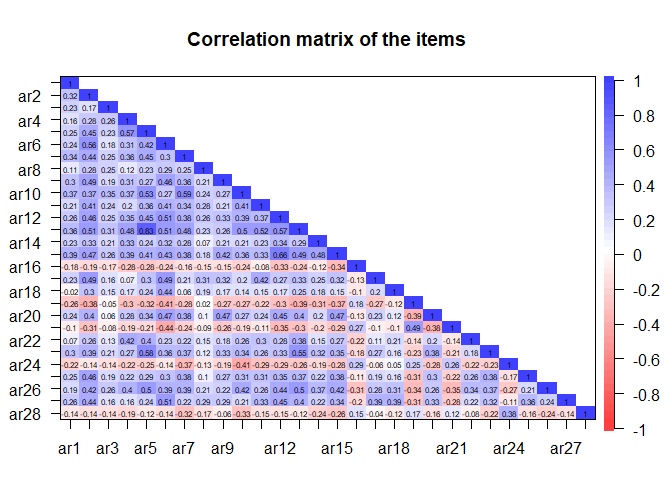
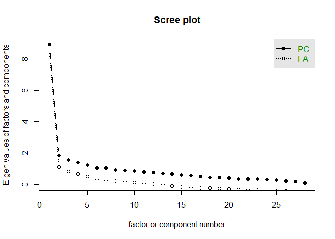
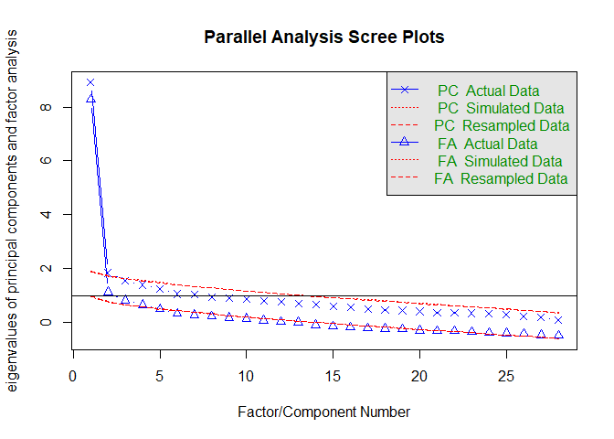
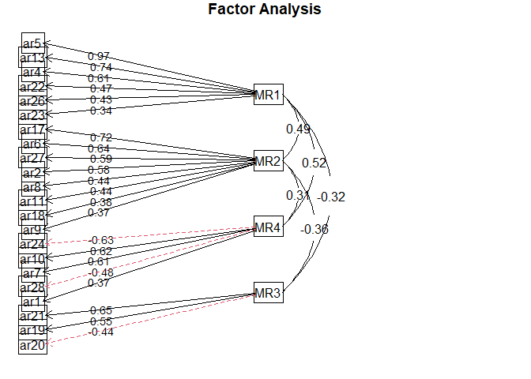

# Introduction

In this lab assignment you will need to explore the factor structure of the Animal Rights Scale, a scale containing 28 items to measure attitudes towards animal experimentation and animal rights. Imagine that you are a researcher who is interested in the underlying factors that govern attitudes towards animal rights and the use of animals for different purposes. You have gathered data using the Animal Rights Scale (ARS) from 154 individuals in an online survey. Your goal is to explore the underlying factors.

# Dataset

You can load the dataset from the 'data/' folder.

The dataset includes the responses of 154 individuals on the following variables:

__ar1-ar28__ contain the data from the 28 items of the ARS. Participants had to rate their agreement with each statement separately on a 1-5 Likert scale with the following anchors: 1 - strongly disagree, 2 – disagree, 3 - no opinion, 4 – agree, 5 - strongly agree.

The questions in the ARS were the following:

  * __ar 1.__ Humans have no right to displace wild animals by converting wilderness areas into farmlands, cities, and other things designed for people.
  * __ar 2.__ Animal research cannot be justified and should be stopped.
  * __ar 3.__ It is morally wrong to drink milk and eat eggs.
  * __ar 4.__ A human has no right to use a horse as a means of transportation (riding) or entertainment (racing).
  * __ar 5.__ It is wrong to wear leather jackets and pants.
  * __ar 6.__ Most medical research done on animals is unnecessary and invalid.
  * __ar 7.__ I have seriously considered becoming a vegetarian in an effort to save animal lives.
  * __ar 8.__ Pet owners are responsible for preventing their pets from killing other animals, such as cats killing mice or snakes eating live mice.
  * __ar 9.__ We need more regulations governing the use of animals in research.
  * __ar 10.__ It is morally wrong to eat beef and other "red" meat.
  * __ar 11.__ Insect pests (mosquitoes, cockroaches, flies, etc.) should be safely removed from the house rather than killed.
  * __ar 12.__ Animals should be granted the same rights as humans.
  * __ar 13.__ It is wrong to wear leather belts and shoes.
  * __ar 14.__ I would rather see humans die or suffer from disease than to see animals used in research.
  * __ar 15.__ Having extended basic rights to minorities and women, it is now time to extend them also to animals.
  * __ar 16.__ God put animals on Earth for man to use.
  * __ar 17.__ There are plenty of viable alternatives to the use of animals in biomedical and behavioral research.
  * __ar 18.__ Research on animals has little or no bearing on problems confronting people.
  * __ar 19.__ New surgical procedures and experimental drugs should be tested on animals before they are used on people.
  * __ar 20.__ I am very concerned about pain and suffering in animals.
  * __ar 21.__ Since many important questions cannot be answered by doing experiments on people, we are left with no alternatives but to do animal research.
  * __ar 22.__ It is a violation of an animal's rights to be held captive as a pet by a human.
  * __ar 23.__ It is wrong to wear animal fur (such as mink coats).
  * __ar 24.__ It is appropriate for humans to kill animals that destroy human property, for example, rats, mice, and pigeons.
  * __ar 25.__ Most cosmetics research done on animals is unnecessary and invalid.
  * __ar 26.__ It is morally wrong to eat chicken and fish.
  * __ar 27.__ Most psychological research done on animals is unnecessary and invalid.
  * __ar 28.__ Hunters play an important role in regulating the size of deer populations.

You can get more information about the ARS here: http://core.ecu.edu/psyc/wuenschk/Animals/Anim-Rights-Q.htm

And also here: 

Wuensch, K. L., Jenkins, K. W., & Poteat, G. M. (2002). Misanthropy, idealism, and attitudes towards animals. _Anthrozoös, 15_, 139-149

Sharp, H. W., Wuensch, K. L., Eppler, M. A., & Harju, B. L. (2006, April). Narcissism, empathy, and attitudes towards animals. In _Spring Conference of the North Carolina Psychological Association and North Carolina Psychological Foundation, Charlotte, NC._

A few other questions were also included in the questionnaire:

__sex:__ The self reported sex of the participant. This is a categorical variable coded as 1 – female, 2 – male.

__party:__ Self reported party affiliation of the person (in the USA). This is a categorical variable coded as 1 - democrat, 2 - republican, 3 - other, 4 – none.

__liberal:__ This variable contains data from a question: please rate how conservative or liberal are you. On a scale of 1-5 where 1 means very conservative and 5 means very liberal. 

# Task

Your task is to do an exploratory factor analysis using the items in the ARS to identify the latent factors underlying the responses. First of all, start by exploring the descriptive statistics and correlations in the dataset to get more familiar with it and to identify any unusual cases or coding errors. Make sure to check the assumptions of factorability and multivariate normality and address them as necessary. You have a free hand in choosing the extraction and rotation methods. You can also exclude items if you see this necessary, but __do not exclude more than 8 items__ in this assignment. (If you still find the average communality below expectations, just report this as a limitation in your report, but continue the task). Keep notes of the steps and different setting/methods you tried during the exploratory factor analysis. 

_(The factor structure of this scale has been previously analyzed by others. If you want, you can use these previous research reports to guide your exploration, or you can ignore them. In any case, do not base your decisions solely on these research reports. Do your own work and base your decisions on your own findings on this dataset.)_

When you have arrived at the factor structure you consider final, give names to the factors you derived from the data. Save the factor scores and build a linear regression model to predict how conservative or liberal participants are (using the “liberal” variable as a dependent variable) with the factors you identified as the predictors.

__To simplify the task you can regard all likert scale variables (ar1-28 and liberal) as if they were continuous variables!__ So you do not have to use polychoric correlation for factor analysis and you do not have to perform ordinal regression.

# What to report

Report if you have found any unusual things (outliers or coding errors) in the dataset and how you dealt with them. Report the results of the assumption checks for factorability and multivariate normality. If any of the assumptions were found to be violated, report what was done to handle that. 

Report the number of factors you chose to keep in your final factor structure and give a rationale why. Include the parallel analysis scree plot in your report. Report the post-extraction eignevalues, variance explained, and cumulative variance explained by the final factors in a table format. Report the average post-extraction communality of the items. 

Report which rotation you chose to use (if any) and why. Report the final factor structure including the factor names. Also, report the post-extraction commonalities of each item and the loadings of the items on the final factors in a table format. (These can be reported in the same table). This table should contain the loadings that you used to interpret the factors in your analysis (e.g. the loadings listed in the rotated factor matrix or the pattern matrix). The table should be structured in a way to help the reader easily see which items load high on which factors.

Report if you have excluded any items, and give a rationale for each. 

Report which factor (if any) was the most influential predictor of how liberal a person is in the linear regression model and explain what do you base this assessment on.

# What to discuss

Talk about the limitations of your study and findings. 

# Solution

## Read the data

Read the Animal Rights Scale (ARQ) dataset from the 'data/' folder. Pay attention to the extension.


```r
animal <- read.csv("E:/Google Drive UMM/PhD ELTE/Semester 2/R programming/public_r_data_analysis_2021_fall-master/public_r_data_analysis_2021_fall-master/data/assignment_5_dataset.csv")
```

## EDA


```r
str(animal)
```

```
## 'data.frame':	154 obs. of  31 variables:
##  $ ar1    : int  4 2 4 2 5 3 3 3 5 5 ...
##  $ ar2    : int  1 1 1 2 3 1 3 2 5 5 ...
##  $ ar3    : int  1 1 1 1 1 1 1 2 1 3 ...
##  $ ar4    : int  1 2 2 1 3 1 2 2 2 3 ...
##  $ ar5    : int  1 1 1 2 3 1 2 2 3 3 ...
##  $ ar6    : int  1 1 2 2 2 1 3 3 4 5 ...
##  $ ar7    : int  1 1 1 1 4 1 1 2 3 5 ...
##  $ ar8    : int  1 1 1 2 1 1 3 3 1 2 ...
##  $ ar9    : int  1 2 3 2 5 1 3 4 5 5 ...
##  $ ar10   : int  1 1 1 2 2 1 2 2 1 3 ...
##  $ ar11   : int  1 1 1 2 1 1 2 2 1 5 ...
##  $ ar12   : int  1 2 3 2 3 1 4 3 4 3 ...
##  $ ar13   : int  1 1 2 1 3 1 2 2 3 3 ...
##  $ ar14   : int  1 1 1 1 2 1 2 2 2 2 ...
##  $ ar15   : int  1 1 2 2 3 1 3 3 3 4 ...
##  $ ar16   : int  2 4 4 2 3 5 3 3 3 2 ...
##  $ ar17   : int  2 2 2 4 3 2 3 4 4 5 ...
##  $ ar18   : int  1 3 2 2 1 1 2 2 3 3 ...
##  $ ar19   : int  5 4 4 5 3 5 4 3 3 1 ...
##  $ ar20   : int  1 3 4 4 5 5 4 4 4 5 ...
##  $ ar21   : int  4 4 4 5 3 4 4 3 2 1 ...
##  $ ar22   : int  1 3 2 2 1 1 2 2 1 2 ...
##  $ ar23   : int  1 2 2 4 4 1 3 2 3 4 ...
##  $ ar24   : int  4 3 4 4 3 4 3 4 4 2 ...
##  $ ar25   : int  2 3 4 3 5 1 3 2 5 5 ...
##  $ ar26   : int  1 1 1 2 2 1 2 2 3 2 ...
##  $ ar27   : int  3 4 2 2 1 1 3 2 3 3 ...
##  $ ar28   : int  5 5 4 4 5 5 4 4 5 2 ...
##  $ sex    : int  1 1 1 2 1 2 1 1 1 1 ...
##  $ party  : int  4 1 1 2 4 2 4 4 2 1 ...
##  $ liberal: int  3 3 3 3 4 2 3 3 3 4 ...
```

```r
summary(animal)
```

```
##       ar1             ar2             ar3             ar4            ar5       
##  Min.   :1.000   Min.   :1.000   Min.   :1.000   Min.   :1.00   Min.   :1.000  
##  1st Qu.:2.000   1st Qu.:2.000   1st Qu.:1.000   1st Qu.:1.00   1st Qu.:1.000  
##  Median :3.000   Median :2.000   Median :1.000   Median :2.00   Median :2.000  
##  Mean   :3.211   Mean   :2.582   Mean   :1.455   Mean   :1.74   Mean   :1.981  
##  3rd Qu.:4.000   3rd Qu.:3.000   3rd Qu.:2.000   3rd Qu.:2.00   3rd Qu.:2.000  
##  Max.   :5.000   Max.   :5.000   Max.   :4.000   Max.   :4.00   Max.   :5.000  
##  NA's   :2       NA's   :1                                                     
##       ar6             ar7             ar8             ar9             ar10     
##  Min.   :1.000   Min.   :1.000   Min.   :1.000   Min.   :1.000   Min.   :1.00  
##  1st Qu.:2.000   1st Qu.:1.000   1st Qu.:1.000   1st Qu.:3.000   1st Qu.:1.00  
##  Median :2.000   Median :2.000   Median :2.000   Median :4.000   Median :2.00  
##  Mean   :2.377   Mean   :2.065   Mean   :2.045   Mean   :3.448   Mean   :1.85  
##  3rd Qu.:3.000   3rd Qu.:2.000   3rd Qu.:2.000   3rd Qu.:4.000   3rd Qu.:2.00  
##  Max.   :5.000   Max.   :5.000   Max.   :5.000   Max.   :5.000   Max.   :5.00  
##                                                                  NA's   :1     
##       ar11            ar12            ar13            ar14      
##  Min.   :1.000   Min.   :1.000   Min.   :1.000   Min.   :1.000  
##  1st Qu.:1.000   1st Qu.:2.000   1st Qu.:1.000   1st Qu.:1.000  
##  Median :2.000   Median :3.000   Median :2.000   Median :1.000  
##  Mean   :1.916   Mean   :2.571   Mean   :1.909   Mean   :1.529  
##  3rd Qu.:2.000   3rd Qu.:3.000   3rd Qu.:2.000   3rd Qu.:2.000  
##  Max.   :5.000   Max.   :5.000   Max.   :5.000   Max.   :5.000  
##                                                  NA's   :1      
##       ar15            ar16            ar17            ar18      
##  Min.   :1.000   Min.   :1.000   Min.   :1.000   Min.   :1.000  
##  1st Qu.:2.000   1st Qu.:2.000   1st Qu.:2.000   1st Qu.:2.000  
##  Median :2.000   Median :3.000   Median :3.000   Median :2.000  
##  Mean   :2.409   Mean   :3.097   Mean   :2.961   Mean   :2.039  
##  3rd Qu.:3.000   3rd Qu.:4.000   3rd Qu.:4.000   3rd Qu.:2.000  
##  Max.   :5.000   Max.   :5.000   Max.   :5.000   Max.   :5.000  
##                                                  NA's   :1      
##       ar19            ar20          ar21            ar22            ar23      
##  Min.   :1.000   Min.   :1.0   Min.   :1.000   Min.   :1.000   Min.   :1.000  
##  1st Qu.:3.000   1st Qu.:3.0   1st Qu.:3.000   1st Qu.:1.000   1st Qu.:2.000  
##  Median :4.000   Median :4.0   Median :4.000   Median :2.000   Median :2.000  
##  Mean   :3.595   Mean   :3.5   Mean   :3.584   Mean   :1.961   Mean   :2.578  
##  3rd Qu.:4.000   3rd Qu.:4.0   3rd Qu.:4.000   3rd Qu.:2.000   3rd Qu.:3.000  
##  Max.   :5.000   Max.   :5.0   Max.   :5.000   Max.   :5.000   Max.   :5.000  
##  NA's   :1                                     NA's   :1                      
##       ar24            ar25            ar26           ar27            ar28      
##  Min.   :1.000   Min.   :1.000   Min.   :1.00   Min.   :1.000   Min.   :1.000  
##  1st Qu.:2.000   1st Qu.:3.000   1st Qu.:1.00   1st Qu.:2.000   1st Qu.:3.000  
##  Median :3.000   Median :3.000   Median :2.00   Median :2.000   Median :4.000  
##  Mean   :3.045   Mean   :3.344   Mean   :1.76   Mean   :2.416   Mean   :3.708  
##  3rd Qu.:4.000   3rd Qu.:4.000   3rd Qu.:2.00   3rd Qu.:3.000   3rd Qu.:4.000  
##  Max.   :5.000   Max.   :5.000   Max.   :5.00   Max.   :5.000   Max.   :5.000  
##                                                                                
##       sex           party          liberal     
##  Min.   :1.00   Min.   :1.000   Min.   :1.000  
##  1st Qu.:1.00   1st Qu.:2.000   1st Qu.:2.000  
##  Median :1.00   Median :4.000   Median :3.000  
##  Mean   :1.19   Mean   :2.908   Mean   :2.908  
##  3rd Qu.:1.00   3rd Qu.:4.000   3rd Qu.:3.000  
##  Max.   :2.00   Max.   :4.000   Max.   :5.000  
##  NA's   :1      NA's   :1       NA's   :1
```

```r
describe(animal)
```

```
##         vars   n mean   sd median trimmed  mad min max range  skew kurtosis
## ar1        1 152 3.21 1.12      3    3.20 1.48   1   5     4 -0.05    -0.90
## ar2        2 153 2.58 1.12      2    2.50 1.48   1   5     4  0.64    -0.30
## ar3        3 154 1.45 0.71      1    1.33 0.00   1   4     3  1.77     3.31
## ar4        4 154 1.74 0.71      2    1.66 1.48   1   4     3  0.63    -0.06
## ar5        5 154 1.98 0.90      2    1.88 1.48   1   5     4  0.80     0.23
## ar6        6 154 2.38 0.98      2    2.30 0.74   1   5     4  0.79     0.31
## ar7        7 154 2.06 1.10      2    1.90 1.48   1   5     4  1.13     0.67
## ar8        8 154 2.05 1.01      2    1.91 1.48   1   5     4  0.94     0.32
## ar9        9 154 3.45 1.08      4    3.51 1.48   1   5     4 -0.55    -0.36
## ar10      10 153 1.85 0.89      2    1.71 1.48   1   5     4  1.36     2.22
## ar11      11 154 1.92 1.05      2    1.74 1.48   1   5     4  1.07     0.42
## ar12      12 154 2.57 1.05      3    2.55 1.48   1   5     4  0.20    -0.63
## ar13      13 154 1.91 0.88      2    1.81 1.48   1   5     4  0.92     0.81
## ar14      14 153 1.53 0.74      1    1.40 0.00   1   5     4  1.58     3.18
## ar15      15 154 2.41 1.01      2    2.37 1.48   1   5     4  0.15    -0.77
## ar16      16 154 3.10 1.01      3    3.06 1.48   1   5     4  0.11    -0.45
## ar17      17 154 2.96 0.94      3    2.96 1.48   1   5     4  0.03    -0.54
## ar18      18 153 2.04 0.79      2    1.96 0.00   1   5     4  0.98     1.49
## ar19      19 153 3.59 0.96      4    3.64 1.48   1   5     4 -0.52    -0.22
## ar20      20 154 3.50 0.99      4    3.54 1.48   1   5     4 -0.43    -0.21
## ar21      21 154 3.58 0.97      4    3.63 0.00   1   5     4 -0.66    -0.29
## ar22      22 153 1.96 0.87      2    1.86 1.48   1   5     4  0.98     1.16
## ar23      23 154 2.58 1.19      2    2.52 1.48   1   5     4  0.36    -0.85
## ar24      24 154 3.05 1.00      3    3.07 1.48   1   5     4 -0.17    -0.73
## ar25      25 154 3.34 1.04      3    3.35 1.48   1   5     4 -0.20    -0.61
## ar26      26 154 1.76 0.90      2    1.61 1.48   1   5     4  1.39     2.09
## ar27      27 154 2.42 0.93      2    2.37 1.48   1   5     4  0.48    -0.13
## ar28      28 154 3.71 1.08      4    3.81 1.48   1   5     4 -0.75    -0.18
## sex       29 153 1.19 0.39      1    1.11 0.00   1   2     1  1.57     0.46
## party     30 153 2.91 1.24      4    3.01 0.00   1   4     3 -0.45    -1.51
## liberal   31 153 2.91 0.85      3    2.88 1.48   1   5     4  0.24     0.12
##           se
## ar1     0.09
## ar2     0.09
## ar3     0.06
## ar4     0.06
## ar5     0.07
## ar6     0.08
## ar7     0.09
## ar8     0.08
## ar9     0.09
## ar10    0.07
## ar11    0.08
## ar12    0.08
## ar13    0.07
## ar14    0.06
## ar15    0.08
## ar16    0.08
## ar17    0.08
## ar18    0.06
## ar19    0.08
## ar20    0.08
## ar21    0.08
## ar22    0.07
## ar23    0.10
## ar24    0.08
## ar25    0.08
## ar26    0.07
## ar27    0.08
## ar28    0.09
## sex     0.03
## party   0.10
## liberal 0.07
```
Looking at the summary of each variable allowed us to identify any initial abnormal values. None of the numeric variables had any apparent outliers. 

## Data manipulation

Recode the sex and party variables as factor type variables with the following levels:
  * sex: 1 - male, 2 - female
  * party: 1 - democrat, 2 - republican, 3 - other, 4 - none


```r
animal_recode <- animal %>% 
  mutate(sex = recode_factor(sex, `1` = "Male", `2`="Female")) %>% 
  mutate(party = recode_factor(party, `1`="democrat", `2`="republican", `3`="other", `4`="none"))

animal_recode
```

```
##     ar1 ar2 ar3 ar4 ar5 ar6 ar7 ar8 ar9 ar10 ar11 ar12 ar13 ar14 ar15 ar16 ar17
## 1     4   1   1   1   1   1   1   1   1    1    1    1    1    1    1    2    2
## 2     2   1   1   2   1   1   1   1   2    1    1    2    1    1    1    4    2
## 3     4   1   1   2   1   2   1   1   3    1    1    3    2    1    2    4    2
## 4     2   2   1   1   2   2   1   2   2    2    2    2    1    1    2    2    4
## 5     5   3   1   3   3   2   4   1   5    2    1    3    3    2    3    3    3
## 6     3   1   1   1   1   1   1   1   1    1    1    1    1    1    1    5    2
## 7     3   3   1   2   2   3   1   3   3    2    2    4    2    2    3    3    3
## 8     3   2   2   2   2   3   2   3   4    2    2    3    2    2    3    3    4
## 9     5   5   1   2   3   4   3   1   5    1    1    4    3    2    3    3    4
## 10    5   5   3   3   3   5   5   2   5    3    5    3    3    2    4    2    5
## 11    3   2   1   2   2   2   2   1   4    1    3    3    2    4    4    3    4
## 12    2   2   1   1   1   1   2   1   2    1    1    3    1    1    1    2    2
## 13    2   4   2   3   2   4   2   2   5    2    1    4    2    2    4    3    2
## 14    3   2   1   1   1   2   1   1   5    1    1    2    1    1    2    2    2
## 15    4   4   2   2   2   2   3   2   3    2    2    2    2    2    3    2    3
## 16    2   2   1   1   1   3   1   3   3    1    1    1    1    1    1    3    3
## 17    1   1   1   1   2   1   1   2   1    1    1    1    1    1    1    3    2
## 18    3   2   2   2   2   2   3   2   4    2    2    2    2    1    2    3    2
## 19    3   3   1   1   1   2   2   2   3    1    1    1    1    1    1    4    4
## 20    3   2   1   3   3   2   1   2   4    2    1    2    1    1    2    2    3
## 21    1   1   1   1   1   2   2   1   3    1    2    3    1    1    3    3    2
## 22    5   5   1   1   4   4   4   2   4    4    4    2    4    2    4    2    4
## 23    5   3   2   3   2   3   2   2   3    2    1    4    2    4    5    1    3
## 24    2   2   2   2   2   2   2   2   4    2    2    2    2    2    2    3    2
## 25    3   1   1   1   1   3   1   3   4    1    1    3    1    1    1    2    3
## 26    3   2   1   2   2   2   2   1   5    1    1    1    1    1    1    5    3
## 27    4   2   1   2   2   2   2   2   4    2    1    2    2    1    2    4    2
## 28    5   2   1   1   1   3   1   1   4    1    1    3    1    1    3    3    3
## 29    3   2   2   2   2   2   2   2   4    2    1    4    2    1    2    3    4
## 30    2   2   1   2   2   2   2   2   4    2    3    2    2    1    1    3    3
## 31    4   2   2   2   2   2   2   2   4    2    2    1    2    1    2    5    4
## 32    3   3   2   3   2   3   1   2   4    2    2    4    2    2    3    3    3
## 33    4   2   2   2   2   2   1   2   4    2    1    3    2    1    4    2    2
## 34    1   1   1   4   4   3   2   1   3    2    2    4    3    2    3    1    1
## 35    5   1   1   1   4   4   1   4   4    4    4    4    4    1    2    3    3
## 36    4   4   2   2   3   3   2   2   5    2    2    3    3    2    4    1    4
## 37    4   2   2   3   3   2   2   2   4    2    2    3    3    2    2    3    2
## 38    4   2   1   1   1   2   1   1   2    1    1    2    1    1    2    4    3
## 39    2   2   1   1   1   1   1   2   4    1    1    3    1    1    3    3    1
## 40    3   3   2   2   2   3   2   2   4    2    2    3    2    2    3    3    3
## 41    3   3   1   1   1   3   2   1   4    2    1    2    1    2    1    3    3
## 42    4   2   1   2   3   2   2   1   2    3    2    3    3    1    3    3    3
## 43    3   3   1   1   1   3   2   1   5    1    1    4    1    2    4    3    4
## 44    3   4   1   2   2   4   2   2   4    1    1    3    2    2    3    3    4
## 45    4   2   2   1   1   2   1   2   3    1    4    3    1    1    3    4    3
## 46    3   1   1   1   1   1   1   1   4    1    1    2    1    1    1    3    1
## 47    3   2   1   1   1   2   1   1   2    1    1    2    1    1    2    3    2
## 48    5   2   1   3   4   2   4   1   4    4    2    4    4    2    4    1    3
## 49    2   2   2   2   2   2   2   2   4    2    2    2    2    2    2    3    3
## 50    2   3   2   2   2   2   2   2   4    2    2    2    2    1    2    3    2
## 51    2   2   1   1   1   1   1   2   3    1    1    3    1    1    3    3    4
## 52    5   5   2   2   4   5   4   3   5    2    2    5    5    2    4    2    5
## 53    4   5   2   2   3   3   3   4   5    2    1    5    3    3    4    4    4
## 54    2   3   1   1   2   3   1   1   4    1    3    2    1    1    2    2    4
## 55    2   2   2   2   2   2   2   2   3    3    3    3    2    2    2    2    3
## 56    2   1   1   1   1   1   1   2   3    1    1    2    1    1    3    4    3
## 57    5   2   1   2   1   2   5   1   4    5    1    2    1    2    2    5    2
## 58    1   1   1   1   1   1   1   1   1    1    1    1    1    1    1    2    3
## 59    4   2   1   1   1   1   1   1   1    1    1    2    1    1    1    4    3
## 60    4   2   1   1   2   1   2   1   4    1    1    1    1    2    1    4    2
## 61    3   2   2   2   2   4   2   2   4    2    4    2    2    2    2    5    4
## 62    2   2   1   2   2   2   2   1   2    1    1    1    1    1    1    4    2
## 63    4   2   1   3   2   2   1   2   4    2    1    3    2    1    4    3    3
## 64    3   4   2   3   2   4   3   2   5    3    3    3    2    2    3    3    4
## 65    2   2   1   1   1   2   1   2   4    1    3    1    1    1    2    5    3
## 66    4   2   1   2   2   2   1   4   4    1    2    1    2    1    2    2    4
## 67    3   3   1   1   2   2   1   3   4    1    1    1    1    1    1    5    4
## 68    4   3   1   2   2   2   2   3   3    2    4    3    2    1    2    4    2
## 69    2   2   1   1   1   2   2   2   2    1    1    2    1    1    2    3    2
## 70    2   2   1   2   2   2   2   2   2    2    1    2    2    1    2    2    2
## 71    4   5   1   2   2   2   2   4   5    2    3    1    2    2    3    2    4
## 72    3   1   1   1   1   1   3   2   3    1    1    2    1    3    3    3    3
## 73    2   1   1   1   1   2   5   3   2    2    1    1    1    2    2    4    2
## 74    3   3   2   2   3   2   3   3   4    2    3    3    2    3    3    3    4
## 75    4   2   4   1   2   2   2   3   3    2    3    3    2    3    3    3    4
## 76    4   4   2   2   3   4   2   2   5    2    3    4    3    1    3    2    4
## 77    3   3   1   2   2   2   2   3   4    2    2    2    2    1    2    3    3
## 78    2   1   2   2   2   3   1   1   3    1    1    1    2    1    1    3    3
## 79    2   2   1   1   1   3   3   5   3    1    1    3    1    1    1    1    2
## 80    2   1   1   1   1   1   2   1   1    1    1    2    1    1    2    4    1
## 81    4   2   1   2   1   2   1   1   4    1    3    2    1    1    2    2    2
## 82    2   2   2   2   4   2   5   4   5    3    2    4    2    1    3    4    3
## 83    4   2   1   1   1   1   1   1   2    1    2    2    1    1    1    5    2
## 84    3   2   1   2   1   2   2   2   3    2    4    3    2    1    3    4    2
## 85    3   3   1   2   2   3   2   2   4    1    1    3    2    2    2    3    3
## 86    4   2   2   3   2   2   3   2   4    2    2    3    2    2    4    2    2
## 87    4   3   2   1   2   2   2   2   3    2    2    3    2    2    3    2    2
## 88    2   2   1   1   2   1   2   1   2    1    2    2    2    1    1    4    3
## 89   NA   5   2   2   2   5   4   1   4    2    4    4    3    3    3    5    4
## 90    2   2   2   2   2   3   1   1   3    2    1    2    2    2    2    3    3
## 91    5   3   1   1   2   1   3   1   4    5    2    3    2    1    3    4    2
## 92    2   3   1   2   2   2   2   2   4    2    1    2    1    2    1    5    2
## 93    4   2   2   2   2   2   2   4   3    2    2    2    2    2    2    3    3
## 94    2   2   2   2   2   2   2   1   2    2    2    2    2    2    2    4    2
## 95    4   2   1   1   4   2   2   1   1    1    3    2    4    1    3    5    2
## 96    5   3   2   2   3   2   2   2   3    1    2    3    3    1    3    2    4
## 97    3   3   1   2   3   3   2   2   4    2    2    2    2    2    2    3    4
## 98    2   2   1   1   1   1   1   1   2    1    1    2    1    1    1    4    2
## 99    4   2   1   2   2   2   4   2   4    2    2    2    2    1    3    3    4
## 100   1   4   1   1   1   2   1   1   5    1    2    1    1    1    3    4    4
## 101   2   4   2   1   4   5   2   4   2    2    5    5    5    1    3    3    5
## 102   4   3   1   2   2   3   1   1   4    1    1    1    1    1    1    3    3
## 103   5   2   4   2   2   2   5   2   4    4    1    3    2    1    2    2    2
## 104   3   3   2   2   3   2   1   2   4    2    3    3    3    2    3    3    3
## 105   5   3   2   2   3   3   2   2   5    2    1    4    2    1    4    1    3
## 106   5   5   1   2   5   5   5   4   5    5    3    5    3    3    5    1    5
## 107   3   3   1   3   2   3   2   4   3    2    3    3    2    2    3    3    3
## 108   2   3   1   4   4   4   1   1   2    2    1    3    3    2    3    2    3
## 109   5   5   1   1   1   4   3   1   5    2    4    5    2    2    4    2    4
## 110   5   3   2   2   3   2   4   2   3    3    2    3    3    1    3    2    3
## 111   4   2   4   2   2   2   2   2   4    2    1    2    2    1    3    2    2
## 112   4   4   3   3   3   3   4   3   5    3    2    3    3    2    3    3    3
## 113   3   3   1   1   1   3   1   3   3    2    1    1    1    1    2    3    2
## 114   2   2   1   2   2   2   2   2   4    2    2    2    2    1    2    2    3
## 115   4   4   3   2   2   4   3   2   5    3    3    4    3    2    4    3    4
## 116   5   1   1   1   1   5   2   2   5    2    4    2    2    2    2    2    5
## 117   4   4   2   2   2   3   2   4   4    2    3    3    2    2    2    3    3
## 118   1   2   1   1   1   2   2   2   2    3    1    3    1    1    1    3    3
## 119   4   4   1   3   3   4   4   4   4    2    3    4    3    2    2    2    3
## 120   4   2   2   2   2   3   2   2   2    2    1    2    2    2    2    3    3
## 121  NA   2   2   2   2   2   2   2   4    2    2    2    2    1    3    3    1
## 122   3   2   1   1   1   2   2   2   4    1    2    3    1    2    2    4    3
## 123   4   2   1   2   1   3   2   1   4    1    2    2    1    3    3    4    1
## 124   2   2   1   1   2   2   1   2   4    1    1    2    2    1    1    5    3
## 125   3   4   1   1   1   2   2   2   4    2    1    2    1    1    1    2    2
## 126   1   1   1   2   2   1   1   1   2    1    1    1    1    1    1    4    4
## 127   1   3   1   1   1   4   1   4   4    1    1    3    1    1    3    4    2
## 128   4   5   1   3   3   4   5   4   5    2    4    4    4    1    3    4    4
## 129   3   3   1   2   2   2   2   2   3    2    2    2    2    1    2    3    3
## 130   5   1   1   1   1   1   1   1   1    1    1    1    1    1    1    3    1
## 131   4   5   2   2   3   3   2   2   4    2    2    3    3    2    2    4    3
## 132   5   2   4   1   1   2   1   5   3    2    1    1    1    1    1    3    4
## 133   3   3   1   2   2   3   1   3   3    2    2    4    2    1    3    3    4
## 134   2   1   1   1   1   1   1   1   4    1    1    1    1    1    1    5    3
## 135   3   3   2   2   2   3   3   3   3    2    3    3    3    3    3    3    3
## 136   4   2   2   2   2   2   2   2   4    2    2    4    2    2    4    4    2
## 137   4   3   1   1   1   2   3   5   3    2    3    3    1    1    3    3    5
## 138   3   2   2   3   3   3   3   4   3    2    1    3    2    1    3    3    3
## 139   2   4   2   3   3   2   4   3   4    2    3    4    3    3    3    2    3
## 140   4   4   2   2   4   2   3   1   4    4    2    3    3    1    2    3    3
## 141   4   4   1   1   1   2   2   2   4    2    1    1    1    1    3    4    4
## 142   3   3   4   2   2   2   1   3   2    4    5    4    2    2    2    3    4
## 143   3   5   1   2   3   3   2   1   2    3    3    3    3    3    3    2    4
## 144   3   1   1   1   1   1   2   1   1    1    1    2    2    1    1    4    2
## 145   4   5   1   2   3   2   4   4   4    3    4    4    3    1    3    4    3
## 146   3   4   2   3   3   2   5   2   4    4    5    3    3    1    3    2    4
## 147   3   3   3   1   2   3   3   2   4    2    2    4    3    2    4    3    3
## 148   3   2   1   1   1   4   1   1   3    1    2    4    1    1    3    4    4
## 149   4   2   2   2   2   2   2   3   3    2    2    2    2    2    4    4    3
## 150   2   3   1   1   2   2   1   2   3    2    1    3    2    1    2    3    2
## 151   2  NA   1   1   2   2   1   2   3   NA    2    1    2   NA    1    5    3
## 152   2   2   1   1   2   2   1   1   3    1    1    1    2    1    1    5    2
## 153   5   3   1   2   2   2   1   2   3    2    2    3    2    5    4    4    4
## 154   3   3   1   1   1   1   1   2   3    1    1    3    1    1    3    2    3
##     ar18 ar19 ar20 ar21 ar22 ar23 ar24 ar25 ar26 ar27 ar28    sex      party
## 1      1    5    1    4    1    1    4    2    1    3    5   Male       none
## 2      3    4    3    4    3    2    3    3    1    4    5   Male   democrat
## 3      2    4    4    4    2    2    4    4    1    2    4   Male   democrat
## 4      2    5    4    5    2    4    4    3    2    2    4 Female republican
## 5      1    3    5    3    1    4    3    5    2    1    5   Male       none
## 6      1    5    5    4    1    1    4    1    1    1    5 Female republican
## 7      2    4    4    4    2    3    3    3    2    3    4   Male       none
## 8      2    3    4    3    2    2    4    2    2    2    4   Male       none
## 9      3    3    4    2    1    3    4    5    3    3    5   Male republican
## 10     3    1    5    1    2    4    2    5    2    3    2   Male   democrat
## 11     2    4    3    4    2    5    3    4    1    2    4   Male       none
## 12     1    4    3    2    2    2    2    2    1    2    2 Female republican
## 13     2    4    4    4    2    3    4    4    2    3    4   Male   democrat
## 14     3    3    4    3    2    1    2    2    2    2    4   Male       none
## 15     2    4    3    4    2    4    3    4    2    2    3   Male       none
## 16     2    3    3    2    1    2    2    3    1    3    3   Male   democrat
## 17     1    5    2    5    1    1    2    2    1    1    5   Male republican
## 18     2    4    2    4    3    2    3    2    2    2    2   Male      other
## 19     1    4    4    4    2    2    4    3    1    1    5   Male       none
## 20     2    4    2    4    2    3    3    3    1    2    4   Male       none
## 21     2    5    3    4    1    1    4    2    1    1    4   Male       none
## 22     2    2    4    2    2    4    2    4    4    2    4   Male       none
## 23     2    1    4    2    3    3    2    5    2    3    1 Female      other
## 24     2    4    2    4    2    2    4    4    2    2    4   Male   democrat
## 25     2    3    3    3    3    1    4    5    1    4    5 Female       none
## 26     1    5    4    5    3    3    4    3    1    1    5 Female       none
## 27     2    4    3    4    2    2    4    2    2    2    4   Male       none
## 28     1    4    3    4    1    1    4    3    1    4    4   Male republican
## 29     2    4    4    4    2    2    4    2    2    5    4   Male       none
## 30     2    4    3    2    2    3    4    3    2    2    4   Male       none
## 31     2    5    3    5    2    2    4    2    1    2    5   Male republican
## 32     2    3    4    4    2    3    3    3    2    3    4   Male      other
## 33     2    4    5    4    1    4    4    4    1    2    4   Male republican
## 34     2    2    5    1    3    2    1    1    5    1    3 Female       none
## 35     2    5    4    3    2    4    1    3    2    2    4   Male   democrat
## 36     2    3    4    4    4    3    3    3    3    3    4 Female republican
## 37     2    4    4    4    3    3    2    2    2    2    2   Male   democrat
## 38     2    4    4    4    1    2    4    4    1    3    4 Female      other
## 39     1    4    2    1    4    3    3    5    1    1    5   Male       none
## 40     2    4    4    4    2    2    2    4    2    3    4   Male       none
## 41     2    4    5    2    1    4    5    4    2    3    2   Male       none
## 42     2    3    3    4    2    3    3    4    3    2    5   Male   democrat
## 43     3    3    4    4    1    2    3    4    2    3    4 Female   democrat
## 44     3    3    4    4    2    4    4    3    2    2    4   Male republican
## 45     1    5    2    4    1    1    4    3    1    1    5   Male republican
## 46     1    4    2    4    1    3    4    4    1    1    4   Male republican
## 47     1    5    2    5    2    1    2    4    1    1    4   Male   democrat
## 48     2    3    5    4    2    5    2    5    2    3    1   Male       none
## 49     2    4    4    4    3    3    3    4    2    1    5   Male       none
## 50     2    4    3    5    1    2    4    3    1    2    4   Male       none
## 51     1    5    3    4    1    1    4    2    2    2    4   Male       none
## 52     2    2    5    2    2    5    2    5    2    5    4   Male       none
## 53     2    3    5    2    3    4    2    3    3    3    4   Male       none
## 54     2    4    4    4    1    2    4    4    1    2    5   Male republican
## 55     2    3    3    4    3    3    3    4    2    2    3 Female   democrat
## 56     2    2    3    4    1    2    4    2    1    2    4   Male       none
## 57     2    3    4    4    1    2    2    4    1    2    2 Female republican
## 58     1    4    3    4    1    1    3    3    1    3    5   Male       none
## 59     1    1    3    4    1    1    3    3    1    1    4 Female republican
## 60     3    4    2    4    1    4    3    3    2    2    4   Male       none
## 61     4    4    3    5    2    2    2    3    2    3    2   Male       none
## 62     2    5    3    4    2    2    4    3    1    2    4 Female republican
## 63     2    2    4    2    2    2    2    4    2    2    4   Male       <NA>
## 64     2    3    4    3    3    4    3    5    3    3    2   Male   democrat
## 65     2    4    3    5    3    2    3    2    1    2    4   Male       none
## 66     2    4    3    4    2    2    2    2    1    2    3   Male       none
## 67     2    3    4    3    2    2    4    4    1    2    3   Male       none
## 68     1    4    2    5    1    4    3    3    1    2    2   Male   democrat
## 69     2    5    2    4    2    2    4    3    1    2    5   Male       none
## 70     2    4    3    3    2    4    2    2    2    2    1   Male   democrat
## 71     1    3    5    4    2    4    2    4    2    4    2   Male       none
## 72     1    5    2    5    1    1    2    3    1    2    3   Male       none
## 73     2    3    3    2    2    1    2    4    1    2    1   Male   democrat
## 74     4    3    4    5    2    4    2    4    3    3    4   Male republican
## 75     2    4    3    4    3    2    3    2    2    2    3   Male       none
## 76     2    2    4    2    2    4    3    4    2    4    4   Male       none
## 77     2    4    3    4    1    3    2    5    1    2    3   Male       none
## 78     4    5    2    5    2    2    4    3    1    1    5 Female       none
## 79     1    5    4    3    1    1    4    1    1    1    5   Male       none
## 80     1    5    4    5    1    4    1    3    1    1    1   Male republican
## 81     2    4    5    4    4    1    2    5    1    3    4 Female   democrat
## 82     1    4    5    4    2    5    1    5    2    2    3   Male       none
## 83     2    5    4    5    2    2    2    3    1    1    4   Male republican
## 84     2    3    4    2    3    1    3    4    1    4    5   Male       none
## 85     2    3    4    4    2    3    4    4    1    3    5   Male       none
## 86     1    4    5    4    2    3    2    4    2    2    4   Male      other
## 87     2    2    4    2    2    3    2    4    4    2    4   Male republican
## 88     1    4    1    4    1    2    4    2    2    2    4 Female      other
## 89    NA    2    5    2   NA    5    3    5    5    3    3   <NA>      other
## 90     3    3    2    3    2    2    3    3    1    3    3   Male       none
## 91     1    4    4    4    2    2    2    3    1    2    5   Male   democrat
## 92     2    4    3    4    2    2    4    2    1    2    5   Male       none
## 93     2    4    3    4    2    2    3    2    2    2    2 Female       none
## 94     2    4    4    4    2    2    4    4    1    2    4   Male republican
## 95     2    2    4    4    3    5    4    5    1    4    4   Male republican
## 96     2    4    4    2    2    3    4    3    2    2    5 Female republican
## 97     2    3    4    3    2    4    2    3    2    3    3   Male       none
## 98     2    5    2    4    2    1    4    3    1    2    4 Female       none
## 99     4    4    4    4    2    4    3    3    3    4    4 Female republican
## 100    1    3    4    2    2    3    3    4    1    2    5 Female republican
## 101    4    4    5    4    3    4    5    5    1    5    5 Female republican
## 102    3    4    3    4    3    3    4    3    1    3    4 Female       none
## 103    2    4    4    2    2    3    2    4    2    2    4   Male       none
## 104    3    4    3    4    2    3    2    3    3    3    3   Male       none
## 105    2    2    5    4    1    4    3    3    1    3    4   Male       none
## 106    3    2    5    3    5    5    2    5    5    4    2   Male       none
## 107    2    3    4    3    3    2    3    4    2    3    4   Male       none
## 108    4    2    3    2    3    2    4    4    4    2    4 Female republican
## 109    2    4    4    4    2    4    2    4    2    4    2 Female   democrat
## 110    2    4    4    4    4    5    1    5    3    3    2   Male       none
## 111    2    4    3    4    2    2    2    4    2    2    2   Male       none
## 112    2    3    4    3    2    3    1    3    2    3    4   Male       none
## 113    4    4    3    4    1    2    5    2    1    2    4   Male   democrat
## 114    1    4    4    4    2    2    2    2    2    2    4   Male       none
## 115    2    2    5    2    1    3    3    4    3    4    2   Male      other
## 116    2    2    5    2    1    4    1    1    1    4    4   Male       none
## 117    4    3    4    4    2    2    3    4    2    4    3   Male       none
## 118    2    4    3    3    1    1    3    3    3    3    3 Female   democrat
## 119    2    2    4    2    2    3    2    4    2    4    4   Male       none
## 120    2    4    2    4    2    3    3    4    2    2    2   Male       none
## 121    2    4    4    4    4    2    5    3    1    2    3   Male       none
## 122    2    4    3    5    1    2    4    4    1    2    4   Male       none
## 123    1    2    4    3    1    1    3    4    1    3    5   Male   democrat
## 124    2    4    3    4    2    3    4    3    1    2    4   Male       none
## 125    4    3    3    4    2    1    3    2    1    2    5   Male       none
## 126    1    4    1    5    1    1    5    1    1    1    5 Female republican
## 127    5    5    5    2    1    2    4    4    2    4    1 Female   democrat
## 128    2    4    4    4    5    2    3    5    2    4    5   Male republican
## 129    2   NA    3    4    2    2    3    3    2    2    5   Male       none
## 130    1    5    1    5    1    1    5    1    1    1    5   Male   democrat
## 131    2    3    4    3    2    4    3    3    2    3    4   Male       none
## 132    2    5    1    4    1    4    4    4    4    3    5   Male   democrat
## 133    3    3    3    4    4    2    3    3    4    3    4   Male       none
## 134    1    2    4    5    1    1    5    2    1    1    5   Male      other
## 135    3    3    3    3    2    3    3    4    3    3    5   Male   democrat
## 136    2    4    4    2    2    4    2    2    2    4    4   Male       none
## 137    2    4    2    5    1    1    3    3    1    2    3   Male republican
## 138    2    4    3    4    2    3    4    2    2    2    3   Male       none
## 139    3    5    5    3    3    5    3    4    3    3    4   Male republican
## 140    2    3    4    3    2    4    3    4    1    2    4   Male       none
## 141    2    4    4    4    1    1    4    4    1    2    3   Male   democrat
## 142    2    4    2    4    2    2    2    5    1    3    4   Male   democrat
## 143    3    3    3    3    3    3    3    3    2    3    3   Male       none
## 144    1    2    3    5    1    3    4    3    2    2    3   Male   democrat
## 145    2    3    4    3    1    1    3    5    3    3    2   Male       none
## 146    2    2    4    4    4    1    1    5    3    2    2   Male       none
## 147    3    3    4    3    1    3    3    4    2    3    4   Male   democrat
## 148    1    3    5    2    2    1    1    2    1    1    4   Male       none
## 149    2    4    4    4    2    2    4    3    2    2    2   Male       none
## 150    3    4    3    4    2    2    2    3    2    2    4   Male republican
## 151    2    3    3    3    1    5    3    4    1    3    4   Male       none
## 152    2    4    3    4    1    1    4    3    1    1    5   Male republican
## 153    2    4    3    4    2    2    4    3    2    2    3   Male       none
## 154    2    4    3    3    2    1    3    4    1    3    4   Male republican
##     liberal
## 1         3
## 2         3
## 3         3
## 4         3
## 5         4
## 6         2
## 7         3
## 8         3
## 9         3
## 10        4
## 11        3
## 12        3
## 13        3
## 14        3
## 15        3
## 16        3
## 17        2
## 18        5
## 19        2
## 20        3
## 21        3
## 22        2
## 23        5
## 24        2
## 25        3
## 26        3
## 27        3
## 28        3
## 29        3
## 30        3
## 31        2
## 32        2
## 33        4
## 34        1
## 35        3
## 36        3
## 37        4
## 38        3
## 39        3
## 40        4
## 41        3
## 42        5
## 43        4
## 44        2
## 45        2
## 46        2
## 47        3
## 48        4
## 49        4
## 50        3
## 51        3
## 52        3
## 53        3
## 54        2
## 55        4
## 56        2
## 57        2
## 58        2
## 59        2
## 60        2
## 61        2
## 62        2
## 63       NA
## 64        5
## 65        3
## 66        3
## 67        2
## 68        4
## 69        2
## 70        4
## 71        3
## 72        3
## 73        4
## 74        3
## 75        3
## 76        3
## 77        3
## 78        3
## 79        2
## 80        3
## 81        3
## 82        4
## 83        3
## 84        4
## 85        3
## 86        3
## 87        3
## 88        3
## 89        3
## 90        2
## 91        4
## 92        2
## 93        2
## 94        3
## 95        2
## 96        2
## 97        3
## 98        2
## 99        2
## 100       2
## 101       2
## 102       3
## 103       3
## 104       2
## 105       3
## 106       2
## 107       4
## 108       2
## 109       3
## 110       4
## 111       2
## 112       3
## 113       5
## 114       4
## 115       1
## 116       3
## 117       3
## 118       3
## 119       3
## 120       3
## 121       3
## 122       1
## 123       4
## 124       4
## 125       3
## 126       2
## 127       1
## 128       3
## 129       3
## 130       2
## 131       3
## 132       2
## 133       3
## 134       2
## 135       4
## 136       3
## 137       3
## 138       5
## 139       2
## 140       3
## 141       4
## 142       4
## 143       3
## 144       3
## 145       3
## 146       4
## 147       3
## 148       4
## 149       2
## 150       3
## 151       3
## 152       3
## 153       2
## 154       1
```

# Creating a correlation matrix

__Note:__ Remember to only include the variables of the questionnaire that will be part of the factor analysis.


```r
items <- animal %>% 
  select(starts_with("ar"))
```

Create the correlation matrix.

```r
cor_matrix <- lowerCor(items)
```

```
##      ar1   ar2   ar3   ar4   ar5   ar6   ar7   ar8   ar9   ar10  ar11 
## ar1   1.00                                                            
## ar2   0.32  1.00                                                      
## ar3   0.23  0.17  1.00                                                
## ar4   0.16  0.28  0.26  1.00                                          
## ar5   0.25  0.45  0.23  0.57  1.00                                    
## ar6   0.24  0.56  0.18  0.31  0.42  1.00                              
## ar7   0.34  0.44  0.25  0.36  0.45  0.30  1.00                        
## ar8   0.11  0.28  0.25  0.12  0.23  0.29  0.25  1.00                  
## ar9   0.30  0.49  0.19  0.31  0.27  0.46  0.36  0.21  1.00            
## ar10  0.37  0.37  0.35  0.37  0.53  0.27  0.59  0.24  0.27  1.00      
## ar11  0.21  0.41  0.24  0.20  0.36  0.41  0.34  0.28  0.21  0.41  1.00
## ar12  0.26  0.46  0.25  0.35  0.45  0.51  0.38  0.26  0.33  0.39  0.37
## ar13  0.36  0.51  0.31  0.48  0.83  0.51  0.48  0.23  0.26  0.50  0.52
## ar14  0.23  0.33  0.21  0.33  0.24  0.32  0.28  0.07  0.21  0.21  0.23
## ar15  0.39  0.47  0.26  0.39  0.41  0.43  0.38  0.18  0.42  0.36  0.33
## ar16 -0.18 -0.19 -0.17 -0.28 -0.28 -0.24 -0.16 -0.15 -0.15 -0.24 -0.08
## ar17  0.23  0.49  0.16  0.07  0.30  0.49  0.21  0.31  0.32  0.20  0.42
## ar18 -0.02  0.30  0.15  0.17  0.24  0.44  0.06  0.19  0.17  0.14  0.15
## ar19 -0.26 -0.38 -0.05 -0.30 -0.32 -0.41 -0.28  0.02 -0.27 -0.27 -0.22
## ar20  0.24  0.40  0.06  0.28  0.34  0.47  0.38  0.10  0.47  0.27  0.24
## ar21 -0.10 -0.31 -0.08 -0.19 -0.21 -0.44 -0.24 -0.09 -0.26 -0.19 -0.11
## ar22  0.07  0.26  0.13  0.42  0.40  0.23  0.22  0.15  0.18  0.26  0.30
## ar23  0.30  0.39  0.21  0.27  0.58  0.36  0.37  0.12  0.33  0.34  0.26
## ar24 -0.22 -0.14 -0.14 -0.22 -0.25 -0.14 -0.37 -0.13 -0.19 -0.41 -0.29
## ar25  0.25  0.46  0.19  0.22  0.29  0.30  0.38  0.10  0.27  0.31  0.31
## ar26  0.19  0.42  0.26  0.40  0.50  0.39  0.39  0.21  0.22  0.42  0.26
## ar27  0.26  0.44  0.16  0.16  0.24  0.51  0.22  0.29  0.29  0.21  0.33
## ar28 -0.14 -0.14 -0.14 -0.19 -0.12 -0.14 -0.32 -0.17 -0.06 -0.33 -0.15
##      ar12  ar13  ar14  ar15  ar16  ar17  ar18  ar19  ar20  ar21  ar22 
## ar12  1.00                                                            
## ar13  0.57  1.00                                                      
## ar14  0.34  0.29  1.00                                                
## ar15  0.66  0.49  0.48  1.00                                          
## ar16 -0.33 -0.24 -0.12 -0.34  1.00                                    
## ar17  0.27  0.33  0.25  0.32 -0.13  1.00                              
## ar18  0.17  0.25  0.18  0.15 -0.10  0.20  1.00                        
## ar19 -0.30 -0.39 -0.31 -0.37  0.18 -0.27 -0.12  1.00                  
## ar20  0.45  0.40  0.20  0.47 -0.13  0.23  0.12 -0.39  1.00            
## ar21 -0.35 -0.30 -0.20 -0.29  0.27 -0.10 -0.10  0.49 -0.38  1.00      
## ar22  0.28  0.38  0.15  0.27 -0.22  0.11  0.21 -0.14  0.20 -0.14  1.00
## ar23  0.33  0.55  0.32  0.35 -0.18  0.27  0.16 -0.23  0.38 -0.21  0.18
## ar24 -0.29 -0.26 -0.19 -0.28  0.29 -0.06  0.05  0.25 -0.28  0.26 -0.22
## ar25  0.35  0.37  0.22  0.38 -0.11  0.19  0.16 -0.31  0.30 -0.22  0.26
## ar26  0.44  0.50  0.37  0.42 -0.31  0.28  0.31 -0.34  0.26 -0.35  0.34
## ar27  0.45  0.40  0.22  0.34 -0.20  0.39  0.39 -0.31  0.33 -0.28  0.22
## ar28 -0.15 -0.12 -0.24 -0.26  0.15 -0.04 -0.12  0.17 -0.16  0.12 -0.08
##      ar23  ar24  ar25  ar26  ar27  ar28 
## ar23  1.00                              
## ar24 -0.23  1.00                        
## ar25  0.38 -0.17  1.00                  
## ar26  0.37 -0.27  0.21  1.00            
## ar27  0.32 -0.11  0.36  0.24  1.00      
## ar28 -0.22  0.38 -0.16 -0.24 -0.14  1.00
```

```r
cor_matrix
```

```
##              ar1        ar2         ar3         ar4        ar5        ar6
## ar1   1.00000000  0.3176270  0.23147212  0.16038458  0.2532570  0.2412313
## ar2   0.31762697  1.0000000  0.16826030  0.27750141  0.4483493  0.5602830
## ar3   0.23147212  0.1682603  1.00000000  0.26246699  0.2310827  0.1754188
## ar4   0.16038458  0.2775014  0.26246699  1.00000000  0.5653186  0.3083531
## ar5   0.25325698  0.4483493  0.23108268  0.56531856  1.0000000  0.4158965
## ar6   0.24123132  0.5602830  0.17541879  0.30835312  0.4158965  1.0000000
## ar7   0.33614938  0.4401034  0.24787322  0.36349934  0.4451325  0.3031372
## ar8   0.10743029  0.2786743  0.24704953  0.11698949  0.2257870  0.2864486
## ar9   0.30498532  0.4872329  0.18575720  0.31406045  0.2726580  0.4618108
## ar10  0.36733293  0.3728896  0.35176129  0.36609644  0.5324512  0.2685268
## ar11  0.20993902  0.4136668  0.23652298  0.19701418  0.3649609  0.4090338
## ar12  0.25944070  0.4625986  0.24771217  0.34935037  0.4506774  0.5129487
## ar13  0.35643417  0.5119934  0.30875139  0.48299464  0.8337243  0.5147693
## ar14  0.22675213  0.3262429  0.21448318  0.33498075  0.2447149  0.3201357
## ar15  0.39271008  0.4718566  0.26082681  0.38596621  0.4070180  0.4304159
## ar16 -0.17538799 -0.1851897 -0.17287508 -0.28309700 -0.2799171 -0.2414278
## ar17  0.23087989  0.4907587  0.15579535  0.07303495  0.3032065  0.4919809
## ar18 -0.02449565  0.3004345  0.14574957  0.17085555  0.2432572  0.4418258
## ar19 -0.25720827 -0.3791767 -0.05484922 -0.30074525 -0.3230813 -0.4080076
## ar20  0.23716898  0.3991690  0.05641081  0.27944613  0.3367432  0.4651858
## ar21 -0.09703490 -0.3143348 -0.08464896 -0.19413943 -0.2112677 -0.4353403
## ar22  0.06724618  0.2615859  0.12598823  0.41982497  0.4048769  0.2300252
## ar23  0.30090356  0.3944108  0.21494890  0.27149821  0.5757814  0.3608113
## ar24 -0.22076627 -0.1350256 -0.14076817 -0.22214439 -0.2544659 -0.1372082
## ar25  0.25132493  0.4640009  0.18550853  0.21769800  0.2935553  0.2992628
## ar26  0.18607041  0.4160244  0.25523500  0.40134484  0.5041848  0.3903732
## ar27  0.25686869  0.4410459  0.15781110  0.16337183  0.2439908  0.5114036
## ar28 -0.13560160 -0.1392794 -0.14135040 -0.19203759 -0.1202209 -0.1412187
##              ar7         ar8         ar9       ar10        ar11       ar12
## ar1   0.33614938  0.10743029  0.30498532  0.3673329  0.20993902  0.2594407
## ar2   0.44010339  0.27867431  0.48723294  0.3728896  0.41366677  0.4625986
## ar3   0.24787322  0.24704953  0.18575720  0.3517613  0.23652298  0.2477122
## ar4   0.36349934  0.11698949  0.31406045  0.3660964  0.19701418  0.3493504
## ar5   0.44513248  0.22578698  0.27265805  0.5324512  0.36496092  0.4506774
## ar6   0.30313724  0.28644857  0.46181082  0.2685268  0.40903382  0.5129487
## ar7   1.00000000  0.25126759  0.36062882  0.5906810  0.33722882  0.3759567
## ar8   0.25126759  1.00000000  0.21005842  0.2357117  0.28122803  0.2607622
## ar9   0.36062882  0.21005842  1.00000000  0.2700014  0.21170249  0.3331264
## ar10  0.59068099  0.23571172  0.27000137  1.0000000  0.41432074  0.3869260
## ar11  0.33722882  0.28122803  0.21170249  0.4143207  1.00000000  0.3698268
## ar12  0.37595672  0.26076219  0.33312638  0.3869260  0.36982678  1.0000000
## ar13  0.48474294  0.22606969  0.26320929  0.5027736  0.51974233  0.5669304
## ar14  0.27787749  0.07359278  0.21074355  0.2137343  0.22759263  0.3423889
## ar15  0.38267004  0.18157846  0.41965145  0.3592459  0.33447310  0.6569568
## ar16 -0.16475489 -0.15267777 -0.14853527 -0.2378138 -0.07833165 -0.3316871
## ar17  0.20570053  0.30778212  0.32193488  0.1984759  0.42116867  0.2699169
## ar18  0.05890608  0.18904872  0.17297969  0.1408252  0.14920414  0.1735308
## ar19 -0.28015746  0.01935389 -0.27383225 -0.2660324 -0.21658192 -0.3039362
## ar20  0.37973468  0.09567206  0.47041943  0.2747452  0.23608480  0.4498939
## ar21 -0.23661515 -0.08728992 -0.25680910 -0.1858280 -0.11072049 -0.3549462
## ar22  0.21786874  0.15367955  0.18047912  0.2604283  0.30177439  0.2795168
## ar23  0.36630954  0.12023081  0.33238001  0.3406404  0.25872003  0.3320857
## ar24 -0.37125587 -0.12570512 -0.19489025 -0.4141241 -0.29435265 -0.2874611
## ar25  0.38427043  0.09707473  0.27420356  0.3107423  0.30580355  0.3510857
## ar26  0.39165557  0.21422335  0.21913228  0.4245261  0.26083579  0.4445895
## ar27  0.22159030  0.28605133  0.29406247  0.2098846  0.33478868  0.4507926
## ar28 -0.32357291 -0.16760107 -0.06055732 -0.3326536 -0.14758487 -0.1455909
##            ar13        ar14       ar15        ar16        ar17        ar18
## ar1   0.3564342  0.22675213  0.3927101 -0.17538799  0.23087989 -0.02449565
## ar2   0.5119934  0.32624287  0.4718566 -0.18518970  0.49075874  0.30043446
## ar3   0.3087514  0.21448318  0.2608268 -0.17287508  0.15579535  0.14574957
## ar4   0.4829946  0.33498075  0.3859662 -0.28309700  0.07303495  0.17085555
## ar5   0.8337243  0.24471491  0.4070180 -0.27991711  0.30320647  0.24325718
## ar6   0.5147693  0.32013565  0.4304159 -0.24142781  0.49198087  0.44182580
## ar7   0.4847429  0.27787749  0.3826700 -0.16475489  0.20570053  0.05890608
## ar8   0.2260697  0.07359278  0.1815785 -0.15267777  0.30778212  0.18904872
## ar9   0.2632093  0.21074355  0.4196514 -0.14853527  0.32193488  0.17297969
## ar10  0.5027736  0.21373429  0.3592459 -0.23781376  0.19847595  0.14082520
## ar11  0.5197423  0.22759263  0.3344731 -0.07833165  0.42116867  0.14920414
## ar12  0.5669304  0.34238892  0.6569568 -0.33168712  0.26991692  0.17353083
## ar13  1.0000000  0.28775305  0.4915233 -0.24016345  0.32894528  0.25327746
## ar14  0.2877530  1.00000000  0.4824480 -0.12430039  0.24975953  0.18343971
## ar15  0.4915233  0.48244801  1.0000000 -0.33553446  0.32238212  0.15408782
## ar16 -0.2401635 -0.12430039 -0.3355345  1.00000000 -0.12767112 -0.10482345
## ar17  0.3289453  0.24975953  0.3223821 -0.12767112  1.00000000  0.19970372
## ar18  0.2532775  0.18343971  0.1540878 -0.10482345  0.19970372  1.00000000
## ar19 -0.3868555 -0.30518885 -0.3711936  0.18424848 -0.27463233 -0.12057492
## ar20  0.3991512  0.20152534  0.4709327 -0.13488729  0.22704582  0.12006134
## ar21 -0.2954431 -0.19833921 -0.2916650  0.26753771 -0.09675323 -0.09994999
## ar22  0.3754312  0.15371157  0.2669269 -0.21673014  0.11171765  0.20560554
## ar23  0.5506388  0.32367719  0.3476338 -0.17841236  0.27364486  0.16138308
## ar24 -0.2552291 -0.19385120 -0.2849226  0.28758662 -0.06106771  0.04785224
## ar25  0.3682657  0.21794134  0.3811182 -0.10656418  0.19460344  0.16128292
## ar26  0.4995211  0.36794948  0.4188512 -0.30514221  0.27597224  0.30595447
## ar27  0.4037957  0.21665650  0.3392466 -0.19600497  0.38547576  0.38970974
## ar28 -0.1238024 -0.24013878 -0.2608891  0.15176420 -0.03709230 -0.11778805
##             ar19        ar20        ar21        ar22       ar23        ar24
## ar1  -0.25720827  0.23716898 -0.09703490  0.06724618  0.3009036 -0.22076627
## ar2  -0.37917672  0.39916904 -0.31433476  0.26158587  0.3944108 -0.13502555
## ar3  -0.05484922  0.05641081 -0.08464896  0.12598823  0.2149489 -0.14076817
## ar4  -0.30074525  0.27944613 -0.19413943  0.41982497  0.2714982 -0.22214439
## ar5  -0.32308133  0.33674318 -0.21126770  0.40487693  0.5757814 -0.25446594
## ar6  -0.40800760  0.46518582 -0.43534033  0.23002522  0.3608113 -0.13720822
## ar7  -0.28015746  0.37973468 -0.23661515  0.21786874  0.3663095 -0.37125587
## ar8   0.01935389  0.09567206 -0.08728992  0.15367955  0.1202308 -0.12570512
## ar9  -0.27383225  0.47041943 -0.25680910  0.18047912  0.3323800 -0.19489025
## ar10 -0.26603244  0.27474524 -0.18582802  0.26042830  0.3406404 -0.41412409
## ar11 -0.21658192  0.23608480 -0.11072049  0.30177439  0.2587200 -0.29435265
## ar12 -0.30393619  0.44989389 -0.35494624  0.27951677  0.3320857 -0.28746114
## ar13 -0.38685554  0.39915116 -0.29544311  0.37543122  0.5506388 -0.25522911
## ar14 -0.30518885  0.20152534 -0.19833921  0.15371157  0.3236772 -0.19385120
## ar15 -0.37119363  0.47093265 -0.29166496  0.26692693  0.3476338 -0.28492264
## ar16  0.18424848 -0.13488729  0.26753771 -0.21673014 -0.1784124  0.28758662
## ar17 -0.27463233  0.22704582 -0.09675323  0.11171765  0.2736449 -0.06106771
## ar18 -0.12057492  0.12006134 -0.09994999  0.20560554  0.1613831  0.04785224
## ar19  1.00000000 -0.38887102  0.49335977 -0.13947181 -0.2252022  0.25297380
## ar20 -0.38887102  1.00000000 -0.38109980  0.20112210  0.3828585 -0.27560761
## ar21  0.49335977 -0.38109980  1.00000000 -0.13672516 -0.2090639  0.26113876
## ar22 -0.13947181  0.20112210 -0.13672516  1.00000000  0.1837116 -0.21795808
## ar23 -0.22520224  0.38285849 -0.20906387  0.18371163  1.0000000 -0.23175885
## ar24  0.25297380 -0.27560761  0.26113876 -0.21795808 -0.2317589  1.00000000
## ar25 -0.30581792  0.30184555 -0.22460217  0.25623730  0.3764279 -0.16550617
## ar26 -0.34279441  0.26149360 -0.34523035  0.33814497  0.3691666 -0.27109577
## ar27 -0.30925185  0.32682289 -0.27573530  0.21514833  0.3244098 -0.11147297
## ar28  0.16757386 -0.16215362  0.11933999 -0.08208823 -0.2234310  0.38045572
##             ar25       ar26       ar27        ar28
## ar1   0.25132493  0.1860704  0.2568687 -0.13560160
## ar2   0.46400094  0.4160244  0.4410459 -0.13927937
## ar3   0.18550853  0.2552350  0.1578111 -0.14135040
## ar4   0.21769800  0.4013448  0.1633718 -0.19203759
## ar5   0.29355530  0.5041848  0.2439908 -0.12022094
## ar6   0.29926279  0.3903732  0.5114036 -0.14121871
## ar7   0.38427043  0.3916556  0.2215903 -0.32357291
## ar8   0.09707473  0.2142233  0.2860513 -0.16760107
## ar9   0.27420356  0.2191323  0.2940625 -0.06055732
## ar10  0.31074226  0.4245261  0.2098846 -0.33265362
## ar11  0.30580355  0.2608358  0.3347887 -0.14758487
## ar12  0.35108571  0.4445895  0.4507926 -0.14559089
## ar13  0.36826574  0.4995211  0.4037957 -0.12380242
## ar14  0.21794134  0.3679495  0.2166565 -0.24013878
## ar15  0.38111817  0.4188512  0.3392466 -0.26088908
## ar16 -0.10656418 -0.3051422 -0.1960050  0.15176420
## ar17  0.19460344  0.2759722  0.3854758 -0.03709230
## ar18  0.16128292  0.3059545  0.3897097 -0.11778805
## ar19 -0.30581792 -0.3427944 -0.3092518  0.16757386
## ar20  0.30184555  0.2614936  0.3268229 -0.16215362
## ar21 -0.22460217 -0.3452304 -0.2757353  0.11933999
## ar22  0.25623730  0.3381450  0.2151483 -0.08208823
## ar23  0.37642792  0.3691666  0.3244098 -0.22343104
## ar24 -0.16550617 -0.2710958 -0.1114730  0.38045572
## ar25  1.00000000  0.2136319  0.3618737 -0.16464218
## ar26  0.21363190  1.0000000  0.2438484 -0.23969817
## ar27  0.36187374  0.2438484  1.0000000 -0.14395986
## ar28 -0.16464218 -0.2396982 -0.1439599  1.00000000
```

## Visualizing the correlation matrix

Create a visualization of the results of the correlation matrix.


```r
cor.plot(cor_matrix, MAR = 2.5, cex = 0.5, main = "Correlation matrix of the items", upper = F)
```

<!-- -->

## Test for factorability

Calculate the KMO score.


```r
KMO(cor_matrix)
```

```
## Kaiser-Meyer-Olkin factor adequacy
## Call: KMO(r = cor_matrix)
## Overall MSA =  0.88
## MSA for each item = 
##  ar1  ar2  ar3  ar4  ar5  ar6  ar7  ar8  ar9 ar10 ar11 ar12 ar13 ar14 ar15 ar16 
## 0.86 0.94 0.84 0.87 0.82 0.91 0.92 0.84 0.87 0.89 0.86 0.90 0.86 0.87 0.90 0.87 
## ar17 ar18 ar19 ar20 ar21 ar22 ar23 ar24 ar25 ar26 ar27 ar28 
## 0.83 0.74 0.88 0.92 0.83 0.90 0.87 0.85 0.90 0.94 0.88 0.77
```
The overall KMO for the data is 0.88 which is excellent - this suggests that we can go ahead with our planned factor analysis.

## Test for multivariate normality


```r
multi_norm <- mvn(items, mvnTest = "energy")
multi_norm$multivariateNormality
```

```
##          Test Statistic p value MVN
## 1 E-statistic  3.299758       0  NO
```
multivariate normality analysis using energy test shows that the data is not meet the assumption of multivariate normality (p < 0.05)

Test for skewness and kurtosis.

```r
skew_kurt <- mvn(items, mvnTest = "mardia")
skew_kurt$multivariateNormality
```

```
##              Test        Statistic              p value Result
## 1 Mardia Skewness 6006.71862086182 7.34969610705782e-80     NO
## 2 Mardia Kurtosis 13.8816344064675                    0     NO
## 3             MVN             <NA>                 <NA>     NO
```
multivariate analysis using mardia test shows that the skewness and kurtosis are not meet the assumption of multivariate normality (p < .05)

## Create scree plot
Create a scree plot to help the decision on how many factors to include.


```r
scree(items)
```

<!-- -->

```r
fa.parallel(items)
```

<!-- -->

```
## Parallel analysis suggests that the number of factors =  4  and the number of components =  2
```
Parallel analysis suggests that the number of factors is 4 and the number of components is 2. Therefore, the further analysis will run the factor analysis with 4 factors

## Run the factor analysis

Run the factor analysis with the chosen number of factors.

```r
fa_result <- fa(items, nfactors = 4, fm = "minres", rotate = "oblimin")
```

```
## Loading required namespace: GPArotation
```

```r
print(fa_result$loadings, cutoff = 0.3)
```

```
## 
## Loadings:
##      MR2    MR1    MR4    MR3   
## ar1                 0.424       
## ar2   0.597                     
## ar3                             
## ar4          0.625              
## ar5          0.933              
## ar6   0.627                     
## ar7                 0.600       
## ar8   0.401                     
## ar9   0.383                     
## ar10                0.625       
## ar11  0.435                     
## ar12                            
## ar13         0.717              
## ar14                            
## ar15                0.311  0.331
## ar16                            
## ar17  0.701                     
## ar18  0.369                     
## ar19                      -0.532
## ar20                       0.453
## ar21                      -0.613
## ar22         0.492              
## ar23         0.304              
## ar24               -0.581       
## ar25                            
## ar26         0.469              
## ar27  0.602                     
## ar28               -0.467       
## 
##                  MR2   MR1   MR4   MR3
## SS loadings    2.734 2.726 2.129 1.584
## Proportion Var 0.098 0.097 0.076 0.057
## Cumulative Var 0.098 0.195 0.271 0.328
```
Factor analysis was conducted using factoring method of minimum residual since the distributional assumption (normality multivariate) is not met. Oblimin rotate factor was used  as they allow inter-factor correlations with the number of factor was specified as 4. 

Since there were several items (5 items: ar3, ar12, ar14, ar16, ar25) that have low loading factor (below 0.3) on the main factor, and one item (ar15) that have high cross-loading, those items are excluded and analysis was re-run with the rest of items.


```r
items_fix <- items %>% 
  select(-c(ar25, ar16, ar3, ar12, ar14, ar15, ar15))
fa_result <- fa(items_fix, nfactors = 4)
```

Sort the communality scores in decreasing order.

```r
sort(fa_result$communality, decreasing = T)
```

```
##       ar5      ar13       ar6      ar10       ar2       ar7      ar21      ar17 
## 0.8805524 0.7611367 0.7050858 0.6037840 0.5699370 0.5458651 0.4709439 0.4664766 
##      ar19      ar27      ar20       ar4      ar24      ar26      ar11      ar23 
## 0.4419914 0.4238853 0.4212219 0.4205447 0.4095675 0.3984889 0.3919792 0.3483598 
##       ar9      ar18      ar22       ar8       ar1      ar28 
## 0.3388538 0.2428226 0.2358112 0.2347575 0.2245215 0.2095730
```
All of the communality score are higher than 0.2

Calculate the mean communality scores.

```r
mean(fa_result$communality)
```

```
## [1] 0.4430073
```
mean of communality scores are 0.44

Show the factor loadings for the chosen factor structure.

```r
print(fa_result$loadings, cutoff = 0.3, digits = 2, sort = T)
```

```
## 
## Loadings:
##      MR1   MR2   MR4   MR3  
## ar4   0.61                  
## ar5   0.97                  
## ar13  0.74                  
## ar2         0.58            
## ar6         0.64       -0.31
## ar17        0.72            
## ar27        0.59            
## ar7               0.61      
## ar10              0.62      
## ar24             -0.63      
## ar19                    0.55
## ar21                    0.65
## ar1               0.37      
## ar8         0.44            
## ar9         0.37            
## ar11        0.44            
## ar18        0.38            
## ar20                   -0.44
## ar22  0.47                  
## ar23  0.34                  
## ar26  0.43                  
## ar28             -0.48      
## 
##                 MR1  MR2  MR4  MR3
## SS loadings    2.58 2.48 1.85 1.32
## Proportion Var 0.12 0.11 0.08 0.06
## Cumulative Var 0.12 0.23 0.31 0.37
```
The items are distributed to each factor with high loading factor and low cross-loading. Factor 1 (item ar4, ar5, ar13, ar22, ar23, ar26) was named as "animal use". Factor 2 (item ar2, ar6, ar17, ar59, ar8, ar37, ar44, ar38) was named as "animal research". Factor 3 (item ar19, ar21, ar20) was named as "animal concern". Factor 4 (item ar7, ar10, ar24, ar1, ar28) was named as "save animal lives".   

Visualize the factor structure.


```r
fa.diagram(fa_result, digits = 2)
```

<!-- -->

## Run linear regression

Calculate the factor scores.


```r
fa_result$scores
```

```
##                 MR1          MR2          MR4         MR3
##   [1,] -1.163062466 -1.289762872 -1.208489477  1.39649980
##   [2,] -0.869038170 -0.980493918 -1.033873752  0.40606255
##   [3,] -0.822856656 -0.796780670 -0.855200257 -0.01949891
##   [4,] -0.360457947 -0.063543304 -0.552904701  1.23425990
##   [5,]  0.836339966 -0.425740339  0.919389592 -1.01322277
##   [6,] -1.293692773 -1.600112497 -1.003168765  0.64027744
##   [7,]  0.054985462  0.518550442 -0.218412379  0.05630932
##   [8,]  0.022905385  0.396204080 -0.192682133 -0.35665486
##   [9,]  1.099748773  1.410867662 -0.499987857 -1.53379391
##  [10,]  1.337418427  2.167282203  1.928966494 -2.34464725
##  [11,] -0.164797746 -0.017484005 -0.167893778  0.40780591
##  [12,] -1.065630048 -1.396873040 -0.044115782 -0.24772005
##  [13,]  0.318623350  0.745735739 -0.409256719 -0.72883552
##  [14,] -0.870669916 -0.638954147 -0.565668561 -0.84170338
##  [15,]  0.044313677  0.104400635  0.573037315  0.31469680
##  [16,] -1.150838852  0.021625063 -0.591657706 -0.80972566
##  [17,] -0.558924898 -1.715866520 -0.839041310  1.66878825
##  [18,]  0.311539340 -0.536710626  0.420888209  0.54710234
##  [19,] -1.284803972 -0.151310059 -0.676855303  0.29482301
##  [20,]  0.559493761 -0.668829893 -0.383187834  0.58384468
##  [21,] -1.056009535 -1.051142237 -0.985192427  0.80180440
##  [22,]  2.119811727  1.520947155  1.861056074 -1.06954196
##  [23,]  0.256183098  0.094916145  0.725414704 -1.90583834
##  [24,]  0.162232721 -0.494411311 -0.349390152  0.63542532
##  [25,] -0.944730776  0.245436128 -1.274245162 -0.34210532
##  [26,] -0.269285777 -0.621637238 -0.663120560  0.60764098
##  [27,]  0.104071322 -0.523879041 -0.216779050  0.30687825
##  [28,] -1.008816584  0.235276810 -1.038814413  0.02527587
##  [29,]  0.159349274  0.495230799 -0.284546603  0.23040629
##  [30,]  0.101951011 -0.251306533 -0.159204257 -0.06223326
##  [31,] -0.088353200  0.076206587 -0.271129543  1.29790159
##  [32,]  0.175719574  0.399197770 -0.160425168 -0.52119981
##  [33,] -0.201323288 -0.461311644 -0.269132661 -0.11522970
##  [34,]  2.389918881 -1.383105448  0.536912299 -2.21855189
##  [35,]  1.831684514  0.710121928  1.248610308  0.50369044
##  [36,]  1.275018630  1.065488159  0.219639435 -0.37365884
##  [37,]  1.232172799 -0.551381120  0.719780810  0.03213175
##  [38,] -1.161510735 -0.324532056 -1.001046011  0.20608522
##  [39,] -1.053590016 -1.523093747 -0.718100170 -0.46736046
##  [40,]  0.159527754  0.416619699  0.200061683 -0.14213199
##  [41,] -0.921033506  0.364601237 -0.336991048 -1.08079972
##  [42,]  1.003985587 -0.392156110  0.379259416  0.30543833
##  [43,] -0.964948475  0.665914326 -0.611376169 -0.61269359
##  [44,] -0.011787715  1.124293303 -0.746850713 -0.73236122
##  [45,] -1.138962671 -0.426018191 -0.865883278  1.34334831
##  [46,] -1.218214112 -1.647385019 -0.847125770  0.55926906
##  [47,] -1.125306103 -1.074428904 -0.653608048  1.06744663
##  [48,]  2.107717582 -0.100825016  2.277004386 -0.29079653
##  [49,]  0.013767023 -0.401453373 -0.003756494  0.22671123
##  [50,] -0.011700120 -0.257531492 -0.299014232  0.77830797
##  [51,] -1.146400935 -0.562385211 -0.917243032  1.05896916
##  [52,]  2.133507145  2.702327503  1.037986740 -1.92241888
##  [53,]  1.075877896  1.261893145  0.860031532 -1.34568472
##  [54,] -0.352747908  0.425668840 -1.165488682  0.27245613
##  [55,]  0.163952982 -0.244979510  0.555529649  0.38633957
##  [56,] -1.286113710 -0.945996073 -0.940440668  0.16937910
##  [57,] -0.856940558 -0.715736375  2.398049419 -0.26298501
##  [58,] -1.250003002 -1.112953737 -1.035702162  0.73700032
##  [59,] -1.381551874 -1.289340435 -0.570066472 -0.16006614
##  [60,] -0.313338339 -0.994609315 -0.423212868  0.55970735
##  [61,]  0.351356704  1.090657651  0.191910719  0.56563189
##  [62,] -0.179824937 -0.940966156 -0.973707891  0.64322072
##  [63,]  0.045663638 -0.568673857  0.182966872 -1.30941292
##  [64,]  0.502185457  1.312198340  1.005651489 -1.04039443
##  [65,] -0.964132328 -0.145853932 -0.674683102  0.87647306
##  [66,] -0.151518664  0.071034539 -0.080146640  0.63358222
##  [67,] -0.394884269  0.072965997 -0.775908965 -0.16289799
##  [68,] -0.049465205 -0.162453273  0.588342542  1.17902602
##  [69,] -1.092118215 -0.668520618 -1.079879076  0.92137464
##  [70,]  0.055823243 -0.797173030  0.472616217 -0.10823128
##  [71,]  0.089542905  1.188130519  1.110969280 -0.30947038
##  [72,] -1.165647086 -1.061964277  0.118909166  1.43755679
##  [73,] -0.929436838 -1.022343722  1.005568324 -0.42437316
##  [74,]  0.930437278  0.613547799  0.640574888  0.45052198
##  [75,]  0.035459962  0.150267014  0.263235295  0.93777894
##  [76,]  1.088750708  1.531970880  0.179597327 -1.45557177
##  [77,] -0.134515982 -0.039535239  0.477243720  0.43670566
##  [78,] -0.067532827 -0.344794126 -1.550299485  1.07178263
##  [79,] -1.222122284 -0.284714660 -0.614420483  0.19287576
##  [80,] -1.243804464 -1.902359201  0.407388426  0.71980807
##  [81,] -0.657078972 -0.434002112 -0.270536767 -0.23463302
##  [82,]  1.488113248 -0.270479412  2.042721617  0.19421024
##  [83,] -1.146770193 -1.212010558 -0.302263543  0.98665178
##  [84,] -0.509060368 -0.097504398  0.018072045 -0.58330630
##  [85,] -0.078211328  0.428903169 -0.782000828 -0.47307268
##  [86,]  0.130584295 -0.634643595  0.882413631 -0.32804330
##  [87,]  0.140045621 -0.391655882  0.478734015 -1.20264522
##  [88,] -0.148924598 -0.869870852 -0.721505881  1.24341301
##  [89,]           NA           NA           NA          NA
##  [90,]  0.066183113 -0.026455344 -0.631251229 -0.27606556
##  [91,] -0.080552784 -0.689269612  1.836639425  0.58215811
##  [92,] -0.183590806 -0.496265059 -0.543465082  0.33703181
##  [93,]  0.072435968 -0.162683637  0.381245687  0.69830160
##  [94,]  0.019458361 -0.705676153 -0.381345012  0.34159082
##  [95,]  1.791907049 -0.110417574 -0.440970502  0.03846904
##  [96,]  0.852379397  0.121206329 -0.419384460 -0.23907984
##  [97,]  0.799293436  0.531866406  0.393097864 -0.62222475
##  [98,] -1.031016324 -1.145366424 -1.196415651  1.12734845
##  [99,]  0.243894098  0.552960095  0.582822468  0.15550145
## [100,] -1.182649509  0.178129936 -0.670581436 -0.94767822
## [101,]  2.148445514  3.031992037 -0.708512063  0.54268887
## [102,] -0.073475765  0.272209683 -1.130684676 -0.03961981
## [103,]  0.113352608 -0.623349858  1.931280019 -0.60944994
## [104,]  1.219896646  0.263169013  0.209742132  0.46712544
## [105,]  0.596446210  0.402789736  0.196345566 -0.94151897
## [106,]  3.236102116  2.544444124  2.569072169 -1.13117009
## [107,]  0.279074665  0.520189789  0.161982539 -0.45009971
## [108,]  2.281194656  0.169831469 -0.961220511 -1.37728411
## [109,] -0.503726891  1.919720860  0.940566134 -0.46413189
## [110,]  1.256445337  0.143730345  1.960327386  0.08031000
## [111,]  0.149726370 -0.633818141  0.476008959  0.16126332
## [112,]  1.164931200  0.681212716  1.621168032 -0.84475930
## [113,] -1.038902041  0.229969084 -1.130132480  0.36196826
## [114,]  0.032386746 -0.384149138  0.345737613  0.15928672
## [115,]  0.508617084  1.624032081  1.092724472 -1.72941781
## [116,] -0.942163960  1.651623054  0.653550352 -1.77123891
## [117,]  0.308587031  1.220736445  0.149433921 -0.10378876
## [118,] -0.831077008 -0.345453331  0.111534219  0.19802433
## [119,]  1.220814082  1.262168306  0.955797025 -1.46938287
## [120,]  0.050965481 -0.129677171  0.051006668  0.38630165
## [121,]           NA           NA           NA          NA
## [122,] -1.121493897 -0.184643510 -0.669255074  0.82572311
## [123,] -0.899114625 -0.536519870 -0.512650939 -1.34875221
## [124,] -0.216029170 -0.237036864 -0.990442091  0.47652901
## [125,] -0.951437783 -0.054797199 -0.403784669 -0.01629968
## [126,] -0.493039793 -1.245005131 -1.533510716  1.70769147
## [127,] -0.657664713  0.998170937 -1.164617130 -0.86631248
## [128,]  1.714020521  2.160970770  0.968646476 -0.03679291
## [129,]           NA           NA           NA          NA
## [130,] -1.210910414 -1.778823893 -1.336292651  1.74713774
## [131,]  1.020822764  0.894034244  0.214215794 -0.75828512
## [132,] -1.062385460  0.463538415 -0.416628822  1.29770839
## [133,]  0.425042551  0.820602612 -0.320484819 -0.00384525
## [134,] -1.305345235 -1.127257617 -1.185599409  0.25978306
## [135,]  0.393919354  0.737398258  0.213021814 -0.32047015
## [136,]  0.129720560 -0.215842352  0.443327113 -0.72802942
## [137,] -1.173808356  0.700592188  0.489618251  1.67270128
## [138,]  0.870631913  0.001040489  0.058929928  0.37978192
## [139,]  1.325610448  0.571876005  0.841426145 -0.09909252
## [140,]  1.661337132  0.002960801  1.211411904 -0.17075412
## [141,] -1.096830107  0.331764374 -0.132166064  0.30206357
## [142,]  0.040792846  0.472054949  0.894333137  1.41976213
## [143,]  1.203084714  1.006021583  0.392704220 -0.14112869
## [144,] -1.010797112 -1.242468984 -0.411860678  0.30436940
## [145,]  1.323799035  0.790158032  1.515912164  0.04338502
## [146,]  1.593298906  0.447139833  2.616607509 -0.01310781
## [147,]  0.170617949  0.700546492  0.212832585 -0.60906145
## [148,] -1.170713968  0.044961056 -0.325087324 -1.43614018
## [149,]  0.108722416 -0.196741660  0.147116240  0.47905562
## [150,] -0.003420779 -0.358535938 -0.273218733  0.34085565
## [151,]           NA           NA           NA          NA
## [152,] -0.233373748 -0.874606382 -1.275315185  0.47534186
## [153,]  0.039741432  0.147248293 -0.200580496  0.63815750
## [154,] -1.061974707 -0.452808987 -0.713921663  0.26538987
```

Bind factor scores to the original dataset.


```r
animal2 <- animal %>% 
  cbind(fa_result$scores)%>% 
  rename(animal_use = MR1, animal_research = MR2, animal_concern = MR3, animal_lives = MR4)
```

Run the logistic regression.


```r
regres <- lm(liberal ~ animal_use + animal_research + animal_concern + animal_lives, data = animal2)
summary(regres)
```

```
## 
## Call:
## lm(formula = liberal ~ animal_use + animal_research + animal_concern + 
##     animal_lives, data = animal2)
## 
## Residuals:
##      Min       1Q   Median       3Q      Max 
## -2.26264 -0.63303  0.08045  0.36026  2.41441 
## 
## Coefficients:
##                 Estimate Std. Error t value Pr(>|t|)    
## (Intercept)      2.90724    0.06739  43.143  < 2e-16 ***
## animal_use      -0.10394    0.09678  -1.074 0.284624    
## animal_research -0.04122    0.09499  -0.434 0.664960    
## animal_concern  -0.04999    0.09472  -0.528 0.598484    
## animal_lives     0.35577    0.09548   3.726 0.000279 ***
## ---
## Signif. codes:  0 '***' 0.001 '**' 0.01 '*' 0.05 '.' 0.1 ' ' 1
## 
## Residual standard error: 0.8223 on 144 degrees of freedom
##   (5 observations deleted due to missingness)
## Multiple R-squared:  0.1042,	Adjusted R-squared:  0.0793 
## F-statistic: 4.187 on 4 and 144 DF,  p-value: 0.003086
```
Linear regression analysis shows that attitude toward saving animal lives is the most influential predictor of how liberal a person is (B = 0.35; p < 0.001). 
