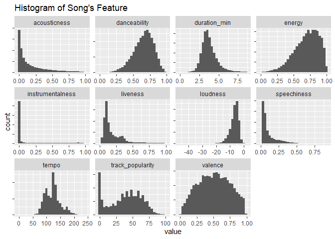
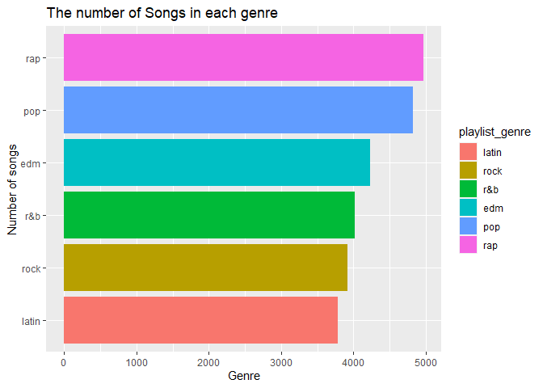
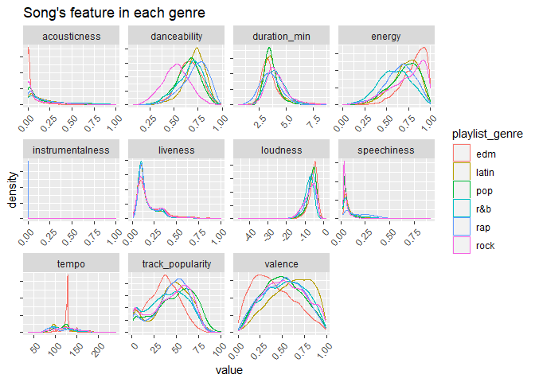
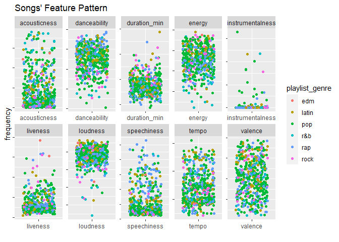
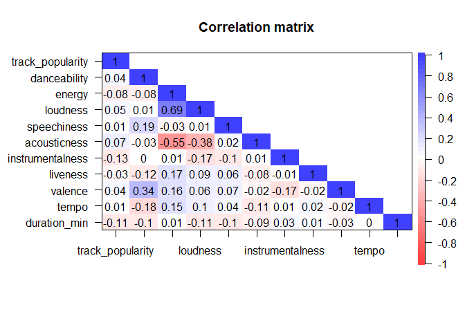
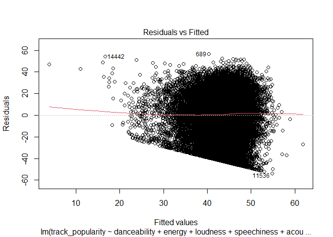
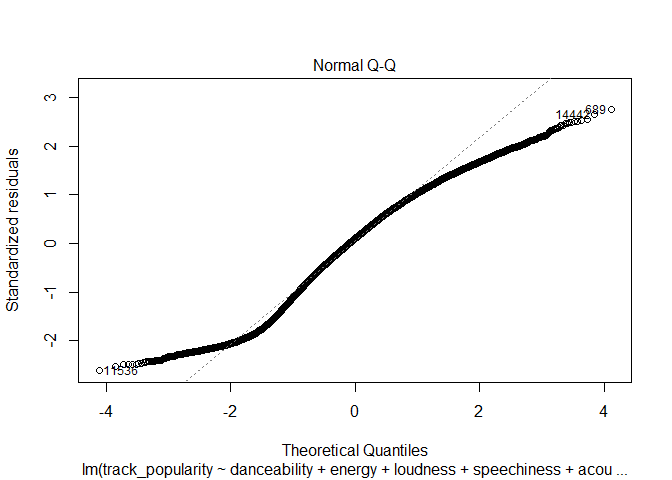
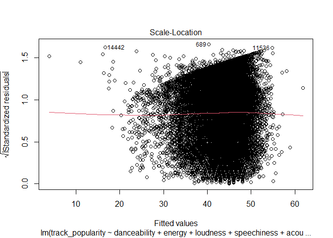

## Introduction

The background underlying of this analysis is to get a better understanding of the behavior of music when listening to songs on Spotify. In this analysis I will explore the feature of a song and its effect to the popularity of a song based on a Spotify data set from the TidyTuesday series. Specifically, there are several subgoals of the analyses: 1) To explore the popular song and genre and their characteristics, and 2) to predict the `track_popularity` of a song based on the features of a song (`danceability`, `energy`, `loudness`, `speechiness`, `acousticness`, `instrumentalness`, `liveness`, `valence`, `tempo`, `duration_ms`) using multiple linear regression analysis. After cleaning the data, I will explore the variables and carefully constructed ggplots to conduct numerical and visual analyses.

## Loading Library and Data
The data used in this project was obtained from the [GitHub TidyTuesday project](https://github.com/rfordatascience/tidytuesday/blob/master/data/2020/2020-01-21/spotify_songs.csv).


```r
library(tidyverse)
```

```
## -- Attaching packages --------------------------------------- tidyverse 1.3.0 --
```

```
## v ggplot2 3.3.3     v purrr   0.3.4
## v tibble  3.1.1     v dplyr   1.0.6
## v tidyr   1.1.3     v stringr 1.4.0
## v readr   1.4.0     v forcats 0.5.1
```

```
## Warning: package 'tibble' was built under R version 4.0.5
```

```
## Warning: package 'dplyr' was built under R version 4.0.5
```

```
## -- Conflicts ------------------------------------------ tidyverse_conflicts() --
## x dplyr::filter() masks stats::filter()
## x dplyr::lag()    masks stats::lag()
```

```r
library(DT)
```

```
## Warning: package 'DT' was built under R version 4.0.5
```

```r
library(psych)
```

```
## Warning: package 'psych' was built under R version 4.0.5
```

```
## 
## Attaching package: 'psych'
```

```
## The following objects are masked from 'package:ggplot2':
## 
##     %+%, alpha
```

```r
library(car)
```

```
## Warning: package 'car' was built under R version 4.0.5
```

```
## Loading required package: carData
```

```
## 
## Attaching package: 'car'
```

```
## The following object is masked from 'package:psych':
## 
##     logit
```

```
## The following object is masked from 'package:dplyr':
## 
##     recode
```

```
## The following object is masked from 'package:purrr':
## 
##     some
```

```r
spotify <- readr::read_csv('https://raw.githubusercontent.com/rfordatascience/tidytuesday/master/data/2020/2020-01-21/spotify_songs.csv')
```

```
## 
## -- Column specification --------------------------------------------------------
## cols(
##   .default = col_double(),
##   track_id = col_character(),
##   track_name = col_character(),
##   track_artist = col_character(),
##   track_album_id = col_character(),
##   track_album_name = col_character(),
##   track_album_release_date = col_character(),
##   playlist_name = col_character(),
##   playlist_id = col_character(),
##   playlist_genre = col_character(),
##   playlist_subgenre = col_character()
## )
## i Use `spec()` for the full column specifications.
```

## Preliminary Exploration and Data Cleaning


```r
glimpse(spotify)
```

```
## Rows: 32,833
## Columns: 23
## $ track_id                 <chr> "6f807x0ima9a1j3VPbc7VN", "0r7CVbZTWZgbTCYdfa~
## $ track_name               <chr> "I Don't Care (with Justin Bieber) - Loud Lux~
## $ track_artist             <chr> "Ed Sheeran", "Maroon 5", "Zara Larsson", "Th~
## $ track_popularity         <dbl> 66, 67, 70, 60, 69, 67, 62, 69, 68, 67, 58, 6~
## $ track_album_id           <chr> "2oCs0DGTsRO98Gh5ZSl2Cx", "63rPSO264uRjW1X5E6~
## $ track_album_name         <chr> "I Don't Care (with Justin Bieber) [Loud Luxu~
## $ track_album_release_date <chr> "2019-06-14", "2019-12-13", "2019-07-05", "20~
## $ playlist_name            <chr> "Pop Remix", "Pop Remix", "Pop Remix", "Pop R~
## $ playlist_id              <chr> "37i9dQZF1DXcZDD7cfEKhW", "37i9dQZF1DXcZDD7cf~
## $ playlist_genre           <chr> "pop", "pop", "pop", "pop", "pop", "pop", "po~
## $ playlist_subgenre        <chr> "dance pop", "dance pop", "dance pop", "dance~
## $ danceability             <dbl> 0.748, 0.726, 0.675, 0.718, 0.650, 0.675, 0.4~
## $ energy                   <dbl> 0.916, 0.815, 0.931, 0.930, 0.833, 0.919, 0.8~
## $ key                      <dbl> 6, 11, 1, 7, 1, 8, 5, 4, 8, 2, 6, 8, 1, 5, 5,~
## $ loudness                 <dbl> -2.634, -4.969, -3.432, -3.778, -4.672, -5.38~
## $ mode                     <dbl> 1, 1, 0, 1, 1, 1, 0, 0, 1, 1, 1, 1, 1, 0, 0, ~
## $ speechiness              <dbl> 0.0583, 0.0373, 0.0742, 0.1020, 0.0359, 0.127~
## $ acousticness             <dbl> 0.10200, 0.07240, 0.07940, 0.02870, 0.08030, ~
## $ instrumentalness         <dbl> 0.00e+00, 4.21e-03, 2.33e-05, 9.43e-06, 0.00e~
## $ liveness                 <dbl> 0.0653, 0.3570, 0.1100, 0.2040, 0.0833, 0.143~
## $ valence                  <dbl> 0.518, 0.693, 0.613, 0.277, 0.725, 0.585, 0.1~
## $ tempo                    <dbl> 122.036, 99.972, 124.008, 121.956, 123.976, 1~
## $ duration_ms              <dbl> 194754, 162600, 176616, 169093, 189052, 16304~
```
Based on the data structure above, there are variables whose data types need to be adjusted based on the nature of the data.


```r
spotify <- spotify %>%
  mutate(track_id = as.factor(track_id),
    track_name = as.factor(track_name),
    track_artist = as.factor(track_artist),
    track_popularity = as.integer(track_popularity),
    track_album_id = as.factor(track_album_id),
    track_album_name = as.factor(track_album_name),
    track_album_release_date = as.factor(track_album_release_date),
    playlist_name = as.factor(playlist_name),
    playlist_id = as.factor(playlist_id),
    playlist_genre = as.factor(playlist_genre),
    playlist_subgenre = as.factor(playlist_subgenre),
    key = as.factor(key),
    duration_ms = as.integer(duration_ms),
    mode = as.factor(mode),
    mode = fct_recode(mode, Minor = "0", Mayor = "1"))
glimpse(spotify)
```

```
## Rows: 32,833
## Columns: 23
## $ track_id                 <fct> 6f807x0ima9a1j3VPbc7VN, 0r7CVbZTWZgbTCYdfa2P3~
## $ track_name               <fct> "I Don't Care (with Justin Bieber) - Loud Lux~
## $ track_artist             <fct> "Ed Sheeran", "Maroon 5", "Zara Larsson", "Th~
## $ track_popularity         <int> 66, 67, 70, 60, 69, 67, 62, 69, 68, 67, 58, 6~
## $ track_album_id           <fct> 2oCs0DGTsRO98Gh5ZSl2Cx, 63rPSO264uRjW1X5E6cWv~
## $ track_album_name         <fct> "I Don't Care (with Justin Bieber) [Loud Luxu~
## $ track_album_release_date <fct> 2019-06-14, 2019-12-13, 2019-07-05, 2019-07-1~
## $ playlist_name            <fct> "Pop Remix", "Pop Remix", "Pop Remix", "Pop R~
## $ playlist_id              <fct> 37i9dQZF1DXcZDD7cfEKhW, 37i9dQZF1DXcZDD7cfEKh~
## $ playlist_genre           <fct> pop, pop, pop, pop, pop, pop, pop, pop, pop, ~
## $ playlist_subgenre        <fct> dance pop, dance pop, dance pop, dance pop, d~
## $ danceability             <dbl> 0.748, 0.726, 0.675, 0.718, 0.650, 0.675, 0.4~
## $ energy                   <dbl> 0.916, 0.815, 0.931, 0.930, 0.833, 0.919, 0.8~
## $ key                      <fct> 6, 11, 1, 7, 1, 8, 5, 4, 8, 2, 6, 8, 1, 5, 5,~
## $ loudness                 <dbl> -2.634, -4.969, -3.432, -3.778, -4.672, -5.38~
## $ mode                     <fct> Mayor, Mayor, Minor, Mayor, Mayor, Mayor, Min~
## $ speechiness              <dbl> 0.0583, 0.0373, 0.0742, 0.1020, 0.0359, 0.127~
## $ acousticness             <dbl> 0.10200, 0.07240, 0.07940, 0.02870, 0.08030, ~
## $ instrumentalness         <dbl> 0.00e+00, 4.21e-03, 2.33e-05, 9.43e-06, 0.00e~
## $ liveness                 <dbl> 0.0653, 0.3570, 0.1100, 0.2040, 0.0833, 0.143~
## $ valence                  <dbl> 0.518, 0.693, 0.613, 0.277, 0.725, 0.585, 0.1~
## $ tempo                    <dbl> 122.036, 99.972, 124.008, 121.956, 123.976, 1~
## $ duration_ms              <int> 194754, 162600, 176616, 169093, 189052, 16304~
```
I change the the variable of `track_name`, `track_artist`, `track_album_id`, `track_album_name`, `track_album_release_date`, `playlist_name`, `playlist_id`, `playlist_genre`, `playlist_subgenre`, `key`, and `mode` as factors and  `track_popularity` and `duration_ms` as integers.

# Missing value

```r
colSums(is.na(spotify))
```

```
##                 track_id               track_name             track_artist 
##                        0                        5                        5 
##         track_popularity           track_album_id         track_album_name 
##                        0                        0                        5 
## track_album_release_date            playlist_name              playlist_id 
##                        0                        0                        0 
##           playlist_genre        playlist_subgenre             danceability 
##                        0                        0                        0 
##                   energy                      key                 loudness 
##                        0                        0                        0 
##                     mode              speechiness             acousticness 
##                        0                        0                        0 
##         instrumentalness                 liveness                  valence 
##                        0                        0                        0 
##                    tempo              duration_ms 
##                        0                        0
```

```r
spotify <- spotify %>% 
  filter(track_name != " ")
```
I found five missing values in `track_name` which I removed from the data set

# Duplicated data

```r
table(duplicated(spotify$track_id))
```

```
## 
## FALSE  TRUE 
## 28352  4476
```

```r
spotify_unique <- spotify[!duplicated(spotify$track_id),]
```
I found there are duplicates in `track_id` because a track can be contained in multiple playlists. So I need to delete those duplicate `track_id` in the dataset. Since the `track_id` is unique and the other measured variables of the song remain the same, I will remove the duplicate song based on the `track_id`.

# Removing unused variables

```r
spotify_conscise <- spotify_unique %>% 
  select(track_name, track_artist, track_popularity, playlist_genre, danceability,
         energy, loudness, speechiness, acousticness, instrumentalness,
         liveness, valence, tempo, duration_ms) %>% 
  mutate(duration_min = duration_ms / 60000) %>% 
  select(-duration_ms)
```
I removed several variables that won't be used in the analysis to make it conscise. I also convert duration into minutes to make it easy to understand by lay people

# Histogram of Song's Feature

```r
feature_names <- names(spotify_conscise)[c(3, 5:14)]
songs_char <- spotify_conscise %>% 
            select(c(feature_names)) %>%
            pivot_longer(cols = feature_names)
```

```
## Note: Using an external vector in selections is ambiguous.
## i Use `all_of(feature_names)` instead of `feature_names` to silence this message.
## i See <https://tidyselect.r-lib.org/reference/faq-external-vector.html>.
## This message is displayed once per session.
```

```r
songs_char %>%
  ggplot(aes(x = value)) +
  geom_histogram() +
  facet_wrap(~name, ncol = 4, scales = 'free') +
  labs(title = "Histogram of Song's Feature") +
  theme(axis.text.y = element_blank())
```

```
## `stat_bin()` using `bins = 30`. Pick better value with `binwidth`.
```

<!-- -->
`duration_min` and `valence` are normally distributed. `danceability`, `energy`, and `loudness` are skewed to the left. `acousticness`, `liveness`, and `speechiness` are skewed to the right. There are The high number of track with a zero popularity rating. Since `track_popularity` will be the central of this analysis, I decide to proceed the analysis by excluding data which has zero `track_popularity`

# Final datast

```r
spotify_final <- spotify_conscise %>% 
  filter(track_popularity != 0)
```

# Preview of final dataset

```r
summary(spotify_final)
```

```
##     track_name           track_artist   track_popularity playlist_genre
##  Breathe :   17   Queen        :  128   Min.   :  1.00   edm  :4227    
##  Alive   :   15   Martin Garrix:   80   1st Qu.: 29.00   latin:3789    
##  Paradise:   14   David Guetta :   77   Median : 45.00   pop  :4819    
##  Poison  :   13   Don Omar     :   76   Mean   : 43.33   r&b  :4016    
##  Forever :   12   Hardwell     :   67   3rd Qu.: 59.00   rap  :4965    
##  Lost    :   12   Drake        :   66   Max.   :100.00   rock :3920    
##  (Other) :25653   (Other)      :25242                                  
##   danceability        energy            loudness        speechiness    
##  Min.   :0.0771   Min.   :0.000175   Min.   :-46.448   Min.   :0.0224  
##  1st Qu.:0.5620   1st Qu.:0.574000   1st Qu.: -8.307   1st Qu.:0.0408  
##  Median :0.6720   Median :0.717000   Median : -6.272   Median :0.0625  
##  Mean   :0.6547   Mean   :0.693843   Mean   : -6.826   Mean   :0.1077  
##  3rd Qu.:0.7610   3rd Qu.:0.839000   3rd Qu.: -4.719   3rd Qu.:0.1330  
##  Max.   :0.9830   Max.   :1.000000   Max.   :  1.275   Max.   :0.9180  
##                                                                        
##   acousticness       instrumentalness       liveness          valence       
##  Min.   :0.0000014   Min.   :0.0000000   Min.   :0.00936   Min.   :0.00001  
##  1st Qu.:0.0157000   1st Qu.:0.0000000   1st Qu.:0.09250   1st Qu.:0.32900  
##  Median :0.0843000   Median :0.0000179   Median :0.12600   Median :0.51000  
##  Mean   :0.1819481   Mean   :0.0880482   Mean   :0.18854   Mean   :0.50931  
##  3rd Qu.:0.2690000   3rd Qu.:0.0055100   3rd Qu.:0.24500   3rd Qu.:0.69200  
##  Max.   :0.9940000   Max.   :0.9940000   Max.   :0.99600   Max.   :0.99100  
##                                                                             
##      tempo         duration_min   
##  Min.   : 35.48   Min.   :0.5238  
##  1st Qu.: 99.96   1st Qu.:3.1113  
##  Median :121.93   Median :3.5871  
##  Mean   :120.90   Mean   :3.7429  
##  3rd Qu.:134.38   3rd Qu.:4.2068  
##  Max.   :239.44   Max.   :8.6302  
## 
```

```r
head(spotify_final, 100) %>%
  datatable(filter = 'top', options = list(pageLength = 10))
```

```
## Warning in instance$preRenderHook(instance): It seems your data is too big
## for client-side DataTables. You may consider server-side processing: https://
## rstudio.github.io/DT/server.html
```

```{=html}
<div id="htmlwidget-95a3ba515969e5f6662a" style="width:100%;height:auto;" class="datatables html-widget"></div>
<script type="application/json" data-for="htmlwidget-95a3ba515969e5f6662a">{"x":{"filter":"top","filterHTML":"<tr>\n  <td><\/td>\n  <td data-type=\"factor\" style=\"vertical-align: top;\">\n    <div class=\"form-group has-feedback\" style=\"margin-bottom: auto;\">\n      <input type=\"search\" placeholder=\"All\" class=\"form-control\" style=\"width: 100%;\"/>\n      <span class=\"glyphicon glyphicon-remove-circle form-control-feedback\"><\/span>\n    <\/div>\n    <div style=\"width: 100%; display: none;\">\n      <select multiple=\"multiple\" style=\"width: 100%;\" data-options=\"[&quot;&#39;39 - 2011 Mix&quot;,&quot;&#39;74 - &#39;75 (feat. Susan Tyler) - Radio Edit&quot;,&quot;&#39;98 Freestyle&quot;,&quot;&#39;Round And &#39;Round (Merry Go &#39;Round Of Love)&quot;,&quot;&#39;Til the Cows Come Home&quot;,&quot;&#39;Til You Do Me Right&quot;,&quot;&#39;Till I Collapse&quot;,&quot;\\&quot;I TRIED FOR YEARS... NOBODY LISTENED\\&quot;&quot;,&quot;\\&quot;This Is Seagull….\\&quot;&quot;,&quot;#1 Stunna&quot;,&quot;#NAKAMA&quot;,&quot;#Natural&quot;,&quot;#Sádico&quot;,&quot;#Summerlovin&quot;,&quot;#Twerkit&quot;,&quot;#Vivalawldkdz (Roberto Rosso Remix) [feat. Twelve24]&quot;,&quot;$$$ - Remix&quot;,&quot;$. A. N. T. E. R. Í. A.&quot;,&quot;$100 (feat. Polo Donatello)&quot;,&quot;$20 Fine&quot;,&quot;$ave Dat Money (feat. Fetty Wap &amp; Rich Homie Quan)&quot;,&quot;$Dreams&quot;,&quot;$ENHOR&quot;,&quot;&amp;burn (with Vince Staples)&quot;,&quot;(Don&#39;t Fear) The Reaper&quot;,&quot;(Don&#39;t Fear) The Reaper - Single Version&quot;,&quot;(Don&#39;t U Know) I Love U&quot;,&quot;(Everything I Do) I Do It For You&quot;,&quot;(Feels Like) Heaven&quot;,&quot;(Forever) Live And Die&quot;,&quot;(I&#39;ll Remember) In The Still Of The Night&quot;,&quot;(I&#39;m Your) Hoochie Coochie Man&quot;,&quot;(I&#39;ve Had) The Time of My Life&quot;,&quot;(I Can&#39;t Get No) Satisfaction - Mono Version&quot;,&quot;(I Can&#39;t Get No) Satisfaction - Mono Version / Remastered 2002&quot;,&quot;(I Just) Died In Your Arms&quot;,&quot;(If Loving You Is Wrong) I Don&#39;t Want to Be Right&quot;,&quot;(It Happens) Sometimes&quot;,&quot;(Just Like) Starting Over&quot;,&quot;(Keep Feeling) Fascination&quot;,&quot;(No One Knows Me) Like the Piano&quot;,&quot;(Oh) Pretty Woman - 2015 Remaster&quot;,&quot;(Rock) Superstar&quot;,&quot;(There You Go) Tellin&#39; Me No Again - 2007 Remaster&quot;,&quot;(This Is Our) House&quot;,&quot;(What A) Wonderful World - Remastered&quot;,&quot;(You&#39;re My One And Only) True Love&quot;,&quot;(You Drive Me) Crazy&quot;,&quot;(You Drive Me) Crazy [The Stop Remix!] - Remastered&quot;,&quot;(Your Love Keeps Lifting Me) Higher &amp; Higher&quot;,&quot;**Bonus Track** 861&quot;,&quot;*Low End Theory&quot;,&quot;...&amp; On&quot;,&quot;...Baby One More Time&quot;,&quot;...Ready For It? - BloodPop® Remix&quot;,&quot;...Til the Cops Come Knockin&#39;&quot;,&quot;...To Be Loved&quot;,&quot;.suede&quot;,&quot;?&quot;,&quot;@&quot;,&quot;@ ME&quot;,&quot;@Isa - Ao Vivo&quot;,&quot;_away&quot;,&quot;¡Corre!&quot;,&quot;¡Hola!&quot;,&quot;¿ Was hast du gedacht ?&quot;,&quot;¿A Dónde Vas?&quot;,&quot;¿Clásicos?&quot;,&quot;¿CÓMO TE VA, QUERIDA?&quot;,&quot;¿Cual es tu plan?&quot;,&quot;¿Cuánto E$?&quot;,&quot;¿Por Que Te Demoras?&quot;,&quot;¿Qué Ha Pasao&#39;?&quot;,&quot;¿Qué Tengo Que Hacer?&quot;,&quot;¿Qué Tiene?&quot;,&quot;¿Quien Tu Eres?&quot;,&quot;¿Y Por Que?&quot;,&quot;+&quot;,&quot;+ High (feat. Jaycob Duque)&quot;,&quot;А.У.Е. Жизнь Ворам (feat. Вася Шмель &amp; Лицо Под-Капюшоном)&quot;,&quot;Аййй&quot;,&quot;Амбасcадора&quot;,&quot;Апокалипсис&quot;,&quot;Ау&quot;,&quot;Ауфф&quot;,&quot;Афганистан&quot;,&quot;БМВ или МЕРС&quot;,&quot;Бесцеремонная сука&quot;,&quot;Брат за брата&quot;,&quot;Буду погибать мало.дым&quot;,&quot;Бумеранг&quot;,&quot;Был хулиганом&quot;,&quot;В каждый таз&quot;,&quot;В этих краях&quot;,&quot;Валим&quot;,&quot;Везёт не всем&quot;,&quot;Возле дома твоего&quot;,&quot;Война&quot;,&quot;Вокруг шум&quot;,&quot;Волчата&quot;,&quot;Воспитала&quot;,&quot;Воу-воу палехчэ&quot;,&quot;Вселенная&quot;,&quot;Всем нашим братьям&quot;,&quot;Всё нормально&quot;,&quot;Второе дыхание&quot;,&quot;Выпускной (Медлячок)&quot;,&quot;Гагарин (feat. Каспийский груз)&quot;,&quot;Гив ми мани&quot;,&quot;Город дорог&quot;,&quot;Город под подошвой&quot;,&quot;Грустная сука&quot;,&quot;Дети капитана Гранта&quot;,&quot;Джаман&quot;,&quot;Джип&quot;,&quot;До небес&quot;,&quot;До тла&quot;,&quot;Доедешь: Пиши&quot;,&quot;Дым - мой круговорот&quot;,&quot;Дыхание улиц&quot;,&quot;Дядя Билли&quot;,&quot;Ето банда&quot;,&quot;Жизнь&quot;,&quot;Жизнь ворам&quot;,&quot;Жизнь пацанская&quot;,&quot;За туманами&quot;,&quot;За 105 двор&quot;,&quot;Заколоченное&quot;,&quot;Запретный плод&quot;,&quot;Звезды Воровские&quot;,&quot;Здесь так&quot;,&quot;Караван&quot;,&quot;Кинотеатр «Дружба»&quot;,&quot;Когда мы вошли&quot;,&quot;Колибри&quot;,&quot;Криминал&quot;,&quot;Кружим&quot;,&quot;Ксенон и тонировка&quot;,&quot;Ламбада&quot;,&quot;Лучший друг&quot;,&quot;Любит хулигана&quot;,&quot;Май 45-го&quot;,&quot;Мама&quot;,&quot;Мент на меня газует&quot;,&quot;Мне бы в небо (feat. Руслан Черный)&quot;,&quot;Моя игра&quot;,&quot;Муси Пуси 2 - Fenomenbeats&quot;,&quot;Мы не с центра&quot;,&quot;На связи (feat. shot)&quot;,&quot;На юг&quot;,&quot;Нам надо дыма&quot;,&quot;Не х*й делать&quot;,&quot;Одним днём&quot;,&quot;Ой, мороз&quot;,&quot;Олина попа&quot;,&quot;Оп, мусорок&quot;,&quot;Осень&quot;,&quot;Отмели&quot;,&quot;Оттуда, где я&quot;,&quot;Папиросы&quot;,&quot;Пацанская&quot;,&quot;Пацаны с моего двора&quot;,&quot;Пидарасия&quot;,&quot;Пламя&quot;,&quot;Плановая&quot;,&quot;Пластилин&quot;,&quot;По белому&quot;,&quot;По лбу.&quot;,&quot;По ресторанам&quot;,&quot;Под запретом&quot;,&quot;Подогрев&quot;,&quot;Поколение&quot;,&quot;Прости мама&quot;,&quot;Прости, Мама&quot;,&quot;Пуля на вылет&quot;,&quot;Ран Вася Ран&quot;,&quot;Раскидать нули&quot;,&quot;Рванарана&quot;,&quot;Решето&quot;,&quot;Ролексы&quot;,&quot;Россия&quot;,&quot;Рукалицо&quot;,&quot;Салам пацанам&quot;,&quot;Сарума&quot;,&quot;Свобода (Feat Alesh)&quot;,&quot;Сигарета тлеет&quot;,&quot;Сладкий дым&quot;,&quot;Солдаты&quot;,&quot;Сонная лощина&quot;,&quot;Статус&quot;,&quot;Стая&quot;,&quot;Стволок за поясок&quot;,&quot;Странно&quot;,&quot;Суета&quot;,&quot;Табор уходит в небо&quot;,&quot;Там и здесь&quot;,&quot;Тартар&quot;,&quot;Тархиб&quot;,&quot;То густо, то пусто&quot;,&quot;Ты та...&quot;,&quot;Уведи меня за собой&quot;,&quot;Уйду с мыслями&quot;,&quot;Урбан&quot;,&quot;Хасла&quot;,&quot;Хлам&quot;,&quot;ЧП&quot;,&quot;Черная Волга&quot;,&quot;Чёрный бумер&quot;,&quot;Шлюза за дым&quot;,&quot;Я смотрю на небо&quot;,&quot;Яд&quot;,&quot;הביאו את הנגרים&quot;,&quot;המוסד&quot;,&quot;たそがれマイ・ラブ&quot;,&quot;ひとりの夜を抜け&quot;,&quot;ひと夏のタペストリー&quot;,&quot;カナディアン・ララバイ&quot;,&quot;ガラスのPALM TREE&quot;,&quot;ガリレオ・ガール&quot;,&quot;サファリ・ナイト&quot;,&quot;シンプル・ラブ&quot;,&quot;ストーカー&quot;,&quot;スパゲッティー&quot;,&quot;ボイスメモ No. 5&quot;,&quot;マシュ・ケ・ナダ&quot;,&quot;ミズノナカヘ - Car TAX remix&quot;,&quot;ラビリンス - Album Mix&quot;,&quot;レイディ・ブルース&quot;,&quot;二度目のイヴ&quot;,&quot;光線&quot;,&quot;別世界&quot;,&quot;君のハートはマリンブルー&quot;,&quot;君は1000%&quot;,&quot;君はIN the RAIN&quot;,&quot;夕凪通信&quot;,&quot;完全感覚Dreamer&quot;,&quot;御伽の街&quot;,&quot;恋に溺れて -Crazy About You-&quot;,&quot;惑星タントラ&quot;,&quot;愛が止まらない ~Turn It Into Love~&quot;,&quot;春の手紙&quot;,&quot;春はトワに目覚める - Ver.2&quot;,&quot;最後のナイト・フライト&quot;,&quot;渚・モデラート&quot;,&quot;男と女&quot;,&quot;留学生&quot;,&quot;真っ赤な太陽&quot;,&quot;貴方しか見えない&quot;,&quot;贅沢な罠&quot;,&quot;霧のDOWN TOWN&quot;,&quot;걔 세 I&#39;m Him&quot;,&quot;달라달라 DALLA DALLA&quot;,&quot;불타오르네 FIRE&quot;,&quot;소방차 Fire Truck&quot;,&quot;숙녀 (淑女) Lady&quot;,&quot;쉼표&quot;,&quot;중독 Overdose&quot;,&quot;피카부 Peek-A-Boo&quot;,&quot;하드캐리 Hard Carry&quot;,&quot;0 Sentimientos (Remix) [feat. Noriel, Darkiel, Lyan, Messiah &amp; Baby Rasta]&quot;,&quot;0 To 100 / The Catch Up&quot;,&quot;005A1&quot;,&quot;007&quot;,&quot;07&quot;,&quot;1-2-3 - Single Version&quot;,&quot;1-800-273-8255&quot;,&quot;1 Adam 12&quot;,&quot;1 Ask&quot;,&quot;1 of 1&quot;,&quot;1 Question&quot;,&quot;1 Thing&quot;,&quot;1, 2, 3 (feat. Jason Derulo &amp; De La Ghetto)&quot;,&quot;1,2,3&quot;,&quot;1.Casino of Tricks&quot;,&quot;10&quot;,&quot;10 (Alleen)&quot;,&quot;10 Bands&quot;,&quot;10 Freaky Girls (with 21 Savage)&quot;,&quot;10 Punten (feat. Hef &amp; Valsbezig)&quot;,&quot;10%&quot;,&quot;10,000 Hours (with Justin Bieber)&quot;,&quot;100 (feat. Dawn Elektra)&quot;,&quot;100 Bands (feat. Quavo, 21 Savage, YG &amp; Meek Mill)&quot;,&quot;100 dni do matury&quot;,&quot;100 Grados (feat. A.CHAL)&quot;,&quot;100 Miles and Running (ft. Wale &amp; John Lindahl)&quot;,&quot;100 Shooters (feat. Meek Mill)&quot;,&quot;100% Pure Love - Spencer &amp; Hill Remix&quot;,&quot;1000 Hits&quot;,&quot;1000 Nights&quot;,&quot;1000 Razones&quot;,&quot;1000 Rounds&quot;,&quot;1000 Times&quot;,&quot;101&quot;,&quot;105 F Remix&quot;,&quot;10K&quot;,&quot;11 PM&quot;,&quot;111 Prozent&quot;,&quot;12:51&quot;,&quot;120 Seconds&quot;,&quot;123456&quot;,&quot;1312&quot;,&quot;14 de Febrero&quot;,&quot;14 Til&quot;,&quot;14 Years&quot;,&quot;1412&quot;,&quot;143&quot;,&quot;1441&quot;,&quot;16&quot;,&quot;167&quot;,&quot;17&quot;,&quot;18 and Life&quot;,&quot;18 And Life&quot;,&quot;18/5/15&quot;,&quot;18HUNNA (feat. Dave) - Four Tet Remix&quot;,&quot;1941 (feat. Virian)&quot;,&quot;1950&quot;,&quot;1965&quot;,&quot;1973 - Acoustic&quot;,&quot;1979&quot;,&quot;1979 - Remastered 2012&quot;,&quot;1985&quot;,&quot;1994&quot;,&quot;1997&quot;,&quot;1998 (mam to we krwi)&quot;,&quot;1999&quot;,&quot;1st &amp; 10 (Featuring Infamous 2-0 &amp; Fate Wilson)&quot;,&quot;1st of Tha Month&quot;,&quot;2 / 14&quot;,&quot;2 AM&quot;,&quot;2 Cachas (feat. Nejo)&quot;,&quot;2 Cigarettes&quot;,&quot;2 Hearts (feat. Gia Koka)&quot;,&quot;2 Hot 4 U (feat. $Uicdeboy$)&quot;,&quot;2 Many&quot;,&quot;2 MUCH (feat. 24hrs) (feat. 24hrs)&quot;,&quot;2 Of Amerikaz Most Wanted&quot;,&quot;2 Of Amerikaz Most Wanted - (Explicit)&quot;,&quot;2 On&quot;,&quot;2 Phones&quot;,&quot;2 Pound&quot;,&quot;2 Real&quot;,&quot;2 Schüsse in die Luft&quot;,&quot;2 Seater (feat. Quavo &amp; 21 Savage)&quot;,&quot;2:45&quot;,&quot;20 Años&quot;,&quot;20/20&quot;,&quot;200 Mph&quot;,&quot;200 Press&quot;,&quot;2000 Miles - 2007 Remaster&quot;,&quot;2000 Rounds&quot;,&quot;2002&quot;,&quot;2012&quot;,&quot;2020&quot;,&quot;2020 - Radio Edit&quot;,&quot;2020 Vision&quot;,&quot;2025&quot;,&quot;2065&quot;,&quot;20ver&quot;,&quot;21&quot;,&quot;21 Guns&quot;,&quot;21 Questions&quot;,&quot;2112 Overture / The Temples Of Syrinx - Chronicles Version&quot;,&quot;214&quot;,&quot;21st Century Girl&quot;,&quot;22&quot;,&quot;22 (OVER S∞∞N)&quot;,&quot;223&#39;s (feat. 9lokknine)&quot;,&quot;23&quot;,&quot;24&#39;s&quot;,&quot;24 Stunden - Original Mix&quot;,&quot;24/7ers&quot;,&quot;241 (My Favorite Song)&quot;,&quot;24H&quot;,&quot;24K&quot;,&quot;24K Magic&quot;,&quot;24K Magic - R3hab Remix&quot;,&quot;25 Bucks (feat. Purity Ring)&quot;,&quot;25 Horas&quot;,&quot;25 Lighters&quot;,&quot;25 Minutes - 2014 Remastered Version&quot;,&quot;25 or 6 to 4&quot;,&quot;27 Hours&quot;,&quot;28 Grams&quot;,&quot;2am&quot;,&quot;2AM - Matoma Remix&quot;,&quot;2Kaiser (Street)&quot;,&quot;2nd Hand&quot;,&quot;2night - Radio Edit&quot;,&quot;2PAC&quot;,&quot;2Shy&quot;,&quot;2U&quot;,&quot;2U (feat. Justin Bieber)&quot;,&quot;3-2-1 Pump&quot;,&quot;3 A.M.&quot;,&quot;3 Batidas - Ao Vivo&quot;,&quot;3 Days&quot;,&quot;3 Foot Tall&quot;,&quot;3 Kings&quot;,&quot;3 Lil&#39; Putos&quot;,&quot;3 Minutos&quot;,&quot;3 Nights&quot;,&quot;3 Strikes&quot;,&quot;30&#39;000 Days&quot;,&quot;30&#39;s-N-Lows&quot;,&quot;30 Bandido!&quot;,&quot;3000&quot;,&quot;3005&quot;,&quot;31 / 10&quot;,&quot;314 (feat. Night Lovell)&quot;,&quot;333&quot;,&quot;349&quot;,&quot;36 Bars Reloaded&quot;,&quot;360 (What Goes Around)&quot;,&quot;365&quot;,&quot;365 - Jonas Aden Remix&quot;,&quot;365 - Zedd Remix&quot;,&quot;38&quot;,&quot;3AM&quot;,&quot;3AM - TR377&quot;,&quot;4 [bump]&quot;,&quot;4 Life&quot;,&quot;4 Life (feat. Graham Candy)&quot;,&quot;4 Loko&quot;,&quot;4 Minutes Of Hell Pt. 3&quot;,&quot;4 Seasons&quot;,&quot;4:20 PM&quot;,&quot;40 Bandz&quot;,&quot;40 Graus&quot;,&quot;40 Mill&quot;,&quot;40%&quot;,&quot;400 Degreez&quot;,&quot;40th Street Black / We Will Fight&quot;,&quot;425&quot;,&quot;44 Bars&quot;,&quot;44 More&quot;,&quot;44th and 8th&quot;,&quot;47 - Remix&quot;,&quot;48H (feat. Sfera Ebbasta)&quot;,&quot;4am&quot;,&quot;4AM&quot;,&quot;4am (The Fauns Remix)&quot;,&quot;4EVER!&quot;,&quot;4runner&quot;,&quot;4th Chamber&quot;,&quot;4U&quot;,&quot;5 8 6 - Live&quot;,&quot;5 A.M.&quot;,&quot;5 Letras&quot;,&quot;5 O&#39;clock&quot;,&quot;5 Stars (feat. Polima Westcoast)&quot;,&quot;5 Steps&quot;,&quot;5:32pm&quot;,&quot;50&quot;,&quot;50 Sombras de Austin&quot;,&quot;50 Vezes - Ao Vivo&quot;,&quot;50 Ways to Leave Your Lover&quot;,&quot;500 (PCM)&quot;,&quot;500 Benz&quot;,&quot;5071&quot;,&quot;537 C U B A&quot;,&quot;5AM&quot;,&quot;5o Clock&quot;,&quot;6&#39;s to 9&#39;s (feat. Rationale)&quot;,&quot;6 8&quot;,&quot;6 AM&quot;,&quot;6 del mattino (feat. Brancar)&quot;,&quot;6 Horas&quot;,&quot;6 Kiss&quot;,&quot;6 Man&quot;,&quot;6 Minutes (feat. Lil&#39; Wayne &amp; Fabolous)&quot;,&quot;6 Pounds - Radio Edit&quot;,&quot;608&quot;,&quot;64 Ways&quot;,&quot;679 (feat. Remy Boyz)&quot;,&quot;6AM.........&quot;,&quot;7 5 0&quot;,&quot;7 AM&quot;,&quot;7 Chamadas&quot;,&quot;7 Days&quot;,&quot;7 Eleven (2010 Re. Vision)&quot;,&quot;7 Nation Army&quot;,&quot;7 rings&quot;,&quot;7 Things - Single Version&quot;,&quot;7 Years&quot;,&quot;7/11&quot;,&quot;73 Degrees (feat. Masego)&quot;,&quot;747&quot;,&quot;777 (feat. Ferras)&quot;,&quot;7K&quot;,&quot;8&quot;,&quot;8 Letters&quot;,&quot;8 Letters - R3HAB Remix&quot;,&quot;8 Minutes to Sunrise&quot;,&quot;8 Money&quot;,&quot;8 Parche&quot;,&quot;8.21&quot;,&quot;80&#39;s Comedown Machine&quot;,&quot;805 Afternoon&quot;,&quot;808&quot;,&quot;808pm At The Beach&quot;,&quot;8282(Party)&quot;,&quot;85%&quot;,&quot;85/Billy Dee Interlude&quot;,&quot;867-5309 / Jenny&quot;,&quot;8Fifty&quot;,&quot;9 2 5&quot;,&quot;9 Crimes&quot;,&quot;9 Little Millimeta Boys&quot;,&quot;9 Times Out Of 10&quot;,&quot;9 Żyć (feat. Otsochodzi, schafter &amp; PlanBe)&quot;,&quot;9と4分の3番線で君を待つ (Run Away) - Japanese Ver.&quot;,&quot;90&#39;s Girl&quot;,&quot;90 BPM&quot;,&quot;90 Degrees&quot;,&quot;911&quot;,&quot;911 - Tom Wilson Remix&quot;,&quot;911 / Mr. Lonely (feat. Frank Ocean &amp; Steve Lacy)&quot;,&quot;92 Baby&quot;,&quot;92 Bars&quot;,&quot;92 Explorer&quot;,&quot;93 &#39;Til Infinity&quot;,&quot;95 BPM&quot;,&quot;96 Quite Bitter Beings&quot;,&quot;97&quot;,&quot;99 Luftballons&quot;,&quot;99 Problems&quot;,&quot;99 Red Balloons - Club Mix&quot;,&quot;9H&quot;,&quot;A-Punk&quot;,&quot;A-RA-SHI:Reborn&quot;,&quot;A-Team&quot;,&quot;A Bailar&quot;,&quot;A Ballad to Stupid Liars&quot;,&quot;A Banca Sessions #1&quot;,&quot;A Beautiful Lie - Acoustic&quot;,&quot;A Big World&quot;,&quot;A Braba&quot;,&quot;A Change Is Gonna Come&quot;,&quot;A chi mi dice&quot;,&quot;A Couple Of Forevers&quot;,&quot;A Crime To Remember&quot;,&quot;A Culpa é do Meu Grau (feat. Zé Neto &amp; Cristiano) - Ao Vivo em Brasília&quot;,&quot;A Day In My Life (Without You)&quot;,&quot;A Day In The Life - Remastered 2009&quot;,&quot;A Death In The Family&quot;,&quot;A Death In The Ocean Would Be Beautiful&quot;,&quot;A Design for Life - Remastered&quot;,&quot;A Different Way (with Lauv)&quot;,&quot;A Dios Le Pido - MTV Unplugged&quot;,&quot;A DOMANI PER SEMPRE&quot;,&quot;A Donde&quot;,&quot;A Dónde Vamos&quot;,&quot;A Donde Voy (feat. Daddy Yankee)&quot;,&quot;A Dream Away - Remastered&quot;,&quot;A Dream Is A Wish Your Heart Makes&quot;,&quot;A Ella&quot;,&quot;A Escondidas (feat. Jessi Leon)&quot;,&quot;A Few Reasons (truth Part 2)&quot;,&quot;A Flicker Of Hope&quot;,&quot;A Forest - Remastered Version&quot;,&quot;A fuego&quot;,&quot;A fuego - Bizarrap Remix&quot;,&quot;A Fuego Lento&quot;,&quot;A Generation of the lost&quot;,&quot;A Gente Fez Amor - Ao Vivo&quot;,&quot;A Girl Like You&quot;,&quot;A Good Man&quot;,&quot;A Grave Mistake&quot;,&quot;A Hard Day&#39;s Night&quot;,&quot;A Hard Rain&#39;s A-Gonna Fall&quot;,&quot;A Hazy Shade of Winter&quot;,&quot;A Horse with No Name&quot;,&quot;A La Madrugada&quot;,&quot;A las Cosas por Su Nombre&quot;,&quot;A Life Within a Day&quot;,&quot;A LIGHT THAT NEVER COMES - Twoloud Remix&quot;,&quot;A Little Less Conversation (feat. The Great Escape)&quot;,&quot;A Little More&quot;,&quot;A Little Respect&quot;,&quot;A Little Respect - 2009 Remastered Version&quot;,&quot;A Little Respect (Remastered 2009)&quot;,&quot;A Lo Moderno&quot;,&quot;A Long Time&quot;,&quot;A Long Walk&quot;,&quot;A Long Walk - Remastered&quot;,&quot;a lot&quot;,&quot;A Mi Manera&quot;,&quot;A Mí Me Gusta&quot;,&quot;A Mí No Me Hables - Acústico&quot;,&quot;A Milli&quot;,&quot;A Million Lights - feat. Zoë Badwi [Original]&quot;,&quot;A Minute to Breathe&quot;,&quot;A Mirage&quot;,&quot;A Moment In A Million Years&quot;,&quot;A Moment to Bill It - Beat Edit&quot;,&quot;A Mother Lost&quot;,&quot;A nach B&quot;,&quot;A New Disaster&quot;,&quot;A Night to Remember - Original Version&quot;,&quot;A Pain That I&#39;m Used To - Live&quot;,&quot;A Palé&quot;,&quot;A Part&quot;,&quot;A Partir De Hoy&quot;,&quot;A Party Song (The Walk of Shame)&quot;,&quot;A Pedir Su Mano&quot;,&quot;A Phone Call In Amsterdam&quot;,&quot;A Place For Us (feat. Ynnox)&quot;,&quot;A Place I Know&quot;,&quot;A Portarme Mal&quot;,&quot;A Punta de Espada&quot;,&quot;A punto (feat. Delfina Campos)&quot;,&quot;A Question of Lust&quot;,&quot;A Question of Time - Remix&quot;,&quot;A Real Indication&quot;,&quot;A Room of Her Own (TS Version)&quot;,&quot;A Sky Full of Stars&quot;,&quot;A Sky Full of Stars - Hardwell Remix&quot;,&quot;A Sky Full of Stars - Live at the Royal Albert Hall, London&quot;,&quot;A Sky Full of Stars - Robin Schulz Edit&quot;,&quot;A Solas - Remix&quot;,&quot;A Song For Mama&quot;,&quot;A Song to Sing&quot;,&quot;A Storm On A Summers Day&quot;,&quot;A Teenage Dream (Instrumental Version)&quot;,&quot;A Thin Line Between Love &amp; Hate (feat. Shirley Murdock)&quot;,&quot;A Thousand Miles&quot;,&quot;A Thousand Years&quot;,&quot;A Toast and a Spirit&quot;,&quot;A Tribe Called Government&quot;,&quot;A Trip to Tokyo&quot;,&quot;A Tu Manera [CORBATA]&quot;,&quot;A Tumba Abierta - Live&quot;,&quot;A Vapor&quot;,&quot;A Veces&quot;,&quot;A Ver, a Ver&quot;,&quot;A Waiting Game&quot;,&quot;A Wake (feat. Evan Roman)&quot;,&quot;A Walk In The Park (Original Club Mix)&quot;,&quot;A Warrior&#39;s Call&quot;,&quot;A Year Without Rain&quot;,&quot;A$AP&quot;,&quot;A$AP Forever&quot;,&quot;A$IAN BOY&quot;,&quot;A.D.H.D&quot;,&quot;A.D.I.D.A.S. - Explicit Album Version&quot;,&quot;A.N.G.E.L. - Interlude&quot;,&quot;A.S.S.N.&quot;,&quot;A1&quot;,&quot;Aane De&quot;,&quot;Abarajame&quot;,&quot;About Last Night&quot;,&quot;About Me&quot;,&quot;About Me - Brieuc, Cloud 41 &amp; Lowkie Club Mix&quot;,&quot;About The Distance&quot;,&quot;About Work The Dancefloor - Edit&quot;,&quot;About You&quot;,&quot;Above It All&quot;,&quot;Above the Clouds&quot;,&quot;Above The Tide&quot;,&quot;Above Water&quot;,&quot;Abracadabra - Remix Los Hermanos Rosario&quot;,&quot;Ábranse Perras&quot;,&quot;Abrázame - Versión Acústica&quot;,&quot;Abrázame Muy Fuerte&quot;,&quot;Abreme La Puerta&quot;,&quot;Abriendo Puertas&quot;,&quot;Abriré La Puerta&quot;,&quot;Absolute Zero&quot;,&quot;Absolutely (Story of a Girl) - Radio Mix&quot;,&quot;Absolutely Smitten&quot;,&quot;Absolution&quot;,&quot;Abusadamente&quot;,&quot;Abusadora&quot;,&quot;Abuso&quot;,&quot;Acá Entera&quot;,&quot;Acapella&quot;,&quot;Accelerator&quot;,&quot;Access&quot;,&quot;Access Granted&quot;,&quot;Accetto Miracoli&quot;,&quot;Accidente&quot;,&quot;Ace - Radio Edit&quot;,&quot;Ace in the Hole&quot;,&quot;Ace of Hearts&quot;,&quot;Ace of Spades&quot;,&quot;Ace Of Spades&quot;,&quot;Acende o Isqueiro&quot;,&quot;Achilipú&quot;,&quot;Acid Dreams&quot;,&quot;Acid Rock&quot;,&quot;ACIIID - Original Mix&quot;,&quot;Aconcagua&quot;,&quot;Acordeão&quot;,&quot;Acreditar de Novo&quot;,&quot;Act a Fool&quot;,&quot;Act Like You Know&quot;,&quot;Act My Age&quot;,&quot;Act One&quot;,&quot;Act Up&quot;,&quot;Action&quot;,&quot;Action - Revised Version&quot;,&quot;Action This Day - Remastered 2011&quot;,&quot;Activate&quot;,&quot;Actua&quot;,&quot;Aczino: Bzrp Freestyle Sessions, Vol. 8&quot;,&quot;Adagio For Strings&quot;,&quot;Adam&#39;s Song&quot;,&quot;Adan y Eva&quot;,&quot;Adaptation&quot;,&quot;Add the Bassline&quot;,&quot;Adderall&quot;,&quot;Addicted&quot;,&quot;Addicted - Acoustic&quot;,&quot;Addicted To Love&quot;,&quot;Addicted To That Rush&quot;,&quot;Addicted To You&quot;,&quot;Addiction&quot;,&quot;Addiction (feat. Lil Wayne &amp; Saweetie)&quot;,&quot;Addictive Love&quot;,&quot;Adelanto&quot;,&quot;Adhana&quot;,&quot;ADHD&quot;,&quot;Adictiva&quot;,&quot;Adicto (feat. Marc Anthony)&quot;,&quot;Adicto (with Anuel AA &amp; Ozuna)&quot;,&quot;Adictos Por R.a.P&quot;,&quot;Adios&quot;,&quot;Adiós Amor&quot;,&quot;Adore You&quot;,&quot;Adrenalina&quot;,&quot;Adrenalize&quot;,&quot;Adrienne&quot;,&quot;Adulte Dunkeln&quot;,&quot;Adventure of a Lifetime&quot;,&quot;Aerials&quot;,&quot;Aerodynamic&quot;,&quot;Aerodynamic - Daft Punk Remix&quot;,&quot;Aeta&quot;,&quot;Aether&quot;,&quot;Afe Ato Yen Bio&quot;,&quot;Affair&quot;,&quot;Affection&quot;,&quot;Affirmation&quot;,&quot;Afloat&quot;,&quot;Africa&quot;,&quot;African Woman So Fine&quot;,&quot;Africanism&quot;,&quot;Afro Beat Blues (Feat. Ojah)&quot;,&quot;Afro Blue&quot;,&quot;Afro Puffs&quot;,&quot;Afro Trap Pt. 3 (Champions League)&quot;,&quot;Afro Trap Pt. 4 (Fais le mouv)&quot;,&quot;Afroman&quot;,&quot;AFTER&quot;,&quot;After Dark - Radio Edit&quot;,&quot;After Dollars, No Cents&quot;,&quot;After Forever&quot;,&quot;After Hours&quot;,&quot;After Hours - OFFAIAH Remix&quot;,&quot;After Laughter (Comes Tears)&quot;,&quot;After Life (feat. Stacy Barthe)&quot;,&quot;After Midnight&quot;,&quot;After The Landslide - Club Remix&quot;,&quot;After The Pain&quot;,&quot;After the Storm&quot;,&quot;After The Storm (feat. Tyler, The Creator &amp; Bootsy Collins)&quot;,&quot;Afterhours feat. Diplo &amp; Nina Sky&quot;,&quot;Afterlife&quot;,&quot;Afterlife (Reyer Remix)&quot;,&quot;Afterlight&quot;,&quot;Aftermath&quot;,&quot;Aftermath - Original Mix&quot;,&quot;Afternoon&quot;,&quot;Aftershock (feat. Jacquie)&quot;,&quot;Afuera&quot;,&quot;Again&quot;,&quot;Again - Alan Walker Remix&quot;,&quot;Again - Radio Edit&quot;,&quot;Again Now&quot;,&quot;Against the World - Radio Edit&quot;,&quot;Against Us&quot;,&quot;Agarrala&quot;,&quot;Age Ain&#39;t Nothing But a Number&quot;,&quot;Age Gag&quot;,&quot;Age of Consent - 2015 Remaster&quot;,&quot;AGEN WIDA&quot;,&quot;Agradable - Remix&quot;,&quot;Agree to Disagree&quot;,&quot;Agua&quot;,&quot;Agua Salada&quot;,&quot;Aguacate&quot;,&quot;Aguacero&quot;,&quot;Aguante&quot;,&quot;Aguardiente&quot;,&quot;Agüitaecoco&quot;,&quot;Ah Leke&quot;,&quot;Ah Yeah&quot;,&quot;AH YEAH&quot;,&quot;Ah Yeah - Original Mix&quot;,&quot;Ahead of Us - Radio Edit&quot;,&quot;Ahí Ahí&quot;,&quot;Ahondar en Ti&quot;,&quot;Ahora&quot;,&quot;Ahora Es&quot;,&quot;Ahora Me Toca&quot;,&quot;Ahora no&quot;,&quot;Ahora que tú no me ves&quot;,&quot;Ahora Quien - Salsa Version&quot;,&quot;Ahora Te Puedes Marchar&quot;,&quot;Ahura Mazda&quot;,&quot;Ai じゃ ない&quot;,&quot;Ai Droga&quot;,&quot;Ai No Shinkiro&quot;,&quot;AI O MAKIMODOSHITE&quot;,&quot;Ai Se Eu Te Pego - Ao Vivo&quot;,&quot;Aibo&quot;,&quot;Ain&#39;t 2 Proud 2 Beg&quot;,&quot;Ain&#39;t 2 Proud 2 Beg - U.S. 7\\&quot; Edit&quot;,&quot;Ain&#39;t Gon Let Up&quot;,&quot;Ain&#39;t Gonna Let Up&quot;,&quot;Ain&#39;t I - main voc up&quot;,&quot;Ain&#39;t It Fun&quot;,&quot;Ain&#39;t It Funny - Murder Remix&quot;,&quot;Ain&#39;t My Fault&quot;,&quot;Ain&#39;t My Fault - R3hab Remix&quot;,&quot;Ain&#39;t My Type Of Hype&quot;,&quot;Ain&#39;t No Cookin&#39;&quot;,&quot;Ain&#39;t No Fun (If the Homies Cant Have None) (feat. Nate Dogg, Warren G &amp; Kurupt)&quot;,&quot;Ain&#39;t No Future In Yo&#39; Frontin&#39;&quot;,&quot;Ain&#39;t No Grave&quot;,&quot;Ain&#39;t No Love In The Heart Of The City - Single Version&quot;,&quot;Ain&#39;t No Mountain High Enough&quot;,&quot;Ain&#39;t No Nigga&quot;,&quot;Ain&#39;t No Rest For The Wicked - Original Version&quot;,&quot;Ain&#39;t No Saint&quot;,&quot;Ain&#39;t No Sunshine&quot;,&quot;Ain&#39;t No Sunshine - Deep Chills Radio Edit&quot;,&quot;Ain&#39;t No Time&quot;,&quot;Ain&#39;t Nobody (Loves Me Better)&quot;,&quot;Ain&#39;t Nobody (Loves Me Better) (feat. Jasmine Thompson)&quot;,&quot;Ain&#39;t Nobody Else&quot;,&quot;Ain&#39;t Nobody Worryin&#39;&quot;,&quot;Ain&#39;t Nothing Changed&quot;,&quot;Ain&#39;t Nothing Like It&quot;,&quot;Ain&#39;t Right&quot;,&quot;Ain&#39;t Talkin&#39; &#39;Bout Love&quot;,&quot;Ain&#39;t Talkin&#39; &#39;Bout Love - 2015 Remaster&quot;,&quot;Ain&#39;t That Easy&quot;,&quot;Ain&#39;t Your Mama&quot;,&quot;Ain`t Gonna Stop (Until I Stop It)&quot;,&quot;Aingonlechugo&quot;,&quot;Air Conditioning&quot;,&quot;Air Force Ones&quot;,&quot;Air Max&quot;,&quot;Aire&quot;,&quot;Aire soy (feat. Ximena Sariñana)&quot;,&quot;Airmax gegen Kopf&quot;,&quot;Airplanes&quot;,&quot;Airplanes (feat. Hayley Williams)&quot;,&quot;Airport&quot;,&quot;Airwave - twoloud Remix&quot;,&quot;Aise Na Dekh Mujhe&quot;,&quot;Aisle Thots&quot;,&quot;Aji Mera Ghanta&quot;,&quot;Ak 47&quot;,&quot;Akap&quot;,&quot;Akhi Side&quot;,&quot;Akin Ka Na Lang&quot;,&quot;Akula Owu Onyeara&quot;,&quot;Akwa Kayi Ji Bia Nuwa&quot;,&quot;Akwaba&quot;,&quot;Al Amanecer&quot;,&quot;Al Andalus - Live&quot;,&quot;Al Desnudo&quot;,&quot;Al di là dell’amore&quot;,&quot;Al Filo de Tu Amor&quot;,&quot;Al Natural (feat. Yandel)&quot;,&quot;al pasito/timeless&quot;,&quot;Al Siguiente Nivel&quot;,&quot;Al Sur De Granada - Live&quot;,&quot;Al Telefono&quot;,&quot;Alabame&quot;,&quot;Alala&quot;,&quot;ALAMAIM&quot;,&quot;Alamo - Original Mix&quot;,&quot;Alarm&quot;,&quot;Alarm - Original Mix&quot;,&quot;Alaska&quot;,&quot;Alchemy&quot;,&quot;Alcoholic Shrink&quot;,&quot;Alcoholizados&quot;,&quot;Alejandro&quot;,&quot;Aleluya&quot;,&quot;Aleman: Bzrp Music Sessions, Vol. 15&quot;,&quot;Alessandra Ambrosio&quot;,&quot;Alfa &amp; Omega&quot;,&quot;Algiers&quot;,&quot;Algo contigo&quot;,&quot;Algo De Mí&quot;,&quot;Algo Está Cambiando&quot;,&quot;Algo Me Gusta De Ti&quot;,&quot;Algo Musical&quot;,&quot;Algo Musical (feat. Arcángel)&quot;,&quot;Alguien Como Tú&quot;,&quot;Alguien Robo&quot;,&quot;Algún Día (feat. Negro Sambo)&quot;,&quot;Ali Bomaye&quot;,&quot;Alien&quot;,&quot;Alien Nation&quot;,&quot;Aliens&quot;,&quot;Alignment&quot;,&quot;Alipin&quot;,&quot;Alive&quot;,&quot;Alive - 2006 Remaster&quot;,&quot;Alive - Hardwell Remix&quot;,&quot;Alive - Radio Edit&quot;,&quot;Alive (feat. ILY)&quot;,&quot;Alive (Remix)&quot;,&quot;Alive (with Offset &amp; 2 Chainz)&quot;,&quot;Alive And Kicking&quot;,&quot;Alive And Kicking - 2002 Digital Remaster&quot;,&quot;Alive And Kicking - Remastered 2002&quot;,&quot;All ‘Bout The Money&quot;,&quot;All 4 Love&quot;,&quot;All Aboard - Dimitri Vegas &amp; Like Mike Edit&quot;,&quot;All About It (GTA &amp; Cimo Fränkel)&quot;,&quot;All About My Doe - Feat. Ronnie Spencer &amp; Fat Pat&quot;,&quot;All About That Bass&quot;,&quot;All About the Benjamins&quot;,&quot;All About Tonight&quot;,&quot;All About U&quot;,&quot;All About Us&quot;,&quot;All About Us - Klaas Remix&quot;,&quot;All Alone&quot;,&quot;All Along the Watchtower&quot;,&quot;All Along The Watchtower&quot;,&quot;All Around The World (La La La)&quot;,&quot;All Around The World (La La La) - LUM!X Remix&quot;,&quot;All Around The World (La La La) - Marnik Remix&quot;,&quot;All Around You&quot;,&quot;All Bad&quot;,&quot;All Black&quot;,&quot;All Broken Hearted&quot;,&quot;All Comes Back To You&quot;,&quot;All Cried Out (feat. Alex Newell) - Oliver Nelson Remix&quot;,&quot;All Cried Out (with Full Force)&quot;,&quot;All Day All Night&quot;,&quot;All Day and All of the Night&quot;,&quot;All Day And Night&quot;,&quot;All Day And Night - Jax Jones &amp; Martin Solveig Present Europa&quot;,&quot;All Dead, All Dead - Remastered 2011&quot;,&quot;All Eyez (feat. Jeremih) [Bonus Track]&quot;,&quot;All Eyez On Me&quot;,&quot;All Facts (feat. Ty Dolla $ign)&quot;,&quot;All Falls Down&quot;,&quot;All Falls Down - Tritonal Edit&quot;,&quot;All Falls Down (feat. Juliander)&quot;,&quot;All Falls Down (feat. Juliander) - Mark Villa Remix&quot;,&quot;All Falls Down (feat. Juliander) - Steve Aoki Remix&quot;,&quot;All For Love&quot;,&quot;All For One&quot;,&quot;All For The Cash&quot;,&quot;All For You&quot;,&quot;All Four Walls - Graves Remix&quot;,&quot;All Girls Are The Same&quot;,&quot;All Good&quot;,&quot;All Hands On Deck - Giraffage Remix&quot;,&quot;All I Can Do Is Write About It&quot;,&quot;All I Do&quot;,&quot;All I Do Is&quot;,&quot;All I Do Is Cry&quot;,&quot;All I Do Is Think of You&quot;,&quot;All I Do Is Win - Feat. T-Pain, Ludacris, Snoop Dogg &amp; Rick Ross&quot;,&quot;All I Ever Need&quot;,&quot;All I Ever Wanted (feat. River)&quot;,&quot;All I Got (feat. Jae Mazor &amp; Rippa Da Kid)&quot;,&quot;All I Got Is You&quot;,&quot;All I Had To Lose (feat. Mark Morales)&quot;,&quot;All I Have&quot;,&quot;All I Have (feat. LL Cool J)&quot;,&quot;All I Know&quot;,&quot;All I Need&quot;,&quot;All I Need (with Gucci Mane)&quot;,&quot;All I See - Pomo Remix&quot;,&quot;All I Wanna Do&quot;,&quot;All I Want&quot;,&quot;All I Want - From \\&quot;High School Musical: The Musical: The Series\\&quot;&quot;,&quot;All I Want (feat. Cameron Dallas)&quot;,&quot;All I Want for Christmas Is You&quot;,&quot;All I Want For Christmas Is You&quot;,&quot;All I Want Is You (feat. J. Cole)&quot;,&quot;All I Wonna Do Is You&quot;,&quot;All In - Ostblockschlampen Mix&quot;,&quot;All In (CB Remix)&quot;,&quot;All in Line&quot;,&quot;All In My Feelings&quot;,&quot;All in My Head&quot;,&quot;All In My Head&quot;,&quot;All In My Head (Flex) (feat. Fetty Wap)&quot;,&quot;All Into Nothing&quot;,&quot;All Keeps Falling&quot;,&quot;All Love&quot;,&quot;All Mine&quot;,&quot;all my friends&quot;,&quot;All My Friends - Eden Prince Remix&quot;,&quot;All My Friends - Radio Edit&quot;,&quot;All My Friends (feat. Tinashe &amp; Chance the Rapper)&quot;,&quot;All My Friends Are Dead&quot;,&quot;All My Girls&quot;,&quot;All My Happiness is Gone&quot;,&quot;All My Life&quot;,&quot;All My Life I&#39;ve Wanted A Chevy&quot;,&quot;All My Love&quot;,&quot;All My Love - 1990 Remaster&quot;,&quot;All My Love - Remastered&quot;,&quot;All Night&quot;,&quot;All Night - Cash Cash Radio Edit&quot;,&quot;All Night (BTS World Original Soundtrack) [Pt. 3]&quot;,&quot;All Night (feat. Knox Fortune)&quot;,&quot;All Night (feat. Trevor Jackson)&quot;,&quot;All Night Long&quot;,&quot;All Night Long - (Remastered)&quot;,&quot;All Night Long - KlangKonzert Remix&quot;,&quot;All Night Long - Krutz Remix&quot;,&quot;All Night Long - Zakkov Remix&quot;,&quot;All Night Long (All Night) - Single Version&quot;,&quot;All Night Longer REMIX&quot;,&quot;All of Me&quot;,&quot;All of Me - Live from Spotify Milan&quot;,&quot;All of Me (feat. Logic, ROZES)&quot;,&quot;All of Me (Tiësto&#39;s Birthday Treatment Remix) - Radio Edit&quot;,&quot;All of the Lights&quot;,&quot;All Of The Lights&quot;,&quot;All of the People&quot;,&quot;All Of The People&quot;,&quot;All on Me&quot;,&quot;All on You&quot;,&quot;All or Nothing&quot;,&quot;All or Nothing - Sultan + Shepard Remix&quot;,&quot;All Out of Love&quot;,&quot;All Over&quot;,&quot;All Over Me&quot;,&quot;All Over Now&quot;,&quot;All over the World&quot;,&quot;All Over The World&quot;,&quot;All over You&quot;,&quot;All Over You&quot;,&quot;All Right Now&quot;,&quot;All Right Now - Remix &#39;91&quot;,&quot;All Rise&quot;,&quot;All Souled Out&quot;,&quot;All Star&quot;,&quot;All Star - Breathe Carolina Remix&quot;,&quot;All Systems Down&quot;,&quot;All That - The Knocks Remix&quot;,&quot;All That (feat. Jeremih)&quot;,&quot;All That I Am&quot;,&quot;All That I Need feat. Cherokee - Dave DK Remix&quot;,&quot;All That She Wants&quot;,&quot;All That She Wants - Remastered&quot;,&quot;All The Fucking Time - Acoustic&quot;,&quot;all the good girls go to hell&quot;,&quot;All The Lies&quot;,&quot;All The Lies - Toby Romeo Remix / Radio Edit&quot;,&quot;All The Love You Got&quot;,&quot;All The Places (I Will Kiss You)&quot;,&quot;All the Pretty Girls&quot;,&quot;All the Rage Back Home&quot;,&quot;All The Small Things&quot;,&quot;All The Stars (with SZA)&quot;,&quot;All the Things&quot;,&quot;All The Things (Your Man Won&#39;t Do)&quot;,&quot;All the Time&quot;,&quot;All The Time&quot;,&quot;All the Time - Don Diablo Remix&quot;,&quot;All the Times (feat. Faith Evans, Coko &amp; Missy Elliott)&quot;,&quot;All The Way&quot;,&quot;All the Way (Neon Feather Remix)&quot;,&quot;All The Way (Stay)&quot;,&quot;All The Way Up&quot;,&quot;All the Young Dudes&quot;,&quot;All They Wanna Hear&quot;,&quot;All Things Must Pass&quot;,&quot;All Things Must Pass - 2009 Digital Remaster&quot;,&quot;All This Love&quot;,&quot;All This Love (feat. Harlœ)&quot;,&quot;All This Music Must Fade&quot;,&quot;All This Time&quot;,&quot;All Those Years Ago - 2004 Mix&quot;,&quot;All Time Low&quot;,&quot;All To Me (feat. Lola Rhodes)&quot;,&quot;All To Myself&quot;,&quot;All We Do&quot;,&quot;All We Know&quot;,&quot;All We Know - Oliver Heldens Remix&quot;,&quot;All Work&quot;,&quot;All Year&quot;,&quot;All You&quot;,&quot;All You Need Is Love&quot;,&quot;All You Need To Know (feat. Calle Lehmann)&quot;,&quot;All Your Days&quot;,&quot;All Your Friends&quot;,&quot;All Your Love (feat. The Romantic Era) [Kastra Remix]&quot;,&quot;All Your Yeahs&quot;,&quot;Alladat&quot;,&quot;Alle Dem&quot;,&quot;Alles&quot;,&quot;Alles kaputt&quot;,&quot;Alles oder Nichts&quot;,&quot;Alles Wat Ik Wil&quot;,&quot;Allez Viens (Via Con Me) [feat. Pierre Santini &amp; Lada Redstar]&quot;,&quot;Allstars&quot;,&quot;Alma&quot;,&quot;ALMA (prod. 0-600)&quot;,&quot;Almeda&quot;,&quot;Almost Human&quot;,&quot;Almost Love&quot;,&quot;Almost Mine - Radio Edit&quot;,&quot;Alô Som (feat. Maiara &amp; Maraisa) - Ao Vivo&quot;,&quot;Alocao (With Bad Gyal)&quot;,&quot;Alocate&quot;,&quot;Aloha&quot;,&quot;Alone&quot;,&quot;Alone - Blazars Remix&quot;,&quot;Alone (feat. Anjulie &amp; Jeffrey Jey)&quot;,&quot;Alone (feat. Anjulie &amp; Jeffrey Jey) - Club Mix&quot;,&quot;Alone (Ken Bauer Remix)&quot;,&quot;Alone Again&quot;,&quot;Alone Again (Naturally)&quot;,&quot;Alone in the Same Room&quot;,&quot;Alone Together&quot;,&quot;Alone Tonight&quot;,&quot;Alone with You&quot;,&quot;Alone, Pt. II&quot;,&quot;Along Came Polly - Original Mix&quot;,&quot;Alors On Danse - Radio Edit&quot;,&quot;Alps&quot;,&quot;ALREADY&quot;,&quot;Already Dead&quot;,&quot;Already Gone&quot;,&quot;Already Home [Jay-Z + Kid Cudi]&quot;,&quot;Already Love&quot;,&quot;Alright&quot;,&quot;Alright - 7\\&quot; House Mix With Rap&quot;,&quot;Alright - Remastered&quot;,&quot;Alright (Song of the Sunrise)&quot;,&quot;Also&quot;,&quot;ALT.COLOUR&quot;,&quot;Altair&quot;,&quot;Alte Schule Frankfurt&quot;,&quot;Alternate Paths - Teenage Mutants Radio Edit&quot;,&quot;Alucinado&quot;,&quot;Alucinándote&quot;,&quot;Alv la Policia&quot;,&quot;Always&quot;,&quot;Always &amp; Forever&quot;,&quot;Always Attract&quot;,&quot;Always Be My Baby&quot;,&quot;Always Forever&quot;,&quot;Always Gonna Say Sorry&quot;,&quot;Always in My Head&quot;,&quot;Always Love&quot;,&quot;Always on My Mind&quot;,&quot;Always On My Mind - Nihil Young Remix&quot;,&quot;Always On Time&quot;,&quot;Always Something There to Remind Me - 2018 Remaster&quot;,&quot;Always Somewhere&quot;,&quot;Always The Sun - Sunny Side Up Mix&quot;,&quot;Always There&quot;,&quot;Always Where I Need To Be&quot;,&quot;Alwayz Into Somethin&#39;&quot;,&quot;Am I a Good Man&quot;,&quot;Am I Wrong (feat. ScHoolboy Q)&quot;,&quot;AM To PM&quot;,&quot;Amanda&quot;,&quot;Amanda Lear&quot;,&quot;Amanece&quot;,&quot;Amante Bandido&quot;,&quot;Amantes&quot;,&quot;Amantes - Versión Salsa&quot;,&quot;Amar&quot;,&quot;AmarElo (Sample: Sujeito de Sorte - Belchior)&quot;,&quot;Amarillo By Morning&quot;,&quot;Amarte por mil años&quot;,&quot;Amarte y Perderte&quot;,&quot;Amazing&quot;,&quot;Amazing Grace - HGHTS Remix&quot;,&quot;Amazing!&quot;,&quot;Amazônia&quot;,&quot;Ambak&quot;,&quot;Ambitionz Az A Ridah&quot;,&quot;Ambrosia&quot;,&quot;Ambush&quot;,&quot;AME GA FURU (비가내려) (Feat. J;KEY)&quot;,&quot;Amen&quot;,&quot;America&quot;,&quot;America Online&quot;,&quot;American Boy - Brooks Remix&quot;,&quot;American Boyfriend&quot;,&quot;American Capitalist&quot;,&quot;American Express (feat. Farid Bang)&quot;,&quot;American Funeral&quot;,&quot;American Girl&quot;,&quot;American Idiot&quot;,&quot;American Music&quot;,&quot;American Pie&quot;,&quot;American Psycho II&quot;,&quot;American Spirit&quot;,&quot;American Teen&quot;,&quot;American Woman&quot;,&quot;American Woman - 7\\&quot; Version&quot;,&quot;American Woman - Remastered&quot;,&quot;AMG&quot;,&quot;Amiga&quot;,&quot;Amiga mía&quot;,&quot;Amigos Con Derechos&quot;,&quot;Amira&quot;,&quot;Amor&quot;,&quot;AMOR&quot;,&quot;Amor A Primera Vista&quot;,&quot;Amor De Colegio&quot;,&quot;Amor De Feisbuk (Facebook)&quot;,&quot;Amor De Papel&quot;,&quot;Amor De Pobre&quot;,&quot;Amor de Que&quot;,&quot;Amor De Una Noche (feat. Julio Voltio) - Remix Version&quot;,&quot;Amor De Verano&quot;,&quot;Amor de Verdad&quot;,&quot;Amor Duele&quot;,&quot;Amor Frutero&quot;,&quot;Amor Genuino&quot;,&quot;Amor Loquito&quot;,&quot;Amor Narcótico&quot;,&quot;Amor, Amor, Amor (feat. Wisin)&quot;,&quot;Amores extraños - Versión 2001&quot;,&quot;Amorfoda&quot;,&quot;Amorita&quot;,&quot;Amsterdam&quot;,&quot;Amsterdam - Recorded at Spotify Studios NYC&quot;,&quot;Amsterdam (AMF 2016 Anthem)&quot;,&quot;Amsterdamn&quot;,&quot;An End Has a Start&quot;,&quot;Anaconda&quot;,&quot;Analog&quot;,&quot;Analyse&quot;,&quot;Anarchy In The UK&quot;,&quot;Anastasy&quot;,&quot;Anche Fragile&quot;,&quot;Anchor&quot;,&quot;And I Love Her - Live On MTV Unplugged&quot;,&quot;And I Love Him&quot;,&quot;Anda Y Ve Lo Dudo&quot;,&quot;Andamos Armados&quot;,&quot;Andamos en el Vuelo&quot;,&quot;Andar Conmigo&quot;,&quot;Andar em Paz&quot;,&quot;Andas En Mi Cabeza&quot;,&quot;Ando Con \\&quot;Él\\&quot;&quot;,&quot;Andrew&#39;s Break&quot;,&quot;Android Porn&quot;,&quot;Andromeda&quot;,&quot;Anemone&quot;,&quot;Ang Huling El Bimbo&quot;,&quot;Angel&quot;,&quot;Angel - Club Mix&quot;,&quot;Angel (Live)&quot;,&quot;Angel Baby 2013+1 Remix (Oldie)&quot;,&quot;Angel With A Shotgun&quot;,&quot;Angelito - Remastered 2016&quot;,&quot;Angels&quot;,&quot;Angels - Radio Edit&quot;,&quot;Angels Fall&quot;,&quot;Anger in the Nation&quot;,&quot;Angetenar&quot;,&quot;Anghel&quot;,&quot;Angie&quot;,&quot;Angry Too&quot;,&quot;Angst&quot;,&quot;ANGST II&quot;,&quot;Animal&quot;,&quot;Animal I Have Become&quot;,&quot;Animal Instinct&quot;,&quot;Animales&quot;,&quot;Animals&quot;,&quot;Animals - Gryffin Remix&quot;,&quot;Animals - Jay Ronko Remix&quot;,&quot;Animals - Oliver Heldens Remix&quot;,&quot;Animals - Original Mix&quot;,&quot;Animals - Radio Edit&quot;,&quot;Animals - Victor Niglio &amp; Martin Garrix Festival Trap Remix&quot;,&quot;Animals (feat. Moa Lisa) - Alora &amp; Senii Remix&quot;,&quot;Animate&quot;,&quot;Ánimo (feat. Duki &amp; Midel)&quot;,&quot;Anioły i Demony&quot;,&quot;Ankh&quot;,&quot;Ann Wants to Dance&quot;,&quot;Anna-Leigh&quot;,&quot;Anniversary&quot;,&quot;Anoche (Remix)&quot;,&quot;Anoniem&quot;,&quot;Anonymous - Original Mix&quot;,&quot;Añoranza&quot;,&quot;Anos Luz&quot;,&quot;Años Luz&quot;,&quot;Anotha Day Anotha Balla&quot;,&quot;Another&quot;,&quot;Another&#39;s Arms&quot;,&quot;Another Again&quot;,&quot;Another Beautiful Day&quot;,&quot;Another Brick In The Wall - 2001 Remastered Version&quot;,&quot;Another Brick in the Wall, Pt. 2&quot;,&quot;Another Brick In The Wall, Pt. 2 - 2011 Remastered Version&quot;,&quot;Another Day&quot;,&quot;Another Day (feat. Kaleena Zanders)&quot;,&quot;Another Day in Paradise&quot;,&quot;Another Life&quot;,&quot;Another Love&quot;,&quot;Another Love - Dimitri Vangelis &amp; Wyman Remix&quot;,&quot;Another Night&quot;,&quot;Another Night In Paradise&quot;,&quot;Another One&quot;,&quot;Another One Bites The Dust&quot;,&quot;Another One Bites The Dust - Remastered 2011&quot;,&quot;Another One Bites the Dust / All Right Now&quot;,&quot;Another Part of Me - 2012 Remaster&quot;,&quot;Another Place&quot;,&quot;Another Place - Radio Edit&quot;,&quot;Another Sad Love Song&quot;,&quot;Another You (feat. Mr. Probz) - Pretty Pink Radio Edit&quot;,&quot;Another You [Mix Cut] - Mark Sixma Remix&quot;,&quot;ANOTHERLOVE&quot;,&quot;ANSIA NO&quot;,&quot;Answer&quot;,&quot;Answer is near&quot;,&quot;Answer to Love&quot;,&quot;Answer to No One (feat. JJ Lawhorn)&quot;,&quot;Antarctica&quot;,&quot;Ante Up&quot;,&quot;Ante Up (Robbin Hoodz Theory)&quot;,&quot;Antes de Morirme&quot;,&quot;Antes de Que Nos Olviden&quot;,&quot;Antes y Después De Ti&quot;,&quot;Anthem&quot;,&quot;ANTHEM&quot;,&quot;Anthem for the North East - Extended Version&quot;,&quot;Anthem Of The Lonely&quot;,&quot;Anthracite&quot;,&quot;Anti-Everything&quot;,&quot;Anticipation&quot;,&quot;Antidote&quot;,&quot;Antidote - Extended&quot;,&quot;Antidote (feat. Nico M)&quot;,&quot;Antigravity&quot;,&quot;ANXIETY&quot;,&quot;anxiety (with FRND)&quot;,&quot;Any Day Now&quot;,&quot;Any Day Will Do Fine&quot;,&quot;Any Other Way&quot;,&quot;Any Time, Any Place&quot;,&quot;Any Way You Want It&quot;,&quot;Anymore&quot;,&quot;Anyone&quot;,&quot;Anythang&quot;,&quot;Anything&quot;,&quot;Anything - Old Skool Radio Version&quot;,&quot;Anything (feat. Next)&quot;,&quot;Anything Could Happen&quot;,&quot;Anything for You&quot;,&quot;Anything Goes&quot;,&quot;Anything More (feat. Era Istrefi) - Will Sparks Remix&quot;,&quot;Anytime&quot;,&quot;Anytime Soon&quot;,&quot;Anyway feat. Jafro &amp; Renz&quot;,&quot;Anywhere&quot;,&quot;Anywhere - Willy William Remix&quot;,&quot;Anywhere For You - Tiësto VS. Dzeko &amp; Torres Remix&quot;,&quot;Anywhere u go&quot;,&quot;Anywhere We Go&quot;,&quot;Aogashima Island!&quot;,&quot;Apache - 45 Version&quot;,&quot;Apache Anthem&quot;,&quot;Apaga a Luz&quot;,&quot;Apaga la Luz&quot;,&quot;Aparentemente&quot;,&quot;Apart&quot;,&quot;Apathy Killed the Artist&quot;,&quot;APESHIT&quot;,&quot;Apimentadíssima&quot;,&quot;Apna Time Aayega&quot;,&quot;Apocalypto&quot;,&quot;Apollo&quot;,&quot;Apollo - Radio Edit&quot;,&quot;Apparently&quot;,&quot;Appetite For Destruction&quot;,&quot;Applause&quot;,&quot;Apple Juice (feat. Carla Monroe) - MOTi Remix&quot;,&quot;Apple Pie&quot;,&quot;Apple Pies &amp; Butterflies&quot;,&quot;Appletree&quot;,&quot;Aprendi a Amar&quot;,&quot;Aprendiz&quot;,&quot;Apricot Princess&quot;,&quot;April&quot;,&quot;April&#39;s Fool&quot;,&quot;April Showers&quot;,&quot;April Skies&quot;,&quot;April Sun In Cuba&quot;,&quot;Aprovecha (feat. Daddy Yankee)&quot;,&quot;Aprovechalo&quot;,&quot;Aqua skies&quot;,&quot;Aqualung&quot;,&quot;Aquaman&quot;,&quot;Aquarius / Let the Sunshine In (The Flesh Failures) [Remastered]&quot;,&quot;Aquemini&quot;,&quot;Aquí (feat. María José)&quot;,&quot;Aquí Como en el Cielo - Artury Pepper Remix&quot;,&quot;Aquí en la Calle&quot;,&quot;Aquí Está Tu Caldo&quot;,&quot;Aqui no dominas nada&quot;,&quot;Aquí No Es Así&quot;,&quot;Aquí Quién Manda Soy Yo!&quot;,&quot;Aquiver&quot;,&quot;Arab Trap 2 / Habibi&quot;,&quot;Arab Trap: Made in Egypt&quot;,&quot;Árabe&quot;,&quot;Arabian Bounce&quot;,&quot;Arabian Drift&quot;,&quot;Arabian Knights&quot;,&quot;Arawak&quot;,&quot;Arcade&quot;,&quot;Arcade - Original Mix&quot;,&quot;Arcadia&quot;,&quot;Arcadia - Original Mix&quot;,&quot;Arcadia - Radio Edit&quot;,&quot;Arcadia [Mix Cut] - Original Mix&quot;,&quot;Archie, Marry Me&quot;,&quot;Are &#39;Friends&#39; Electric?&quot;,&quot;Are ‘Friends’ Electric?&quot;,&quot;Are We Cool?&quot;,&quot;Are You Crazy&quot;,&quot;Are You Free - Remix&quot;,&quot;Are You Gonna Be My Girl&quot;,&quot;Are You Gonna Be My Girl - UK Acoustic Version&quot;,&quot;Are You Gonna Go My Way&quot;,&quot;Are You Listening&quot;,&quot;Are You Lonely (feat. ISÁK)&quot;,&quot;Are You Mine&quot;,&quot;Are You Ready&quot;,&quot;Are You Ready - Original&quot;,&quot;Are You Ready to Be Loved?&quot;,&quot;Are You Satisfied?&quot;,&quot;Are You That Somebody&quot;,&quot;Are You with Me&quot;,&quot;Are You with Me - Dash Berlin Radio Edit&quot;,&quot;Are You With Me - Radio Edit&quot;,&quot;Area&quot;,&quot;Area Codes&quot;,&quot;Area51&quot;,&quot;Arena&quot;,&quot;Ares&quot;,&quot;Argent sale&quot;,&quot;Aries (YuGo) Part 2 (with Rae Sremmurd &amp; Big Sean feat. Quavo &amp; Pharrell)&quot;,&quot;Armageddon&quot;,&quot;Armageddon It&quot;,&quot;Armed And Ready - 2008 Remastered Version&quot;,&quot;Armed and Ready - 2009 Remastered Version&quot;,&quot;Armed Robbery&quot;,&quot;Arms Around You (feat. Maluma &amp; Swae Lee)&quot;,&quot;Arms Of Mine&quot;,&quot;Army Of Me&quot;,&quot;Army of One&quot;,&quot;Army of the Sun&quot;,&quot;Army of Two&quot;,&quot;Around Me&quot;,&quot;Around The Way Girl&quot;,&quot;Around the World&quot;,&quot;Around The World&quot;,&quot;Around the World (La La La La La) - Radio Version&quot;,&quot;Arráncame&quot;,&quot;Arráncame - Live&quot;,&quot;Arrasando&quot;,&quot;Arrivals&quot;,&quot;Arrive&quot;,&quot;ARROGANT AMERiCAN FREESTYLE - REMIX&quot;,&quot;Arrogante&quot;,&quot;Arroyito&quot;,&quot;Arroz Con Pollo&quot;,&quot;Arrullo De Estrellas&quot;,&quot;ARSENICO&quot;,&quot;Arsonist&quot;,&quot;Arsonist - Original Mix&quot;,&quot;Arte (feat. Pablo Quintero)&quot;,&quot;Arte [Artury Pepper Remix]&quot;,&quot;Artemis&quot;,&quot;Artha&quot;,&quot;Artikel - TR463&quot;,&quot;Artsy (feat. The Grouch)&quot;,&quot;As Above so Look out Below&quot;,&quot;As Far as Feelings Go&quot;,&quot;As Far as Feelings Go - Keanu Silva Remix&quot;,&quot;As I&#39;m Fading Into You&quot;,&quot;As I Sleep (feat. Charlee) [BODÉ Remix] - Club Mix&quot;,&quot;As If It&#39;s Your Last&quot;,&quot;As It Sets&quot;,&quot;As Long As I Got You&quot;,&quot;As Long as Ive Got You&quot;,&quot;As Long As You Love Me&quot;,&quot;As Long As You Love Me (feat. Emelie Cyréus)&quot;,&quot;As Mulher - Gregor Salto Remix&quot;,&quot;As the Music Plays the Band&quot;,&quot;As the Other Closed&quot;,&quot;as time goes by&quot;,&quot;As We Lay&quot;,&quot;As You Will&quot;,&quot;As Your Friend&quot;,&quot;Asal Hustle&quot;,&quot;ASAP&quot;,&quot;Asayake&quot;,&quot;Ascension (Don&#39;t Ever Wonder)&quot;,&quot;Asesina - Original mix&quot;,&quot;Asesina - Remix&quot;,&quot;Asesino de Acesinos&quot;,&quot;Ashamed&quot;,&quot;Así&quot;,&quot;Así Así&quot;,&quot;Así Es Amar&quot;,&quot;Así Es la Vida&quot;,&quot;Así Es Que Es&quot;,&quot;Asi Son Mis Dias&quot;,&quot;Asi Yo Soy&quot;,&quot;Asian Dreamer&quot;,&quot;Ask of You&quot;,&quot;Ask the Lonely&quot;,&quot;Asleep At The Wheel&quot;,&quot;Asli Hip Hop&quot;,&quot;Aspen&quot;,&quot;Asphalt Lady&quot;,&quot;ASPHALT LADY&quot;,&quot;Assassina&quot;,&quot;Assim&quot;,&quot;Asteroid (Original Mix)&quot;,&quot;Aston Martin Music&quot;,&quot;Astronaut&quot;,&quot;Astronaut In The Ocean&quot;,&quot;Astronomia&quot;,&quot;Astronomy&quot;,&quot;At Last - Single Version&quot;,&quot;At Least I&#39;m Moving&quot;,&quot;at least i look cool&quot;,&quot;At My Best (feat. Hailee Steinfeld)&quot;,&quot;At My Weakest&quot;,&quot;At Night (I Think About You)&quot;,&quot;At Seventeen&quot;,&quot;At The Club&quot;,&quot;At the End, Pt. 1&quot;,&quot;At The Same Time&quot;,&quot;At the Wheel&quot;,&quot;At This Moment&quot;,&quot;At Your Altar&quot;,&quot;At Your Best (You Are Love)&quot;,&quot;At Your Best (You Are Love) - Stepper&#39;s Ball Remix&quot;,&quot;At Your Touch&quot;,&quot;Até o céu&quot;,&quot;Atemlos&quot;,&quot;ATF&quot;,&quot;ATL Hoe&quot;,&quot;Atlantic City&quot;,&quot;atlantis&quot;,&quot;Atlantis (feat. Kaiydo)&quot;,&quot;Atlas&quot;,&quot;ATLiens&quot;,&quot;Atmosphere&quot;,&quot;Atmosphere - 2010 Remaster&quot;,&quot;Atom&quot;,&quot;Atomic&quot;,&quot;Atomic Dog&quot;,&quot;Atoms - Said the Sky Remix&quot;,&quot;Atomz&quot;,&quot;Atrebor&quot;,&quot;Atrévete&quot;,&quot;Atrévete-Te-Te&quot;,&quot;Attention&quot;,&quot;Attention - Tropical House Mix&quot;,&quot;ATTENTION ATTENTION&quot;,&quot;Attitude&quot;,&quot;ATTITUDE&quot;,&quot;Atypical&quot;,&quot;Audacity (feat. Headie One)&quot;,&quot;Audi II&quot;,&quot;Audio&quot;,&quot;Áudio - Ao Vivo em Brasília&quot;,&quot;Auditorium&quot;,&quot;Auf einmal sind alle korrekt (feat. Bonez MC)&quot;,&quot;Aukaat&quot;,&quot;Aullando&quot;,&quot;Aunque Es De Noche&quot;,&quot;Aunque Te Fuiste&quot;,&quot;Aunque Ya No Estés&quot;,&quot;Aura - Edit&quot;,&quot;aural sex&quot;,&quot;Ausencia&quot;,&quot;Australian Sun&quot;,&quot;Automatic&quot;,&quot;Automatic - Kasbo Remix&quot;,&quot;Automovil&quot;,&quot;Autosave My Love&quot;,&quot;Autumn&quot;,&quot;Autumn 17&quot;,&quot;autumn daze&quot;,&quot;Autumn Sweater&quot;,&quot;AVA&quot;,&quot;Avalanche&quot;,&quot;Avalon&quot;,&quot;Avant Gardener&quot;,&quot;Avanti Avanti (feat. Celo &amp; Abdi &amp; Hanybal)&quot;,&quot;Avanza&quot;,&quot;Aventura&quot;,&quot;Avião&quot;,&quot;Aviation&quot;,&quot;Aviéntame&quot;,&quot;Awa adounia&quot;,&quot;Awa Ni&quot;,&quot;Awaiting On You All&quot;,&quot;Awake&quot;,&quot;Awakening&quot;,&quot;Away&quot;,&quot;Away From&quot;,&quot;Away with the Fairies&quot;,&quot;Awesome - Celebration Of Gospel Mix&quot;,&quot;Awnaw - All Hooks up Version&quot;,&quot;Axel F - From \\&quot;Beverly Hills Cop\\&quot; Soundtrack&quot;,&quot;Axolotl&quot;,&quot;Ay Amor - Reggaeton&quot;,&quot;Ay De Mi&quot;,&quot;Ay Mi Dios&quot;,&quot;Ay Mi Dios (feat. Pitbull, Yandel &amp; Chacal)&quot;,&quot;Ay MI Dios (feat. Pitbull, Yandel &amp; Chacal)&quot;,&quot;Ay Vamos&quot;,&quot;AYA&quot;,&quot;Aye&quot;,&quot;Aye Migo&quot;,&quot;Ayer&quot;,&quot;Ayer La Vi&quot;,&quot;Ayer Me Dijo un Ave&quot;,&quot;Ayo&quot;,&quot;Ayy Ladies&quot;,&quot;Ayy Macarena&quot;,&quot;Azaad Hu Mai&quot;,&quot;Azúcar Amargo&quot;,&quot;Azukita (Steve Aoki, Daddy Yankee, Play-N-Skillz &amp; Elvis Crespo) (feat. Elvis Crespo)&quot;,&quot;Azul&quot;,&quot;Azul Oro&quot;,&quot;Azumba&quot;,&quot;Azzlack Harami&quot;,&quot;B-Town (feat. Sunny Malton)&quot;,&quot;B 612&quot;,&quot;B Side&quot;,&quot;B Side Boogie - Sound Of Legend Remix&quot;,&quot;B U M P&quot;,&quot;B.B.D. (I Thought It Was Me)?&quot;,&quot;B.L.O.W.&quot;,&quot;B.M.F. (Blowin&#39; Money Fast)&quot;,&quot;B.O.B.&quot;,&quot;B.S.G.S.&quot;,&quot;B.U.H.O (feat. Duki &amp; Klave)&quot;,&quot;B.U.H.O (feat. Duki, Klave)&quot;,&quot;B.Y.O.B.&quot;,&quot;B11 (feat. Myke Towers)&quot;,&quot;BAAM&quot;,&quot;Baba O&#39;Riley&quot;,&quot;Baba O&#39;Riley - Original Album Version&quot;,&quot;Baba O&#39;Riley - Remixed Version&quot;,&quot;Babushka Boi&quot;,&quot;Baby&quot;,&quot;Baby-Baby-Baby&quot;,&quot;Baby (feat. MARINA &amp; Luis Fonsi) - Sammy Porter Remix&quot;,&quot;Baby (Lil Baby feat. DaBaby)&quot;,&quot;Baby 8&quot;,&quot;Baby Baby&quot;,&quot;Baby Be Mine&quot;,&quot;Baby Blu&quot;,&quot;Baby Boy&quot;,&quot;Baby Boy (feat. Beyoncé )&quot;,&quot;Baby By Me&quot;,&quot;Baby Come Back&quot;,&quot;Baby Come Over (feat. Dwele)&quot;,&quot;Baby Girl (feat. Lalo Ebratt)&quot;,&quot;Baby Got Back&quot;,&quot;Baby Hair&quot;,&quot;Baby Hold on to Me&quot;,&quot;Baby I&#39;m-a Want You&quot;,&quot;Baby I&#39;m Ready&quot;,&quot;Baby I&#39;m Yours&quot;,&quot;Baby I&#39;m Yours - feat. Irfane&quot;,&quot;Baby I&#39;m Yours - Re-Recorded&quot;,&quot;Baby It&#39;s Cold Outside&quot;,&quot;Baby It&#39;s Cold Outside (feat. Christina Aguilera)&quot;,&quot;Baby It&#39;s You&quot;,&quot;Baby Sitter (feat. Offset)&quot;,&quot;Baby Swing - Radio Edit&quot;,&quot;Baby Talk - Edit&quot;,&quot;Baby You&#39;re Bad&quot;,&quot;Baby You (feat. Jason Derulo)&quot;,&quot;Baby, You Are Wrong&quot;,&quot;Babylon (feat. Kendrick Lamar)&quot;,&quot;Bachelorette&quot;,&quot;Back&quot;,&quot;Back &amp; Forth&quot;,&quot;Back &amp; Fourth&quot;,&quot;Back (with Jake Owen)&quot;,&quot;Back 2 U (feat. WALK THE MOON)&quot;,&quot;Back Again&quot;,&quot;Back Around&quot;,&quot;Back At One&quot;,&quot;Back Chat - Remastered 2011&quot;,&quot;Back Door Santa&quot;,&quot;Back Down - Price Park Remix&quot;,&quot;Back Foot&quot;,&quot;Back for a Fight&quot;,&quot;Back for Me&quot;,&quot;Back for You&quot;,&quot;Back In Black&quot;,&quot;Back in My Life&quot;,&quot;Back In The City&quot;,&quot;Back In The Day&quot;,&quot;Back In The Days&quot;,&quot;Back In the Saddle&quot;,&quot;Back In The U.S.S.R. - 2018 Mix&quot;,&quot;Back In Time - Asjockers Remix&quot;,&quot;Back In Your Heart&quot;,&quot;Back N Forth&quot;,&quot;Back On My Feet Again&quot;,&quot;Back on the Chain Gang&quot;,&quot;Back on the Road Again&quot;,&quot;Back That Azz Up&quot;,&quot;Back Then&quot;,&quot;Back To Back&quot;,&quot;Back to Bass&quot;,&quot;Back to Beautiful&quot;,&quot;Back to Black&quot;,&quot;Back to Earth (feat. Fall Out Boy)&quot;,&quot;Back To Hawaii - Elektro Mix&quot;,&quot;Back to Life&quot;,&quot;Back To Life&quot;,&quot;Back To Life (However Do You Want Me) - Remastered&quot;,&quot;Back To Life (with Brandyn Burnette)&quot;,&quot;Back to Me&quot;,&quot;Back To Me&quot;,&quot;Back to the Future&quot;,&quot;Back To The Hotel&quot;,&quot;Back To The Middle&quot;,&quot;Back to You&quot;,&quot;Back To You&quot;,&quot;Back To You - Anki Remix&quot;,&quot;Back To You - From 13 Reasons Why – Season 2 Soundtrack&quot;,&quot;Back to You (feat. Bebe Rexha &amp; Digital Farm Animals)&quot;,&quot;Back To You (Olly James Remix)&quot;,&quot;Back Together&quot;,&quot;Back Up&quot;,&quot;Backfire&quot;,&quot;Backlash - Martin Garrix Edit&quot;,&quot;Backpack&quot;,&quot;Backpage Pt. 2&quot;,&quot;Backseat&quot;,&quot;Backseat Boogie&quot;,&quot;Backseat Freestyle&quot;,&quot;Backstreet Luv&quot;,&quot;backup&quot;,&quot;Backwood&quot;,&quot;Backyard&quot;,&quot;Backyard Boogie&quot;,&quot;Bad&quot;,&quot;Bad - 2012 Remaster&quot;,&quot;Bad (feat. Vassy) - Radio Edit&quot;,&quot;Bad and Boujee (feat. Lil Uzi Vert)&quot;,&quot;Bad At Love&quot;,&quot;Bad Bad Bad&quot;,&quot;Bad Bad Bad (feat. Lil Baby)&quot;,&quot;Bad Bad News&quot;,&quot;Bad Beat&quot;,&quot;Bad Bitch&quot;,&quot;Bad Blood&quot;,&quot;Bad Blood - Alternate Mix&quot;,&quot;Bad Boy&quot;,&quot;Bad Boy (feat. Beteo, ReTo &amp; Siles)&quot;,&quot;Bad Boy Flow&quot;,&quot;Bad Boy Ken (feat. Siri)&quot;,&quot;Bad Boys Running Wild&quot;,&quot;Bad By Myself&quot;,&quot;Bad Chick&quot;,&quot;Bad Company&quot;,&quot;Bad Company - 2015 Remaster&quot;,&quot;Bad Company (Remastered Album Version)&quot;,&quot;Bad Day&quot;,&quot;Bad Day - Acoustic Version&quot;,&quot;Bad Dracula&quot;,&quot;Bad Emotions&quot;,&quot;Bad for Me&quot;,&quot;Bad Girlfriend&quot;,&quot;bad guy&quot;,&quot;Bad Guy&quot;,&quot;bad guy (with Justin Bieber)&quot;,&quot;Bad Habit&quot;,&quot;Bad Habits&quot;,&quot;Bad Idea (feat. Chance the Rapper)&quot;,&quot;Bad Intentions&quot;,&quot;BAD KID&quot;,&quot;Bad Kind (feat. Sash Sings)&quot;,&quot;Bad Liar&quot;,&quot;Bad Look&quot;,&quot;Bad Love&quot;,&quot;Bad Love (Esh Remix)&quot;,&quot;Bad Man&quot;,&quot;Bad Medicine&quot;,&quot;Bad Moon Rising&quot;,&quot;Bad Motor Scooter - Remastered LP Verison&quot;,&quot;Bad N Bouj&quot;,&quot;Bad News Baby&quot;,&quot;Bad Religion&quot;,&quot;Bad Reputation&quot;,&quot;Bad Romance&quot;,&quot;Bad Romance - EP Version&quot;,&quot;Bad Romance - Live&quot;,&quot;Bad Things - With Camila Cabello&quot;,&quot;Bad To The Bone&quot;,&quot;Bad To You (with Normani &amp; Nicki Minaj)&quot;,&quot;Bad Vibe (feat. A Boogie Wit da Hoodie &amp; 2 Chainz)&quot;,&quot;Bad Vibes&quot;,&quot;bad vibes forever&quot;,&quot;BAD!&quot;,&quot;Badboy Sound&quot;,&quot;badboy2&quot;,&quot;Badd&quot;,&quot;Badfella&quot;,&quot;Badman&quot;,&quot;Badman - Will Clarke Remix - Edit&quot;,&quot;BADU&quot;,&quot;badwine - Extended Remix&quot;,&quot;badwine - Remix&quot;,&quot;Bae - KVR Remix&quot;,&quot;Bae City Rollaz&quot;,&quot;Bag In Da Box (feat. Orremannen) - Kung Fu Fighter Remix&quot;,&quot;Bag Lady&quot;,&quot;Bag Uh Weed&quot;,&quot;Bags&quot;,&quot;Bagsakan&quot;,&quot;Baguettes (feat. Gunna)&quot;,&quot;Baguettes in the Face (feat. NAV, Playboi Carti &amp; A Boogie Wit da Hoodie)&quot;,&quot;Bahama Breeze&quot;,&quot;Baianá&quot;,&quot;Baila Baila Baila&quot;,&quot;Baila Baila Baila - Remix&quot;,&quot;Baila Conmigo&quot;,&quot;Baila Conmigo (feat. Kelly Ruiz)&quot;,&quot;Baila Esta Cumbia&quot;,&quot;Baila Mais&quot;,&quot;Baila Mi Corazón&quot;,&quot;Baila Morena - Original Reggaeton Mix&quot;,&quot;Báilame&quot;,&quot;Báilame - Remix&quot;,&quot;Bailame Así&quot;,&quot;Bailame Despacio&quot;,&quot;Bailando&quot;,&quot;Bailando - English Version&quot;,&quot;Bailando - Jose Spinnin Cortes Remix&quot;,&quot;Bailando - Matoma Remix&quot;,&quot;Bailando - Official Salsa Version&quot;,&quot;Bailando - Spanish Version&quot;,&quot;Bailando - Tropi Mix&quot;,&quot;Bailando - Video Edit&quot;,&quot;Bailando Fue&quot;,&quot;Bailando por Ahi&quot;,&quot;Bailando Sola - Remastered 2016&quot;,&quot;Bailão&quot;,&quot;Bailar&quot;,&quot;Bailar (feat. Elvis Crespo) - Radio Edit&quot;,&quot;Bailar (feat. Pitbull &amp; Elvis Crespo)&quot;,&quot;Bailar Contigo&quot;,&quot;Bailar la Soca&quot;,&quot;Bailarina&quot;,&quot;Baile&quot;,&quot;Baile Sanka&quot;,&quot;Bailemos&quot;,&quot;Bajo El Agua&quot;,&quot;Bak Pak&quot;,&quot;Bake Sale (feat. Travis Scott)&quot;,&quot;Baker Street&quot;,&quot;Baknaffek&quot;,&quot;Balance&quot;,&quot;Balão&quot;,&quot;balcony view&quot;,&quot;Baldadig&quot;,&quot;Balenci&quot;,&quot;Balenciaga&quot;,&quot;Ball And Bun&quot;,&quot;Ball and Chain&quot;,&quot;Ballads for Backgrounds&quot;,&quot;Baller&quot;,&quot;Baller Alert&quot;,&quot;Baller In The Mix&quot;,&quot;Ballermann&quot;,&quot;BALLERN&quot;,&quot;ballin&quot;,&quot;Ballin&quot;,&quot;Ballin&#39;&quot;,&quot;Ballin&#39; (with Roddy Ricch)&quot;,&quot;Ballin&#39; Hot (Prod. by Khrysis)&quot;,&quot;Ballin&#39; Parlay&quot;,&quot;Ballroom Blitz&quot;,&quot;Balls&quot;,&quot;Balou&quot;,&quot;Balsero&quot;,&quot;Baltimore&quot;,&quot;Bam Bam&quot;,&quot;Bamboo&quot;,&quot;BAMF&quot;,&quot;BAMM&quot;,&quot;Ban Drill&quot;,&quot;Banaan - (Bigger Better Anthem)&quot;,&quot;Banana Clip&quot;,&quot;Banana Pancakes&quot;,&quot;Banco&quot;,&quot;Band of Gypsies - Edit&quot;,&quot;Band On The Run - Remastered 2010&quot;,&quot;Band Plays On&quot;,&quot;Banda De Camión (Remix) [feat. Farruko, De La Ghetto, Bryant Myers, Zion, Noriel &amp; Villano Sam]&quot;,&quot;Bandida&quot;,&quot;Bandit&quot;,&quot;Bandit (with YoungBoy Never Broke Again)&quot;,&quot;Bandito&quot;,&quot;Bando&quot;,&quot;Bandolera&quot;,&quot;Bandolero&quot;,&quot;Bandoleros&quot;,&quot;Bandz A Make Her Dance (feat. Lil&#39; Wayne &amp; 2 Chainz)&quot;,&quot;Bang&quot;,&quot;Bang - Radio Edit&quot;,&quot;Bang - Tiësto Bootleg Radio Edit&quot;,&quot;BANG (with Helion)&quot;,&quot;Bang a Gong (Get It On) - Remastered Version&quot;,&quot;Bang Bang&quot;,&quot;Bang Bang 99&quot;,&quot;Bang My Head (feat. Sia &amp; Fetty Wap)&quot;,&quot;Bang Screw&quot;,&quot;Bang Ya Fucking Head&quot;,&quot;Bang Your Head - Belzebass Remix&quot;,&quot;Bang Your Head - Naeleck &amp; KATFYR Remix&quot;,&quot;Bang Your Head (Metal Health)&quot;,&quot;Bangala&quot;,&quot;Bangalang&quot;,&quot;Bangalore&quot;,&quot;Bangalore Swing&quot;,&quot;Bangladesh&quot;,&quot;Bank Account&quot;,&quot;Bank Robbery&quot;,&quot;Bankroll&quot;,&quot;Bankster&quot;,&quot;Banquet&quot;,&quot;Banquete&quot;,&quot;Banshee&quot;,&quot;Bantam&quot;,&quot;Banzai - Live&quot;,&quot;Bap U&quot;,&quot;Barbaric (Radio Mix)&quot;,&quot;Barbarism Begins at Home - 2011 Remaster&quot;,&quot;Barbie Doll&quot;,&quot;Barbie Girl&quot;,&quot;Barbie Tingz&quot;,&quot;Barbwire Smile&quot;,&quot;Bare Tings&quot;,&quot;Barefoot In The Park&quot;,&quot;Barefoot In The Park (feat. ROSALÍA)&quot;,&quot;Barely Breathing&quot;,&quot;Bargain&quot;,&quot;Bark at the Moon&quot;,&quot;Barking&quot;,&quot;BARRACA&quot;,&quot;BARRACA (feat. MC Pikachu)&quot;,&quot;Barracuda&quot;,&quot;Barre Baby&quot;,&quot;Barrel Roll&quot;,&quot;Barrio&quot;,&quot;Barrows Ballad&quot;,&quot;Bartender&quot;,&quot;Bartender (feat. Akon)&quot;,&quot;Bartender Song (Sittin&#39; at a Bar) (Remix) [feat. Cypress Spring]&quot;,&quot;Bartier Cardi (feat. 21 Savage)&quot;,&quot;Bashment&quot;,&quot;Basket Case&quot;,&quot;Basquiat&quot;,&quot;Bass&quot;,&quot;Bass Style&quot;,&quot;Bassline&quot;,&quot;Basslyn&quot;,&quot;Bassotto&quot;,&quot;Bastille&quot;,&quot;Bata Bata 2&quot;,&quot;Bate Palma&quot;,&quot;Bathing Suit Body&quot;,&quot;Batida do Amor&quot;,&quot;Baton&quot;,&quot;BATSHiT&quot;,&quot;Batshit - Ilkay Sencan Remix&quot;,&quot;Battering Bars&quot;,&quot;Battle Born&quot;,&quot;Battle Drums&quot;,&quot;Battle Inside&quot;,&quot;Battle Party&quot;,&quot;Battlement&quot;,&quot;Battleship - Original Mix&quot;,&quot;Bazaar (Official Sunburn Goa 2015 Anthem)&quot;,&quot;Bazooka - 538 Turn Up The Beach 2014 Theme&quot;,&quot;Bazooka - Original Mix&quot;,&quot;BB&#39;s Theme&quot;,&quot;BBoom BBoom&quot;,&quot;BBQ Sauce&quot;,&quot;BDK (feat. Gilli)&quot;,&quot;Be Alright&quot;,&quot;Be As You Are&quot;,&quot;Be As You Are - Acoustic&quot;,&quot;Be As You Are - JordanXL Remix&quot;,&quot;Be Cowboy (PBR Anthem)&quot;,&quot;Be Easy&quot;,&quot;Be Fine (feat. Wafia)&quot;,&quot;Be Focused&quot;,&quot;Be Here&quot;,&quot;Be Honest (feat. Burna Boy)&quot;,&quot;Be Like You&quot;,&quot;Be Like You - Dante Klein RMX&quot;,&quot;Be Mine&quot;,&quot;Be Mine Tonight&quot;,&quot;Be My Lover&quot;,&quot;Be My Now&quot;,&quot;Be My Oxygen&quot;,&quot;Be Okay&quot;,&quot;Be on the Stage&quot;,&quot;Be Real - Kenny Gold Remix&quot;,&quot;Be Right There&quot;,&quot;Be Sharp Say Nowt - Original Mix&quot;,&quot;Be Somebody&quot;,&quot;Be Someone&quot;,&quot;Be Still&quot;,&quot;Be Strong&quot;,&quot;Be Sure&quot;,&quot;Be Thankful For What You&#39;ve Got - Pt. 1&quot;,&quot;Be That Way&quot;,&quot;Be the One&quot;,&quot;Be Together - Michael Aasen Remix&quot;,&quot;Be Your Friend‬‬&quot;,&quot;Be Your Man&quot;,&quot;Be Your Man - Acoustic&quot;,&quot;Be Your Own Hero - John Gazoo White Shoe Remix&quot;,&quot;Be Yourself&quot;,&quot;Beach Ballin&#39; (feat. blackbear)&quot;,&quot;Beach House - Ashworth Remix&quot;,&quot;BEACH WITH MY BIX&quot;,&quot;Beam&quot;,&quot;Beam [Mix Cut] - Dannic Mix&quot;,&quot;Beam Me Up - Didrick Remix&quot;,&quot;Beam Me Up (Kill Mode) (Radio Edit)&quot;,&quot;Beamer Boy&quot;,&quot;Beast&quot;,&quot;Beast (All as One)&quot;,&quot;Beast Mode&quot;,&quot;Beast Of Burden - Remastered&quot;,&quot;Beat Goes Down&quot;,&quot;Beat It&quot;,&quot;Beat It - Single Version&quot;,&quot;Beat Like A Drum&quot;,&quot;Beat Of My Drum&quot;,&quot;Beat Of My Heart&quot;,&quot;Beat of My Heart (feat. Love Harder)&quot;,&quot;Beat Of Your Heart&quot;,&quot;Beat Streaming&quot;,&quot;Beat the Sunrise - Original Mix&quot;,&quot;Beatiful Day&quot;,&quot;Beating Heart&quot;,&quot;Beating Of My Heart - Matisse &amp; Sadko Remix&quot;,&quot;Beautiful&quot;,&quot;Beautiful - 3onderboy remix&quot;,&quot;Beautiful (feat. Camila Cabello)&quot;,&quot;Beautiful (feat. Camila Cabello) - Bazzi vs. EDX&#39;s Ibiza Sunrise Remix&quot;,&quot;Beautiful Boy (Darling Boy)&quot;,&quot;Beautiful Creatures (feat. MAX)&quot;,&quot;Beautiful Day&quot;,&quot;Beautiful day (In San Diego)&quot;,&quot;Beautiful Escape&quot;,&quot;Beautiful Girl - Radio Edit&quot;,&quot;Beautiful Girls&quot;,&quot;Beautiful Life&quot;,&quot;Beautiful Life (feat. Sandro Cavazza) - Gareth Emery Remix&quot;,&quot;Beautiful Light&quot;,&quot;Beautiful Mind&quot;,&quot;Beautiful Mistake&quot;,&quot;Beautiful Now&quot;,&quot;Beautiful Now - Dirty South Remix&quot;,&quot;Beautiful Now - Marshmello Remix&quot;,&quot;Beautiful Pain&quot;,&quot;Beautiful People (feat. Khalid)&quot;,&quot;Beautiful People (feat. Khalid) - Jack Wins Remix&quot;,&quot;Beautiful People (feat. Khalid) - NOTD Remix&quot;,&quot;Beautiful Soul&quot;,&quot;Beautiful Stranger&quot;,&quot;Beautiful Trauma - Kat Krazy Remix&quot;,&quot;Beautiful Trauma - MOTi Remix&quot;,&quot;Beautiful Weather&quot;,&quot;Beautiful World - Radio Edit&quot;,&quot;Beauty&quot;,&quot;Beauty &amp; Essex (feat. Daniel Caesar &amp; Unknown Mortal Orchestra)&quot;,&quot;Beauty And A Beat&quot;,&quot;Beauty and Madness - 1993&quot;,&quot;Beauty By Nature (feat. Famke Louise)&quot;,&quot;Beauty Mark&quot;,&quot;Beauty Queen&quot;,&quot;Beba Tu Estas Flama&quot;,&quot;BeBe&quot;,&quot;BEBE&quot;,&quot;Bebe (feat. Anuel AA)&quot;,&quot;Because&quot;,&quot;Because I’m Me&quot;,&quot;Because Of Love&quot;,&quot;Because of You&quot;,&quot;Because Of You&quot;,&quot;Because the Night&quot;,&quot;Because You Move Me - VIP Mix&quot;,&quot;Becher &amp; Blunt&quot;,&quot;Become The One&quot;,&quot;Becoming&quot;,&quot;Bed&quot;,&quot;Bed Of Roses&quot;,&quot;bedroom&quot;,&quot;Bedroom Floor - Cash Cash Remix&quot;,&quot;bedroom window&quot;,&quot;Beds Are Burning&quot;,&quot;Beds Are Burning - Remastered&quot;,&quot;Bedside Radio - Remastered&quot;,&quot;Bedsitter&quot;,&quot;Bedtime Stories (feat. The Weeknd) - From SR3MM&quot;,&quot;Bedtime Story&quot;,&quot;Będzie Lepiej&quot;,&quot;Beef&quot;,&quot;Beej-N-Dem Pt. 2&quot;,&quot;Been A While&quot;,&quot;Been Around the World (feat. The Notorious B.I.G. &amp; Mase)&quot;,&quot;Been Caught Stealing&quot;,&quot;Been so Good&quot;,&quot;Been There Done That&quot;,&quot;BEEP BEEP&quot;,&quot;Beer&quot;,&quot;Before Dark&quot;,&quot;Before I Let Go - Edit/Remastered&quot;,&quot;Before I Let You Go&quot;,&quot;Before Paris&quot;,&quot;Before The Funeral&quot;,&quot;Before the Start&quot;,&quot;Before You Go&quot;,&quot;Before You Hit The Ground&quot;,&quot;Beg&quot;,&quot;Beg - Hot Since 82 Future Mix&quot;,&quot;Beg For Mercy&quot;,&quot;Beggar&#39;s Song&quot;,&quot;Beggars&quot;,&quot;Beggin - Pilooski Re-edit&quot;,&quot;Beginnings&quot;,&quot;Behave&quot;,&quot;Behind Barz - Bonus&quot;,&quot;Behind Blue Eyes&quot;,&quot;Behind Blue Eyes - Original Album Version&quot;,&quot;Behind Me&quot;,&quot;Behold!&quot;,&quot;Beige&quot;,&quot;Beijo Grego&quot;,&quot;Being Alive&quot;,&quot;Belém&quot;,&quot;Belief - Acoustic&quot;,&quot;Believe&quot;,&quot;Believe - JAKKO Radio Edit&quot;,&quot;Believe - Radio Edit&quot;,&quot;Believe I&#39;m Leaving&quot;,&quot;Believe In Love&quot;,&quot;Believe In Me&quot;,&quot;Believer&quot;,&quot;Bell Bottom Blues - 40th Anniversary Version / 2010 Remastered&quot;,&quot;Bella&quot;,&quot;Bella Ciao&quot;,&quot;Bella ciao - HUGEL Remix&quot;,&quot;Bella di notte - Wolfgang Lohr Remix Radio Edit&quot;,&quot;Bella y Sensual&quot;,&quot;Bellacoso&quot;,&quot;Bellaquita&quot;,&quot;Bellaquita - Remix&quot;,&quot;Belleza De Cantina&quot;,&quot;Bells&quot;,&quot;Bells &amp; Circles&quot;,&quot;Bells At Midnight - Radio Edit&quot;,&quot;Belly Danza - Remastered 2016&quot;,&quot;Bellyache - Marian Hill Remix&quot;,&quot;Belong&quot;,&quot;Belong With You&quot;,&quot;Ben&quot;,&quot;Ben 10&quot;,&quot;Bend Ova&quot;,&quot;Bendita Tu Luz&quot;,&quot;Bendito Tu Corazón - Remastered&quot;,&quot;Bené&quot;,&quot;Beneath Your Beautiful&quot;,&quot;Bennie And The Jets&quot;,&quot;Bennie And The Jets - Remastered 2014&quot;,&quot;Benzo&quot;,&quot;Berlin&quot;,&quot;Bernice Burgo$&quot;,&quot;Besame&quot;,&quot;Bésame&quot;,&quot;Besame (Remix) [feat. Rakim Y Ken Y &amp; Nova La Amenaza]&quot;,&quot;Bésame Bonito&quot;,&quot;Beside You&quot;,&quot;Besos de Amor&quot;,&quot;Besos Mojados&quot;,&quot;Besser du rennst&quot;,&quot;Best Day Of My Life&quot;,&quot;Best Day Of My Life - Gazzo Remix&quot;,&quot;Best Days&quot;,&quot;Best For You&quot;,&quot;Best Friend&quot;,&quot;Best Friend&#39;s Ass - Dimitri Vegas &amp; Like Mike Remix&quot;,&quot;Best Friend - Live From The Village&quot;,&quot;Best Friends (feat. Bushido)&quot;,&quot;Best I Ever Had&quot;,&quot;Best Life&quot;,&quot;Best of Me&quot;,&quot;Best Of Me&quot;,&quot;BEST ON EARTH (feat. BIA)&quot;,&quot;Best Part (feat. Daniel Caesar)&quot;,&quot;Best Part (feat. H.E.R.)&quot;,&quot;Best Part of Me (feat. YEBBA)&quot;,&quot;Best Rapper Alive&quot;,&quot;Best Shoes&quot;,&quot;Best Song Ever&quot;,&quot;Bestia&quot;,&quot;Bet On It - From \\&quot;High School Musical 2\\&quot;/Soundtrack Version&quot;,&quot;BET the Family Business (Original Soundtrack)&quot;,&quot;Beta&quot;,&quot;Betcha Can&#39;t Do It Like Me&quot;,&quot;Beth I Hear You Calling&quot;,&quot;Betray And Degrade&quot;,&quot;Betrayed&quot;,&quot;Bette Davis Eyes&quot;,&quot;Better&quot;,&quot;Better By Myself&quot;,&quot;Better Day (feat. Aloe Blacc)&quot;,&quot;better days&quot;,&quot;Better Days&quot;,&quot;Better Give U Up&quot;,&quot;Better Half of Me&quot;,&quot;Better Half of Me - R3HAB Remix&quot;,&quot;Better in Stereo - Theme Song Version&quot;,&quot;Better in Time&quot;,&quot;Better Man&quot;,&quot;Better Not (feat. Wafia)&quot;,&quot;Better Not (with Wafia)&quot;,&quot;Better Now&quot;,&quot;better off&quot;,&quot;Better Off&quot;,&quot;Better Off Alone&quot;,&quot;Better Off Alone - Hitradio Mix&quot;,&quot;Better Off Without You (feat. Shift K3Y)&quot;,&quot;Better Runaway - Erlandsson Remix&quot;,&quot;Better Than Me&quot;,&quot;Better Than This&quot;,&quot;Better Than Today&quot;,&quot;Better Than Yesterday - Club Mix&quot;,&quot;Better Than You&quot;,&quot;better things&quot;,&quot;Better Times&quot;,&quot;Better To Lie (with Jesse &amp; Swae Lee)&quot;,&quot;Better Together&quot;,&quot;Better Way (feat. Nichole Turner &amp; Noahsoundz)&quot;,&quot;Better When You&#39;re Gone&quot;,&quot;Better With Time&quot;,&quot;Better With You&quot;,&quot;Between Empathy &amp; Apathy&quot;,&quot;Between Extremes&quot;,&quot;Between Me &amp; You&quot;,&quot;Between The Devil And The Deep Blue Sea&quot;,&quot;Between the Lines&quot;,&quot;Between The Lines&quot;,&quot;Beverly Hills&quot;,&quot;Beware, the Sirens&quot;,&quot;Beyond the Realms of Death&quot;,&quot;Beyond the Sky&quot;,&quot;Beyond the Stars&quot;,&quot;Beyond The Wave&quot;,&quot;Bezerk (feat. A$AP Ferg)&quot;,&quot;BFAM - Original Mix&quot;,&quot;Bhavi - BZRP Music Sessions #1&quot;,&quot;Bia&#39; Bia&#39;&quot;,&quot;Biblioteka Trap&quot;,&quot;Bicken Back Being Bool - Remix&quot;,&quot;Bicycle&quot;,&quot;Bicycle Race - Remastered 2011&quot;,&quot;Bidi Bidi Bom Bom&quot;,&quot;Bien Chevere&quot;,&quot;Bien Loco&quot;,&quot;Bien Puesto&quot;,&quot;Bienvenidos - Live&quot;,&quot;BIG&quot;,&quot;Big &amp; Loud&quot;,&quot;Big Area&quot;,&quot;Big Bad Mama&quot;,&quot;Big Bang - Original Mix&quot;,&quot;Big Bang (2015 Life In Color Anthem) - Radio Edit&quot;,&quot;Big Bird&quot;,&quot;Big Boy Diamonds (feat. Kodak Black &amp; London on Da Track)&quot;,&quot;Big City Life&quot;,&quot;Big City Nights&quot;,&quot;Big Daddy&quot;,&quot;Big Disaster&quot;,&quot;BIG Dreams&quot;,&quot;Big Drip&quot;,&quot;Big Faces&quot;,&quot;Big Fish&quot;,&quot;Big Fool&quot;,&quot;Big Girls Don&#39;t Cry (Personal)&quot;,&quot;Big Hearts (feat. Stargate, KYLE)&quot;,&quot;Big in Japan&quot;,&quot;Big in Japan - Best of-Version&quot;,&quot;Big in Japan - Remaster&quot;,&quot;Big K.R.I.T.&quot;,&quot;Big Log - 2006 Remaster&quot;,&quot;Big Love - 2017 Remaster&quot;,&quot;Big Love - Eat Me Edit&quot;,&quot;Big Mad&quot;,&quot;Big Me - Live&quot;,&quot;Big Mood&quot;,&quot;Big Plans&quot;,&quot;Big Poppa - 2005 Remaster&quot;,&quot;Big Poppa - 2007 Remaster&quot;,&quot;Big Scene&quot;,&quot;Big Shot&quot;,&quot;Big Shot (feat. Mustard)&quot;,&quot;Big Time Hustlers&quot;,&quot;Big Time Rush&quot;,&quot;Big Ting Vibe&quot;,&quot;BIG TYME&quot;,&quot;Big White Room - Live&quot;,&quot;Big Words&quot;,&quot;Big Yellow Taxi&quot;,&quot;Bigfoot&quot;,&quot;Bigfoot - Original Mix&quot;,&quot;Bigger Dan&quot;,&quot;Bigger in the Inside&quot;,&quot;Bigger Life - Live @ Königsplatz München, 15.09.19&quot;,&quot;Bigger Than&quot;,&quot;Biggest Joke Of All&quot;,&quot;Biggest Part of Me&quot;,&quot;Biggie/Tupac Live Freestyle (Funkmaster Flex &amp; Big Kap Feat. DJ Mister Cee, Notorious B.I.G &amp; Tupac)&quot;,&quot;Bigmouth Strikes Again - 2011 Remaster&quot;,&quot;bigos&quot;,&quot;Bigroom Blitz - Radio Mix&quot;,&quot;Bigroom Never Dies&quot;,&quot;Bigroom Never Dies - Mix Cut&quot;,&quot;Bij Mij (feat. Idaly)&quot;,&quot;Biking (Solo)&quot;,&quot;Bikini Porn&quot;,&quot;Bill&quot;,&quot;Billie Jean&quot;,&quot;Billion&quot;,&quot;Billion Dollar Babies&quot;,&quot;Billy Boy&quot;,&quot;Bingo&quot;,&quot;Binibini&quot;,&quot;Bipolar&quot;,&quot;Bipolar Star - Victor Ruiz Remix&quot;,&quot;Birch Tree&quot;,&quot;Bird Machine&quot;,&quot;Bird of Paradise (Big 8 Edm Remix)&quot;,&quot;Bird Song&quot;,&quot;BIRDBOY&quot;,&quot;Birds&quot;,&quot;Birds (feat. Elisa)&quot;,&quot;Birds Fly - W&amp;W Festival Mix Edit&quot;,&quot;Birds Fly (Whisper to a Scream)&quot;,&quot;Birdsong&quot;,&quot;Birthday&quot;,&quot;Birthday Girl&quot;,&quot;Birthday Suit&quot;,&quot;Birthright&quot;,&quot;BITCH (takes one to know one)&quot;,&quot;Bitch Betta Have My Money&quot;,&quot;Bitch Better Have My Money&quot;,&quot;Bitch Better Have My Money - GTA Remix&quot;,&quot;Bitch Better Have My Money - R3hab Remix&quot;,&quot;Bitch I&#39;m Madonna&quot;,&quot;Bitch Lasagna&quot;,&quot;Bitch Please&quot;,&quot;Bitch Please II&quot;,&quot;Bitch, Don’t Kill My Vibe&quot;,&quot;Bitchigotabulletwityonameonit&quot;,&quot;Bite&quot;,&quot;Bite My Tongue&quot;,&quot;Bitten By You&quot;,&quot;Bitter Sweet Symphony&quot;,&quot;Bitter Sweet Symphony - Steve 80 Remix Edit&quot;,&quot;Bittersweet&quot;,&quot;Bittersweet - Original Mix&quot;,&quot;bittersweet (feat. lando!)&quot;,&quot;Bittersweet (ft. Quarterback) - Junior J Remix&quot;,&quot;Bittersweet Symphony&quot;,&quot;Bittersweet Symphony (feat. Emily Roberts)&quot;,&quot;Bizarre Love Triangle&quot;,&quot;Blabla&quot;,&quot;BlaBlaCar (feat. Malik Montana)&quot;,&quot;Blac Chyna&quot;,&quot;Black&quot;,&quot;Black &amp; Blue&quot;,&quot;Black &amp; Ugly&quot;,&quot;Black &amp; White&quot;,&quot;Black and Yellow&quot;,&quot;Black Beatles&quot;,&quot;Black Beauty&quot;,&quot;Black betty&quot;,&quot;Black Betty&quot;,&quot;Black Birds&quot;,&quot;Black Blood Red Kiss&quot;,&quot;Black Bombay&quot;,&quot;Black Butterflies&quot;,&quot;Black Cat&quot;,&quot;Black Coffee&quot;,&quot;Black Connection&quot;,&quot;Black Crow - Acoustic&quot;,&quot;Black Dog - 1990 Remaster&quot;,&quot;Black Dog - Remaster&quot;,&quot;BLACK EFFECT&quot;,&quot;Black Flag Army&quot;,&quot;Black Friday&quot;,&quot;Black Fur&quot;,&quot;Black Gold (Edit)&quot;,&quot;Black Heart&quot;,&quot;Black Hearted Woman&quot;,&quot;Black Hole Sun&quot;,&quot;Black Honey&quot;,&quot;Black Horse And The Cherry Tree&quot;,&quot;Black Ice&quot;,&quot;Black Ice (Sky High) (feat. OutKast)&quot;,&quot;Black Is The Soul&quot;,&quot;Black Joke&quot;,&quot;Black Lança&quot;,&quot;Black Leather&quot;,&quot;Black Magic&quot;,&quot;Black Magic (feat. Rick Ross)&quot;,&quot;Black Magic Woman&quot;,&quot;Black Magic Woman - Single Version&quot;,&quot;Black Mambo&quot;,&quot;Black or White&quot;,&quot;Black Or White&quot;,&quot;Black Panther&quot;,&quot;Black Shaolin&quot;,&quot;Black Skinhead&quot;,&quot;Black Snake&quot;,&quot;Black SpiderMan&quot;,&quot;Black Star&quot;,&quot;Black Superman&quot;,&quot;Black Tongues&quot;,&quot;Black Water&quot;,&quot;Black Water - 45 Version&quot;,&quot;Black Waves&quot;,&quot;Black Widow&quot;,&quot;Blackbeak&quot;,&quot;Blackbird&quot;,&quot;Blackened&quot;,&quot;Blackened Eyes&quot;,&quot;Blackest Deeds&quot;,&quot;Blackest Eyes&quot;,&quot;Blackfield&quot;,&quot;Blackhawk&quot;,&quot;Blackmage&quot;,&quot;Blackout&quot;,&quot;Blacky Joe&quot;,&quot;Blades&quot;,&quot;Blah Blah Blah&quot;,&quot;Blah Blah Blah (feat. 3OH!3)&quot;,&quot;Blak Pudd&#39;n&quot;,&quot;Blame&quot;,&quot;Blame - Tisoki Remix&quot;,&quot;Blame (feat. John Newman) - R3HAB Club Remix&quot;,&quot;Blame (NGHTMRE Remix)&quot;,&quot;Blame It on the Boogie&quot;,&quot;Blame It on the Boom Boom&quot;,&quot;Blame It on the Rain&quot;,&quot;Blame It On Waylon&quot;,&quot;Blame It on Your Love (feat. Lizzo)&quot;,&quot;Blame Me&quot;,&quot;Blanco&quot;,&quot;Blank Space&quot;,&quot;Blasé (feat. Future &amp; Rae Sremmurd)&quot;,&quot;Blast Off - Radio Edit&quot;,&quot;Blatant Plagiarism&quot;,&quot;Blaze - Radio Edit&quot;,&quot;Blaze It Up&quot;,&quot;Blaze It up (feat. Sparkz)&quot;,&quot;Blaze of Glory&quot;,&quot;Bleed&quot;,&quot;Bleed - Original Mix&quot;,&quot;Bleed American&quot;,&quot;Bleed It&quot;,&quot;Bleed It Out&quot;,&quot;Bleeding Love&quot;,&quot;Bleib auf dem Teppich&quot;,&quot;Bleib mal locker, Lan&quot;,&quot;Bless Em (Takeoff feat. Travis Scott)&quot;,&quot;Blessed&quot;,&quot;Blessed (with Tyga)&quot;,&quot;Blessin&#39;&quot;,&quot;Blessing In Disguise&quot;,&quot;Blessings&quot;,&quot;Blessings (feat. Jamila Woods)&quot;,&quot;Bleu Chanel (Na-No Remix)&quot;,&quot;Bleu Chanel (NA-NO Remix)&quot;,&quot;Blind&quot;,&quot;Blind Faith&quot;,&quot;Blind Heart - Radio Edit&quot;,&quot;Blind Man&quot;,&quot;Blind Paradise&quot;,&quot;Blind Spot&quot;,&quot;Blinded&quot;,&quot;Blinded By The Light&quot;,&quot;Blinded By The Light (Club Mix)&quot;,&quot;Blinded By The Light (Electro Short Mix)&quot;,&quot;Blinding Lights&quot;,&quot;Bling Bling&quot;,&quot;Blink&quot;,&quot;Bliss&quot;,&quot;Blister In The Sun&quot;,&quot;Blister in the Sun - 2002 Remastered Version&quot;,&quot;Blitzkrieg Bop - 2016 Remaster&quot;,&quot;BLOCC IS HOT&quot;,&quot;Blocka&quot;,&quot;Blog&quot;,&quot;Blood&quot;,&quot;Blood - Remix&quot;,&quot;Blood // Water&quot;,&quot;Blood Dirt Love Stop&quot;,&quot;Blood Knows&quot;,&quot;Blood Moon&quot;,&quot;Blood of Babylon&quot;,&quot;Blood On Me&quot;,&quot;Blood Red Moon (Demo)&quot;,&quot;Bloodbuzz Ohio&quot;,&quot;Bloodline&quot;,&quot;Bloodstained&quot;,&quot;Bloom&quot;,&quot;Blow Away - 2004 Mix&quot;,&quot;Blow Job&quot;,&quot;Blow Me&quot;,&quot;Blow Me (One Last Kiss)&quot;,&quot;Blow That Smoke (feat. Tove Lo)&quot;,&quot;Blow Your Mind (Mwah)&quot;,&quot;Blowin&#39; Trees (+ Napdonalds Skit)&quot;,&quot;Blowjob Betty&quot;,&quot;blue&quot;,&quot;Blue&quot;,&quot;BLUE&quot;,&quot;Blue (Da Ba Dee)&quot;,&quot;Blue (Da Ba Dee) - Gabry Ponte Ice Pop Radio&quot;,&quot;Blue (Da Ba Dee) - Sound of Legend Version Edit&quot;,&quot;Blue (feat. Benaddict &amp; Marcelo Gallo)&quot;,&quot;Blue (with Olympis)&quot;,&quot;Blue Ain&#39;t Your Color&quot;,&quot;Blue and Green&quot;,&quot;Blue Collar Man (Long Nights)&quot;,&quot;Blue Girl&quot;,&quot;Blue in Green&quot;,&quot;BLUE JUICE&quot;,&quot;Blue Light&quot;,&quot;Blue Lights&quot;,&quot;Blue Monday&quot;,&quot;Blue Monday &#39;88 - 2015 Remaster&quot;,&quot;Blue Monday - 2011 Total Version&quot;,&quot;Blue Monday - 2016 Remaster&quot;,&quot;Blue Ocean Floor&quot;,&quot;Blue on Black&quot;,&quot;Blue On Black (feat. Kenny Wayne Shepherd, Brantley Gilbert &amp; Brian May)&quot;,&quot;Blue Orchid&quot;,&quot;Blue Savannah&quot;,&quot;Blue Shades&quot;,&quot;Blue Shift&quot;,&quot;Blue Sky&quot;,&quot;Blue Sky - Michael Brun Remix&quot;,&quot;Blue Zone&quot;,&quot;Blueberry Cadillac&quot;,&quot;Blueberry Yum Yum&quot;,&quot;Bluebird&quot;,&quot;Bluebird - Remastered 2010&quot;,&quot;Blueblurry&quot;,&quot;Blues Del Autobus - live&quot;,&quot;Blues Man&quot;,&quot;blun7 a swishland&quot;,&quot;Blunt (feat. Blac Youngsta)&quot;,&quot;Blurred&quot;,&quot;Blurred Lines&quot;,&quot;Blurry&quot;,&quot;blxt&quot;,&quot;BMO&quot;,&quot;BMW Alpina&quot;,&quot;Boarding Passes&quot;,&quot;Boasty (feat. Idris Elba)&quot;,&quot;BOATS. - Based On A True Story&quot;,&quot;Bob Marley&quot;,&quot;BOBBY (feat. My Dad)&quot;,&quot;Bobo&quot;,&quot;Bobslee&quot;,&quot;BocaRosa&quot;,&quot;Bodak Yellow&quot;,&quot;Bodies&quot;,&quot;Body&quot;,&quot;Body - Dzeko Remix&quot;,&quot;Body (feat. brando)&quot;,&quot;Body = Fit (feat. Jonna Fraser &amp; Tabitha)&quot;,&quot;Body 2 Body&quot;,&quot;Body Back (feat. Maia Wright)&quot;,&quot;Body Body&quot;,&quot;Body Count (feat. Normani &amp; Kehlani) - Remix&quot;,&quot;Body Double&quot;,&quot;Body High&quot;,&quot;Body Language&quot;,&quot;Body Language - Remastered 2011&quot;,&quot;Body Language (feat. Usher &amp; Tinashe)&quot;,&quot;Body Like A Back Road&quot;,&quot;Body on Me&quot;,&quot;Body On My&quot;,&quot;Body on My (feat. Brando, Pitbull &amp; Nicky Jam)&quot;,&quot;Body Parts&quot;,&quot;Body Pop&quot;,&quot;Body Reader&quot;,&quot;Body Roc&quot;,&quot;Body Say&quot;,&quot;Body Suit&quot;,&quot;Body Sun - Claptone Remix (Edit)&quot;,&quot;Body Talk (feat. Julian Perretta) - Extended Mix&quot;,&quot;Body to Body&quot;,&quot;Body Work&quot;,&quot;Bohemian Rhapsody - 2011 Mix&quot;,&quot;Bohemian Rhapsody - 2011 Remaster&quot;,&quot;Bohemian Rhapsody - Remastered 2011&quot;,&quot;Bold&quot;,&quot;Bolide&quot;,&quot;Bomb A Drop&quot;,&quot;Bomb Bae (Tiësto Remix)&quot;,&quot;Bomb Bomb&quot;,&quot;Bomba Latina&quot;,&quot;Bombaclat - Original Mix&quot;,&quot;BomBae&quot;,&quot;Bombai&quot;,&quot;Bombay (feat. Sembem &amp; Sjaak)&quot;,&quot;Bombay Dreams (feat. Kavita Seth)&quot;,&quot;Bombay to Punjab&quot;,&quot;Bombs - Sandro Silva Remix&quot;,&quot;Bombs Away&quot;,&quot;Bon appétit&quot;,&quot;Bon Appétit (feat. YA-LE) - Noizu Remix&quot;,&quot;Bon Bon Chocolat&quot;,&quot;Bonbon&quot;,&quot;Bone Saw&quot;,&quot;Bones&quot;,&quot;Bones - LEEX Remix&quot;,&quot;Bones (feat. OneRepublic)&quot;,&quot;Bones (feat. OneRepublic) - Steff da Campo Remix&quot;,&quot;Bonfire&quot;,&quot;Bong&quot;,&quot;Bongo Bong&quot;,&quot;Bonita&quot;,&quot;Bonita - Remix&quot;,&quot;Bonita Si E´ (feat. Chelito de Castro)&quot;,&quot;Bonito y sabroso&quot;,&quot;Bonnie &amp; Clyde&quot;,&quot;Bonnie &amp; Clyde (Carmon X Alrima)&quot;,&quot;Bonnie Clyde&quot;,&quot;Boo Boo&#39;n&quot;,&quot;Boogie Down Bronx&quot;,&quot;Boogie in Zero Gravity - Extended Version&quot;,&quot;Boogie Nights&quot;,&quot;Boogie Wonderland&quot;,&quot;Book of Love&quot;,&quot;Bookoo Bread Co&quot;,&quot;Boom&quot;,&quot;BOOM&quot;,&quot;Boom - 2006 Remaster&quot;,&quot;Boom (feat. MOTi, Ty Dolla $ign, Wizkid, &amp; Kranium)&quot;,&quot;Boom (Turn It Up)&quot;,&quot;Boom Boom&quot;,&quot;Boom Boom Guetta - David Guetta&#39;s Electro Hop Remix&quot;,&quot;Boom Boom Pow&quot;,&quot;Boom!&quot;,&quot;Boom, Boom, Boom&quot;,&quot;Boom, Boom, Boom, Boom!!&quot;,&quot;Boombox&quot;,&quot;Boomerang&quot;,&quot;Boomin&quot;,&quot;Boomshakalaka&quot;,&quot;Boomshakalaka - Dimitri Vegas &amp; Like Mike vs. Afro Bros Radio Mix&quot;,&quot;Boomslang&quot;,&quot;BoomTrap Protocol&quot;,&quot;BootCut&quot;,&quot;Booti Call&quot;,&quot;Bootie in Your Face - No Rock Drop&quot;,&quot;Boots&quot;,&quot;Booty&quot;,&quot;Booty Bounce - Radio Edit&quot;,&quot;Booty Loose (feat. Fly Boi Keno)&quot;,&quot;Booty Swing&quot;,&quot;Booyah - Original Mix&quot;,&quot;Booyah - Radio Edit&quot;,&quot;Booyah 2018 Remixes (feat. We Are Loud &amp; Sonny Wilson) - Breathe Carolina Remix&quot;,&quot;BOP&quot;,&quot;Bora Bora - Seaside Edit&quot;,&quot;Borderline&quot;,&quot;Borderline - Vanic Remix&quot;,&quot;Bored&quot;,&quot;Bored Games&quot;,&quot;Boredom (feat. Rex Orange County &amp; Anna of the North)&quot;,&quot;Borinquen Bella (feat. Zion &amp; Lennox)&quot;,&quot;Born Alone&quot;,&quot;Born and Raised In Compton&quot;,&quot;Born Black&quot;,&quot;Born In The Trap&quot;,&quot;Born in the U.S.A.&quot;,&quot;Born On The Bayou&quot;,&quot;Born Ready - Halogen Radio Edit&quot;,&quot;Born to Be Alive&quot;,&quot;Born To Be Wild&quot;,&quot;Born To Be Wild - Single Version&quot;,&quot;Born To Be Yours&quot;,&quot;Born to Get Wild (feat. will.i.am)&quot;,&quot;Born To Rage - USA Version&quot;,&quot;Born To Roll - Jeep Ass Niguh Remix&quot;,&quot;Born to Rule&quot;,&quot;Born to Run&quot;,&quot;Born To Run&quot;,&quot;Borneo Jungle Oasis For Deep Sleep With Nature Sound&quot;,&quot;Borro Cassette&quot;,&quot;Borrowed Love (feat. Swae Lee &amp; WizKid)&quot;,&quot;Borrowed Time&quot;,&quot;Boss&quot;,&quot;BOSS&quot;,&quot;Bossa &amp; People&quot;,&quot;bossa uh&quot;,&quot;Bossanova&quot;,&quot;Bossaura&quot;,&quot;Bossaura - Remastered&quot;,&quot;Bossen&quot;,&quot;Bossoli&quot;,&quot;BOT&quot;,&quot;BOTA FUEGO&quot;,&quot;BOTA FUEGO (feat. Dímelo Flow, Justin Quiles &amp; Lenny Tavárez) - Remix&quot;,&quot;Bota pra Tremer&quot;,&quot;Botas y Texana&quot;,&quot;Both&quot;,&quot;Both (feat. Drake &amp; Lil Wayne) - Remix&quot;,&quot;Both of You&quot;,&quot;Bottle In The Mix&quot;,&quot;Bottle of Pills&quot;,&quot;Bottle This Love&quot;,&quot;Bottles&quot;,&quot;Bottom Of The Map&quot;,&quot;Boulevard of Broken Dreams&quot;,&quot;Bounce&quot;,&quot;Bounce (feat. Snoop Dogg)&quot;,&quot;Bounce Back&quot;,&quot;Bounce Generation - Original Mix&quot;,&quot;Bounce It (feat. Stonebwoy)&quot;,&quot;Bounce Mechanism&quot;,&quot;Bouncer - Original Mix&quot;,&quot;Bouncin&#39; Ass&quot;,&quot;Bouncin&#39; Back (Bumpin&#39; Me Against the Wall) (feat. Pharrell Williams) - Extended Version&quot;,&quot;Bouncybob (feat. Justin Mylo &amp; Mesto)&quot;,&quot;Bound&quot;,&quot;bouquet of balloons&quot;,&quot;Bourbon Blues (feat. Jason Hust)&quot;,&quot;Bourdeaux&quot;,&quot;Bout It, Bout It II&quot;,&quot;Bout Me (feat. Problem &amp; Iamsu)&quot;,&quot;Bow Down&quot;,&quot;Bow Down - Edit&quot;,&quot;Bowser - Original Mix&quot;,&quot;Bowtie (feat. Sleepy Brown &amp; Jazze Pha)&quot;,&quot;Boxed Off - Original Mix&quot;,&quot;BOY BYE&quot;,&quot;Boy I&#39;ve Been Told&quot;,&quot;Boy Meets Girl&quot;,&quot;Boy Oh Boy&quot;,&quot;Boy With Luv (feat. Halsey)&quot;,&quot;Boy You Knock Me Out - Single Edit&quot;,&quot;BOYFREN&quot;,&quot;Boyfriend&quot;,&quot;boyfriend (with Social House)&quot;,&quot;Boys - Coldabank Remix&quot;,&quot;Boys Ain&#39;t Shit&quot;,&quot;Boys Do Fall In Love&quot;,&quot;Boys Don&#39;t Cry&quot;,&quot;Boys Don&#39;t Cry - Single Version&quot;,&quot;Boys Like You&quot;,&quot;Boyz-N-The-Hood&quot;,&quot;Braids &amp; Fades - Feat. Slim Thug&quot;,&quot;Brain Damage&quot;,&quot;Brain Extract&quot;,&quot;BRAINFOOD&quot;,&quot;Brains&quot;,&quot;Brakelights&quot;,&quot;Brand New&quot;,&quot;Brand New (Helium)&quot;,&quot;Brand New Day&quot;,&quot;Brand New Funk&quot;,&quot;Brand New Numb&quot;,&quot;Brandvarm&quot;,&quot;Brandvarm (Theis EZ Remix)&quot;,&quot;Brandy (You&#39;re a Fine Girl)&quot;,&quot;Brass 2.0&quot;,&quot;Brass in Pocket - 2006 Remaster&quot;,&quot;Bråtebrann&quot;,&quot;Bratva iv - Hololo&quot;,&quot;Brave&quot;,&quot;BRAVI A CADERE - I polmoni&quot;,&quot;Bravi Ragazzi&quot;,&quot;Bravs ft Gino Stacksz &amp; Tavv - PakuruWine (prod. Marrabeatsz)&quot;,&quot;Brazooka&quot;,&quot;Breach (Walk Alone)&quot;,&quot;Breadcrumbs&quot;,&quot;Break&quot;,&quot;Break &#39;em Off&quot;,&quot;Break &#39;Em Off Somethin&#39; - Edited&quot;,&quot;Break Down The Doors - Danny Howard Remix&quot;,&quot;Break Down The Walls&quot;,&quot;Break Every Chain (Reyer Remix)&quot;,&quot;Break Free&quot;,&quot;Break Into Your Heart&quot;,&quot;Break Me Down&quot;,&quot;Break My Baby&quot;,&quot;Break of Dawn - Duke &amp; Jones Remix&quot;,&quot;Break on Through (To the Other Side)&quot;,&quot;Break On Through (To The Other Side) - Live At Isle Of Wight Festival 1970&quot;,&quot;Break on Through (To the Other Side) [feat. Andy James]&quot;,&quot;Break On Through [To The Other Side] - New Stereo Mix Advanced Resolution&quot;,&quot;Break Stuff&quot;,&quot;Break the Distance&quot;,&quot;Break the Hold&quot;,&quot;Break The House&quot;,&quot;Break The House Down&quot;,&quot;Break The House Down - Hardwell Edit&quot;,&quot;Break the Rules&quot;,&quot;Break the Rules - Tiësto Remix&quot;,&quot;Break The Silence&quot;,&quot;Break The Sky&quot;,&quot;Break Through The Silence - Radio Edit&quot;,&quot;Break up&quot;,&quot;break up with your girlfriend, i&#39;m bored&quot;,&quot;Break Your Heart&quot;,&quot;Break Your Little Heart&quot;,&quot;Breakaway&quot;,&quot;BREAKDANCE LESSON N.1&quot;,&quot;Breakdown&quot;,&quot;Breakdown Cover&quot;,&quot;Breakfast&quot;,&quot;Breakfast In America&quot;,&quot;Breakin&#39; My Heart (Pretty Brown Eyes)&quot;,&quot;Breaking Free&quot;,&quot;Breaking Kind&quot;,&quot;Breaking Me&quot;,&quot;Breaking Me Off&quot;,&quot;Breaking My Rules&quot;,&quot;Breaking the Chains&quot;,&quot;Breaking the Habit&quot;,&quot;Breaking the Law&quot;,&quot;Breaking The Law&quot;,&quot;Breaking Up Is Hard to Do&quot;,&quot;Breaking Up My Bones&quot;,&quot;Breakout&quot;,&quot;Breaks&quot;,&quot;Breakthrough&quot;,&quot;Breakup Song&quot;,&quot;Breath&quot;,&quot;Breathe&quot;,&quot;Breathe - Original Mix&quot;,&quot;Breathe - Syris Remix&quot;,&quot;Breathe (feat. Ina Wroldsen)&quot;,&quot;Breathe (In the Air)&quot;,&quot;Breathe Again&quot;,&quot;Breathe Again (feat. LaraJulie)&quot;,&quot;Breathe Away&quot;,&quot;Breathe In&quot;,&quot;Breathe Me&quot;,&quot;Breathe Without&quot;,&quot;breathin&quot;,&quot;Breathin&quot;,&quot;Breathin&#39; (feat. Cara Hughes)&quot;,&quot;Breathing Underwater&quot;,&quot;Breathless&quot;,&quot;Breezeblocks&quot;,&quot;Breezeblocks - Tinlicker Remix&quot;,&quot;Brick&quot;,&quot;Brick House&quot;,&quot;Brick in the Wall&quot;,&quot;Bricks&quot;,&quot;Bridge over Troubled Water&quot;,&quot;Bridge over Troubled Water - Radio Edit&quot;,&quot;Bridges&quot;,&quot;Bridging the Gap&quot;,&quot;Brigada (Epilogue)&quot;,&quot;Brighter (feat. Jeff Sontag &amp; I Am Lightyear) [Radio Edit]&quot;,&quot;Brighter Day&quot;,&quot;Brightest Light - Radio Edit&quot;,&quot;Brighton Rock - Remastered 2011&quot;,&quot;Brightside&quot;,&quot;Brilliant White&quot;,&quot;Brillo&quot;,&quot;Brinca [Michaell D Remix]&quot;,&quot;Brindemos&quot;,&quot;Bring Back That Leroy Brown - Remastered 2011&quot;,&quot;Bring Back the Summer (feat. OLY)&quot;,&quot;Bring Da Ruckus&quot;,&quot;Bring Em Out&quot;,&quot;Bring It&quot;,&quot;Bring It All to Me - Single Version&quot;,&quot;Bring It Back&quot;,&quot;Bring It Back - Afrojack x Sunnery James &amp; Ryan Marciano Edit&quot;,&quot;Bring It Down&quot;,&quot;Bring It On&quot;,&quot;Bring It To Me&quot;,&quot;Bring Me Back&quot;,&quot;Bring Me To Life&quot;,&quot;Bring Me Your Love (feat. THEA)&quot;,&quot;Bring That Back&quot;,&quot;Bring That Beat&quot;,&quot;Bring the Madness (Aero Chord Remix) [feat. Mayor Apeshit]&quot;,&quot;Bring The Pain&quot;,&quot;Bring The Roof Down (feat. Luciana)&quot;,&quot;Bring Together&quot;,&quot;Bring You Down&quot;,&quot;Bring You Home&quot;,&quot;Bring You to Life (Transcend) [feat. RAS] - Original Mix&quot;,&quot;Bringin&#39; On The Heartbreak&quot;,&quot;Bringing Home the Ashes&quot;,&quot;Brioschi&quot;,&quot;Brisadão Na Dela&quot;,&quot;BRIZZ&quot;,&quot;Bro Hymn&quot;,&quot;Broccoli&quot;,&quot;Broccoli (feat. Lil Yachty)&quot;,&quot;Broke&quot;,&quot;Broke (feat. JID)&quot;,&quot;Broke As Fuck&quot;,&quot;Broke Leg (with Quavo &amp; Tyga)&quot;,&quot;broken&quot;,&quot;Broken&quot;,&quot;broken - Cash Cash Remix&quot;,&quot;Broken - Live&quot;,&quot;Broken (feat. Jessie Reyez)&quot;,&quot;Broken Arrows&quot;,&quot;Broken By You&quot;,&quot;Broken Clocks&quot;,&quot;Broken Heart&quot;,&quot;Broken Hearted&quot;,&quot;Broken Hearts Broken Bones&quot;,&quot;Broken Homes (feat. Nafe Smallz, M Huncho &amp; Gunna)&quot;,&quot;Broken Sleep&quot;,&quot;Broken Strings&quot;,&quot;Broken Wings&quot;,&quot;Broken/Scarred&quot;,&quot;Brokenhearted&quot;,&quot;Bromance - Avicii Remix&quot;,&quot;Brooklyn Zoo&quot;,&quot;Brother&quot;,&quot;Brothers&quot;,&quot;Brothers In Arms&quot;,&quot;Brown Eyed Girl&quot;,&quot;Brown Guys&quot;,&quot;Brown Skin&quot;,&quot;Brown Sugar&quot;,&quot;Brownstone feat. BXRBER&quot;,&quot;Bruh&quot;,&quot;Bruised and Scarred&quot;,&quot;Bruised But Not Broken&quot;,&quot;Bruises&quot;,&quot;Bruises - Steve Void Remix&quot;,&quot;Brujeria&quot;,&quot;Bruk Bruk (I Need Your Lovin)&quot;,&quot;Brut Riddim - 120 bpm&quot;,&quot;Brzydkie rzeczy&quot;,&quot;BTSTU (Edit)&quot;,&quot;Bubalu&quot;,&quot;Bubble Butt (feat. Bruno Mars, 2 Chainz, Tyga &amp; Mystic) - Radio Mix&quot;,&quot;Bubble Gum&quot;,&quot;Bubblegum&quot;,&quot;Bubbly&quot;,&quot;Bucka (feat. Mr. Vegas)&quot;,&quot;buckle up&quot;,&quot;Buckle Up&quot;,&quot;Bucktown&quot;,&quot;Budapest&quot;,&quot;Buddha&quot;,&quot;Buddy Holly&quot;,&quot;Budokai Tenkaichi&quot;,&quot;Buen Viaje&quot;,&quot;Buena&quot;,&quot;Buena Vibra&quot;,&quot;Bueno es Dios&quot;,&quot;Buenos Aires (feat. Khea, Bhavi)&quot;,&quot;Buenos Amantes&quot;,&quot;Buenos Genes&quot;,&quot;Bufón&quot;,&quot;Bug A Boo&quot;,&quot;Buggin&#39; - Edit&quot;,&quot;Bughuul&quot;,&quot;Bugs &amp; Bunnies&quot;,&quot;Build God, Then We&#39;ll Talk&quot;,&quot;Build Me Up Buttercup&quot;,&quot;Build the Cities (feat. Kerli)&quot;,&quot;Building A Family&quot;,&quot;Building Chemistry&quot;,&quot;Built for This (feat. Freddie Gibbs &amp; Streetlife)&quot;,&quot;BUK&quot;,&quot;BullDog&quot;,&quot;Bullerengue&quot;,&quot;Bullet&quot;,&quot;Bulletproof&quot;,&quot;Bulletproof - House Mix&quot;,&quot;Bulls On Parade&quot;,&quot;bum boy (feat. Orla Engstrøm)&quot;,&quot;Bum Bum Tam Tam&quot;,&quot;Bum Bum Tam Tam - David Guetta Remix&quot;,&quot;Bum Bum Tam Tam - Kura Remix&quot;,&quot;Buma In Mijn Zak&quot;,&quot;Bumalik Ka Na&quot;,&quot;BUMBLE BEE&quot;,&quot;Bumbum Ignorante&quot;,&quot;Bummer&quot;,&quot;Bump&quot;,&quot;BUMP&quot;,&quot;Bump n&#39; Grind&quot;,&quot;Bump, Bump, Bump&quot;,&quot;Bumpy Ride&quot;,&quot;Bunda (Hivernage) - Massivedrum Remix&quot;,&quot;Bunker&quot;,&quot;Buona (Cattiva) Sorte&quot;,&quot;Buoy&quot;,&quot;Burberry&quot;,&quot;Burbons And Lacs&quot;,&quot;Burbujas de Cristal&quot;,&quot;Burden&quot;,&quot;Burgundy Whip - Instrumental&quot;,&quot;Burial&quot;,&quot;Burial (feat. Pusha T, Moody Good, TrollPhace)&quot;,&quot;BURIED&quot;,&quot;Buried Alive&quot;,&quot;Burn&quot;,&quot;Burn - 2004 Remix&quot;,&quot;Burn - Confession Special Edition Version&quot;,&quot;Burn - Original Mix&quot;,&quot;Burn - Radio Edit&quot;,&quot;Burn - Remix&quot;,&quot;Burn (feat. Big Sean)&quot;,&quot;Burn (Let Your Mind Go) (feat. Luciana) - Radio Edit&quot;,&quot;Burn Break Crash&quot;,&quot;Burn Break Crash - Madison Mars Extended Remix&quot;,&quot;Burn Down The Mission&quot;,&quot;Burn It Down&quot;,&quot;BURN IT DOWN&quot;,&quot;Burn It to the Ground&quot;,&quot;Burn Me Down&quot;,&quot;Burn Out&quot;,&quot;Burn Out (feat. Dewain Whitmore)&quot;,&quot;Burn The Ships (R3HAB Remix)&quot;,&quot;Burn the Witch&quot;,&quot;Burn The World&quot;,&quot;Burner&quot;,&quot;Burnin&#39; for You&quot;,&quot;Burnin&#39; Up&quot;,&quot;Burning Bridges (Fakear Remix)&quot;,&quot;Burning Flame&quot;,&quot;burning gold - Autograf Remix&quot;,&quot;Burning Heart - From \\&quot;Rocky IV\\&quot; Soundtrack&quot;,&quot;Burning House (feat. Aaron Krause)&quot;,&quot;Burning Star&quot;,&quot;Burning With Fire&quot;,&quot;Burnout&quot;,&quot;Burreros&quot;,&quot;bury a friend&quot;,&quot;Bury Me&quot;,&quot;Bury Me A G&quot;,&quot;Bury Me Alive&quot;,&quot;Bury Me In Gold&quot;,&quot;Bury Me Low&quot;,&quot;Bury Myself Alive&quot;,&quot;Bus 572&quot;,&quot;Buscando&quot;,&quot;Buscando - A Mi Tierra&quot;,&quot;Buscando Huellas&quot;,&quot;Buscando La Luz - Live&quot;,&quot;Buscándote - Radio Edit&quot;,&quot;Business Men&quot;,&quot;busking&quot;,&quot;Buss Down (feat. ZieZie)&quot;,&quot;Buss Yo&#39; Head&quot;,&quot;Bussin Out Da Bag&quot;,&quot;Bust Dem - Original Mix&quot;,&quot;Bust Down Deux&quot;,&quot;Bust My Move&quot;,&quot;Busy Earnin&#39;&quot;,&quot;but&quot;,&quot;But God&quot;,&quot;But I Like It&quot;,&quot;But Not Tonight&quot;,&quot;Butt is Hot&quot;,&quot;buttercup&quot;,&quot;Buttercup&quot;,&quot;Butterflies&quot;,&quot;Butterflies - Demo/Album Version&quot;,&quot;Butterflies and Hurricanes&quot;,&quot;Butterfly&quot;,&quot;Butterfly - Remix&quot;,&quot;Butterfly - Wolfgang Lohr Remix&quot;,&quot;Butterfly (with Herbie Hancock)&quot;,&quot;Butterfly Effect&quot;,&quot;BUTTERFLY EFFECT&quot;,&quot;Buttermilk&quot;,&quot;Buttermilk Biscuits (Keep On Square Dancin&#39;)&quot;,&quot;Button Up&quot;,&quot;Buy U a Drank (Shawty Snappin&#39;)&quot;,&quot;Buying Time&quot;,&quot;Buzz Won&#39;t Last&quot;,&quot;Buzzin - Remix Explicit Version&quot;,&quot;Buzzing (with Nevve)&quot;,&quot;BWA&quot;,&quot;By&quot;,&quot;By My Side&quot;,&quot;By the Pool&quot;,&quot;By the Way&quot;,&quot;By Your Side&quot;,&quot;By Your Side - Two Can Remix&quot;,&quot;Bye Bye&quot;,&quot;Bye Bye (feat. Ivy Adara)&quot;,&quot;Bye Bye Bye&quot;,&quot;Byte&quot;,&quot;BZRP Music Sessions, Vol. 3 (feat. Paco Amoroso)&quot;,&quot;C&#39;est la vie&quot;,&quot;C&#39;est La Vie&quot;,&quot;C&#39;Mon wit da Git Down&quot;,&quot;C-D1 - Original Mix&quot;,&quot;C-Walk&quot;,&quot;C O O L - Radio Edit&quot;,&quot;C U Girl&quot;,&quot;C.R.E.A.M.&quot;,&quot;C.U.B.A&quot;,&quot;C4&quot;,&quot;C90&quot;,&quot;C90 (Remix)&quot;,&quot;Ça me vexe&quot;,&quot;CA$H&quot;,&quot;Cabeça Voando&quot;,&quot;Cabelinho Disfarçado&quot;,&quot;Cachondea&quot;,&quot;Cacto&quot;,&quot;Cada Dia Que Pasa&quot;,&quot;Cada Vez&quot;,&quot;Caderas Blancas&quot;,&quot;Cadillac on 22&#39;s&quot;,&quot;Cadillacs &amp; Chevys&quot;,&quot;Cae El Sol&quot;,&quot;Cae la Noche&quot;,&quot;Café&quot;,&quot;Caffè&quot;,&quot;Caffè Mocha&quot;,&quot;Caffeine&quot;,&quot;Caged&quot;,&quot;Caída libre&quot;,&quot;Caile&quot;,&quot;Caile (feat. Zion &amp; De La Ghetto)&quot;,&quot;Cain&quot;,&quot;Cairo&quot;,&quot;Caja De Madera&quot;,&quot;Cake&quot;,&quot;Cake - Tokyo Mo Remix&quot;,&quot;Cake By The Ocean&quot;,&quot;Calabria - Firebeatz Remix&quot;,&quot;Calahonda&quot;,&quot;Calamity&quot;,&quot;Calavera&quot;,&quot;Calcutta&quot;,&quot;Calentita&quot;,&quot;Cali Girl&quot;,&quot;Cali Queen&quot;,&quot;Cali Sunshine&quot;,&quot;Calibrator&quot;,&quot;Caliente&quot;,&quot;Calientito Boyz&quot;,&quot;California&quot;,&quot;California - Chris Lake &amp; Matroda Remix&quot;,&quot;California Dreamin&#39;&quot;,&quot;California Girls&quot;,&quot;California Gurls&quot;,&quot;California King Bed - Bassjackers Radio&quot;,&quot;California Love&quot;,&quot;California Love - Original Mix&quot;,&quot;California Love - Original Version&quot;,&quot;California Love - Original Version (Explicit)&quot;,&quot;California Love (remix)&quot;,&quot;California Soul&quot;,&quot;California Stars&quot;,&quot;Californication&quot;,&quot;Caligula&quot;,&quot;Calipso (with Dardust) (feat. Sfera Ebbasta, Mahmood &amp; Fabri Fibra)&quot;,&quot;Call 9-1-1&quot;,&quot;Call It Fate, Call It Karma&quot;,&quot;Call It Like It Is&quot;,&quot;Call It Love&quot;,&quot;Call It Techno - Raito Remix&quot;,&quot;Call It What It Is&quot;,&quot;Call Me&quot;,&quot;Call Me A Spaceman - Radio Edit&quot;,&quot;Call Me Devil&quot;,&quot;Call Me Hopeless, but Not Romantic&quot;,&quot;Call Me Maybe&quot;,&quot;Call Me Over&quot;,&quot;Call Me The Breeze&quot;,&quot;Call My Name - Remix&quot;,&quot;Call on Me - Ryan Riback Remix&quot;,&quot;Call On Me - Ryan Riback Remix&quot;,&quot;Call Out My Name&quot;,&quot;Call Out My Name - The Four Performance&quot;,&quot;Call That A Comeback&quot;,&quot;Call The Law - Main Version - Explicit&quot;,&quot;Call The Parade&quot;,&quot;Call You (feat. Nasri of MAGIC!)&quot;,&quot;Call You Home - Faul &amp; Wad Ad Remix&quot;,&quot;Call You Mine&quot;,&quot;Call You Mine - Asketa &amp; Natan Chaim Remix&quot;,&quot;Call You Mine - Keanu Silva Remix&quot;,&quot;Call Your Name&quot;,&quot;Callaita&quot;,&quot;Callao&quot;,&quot;Calle 2 - Remix&quot;,&quot;Calle Luna Calle Sol&quot;,&quot;calles feat. tuamie&quot;,&quot;Callin&#39; - Extended Mix&quot;,&quot;Callin My Names&quot;,&quot;Calling (Lose My Mind) - Radio Edit&quot;,&quot;Calling All Girls - Remastered 2011&quot;,&quot;Calling All the Monsters&quot;,&quot;Calling Me&quot;,&quot;Calling My Name&quot;,&quot;Calling Out - Original Mix&quot;,&quot;Calling Out for You&quot;,&quot;Calm Down&quot;,&quot;Calm Like A Bomb&quot;,&quot;Calma - Alan Walker Remix&quot;,&quot;Calma - Mambo Remix&quot;,&quot;Calma - Remix&quot;,&quot;Calmô&quot;,&quot;Calypso&quot;,&quot;Calypso - Original Mix&quot;,&quot;Cámara Lenta&quot;,&quot;Camara Roll&quot;,&quot;Camarim&quot;,&quot;Cambiarás&quot;,&quot;Cambias Mi Amor&quot;,&quot;Cambio&quot;,&quot;Came For The Low&quot;,&quot;Came Here for Love&quot;,&quot;Came To Do&quot;,&quot;Came to Play - Original Version&quot;,&quot;Came Up&quot;,&quot;Camellando&quot;,&quot;Camellia Flower&quot;,&quot;Camelot&quot;,&quot;Camelot (feat. Yo Gotti, BlocBoy JB &amp; Moneybagg Yo) - Remix&quot;,&quot;Cameras&quot;,&quot;Caminar de Tu Mano&quot;,&quot;Camino Del Sol&quot;,&quot;Campaign&quot;,&quot;Campfire Cologne&quot;,&quot;Camuflaje&quot;,&quot;Can&#39;t Anybody See&quot;,&quot;Can&#39;t B Good&quot;,&quot;Can&#39;t Back Down&quot;,&quot;Can&#39;t Back Down - From \\&quot;Camp Rock 2: The Final Jam\\&quot;&quot;,&quot;Can&#39;t Be Alone Tonight&quot;,&quot;Can&#39;t Be Touched (feat. Mr. Magic &amp; Trouble)&quot;,&quot;Can&#39;t Be Without&quot;,&quot;Can&#39;t Breathe&quot;,&quot;Can&#39;t Bring Me Down&quot;,&quot;Can&#39;t C Me&quot;,&quot;Can&#39;t Do Without Your Love&quot;,&quot;Can&#39;t Explain (42nd Street Happenstance)&quot;,&quot;Can&#39;t Fear The Night&quot;,&quot;Can&#39;t Fear The Night - FIXL Remix&quot;,&quot;Can&#39;t Feel My Face&quot;,&quot;Can&#39;t Feel My Face - Martin Garrix Remix&quot;,&quot;Can&#39;t Fight This Feeling&quot;,&quot;Can&#39;t Front on Me&quot;,&quot;Can&#39;t Get Enough&quot;,&quot;Can&#39;t Get Enough - 2015 Remaster&quot;,&quot;Can&#39;t Get Enough - Radio Edit&quot;,&quot;Can&#39;t Get Enough (Remastered Album Version)&quot;,&quot;Can&#39;t Get Enough! - Vocal Club Mix&quot;,&quot;Can&#39;t Get Over You&quot;,&quot;CAN&#39;T GET OVER YOU (feat. Clams Casino)&quot;,&quot;Can&#39;t Go Home&quot;,&quot;Can&#39;t Go Home (feat. Adam Lambert) - Crystal Lake Radio Edit&quot;,&quot;Can&#39;t Go Home (feat. Adam Lambert) - Radio Edit&quot;,&quot;Can&#39;t Have Everything&quot;,&quot;Can&#39;t Help but Wait&quot;,&quot;Can&#39;t Help Falling in Love&quot;,&quot;Can&#39;t Help the Way&quot;,&quot;Can&#39;t Hide&quot;,&quot;Can&#39;t Hide from Love&quot;,&quot;Can&#39;t Hide Love - Live&quot;,&quot;Can&#39;t Hold On&quot;,&quot;Can&#39;t Hold Us - feat. Ray Dalton&quot;,&quot;Can&#39;t Knock The Hustle&quot;,&quot;Can&#39;t Let You Go (feat. Mike Shorey &amp; Lil&#39; Mo)&quot;,&quot;Can&#39;t Lie (feat. James Francis &amp; Kalibwoy) - Praia Del Sol &amp; Renco Dub Remix&quot;,&quot;Can&#39;t Live without Your Love&quot;,&quot;Can&#39;t Lose&quot;,&quot;Can&#39;t Lose You&quot;,&quot;CAN&#39;T LOSE YOU&quot;,&quot;Can&#39;t Nobody Hold Me Down (feat. Mase)&quot;,&quot;Can&#39;t Save Me (feat. Kazi)&quot;,&quot;Can&#39;t Say No (feat. PJZ)&quot;,&quot;Can&#39;t Sleep&quot;,&quot;Can&#39;t Stand Losing You - Remastered 2003&quot;,&quot;Can&#39;t Stay Away from You&quot;,&quot;Can&#39;t Stop&quot;,&quot;Can&#39;t Stop - Remix&quot;,&quot;Can&#39;t Stop Dancin&#39;&quot;,&quot;Can&#39;t Stop Dancin&#39; - J Balvin Remix&quot;,&quot;Can&#39;t Stop It&quot;,&quot;Can&#39;t Stop Me (feat. Shermanology)&quot;,&quot;Can&#39;t Stop No Player&quot;,&quot;Can&#39;t Stop Now&quot;,&quot;Can&#39;t Stop Playing (Makes Me High) [feat. Ane Brun] - Oliver Heldens &amp; Gregor Salto Vocal Mix Edit&quot;,&quot;Can&#39;t Stop Rock &amp; Roll&quot;,&quot;Can&#39;t Stop Singing&quot;,&quot;CAN&#39;T STOP THE FEELING! (Original Song from DreamWorks Animation&#39;s \\&quot;TROLLS\\&quot;)&quot;,&quot;Can&#39;t Stop the Ocean&quot;,&quot;Can&#39;t Stop Your Lovin&#39;&quot;,&quot;Can&#39;t Take It From Me&quot;,&quot;Can&#39;t Take It with You&quot;,&quot;Can&#39;t Take It With You&quot;,&quot;Can&#39;t Take My Eyes Off Of You&quot;,&quot;Can&#39;t Take My Eyes off You&quot;,&quot;Can&#39;t Tell Me Nothing&quot;,&quot;Can&#39;t Touch Me&quot;,&quot;Can&#39;t Trust&#39;em (Remix)&quot;,&quot;Can&#39;t Wait&quot;,&quot;Can&#39;t We Try (Duet with Collage) - Original Radio Version&quot;,&quot;Can&#39;t You Hear Me Knocking - Remastered&quot;,&quot;Can&#39;t You See&quot;,&quot;Can&#39;t You See - Original Mix&quot;,&quot;Can&#39;t You See (feat. The Notorious B.I.G.)&quot;,&quot;Can I Be Him&quot;,&quot;Can I Call You Tonight?&quot;,&quot;Can I Change My Mind&quot;,&quot;Can I Get A...&quot;,&quot;Can I Have This Dance - Original Version&quot;,&quot;Can I Kick It&quot;,&quot;Can I Kick It?&quot;,&quot;Can It Be All So Simple / Intermission&quot;,&quot;Can We Dance&quot;,&quot;Can We Kiss Forever?&quot;,&quot;Can We Pretend (feat. Cash Cash)&quot;,&quot;Can We Pretend (feat. Cash Cash) - Sigala Remix&quot;,&quot;Can We Talk&quot;,&quot;Can You Feel It&quot;,&quot;Can You Feel Me&quot;,&quot;Can You Feel Me Now&quot;,&quot;Can You Feel the Beat&quot;,&quot;Can You Hear Me&quot;,&quot;CAN YOU HEAR ME NOW?&quot;,&quot;Can You Love Me Again&quot;,&quot;Can You Spit?&quot;,&quot;Can You Stand The Rain&quot;,&quot;Canalla&quot;,&quot;Canam&quot;,&quot;Canción Animal - Remasterizado 2007&quot;,&quot;Canción De Mierda&quot;,&quot;Canción del encantamiento&quot;,&quot;Candela&quot;,&quot;Candlelight&quot;,&quot;Candy&quot;,&quot;Candy Girl&quot;,&quot;Candy Land&quot;,&quot;Candy Land Remix&quot;,&quot;Candy On The Dancefloor&quot;,&quot;Candy Rain&quot;,&quot;Candy Shop&quot;,&quot;candy.doll&quot;,&quot;Canela&quot;,&quot;Canela en Rama&quot;,&quot;Canggu&quot;,&quot;CANGURO&quot;,&quot;Cannabis&quot;,&quot;Cannonball&quot;,&quot;Canopée&quot;,&quot;Cant Stop&quot;,&quot;Cántalo&quot;,&quot;CAPI DELLA TRAP (feat. Guè Pequeno)&quot;,&quot;Capital Letters&quot;,&quot;CAPO&quot;,&quot;Capricorn&quot;,&quot;Capsize&quot;,&quot;Capsize - Dzeko &amp; Torres&quot;,&quot;Capsized&quot;,&quot;Captain (feat. Smokepurpp) - Remix&quot;,&quot;Captain Jack - Short Mix&quot;,&quot;Captain Quirck&quot;,&quot;Captain Save a Hoe (feat. The Click, D-Shot, B-Legit &amp; Suga T)&quot;,&quot;Captain Tyin Knots VS Mr Walkway (No Way)&quot;,&quot;Captured (feat. Lucy Speakman)&quot;,&quot;Car Wash&quot;,&quot;Cara de Diablo&quot;,&quot;Cara de Niño&quot;,&quot;Cara Mia (feat. Sivas &amp; KESI)&quot;,&quot;Cara Nova (Microfonado Pocket Version)&quot;,&quot;Caraluna&quot;,&quot;Caramel&quot;,&quot;Caramelo&quot;,&quot;Caranguejo&quot;,&quot;Caravane&quot;,&quot;Carbonated Water&quot;,&quot;Carburando Ideias&quot;,&quot;Cardiac Arrest&quot;,&quot;Care (feat. Madi)&quot;,&quot;Care (Ft. Madi)&quot;,&quot;Carefree&quot;,&quot;Careless&quot;,&quot;Careless Whisper&quot;,&quot;Cargo Cult&quot;,&quot;Caribbean Rave&quot;,&quot;Caribbean Rave - Instrumental Mix&quot;,&quot;Caribbean Thunderstorm&quot;,&quot;Caribeña&quot;,&quot;Carillo&quot;,&quot;Carillon (with Achille Lauro)&quot;,&quot;Cariñito&quot;,&quot;Cariño Mío&quot;,&quot;Carita Bonita&quot;,&quot;Carita De Angel&quot;,&quot;Carita de buena&quot;,&quot;Carito&quot;,&quot;Carlitos Way&quot;,&quot;Carluccio&quot;,&quot;Carmesí&quot;,&quot;Carnales&quot;,&quot;Carnavalera&quot;,&quot;Carne&quot;,&quot;Carnival - Dimitri Vegas &amp; Like Mike Edit&quot;,&quot;Caro&quot;,&quot;Carol City&quot;,&quot;Carolina&quot;,&quot;Caroline&quot;,&quot;caronte&quot;,&quot;Carousel&quot;,&quot;Carreira Solo - Ao Vivo&quot;,&quot;Carrie&quot;,&quot;Carried Away - Tiësto Remix&quot;,&quot;Carro Sport&quot;,&quot;Carry Me (feat. Julia Michaels)&quot;,&quot;Carry Me Home (feat. Jake Reese)&quot;,&quot;Carry On&quot;,&quot;Carry On - Acoustic&quot;,&quot;Carry On - Nicky Romero Remix&quot;,&quot;Carry On (from the Original Motion Picture \\&quot;POKÉMON Detective Pikachu\\&quot;)&quot;,&quot;Carry on My Wayward Son&quot;,&quot;Carry on Wayward Son&quot;,&quot;Carry On Wayward Son&quot;,&quot;Carry This&quot;,&quot;Carry You Home&quot;,&quot;Carry Your Throne&quot;,&quot;Carrying Your Love With Me&quot;,&quot;Cars&quot;,&quot;Cars That Go Boom&quot;,&quot;Carta&quot;,&quot;Carta a Cupido&quot;,&quot;Cartier&quot;,&quot;Casablanca&quot;,&quot;Casan (No Puedo Bloquear Lo Que Quiero Dar)&quot;,&quot;Casanova&quot;,&quot;Cásate Conmigo&quot;,&quot;Cascade - Original Mix&quot;,&quot;Case Of The Ex (Whatcha Gonna Do)&quot;,&quot;Casey Jones - 2001 Remaster&quot;,&quot;Casey Jones - 2013 Remaster&quot;,&quot;CASH&quot;,&quot;CASH COW&quot;,&quot;Cash Machine&quot;,&quot;Cash Money&quot;,&quot;Casina&quot;,&quot;CASINO ROYAL&quot;,&quot;Caspian&quot;,&quot;Cassie (feat. Suspekt)&quot;,&quot;Castigo&quot;,&quot;CASTLE OF GLASS&quot;,&quot;Castles&quot;,&quot;Casualties Of A Dice Game&quot;,&quot;Cat Fight (Over A Dog Like Me)&quot;,&quot;Cat Pack&quot;,&quot;Cat Scratch Fever&quot;,&quot;Cataclysm جائحة&quot;,&quot;Catacombs&quot;,&quot;Catalejo - 2015&quot;,&quot;Catalina&quot;,&quot;Catalina (feat. Tom Terrell)&quot;,&quot;Catalina Breeze&quot;,&quot;Catch&quot;,&quot;Catch - Radio Edit&quot;,&quot;Catch &amp; Release - Deepend Remix&quot;,&quot;Catch &amp; Release - Deepend Remix Extended Version&quot;,&quot;Catch &amp; Release (Alex Adair Remix)&quot;,&quot;Catch Me (feat. Naaz)&quot;,&quot;Catch Me (I&#39;m Falling)&quot;,&quot;Catch Me If You Can&quot;,&quot;Catch Up&quot;,&quot;Catch!&quot;,&quot;Catchfire (Sun Sun Sun) - Edx Radio Edit&quot;,&quot;Catching Fire&quot;,&quot;Cater 2 U&quot;,&quot;Catfish&quot;,&quot;Cathedral&quot;,&quot;Cathedral - Project North Edit&quot;,&quot;Catherine Of Aragon&quot;,&quot;Cats in the Cradle&quot;,&quot;Cats In The Cradle&quot;,&quot;Caught My Eye&quot;,&quot;Caught Up&quot;,&quot;Caught Up (feat. Khalid)&quot;,&quot;Caught Up in Doing Wrong&quot;,&quot;Caught Up In The Country (Sam Feldt Remix)&quot;,&quot;Caught Up In You&quot;,&quot;Cause&quot;,&quot;Cause 2 - Original Mix&quot;,&quot;Cause A Commotion (feat. Skip Marley)&quot;,&quot;Cause the World Is Small&quot;,&quot;Cause We&#39;ve Ended as Lovers&quot;,&quot;Cause We Can&quot;,&quot;Caviar&quot;,&quot;Cazador&quot;,&quot;Cazal (feat. Miami Yacine)&quot;,&quot;CCNDNA&quot;,&quot;Cecilia And The Satellite&quot;,&quot;Celebra&quot;,&quot;Celebramos - Artury Pepper Remix&quot;,&quot;Celebrate&quot;,&quot;Celébrate&quot;,&quot;Celebrate The Rain (From The Hit)&quot;,&quot;Celebrate Tonight&quot;,&quot;Celebration&quot;,&quot;Celebration (feat. Ky-Mani Marley)&quot;,&quot;Celebrity Reduction Prayer (feat. Open Mike Eagle &amp; Oddisee)&quot;,&quot;Celeste&quot;,&quot;Céleste&quot;,&quot;Cell - Album Edit&quot;,&quot;Cell Therapy&quot;,&quot;Cello Song Feat. Jose Gonzales&quot;,&quot;Cellophane&quot;,&quot;Cellophané&quot;,&quot;Celosa&quot;,&quot;Celsius - Mixed&quot;,&quot;Celtic Anthem&quot;,&quot;Cemetery&quot;,&quot;Cemetry Gates - 2011 Remaster&quot;,&quot;Centerfold&quot;,&quot;Centipede&quot;,&quot;Centuries&quot;,&quot;Cerca&quot;,&quot;Cereal Keef&quot;,&quot;Cereal Killer&quot;,&quot;Cereza&quot;,&quot;Cerrone&#39;s Paradise&quot;,&quot;Certainly&quot;,&quot;Certainly - Flipped It&quot;,&quot;Certo pra Você&quot;,&quot;Céu Azul&quot;,&quot;Cha Cha&quot;,&quot;Cha Cha Cha&quot;,&quot;Cha Cha Slide - Hardino Mix&quot;,&quot;Cha Cha Slide - Original Live Platinum Band Mix&quot;,&quot;Cha La Head Chala&quot;,&quot;Chachachá&quot;,&quot;Chai Tea&quot;,&quot;Chain&quot;,&quot;Chained to a Dead Camel - Original Mix&quot;,&quot;Chained To The Rhythm&quot;,&quot;Chains - Remix&quot;,&quot;Chainsmoking&quot;,&quot;Chal Bombay&quot;,&quot;Chambea&quot;,&quot;Chamber Of Reflection&quot;,&quot;Chamei Chamando&quot;,&quot;Champagne&quot;,&quot;Champagne &amp; Sunshine (Ellusive Remix)&quot;,&quot;Champagne Rose&quot;,&quot;Champagne Supernova - Remastered&quot;,&quot;Champion&quot;,&quot;Champion Of Death&quot;,&quot;Champions League&quot;,&quot;Chan Chan&quot;,&quot;Chance&quot;,&quot;Chandelier&quot;,&quot;Chandelier (feat. Lauriana Mae)&quot;,&quot;Chandeliers&quot;,&quot;Chandigarh&quot;,&quot;Chanel&quot;,&quot;Changa Namwele&quot;,&quot;Change&quot;,&quot;Change (with Kehlani)&quot;,&quot;Change My Heart&quot;,&quot;Change My Mind&quot;,&quot;Change Of Coast&quot;,&quot;Change On Me&quot;,&quot;Change The World (feat. Hollyn) [David Thulin Remix]&quot;,&quot;Change Your Mind&quot;,&quot;Changed&quot;,&quot;Changed Man&quot;,&quot;Changes&quot;,&quot;Changes - 2015 Remaster&quot;,&quot;Changes - Dirty South Remix&quot;,&quot;CHANGING SHAPES&quot;,&quot;Chant To Mother Earth&quot;,&quot;Chantaje&quot;,&quot;Chantaje (feat. Maluma)&quot;,&quot;Chante&#39;s Got A Man&quot;,&quot;Chao Amor&quot;,&quot;Chaos And Earthquakes&quot;,&quot;Chaos Theory - Original Mix&quot;,&quot;Chapala Style&quot;,&quot;CharacterSelect (ВыборПерсонажа)&quot;,&quot;Charades&quot;,&quot;Charlene&quot;,&quot;Charm&quot;,&quot;Chartreuse&quot;,&quot;Chase&quot;,&quot;CHASE&quot;,&quot;Chase Da Cat&quot;,&quot;Chase The Money&quot;,&quot;Chase the Sun&quot;,&quot;Chasin&#39; Honey&quot;,&quot;Chasing After You&quot;,&quot;Chasing Cars&quot;,&quot;Chasing Every Mile&quot;,&quot;Chasing Fire&quot;,&quot;Chasing Light - Pt. 2&quot;,&quot;Chasing Me&quot;,&quot;Chasing Pavements&quot;,&quot;Chasing Pirates&quot;,&quot;Chasing Shadows&quot;,&quot;Chasing Time - Radio Edit&quot;,&quot;CHAT&quot;,&quot;chateau&quot;,&quot;Chateau Lobby #4 (in C for Two Virgins)&quot;,&quot;Chattahoochee (The Tomorrowland Anthem) - DubVision Remix&quot;,&quot;Cheap Shots &amp; Setbacks&quot;,&quot;Cheap Thrills&quot;,&quot;Cheap Thrills Remix&quot;,&quot;Cheap Wine - 2011 Remastered&quot;,&quot;Cheapest Flight&quot;,&quot;Cheapside Sloggers (feat. Gary Holt)&quot;,&quot;Cheat Code&quot;,&quot;Cheating and Lying&quot;,&quot;Cheating In The Next Room&quot;,&quot;Chech to Check&quot;,&quot;Check&quot;,&quot;CHECK&quot;,&quot;Check (feat. RAYE) - International Artist Remix&quot;,&quot;Check Me Out&quot;,&quot;Check Yo Self - Remix&quot;,&quot;Checks&quot;,&quot;Cheek to Cheek - Swing Hop Mix&quot;,&quot;Cheeky Steve&quot;,&quot;Cheerleader - Felix Jaehn Remix Radio Edit&quot;,&quot;Cheerleader (Felix Jaehn Remix) - Radio Edit&quot;,&quot;Cheerleader (Ricky Blaze Remix)&quot;,&quot;CheezNDope (feat. Young Dolph &amp; Key Glock)&quot;,&quot;Chega de Falar de Ice&quot;,&quot;Chelsea&quot;,&quot;Chelsea Dagger&quot;,&quot;Chemia&quot;,&quot;Chemical&quot;,&quot;Chemicals&quot;,&quot;Chemistry&quot;,&quot;Chemistry - Llewellyn&#39;s Retouch&quot;,&quot;Chernobyl&quot;,&quot;cherry&quot;,&quot;Cherry&quot;,&quot;Cherry (feat. Night Tempo &amp; Punipunidenki)&quot;,&quot;Cherry Bomb&quot;,&quot;Cherry Pie&quot;,&quot;Cherry Top&quot;,&quot;Chery Chery Lady&quot;,&quot;Chevy Van&quot;,&quot;CHEYENNE - feat. Charlie Charles&quot;,&quot;Chhote Sunn&quot;,&quot;Chica Bombastic&quot;,&quot;Chica Fugaz&quot;,&quot;Chica Paranormal&quot;,&quot;Chicago&quot;,&quot;Chicago Boy&quot;,&quot;Chicharrón&quot;,&quot;Chichi&quot;,&quot;Chick On the Side Remix&quot;,&quot;Chicken Fried&quot;,&quot;Chicken Noodle Soup (feat. Becky G)&quot;,&quot;Chico, Qué Te Pasa?&quot;,&quot;Chief Don&#39;t Run&quot;,&quot;Chief Rocka&quot;,&quot;Chiki&quot;,&quot;Chilango Blues&quot;,&quot;Child In Your Arms (Capital Kings Remix) [feat. Aaron Cole]&quot;,&quot;Childish Dreams&quot;,&quot;Children&quot;,&quot;Children&#39;s Story&quot;,&quot;Children Of The Last Generation&quot;,&quot;Children of the New Dawn&quot;,&quot;Children Of The Wild (feat. Mako)&quot;,&quot;Children Of Today&quot;,&quot;Childs Play (feat. Chance the Rapper)&quot;,&quot;Childsplay&quot;,&quot;Chili Hot&quot;,&quot;Chill Bill (feat. J. Davi$ &amp; Spooks)&quot;,&quot;Chill Cloud&quot;,&quot;Chill Waves &amp; Wind in Leaves&quot;,&quot;Chillax&quot;,&quot;Chillax (feat. Ky-Mani Marley)&quot;,&quot;Chillin&#39; Like a Villain&quot;,&quot;chilling by your bedside.&quot;,&quot;Chills&quot;,&quot;Chillseekers&quot;,&quot;Chimera&quot;,&quot;Chin Check&quot;,&quot;China&quot;,&quot;China Girl - 1999 Remaster&quot;,&quot;China Grove&quot;,&quot;Chinatown&quot;,&quot;Chinchetas en el aire&quot;,&quot;Chinese Democracy&quot;,&quot;Chinook&quot;,&quot;Chiquilla&quot;,&quot;Chiquita Linda&quot;,&quot;Chiral&quot;,&quot;Chit Chat&quot;,&quot;Chloe (You&#39;re the One I Want)&quot;,&quot;Chlorine&quot;,&quot;Choca&quot;,&quot;Choclo&quot;,&quot;Chocolate&quot;,&quot;Chocolate Jesus&quot;,&quot;Choices&quot;,&quot;Choir - Remix&quot;,&quot;Choke&quot;,&quot;Choleros&quot;,&quot;Choose your Poison&quot;,&quot;Choosy (feat. Jeremih &amp; Davido)&quot;,&quot;Chop Suey!&quot;,&quot;Choppaz&quot;,&quot;Chora Até Perder a Fala - Ao Vivo&quot;,&quot;Christmas (Baby Please Come Home)&quot;,&quot;Christmas Ain&#39;t Christmas, New Years Ain&#39;t New Years Without The One You Love&quot;,&quot;Christmas Time Again&quot;,&quot;Christmas Time Is Here&quot;,&quot;Christopher Walking&quot;,&quot;Chrome&quot;,&quot;Chronic Sunshine&quot;,&quot;Chuck Norris - Radio Edit&quot;,&quot;Chulin Culin Chunfly (feat. Residente Calle 13)&quot;,&quot;Chum&quot;,&quot;Chun-Li&quot;,&quot;Chunky - Club Mix&quot;,&quot;Chupacabras - Remaster 2004&quot;,&quot;Chupadinha&quot;,&quot;Chupetazos&quot;,&quot;Ci siamo capiti male&quot;,&quot;Ciao Adios&quot;,&quot;Cicatrices&quot;,&quot;Cicatrizes&quot;,&quot;Cida&quot;,&quot;Ciega, Sordomuda&quot;,&quot;cielo&quot;,&quot;Cigarette&quot;,&quot;Cigarette Daydreams&quot;,&quot;Cigarettes &amp; Cush (feat. Kehlani &amp; Lily Allen)&quot;,&quot;Cigarros y Tragos&quot;,&quot;CIKA CIKA (feat. Xhensila) - Remix&quot;,&quot;Cimarron&quot;,&quot;Cinderella&quot;,&quot;Cinderella - Retrovision Remix&quot;,&quot;Cinema (feat. Gary Go) - Radio Edit&quot;,&quot;Cinematic (feat. Denny White) - Radio Edit&quot;,&quot;Cinnamon Girl&quot;,&quot;Cinnamon Girl - Radio Edit&quot;,&quot;Circle&quot;,&quot;Circle of Cranes&quot;,&quot;Circles&quot;,&quot;Circles - Original Mix&quot;,&quot;Circular&quot;,&quot;Circus&quot;,&quot;Circus - Diplo Circus Remix&quot;,&quot;Circus Maximus - Aerophon Remix&quot;,&quot;cirque du soleil&quot;,&quot;Cissy Strut&quot;,&quot;Cities In Dust - Single Version&quot;,&quot;Citizen of Glass&quot;,&quot;City Aya&quot;,&quot;CITY OF ANGELS&quot;,&quot;City Of Dreams - Radio Edit&quot;,&quot;City of Dreams (feat. Ruben Haze)&quot;,&quot;City Of Lights - Official Radio Edit&quot;,&quot;City Of Stars&quot;,&quot;City Of Syrup&quot;,&quot;City Samba&quot;,&quot;City Slums&quot;,&quot;City Stroll&quot;,&quot;City Vocabulary&quot;,&quot;Cityyyyyy Lifeee&quot;,&quot;Civil War&quot;,&quot;Claimen&quot;,&quot;Clan In Da Front&quot;,&quot;Clandestino&quot;,&quot;Clandestino (feat. Calypso Rose)&quot;,&quot;Clap&quot;,&quot;Clap Clap&quot;,&quot;Claridad&quot;,&quot;Clarity&quot;,&quot;Clarity - Brillz Remix&quot;,&quot;Clarity - Tiësto Remix&quot;,&quot;Clarity (Remix)&quot;,&quot;Claroscuro&quot;,&quot;Clash&quot;,&quot;Class-Sikh Maut, Vol. II&quot;,&quot;Classic&quot;,&quot;Classic (feat. Fetty Wap &amp; POWERS )&quot;,&quot;Classic (feat. POWERS) - POWERS Sunset Version&quot;,&quot;Claustrophobia&quot;,&quot;Clean&quot;,&quot;Clean the House&quot;,&quot;Clean up Woman&quot;,&quot;Cleanin&#39; Out My Closet&quot;,&quot;Clear&quot;,&quot;Cleva&quot;,&quot;Cleveland Rocks - 2009 Remaster&quot;,&quot;Clicc Clacc&quot;,&quot;Clicced&quot;,&quot;Click&quot;,&quot;Click Click Boom&quot;,&quot;Click, Clack - Get Back!&quot;,&quot;clickbait&quot;,&quot;Climax (feat. 6lack)&quot;,&quot;Climbing Up the Walls&quot;,&quot;Climbing Walls&quot;,&quot;Clint Eastwood&quot;,&quot;Clique&quot;,&quot;Cloches&quot;,&quot;Clocks&quot;,&quot;Clocks - Radio Edit&quot;,&quot;Clocks (Bigroom Mix)&quot;,&quot;Clockwatch&quot;,&quot;Clockwise&quot;,&quot;Clockwork&quot;,&quot;Close&quot;,&quot;Close - Brooks Remix&quot;,&quot;Close - Dan E Radio Edit&quot;,&quot;Close (feat. Steven Furtick)&quot;,&quot;Close Enough&quot;,&quot;Close Enough to Hurt&quot;,&quot;Close My Eyes Forever&quot;,&quot;Close to Me&quot;,&quot;Close To Me&quot;,&quot;Close to Me - Remastered&quot;,&quot;Close To Me (with Diplo) (feat. Swae Lee)&quot;,&quot;Close To Me (with Diplo) (feat. Swae Lee) - CID Remix&quot;,&quot;Close To Me (with Diplo) (feat. Swae Lee) - Felix Cartal Remix&quot;,&quot;Close to You&quot;,&quot;Close To You&quot;,&quot;Close Your Eyes&quot;,&quot;Close Your Eyes (And Count To Fuck)&quot;,&quot;Closely&quot;,&quot;Closer&quot;,&quot;Closer - R3hab Remix&quot;,&quot;Closer - Speaker of the House Remix&quot;,&quot;Closer - Sultan &amp; Ned Shepard Remix&quot;,&quot;Closer - T-Mass Remix&quot;,&quot;Closer (feat. Halsey)&quot;,&quot;Closer (Ode 2 U)&quot;,&quot;Closer Still&quot;,&quot;Closer Than This&quot;,&quot;Closer To The Heart&quot;,&quot;Closing In (feat. Calum Venice)&quot;,&quot;Closing My Eyes&quot;,&quot;Closure&quot;,&quot;Cloud 9&quot;,&quot;Cloud 9 - Original TV Movie Soundtrack&quot;,&quot;Cloud Forest&quot;,&quot;Cloudless&quot;,&quot;Clouds&quot;,&quot;Cloudy&quot;,&quot;Cloudy Day&quot;,&quot;Clout (feat. Cardi B)&quot;,&quot;Club Affairs&quot;,&quot;Club Can&#39;t Handle Me (feat. David Guetta)&quot;,&quot;Club Foot&quot;,&quot;Clubber Lang&quot;,&quot;Cmnd&quot;,&quot;Co u Ciebie?&quot;,&quot;Coast to Coast&quot;,&quot;Coast To Coast&quot;,&quot;Coastal Walks&quot;,&quot;Coastin&#39;&quot;,&quot;Coastin&#39;feat. K. Flay - Dirty&quot;,&quot;Coastline (feat. Hollow Coves)&quot;,&quot;Cobarde&quot;,&quot;Cobra&quot;,&quot;Cobra - Radio Edit&quot;,&quot;Cocaina (feat. Young Thug)&quot;,&quot;Cocaine&quot;,&quot;Cocaine - Original&quot;,&quot;Cocaine Habit&quot;,&quot;Cock the Hammer&quot;,&quot;Cocktails&quot;,&quot;Cocktales&quot;,&quot;Cocky&quot;,&quot;CoCo&quot;,&quot;CoCo - Flosstradamus Remix&quot;,&quot;Coco Jamboo - Calippo Remix Edit&quot;,&quot;Coco Jamboo - Radio Version&quot;,&quot;Coco Pt. 2 (feat. Jeezy &amp; O.T. Genasis)&quot;,&quot;Coconut&quot;,&quot;Coconut Airline&quot;,&quot;Coconuts&quot;,&quot;Cocoon - Erick Morillo &amp; Harry Romero Remix&quot;,&quot;Code Of The Streets&quot;,&quot;Coexist&quot;,&quot;Coffee&quot;,&quot;Coffee and TV&quot;,&quot;Coffee Shop Soundtrack&quot;,&quot;Coffee Shoppe&quot;,&quot;Coffin Wave&quot;,&quot;Cojela Que Va Sin Jockey&quot;,&quot;Cójela Que Va Sin Jockey&quot;,&quot;Coke &amp; Henny Pt. 2&quot;,&quot;Çöl&quot;,&quot;Cola&quot;,&quot;Colar da Versace&quot;,&quot;Cold&quot;,&quot;Cold Ain&#39;t For Me&quot;,&quot;Cold as Ice&quot;,&quot;Cold as Ice - 2008 Remaster&quot;,&quot;Cold As Stone&quot;,&quot;Cold as Stone - Kaskade&#39;s Sunsoaked Mix&quot;,&quot;Cold Blood (feat. Jeffrey James)&quot;,&quot;Cold Cold Cold&quot;,&quot;Cold Cold Man&quot;,&quot;Cold Heart&quot;,&quot;Cold Hearted&quot;,&quot;Cold Little Heart - Radio Edit&quot;,&quot;Cold Massive Blue&quot;,&quot;cold nights&quot;,&quot;Cold Tears&quot;,&quot;Cold Walls&quot;,&quot;Cold War&quot;,&quot;Cold Water&quot;,&quot;Cold Water - Boombox Cartel Remix&quot;,&quot;Cold Water (feat. Justin Bieber &amp; MØ)&quot;,&quot;Cold Water (feat. Justin Bieber &amp; MØ) - Lost Frequencies Remix&quot;,&quot;Colgando en tus manos (con Marta Sánchez)&quot;,&quot;Collab Bro&quot;,&quot;Collapse - G-Unit Freestyle&quot;,&quot;Collard Greens&quot;,&quot;Collard Greens &amp; Cornbread&quot;,&quot;Collateral Damage&quot;,&quot;College Days&quot;,&quot;Collide&quot;,&quot;Collide - Acoustic Version&quot;,&quot;Collide (D.O.D Remix) [feat. Collin MC Loughlin]&quot;,&quot;Collide (feat. Collin McLoughlin) - Radio Edit&quot;,&quot;Collide (feat. Rosi Golan)&quot;,&quot;Colo&quot;,&quot;Color Me Badd&quot;,&quot;colorblind&quot;,&quot;Colores&quot;,&quot;Coloring Outside The Lines&quot;,&quot;COLORLESS&quot;,&quot;colors&quot;,&quot;Colors&quot;,&quot;Colors - Audien Remix&quot;,&quot;Colors (feat. Andreas Moe)&quot;,&quot;Colourblind&quot;,&quot;Colourblind - Original Mix&quot;,&quot;Colourblind - Radio Edit&quot;,&quot;Colours&quot;,&quot;Colours - Kanallia Remix&quot;,&quot;Colours - Pantac Remix&quot;,&quot;Colpo Grosso&quot;,&quot;COLT&quot;,&quot;Com a Mala&quot;,&quot;Comatose&quot;,&quot;Combatchy (feat. MC Rebecca)&quot;,&quot;Come &amp; Get It&quot;,&quot;Come &amp; Talk To Me&quot;,&quot;Come Alive&quot;,&quot;Come Alive (feat. Toro y Moi)&quot;,&quot;Come and Get Your Love - Radio Edit&quot;,&quot;Come and Get Your Love - Re-Recorded&quot;,&quot;Come and Talk to Me - Remix&quot;,&quot;Come Around&quot;,&quot;Come as You Are&quot;,&quot;Come As You Are&quot;,&quot;Come Baby Come&quot;,&quot;Come Back&quot;,&quot;Come Back - Revoke Remix&quot;,&quot;Come Back Down&quot;,&quot;Come Back To Me&quot;,&quot;Come Back To Me - filous Remix&quot;,&quot;Come Back To Me - Vicetone Remix&quot;,&quot;Come Clean&quot;,&quot;Come Clean - E New Y Radio&quot;,&quot;Come Close&quot;,&quot;Come Down&quot;,&quot;Come First&quot;,&quot;Come Get Her&quot;,&quot;Come Get Your Coat&quot;,&quot;Come Go with Me&quot;,&quot;Come Home&quot;,&quot;Come Home (feat. Pastor Claude and Regina Harris)&quot;,&quot;Come Home To Me&quot;,&quot;Come On&quot;,&quot;Come On To Me&quot;,&quot;Come on to Me (feat. Sean Paul)&quot;,&quot;Come On To Me (feat. Sean Paul)&quot;,&quot;Come Over&quot;,&quot;Come Over - Radio Edit&quot;,&quot;Come Sail Away&quot;,&quot;Come See Me&quot;,&quot;Come Share My Love&quot;,&quot;Come Through&quot;,&quot;Come Through and Chill (feat. J. Cole &amp; Salaam Remi)&quot;,&quot;Come Thru&quot;,&quot;Come Thru (with Usher)&quot;,&quot;Come To Life&quot;,&quot;Come To Me&quot;,&quot;Come Together - 2019 Mix&quot;,&quot;Come Together - Remastered 2009&quot;,&quot;Come Undone&quot;,&quot;Come With Me&quot;,&quot;Come With Me - Radio Mix&quot;,&quot;Comencé una Historia&quot;,&quot;Comerte a Besos&quot;,&quot;Comerte A Besos&quot;,&quot;Comes To Light (Everything)&quot;,&quot;Cometa (feat. Dosseh)&quot;,&quot;Comfort Inn Ending (Freestyle)&quot;,&quot;Comfort Zone&quot;,&quot;Comfortable&quot;,&quot;Comfortably Numb&quot;,&quot;Comfortably Numb - 2011 Remastered Version&quot;,&quot;Comforter&quot;,&quot;Comin&#39; Back&quot;,&quot;Comin&#39; Out Hard&quot;,&quot;Comin Out Strong&quot;,&quot;Coming 2 America&quot;,&quot;Coming After You&quot;,&quot;Coming Back&quot;,&quot;Coming Back - Maya Jane Coles Remix&quot;,&quot;Coming Back Again&quot;,&quot;Coming Down&quot;,&quot;Coming Home&quot;,&quot;Coming Home - Interlude&quot;,&quot;Coming Out of the Dark&quot;,&quot;Coming Over&quot;,&quot;Coming Over - filous Remix&quot;,&quot;Coming Soon - Remastered 2011&quot;,&quot;Coming Undone&quot;,&quot;COMMANDO (feat. G-Eazy)&quot;,&quot;Comme des Garçons (Like the Boys)&quot;,&quot;Commies - Avalon &amp; Laughing Buddha Remix&quot;,&quot;Committed to Sparkle Motion - DubVision Remix&quot;,&quot;Common People&quot;,&quot;Communicating&quot;,&quot;Community&quot;,&quot;Como Antes&quot;,&quot;Como Antes (feat. Wisin)&quot;,&quot;Como Así (feat. CNCO)&quot;,&quot;Como Debe De&quot;,&quot;Cómo Dímelo&quot;,&quot;Como el Agua&quot;,&quot;Como El Viento&quot;,&quot;Como ela vem (feat. Luccas Carlos, Xamã, PK e Orochi)&quot;,&quot;Cómo estás&quot;,&quot;Como Fuego&quot;,&quot;Como la Manigua&quot;,&quot;Como Le Digo&quot;,&quot;Cómo Le Digo&quot;,&quot;Como Le Gusta a Tu Cuerpo (feat. Michel Teló)&quot;,&quot;Como Le Hago&quot;,&quot;Como Me Duele Perderte&quot;,&quot;Como Nadie&quot;,&quot;Como No (feat. Becky G)&quot;,&quot;Como Olvidar&quot;,&quot;Como Se Perdona&quot;,&quot;Como Se Pone la Habana&quot;,&quot;Como Siempre Soñé&quot;,&quot;Como Soy&quot;,&quot;Como te extraño mi amor&quot;,&quot;Como Te Hago Entender&quot;,&quot;Como Tú (Magic Music Box)&quot;,&quot;Como Tu No Hay Dos&quot;,&quot;COMO UN BEBÉ&quot;,&quot;Como un lobo (Dueto 2007)&quot;,&quot;Como Vos&quot;,&quot;Como Yo Le Doy - Remix&quot;,&quot;Compañera (Acústico)&quot;,&quot;Compass&quot;,&quot;Complacerte&quot;,&quot;Completamente Enamorados&quot;,&quot;Complexion (A Zulu Love)&quot;,&quot;Complicated&quot;,&quot;Complicated (feat. Kiiara)&quot;,&quot;Complicated (feat. Kiiara) - Brennan Heart Remix&quot;,&quot;Complicated (feat. Kiiara) - Diego Miranda &amp; Wolfpack Remix&quot;,&quot;Complicated Heart - 2014 Remastered Version&quot;,&quot;Compound&quot;,&quot;Comprendes, Mendes?&quot;,&quot;Compton&quot;,&quot;Computer Music&quot;,&quot;Con Altura&quot;,&quot;Con Calma&quot;,&quot;Con Calma - Remix&quot;,&quot;Con el Corazon&quot;,&quot;Con los Años Que Me Quedan&quot;,&quot;Con los Ojos Cerrados&quot;,&quot;Con Mi Amiga&quot;,&quot;Con To&#39;&quot;,&quot;Concentração&quot;,&quot;Conclusion&quot;,&quot;Concrete Heart&quot;,&quot;Concrete Hell&quot;,&quot;Concrete Schoolyard&quot;,&quot;Concrete Waves&quot;,&quot;Condenado Para el Millon&quot;,&quot;Condiciones&quot;,&quot;Conexión Vieja Escuela (feat. Sinful)&quot;,&quot;Confessions&quot;,&quot;Confessions of a Dangerous Mind&quot;,&quot;Confessions Part II - Confessions Special Edition Version&quot;,&quot;Confetti&quot;,&quot;Confiare&quot;,&quot;Confident&quot;,&quot;Confidential Playa&quot;,&quot;Confidently Lost&quot;,&quot;Confío&quot;,&quot;Conflict&quot;,&quot;Conflict Of A Man&quot;,&quot;Confused&quot;,&quot;Conga&quot;,&quot;Congratulations&quot;,&quot;Congratulations - Don Diablo VIP Mix&quot;,&quot;Congratulations - Remix&quot;,&quot;Conjunction&quot;,&quot;Connection&quot;,&quot;Coño&quot;,&quot;Conquista&quot;,&quot;Consejo de Amor&quot;,&quot;Consequences&quot;,&quot;Consolation Prizes&quot;,&quot;Conspiração&quot;,&quot;Constant Craving&quot;,&quot;Constant Surprises&quot;,&quot;Constantly &#39;N Danger&quot;,&quot;Constellation&quot;,&quot;Consuela&quot;,&quot;Contact&quot;,&quot;Contagious&quot;,&quot;Contáme&quot;,&quot;Contando Lunares (feat. Cruz Cafuné)&quot;,&quot;Conte a Todos&quot;,&quot;Contento&quot;,&quot;Conteo - Fast And The Furious: Tokyo Drift Version&quot;,&quot;Conteo - Remastered 2016&quot;,&quot;Conteo Regresivo - Salsa Version&quot;,&quot;Contigo&quot;,&quot;Contigo Despertar&quot;,&quot;Contigo Quiero Estar&quot;,&quot;Contra&quot;,&quot;Contra La Pared&quot;,&quot;Contract (feat. 8 Ball, MJG)&quot;,&quot;Control&quot;,&quot;Control Machete&quot;,&quot;Controla&quot;,&quot;Controlamos Las Calles&quot;,&quot;Controlla&quot;,&quot;Cool&quot;,&quot;Cool (feat. Marc E. Bassy, Gucci Mane)&quot;,&quot;Cool Again&quot;,&quot;Cool Blue&quot;,&quot;Cool Cat - Remastered 2011&quot;,&quot;Cool for the Summer&quot;,&quot;Cool Girl&quot;,&quot;Cool It Now - Single Version&quot;,&quot;Cool Kids&quot;,&quot;Cool Kids - Live from Spotify NYC&quot;,&quot;Cool Like Me&quot;,&quot;Cool Mind&quot;,&quot;Cool Off the Rain (feat. Ari Lennox)&quot;,&quot;Cool Side Of The Pillow&quot;,&quot;Cool with You&quot;,&quot;Coolant - Remix&quot;,&quot;Cooler Than Me&quot;,&quot;Coolie High&quot;,&quot;Copas de Vino - Remix&quot;,&quot;Copperhead Road&quot;,&quot;Coqueta&quot;,&quot;Coquillages &amp; crustacés&quot;,&quot;Corazón&quot;,&quot;Corazón (feat. Nego do Borel)&quot;,&quot;Corazon Abierto&quot;,&quot;Corazón Con Candado&quot;,&quot;Corazon de Acero&quot;,&quot;Corazon De Seda (feat. Ozuna)&quot;,&quot;Corazón En La Maleta&quot;,&quot;Corazón Enamorado&quot;,&quot;Corazón partío&quot;,&quot;Corda Bamba&quot;,&quot;Cordite In The Air&quot;,&quot;Corduroy Dreams&quot;,&quot;Core&quot;,&quot;Cornbread &amp; Greens (feat. Big Pokey)&quot;,&quot;Cornbread, Fish &amp; Collard Greens&quot;,&quot;Cornerstone&quot;,&quot;Cornflake Girl&quot;,&quot;Corona&quot;,&quot;Coronamos&quot;,&quot;Coronando&quot;,&quot;Coronao Now&quot;,&quot;Corrupted&quot;,&quot;Corrupted by Design&quot;,&quot;Cortex&quot;,&quot;Cosa ci ha fatto l&#39;amore&quot;,&quot;Cosas Bonitas&quot;,&quot;Cosas de la Vida&quot;,&quot;Cosas Ricas&quot;,&quot;Cosita Dulce&quot;,&quot;Cosmic Dark&quot;,&quot;Cosmic Dark - Radio Edit&quot;,&quot;Cosmic Waves - Original Mix&quot;,&quot;Cosmosurfing&quot;,&quot;Costa Rica&quot;,&quot;Costumbre&quot;,&quot;Cot Damn (feat. Ab-Liva &amp; Rosco P. Coldchain)&quot;,&quot;Cotton Candy&quot;,&quot;Cotton Eye Joe&quot;,&quot;Cotton Eyed Joe (feat. Carl Miner &amp; Jamie Dick)&quot;,&quot;Cotton Fields&quot;,&quot;Cough Syrup&quot;,&quot;Could&#39;ve Been (feat. Bryson Tiller)&quot;,&quot;Could Be Fun&quot;,&quot;Could Be You (feat. Danny Dearden)&quot;,&quot;Could It Be&quot;,&quot;Count On You&quot;,&quot;Count On You - ATFC&#39;s C-thru Remix&quot;,&quot;Count To Five&quot;,&quot;COUNT YAH BLESSINGS&quot;,&quot;Countdown&quot;,&quot;Countdown - Original Mix&quot;,&quot;Counter Human Emotion&quot;,&quot;Counterlight&quot;,&quot;Counting Stars&quot;,&quot;Counting the Days&quot;,&quot;Country Boyz&quot;,&quot;Country Girl (Shake It For Me)&quot;,&quot;Country Grammar (Hot Shit)&quot;,&quot;Country Song&quot;,&quot;Country to the City (feat. Jg Made Um Look)&quot;,&quot;County Jail (feat. Capone E)&quot;,&quot;County Lines 1&quot;,&quot;County of Kings&quot;,&quot;Courtesy Call&quot;,&quot;Cousins&quot;,&quot;Cover Girls&quot;,&quot;Cover Me&quot;,&quot;Cowboy&quot;,&quot;Cowboys&quot;,&quot;CPR&quot;,&quot;Crack A Bottle&quot;,&quot;Crack of Doom (feat. Troy Sanders)&quot;,&quot;Crackin - Martin Garrix Edit&quot;,&quot;Cradle To The Grave&quot;,&quot;Cradles&quot;,&quot;Cranes in the Sky&quot;,&quot;Crank It - Radio Edit&quot;,&quot;Crank That (Soulja Boy)&quot;,&quot;Crash&quot;,&quot;Crash and Burn&quot;,&quot;Crash into Me&quot;,&quot;Crash Into Me&quot;,&quot;Crash Into Me - Settle Down Steavis Aoki Remix&quot;,&quot;Crash My Car&quot;,&quot;crash my whip&quot;,&quot;Crash n Burn&quot;,&quot;Crash The Disco - Original Mix&quot;,&quot;Crashing (feat. Bahari)&quot;,&quot;Crashing Down&quot;,&quot;Cravin (feat. G-Eazy)&quot;,&quot;Crawl&quot;,&quot;Crawl Outta Love&quot;,&quot;Crawling In The Dark&quot;,&quot;Crazy&quot;,&quot;Crazy (feat. Joie Tan)&quot;,&quot;Crazy B*tch&quot;,&quot;Crazy Bitch - Original Mix&quot;,&quot;Crazy Crazy Nights&quot;,&quot;Crazy Dream&quot;,&quot;Crazy Eights&quot;,&quot;Crazy Flow&quot;,&quot;Crazy For Your Love&quot;,&quot;Crazy Heart&quot;,&quot;Crazy In Love&quot;,&quot;Crazy in Love - Electro Swing Version&quot;,&quot;Crazy In Love (feat. Jay-Z)&quot;,&quot;Crazy Little Thing Called Love - Remastered 2011&quot;,&quot;crazy Nights 狂気夜&quot;,&quot;Crazy On You&quot;,&quot;Crazy Paris - Klaas Remix&quot;,&quot;Crazy Stupid Bitch&quot;,&quot;Crazy Swing&quot;,&quot;Crazy Things at Night&quot;,&quot;Crazy Train&quot;,&quot;Crazy Train - 2002 Version&quot;,&quot;Crealo Mi So&quot;,&quot;Cream - Original Version&quot;,&quot;Cream - Radio Edit&quot;,&quot;Creature&quot;,&quot;Creed&quot;,&quot;Creed Of The Greedier&quot;,&quot;Créeme&quot;,&quot;Creep&quot;,&quot;Creep - The Four Performance&quot;,&quot;Creep On Me&quot;,&quot;Crees Que Son Mentiras&quot;,&quot;Crema&quot;,&quot;Creo en Ti&quot;,&quot;Crept and We Came&quot;,&quot;Crescent&quot;,&quot;Crew (feat. Brent Faiyaz &amp; Shy Glizzy)&quot;,&quot;Crew Love&quot;,&quot;Crime Wave&quot;,&quot;Crimen&quot;,&quot;Crimes Of love&quot;,&quot;Criminal&quot;,&quot;Criminal Mentality&quot;,&quot;Criminals&quot;,&quot;Criminology&quot;,&quot;Crimson and Clover&quot;,&quot;Crimson And Clover&quot;,&quot;Cringe - Stripped&quot;,&quot;Crippled Inside - Remastered 2010&quot;,&quot;Crises&quot;,&quot;Cristina&quot;,&quot;Cristina (feat. Shelow Shaq)&quot;,&quot;Criticize&quot;,&quot;Criticize - Single Edit&quot;,&quot;Crocodile Rock&quot;,&quot;Crocodile Tears&quot;,&quot;Crónicas de un Debate de Amor&quot;,&quot;Crooked Soul - Single Version&quot;,&quot;Crooked Teeth&quot;,&quot;Crooklyn - Crooklyn/Soundtrack Version&quot;,&quot;Crop Circles&quot;,&quot;Cross Me (feat. Chance the Rapper &amp; PnB Rock)&quot;,&quot;Cross Me (feat. Chance the Rapper &amp; PnB Rock) - M-22 Remix&quot;,&quot;Cross My Heart&quot;,&quot;Cross My Mind&quot;,&quot;Cross Off&quot;,&quot;Cross the Path (feat. Swizz Beatz, A.CHAL &amp; Jidenna)&quot;,&quot;Crossfire&quot;,&quot;Crossfire / So Into You&quot;,&quot;Crossroads&quot;,&quot;Crossroads - Live&quot;,&quot;Crowd Control&quot;,&quot;Crowd Control - Radio Edit&quot;,&quot;Crown&quot;,&quot;Crown of Thorns&quot;,&quot;CROWNS - DDCK Remix&quot;,&quot;Crucial - Dance Remix&quot;,&quot;Cruel&quot;,&quot;Cruel (feat. ZAYN)&quot;,&quot;Cruel World&quot;,&quot;Cruise&quot;,&quot;Cruise - From \\&quot;Fifty Shades Darker (Original Motion Picture Soundtrack)\\&quot;&quot;,&quot;Cruisin&#39;&quot;,&quot;Cruisin&#39; - Carl Mackintosh Mix&quot;,&quot;Cruisin&#39; - Radio Edit&quot;,&quot;Cruisin&#39; for a Bruisin&#39; - From \\&quot;Teen Beach Movie\\&quot;&quot;,&quot;Cruising (So They Say)&quot;,&quot;Crumblin&#39; Erb&quot;,&quot;Crush&quot;,&quot;Crush - Silvio Luz Remix&quot;,&quot;Crush Culture&quot;,&quot;Crush On You&quot;,&quot;Cry&quot;,&quot;Cry for Me&quot;,&quot;Cry For You&quot;,&quot;Cry For You (Spencer &amp; Hill remix)&quot;,&quot;Cry Me a River&quot;,&quot;Cry Out&quot;,&quot;Cryin&#39;&quot;,&quot;Cryin&#39; Like A Bitch!!&quot;,&quot;Crying In The Sun&quot;,&quot;Crying Out for Me&quot;,&quot;Crypto&quot;,&quot;Crystal Blue Persuasion (45 Version)&quot;,&quot;Crystal Night&quot;,&quot;Crystal Ship&quot;,&quot;Crystalfilm&quot;,&quot;Crystalised&quot;,&quot;Crystallize&quot;,&quot;Crystals&quot;,&quot;Cuaderno&quot;,&quot;Cuando Baila Reggaeton&quot;,&quot;Cuando Estoy Contigo (Remix) [feat. Baby Rasta y Gringo]&quot;,&quot;Cuando Hablamos&quot;,&quot;Cuando Las Trompetas Suenen&quot;,&quot;Cuando Me Enamoro&quot;,&quot;Cuando mi vida va a comenzar&quot;,&quot;Cuando Mueves&quot;,&quot;Cuando no la esperas&quot;,&quot;Cuando Nos Volvamos a Encontrar - Live from Spotify&quot;,&quot;Cuando Pase El Temblor - En Vivo&quot;,&quot;Cuando Perriabas&quot;,&quot;Cuando Te Besé&quot;,&quot;Cuando Te Miro&quot;,&quot;Cuando Te Veo&quot;,&quot;Cuándo, Cuándo Es?&quot;,&quot;Cuba&quot;,&quot;Cuba Isla Bella (feat. Gente de Zona, Leoni Torres, Isaac Delgado, Buena Fe, Descemer Bueno, Laritza Bacallao, Waldo Mendoza &amp; Pedrito Martinez)&quot;,&quot;Cuba No Se Fue de Mí&quot;,&quot;Cube&quot;,&quot;Cubierto de Ti&quot;,&quot;CUCAKITA&quot;,&quot;Cúcara Mácara&quot;,&quot;Cuddle Up&quot;,&quot;Cudos&quot;,&quot;Cuenta Pendiente&quot;,&quot;Cuéntale - Remastered 2016&quot;,&quot;Cuéntame&quot;,&quot;Cuéntame Tu Vida&quot;,&quot;Cuerpo en Venta&quot;,&quot;Cuerpo Y Alma&quot;,&quot;Cuestión de Ti&quot;,&quot;CUIDAO POR AHÍ&quot;,&quot;Culebra, Columna y Estatua&quot;,&quot;Culo&quot;,&quot;Culo Remix&quot;,&quot;Culpa, Tengo&quot;,&quot;Culpable - Remix / Versión Salsa&quot;,&quot;Culpable O No&quot;,&quot;Culpable O No - Miénteme Como Siempre&quot;,&quot;Culpables&quot;,&quot;Cum on Feel the Noize&quot;,&quot;Cumbia&quot;,&quot;Cumbia del Olvido&quot;,&quot;Cumbia Sobre el Mar - El Búho Remix&quot;,&quot;Cupid&quot;,&quot;Cupid Shuffle&quot;,&quot;Cups of Coffee&quot;,&quot;Cúrame (feat. Manuel Turizo)&quot;,&quot;Cure&quot;,&quot;Curiosidad&quot;,&quot;Cut&quot;,&quot;Cut It (feat. Young Dolph)&quot;,&quot;Cut the Cord&quot;,&quot;Cut The Cord&quot;,&quot;Cut the Line&quot;,&quot;Cut to Black&quot;,&quot;Cut to the Chase&quot;,&quot;Cut You Loose&quot;,&quot;Cut Your Teeth - Kygo Remix&quot;,&quot;Cute Without The &#39;E&#39; (Cut From The Team)&quot;,&quot;Cutoff&quot;,&quot;Cuts Both Ways&quot;,&quot;Cutting Shapes&quot;,&quot;Cutting Ties&quot;,&quot;Cuz You&#39;re My Girl&quot;,&quot;CYANIDE&quot;,&quot;Cyber Sex&quot;,&quot;Cyberpunk&quot;,&quot;Cybertronic Purgatory - EP Version&quot;,&quot;Cycles&quot;,&quot;Cyclone&quot;,&quot;Cyclop&quot;,&quot;Cynic&quot;,&quot;Czarne Oczy (Chilaca)&quot;,&quot;Czech Republic&quot;,&quot;D&#39;estate non vale (feat. Ana Mena)&quot;,&quot;D&#39;yer Mak&#39;er - Remastered&quot;,&quot;D-O-G Me Out&quot;,&quot;D# Fat - Radio Edit&quot;,&quot;D(R)Own&quot;,&quot;D.D.D&quot;,&quot;D.O.N&quot;,&quot;D.O.N.T.&quot;,&quot;Da&#39; Butt - From The \\&quot;School Daze\\&quot; Soundtrack&quot;,&quot;Da&#39; Dip&quot;,&quot;Da Baddest (feat. Trey Songz)&quot;,&quot;Da Funk&quot;,&quot;Da Graveyard&quot;,&quot;Da Mystery of Chessboxin&#39;&quot;,&quot;Da Rockwilder&quot;,&quot;Da Summa&quot;,&quot;Dab Man&quot;,&quot;Dababy&quot;,&quot;Daddy&#39;s Got You&quot;,&quot;Daddy (feat. Rich The Kid)&quot;,&quot;DADDY ft. CL of 2NE1&quot;,&quot;Daddy Saber&quot;,&quot;Daddys Little Evil&quot;,&quot;Dados&quot;,&quot;Daffodil Lament&quot;,&quot;Daft Pretty Boys&quot;,&quot;Dag 1&quot;,&quot;Dahab&quot;,&quot;Dahab - Salski Remix&quot;,&quot;Dakota&quot;,&quot;Dale Caliente&quot;,&quot;Dale Don Dale&quot;,&quot;Dale Vieja Dale&quot;,&quot;Dalla tua parte&quot;,&quot;Dama da Noite&quot;,&quot;Damage&quot;,&quot;Damage Control&quot;,&quot;Damaged - Radio Edit&quot;,&quot;Damascus&quot;,&quot;Dame Algo&quot;,&quot;Dame Bien&quot;,&quot;Dame la Luna&quot;,&quot;Dame Lo Que Quiero&quot;,&quot;Dame Más&quot;,&quot;Dame Mas (Bilingual Version)&quot;,&quot;Dame Un Besito (feat. Chino &amp; Nacho)&quot;,&quot;Dame un Besito (feat. Frank Garcia)&quot;,&quot;Dame un Poco Más&quot;,&quot;Damelo (You got what I want) - Original Mix&quot;,&quot;Dammit&quot;,&quot;Damn Daniel - Radio Mix&quot;,&quot;Damn It Feels Good to Be a Gangsta&quot;,&quot;Damn It Feels Good to Be a Gangsta - Mixtape Version&quot;,&quot;Damn That Valley&quot;,&quot;Damn! - Club Mix&quot;,&quot;Damn! - Radio Mix&quot;,&quot;Damned If I Do Ya (Damned If I Don&#39;t)&quot;,&quot;Damselfly&quot;,&quot;DANCE&quot;,&quot;Dance Again&quot;,&quot;Dance All Night&quot;,&quot;Dance Apocalyptic&quot;,&quot;Dance Freak&quot;,&quot;Dance Impulse&quot;,&quot;Dance Monkey&quot;,&quot;Dance Moves&quot;,&quot;Dance No More&quot;,&quot;Dance or Die (feat. Saul Williams)&quot;,&quot;Dance The Night Away&quot;,&quot;Dance the Night Away - 2015 Remaster&quot;,&quot;Dance Thru The Night&quot;,&quot;Dance To This (feat. Ariana Grande)&quot;,&quot;Dance Tonight&quot;,&quot;Dance with Me&quot;,&quot;Dance With Me&quot;,&quot;Dance With ME&quot;,&quot;Dance With Me (Get On The Floor)&quot;,&quot;Dance With The Devil&quot;,&quot;Dance with You&quot;,&quot;Dance With You&quot;,&quot;Dance X&quot;,&quot;Dance!&quot;,&quot;Dance, Baby!&quot;,&quot;Dance?&quot;,&quot;Dancehall Queen (feat. Chevelle Franklyn)&quot;,&quot;Dancer&quot;,&quot;Dancer - Remastered 2011&quot;,&quot;Dancer (Kygo Remix)&quot;,&quot;Dancewitme&quot;,&quot;Dancin&#39; Til Dawn&quot;,&quot;Dancin - Krono Remix&quot;,&quot;Dancin - Radio Edit&quot;,&quot;Dancin (feat. Luvli) - Krono Remix&quot;,&quot;Dancing&quot;,&quot;Dancing (Roger Thornhill Edit)&quot;,&quot;dancing around&quot;,&quot;Dancing By Yourself&quot;,&quot;Dancing Cheek to Cheek - I&#39;m in Heaven Radio Edit&quot;,&quot;Dancing Cheek to Cheek - Remix by Sefi Carmel Feat. Gani Tamir&quot;,&quot;DaNcing in a RoOm&quot;,&quot;Dancing in the Dark&quot;,&quot;Dancing In the Dark&quot;,&quot;Dancing In The Dark&quot;,&quot;Dancing In The Dark (feat. Christof Jeppsson)&quot;,&quot;Dancing in the Headlights - Radio Edit&quot;,&quot;Dancing in the Light&quot;,&quot;Dancing in the Moonlight&quot;,&quot;Dancing In the Moonlight - Original Recording&quot;,&quot;Dancing in the Rain&quot;,&quot;Dancing Kizomba&quot;,&quot;Dancing Kizomba - Vanrip Remix&quot;,&quot;Dancing On Glass&quot;,&quot;Dancing On Glass - Acoustic&quot;,&quot;Dancing On My Own&quot;,&quot;Dancing On My Own - Tiësto Remix&quot;,&quot;Dancing On The Ceiling&quot;,&quot;Dancing Queen&quot;,&quot;Dancing Through the Night&quot;,&quot;Dancing With A Stranger (with Normani)&quot;,&quot;Dancing With A Stranger (With Normani) - Cheat Codes Remix&quot;,&quot;Dancing With Myself&quot;,&quot;Dancing With Tears In My Eyes (Short Cut)&quot;,&quot;Dancing With The Moonlit Knight - Remastered 2008&quot;,&quot;Dancing With Your Ghost&quot;,&quot;Dando Saltos&quot;,&quot;Dandole Remix&quot;,&quot;Dang! (feat. Anderson .Paak)&quot;,&quot;Danger&quot;,&quot;Danger - Original Mix&quot;,&quot;Danger (with Migos &amp; Marshmello)&quot;,&quot;Danger Days&quot;,&quot;Danger Zone&quot;,&quot;Danger Zone - From \\&quot;Top Gun\\&quot; Original Soundtrack&quot;,&quot;Dangerous&quot;,&quot;Dangerous (Feat. Howard Jones)&quot;,&quot;Dangerous (feat. Sam Martin)&quot;,&quot;Dangerous Woman&quot;,&quot;Dani California&quot;,&quot;DANI: Bzrp Freestyle Sessions, Vol. 7&quot;,&quot;Daniel&quot;,&quot;Danza Kuduro&quot;,&quot;Danza Kuduro - Radio Edit&quot;,&quot;Daphne Blue&quot;,&quot;Dapper (feat. Anderson .Paak)&quot;,&quot;Dare Me&quot;,&quot;Dare You - Radio Edit&quot;,&quot;Dare You (feat. Matthew Koma) - Radio Edit&quot;,&quot;Dark Allies&quot;,&quot;Dark Angel (feat. Kevin Gates)&quot;,&quot;Dark Beat - Original Murk Mix Radio Edit&quot;,&quot;Dark Days - Sofi Tukker Remix&quot;,&quot;Dark Horse&quot;,&quot;Dark Horse feat. Juicy J (Originally Performed By Katy Perry) [Karaoke Version]&quot;,&quot;Dark Matter&quot;,&quot;Dark Necessities&quot;,&quot;Dark Nights&quot;,&quot;Dark Poetry&quot;,&quot;Dark Red&quot;,&quot;Dark Side - Shew Remix&quot;,&quot;Dark Skin Women - Pomo Remix&quot;,&quot;Dark Times&quot;,&quot;Dark. Black. Heart.&quot;,&quot;Darkness&quot;,&quot;Darkness and Light&quot;,&quot;DarknessFalls&quot;,&quot;Darkside&quot;,&quot;Darkside (feat. marcos g)&quot;,&quot;Darlin&#39;, Darlin&#39;&quot;,&quot;Darlin Angel (feat. Upchurch)&quot;,&quot;Darling&quot;,&quot;Darte&quot;,&quot;Darte Remix&quot;,&quot;Darte un Beso&quot;,&quot;Darth Vader&quot;,&quot;Das Estrelas&quot;,&quot;Das Leben ist so&quot;,&quot;Dat $tick&quot;,&quot;Data Limite&quot;,&quot;DatDatDat&quot;,&quot;Date La Vuelta&quot;,&quot;Date Tu Guille&quot;,&quot;Daughters&quot;,&quot;Dawn - ford. Remix&quot;,&quot;Dawn - Hardwell Edit&quot;,&quot;Dawn Chorus&quot;,&quot;Dawood&quot;,&quot;Day &#39;N&#39; Nite&quot;,&quot;Day &amp; Night&quot;,&quot;Day 2 Day&quot;,&quot;Day and Night&quot;,&quot;Day By Day - LP Edit&quot;,&quot;Day One (feat. Big L, A.G., Lord Finesse, &amp; O.C.)&quot;,&quot;Day Or Night&quot;,&quot;Daydream&quot;,&quot;Daydreamin&#39;&quot;,&quot;Daydreaming&quot;,&quot;Daydreams&quot;,&quot;Daydreams - Sultan + Shepard Echoes Of Life Remix&quot;,&quot;Daylight&quot;,&quot;DAYLIGHT&quot;,&quot;Daylight - Extended&quot;,&quot;Daylight (Airbeat One Anthem 2018)&quot;,&quot;Daymarks&quot;,&quot;Days Gone By&quot;,&quot;days like this&quot;,&quot;Days of Thunder&quot;,&quot;Days.&quot;,&quot;DAYZ&quot;,&quot;Dazed and Confused&quot;,&quot;DCMO (Don&#39;t Count Me Out)&quot;,&quot;DDD&quot;,&quot;DDU-DU DDU-DU&quot;,&quot;De Aquí Pa Allá&quot;,&quot;De bara jag här&quot;,&quot;De Cero&quot;,&quot;De Dentro do AP&quot;,&quot;De Donde Vengo&quot;,&quot;De Formule&quot;,&quot;De Fuga&quot;,&quot;De la Cuna al Ataud&quot;,&quot;De la Noche a la Mañana&quot;,&quot;De las 2 (feat. Bad Bunny &amp; Arcángel)&quot;,&quot;De Los Besos Que Te Di&quot;,&quot;De Love&quot;,&quot;De México el Auténtico&quot;,&quot;De Música Ligera (Live)&quot;,&quot;De Nada&quot;,&quot;De Noche Todos los Gatos Son Pardos&quot;,&quot;De Pe a Pa&quot;,&quot;De Qué Sirve&quot;,&quot;De Queixo no Chão&quot;,&quot;De Repente&quot;,&quot;De Ti Depende (feat. Plan B)&quot;,&quot;De Tranquilote&quot;,&quot;De tus ojos - Versión Carlos Jean&quot;,&quot;Dead&quot;,&quot;Dead 2 Me&quot;,&quot;Dead But Rising&quot;,&quot;Dead Calm&quot;,&quot;Dead Eyes&quot;,&quot;Dead Inside&quot;,&quot;Dead Leaves And The Dirty Ground&quot;,&quot;Dead Machine&quot;,&quot;Dead Man&#39;s Party&quot;,&quot;Dead Man Walking (feat. Future)&quot;,&quot;Dead Mans Hand - Original Mix&quot;,&quot;Dead Market&quot;,&quot;Dead of the Night&quot;,&quot;Dead On Time - Remastered 2011&quot;,&quot;Dead or Alive&quot;,&quot;Dead Prez&quot;,&quot;Dead Ringer for Love (with Cher)&quot;,&quot;Dead To Me&quot;,&quot;Dead Types&quot;,&quot;DeadInDesignerClothes&quot;,&quot;Deadly Escape&quot;,&quot;Deadly Sins&quot;,&quot;Deadroses&quot;,&quot;Deadwater&quot;,&quot;Deal Breaker - Dyro Remix&quot;,&quot;Deal with the Devil&quot;,&quot;Dealer&quot;,&quot;Dear Agony&quot;,&quot;Dear Boy&quot;,&quot;Dear Boy - Avicii By Avicii&quot;,&quot;Dear Breeze&quot;,&quot;Dear Friend&quot;,&quot;Dear Friends - Remastered 2011&quot;,&quot;Dear Future Husband&quot;,&quot;Dear God&quot;,&quot;Dear Life&quot;,&quot;Dear Life - Bassjackers Remix&quot;,&quot;Dear Life - Original Mix&quot;,&quot;Dear Mama&quot;,&quot;Dear Maria, Count Me In&quot;,&quot;Dear Maria, Count Me In (Connect Sets Acoustic)&quot;,&quot;Dear No One&quot;,&quot;Dear Society&quot;,&quot;Dear Summer&quot;,&quot;Dear to Me&quot;,&quot;Dearly Departed&quot;,&quot;Death&quot;,&quot;Death &amp; Desire (feat. Harrison)&quot;,&quot;Death &amp; Desire (feat. Harrison) - Laidback Luke Remix&quot;,&quot;Death &amp; Taxes&quot;,&quot;Death (feat. DaBaby)&quot;,&quot;Death Before Dishonor&quot;,&quot;Death Note&quot;,&quot;Death On Two Legs (Dedicated To...) - Remastered 2011&quot;,&quot;Death Route&quot;,&quot;Deathwish&quot;,&quot;Debaser&quot;,&quot;Deberías Estar Aquí&quot;,&quot;Débrouillard&quot;,&quot;Debut&quot;,&quot;Decade&quot;,&quot;Decatur Psalm&quot;,&quot;Decemba (Remix)&quot;,&quot;December - Chillaxed&quot;,&quot;December, 1963 (Oh What a Night!)&quot;,&quot;Dechorro&quot;,&quot;Dechorro - Radio Edit&quot;,&quot;Decision&quot;,&quot;Decision (feat. Tyler Carter)&quot;,&quot;Decisions&quot;,&quot;Deck the Halls / Silent Night&quot;,&quot;Dedicated (feat. Diverse)&quot;,&quot;Dedication (feat. Kendrick Lamar)&quot;,&quot;Deep&quot;,&quot;Deep and Dark&quot;,&quot;Deep Child&quot;,&quot;Deep Dark&quot;,&quot;Deep Dark Jungle&quot;,&quot;Deep Down Low&quot;,&quot;Deep End&quot;,&quot;Deep Fear - Phobia Radio Edit&quot;,&quot;Deep In My Soul&quot;,&quot;Deep in Oud&quot;,&quot;Deep Inside&quot;,&quot;Deep Sleep&quot;,&quot;Deeper&quot;,&quot;Deeper Love&quot;,&quot;Deeper Still&quot;,&quot;Def&quot;,&quot;Defaulter&quot;,&quot;Define&quot;,&quot;Definition of God&quot;,&quot;Definition of House Music&quot;,&quot;Dein Anblick&quot;,&quot;Deixa&quot;,&quot;Deixa Eu Te Encontrar&quot;,&quot;Deixe-Me Ir - LIVA Remix&quot;,&quot;Deja&quot;,&quot;Deja (feat. Nejo Y Dalmata)&quot;,&quot;Deja Que Fluya&quot;,&quot;Deja Tus Besos - Remix&quot;,&quot;Deja vu&quot;,&quot;Deja Vu&quot;,&quot;Déjà Vu&quot;,&quot;Deja Vu (feat. Delora) - Radio Edit&quot;,&quot;Deja Vu (Initial D)&quot;,&quot;Déjala Que Vuelva (feat. Manuel Turizo)&quot;,&quot;Dejale Caer To Peso&quot;,&quot;Déjalo&quot;,&quot;Déjame Volar&quot;,&quot;Dejar de Extrañarte&quot;,&quot;Déjate Querer&quot;,&quot;Deleter&quot;,&quot;Delhi&quot;,&quot;Delicate&quot;,&quot;Delicia Tchu Tcha Tcha&quot;,&quot;Delícia Tchu Tcha Tcha&quot;,&quot;Delicia Tchu Tcha Tcha - Remix&quot;,&quot;Deliciously Down&quot;,&quot;Delight&quot;,&quot;Delight - Original Mix&quot;,&quot;Delilah - Galantis Remix / Edit&quot;,&quot;Delirio&quot;,&quot;Delirious&quot;,&quot;Delirious (Boneless) (feat. Kid Ink)&quot;,&quot;Delirious (Boneless) (feat. Kid Ink) - Chris Lorenzo Remix&quot;,&quot;Delirious (feat. Tara McDonald) - Laidback Luke Remix&quot;,&quot;Deliriously Good&quot;,&quot;Deliverance&quot;,&quot;Delorean Dynamite&quot;,&quot;Dem Boyz&quot;,&quot;Demaga Ge Gi Go Gu&quot;,&quot;Demasiado Loca&quot;,&quot;Demasiado Loco&quot;,&quot;Demasiado Tarde&quot;,&quot;Dembow&quot;,&quot;Dembowholic&quot;,&quot;Demi Lovato Medley&quot;,&quot;Demons&quot;,&quot;Demons - Live London Sessions / 2013&quot;,&quot;DEMONY&quot;,&quot;Dengue Woman Blues&quot;,&quot;Denial&quot;,&quot;Denise, Don’t Wanna See You Cry&quot;,&quot;Dentro de ti&quot;,&quot;Denzealots&quot;,&quot;Denzel (feat. Andy Grewal)&quot;,&quot;Department of Youth&quot;,&quot;Depiction&quot;,&quot;Der Bratan bleibt der gleiche&quot;,&quot;Der Mussolini - 1998 - Remaster&quot;,&quot;Deriol&quot;,&quot;Derp&quot;,&quot;Derp - Original Mix&quot;,&quot;Des Construção&quot;,&quot;Desacatao - Remix&quot;,&quot;Descara&quot;,&quot;Descará&quot;,&quot;Desconocidos&quot;,&quot;Desde&quot;,&quot;Desde el Corazón&quot;,&quot;Desde Esa Noche&quot;,&quot;Desde Que No Estás&quot;,&quot;Desde Que Te Conocí&quot;,&quot;Desensitize&quot;,&quot;Deseos de usar y tirar&quot;,&quot;Deserter&quot;,&quot;DESFILAR MIS PENAS (prod. ASAN)&quot;,&quot;Desierto&quot;,&quot;Desierto - Basslovd Remix&quot;,&quot;Design&quot;,&quot;Designers (feat. Dopebwoy &amp; LouiVos)&quot;,&quot;Designs for You&quot;,&quot;Desire&quot;,&quot;Desire - Gryffin Remix&quot;,&quot;Desire (feat. Darrein Safron)&quot;,&quot;Desire Into Gold&quot;,&quot;Desnuda&quot;,&quot;Desolate Blur&quot;,&quot;Désolé&quot;,&quot;Despacito&quot;,&quot;Despacito - Remix&quot;,&quot;Despacito (Featuring Daddy Yankee)&quot;,&quot;Despair&quot;,&quot;Despedida (feat. Anna &amp; RNT)&quot;,&quot;Desperado - 2013 Remaster&quot;,&quot;Desperation&quot;,&quot;Despertar&quot;,&quot;Desperte Sin Ti (Remix)&quot;,&quot;Despite&quot;,&quot;DESPUES QUE TE PERDI&quot;,&quot;Destillat - VNV Nation Remix&quot;,&quot;Destination&quot;,&quot;Destination - Michael Mind Remix Edit&quot;,&quot;Destination Calabria (Edit)&quot;,&quot;Destination Sunrise&quot;,&quot;Destined&quot;,&quot;Destino&quot;,&quot;Destiny&quot;,&quot;Destitute&quot;,&quot;Destroy Me&quot;,&quot;Destroyer&quot;,&quot;Destroyers - Original Mix&quot;,&quot;Detective&quot;,&quot;Detenido&quot;,&quot;Detente&quot;,&quot;Determinate - From \\&quot;Lemonade Mouth\\&quot;&quot;,&quot;Detonao&quot;,&quot;Detras De Ti&quot;,&quot;Detrás de Ti&quot;,&quot;Detroit City 2020&quot;,&quot;Detroit Rock City&quot;,&quot;Detroit Rock City - Edit&quot;,&quot;Detroit Vs. Everybody&quot;,&quot;Detune&quot;,&quot;Deuboukéhi&quot;,&quot;Deuces Remix&quot;,&quot;Deus e família&quot;,&quot;DEVASTATED&quot;,&quot;DEVIL&quot;,&quot;Devil&#39;s Basement&quot;,&quot;Devil&#39;s Den (Remix)&quot;,&quot;Devil&#39;s in the Backseat&quot;,&quot;Devil&#39;s Keep&quot;,&quot;Devil&#39;s Pie&quot;,&quot;Devil (feat. Busta Rhymes, B.o.B &amp; Neon Hitch)&quot;,&quot;Devil Devil&quot;,&quot;Devil Eyes&quot;,&quot;Devil in Me&quot;,&quot;Devil Inside Me (feat. KARRA)&quot;,&quot;Devil’s Den 鬼&quot;,&quot;Devil’s Gonna Come&quot;,&quot;Devils Got You Beat&quot;,&quot;Devoted Passion&quot;,&quot;Devotion (feat. Shawnee Taylor) - Amine Edge &amp; DANCE Remix&quot;,&quot;Devuelveme&quot;,&quot;Dey Know&quot;,&quot;Dhakka&quot;,&quot;Dharma&quot;,&quot;DI MI NOMBRE - Cap.8: Éxtasis&quot;,&quot;Día y Noche&quot;,&quot;Diabla - Official Remix&quot;,&quot;Dial Me&quot;,&quot;Dial My Heart&quot;,&quot;Diamond &amp; Gold&quot;,&quot;Diamond Girl&quot;,&quot;Diamond Heart&quot;,&quot;Diamonds&quot;,&quot;Diamonds - Radio Edit&quot;,&quot;Diamonds &amp; Wood&quot;,&quot;Diamonds (feat. Micky Blue)&quot;,&quot;Diamonds (with Normani)&quot;,&quot;Diamonds and Rust&quot;,&quot;Diary Of A Madman&quot;,&quot;Días Lluviosos (with Lenny Tavarez)&quot;,&quot;Diavla&quot;,&quot;Dibiase&quot;,&quot;Dick in Da Dope&quot;,&quot;Did I Do Something Wrong?&quot;,&quot;Did I Mention&quot;,&quot;Did It Again&quot;,&quot;Did My Best&quot;,&quot;Did You Ever Think - Remix - Radio Edit&quot;,&quot;Diddy Bop (feat. Cam O&#39;bi &amp; Raury)&quot;,&quot;Diddy Pop&quot;,&quot;Didn&#39;t Cha Know&quot;,&quot;Didn&#39;t I (Blow Your Mind This Time)&quot;,&quot;Didn&#39;t We Almost Have It All&quot;,&quot;Die Echten&quot;,&quot;Die For You&quot;,&quot;Die Happy&quot;,&quot;Die MF Die&quot;,&quot;Die of Thirst&quot;,&quot;Die Rockin&quot;,&quot;Die Straße ein Teil&quot;,&quot;Die To Live&quot;,&quot;Die Trying&quot;,&quot;Die Young&quot;,&quot;Dieses Boot&quot;,&quot;DIEZ MINUTOS (feat. Mario Bautista)&quot;,&quot;Diez Pasos Hacia Ti&quot;,&quot;Difference&quot;,&quot;different&quot;,&quot;Different Day&quot;,&quot;Different Drum&quot;,&quot;Different Kind of Love&quot;,&quot;Different Morals - Clockwork Remix&quot;,&quot;Different Place&quot;,&quot;Different State of Mind&quot;,&quot;Different Ways&quot;,&quot;Difícil&quot;,&quot;Dig&quot;,&quot;Dig Your Grave&quot;,&quot;Dígale&quot;,&quot;Diggid&quot;,&quot;Diggin&#39; On You&quot;,&quot;Digging My Own Grave&quot;,&quot;Digital Dash&quot;,&quot;Digital Love&quot;,&quot;Digital Scale&quot;,&quot;Digits&quot;,&quot;Dignity&quot;,&quot;Dikke Tieten&quot;,&quot;Dile&quot;,&quot;Dile A Tu Amiga&quot;,&quot;Dile Que No&quot;,&quot;Dile Que Tu Me Quieres&quot;,&quot;Dilemma&quot;,&quot;Dilemme&quot;,&quot;Dillom: Bzrp Music Sessions, Vol. 9&quot;,&quot;Diluted Brains&quot;,&quot;Dime&quot;,&quot;Dime (feat. Reik)&quot;,&quot;Dime Cuantas Veces&quot;,&quot;Dime Qué Más (with Roldán de Orishas, Omara Portuondo)&quot;,&quot;Dime Si Este Amor Se Acabo&quot;,&quot;Dime Si Te Acuerdas&quot;,&quot;Dime Si Volverás&quot;,&quot;Dime tú&quot;,&quot;Dimension - Original Mix&quot;,&quot;Dimensions&quot;,&quot;Dinah&quot;,&quot;Dinner Time&quot;,&quot;Dinner with the Devil&quot;,&quot;Dio benedica il reggaeton (feat. Baby K)&quot;,&quot;Dior&quot;,&quot;Dior (feat. Gunna)&quot;,&quot;Dios Bendiga (Remix)&quot;,&quot;Dios Nunca Falla&quot;,&quot;Diosa De La Noche&quot;,&quot;Dip&quot;,&quot;Dip And Fall feat. Natalie Storm&quot;,&quot;Dippin&#39; From The Cops&quot;,&quot;Dirt&quot;,&quot;Dirt in my Eyes&quot;,&quot;Dirty&quot;,&quot;Dirty Deeds Done Dirt Cheap&quot;,&quot;Dirty Elvis&quot;,&quot;Dirty Harry&quot;,&quot;Dirty Little Secret&quot;,&quot;Dirty Skirt - Radio Edit&quot;,&quot;Dirty South&quot;,&quot;Dirty South (feat. Big Boi)&quot;,&quot;Dirty Wine&quot;,&quot;Dis-moi&quot;,&quot;Dis Morning&quot;,&quot;Disappear&quot;,&quot;Disappear Here&quot;,&quot;Disappointment&quot;,&quot;Disarm You (feat. Ilsey)&quot;,&quot;Disciples&quot;,&quot;Disco Dancer&quot;,&quot;Disco Eterno&quot;,&quot;Disco Inferno&quot;,&quot;Disco Inferno - Live from Sessions @ AOL&quot;,&quot;Disconnected&quot;,&quot;Discoschlampe (V-Heads Radio Cut)&quot;,&quot;Discovery&quot;,&quot;Discovery - Sunrise Mix&quot;,&quot;Disease - KATFYR \\&quot;Tokyo Bound\\&quot; Remix&quot;,&quot;Disfarce&quot;,&quot;Disfraza&quot;,&quot;Disguise&quot;,&quot;Disimula&quot;,&quot;Disimulas&quot;,&quot;Disk Me&quot;,&quot;Dislocated&quot;,&quot;Disorder - 2007 Remaster&quot;,&quot;Dispuesto (feat. Ozuna)&quot;,&quot;Disrespectful&quot;,&quot;Disruption&quot;,&quot;Disruption Protocol&quot;,&quot;Dissociation&quot;,&quot;Dissolve Me&quot;,&quot;distance&quot;,&quot;Distance&quot;,&quot;Distant&quot;,&quot;Distant Lady&quot;,&quot;Distortion&quot;,&quot;Distraido - Original Mix&quot;,&quot;District&quot;,&quot;Diva&quot;,&quot;Dive&quot;,&quot;Dive (feat. Cosmos &amp; Creature) (feat. Cosmos &amp; Creature)&quot;,&quot;Dive In&quot;,&quot;Dividido&quot;,&quot;Divine&quot;,&quot;Divine Sign&quot;,&quot;Divinity - filous Remix&quot;,&quot;Divisor de Águas&quot;,&quot;Dixie Biscuit - Radio Edit&quot;,&quot;Dixie Chicken&quot;,&quot;Dizeres&quot;,&quot;Dizzy&quot;,&quot;DIZZY&quot;,&quot;DJ Got Us Fallin&#39; In Love (feat. Pitbull)&quot;,&quot;DJ No Pare (feat. Zion, Dalex, Lenny Tavárez) - Remix&quot;,&quot;DJ Tool 8 - VIP&quot;,&quot;DJ Turn It Up&quot;,&quot;Django Jane&quot;,&quot;DJs Gotta Dance More - Illyus &amp; Barrientos Remix&quot;,&quot;DM&quot;,&quot;DMT - Original Mix&quot;,&quot;DNA&quot;,&quot;DNA.&quot;,&quot;Do Bad Well (feat. Nevve)&quot;,&quot;Do Copo Eu Vim (feat. Marília Mendonça) - Ao Vivo em Brasília&quot;,&quot;DO DAT (feat. DaBaby &amp; Lil Baby)&quot;,&quot;Do For Love&quot;,&quot;Do I&quot;,&quot;Do I Wanna Know?&quot;,&quot;Do It&quot;,&quot;Do It - Original Mix&quot;,&quot;Do It Again&quot;,&quot;Do It for Love&quot;,&quot;Do It for the Photos&quot;,&quot;Do It Like Me&quot;,&quot;Do It Right&quot;,&quot;Do It When I&#39;m In It (feat. Jermaine Dupri, Ozuna &amp; Slim Jxmmi)&quot;,&quot;Do Jeito Que Você Quiser&quot;,&quot;Do Me&quot;,&quot;Do Me Like A Drug&quot;,&quot;Do Me Like That&quot;,&quot;Do Me Right&quot;,&quot;Do Me!&quot;,&quot;Do My Thing&quot;,&quot;Do Nada&quot;,&quot;Do Or Die - Afrojack vs. THIRTY SECONDS TO MARS Remix&quot;,&quot;do re mi&quot;,&quot;Do Right&quot;,&quot;Do That To Me One More Time&quot;,&quot;Do The Right Thing&quot;,&quot;Do They Know&quot;,&quot;Do This My Way&quot;,&quot;Do This Together&quot;,&quot;Do U?&quot;,&quot;Do Well&quot;,&quot;Do What I Gotta Do - Radio Edit&quot;,&quot;Do What U Gotta Do&quot;,&quot;Do What You Do&quot;,&quot;Do What You Do - Original Mix&quot;,&quot;Do What You Want&quot;,&quot;Do Ya Thing&quot;,&quot;Do Ya?&quot;,&quot;Do Yo Time&quot;,&quot;Do You Believe (Original Mix)&quot;,&quot;Do You Call My Name&quot;,&quot;Do You Ever?&quot;,&quot;Do You Everynite&quot;,&quot;Do You Feel It?&quot;,&quot;Do You Feel The Way I Do&quot;,&quot;Do You Hear Me&quot;,&quot;Do You Hear What I Hear&quot;,&quot;Do You Love Her Now&quot;,&quot;Do You Mean (feat. Ty Dolla $ign &amp; bülow)&quot;,&quot;Do You Mean (feat. Ty Dolla $ign &amp; bülow) - Myon Remix&quot;,&quot;Do You Miss Me Much - Wookie Remix&quot;,&quot;Do You Really Want It&quot;,&quot;Do You Really Want Me Back?&quot;,&quot;Do You Really Want To Hurt Me&quot;,&quot;Do You Remember&quot;,&quot;Do You Think About Me&quot;,&quot;Do You Wanna Get High&quot;,&quot;Do You Wanna Get High ?&quot;,&quot;Do You Want&quot;,&quot;Do You Want To&quot;,&quot;Do You?&quot;,&quot;Do Your Thing - Radio Edit&quot;,&quot;Doag&quot;,&quot;Dobbelt (feat. Dayzon)&quot;,&quot;Doberman&quot;,&quot;Dobla Rodilla&quot;,&quot;Doble Cara&quot;,&quot;Doble Juego&quot;,&quot;Doch in der Nacht&quot;,&quot;Doctor Doctor&quot;,&quot;Doctor Doctor - 2007 Remaster&quot;,&quot;Doctor Jesus&quot;,&quot;Doctor My Eyes&quot;,&quot;Doesn&#39;t Work - Original Mix&quot;,&quot;Dog Years&quot;,&quot;Doggie Style&quot;,&quot;Doggy Dogg World (feat. The Dramatics &amp; Tha Dogg Pound)&quot;,&quot;Dogs of War&quot;,&quot;Doin&#39; It&quot;,&quot;Doin’ Dirt&quot;,&quot;Doing All Right - ...Revisited&quot;,&quot;Doing Alright&quot;,&quot;Doing Alright - Remastered 2011&quot;,&quot;Doing To Me&quot;,&quot;Doing Yoga&quot;,&quot;Dois copos (feat. Ferrugem, MC Kevin O Chris e L7NNON)&quot;,&quot;Dolceamaro&quot;,&quot;Dolerá&quot;,&quot;Dollar&quot;,&quot;DOLLAR&quot;,&quot;Dollar - From \\&quot;Dakuaan Da Munda\\&quot;&quot;,&quot;Dollar Bill (feat. Kid Ink)&quot;,&quot;Dollars And Sense&quot;,&quot;Dollaz + Sense&quot;,&quot;Domani vedrai (feat. Gigi)&quot;,&quot;DomDoen&quot;,&quot;Domenica&quot;,&quot;Dominance and Submission&quot;,&quot;Dominate&quot;,&quot;Domingo (feat. Cosculluela)&quot;,&quot;Domingo (Reykon, Cosculluela, Greeicy &amp; Rauw Alejandro) - Remix&quot;,&quot;Dominica&quot;,&quot;Dominicana&quot;,&quot;Domino&quot;,&quot;Domino - 1999 Remaster&quot;,&quot;Domino Dancing&quot;,&quot;Domino Line&quot;,&quot;Don&quot;,&quot;Don&#39;t&quot;,&quot;Don&#39;t Answer (feat. Wiley)&quot;,&quot;Don&#39;t Ask&quot;,&quot;Don&#39;t Ask Me No Questions&quot;,&quot;Don&#39;t Be a Fool&quot;,&quot;Don&#39;t Be Afraid&quot;,&quot;Don&#39;t Be Afraid - Sex You Down Some Mo&#39; Version&quot;,&quot;Don&#39;t Be Afraid (Untitled Pt. 2) [feat. Nug&#39;s]&quot;,&quot;Don&#39;t Be Afraid To Be Different (feat. Will Smith)&quot;,&quot;Don&#39;t Be Cruel&quot;,&quot;Don&#39;t Be Cruel - Radio Edit&quot;,&quot;Don&#39;t Be Shy Again (From \\&quot;Bala\\&quot;)&quot;,&quot;Don&#39;t Be So Hard&quot;,&quot;Don&#39;t Be the Reason&quot;,&quot;Don&#39;t Believe A Word&quot;,&quot;Don&#39;t Believe The Hype&quot;,&quot;Don&#39;t Break My Heart&quot;,&quot;Don&#39;t Break Up&quot;,&quot;Don&#39;t Bring Me Down&quot;,&quot;Don&#39;t Call&quot;,&quot;Don&#39;t Call Me Up&quot;,&quot;Don&#39;t Call Me Up - Burak Yeter Remix&quot;,&quot;Don&#39;t Care&quot;,&quot;Don&#39;t Cha&quot;,&quot;Don&#39;t Change&quot;,&quot;Don&#39;t Change Me&quot;,&quot;Don&#39;t Check On Me (feat. Justin Bieber &amp; Ink)&quot;,&quot;Don&#39;t Close Your Eyes&quot;,&quot;Don&#39;t Come Close&quot;,&quot;Don&#39;t Cry (Original)&quot;,&quot;Don&#39;t Damn Me&quot;,&quot;Don&#39;t Do It - Studio Version/Remastered&quot;,&quot;Don&#39;t Do Me Like That&quot;,&quot;Don&#39;t Dream It&#39;s Over&quot;,&quot;Don&#39;t Dream It&#39;s Over - Recorded at Sound Stage Studios Nashville&quot;,&quot;Don&#39;t Fight The Music&quot;,&quot;Don&#39;t Forget&quot;,&quot;Don&#39;t Forget Me&quot;,&quot;Don&#39;t Give a Damn - Varrick Frost Remix&quot;,&quot;Don&#39;t Give Up&quot;,&quot;don&#39;t give up on me&quot;,&quot;Don&#39;t Give Up On Me&quot;,&quot;Don&#39;t Give Up On Me - Club Mix&quot;,&quot;Don&#39;t give up on us&quot;,&quot;Don&#39;t Go&quot;,&quot;Don&#39;t Go Away&quot;,&quot;Don&#39;t Go Breaking My Heart&quot;,&quot;Don&#39;t Hate Me (feat. Twista)&quot;,&quot;Don&#39;t Hold Back&quot;,&quot;Don&#39;t Hold Us - Radio Edit&quot;,&quot;Don&#39;t Hold Your Breath&quot;,&quot;Don&#39;t Judge Me&quot;,&quot;Don&#39;t Kill My High&quot;,&quot;Don&#39;t Kill My High (feat. Wiz Khalifa &amp; Social House)&quot;,&quot;Don&#39;t Know How&quot;,&quot;Don&#39;t Know How To Love You&quot;,&quot;Don&#39;t Know What It Means&quot;,&quot;Don&#39;t Know What You Got (Till It&#39;s Gone)&quot;,&quot;Don&#39;t Leave - Ekali Remix&quot;,&quot;Don&#39;t Leave (feat. AYER)&quot;,&quot;Don&#39;t Leave Me&quot;,&quot;Don&#39;t Leave Me Alone (feat. Anne-Marie)&quot;,&quot;Don&#39;t Leave Me Alone (feat. Anne-Marie) - EDX&#39;s Indian Summer Remix&quot;,&quot;Don&#39;t Leave Me Alone (feat. Anne-Marie) - Oliver Heldens Remix&quot;,&quot;Don&#39;t Leave Me Alone (feat. Anne-Marie) - R3HAB Remix&quot;,&quot;Don&#39;t Leave Me Lonely - Purple Disco Machine Remix&quot;,&quot;Don&#39;t Leave Me Lonely (feat. Yebba) - Claptone Remix&quot;,&quot;Don&#39;t Let Go&quot;,&quot;Don&#39;t Let Go (Love)&quot;,&quot;Don&#39;t Let It Break Your Heart - Single Edit&quot;,&quot;Don&#39;t Let Me Be Lonely Tonight&quot;,&quot;Don&#39;t Let Me Down&quot;,&quot;Don&#39;t Let Me Down - Hardwell &amp; Sephyx Remix&quot;,&quot;Don&#39;t Let Me Down - Illenium Remix&quot;,&quot;Don&#39;t Let Me Down - Tropical House Mix&quot;,&quot;Don&#39;t Let Me Down - W&amp;W Remix&quot;,&quot;Don&#39;t Let Me Down (feat. Khalid)&quot;,&quot;Don&#39;t Let Me Down (feat. SevenEver)&quot;,&quot;Don&#39;t Let Me Go&quot;,&quot;Don&#39;t Let Me Go (Remake) - Radio Edit&quot;,&quot;Don&#39;t Let the Sun Go Down on Me&quot;,&quot;Don&#39;t Look&quot;,&quot;Don&#39;t Look Back&quot;,&quot;Don&#39;t Look Back in Anger - Remastered&quot;,&quot;Don&#39;t Look Back In Anger - Remastered&quot;,&quot;Don&#39;t Look Back Into The Sun&quot;,&quot;Don&#39;t Look Down&quot;,&quot;Don&#39;t Look Down (feat. Blake Young)&quot;,&quot;Don&#39;t Make Me Beg&quot;,&quot;Don&#39;t Make the Good Girls Go Bad&quot;,&quot;Don&#39;t Matter&quot;,&quot;Don&#39;t Mess With My Man&quot;,&quot;Don&#39;t Mess With My Man (feat. Brian Casey &amp; Brandon Casey)&quot;,&quot;Don&#39;t Mind&quot;,&quot;Don&#39;t Mind Me&quot;,&quot;Don&#39;t Miss It&quot;,&quot;Don&#39;t Miss Me? - UNKLFNKL Remix&quot;,&quot;Don&#39;t Need Diamonds&quot;,&quot;Don&#39;t Need No Help&quot;,&quot;Don&#39;t Need No Money&quot;,&quot;Don&#39;t Need You&quot;,&quot;Don&#39;t Owe You a Thang&quot;,&quot;Don&#39;t Play&quot;,&quot;Don&#39;t Pretend&quot;,&quot;Don&#39;t Push Me&quot;,&quot;Don&#39;t Remind Me&quot;,&quot;Don&#39;t Rock the Boat - Bart &amp; Baker Remix&quot;,&quot;Don&#39;t Rush&quot;,&quot;Don&#39;t Rush (feat. Headie One)&quot;,&quot;Don&#39;t Say A Word&quot;,&quot;Don&#39;t Say You Don&#39;t (Instrumental Version)&quot;,&quot;Don&#39;t Speak&quot;,&quot;Don&#39;t Start Now&quot;,&quot;Don&#39;t Start Now - Kungs Remix&quot;,&quot;Don&#39;t Stop&quot;,&quot;Don&#39;t Stop - 2004 Remaster&quot;,&quot;Don&#39;t Stop (feat. Moe Mitchell)&quot;,&quot;Don&#39;t Stop Believin&#39;&quot;,&quot;Don&#39;t Stop Believing&quot;,&quot;Don&#39;t Stop Me Now - 2011 Mix&quot;,&quot;Don&#39;t Stop the Devil&quot;,&quot;Don&#39;t Stop The Groove&quot;,&quot;Don&#39;t Stop the Madness&quot;,&quot;Don&#39;t Stop The Madness&quot;,&quot;Don&#39;t Stop The Music&quot;,&quot;Don&#39;t Stop the Rock&quot;,&quot;Don&#39;t Stop The Rock&quot;,&quot;Don&#39;t Stop The The Madness **Hardwell Exclusive** [Mix Cut] - Original Mix&quot;,&quot;Don&#39;t Stop Your Love&quot;,&quot;Don&#39;t Surrender&quot;,&quot;Don&#39;t Sweat The Technique&quot;,&quot;Don&#39;t Take It Personal (Just One of Dem Days)&quot;,&quot;Don&#39;t Take Your Spirit Away&quot;,&quot;DON&#39;T TALK&quot;,&quot;Don&#39;t Talk To Strangers&quot;,&quot;Don&#39;t Tell &#39;Em&quot;,&quot;Don&#39;t Tell Me S***&quot;,&quot;Don&#39;t Tell The Bank (feat. Roshin)&quot;,&quot;don&#39;t tlk&quot;,&quot;Don&#39;t Touch Me - Original Mix&quot;,&quot;Don&#39;t Touch My Hair&quot;,&quot;Don&#39;t Treat Me Bad&quot;,&quot;Don&#39;t Trip&quot;,&quot;Don&#39;t Try Suicide - Remastered 2011&quot;,&quot;Don&#39;t Turn Your Love Away&quot;,&quot;Don&#39;t Wake Me Up&quot;,&quot;Don&#39;t Walk Away&quot;,&quot;Don&#39;t Walk Away - Radio Edit&quot;,&quot;Don&#39;t Wanna Be a Player&quot;,&quot;Don&#39;t Wanna Be Cold&quot;,&quot;Don&#39;t Wanna Be Your Girl&quot;,&quot;Don&#39;t Wanna Fall in Love&quot;,&quot;Don&#39;t Wanna Know&quot;,&quot;Don&#39;t Wanna Know - Ryan Riback Remix&quot;,&quot;Don&#39;t Wanna Lose You&quot;,&quot;Don&#39;t Wanna Love You&quot;,&quot;Don&#39;t Wanna Wake Up&quot;,&quot;Don&#39;t Want You Back&quot;,&quot;Don&#39;t Waste My Time&quot;,&quot;Don&#39;t Waste My Time (feat. Ella Mai)&quot;,&quot;Don&#39;t Watch Me Cry&quot;,&quot;Don&#39;t Worry (feat. Aloe Blacc)&quot;,&quot;Don&#39;t Worry (feat. Ray Dalton) - Matoma Remix&quot;,&quot;Don&#39;t Worry (with Ray Dalton) - Radio Edit&quot;,&quot;Don&#39;t Worry Bout Me - Alle Farben Remix&quot;,&quot;Don&#39;t Worry Bout Me - Rudimental Remix&quot;,&quot;Don&#39;t You (Forget About Me)&quot;,&quot;Don&#39;t You (Forget About Me) - Remastered&quot;,&quot;Don&#39;t You Cry For Me&quot;,&quot;Don&#39;t You Cry Tonight - Acoustic&quot;,&quot;Don&#39;t You Forget It&quot;,&quot;Don&#39;t You Know - Radio Edit&quot;,&quot;Don&#39;t You Want Me&quot;,&quot;Don&#39;t You Want Me 2015 - Dimitri Vegas &amp; Like Mike Remix&quot;,&quot;Don&#39;t You Worry Child - Acoustic Version&quot;,&quot;Don&#39;t You Worry Child - Radio Edit&quot;,&quot;Don Dada - Mike Emilio Remix&quot;,&quot;Don Juan &amp; Cupido&quot;,&quot;Don’t Call Me Angel (Charlie’s Angels) (with Miley Cyrus &amp; Lana Del Rey)&quot;,&quot;Don’t Give Up On Me Now (with Julie Bergan)&quot;,&quot;Don’t Leave&quot;,&quot;Don’t Mess Wit Texas&quot;,&quot;Don’t Stop (feat. RayRay)&quot;,&quot;Don’t Take the Whiskey from Me&quot;,&quot;Don’t Tell Me&quot;,&quot;Don’t You Want My Love&quot;,&quot;Donald Trump&quot;,&quot;Dónde está el amor (feat. Jesse &amp; Joy)&quot;,&quot;Donde Estabas Anoche&quot;,&quot;Dónde Están&quot;,&quot;Dónde Están Las Gatas&quot;,&quot;Donde Estan Las Gatas (feat. Nicky Jam)&quot;,&quot;Donde Estas Corazon&quot;,&quot;Donde Estés Llegaré&quot;,&quot;Donde Hubo Fuego&quot;,&quot;Donde vas (Latin Village 2017 Anthem)&quot;,&quot;Done - R3hab Remix&quot;,&quot;Done Da Da&quot;,&quot;Donna&quot;,&quot;Donne-moi l’accord&quot;,&quot;Dontcha&quot;,&quot;Dontchange - Album Version (Edited)&quot;,&quot;DONTTRUSTME&quot;,&quot;Doo Ding&quot;,&quot;Doo Doo Brown&quot;,&quot;Doo uap, doo uap, doo uap - Radio edit&quot;,&quot;Doo Wop (That Thing)&quot;,&quot;DOOKOŁA BLOKÓW&quot;,&quot;Doomsday&quot;,&quot;Door&quot;,&quot;Door #1&quot;,&quot;Dooriyan&quot;,&quot;Doors Closing&quot;,&quot;Dopamine&quot;,&quot;Dopamine Lit (Intro)&quot;,&quot;Dopamine Machine - Club Mix&quot;,&quot;Dope&quot;,&quot;DOPE&quot;,&quot;Dope&#39;s Gotta Hold On Me (feat. Ese Rich Roc)&quot;,&quot;Dope Boys&quot;,&quot;Dope Boyz&quot;,&quot;Dope Man&quot;,&quot;Dope! (aka: She&#39;s Dope!)&quot;,&quot;Dopeman - Remix&quot;,&quot;dork&quot;,&quot;Dos 3&quot;,&quot;Dos Locos&quot;,&quot;Dos Palgas&quot;,&quot;Dose of You - Radio Edit&quot;,&quot;DOSIS&quot;,&quot;Double Crown&quot;,&quot;Double Cup&quot;,&quot;Double Double&quot;,&quot;Double Talkin&#39; Jive&quot;,&quot;Double Trouble&quot;,&quot;Double Trouble (Quavo feat. Meek Mill)&quot;,&quot;Double Up (feat. Belly and Dom Kennedy)&quot;,&quot;Double Vision&quot;,&quot;Double Vision - 2008 Remaster&quot;,&quot;Double Vision - Original Mix&quot;,&quot;Doubt&quot;,&quot;Dove e quando&quot;,&quot;Down&quot;,&quot;Down 4 Whateva&quot;,&quot;Down 75 (Intermission) [feat. Juran Ratchford]&quot;,&quot;Down A** B**ch&quot;,&quot;Down And Out&quot;,&quot;Down Below&quot;,&quot;DOWN BY LAW&quot;,&quot;Down By The River&quot;,&quot;Down By The River (feat. Emy Perez)&quot;,&quot;Down By The Water&quot;,&quot;Down Came the Rain&quot;,&quot;Down Down Down&quot;,&quot;Down For Me&quot;,&quot;Down For My N&#39;s&quot;,&quot;Down For My Niggaz&quot;,&quot;Down for You (feat. BJ the Chicago Kid)&quot;,&quot;Down Home Blues&quot;,&quot;Down in da Club&quot;,&quot;Down Like That (feat. Rick Ross, Lil Baby &amp; S-X)&quot;,&quot;Down Low&quot;,&quot;Down Low ( Remix)&quot;,&quot;Down On My Luck&quot;,&quot;Down On The Corner&quot;,&quot;Down On This - Original Mix&quot;,&quot;Down the Middle&quot;,&quot;Down This Road&quot;,&quot;Down To The Bottom&quot;,&quot;Down to the River&quot;,&quot;Down To This&quot;,&quot;Down Under&quot;,&quot;Down Under 2016 - My Land Radio Remix&quot;,&quot;Down up Beat&quot;,&quot;Down Wit Dat?&quot;,&quot;Down with the Clique&quot;,&quot;Down with the Sickness&quot;,&quot;Downfall&quot;,&quot;Downpipe - Original Club Mix&quot;,&quot;Downtown&quot;,&quot;Downtown (feat. Melle Mel, Grandmaster Caz, Kool Moe Dee &amp; Eric Nally)&quot;,&quot;Dr. Beat&quot;,&quot;Dr. Dedoverde (Dr. Greenthumb) - Spanish Edit&quot;,&quot;Dr. Feelgood&quot;,&quot;Dracarys&quot;,&quot;Draco&quot;,&quot;Dracula&quot;,&quot;Drag Me Down&quot;,&quot;Dragon - Radio Edit&quot;,&quot;Dragon Attack - Remastered 2011&quot;,&quot;Dragostea Din Tei - Original Romanian Version&quot;,&quot;Dragostea Din Tei - Romanian Version&quot;,&quot;Drain Me&quot;,&quot;Drain You&quot;,&quot;DRAINO (feat. Denzel Curry)&quot;,&quot;Drake We Made It&quot;,&quot;Drama&quot;,&quot;Drama (Party Favor Remix)&quot;,&quot;Drama Queen&quot;,&quot;Drama Queen (That Girl) - Original Version&quot;,&quot;Drank in My Cup&quot;,&quot;Dream - Boehm Remix&quot;,&quot;Dream Boy / Dream Girl&quot;,&quot;Dream Cloud&quot;,&quot;Dream Girl&quot;,&quot;Dream in Colour&quot;,&quot;Dream Of You&quot;,&quot;Dream On&quot;,&quot;Dream Police&quot;,&quot;Dream ship&quot;,&quot;Dream Weaver&quot;,&quot;Dreamboy&quot;,&quot;Dreamcatcher (feat. Swae Lee &amp; Travis Scott)&quot;,&quot;Dreamer&quot;,&quot;Dreamer&#39;s Ball - Remastered 2011&quot;,&quot;Dreamer - Dave Ramone Club Mix&quot;,&quot;Dreamer - Matisse &amp; Sadko Remix&quot;,&quot;Dreamer - Nicky Romero Remix&quot;,&quot;Dreamers&quot;,&quot;Dreamers - Uta &amp; Jay Forest Remix&quot;,&quot;Dreamers (feat. Fashawn)&quot;,&quot;Dreamin&#39;&quot;,&quot;Dreamin&#39; (feat. Fiora)&quot;,&quot;Dreamin&#39; of Love&quot;,&quot;Dreamin (with blackbear)&quot;,&quot;Dreaming&quot;,&quot;Dreaming My Dreams&quot;,&quot;Dreaming Of Love&quot;,&quot;Dreaming of Me&quot;,&quot;Dreaming of You&quot;,&quot;Dreamlover&quot;,&quot;Dreamreacher (feat. Dumang)&quot;,&quot;Dreams&quot;,&quot;Dreams - 2004 Remaster&quot;,&quot;Dreams - Live&quot;,&quot;Dreams (Will Come Alive)&quot;,&quot;Dreams In A Wraith&quot;,&quot;Dreams Money Can Buy&quot;,&quot;Dreams Never End - 2015 Remaster&quot;,&quot;Dreams Of You (feat. Rae Morris)&quot;,&quot;Dreams, Fairytales, Fantasies (feat. Brent Faiyaz &amp; Salaam Remi)&quot;,&quot;Dreamtime&quot;,&quot;Dreamworld&quot;,&quot;Dreckstück&quot;,&quot;Dreh&#39;s wie &#39;ne 8&quot;,&quot;Drew Barrymore&quot;,&quot;Driftin&#39; Blues&quot;,&quot;Drifting&quot;,&quot;Drifting - Tim Schaufert Remix&quot;,&quot;Drink&quot;,&quot;Drinking Again&quot;,&quot;Drinking Alone&quot;,&quot;Drinking Sessions (feat. Keyon Harrold)&quot;,&quot;DRIP&quot;,&quot;Drip Too Hard&quot;,&quot;Drip Too Hard (Lil Baby &amp; Gunna)&quot;,&quot;Dripping&quot;,&quot;Drive&quot;,&quot;Drive-by Stalking&quot;,&quot;Drive - Orchestral Live Version&quot;,&quot;Drive (feat. Ezra Carey)&quot;,&quot;drive all night&quot;,&quot;Drive Me Crazy&quot;,&quot;Drive Me Home - Official Animal Sound 2019 Anthem&quot;,&quot;Drive Slow&quot;,&quot;Drive Way (feat. Azul Wynter)&quot;,&quot;Drives&quot;,&quot;Drivin&#39;&quot;,&quot;Drivin’ Around Song (feat. Jason Aldean)&quot;,&quot;Driving Ms Daisy&quot;,&quot;Drogadicto en Serie&quot;,&quot;Drop In the Ocean&quot;,&quot;Drop It&quot;,&quot;Drop It - Radio Edit&quot;,&quot;Drop It Down Like - Radio Edit&quot;,&quot;Drop It Like It&#39;s Hot&quot;,&quot;Drop It Off (Feat. Eva Trill)&quot;,&quot;Drop That&quot;,&quot;Drop That Low (When I Dip)&quot;,&quot;Drop That Low (When I Dip) - Timmy Trumpet Remix&quot;,&quot;Drop the Bass Beats&quot;,&quot;Drop The Bomb On &#39;Em&quot;,&quot;Drop the Hammer&quot;,&quot;Drop To The Floor&quot;,&quot;Drop Top&quot;,&quot;Drop Yo Top&quot;,&quot;Drop Your Love (feat. Dirty Radio)&quot;,&quot;Dropout Joe&quot;,&quot;DROPPED OUTTA COLLEGE&quot;,&quot;Droppin Hard&quot;,&quot;Drops&quot;,&quot;Drops of Jupiter&quot;,&quot;Drown&quot;,&quot;Drowning (feat. Kodak Black)&quot;,&quot;Drowning Tonight&quot;,&quot;Drowse - Remastered 2011&quot;,&quot;Drowsy&quot;,&quot;Drüg&quot;,&quot;Drug Sick&quot;,&quot;drugs&quot;,&quot;Drugs&quot;,&quot;Drum Code&quot;,&quot;Drum Power&quot;,&quot;Drum Roll&quot;,&quot;Drummachine&quot;,&quot;Drumology - Big Room Mix&quot;,&quot;Drums Of Tobago - Extended Mix&quot;,&quot;Drunk&quot;,&quot;Drunk All the Time (feat. Simon Lord)&quot;,&quot;Drunk and Out Of Town&quot;,&quot;Drunk Dialing...LODT&quot;,&quot;Drunk Drivers/Killer Whales&quot;,&quot;Drunk in Love&quot;,&quot;Drunk On You&quot;,&quot;Drunken Truth&quot;,&quot;Dry Ink&quot;,&quot;Du hast&quot;,&quot;Duality&quot;,&quot;Duas da Tarde&quot;,&quot;Dub-I-Dub&quot;,&quot;Dubai&quot;,&quot;Dubai Shit&quot;,&quot;Dubtrap&quot;,&quot;Duck &amp; Run&quot;,&quot;Duck And Run&quot;,&quot;Duck in a Box&quot;,&quot;Duda Morena&quot;,&quot;Dude (Looks Like a Lady)&quot;,&quot;Dude (Looks Like A Lady)&quot;,&quot;Duel - Original Mix&quot;,&quot;Duele&quot;,&quot;DUELE EL CORAZON&quot;,&quot;Dueles&quot;,&quot;Duemila volte&quot;,&quot;Duffle Bag Boy&quot;,&quot;Duhan&quot;,&quot;DUI&quot;,&quot;DULCE&quot;,&quot;Dull Days&quot;,&quot;Dum Dee Dum - JiKay Remix&quot;,&quot;Dumb&quot;,&quot;Dumb Litty&quot;,&quot;Dump Party - Radio Mix&quot;,&quot;Dumptruck&quot;,&quot;Dunkirk - Instrumental Album Version&quot;,&quot;Duppy Mecca&quot;,&quot;Dura&quot;,&quot;Dura - Remix&quot;,&quot;Dure Dure&quot;,&quot;Duro&quot;,&quot;Duro, Lento &amp; Suave&quot;,&quot;Dusk Till Dawn - Brooks Remix&quot;,&quot;Dusk Till Dawn - Radio Edit&quot;,&quot;Dust&quot;,&quot;Dust - Adrian Lux &amp; Savage Skulls Remix&quot;,&quot;Dust in the Wind&quot;,&quot;Dust In The Wind (Acoustic Guitar Solo) - Live acoustic guitar solo&quot;,&quot;Dust N&#39; Bones&quot;,&quot;Dusty Snare&quot;,&quot;Dutches&quot;,&quot;Dutty Love&quot;,&quot;Dvd&quot;,&quot;DVNO&quot;,&quot;DXAVADIN&quot;,&quot;Dyin Slowly&quot;,&quot;Dying for You (feat. Alex Aris)&quot;,&quot;Dying Light&quot;,&quot;DyingLight&quot;,&quot;Dynamite&quot;,&quot;Dynamite - Original Mix&quot;,&quot;DYSFUNCTIONAL&quot;,&quot;Dysfunktional Family&quot;,&quot;Dzieci burzy&quot;,&quot;É o Trem&quot;,&quot;E Poi Ti Penti&quot;,&quot;È sempre bello&quot;,&quot;E.B.Y.T.&quot;,&quot;E.T.&quot;,&quot;Each Day Gets Better&quot;,&quot;Each Time You Fall in Love&quot;,&quot;Eagle Eye&quot;,&quot;Eagle to the Prey&quot;,&quot;EARFQUAKE&quot;,&quot;EARFQUAKE - Channel Tres Remix&quot;,&quot;Earif Habibi&quot;,&quot;Early Morning&quot;,&quot;Earned It&quot;,&quot;Earth&quot;,&quot;Earth Angel&quot;,&quot;Earth Meets Water&quot;,&quot;Earthquake&quot;,&quot;Earthquake - Radio Edit&quot;,&quot;Earthquake (feat. Bok Nero) - Luca Lush Remix&quot;,&quot;Ease My Mind - Feat. Tre Hardson, Fat Lip &amp; Omni&quot;,&quot;ease your mind&quot;,&quot;Easier&quot;,&quot;Easier - Seeb Remix&quot;,&quot;Easily&quot;,&quot;East Atlanta Love Letter (feat. Future)&quot;,&quot;East Clintwood&quot;,&quot;East Coast&quot;,&quot;East Side Flow&quot;,&quot;Easter Sunday&quot;,&quot;Eastern Railroad&quot;,&quot;Eastside (with Halsey &amp; Khalid)&quot;,&quot;Eastside Drama&quot;,&quot;Eastside Vs. Westside&quot;,&quot;Easy&quot;,&quot;Easy - Remix&quot;,&quot;Easy (feat. 6LACK)&quot;,&quot;Easy (LIke Sunday Morning)&quot;,&quot;Easy Baby&quot;,&quot;Easy Breezy&quot;,&quot;Easy Come&quot;,&quot;Easy Does It&quot;,&quot;Easy Go&quot;,&quot;Easy Life - Tobtok Remix Radio Edit&quot;,&quot;Easy Livin&#39;&quot;,&quot;Easy Love&quot;,&quot;EASY LOVE&quot;,&quot;Easy Love - Original Mix&quot;,&quot;Easy on Me&quot;,&quot;Easy Ride&quot;,&quot;Easy Tiger&quot;,&quot;Easy to Adore You&quot;,&quot;Easy Way&quot;,&quot;Eazy-Duz-It&quot;,&quot;Eazy-er Said Than Dunn&quot;,&quot;Ebbe &amp; Flut&quot;,&quot;Echa Pa&#39;lla (Manos Pa&#39;rriba)&quot;,&quot;Echame a Mí la Culpa&quot;,&quot;Échame La Culpa&quot;,&quot;Echo&quot;,&quot;Echo - Original Mix&quot;,&quot;Echo Beach&quot;,&quot;Echo Park&quot;,&quot;Echoes&quot;,&quot;Echoes - Edeema Remix&quot;,&quot;Echoes - Extended Mix&quot;,&quot;Echoes Of Silence&quot;,&quot;Echte Berliner&quot;,&quot;Eclipse&quot;,&quot;Eclypse&quot;,&quot;Ecstacy&quot;,&quot;Ectoplasm&quot;,&quot;Ecuador&quot;,&quot;Ecuador - Original Radio Edit&quot;,&quot;Edge Of A Broken Heart&quot;,&quot;Edge Of My Seat - THUNDERBIRD Remix&quot;,&quot;Edge of Seventeen - 2016 Remaster&quot;,&quot;Edge of the Night&quot;,&quot;Edition&quot;,&quot;EDM Bubble&quot;,&quot;EDM O&#39; CLOCK&quot;,&quot;EDM Sucks&quot;,&quot;Edredom&quot;,&quot;Een Barkie&quot;,&quot;Eenie Meenie&quot;,&quot;EF2MOZ&quot;,&quot;Eggs&quot;,&quot;Ego&quot;,&quot;Ego - Domastic Remix&quot;,&quot;Ego - Radio Edit&quot;,&quot;Ego Games - Original Mix&quot;,&quot;Egotistic&quot;,&quot;EH BABA&quot;,&quot;Eiffel Powder - Short Version&quot;,&quot;EIFORYA&quot;,&quot;EIFORYA - Original Mix&quot;,&quot;Eight Days A Week - Remastered 2009&quot;,&quot;Eighteen&quot;,&quot;Eighties - 2007 Digital Remaster&quot;,&quot;Ein Spiel (Fabrik-C Remix)&quot;,&quot;Eine Keine Meine&quot;,&quot;Eins Zwei&quot;,&quot;Eisbaer&quot;,&quot;Eject&quot;,&quot;El Afortunado&quot;,&quot;El Amanecer&quot;,&quot;El Amante&quot;,&quot;El Ambiente Huele a Mota&quot;,&quot;El Anillo&quot;,&quot;EL BAÑO (feat. Bad Bunny)&quot;,&quot;El Barrio Mas Chingon&quot;,&quot;El Besito&quot;,&quot;El Besito - Unplugged&quot;,&quot;El Beso&quot;,&quot;El Botecito&quot;,&quot;El Cafetal&quot;,&quot;El Calendario&quot;,&quot;El Carnaval&quot;,&quot;El Chapo - feat. Skrillex&quot;,&quot;El Chivo (feat. T3r Elemento)&quot;,&quot;El Ciego&quot;,&quot;El Clavo&quot;,&quot;El Desorden&quot;,&quot;El Despertar&quot;,&quot;El Destino&quot;,&quot;El Dia De Suerte&quot;,&quot;El Día Que Muera&quot;,&quot;El Doctorado&quot;,&quot;El Duelo (feat. Ely Guerra)&quot;,&quot;El Eco de Tu Voz&quot;,&quot;El Efecto&quot;,&quot;El Efecto - Remix&quot;,&quot;Él Era Perfecto - En Vivo&quot;,&quot;El Farsante - Remix&quot;,&quot;El Favor (with Nicky Jam &amp; Sech, feat. Farruko, Zion &amp; Lunay)&quot;,&quot;El Festejo de la Vida&quot;,&quot;El Final&quot;,&quot;El Fuego&quot;,&quot;El Gran Varon&quot;,&quot;El Hijo De Mama&quot;,&quot;El Juego Verdadero&quot;,&quot;El Laberinto - Live&quot;,&quot;El Malo&quot;,&quot;El Mariachi&quot;,&quot;El Mentiroso&quot;,&quot;El Mismo Sol - Jan Leyk Remix&quot;,&quot;El Niágra En Bicicleta - En Vivo Estadio Olímpico De República Dominicana/2012&quot;,&quot;El Papi&quot;,&quot;El Peor&quot;,&quot;El Perdedor&quot;,&quot;El Perdón&quot;,&quot;El Poeta&quot;,&quot;El Préstamo&quot;,&quot;El primer paso (con Taburete)&quot;,&quot;El Problemon&quot;,&quot;El Proceso&quot;,&quot;El Pulque&quot;,&quot;El Que Manda Soy Yo&quot;,&quot;El Que Siempre Soñó&quot;,&quot;El Ratico&quot;,&quot;El Recuerdo&quot;,&quot;El Rincón&quot;,&quot;El Rio/Santa Lucía - Live&quot;,&quot;El Ritmo De La Selva&quot;,&quot;El Ritmo de Mi Corazón&quot;,&quot;El Rito - Remasterizado 2007&quot;,&quot;El Scorcho&quot;,&quot;El Segundo&quot;,&quot;El Sol No Regresa&quot;,&quot;El Son No Morira&quot;,&quot;El Sueno de Frida&quot;,&quot;El Taqui Taqui - Original Mix&quot;,&quot;El Taxi&quot;,&quot;El Taxi - Radio Edit&quot;,&quot;El Telefono&quot;,&quot;El tiempo&quot;,&quot;El Toque del Amor&quot;,&quot;El Tren del Sabor&quot;,&quot;El Ultimo Romántico&quot;,&quot;El Vacile&quot;,&quot;Ela É do Tipo&quot;,&quot;Ela É do Tipo (feat. Drake) - Remix&quot;,&quot;Ela É Problema&quot;,&quot;Ela Me Faz Bem&quot;,&quot;Ela Me Usa e Abusa&quot;,&quot;Ela Tá Que Tá&quot;,&quot;Elastic Heart&quot;,&quot;Election Day&quot;,&quot;Electra&quot;,&quot;Electric&quot;,&quot;Electric (feat. Khalid)&quot;,&quot;Electric Blue&quot;,&quot;Electric Body&quot;,&quot;Electric Boogie&quot;,&quot;Electric Chair&quot;,&quot;Electric Elephants&quot;,&quot;Electric Energy&quot;,&quot;Electric Feel&quot;,&quot;Electric Feel (Kygo Remix)&quot;,&quot;Electric Halo&quot;,&quot;Electric Lady&quot;,&quot;Electric Love&quot;,&quot;Electric Man&quot;,&quot;Electric Relaxation&quot;,&quot;Electric Worry - The Weathermaker Vault Series&quot;,&quot;Electricity&quot;,&quot;Electricity - 2003 Digital Remaster&quot;,&quot;Electricity (with Dua Lipa)&quot;,&quot;Electronic Funeral&quot;,&quot;Eléktron - Ao Vivo&quot;,&quot;ELEMENT.&quot;,&quot;Elements&quot;,&quot;Elements - Original Mix&quot;,&quot;Elephant&quot;,&quot;Elevare&quot;,&quot;Elevate&quot;,&quot;Elevator&quot;,&quot;Elevators (Me &amp; You)&quot;,&quot;Eleven&quot;,&quot;Elis&quot;,&quot;Elixir&quot;,&quot;Ella&quot;,&quot;Ella - Remix&quot;,&quot;Ella busca&quot;,&quot;Ella Ella&quot;,&quot;Ella Es Mi Fiesta - Remix&quot;,&quot;Ella es una G&quot;,&quot;Ella Fuma&quot;,&quot;Ella Me Besó&quot;,&quot;Ella Me Beso - Remix&quot;,&quot;Ella Me Cautivo&quot;,&quot;Ella Me Levanto&quot;,&quot;Ella No Sigue Modas&quot;,&quot;Ella Quiere Beber - Remix&quot;,&quot;Ella Se Contradice (feat. Plan B)&quot;,&quot;Ella Se Fue&quot;,&quot;Ella Tiene Novio - Remix&quot;,&quot;Ella Usó Mi Cabeza Como Un Revólver - Remasterizado 2007&quot;,&quot;Ella Y Yo&quot;,&quot;Ella Y Yo - Featuring Don Omar&quot;,&quot;Elm Street&quot;,&quot;Elusive&quot;,&quot;Em Off&quot;,&quot;Embody&quot;,&quot;Emborráchate&quot;,&quot;Embrace&quot;,&quot;Embrasa&quot;,&quot;Embriágame&quot;,&quot;Emerge&quot;,&quot;Emergency&quot;,&quot;EMG&quot;,&quot;Emily&quot;,&quot;Eminence Front&quot;,&quot;Emiway-Samajh Mein Aaya Kya?&quot;,&quot;emotion&quot;,&quot;Emotion&quot;,&quot;Emotional&quot;,&quot;Emotional - Ship Wrek &amp; Unknown Remix&quot;,&quot;Emotionless&quot;,&quot;emotions&quot;,&quot;Emotions&quot;,&quot;Emotions Attached&quot;,&quot;Empire&quot;,&quot;Empire State Of Mind [Jay-Z + Alicia Keys]&quot;,&quot;Empires&quot;,&quot;Empresario&quot;,&quot;Empty&quot;,&quot;Empty Space&quot;,&quot;Empty Streets&quot;,&quot;En Algún Momento&quot;,&quot;En Bajita&quot;,&quot;En Barranquilla Me Quedo&quot;,&quot;En Busca de Ti - Remix&quot;,&quot;En Cero&quot;,&quot;En Cero - Remix&quot;,&quot;En el 2000&quot;,&quot;En el aire (feat. Abel Pintos)&quot;,&quot;En El Muelle De San Blas&quot;,&quot;En El Séptimo Día - Remasterizado 2007&quot;,&quot;En El Varrio&quot;,&quot;En Este Taco&quot;,&quot;En La Cama (feat. Daddy Yankee)&quot;,&quot;En La Ciudad De La Furia - Remasterizado 2007&quot;,&quot;En La Disco&quot;,&quot;En Su Nota&quot;,&quot;En tête-à-tête - Live 2005&quot;,&quot;En Tus Planes&quot;,&quot;Enamorado&quot;,&quot;Enamorado de Ti&quot;,&quot;Enamorado De Ti&quot;,&quot;Enamorándome de Ti&quot;,&quot;Enamórate Bailando&quot;,&quot;Enamórate De Alguien Más&quot;,&quot;Encanto&quot;,&quot;Encaracolado&quot;,&quot;Enciéndelo&quot;,&quot;Encima De Mi&quot;,&quot;Encoded - Radio Edit&quot;,&quot;Encontre Tu Amor (Remix)&quot;,&quot;Encore&quot;,&quot;End&quot;,&quot;End Game&quot;,&quot;End Of Me&quot;,&quot;End Of The Road&quot;,&quot;End of the World&quot;,&quot;Ending Story??&quot;,&quot;Endless Ether&quot;,&quot;Endless Night&quot;,&quot;Endless Summer&quot;,&quot;Endless, a Silent Whisper&quot;,&quot;Endlich wieder asozial&quot;,&quot;Endnu (feat. Gilli, Benny Jamz &amp; Branco)&quot;,&quot;Endow Me (feat. Fantasia, Faith Evans &amp; Lil&#39; Mo)&quot;,&quot;Enemies&quot;,&quot;Enemies (feat. DaBaby)&quot;,&quot;Enemy (feat. MPH)&quot;,&quot;Enemy Turf&quot;,&quot;Energetic (Prequel Remix)&quot;,&quot;Energia&quot;,&quot;Energía&quot;,&quot;Energy&quot;,&quot;Engineers&quot;,&quot;English Breakfast&quot;,&quot;Englishman In New York&quot;,&quot;Enjoy the Moment&quot;,&quot;Enjoy the Ride&quot;,&quot;Enjoy the Silence&quot;,&quot;Enjoy The Silence - 2006 Remastered Version&quot;,&quot;Enjoy the Silence - Single Mix&quot;,&quot;Enjoy The Silence 2004&quot;,&quot;Enjoy Ya Self&quot;,&quot;Enjoy Your Life - Edit&quot;,&quot;Enlighten Me&quot;,&quot;Enola Gay&quot;,&quot;Enola Gay - Remastered&quot;,&quot;Enough&quot;,&quot;Enough - Jengi Beats Remix&quot;,&quot;Enough (with Shoffy)&quot;,&quot;Enough to Believe&quot;,&quot;Enough to Believe - Jamie Jones Remix&quot;,&quot;Enrolando, Enrolando&quot;,&quot;Enrredoz&quot;,&quot;Ensemble - Original Mix&quot;,&quot;Enséñame&quot;,&quot;Enseñame a Soñar - Original Mix&quot;,&quot;Ensnared&quot;,&quot;Enter Sandman&quot;,&quot;Enter the Riffian&quot;,&quot;entheogen&quot;,&quot;Entiéndelo&quot;,&quot;Entre Dos Aguas - Remastered 2014&quot;,&quot;Entre El Cielo y El Infierno&quot;,&quot;Entre Horizonte y Verticalde (feat. Sebastián Jordán)&quot;,&quot;Entre La Playa Ella Y Yo (feat. Vat 18k)&quot;,&quot;Entre La Playa, Ella y Yo&quot;,&quot;Entre Mi Vida y la Tuya&quot;,&quot;Entre Palmeras&quot;,&quot;Entre Tu y Yo&quot;,&quot;ENTROPY&quot;,&quot;Envidias&quot;,&quot;Envy Me&quot;,&quot;eoh&quot;,&quot;eoh - Helion Remix&quot;,&quot;eoh (Mike Emilio Remix)&quot;,&quot;eoh (Theis EZ Remix)&quot;,&quot;Eos&quot;,&quot;Epic&quot;,&quot;Epic - Garmiani Remix&quot;,&quot;Epic - Radio Mix&quot;,&quot;Epic Days&quot;,&quot;Epilogue - Elska Remix&quot;,&quot;Episode VIII&quot;,&quot;Epoca Del Desmadre&quot;,&quot;Epsilon Girls&quot;,&quot;Equality&quot;,&quot;Equilíbrio&quot;,&quot;Equipped in This Game?&quot;,&quot;Erase / Rewind&quot;,&quot;Erase Me - Main&quot;,&quot;Erase The Pain&quot;,&quot;Erase Yourself&quot;,&quot;Eres&quot;,&quot;Eres Mi Bendicion (feat. Alex Zurdo)&quot;,&quot;Eres Mi Sueño&quot;,&quot;Eres para Mí (with Anita Tijoux)&quot;,&quot;Eres Top&quot;,&quot;Eres Tú&quot;,&quot;ERROR&quot;,&quot;Error 404 - Original Mix&quot;,&quot;Ersatzteil&quot;,&quot;Eruption&quot;,&quot;Es geht voran&quot;,&quot;Es Imposible&quot;,&quot;Es Imposible No Puede Ser&quot;,&quot;Es Mejor&quot;,&quot;Es por Ti&quot;,&quot;Es Por Tí&quot;,&quot;Es Por Ti - MTV Unplugged&quot;,&quot;Es rollt wieder&quot;,&quot;Es Tu Mirada - Remasterizado&quot;,&quot;Es un Secreto&quot;,&quot;Es Un Secreto&quot;,&quot;Esa Boquita&quot;,&quot;Esa Fuerza&quot;,&quot;Esagono (feat. Salmo)&quot;,&quot;Escalera&quot;,&quot;Escándalo&quot;,&quot;Escándalo (feat. Omar Montes)&quot;,&quot;Escapade&quot;,&quot;Escápate Conmigo&quot;,&quot;Escápate Conmigo - Remix&quot;,&quot;Escápate Conmigo (feat. Ozuna)&quot;,&quot;Escape&quot;,&quot;ESCAPE&quot;,&quot;Escape - Radio Edit&quot;,&quot;Escape (Into The Sunset) - Radio Mix&quot;,&quot;Escape (The Pina Colada Song)&quot;,&quot;Escape (The Piña Colada Song)&quot;,&quot;Escape From Love - Curbi Remix&quot;,&quot;Escape With Me&quot;,&quot;Escapémonos&quot;,&quot;Escolheu a Pessoa Errada (Acústico no Palhinha)&quot;,&quot;Escolheu a Pessoa Errada para Humilhar&quot;,&quot;Escribo Rap Con R de Revolución&quot;,&quot;Escucha&quot;,&quot;Ese Always Into Something&quot;,&quot;Ese Amor (feat. Jimmy Dub)&quot;,&quot;Eso Ehh..!!!&quot;,&quot;Eso En 4 No Se Ve (feat. Nejo Y Dalmata &amp; Luigi 21 Plus)&quot;,&quot;Eso Que Me Das&quot;,&quot;Espacio sideral&quot;,&quot;Espada&quot;,&quot;Espanha&quot;,&quot;Espejo&quot;,&quot;Espelho Meu - Ao Vivo&quot;,&quot;Espera&quot;,&quot;Espérame Feat. Elastic Bond&quot;,&quot;Esperándola sin más&quot;,&quot;Esperándote&quot;,&quot;Esperanza&quot;,&quot;Espero Que Entiendas&quot;,&quot;Espiritual&quot;,&quot;Espoir&quot;,&quot;Esquemas Juveniles&quot;,&quot;Está en Tus Manos&quot;,&quot;Esta Noche (feat. Portavoz, Niel &amp; Evelyn Cornejo)&quot;,&quot;Esta Noche De Travesura&quot;,&quot;Esta Noche de Travesuras (feat. Héctor \\&quot;El Father\\&quot;)&quot;,&quot;Está Rico&quot;,&quot;Estamos Arriba&quot;,&quot;Estamos Bien&quot;,&quot;Estamos Clear&quot;,&quot;Estando Contigo&quot;,&quot;ESTAR BIEN&quot;,&quot;Estar Contigo&quot;,&quot;Estar Enamorado&quot;,&quot;Este Amor&quot;,&quot;Esto Es Real (8100mg)&quot;,&quot;Estonia&quot;,&quot;Estoy Aquí&quot;,&quot;Estoy Contigo (Pa Dónde Nos Vamos)&quot;,&quot;Estrellas de Rock&quot;,&quot;Estrellita&quot;,&quot;Eterna Sacanagem&quot;,&quot;Eternal&quot;,&quot;Eternal Dreams&quot;,&quot;Eternally&quot;,&quot;Eternally 12&quot;,&quot;Eternamente Amor&quot;,&quot;Eternamente Bella&quot;,&quot;Eternity&quot;,&quot;Ether&quot;,&quot;Etnia&quot;,&quot;Étude post-baroque&quot;,&quot;Eu Não Quero Mais&quot;,&quot;Eu Tenho Drip&quot;,&quot;Euforia&quot;,&quot;Eulenspiegel&quot;,&quot;Euphoria&quot;,&quot;Euromillón&quot;,&quot;Euronymous&quot;,&quot;Euthanize&quot;,&quot;Evapora&quot;,&quot;Eve - feat. Miss Kitty&quot;,&quot;Even Angels&quot;,&quot;Even Flow&quot;,&quot;Even If - Radio Edit&quot;,&quot;Even When It Hurts (feat. Hillsong United &amp; Samuel Nuñez)&quot;,&quot;Even When The Water&#39;s Cold&quot;,&quot;Evenings&quot;,&quot;Ever After&quot;,&quot;Ever So Clear&quot;,&quot;Everlasting&quot;,&quot;Everlasting Love&quot;,&quot;Everlong&quot;,&quot;Everlong - Acoustic Version&quot;,&quot;Every Breaking Wave&quot;,&quot;Every Breath You Take&quot;,&quot;Every Breath You Take - Remastered 2003&quot;,&quot;Every Day - Radio Edit&quot;,&quot;Every Little Beat (feat. Allie Crystal)&quot;,&quot;Every Little Step&quot;,&quot;Every Little Step - Remix&quot;,&quot;Every Little Step - Uptown Mix&quot;,&quot;Every Little Step - With Rap&quot;,&quot;Every Little Thing&quot;,&quot;Every Little Thing I Do&quot;,&quot;Every Little Thing I Do - Remix&quot;,&quot;Every Little Thing U Do&quot;,&quot;Every Minute Every Day&quot;,&quot;Every Morning&quot;,&quot;Every Night - Remastered 2011&quot;,&quot;Every Picture Tells A Story&quot;,&quot;Every Rose Has Its Thorn - Acoustic&quot;,&quot;Every Rose Has Its Thorn - Remastered 2003&quot;,&quot;Every Second (Eva Under Fire)&quot;,&quot;Every Single Night - Extended Mix&quot;,&quot;Every Single Piece - Radio Edit&quot;,&quot;Every Time I Close My Eyes (with Mariah Carey, Kenny G &amp; Sheila E.)&quot;,&quot;Every Time My Heart Beats&quot;,&quot;Every Time the Sun Comes Up&quot;,&quot;Every You Every Me&quot;,&quot;Everybody&quot;,&quot;Everybody&#39;s Changing&quot;,&quot;Everybody&#39;s Gotta Live&quot;,&quot;Everybody&#39;s Talkin&#39; - From \\&quot;Midnight Cowboy\\&quot;&quot;,&quot;Everybody Clap&quot;,&quot;Everybody Dies&quot;,&quot;Everybody Got Their Something&quot;,&quot;Everybody Hates Me - Khrebto Remix&quot;,&quot;Everybody Hates Me - Steerner Remix&quot;,&quot;Everybody Hurts&quot;,&quot;Everybody Is in the Place - Original Mix&quot;,&quot;Everybody Is In The Place - Radio Edit&quot;,&quot;Everybody Is In The Place [Mix Cut] - I AM Hardwell Intro Edit&quot;,&quot;Everybody Knows (The River Song)&quot;,&quot;Everybody Loves My Baby (Swahn Remix)&quot;,&quot;Everybody Must Get Stoned - Bonus Track&quot;,&quot;Everybody Talks&quot;,&quot;Everybody Wants to Rule the World&quot;,&quot;Everybody Wants To Rule The World&quot;,&quot;Everybody Wants To Rule The World - Extended Version&quot;,&quot;Everybody Wants You - Remastered 2002&quot;,&quot;Everyday&quot;,&quot;Everyday - Remastered&quot;,&quot;Everyday &amp; Everynight - Straight Pass&quot;,&quot;EVERYDAY ANYONE&quot;,&quot;Everyday Hell&quot;,&quot;Everyday Is Halloween&quot;,&quot;Everyday Is Like Sunday - 2011 Remaster&quot;,&quot;Everyday Of My Life&quot;,&quot;Everyday Struggle - 2005 Remaster&quot;,&quot;Everyday We Lit (feat. PnB Rock)&quot;,&quot;Everyday Will Be Like a Holiday&quot;,&quot;Everyday, Everyday (feat. Nevve)&quot;,&quot;Everything&quot;,&quot;Everything&#39;s Gonna Be Alright&quot;,&quot;Everything&#39;s Out In the Open&quot;,&quot;Everything - CAZZETTE Remix&quot;,&quot;Everything (feat. John Legend)&quot;,&quot;Everything and More (feat. Aaron Cole)&quot;,&quot;Everything Black (feat. Mike Taylor)&quot;,&quot;Everything Counts - 2006 Digital Remaster&quot;,&quot;Everything Else Has Gone Wrong&quot;,&quot;Everything Goes Black&quot;,&quot;Everything I Do - Folamour Jazzy Revibe&quot;,&quot;Everything I Said&quot;,&quot;everything i wanted&quot;,&quot;Everything Is Embarrassing&quot;,&quot;Everything Is Everything&quot;,&quot;Everything Looks Beautiful&quot;,&quot;Everything OK (feat. Night Lovell)&quot;,&quot;Everything Or Nothing&quot;,&quot;Everything She Wants&quot;,&quot;Everything You Do&quot;,&quot;Everytime&quot;,&quot;Everytime - Radio Edit&quot;,&quot;Everytime We Touch (with Steve Angello &amp; Sebastian Ingrosso)&quot;,&quot;Everywhere&quot;,&quot;Evidencia&quot;,&quot;Evil&quot;,&quot;Evil Ecstasy&quot;,&quot;Evil Twin&quot;,&quot;Evil Ways&quot;,&quot;Evil Ways (Justice Mix)&quot;,&quot;Evil Woman&quot;,&quot;Evitar&quot;,&quot;Evolution - Original Mix&quot;,&quot;Evolve - Original Mix&quot;,&quot;EVRBDY&quot;,&quot;EWA&quot;,&quot;Ewa Ewa&quot;,&quot;Ex&#39;s &amp; Oh&#39;s&quot;,&quot;Ex-Factor&quot;,&quot;Ex-Factor - BBC Live Session&quot;,&quot;Ex (feat. YG)&quot;,&quot;Ex Calling&quot;,&quot;Exchange&quot;,&quot;Excuse Me&quot;,&quot;Exército da Paz (Peace Army)&quot;,&quot;Exhale&quot;,&quot;Existence&quot;,&quot;Exit Human&quot;,&quot;Exit Music (For a Film)&quot;,&quot;Exodus&quot;,&quot;Expectations&quot;,&quot;Expecting to Fly&quot;,&quot;Experiencia Religiosa&quot;,&quot;Explode&quot;,&quot;Exposed - APEK&#39;s VIP Mix&quot;,&quot;Exposed To Love&quot;,&quot;Exposure&quot;,&quot;Express Your Feelings&quot;,&quot;Express Yourself&quot;,&quot;Express Yourself - Remastered 2000&quot;,&quot;Exsanguination&quot;,&quot;Exterminate&quot;,&quot;Extra Credit&quot;,&quot;Extraños En El Escaparate - Live&quot;,&quot;Extraspecial&quot;,&quot;Extreme&quot;,&quot;Eye In The Sky&quot;,&quot;Eye of the Tiger&quot;,&quot;EYE OF THE TIGER&quot;,&quot;Eye to Eye&quot;,&quot;Eyes - RÜFÜS DU SOL VIP Edit&quot;,&quot;Eyes Closed&quot;,&quot;Eyes of the Mind&quot;,&quot;Eyes Open&quot;,&quot;Eyes Reloaded (Kaskade Mash)&quot;,&quot;EYES SHUT&quot;,&quot;Eyes Wide Open&quot;,&quot;Eyes Without A Face&quot;,&quot;F--- The Ying Yang Twins&quot;,&quot;F You I Love You (feat. Teyana Taylor)&quot;,&quot;F*** Me Pumps&quot;,&quot;F**k Faces&quot;,&quot;F**kin&#39; Problems (feat. Drake, 2 Chainz &amp; Kendrick Lamar)&quot;,&quot;F*CK - Dimitri Vegas &amp; Like Mike Edit&quot;,&quot;F*ck Up Some Commas&quot;,&quot;F*ckwithmeyouknowigotit&quot;,&quot;F.B.G.M.&quot;,&quot;F.E.E.L.&quot;,&quot;F.N&quot;,&quot;F.O.K. Friends&quot;,&quot;F.U.B.U.&quot;,&quot;F.U.D.&quot;,&quot;F.U.T.W.&quot;,&quot;Fabricando Fantasías - Salsa Version&quot;,&quot;Fabrics&quot;,&quot;Fabulous - From \\&quot;High School Musical 2\\&quot;/Soundtrack Version&quot;,&quot;FACE&quot;,&quot;Face Down&quot;,&quot;Face Everything And Rise&quot;,&quot;Face My Fears - English Version&quot;,&quot;Face to Face&quot;,&quot;Face to the Floor&quot;,&quot;faceless woman&quot;,&quot;Faces&quot;,&quot;Fácil&quot;,&quot;Factory of Faith&quot;,&quot;Facts&quot;,&quot;Facts of Love&quot;,&quot;Fade All My Life&quot;,&quot;Fade Away&quot;,&quot;Fade Away (feat. INNA)&quot;,&quot;Fade Into Darkness - Vocal Radio Mix&quot;,&quot;Fade Into You&quot;,&quot;Fade Out&quot;,&quot;Faded&quot;,&quot;Faded - Dash Berlin Remix&quot;,&quot;Faded - ODESZA Remix&quot;,&quot;Faded - Tiesto&#39;s Northern Lights Remix&quot;,&quot;Faded Pictures&quot;,&quot;Faded Pictures - From The Rush Hour Soundtrack&quot;,&quot;Fades Away - Tribute Concert Version&quot;,&quot;Fading&quot;,&quot;Fafa&quot;,&quot;Faint&quot;,&quot;Faintly&quot;,&quot;Fairweather Friend&quot;,&quot;Faith - Radio Edit&quot;,&quot;Faith - Remastered&quot;,&quot;Faith (with Dolly Parton) [feat. Mr. Probz]&quot;,&quot;Faith (with Dolly Parton) [feat. Mr. Probz] - Acoustic&quot;,&quot;Faith (with Dolly Parton) [feat. Mr. Probz] - Jewelz &amp; Sparks Remix&quot;,&quot;Faithful&quot;,&quot;Faithfully&quot;,&quot;Fake&quot;,&quot;FAKE&quot;,&quot;Fake Bitches&quot;,&quot;Fake Happy&quot;,&quot;Fake Heartbreak&quot;,&quot;Fake It&quot;,&quot;Fake Love&quot;,&quot;Fake News&quot;,&quot;Fake Plastic Trees&quot;,&quot;Fake Yeezys&quot;,&quot;Falando Dela&quot;,&quot;Falaz&quot;,&quot;Faldita&quot;,&quot;FALL&quot;,&quot;Fall Again&quot;,&quot;Fall Apart&quot;,&quot;Fall At Your Feet&quot;,&quot;Fall Hard&quot;,&quot;Fall In Line (feat. Demi Lovato)&quot;,&quot;Fall in Love&quot;,&quot;Fall in the Fall&quot;,&quot;Fall to My Knees&quot;,&quot;Fallen (feat. Desiree Dawson) (WILLIAM BLACK Remix)&quot;,&quot;Fallen Angel&quot;,&quot;Fallen Angel - Remastered&quot;,&quot;Fallen Leaves&quot;,&quot;fallin&#39;&quot;,&quot;Fallin&#39;&quot;,&quot;Fallin&#39; (feat. Twan Ray)&quot;,&quot;Fallin&#39; in Love&quot;,&quot;Falling&quot;,&quot;Falling - Radio Edit&quot;,&quot;Falling Apart&quot;,&quot;Falling Away from Me&quot;,&quot;Falling Back&quot;,&quot;Falling Down&quot;,&quot;Falling Down - Bonus Track&quot;,&quot;Falling Faster&quot;,&quot;Falling For Boys&quot;,&quot;Falling for U&quot;,&quot;Falling for Ya&quot;,&quot;Falling for You&quot;,&quot;Falling For You&quot;,&quot;Falling In Love&quot;,&quot;Falling In Love - Spanglish Version&quot;,&quot;Falling Like The Stars&quot;,&quot;Falling Like The Stars - Madism Remix&quot;,&quot;Falling Short&quot;,&quot;Fallout&quot;,&quot;Falsas Mentiras (feat. Ozuna)&quot;,&quot;Falsas Promesas&quot;,&quot;False Alarm&quot;,&quot;False Alarm - Justice Skolnik Remix&quot;,&quot;False Confidence&quot;,&quot;False Pretense&quot;,&quot;Falsedades&quot;,&quot;Familiar&quot;,&quot;Familiär&quot;,&quot;Familiar Planes&quot;,&quot;Family&quot;,&quot;Family Affair&quot;,&quot;Family and Loyalty&quot;,&quot;Family Reunion&quot;,&quot;Family Reunion Song (feat. Shirley Murdock)&quot;,&quot;Famous&quot;,&quot;Famous - Riggi &amp; Piros Remix&quot;,&quot;Famous Hoes&quot;,&quot;Fanática Sensual&quot;,&quot;Fanático&quot;,&quot;Fancy&quot;,&quot;Faneto&quot;,&quot;Fanfare (feat. Guè Pequeno)&quot;,&quot;Fanfarrón&quot;,&quot;Fangirl&quot;,&quot;Fangs&quot;,&quot;Fantasia&quot;,&quot;Fantasía&quot;,&quot;Fantasias&quot;,&quot;Fantasias - Unplugged&quot;,&quot;Fantasma - Main&quot;,&quot;Fantasmita - Remix&quot;,&quot;Fantastic Voyage&quot;,&quot;Fantasy&quot;,&quot;Fantasy - Felix Jaehn Remix&quot;,&quot;Fantasy - Nora En Pure Remix&quot;,&quot;Fantasy Girl&quot;,&quot;Far Away&quot;,&quot;far away from here&quot;,&quot;Farak&quot;,&quot;FAREWELL CALL&quot;,&quot;Fariña&quot;,&quot;Farmer In The City&quot;,&quot;Fascination (Re-Recorded / Remastered)&quot;,&quot;Fashion (feat. Janelle Monáe)&quot;,&quot;Fashion Girl&quot;,&quot;Fast&quot;,&quot;FAST&quot;,&quot;fast (Remix) [feat. Offset &amp; A Boogie Wit da Hoodie]&quot;,&quot;Fast Car&quot;,&quot;Fast Car - Club Mix&quot;,&quot;Fast Lane&quot;,&quot;Fast Life&quot;,&quot;Fast Money&quot;,&quot;Fast Talk&quot;,&quot;Fast Times in Tahoe&quot;,&quot;Faster&quot;,&quot;Fat Beat&quot;,&quot;Fat Bottomed Girls&quot;,&quot;Fat Bottomed Girls - 2011 Remaster&quot;,&quot;Fat Bottomed Girls - Remastered 2011&quot;,&quot;Fat Boy Roll&quot;,&quot;Fat Freestyle&quot;,&quot;Fat Lip&quot;,&quot;Fat Sumo - Original Mix&quot;,&quot;Fateme Cantà&quot;,&quot;Father O&#39;Blivion&quot;,&quot;Father Stretch My Hands Pt. 1&quot;,&quot;Father To Son - Remastered 2011&quot;,&quot;FatMan&quot;,&quot;Faucet Failure&quot;,&quot;Fault Line&quot;,&quot;Fave Thing&quot;,&quot;Favela&quot;,&quot;Favor&quot;,&quot;Favor of God&quot;,&quot;Favorite Liar&quot;,&quot;Favorite Part Of Me&quot;,&quot;Favorite Sound&quot;,&quot;Favorite Time Of Year&quot;,&quot;FAWL (From Amsterdam With Love) - Original Mix&quot;,&quot;FAWL (From Amsterdam With Love) - Radio Edit&quot;,&quot;Faya&quot;,&quot;Faza&quot;,&quot;Fbgm&quot;,&quot;Fcukin Beats&quot;,&quot;FDT - Pt. 2&quot;,&quot;Fé Pros Real&quot;,&quot;Fear Of The Dark - 1998 Remastered Version&quot;,&quot;Fearless 3:16&quot;,&quot;Feather&quot;,&quot;Febreze (feat. 2 Chainz)&quot;,&quot;Fed Up&quot;,&quot;Fee Fi Fo - Remix&quot;,&quot;Feed Me Dope&quot;,&quot;Feed Off Sin&quot;,&quot;Feed The Dada - Radio Edit&quot;,&quot;Feed The Machine&quot;,&quot;Feed the Wolf&quot;,&quot;Feel&quot;,&quot;Feel Again - Thomas Gold Club Mix&quot;,&quot;Feel Alive&quot;,&quot;Feel Alive - Radio Mix&quot;,&quot;Feel Better&quot;,&quot;Feel Good&quot;,&quot;Feel Good (feat. Daya)&quot;,&quot;Feel Good (feat. Daya) - Brooks Remix&quot;,&quot;Feel Good Inc.&quot;,&quot;Feel Invincible&quot;,&quot;Feel It&quot;,&quot;Feel It - Steve Aoki Remix&quot;,&quot;Feel It All Around&quot;,&quot;Feel It In The Air&quot;,&quot;Feel It Still&quot;,&quot;Feel It Too&quot;,&quot;Feel jazz&quot;,&quot;Feel jazz - Remix&quot;,&quot;Feel Like A Fool&quot;,&quot;Feel Like Makin&#39; Love&quot;,&quot;Feel Like Makin&#39; Love - 2015 Remaster&quot;,&quot;Feel Like Makin&#39; Love (Remastered Album Version)&quot;,&quot;Feel Like Makin&#39;Love - Original Mix&quot;,&quot;Feel Me (feat. Kanye West)&quot;,&quot;Feel My Needs - Gorgon City Remix&quot;,&quot;Feel Right&quot;,&quot;Feel so Alive&quot;,&quot;Feel So Close - Radio Edit&quot;,&quot;Feel so Good&quot;,&quot;Feel So Numb&quot;,&quot;feel something&quot;,&quot;Feel Something (feat. Remmi) (feat. Remmi) - Mokita Remix&quot;,&quot;Feel Something Again - Radio Edit&quot;,&quot;Feel The Bass Again&quot;,&quot;Feel the Bass III&quot;,&quot;Feel The Heat&quot;,&quot;Feel the heat of the night - Radio Edit&quot;,&quot;Feel The Love - David Gravell Remix&quot;,&quot;Feel the Love - Klaas Increase Mix&quot;,&quot;Feel The Love - Original Mix&quot;,&quot;Feel The Love - Sam Feldt Edit&quot;,&quot;Feel the Pain&quot;,&quot;Feel The Rush - Juelzz Radio Edit&quot;,&quot;Feel the Same&quot;,&quot;Feel The Vibe&quot;,&quot;Feel The Vibe (Uh Uh)&quot;,&quot;Feel Up&quot;,&quot;Feel You Now&quot;,&quot;Feelin&#39; Alright&quot;,&quot;Feelin&#39; Alright - Live at Universal Amphitheater, Los Angeles, CA - 1975&quot;,&quot;Feelin&#39; Alright?&quot;,&quot;Feelin&#39; Inside&quot;,&quot;Feelin&#39; Lovely&quot;,&quot;Feelin&#39; So Sexy&quot;,&quot;Feeling&quot;,&quot;Feeling Awake&quot;,&quot;Feeling Electric&quot;,&quot;Feeling Good&quot;,&quot;Feeling Good - Radio Edit&quot;,&quot;Feeling Lonely&quot;,&quot;Feeling Myself&quot;,&quot;Feeling of Falling&quot;,&quot;Feeling Right&quot;,&quot;Feeling Right (Everything Is Nice) (feat. Popcaan &amp; Wale)&quot;,&quot;Feeling So Good&quot;,&quot;Feeling You&quot;,&quot;Feelings&quot;,&quot;Feelings - Jay Dixie Remix&quot;,&quot;Feelings - KAJ Remix&quot;,&quot;Feelings - Spada Remix&quot;,&quot;Feelings (feat. H.E.R.)&quot;,&quot;Feelings Hurt&quot;,&quot;Feellit&quot;,&quot;Feels - Jai Wolf Remix&quot;,&quot;Feels (feat. Pharrell Williams, Katy Perry &amp; Big Sean)&quot;,&quot;Feels (feat. Young Thug &amp; J Hus)&quot;,&quot;Feels Good&quot;,&quot;Feels Great (feat. Fetty Wap &amp; CVBZ) - BKAYE Remix&quot;,&quot;Feels Like&quot;,&quot;Feels Like Home&quot;,&quot;Feels Like Home - Radio Edit&quot;,&quot;Feels Like Summer&quot;,&quot;Feels like the First Time&quot;,&quot;Feels like the First Time - 2008 Remaster&quot;,&quot;Feels Like We Only Go Backwards&quot;,&quot;Feels Like You&quot;,&quot;Feels So Good&quot;,&quot;Feenin&#39;&quot;,&quot;Feet On The Ground&quot;,&quot;FEFE&quot;,&quot;FEFE (feat. Nicki Minaj &amp; Murda Beatz)&quot;,&quot;Fefe Naa Efe&quot;,&quot;FEKA&quot;,&quot;Fekka&quot;,&quot;Felices los 4&quot;,&quot;Felicidad&quot;,&quot;Felina&quot;,&quot;Felix Felices&quot;,&quot;Feliz Año Nuevo 2&quot;,&quot;Fell In Love&quot;,&quot;Fell In Love With A Boy&quot;,&quot;Femininity&quot;,&quot;Femme Fatale&quot;,&quot;Ferrari&quot;,&quot;Ferris Wheel&quot;,&quot;Ferro&quot;,&quot;Festa das Delícias&quot;,&quot;Festival of Lights&quot;,&quot;Fetish (feat. Gucci Mane) - Galantis Remix&quot;,&quot;Fever&quot;,&quot;Fever - Radio edit&quot;,&quot;Few Bana Zambia&quot;,&quot;Ficar Sem Você&quot;,&quot;Fick dich&quot;,&quot;Fick die Hoe&quot;,&quot;Fiesta&quot;,&quot;Fiesta Para Bebo&quot;,&quot;Fifteen [Mix Cut] - Hardwell Edit&quot;,&quot;Fifty&quot;,&quot;Fifty Dollar Bills&quot;,&quot;Fight&quot;,&quot;Fight for Me&quot;,&quot;Fight For Your Right (Player &amp; Remady Remix)&quot;,&quot;Fight From The Inside - Remastered 2011&quot;,&quot;Fight Music&quot;,&quot;Fight Night&quot;,&quot;Fight Song&quot;,&quot;Fight the Night&quot;,&quot;Fight The Power&quot;,&quot;Fighter&quot;,&quot;Fighting Temptation&quot;,&quot;Figured You Out&quot;,&quot;FIGURES&quot;,&quot;Figures, a Reprise&quot;,&quot;Filamén&quot;,&quot;Fill Into Me&quot;,&quot;Fill the Crown&quot;,&quot;Filth&quot;,&quot;Filthy&quot;,&quot;Filthy Rich&quot;,&quot;Fin août - Yuksek remix&quot;,&quot;Fin de Semana&quot;,&quot;Fin De Semana&quot;,&quot;Final Credits&quot;,&quot;Final Liberty&quot;,&quot;Final Masquerade&quot;,&quot;Final Song&quot;,&quot;Final Song - Diplo &amp; Jauz Remix&quot;,&quot;Finally&quot;,&quot;Finally // beautiful stranger&quot;,&quot;Finally Yours&quot;,&quot;Find A Way&quot;,&quot;Find a Way (feat. Rudy)&quot;,&quot;FIND HIM!&quot;,&quot;Find Love&quot;,&quot;Find Me&quot;,&quot;Find My Way&quot;,&quot;Find Our Way&quot;,&quot;Find Our Way - Feenixpawl Remix&quot;,&quot;Find Our Way (feat. Chandler Blasé)&quot;,&quot;Find The Love&quot;,&quot;Find U&quot;,&quot;Find U Again (feat. Camila Cabello)&quot;,&quot;Find You&quot;,&quot;Find You - RAMI Remix&quot;,&quot;Finder (The Path)&quot;,&quot;Finders Keepers&quot;,&quot;Fine&quot;,&quot;Fine China&quot;,&quot;Fine Day&quot;,&quot;Fine Lines&quot;,&quot;Finer Things&quot;,&quot;Fineshrine&quot;,&quot;Finesse&quot;,&quot;Finesse - Remix; feat. Cardi B&quot;,&quot;Finest Hour (feat. Abir)&quot;,&quot;Finger Trembling&quot;,&quot;Fingías&quot;,&quot;FIORI&quot;,&quot;Fire&quot;,&quot;Fire &amp; Brew&quot;,&quot;Fire Alarm&quot;,&quot;Fire And Fever&quot;,&quot;Fire Away&quot;,&quot;Fire Blazing&quot;,&quot;Fire Burning&quot;,&quot;Fire Escape&quot;,&quot;Fire Fly&quot;,&quot;Fire Grow&quot;,&quot;Fire In My Soul&quot;,&quot;Fire In My Soul (feat. Shungudzo) - Tom Staar Remix&quot;,&quot;Fire In My Veins&quot;,&quot;Fire Is Coming&quot;,&quot;Fire of Unknown Origin&quot;,&quot;Fire On Fire - From \\&quot;Watership Down\\&quot;&quot;,&quot;Fire on the Mountain&quot;,&quot;Fire to Hire&quot;,&quot;Fire We Make&quot;,&quot;Fire Wire - Radio Edit&quot;,&quot;Fire, Ready, Aim&quot;,&quot;Fireball&quot;,&quot;Fireball (feat. John Ryan)&quot;,&quot;Fireblazin&quot;,&quot;Firecracker&quot;,&quot;Firefight&quot;,&quot;Fireflies&quot;,&quot;Fireflies - Live From Spotify NYC&quot;,&quot;Fireflies - Radio Edit&quot;,&quot;Fireflies (feat. Luciana)&quot;,&quot;Firefly&quot;,&quot;Fireproof&quot;,&quot;Fireproof - Embody Remix&quot;,&quot;Fires (feat. Scarlett Quinn)&quot;,&quot;Firestarter&quot;,&quot;Firestone (feat. Conrad Sewell)&quot;,&quot;Firework&quot;,&quot;Fireworks&quot;,&quot;Firme Hina&quot;,&quot;First&quot;,&quot;First Date&quot;,&quot;First Day on the Job&quot;,&quot;First Day Out&quot;,&quot;First Finale&quot;,&quot;First Love&quot;,&quot;First of Summer&quot;,&quot;First Of The Gang To Die - Remastered&quot;,&quot;First Off (feat. Travis Scott)&quot;,&quot;First Place&quot;,&quot;First Things First&quot;,&quot;First Time&quot;,&quot;First Time - Gryffin Remix&quot;,&quot;First Time - R3hab Remix&quot;,&quot;First Time Lovers&quot;,&quot;First World Problemz / Nobody Carez&quot;,&quot;Fish (feat. Raekwon &amp; Cappadonna)&quot;,&quot;Fish N Grits (feat. Travis Scott)&quot;,&quot;Fishaman (feat. Elkin Robinson)&quot;,&quot;Fisherman&#39;s Boat&quot;,&quot;Física Moderna&quot;,&quot;Five Hours&quot;,&quot;Five Hours (Don&#39;t Hold Me Back) - Radio Edit&quot;,&quot;Five Minutes to Midnight&quot;,&quot;Five More Hours - Deorro x Chris Brown&quot;,&quot;FIVEg&quot;,&quot;Fix&quot;,&quot;Fix Me&quot;,&quot;Fix Me - Official Parookaville 2016 Anthem / Radio Edit&quot;,&quot;Fix You&quot;,&quot;Fixated&quot;,&quot;Fiya&quot;,&quot;Fizzle&quot;,&quot;Fjudziz&quot;,&quot;Fkn Face&quot;,&quot;flaga&quot;,&quot;Flame - Kaskade Remix&quot;,&quot;Flame - Steve James Remix&quot;,&quot;Flame of Love&quot;,&quot;Flames&quot;,&quot;Flames (feat. Ruel)&quot;,&quot;Flames (with ZAYN)&quot;,&quot;Flames (with ZAYN) - R3HAB &amp; Skytech VIP Remix&quot;,&quot;Flare of Defiance&quot;,&quot;Flares&quot;,&quot;Flash&quot;,&quot;FLASH&quot;,&quot;Flash Funk (feat. Marshmello)&quot;,&quot;Flash Light&quot;,&quot;Flash Pose&quot;,&quot;Flashback&quot;,&quot;Flashbacks&quot;,&quot;Flashes&quot;,&quot;Flashing Lights&quot;,&quot;Flashlight&quot;,&quot;Flashlight - From \\&quot;Pitch Perfect 2\\&quot; Soundtrack&quot;,&quot;Flashlight - Original Mix&quot;,&quot;Flatline&quot;,&quot;Flats Life&quot;,&quot;Flaus&quot;,&quot;Flava&quot;,&quot;Flava in Ya Ear&quot;,&quot;Flava in Ya Ear Remix (feat. Notorious B.I.G., L.L. Cool J, Busta Rhymes, Rampage)&quot;,&quot;Flavour&quot;,&quot;Flaw in That&quot;,&quot;Flawless - Radio Edit&quot;,&quot;Flaws&quot;,&quot;Flesh&quot;,&quot;Fleur de Lys&quot;,&quot;Flex&quot;,&quot;Flex (Ooh, Ooh, Ooh)&quot;,&quot;Flexicution&quot;,&quot;Flexscheibe&quot;,&quot;Flick Of The Wrist - Remastered 2011&quot;,&quot;Flight&quot;,&quot;Flight 0001&quot;,&quot;Flight Level&quot;,&quot;Flight Mode - Jengi Beats Remix&quot;,&quot;Flight Of The Snow Goose - Instrumental Album Version&quot;,&quot;Flight to Paris&quot;,&quot;Flip It&quot;,&quot;Flip The Beat&quot;,&quot;Flirt&quot;,&quot;Flirtatious&quot;,&quot;Flirtin&#39; w / Forever&quot;,&quot;Flirtin&#39; with Disaster&quot;,&quot;Flirtin&#39; With Disaster&quot;,&quot;Float&quot;,&quot;Float On&quot;,&quot;Floating&quot;,&quot;Floating (feat. Khalid) [filous Remix]&quot;,&quot;Floats My Boat&quot;,&quot;Floor Seats&quot;,&quot;Flor Passionis&quot;,&quot;Flor Que Se Cheira - Ao Vivo&quot;,&quot;Florida Rain Storm&quot;,&quot;Floss (feat. MoStack &amp; Not3s)&quot;,&quot;Flossin&#39; Season&quot;,&quot;Flotando&quot;,&quot;Flow&quot;,&quot;Flow - Remastered&quot;,&quot;Flow (Original Mix)&quot;,&quot;Flow Natural&quot;,&quot;Flow Seats&quot;,&quot;Flow Violento&quot;,&quot;flowerbeds&quot;,&quot;Flowers&quot;,&quot;Flowers - RudeLies Remix&quot;,&quot;Floyd Mayweather&quot;,&quot;Flunked This Semester&quot;,&quot;Fluorescent Adolescent&quot;,&quot;Flute&quot;,&quot;Flute - Radio Mix&quot;,&quot;Flute Beat&quot;,&quot;Flute Loop (feat. Ouici)&quot;,&quot;Flutes&quot;,&quot;Fluto&quot;,&quot;Flutter&quot;,&quot;Flutua&quot;,&quot;Flutuo&quot;,&quot;Fly&quot;,&quot;Fly Again&quot;,&quot;Fly Away&quot;,&quot;Fly By Night&quot;,&quot;Fly Like An Eagle&quot;,&quot;Fly me 2&quot;,&quot;Fly with Me&quot;,&quot;Flyaway&quot;,&quot;Flying Carpet&quot;,&quot;Flying High&quot;,&quot;Flying On My Own - Dave Audé Remix&quot;,&quot;Flying Whale&quot;,&quot;Flytilstand&quot;,&quot;FML&quot;,&quot;FMLYHM&quot;,&quot;Focus&quot;,&quot;Focus - The Four Performance&quot;,&quot;Focused&quot;,&quot;Foda-Se a Ex&quot;,&quot;Foda Que Ela É Linda&quot;,&quot;Foe Life&quot;,&quot;Foe Tha Love Of $&quot;,&quot;Foggy Windows&quot;,&quot;Fogo&quot;,&quot;Fogo (feat. Julimar Santos)&quot;,&quot;Fogo de Chão&quot;,&quot;Follia Del Mattino&quot;,&quot;Follow&quot;,&quot;Follow - Radio Edit&quot;,&quot;Follow God&quot;,&quot;Follow Me&quot;,&quot;Follow Me (feat. Jason Derulo)&quot;,&quot;Follow Me (feat. NBLM) - Redondo &amp; Gil Glaze Remix&quot;,&quot;Follow the Blind&quot;,&quot;Follow The Sound - Edit&quot;,&quot;Follow You (feat. Danyka Nadeau)&quot;,&quot;Follow Your Heart&quot;,&quot;Fondue&quot;,&quot;Fool&#39;s Gold&quot;,&quot;Fool - Original Mix&quot;,&quot;Fool (If You Think It&#39;s Over)&quot;,&quot;Fool for the Last Time&quot;,&quot;Fool For You&quot;,&quot;Fool in the Rain&quot;,&quot;Fool in the Rain - 2012 Remaster&quot;,&quot;Fool Myself (feat. Welms)&quot;,&quot;Fool of Me&quot;,&quot;Fooled Around And Fell In Love&quot;,&quot;Foolin&#39;&quot;,&quot;Fooling&quot;,&quot;Foolish&quot;,&quot;Fools&quot;,&quot;Foot Soldier&quot;,&quot;Footprints&quot;,&quot;For A Better Day&quot;,&quot;For All My Ladies&quot;,&quot;For Altid&quot;,&quot;For Better or Worse&quot;,&quot;For Elise&quot;,&quot;For Free&quot;,&quot;for him.&quot;,&quot;For Life (feat. Clint Lowery)&quot;,&quot;For Me&quot;,&quot;For My God (feat. Jennifer Hudson)&quot;,&quot;For My Good&quot;,&quot;For One Night Only&quot;,&quot;For Pete&#39;s Sake&quot;,&quot;For Real&quot;,&quot;For Sale&quot;,&quot;For The Cool In You&quot;,&quot;For the First Time&quot;,&quot;For the future generation&quot;,&quot;For the Love of Money / Living for the City (feat. Queen Latifah)&quot;,&quot;For the Night&quot;,&quot;For The Turnstiles&quot;,&quot;For Those About to Rock (We Salute You)&quot;,&quot;For Tonight&quot;,&quot;For U&quot;,&quot;For What It&#39;s Worth&quot;,&quot;For You&quot;,&quot;For You - Jay Dixie Remix&quot;,&quot;For You (Fifty Shades Freed) (&amp; Rita Ora)&quot;,&quot;FOR YOUR EYES ONLY&quot;,&quot;For Your Love&quot;,&quot;Forbes (feat. G-Eazy)&quot;,&quot;Forbidden Fruit&quot;,&quot;Forbidden Voices&quot;,&quot;Foreign Fields&quot;,&quot;Foreplay&quot;,&quot;Foreplay / Long Time&quot;,&quot;Forest&quot;,&quot;Forest Fires&quot;,&quot;Forest of Wishes&quot;,&quot;Forest Rain&quot;,&quot;Forever&quot;,&quot;Forever (feat. Courtney Jenaé) - Original Mix&quot;,&quot;Forever (feat. Elohim)&quot;,&quot;Forever Alone&quot;,&quot;Forever Amor&quot;,&quot;Forever And A Day - LVNDSCAPE Remix&quot;,&quot;Forever Fame&quot;,&quot;Forever Live My Name&quot;,&quot;Forever Love&quot;,&quot;Forever Mine&quot;,&quot;Forever My Lady&quot;,&quot;Forever Numb&quot;,&quot;Forever on Your Side (feat. Kina Grannis)&quot;,&quot;Forever One&quot;,&quot;Forever Scarred&quot;,&quot;Forever Swing (feat. Doug E Fresh)&quot;,&quot;Forever Young&quot;,&quot;Forever Young - Bobby Rock Remix&quot;,&quot;Forever Your Girl&quot;,&quot;Forevermore&quot;,&quot;Forget&quot;,&quot;Forget - Original Mix&quot;,&quot;Forget About It&quot;,&quot;Forget About Me&quot;,&quot;Forget Me Nots&quot;,&quot;Forget What I Said&quot;,&quot;Forget you&quot;,&quot;Forgive or Forget - R3HAB Remix&quot;,&quot;Forgiven&quot;,&quot;Forgiveness I + II&quot;,&quot;Forgot About&quot;,&quot;Forgot About Dre&quot;,&quot;forgotten&quot;,&quot;Forgotten How to Fly&quot;,&quot;Formation&quot;,&quot;Forrest Gump&quot;,&quot;Fortress - Just A Gent Remix&quot;,&quot;Fortunate&quot;,&quot;Fortunate Son&quot;,&quot;fortune cookie&quot;,&quot;Forward (feat. James Blake)&quot;,&quot;Forward Backward&quot;,&quot;Fotografía&quot;,&quot;Found Love - Radio Edit&quot;,&quot;Found Love (feat. Lovespeake)&quot;,&quot;Found Me (feat. Maria Hazell)&quot;,&quot;Found You&quot;,&quot;Fountain of Sorrow - 2014 Remaster&quot;,&quot;Four Portraits&quot;,&quot;Four Seasons&quot;,&quot;Four to the Floor&quot;,&quot;FourFiveSeconds&quot;,&quot;Fox On The Run&quot;,&quot;Fox on the Run - Single Version&quot;,&quot;Foxey Lady&quot;,&quot;Foxxay&quot;,&quot;Fra Gaden (feat. Benny Jamz)&quot;,&quot;Fractures&quot;,&quot;Fractures - Trivecta Remix&quot;,&quot;Frágil&quot;,&quot;Fragile Stevie&quot;,&quot;Frail State Of Mind&quot;,&quot;Frankie Sinatra&quot;,&quot;Fratello&quot;,&quot;Fre$h&quot;,&quot;Freak&quot;,&quot;Freak - Joe Stone 2K18 Edit&quot;,&quot;Freak - Sam Feldt Remix Edit&quot;,&quot;Freak in You&quot;,&quot;Freak It Out&quot;,&quot;Freak Like Me&quot;,&quot;Freak Like Me (feat. Melody Thornton)&quot;,&quot;Freak Me&quot;,&quot;Freak On a Leash&quot;,&quot;Freak with Me&quot;,&quot;Freakin&#39;&quot;,&quot;Freaking Me Out&quot;,&quot;Freaking Me Out - Keanu Silva Remix&quot;,&quot;Freaking Out&quot;,&quot;Freaking Out Loud&quot;,&quot;Freaks&quot;,&quot;Freaks of the Industry&quot;,&quot;Freaky&quot;,&quot;Freaky All Night&quot;,&quot;Freaky Friday (feat. Chris Brown)&quot;,&quot;Freaky With You&quot;,&quot;Freal Luv&quot;,&quot;Freal Luv (feat. Chanyeol &amp; Tinashe)&quot;,&quot;Freddy Krueger (feat. Tee Grizzley)&quot;,&quot;Free&quot;,&quot;Free-For-All&quot;,&quot;Free - Radio Edit&quot;,&quot;free (at ease)&quot;,&quot;Free (feat. T-Jay)&quot;,&quot;Free (with Drew Love)&quot;,&quot;Free Animal&quot;,&quot;Free but Hollow&quot;,&quot;Free Fallin&#39;&quot;,&quot;Free Fallin&#39; - Live at the Nokia Theatre, Los Angeles, CA - December 2007&quot;,&quot;Free Falling&quot;,&quot;Free Free Free&quot;,&quot;Free Life&quot;,&quot;Free My Love&quot;,&quot;Free My People&quot;,&quot;Free Ride&quot;,&quot;Free Room (feat. Appleby)&quot;,&quot;Free Souls&quot;,&quot;Free Spirit&quot;,&quot;Free The Frail&quot;,&quot;Free To Decide&quot;,&quot;Free Up&quot;,&quot;Free Youngboy&quot;,&quot;Free Your Mind&quot;,&quot;Free Your Soul&quot;,&quot;Free Yourself&quot;,&quot;Free! Free! Free!&quot;,&quot;Freed from Desire (feat. Indiiana)&quot;,&quot;Freedom&quot;,&quot;Freedom &amp; Fireworks&quot;,&quot;Freedom (feat. Jhené Aiko)&quot;,&quot;Freefall&quot;,&quot;Freek&#39;n You&quot;,&quot;Freek-A-Leek&quot;,&quot;Freeloader - Spencer &amp; Hill Radio Edit&quot;,&quot;Freestyler&quot;,&quot;Freewill&quot;,&quot;Freeze Time vs Dare You [Mix Cut] - Hardwell Mashup&quot;,&quot;Freitag, Samstag&quot;,&quot;Frequency&quot;,&quot;Frequency - Original Mix&quot;,&quot;Frequency 75&quot;,&quot;Fresa&quot;,&quot;Fresh&quot;,&quot;Fresh Air&quot;,&quot;FRESH KERIAS&quot;,&quot;Fresko&quot;,&quot;Fress mich satt&quot;,&quot;Fría Como El Viento&quot;,&quot;Friday&quot;,&quot;Friday (feat. JGUAR)&quot;,&quot;Friday (feat. Mané Fernandes)&quot;,&quot;Friday I&#39;m in Love&quot;,&quot;Friday I&#39;m In Love&quot;,&quot;Fried for the Night&quot;,&quot;Friedhof der Kuscheltiere&quot;,&quot;Friend Of Mine - Remix&quot;,&quot;Friend Zone&quot;,&quot;Friendly Candy&quot;,&quot;Friendo&quot;,&quot;Friends&quot;,&quot;FRIENDS&quot;,&quot;FRIENDS - Borgeous Remix&quot;,&quot;FRIENDS - R3hab Remix&quot;,&quot;Friends (with BloodPop®)&quot;,&quot;Friends And Lovers (feat. Gloria Loring)&quot;,&quot;Friends Go&quot;,&quot;Fright&quot;,&quot;Frijo: Bzrp Music Sessions, Vol. 10&quot;,&quot;Frikitona&quot;,&quot;From Earth To Heaven&quot;,&quot;From Eden&quot;,&quot;From Finner&quot;,&quot;From Me To You - Edit&quot;,&quot;From Me To You - Radio Edit&quot;,&quot;From Nowhere - Baardsen Remix&quot;,&quot;From Out of Nowhere&quot;,&quot;From The Ashes&quot;,&quot;From the Back&quot;,&quot;From the Beginning - 2015 - Remaster&quot;,&quot;From the Inside&quot;,&quot;From the Radio&quot;,&quot;Front Seat&quot;,&quot;Front, Back &amp; Side to Side&quot;,&quot;Fronteamos Porque Podemos (feat. Daddy Yankee, Yandel &amp; Nengo Flow)&quot;,&quot;Frontlines&quot;,&quot;Frosty The Snowman&quot;,&quot;Frustrations + Solutions&quot;,&quot;Fruta Prohibida&quot;,&quot;FTZ&quot;,&quot;Fu-Gee-La&quot;,&quot;FU4E&quot;,&quot;fuck 3x&quot;,&quot;Fuck Everybody&quot;,&quot;Fuck I&#39;m Lonely&quot;,&quot;Fuck It Up&quot;,&quot;FUCK IT UP&quot;,&quot;Fuck Love (feat. Trippie Redd)&quot;,&quot;Fuck Tha Police&quot;,&quot;Fuck Tha Police - Remastered 2006&quot;,&quot;Fuck Tha World&quot;,&quot;Fuck the Game&quot;,&quot;Fuck Them (feat. Tekashi69)&quot;,&quot;Fuck With Myself&quot;,&quot;Fuck You&quot;,&quot;fuck, i&#39;m lonely (with Anne-Marie) - from “13 Reasons Why: Season 3”&quot;,&quot;fuck, i’m lonely (with Anne-Marie) - Ofenbach Remix&quot;,&quot;Fuckboy&quot;,&quot;Fuckin With Me&quot;,&quot;Fucking Up Profits&quot;,&quot;FUCKTHEPOPULATION&quot;,&quot;Fuego&quot;,&quot;Fuego - Julian Jeweil Remix&quot;,&quot;Fuego (with Sean Paul &amp; Anitta, feat. Tainy)&quot;,&quot;Fuentes de Ortiz&quot;,&quot;Fuera De Mi Mente&quot;,&quot;Fuera del Planeta&quot;,&quot;Fuera del Planeta (Feat. Eloy)&quot;,&quot;Fugados del Blister&quot;,&quot;Fugazzi&quot;,&quot;Fugitivo&quot;,&quot;Fuik&quot;,&quot;Fuiste Tú&quot;,&quot;Fuji Opener&quot;,&quot;Fujiyama Lights&quot;,&quot;Full Circle&quot;,&quot;FULL ICE (prod. ORODEMBOW)&quot;,&quot;Full Moon&quot;,&quot;Full Of Smoke&quot;,&quot;Full Time Player&quot;,&quot;Fumeteo&quot;,&quot;Fumo Da Solo&quot;,&quot;Fun&quot;,&quot;Fun House - From \\&quot;House Party\\&quot; Soundtrack&quot;,&quot;Fun It - Remastered 2011&quot;,&quot;Fun Tonight&quot;,&quot;Fun Up Here (feat. Logic)&quot;,&quot;Função&quot;,&quot;Fundo do Mar&quot;,&quot;Funeral&quot;,&quot;Funeral March - Original Mix&quot;,&quot;Fung Shway - Original Mix&quot;,&quot;Funk #49&quot;,&quot;Funk Accelerator&quot;,&quot;Funk Phenomena - Sidney Charles Extended Remix&quot;,&quot;Funk You&quot;,&quot;Funkdafied&quot;,&quot;Funky Child&quot;,&quot;Funky Friday&quot;,&quot;Funky Lady&quot;,&quot;Funky Little Beat&quot;,&quot;Funky Melody&quot;,&quot;Funky Ride&quot;,&quot;Funky Town&quot;,&quot;Funky Vodka&quot;,&quot;Funkytown&quot;,&quot;Funny Habit&quot;,&quot;Funny How Love Is - Remastered 2011&quot;,&quot;FunnyToSeeYouHere&quot;,&quot;Fuoh&quot;,&quot;Fuori E Dentro (feat. tha Supreme)&quot;,&quot;Für die Gang&quot;,&quot;Further Up (Na, Na, Na, Na, Na)&quot;,&quot;Fuse&quot;,&quot;Fusion&quot;,&quot;FUTARI NO NATSU MONOGATARI -NEVER ENDING SUMMER-&quot;,&quot;Futari No Natsu Monogatari Never Ending Summer&quot;,&quot;FUTARI x PARTY&quot;,&quot;Futsal Shuffle 2020&quot;,&quot;Future&quot;,&quot;Future - Short Cut&quot;,&quot;Future Love&quot;,&quot;Future Noise&quot;,&quot;Future Nostalgia&quot;,&quot;Future Technology&quot;,&quot;Futureland&quot;,&quot;Fv3K&quot;,&quot;Fvck Luv&quot;,&quot;FWB&quot;,&quot;FWM&quot;,&quot;Fy Fan Va Stek&quot;,&quot;FYI&quot;,&quot;G Funk&quot;,&quot;G Walk (with Chris Brown)&quot;,&quot;G X D S ?&quot;,&quot;G.F.P.&quot;,&quot;G.H.E.T.T.O.U.T.&quot;,&quot;G+O&quot;,&quot;G28&quot;,&quot;Gabby&quot;,&quot;Gadesoldat&quot;,&quot;Gal Ting&quot;,&quot;Galactic Funk&quot;,&quot;Galactica&quot;,&quot;Galaxy&quot;,&quot;Galaxy - Original Mix&quot;,&quot;Galbi&quot;,&quot;Gale Song&quot;,&quot;Gallaecia&quot;,&quot;Galway Girl&quot;,&quot;Galway Girl - Martin Jensen Remix&quot;,&quot;Gam Gam&quot;,&quot;Game of Thrones (Main Theme)&quot;,&quot;Game Over&quot;,&quot;GAME OVER&quot;,&quot;Game Time&quot;,&quot;Game Time (feat. Ninja)&quot;,&quot;Gamechanger&quot;,&quot;Games&quot;,&quot;Games Continued - Radio Edit&quot;,&quot;GAMES ON YOUR PHONE&quot;,&quot;Gaminart&quot;,&quot;Gan-Ga&quot;,&quot;Gan-Ga - Remix&quot;,&quot;Ganas de Vivir&quot;,&quot;Gandhi Money&quot;,&quot;Gang&quot;,&quot;GANG&quot;,&quot;GANG (feat. Geolier)&quot;,&quot;Gang Gang&quot;,&quot;GANG GANG&quot;,&quot;Gang Related&quot;,&quot;Gang Up (with Young Thug, 2 Chainz &amp; Wiz Khalifa feat. PnB Rock)&quot;,&quot;Ganga&quot;,&quot;Gangland&quot;,&quot;Gangsta&quot;,&quot;Gangsta&#39;s Paradise&quot;,&quot;Gangsta&#39;s Paradise (feat. L.V.)&quot;,&quot;Gangsta - Radio Edit&quot;,&quot;Gangsta B&quot;,&quot;Gangsta Bop&quot;,&quot;Gangsta Gangsta&quot;,&quot;Gangsta Gangsta - Remastered 2002&quot;,&quot;Gangsta Music&quot;,&quot;Gangsta Nation&quot;,&quot;Gangsta Of Love&quot;,&quot;Gangsta Rap&quot;,&quot;Gangstas Make The World Go Round&quot;,&quot;Gangster Trippin&quot;,&quot;Gangsterdam - Lady Bee Remix&quot;,&quot;Gangsters &amp; Players&quot;,&quot;Ganitas&quot;,&quot;Gansta (Put Me Down)&quot;,&quot;Garden (Say It Like Dat)&quot;,&quot;Garden Shed (feat. Estelle)&quot;,&quot;Garmi (From \\&quot;Street Dancer 3D\\&quot;) (feat. Varun Dhawan)&quot;,&quot;Gas Drawls&quot;,&quot;Gasolina&quot;,&quot;Gasolina Budda Remix&quot;,&quot;Gasoline&quot;,&quot;Gassed Up&quot;,&quot;GATman And Robbin&quot;,&quot;GATTI&quot;,&quot;Gave &#39;em Love&quot;,&quot;Gbomei Adesai&quot;,&quot;GDFR (feat. Sage the Gemini &amp; Lookas)&quot;,&quot;GDFR (feat. Sage the Gemini &amp; Lookas) - K Theory Remix&quot;,&quot;Gedi&quot;,&quot;Gee Whiz Its Christmas&quot;,&quot;Geesed&quot;,&quot;Geht Los!&quot;,&quot;Geld spielt keine Rolex&quot;,&quot;Gemini&quot;,&quot;Gemini (feat. George Maple)&quot;,&quot;Gemini Feed&quot;,&quot;Geminiana&quot;,&quot;Generacion Limite - Live&quot;,&quot;Generation Of Love&quot;,&quot;Generé&quot;,&quot;Genesis&quot;,&quot;Genesis - Miami Mix&quot;,&quot;Genie in a Bottle&quot;,&quot;Genie In a Bottle&quot;,&quot;Gentle On My Mind&quot;,&quot;Gentle Waves on Rocks&quot;,&quot;george&quot;,&quot;Georgia&quot;,&quot;Georgia - 2003 Digital Remaster&quot;,&quot;Georgia Dome (Get Low Sequel)&quot;,&quot;Georgy Porgy (feat. Faith Evans)&quot;,&quot;Geraldines Routine&quot;,&quot;German&quot;,&quot;Geronimo&quot;,&quot;GERONIMO (feat. Ace Hood)&quot;,&quot;Get&#39;Em&quot;,&quot;Get A Move On!&quot;,&quot;Get A Way&quot;,&quot;Get Along&quot;,&quot;Get Along (feat. Anderson .Paak &amp; Blu)&quot;,&quot;get away&quot;,&quot;Get Away&quot;,&quot;Get Away (feat. Rama Duke)&quot;,&quot;Get Back&quot;,&quot;get behind this&quot;,&quot;Get Buck&quot;,&quot;Get Busy&quot;,&quot;Get By&quot;,&quot;Get Closer&quot;,&quot;Get Crazy&quot;,&quot;Get Dark&quot;,&quot;Get Dirty&quot;,&quot;Get Down&quot;,&quot;Get Down - Original Mix&quot;,&quot;Get Down on It&quot;,&quot;Get Down, Make Love - Remastered 2011&quot;,&quot;Get Free&quot;,&quot;Get Free (feat. Amber Coffman)&quot;,&quot;Get Get Down - Radio Edit&quot;,&quot;Get Got&quot;,&quot;Get into the Party Life&quot;,&quot;Get It All - Bam Spacey remix&quot;,&quot;Get It On&quot;,&quot;Get It On The Floor&quot;,&quot;Get It On Tonite&quot;,&quot;Get It on Tonite - Remastered&quot;,&quot;Get It Right&quot;,&quot;Get It Shawty - Main&quot;,&quot;Get It Together&quot;,&quot;Get It Together - Remastered 2009&quot;,&quot;Get Loose&quot;,&quot;Get Loose - Tiësto Remix&quot;,&quot;Get Lost&quot;,&quot;Get Lost - Ford. Remix&quot;,&quot;Get Low&quot;,&quot;Get Low - Original Mix&quot;,&quot;Get Low - Street&quot;,&quot;Get Low featuring Ying Yang Twins&quot;,&quot;Get Lucky&quot;,&quot;Get Lucky (feat. Pharrell Williams &amp; Nile Rodgers) - Radio Edit&quot;,&quot;Get Mad&quot;,&quot;Get Me Home&quot;,&quot;Get Me Home - Album Version (Edited)&quot;,&quot;Get Me Off&quot;,&quot;Get Mine&quot;,&quot;Get Money&quot;,&quot;Get Money (feat. Junior M.A.F.I.A.) - 2007 Remaster&quot;,&quot;Get On&quot;,&quot;Get on Up&quot;,&quot;Get On Up&quot;,&quot;Get on Your Feet&quot;,&quot;Get Out&quot;,&quot;Get Rite&quot;,&quot;Get So Lost&quot;,&quot;Get Stoned&quot;,&quot;Get Stüpid&quot;,&quot;Get The Balance Right! - Combination Mix&quot;,&quot;Get The Funk Out Ma Face&quot;,&quot;Get The Party&quot;,&quot;Get the Party Started&quot;,&quot;Get Throwed&quot;,&quot;Get to Know Ya&quot;,&quot;Get To Me&quot;,&quot;Get To The Bag&quot;,&quot;Get to You Again&quot;,&quot;Get Together&quot;,&quot;Get Twisted (Original Mix)&quot;,&quot;Get Up&quot;,&quot;Get Up - Kosling Remix&quot;,&quot;Get Up - Original Mix&quot;,&quot;Get Up (Rattle) - Vocal Edit&quot;,&quot;Get Up (Rattle) - Vocal Extended Version&quot;,&quot;Get Up 2 Come Down (feat. CeeLo Green &amp; Sleepy Brown)&quot;,&quot;Get Up Baby (Original Mix)&quot;,&quot;Get Up Here&quot;,&quot;Get Up Jake - Stereo Remix/Remastered&quot;,&quot;Get Up Offa That Thing&quot;,&quot;Get up on It (feat. Kut Klose)&quot;,&quot;Get Up, Get On It (feat. Rude, Mellow Man Ace &amp; Sen Dog)&quot;,&quot;Get Upset&quot;,&quot;Get Ur Freak On&quot;,&quot;get warmer&quot;,&quot;Get Weird&quot;,&quot;get well soon&quot;,&quot;Get What&#39;s Coming&quot;,&quot;Get What You Give&quot;,&quot;Get Wild&quot;,&quot;Get Wkd&quot;,&quot;Get Ya Mind Right&quot;,&quot;Get You (feat. Kali Uchis)&quot;,&quot;Get You The Moon (feat. Snøw)&quot;,&quot;Get Your Grind On (feat. Big Pun, Fat Joe &amp; Freeway)&quot;,&quot;Get Your Roll On&quot;,&quot;Get Your Walk On&quot;,&quot;Get Your Way&quot;,&quot;Get Your Way (feat. Roses Gabor)&quot;,&quot;Getaway&quot;,&quot;Geto Fantasy&quot;,&quot;Gettin&#39; in the Way&quot;,&quot;Gettin&#39; In the Way&quot;,&quot;Gettin&#39; It&quot;,&quot;Gettin&#39; Jiggy Wit It&quot;,&quot;Getting Away With Murder&quot;,&quot;Getting High (feat. Ester) - Radio Edit&quot;,&quot;Getting Late (From \\&quot;Queen &amp; Slim: The Soundtrack\\&quot;)&quot;,&quot;Getting Money (feat. 808Charmer)&quot;,&quot;GfC&quot;,&quot;Ghetto Bird - Remastered&quot;,&quot;Ghetto Cowboy&quot;,&quot;Ghetto Dreams&quot;,&quot;Ghetto Flex&quot;,&quot;Ghetto for You&quot;,&quot;Ghetto Gospel&quot;,&quot;Ghetto Life&quot;,&quot;Ghetto Man&quot;,&quot;Ghetto Panorama&quot;,&quot;Ghetto Prominenz&quot;,&quot;Ghetto Vet&quot;,&quot;Ghetto Youth&quot;,&quot;Ghettos of the Mind&quot;,&quot;Ghettostjerne (feat. ZK)&quot;,&quot;Ghettotourist&quot;,&quot;Ghost&quot;,&quot;Ghost - Lost Kings Remix&quot;,&quot;Ghost - Oliver Nelson Remix&quot;,&quot;Ghost - The Him Remix&quot;,&quot;Ghost in the Machine - Radio Edit&quot;,&quot;Ghost of Tupac&quot;,&quot;Ghost of You&quot;,&quot;Ghost Ranch&quot;,&quot;Ghost Rider&quot;,&quot;Ghost Story&quot;,&quot;Ghost Town&quot;,&quot;Ghostbusters&quot;,&quot;Ghostface Killers&quot;,&quot;ghostin&quot;,&quot;Ghostride&quot;,&quot;Ghosts&quot;,&quot;Ghosts (feat. Melissa Ramsay) [Extended Mix]&quot;,&quot;Gia Sena Liono&quot;,&quot;Giant - Robin Schulz Remix&quot;,&quot;Giant (with Rag&#39;n&#39;Bone Man)&quot;,&quot;GIANTS&quot;,&quot;Gib ihm&quot;,&quot;Gib mir 2 Minuten&quot;,&quot;Giddem&quot;,&quot;Gigolò (feat. Sfera Ebbasta &amp; Capo Plaza)&quot;,&quot;Gimme&quot;,&quot;Gimme A Break&quot;,&quot;Gimme All Your Lovin&#39;&quot;,&quot;Gimme Back My Bullets&quot;,&quot;Gimme Brain&quot;,&quot;Gimme de Tu Amor&quot;,&quot;Gimme GImme&quot;,&quot;Gimme Gimme Gimme (with Patti Austin)&quot;,&quot;Gimme Love&quot;,&quot;Gimme Shelter&quot;,&quot;Gimme Shelter - Mono&quot;,&quot;Gimme Some More&quot;,&quot;Gimme Some Truth&quot;,&quot;Gimme That Juice&quot;,&quot;Gimme The Loot&quot;,&quot;Gimme the Loot - 2005 Remaster&quot;,&quot;Gimme Three Steps&quot;,&quot;Gimme! Gimme! Gimme!&quot;,&quot;Gimmie That Nutt&quot;,&quot;Gin and Juice&quot;,&quot;Gin And Juice (feat. Dat Nigga Daz)&quot;,&quot;Gin Tonic&quot;,&quot;Ginger&quot;,&quot;Gingerbread Man&quot;,&quot;Ginza&quot;,&quot;Giovane Fuoriclasse&quot;,&quot;Gir Dig&quot;,&quot;Giratina (SaberZ &amp; Krunk! Remix)&quot;,&quot;Girl&quot;,&quot;Girl&#39;s Got It Goin&#39; On&quot;,&quot;Girl Don&#39;t Make Me Wait&quot;,&quot;Girl I&#39;m on the Way&quot;,&quot;Girl I Got My Eyes On You&quot;,&quot;Girl Next Door&quot;,&quot;Girl On Fire&quot;,&quot;Girl You Hear me Crying&quot;,&quot;Girl You Know It&#39;s True&quot;,&quot;Girl You Need A Change Of Mind&quot;,&quot;Girl, Interrupted&quot;,&quot;Girlfriend&quot;,&quot;Girlfriend - Radio Edit&quot;,&quot;Girlfriend - Single Version&quot;,&quot;Girlfriend (feat. G-Eazy)&quot;,&quot;Girlfriend in a Coma - 2011 Remaster&quot;,&quot;Girls&quot;,&quot;Girls &amp; Boys - Original Mix&quot;,&quot;Girls and Boys&quot;,&quot;Girls Dem Sugar&quot;,&quot;Girls Don&#39;t Like Me&quot;,&quot;Girls Have Fun (feat. G-Eazy &amp; Rich The Kid)&quot;,&quot;Girls Just Want to Have Fun&quot;,&quot;Girls Like (feat. Zara Larsson)&quot;,&quot;Girls Like You (feat. Cardi B)&quot;,&quot;Girls Need Love (with Drake) - Remix&quot;,&quot;Girls Your Age&quot;,&quot;Girls, Girls, Girls&quot;,&quot;Gitaren Body&quot;,&quot;Gittin&#39; Funky&quot;,&quot;Giulia&quot;,&quot;Give A Little Bit&quot;,&quot;Give Blood&quot;,&quot;Give Him a Love He Can Feel&quot;,&quot;Give In To You&quot;,&quot;Give It All&quot;,&quot;Give It All - Vylw Remix&quot;,&quot;Give It Away&quot;,&quot;Give It Away (feat. Paul Rey)&quot;,&quot;Give It Here&quot;,&quot;Give It to Em&quot;,&quot;Give It to Me&quot;,&quot;Give It To Me&quot;,&quot;Give It To Me Baby&quot;,&quot;Give It to You (feat. Musiq Soulchild)&quot;,&quot;Give It Up&quot;,&quot;Give It Up (feat. Salt Ashes)&quot;,&quot;Give Love On Christmas Day&quot;,&quot;Give Me&quot;,&quot;Give Me A Clean Heart&quot;,&quot;Give Me A Reason&quot;,&quot;Give Me All Your Love&quot;,&quot;Give Me Everything&quot;,&quot;Give Me Love (Give Me Peace On Earth)&quot;,&quot;Give Me Love (Give Me Peace On Earth) - 2009 Digital Remaster&quot;,&quot;Give Me Sunshine - Jerome Dub&quot;,&quot;Give Me Tonight&quot;,&quot;Give Me Your Love&quot;,&quot;Give Me Your Love - Diviners Remix&quot;,&quot;Give U My Heart (feat. Toni Braxton)&quot;,&quot;Give U My Heart (feat. Toni Braxton) - Album Radio Edit&quot;,&quot;Give Up The Funk (Tear The Roof Off The Sucker)&quot;,&quot;Give Up the Goods (Just Step) (feat. Big Noyd)&quot;,&quot;Give You Everything&quot;,&quot;Giveme more - Original Mix&quot;,&quot;Given Up&quot;,&quot;GIVENCHY&quot;,&quot;Givenchy Bag (feat. Future, Nafe Smallz &amp; Chip)&quot;,&quot;Gives You Hell&quot;,&quot;Giving Him Something He Can Feel&quot;,&quot;Giving Up (feat. Jaden Michaels)&quot;,&quot;Giving Up (feat. Jaden Michaels) - Krischvn Remix&quot;,&quot;Giving You The Benefit&quot;,&quot;Gjynah&quot;,&quot;Glad He&#39;s Gone&quot;,&quot;Glad To Be Here&quot;,&quot;Glad You Came&quot;,&quot;Glam - Electro-swing Remix&quot;,&quot;Glamour Queen&quot;,&quot;Glen Coco&quot;,&quot;Glitch&quot;,&quot;Glitter&quot;,&quot;Glitterball&quot;,&quot;Globetrotter&quot;,&quot;Glock&quot;,&quot;Glock (feat. DrefGold &amp; Giaime)&quot;,&quot;Glocks &amp; Drums&quot;,&quot;Gloria (feat. Andy Reznik) - Extended Mix&quot;,&quot;Glorious&quot;,&quot;Glorious Day - Remix&quot;,&quot;Glory&quot;,&quot;Glory - Extended&quot;,&quot;Glory Days&quot;,&quot;Glory of Love&quot;,&quot;Glow&quot;,&quot;GLOW&quot;,&quot;Glow - JSapp Remix&quot;,&quot;Glow - Promise Land vs. AN21 &amp; Max Vangeli Remix&quot;,&quot;Glow In The Dark - Grapishsoda Remix&quot;,&quot;Glow Up&quot;,&quot;GLOWED UP&quot;,&quot;Glowstix, Neon &amp; Blood&quot;,&quot;Glue&quot;,&quot;Glycerine - Remastered&quot;,&quot;GMT Master&quot;,&quot;Go&quot;,&quot;GO - Showtek Edit&quot;,&quot;Go (Remastered)&quot;,&quot;GO 2.0&quot;,&quot;Go Arder&quot;,&quot;Go Crazy - Remix&quot;,&quot;Go Crazy (Remix)&quot;,&quot;Go Deep&quot;,&quot;Go DJ&quot;,&quot;Go Downtown&quot;,&quot;Go Fuck Yourself&quot;,&quot;Go Get It&quot;,&quot;Go Getta&quot;,&quot;Go Getta - (Explicit)&quot;,&quot;Go Gina&quot;,&quot;Go Go Yellow Screen&quot;,&quot;Go Hard&quot;,&quot;Go Hard - Original Mix&quot;,&quot;Go Hard or Go Home&quot;,&quot;Go Hard, Go Home (feat. Giz, Swellz &amp; Choppa)&quot;,&quot;Go Home&quot;,&quot;Go Home (feat. Mark O)&quot;,&quot;Go Ill&quot;,&quot;Go In&quot;,&quot;Go Loko&quot;,&quot;Go Natalie&quot;,&quot;Go On Girl&quot;,&quot;Go Out&quot;,&quot;Go Round (feat. Lil Yachty)&quot;,&quot;Go See the Doctor&quot;,&quot;Go to Hell&quot;,&quot;Go to Sleep&quot;,&quot;Go To Sleep&quot;,&quot;Go to Sleep - John De Sohn Remix&quot;,&quot;Go to Sleep - Wahlstedt Remix&quot;,&quot;Go to Sleep Little Baby&quot;,&quot;Go To War&quot;,&quot;Go West - 2003 Remaster&quot;,&quot;Go With The Flow&quot;,&quot;Go Your Own Way&quot;,&quot;Go Your Own Way - 2004 Remaster&quot;,&quot;Goal&quot;,&quot;GOAT&quot;,&quot;God&#39;s Gonna Cut You Down&quot;,&quot;God&#39;s Great Dance Floor - Remix&quot;,&quot;God&#39;s Plan&quot;,&quot;God&#39;s Will&quot;,&quot;GOD&#39;S WITH ME&quot;,&quot;God&#39;s Work&quot;,&quot;God - Remastered 2010&quot;,&quot;God &amp; Country&quot;,&quot;God Damnit (with Call Me Karizma)&quot;,&quot;God Has Smiled On Me&quot;,&quot;God in Me&quot;,&quot;God Is A Dancer&quot;,&quot;God Is A Dancer - Toby Green Remix&quot;,&quot;God Is A Dancer (with Mabel)&quot;,&quot;God Is a DJ&quot;,&quot;God is a woman&quot;,&quot;God Is Art&quot;,&quot;God Is In The Rain&quot;,&quot;God Is Real&quot;,&quot;God Level (La Batalla de los Dioses)&quot;,&quot;God Level 3&quot;,&quot;God Level 4&quot;,&quot;God of War Theme (Hip Hop Remix) [God of War]&quot;,&quot;God Only Knows (GATTÜSO Remix)&quot;,&quot;God Only Knows (R3HAB Remix)&quot;,&quot;God Said Trap (King Trappy III)&quot;,&quot;God Save The Queen&quot;,&quot;God Save The Queen - Remastered 2011&quot;,&quot;God Save the Rave&quot;,&quot;God Talk&quot;,&quot;God´s Plan&quot;,&quot;Goddamn&quot;,&quot;Goddamn (feat. A Boogie wit da Hoodie)&quot;,&quot;Gods - Izze the Producer Remix&quot;,&quot;Godspeed&quot;,&quot;Godzilla&quot;,&quot;Godzilla (feat. Juice WRLD)&quot;,&quot;gogobebe&quot;,&quot;Going Back To Cali&quot;,&quot;Going Back To Memphis - Remastered&quot;,&quot;Going Back To You&quot;,&quot;Going Bad (feat. Drake)&quot;,&quot;Going Crazy&quot;,&quot;Going Down - Radio edit&quot;,&quot;Going In Circles&quot;,&quot;Going to Hell&quot;,&quot;Going Under&quot;,&quot;Gold&quot;,&quot;GOLD&quot;,&quot;Gold (feat. Yuna)&quot;,&quot;Gold (Stupid Love)&quot;,&quot;Gold Digger&quot;,&quot;Gold Jacket&quot;,&quot;Gold on the Ceiling&quot;,&quot;Gold Roses (feat. Drake)&quot;,&quot;Gold Skies&quot;,&quot;Gold Skies - Radio Edit&quot;,&quot;Gold Skies - Tiësto Remix&quot;,&quot;Gold.&quot;,&quot;Golden&quot;,&quot;Golden Age&quot;,&quot;Golden Dreams&quot;,&quot;Golden Funky Groove&quot;,&quot;Golden Green&quot;,&quot;Golden Hours&quot;,&quot;Golden Record&quot;,&quot;Golden Skans&quot;,&quot;Golden Years - M-Phazes Remix&quot;,&quot;Golden Years - Single Version [Remastered]&quot;,&quot;goldfinger - Frank Walker Remix&quot;,&quot;Goldie&quot;,&quot;Goliath&quot;,&quot;gone&quot;,&quot;Gone&quot;,&quot;Gone - Chase Keller Remix&quot;,&quot;Gone - The Wild Remix&quot;,&quot;Gone Are The Days (Radio Edit)&quot;,&quot;Gone Away&quot;,&quot;Gone Baby, Don&#39;t Be Long&quot;,&quot;Gone From Here - Original Mix&quot;,&quot;gone girl&quot;,&quot;Gone My Way&quot;,&quot;Gone Ride With Me&quot;,&quot;Gone Too Long&quot;,&quot;Gonna Be Alright - Tom Ferry Remix&quot;,&quot;Gonna Be Alright (F.T.B.)&quot;,&quot;Gonna Fly Now (Theme From \\&quot;Rocky\\&quot;) - 2006 - Remaster&quot;,&quot;Gonna Love Me&quot;,&quot;Gonna Love Me (feat. Ghostface Killah, Method Man &amp; Raekwon) - Remix&quot;,&quot;Gonna Love Ya&quot;,&quot;Gonna Make You Sweat (Everybody Dance Now)&quot;,&quot;Gonna Miss You&quot;,&quot;Gonna Save Me&quot;,&quot;Good as Hell&quot;,&quot;Good as Hell (feat. Ariana Grande) - Remix&quot;,&quot;Good At It - Radio Edit&quot;,&quot;GOOD BOY&quot;,&quot;Good Company - Remastered 2011&quot;,&quot;Good Cop Bad Cop&quot;,&quot;Good Day&quot;,&quot;Good Day To Die&quot;,&quot;GOOD DIE YOUNG&quot;,&quot;Good Drank&quot;,&quot;Good Drank 2.0&quot;,&quot;Good Enough&quot;,&quot;Good Enough - Original Mix&quot;,&quot;Good Feeling&quot;,&quot;Good Feeling - MXXWLL Remix&quot;,&quot;Good For You&quot;,&quot;Good Girl&quot;,&quot;Good Girls&quot;,&quot;Good Golly Miss Molly&quot;,&quot;Good Guy&quot;,&quot;Good Idea&quot;,&quot;Good Intentions - LP Mix&quot;,&quot;Good Intentions (feat. Lourdiz)&quot;,&quot;Good Karma&quot;,&quot;Good Life&quot;,&quot;Good Life (with G-Eazy &amp; Kehlani)&quot;,&quot;Good Looking&quot;,&quot;Good Love&quot;,&quot;Good Love (feat. Jay Prince)&quot;,&quot;Good Love (feat. Tory Lanez)&quot;,&quot;Good Loving Will Make You Cry (Remastered)&quot;,&quot;Good Man&quot;,&quot;Good Morning&quot;,&quot;Good Morning Heartache&quot;,&quot;Good Morning Midnight&quot;,&quot;Good News&quot;,&quot;Good Nights (feat. Mascolo)&quot;,&quot;Good Ol&#39; Days&quot;,&quot;Good Old-Fashioned Lover Boy - 2011 Mix&quot;,&quot;Good Omen&quot;,&quot;Good On Me (feat. Olivia Noelle)&quot;,&quot;Good Riddance (Time of Your Life)&quot;,&quot;Good Stuff&quot;,&quot;Good Thing&quot;,&quot;Good Thing (feat. Kehlani) - Grant Remix&quot;,&quot;Good Thing (feat. Kehlani) - Marc Benjamin Remix&quot;,&quot;Good Thing (with Kehlani)&quot;,&quot;Good Things Fall Apart (with Jon Bellion)&quot;,&quot;Good Things Fall Apart (with Jon Bellion) [Tiësto&#39;s Big Room Remix]&quot;,&quot;Good Time&quot;,&quot;Good Time - Live From Spotify NYC&quot;,&quot;Good Time [GAB Remix]&quot;,&quot;Good Times&quot;,&quot;Good Times Bad Times - 1993 Remaster&quot;,&quot;Good Times Roll&quot;,&quot;Good to Be Home (feat. Tom Misch, Loyle Carner &amp; Rebel Kleff)&quot;,&quot;Good To Go&quot;,&quot;Good Together&quot;,&quot;Good Together - Jarami Remix&quot;,&quot;Good Vibes&quot;,&quot;Good Vibes Soldier (feat. Head Quattaz)&quot;,&quot;Good Vibrations&quot;,&quot;Good When We&#39;re Together - Radio Edit&quot;,&quot;goodbye&quot;,&quot;Goodbye&quot;,&quot;Goodbye - Original Mix&quot;,&quot;Goodbye (feat. Nicki Minaj &amp; Willy William)&quot;,&quot;Goodbye Girl&quot;,&quot;Goodbye Love&quot;,&quot;Goodbye Stranger - 2010 Remastered&quot;,&quot;Goodbye Yellow Brick Road&quot;,&quot;Goodbyes&quot;,&quot;Goodbyes (feat. Method Man)&quot;,&quot;Goodbyes (feat. Young Thug)&quot;,&quot;Goodbyes (Feat. Young Thug)&quot;,&quot;GoodEnough&quot;,&quot;Goodie Bag&quot;,&quot;Goodies&quot;,&quot;Goodness Gracious - The Chainsmokers Extended Remix&quot;,&quot;Goodnight Goodnight&quot;,&quot;goodnight n go&quot;,&quot;Goody Two Shoes&quot;,&quot;Gooey&quot;,&quot;goosebumps&quot;,&quot;Goosebumps&quot;,&quot;Gopnik&quot;,&quot;GØR VED MIG (feat. Sivas)&quot;,&quot;Gorgeous&quot;,&quot;Gospel&quot;,&quot;Gossip&quot;,&quot;Got &#39;Til It&#39;s Gone&quot;,&quot;Got 2 Luv U&quot;,&quot;Got Friends&quot;,&quot;Got It&quot;,&quot;Got It Bad&quot;,&quot;GOT IT GOOD (feat. Craig David)&quot;,&quot;Got it Like That - Edit&quot;,&quot;Got Me (feat. Ari Lennox, Omen, Ty Dolla $ign &amp; Dreezy)&quot;,&quot;Got Me (with Ari Lennox &amp; Omen feat. Ty Dolla $ign &amp; Dreezy)&quot;,&quot;Got Me Loving You&quot;,&quot;Got Me Thinkin&#39; (feat. Sparkz)&quot;,&quot;Got Me Waiting&quot;,&quot;Got Me Waiting - Remix&quot;,&quot;Got My Love (feat. Lyon Hart)&quot;,&quot;Got My Mind Made Up&quot;,&quot;Got My Mind Set On You - 2004 Mix&quot;,&quot;Got My Whiskey&quot;,&quot;Got No Curfew&quot;,&quot;Got That Sound&quot;,&quot;Got the Life&quot;,&quot;Got To Be There&quot;,&quot;Got to Get It&quot;,&quot;Got To Get It&quot;,&quot;Got to Give It Up&quot;,&quot;Got To Give It Up (Pt. 1)&quot;,&quot;Got to Have Your Love&quot;,&quot;Got Ur Self A...&quot;,&quot;Got You Babe - Erlandsson Remix&quot;,&quot;Got You There&quot;,&quot;Got Your Money&quot;,&quot;Got Your Money (feat. Kelis)&quot;,&quot;Got Your Six&quot;,&quot;Goteo&quot;,&quot;Gothersgade&quot;,&quot;Gott noch nicht&quot;,&quot;Gotta Find A Way&quot;,&quot;Gotta Find You&quot;,&quot;Gotta Get Mine&quot;,&quot;Gotta Get Up - Interlude&quot;,&quot;Gotta Get Yo&#39; Groove On&quot;,&quot;Gotta Go My Own Way&quot;,&quot;Gotta Learn My Rhythm&quot;,&quot;Gotta Let Go&quot;,&quot;Gotta Love&quot;,&quot;Gotta Push On&quot;,&quot;Goza&quot;,&quot;Gozo Vida Cristo Reino&quot;,&quot;GPS&quot;,&quot;Grace&quot;,&quot;Grace Kelly&quot;,&quot;Gracefully Broken&quot;,&quot;Graduation (with Juice WRLD)&quot;,&quot;Grain&quot;,&quot;Grammys&quot;,&quot;Granada&quot;,&quot;Grand Puba, Positive and L.G.&quot;,&quot;Grandpa&#39;s Groove - Extended Version&quot;,&quot;Granite&quot;,&quot;Grant Green&quot;,&quot;Granular&quot;,&quot;Grapevine&quot;,&quot;Grapevine - Tujamo Remix&quot;,&quot;grass&quot;,&quot;Grass is Always Greener Club&quot;,&quot;Grasshopper&quot;,&quot;Grateful&quot;,&quot;Grateful (Neon Feather Remix)&quot;,&quot;Grave&quot;,&quot;GRAVE&quot;,&quot;Grave Bate&quot;,&quot;Gravel Pit&quot;,&quot;Graveyard&quot;,&quot;Gravity&quot;,&quot;Gravity - Radio Edit&quot;,&quot;Gravity (feat. Magga &amp; Evokings)&quot;,&quot;Gray&#39;s Conclusion&quot;,&quot;Grayscale&quot;,&quot;Grazed by Heaven&quot;,&quot;Grease - 2007 Remaster&quot;,&quot;Great Blacks&quot;,&quot;Great Dane&quot;,&quot;Great God&quot;,&quot;Great Jehovah&quot;,&quot;Great King Rat - Remastered 2011&quot;,&quot;Great Southern Land - Remastered&quot;,&quot;Greatest DJ - Radio Edit&quot;,&quot;Greatest Love of All&quot;,&quot;Greaze Mode&quot;,&quot;Greed&quot;,&quot;Greed Hate Envy&quot;,&quot;Green-Eyed Lady&quot;,&quot;Green Light&quot;,&quot;Green Light (feat. André 3000)&quot;,&quot;Green Machine&quot;,&quot;Green Onions&quot;,&quot;Green River&quot;,&quot;Green Tea&quot;,&quot;Greetings&quot;,&quot;Grenade&quot;,&quot;Gretel&quot;,&quot;Grey Luh&quot;,&quot;Grey Skies&quot;,&quot;Greyhound&quot;,&quot;Greyzone (M. Fukuda Remix)&quot;,&quot;Gridlock&quot;,&quot;Grillz - Dirty&quot;,&quot;Grim&quot;,&quot;Grimey&quot;,&quot;Grind with Me&quot;,&quot;Grindin&#39;&quot;,&quot;Gringo&quot;,&quot;Gringos&quot;,&quot;Grip&quot;,&quot;Grip - Alternative Version&quot;,&quot;Grip - Jay Pryor Remix&quot;,&quot;Grita&quot;,&quot;GRoCERIES&quot;,&quot;Groove Me&quot;,&quot;Groove My Mind&quot;,&quot;Groove Thang&quot;,&quot;Groovin&#39; - Single Version&quot;,&quot;Groovy George&quot;,&quot;Großstadtdschungel&quot;,&quot;Groundhog&quot;,&quot;Grounds&quot;,&quot;Grounds for Divorce&quot;,&quot;Grove St. Party (feat. Kebo Gotti)&quot;,&quot;Grow Old With Me&quot;,&quot;Grow Up&quot;,&quot;Grow Up - Martin Jensen Remix&quot;,&quot;Grow Up (feat. Chikk)&quot;,&quot;Growin&#39; Up In the Hood&quot;,&quot;Growing Pains&quot;,&quot;Growing Pains - Alphalove Remix&quot;,&quot;Growler&quot;,&quot;Grown Up&quot;,&quot;GRRRLS&quot;,&quot;Grupo bom&quot;,&quot;Gruv Select - Original Mix&quot;,&quot;Gryndin (feat. Young Marco)&quot;,&quot;GTA&quot;,&quot;GTFO&quot;,&quot;Guajira Guantanamera - Remasterizado&quot;,&quot;Guajiro&quot;,&quot;Guallando&quot;,&quot;Guangzhou&quot;,&quot;Guarda Come Flexo 2&quot;,&quot;Guardia Civil&quot;,&quot;Guardian Angel&quot;,&quot;Guarding The Gates - From \\&quot;Queen &amp; Slim: The Soundtrack\\&quot;&quot;,&quot;Guasa, Guasa&quot;,&quot;Guava&quot;,&quot;Guay!&quot;,&quot;Guaya Guaya&quot;,&quot;Guayaba&quot;,&quot;Guayabas y Flores&quot;,&quot;Guayo&quot;,&quot;Gubię kroki&quot;,&quot;Gucci Fendi Prada&quot;,&quot;Gucci Flip Flops (feat. Lil Yachty)&quot;,&quot;Gucci Gang&quot;,&quot;Gucci Mane&quot;,&quot;Gucci On My (feat. 21 Savage, YG &amp; Migos)&quot;,&quot;Gucci Rock N Rolla (feat. Rivers Cuomo &amp; KYLE)&quot;,&quot;Gucci X Supreme&quot;,&quot;GUD VIBRATIONS&quot;,&quot;GUD VIBRATIONS - Habstrakt Remix&quot;,&quot;Guerra Fría&quot;,&quot;Guerra y Hambre&quot;,&quot;Guerrilla&quot;,&quot;Guerrilla Radio&quot;,&quot;Guerrilla War&quot;,&quot;Guess Who&#39;s Back&quot;,&quot;Guess Who Loves You More&quot;,&quot;Guest List - Original Mix&quot;,&quot;Gueto de Gent&quot;,&quot;Guilty&quot;,&quot;Guilty All the Same (feat. Rakim)&quot;,&quot;Guilty Conscience&quot;,&quot;Guilty Pleasure&quot;,&quot;Guitar Man&quot;,&quot;Guitar Track&quot;,&quot;Gullah Gullah Island&quot;,&quot;Gumbo&quot;,&quot;GUMMO&quot;,&quot;GUMMY&quot;,&quot;Gunfight&quot;,&quot;Gunnin&#39; for You&quot;,&quot;Gunshot - Original Mix&quot;,&quot;Gunshot - Radio Edit&quot;,&quot;Guru&quot;,&quot;GURU&quot;,&quot;Gush&quot;,&quot;Gusto Ko Lamang Sa Buhay&quot;,&quot;Guts&quot;,&quot;Gutter (feat. Bryan Mg &amp; CSPRODUCER)&quot;,&quot;Guzman&quot;,&quot;Gwaan feat. Natalie Storm&quot;,&quot;Gwiazda&quot;,&quot;Gyal You A Party Animal - Remix&quot;,&quot;Gyalchester&quot;,&quot;Gypsie Doodle&quot;,&quot;Gypsies of the Band&quot;,&quot;Gypsy&quot;,&quot;Gypsy - 2018 Remaster&quot;,&quot;Gypsy Drop - Radio Edit&quot;,&quot;Gypsy Road&quot;,&quot;Gypsy Woman&quot;,&quot;Gypsy Woman (She&#39;s Homeless) [House Kitsuné America]&quot;,&quot;Gz And Hustlas (feat. Nancy Fletcher)&quot;,&quot;Ha&quot;,&quot;Ha Ha Ha Ha (Yeah)&quot;,&quot;Ha Leh Lou Ya&quot;,&quot;Häagen Dazs&quot;,&quot;Haal Me Naar Boven&quot;,&quot;Haan Bhai&quot;,&quot;Haartz&quot;,&quot;Habiba&quot;,&quot;Habiba Prima&quot;,&quot;Habibi (Ya Nour El Ein) - Recorded at Spotify Studios Stockholm&quot;,&quot;Hábito de Ti - Radio Single&quot;,&quot;Hábitos&quot;,&quot;Habits (Stay High)&quot;,&quot;Habits (Stay High) - Hippie Sabotage Remix&quot;,&quot;Habits (Stay High) - The Chainsmokers Extended Mix&quot;,&quot;Habits of My Heart - EP Version&quot;,&quot;Hablar de Ti&quot;,&quot;Hablemos el Mismo Idioma&quot;,&quot;Habri Pia&quot;,&quot;Hace Tiempo&quot;,&quot;Hace un Mes&quot;,&quot;Hacer El Amor Con Otro&quot;,&quot;Hacerlo de Nuevo&quot;,&quot;Hachepe&quot;,&quot;Hack Slash&quot;,&quot;HAD ENOUGH (feat. Quavo &amp; Offset)&quot;,&quot;Had Me @ Hello&quot;,&quot;Had Some Drinks&quot;,&quot;Hades&quot;,&quot;Hagamos las Paces&quot;,&quot;Hail Mary&quot;,&quot;Hail the End of Days&quot;,&quot;Hail to the King&quot;,&quot;Hainan Paradise&quot;,&quot;Hair&quot;,&quot;Hair Down (feat. Kendrick Lamar)&quot;,&quot;Hair of the Dog&quot;,&quot;Hair Of The Dog&quot;,&quot;Halaga&quot;,&quot;Halbes Kilo Gold&quot;,&quot;Half a Person - 2011 Remaster&quot;,&quot;Half Gone&quot;,&quot;Half Time&quot;,&quot;Half Your Age&quot;,&quot;Half. Awake&quot;,&quot;Halfcrazy - Album Version (Edited)&quot;,&quot;Halftime&quot;,&quot;Halfway House - You Never Tell Them Remix&quot;,&quot;Halfway There&quot;,&quot;Halfway There (feat. Lena Leon)&quot;,&quot;Halfway To Heaven&quot;,&quot;Halik&quot;,&quot;Hall &amp; Oates&quot;,&quot;Hall of Fame&quot;,&quot;Halle Berry (She&#39;s Fine)&quot;,&quot;Hallelujah&quot;,&quot;Hallelujah - Live at Benaroya Hall, Seattle, WA - November 2010&quot;,&quot;Hallelujah (feat. Buddy, A$AP Ferg &amp; Wale)&quot;,&quot;Hallo Spaceboy (with the Pet Shop Boys) - Pet Shop Boys Remix&quot;,&quot;Hallowed Be Thy Name - 1998 Remastered Version&quot;,&quot;Hallucinate&quot;,&quot;Hallucination&quot;,&quot;Hallucinations&quot;,&quot;Hallucinations - Acoustic&quot;,&quot;Hallucinogenics&quot;,&quot;Halo&quot;,&quot;Haloes&quot;,&quot;Ham Sandwich&quot;,&quot;Hand Hold Hero&quot;,&quot;Hand Me Downs&quot;,&quot;Hand of the Dead Body&quot;,&quot;Hand Of The Devil&quot;,&quot;Hand On the Pump&quot;,&quot;HandClap&quot;,&quot;Hände hoch&quot;,&quot;Handful Of Gold&quot;,&quot;Handful Of Gold - Hounded Remix&quot;,&quot;Handle the Vibe&quot;,&quot;Handle With Care&quot;,&quot;Handmade Ego&quot;,&quot;Hands All Over Mine&quot;,&quot;Hands Free&quot;,&quot;Hands In The Air&quot;,&quot;Hands off Instrumental&quot;,&quot;Hands On the Wheel (feat. a$Ap Rocky)&quot;,&quot;Hands On Your Body&quot;,&quot;Hands Tied Down - Luhv &amp; Friz Remix&quot;,&quot;Hands To Heaven - David Gravell Remix&quot;,&quot;Hands To Myself - Fareoh Remix&quot;,&quot;Hands Up&quot;,&quot;Hands Up (Original Mix)&quot;,&quot;Hands Up!&quot;,&quot;Handsome&quot;,&quot;Hang&quot;,&quot;Hang Glide&quot;,&quot;Hang on to Yourself&quot;,&quot;Hang On to Yourself - 2012 Remaster&quot;,&quot;Hanggang Kailan - Umuwi Ka Na Baby&quot;,&quot;Hangover&quot;,&quot;Hanh!&quot;,&quot;HANN (Alone)&quot;,&quot;Hannah Hunt&quot;,&quot;Hanoï café&quot;,&quot;Hans Betaalt De Schade (feat. Chivv &amp; Henkie T)&quot;,&quot;Happier&quot;,&quot;Happier - Breathe Carolina Remix&quot;,&quot;Happier - Frank Walker Remix&quot;,&quot;Happier - Matt Medved Remix&quot;,&quot;Happier - Tiësto’s AFTR:HRS Remix&quot;,&quot;Happiest Year&quot;,&quot;Happily Ever After&quot;,&quot;Happiness&quot;,&quot;Happiness - Wave Pilots Remix Edit&quot;,&quot;Happy&quot;,&quot;Happy - From \\&quot;Despicable Me 2\\&quot;&quot;,&quot;Happy - Live at Webster Hall&quot;,&quot;Happy Birthday&quot;,&quot;Happy Days&quot;,&quot;Happy Feelin&#39;s&quot;,&quot;Happy Holiday&quot;,&quot;Happy Holidays, Parts 1 &amp; 2&quot;,&quot;Happy Hours - Remix&quot;,&quot;Happy Kids&quot;,&quot;Happy Man&quot;,&quot;Happy Now&quot;,&quot;Happy Now - R3HAB Remix&quot;,&quot;Happy People (feat. Marky Mark)&quot;,&quot;Happy Relationship&quot;,&quot;Happy Song&quot;,&quot;Happy To Help&quot;,&quot;Happy Together&quot;,&quot;Happy When It Rains&quot;,&quot;Happy With Me&quot;,&quot;Happy You Came Around&quot;,&quot;Haramstufe Rot&quot;,&quot;Harana&quot;,&quot;Hard&quot;,&quot;Hard&#39;em&quot;,&quot;Hard 2 Get&quot;,&quot;Hard 2 Love&quot;,&quot;Hard and Loud&quot;,&quot;Hard as a Rock&quot;,&quot;Hard Bass Hard Soundz&quot;,&quot;Hard Boy&quot;,&quot;Hard Hittaz - Explicit Album Version&quot;,&quot;Hard in Da Paint&quot;,&quot;Hard Knock Life (Ghetto Anthem)&quot;,&quot;Hard Knock Life (The Ghetto Anthem) - Radio Edit&quot;,&quot;Hard Luck&quot;,&quot;Hard Out Here for a Pimp&quot;,&quot;Hard Pass&quot;,&quot;Hard Time - Kretsen Remix&quot;,&quot;Hard Times&quot;,&quot;Hard To Handle&quot;,&quot;Hard To Say I&#39;m Sorry&quot;,&quot;Hard to Say I&#39;m Sorry / Get Away - 2005 Remaster&quot;,&quot;Hard To Swallow&quot;,&quot;Hardcore Vibes&quot;,&quot;Harder&quot;,&quot;Harder - KC Lights 6AM Remix&quot;,&quot;Harder Than You Think&quot;,&quot;Harder, Better, Faster, Stronger&quot;,&quot;Hardest Pit&quot;,&quot;Hardwired&quot;,&quot;Hark&quot;,&quot;Hark! the Herald Angels Sing&quot;,&quot;Harlem&quot;,&quot;Harlem Shake&quot;,&quot;Harley&quot;,&quot;Harleys In Hawaii&quot;,&quot;Harleys In Hawaii - KANDY Remix&quot;,&quot;Harmonious Expectations&quot;,&quot;Harmony&quot;,&quot;Harmony Hall&quot;,&quot;Harsh Generation&quot;,&quot;Harvest Moon - TV Version&quot;,&quot;Has Anybody Seen Love?&quot;,&quot;Hasta Abajo&quot;,&quot;Hasta Contar a Mil&quot;,&quot;Hasta el Amanecer&quot;,&quot;Hasta la Verdad&quot;,&quot;Hasta Las 6&quot;,&quot;Hasta Morir&quot;,&quot;Hasta Que Salga el Sol&quot;,&quot;Hasta Que Salga El Sol&quot;,&quot;Hasta Que Se Seque el Malecón&quot;,&quot;Hasta Que Te Conocí&quot;,&quot;Hasta Verla Sin Ná&quot;,&quot;Hasta Verla Sin Na (feat. Arcangel)&quot;,&quot;Hasta Viejitos (feat. Carlos Vives)&quot;,&quot;Hat 2 da Back&quot;,&quot;Hate&quot;,&quot;Hate Conquers All&quot;,&quot;Hate How Much I Love You&quot;,&quot;Hate It Or Love It&quot;,&quot;Hate Me&quot;,&quot;Hate Me - R3HAB Remix&quot;,&quot;Hate Me (with Juice WRLD)&quot;,&quot;Hate Me Now (feat.- Puff Daddy)&quot;,&quot;Hate Me Now (feat. Puff Daddy)&quot;,&quot;Hate N&#39; Love&quot;,&quot;Hate To Say I Told You So&quot;,&quot;Haters (feat. I-Ez)&quot;,&quot;Haunt&quot;,&quot;Haunted&quot;,&quot;Haunted by You&quot;,&quot;Hauseingang&quot;,&quot;Haute (feat. J Balvin &amp; Chris Brown)&quot;,&quot;Hava (feat. Dr Phunk)&quot;,&quot;Havana&quot;,&quot;Havana - Remix&quot;,&quot;Havana (feat. Young Thug)&quot;,&quot;Havana 1957&quot;,&quot;Have A Nice Day&quot;,&quot;Have In Mind&quot;,&quot;Have It Your Way&quot;,&quot;Have Mercy&quot;,&quot;Have You Ever&quot;,&quot;Have You Ever Needed Someone So Bad&quot;,&quot;Have You Ever Seen The Rain&quot;,&quot;Have You Ever Seen The Rain?&quot;,&quot;Have You Met James?&quot;,&quot;Have Yourself a Merry Little Christmas&quot;,&quot;Have Yourself A Merry Little Christmas&quot;,&quot;Have Yourself A Merry Little Christmas - Remastered&quot;,&quot;Haven&quot;,&quot;Haven&#39;t Got Time for the Pain&quot;,&quot;Havin Thangs&quot;,&quot;Hawaii Five-O&quot;,&quot;Hawaiian Haze&quot;,&quot;Hawk Eyes&quot;,&quot;Hay&quot;,&quot;Hay Algo en Ti&quot;,&quot;Hay Amores&quot;,&quot;Hay Libertad - Remix&quot;,&quot;Hay Que Celebrar&quot;,&quot;Haz Lo Que Quieras&quot;,&quot;Hazy&quot;,&quot;He&#39;s Back (The Man Behind The Mask)&quot;,&quot;He&#39;s Guilty (The Judge Song)&quot;,&quot;He Could Be the One&quot;,&quot;He Got You&quot;,&quot;He Loves Me (Lyzel in E Flat)&quot;,&quot;He Said She Said&quot;,&quot;He Wasn&#39;t Man Enough&quot;,&quot;He Won&#39;t Go&quot;,&quot;Head Bussa (feat. Lil Jon)&quot;,&quot;head first&quot;,&quot;Head Games&quot;,&quot;Head High&quot;,&quot;Head in the Clouds&quot;,&quot;Head In The Clouds&quot;,&quot;Head Motion&quot;,&quot;Head On&quot;,&quot;Head Over Boots&quot;,&quot;Head Over Heels&quot;,&quot;Head Over Heels - Dave Bascombe 7\\&quot; N.Mix&quot;,&quot;Head Over Heels - James Roe Remix&quot;,&quot;Head to Toe&quot;,&quot;Headed In The Right Direction&quot;,&quot;Headhunter V1.0&quot;,&quot;Heading Home&quot;,&quot;Headless Hobby Horse - Teamworx Remix&quot;,&quot;Headless Horseman&quot;,&quot;Headlights&quot;,&quot;Headlights (feat. Ilsey)&quot;,&quot;Heads High (Kill &#39;Em With It Re-Mix)&quot;,&quot;Heads Will Roll&quot;,&quot;Heads Will Roll (Battlefield Hardline Rock)&quot;,&quot;Headshoot&quot;,&quot;Headshot&quot;,&quot;Headstrong&quot;,&quot;Heal The World&quot;,&quot;Hear Dem Talking&quot;,&quot;Hear Me&quot;,&quot;Hear Me Bumpin&quot;,&quot;Hear Me Calling&quot;,&quot;Hear Me Now&quot;,&quot;Hear Me Now (feat. DIAMANTE)&quot;,&quot;Hear You Me&quot;,&quot;Heard a Word&quot;,&quot;Heard It in a Love Song&quot;,&quot;Heart&quot;,&quot;Heart-Shaped Box&quot;,&quot;Heart (Samuraii Remix)&quot;,&quot;Heart Attack&quot;,&quot;Heart Beats Fast. (Xander Milne Remix)&quot;,&quot;Heart Don&#39;t Stand a Chance&quot;,&quot;Heart in the Pipes (KAUF Remix)&quot;,&quot;Heart Like A Wheel&quot;,&quot;Heart Made Up On You&quot;,&quot;Heart Never Broke&quot;,&quot;Heart Of A Hustler&quot;,&quot;Heart Of Glass - Special Mix&quot;,&quot;Heart of Gold&quot;,&quot;Heart of Gold - 2009 Remaster&quot;,&quot;Heart Of The Country&quot;,&quot;Heart On Ice - Remix&quot;,&quot;Heart Shaped Ashes&quot;,&quot;Heart Starts to Beat&quot;,&quot;Heart Talk&quot;,&quot;Heartbeat&quot;,&quot;Heartbeat - Original Mix&quot;,&quot;Heartbeat - Radio Edit&quot;,&quot;Heartbeat (feat. Collin McLoughlin)&quot;,&quot;Heartbeat (Freestyle)&quot;,&quot;Heartbeat (Rogue Remix) (feat. Collin McLoughlin)&quot;,&quot;Heartbeats&quot;,&quot;Heartbreak&quot;,&quot;Heartbreak Back&quot;,&quot;Heartbreak Back - R3HAB Remix&quot;,&quot;Heartbreaker&quot;,&quot;Heartbreaker - 1990 Remaster&quot;,&quot;Heartbroken, In Disrepair&quot;,&quot;Heartless&quot;,&quot;Heartless (feat. Morgan Wallen)&quot;,&quot;Heartless (feat. Mustard)&quot;,&quot;Heartless (feat. Rick Ross &amp; Bigga Rankin)&quot;,&quot;Hearts Ain&#39;t Gonna Lie - Eden Prince Remix&quot;,&quot;Heartz Of Men&quot;,&quot;Heat&quot;,&quot;Heat (feat. Gunna)&quot;,&quot;Heat Of The Moment&quot;,&quot;Heat Of The Moment - Remix&quot;,&quot;Heaters&quot;,&quot;Heathens&quot;,&quot;Heatwave (feat. Akon)&quot;,&quot;Heatwave (feat. Akon) - HUGEL Remix&quot;,&quot;Heaven&quot;,&quot;Heaven&#39;s On Fire&quot;,&quot;Heaven&#39;s On The Other Side&quot;,&quot;Heaven - David Guetta &amp; MORTEN Remix&quot;,&quot;Heaven - KSHMR Remix&quot;,&quot;Heaven - MTV Unplugged Version&quot;,&quot;Heaven - Radio Edit&quot;,&quot;Heaven &amp; Hell&quot;,&quot;Heaven (Don&#39;t Have A Name) [feat. Jeremy Renner]&quot;,&quot;Heaven (feat. Veronica)&quot;,&quot;Heaven (featuring Do)&quot;,&quot;HEAVEN AND BACK&quot;,&quot;Heaven And Hell&quot;,&quot;Heaven Can Wait - The Aston Shuffle Remix&quot;,&quot;Heaven Can Wait (feat. Sia, Diplo, and Labrinth)&quot;,&quot;Heaven Is&quot;,&quot;Heaven Is a Place on Earth&quot;,&quot;Heaven Is Here&quot;,&quot;Heaven Isn&#39;t Too Far Away&quot;,&quot;Heaven Knows&quot;,&quot;Heaven Knows I&#39;m Miserable Now - 2011 Remaster&quot;,&quot;Heaven On Earth&quot;,&quot;Heaven On Earth - Radio Single&quot;,&quot;Heavenly Father&quot;,&quot;Heavy&quot;,&quot;Heavy Artillery&quot;,&quot;Heavy Heavy Heavy&quot;,&quot;Heavy Is the Head&quot;,&quot;Heavy Lies The Crown&quot;,&quot;Heavy Metal&quot;,&quot;Heavy on the Bacon&quot;,&quot;Heavy Wave&quot;,&quot;Heavy, California&quot;,&quot;Heavy/Like a Witch&quot;,&quot;Heavydirtysoul&quot;,&quot;Heavyweight&quot;,&quot;Hectic&quot;,&quot;Hectic (feat. J Emz)&quot;,&quot;Heebiejeebies&quot;,&quot;Heiress of Valentina - Alesso Exclusive Mix&quot;,&quot;Helado&quot;,&quot;Helado de Mango&quot;,&quot;Hele Vejen (feat. Gilli)&quot;,&quot;Helen Wheels&quot;,&quot;Helena&quot;,&quot;Helicopter&quot;,&quot;Helicopter - Original Edit&quot;,&quot;Helicopter - Video Edit&quot;,&quot;Helium - Radio Edit&quot;,&quot;Helix&quot;,&quot;Hell at the house&quot;,&quot;Hell Bound - Ad 01&quot;,&quot;Hell N Back&quot;,&quot;Hell No&quot;,&quot;Hell on Earth&quot;,&quot;Hell on Earth (Front Lines)&quot;,&quot;Hell on Wheels&quot;,&quot;Hell To Pay&quot;,&quot;Hell Yeah&quot;,&quot;Hell Yeah - Feat. D-wreck &amp; Tyte Eyez&quot;,&quot;Hell Yeah!&quot;,&quot;Hella Hoes&quot;,&quot;Hella Neck&quot;,&quot;Hello&quot;,&quot;Hello - Feat. Dr. Dre And MC Ren&quot;,&quot;Hello Cotto&quot;,&quot;Hello Ego&quot;,&quot;Hello Hello&quot;,&quot;Hello It&#39;s Me&quot;,&quot;Hello Sunshine&quot;,&quot;Hello To Oblivion&quot;,&quot;Hello, I Love You&quot;,&quot;Hellraiser&quot;,&quot;Hells Bells&quot;,&quot;Helluva - Extended Mix&quot;,&quot;Helluva - Heaven Mix 12\\&quot;&quot;,&quot;Helluva - Radio Mix&quot;,&quot;Help&quot;,&quot;Help Me&quot;,&quot;Help Our Souls (Urban Contact Radio Edit)&quot;,&quot;Helpless - Interlude&quot;,&quot;Helplessness Blues&quot;,&quot;Helt Stabil&quot;,&quot;Helter Skelter&quot;,&quot;Helter Skelter - Remastered 2009&quot;,&quot;Heme Aquí (Remastered)&quot;,&quot;Hendrix&quot;,&quot;Hennessy&quot;,&quot;Her&quot;,&quot;HER&quot;,&quot;Her (Loving You)&quot;,&quot;Her Eyes&quot;,&quot;Her Eyes Are a Blue Million Miles&quot;,&quot;Her Favorite Song&quot;,&quot;Her Grace&quot;,&quot;Her Life&quot;,&quot;Her Vice&quot;,&quot;Her Voice&quot;,&quot;Here&quot;,&quot;Here Come the Horns&quot;,&quot;Here come the lords&quot;,&quot;Here Comes the King&quot;,&quot;Here Comes The Night&quot;,&quot;Here Comes the Rain Again - Remastered Version&quot;,&quot;Here Comes the Sun&quot;,&quot;Here Comes The Sun&quot;,&quot;Here for You&quot;,&quot;Here I Am&quot;,&quot;Here I Am (feat. Michael Shynes)&quot;,&quot;Here I Go&quot;,&quot;Here I Go (feat. Young Dro, Shad Da God, T.I., Spodee, Mystikal)&quot;,&quot;Here I Go Again&quot;,&quot;Here I Go Again - 2018 Remaster&quot;,&quot;Here I Go Again - 20th Anniversary Remaster&quot;,&quot;Here I Go Again 87 - 2007 Remastered Version&quot;,&quot;Here I Go Again 87 - 2008 Remaster&quot;,&quot;Here I Go Again 87 - 2017 Remastered Version&quot;,&quot;Here I Go Again on My Own&quot;,&quot;Here If You Want (Pale Blue)&quot;,&quot;Here It Goes Again&quot;,&quot;Here on My Own&quot;,&quot;Here to Stay&quot;,&quot;Here Today - Remixed 2015&quot;,&quot;Here Tomorrow&quot;,&quot;Here Tonight&quot;,&quot;Here We Are&quot;,&quot;Here We Go&quot;,&quot;Here We Go Again&quot;,&quot;Here We Go Again!&quot;,&quot;Here We Go Again! - Extended&quot;,&quot;Here We Go Again! - Radio Edit&quot;,&quot;Here with Me&quot;,&quot;Here With Me&quot;,&quot;Here With Me (feat. Nevve)&quot;,&quot;Here with You&quot;,&quot;Here Without You&quot;,&quot;Here Without You - Acoustic Version&quot;,&quot;Hero&quot;,&quot;Hero (feat. Christina Perri)&quot;,&quot;Hero (feat. David Shane)&quot;,&quot;Hero (feat. Elizaveta)&quot;,&quot;Hero / Heroine&quot;,&quot;Heroes&quot;,&quot;Heroes - 1999 Remaster&quot;,&quot;Heroes - 2017 Remaster&quot;,&quot;Heroes - Single Version [Remastered]&quot;,&quot;Heroes (we could be)&quot;,&quot;Heroes (we could be) - Branchez Remix&quot;,&quot;Heroes (we could be) - Jai Wolf Remix&quot;,&quot;Heroine&quot;,&quot;Herside Story&quot;,&quot;Hexada&quot;,&quot;Hey&quot;,&quot;Hey Baby&quot;,&quot;Hey Baby (Drop It to the Floor)&quot;,&quot;Hey Baby (feat. Debs&#39;s Daughter)&quot;,&quot;Hey Brother&quot;,&quot;Hey Child&quot;,&quot;Hey D.J.&quot;,&quot;Hey DJ&quot;,&quot;Hey Girl&quot;,&quot;Hey Hey - Gianni Kosta Remix&quot;,&quot;Hey Hey Hey&quot;,&quot;Hey Jealousy&quot;,&quot;Hey Joe&quot;,&quot;Hey Jude - Remastered 2009&quot;,&quot;Hey Kid&quot;,&quot;Hey Lady&quot;,&quot;Hey Leonardo (She Likes Me for Me)&quot;,&quot;Hey Little Girl&quot;,&quot;Hey Little Girl (Single Mix) - Remastered&quot;,&quot;Hey Love (Can I Have A Word)&quot;,&quot;Hey Lover&quot;,&quot;Hey Ma&quot;,&quot;Hey Mama&quot;,&quot;Hey Mama (feat. Nicki Minaj, Bebe Rexha &amp; Afrojack)&quot;,&quot;Hey Mister&quot;,&quot;Hey Moon&quot;,&quot;Hey Mr. D.J.&quot;,&quot;Hey Mr. D.J. - Original Mix - Edit&quot;,&quot;Hey Nineteen&quot;,&quot;Hey Now&quot;,&quot;Hey Now - Arty Remix&quot;,&quot;Hey Santa Claus&quot;,&quot;Hey There Delilah&quot;,&quot;Hey Up There (feat. Ty Dolla $ign)&quot;,&quot;Hey Ya&quot;,&quot;Hey Ya!&quot;,&quot;HEY!&quot;,&quot;Hey, Ma&quot;,&quot;Hey, Soul Sister&quot;,&quot;Heya Heya&quot;,&quot;Hi Babe&quot;,&quot;Hi Life&quot;,&quot;HI LO&quot;,&quot;Hi, How&#39;re You Doin&#39;?&quot;,&quot;HIBACHI&quot;,&quot;Hidden T&quot;,&quot;Hide Away&quot;,&quot;Hide Away (feat. Envy Monroe)&quot;,&quot;Hideaway&quot;,&quot;Hiding&quot;,&quot;Hielo&quot;,&quot;High&quot;,&quot;HIGH&quot;,&quot;High - Yahtzel Remix&quot;,&quot;High All The Time&quot;,&quot;High And Dry&quot;,&quot;High And Low&quot;,&quot;High as Fuck&quot;,&quot;High Enough&quot;,&quot;High Fashion (feat. Mustard)&quot;,&quot;High Hopes&quot;,&quot;High Hopes - Don Diablo Remix&quot;,&quot;High Hopes - filous Remix&quot;,&quot;High Note&quot;,&quot;High On Life (feat. Bonn)&quot;,&quot;High On You&quot;,&quot;High On You - Radio Edit&quot;,&quot;High Pressure Dave&quot;,&quot;High Pretentions - Moestwanted Remix&quot;,&quot;High Rises&quot;,&quot;High School Dropout&quot;,&quot;High Sidin&#39;&quot;,&quot;High So High (feat. Marilyn Rylander)&quot;,&quot;High Tolerance (with Lil Durk feat. NLE Choppa)&quot;,&quot;High Up&quot;,&quot;High Voltage&quot;,&quot;High You Are&quot;,&quot;HIGH.&quot;,&quot;Higher&quot;,&quot;Higher - HYMN Remix&quot;,&quot;Higher (feat. Deronda K. Lewis)&quot;,&quot;Higher Ground&quot;,&quot;Higher Ground (Acoustic)&quot;,&quot;Higher Love&quot;,&quot;Higher Love - Full Album Version&quot;,&quot;Higher Needs&quot;,&quot;Higher Place - Bassjackers Remix&quot;,&quot;Higher Place (feat. Ne-Yo) - Afrojack Remix&quot;,&quot;Higher State&quot;,&quot;Higher Than Mine&quot;,&quot;HIGHEST IN THE ROOM&quot;,&quot;HIGHEST IN THE ROOM (feat. ROSALÍA &amp; Lil Baby) - REMIX&quot;,&quot;Highlife&quot;,&quot;Highlight of My Week&quot;,&quot;Highly&quot;,&quot;Highway&quot;,&quot;Highway Star&quot;,&quot;Highway Star - Deep Purple&quot;,&quot;Highway Star - Remastered 2012&quot;,&quot;Highway to Hell&quot;,&quot;Highways Of Love&quot;,&quot;Hijo De La Noche&quot;,&quot;Hikicomori&quot;,&quot;Hillbilly Psycho&quot;,&quot;Hillside Boys&quot;,&quot;Hillside House&quot;,&quot;Him &amp; I (with Halsey)&quot;,&quot;Him Or Me - Edit Version&quot;,&quot;Himalaya&quot;,&quot;Himmel grau&quot;,&quot;Himno A La Alegria - Live&quot;,&quot;Himno a la Jauria&quot;,&quot;Hint&quot;,&quot;HIP&quot;,&quot;Hip 2 Da Game&quot;,&quot;Hip Hop&quot;,&quot;Hip Hop Hooray&quot;,&quot;Hip To Be Square&quot;,&quot;HIP3 (Interlude)&quot;,&quot;Hiphopa&quot;,&quot;Hipnosis&quot;,&quot;Hipnotízame&quot;,&quot;Hipócrita&quot;,&quot;Hips Don&#39;t Lie (feat. Wyclef Jean)&quot;,&quot;Hipsta&quot;,&quot;His Story&quot;,&quot;Hisaab&quot;,&quot;Historias (feat. Chela Rivas) - Extended Mix&quot;,&quot;Historias (feat. Chela Rivas) - Original Mix&quot;,&quot;History&quot;,&quot;History of Violence&quot;,&quot;HIT&quot;,&quot;Hit &#39;Em Up - Single Version&quot;,&quot;Hit &#39;Em Up - Single Version (Explicit)&quot;,&quot;Hit &#39;Em up Style&quot;,&quot;Hit &#39;Em Up Style (Oops!) (feat. Foxy Brown) - Remix Radio Mix&quot;,&quot;Hit &amp; Run&quot;,&quot;Hit &amp; Run - Wolfgang Lohr Remix&quot;,&quot;Hit a Muthafucka&quot;,&quot;Hit and Run&quot;,&quot;Hit It! - Original Extended Mix&quot;,&quot;Hit Me&quot;,&quot;Hit Me Off&quot;,&quot;Hit Me With Your Best Shot&quot;,&quot;Hit Me With Your Best Shot - 1999 Digital Remaster&quot;,&quot;Hit Me With Your Best Shot - Remastered&quot;,&quot;Hit or Miss&quot;,&quot;Hit Stick&quot;,&quot;Hit That Jive&quot;,&quot;Hit the Floor \\&quot;Power\\&quot; (feat. Dollar Man)&quot;,&quot;Hit The Flow&quot;,&quot;Hit The Ground&quot;,&quot;Hit the Light - Steve Modana Radio Edit&quot;,&quot;HIT THE LOTTO&quot;,&quot;Hit the Road Jack&quot;,&quot;Hit the Spot&quot;,&quot;Hitboy&quot;,&quot;Hitcher&quot;,&quot;Hitchhiker - Bergs Remix&quot;,&quot;HITHER&quot;,&quot;Hittin Skinz&quot;,&quot;Ho&quot;,&quot;Ho Fatto Strada&quot;,&quot;Ho Hey&quot;,&quot;Ho Wit It&quot;,&quot;Hocus Pocus - Extended Version&quot;,&quot;Hoe Je Bent&quot;,&quot;Hoelang&quot;,&quot;Hoes Mad&quot;,&quot;Hoja En Blanco&quot;,&quot;Hoje Tem&quot;,&quot;Hokus Pokus&quot;,&quot;Hokusai&quot;,&quot;Hol&#39;mir dein Cousin&quot;,&quot;Hola&quot;,&quot;Hola - Acústico En Vivo&quot;,&quot;Hola - Remix&quot;,&quot;Hola Beba&quot;,&quot;Hola Bebe&quot;,&quot;Hola Bebé&quot;,&quot;Hola Que Tal&quot;,&quot;Hola Señorita - Robin Schulz Remix&quot;,&quot;Hold Back The River&quot;,&quot;Hold It Down (feat. Micah Martin)&quot;,&quot;Hold It Now, Hit It&quot;,&quot;Hold Me (feat. Frank Kadillac)&quot;,&quot;Hold Me Back&quot;,&quot;Hold Me Close&quot;,&quot;Hold Me Down&quot;,&quot;Hold Me Now&quot;,&quot;Hold Me While You Wait - Steve Void Remix&quot;,&quot;Hold Me, Thrill Me, Kiss Me&quot;,&quot;Hold My Girl - Martin Jensen Remix&quot;,&quot;Hold My Hand&quot;,&quot;hold on&quot;,&quot;Hold on&quot;,&quot;Hold On&quot;,&quot;Hold On - Ben Böhmer Remix&quot;,&quot;Hold On - Radio Edit&quot;,&quot;Hold On (feat. Michel Zitron)&quot;,&quot;Hold On (feat. Michel Zitron) - Julian Jordan Remix&quot;,&quot;Hold On (feat. Monica &amp; Fred Hammond)&quot;,&quot;Hold On (with Georgia Ku)&quot;,&quot;Hold on for Dear Life&quot;,&quot;Hold On Loosely&quot;,&quot;Hold on Tight&quot;,&quot;Hold On To Me - ABZ Edit&quot;,&quot;Hold on to Me (feat. Cara Hughes)&quot;,&quot;Hold On We&#39;re Going Home&quot;,&quot;Hold On, We&#39;re Going Home&quot;,&quot;Hold the Line&quot;,&quot;Hold The Line - Acoustic&quot;,&quot;Hold the Night&quot;,&quot;Hold Tight&quot;,&quot;Hold Uh&quot;,&quot;Hold Up&quot;,&quot;HOLD UP (feat. Queen Naija)&quot;,&quot;Hold You&quot;,&quot;Hold You Down&quot;,&quot;HOLD YOU DOWN&quot;,&quot;Hold You Tight&quot;,&quot;Hold Your Hand&quot;,&quot;Holdet (feat. NODE)&quot;,&quot;Holdin On&quot;,&quot;Holdin on All Day&quot;,&quot;Holding Back The Years&quot;,&quot;Holding On - Pomo Remix&quot;,&quot;Holding on - Radio Edit&quot;,&quot;Holding On To You feat. Savoi - Halogen Remix&quot;,&quot;Holding Space&quot;,&quot;Holding Up - Radio Edit&quot;,&quot;Hole in the Earth&quot;,&quot;Hole in the Roof&quot;,&quot;Hole In the Wall&quot;,&quot;Holidae In&quot;,&quot;Holiday&quot;,&quot;Holiday - MyKidBrother Remix&quot;,&quot;Hollaback Girl&quot;,&quot;hollow&quot;,&quot;Hollow&quot;,&quot;Hollow - Original Mix&quot;,&quot;Hollow (feat. Sabelle)&quot;,&quot;Hollow Bastion&quot;,&quot;Hollow Life&quot;,&quot;Holly &amp; Benji (feat. Capo Plaza &amp; Shiva)&quot;,&quot;Hollyhood (feat. Kent Jamz)&quot;,&quot;Hollywood&quot;,&quot;Hollywood&#39;s Bleeding&quot;,&quot;Hollywood Swinging&quot;,&quot;Holocaust&quot;,&quot;Holocene&quot;,&quot;HOLUP!&quot;,&quot;Holy&quot;,&quot;Holy Diver&quot;,&quot;Holy Ghost&quot;,&quot;holy terrain&quot;,&quot;Holyghost Gyrl&quot;,&quot;Hombre Al Agua - Remasterizado 2007&quot;,&quot;Hombre Lobo En París&quot;,&quot;Home&quot;,&quot;Home - Acoustic Version&quot;,&quot;Home - Geekboy Remix&quot;,&quot;Home - Tiësto Vs. twoloud Remix&quot;,&quot;Home (feat. Bonn)&quot;,&quot;Home (feat. Nico Santos)&quot;,&quot;Home (feat. Nico Santos) - B-Case Radio Remix&quot;,&quot;Home (feat. Nico Santos) - Marcapasos Radio Remix&quot;,&quot;Home (with Machine Gun Kelly, X Ambassadors &amp; Bebe Rexha)&quot;,&quot;home ft. WALK THE MOON&quot;,&quot;Home P*ssy&quot;,&quot;Home Sweet Home&quot;,&quot;Home To You&quot;,&quot;Home to Your Love&quot;,&quot;Home to Your Love (Nalestar Remix)&quot;,&quot;Home Tonight&quot;,&quot;Home We&#39;ll Go&quot;,&quot;Home We&#39;ll Go (Take My Hand)&quot;,&quot;Home with You&quot;,&quot;Homecoming&quot;,&quot;Homegrizzlies&quot;,&quot;Homenaje A Miguel - Live&quot;,&quot;Homerun (Intro)&quot;,&quot;Homesick&quot;,&quot;homesoon.&quot;,&quot;Homicide (feat. Eminem)&quot;,&quot;Homies &amp; Thuggs&quot;,&quot;Hommies&quot;,&quot;HONDA&quot;,&quot;Honda Civic&quot;,&quot;Honest&quot;,&quot;Honest - Gil Glaze Remix&quot;,&quot;Honest - Tritonal Remix&quot;,&quot;Honestly&quot;,&quot;Honesty&quot;,&quot;Honey&quot;,&quot;HONEY&quot;,&quot;Honey - Joe Goddard Remix Edit&quot;,&quot;Honey Dew&quot;,&quot;Honey Dip&quot;,&quot;Honey Dip - Radio Edit&quot;,&quot;Honey Dove&quot;,&quot;Honey Love&quot;,&quot;Honey, I&#39;m Good&quot;,&quot;Honey, I&#39;m Good - Club Mix&quot;,&quot;Honeydoo&quot;,&quot;Honky Cat&quot;,&quot;Honky Tonk Women&quot;,&quot;Honky Tonk Women - Mono Version&quot;,&quot;Honors (feat. Rebecca &amp; Fiona) - Radio Mix&quot;,&quot;Hoo-Bangin&#39; (WSCG Style)&quot;,&quot;Hood Billionaire&quot;,&quot;Hood Nigga&quot;,&quot;Hood Took Me Under&quot;,&quot;Hoodlum&quot;,&quot;Hooka&quot;,&quot;Hookah&quot;,&quot;Hookah &amp; Sheridan&#39;s (Bachata Version)&quot;,&quot;Hookah &amp; Sheridan s&quot;,&quot;Hooked&quot;,&quot;Hooked on a Feeling&quot;,&quot;Hooked on You - The Reflex Revision&quot;,&quot;Hoops - Acoustic&quot;,&quot;Hootnanny&quot;,&quot;Hoovela&quot;,&quot;Hop Off A Jet (feat. Travis Scott)&quot;,&quot;Hope&quot;,&quot;Hopeless (From the New Line Cinema Film, \\&quot;Love Jones\\&quot;)&quot;,&quot;Hopeless Boy (feat. David Ortiz)&quot;,&quot;Hopeless Love&quot;,&quot;Hopeless Romantic (feat. Swae Lee)&quot;,&quot;Hopelessly Devoted To You&quot;,&quot;Hopi Chan Chan (feat. Ori)&quot;,&quot;Horizon&quot;,&quot;Horizonte de las Estrellas&quot;,&quot;Hornets Nest&quot;,&quot;Horologist&quot;,&quot;Horses (with PnB Rock, Kodak Black &amp; A Boogie Wit da Hoodie)&quot;,&quot;Horsey (feat. Sarah Bonito)&quot;,&quot;Hortelã&quot;,&quot;Horus&quot;,&quot;Hoshizora&quot;,&quot;hostage&quot;,&quot;Hostage&quot;,&quot;Hot&quot;,&quot;Hot (feat. Gunna)&quot;,&quot;Hot (Remix) [feat. Gunna and Travis Scott]&quot;,&quot;Hot Blood&quot;,&quot;Hot Blooded&quot;,&quot;Hot Blooded - 2008 Remaster&quot;,&quot;Hot Butter&quot;,&quot;Hot Caliente&quot;,&quot;Hot Child In The City - (Pre-Order Exclusive)&quot;,&quot;hot coffee&quot;,&quot;Hot For Teacher&quot;,&quot;Hot for Teacher - 2015 Remaster&quot;,&quot;Hot Fun in the Summertime&quot;,&quot;hot girl bummer&quot;,&quot;hot girl bummer (with Khea) - Khea Remix&quot;,&quot;Hot Girl Summer (feat. Nicki Minaj &amp; Ty Dolla $ign)&quot;,&quot;Hot In Herre&quot;,&quot;Hot Legs&quot;,&quot;Hot N Cold&quot;,&quot;Hot N*gga&quot;,&quot;Hot Pearl C (feat. N’Dambi)&quot;,&quot;Hot Pursuit&quot;,&quot;Hot Steppa - Original Edit&quot;,&quot;Hotel&quot;,&quot;Hotel California - 2013 Remaster&quot;,&quot;Hotel California - Live at The Los Angeles Forum, 10/20-22/76&quot;,&quot;Hotel Happiness&quot;,&quot;Hotel Room&quot;,&quot;Hotel Walls&quot;,&quot;Hotline Bling&quot;,&quot;Hotshot&quot;,&quot;Hotter Than Hell&quot;,&quot;Hottest in the City&quot;,&quot;Hourglass&quot;,&quot;Hourglass (feat. Struggle)&quot;,&quot;House and the Rising Son&quot;,&quot;House Bump For Joe Kay&quot;,&quot;House Music&quot;,&quot;House Of Cards (feat. Sidnie Tipton)&quot;,&quot;House Of Gold&quot;,&quot;House of Pain&quot;,&quot;House of the Rising Drum&quot;,&quot;House of the Rising Sun&quot;,&quot;House Of The Rising Sun&quot;,&quot;House On Fire&quot;,&quot;House Party&quot;,&quot;House Phone&quot;,&quot;Housebeat - Original Mix&quot;,&quot;Housetrap - Original&quot;,&quot;Housy Things&quot;,&quot;How&quot;,&quot;How&#39;s It Going to Be&quot;,&quot;How&#39;s This&quot;,&quot;How Bout Now&quot;,&quot;How Come&quot;,&quot;How Crazy Is That&quot;,&quot;How Deep Is Your Love&quot;,&quot;How Deep Is Your Love - Calvin Harris &amp; R3hab Remix&quot;,&quot;How Deep Is Your Love - DJ Snake Remix&quot;,&quot;How Deep Is Your Love - Single Version&quot;,&quot;How Deep Is Your Love (2007 Remastered Saturday Night Fever LP Version)&quot;,&quot;How Did It Come to This?&quot;,&quot;How Do I Breathe&quot;,&quot;How Do I Let a Good Man Down?&quot;,&quot;How Do You Sleep?&quot;,&quot;How Do You Want It&quot;,&quot;How Do You Want to Be Remembered&quot;,&quot;How Far I&#39;ll Go - From \\&quot;Moana\\&quot;&quot;,&quot;How Hard I Try&quot;,&quot;How Hard I Try (feat. James Hersey)&quot;,&quot;How Hard I Try (feat. James Hersey) - RAC Mix&quot;,&quot;How High&quot;,&quot;How I Could Just Kill a Man&quot;,&quot;How I Know&quot;,&quot;How I Move (feat. Lil Baby)&quot;,&quot;How I Want You&quot;,&quot;How Is That&quot;,&quot;How It Goes&quot;,&quot;How Long&quot;,&quot;How Long - EDX&#39;s Dubai Skyline Remix&quot;,&quot;How Long Will They Mourn Me?&quot;,&quot;How Low&quot;,&quot;How Many&quot;,&quot;How Many MC&#39;s...&quot;,&quot;How Many Mics&quot;,&quot;How Many Times&quot;,&quot;How Much I Feel&quot;,&quot;How Soon Is Now? - 2011 Remaster&quot;,&quot;How Sweet It Is (To Be Loved by You)&quot;,&quot;How TF&quot;,&quot;How to Love (feat. Sofia Reyes)&quot;,&quot;How To Love (feat. Sofia Reyes)&quot;,&quot;How to Love (feat. Sofia Reyes) - Boombox Cartel Remix&quot;,&quot;How to Save a Life - Live in Nashville, TN - December 2006&quot;,&quot;How We Do&quot;,&quot;How We Do It&quot;,&quot;How We Feelin&quot;,&quot;How We Lookin&#39; - Original Mix&quot;,&quot;How We Move (feat. King L)&quot;,&quot;How We Party&quot;,&quot;How We Party Rocket (feat. R3hab, Vinai, W&amp;W &amp; Blasterjaxx)&quot;,&quot;How We Roll&quot;,&quot;How Will I Know&quot;,&quot;How Ya Do Dat&quot;,&quot;How Ya Like Me Now - Longer Version&quot;,&quot;How You&#39;ve Been - Acoustic&quot;,&quot;How You&#39;ve Been - Black Caviar Remix&quot;,&quot;How You Been&quot;,&quot;How You Gonna Act Like That&quot;,&quot;How You Like Me Now&quot;,&quot;How You Love&quot;,&quot;How You Love Me&quot;,&quot;How You Love Me (feat. Conor Maynard &amp; Snoop Dogg)&quot;,&quot;How You Love Me (feat. Conor Maynard &amp; Snoop Dogg) - Thomas Gold Remix&quot;,&quot;How You Remind Me&quot;,&quot;How You Want It (feat. Jae Mazor)&quot;,&quot;How You Want It?&quot;,&quot;How? - Remastered 2010&quot;,&quot;Howl&quot;,&quot;Howl At The Moon - Radio Edit&quot;,&quot;Howlin&#39; for You&quot;,&quot;Howlin&#39; For You&quot;,&quot;Howling&quot;,&quot;Hoy&quot;,&quot;Hoy - Spanish Version&quot;,&quot;Hoy (feat. Bad Bunny)&quot;,&quot;Hoy (feat. Daddy Yankee, J-Alvarez &amp; Jory)&quot;,&quot;Hoy Es Viernes&quot;,&quot;Hoy Me Atrevo&quot;,&quot;Hoy Se Bebe - Remix&quot;,&quot;Hoy Se Bebe (feat. Farruko)&quot;,&quot;Hoy Se Me Olvida&quot;,&quot;HP&quot;,&quot;HSHC&quot;,&quot;Hubiera&quot;,&quot;Hublot&quot;,&quot;Huerfano De Amor&quot;,&quot;Huesos Secos&quot;,&quot;Hula Hoop&quot;,&quot;Huldra - Other Version&quot;,&quot;Hum Along And Dance (Gotta Get Down)&quot;,&quot;Hum With Me&quot;,&quot;Human&quot;,&quot;Human - Edit&quot;,&quot;Human (Matthew Parker Remix)&quot;,&quot;Human Music: Music For People&quot;,&quot;Human Touch&quot;,&quot;Humanity&quot;,&quot;Humanos a Marte&quot;,&quot;Humble And Kind&quot;,&quot;Humble Mumble (with Erykah Badu)&quot;,&quot;HUMBLE.&quot;,&quot;HUMBLE. - SKRILLEX REMIX&quot;,&quot;Hummin&#39; To Myself&quot;,&quot;Humo en la Trampa&quot;,&quot;Humph!&quot;,&quot;Humpin&#39; Around&quot;,&quot;Humpin&#39; Around - Radio Edit&quot;,&quot;Humpin&#39; Around - Video Edit&quot;,&quot;Hundred Miles&quot;,&quot;Hung Up&quot;,&quot;Hungarian Dance No 5&quot;,&quot;Hunger Strike&quot;,&quot;Hungover - Jay Fox Edit&quot;,&quot;hungover &amp; i miss u&quot;,&quot;Hungover You&quot;,&quot;Hungry For The Holy Cow&quot;,&quot;Hungry Like the Wolf - 2009 Remaster&quot;,&quot;Hunned Of Miles&quot;,&quot;Hunnybee&quot;,&quot;Hunter&quot;,&quot;Huracán&quot;,&quot;Hurricane&quot;,&quot;Hurricane - Arty Remix&quot;,&quot;Hurricane - Unplugged&quot;,&quot;Hurricane (Radio)&quot;,&quot;Hurricane Highlife&quot;,&quot;Hurry Up&quot;,&quot;Hurry, Hurry&quot;,&quot;Hurt Me (2015)&quot;,&quot;Hurt My Heart&quot;,&quot;Hurt Somebody&quot;,&quot;Hurt U&quot;,&quot;Hurt You&quot;,&quot;Hurtin&#39; Me&quot;,&quot;Hurts 2B Human (feat. Khalid) - Midnight Kids Remix&quot;,&quot;Hurts Like Hell&quot;,&quot;Hurts Like Hell (feat. Offset)&quot;,&quot;Hurts So Good&quot;,&quot;Hush&quot;,&quot;Hush - 1998 Remaster&quot;,&quot;Hustla&quot;,&quot;Hustle&quot;,&quot;Hustler&quot;,&quot;Hustler&#39;s Ambition&quot;,&quot;Hustler Musik&quot;,&quot;Hustlin&#39;&quot;,&quot;Hustlin&#39; - Album Version (Edited)&quot;,&quot;Huvudet I Sanden (feat. Adam Tensta&quot;,&quot;Hvil I Fred (feat. Jamaika)&quot;,&quot;HVJ&quot;,&quot;Hyde&quot;,&quot;Hydra&quot;,&quot;Hydro&quot;,&quot;Hyena&quot;,&quot;Hymn for the Weekend&quot;,&quot;Hymn for the Weekend - Seeb Remix&quot;,&quot;Hype&quot;,&quot;Hype - Original Mix&quot;,&quot;HyperParadise - Flume Remix&quot;,&quot;Hypnosive&quot;,&quot;Hypnotic&quot;,&quot;Hypnotic - Vanic Remix&quot;,&quot;Hypnotic Energy&quot;,&quot;Hypnotised&quot;,&quot;Hypnotize&quot;,&quot;Hypnotize - 2005 Remaster&quot;,&quot;Hypnotize - 2007 Remaster&quot;,&quot;Hypnotize - 2014 Remaster&quot;,&quot;Hypnotize (feat. LexBlaze)&quot;,&quot;Hypnotized&quot;,&quot;Hypnotized (feat. Akon)&quot;,&quot;Hypocrites&quot;,&quot;Hysteria&quot;,&quot;Hysteria (feat. Matthew Koma)&quot;,&quot;Hysteria 2013 (Re-Recorded Version) - Single&quot;,&quot;I&quot;,&quot;I&#39;d Die Without You&quot;,&quot;I&#39;d Do Anything For Love (But I Won&#39;t Do That) - Live From The Beacon Theatre, New York, U.S.A./1995&quot;,&quot;I&#39;d Love to Change the World - 2004 Remaster&quot;,&quot;I&#39;d Love To Change The World - Matstubs Remix&quot;,&quot;I&#39;d Love You to Want Me&quot;,&quot;I&#39;d Rather Be Your T.H.U.G.G - Remix&quot;,&quot;I&#39;d Rather Fuck You&quot;,&quot;I&#39;d Rather Go Blind&quot;,&quot;I&#39;d Rather Go Blind - Live&quot;,&quot;I&#39;d Really Love to See You Tonight&quot;,&quot;I&#39;ll Always Be Your Fool&quot;,&quot;I&#39;ll Be&quot;,&quot;I&#39;ll Be All You&#39;ll Ever Need&quot;,&quot;I&#39;ll Be Around - Remastered Version&quot;,&quot;I&#39;ll Be Back&quot;,&quot;I&#39;ll Be Gone&quot;,&quot;I&#39;ll Be Good&quot;,&quot;I&#39;ll Be Good To You&quot;,&quot;I&#39;ll Be Here For You&quot;,&quot;I&#39;ll Be Loving You&quot;,&quot;I&#39;ll Be Missing You (feat. 112)&quot;,&quot;I&#39;ll Be There For You&quot;,&quot;I&#39;ll Be There For You/You&#39;re All I Need To Get By (Puff Daddy Mix)&quot;,&quot;I&#39;ll Do 4 U&quot;,&quot;I&#39;ll Do 4 U (Re-Recorded / Remastered)&quot;,&quot;I&#39;ll Do Anything/I&#39;m Sorry&quot;,&quot;I&#39;ll Do For U&quot;,&quot;I&#39;ll Do for Ya&quot;,&quot;I&#39;ll Give All My Love to You&quot;,&quot;I&#39;ll Go&quot;,&quot;I&#39;ll Have To Say I Love You In A Song&quot;,&quot;I&#39;ll Make Love To You&quot;,&quot;I&#39;ll Never Forget You&quot;,&quot;I&#39;ll Play The Fool&quot;,&quot;I&#39;ll Stand by You&quot;,&quot;I&#39;ll Still Kill&quot;,&quot;I&#39;ll Take You - LBCK Remix&quot;,&quot;I&#39;ll Wait (To Fall In Love)&quot;,&quot;I&#39;ll Whip Ya Head Boy&quot;,&quot;I&#39;m A G&quot;,&quot;I&#39;m a King&quot;,&quot;I&#39;m a Mess&quot;,&quot;I&#39;m a Mess - Acoustic&quot;,&quot;I&#39;m a Mess - Ofenbach Remix&quot;,&quot;I&#39;m a Thug&quot;,&quot;I&#39;m a Wanted Man&quot;,&quot;I&#39;m America&quot;,&quot;I&#39;m Back&quot;,&quot;I&#39;m Bad&quot;,&quot;I&#39;m Bad, I&#39;m Nationwide&quot;,&quot;I&#39;m Blessed&quot;,&quot;I&#39;m Blue&quot;,&quot;I&#39;m Blue - Club Mix&quot;,&quot;I&#39;m Bout It, Bout It&quot;,&quot;I&#39;m Cheatin&#39;&quot;,&quot;I&#39;m Coming Out&quot;,&quot;I&#39;m Cool - No Rap Version&quot;,&quot;I&#39;M DEAD&quot;,&quot;I&#39;m Different&quot;,&quot;I&#39;m Dreamin&#39;&quot;,&quot;I&#39;m Dreaming of a Black Christmas&quot;,&quot;I&#39;m Eighteen&quot;,&quot;I&#39;m for Real&quot;,&quot;I&#39;m Getting Ready&quot;,&quot;I&#39;m Going All The Way&quot;,&quot;I&#39;m Going Like&quot;,&quot;I&#39;m Going to Live My Life&quot;,&quot;I&#39;m Going to Tell You&quot;,&quot;I&#39;m Gonna Be (500 Miles)&quot;,&quot;I&#39;m Gonna Be Alright&quot;,&quot;I&#39;m Gonna Be Around - 2014 Remastered Version&quot;,&quot;I&#39;m Gonna Do My Thing&quot;,&quot;I&#39;m Good&quot;,&quot;I&#39;m Heavy&quot;,&quot;I&#39;m Here - Radio Edit&quot;,&quot;I&#39;m In A Band&quot;,&quot;I&#39;m In Control&quot;,&quot;I&#39;m in Love&quot;,&quot;I&#39;m In Love&quot;,&quot;I&#39;m In Love With My Car - Remastered 2011&quot;,&quot;I&#39;m In The Mood - East 87th Street Mix&quot;,&quot;I&#39;m Into You&quot;,&quot;I&#39;m Just a Kid&quot;,&quot;I&#39;m Leaving&quot;,&quot;I&#39;m Like A Bird - Acoustic Version&quot;,&quot;I&#39;m Looking for a Lady&quot;,&quot;I&#39;m Me&quot;,&quot;I&#39;m Missin&#39; You Babe&quot;,&quot;I&#39;m Mr. Jody&quot;,&quot;I&#39;m Not Afraid&quot;,&quot;I&#39;m Not Alone - 2019 Edit&quot;,&quot;I&#39;m Not Alone - CamelPhat Remix&quot;,&quot;I&#39;m Not Alright&quot;,&quot;I&#39;m Not Alright - Frank Walker Remix&quot;,&quot;I&#39;m Not In Love&quot;,&quot;I&#39;m Not Okay (I Promise)&quot;,&quot;I&#39;m Not Over (Radio Edit) [feat. Tash]&quot;,&quot;I&#39;m Not Part of Me&quot;,&quot;I&#39;m Not Sorry&quot;,&quot;I&#39;m Not Soupped&quot;,&quot;I&#39;m Not Superstitious&quot;,&quot;I&#39;m Not The One&quot;,&quot;I&#39;m Not The Only One&quot;,&quot;I&#39;m Odd&quot;,&quot;I&#39;m OK (feat. Shaylen)&quot;,&quot;I&#39;m on Fire&quot;,&quot;I&#39;m On Fire&quot;,&quot;I&#39;m Only Shooting Love&quot;,&quot;I&#39;m Overjoyed&quot;,&quot;I&#39;m Ready&quot;,&quot;I&#39;m Real - Murder Remix&quot;,&quot;I&#39;m Running&quot;,&quot;I&#39;m Shakin&#39;&quot;,&quot;I&#39;m Shipping Up To Boston&quot;,&quot;I&#39;m So Glad&quot;,&quot;I&#39;m So Hood&quot;,&quot;I&#39;m So Hot - Tonic Remix&quot;,&quot;I&#39;m So Into You&quot;,&quot;I&#39;m so into You - Radio Remix/With Rap&quot;,&quot;I&#39;m So Juiced Up&quot;,&quot;I&#39;m So Sick&quot;,&quot;i&#39;m so tired...&quot;,&quot;I&#39;m Sorry That I Love You&quot;,&quot;I&#39;m Sprung&quot;,&quot;I&#39;m Still Here (feat. Corey Crowder)&quot;,&quot;I&#39;m Still Here (feat. Soul Seekers)&quot;,&quot;I&#39;m Still In Love With You&quot;,&quot;I&#39;m That Guy&quot;,&quot;I&#39;m The OG&quot;,&quot;I&#39;m the One&quot;,&quot;I&#39;m the One (feat. Justin Bieber, Quavo, Chance the Rapper &amp; Lil Wayne)&quot;,&quot;I&#39;m Trapped, Pt. 1&quot;,&quot;I&#39;m Walking&quot;,&quot;I&#39;m Walking on Sunshine&quot;,&quot;I&#39;m Winnin&#39;&quot;,&quot;I&#39;m With You&quot;,&quot;I&#39;m Your Baby Tonight&quot;,&quot;I&#39;m Your DJ&quot;,&quot;I&#39;m Your Friend Juicy Pen (Radio Trap Edit)&quot;,&quot;I&#39;m Your Pusher / Pusherman&quot;,&quot;I&#39;m Yours&quot;,&quot;I&#39;m Yours - Live&quot;,&quot;I&#39;ma Ride (feat. Birdman &amp; Young Thug)&quot;,&quot;I&#39;ve Been Loving You Too Long&quot;,&quot;I&#39;ve Been Thinking - feat. Cat Power&quot;,&quot;I&#39;ve Been Waiting (w/ ILoveMakonnen &amp; Fall Out Boy)&quot;,&quot;I&#39;ve Changed&quot;,&quot;I&#39;ve Fallen for You&quot;,&quot;I / Y&quot;,&quot;I Adore Mi Amor&quot;,&quot;I Adore U&quot;,&quot;I Ain&#39;t Got Time!&quot;,&quot;I Ain&#39;t Mad At Cha&quot;,&quot;I Ain&#39;t No Joke&quot;,&quot;I Ain&#39;t The One&quot;,&quot;I Ain&#39;t Wit It&quot;,&quot;I Aint Missing You&quot;,&quot;I Am&quot;,&quot;I AM&quot;,&quot;I Am - Radio Edit&quot;,&quot;I Am A River&quot;,&quot;I Am Broken Too&quot;,&quot;I Am Machine&quot;,&quot;I Am the Best (내가 제일 잘 나가)&quot;,&quot;I Am The Greatest&quot;,&quot;I Am The Highway - Live At Queen Elizabeth Theatre, Toronto, ON/2011&quot;,&quot;I BE DAMNED&quot;,&quot;I BEEN BORN AGAIN&quot;,&quot;I Beg Your Pardon (I Never Promised You a Rose Garden)&quot;,&quot;I Believe&quot;,&quot;I Believe I&#39;m Fine&quot;,&quot;I Believe I Can Fly - Radio Edit&quot;,&quot;I Believe in a Thing Called Love&quot;,&quot;I Believe In Love&quot;,&quot;I Believe in Us&quot;,&quot;I Believe In You (You Believe In Me)&quot;,&quot;I Belong to You&quot;,&quot;I Bet - R3hab Remix&quot;,&quot;I Bet My Life&quot;,&quot;I Bet My Life - Alex Adair Remix&quot;,&quot;I Bet My Life - Live From Spotify London&quot;,&quot;I Bet You Look Good On The Dancefloor&quot;,&quot;I Blame You&quot;,&quot;I Bleed Stars&quot;,&quot;i brought her flowers.&quot;,&quot;I Bruise Easily&quot;,&quot;I Call Your Name&quot;,&quot;I Can&quot;,&quot;I Can&#39;t&quot;,&quot;I Can&#39;t Be With You&quot;,&quot;I Can&#39;t Carry This Anymore&quot;,&quot;I Can&#39;t Dance - 2007 Digital Remaster&quot;,&quot;I Can&#39;t Explain - Stereo Version&quot;,&quot;I Can&#39;t Get Enough&quot;,&quot;I Can&#39;t Get No&quot;,&quot;I Can&#39;t Help That I Miss You Now (Instrumental Version)&quot;,&quot;I Can&#39;t Hold Back&quot;,&quot;I Can&#39;t Keep Waiting&quot;,&quot;I Can&#39;t Live Without You&quot;,&quot;I Can&#39;t Lose (feat. Keyone Starr) - Pomo Remix&quot;,&quot;I Can&#39;t Make You Love Me&quot;,&quot;I Can&#39;t Quit (feat. Reconcile)&quot;,&quot;I Can&#39;t Quit You Baby - 2014 Remaster&quot;,&quot;I Can&#39;t Stand the Rain&quot;,&quot;I Can&#39;t Stand The Rain&quot;,&quot;I Can&#39;t Stop Loving You&quot;,&quot;I Can&#39;t Take It - Party Favor Remix&quot;,&quot;I Can&#39;t Wait&quot;,&quot;I Can&#39;t Wait - 2012 Collection Remaster&quot;,&quot;I Can&#39;t Wait Another Minute&quot;,&quot;I Can Be Somebody (feat. Erin McCarley)&quot;,&quot;I Can Call You&quot;,&quot;I Can Do Whatever&quot;,&quot;I Can Handle It (feat. Liz Hill) - Gianni Bini &amp; Fabio Vela Old School Mix&quot;,&quot;I Can Only Imagine (feat. Chris Brown &amp; Lil Wayne)&quot;,&quot;I Can See&quot;,&quot;I Can Tell&quot;,&quot;I Can`t Say No! - Broiler Remix&quot;,&quot;I Can’t Get Enough (benny blanco, Selena Gomez, J Balvin, Tainy)&quot;,&quot;I Care About You&quot;,&quot;I Could Be The One (Avicii Vs. Nicky Romero) - Nicktim / Radio Edit&quot;,&quot;I Could Be The One (Avicii Vs. Nicky Romero) - Radio Edit&quot;,&quot;I Could Get Used To This&quot;,&quot;I Cry&quot;,&quot;I Dare You&quot;,&quot;I Decided&quot;,&quot;I Didn&#39;t Mean To Turn You On&quot;,&quot;I Do&quot;,&quot;I Do The Rock&quot;,&quot;I Do...&quot;,&quot;I Don&#39;t Believe In Love - Remastered 2003&quot;,&quot;I Don&#39;t Belong In This Club&quot;,&quot;I Don&#39;t Care&quot;,&quot;I Don&#39;t Care - Single Version&quot;,&quot;I Don&#39;t Care (feat. Robin Valo)&quot;,&quot;I Don&#39;t Care (with Justin Bieber)&quot;,&quot;I Don&#39;t Care (with Justin Bieber) - Loud Luxury Remix&quot;,&quot;I Don&#39;t Care Anymore - 2016 Remaster&quot;,&quot;I Don&#39;t Dance&quot;,&quot;I Don&#39;t Dance - From \\&quot;High School Musical 2\\&quot;/Soundtrack Version&quot;,&quot;I Don&#39;t Ever Want to See You Again&quot;,&quot;I Don&#39;t Feel Real&quot;,&quot;I Don&#39;t Fuck With You&quot;,&quot;I Don&#39;t Get Tired (#IDGT) (feat. August Alsina)&quot;,&quot;I Don&#39;t Give A Fuck&quot;,&quot;I Don&#39;t Kiss the Air - Giorgio Gee Remix&quot;,&quot;I Don&#39;t Know&quot;,&quot;I Don&#39;t Know My Name&quot;,&quot;I Don&#39;t Know Why - Danny Avila Remix&quot;,&quot;I Don&#39;t Know You&quot;,&quot;I Don&#39;t Like It - Electric Club Mix&quot;,&quot;I Don&#39;t Like It, I Love It (feat. Robin Thicke &amp; Verdine White)&quot;,&quot;I Don&#39;t Love You Anymore&quot;,&quot;I Don&#39;t Need No Help - Glokknine Remix&quot;,&quot;I Don&#39;t Need You&quot;,&quot;I Don&#39;t Need Your Love&quot;,&quot;I Don&#39;t Think I Want to Know&quot;,&quot;I Don&#39;t Wanna&quot;,&quot;I Don&#39;t Wanna Be Funny Anymore&quot;,&quot;I Don&#39;t Wanna Die&quot;,&quot;I Don&#39;t Wanna Get Wise&quot;,&quot;I Don&#39;t Wanna Hurt No More&quot;,&quot;I Don&#39;t Wanna Know (feat. Enya &amp; P. Diddy) - 2016 Remaster&quot;,&quot;I Don&#39;t Wanna Lose You Tonight&quot;,&quot;I Don&#39;t Wanna Love You Anymore&quot;,&quot;I Don&#39;t Want It At All&quot;,&quot;I Don&#39;t Want That&quot;,&quot;I Don&#39;t Want to Know - 2004 Remaster&quot;,&quot;I Don&#39;t Want to Miss a Thing - From \\&quot;Armageddon\\&quot; Soundtrack&quot;,&quot;I Don&#39;t Want to Miss a Thing - From the Touchstone film, \\&quot;Armageddon\\&quot;&quot;,&quot;I Don&#39;t Want to Talk About It - 2008 Remaster&quot;,&quot;I Don&#39;t Want You&quot;,&quot;I Don’t Like You - Nicky Romero Remix&quot;,&quot;I don’t wanna do&quot;,&quot;I Don’t Wanna Live Forever (Fifty Shades Darker)&quot;,&quot;I Don’t Wanna Live Forever (Fifty Shades Darker) - From \\&quot;Fifty Shades Darker (Original Motion Picture Soundtrack)\\&quot;&quot;,&quot;I Done Lost My Good Thang&quot;,&quot;I Fall in Love Too Easliy&quot;,&quot;I Feel Alive&quot;,&quot;I Feel Fly&quot;,&quot;I Feel for You&quot;,&quot;I Feel Good&quot;,&quot;I Feel Good About This&quot;,&quot;I Feel It Coming&quot;,&quot;I Feel It In My Heart&quot;,&quot;I Feel It Too&quot;,&quot;I Feel Like&quot;,&quot;I Feel Like I&#39;m Drowning&quot;,&quot;I Feel Love&quot;,&quot;I Feel Love - 12\\&quot; Version&quot;,&quot;I Feel so Alive&quot;,&quot;I Feel So Bad&quot;,&quot;I Feel The Love&quot;,&quot;I Feel You&quot;,&quot;I Fell In Love&quot;,&quot;I Felt Nothing&quot;,&quot;I Follow Rivers&quot;,&quot;I Follow Rivers - The Magician Remix&quot;,&quot;I Follow Rivers (You Deep Sea Baby)&quot;,&quot;I Forget Where We Were&quot;,&quot;I Forgot That You Existed&quot;,&quot;I Forgot To Be Your Lover&quot;,&quot;I Fought the Law - Single Version&quot;,&quot;I Found A Love - Single Version&quot;,&quot;I Found Love&quot;,&quot;I Found Love (On A Lonely Highway)&quot;,&quot;I Found My Smile Again&quot;,&quot;I Found My Smile Again (Radio Edit)&quot;,&quot;I Found Out - Remastered 2010&quot;,&quot;I Found U - Radio Edit&quot;,&quot;I Found You (with Calvin Harris)&quot;,&quot;I Found Your Heart&quot;,&quot;i fucked up&quot;,&quot;I Get Around&quot;,&quot;I Get Even&quot;,&quot;I Get It My Way&quot;,&quot;I Get Joy&quot;,&quot;I Get Lonely&quot;,&quot;I Get Money&quot;,&quot;I Get Off&quot;,&quot;I Get The Bag (feat. Migos)&quot;,&quot;I Get the Job Done&quot;,&quot;I Give You My Heart&quot;,&quot;I Go Blind&quot;,&quot;I Go Crazy&quot;,&quot;I Go To Work (Re-Recorded / Remastered)&quot;,&quot;I Got 5 On It&quot;,&quot;I Got a Man&quot;,&quot;I Got A Man&quot;,&quot;I Got A Stick&quot;,&quot;I Got Cha Opin&quot;,&quot;I Got Dat Feelin&#39; - Live&quot;,&quot;I Got Eyes&quot;,&quot;I Got Eyes (feat. TILI)&quot;,&quot;I Got It&quot;,&quot;I Got Love&quot;,&quot;I Got Love (feat. Nate Dogg)&quot;,&quot;I Got Swag&quot;,&quot;I Got That Fire&quot;,&quot;I Got The Feeling&quot;,&quot;I Got the Keys (feat. Jay-Z &amp; Future)&quot;,&quot;I Got The... - 2006 Remaster&quot;,&quot;I Got This Record&quot;,&quot;I Got U&quot;,&quot;I Got U - Radio Edit&quot;,&quot;I Got You&quot;,&quot;I Gotcha Back&quot;,&quot;I Gotsta Get Paid&quot;,&quot;I Gotta Clean Up&quot;,&quot;I Gotta Feeling&quot;,&quot;I Gotta Feeling - Edit&quot;,&quot;I Grew Up On Wu-Tang&quot;,&quot;I Guess You Missed My Call&quot;,&quot;I Had a Dream, Joe - 2010 Remastered Version&quot;,&quot;I Hate Everything About You&quot;,&quot;I Hate Myself for Loving You&quot;,&quot;I Hate That...&quot;,&quot;i hate u, i love u (feat. olivia o&#39;brien)&quot;,&quot;i hate u, i love u (feat. olivia o&#39;brien) - Deepend Remix&quot;,&quot;I Have Nothing&quot;,&quot;I Hear You Paint Houses&quot;,&quot;I Hear Your Call&quot;,&quot;I Heard It Through The Grapevine&quot;,&quot;I Heard It Through The Grapevine - Single Version&quot;,&quot;I Heart U&quot;,&quot;I Hope You Know&quot;,&quot;I Hope You’re Happy Now&quot;,&quot;I Just Can&#39;t&quot;,&quot;I just need U. - Capital Kings Remix&quot;,&quot;I just need U. - Tide Electric Remix&quot;,&quot;I Just Wanna Die&quot;,&quot;I Just Wanna Know&quot;,&quot;I Just Wanna Party&quot;,&quot;I Just Wanna Say&quot;,&quot;I Just Wanna Stop&quot;,&quot;I Just Want To Be Your Everything&quot;,&quot;I Just Want You&quot;,&quot;I Kissed A Girl&quot;,&quot;I Knew You Were Trouble&quot;,&quot;I Knew You Were Trouble.&quot;,&quot;I Know&quot;,&quot;I Know There&#39;s Gonna Be (Good Times) [feat. Popcaan]&quot;,&quot;I Know U&quot;,&quot;I Know What You Did Last Summer&quot;,&quot;I Know What You Need&quot;,&quot;I Know What You Want (feat. Flipmode Squad)&quot;,&quot;I Know Who Hold Tomorrow&quot;,&quot;I Know You - Vigiland Remix&quot;,&quot;I Know You Got Soul&quot;,&quot;I Know You Know&quot;,&quot;I Know You Want Me (Calle Ocho)&quot;,&quot;I Know You Want To - Baltra Remix&quot;,&quot;I Like&quot;,&quot;I Like (feat. WizKid)&quot;,&quot;I LIKE BLOOD&quot;,&quot;I Like Dem Girlz&quot;,&quot;I Like It&quot;,&quot;I Like It - Dillon Francis Remix&quot;,&quot;I Like It - Original Mix&quot;,&quot;I Like It (I Wanna Be Where You Are)&quot;,&quot;I Like Me Better&quot;,&quot;I Like Me Better - Ryan Riback Remix&quot;,&quot;I Like That&quot;,&quot;I Like The Way&quot;,&quot;I Like The Way - Krunk! Remix&quot;,&quot;I Like the Way (The Kissing Game)&quot;,&quot;I Like The Way She Do It&quot;,&quot;I Like The Way You Work&quot;,&quot;I Like This F’n Song&quot;,&quot;I Like to Move it - Radio Mix&quot;,&quot;I Like Tuh&quot;,&quot;I Like You&quot;,&quot;I Like Your Style&quot;,&quot;I Lived - Arty Remix&quot;,&quot;I Love&quot;,&quot;I Love It - Tiësto&#39;s Club Life Remix&quot;,&quot;I Love It (&amp; Lil Pump)&quot;,&quot;I Love It (feat. Charli XCX)&quot;,&quot;I Love It (feat. Charli XCX) - Original Version&quot;,&quot;I Love It When You Cry (Moxoki) - Boehm Remix&quot;,&quot;I Love Rock &#39;N Roll&quot;,&quot;I Love Rock &amp; Roll&quot;,&quot;I Love Rock N&#39; Roll&quot;,&quot;i love you&quot;,&quot;I Love You&quot;,&quot;I Love You a Lo Vío (feat. Movimiento Original)&quot;,&quot;I Love You More&quot;,&quot;I Love You So&quot;,&quot;I Love Your Smile&quot;,&quot;I Loved You (feat. Melissa Steel)&quot;,&quot;i loved you first&quot;,&quot;I Loved You Then&quot;,&quot;I Luh God (feat. Big Shizz)&quot;,&quot;I Luv It&quot;,&quot;I Luv It (feat. Kokane, Sir Dogg &amp; Snoopy Collins)&quot;,&quot;I Luv This Shit&quot;,&quot;I Luv U&quot;,&quot;I Luv U (with R3HAB)&quot;,&quot;I Made It (feat. Trick Trick)&quot;,&quot;I Mean It (feat. Remo)&quot;,&quot;I Melt With You&quot;,&quot;I Melt With You - Rerecorded&quot;,&quot;I Miss My Homies&quot;,&quot;I Miss Myself - R3HAB Remix&quot;,&quot;I Miss Myself (with HRVY)&quot;,&quot;I Miss the Misery&quot;,&quot;i miss the old u&quot;,&quot;I Miss You&quot;,&quot;I Miss You (feat. Julia Michaels)&quot;,&quot;I Miss You (feat. Julia Michaels) - Cahill Remix&quot;,&quot;I Miss You (feat. Roman)&quot;,&quot;I Must Be High&quot;,&quot;I Need&quot;,&quot;I Need a Connection&quot;,&quot;I Need A Doctor&quot;,&quot;I Need A Dollar&quot;,&quot;I Need a Girl (Pt. One) (feat. Usher &amp; Loon)&quot;,&quot;I Need a Girl, Pt. 2 (feat. Loon, Ginuwine &amp; Mario Winans)&quot;,&quot;I Need A Hot Girl&quot;,&quot;I Need A Lover&quot;,&quot;I Need An Angel&quot;,&quot;I Need Love&quot;,&quot;I Need Never Get Old&quot;,&quot;I Need Nothing&quot;,&quot;I need to paint my walls&quot;,&quot;I NEED U&quot;,&quot;I Need You&quot;,&quot;I Need You - Live&quot;,&quot;I Need You (feat. Olaf Blackwood) - DubVision Remix&quot;,&quot;I Need You Now&quot;,&quot;I Need You To Try&quot;,&quot;I Need Your Help&quot;,&quot;I Need Your Love&quot;,&quot;I Need Your Love - Nicky Romero Remix&quot;,&quot;I Need Your Love (feat. Ellie Goulding)&quot;,&quot;I Never Loved a Man (The Way I Love You)&quot;,&quot;I Only Want to Be with You&quot;,&quot;I Only Wanted To Love You&quot;,&quot;I Own You&quot;,&quot;I Promised Myself&quot;,&quot;I Put My Dick in Your Mental&quot;,&quot;I Ran (So Far Away)&quot;,&quot;I Ran (So Far Away) - Re-Recorded&quot;,&quot;I Read U Like a Book&quot;,&quot;I Really Like You - Blasterjaxx Remix&quot;,&quot;I Refuse&quot;,&quot;I Remember&quot;,&quot;I Remember You&quot;,&quot;I Sat By The Ocean&quot;,&quot;I Saw Her Standing There - Remastered 2009&quot;,&quot;I Saw Mommy Kissing Santa Claus&quot;,&quot;I Saw the Light&quot;,&quot;I See&quot;,&quot;I SEE&quot;,&quot;I See Fire&quot;,&quot;I See You&quot;,&quot;I See Your Smile&quot;,&quot;I Seen a Man Die&quot;,&quot;I Seen A Man Die&quot;,&quot;I Shot The Sheriff&quot;,&quot;I Shot The Sheriff - Full Length Version&quot;,&quot;I Should Have Known&quot;,&quot;I Should Have Walked Away&quot;,&quot;I Smell Pussy&quot;,&quot;I Smile&quot;,&quot;I Stand Alone&quot;,&quot;I Stand Alone - From \\&quot;The Scorpion King\\&quot; Soundtrack&quot;,&quot;I Still Do&quot;,&quot;I Still Haven&#39;t Found What I&#39;m Looking For&quot;,&quot;I Still Love You&quot;,&quot;I Stole Your Love&quot;,&quot;I Surrender&quot;,&quot;I Surrender (Extended Mix)&quot;,&quot;I Swear&quot;,&quot;I Swear This Time I Mean It&quot;,&quot;I Take Everything I Can&quot;,&quot;I Talk to the Wind&quot;,&quot;I Tell Them (feat. Jack &amp; Lewis)&quot;,&quot;I Think I&#39;m In Love&quot;,&quot;I Think I Kinda, You Know - Instrumental&quot;,&quot;I Think I Love You&quot;,&quot;I Think I Love You Again&quot;,&quot;I Think I Luv Her&quot;,&quot;I Think of You&quot;,&quot;I Think She Like Me&quot;,&quot;I Think We&#39;re Alone Now&quot;,&quot;I Thought It Was You (with Herbie Hancock)&quot;,&quot;I Told You&quot;,&quot;I Told You I Wouldn&#39;t Go Through This Shit Again&quot;,&quot;I Took A Pill In Ibiza - Seeb Remix&quot;,&quot;I Try&quot;,&quot;I Tuoi Particolari&quot;,&quot;I Used to Love H.E.R.&quot;,&quot;I Used To Love Her (Again)&quot;,&quot;I Used to Love Him&quot;,&quot;I Used To Love Him&quot;,&quot;I Used to Love Someone&quot;,&quot;I Wait - Mall Grab Remix&quot;,&quot;I Wanna&quot;,&quot;I Wanna Be Adored - Remastered&quot;,&quot;I Wanna Be Down&quot;,&quot;I Wanna Be Down (feat. Queen Latifah, Yoyo &amp; McLyte) - Remix&quot;,&quot;I Wanna Be Sedated&quot;,&quot;I Wanna Be Sedated - 2002 Remaster&quot;,&quot;I Wanna Be Somebody&quot;,&quot;I Wanna Be the One&quot;,&quot;I Wanna Be with You Everywhere&quot;,&quot;I Wanna Be Your Dog&quot;,&quot;I Wanna Be Your Dog - 2019 Remaster&quot;,&quot;i wanna be your girlfriend&quot;,&quot;I Wanna Dance&quot;,&quot;I Wanna Dance with Somebody (Who Loves Me)&quot;,&quot;I Wanna Feel - Radio Edit&quot;,&quot;I Wanna Fuck You&quot;,&quot;I Wanna Get Better&quot;,&quot;I Wanna Go&quot;,&quot;I Wanna Know&quot;,&quot;I Wanna Know - Alesso &amp; Deniz Koyu Remix&quot;,&quot;I Wanna Know (feat. Bea Miller)&quot;,&quot;I Wanna Know (feat. Bea Miller) - Syn Cole Remix&quot;,&quot;I Wanna Love Like That&quot;,&quot;I Wanna Love You&quot;,&quot;I Wanna Rave&quot;,&quot;I Wanna Rock&quot;,&quot;I Wanna Rock (feat. Gunna)&quot;,&quot;I Wanna Rock (Remastered Album Version)&quot;,&quot;I Wanna Sex You Up&quot;,&quot;I Wanna Sex You Up - Single Mix&quot;,&quot;I Wanna Thank Ya - Without Rap&quot;,&quot;I Want a Break Thru&quot;,&quot;I Want Cha Back&quot;,&quot;I Want Her&quot;,&quot;I Want It All - Remastered 2011&quot;,&quot;I Want It All (feat. Elderbrook)&quot;,&quot;I Want It That Way&quot;,&quot;I Want Love&quot;,&quot;I Want the Bass Kick&quot;,&quot;I Want To Come Home For Christmas&quot;,&quot;I Want To Hold Your Hand - Remastered 2015&quot;,&quot;I Want to Know&quot;,&quot;I Want to Know What Love Is - 1999 Remaster&quot;,&quot;I Want U&quot;,&quot;I Want U 4 Me&quot;,&quot;I Want You&quot;,&quot;I Want You (feat. Matthew John Kurz)&quot;,&quot;I Want You (Forever) - Josh Butler Remix - Radio Edit&quot;,&quot;I Want You Around&quot;,&quot;I Want You Back - Radio Edit&quot;,&quot;I Want You To Know&quot;,&quot;I Want You to Want Me&quot;,&quot;I Want You To Want Me&quot;,&quot;I Want You to Want Me - Live at Nippon Budokan, Tokyo, JPN - April 1978&quot;,&quot;I Want You To Want Me - Soundtrack&quot;,&quot;I Want Your Love&quot;,&quot;I Warned Myself&quot;,&quot;I Was Born To Love You&quot;,&quot;I Was King&quot;,&quot;I Was Made For Lovin&#39; You&quot;,&quot;I Was Never There&quot;,&quot;I Was Only Joking&quot;,&quot;I Was Sad Last Night I&#39;m OK Now&quot;,&quot;I Was the One&quot;,&quot;I was told the glasses&quot;,&quot;I Was Wrong&quot;,&quot;I Wear Glasses&quot;,&quot;I Will&quot;,&quot;I Will Carry On&quot;,&quot;I Will Follow You&quot;,&quot;I Will Go Down&quot;,&quot;I Will Let You Down (feat. KLARA)&quot;,&quot;I Will Never Let You Down - R3hab Remix&quot;,&quot;I Will Not Bow&quot;,&quot;I Will Survive&quot;,&quot;I Will Trust&quot;,&quot;I Will Wait - Live&quot;,&quot;I Wish&quot;,&quot;I Wish (Matte &amp; Kuur Remix)&quot;,&quot;i wish it would never stop snowing&quot;,&quot;I Won&#39;t Back Down&quot;,&quot;I Won&#39;t Give Up&quot;,&quot;I Won´t Hold You Back - Big Room Edit&quot;,&quot;I Won’t Complain&quot;,&quot;I Wonder if I Take You Home&quot;,&quot;I Wonder If I Take You Home&quot;,&quot;I Wonder Where&quot;,&quot;I Would Die 4 U&quot;,&quot;I Would Like&quot;,&quot;I Would Like - R3hab Remix&quot;,&quot;I Wouldn&#39;t Know Any Better Than You&quot;,&quot;I\\&quot;ll Take Rock&quot;,&quot;I.D.K&quot;,&quot;I.F.L.Y.&quot;,&quot;I.O.A.&quot;,&quot;I.O.U.&quot;,&quot;I’m Fine&quot;,&quot;I’m So Hot&quot;,&quot;Ibiza (Desaparecidos Vs Walter Master J) - Raf Marchesini &amp; Simone Farina 2K19 Remix Extended&quot;,&quot;Icarus&quot;,&quot;Ice&quot;,&quot;Ice (feat. Gunna &amp; Lil Baby)&quot;,&quot;Ice Box&quot;,&quot;Ice Cream (feat. Ghostface Killah, Method Man &amp; Cappadonna)&quot;,&quot;Ice Cream Man&quot;,&quot;Ice Cream Paint Job&quot;,&quot;Ice Ice Baby&quot;,&quot;Ice Tray&quot;,&quot;Iceland&quot;,&quot;Ich bin ein wahrer Satan&quot;,&quot;Ich Binnezz&quot;,&quot;Ich hol dich ab&quot;,&quot;Ich komm allein&quot;,&quot;Ich muss gar nix&quot;,&quot;Ich pass auf&quot;,&quot;Ich rolle mit meim Besten - Babos Remix&quot;,&quot;Ich weiss was gut ist&quot;,&quot;Icky Thump&quot;,&quot;ICONIC (ft. Jaden Smith)&quot;,&quot;Icy&quot;,&quot;Icy (feat. Gucci Mane)&quot;,&quot;ID&quot;,&quot;ID - Ultra Music Festival Anthem&quot;,&quot;idc&quot;,&quot;Idealne Połączenie&quot;,&quot;Identical (feat. Yeah Boy)&quot;,&quot;Identidad (feat. Ibeyi)&quot;,&quot;Identity&quot;,&quot;Identity - Ryos VIP Mix&quot;,&quot;IDGAF&quot;,&quot;IDGAF - Hazers Remix&quot;,&quot;Idiot (SLCT Remix) (Instrumental Version)&quot;,&quot;Idlip&quot;,&quot;IDOL&quot;,&quot;Idols Become Rivals&quot;,&quot;idontwannabeyouanymore&quot;,&quot;Idyll&quot;,&quot;Iesha&quot;,&quot;If&quot;,&quot;If Anything At All&quot;,&quot;If Ever&quot;,&quot;If I&#39;m James Dean, You&#39;re Audrey Hepburn&quot;,&quot;If I&#39;m Not Your Lover&quot;,&quot;If I Ain&#39;t Got You&quot;,&quot;If I Back It Up&quot;,&quot;If I Can&#39;t&quot;,&quot;If I Can&#39;t Have You&quot;,&quot;If I Can&#39;t Have You - Gryffin Remix&quot;,&quot;If I Could Fly&quot;,&quot;If I Could Turn Back Time&quot;,&quot;If I Ever Fall In Love&quot;,&quot;If I Ever Lose My Faith In You&quot;,&quot;If I Fall&quot;,&quot;If I Had No Loot&quot;,&quot;If I Lose Myself - Alesso vs OneRepublic&quot;,&quot;If I Loved You&quot;,&quot;If I Ruled the World (Imagine That) (feat. Lauryn Hill)&quot;,&quot;If I Was Your Girlfriend&quot;,&quot;If I Were a Boy&quot;,&quot;If I Were In Your Shoes&quot;,&quot;If It Ain&#39;t Dutch&quot;,&quot;If It Ain&#39;t Love&quot;,&quot;If It Ain&#39;t Ruff - Remastered 2002&quot;,&quot;If It Isn&#39;t Love&quot;,&quot;If It Isn&#39;t Love - Single Version&quot;,&quot;If It Wasn&#39;t For You&quot;,&quot;If Not For You&quot;,&quot;If Only&quot;,&quot;If Only I Could - Radio Edit&quot;,&quot;If Only I Could (feat. Steve Lucas) - Liem Remix&quot;,&quot;If That&#39;s Alright&quot;,&quot;If The World&quot;,&quot;If The World Was Ending (feat. Julia Michaels)&quot;,&quot;If This Is Love&quot;,&quot;If We Have Each Other&quot;,&quot;If You&#39;re Gone&quot;,&quot;If You&#39;re Gonna Lie&quot;,&quot;If You&#39;re Hearing This&quot;,&quot;If You&#39;re Over Me - Sebastian Perez Remix&quot;,&quot;If You Can&#39;t Beat Them - Remastered 2011&quot;,&quot;If You Can&#39;t Hang&quot;,&quot;If You Can&#39;t Live Without Me, Why Aren&#39;t You Dead Yet?&quot;,&quot;If You Didn&#39;t Go&quot;,&quot;If You Died I Wouldn&#39;t Cry Cause You Never Loved Me Anyway&quot;,&quot;If You Don&#39;t&quot;,&quot;If You Dont Want Me&quot;,&quot;If You Ever (feat. 6LACK)&quot;,&quot;If You Keep Leaving Me&quot;,&quot;If You Leave - From \\&quot;Pretty In Pink\\&quot;&quot;,&quot;If You Leave - Remastered 2019&quot;,&quot;If You Leave Me Now&quot;,&quot;If You Let Me&quot;,&quot;If You Love Me&quot;,&quot;If You Need Me&quot;,&quot;If You Only Knew - Feat. Celicia Ward&quot;,&quot;IF YOU PRAY RIGHT&quot;,&quot;If You Run&quot;,&quot;If You See Her&quot;,&quot;If You Tolerate This Your Children Will Be Next&quot;,&quot;If You Wanna Leave&quot;,&quot;If You Want Me to Stay&quot;,&quot;If You Wanted To Love Me&quot;,&quot;If You Were&quot;,&quot;If You Were Here&quot;,&quot;If You Wouldn&#39;t Mind&quot;,&quot;ifuleave [feat. Mary J. Blige]&quot;,&quot;Iggin&#39; Me&quot;,&quot;Iggy SZN&quot;,&quot;Ignite&quot;,&quot;Ignite - 2016 League Of Legends World Championship&quot;,&quot;Ignite (feat. SEUNGRI)&quot;,&quot;Ignite (feat. SEUNGRI) - Ahrix Remix&quot;,&quot;Ignite (feat. SEUNGRI) - Different Heaven Remix&quot;,&quot;Ignition - Remix&quot;,&quot;Ignition (Remix)&quot;,&quot;Ignorance - Acoustic&quot;,&quot;Igual o Peor&quot;,&quot;Igual Que Ayer&quot;,&quot;Ik Mis Je&quot;,&quot;Il tuo profumo&quot;,&quot;Ileso&quot;,&quot;Ill Mind Of Hopsin 8&quot;,&quot;Ill Street Blues (Illest Version)&quot;,&quot;Illegal Weapon&quot;,&quot;Illegal Weapon 2.0 (From \\&quot;Street Dancer 3D\\&quot;)&quot;,&quot;Illegaller Lifestyle&quot;,&quot;Illuminate&quot;,&quot;Illusion&quot;,&quot;Illusion (Radio Edit)&quot;,&quot;Illusions&quot;,&quot;ilomilo&quot;,&quot;Ilusão&quot;,&quot;Ilusiones (Illusions) - Spanish Edit&quot;,&quot;ILYSB&quot;,&quot;IM GONE&quot;,&quot;Im Gonna Be (500 Miles)&quot;,&quot;Im Here For a Reason (feat. Kaio Deodato &amp; Sou.Za) - DLMark Remix&quot;,&quot;Im Here For a Reason (feat. Kaio Deodato &amp; Sou.Za) - Mack Christopher Remix&quot;,&quot;Im Not a Gentleman&quot;,&quot;Im Ok&quot;,&quot;im so sick of this&quot;,&quot;Ima Boss (feat. Rick Ross)&quot;,&quot;Ima Boss (feat. T.I., Birdman, Lil&#39; Wayne, DJ Khaled, Rick Ross &amp; Swizz Beatz)&quot;,&quot;Imaginary Lover&quot;,&quot;Imaginaste - Remix&quot;,&quot;Imaginate&quot;,&quot;Imagination&quot;,&quot;imagine&quot;,&quot;Imagine&quot;,&quot;Imagine - Remastered&quot;,&quot;Imagine Me&quot;,&quot;Immaculate Fools&quot;,&quot;Immigrant Song - 1990 Remaster&quot;,&quot;Immigrant Song - Remaster&quot;,&quot;Immigrato&quot;,&quot;Immortal&quot;,&quot;Immortal - Edited Version&quot;,&quot;Immortal - Original Mix&quot;,&quot;Immortal - Single Edit&quot;,&quot;Immortal (We Live Forever)&quot;,&quot;Immortalized&quot;,&quot;Immortals&quot;,&quot;Immortals - (Chris Howland Remix)&quot;,&quot;Impaciente&quot;,&quot;Impala&quot;,&quot;Impatient Freestyle&quot;,&quot;Imperfect Circle&quot;,&quot;Impermanence&quot;,&quot;Implant&quot;,&quot;Imported (with 6LACK)&quot;,&quot;Imports&quot;,&quot;Imposible&quot;,&quot;Impossible&quot;,&quot;impossible weight (feat. yoh, rou and jessie shire)&quot;,&quot;Impreza&quot;,&quot;Improv #1 (Outro) feat. Robert Glasper&quot;,&quot;Impulse&quot;,&quot;Impulso (feat. Funky)&quot;,&quot;In-A-Gadda-Da-Vida - Single Version&quot;,&quot;In a City&quot;,&quot;In A Dream&quot;,&quot;In A Dream - Original Mix&quot;,&quot;In Arms - A-Trak Remix&quot;,&quot;In Between&quot;,&quot;In Between (feat. BANKS) - Bonus&quot;,&quot;In Between Days - 2006 Remaster&quot;,&quot;In Bloom - Nevermind Version&quot;,&quot;In California (feat. Lady \\&quot;V\\&quot;)&quot;,&quot;In Case of Emergency, Dial 411&quot;,&quot;In Case You Didn&#39;t Know&quot;,&quot;In Case You Don&#39;t Live Forever&quot;,&quot;In Da Club&quot;,&quot;In da Wind&quot;,&quot;In der Hood&quot;,&quot;In Exile&quot;,&quot;In Flames&quot;,&quot;In Front Of Your Eyes (Radio Edit)&quot;,&quot;In Hypnose&quot;,&quot;In It for Yourself&quot;,&quot;In Je Face&quot;,&quot;In Love With A Broken Heart&quot;,&quot;In Love with the K (feat. BlocBoy JB)&quot;,&quot;In Love With You&quot;,&quot;In Mezzo A Questo Inverno&quot;,&quot;In My Arms&quot;,&quot;In My Arms (feat. Norma Jean Martine)&quot;,&quot;In My Bed&quot;,&quot;In My Bed - So So Def Mix&quot;,&quot;In My Blood&quot;,&quot;In My Dreams&quot;,&quot;In My Dreams - Short Edit&quot;,&quot;In My Dreams (Re-Recorded / Remastered)&quot;,&quot;In My Feelings&quot;,&quot;In My Head&quot;,&quot;In My Head (feat. Georgia Ku) - Landis Remix&quot;,&quot;In My Hood&quot;,&quot;In My House&quot;,&quot;In My Life - Remastered 2009&quot;,&quot;in my miNd&quot;,&quot;In My Mind&quot;,&quot;In My Mind - Axwell Mix&quot;,&quot;In My Mind - Extended Mix&quot;,&quot;In My Mind (Axwell Radio Edit)&quot;,&quot;In My Mind (feat. Georgi Kay) - Axwell Radio Edit&quot;,&quot;In My Mind Part 3 (feat. Georgi Kay)&quot;,&quot;In My Nature (feat. Karina)&quot;,&quot;In My Place&quot;,&quot;In My Pocket&quot;,&quot;In My Room&quot;,&quot;In My Room (feat. Ty Dolla $ign &amp; Tyga)&quot;,&quot;In My Soul&quot;,&quot;In Only Seven Days - Remastered 2011&quot;,&quot;In Our Hands&quot;,&quot;In Paradise&quot;,&quot;In questa città&quot;,&quot;In Real Life&quot;,&quot;In Search Of The Peace Of Mind&quot;,&quot;In The Air - Axwell Edit&quot;,&quot;In the Air Tonight&quot;,&quot;In The Air Tonight&quot;,&quot;In The Air Tonight - 2015 Remastered&quot;,&quot;In The Army Now&quot;,&quot;In the Beginning&quot;,&quot;In The Cut&quot;,&quot;In The Dark&quot;,&quot;In The Darkness&quot;,&quot;In The Dead Of Night&quot;,&quot;In the End&quot;,&quot;In the End (Lost Tapes)&quot;,&quot;In the End I&#39;m Back to Me&quot;,&quot;In The Face Of Evil&quot;,&quot;In the Hood - Remix Version w/ Rap&quot;,&quot;In the Jungle - Instrumental&quot;,&quot;In The Land Of Grey &amp; Pink&quot;,&quot;In the Lap of the Gods - Instrumental&quot;,&quot;In The Lap Of The Gods - Remastered 2011&quot;,&quot;In The Lap Of The Gods... Revisited - Remastered 2011&quot;,&quot;In The Middle&quot;,&quot;In the Moment&quot;,&quot;In the Morning&quot;,&quot;In The Morning&quot;,&quot;In the Morning (feat. Syd &amp; Thundercat)&quot;,&quot;In the Name of Love&quot;,&quot;In the Name of Love - DallasK Remix&quot;,&quot;In The Name Of Love - The Him Remix&quot;,&quot;In The Nights&quot;,&quot;In The Place&quot;,&quot;In The Pocket - Original Mix&quot;,&quot;In the Rain&quot;,&quot;In the Shadows&quot;,&quot;In the Water&quot;,&quot;In the Wild&quot;,&quot;In the Woods&quot;,&quot;In This Place - Kizuna Version&quot;,&quot;In Those Jeans&quot;,&quot;In Time&quot;,&quot;In Too Deep&quot;,&quot;In Too Deep - 2007 Remaster&quot;,&quot;In Trance - Studio Edit&quot;,&quot;In Your Arms&quot;,&quot;In Your Arms (with X Ambassadors)&quot;,&quot;In Your Dreams - Main Version - Explicit&quot;,&quot;In Your Eyes&quot;,&quot;In Your Eyes (feat. Alida)&quot;,&quot;In Your Eyes (feat. Charlotte Day Wilson) [Nosaj Thing Remix]&quot;,&quot;In Your Head&quot;,&quot;Inbetween Days&quot;,&quot;Incendiário&quot;,&quot;Inception&quot;,&quot;Inception (Ultra Live Anthem 2019)&quot;,&quot;Incomplete Kisses&quot;,&quot;Inconsolable Soldier - Cevin Fisher Remix&quot;,&quot;Incredible - (extended album version)&quot;,&quot;Indecision&quot;,&quot;Indeciso&quot;,&quot;Independent (feat. Lil&#39; Boosie and Lil&#39; Phat)&quot;,&quot;Independent Women, Pt. 1&quot;,&quot;Indestructible&quot;,&quot;Indestructible - Radio mix&quot;,&quot;Indian Summer&quot;,&quot;Indiana&quot;,&quot;Indica Badu&quot;,&quot;Indigo&quot;,&quot;Indo Smoke&quot;,&quot;Inevitable&quot;,&quot;Inevitable - En Vivo&quot;,&quot;Infatuation&quot;,&quot;Infected Brain&quot;,&quot;Infeliz&quot;,&quot;Inferno&quot;,&quot;Infiel&quot;,&quot;Infinite&quot;,&quot;Infinite Ammo&quot;,&quot;Infinite High&quot;,&quot;Infinite Possibilities&quot;,&quot;infinity&quot;,&quot;Infinity&quot;,&quot;Infinity 2018 - Klaas Remix Edit&quot;,&quot;Infra-Red&quot;,&quot;Infrarot&quot;,&quot;Ingenting At Sige (feat. NODE)&quot;,&quot;Initiated (feat. 2Pac a.k.a. Makaveli, Outlawz &amp; Kurupt Tha Kingpin)&quot;,&quot;Ink&quot;,&quot;Inmortal&quot;,&quot;Inner Circle&quot;,&quot;Inner Hell&quot;,&quot;Inner Peace&quot;,&quot;Innocence&quot;,&quot;Innocent&quot;,&quot;Inny Gatunek&quot;,&quot;Inocente&quot;,&quot;Inolvidable&quot;,&quot;Insane&quot;,&quot;Insane in the Brain&quot;,&quot;Insanity&quot;,&quot;Insecure&quot;,&quot;Inside&quot;,&quot;INSIDE&quot;,&quot;Inside Out&quot;,&quot;Inside Out - DubVision Remix&quot;,&quot;Inside Out (Radio Edit)&quot;,&quot;Inside the Lines&quot;,&quot;Inside the Lines (feat. Casso)&quot;,&quot;Insidious&quot;,&quot;Insomnia&quot;,&quot;Insomnia - King Arthur Remix&quot;,&quot;Insomnia (feat. TheRealVspence)&quot;,&quot;Insomniac&quot;,&quot;Inspector Gadget&quot;,&quot;Inspiration&quot;,&quot;Insta&quot;,&quot;Instagram&quot;,&quot;Instagram - Bassjackers Remix&quot;,&quot;Instagram - Dimitri Vegas &amp; Like Mike VS Trobi Remix&quot;,&quot;Instagram - R3HAB Remix&quot;,&quot;Instant Crush&quot;,&quot;Instant Funk&quot;,&quot;Instant Karma! (We All Shine On)&quot;,&quot;Instinct - MXXWLL Edit&quot;,&quot;Instinto Brutal&quot;,&quot;Int&#39;l Players Anthem (I Choose You) (feat. OutKast)&quot;,&quot;Intenso&quot;,&quot;Intentions (feat. Darkan)&quot;,&quot;Interceptor&quot;,&quot;Interestelar&quot;,&quot;Interlude&quot;,&quot;International Love&quot;,&quot;Internet Friends - VIP&quot;,&quot;Interstate Love Song&quot;,&quot;Interstellar&quot;,&quot;Into My Arms - 2011 Remastered Version&quot;,&quot;Into The Black&quot;,&quot;Into The Great Wide Open&quot;,&quot;Into the Light&quot;,&quot;Into The Madness - Bassjackers Radio Edit&quot;,&quot;Into The Night&quot;,&quot;Into the Sea&quot;,&quot;Into the Setting Sun&quot;,&quot;Into The Sunset - Dannic Remix&quot;,&quot;Into the Unknown - Panic! At The Disco Version&quot;,&quot;Into The Wild&quot;,&quot;Into You&quot;,&quot;Into You - 3LAU Remix&quot;,&quot;Into You - Original Mix&quot;,&quot;Into You (feat. Fabolous)&quot;,&quot;Into You (feat. Tamia) - Radio Edit&quot;,&quot;Into Your Arms&quot;,&quot;Into Your Arms (Eli Ramzy Remix)&quot;,&quot;Intocable&quot;,&quot;Intoxicated&quot;,&quot;Intoxicated - Original Mix&quot;,&quot;Intoxicated - Radio Edit&quot;,&quot;Intro&quot;,&quot;Intro - TBB&quot;,&quot;Intro: A Secret Journey&quot;,&quot;Introducing Me&quot;,&quot;Introducing Me - From \\&quot;Camp Rock 2: The Final Jam\\&quot;&quot;,&quot;Intuición (feat. Li Saumet)&quot;,&quot;Invasion&quot;,&quot;Invierno&quot;,&quot;Invincible&quot;,&quot;Invincible - Original Mix&quot;,&quot;Invincible - Radio Edit&quot;,&quot;Invincible (feat. Ruby Prophet) - Radio Edit&quot;,&quot;Invincible (Till The Day We Die)&quot;,&quot;Invisible - from the Netflix Film Klaus&quot;,&quot;Invisible Man&quot;,&quot;Invisible Touch - 2007 Remaster&quot;,&quot;Invitation (feat. Yade Lauren)&quot;,&quot;Invite Me&quot;,&quot;Invocada (Participação especial de Léo Santana) - Ao vivo&quot;,&quot;Invocation&quot;,&quot;Io Sono Bella&quot;,&quot;Io sono qui&quot;,&quot;Ipagpatawad Mo&quot;,&quot;Ipanema - Original Mix&quot;,&quot;Ipanema Rain&quot;,&quot;Ipocondria&quot;,&quot;Irack&quot;,&quot;Iris&quot;,&quot;Iris (Hold Me Close)&quot;,&quot;IRLNightmare&quot;,&quot;Irmão DQbrada!&quot;,&quot;Iron Maiden&quot;,&quot;Iron Man&quot;,&quot;Iron Man - 2014 Remaster&quot;,&quot;Ironic - 2015 Remaster&quot;,&quot;Ironic - Acoustic&quot;,&quot;Irrelevant&quot;,&quot;Irreplaceable&quot;,&quot;Irresistible&quot;,&quot;Is&#39; mir egal&quot;,&quot;Is It Any Wonder?&quot;,&quot;Is It Good To You&quot;,&quot;Is It Just Me?&quot;,&quot;Is It Love&quot;,&quot;Is It Real? (feat. Salena Mastroianni)&quot;,&quot;Is It So Wrong&quot;,&quot;Is She&quot;,&quot;Is She Really Going Out With Him?&quot;,&quot;Is That Too Much to Ask (feat. Nina Zeitlin)&quot;,&quot;Is There A Heaven For A Gangsta?&quot;,&quot;Is There Anybody Lonely&quot;,&quot;Is This How the End Comes&quot;,&quot;Is This It&quot;,&quot;Is This It?&quot;,&quot;Is This Love&quot;,&quot;Is This Love - 2007 Remastered Version&quot;,&quot;Is This Love - 2017 Remastered Version&quot;,&quot;Is This Love - Montmartre Remix&quot;,&quot;Is This Love - Remix&quot;,&quot;Isi Agboncha&quot;,&quot;Isis&quot;,&quot;Isla (feat. Kaleem Taylor) - Aevion Remix&quot;,&quot;Isla para dos&quot;,&quot;Island&quot;,&quot;Island (feat. Nevve)&quot;,&quot;Island Boy (feat. Elephant Man &amp; GC (Gate Citizens))&quot;,&quot;Island In The Sun&quot;,&quot;Island Of Tears - Radio Edit&quot;,&quot;Islands&quot;,&quot;Islands (feat. Nathan Brumley)&quot;,&quot;Islands in the Stream&quot;,&quot;Isle Of Man&quot;,&quot;Isle of You&quot;,&quot;Isn&#39;t It Time&quot;,&quot;Isn&#39;t This The World&quot;,&quot;isohel&quot;,&quot;Isolation - 2007 Remaster&quot;,&quot;iSpy (feat. Kodak Black)&quot;,&quot;iSpy (feat. Lil Yachty)&quot;,&quot;ISSO LIT&quot;,&quot;Isso Que é Vida&quot;,&quot;Issues - Alan Walker Remix&quot;,&quot;Issues/Hold On&quot;,&quot;Istanbul&quot;,&quot;Istanbul (Not Constantinople)&quot;,&quot;it&#39;s a beautiful&quot;,&quot;It&#39;s A Heartache&quot;,&quot;It&#39;s a Long Way to the Top (If You Wanna Rock &#39;N&#39; Roll)&quot;,&quot;It&#39;s A Man&#39;s, Man&#39;s, Man&#39;s World&quot;,&quot;It&#39;s A Shame&quot;,&quot;It&#39;s a Sin - 2001 Remaster&quot;,&quot;It&#39;s a Vibe&quot;,&quot;It&#39;s A Vibe&quot;,&quot;It&#39;s All About Me&quot;,&quot;It&#39;s All About the Benjamins (feat. The Notorious B.I.G., Lil&#39; Kim &amp; The Lox) - Remix&quot;,&quot;It&#39;s All Love&quot;,&quot;It&#39;s All on U - T-Mass &amp; LZRD Remix&quot;,&quot;It&#39;s All on U (feat. Liam O&#39;Donnell)&quot;,&quot;It&#39;s All Over (But the Crying)&quot;,&quot;It&#39;s All Relative - Radio Mix&quot;,&quot;It&#39;s Alright&quot;,&quot;It&#39;s Alright Ma, I&#39;m Only Bleeding&quot;,&quot;It&#39;s Alright Now&quot;,&quot;It&#39;s Automatic&quot;,&quot;It&#39;s Been A Long Time&quot;,&quot;It&#39;s Been Awhile&quot;,&quot;it&#39;s Friday&quot;,&quot;It&#39;s Funky Enough - Remastered Single&quot;,&quot;It&#39;s Goin&#39; Down (feat. Nitti)&quot;,&quot;It&#39;s Going Down&quot;,&quot;It&#39;s Gonna Be Alright (feat. Charlie Wilson)&quot;,&quot;It&#39;s Good&quot;,&quot;It&#39;s Gotta Be You&quot;,&quot;It&#39;s Gotta Be You - Toby Green Remix&quot;,&quot;It&#39;s Happening Again&quot;,&quot;It&#39;s In The Mornin&quot;,&quot;It&#39;s Late - Remastered 2011&quot;,&quot;It&#39;s Like That&quot;,&quot;It&#39;s Love&quot;,&quot;It&#39;s Love (feat. Matthew Young)&quot;,&quot;It&#39;s Mine&quot;,&quot;It&#39;s My Life&quot;,&quot;It&#39;s No Crime&quot;,&quot;It&#39;s No Good&quot;,&quot;It&#39;s Not Easy&quot;,&quot;It&#39;s Not Living (If It&#39;s Not With You)&quot;,&quot;It&#39;s Not My Cross To Bear&quot;,&quot;It&#39;s Not Over&quot;,&quot;It&#39;s Not Over feat. Mitch Thompson - Tony Romera Remix&quot;,&quot;it&#39;s not u it&#39;s me&quot;,&quot;It&#39;s Not Unusual&quot;,&quot;It&#39;s Oh So Quiet&quot;,&quot;It&#39;s Ok&quot;,&quot;It&#39;s OK To Be Black&quot;,&quot;It&#39;s Okay (One Blood)&quot;,&quot;It&#39;s On&quot;,&quot;It&#39;s On - From \\&quot;Camp Rock 2: The Final Jam\\&quot;&quot;,&quot;It&#39;s Only Love&quot;,&quot;It&#39;s Only Time&quot;,&quot;It&#39;s Party Time (From \\&quot;Hotel Transylvania 3\\&quot;)&quot;,&quot;It&#39;s Raining&quot;,&quot;It&#39;s So Easy&quot;,&quot;It&#39;s So Hard To Say Goodbye To Yesterday - Original Version&quot;,&quot;It&#39;s Still Rock and Roll to Me&quot;,&quot;It&#39;s Strange (feat. K.Flay)&quot;,&quot;It&#39;s Supposed to Bubble&quot;,&quot;It&#39;s The End Of The World As We Know It (And I Feel Fine)&quot;,&quot;It&#39;s The Most Wonderful Time Of The Year&quot;,&quot;It&#39;s Time&quot;,&quot;It&#39;s Time - Live London Sessions / 2013&quot;,&quot;It&#39;s Too Late&quot;,&quot;It&#39;s You&quot;,&quot;It&#39;s You - Broiler Remix&quot;,&quot;It&#39;s You - Radio Edit&quot;,&quot;It&#39;s You - Ron Basejam Remix&quot;,&quot;It&#39;s your life (feat. Chris Willis)&quot;,&quot;It&#39;s Your Thing&quot;,&quot;It Ain&#39;t&quot;,&quot;It Ain&#39;t Hard to Tell&quot;,&quot;It Ain&#39;t Me&quot;,&quot;It Ain&#39;t Me (with Selena Gomez)&quot;,&quot;It Ain&#39;t My Fault&quot;,&quot;It Ain&#39;t Over&quot;,&quot;It Ain&#39;t Over - SWACQ Remix&quot;,&quot;It Ain&#39;t Right&quot;,&quot;It Ain’t Me (with Selena Gomez)&quot;,&quot;It Aint Cheating Til You Get Caught&quot;,&quot;It Could Be - Genix Remix&quot;,&quot;It Doesn&#39;t Matter&quot;,&quot;It Don&#39;t Come Easy&quot;,&quot;It Ends Tonight - Acoustic Version&quot;,&quot;It Felt Wrong&quot;,&quot;It Girl&quot;,&quot;It Hurts (There Must Be a Taste of Murder in It)&quot;,&quot;It Looks Like Love&quot;,&quot;It Must Be Love&quot;,&quot;It Must Have Been Love - From the Film \\&quot;Pretty Woman\\&quot;&quot;,&quot;It Never Rains (In Southern California)&quot;,&quot;It Never Rains in Southern California&quot;,&quot;It Runs Through Me&quot;,&quot;It Takes Two&quot;,&quot;It Was A Good Day&quot;,&quot;It Was All a Dream&quot;,&quot;IT WAS ALL A LIE&quot;,&quot;It Was Always You&quot;,&quot;It Wasn&#39;t Me&quot;,&quot;It Will Feel&quot;,&quot;It Won&#39;t Stop (feat. Chris Brown)&quot;,&quot;It Won&#39;t Stop (feat. Chris Brown) - Julian Calor Remix&quot;,&quot;It`s only Friday&quot;,&quot;It’s Like That&quot;,&quot;Ita&quot;,&quot;Ituloy Mo Lang&quot;,&quot;iunno&quot;,&quot;IV. Sweatpants&quot;,&quot;Ivy&quot;,&quot;IYABO&quot;,&quot;IYKYK (They Know Who)&quot;,&quot;İz&quot;,&quot;Izdaja&quot;,&quot;IZMIR&quot;,&quot;J&#39;ai rendez vous avec mon âme (feat. Clémentine)&quot;,&quot;J&#39;veux du soleil (feat. Au P&#39;tit Bonheur) [Gramophonedzie Remix]&quot;,&quot;J&#39;veux un mec - Marlon B&quot;,&quot;J. Gotti&quot;,&quot;Ja Te Falei 2015 Rework&quot;,&quot;Jack &amp; Diane&quot;,&quot;Jack Built&quot;,&quot;Jack The Mack&quot;,&quot;Jack Yo Body&quot;,&quot;Jacked Up&quot;,&quot;Jackie And Wilson&quot;,&quot;Jackie Chan&quot;,&quot;Jackie Chan - Daijo Remix&quot;,&quot;Jackie Chan - Lookas Remix&quot;,&quot;JACKIN&#39; - Extended Mix&quot;,&quot;Jackpot&quot;,&quot;Jacques&quot;,&quot;Jaded&quot;,&quot;Jagodzianki (prod.by Abel de Jong)&quot;,&quot;Jah No Partial - Yellow Claw &amp; Yung Felix Remix&quot;,&quot;Jailbreak&quot;,&quot;Jailhouse Rock&quot;,&quot;Jalapeño&quot;,&quot;Jaloux (feat. ATYPISK)&quot;,&quot;Jam&quot;,&quot;Jam - Mat.Joe&#39;s Pump It Remix&quot;,&quot;JAM fo&#39;freedom (SASUKE Remix)&quot;,&quot;Jam On It (Re-Recorded Version)&quot;,&quot;Jamais Vu&quot;,&quot;JAMBO&quot;,&quot;James in Heaven&quot;,&quot;James Joint&quot;,&quot;Jamie&#39;s Cryin&#39;&quot;,&quot;Jammin Screw&quot;,&quot;JAMMU - Original Mix&quot;,&quot;Jane&quot;,&quot;Jane Says&quot;,&quot;Jangueo&quot;,&quot;Janice&quot;,&quot;Janie&#39;s Got A Gun - Single Version&quot;,&quot;Jannaya&quot;,&quot;January - Kaytranada Edition&quot;,&quot;JAPAN&quot;,&quot;Japan Stuff&quot;,&quot;Japanese Denim&quot;,&quot;Japanese Garden&quot;,&quot;Japón&quot;,&quot;Jarabi&quot;,&quot;Jasey Rae&quot;,&quot;jasmine (demo)&quot;,&quot;Jayjo&quot;,&quot;Jazzstance&quot;,&quot;Jazzy Winter&quot;,&quot;Je Kent ’t Wel&quot;,&quot;Je m&#39;en vais&quot;,&quot;Je Weet Et&quot;,&quot;Jealous&quot;,&quot;Jealous - Remix&quot;,&quot;Jealous Guy&quot;,&quot;Jealous Guy - Remastered 2010&quot;,&quot;Jealous Minds Think Alike&quot;,&quot;Jealousy - Remastered 2011&quot;,&quot;Jee Karda&quot;,&quot;Jeepney&quot;,&quot;Jefe&quot;,&quot;Jekyll and Hyde&quot;,&quot;Jello&quot;,&quot;Jemima Surrender - Early Version/Remastered&quot;,&quot;Jenner (feat. Tommy Boysen)&quot;,&quot;Jennesys&quot;,&quot;Jennie (feat. R. City, Bori)&quot;,&quot;Jenny&quot;,&quot;Jenny from the Block (feat. Jadakiss &amp; Styles P.) - Track Masters Remix&quot;,&quot;Jeopardized - Original Mix&quot;,&quot;Jeremías 17-5&quot;,&quot;Jerk Out #3&quot;,&quot;Jerry Sprunger (with T-Pain)&quot;,&quot;Jersey&quot;,&quot;Jerusalem - Pt. 2&quot;,&quot;Jessie&#39;s Girl&quot;,&quot;Jesteś ładniejsza niż na zdjęciach (na zawsze)&quot;,&quot;Jesus - Remastered 2011&quot;,&quot;Jesus In LA&quot;,&quot;Jesus Piece&quot;,&quot;Jesus Walks&quot;,&quot;Jet - Remastered 2010&quot;,&quot;Jet Airliner - 2003 Digital Remaster&quot;,&quot;Jet Airliner - Remastered 2017&quot;,&quot;Jetlag&quot;,&quot;Jettski Grizzley (feat. Lil Pump)&quot;,&quot;Jetty&quot;,&quot;Jewelry Remover&quot;,&quot;Jezebel&quot;,&quot;Ji-Eun&#39;s Sunset&quot;,&quot;Jigga&quot;,&quot;Jigsaw Falling Into Place&quot;,&quot;Jimmy&quot;,&quot;Jimmy Crack Corn&quot;,&quot;Jimmy Fallon&quot;,&quot;Jimmy Gets High&quot;,&quot;Jimmy Mathis&quot;,&quot;Jimmy Neutron&quot;,&quot;Jingle Baby&quot;,&quot;Jingle Bells&quot;,&quot;JLT (Just Like That) - Radio Edit&quot;,&quot;Joan of Arc (feat. Thailand)&quot;,&quot;JOANNA&quot;,&quot;Joanna (Drogba) - Remix&quot;,&quot;Jocelyn Flores&quot;,&quot;Jodeci Freestyle (feat. J. Cole)&quot;,&quot;Joe&#39;s Break&quot;,&quot;Joga Esse Rabão pro Pai&quot;,&quot;Jogador Caro&quot;,&quot;Jogo Virou&quot;,&quot;John C: Bzrp Music Sessions, Vol. 18&quot;,&quot;John Dee&quot;,&quot;John Doe featuring MZ Lelee&quot;,&quot;Johnny And Mary&quot;,&quot;Johnny B. Goode&quot;,&quot;Johnny Run Away&quot;,&quot;Joker And The Thief&quot;,&quot;Jolene&quot;,&quot;Jolie Coquine&quot;,&quot;jolka&quot;,&quot;Jolly Roger&quot;,&quot;Jonz In My Bonz&quot;,&quot;Jopping&quot;,&quot;Jordan&quot;,&quot;Jorniel&quot;,&quot;Joro&quot;,&quot;Joromi&quot;,&quot;Joshua at Metro&quot;,&quot;Journal of Ardency&quot;,&quot;Journey - Radio Mix&quot;,&quot;Journey Feat. Emma Carn - Radio Mix&quot;,&quot;Journey Inside Yourself&quot;,&quot;Jovem Estrela&quot;,&quot;Jovem Tralha&quot;,&quot;Joy&quot;,&quot;Joy - Original Mix&quot;,&quot;Joy To the World&quot;,&quot;Joy To The World&quot;,&quot;joy.&quot;,&quot;joy. (R3HAB Remix)&quot;,&quot;JOYFUL&quot;,&quot;Joyride&quot;,&quot;JOYRIDE (#SorryNotSorry pt.2)&quot;,&quot;Joyride (feat. Tasha Scott)&quot;,&quot;Juanita la Chismosa&quot;,&quot;Jubel&quot;,&quot;Jubel - Radio Edit&quot;,&quot;Jubilee Street&quot;,&quot;Judas&quot;,&quot;Judith&quot;,&quot;Judy Had A Boyfriend - Mucho 12\\&quot; no rap&quot;,&quot;Juegos de Amor&quot;,&quot;Jugg King&quot;,&quot;Juice&quot;,&quot;Juicy&quot;,&quot;Juicy - 2005 Remaster&quot;,&quot;Juicy - 2007 Remaster&quot;,&quot;Juicy (feat. Tyga)&quot;,&quot;Juju On That Beat (TZ Anthem)&quot;,&quot;Juke Box Hero&quot;,&quot;Juke Box Hero - 2008 Remaster&quot;,&quot;Jukebox Hero&quot;,&quot;Julia&quot;,&quot;Juliet &amp; Romeo&quot;,&quot;Julius Cesar&quot;,&quot;July&quot;,&quot;Jumbo&quot;,&quot;Jump&quot;,&quot;Jump - 2004 Remaster&quot;,&quot;Jump - 2015 Remaster&quot;,&quot;Jump - Armin van Buuren Remix&quot;,&quot;Jump - Original Mix&quot;,&quot;Jump - Remastered Version&quot;,&quot;Jump (feat. Gizzle)&quot;,&quot;Jump (For My Love)&quot;,&quot;Jump (with Trippie Redd)&quot;,&quot;Jump Around&quot;,&quot;Jump Out&quot;,&quot;Jump! - Radio Edit&quot;,&quot;Jumper - Radio Edit&quot;,&quot;Jumpin&#39; Jack Flash&quot;,&quot;Jumpin&#39;, Jumpin&#39;&quot;,&quot;Jumping Jack&quot;,&quot;Jumping Off the Moon&quot;,&quot;Jumpman&quot;,&quot;Jumpstarter&quot;,&quot;Jundo&quot;,&quot;Jungle&quot;,&quot;Jungle Boogie&quot;,&quot;Jungle Boyz&quot;,&quot;Jungli Sher&quot;,&quot;Junk - Remastered 2011&quot;,&quot;Juno&quot;,&quot;Junto al Amanecer&quot;,&quot;Junto Al Amanecer&quot;,&quot;Jupiter - Radio Edit&quot;,&quot;Jupiter Unison - 3LAU Bootleg&quot;,&quot;Juppig&quot;,&quot;Jus Lyke Compton&quot;,&quot;Just&quot;,&quot;Just A Dog&quot;,&quot;Just A Dream - Flaremode &amp; Adler Remix&quot;,&quot;Just A Dream - Main&quot;,&quot;Just a Friend 2002 - Radio Edit&quot;,&quot;Just A Girl - Acoustic Live - German Radio&quot;,&quot;Just A Lil Bit&quot;,&quot;Just a Little Longer&quot;,&quot;Just A Lover - Pomo Remix&quot;,&quot;Just A Stranger (feat. Steve Lacy)&quot;,&quot;Just a Touch&quot;,&quot;Just Ain&#39;t Gonna Work Out&quot;,&quot;Just Another Day&quot;,&quot;Just Another Piano Solo - Original Mix&quot;,&quot;Just Another Thing (feat. Crucifix)&quot;,&quot;Just As I Am&quot;,&quot;Just Because&quot;,&quot;Just Between You And Me&quot;,&quot;Just Can&#39;t Get Enough&quot;,&quot;Just Can&#39;t Get Enough - 2006 Digital Remaster&quot;,&quot;Just Can&#39;t Get Enough - 2006 Remaster&quot;,&quot;Just Can&#39;t Get Over You&quot;,&quot;Just Can&#39;t Let Go&quot;,&quot;Just Can’t Get Enough&quot;,&quot;Just Cant Get Over You&quot;,&quot;Just Coolin&#39; (feat. Heavy D.)&quot;,&quot;Just Dance&quot;,&quot;Just Don&#39;t Give A Fuck&quot;,&quot;Just For One Day (Heroes) (Extended Version)&quot;,&quot;Just Friends&quot;,&quot;Just Friends - Original Mix&quot;,&quot;Just Friends (Sunny)&quot;,&quot;Just Get Fly&quot;,&quot;Just Get Here (feat. Wale &amp; VanJess)&quot;,&quot;Just Give Me a Reason (feat. Nate Ruess)&quot;,&quot;Just Give Me Your Time&quot;,&quot;Just Got Paid&quot;,&quot;Just Got Paid - Single Version&quot;,&quot;Just Hold On - DVBBS Remix&quot;,&quot;Just Hold On - Two Friends Remix&quot;,&quot;Just in Case&quot;,&quot;Just in Case (feat. Swizz Beatz, Rick Ross &amp; DMX)&quot;,&quot;Just Kickin&#39; It&quot;,&quot;Just Kissed My Baby&quot;,&quot;Just Like Candy&quot;,&quot;Just Like Fire (From the Original Motion Picture \\&quot;Alice Through The Looking Glass\\&quot;)&quot;,&quot;Just Like Heaven&quot;,&quot;Just Like Honey&quot;,&quot;Just Like Paradise&quot;,&quot;Just Like the Wind&quot;,&quot;Just Like The Wind (94 Flava)&quot;,&quot;Just Like This&quot;,&quot;Just Like You&quot;,&quot;Just Luv Machine&quot;,&quot;Just Might Dance&quot;,&quot;Just My Imagination&quot;,&quot;Just My Luck&quot;,&quot;Just One Last Time (feat. Taped Rai)&quot;,&quot;Just One Lifetime&quot;,&quot;Just One Look&quot;,&quot;Just Remember I Love You&quot;,&quot;Just Right&quot;,&quot;Just Say It out Loud&quot;,&quot;Just Say Yes&quot;,&quot;Just Sayin/I Tried&quot;,&quot;JUST SAYING&quot;,&quot;Just Some Loops - Original Mix&quot;,&quot;Just Stay&quot;,&quot;Just the Girl&quot;,&quot;Just the Same&quot;,&quot;Just the Two of Us (feat. Bill Withers)&quot;,&quot;Just The Way&quot;,&quot;Just the Way You Are&quot;,&quot;Just The Way You Are&quot;,&quot;Just To See Her&quot;,&quot;Just Us (feat. SZA)&quot;,&quot;Just Wanna Be With You - Original Version&quot;,&quot;Just What I Like&quot;,&quot;Just What I Needed&quot;,&quot;Just What the Doctor Ordered&quot;,&quot;Just What You Feelin (feat. Sen Dog &amp; Tetsuya Nakamura)&quot;,&quot;Just You and I - R3HAB Remix&quot;,&quot;Justice&quot;,&quot;Justicia&quot;,&quot;Justin Bieber&quot;,&quot;Justin Scott&quot;,&quot;Juvenile&quot;,&quot;K.O.&quot;,&quot;K4FLE!&quot;,&quot;Ka Ikk&quot;,&quot;Kaam 25 - Sacred Games&quot;,&quot;Kabza&quot;,&quot;Kadak Ban&quot;,&quot;Kærlighed (feat. Gilli &amp; Kesi)&quot;,&quot;Kagerou&quot;,&quot;Kahalari&quot;,&quot;Kajo Golo Weka&quot;,&quot;Kaki&quot;,&quot;Kaleidoscope&quot;,&quot;Kaleidoscope Clouds&quot;,&quot;Kaleidoscope Love - Kaytranada Edition&quot;,&quot;Kaleidoscope World (feat. Krista) - Radio Mix&quot;,&quot;Kali Yuga&quot;,&quot;Kallidade&quot;,&quot;Kaloli&quot;,&quot;Kamikaze&quot;,&quot;kamikaze (+ pulse)&quot;,&quot;Kanax in Moskau&quot;,&quot;Kanax in Tokyo (feat. Farid Bang)&quot;,&quot;Kandi&quot;,&quot;Kangaroo Court&quot;,&quot;Kannste ma sehn&quot;,&quot;Kano Kalokeria&quot;,&quot;Kanojo to Mugiwaraboushi&quot;,&quot;Kanye&quot;,&quot;Kanye West (feat. Wyclef Jean)&quot;,&quot;Kaputt&quot;,&quot;Karate&quot;,&quot;Karate - Original Mix&quot;,&quot;Karibu (Radio Edit)&quot;,&quot;Karma&quot;,&quot;KARMA&quot;,&quot;Karma Chameleon&quot;,&quot;Karma Chameleon - Remastered&quot;,&quot;Karma Police&quot;,&quot;Karma.&quot;,&quot;Karmasutra&quot;,&quot;Karn Evil 9 1st Impression, Pt. 2 - 2014 Remastered Version&quot;,&quot;Karru&quot;,&quot;Karusell - Original Mix&quot;,&quot;Karussell&quot;,&quot;Kashmir - 1990 Remaster&quot;,&quot;Kashmir - 2012 Remaster&quot;,&quot;Kathleen&quot;,&quot;Katyar&quot;,&quot;Kawasaki&quot;,&quot;Kayleigh - 2017 Remaster&quot;,&quot;Keanu Reeves&quot;,&quot;Keep&quot;,&quot;Keep Calm&quot;,&quot;Keep Calm (feat. Craigy-T &amp; Gregor Salto)&quot;,&quot;Keep Going&quot;,&quot;Keep It 100&quot;,&quot;Keep It Comin&#39;&quot;,&quot;Keep It Coming&quot;,&quot;Keep It Goin&#39;&quot;,&quot;Keep It Jazzy&quot;,&quot;Keep It Loose, Keep It Tight&quot;,&quot;Keep It Mello&quot;,&quot;Keep It on Me&quot;,&quot;Keep It Real&quot;,&quot;Keep It Undercover - Theme Song From \\&quot;K.C. Undercover\\&quot;&quot;,&quot;Keep It Warm&quot;,&quot;Keep Me Hanging On (Short Cut)&quot;,&quot;Keep Me in Mind&quot;,&quot;Keep Me Jealous&quot;,&quot;Keep Moving&quot;,&quot;Keep Moving - (Sultan + Shepard Reboot)&quot;,&quot;Keep On&quot;,&quot;Keep On Baby!&quot;,&quot;Keep On Breaking My Heart&quot;,&quot;Keep On Dancing&quot;,&quot;Keep On Looking (Kenny Dope Remix)&quot;,&quot;Keep On Lovin&#39;&quot;,&quot;Keep On Loving&quot;,&quot;Keep on Loving You&quot;,&quot;Keep On Movin&#39;&quot;,&quot;Keep On Rockin&#39;&quot;,&quot;Keep On Rockin&#39; - WYKO &amp; Krexxton Remix&quot;,&quot;Keep On Shining&quot;,&quot;Keep On Tryin&#39;&quot;,&quot;Keep On Waiting&quot;,&quot;Keep On Walkin&#39;&quot;,&quot;Keep Our Love Alive&quot;,&quot;Keep Pushin&#39; (feat. Inaya Day)&quot;,&quot;Keep the Fire Burning - Remastered Version&quot;,&quot;Keep Their Heads Ringin&#39;&quot;,&quot;Keep Their Heads Ringing&quot;,&quot;Keep Together&quot;,&quot;Keep Tryin&#39;&quot;,&quot;Keep Up&quot;,&quot;Keep Us Down&quot;,&quot;Keep Watch&quot;,&quot;Keep Working&quot;,&quot;Keep Ya Head Up&quot;,&quot;Keep Ya Head Up - Recorded at Spotify Studios NYC&quot;,&quot;Keep You Close&quot;,&quot;Keep You Near&quot;,&quot;Keep Your Head to the Sky&quot;,&quot;Keep Your Head Up&quot;,&quot;Keep Your Love On&quot;,&quot;Keep Yourself Alive - 2011 Mix&quot;,&quot;Keepin it movin am &amp; guv demo.mp3&quot;,&quot;Keeping Me Under&quot;,&quot;Keeps Me High&quot;,&quot;Kein Herz&quot;,&quot;Kein Rückwärtsgang&quot;,&quot;KEIN SCHLAF&quot;,&quot;Kein Wort&quot;,&quot;Keke&quot;,&quot;KEKE&quot;,&quot;Keleya&quot;,&quot;Kemba Walker&quot;,&quot;Kenimania&quot;,&quot;Kenny G&quot;,&quot;Kernkraft 400&quot;,&quot;Kesh&quot;,&quot;Ketten tief&quot;,&quot;Kevin&quot;,&quot;Key Largo&quot;,&quot;Khaas Bande&quot;,&quot;Khala My Friend&quot;,&quot;Khaleesi&quot;,&quot;Khamsa Ba2a&quot;,&quot;Khan&#39;s bargain - Original Mix&quot;,&quot;Khat&quot;,&quot;Khatarnaak&quot;,&quot;Khokana&quot;,&quot;Ki Kehna (feat. R3HAB)&quot;,&quot;Kick Ass&quot;,&quot;Kick In The Door&quot;,&quot;Kick It&quot;,&quot;Kick The Dust Up&quot;,&quot;Kick, Bass &amp; Trance&quot;,&quot;Kickin Back Being Blue&quot;,&quot;Kicking and Collecting&quot;,&quot;Kickstart My Heart&quot;,&quot;Kid A&quot;,&quot;Kiddo Toto: Bzrp Music Sessions, Vol. 11&quot;,&quot;Kidnap Me&quot;,&quot;Kids&quot;,&quot;Kids (Ain&#39;t All Right)&quot;,&quot;Kids In America&quot;,&quot;Kids in Love&quot;,&quot;Kids in Love - Don Diablo Remix&quot;,&quot;Kids in Love (feat. The Night Game)&quot;,&quot;KIKA&quot;,&quot;Kill ‘Em With Da Boom&quot;,&quot;Kill Em With Kindness&quot;,&quot;Kill Em With Kindness - Felix Cartal Remix&quot;,&quot;Kill For You&quot;,&quot;Kill Jill&quot;,&quot;Kill My Mind&quot;,&quot;Kill the Lights&quot;,&quot;Kill This Love&quot;,&quot;Kill V. Maim&quot;,&quot;Kill Yourself (Part III)&quot;,&quot;KILL4ME&quot;,&quot;Killa&quot;,&quot;Killafornia&quot;,&quot;Killer&quot;,&quot;Killer Queen - 2011 Mix&quot;,&quot;Killer Queen - Remastered 2011&quot;,&quot;Killin&#39; Me&quot;,&quot;Killing Butterflies&quot;,&quot;Killing Floor&quot;,&quot;Killing In the Name&quot;,&quot;Killing In The Name&quot;,&quot;KILLING ME&quot;,&quot;Killing Me Slowly&quot;,&quot;Killing Me Softly With His Song&quot;,&quot;Killing Me Softly With His Song - The Four Performance&quot;,&quot;Killing My Love - Radio Edit&quot;,&quot;Killing Spree&quot;,&quot;Kills You Slowly&quot;,&quot;Killshot&quot;,&quot;Kilometer (Aeroplane &#39;Italo 84&#39; Remix)&quot;,&quot;KIMI NO HEART WA MARINE BLUE&quot;,&quot;Kind of Blue&quot;,&quot;Kind von Traurigkeit&quot;,&quot;Kinder Eyes (feat. Ryann)&quot;,&quot;Kindergarten&quot;,&quot;Kinetic (Original Mix)&quot;,&quot;Kinetic Collector&quot;,&quot;King&#39;s Cup&quot;,&quot;King&#39;s Dead (with Kendrick Lamar, Future &amp; James Blake)&quot;,&quot;King - Radio Edit&quot;,&quot;King And Lionheart&quot;,&quot;King Harvest (Has Surely Come) - Alternate Take/Remastered&quot;,&quot;King Kais Planet&quot;,&quot;King Kunta&quot;,&quot;King Of Drums - Original Mix&quot;,&quot;King of Everything&quot;,&quot;King Of My Castle - Don Diablo Edit&quot;,&quot;King of Rock&quot;,&quot;King of the Doves&quot;,&quot;King Of The Hill&quot;,&quot;King of the Jungle&quot;,&quot;King Shaka&quot;,&quot;King Tulip&quot;,&quot;KINGDOM&quot;,&quot;Kingdom - Original Mix&quot;,&quot;Kingdom Come&quot;,&quot;Kingdom Of Rust&quot;,&quot;Kings &amp; Queens&quot;,&quot;Kings &amp; Queens (feat. Run The Jewels)&quot;,&quot;Kings And Queens - Unplugged&quot;,&quot;Kings of the Mountain&quot;,&quot;Kingston&quot;,&quot;Kintaro&quot;,&quot;Kirnua&quot;,&quot;Kisha&quot;,&quot;Kiss&quot;,&quot;Kiss and Tell&quot;,&quot;Kiss And Tell&quot;,&quot;Kiss from a Rose&quot;,&quot;Kiss From A Rose&quot;,&quot;Kiss It Better - KAYTRANADA Edition&quot;,&quot;Kiss It Better - R3hab Remix&quot;,&quot;Kiss Me&quot;,&quot;Kiss Me Deadly&quot;,&quot;Kiss Me Thru The Phone&quot;,&quot;Kiss of Love&quot;,&quot;Kiss on My List&quot;,&quot;Kiss Somebody&quot;,&quot;Kiss You&quot;,&quot;Kiss You All Over&quot;,&quot;Kiss You Back - Single Version&quot;,&quot;Kisse Misse&quot;,&quot;Kissing Mouths&quot;,&quot;Kissing Other People&quot;,&quot;Kissing Strangers&quot;,&quot;Kissing You&quot;,&quot;Kitipun&quot;,&quot;Kitn King in the North (feat. Byg Byrd)&quot;,&quot;Kitty-Kitty&quot;,&quot;Kiwi&quot;,&quot;Klanga - De Hofnar Remix&quot;,&quot;Kłapią Gębą&quot;,&quot;Klavier - Radio Mix&quot;,&quot;Kleid Aus Rosen&quot;,&quot;Kletter nicht durchs Fenster rein&quot;,&quot;Klingen&quot;,&quot;Klk Cupido&quot;,&quot;Klsp&quot;,&quot;Klubowa Suka&quot;,&quot;KMT&quot;,&quot;KNAS - BROHUG Remix&quot;,&quot;Knast Oder Tod (remix feat. Dardan)&quot;,&quot;Knew About Me&quot;,&quot;Knights of Cydonia&quot;,&quot;Knock Me Down - Remastered&quot;,&quot;Knock Me Out&quot;,&quot;Knock You Down&quot;,&quot;Knock You Out&quot;,&quot;Knock You Out - Hardwell Remix&quot;,&quot;Knockin&#39;&quot;,&quot;Knockin&#39; Boots&quot;,&quot;Knockin&#39; Da&#39; Boots&quot;,&quot;Knockin&#39; da Boots&quot;,&quot;Knockin&#39; On Heaven&#39;s Door&quot;,&quot;Knockin&#39; On Heaven&#39;s Door - Live In London / 1992&quot;,&quot;Knockin&#39; On Heaven&#39;s Door - Remastered&quot;,&quot;Knocks Me Off My Feet&quot;,&quot;Know&quot;,&quot;Know How - Báhkin Remix&quot;,&quot;Know Love - OTR Remix&quot;,&quot;Know Me&quot;,&quot;Know No Better (feat. Travis Scott, Camila Cabello &amp; Quavo)&quot;,&quot;Know Til Now - Pixelated Remix&quot;,&quot;Know What I&#39;m Sayin&#39;?&quot;,&quot;Know What I Want&quot;,&quot;Know You&quot;,&quot;Know You Better&quot;,&quot;Know You Now&quot;,&quot;Knowing&quot;,&quot;Knowing Me, Knowing You&quot;,&quot;Knuck If You Buck (feat. Lil&#39; Scrappy)&quot;,&quot;Kobe&quot;,&quot;Kobol - Original Mix&quot;,&quot;Kobra (feat. Pouvoir Magique)&quot;,&quot;Kochaj Mnie&quot;,&quot;Kod Bateria Riddim&quot;,&quot;Kodachrome&quot;,&quot;Koenji&quot;,&quot;Kohinoor&quot;,&quot;Koi&quot;,&quot;Koka&quot;,&quot;Kom Bij Mij&quot;,&quot;Kom säger dom&quot;,&quot;Kom Tot Me&quot;,&quot;Komm ins Cafe 2 (feat. Farid Bang)&quot;,&quot;Königsaura&quot;,&quot;Kontiki - Original Mix&quot;,&quot;Konuka Ame&quot;,&quot;Kopi Luwak&quot;,&quot;Koprolalie&quot;,&quot;Koryto&quot;,&quot;Kostbaar&quot;,&quot;Kraazy&quot;,&quot;Krack! - Original Mix&quot;,&quot;Kranichstil&quot;,&quot;Krantenwijk&quot;,&quot;Krispy&quot;,&quot;Krispy - Dirty&quot;,&quot;Kristall&quot;,&quot;Krokodil&quot;,&quot;Krypton&quot;,&quot;Kryptonite&quot;,&quot;Kuaga (Lost Time) (Radio Edit)&quot;,&quot;Kuama&quot;,&quot;Kukere&quot;,&quot;Kuku187&quot;,&quot;Kulio - Bonus Track&quot;,&quot;Kumbayeo&quot;,&quot;Kundalini&quot;,&quot;Kunden&quot;,&quot;Kung Di Rin Ikaw&quot;,&quot;Kung Fu&quot;,&quot;Kung Wala Ka&quot;,&quot;Kurupt (Lucati Remix)&quot;,&quot;Kusanagi&quot;,&quot;Kush Ups (feat. Wiz Khalifa)&quot;,&quot;Kybalion&quot;,&quot;Kylie&quot;,&quot;Kylie Jenner&quot;,&quot;Kyojin&quot;,&quot;Kyona&quot;,&quot;Kyoto&quot;,&quot;Kyrie - Single Version&quot;,&quot;L&#39;ammore&quot;,&quot;L&#39;amour ne suffit pas&quot;,&quot;L&#39;Amour Toujours - Tiësto Edit&quot;,&quot;L&#39;amour Toujours (Small Mix)&quot;,&quot;L&#39;indécision&quot;,&quot;L&#39;S&quot;,&quot;L.A.&quot;,&quot;L.A. Boyz&quot;,&quot;L.A. Story (feat. Mike Posner)&quot;,&quot;L.O.V.E&quot;,&quot;L.Q.M.E&quot;,&quot;LA &amp; The Parties&quot;,&quot;La Alergia&quot;,&quot;La Asesina&quot;,&quot;La Aventura&quot;,&quot;La Bamba - 45 Version&quot;,&quot;La Banda Mas Fiestera&quot;,&quot;La Basca Vacila - Live&quot;,&quot;La Bebe&quot;,&quot;La Bela do Baile&quot;,&quot;La Bella y La Bestia&quot;,&quot;La Bella Y La Bestia&quot;,&quot;La Bicicleta&quot;,&quot;La Bilirrubina - En Vivo Estadio Olímpico De República Dominicana/2012&quot;,&quot;La Boca&quot;,&quot;La Boca - Remix&quot;,&quot;La Boda&quot;,&quot;La Botella&quot;,&quot;La Câlin&quot;,&quot;La Calle De Las Sirenas&quot;,&quot;La Cama&quot;,&quot;LA CANCIÓN&quot;,&quot;La Cancion Mas Triste de MI Vida&quot;,&quot;La Carretera&quot;,&quot;La Carta&quot;,&quot;La Cartera&quot;,&quot;La Célula Que Explota&quot;,&quot;La China Medina&quot;,&quot;La Chona&quot;,&quot;La choza de Chacho y Chicha&quot;,&quot;La Ciudad&quot;,&quot;La Ciudad De Neon - Live&quot;,&quot;La Clase&quot;,&quot;La Cuba Mía - En Vivo&quot;,&quot;La Demanda&quot;,&quot;La Desean&quot;,&quot;La Despedida&quot;,&quot;La differenza&quot;,&quot;La Difícil&quot;,&quot;La Dueña del Swing&quot;,&quot;La Esperanza&quot;,&quot;La Evolución&quot;,&quot;La Falsa Cubana&quot;,&quot;La Feria Drogas y Muerte&quot;,&quot;La Flaca - Acousique&quot;,&quot;La forêt&quot;,&quot;La Forma en Que Me Miras&quot;,&quot;La Fortuna (feat. Tommy Torres)&quot;,&quot;La fuerza del corazón&quot;,&quot;La Fuerza Del Destino&quot;,&quot;La Futura&quot;,&quot;La Gozadera&quot;,&quot;La Grange - 1999 Remaster&quot;,&quot;La Grange - 2005 Remaster&quot;,&quot;La Guitarra&quot;,&quot;La Habana Me Llama&quot;,&quot;La hit dell&#39;estate&quot;,&quot;La Incondicional&quot;,&quot;La Isla (with Sech &amp; Dalex feat. Justin Quiles, La Exce, Feid, Zion)&quot;,&quot;La Isla Bonita&quot;,&quot;La Isla Bonita - Mike La Funk Remix&quot;,&quot;La Jeepeta&quot;,&quot;La Jefatura&quot;,&quot;La Joya&quot;,&quot;La Lá&quot;,&quot;La La La&quot;,&quot;La La La - Kaos Remix&quot;,&quot;La La Land&quot;,&quot;La La Love&quot;,&quot;LA LATINA&quot;,&quot;La Llamada&quot;,&quot;La Locura Automática&quot;,&quot;La Locura Automática - Reggaeton&quot;,&quot;La Lola&quot;,&quot;La Luna e la Gatta (feat. Tommaso Paradiso, Jovanotti, Calcutta)&quot;,&quot;La Magia&quot;,&quot;La Malquerida&quot;,&quot;La Manito&quot;,&quot;La Marcha De Los Tristes&quot;,&quot;La Mas Linda&quot;,&quot;La Mejor Versión de Mi - Remix&quot;,&quot;La Melodía&quot;,&quot;La Mentira&quot;,&quot;La Mentira - Remix&quot;,&quot;LA MIA ULTIMA STORIA&quot;,&quot;La Mordidita&quot;,&quot;La Mujer Perfecta&quot;,&quot;La Negra Tiene Tumbao&quot;,&quot;La Negra Tomasa - Bilongo - Versión Tropical&quot;,&quot;La niña fresa&quot;,&quot;La Noche Entera&quot;,&quot;La Noche Se Presta&quot;,&quot;La Novela (Dos Monedas)&quot;,&quot;La Nueva Y La Ex&quot;,&quot;La Ocasión&quot;,&quot;La Ola&quot;,&quot;La Paleta (feat. C-Kan)&quot;,&quot;La Película II&quot;,&quot;La Peque&quot;,&quot;La piscine (Voilaaa Remix)&quot;,&quot;La Plaga (Digitally Remastered Remix)&quot;,&quot;La Plata (feat. Lalo Ebratt)&quot;,&quot;La Plata (Los Ángeles Azules Remix) (Feat. Los Ángeles Azules, Lalo Ebratt)&quot;,&quot;La Playa&quot;,&quot;La Playa - Remix&quot;,&quot;La player (Bandolera)&quot;,&quot;La Pregunta&quot;,&quot;La Pregunta Remix (feat. Tito El Bambino &amp; Daddy Yankee)&quot;,&quot;La Primavera&quot;,&quot;La Prision&quot;,&quot;La Promesa&quot;,&quot;La ragazza con il cuore di latta&quot;,&quot;La Raza&quot;,&quot;La rebelion&quot;,&quot;La Respuesta&quot;,&quot;La Risa Lenta&quot;,&quot;La Roca&quot;,&quot;La Romana&quot;,&quot;La Rompe Corazones&quot;,&quot;La Rosa&quot;,&quot;La Rosa De Los Vientos&quot;,&quot;La Sandunguera&quot;,&quot;La Santa&quot;,&quot;La Sirena&quot;,&quot;La soledad - Versión 2001&quot;,&quot;La solución (feat. Carlos Rivera)&quot;,&quot;La Temperatura&quot;,&quot;La Tierra del Olvido&quot;,&quot;La Trompeta (feat. MellemFingaMuzik)&quot;,&quot;La tua canzone&quot;,&quot;La Tua Futura Ex Moglie&quot;,&quot;La Última Cena&quot;,&quot;La Venganza&quot;,&quot;La Vida Entera&quot;,&quot;La Vida Es Así&quot;,&quot;La Vida Es Un Carnaval&quot;,&quot;La Vida Es Una&quot;,&quot;La Vida Es Una (feat. Pitbull)&quot;,&quot;La Vida Es Una Sola&quot;,&quot;La vida loca&quot;,&quot;La Vida Me Hizo Cabron&quot;,&quot;La Vida No Es Eterna&quot;,&quot;La Vida Sin Ti&quot;,&quot;La Vie - Gabry Ponte Mix&quot;,&quot;La vie en rose&quot;,&quot;La Voz&quot;,&quot;La Vuelta al Mundo&quot;,&quot;La Yare (Remix)&quot;,&quot;Laat Niet Los&quot;,&quot;Labios Rotos - Live&quot;,&quot;Labor&quot;,&quot;Labyrinth&quot;,&quot;Lacee&#39;s Groove&quot;,&quot;Lacrimosa&quot;,&quot;Ladbroke Grove&quot;,&quot;Ladders&quot;,&quot;Ladies, I Luv &#39;Em&quot;,&quot;Lady&quot;,&quot;Lady - Radio Edit&quot;,&quot;Lady (feat. Pitbull)&quot;,&quot;Lady 2012 - Jordi Tek Remix&quot;,&quot;Lady Free&quot;,&quot;Lady In Black&quot;,&quot;Lady Karma&quot;,&quot;Lady Lady&quot;,&quot;Ladybug&quot;,&quot;Ladz in the Hood&quot;,&quot;Lærte Hende Alt (feat. Lærke Emilie)&quot;,&quot;Laffy Taffy&quot;,&quot;Lagoon&quot;,&quot;Lágrimas Negras&quot;,&quot;Laguna Limited&quot;,&quot;Laid&quot;,&quot;Laid Back&quot;,&quot;Laid to Waste&quot;,&quot;Laila’s Wisdom&quot;,&quot;Laine de verre&quot;,&quot;Laisse aller&quot;,&quot;Laith&quot;,&quot;Lake House&quot;,&quot;Lake Of Fire&quot;,&quot;Lake Zurich&quot;,&quot;Lakers&quot;,&quot;Lakers (feat. Ab-Soul, Polyester the Saint)&quot;,&quot;Lakes of Pontchartrain - Recorded at Spotify Studios NYC&quot;,&quot;Lakshmana&quot;,&quot;Lalala&quot;,&quot;LaLaLaLaLa - Gaullin Remix&quot;,&quot;LALALAY 날라리&quot;,&quot;Lalu&quot;,&quot;Lambe Lá&quot;,&quot;Lambo&quot;,&quot;Lamento Tu Pérdida&quot;,&quot;Lámpara Pa&#39; Mis Pies&quot;,&quot;Lamped&quot;,&quot;Land Down Under&quot;,&quot;Land of 1000 Dances&quot;,&quot;Land of Confusion - 2007 Remaster&quot;,&quot;Land of Dust&quot;,&quot;Land of the Free&quot;,&quot;Landmines&quot;,&quot;Landslide&quot;,&quot;Lane Boy&quot;,&quot;Language - Extended Mix&quot;,&quot;Laps&quot;,&quot;Large Bag&quot;,&quot;Las Avispas&quot;,&quot;Las Flores (feat. Los Auténticos Decadentes)&quot;,&quot;Las Horas&quot;,&quot;Las Palabras De Amor (The Words Of Love) - Remastered 2011&quot;,&quot;Las Pequeñas Cosas&quot;,&quot;Las Tetas D&quot;,&quot;Lasagne&quot;,&quot;Lasers&quot;,&quot;Lass mal dein Film&quot;,&quot;Lass rauchen&quot;,&quot;Last Call - Karmon Remix&quot;,&quot;Last Chance&quot;,&quot;Last Child&quot;,&quot;Last Dance&quot;,&quot;Last Forever&quot;,&quot;Last Friday Night (T.G.I.F.)&quot;,&quot;Last Goodbye&quot;,&quot;Last Kiss&quot;,&quot;Last Light in August&quot;,&quot;Last Man Standing&quot;,&quot;Last Name (feat. Lil Durk)&quot;,&quot;Last Night&quot;,&quot;Last Night In LA - Konan Freestyle&quot;,&quot;Last Nite&quot;,&quot;Last Request&quot;,&quot;Last Resort&quot;,&quot;Last to Know&quot;,&quot;Last To Leave (feat. Caroline Ailin)&quot;,&quot;Last Train&quot;,&quot;Last Two Dollars&quot;,&quot;Latch&quot;,&quot;Late Night - ROM Remix&quot;,&quot;Late Night Feelings - Jax Jones Midnight Snack Remix&quot;,&quot;Late Night Feelings (feat. Lykke Li)&quot;,&quot;Late Night Hype&quot;,&quot;Late Night Rendezvous&quot;,&quot;Late Nights&quot;,&quot;Lately&quot;,&quot;Latency&quot;,&quot;Latin Lingo&quot;,&quot;Latin Lingo - Blackout Mix&quot;,&quot;Latin Thugs - Explicit Album Version&quot;,&quot;Latin Thugs (feat. Tego Calderón)&quot;,&quot;Latina (feat. Maluma)&quot;,&quot;Latino&quot;,&quot;Latino Lingo (Latin Lingo) - Spanish Edit&quot;,&quot;Latinoamérica Morena&quot;,&quot;Läuft&quot;,&quot;Laughter In The Rain&quot;,&quot;Laura&#39;s Song 2 (feat. Von Pea &amp; Che Grand)&quot;,&quot;Laura no està&quot;,&quot;Lausd&quot;,&quot;Lava Lamp&quot;,&quot;Lavender&quot;,&quot;Lavender - Edit&quot;,&quot;Lavender and Velvet&quot;,&quot;Lavish&quot;,&quot;Law&quot;,&quot;Lawyers, Guns and Money - 2007 Remaster&quot;,&quot;LAX&quot;,&quot;Lay It All on Me&quot;,&quot;Lay It All on Me - Robin Schulz Extended Remix&quot;,&quot;Lay It Down&quot;,&quot;Lay It on the Line&quot;,&quot;Lay Low&quot;,&quot;Lay Me Down&quot;,&quot;lay up&quot;,&quot;Lay Up&quot;,&quot;Layaway&quot;,&quot;Layers&quot;,&quot;Layla&quot;,&quot;Layla - 40th Anniversary Version / 2010 Remastered&quot;,&quot;Layla - Acoustic; Live at MTV Unplugged, Bray Film Studios, Windsor, England, UK, 1/16/1992; 1999 Remaster&quot;,&quot;Layup&quot;,&quot;Laz&quot;,&quot;Lazarus&quot;,&quot;Laze&quot;,&quot;Lazer Love - Original Mix&quot;,&quot;LazersX999&quot;,&quot;Lazing On A Sunday Afternoon - Remastered 2011&quot;,&quot;Lazy Day (feat. Danny Ocean)&quot;,&quot;Le dîner&quot;,&quot;Le Flute&quot;,&quot;Le Le Let Go&quot;,&quot;Le parole lontane&quot;,&quot;Le perv&quot;,&quot;Lead Boots&quot;,&quot;Lead Me Back&quot;,&quot;Leaders of Tomorrow&quot;,&quot;leaf&quot;,&quot;Lean Back&quot;,&quot;Lean On&quot;,&quot;Lean On (feat. MØ &amp; DJ Snake)&quot;,&quot;Lean On (feat. MØ &amp; DJ Snake) - CRNKN Remix&quot;,&quot;Lean On (feat. MØ &amp; DJ Snake) - Tiësto &amp; MOTi Remix&quot;,&quot;Lean On (with Emiway Bantai)&quot;,&quot;Lean On Me&quot;,&quot;Lean on Me - Re-Recorded&quot;,&quot;Lean on Me (Re-Recorded)&quot;,&quot;Lean Wit It, Rock Wit It&quot;,&quot;Lean Wit It, Rock Wit It - feat. Peanut &amp; Charlay&quot;,&quot;Lean Wit Me&quot;,&quot;Learn to Fly&quot;,&quot;Learn to Fly (feat. Jordan Rakei)&quot;,&quot;Learn Ya&quot;,&quot;Learning To Fly&quot;,&quot;Leather Teeth&quot;,&quot;Leave&quot;,&quot;Leave a Light On&quot;,&quot;Leave in Silence - 2006 Remaster&quot;,&quot;Leave It&quot;,&quot;Leave It All Behind&quot;,&quot;Leave It In My Dreams&quot;,&quot;Leave It to the Weather&quot;,&quot;Leave Me Alone&quot;,&quot;Leave Me Alone - 2015 Remaster&quot;,&quot;Leave Me Alone (feat. Erykah Badu)&quot;,&quot;Leave The Light On&quot;,&quot;Leave The World&quot;,&quot;Leave The World Behind - Radio Edit&quot;,&quot;Leaves covered by snow&quot;,&quot;Leavin&#39;&quot;,&quot;Leaving&quot;,&quot;Leaving (feat. Yuna)&quot;,&quot;Leaving Home Ain&#39;t Easy - Remastered 2011&quot;,&quot;Leaving My Love Behind&quot;,&quot;Leaving with Me&quot;,&quot;Leaving You - Thomas Newson Radio Edit&quot;,&quot;Lebendig Begraben&quot;,&quot;Lebensborn - Update&quot;,&quot;LeBron&quot;,&quot;LECI NOWY FUTURE&quot;,&quot;Leflaur Leflah Eshkoshka&quot;,&quot;Left Behinds - Original Mix&quot;,&quot;Left Right&quot;,&quot;Left Us To Mold&quot;,&quot;Left, Right&quot;,&quot;Leftovers&quot;,&quot;Legacy&quot;,&quot;Legacy - Radio Edit&quot;,&quot;Legacy (feat. Travis Scott &amp; 21 Savage)&quot;,&quot;Legaliza&quot;,&quot;Legend&quot;,&quot;Legend of the South&quot;,&quot;Legendary&quot;,&quot;Legendary (DJ Kantik Remix)&quot;,&quot;Legendary (feat. Gunna)&quot;,&quot;Legends (feat. TeamMate)&quot;,&quot;Legends Never Die (feat. Against the Current)&quot;,&quot;Legs - 2008 Remaster&quot;,&quot;Leil Nhar&quot;,&quot;Leise&quot;,&quot;Lejos de Aquí&quot;,&quot;Lejos De Aquí&quot;,&quot;Lejos de Ti&quot;,&quot;Lejos De Ti&quot;,&quot;Lejos de Tí&quot;,&quot;Lemme Freak&quot;,&quot;Lemme Put This Cup Down&quot;,&quot;Lemon&quot;,&quot;Lemon - Edit&quot;,&quot;Lemon Tree - Radio Edit&quot;,&quot;Lemon Wedge in the Sky&quot;,&quot;Lemonade&quot;,&quot;Lemontree&quot;,&quot;Lens&quot;,&quot;Lentamente&quot;,&quot;Lento&quot;,&quot;Les limites&quot;,&quot;Less Than I Do&quot;,&quot;Lesson Learned (feat. John Mayer)&quot;,&quot;Lesson on Counting&quot;,&quot;Lessons - Parookaville 2017 Anthem / FRDY Festival Remix&quot;,&quot;Lessons In Love&quot;,&quot;Lessons In Love (feat. Neon Trees)&quot;,&quot;let&#39;s be lazy together&quot;,&quot;Let&#39;s Chill&quot;,&quot;Let&#39;s Dance - 1999 Remaster&quot;,&quot;Let&#39;s Dance - 2002 Remaster&quot;,&quot;Let&#39;s Dance - 2018 Remaster&quot;,&quot;Let&#39;s Do It&quot;,&quot;Let&#39;s Face the Music and Dance - Electro Swing Mix&quot;,&quot;Let&#39;s Fall in Love for the Night&quot;,&quot;Let&#39;s Get Away&quot;,&quot;Let&#39;s Get Away - Revised Edited /Old Hook&quot;,&quot;Let&#39;s Get Blown&quot;,&quot;Let&#39;s Get Crazy&quot;,&quot;Let&#39;s Get Down&quot;,&quot;Let&#39;s Get F*cked Up&quot;,&quot;Let&#39;s Get Ill - Jay Karama Remix&quot;,&quot;Let&#39;s Get It On&quot;,&quot;Let&#39;s Get It Started&quot;,&quot;Let&#39;s Get Lifted&quot;,&quot;Let&#39;s Get Lost&quot;,&quot;Let&#39;s Get Married&quot;,&quot;Let&#39;s Get Rocked&quot;,&quot;Let&#39;s Get This Thing Started - Original Mix&quot;,&quot;Let&#39;s Go&quot;,&quot;Let&#39;s Go (feat. Big D &amp; Twista)&quot;,&quot;Let&#39;s Go All The Way&quot;,&quot;Let&#39;s Go Crazy&quot;,&quot;Let&#39;s Go Home&quot;,&quot;Let&#39;s Go Home (Pegato Remix)&quot;,&quot;Let&#39;s Go Out Somewhere&quot;,&quot;Let&#39;s Go To My Crib&quot;,&quot;Let&#39;s Groove&quot;,&quot;Let&#39;s Love Dance Tonight (Danny Krivit Edit)&quot;,&quot;Let&#39;s Make This Last 4Ever&quot;,&quot;Let&#39;s Play House&quot;,&quot;Let&#39;s Ride&quot;,&quot;Let&#39;s Spend The Night Together - Stereo Version&quot;,&quot;Let&#39;s Stay Home Tonight&quot;,&quot;Let&#39;s Straighten It Out&quot;,&quot;Let&#39;s Talk About Sex&quot;,&quot;Let&#39;s Talk It Over&quot;,&quot;Let&#39;s Wait Awhile&quot;,&quot;Let&#39;s Win&quot;,&quot;Let &#39;em Burn&quot;,&quot;Let &#39;Em In - Remastered 2014&quot;,&quot;Let Go&quot;,&quot;Let Her Go&quot;,&quot;Let Her Go - Acoustic&quot;,&quot;Let It All Go&quot;,&quot;Let It Be - Remastered 2009&quot;,&quot;Let It Be Me&quot;,&quot;Let It Be Me - Sondr Remix&quot;,&quot;Let It Be Me - Steve Aoki Remix&quot;,&quot;Let It Breathe - Pandhora Remix&quot;,&quot;Let It Buzz&quot;,&quot;Let It Die&quot;,&quot;Let It Flow&quot;,&quot;Let It Go&quot;,&quot;Let It Go - English Version&quot;,&quot;Let It Go - From \\&quot;Frozen\\&quot;/Soundtrack Version&quot;,&quot;Let It Go - Radio Edit&quot;,&quot;Let It Happen&quot;,&quot;Let It Move Ya&quot;,&quot;Let It Out&quot;,&quot;Let It Rain&quot;,&quot;Let It Slide&quot;,&quot;Let It Snow&quot;,&quot;Let It Sound&quot;,&quot;Let Me&quot;,&quot;Let Me Be (feat. Bo Saris)&quot;,&quot;Let Me Be Real&quot;,&quot;Let Me Be the One&quot;,&quot;Let Me Be The One&quot;,&quot;Let Me Blow Ya Mind&quot;,&quot;Let Me Clear My Throat - Old School Reunion Remix &#39;96&quot;,&quot;Let Me Die&quot;,&quot;Let Me Down&quot;,&quot;Let Me Down Slowly&quot;,&quot;Let Me Entertain You&quot;,&quot;Let Me Entertain You - Remastered 2011&quot;,&quot;Let Me Get Em&quot;,&quot;Let Me Go&quot;,&quot;Let Me Go (with Alesso, Florida Georgia Line &amp; watt)&quot;,&quot;Let Me Hear You Scream - Original Mix&quot;,&quot;Let Me Hold You&quot;,&quot;Let Me Hold You (Turn Me On)&quot;,&quot;Let Me In&quot;,&quot;let me know&quot;,&quot;Let Me Know (I Wonder Why Freestyle)&quot;,&quot;Let Me Love You&quot;,&quot;Let Me Love You - DAZZ Remix&quot;,&quot;Let Me Love You - Marshmello Remix&quot;,&quot;Let Me Love You - Sean Paul Remix&quot;,&quot;Let Me Love You - Zedd Remix&quot;,&quot;Let Me Love You (Until You Learn To Love Yourself)&quot;,&quot;Let Me Luv U&quot;,&quot;Let Me Roll It - Remastered 2010&quot;,&quot;Let Me See It&quot;,&quot;Let Me Take You There (feat. Laura White) - ARTY Remix&quot;,&quot;Let My Baby Stay&quot;,&quot;Let My Love&quot;,&quot;Let Nas Down&quot;,&quot;Let The Bass&quot;,&quot;Let The Bass Kick (Original Mix) - TR414&quot;,&quot;Let The Beat Build&quot;,&quot;Let the Beat Hit &#39;Em&quot;,&quot;Let the Dream Come True&quot;,&quot;Let The Music Guide You (ASOT 950 Anthem)&quot;,&quot;Let The Music Play&quot;,&quot;Let The Music Take Control&quot;,&quot;Let the Sparks Fly&quot;,&quot;Let There Be House (feat. Chuck Roberts)&quot;,&quot;Let There Be More Light&quot;,&quot;Let This Be&quot;,&quot;Let U Go&quot;,&quot;LET YOU BE RIGHT&quot;,&quot;Let You Down&quot;,&quot;Let You Down - Chris Royal Remix&quot;,&quot;Let You Down Let You Go&quot;,&quot;Let You Go&quot;,&quot;Let You Know - Club Mix Edit&quot;,&quot;Let You Know - Nathan C Remix&quot;,&quot;Let You Love Me&quot;,&quot;Let Your Body Learn&quot;,&quot;Let Your Love Flow&quot;,&quot;Let Yourself Go&quot;,&quot;Let’s Get This Thing Started&quot;,&quot;Let’s Go&quot;,&quot;Lets Get It On - Marvin Gay Sample&quot;,&quot;Letter To Ouisch&quot;,&quot;Lettin Go! (Album Version)&quot;,&quot;Letting a Flower Die&quot;,&quot;Letting Go&quot;,&quot;Letting You Go&quot;,&quot;Leva Die&quot;,&quot;Levantando Bandera&quot;,&quot;Level Up&quot;,&quot;Level Up (feat. Marvin Divine)&quot;,&quot;Levels&quot;,&quot;Levels - Radio Edit&quot;,&quot;Levitating&quot;,&quot;Levitation&quot;,&quot;Ley De Newton&quot;,&quot;LFT&quot;,&quot;LHNA (with Anuel AA)&quot;,&quot;Liar&quot;,&quot;Liar - Remastered 2011&quot;,&quot;Libella Swing&quot;,&quot;Libertine&quot;,&quot;Liberty&quot;,&quot;Liberty Lane&quot;,&quot;Libie&quot;,&quot;Libriana&quot;,&quot;Lick It&quot;,&quot;Lick It Up&quot;,&quot;Lidl&quot;,&quot;Lido Shuffle&quot;,&quot;Lie&quot;,&quot;Lie Machine&quot;,&quot;Lie to Me&quot;,&quot;Lie To Me&quot;,&quot;Lie To Me (feat. Julia Michaels)&quot;,&quot;Lieber sterben&quot;,&quot;Lieblingszahl&quot;,&quot;Lies&quot;,&quot;Lies - ATLAST Remix&quot;,&quot;Lies - Otto Knows Remix&quot;,&quot;Lies (feat. Luciana)&quot;,&quot;Life&quot;,&quot;LIFE&quot;,&quot;Life&#39;s a Bitch&quot;,&quot;Life&#39;s A Bitch - Explicit Album Version&quot;,&quot;Life&#39;s Good&quot;,&quot;Life&#39;s What You Make It&quot;,&quot;Life - Radio Edit&quot;,&quot;Life at Ease (feat. Jneiro Jarel, BIGYUKI &amp; Brandy Butler)&quot;,&quot;Life Goes On&quot;,&quot;Life Goes On (feat. Shawnee Taylor) - Life Goes On 2009&quot;,&quot;Life in a Northern Town&quot;,&quot;Life in the Balance&quot;,&quot;Life in the Fast Lane - 2013 Remaster&quot;,&quot;Life is a Highway&quot;,&quot;Life Is A Highway&quot;,&quot;Life Is A Highway - Remastered Version&quot;,&quot;Life Is Good&quot;,&quot;Life Is Good (feat. Drake)&quot;,&quot;Life Is Music&quot;,&quot;Life Is Real (Song For Lennon) - Remastered 2011&quot;,&quot;Life Itself&quot;,&quot;Life of Crime&quot;,&quot;Life Of The Party&quot;,&quot;Life Story (feat. Al-D &amp; Bam)&quot;,&quot;Life Time Warranty&quot;,&quot;Lifeline&quot;,&quot;Lifelong Dayshift&quot;,&quot;Lifestyle&quot;,&quot;Lifestyles of the Rich &amp; Famous&quot;,&quot;Lifetime&quot;,&quot;Lifetime - Uncut&quot;,&quot;Lift&quot;,&quot;lift me from the ground&quot;,&quot;lift me from the ground - Jaron Remix&quot;,&quot;Lift Me Up&quot;,&quot;Lift Me Up (feat. Nick Hakim)&quot;,&quot;Lift Off! - Original Mix&quot;,&quot;Lift Off! - Radio Edit&quot;,&quot;Lifted&quot;,&quot;Lifting You Higher (ASOT 900 Anthem) - Blasterjaxx Remix&quot;,&quot;Ligaya&quot;,&quot;Light&quot;,&quot;Light - Deep Mix&quot;,&quot;Light - Grant Remix&quot;,&quot;Light Beams&quot;,&quot;Light in Darkness&quot;,&quot;Light in Life&quot;,&quot;Light Is My Home (feat. Allan James)&quot;,&quot;Light It Up&quot;,&quot;Light It Up - Remix&quot;,&quot;Light It Up (feat. Nyla &amp; Fuse ODG) - Remix&quot;,&quot;Light It Up (feat. Nyla &amp; Fuse ODG) [Remix]&quot;,&quot;Light Me Up&quot;,&quot;Light Morning&quot;,&quot;Light My Fire&quot;,&quot;Light My Fire - New Stereo Mix Advanced Resolution&quot;,&quot;Light of the Day&quot;,&quot;Light the Way- Single (feat. Nozomi)&quot;,&quot;Light up the Night&quot;,&quot;Light Up the Sky&quot;,&quot;Lightenup&quot;,&quot;Lighthouse&quot;,&quot;Lighthouse - Andrelli Remix&quot;,&quot;Lighthouse - Radio Edit&quot;,&quot;Lightly&quot;,&quot;Lightning (feat. John Rzeznik)&quot;,&quot;Lightning Bolt&quot;,&quot;Lightning Crashes&quot;,&quot;Lightning In A Bottle&quot;,&quot;Lightning Strikes&quot;,&quot;Lights&quot;,&quot;Lights - Single Version&quot;,&quot;Lights &amp; Thunder - Club Mix&quot;,&quot;Lights Down Low&quot;,&quot;Lights Fading&quot;,&quot;Lights Go Down&quot;,&quot;Lights Go Down (Radio Mix) [feat. Curtains]&quot;,&quot;Lights Of Neon&quot;,&quot;Lights On&quot;,&quot;Lights Out&quot;,&quot;Lights Out - 2008 Remastered Version&quot;,&quot;Lights Up&quot;,&quot;Lightspeed&quot;,&quot;Like A Bitch - Extended Mix&quot;,&quot;Like a Boss&quot;,&quot;Like A Boss&quot;,&quot;Like a Drum - The Chainsmokers Remix&quot;,&quot;Like A Feather&quot;,&quot;Like A Fool&quot;,&quot;Like A Fool (Back To You)&quot;,&quot;Like A G6&quot;,&quot;Like a Hurricane&quot;,&quot;Like a Lion - Reyer Remix&quot;,&quot;Like A Pimp&quot;,&quot;Like a Prayer&quot;,&quot;Like A Pro&quot;,&quot;Like a Rolling Stone&quot;,&quot;Like A Rolling Stone - Edit&quot;,&quot;Like a Rolling Stone - Live at Royal Albert Hall, London, UK - May 26, 1966&quot;,&quot;Like A Star&quot;,&quot;Like a Stone&quot;,&quot;Like always&quot;,&quot;Like Before You Were Born&quot;,&quot;Like Boss - Remix (feat. Duki, Bizarrap, Akapellah, Polima Westcoast, Moonkey, Zanto, Santoz)&quot;,&quot;Like Daddy&quot;,&quot;Like Father, Like Son&quot;,&quot;Like Home - Radio Edit&quot;,&quot;Like Home - Radio Mix&quot;,&quot;Like I&#39;m Gonna Lose You&quot;,&quot;Like I&#39;m Gonna Lose You (feat. John Legend)&quot;,&quot;Like I&#39;m on Fire (Kartell Remix)&quot;,&quot;Like I&#39;m Suppose To&quot;,&quot;Like I Did&quot;,&quot;Like I Do&quot;,&quot;Like I Love You&quot;,&quot;Like I Love You - Keanu Silva Remix&quot;,&quot;Like I Love You - Rowen Reecks Remix&quot;,&quot;Like I Love You - Small Talk Remix&quot;,&quot;Like I Remember You&quot;,&quot;Like I Used To&quot;,&quot;LIKE I WANT YOU&quot;,&quot;LIKE I WOULD&quot;,&quot;LIKE I WOULD - Dave Audé Mix&quot;,&quot;LIKE I WOULD - The White Panda Remix&quot;,&quot;Like It or Not&quot;,&quot;Like It Or Not (feat. joan) (feat. joan)&quot;,&quot;Like Lovers Do&quot;,&quot;Like Me&quot;,&quot;Like Nobody - Denis First Remix&quot;,&quot;Like Someone In Love&quot;,&quot;like that&quot;,&quot;Like That&quot;,&quot;Like That (feat. Gucci Mane)&quot;,&quot;Like This&quot;,&quot;Like This (feat. AMY MIYÚ) - Carta Edit&quot;,&quot;Like This And Like That&quot;,&quot;Like Toy Soldiers&quot;,&quot;Like Water&quot;,&quot;Like Woah&quot;,&quot;Like Yesterday&quot;,&quot;Like You&quot;,&quot;Like You Boy&quot;,&quot;Like You Know&quot;,&quot;Lil&#39; Death&quot;,&quot;Lil&#39; Tune&quot;,&quot;Lil Mama&quot;,&quot;Lilili Yabbay&quot;,&quot;Lily&quot;,&quot;Lily Of The Valley - Remastered 2011&quot;,&quot;Limbo&quot;,&quot;Limbo (feat. Gilli)&quot;,&quot;Limelight&quot;,&quot;Limelight (feat. R O Z E S)&quot;,&quot;Limelight (NGHTMRE Remix)&quot;,&quot;Limestone&quot;,&quot;Limitless&quot;,&quot;Limitless - Radio Mix&quot;,&quot;Limitless (feat. Delaney Jane)&quot;,&quot;Limousine&quot;,&quot;Linda Estrella (feat. Baby Rasta y Gringo)&quot;,&quot;Line by Line&quot;,&quot;Lines&quot;,&quot;Lines of the Broken&quot;,&quot;Linger&quot;,&quot;Linger - Acoustic Version&quot;,&quot;Link&quot;,&quot;Link Up&quot;,&quot;Lintik&quot;,&quot;linus&quot;,&quot;Lion&quot;,&quot;Lion (In My Head) - Original mix&quot;,&quot;Lionhearted - Arty Remix&quot;,&quot;Lions in the Wild&quot;,&quot;Lips Are Movin&quot;,&quot;Lips Like Sugar&quot;,&quot;Lips Of An Angel&quot;,&quot;Liquid Blue&quot;,&quot;Liquid Blue - Radio Edit&quot;,&quot;Liquid Confidence (Nothing To Lose)&quot;,&quot;Liquid Spirit - Claptone Remix&quot;,&quot;Liquid Swords&quot;,&quot;Liquor Locker&quot;,&quot;Listen&quot;,&quot;listen before i go&quot;,&quot;Listen to Me&quot;,&quot;Listen to the Music&quot;,&quot;Listen To What The Man Said - Remastered 2014&quot;,&quot;Listen to Your Heart&quot;,&quot;Listen To Your Momma&quot;,&quot;Listen To Your Momma - Wildstylez Remix&quot;,&quot;Lisztomania&quot;,&quot;Lit&quot;,&quot;LIT&quot;,&quot;Lit Bass - Radio Mix&quot;,&quot;Lit Lit&quot;,&quot;Lite Weight (feat. The Free Nationals United Fellowship Choir)&quot;,&quot;Lithium&quot;,&quot;Little Bad Girl (feat. Taio Cruz &amp; Ludacris)&quot;,&quot;Little Black Dress&quot;,&quot;Little Black Submarines&quot;,&quot;Little by Little&quot;,&quot;Little Do You Know&quot;,&quot;Little Drummer Boy (feat. Solange)&quot;,&quot;Little Games - St. Lucia Remix&quot;,&quot;Little Jeannie&quot;,&quot;Little Lies&quot;,&quot;Little Lion Man - Live&quot;,&quot;Little Lover&quot;,&quot;Little Piece of My Heart&quot;,&quot;Little Poor Me&quot;,&quot;Little Prince (feat. NIKI)&quot;,&quot;Little Talks&quot;,&quot;Little Things - Main&quot;,&quot;Little Walter&quot;,&quot;Little Wing&quot;,&quot;Litty (feat. Tory Lanez)&quot;,&quot;Live and Learn&quot;,&quot;Live And Let Die&quot;,&quot;Live Fast - PUBGM&quot;,&quot;Live for the Drop&quot;,&quot;Live for the Night - W &amp; W Remix&quot;,&quot;Live Forever&quot;,&quot;Live Forever - Dunisco featuring JeyJeySax Remix&quot;,&quot;Live Forever (With Cheat Codes)&quot;,&quot;Live in the Moment&quot;,&quot;Live It Up&quot;,&quot;Live Right&quot;,&quot;Live Robot Swing&quot;,&quot;Live the Night&quot;,&quot;Live The Night&quot;,&quot;Live This Wild&quot;,&quot;Live To Rise&quot;,&quot;Live To Win&quot;,&quot;Live While We&#39;re Young&quot;,&quot;Live Wire&quot;,&quot;Live Your Life&quot;,&quot;Live Your Life - Radio Edit&quot;,&quot;Live Your Life (feat. Rihanna)&quot;,&quot;Livin&#39; in a Country Song&quot;,&quot;Livin&#39; It Up&quot;,&quot;Livin&#39; It Up - Album Version (Edited)&quot;,&quot;Livin&#39; On A Prayer&quot;,&quot;Livin&#39; on Closing Time&quot;,&quot;Livin&#39; On The Edge&quot;,&quot;Livin&#39; On The Edge - Acoustic Version&quot;,&quot;Livin&#39; Proof&quot;,&quot;Livin&#39; Thing&quot;,&quot;Livin A Country Song (feat. Corey Crowder)&quot;,&quot;Living After Midnight&quot;,&quot;Living Again&quot;,&quot;Living in America - From \\&quot;Rocky IV\\&quot; Soundtrack&quot;,&quot;Living in Oblivion&quot;,&quot;Living Legend&quot;,&quot;Living On Video&quot;,&quot;Living Proof&quot;,&quot;Living Water&quot;,&quot;Liwanag Sa Dilim&quot;,&quot;Llama&quot;,&quot;Llamado de Emergencia&quot;,&quot;Llamado De Emergencia&quot;,&quot;Llamé Pa&#39; Verte&quot;,&quot;Llamé Pa&#39; Verte (Bailando Sexy)&quot;,&quot;Llaves, Teléfono y Cartera&quot;,&quot;LLC&quot;,&quot;Llégale&quot;,&quot;Llegamos A La Disco&quot;,&quot;Llegaste a Mi&quot;,&quot;Llegaste Tú&quot;,&quot;Llegó la Cripta&quot;,&quot;Lloraras&quot;,&quot;LLORAS&quot;,&quot;Llueve el amor&quot;,&quot;Lluvia&quot;,&quot;LO&#39;REAL&quot;,&quot;Lo-Fi Children&quot;,&quot;Lo Bailado&quot;,&quot;Lo Lo (feat. P-Lo &amp; Guapdad 4000)&quot;,&quot;Lo Malo&quot;,&quot;Lo Mejor de Mi Vida Eres Tú (feat. Natalia Jiménez)&quot;,&quot;Lo Mio No Pasa&quot;,&quot;Lo Nuestro&quot;,&quot;Lo Nuestro Se Murió&quot;,&quot;Lo Peor de Mi&quot;,&quot;Lo Que No Sabes Tú&quot;,&quot;Lo Que Paso, Paso&quot;,&quot;Lo Que Pasó, Pasó&quot;,&quot;Lo Que Sangra (La Cúpula) - Remasterizado 2007&quot;,&quot;Lo Que Siento&quot;,&quot;Lo Que Te Di&quot;,&quot;Lo Que Tenías Conmigo&quot;,&quot;Lo Que Traigo Es Flow&quot;,&quot;Lo Que Tú y Yo Vivimos (feat. Gente de Zona) - Ao Vivo&quot;,&quot;Lo Que Yo Quiero&quot;,&quot;Lo Quiero Todo&quot;,&quot;Lo Siento&quot;,&quot;Lo siento (feat. Sofía Reyes)&quot;,&quot;Lo vimos venir (con Alex Ubago)&quot;,&quot;Loaded Gun&quot;,&quot;Loca&quot;,&quot;Loca (feat. Duki, Cazzu)&quot;,&quot;Loca People (What the F**k!\\&quot;) - Radio Edit&quot;,&quot;Loca Remix&quot;,&quot;Locals Only&quot;,&quot;Location&quot;,&quot;Location (feat. Burna Boy)&quot;,&quot;Locators&quot;,&quot;Loch Ness&quot;,&quot;Lock My Door&quot;,&quot;Locked Away&quot;,&quot;Locked Inside&quot;,&quot;Locked Out of Heaven&quot;,&quot;Locked Up&quot;,&quot;Locket&quot;,&quot;Lockjaw (feat. Kodak Black)&quot;,&quot;Loco&quot;,&quot;Loco (Tu Forma de Ser) [Ft. Rubén Albarrán] - MTV Unplugged&quot;,&quot;Loco Contigo (feat. J. Balvin &amp; Tyga)&quot;,&quot;Loco Contigo (with J. Balvin &amp; Ozuna feat. Nicky Jam, Natti Natasha, Darell &amp; Sech) - REMIX&quot;,&quot;Loco Contigo (with J. Balvin &amp; Tyga)&quot;,&quot;Loco Contigo (with J. Balvin &amp; Tyga) - Cedric Gervais Remix&quot;,&quot;Loco En El Coco (Insane In the Brain) - Spanish Edit&quot;,&quot;Loco Enamorado&quot;,&quot;Loco Fefo&quot;,&quot;Loco Loco (feat. Kelvis Ochoa &amp; Gilberto Santa Rosa)&quot;,&quot;Loco Papi&quot;,&quot;Loco por Verte&quot;,&quot;Loco por Volverte a Ver&quot;,&quot;Locomotive Breath&quot;,&quot;Locos&quot;,&quot;Locos Dementes&quot;,&quot;Locos por Mi Habana - Remasterizado&quot;,&quot;Lodi&quot;,&quot;Lodi Dodi (feat. Nancy Fletcher)&quot;,&quot;Loin (feat. Dany Synthé &amp; soFLY &amp; Nius) - Pilule violette&quot;,&quot;Loin De Paname - BOF Faubourg 36&quot;,&quot;Lola&#39;s Theme&quot;,&quot;Lola - Live at Providence Civic Center, Providence, RI - September 1979&quot;,&quot;Lola - Remastered&quot;,&quot;Lola Bunny&quot;,&quot;Lola Montez&quot;,&quot;Lollipop&quot;,&quot;Lollipop (Candyman)&quot;,&quot;Loma de Cayenas&quot;,&quot;London&quot;,&quot;London Calling - Remastered&quot;,&quot;London Town&quot;,&quot;Lone Digger&quot;,&quot;Lone Wolf&quot;,&quot;Lonely&quot;,&quot;Lonely&#39;s the Only Company (I&amp;II)&quot;,&quot;Lonely (feat. Lorine Chia)&quot;,&quot;Lonely (with Jonas Brothers)&quot;,&quot;Lonely Boy&quot;,&quot;Lonely Days - Remastered Version&quot;,&quot;Lonely Is The Night&quot;,&quot;Lonely Is The Night - Remastered&quot;,&quot;Lonely No More&quot;,&quot;Lonely Together - (feat. Rita Ora) Dj Licious Remix&quot;,&quot;Lonely Together (feat. Rita Ora)&quot;,&quot;Loner&quot;,&quot;Long Ago&quot;,&quot;Long Away - Remastered 2011&quot;,&quot;Long Cool Woman (In a Black Dress)&quot;,&quot;Long Cool Woman (In a Black Dress) - 1999 Remaster&quot;,&quot;Long Cool Woman (In a Black Dress) - 2003 Remaster&quot;,&quot;Long Distance Operator - Remastered&quot;,&quot;Long Gone&quot;,&quot;Long Island&quot;,&quot;Long Kiss Goodnight&quot;,&quot;Long Live Rock N Roll&quot;,&quot;Long Live the Chief&quot;,&quot;Long Long Time&quot;,&quot;Long Lost Friends&quot;,&quot;Long Road&quot;,&quot;Long Road To Ruin&quot;,&quot;Long Shot - Mount Pleasant Remix&quot;,&quot;Long Spoon&quot;,&quot;Long Tall Sally (The Thing)&quot;,&quot;Long Time&quot;,&quot;Long Time Coming&quot;,&quot;Long Train Runnin&#39;&quot;,&quot;Long Walks&quot;,&quot;Long Way Back From Hell&quot;,&quot;Long Way Home&quot;,&quot;Long, Long Way from Home - 2008 Remaster&quot;,&quot;Longe - Acústico&quot;,&quot;Longing&quot;,&quot;Longview&quot;,&quot;Look Alive - Remix&quot;,&quot;Look Alive (feat. Drake)&quot;,&quot;Look At Her Now&quot;,&quot;Look At Me&quot;,&quot;Look at Me Now&quot;,&quot;Look At Me!&quot;,&quot;Look At Us Now&quot;,&quot;Look At Us Now - Dzeko Remix&quot;,&quot;Look Away - Steve Void Remix&quot;,&quot;Look Back at It&quot;,&quot;Look into My Eyes&quot;,&quot;Look Into My Eyes&quot;,&quot;Look Right Through - MK Vocal Edit&quot;,&quot;Look the Other Way&quot;,&quot;Look What I Got&quot;,&quot;Look What You&#39;ve Done&quot;,&quot;Look What You Made Me Do&quot;,&quot;Lookin&quot;,&quot;Lookin&#39; at Me (feat. Puff Daddy)&quot;,&quot;Lookin&#39; At You&quot;,&quot;looking around at the sky.&quot;,&quot;Looking At Me&quot;,&quot;Looking Back - Walden Remix&quot;,&quot;Looking For A New Love&quot;,&quot;Looking For A New Love - Radio Edit&quot;,&quot;Looking for Love&quot;,&quot;Looking For Love&quot;,&quot;Looking For Sunshine - Original Mix&quot;,&quot;Looking for Today&quot;,&quot;Looking Like This&quot;,&quot;Looking Through Patient Eyes&quot;,&quot;Looking Up&quot;,&quot;Lookout Weekend&quot;,&quot;Looks&quot;,&quot;Loose&quot;,&quot;Loose Ends&quot;,&quot;Loose Lips Sink Ships&quot;,&quot;LooseScrew&quot;,&quot;Lootera&quot;,&quot;Loqueando&quot;,&quot;Lord (feat. Milc)&quot;,&quot;Lord I Need You Now&quot;,&quot;Lord Knows (feat. Justin Adams)&quot;,&quot;Lord Pretty Flacko Jodye 2 (LPFJ2)&quot;,&quot;Lord Willin&#39;&quot;,&quot;Lords &amp; Spanish - Remix&quot;,&quot;Lords of the Backstage&quot;,&quot;Los Ageless&quot;,&quot;Los Angeles&quot;,&quot;Los Angeles - Original Mix&quot;,&quot;Los Angeles (feat. Guè Pequeno)&quot;,&quot;Los Angeles en Guerra&quot;,&quot;Los Angeles Times&quot;,&quot;Los Awesome&quot;,&quot;Los Bandoleros (feat. Tego Calderon)&quot;,&quot;Los Días Que Vendrán&quot;,&quot;Los Dioses Ocultos&quot;,&quot;los Disicipulos&quot;,&quot;Los Malaventurados No Lloran&quot;,&quot;Los Mate&quot;,&quot;Los Olores de Tu Alma&quot;,&quot;Los Puti (with Lele Pons &amp; Lyanno)&quot;,&quot;Los Que Son&quot;,&quot;Los Viejos Rockeros Nunca Mueren - Live&quot;,&quot;Lose Control&quot;,&quot;Lose It All&quot;,&quot;Lose My Mind&quot;,&quot;Lose My Mind (feat. Mr Gabriel)&quot;,&quot;Lose Sleep&quot;,&quot;Lose You To Love Me&quot;,&quot;Lose Your Soul&quot;,&quot;Lose Yourself - From \\&quot;8 Mile\\&quot; Soundtrack&quot;,&quot;Lose Yourself - Soundtrack Version&quot;,&quot;Lose Yourself to Dance&quot;,&quot;Loser&quot;,&quot;Losers&quot;,&quot;Losing&quot;,&quot;Losing Hope&quot;,&quot;Losing It&quot;,&quot;Losing My Religion&quot;,&quot;Losing My Religion - Ton Don Remix&quot;,&quot;Losing Myself&quot;,&quot;Losing Sleep - Kat Krazy Remix&quot;,&quot;Losing Time&quot;,&quot;Losing U (feat. Daylight) - Radio Edit&quot;,&quot;Losing You&quot;,&quot;Loss&quot;,&quot;Lost&quot;,&quot;Lost - Recorded at Metropolis Studios, London&quot;,&quot;Lost &amp; Found&quot;,&quot;Lost (feat. Sully Erna)&quot;,&quot;Lost (Lenno Remix)&quot;,&quot;Lost 蛇&quot;,&quot;Lost And Found - ODESZA Remix&quot;,&quot;Lost At Sea&quot;,&quot;Lost Boy&quot;,&quot;Lost Boys&quot;,&quot;Lost City&quot;,&quot;Lost Control&quot;,&quot;Lost Count&quot;,&quot;Lost Dreams&quot;,&quot;Lost in Atlantis&quot;,&quot;Lost in Flight&quot;,&quot;Lost In Japan&quot;,&quot;Lost In Japan - Remix&quot;,&quot;Lost In Love&quot;,&quot;Lost in My Mind&quot;,&quot;Lost in Paris&quot;,&quot;Lost in Someone Else&quot;,&quot;Lost In Stereo&quot;,&quot;Lost in the Fire&quot;,&quot;Lost In The Rhythm - Original Mix&quot;,&quot;Lost in the Space&quot;,&quot;Lost In Translation&quot;,&quot;Lost in Wonder&quot;,&quot;Lost in You&quot;,&quot;Lost in You Now&quot;,&quot;Lost In Your Love - Alkaz Remix&quot;,&quot;Lost Lake&quot;,&quot;Lost My Soul&quot;,&quot;Lost Ones&quot;,&quot;Lost Soul&quot;,&quot;Lost Souls - Nora En Pure Remix&quot;,&quot;Lost Without U&quot;,&quot;Lost!&quot;,&quot;Lotta Gang Shit (feat. Young Famous)&quot;,&quot;Lotta Love&quot;,&quot;Lottery (Renegade)&quot;,&quot;Lotto&quot;,&quot;Lotus Flower Bomb (feat. Miguel)&quot;,&quot;Louboutin&quot;,&quot;Louca Vida&quot;,&quot;Louco e Divertido&quot;,&quot;Loud&quot;,&quot;Loud Places&quot;,&quot;Loud Places (feat. Romy)&quot;,&quot;Louder - Radio Edit&quot;,&quot;Louder - Wlady and T.N.Y. Remix&quot;,&quot;Loudmouth&quot;,&quot;Loudness War&quot;,&quot;Loudspeaker&quot;,&quot;Louie Louie&quot;,&quot;Loungin&#39;&quot;,&quot;Loungin&#39; II&quot;,&quot;Loungin (Who Do Ya Luv) - Remix&quot;,&quot;Louquinho&quot;,&quot;Love&quot;,&quot;Love&#39;s Gonna Get You - Ron Rockwell Remix&quot;,&quot;Love&#39;s Got Me High - Original Vocal Mix&quot;,&quot;Love&#39;s Mistake&quot;,&quot;Love&#39;s Not Fading&quot;,&quot;Love-Hate-Sex-Pain&quot;,&quot;Love - Remastered 2010&quot;,&quot;Love &amp; War&quot;,&quot;LOVE + PARTY&quot;,&quot;Love 66&quot;,&quot;Love Again&quot;,&quot;LOVE AGAIN&quot;,&quot;Love Again - KIIDA Remix&quot;,&quot;Love And Choppa&quot;,&quot;Love and Death&quot;,&quot;Love and War&quot;,&quot;LOVE BANDANA&quot;,&quot;Love Bites&quot;,&quot;Love Calls - Main&quot;,&quot;Love Came Here&quot;,&quot;Love Comes Again (Exodus &amp; Hugo Rizzo Remix)&quot;,&quot;Love Crime&quot;,&quot;Love Da Way&quot;,&quot;Love Does Make Sense&quot;,&quot;Love Don&#39;t Cost a Thing&quot;,&quot;Love Drug&quot;,&quot;Love Find Me&quot;,&quot;Love First&quot;,&quot;Love For Latinas - Radio Edit&quot;,&quot;Love For That&quot;,&quot;Love Galore (feat. Travis Scott)&quot;,&quot;Love Game&quot;,&quot;Love Gun&quot;,&quot;Love Hate Relationship&quot;,&quot;Love Him Like I Do&quot;,&quot;Love Hurts&quot;,&quot;Love In An Elevator - Single Version&quot;,&quot;Love in Damascus&quot;,&quot;LOVE IN THE FIRST DEGREE ~悪いあなた~ (Remastered 2013)&quot;,&quot;Love in the Sky&quot;,&quot;Love in Your Mouth&quot;,&quot;Love Is A Battlefield&quot;,&quot;Love Is a Bitch&quot;,&quot;Love Is A Long Road&quot;,&quot;Love is a War&quot;,&quot;Love Is Always There&quot;,&quot;Love Is Blind&quot;,&quot;Love Is Gone&quot;,&quot;Love Is Gone - Original Extended&quot;,&quot;Love is Here to Stay - (Radio Mix)&quot;,&quot;Love Is Like Oxygen&quot;,&quot;Love Is Like Oxygen - Alternate Version&quot;,&quot;Love Is Mystical&quot;,&quot;Love Is Not Enough&quot;,&quot;Love Is on Our Side&quot;,&quot;Love Is Pain&quot;,&quot;Love Is Stronger Than Pride&quot;,&quot;Love Is The Answer&quot;,&quot;Love Is The Seventh Wave&quot;,&quot;Love It If We Made It&quot;,&quot;Love Letter&quot;,&quot;Love Letters and Cigarettes&quot;,&quot;Love Letters Intro / Love From The Sick Side&quot;,&quot;Love Lies (with Normani)&quot;,&quot;Love Like Mine&quot;,&quot;Love Like This&quot;,&quot;Love Like This (Eternity)&quot;,&quot;Love Like Waves&quot;,&quot;Love Like We Used To&quot;,&quot;Love Like You (Laudr8 Remix)&quot;,&quot;Love Makes Things Happen&quot;,&quot;Love Me&quot;,&quot;Love Me - Felix Cartal&#39;s Chill Mix&quot;,&quot;Love Me (feat. Mase)&quot;,&quot;Love Me Again&quot;,&quot;Love Me Again - Gemini Remix&quot;,&quot;Love Me Away&quot;,&quot;Love Me Back&quot;,&quot;Love Me Harder&quot;,&quot;Love Me Less (feat. Quinn XCII)&quot;,&quot;Love Me Less (feat. Quinn XCII) - Ookay Remix&quot;,&quot;Love Me Less (feat. Quinn XCII) - Party Pupils Remix&quot;,&quot;Love Me Like You - TYE Remix&quot;,&quot;Love Me Like You Do&quot;,&quot;Love Me Like You Do - From \\&quot;Fifty Shades Of Grey\\&quot;&quot;,&quot;Love Me Louder&quot;,&quot;Love Me More&quot;,&quot;Love Me Now&quot;,&quot;Love Me Now - Dave Audé Remix Radio Edit&quot;,&quot;Love Me Or Leave Me&quot;,&quot;Love Me To The End&quot;,&quot;Love Me Too&quot;,&quot;Love Me Two Times - New Stereo Mix&quot;,&quot;Love Me Wrong&quot;,&quot;Love My Way&quot;,&quot;Love Myself&quot;,&quot;Love No Limit&quot;,&quot;Love No More&quot;,&quot;Love Of My Life&quot;,&quot;Love Of My Life - Remastered 2011&quot;,&quot;Love Of My Life (An Ode To Hip Hop) - Album Version Edit&quot;,&quot;Love of My Own&quot;,&quot;Love On Me&quot;,&quot;Love On Myself - Keanu Silva Remix&quot;,&quot;Love Poison&quot;,&quot;Love Rain - (Coffee Shop Mix)&quot;,&quot;Love Recycled 1&quot;,&quot;Love Riddim&quot;,&quot;Love Rollercoaster&quot;,&quot;Love Rush In&quot;,&quot;Love Saw It (Duet with Karyn White)&quot;,&quot;Love Scars&quot;,&quot;Love Shack&quot;,&quot;Love Shoulda Brought You Home&quot;,&quot;Love So Soft - Cash Cash Remix&quot;,&quot;Love Somebody&quot;,&quot;Love Somebody - Mr. Carmack Remix&quot;,&quot;love somebody like you&quot;,&quot;Love Song&quot;,&quot;Love Song (feat. Glasses)&quot;,&quot;Love Songs - Bonus&quot;,&quot;Love Sosa&quot;,&quot;Love Thang&quot;,&quot;Love That We Need&quot;,&quot;Love The Things You Do&quot;,&quot;Love the Way You Hate Me&quot;,&quot;Love The Way You Lie&quot;,&quot;Love The Way You Lie (Part II) - Pt. 2&quot;,&quot;Love to Hate You&quot;,&quot;Love Touch - 2008 Remaster&quot;,&quot;Love U Better (feat. Lil Wayne &amp; The-Dream)&quot;,&quot;Love U Show&quot;,&quot;Love Vigilantes - 2015 Remaster&quot;,&quot;Love Will Conquer All&quot;,&quot;Love Will Keep Us Together&quot;,&quot;Love Will Never Do (Without You)&quot;,&quot;Love Will Save the Day&quot;,&quot;Love Will Tear Us Apart&quot;,&quot;Love Will Tear Us Apart - 2010 Remaster&quot;,&quot;Love Will Tear Us Apart - Live at Bestival 2012&quot;,&quot;Love With a Motive&quot;,&quot;Love With Your Life (Capital Kings Remix)&quot;,&quot;Love Won&#39;t Let Me Down&quot;,&quot;Love You&quot;,&quot;Love You Better&quot;,&quot;Love You Forever&quot;,&quot;Love You Harder&quot;,&quot;Love You Lately - Best Of Version 2010&quot;,&quot;Love You Like A Love Song&quot;,&quot;Love You That Much&quot;,&quot;Love Yourself&quot;,&quot;Love Yourself - Will Prime Remix&quot;,&quot;Love Yuh Everything&quot;,&quot;Love$ick&quot;,&quot;LOVE. FEAT. ZACARI.&quot;,&quot;Love... (Her Fault) [feat. Bryson Tiller]&quot;,&quot;Lovefool&quot;,&quot;Lovefool - Radio Edit&quot;,&quot;LOVEHAPPY&quot;,&quot;Loveless (feat. Robert James)&quot;,&quot;Lovely&quot;,&quot;lovely (with Khalid)&quot;,&quot;lovely day&quot;,&quot;Lovely Thang&quot;,&quot;Lovely!&quot;,&quot;Lover&quot;,&quot;Lover (Remix) [feat. Shawn Mendes]&quot;,&quot;Lover Boy&quot;,&quot;Lover Is a Day&quot;,&quot;Lover, Always&quot;,&quot;Loverboy&quot;,&quot;Loverboy - Acoustic Version&quot;,&quot;Lovergirl&quot;,&quot;Loverman - 2011 Remastered Version&quot;,&quot;Lovers&quot;,&quot;Lovers + Strangers&quot;,&quot;Lovers + Strangers - GATTÜSO Remix&quot;,&quot;Lovers Friends - John Dahlbäck Remix&quot;,&quot;Lovers on the Sun (feat. Sam Martin)&quot;,&quot;Lovers on the Sun (feat. Sam Martin) - Stadiumx Remix&quot;,&quot;Loves Comes and Goes&quot;,&quot;Loves Missing&quot;,&quot;Lovesick&quot;,&quot;Lovesong&quot;,&quot;Lovesong - Remastered&quot;,&quot;LoveStoned / I Think She Knows Interlude&quot;,&quot;Lovin&#39; is Bible&quot;,&quot;Lovin&#39; So Hard&quot;,&quot;Lovin&#39; U Is Ah-ight&quot;,&quot;Lovin&#39; You&quot;,&quot;Lovin’&quot;,&quot;Loving Is Easy&quot;,&quot;Loving Is the Way&quot;,&quot;Loving Me 4 Me&quot;,&quot;Loving Myself (feat. Raphaella)&quot;,&quot;Low&quot;,&quot;Low (feat. T-Pain)&quot;,&quot;Low Life&quot;,&quot;Low Low&quot;,&quot;Low Rider&quot;,&quot;Low Tide&quot;,&quot;Lowdown - Edit&quot;,&quot;Lower&quot;,&quot;Lowkey (feat. Lil Traffic)&quot;,&quot;Lowlife&quot;,&quot;Lowlowlow&quot;,&quot;Loyal&quot;,&quot;Loyal (feat. Drake)&quot;,&quot;Loyal To The Game - DJ Quik Remix (Explicit)&quot;,&quot;Loyalty&quot;,&quot;LOYALTY. FEAT. RIHANNA.&quot;,&quot;LTE&quot;,&quot;Lua&quot;,&quot;Lua Lua Lua - Live&quot;,&quot;Lucero&quot;,&quot;Lucía&quot;,&quot;lucid&quot;,&quot;Lucid&quot;,&quot;Lucid Dreams&quot;,&quot;Lucifer&quot;,&quot;Lucky&quot;,&quot;Lucky - Spotify Session&quot;,&quot;Lucky Boy - Outlines Remix&quot;,&quot;Lucky Chances (feat. KSHMR)&quot;,&quot;Lucky Love&quot;,&quot;Lucky Man - 2012 Remastered Version&quot;,&quot;Lucky One (feat. ILY)&quot;,&quot;Lucky Ones&quot;,&quot;Lucky Star&quot;,&quot;Lucky Strike&quot;,&quot;Lucky You (feat. Joyner Lucas)&quot;,&quot;Lucretia My Reflection - Vinyl Version&quot;,&quot;Lucy in the Sky With Diamonds&quot;,&quot;Luddite&quot;,&quot;Ludens&quot;,&quot;Ludo&quot;,&quot;Luft&quot;,&quot;Luh You&quot;,&quot;Luka&quot;,&quot;Lullabies - Adventure Club Remix&quot;,&quot;Lullaby&quot;,&quot;Lullaby - Calvo Remix&quot;,&quot;Lullaby For My Insomniac&quot;,&quot;Lullabyes&quot;,&quot;Lumbra&quot;,&quot;Lume&quot;,&quot;Lumière et vue&quot;,&quot;Luna&quot;,&quot;LUNA&quot;,&quot;Luna Llena&quot;,&quot;Luna Roja&quot;,&quot;Lunar&quot;,&quot;Lunatic&quot;,&quot;Lungs&quot;,&quot;Lupino&quot;,&quot;Lurkin&#39; (feat. Tory Lanez)&quot;,&quot;Lush Life&quot;,&quot;Lust - Reggaeton Mix&quot;,&quot;Lust For Life&quot;,&quot;LUV&quot;,&quot;Luv Motion&quot;,&quot;Luv With U&quot;,&quot;Luxúria&quot;,&quot;Luz Apaga&quot;,&quot;Luz de Piedra de Luna&quot;,&quot;Luz y Sal (feat. Edward Sanchez)&quot;,&quot;Lvndr&quot;,&quot;Lyd (Like You Do)&quot;,&quot;Lying from You&quot;,&quot;Lying Is the Most Fun a Girl Can Have Without Taking Her Clothes Off&quot;,&quot;Lying We&#39;re Fine&quot;,&quot;Lyk U Use 2 (feat. Andres)&quot;,&quot;Lyte as a Rock&quot;,&quot;M&#39;$&quot;,&quot;M&#39;$ (feat. Lil Wayne)&quot;,&quot;M&#39;ongeule M&#39;am&quot;,&quot;M-E-X-I-C-O&quot;,&quot;M Conformo&quot;,&quot;m.A.A.d city&quot;,&quot;M.A.D.E.&quot;,&quot;M.I.A&quot;,&quot;M16&quot;,&quot;m8nstar&quot;,&quot;Ma Lo&quot;,&quot;Ma Petite Tonkinoise (DJ Mibor Radio Edit) [feat. Nicolle Rochelle]&quot;,&quot;Maan!!&quot;,&quot;Maaya&quot;,&quot;Mac 10&quot;,&quot;Macarena&quot;,&quot;Macarena - Bayside Boys Remix&quot;,&quot;Machete&quot;,&quot;Machika&quot;,&quot;Machika - Dillon Francis Remix&quot;,&quot;Machine Gun Funk - 2006 Remaster&quot;,&quot;Machu Picchu&quot;,&quot;Mad&quot;,&quot;MAD&quot;,&quot;Mad Echoes&quot;,&quot;Mad For It&quot;,&quot;MAD GAAL&quot;,&quot;Mad Izm&quot;,&quot;Mad Love&quot;,&quot;Mad Love - Blinkie Remix&quot;,&quot;Mad Love - Cheat Codes Remix&quot;,&quot;Mad Man&quot;,&quot;Mad Money&quot;,&quot;Mad World&quot;,&quot;Mad World - Olly James and Ryan &amp; Vin Remix Edit&quot;,&quot;Mad World - Radio Edit&quot;,&quot;Mad World (Feat. Michael Andrews)&quot;,&quot;Madagascar&quot;,&quot;Madan - Exotic Disco Mix&quot;,&quot;Mädchen in Unform (Faderhead Remix)&quot;,&quot;MADDEN&quot;,&quot;MadDog2020&quot;,&quot;Maddy La Nuit&quot;,&quot;Made For Now - Latin Version&quot;,&quot;Made For This - Original Mix&quot;,&quot;Made For You&quot;,&quot;Made In France (with Tchami &amp; Malaa, feat. Mercer)&quot;,&quot;Made In JPN&quot;,&quot;Made In The USA&quot;,&quot;Made of Bones (Nightcall Remix)&quot;,&quot;Made to Love Ya&quot;,&quot;Made to Sell&quot;,&quot;Mademoiselle&quot;,&quot;Madness&quot;,&quot;MADNESS&quot;,&quot;Madonna&quot;,&quot;Madre Tierra (Oye)&quot;,&quot;Madura (feat. Bad Bunny)&quot;,&quot;Maelstrom&quot;,&quot;Mafia Style&quot;,&quot;Mafiosa&quot;,&quot;Mafo&quot;,&quot;Magalenha (feat. Sergio Mendes)&quot;,&quot;Magazine&quot;,&quot;Magbalik&quot;,&quot;Magenta (prod. Auer)&quot;,&quot;Magenta Riddim&quot;,&quot;Maggie May&quot;,&quot;Magic&quot;,&quot;Magic - Live at the Enmore Theatre, Sydney&quot;,&quot;Magic Carpet Ride&quot;,&quot;Magic City&quot;,&quot;Magic In The Hamptons (feat. Lil Yachty)&quot;,&quot;Magic Man&quot;,&quot;Magical&quot;,&quot;Magisch&quot;,&quot;Magnet And Steel (Re-Recorded)&quot;,&quot;Magnetic&quot;,&quot;Magnets - A-Trak Remix&quot;,&quot;Magnets (feat. Sophie Simmons)&quot;,&quot;Magnifico difetto&quot;,&quot;Magnolia&#39;s Room&quot;,&quot;Magnum&quot;,&quot;Magnun&quot;,&quot;Magpakailanman&quot;,&quot;Mahragan Laa&quot;,&quot;MAI (feat. Lele Blade &amp; Fred De Palma)&quot;,&quot;Maillot de bain&quot;,&quot;Mais Non - 1920 Version&quot;,&quot;Mais um Som de Amor&quot;,&quot;Majestic&quot;,&quot;Majesty&quot;,&quot;Major&quot;,&quot;Major Keys&quot;,&quot;Major Tom - Coming Home&quot;,&quot;Makaveli&quot;,&quot;Make &#39;Em Say Ugh&quot;,&quot;Make &#39;Em Say Uhh - Edit&quot;,&quot;Make A Move&quot;,&quot;Make A Move - Pt. 2&quot;,&quot;Make a Movie&quot;,&quot;Make Believe&quot;,&quot;make daddy proud&quot;,&quot;Make It&quot;,&quot;Make It Better (feat. Smokey Robinson)&quot;,&quot;Make It Bounce&quot;,&quot;Make It Happen&quot;,&quot;Make It Hot&quot;,&quot;Make It Last Forever (with Jacci McGhee)&quot;,&quot;Make It Last Forever (with Jacci McGhee) - Extended Version; 2007 Remaster&quot;,&quot;Make It Move&quot;,&quot;Make It Out Alive (feat. SiR)&quot;,&quot;Make It Pop&quot;,&quot;Make It Rain&quot;,&quot;Make It Right&quot;,&quot;Make It Right (feat. Lauv)&quot;,&quot;Make It Right (feat. Lauv) [EDM Remix]&quot;,&quot;Make It To Heaven (with Raye)&quot;,&quot;Make It To Heaven (with Raye) - Rework&quot;,&quot;Make It Up&quot;,&quot;Make It Wit Chu&quot;,&quot;Make It with You&quot;,&quot;Make Love Like A Man&quot;,&quot;Make Luv&quot;,&quot;Make Me (Cry)&quot;,&quot;Make Me (Cry) - Marshmello Remix&quot;,&quot;Make Me Better&quot;,&quot;Make Me Choose&quot;,&quot;Make Me Dizzy (Radio Edit)&quot;,&quot;Make Me Feel&quot;,&quot;Make Me Feel Better - Klingande Remix&quot;,&quot;Make Me Move&quot;,&quot;Make Me Wanna Die&quot;,&quot;Make No Sense&quot;,&quot;Make Room&quot;,&quot;Make Some Noise&quot;,&quot;Make Some Noise (Skidka Remix Radio Edit) [feat. Ben McInerney]&quot;,&quot;Make tha Trap Say Aye (feat. Gucci Mane)&quot;,&quot;Make U Love Me&quot;,&quot;Make Ü Mine&quot;,&quot;make up&quot;,&quot;Make up&quot;,&quot;Make Up Your Mind&quot;,&quot;Make Way&quot;,&quot;Make You Believe&quot;,&quot;Make You Feel - Klaas Stomp Mix&quot;,&quot;Make You Feel That Way&quot;,&quot;Make You Mine&quot;,&quot;Make You Mine (feat. Moa Lisa)&quot;,&quot;Make You Sweat&quot;,&quot;Make You Sweat - Single Version; 2007 Remaster&quot;,&quot;Make Your Mark&quot;,&quot;Make Your Move&quot;,&quot;MakeDamnSure&quot;,&quot;Maker Of Love&quot;,&quot;Makin&#39; Moves&quot;,&quot;Makina de Armado&quot;,&quot;Making Me Dizzy&quot;,&quot;Making Moves&quot;,&quot;Making Plans For Nigel&quot;,&quot;MAKUAKE PARKGOLF remix&quot;,&quot;Mala&quot;,&quot;MALA&quot;,&quot;Mala (feat. Nio Garcia &amp; Casper Mágico) - Remix&quot;,&quot;Mala Conducta&quot;,&quot;Mala Conducta (feat. Franco El Gorila)&quot;,&quot;Mala Costumbre&quot;,&quot;Mala Mía&quot;,&quot;MALA SANTA&quot;,&quot;Mala Suerte - Remix&quot;,&quot;Mala y Peligrosa (feat. Bad Bunny)&quot;,&quot;MALAMENTE - Cap.1: Augurio&quot;,&quot;Malandro&quot;,&quot;Malas Intenciones&quot;,&quot;Maldad&quot;,&quot;Maldita Abusadora&quot;,&quot;Maldita condena (feat. Colectivo Panamera)&quot;,&quot;Maldito Alcohol&quot;,&quot;Maldito miedo (feat. Soge Culebra)&quot;,&quot;Malditos&quot;,&quot;MALDIVERNE (feat. KESI)&quot;,&quot;Malibu&quot;,&quot;Malibu - Alan Walker Remix&quot;,&quot;Malibu - The Him Remix&quot;,&quot;Malibu - Tiësto Remix&quot;,&quot;Malibu Nights&quot;,&quot;Mall&quot;,&quot;Malportau&quot;,&quot;Malvadão 2&quot;,&quot;Mama&quot;,&quot;Mama - Syn Cole Remix&quot;,&quot;Mama (feat. Ellie Goulding)&quot;,&quot;Mama (feat. Ellie Goulding) - Tiësto’s Big Room Remix&quot;,&quot;Mama (feat. Micky Parsons)&quot;,&quot;Mama Ain&#39;t Proud&quot;,&quot;Mama Always Told Me&quot;,&quot;Mama Dejame Fumar&quot;,&quot;Mama Knew Love&quot;,&quot;Mama Look at Me Now&quot;,&quot;Mama No&quot;,&quot;Mama Said Knock You Out&quot;,&quot;Mama Said Knock You Out (feat. Tech N9ne)&quot;,&quot;Mama, I&#39;m Coming Home&quot;,&quot;Mama/Show Love (feat. YBN Cordae)&quot;,&quot;Mamacita&quot;,&quot;MAMACITA&quot;,&quot;Mamacita (feat. Farruko)&quot;,&quot;Mamasita&quot;,&quot;Mambeado&quot;,&quot;MAMBO (feat. Childsplay &amp; Chuckie)&quot;,&quot;Mambo No. 5 (a Little Bit of...)&quot;,&quot;Mambo No. 5 (A Little Bit of...)&quot;,&quot;Mambo Para Bailar (feat. Arcangel)&quot;,&quot;Mambo Rap&quot;,&quot;Mambo Salentino&quot;,&quot;Mami&quot;,&quot;Mami Cosa&quot;,&quot;Mami So Bad&quot;,&quot;Mamita&quot;,&quot;Mamita (feat. Natalia Lafourcade)&quot;,&quot;Mamma Mia&quot;,&quot;Mammon&#39;s Mantra&quot;,&quot;Mammoth&quot;,&quot;Mammoth - Original&quot;,&quot;Mammoth - Radio Edit&quot;,&quot;Mamo&quot;,&quot;Man Down&quot;,&quot;Man Enough&quot;,&quot;Man in the Box&quot;,&quot;Man On The Silver Mountain&quot;,&quot;Man That I Used To Know&quot;,&quot;Man With The Bag&quot;,&quot;Man With The Red Face - Radio Edit&quot;,&quot;MANabUUUU&quot;,&quot;Manama&quot;,&quot;Mañana Es Too Late&quot;,&quot;Mañana No Hay Clase (24/7)&quot;,&quot;Manantial en la Arena&quot;,&quot;Måndagsbarn - le prix remix&quot;,&quot;Mandala - Official Sunburn 2016 Anthem&quot;,&quot;Mandona - Acústico&quot;,&quot;Mandy&quot;,&quot;Maneras De Vivir - Live&quot;,&quot;Mangroves&quot;,&quot;Manhattan&quot;,&quot;Maniac&quot;,&quot;Manic Monday&quot;,&quot;Manifest&quot;,&quot;MANIFEST&quot;,&quot;Manifest ( The Foundation)&quot;,&quot;Manifesto&quot;,&quot;Manimals&quot;,&quot;Mannequin Challenge (feat. Juice WRLD)&quot;,&quot;Mannish Boy&quot;,&quot;Manolo&quot;,&quot;Mantém&quot;,&quot;Manto Estelar&quot;,&quot;Mantra&quot;,&quot;Manuela&quot;,&quot;Manus Manum Lavat&quot;,&quot;Many Men (Wish Death)&quot;,&quot;Many Moons - EP Version&quot;,&quot;Many Times&quot;,&quot;Many Ways - Radio Edit&quot;,&quot;Maono - K.E.E.N.E. Remix&quot;,&quot;Map of the Problematique&quot;,&quot;Maps&quot;,&quot;Maps - Rumba Whoa Remix&quot;,&quot;Maqlooba&quot;,&quot;Maradona y Pelé&quot;,&quot;Marathon&quot;,&quot;March&quot;,&quot;March Madness&quot;,&quot;Marcianito - Cristina Renzetti Vocal Version&quot;,&quot;Margaret&#39;s Hymn&quot;,&quot;Margarita&quot;,&quot;Margarita (con Marracash)&quot;,&quot;Marginais Acústico #1&quot;,&quot;Marginais Trap #1&quot;,&quot;Maria&quot;,&quot;María Cristina - Remasterizado&quot;,&quot;Maria Gasolina&quot;,&quot;Maria João&quot;,&quot;Maria Lionza - Massivedrum Remix&quot;,&quot;Maria Maria (feat. The Product G&amp;B) - Radio Mix&quot;,&quot;Mariachi&quot;,&quot;Marian - Version&quot;,&quot;Marijuana - Album Version (Edited)&quot;,&quot;Marijuana Breath&quot;,&quot;Marijuano Locos (Stoned Raiders) - Spanish Edit&quot;,&quot;Marimba - Original Mix&quot;,&quot;Mariposa Traicionera&quot;,&quot;Mariposas&quot;,&quot;Marlboro&quot;,&quot;Marlboros &amp; White Widow&quot;,&quot;Marrakech&quot;,&quot;Married Man&quot;,&quot;Marry You&quot;,&quot;Mars&quot;,&quot;Martians Vs Goblins&quot;,&quot;Martin Eden&quot;,&quot;Marty McFly&quot;,&quot;Martyr Nyebera&quot;,&quot;MarudeSaturday Night&quot;,&quot;Marvelous Day (feat. Lil Uzi Vert &amp; Gunna)&quot;,&quot;Marvin Gaye&quot;,&quot;Marvins Room&quot;,&quot;Marvy&quot;,&quot;Mary&quot;,&quot;Mary Don&#39;t Mind&quot;,&quot;Mary Go Round&quot;,&quot;Mary Jane&quot;,&quot;MARY JANE&quot;,&quot;Mary Jane&#39;s Last Dance&quot;,&quot;Mary Mack&quot;,&quot;Marzipan (If You Love Him)&quot;,&quot;Más Claro Que el Agua&quot;,&quot;Mas De Lo Que Te Imaginas (Classic Version)&quot;,&quot;Mas de Mi&quot;,&quot;Más De Ti&quot;,&quot;Mas Que Palabras&quot;,&quot;Masaya&quot;,&quot;Mascara&quot;,&quot;Máscaras&quot;,&quot;Maschine&quot;,&quot;Mash&quot;,&quot;Mask Machine&quot;,&quot;Mask Off&quot;,&quot;Mask Off - Marshmello Remix&quot;,&quot;Mask Off - Remix&quot;,&quot;Masochist&quot;,&quot;Masquerade&quot;,&quot;Mass Appeal&quot;,&quot;Massage Situation&quot;,&quot;Massive Selecta - Radio Edit&quot;,&quot;Master of the Universe - 1996 Remaster&quot;,&quot;Mastermind&quot;,&quot;Masterpiece&quot;,&quot;Mata Montana&quot;,&quot;Matador&quot;,&quot;Matador - Official Remix&quot;,&quot;Matador (feat. Ñengo Flow)&quot;,&quot;Matan&quot;,&quot;Matando&quot;,&quot;Matches&quot;,&quot;Mátenme Porque Me Muero&quot;,&quot;Material Girl&quot;,&quot;Material Sensual&quot;,&quot;Matilda&quot;,&quot;Matrimony: Maybe You&quot;,&quot;Matrimony: Maybe You - Remastered 2018&quot;,&quot;Matrix&quot;,&quot;Matthew in the Middle (feat. Daniel Caesar)&quot;,&quot;Max Don´t Have Sex With Your Ex&quot;,&quot;Maya&quot;,&quot;Maybach Music IV&quot;,&quot;Maybe&quot;,&quot;Maybe I’m Amazed - Remastered 2011&quot;,&quot;Maybe Next Time&quot;,&quot;Maybe One Day&quot;,&quot;Maybe You&#39;re the Reason&quot;,&quot;MAYDAY (feat. Ryo from Crystal Lake)&quot;,&quot;MAYDAY (feat. Sheck Wes &amp; Young Thug)&quot;,&quot;Mayday Mayday&quot;,&quot;Mayhem&quot;,&quot;Mayonaka No Screen Board&quot;,&quot;Mayor que yo&quot;,&quot;Mayor Que Yo 3&quot;,&quot;Mayores&quot;,&quot;MC&#39;s Act Like They Don&#39;t Know&quot;,&quot;Mc Drive (feat. Shiva)&quot;,&quot;MC2 (feat. Eligh)&quot;,&quot;McDonalds Rich&quot;,&quot;McQueen&quot;,&quot;MD - Radio Edit&quot;,&quot;ME&quot;,&quot;Me &amp; U&quot;,&quot;me &amp; ur ghost&quot;,&quot;Me &amp; You&quot;,&quot;Me &amp; You ◑&quot;,&quot;Me (Original Mix)&quot;,&quot;Me Against the Devil&quot;,&quot;Me Against the World&quot;,&quot;Me Against The World - Album Version (Edited)&quot;,&quot;Me Alegro de Su Odio 2014&quot;,&quot;Me Ama Me Odia&quot;,&quot;Me And Mary Jane&quot;,&quot;Me and My B*tch&quot;,&quot;Me And My Broken Heart&quot;,&quot;Me and My Downfall&quot;,&quot;Me and My Guitar&quot;,&quot;Me And Those Dreamin&#39; Eyes Of Mine&quot;,&quot;Me And Those Dreamin&#39; Eyes Of Mine - Radio Edit&quot;,&quot;Me and You&quot;,&quot;Me and You (Radio Edit)&quot;,&quot;Me and You and a Dog Named Boo&quot;,&quot;Me and Your Mama&quot;,&quot;Me Beija Com Raiva&quot;,&quot;Me Chama&quot;,&quot;Me da Lo Mismo&quot;,&quot;Me Dediqué a Perderte&quot;,&quot;Me Despierto&quot;,&quot;Me Dijeron&quot;,&quot;Me Dijo&quot;,&quot;Me Diz&quot;,&quot;Me Enamora - MTV Unplugged&quot;,&quot;Me Enamoré&quot;,&quot;Me Enamoré De Ti&quot;,&quot;Me Enamoro de Ti&quot;,&quot;Me Enamoro Mas de Ti&quot;,&quot;Me Encanta&quot;,&quot;Me Enredas&quot;,&quot;Me Equivocaré&quot;,&quot;Me Espera&quot;,&quot;Me Estas Tentando&quot;,&quot;Me Estas Tentando - Remix&quot;,&quot;Me Extraña&quot;,&quot;Me Frontió&quot;,&quot;Me Gusta&quot;,&quot;Me Gusta - Remix&quot;,&quot;Me Gusta lo Malo&quot;,&quot;Me Gustas&quot;,&quot;Me Gustas Tu&quot;,&quot;Me Gustas Tú&quot;,&quot;Me haces bien&quot;,&quot;Me Hubieras Dicho&quot;,&quot;Me Liberé&quot;,&quot;Me llama&quot;,&quot;Me Llamaré Tuyo - Remix Version&quot;,&quot;Me llamas&quot;,&quot;Me Llamas (feat. Maluma) - Remix&quot;,&quot;Me Llevas Más Alto&quot;,&quot;Me Marcharé (feat. Wisin)&quot;,&quot;Me Mata&quot;,&quot;Me Matas&quot;,&quot;Me Muero&quot;,&quot;Me Myself &amp; I&quot;,&quot;Me Negaram Amor&quot;,&quot;Me Niegas&quot;,&quot;Me Niego (feat. Ozuna &amp; Wisin)&quot;,&quot;Me Or The Papes&quot;,&quot;Me Pagan&quot;,&quot;Me Pichea&quot;,&quot;Me Pregunto&quot;,&quot;Me Quedaré Contigo&quot;,&quot;Me Quedo&quot;,&quot;Me Quedo Contigo&quot;,&quot;Me Quiere Besar&quot;,&quot;Me Reclama&quot;,&quot;Me Recuerdas&quot;,&quot;Me Rehúso&quot;,&quot;Me Roar - Format:B Remix&quot;,&quot;Me Sacaste Del Llavero&quot;,&quot;Me Sale Bien&quot;,&quot;Me Tengo Que Ir&quot;,&quot;Me Tienes Loco&quot;,&quot;Me Time&quot;,&quot;Me Too&quot;,&quot;Me Valoriza (feat. Dilsinho) - Ao Vivo&quot;,&quot;Me Voy&quot;,&quot;Me Voy - Remix&quot;,&quot;Me Voy Enamorando&quot;,&quot;Me Voy Pa&#39;l Party&quot;,&quot;ME! (feat. Brendon Urie of Panic! At The Disco)&quot;,&quot;Me, Myself &amp; I&quot;,&quot;Me, Myself &amp; I - Marc Stout &amp; Scott Svejda Remix&quot;,&quot;Me, Myself &amp; I - Viceroy Remix&quot;,&quot;Me, Myself and I&quot;,&quot;Me, Myself, and I&quot;,&quot;Mea Muri Tu (feat. MV Killa &amp; Yung Snapp)&quot;,&quot;Mean&quot;,&quot;Mean It&quot;,&quot;Meaning of Life&quot;,&quot;Meant to Be&quot;,&quot;Meant To Be&quot;,&quot;Meant To Be - R.Braga &amp; Drooper Remix&quot;,&quot;Meant to Be (feat. Florida Georgia Line)&quot;,&quot;Meant to Live&quot;,&quot;Medellín - Offer Nissim Madame X In The Sphinx&quot;,&quot;Medicine&quot;,&quot;Medicine Man&quot;,&quot;Medina&quot;,&quot;Medioum Experience&quot;,&quot;Medisin&quot;,&quot;meditate minds&quot;,&quot;Meditation&quot;,&quot;Méditerranée&quot;,&quot;Mediterráneo&quot;,&quot;Meds&quot;,&quot;Medusa&quot;,&quot;Meet Me in the Hallway&quot;,&quot;Meet The Flockers&quot;,&quot;Meet the Sky&quot;,&quot;Meet You There&quot;,&quot;Mega Run - Downtown Jump&quot;,&quot;Megalodon - Original Mix Edit&quot;,&quot;Megalomaniac&quot;,&quot;Megaton Mile&quot;,&quot;MEGATRON&quot;,&quot;Meio Termo - Ao Vivo&quot;,&quot;Meisjes Blijven Meisjes&quot;,&quot;Meister Yoda&quot;,&quot;Mejores Amigos&quot;,&quot;Mek It Bunx Up&quot;,&quot;melancholyism.&quot;,&quot;Melanin&quot;,&quot;Melanin Man&quot;,&quot;Melanina Pura&quot;,&quot;Melatonin (Unplugged)&quot;,&quot;Melaza&quot;,&quot;Melbourne Bounce (Deorro Remix) [feat. Big Nab]&quot;,&quot;mello.w&quot;,&quot;Mellow&quot;,&quot;Melody&quot;,&quot;Melody - ANGEMI Remix&quot;,&quot;Melody - Radio Mix&quot;,&quot;Melt My Heart to Stone&quot;,&quot;Melting Pot&quot;,&quot;Members Only&quot;,&quot;Memo&quot;,&quot;Memoirs Of A Gorilla&quot;,&quot;Memoria Rota&quot;,&quot;Memories&quot;,&quot;Memories - Dillon Francis Remix&quot;,&quot;Memories - Radio Edit&quot;,&quot;Memories (feat. Kid Cudi)&quot;,&quot;memories of her, last winter&quot;,&quot;Memory&quot;,&quot;Memory - Klaas Radio Mix&quot;,&quot;Memory of a Free Festival (Pt. 2) - 2015 Remaster&quot;,&quot;Memphis to La&quot;,&quot;Men&#39;s Needs&quot;,&quot;Menage A Trois&quot;,&quot;Menage A Trois - Ellipso Remix&quot;,&quot;Menak&quot;,&quot;Menciono Tu Nombre (feat. Omy Alka)&quot;,&quot;mEnorme&quot;,&quot;Mensagem Só de Ida (feat. Maiara &amp; Maraisa) - Ao Vivo&quot;,&quot;Mental Fallout&quot;,&quot;Mental Vortex&quot;,&quot;Mentira&quot;,&quot;Mentira (feat. Ely Guerra)&quot;,&quot;Mentirosa&quot;,&quot;Mera Woo&quot;,&quot;Meraki - Original Mix&quot;,&quot;Mercedes Boy&quot;,&quot;Mercedes Boy - Single Remix Version&quot;,&quot;Merci&quot;,&quot;Mercury&quot;,&quot;Mercury: Retrograde&quot;,&quot;Mercy&quot;,&quot;Mere Gully Mein (feat. Naezy)&quot;,&quot;Merengue Que Aloca&quot;,&quot;Meros überall&quot;,&quot;Merry Christmas (feat. D. Scott)&quot;,&quot;Merry Christmas All&quot;,&quot;Merry Christmas Baby&quot;,&quot;Merry Christmas Baby - Remastered 2006&quot;,&quot;Merry Christmas Darlin&#39;&quot;,&quot;Merry Christmas, Baby - Remastered&quot;,&quot;Merry Go Round&quot;,&quot;Mesmerised&quot;,&quot;Mesmerize&quot;,&quot;Mess Around&quot;,&quot;Message In A Bottle&quot;,&quot;Message In A Bottle - Live&quot;,&quot;Message In A Bottle - Remastered 2003&quot;,&quot;Message In The Music&quot;,&quot;Messages From Her&quot;,&quot;Messiah&quot;,&quot;Met Gala (feat. Offset)&quot;,&quot;Metal&quot;,&quot;Metal Guru&quot;,&quot;Metal Health (Bang Your Head)&quot;,&quot;Metal Horse&quot;,&quot;Metalhammer&quot;,&quot;Metaphor&quot;,&quot;Metaphysical&quot;,&quot;Metasphere&quot;,&quot;Metele Sazon&quot;,&quot;Métele Sazón&quot;,&quot;Method Man&quot;,&quot;Metropolis&quot;,&quot;Metropolis - 2009 Remastered Version&quot;,&quot;Meu baile&quot;,&quot;Meu Bem&quot;,&quot;Meu Drip&quot;,&quot;Meu Mundo&quot;,&quot;Meu Neném&quot;,&quot;Meu Olhar&quot;,&quot;Mexico&quot;,&quot;México Lindo y Bandido&quot;,&quot;Mexico Para Sempre&quot;,&quot;Mextasis&quot;,&quot;MI AMI O NO (feat. Capo Plaza)&quot;,&quot;Mi Amor Perdido&quot;,&quot;Mi Barrio&quot;,&quot;Mi Body Good&quot;,&quot;Mi Buen Amor&quot;,&quot;Mi Cama Huele a Ti&quot;,&quot;Mi Canción Perdida&quot;,&quot;Mi Chain de Roque&quot;,&quot;Mi Clika La Rifa - Mas Locos que Simpaticos&quot;,&quot;Mi Consentida&quot;,&quot;Mi Culpa&quot;,&quot;Mi Cura&quot;,&quot;Mi Dios Es Grande&quot;,&quot;Mi Dios es grande (feat. T-Bone)&quot;,&quot;Mi error&quot;,&quot;Mi Error&quot;,&quot;Mi Error - Remix&quot;,&quot;Mi Ex&quot;,&quot;Mi Familia&quot;,&quot;Mi Fanatica&quot;,&quot;Mi Fanatica - Remix&quot;,&quot;Mi Fe&quot;,&quot;Mi Gente&quot;,&quot;Mi Gente - Hardwell &amp; Quintino Remix&quot;,&quot;Mi Gente (feat. Beyoncé)&quot;,&quot;Mi Historia Entre Tus Dedos&quot;,&quot;Mi Like It&quot;,&quot;Mi Llamada&quot;,&quot;Mi Llamada (Remix)&quot;,&quot;Mi Mala&quot;,&quot;Mi Medicina&quot;,&quot;Mi Mejor Canción - Álbum Versión&quot;,&quot;Mi Mejor Despedida&quot;,&quot;Mi Mi Mi - Radio Edit&quot;,&quot;Mi Mujer&quot;,&quot;MI NUH FRAID (Extravaganza Riddim)&quot;,&quot;Mi Persona Favorita&quot;,&quot;Mi primer millon&quot;,&quot;Mi Producto&quot;,&quot;Mi soledad y yo&quot;,&quot;Mi Tierra&quot;,&quot;Mi Vecinita&quot;,&quot;Mi Verdad (feat. Shakira)&quot;,&quot;Mi Vicio&quot;,&quot;MIA&quot;,&quot;MIA (feat. Drake)&quot;,&quot;Mia 2.0&quot;,&quot;Mia Cara&quot;,&quot;Miami&quot;,&quot;Miami (feat. BIA)&quot;,&quot;Miami 2 Ibiza - Swedish House Mafia vs. Tinie Tempah&quot;,&quot;Miami 82 - Kygo Remix&quot;,&quot;Miami 82 - Vocal Radio Mix&quot;,&quot;Miami Vice Theme&quot;,&quot;MIAmi Ye&quot;,&quot;Miasto 24H&quot;,&quot;MIC Drop (feat. Desiigner) [Steve Aoki Remix]&quot;,&quot;Microphone Fiend&quot;,&quot;Middle&quot;,&quot;Middle - 4B Remix&quot;,&quot;MIDDLE CHILD&quot;,&quot;Middle Finger&quot;,&quot;Middle Name&quot;,&quot;Middle of Somewhere&quot;,&quot;Middle Of The Night&quot;,&quot;MIDDLE OF THE NIGHT&quot;,&quot;Middle of the Road - 2007 Remaster&quot;,&quot;Middle School&quot;,&quot;Middlefingers&quot;,&quot;Midnight&quot;,&quot;Midnight at the Oasis&quot;,&quot;Midnight Blue&quot;,&quot;Midnight City&quot;,&quot;Midnight Down Town&quot;,&quot;Midnight Drivn&quot;,&quot;Midnight Hour with Boys Noize &amp; Ty Dolla $ign&quot;,&quot;Midnight Marauder&quot;,&quot;Midnight Mischief&quot;,&quot;Midnight Moon&quot;,&quot;Midnight Pretenders&quot;,&quot;Midnight Rendezvous&quot;,&quot;Midnight Rider&quot;,&quot;Midnight Sky&quot;,&quot;Midnite - Interlude&quot;,&quot;Midsection&quot;,&quot;MidStation&quot;,&quot;Midsummer Madness&quot;,&quot;Mieć i nie mieć&quot;,&quot;Miedo&quot;,&quot;Mientes&quot;,&quot;Mientes Tan Bien&quot;,&quot;Mighty God&quot;,&quot;Mighty Healthy&quot;,&quot;Mighty Long Fall&quot;,&quot;Migraine&quot;,&quot;Migration - Instrumental Album Version&quot;,&quot;Mike Tyson - Bonustrack&quot;,&quot;Mil Horas&quot;,&quot;Milano Step (Lamin X Artigeardit)&quot;,&quot;Mile Away&quot;,&quot;Mili Raahat&quot;,&quot;Milionària&quot;,&quot;Military Fashion Show&quot;,&quot;MILK&quot;,&quot;Milk It&quot;,&quot;Milk Man 2019&quot;,&quot;Milk Run&quot;,&quot;Milki&quot;,&quot;Milkshake&quot;,&quot;Milky Way&quot;,&quot;Million Bucks&quot;,&quot;Million Bucks - Violet Days Remix&quot;,&quot;Million Dollar Doll&quot;,&quot;Million Lights&quot;,&quot;Million Man March&quot;,&quot;Million Pieces - M-22 Remix&quot;,&quot;Million Voices&quot;,&quot;Million Years&quot;,&quot;Millionaire&quot;,&quot;Millionaire - Alan Walker Remix&quot;,&quot;Millionaire (feat. Nelly)&quot;,&quot;Millionaire (feat. Nelly) - Alan Walker Remix&quot;,&quot;Millions&quot;,&quot;Millones&quot;,&quot;Milly Rock&quot;,&quot;Mimosas&quot;,&quot;Mind&quot;,&quot;Mind (feat. Kai)&quot;,&quot;Mind Drum&quot;,&quot;Mind Games&quot;,&quot;Mind Games - Remastered 2010&quot;,&quot;Mind Is A Prison&quot;,&quot;Mind Palace&quot;,&quot;Mind Playing Tricks on Me&quot;,&quot;Mind Reader&quot;,&quot;Mind Your Business&quot;,&quot;Mind, Body, Soul&quot;,&quot;Mine&quot;,&quot;Mine - Bazzi vs. Nitti Gritti Remix&quot;,&quot;Mine [Le Boeuf Remix]&quot;,&quot;Mine [Revelries Remix]&quot;,&quot;Mine All Day&quot;,&quot;Mine By Tomorrow&quot;,&quot;minimal&quot;,&quot;MINIMINI&quot;,&quot;Minnie the Moocher&quot;,&quot;Minute&quot;,&quot;Mio&quot;,&quot;Mira Quien Llegó&quot;,&quot;Miracle&quot;,&quot;Miracle Drug&quot;,&quot;Miracle in the Middle of My Heart - Radio Edit&quot;,&quot;Miracles - Club Mix&quot;,&quot;Miracles (feat. Bjørnskov) - Charlie Who Remix&quot;,&quot;Mirage&quot;,&quot;Miraj - Original Mix&quot;,&quot;Mirala (feat. Farruko &amp; Zion)&quot;,&quot;Mírala Bien&quot;,&quot;Mirala Miralo&quot;,&quot;Mirame&quot;,&quot;Mírame&quot;,&quot;Mírame - Remix&quot;,&quot;MIROH&quot;,&quot;Mirror&quot;,&quot;Mirrors&quot;,&quot;Mis Amigos Donde Estaran - Live&quot;,&quot;Mis Días Sin Ti&quot;,&quot;Mis Impulsos Sobre Ti - Remastered&quot;,&quot;Mis Muertos&quot;,&quot;Mis Ojos Lloran Por Ti&quot;,&quot;Mis Sentimientos&quot;,&quot;Misae - Radio Edit&quot;,&quot;Misery&quot;,&quot;Misery - Acoustic Version&quot;,&quot;Misery Business&quot;,&quot;Misery Business - Acoustic Version&quot;,&quot;Misfire - Remastered 2011&quot;,&quot;MisGuided&quot;,&quot;Misomaniac&quot;,&quot;Miss Georgia Fornia (feat. Joi)&quot;,&quot;Miss Her&quot;,&quot;Miss Independent&quot;,&quot;Miss Jackson (feat. LOLO)&quot;,&quot;Miss Macross&quot;,&quot;Miss Me&quot;,&quot;Miss Murder&quot;,&quot;Miss U&quot;,&quot;Miss You&quot;,&quot;Miss You Everyday&quot;,&quot;Miss You Like Hell&quot;,&quot;Miss You More&quot;,&quot;Miss You Much&quot;,&quot;Missed Call&quot;,&quot;Missile&quot;,&quot;Missing Me (feat. Jack Tyson-Charles)&quot;,&quot;Missing Piece&quot;,&quot;Missing You&quot;,&quot;Mission Control&quot;,&quot;Mississippi Queen&quot;,&quot;Missteria&quot;,&quot;Mistaken (feat. Alex Aris)&quot;,&quot;Mistaken (feat. Alex Aris) - Club Mix&quot;,&quot;Mistakes&quot;,&quot;Mister (feat. 21 Savage)&quot;,&quot;Mister Dardy&quot;,&quot;Mister Glassman&quot;,&quot;Mister Mister&quot;,&quot;Mistletoe&quot;,&quot;Mistletoe (Waiting) a Hip Hop Holiday&quot;,&quot;Miststück&quot;,&quot;Misty Blue&quot;,&quot;Misty Lady&quot;,&quot;Misty Mountain Hop - Remaster&quot;,&quot;Misty Night Cruising&quot;,&quot;Misunderstanding - Remastered&quot;,&quot;Misunderstood&quot;,&quot;Mit dem BMW&quot;,&quot;Mit Dem Kopf Durch Die Wand&quot;,&quot;Mit den Jungz&quot;,&quot;Mit Dir&quot;,&quot;Mitad Mentira, Mitad Verdad&quot;,&quot;Mithya - Extended Mix&quot;,&quot;Mitoman&quot;,&quot;Mitsubishi&quot;,&quot;Mixed Feelings&quot;,&quot;Mixed Messages&quot;,&quot;Mixed Personalities (feat. Kanye West)&quot;,&quot;Mixed Signals&quot;,&quot;Mmm Yeah (feat. Pitbull)&quot;,&quot;MMMBop&quot;,&quot;MMXX&quot;,&quot;Mo&#39;Murda&quot;,&quot;Mo Bamba&quot;,&quot;Mo Better&quot;,&quot;Mo Fire&quot;,&quot;Mo Fo&quot;,&quot;Mo Money Mo Problems (feat. Mase &amp; Puff Daddy)&quot;,&quot;Mo Money Mo Problems (feat. Puff Daddy &amp; Mase) - 2005 Remaster&quot;,&quot;Mo Money Mo Problems (feat. Puff Daddy &amp; Mase) - 2014 Remaster&quot;,&quot;Mo Reala&quot;,&quot;MOB&quot;,&quot;Moça Do Vestido Molhado&quot;,&quot;Mocca - Remix&quot;,&quot;Mocking Bird&quot;,&quot;Mockingbird&quot;,&quot;Mode - Jay Hardway Remix&quot;,&quot;modern anxiety - Banx &amp; Ranx Remix&quot;,&quot;Modern Day Cowboy&quot;,&quot;Modern Jesus&quot;,&quot;Modern Love - 1999 Remaster&quot;,&quot;Modern Love Is Automatic&quot;,&quot;Modern Times Rock &#39;N Roll - Remastered 2011&quot;,&quot;Modo Avião&quot;,&quot;Modo de Avión&quot;,&quot;Mogę dziś umierać&quot;,&quot;Mohabbat&quot;,&quot;Moi Lolita (feat. OT)&quot;,&quot;Moist (feat. K CAMP)&quot;,&quot;Mojadero&quot;,&quot;MOJAITA&quot;,&quot;Mojo So Dope&quot;,&quot;Molasses&quot;,&quot;Molly&quot;,&quot;Molly (feat. Brendon Urie of Panic at the Disco)&quot;,&quot;Molly Girl&quot;,&quot;Molotov&quot;,&quot;Moment&quot;,&quot;Moment Divine&quot;,&quot;Moment In Love&quot;,&quot;Moment Of Surrender&quot;,&quot;Momenti perfetti&quot;,&quot;Moments&quot;,&quot;Moments - Original Mix&quot;,&quot;Mon ami&quot;,&quot;Mona Lisa&quot;,&quot;Mona Lisa (Brass Mix)&quot;,&quot;Mona Lisa (feat. Kendrick Lamar)&quot;,&quot;Mona Lisa (prod.Dio Mudara)&quot;,&quot;Mondays&quot;,&quot;Mondsichel&quot;,&quot;Money&quot;,&quot;Money - 2011 Remastered Version&quot;,&quot;Money &amp; Power&quot;,&quot;Money Ain&#39;t A Thang&quot;,&quot;Money And The Power&quot;,&quot;Money Can&#39;t Buy Love&quot;,&quot;Money Can&#39;t Buy You Love - Mo&#39; Money/Soundtrack Version&quot;,&quot;Money Dance&quot;,&quot;Money Diamonds Roses&quot;,&quot;Money for Nothing&quot;,&quot;Money For Nothing&quot;,&quot;Money For Nothing - Edit&quot;,&quot;Money in the Bank (feat. Young Buck) - Remix&quot;,&quot;Money In The Grave (Drake ft. Rick Ross)&quot;,&quot;Money Longer&quot;,&quot;Money Maker - Mike Williams Remix&quot;,&quot;MONEY MANIN&quot;,&quot;Money Money&quot;,&quot;Money Monica&quot;,&quot;Money Note&quot;,&quot;Money On My Mind&quot;,&quot;Money on Your Mind&quot;,&quot;Money Talk&quot;,&quot;Money To Blow - Street Version&quot;,&quot;Money Trees&quot;,&quot;Money, Hoes &amp; Power (feat. Jermaine Dupri)&quot;,&quot;Money, Power&quot;,&quot;MONEYHONEYDRIP&quot;,&quot;MoneyMoney&quot;,&quot;Moni Mi Suku&quot;,&quot;Monkey Gone to Heaven&quot;,&quot;Monkey Move&quot;,&quot;Monkey Wrench&quot;,&quot;Monks&quot;,&quot;Mono&quot;,&quot;Monocool 2014&quot;,&quot;MONOMANIA&quot;,&quot;MONOPOLY (with Victoria Monét)&quot;,&quot;monster&quot;,&quot;Monster&quot;,&quot;Monster - Robin Schulz Remix&quot;,&quot;Monster (feat. Junior Funke)&quot;,&quot;Monster (with Magnificence)&quot;,&quot;Monster Lead Me Home&quot;,&quot;MONSTERS&quot;,&quot;Monsters in Your Bedroom&quot;,&quot;Monte Carlo&quot;,&quot;Montreal&quot;,&quot;Montrose&quot;,&quot;Montrose Ave&quot;,&quot;Mony Mony - Downtown Mix / 24-Bit Digitally Remastered 2001&quot;,&quot;Mood&quot;,&quot;MOOD 4 EVA (feat. Oumou Sangaré)&quot;,&quot;Mood For Lovin&#39;&quot;,&quot;Mood Swings&quot;,&quot;Mood Swings (Remix) [feat. Youngn Lipz, Creed Tha Kid &amp; Day1]&quot;,&quot;Moodswing&quot;,&quot;Moody&quot;,&quot;Moon&quot;,&quot;Moon and Tonic&quot;,&quot;Moon Light&quot;,&quot;Moon Light Feels Right&quot;,&quot;Moon Meditation&quot;,&quot;Moon River&quot;,&quot;Moonage Daydream - 2012 Remaster&quot;,&quot;Moondance&quot;,&quot;Moondance - 2013 Remaster&quot;,&quot;Moonlight&quot;,&quot;Moonlight Bossa&quot;,&quot;Moonlight Densetsu&quot;,&quot;Moonlight Jive&quot;,&quot;Moonlight Shadow - The Cleric Remix&quot;,&quot;Moonlighting&quot;,&quot;Moonsign&quot;,&quot;Morado&quot;,&quot;Moral of the Story&quot;,&quot;more&quot;,&quot;More&quot;,&quot;More - Blasterjaxx Remix&quot;,&quot;More (Blasterjaxx Remix)&quot;,&quot;More And More - Single Version&quot;,&quot;More Cowbell - Mix Cut&quot;,&quot;More Life&quot;,&quot;More Love&quot;,&quot;More Of That Jazz - Remastered 2011&quot;,&quot;More Of You&quot;,&quot;More Of Your Love&quot;,&quot;More Than a Feeling&quot;,&quot;More Than A Feeling&quot;,&quot;More Than A Woman&quot;,&quot;More Than A Woman (feat. Calvin) - Duet w/ Calvin&quot;,&quot;More Than A...&quot;,&quot;More Than Animals&quot;,&quot;More Than I Can Take&quot;,&quot;More Than This&quot;,&quot;More Than This Ft Dan Chandler of Evans Blue&quot;,&quot;More Than Words&quot;,&quot;More Than Words Can Say&quot;,&quot;More Than You Know&quot;,&quot;Morena&quot;,&quot;Morena - Re-Mix&quot;,&quot;Moreno Soy&quot;,&quot;Morio&quot;,&quot;Morir Solo&quot;,&quot;Mork&quot;,&quot;Mornin Dew&quot;,&quot;Morning&quot;,&quot;Morning Dew&quot;,&quot;Morning Mist Resort&quot;,&quot;Morning Starship&quot;,&quot;Morning Sun&quot;,&quot;Morninglight - Main Circus Deep Mix&quot;,&quot;Morph&quot;,&quot;Morrison&quot;,&quot;Morrysom&quot;,&quot;Morseton 2.0 (Elektro Pop Cut)&quot;,&quot;Mortal Transition&quot;,&quot;Mortel&quot;,&quot;Mosaic - Skit&quot;,&quot;Moscow - Radio Edit&quot;,&quot;Moscow - ZAXX Remix&quot;,&quot;MOSH&quot;,&quot;MOSHI&quot;,&quot;Mosquito&quot;,&quot;Most Girls&quot;,&quot;Motel Hours&quot;,&quot;Mother&quot;,&quot;Mother&#39;s Daughter&quot;,&quot;Mother - 8 Mix&quot;,&quot;Mother - Fedde Le Grand Remix&quot;,&quot;Mother - Remastered 2010&quot;,&quot;Mother Earth&quot;,&quot;MotherFonka&quot;,&quot;Motion Sickness&quot;,&quot;Motivation&quot;,&quot;MOTIVES&quot;,&quot;Motley Crue/Girls, Girls, Girls&quot;,&quot;Motor City Madhouse&quot;,&quot;Motor City Madhouse - Edit&quot;,&quot;Motorcycle Cop&quot;,&quot;Motorcycle Emptiness&quot;,&quot;Motorola&quot;,&quot;MotorSport&quot;,&quot;Motownphilly&quot;,&quot;Motownphilly - 12\\&quot; Dub&quot;,&quot;Motownphilly - Original Version&quot;,&quot;Mount Sinai&quot;,&quot;Mountains&quot;,&quot;Mouthbreathers Inc.&quot;,&quot;Move&quot;,&quot;Move - Showtek Radio Edit&quot;,&quot;Move Along&quot;,&quot;Move Bitch&quot;,&quot;Move It&quot;,&quot;Move Love&quot;,&quot;Move Me&quot;,&quot;Move On&quot;,&quot;Move On (C&#39;est la vie)&quot;,&quot;Move on Now&quot;,&quot;Move On Up&quot;,&quot;Move Over&quot;,&quot;Move to San Francisco&quot;,&quot;Move To The City - Live In Japan / 1992&quot;,&quot;Move To The Rhythm - Original Mix&quot;,&quot;Move You&quot;,&quot;Move Your Body&quot;,&quot;Move Your Body - Alan Walker Remix&quot;,&quot;Move Your Body (Future House)&quot;,&quot;Moved On&quot;,&quot;Movement&quot;,&quot;Movements&quot;,&quot;Moves&quot;,&quot;Moves Like Jagger&quot;,&quot;Moves Like Jagger - Studio Recording From The Voice Performance&quot;,&quot;Movie&quot;,&quot;Movimiento&quot;,&quot;Movin&#39; Out (Anthony&#39;s Song)&quot;,&quot;Movin&#39; Too Fast&quot;,&quot;Moving in Stereo&quot;,&quot;Moving Mountains (feat. Ollie Green) - GATTÜSO Remix&quot;,&quot;Moving On&quot;,&quot;Mów&quot;,&quot;Moyocoyotzin&quot;,&quot;Mr Magpie - Jamie Berry Remix&quot;,&quot;Mr O&#39;Butler&quot;,&quot;Mr Sexy Man&quot;,&quot;Mr Todd Terry&quot;,&quot;Mr. Angel&quot;,&quot;Mr. Apples&quot;,&quot;Mr. Banker - Single Version&quot;,&quot;Mr. Big&quot;,&quot;Mr. Big Stuff - Remix&quot;,&quot;Mr. Blue Sky&quot;,&quot;Mr. Brightside&quot;,&quot;Mr. Brownstone&quot;,&quot;Mr. Crowley - 2002 Version&quot;,&quot;Mr. Ferrari&quot;,&quot;Mr. Ice Cream Man&quot;,&quot;Mr. Intentional - Live&quot;,&quot;Mr. Jones&quot;,&quot;Mr. Jones - Live At Chelsea Studios, New York/1997&quot;,&quot;Mr. Loverman (feat. Chevelle Franklin) - Radio Mix&quot;,&quot;Mr. Miyagi&quot;,&quot;Mr. Navigator&quot;,&quot;Mr. President - EP Version&quot;,&quot;Mr. Right or Mr. Wrong&quot;,&quot;Mr. Roboto&quot;,&quot;Mr. Romantic&quot;,&quot;Mr. Scarface&quot;,&quot;Mr. Telephone Man&quot;,&quot;Mr. Tropical&quot;,&quot;Mr. Vain&quot;,&quot;Mr. Vain Recall - Radio Edit&quot;,&quot;Mr. Williams (feat. THEMXXNLIGHT &amp; Curren$y) / Where is the Love&quot;,&quot;Mr. Writer&quot;,&quot;Mr.drip&quot;,&quot;Mrs. Officer&quot;,&quot;MS Siskat&quot;,&quot;Ms. Hill&quot;,&quot;Ms. Jackson&quot;,&quot;Mucha Data&quot;,&quot;Mucho más allá - De \\&quot;Frozen 2\\&quot;&quot;,&quot;Mudshovel&quot;,&quot;Muerte En Hawaii&quot;,&quot;Mueve&quot;,&quot;Mueve Tus Caderas - Live&quot;,&quot;Muévelo&quot;,&quot;Muévete (Make A Move) - Spanish Edit&quot;,&quot;Mufasa&quot;,&quot;Muito Calor&quot;,&quot;Muito Cedo&quot;,&quot;Mujer&quot;,&quot;Mujer Fría&quot;,&quot;Mujeres&quot;,&quot;Mula (feat. 3 Glizzy)&quot;,&quot;Mull Of Kintyre&quot;,&quot;Multi-Love&quot;,&quot;Multidimensional&quot;,&quot;Multiplica&quot;,&quot;Mumble&quot;,&quot;Munch&quot;,&quot;Mundo Líquido&quot;,&quot;Muñequita Linda&quot;,&quot;Munich&quot;,&quot;Muppa - Reece Low Remix&quot;,&quot;Muqabla (From \\&quot;Street Dancer 3D\\&quot;)&quot;,&quot;Murder&quot;,&quot;Murder After Midnight&quot;,&quot;Murder Avenue&quot;,&quot;Murder Man&quot;,&quot;Murder On My Mind&quot;,&quot;Murder Rap&quot;,&quot;Murder Reigns&quot;,&quot;Murder Was The Case (Death After Visualizing Eternity) (feat. Dat Nigga Daz)&quot;,&quot;Murder World&quot;,&quot;Murderous Trap&quot;,&quot;Muriendo - Remix&quot;,&quot;Murmaider&quot;,&quot;Murmuration&quot;,&quot;Muscle Car - Sander Kleinenberg&#39;s Pace Car Mix - Radio Edit&quot;,&quot;Muscle Memory&quot;,&quot;Mush, Mush (2019 Reboot)&quot;,&quot;Music&quot;,&quot;Music Has the Power - Radio Edit&quot;,&quot;Music Has the Power - Wolfgang Lohr Remix Radio Edit&quot;,&quot;Music Is Our Religion&quot;,&quot;Music Is The Only Way I Can Cominicate (edit)&quot;,&quot;Music of My Heart&quot;,&quot;Music Sounds Better With You&quot;,&quot;Música&quot;,&quot;Musica che resta&quot;,&quot;Música Tropical&quot;,&quot;Muskrat Love&quot;,&quot;Must Be&quot;,&quot;Must Be Nice&quot;,&quot;Must Do Something About It - 1993 Digital Remaster&quot;,&quot;Mustapha - Remastered 2011&quot;,&quot;MustBeARealDragWakingUpAndBeingYou&quot;,&quot;Mutant Brain&quot;,&quot;Mutha&quot;,&quot;Muthaf**ka Up&quot;,&quot;Mutiny&quot;,&quot;Mvp&quot;,&quot;MVP&quot;,&quot;Mwaka Moon - Remix&quot;,&quot;Mwana&quot;,&quot;My 64 (feat. Bun B &amp; Snoop Dogg)&quot;,&quot;My Back&quot;,&quot;My Bad&quot;,&quot;My Bad Alice&quot;,&quot;My Bag&quot;,&quot;My Bass Hits Harder&quot;,&quot;My Beat&quot;,&quot;My Bébé&quot;,&quot;My Best Friend&#39;s Girl&quot;,&quot;My Best Life (feat. Mike Waters)&quot;,&quot;My Best Life (feat. Mike Waters) - Club Mix&quot;,&quot;My Body&quot;,&quot;My Boo&quot;,&quot;My Boo - Hitman&#39;s Club Mix&quot;,&quot;my boy&quot;,&quot;My Broken Heart 93&quot;,&quot;My Buddy&quot;,&quot;My Cherie Amour&quot;,&quot;My Chick Bad&quot;,&quot;My City&quot;,&quot;My Cloud&quot;,&quot;My Corduroy Hat&quot;,&quot;My Darling&quot;,&quot;My Darling Bullet&quot;,&quot;My Darling Heart&quot;,&quot;My Death&quot;,&quot;My Demons&quot;,&quot;My Ex-Girlfriend&quot;,&quot;My Fairy King - Remastered 2011&quot;,&quot;My Fantasy&quot;,&quot;My Favorite Part&quot;,&quot;My Favorite Things&quot;,&quot;My Favorite Things (feat. Anita Baker)&quot;,&quot;My Favourite Game&quot;,&quot;My Feelings&quot;,&quot;My Feelings For You - Radio Edit&quot;,&quot;My First Kiss - feat. Ke$ha&quot;,&quot;My Foolish Heart&quot;,&quot;My Forbidden Lover (original Power 12\\&quot; Mix)&quot;,&quot;My Friend&quot;,&quot;My Gang&quot;,&quot;My Generation - Mono Version&quot;,&quot;My Generation - Original Mono Version&quot;,&quot;My Generation - Shel Talmy Stereo Version&quot;,&quot;My Girl&quot;,&quot;My Girly - Radio Edit Version&quot;,&quot;My Gun Go Off&quot;,&quot;My Happy Ending&quot;,&quot;My head is a Jungle - MK Remix [Radio Edit]&quot;,&quot;My Heart&quot;,&quot;My Heart Is Failing Me&quot;,&quot;My Hero&quot;,&quot;My Homeboy&#39;s Girlfriend&quot;,&quot;My Hooptie&quot;,&quot;My House&quot;,&quot;My House - Vacuii Radio Edit&quot;,&quot;My Humps&quot;,&quot;My Immortal - Band Version&quot;,&quot;My Iron Lung&quot;,&quot;My Jinji&quot;,&quot;My League&quot;,&quot;My Life&quot;,&quot;My Life - From \\&quot;Despicable Me\\&quot; Soundtrack&quot;,&quot;My Life (feat. YK Osiris)&quot;,&quot;My Life Be Like(Grits)&quot;,&quot;My Lost Love&quot;,&quot;My Love&quot;,&quot;My Love - Raven &amp; Kreyn Remix&quot;,&quot;My Love (feat. Major Lazer, WizKid, Dua Lipa)&quot;,&quot;My Love (feat. T.I.)&quot;,&quot;My Love (Live)&quot;,&quot;My Love Is the Shhh!&quot;,&quot;My Love Is Your Love&quot;,&quot;My Lovin&#39; (You&#39;re Never Gonna Get It)&quot;,&quot;My Medicine - Single Version&quot;,&quot;My Melancholy Blues - Remastered 2011&quot;,&quot;My Michelle&quot;,&quot;My Mind Is The Weapon (Topic 1)&quot;,&quot;My Mind Playin Tricks On Me&quot;,&quot;My Moment (feat. 2 Chainz, Meek Mill and Jeremih)&quot;,&quot;My My My!&quot;,&quot;My Name Is Not Susan&quot;,&quot;My Neck of the Woods&quot;,&quot;My Neck, My Back&quot;,&quot;My Neck, My Back (Lick It)&quot;,&quot;My Nemesis&quot;,&quot;My Nigga&quot;,&quot;My Number&quot;,&quot;My Oh My&quot;,&quot;My Oh My (feat. DaBaby)&quot;,&quot;My Old School&quot;,&quot;My One (feat. Tory Lanez, Kranium &amp; Dappy) (Todd Edwards Remix)&quot;,&quot;My Only SUNSHINE&quot;,&quot;My Own Dance&quot;,&quot;My Own Throne&quot;,&quot;My Own World&quot;,&quot;My Own Worst Enemy&quot;,&quot;My Part of Town&quot;,&quot;My Peoples feat. Raheem&quot;,&quot;My Phone&quot;,&quot;My Pickup Song&quot;,&quot;My Prerogative&quot;,&quot;My Pride&quot;,&quot;My Religion&quot;,&quot;My Sacrifice - Live Acoustic&quot;,&quot;My Secret&quot;,&quot;My Shadow&quot;,&quot;My Sharona&quot;,&quot;My Shit Bang&quot;,&quot;My Shot&quot;,&quot;My Sidepiece (feat. Pokey &amp; Major Clark Jr.)&quot;,&quot;My Sidepiece Reply&quot;,&quot;My Small Town&quot;,&quot;My Songs Know What You Did In The Dark (Light Em Up)&quot;,&quot;My Soul Ain&#39;t For Sale feat. Raheem Devaughn&quot;,&quot;My Story Is Yours&quot;,&quot;my strange addiction&quot;,&quot;My Sunshine&quot;,&quot;My Sunshine (For You)&quot;,&quot;My Swag&quot;,&quot;My Sweet Lord&quot;,&quot;My Temperature Is Rising&quot;,&quot;My Thoughts on You&quot;,&quot;My Time&quot;,&quot;My Type&quot;,&quot;My Type (feat. Becky G &amp; Melii) - Latin Remix&quot;,&quot;My Universe&quot;,&quot;My Vibe&quot;,&quot;My Way&quot;,&quot;My Way - 1993 Remastered Version&quot;,&quot;My Way - Tiësto Remix&quot;,&quot;My Way (ft. Alice Berg)&quot;,&quot;My Whole Life&quot;,&quot;My World&quot;,&quot;My Year&quot;,&quot;My, My, My&quot;,&quot;MyBoi - TroyBoi Remix&quot;,&quot;Myintrotoletuknow&quot;,&quot;Myke Ptyson&quot;,&quot;Myself&quot;,&quot;Mysteria&quot;,&quot;Mysterious Ways&quot;,&quot;Mystery of Love&quot;,&quot;Mystery Repeats&quot;,&quot;Mystic Island&quot;,&quot;Mystica - Original Mix&quot;,&quot;Mystify&quot;,&quot;Mz. Hyde&quot;,&quot;MZRY&quot;,&quot;N Luv Wit My Money&quot;,&quot;N****, What&#39;s Up (feat. 50 Cent)&quot;,&quot;N.E. Heart Break&quot;,&quot;N.F.L (New Found Love)&quot;,&quot;N.M.&quot;,&quot;N.T.M.&quot;,&quot;N.Y. State of Mind&quot;,&quot;Na De Na&quot;,&quot;Na Na Na&quot;,&quot;Na Onda&quot;,&quot;Na Tua Casa&quot;,&quot;Naachne Ka Shaunq&quot;,&quot;Naagin&quot;,&quot;Nacada Drive&quot;,&quot;Nada&quot;,&quot;NADA FÁCIL&quot;,&quot;Nada Fue Un Error&quot;,&quot;Nada más que hablar&quot;,&quot;Nada Va Pasar&quot;,&quot;Nada Valgo Sin Tu Amor - MTV Unplugged&quot;,&quot;Nadie (feat. Sech &amp; Sharo Towers) - Remix&quot;,&quot;Nadie Como Tu&quot;,&quot;Nadie Como Yo&quot;,&quot;Nadie Más&quot;,&quot;Nadie me ama como tú&quot;,&quot;Nadie Muere De Amor&quot;,&quot;Nadie Sabe&quot;,&quot;Nadir&quot;,&quot;Nadita&quot;,&quot;Nagni&quot;,&quot;Nah Nah&quot;,&quot;Nails&quot;,&quot;Naive - Acoustic / Live At Abbey Road, 2005&quot;,&quot;Nakama&#39;s Dance&quot;,&quot;Nakamarra (feat. Q-Tip)&quot;,&quot;Nakamoto&quot;,&quot;Naked&quot;,&quot;Name &amp; Number&quot;,&quot;Name On It (feat. Chase Benji)&quot;,&quot;Nami&quot;,&quot;Nana&quot;,&quot;Nanã&quot;,&quot;nana triste&quot;,&quot;Nandoo&quot;,&quot;Nann Nigga&quot;,&quot;Não Dá Mais&quot;,&quot;Não Demora&quot;,&quot;Não Me Sinto Mal Mais&quot;,&quot;Não Pisa no Meu Boot&quot;,&quot;Não Planeje Nada&quot;,&quot;Não Quero Mais Falar de Amor&quot;,&quot;Nappy (Waiwan Remix)&quot;,&quot;Nappy Roots Day&quot;,&quot;När solen går ner&quot;,&quot;Narcissist (feat. The 1975)&quot;,&quot;Narcissistic Cannibal (feat. Skrillex &amp; Kill the Noise)&quot;,&quot;Narco&quot;,&quot;Narcos&quot;,&quot;Narcotic&quot;,&quot;Narda&quot;,&quot;Nas Alturas&quot;,&quot;Nas Interlude (Skit)&quot;,&quot;NASA&quot;,&quot;Nasty&quot;,&quot;Nasty Freestyle&quot;,&quot;Nataly&#39;s Portra&quot;,&quot;Natïve&quot;,&quot;Native Son&quot;,&quot;Natsu No Owari&quot;,&quot;Natural (feat. Melanie Fiona)&quot;,&quot;Natural Born Killaz&quot;,&quot;Natural Fools&quot;,&quot;Naturally&quot;,&quot;Naufragar&quot;,&quot;Naufragio&quot;,&quot;Naufrago&quot;,&quot;Naughty&quot;,&quot;Naughty - Klaas Remix&quot;,&quot;Navigator&quot;,&quot;Nd Bem/Tudo Bem&quot;,&quot;Ne partons pas fâchés&quot;,&quot;Ne reviens pas&quot;,&quot;Nebula&quot;,&quot;Necesito&quot;,&quot;Necesito Cambiar&quot;,&quot;Need A Beat&quot;,&quot;Need a Little Time&quot;,&quot;Need Somebody&quot;,&quot;Need Somebody To Talk To&quot;,&quot;Need to Swing&quot;,&quot;Need U&quot;,&quot;Need You&quot;,&quot;Need You Now&quot;,&quot;Need You Tonight&quot;,&quot;Need Your Love (with Noah Kahan)&quot;,&quot;Need Your Loving Tonight - Remastered 2011&quot;,&quot;Needed Me&quot;,&quot;Needed Me - R3hab Remix&quot;,&quot;Negai&quot;,&quot;NEGOCIANDO POR TIEMPO (prod. SHIGANT-G)&quot;,&quot;Neighbors&quot;,&quot;Neighbour&quot;,&quot;Nemo&quot;,&quot;Nena&quot;,&quot;Nena Fichu&quot;,&quot;Nena Maldicion (feat. Lenny Tavarez)&quot;,&quot;Nenjinile Rebirth&quot;,&quot;Neo - Extended Mix&quot;,&quot;Neo Tokyo&quot;,&quot;Neon&quot;,&quot;Neón&quot;,&quot;Neon Lights&quot;,&quot;Neon Moon&quot;,&quot;Nepenthe&quot;,&quot;Neptune&quot;,&quot;Neptuno&quot;,&quot;Nero Forte&quot;,&quot;Nervous&quot;,&quot;Nervous - The Ooh Song/Mark McCabe Remix&quot;,&quot;Nervous - The Ooh Song: Mark McCabe Remix&quot;,&quot;Nervous (The Ooh Song) - Mark McCabe Remix&quot;,&quot;Nessaja&quot;,&quot;Netflix &amp; Chill&quot;,&quot;Netflixxx&quot;,&quot;Netzwerk (Falls Like Rain)&quot;,&quot;Neutron Dance&quot;,&quot;Neutron Dance - Edit&quot;,&quot;Neva Eva (feat. Lil Scrappy &amp; Lil Jon)&quot;,&quot;Never&quot;,&quot;NEVER&quot;,&quot;Never Alone&quot;,&quot;Never Alone (feat. Natascha Bessez) - J-Kraken Remix&quot;,&quot;Never Back Down&quot;,&quot;Never Be&quot;,&quot;Never Be Alone&quot;,&quot;Never Be Alone (feat. Aloe Blacc)&quot;,&quot;Never Be Like You&quot;,&quot;Never Be Like You (feat. Kai)&quot;,&quot;Never Be Lonely (feat. Envy Monroe)&quot;,&quot;Never Be the Blame&quot;,&quot;Never Be the Same&quot;,&quot;Never Be The Same&quot;,&quot;Never Been&quot;,&quot;Never Been Any Reason&quot;,&quot;Never Call Me&quot;,&quot;Never Can Say Goodbye&quot;,&quot;Never Catch Me&quot;,&quot;Never Change&quot;,&quot;Never Die (A Song for Marcel)&quot;,&quot;Never Ending Story&quot;,&quot;Never Ending Summer I&quot;,&quot;Never Ending Summer II&quot;,&quot;Never Ending Summer III&quot;,&quot;Never Ending Summer IV ~Prolog&quot;,&quot;Never Enough&quot;,&quot;Never Fade - Radio Edit&quot;,&quot;Never Forget - Nicky Romero Edit&quot;,&quot;Never Forget You&quot;,&quot;Never Getting Over You&quot;,&quot;Never Give Up&quot;,&quot;Never Give You Up&quot;,&quot;Never Giving Up - English Version&quot;,&quot;Never Go Back&quot;,&quot;Never Go Back - Robin Schulz Remix&quot;,&quot;Never Going Back Again&quot;,&quot;Never Gonna Get Away&quot;,&quot;Never Gonna Give You Up&quot;,&quot;Never Gonna Let You Go&quot;,&quot;Never Grow Up&quot;,&quot;Never Had No One Ever - 2011 Remaster&quot;,&quot;Never Keeping Secrets&quot;,&quot;Never Knew Love Like This Before&quot;,&quot;Never Know&quot;,&quot;Never Lack&quot;,&quot;Never Leave Me Alone&quot;,&quot;Never Let Go - Radio Edit&quot;,&quot;Never Let Me Down Again&quot;,&quot;Never Let Me Go - Stan Forebee Remix&quot;,&quot;Never let you go&quot;,&quot;Never Let You Go - Radio Edit&quot;,&quot;Never Let You Go - Reez Remix&quot;,&quot;Never Let You Go (feat. John Newman)&quot;,&quot;Never Let You Go (feat. John Newman) - Jack Wins Remix&quot;,&quot;Never Let You Go (feat. Sofia Reyes)&quot;,&quot;Never Letting Go&quot;,&quot;Never Lie (feat. Moneybagg Yo)&quot;,&quot;Never Liked You&quot;,&quot;Never Loved You&quot;,&quot;Never Make A Promise - Radio Edit&quot;,&quot;Never Meant to Last&quot;,&quot;Never Never&quot;,&quot;Never Never (feat. Indiiana)&quot;,&quot;Never Never (feat. Indiiana) - Skytech Remix&quot;,&quot;Never Really Over&quot;,&quot;Never Really Over - R3HAB Remix&quot;,&quot;Never Really Over - Syn Cole Remix&quot;,&quot;Never Say Goodbye - Radio Edit&quot;,&quot;Never Scared (feat. Killer Mike &amp; T.I.) - Club Mix&quot;,&quot;Never Seen the Rain&quot;,&quot;Never Seen The Rain&quot;,&quot;Never Should&#39;ve Let You Go&quot;,&quot;Never Stop&quot;,&quot;Never Stop Loving You Ft. Terrace Martin &amp; Talib Kweli&quot;,&quot;Never Tear Us Apart&quot;,&quot;Never That&quot;,&quot;Never Tired&quot;,&quot;Never Tired Of You&quot;,&quot;Never Too Busy - All Star Head Up Mix&quot;,&quot;Never Too Late - Classic Mix&quot;,&quot;Never Too Much&quot;,&quot;Never Walk Alone - Radio Edit&quot;,&quot;Never Wanna Leave&quot;,&quot;Never Wanted to Dance&quot;,&quot;Never Wanted To Dance (Combichrist Electro Hurtz Mix)&quot;,&quot;Never Was&quot;,&quot;Never Would Have Made It&quot;,&quot;Neverland&quot;,&quot;Nevermind&quot;,&quot;Nevermore - Remastered 2011&quot;,&quot;New - Mokita &amp; GOLDHOUSE Remix&quot;,&quot;New Apartment&quot;,&quot;New Beat&quot;,&quot;New Boyfriend&quot;,&quot;New Choppa&quot;,&quot;New Day&quot;,&quot;New Day - Extended Mix&quot;,&quot;New Dream&quot;,&quot;New Friends&quot;,&quot;New Generation&quot;,&quot;New Girl Now&quot;,&quot;New Jack City&quot;,&quot;New Jack Hustler (Nino&#39;s Theme)&quot;,&quot;New Jack Swing&quot;,&quot;New Jack Swing II - Hard Version&quot;,&quot;New Kid in Town - 2013 Remaster&quot;,&quot;New Level REMIX&quot;,&quot;New Light&quot;,&quot;New Love Cassette&quot;,&quot;New Lover&quot;,&quot;New Me Who Dis&quot;,&quot;New Orleans&quot;,&quot;New Page&quot;,&quot;New Religion&quot;,&quot;New Rose&quot;,&quot;New Rules&quot;,&quot;New Rules - Alison Wonderland Remix&quot;,&quot;New Sensation&quot;,&quot;New Shoes&quot;,&quot;New Shoes - feat.Shun Murakami&quot;,&quot;New Sky&quot;,&quot;New Sky (feat. Kadhja Bonet)&quot;,&quot;New Slang&quot;,&quot;New Soul&quot;,&quot;New Sunrise - NuDisco Edit&quot;,&quot;NEW WIP - Chris Lorenzo Remix&quot;,&quot;New World Sound&quot;,&quot;New Year - Original Mix&quot;,&quot;New York&quot;,&quot;New York, New York&quot;,&quot;Newman&quot;,&quot;News For You&quot;,&quot;Next Level&quot;,&quot;Next Level - Nicky Romero Edit&quot;,&quot;Next Level - Nyte Time Mix&quot;,&quot;Next Levels&quot;,&quot;Next Lifetime&quot;,&quot;Next Man&quot;,&quot;Next Song&quot;,&quot;Next Time&quot;,&quot;Next to Me&quot;,&quot;Next To Me&quot;,&quot;Nextel Chirp&quot;,&quot;NGC 6236&quot;,&quot;NI BIEN NI MAL&quot;,&quot;Ni Gucci Ni Prada&quot;,&quot;Ni Gucci Ni Prada - Remix&quot;,&quot;Ni Tú Ni Nadie&quot;,&quot;Ni Tú Ni Yo (feat. Gente de Zona)&quot;,&quot;Ni Un Fruto&quot;,&quot;Ni Una Sola Palabra&quot;,&quot;Ni**as In Paris&quot;,&quot;Niagara (feat. Lil Peep)&quot;,&quot;Nicaragua&quot;,&quot;Nice &amp; Slow&quot;,&quot;Nice Boys&quot;,&quot;Nice For What&quot;,&quot;Nice Guy&quot;,&quot;Nice to Know You&quot;,&quot;Nice To Meet Ya&quot;,&quot;Nice To Meet Ya - Diplo Remix&quot;,&quot;NICKI&quot;,&quot;Nico&#39;s Red Truck&quot;,&quot;Nicole Bahls&quot;,&quot;Nie chcę&quot;,&quot;NIENTE&quot;,&quot;Niet Alsof (feat. MHD)&quot;,&quot;Niggas In Paris (Remade Instrumental Originally Recorded By Jay-Z &amp; Kanye West)&quot;,&quot;Night At The Opera&quot;,&quot;Night Cruise&quot;,&quot;Night Drive&quot;,&quot;Night Feelings&quot;,&quot;Night Lights - Borgeous Remix&quot;,&quot;Night Like This&quot;,&quot;Night on Fire&quot;,&quot;NIGHT OWL&quot;,&quot;Night Riders (feat. Travi$ Scott, 2 Chainz, Pusha T &amp; Mad Cobra)&quot;,&quot;Night Shift&quot;,&quot;Night Ship&quot;,&quot;Night Sweats&quot;,&quot;night time&quot;,&quot;Night Time&quot;,&quot;Night Train&quot;,&quot;Nightcall&quot;,&quot;Nightfall&quot;,&quot;Nightfall by the Sea&quot;,&quot;Nightgowns&quot;,&quot;Nightline&quot;,&quot;Nightmare Choir (I Been Asleep Too Long)&quot;,&quot;Nightrain&quot;,&quot;Nightride&quot;,&quot;nights&quot;,&quot;Nights&quot;,&quot;Nights (feat. Ralph Larenzo)&quot;,&quot;Nights In White Satin - Single Version&quot;,&quot;Nights In White Satin - Single Version / Mono Mix&quot;,&quot;Nights Like This&quot;,&quot;Nights Like This (feat. Ty Dolla $ign)&quot;,&quot;Nightshift&quot;,&quot;NIGHTTIME (Interlude)&quot;,&quot;Nike Ticks&quot;,&quot;Nikes&quot;,&quot;Nikki&quot;,&quot;Niña&quot;,&quot;Niña Bonita&quot;,&quot;Nine in the Afternoon&quot;,&quot;Ninguna&quot;,&quot;Niño&quot;,&quot;Nite&quot;,&quot;Nite and Day&quot;,&quot;Nivel&quot;,&quot;Niykee Heaton (Fawks Remix)&quot;,&quot;NNGE&quot;,&quot;No&quot;,&quot;NO&quot;,&quot;No-No Song&quot;,&quot;No 5&quot;,&quot;No Air (feat. Chris Brown)&quot;,&quot;No Amasso&quot;,&quot;No Angels&quot;,&quot;No Beef&quot;,&quot;No Brainer&quot;,&quot;No Candle No Light (feat. Nicki Minaj)&quot;,&quot;No Cap&quot;,&quot;No Captain - Dirty South Remix&quot;,&quot;No Cha Cha - D-Rashid Remix&quot;,&quot;No Church In The Wild&quot;,&quot;No Complaints&quot;,&quot;No Control&quot;,&quot;No Creo&quot;,&quot;No Cryin (feat. Future)&quot;,&quot;No Decoder&quot;,&quot;No Dejes Que...&quot;,&quot;No Denying&quot;,&quot;No Devotion&quot;,&quot;No Dices Mas&quot;,&quot;No Diggity&quot;,&quot;No Discussion&quot;,&quot;No Doubt&quot;,&quot;No Effect&quot;,&quot;No Entiendes La Onda (How I Could Just Kill A Man) - Spanish Edit&quot;,&quot;No Erasin&#39;&quot;,&quot;No Eres Tú&quot;,&quot;No Es Culpa Mía&quot;,&quot;No Es Justo&quot;,&quot;No Es Lo Mismo&quot;,&quot;No Es Nada&quot;,&quot;No Es Una Gial (feat. De La Ghetto)&quot;,&quot;No Escape&quot;,&quot;No Estaba en Mis Planes&quot;,&quot;No Existe&quot;,&quot;No Exit&quot;,&quot;No Eyes&quot;,&quot;No Eyes - Radio Edit&quot;,&quot;No Fallará&quot;,&quot;No Favors&quot;,&quot;No Fear&quot;,&quot;No Fear (feat. Donna Missal)&quot;,&quot;No Fear No More&quot;,&quot;No Flockin&#39;&quot;,&quot;No Fucks (feat. Sueco The Child and AzChike)&quot;,&quot;No Games&quot;,&quot;No Good&quot;,&quot;No Good For Me&quot;,&quot;No Goodbye&quot;,&quot;No Guarantee - Remix Version&quot;,&quot;No Guidance (feat. Drake)&quot;,&quot;No Ha Parado De Llover (with Sebastián Yatra)&quot;,&quot;NO HALO&quot;,&quot;No Hands (feat. Roscoe Dash &amp; Wale)&quot;,&quot;No Hay Falla&quot;,&quot;No Hay Nadie Más&quot;,&quot;No Hay Palabras&quot;,&quot;No Hay Tanto Pan&quot;,&quot;no heart&quot;,&quot;No Heroes (feat. Luciana)&quot;,&quot;No Heroes (feat. Luciana) - Original Mix&quot;,&quot;No Hook&quot;,&quot;No I in Team&quot;,&quot;No Idea&quot;,&quot;no importa&quot;,&quot;No Importa Que el Sol Se Muera&quot;,&quot;No L&#39;s&quot;,&quot;No Le Baje (Como en los Viejos Tiempos)&quot;,&quot;No Le Temas a el Beat&quot;,&quot;No Less&quot;,&quot;No Lie&quot;,&quot;No Lie - Sam Feldt Remix&quot;,&quot;No Lie (feat. WizKid)&quot;,&quot;No Lies&quot;,&quot;No Limit&quot;,&quot;No Llegare (Remix del Remix)&quot;,&quot;No Llores&quot;,&quot;No Lo Entiendo&quot;,&quot;No Lo Pienses - Remix&quot;,&quot;No Lo Trates&quot;,&quot;No Longer Slaves (Reyer &amp; Retain Remix)&quot;,&quot;No Love&quot;,&quot;No Love Like Yours&quot;,&quot;No Más&quot;,&quot;No Me Acuerdo&quot;,&quot;No Me Arrepiento&quot;,&quot;No Me Conformo (Quiero Más)&quot;,&quot;No Me Conoce - Remix&quot;,&quot;No Me Dejes de Querer&quot;,&quot;No Me Dejes Solo&quot;,&quot;No Me Dejes Solo - Live&quot;,&quot;No Me Doy Por Vencido&quot;,&quot;No Me Encontré&quot;,&quot;No Me Equivoqué&quot;,&quot;No Me Ignores (with Cazzu &amp; Rauw Alejandro, feat. Myke Towers &amp; Eladio Carrión)&quot;,&quot;No me importa nada&quot;,&quot;No Me Importa Nada&quot;,&quot;No Me Llores&quot;,&quot;No Me Rendiré&quot;,&quot;No Me Ronke (with Miky Woodz &amp; Jon Z)&quot;,&quot;No Me Venga a Decír&quot;,&quot;No Me Voy A Morir&quot;,&quot;No Mercy (feat. Denzel Curry)&quot;,&quot;No Mo Play In G.A.&quot;,&quot;No Mo Play In GA&quot;,&quot;No Money&quot;,&quot;No Money - Dillon Francis Remix&quot;,&quot;No More&quot;,&quot;No More (Cuban Linx 2000) (feat. Ghostface Killah &amp; Raekwon)&quot;,&quot;No More (feat. Brenda Mullen) - Bottai Edit&quot;,&quot;No More (I Can&#39;t Stand It)&quot;,&quot;No More ?&#39;s&quot;,&quot;No More Lonely Nights&quot;,&quot;No More Mr. Nice Guy&quot;,&quot;No More Mr. Nice Guy - Remastered Version&quot;,&quot;No More Rain (In This Cloud)&quot;,&quot;No Need To Argue&quot;,&quot;No Never&quot;,&quot;No New Friends - Dombresky Remix&quot;,&quot;No New Friends (feat. Sia, Diplo, and Labrinth)&quot;,&quot;No Nuts No Glory&quot;,&quot;No One&quot;,&quot;No One - Jonas Blue Remix&quot;,&quot;No One - Kayge Calypso &amp; DUNN Remix&quot;,&quot;No One (Dimatik Remix)&quot;,&quot;No One Compares To You&quot;,&quot;No One Else&quot;,&quot;No One Knows&quot;,&quot;No One Knows Who We Are (Radio Edit) (feat. Lights)&quot;,&quot;No One Like You&quot;,&quot;No Option (feat. Burna Boy)&quot;,&quot;No Ordinary Love (feat. Lisa McClendon)&quot;,&quot;No Other Love (feat. Estelle)&quot;,&quot;No Other Way&quot;,&quot;No Pain, (No Gain)&quot;,&quot;No Peace&quot;,&quot;No Pensarte&quot;,&quot;No Pierdo Nada (Nothin&#39; To Lose) - Spanish Edit&quot;,&quot;No Place&quot;,&quot;No Place (feat. Dennis Skytt)&quot;,&quot;No Place Like Home (feat. Rosette) - Radio Edit&quot;,&quot;No Podemos - Remix&quot;,&quot;No Podrás&quot;,&quot;No Pressure&quot;,&quot;No Problem&quot;,&quot;No Problem (feat. Lil Wayne &amp; 2 Chainz)&quot;,&quot;No Promises (feat. Demi Lovato)&quot;,&quot;No Promises (feat. Demi Lovato) - Bassjackers&quot;,&quot;No Puedo&quot;,&quot;No Puedo Estar Sin Ti&quot;,&quot;No Quiere Novio&quot;,&quot;No Quiere Novio (remix) [feat. Nejo &amp; Tego Calderon]&quot;,&quot;No Quiero Amarte (feat. Zion &amp; Lennox)&quot;,&quot;No Quiero Dejar Esto&quot;,&quot;No Rain&quot;,&quot;No Rappers (feat. E-40)&quot;,&quot;No Regrets (feat. Don Toliver)&quot;,&quot;No Regrets (feat. Krewella)&quot;,&quot;No Regrets (feat. Krewella) - KAAZE Remix&quot;,&quot;No Regular - Original Mix&quot;,&quot;No Rest for the Wicked - Robin Schulz Remix Edit&quot;,&quot;No Retreat&quot;,&quot;No Right To Love You - Acoustic&quot;,&quot;No Role Modelz&quot;,&quot;No Rollies (feat. David Morin)&quot;,&quot;No Romeo No Juliet&quot;,&quot;No Scrubs&quot;,&quot;No Scrubs (feat. Jon Santana)&quot;,&quot;No Se De Ella \\&quot;My Space\\&quot;&quot;,&quot;No Sé Decirte No&quot;,&quot;No Se Me Quita (feat. Ricky Martin)&quot;,&quot;No Sé Nada&quot;,&quot;No Será Fácil&quot;,&quot;No Shame In My Game&quot;,&quot;No Shopping&quot;,&quot;No Shorts, No Losses&quot;,&quot;No Siento Nada&quot;,&quot;No Sigue Modas Aka Ella No Sigue Modas&quot;,&quot;No Sleep&quot;,&quot;No Sleep (feat. Bonn)&quot;,&quot;No Sleep (feat. Bonn) - DubVision Remix&quot;,&quot;No Smoke&quot;,&quot;No Smoke - Benzi &amp; Blush Remix&quot;,&quot;No Somos Nada&quot;,&quot;No Sound&quot;,&quot;No Soy Yo&quot;,&quot;No Soy Yo (feat. Redimi2)&quot;,&quot;NO SPIE&quot;,&quot;No Stoppin This (feat. Sparkz &amp; Truthos Mufasa)&quot;,&quot;no stress&quot;,&quot;No Stress&quot;,&quot;No Stress - Sofi Tukker Remix&quot;,&quot;No Strings Attached&quot;,&quot;No Style&quot;,&quot;No Stylist&quot;,&quot;No Sugar Tonight&quot;,&quot;No Superstar - Perfect Pitch Remix&quot;,&quot;No Superstar - Radio Mix&quot;,&quot;No Surprise - Edit&quot;,&quot;No Swinggity&quot;,&quot;No Target&quot;,&quot;No Te Cambiaré&quot;,&quot;No Te Contaron Mal&quot;,&quot;No Te Cuesta Nada&quot;,&quot;No Te Debí Besar&quot;,&quot;No Te Dejas&quot;,&quot;No te enamores&quot;,&quot;No Te Hagas&quot;,&quot;No Te Olvidaré&quot;,&quot;No Te Pido Flores&quot;,&quot;No Te Puedo Olvidar&quot;,&quot;No Te Quiero Perder&quot;,&quot;No Te Va&quot;,&quot;No Te Vas&quot;,&quot;No Te Vas - Remix&quot;,&quot;No Te Vayas&quot;,&quot;No Te Veo - Digital Single&quot;,&quot;No Te Veo - Remix&quot;,&quot;No Tears&quot;,&quot;no tears left to cry&quot;,&quot;No Teeth&quot;,&quot;No Tellin&#39;&quot;,&quot;No Tengo Dinero&quot;,&quot;No Time to Be&quot;,&quot;No Todavía&quot;,&quot;No Trouble Now&quot;,&quot;NO TRU$T&quot;,&quot;No Turning Back&quot;,&quot;No Type&quot;,&quot;No Vacancy&quot;,&quot;No Vacancy (feat. Amir)&quot;,&quot;No Van Pal Baile&quot;,&quot;No Vaseline&quot;,&quot;No vaya a ser&quot;,&quot;No vuelvas&quot;,&quot;No Vuelvas Más&quot;,&quot;No Way&quot;,&quot;No Way Out - Radio Edit&quot;,&quot;No Way!&quot;,&quot;No Weapon&quot;,&quot;No Woman&quot;,&quot;No Woman, No Cry - Live At The Lyceum, London/1975&quot;,&quot;No Words - Skit&quot;,&quot;No Worries&quot;,&quot;No. 1 Fan&quot;,&quot;no14 - feat. Dani Faiv&quot;,&quot;Noairleft&quot;,&quot;Nobody&quot;,&quot;NOBODY&quot;,&quot;Nobody&#39;s Fool&quot;,&quot;Nobody&#39;s Heart&quot;,&quot;Nobody&#39;s Perfect&quot;,&quot;Nobody (feat. Athena Cage)&quot;,&quot;Nobody (feat. Athena Cage) - Single Version; 2007 Remaster&quot;,&quot;Nobody (feat. Stargate)&quot;,&quot;Nobody Better - Blacksmith R&#39;n&#39;B Rub&quot;,&quot;Nobody but You&quot;,&quot;Nobody Compares To You&quot;,&quot;Nobody Does It Betta - Single Edit&quot;,&quot;Nobody Does It Better&quot;,&quot;Nobody Else&quot;,&quot;Nobody Else - Radio Edit&quot;,&quot;Nobody Knows&quot;,&quot;Nobody Like You - RetroVision Flip&quot;,&quot;Nobody Other&quot;,&quot;Nobody To Love&quot;,&quot;Nobody To Love - Radio Edit&quot;,&quot;Nobody.knows&quot;,&quot;Nobodys Daddy Part 2&quot;,&quot;Noc&quot;,&quot;Noc Polarna&quot;,&quot;Noch n Schluck (feat. Maxwell)&quot;,&quot;Noche&quot;,&quot;Noche De Entierro (Nuestro Amor)&quot;,&quot;Noche De Sexo&quot;,&quot;Noche de Travesura&quot;,&quot;Noche Loca Remix&quot;,&quot;Noches de Aventura&quot;,&quot;Noches de Fantasía - Salsa Mix&quot;,&quot;Nocturne&quot;,&quot;Nocturne (Pierce Fulton Remix)&quot;,&quot;Noir&quot;,&quot;Noise&quot;,&quot;Noizy Birdz&quot;,&quot;Nollie Tre Flip&quot;,&quot;NoLo&quot;,&quot;Nomite - Passenger 10 Remix Edit&quot;,&quot;Non-Stop&quot;,&quot;Non Avere Paura&quot;,&quot;Non Planned Holiday&quot;,&quot;Non sto più in zona&quot;,&quot;Non Stop&quot;,&quot;Non Stop Never Stop&quot;,&quot;Nonchalant&quot;,&quot;None Of My Business&quot;,&quot;None of the Above&quot;,&quot;None Of Ur Friends Business&quot;,&quot;None Of Your Concern&quot;,&quot;Nonno Hollywood&quot;,&quot;Nonstop&quot;,&quot;Norf Norf&quot;,&quot;Normal Girl&quot;,&quot;Norman fucking Rockwell&quot;,&quot;Noronha&quot;,&quot;North American Ride&quot;,&quot;North Sea&quot;,&quot;Northern Lights&quot;,&quot;Northern Sky (feat. Kb)&quot;,&quot;Nos Llaman Malandros&quot;,&quot;Nosequé&quot;,&quot;Nossa Que Isso (feat. Mc Rebecca &amp; MC Rogê)&quot;,&quot;Nosso Plano&quot;,&quot;Nostalgia&quot;,&quot;Nostalgic&quot;,&quot;Not&quot;,&quot;Not a Goodbye&quot;,&quot;Not A Love Song&quot;,&quot;Not About Angels&quot;,&quot;Not Alike (feat. Royce Da 5&#39;9)&quot;,&quot;Not Alone&quot;,&quot;Not Alone - CHRNS Remix&quot;,&quot;Not Alone - REGGIO Remix&quot;,&quot;Not Backing Down&quot;,&quot;Not Enough&quot;,&quot;Not Fair&quot;,&quot;Not Falling&quot;,&quot;Not Going Home&quot;,&quot;Not Going Home (feat. Gia Koka)&quot;,&quot;Not Going Out Tonight&quot;,&quot;Not Gon&#39; Cry&quot;,&quot;Not Guilty - 2004 Mix&quot;,&quot;Not Happy&quot;,&quot;Not in Control&quot;,&quot;Not Myself&quot;,&quot;Not Nice&quot;,&quot;Not Ok&quot;,&quot;Not Ok - Frank Walker Remix&quot;,&quot;Not over Yet - Perfecto Edit&quot;,&quot;Not Ready Anymore&quot;,&quot;Not Really (Busta K Remix)&quot;,&quot;Not Right Now&quot;,&quot;Not So Bad (feat. Emie)&quot;,&quot;Not That Type&quot;,&quot;Not The One&quot;,&quot;Not the Same&quot;,&quot;Not To Much - Remastered 2016&quot;,&quot;Not Today&quot;,&quot;Not Today - Remix&quot;,&quot;Not Too Late - Original Club Mix&quot;,&quot;Not With Me (feat. David Taylor)&quot;,&quot;Not Your Birthday&quot;,&quot;Nota de Amor&quot;,&quot;Nothin&#39; At All (feat. Skoolie 300)&quot;,&quot;Nothin&#39; But A Good Time - Remastered 2006&quot;,&quot;Nothin&#39; But The Cavi Hit&quot;,&quot;Nothin&#39; to Compare&quot;,&quot;Nothing&quot;,&quot;Nothing&#39;s Gonna Hurt You Baby&quot;,&quot;Nothing&#39;s Gonna Stop Us Now&quot;,&quot;Nothing - Original Mix&quot;,&quot;Nothing Breaks Like a Heart&quot;,&quot;Nothing Breaks Like a Heart - Don Diablo Remix&quot;,&quot;Nothing Breaks Like a Heart (feat. Miley Cyrus)&quot;,&quot;Nothing but a Memory&quot;,&quot;Nothing but a Pary&quot;,&quot;Nothing But Bass&quot;,&quot;Nothing But God&quot;,&quot;Nothing But You (feat. Donnie Sloan &amp; Ricky Ducati)&quot;,&quot;Nothing Can Hold Us Down&quot;,&quot;Nothing Can Hold Us Down (feat. Haris) - Dr Phunk Extended Remix&quot;,&quot;Nothing changes: everything is different&quot;,&quot;Nothing Else (When I Think Of You) - Steff da Campo Remix&quot;,&quot;Nothing Else Matters&quot;,&quot;Nothing Even Matters&quot;,&quot;Nothing From Nothing&quot;,&quot;Nothing Gold Can Stay&quot;,&quot;Nothing in Return&quot;,&quot;Nothing In This World&quot;,&quot;Nothing Left to Lose&quot;,&quot;Nothing Left to Say&quot;,&quot;Nothing Less&quot;,&quot;Nothing Like Loving You&quot;,&quot;Nothing Like You&quot;,&quot;Nothing Matters&quot;,&quot;Nothing On You (feat. Paulo Londra &amp; Dave)&quot;,&quot;Nothing Really Matters - Afrojack Remix&quot;,&quot;Nothing To Hide&quot;,&quot;Nothing to Lose&quot;,&quot;Nothing To Lose&quot;,&quot;Nothing to Say&quot;,&quot;Nothing Without You - Tinlicker Rework - Edit&quot;,&quot;Nothing’s Gonna Stop Me Now&quot;,&quot;Nothins Free&quot;,&quot;Notice Me&quot;,&quot;Noticed&quot;,&quot;Notion&quot;,&quot;Notorious B.I.G. (feat. Lil&#39; Kim &amp; Puff Daddy) - 2005 Remaster&quot;,&quot;Notorious Thugs&quot;,&quot;Notorious Thugs - 2014 Remaster&quot;,&quot;Notorious Thugs (feat. Bone Thugs-n-Harmony) - 2007 Remaster&quot;,&quot;Notre-dame&quot;,&quot;Notte in terza fila - Wolfgang Lohr Remix&quot;,&quot;Nova&quot;,&quot;Nova (feat. Nolan The Ninja)&quot;,&quot;Novacane&quot;,&quot;November&quot;,&quot;November Blue&quot;,&quot;Novias&quot;,&quot;Novo Drip&quot;,&quot;Novocaine&quot;,&quot;Now&quot;,&quot;Now&#39;s The Time&quot;,&quot;Now &amp; Forever&quot;,&quot;Now &amp; Forever (feat. SONPUB &amp; 向井太一)&quot;,&quot;Now and Later&quot;,&quot;Now I&#39;m Here - Remastered 2011&quot;,&quot;Now I Feel Ya&quot;,&quot;Now I Get It (The Revelation)&quot;,&quot;Now Or Never&quot;,&quot;Now Or Never - R3hab Remix&quot;,&quot;Now That I&#39;ve Found You&quot;,&quot;Now That I&#39;ve Found You (feat. John &amp; Michel)&quot;,&quot;Now That I Found You&quot;,&quot;Now That We&#39;re Dead&quot;,&quot;Now That We Found Love&quot;,&quot;Now That We Found Love - 7\\&quot; Radio&quot;,&quot;Now That You&#39;re Gone&quot;,&quot;Nowadays (feat. Landon Cube)&quot;,&quot;Nowe dzwięki&quot;,&quot;Nowhere&quot;,&quot;Nowhere Girl (Extended)&quot;,&quot;Nowhere To Go&quot;,&quot;Nowhere to Run&quot;,&quot;Nowhere To Run&quot;,&quot;Nowy Kolor&quot;,&quot;Noypi&quot;,&quot;NT Bounce&quot;,&quot;NTN&quot;,&quot;Nubes&quot;,&quot;Nubes de Fuego&quot;,&quot;Nubia&quot;,&quot;Nudies&quot;,&quot;Nuestra Cancion&quot;,&quot;Nuestro Amor Es Asi&quot;,&quot;Nuestro Planeta (feat. Reykon)&quot;,&quot;Nueva Ola (El Neon De Color Rosa) - Live&quot;,&quot;Nuh Ready Nuh Ready&quot;,&quot;Nuisance&quot;,&quot;Nuit d&#39;azur&quot;,&quot;Nuketown (feat. Juice WRLD)&quot;,&quot;Numb&quot;,&quot;Numb (Acoustic)&quot;,&quot;Numb Numb&quot;,&quot;Numb Numb Juice&quot;,&quot;Numb Thing&quot;,&quot;Number One&quot;,&quot;Number One Fan&quot;,&quot;Number One Spot&quot;,&quot;Nummer 1&quot;,&quot;Nun 2 Fuck Wit (feat. Young Dolph)&quot;,&quot;Nunca Es Suficiente&quot;,&quot;Nunca Es Tarde.&quot;,&quot;Nunca Me Amo&quot;,&quot;Nunca Me Olvides - Remix&quot;,&quot;Nunca Se Quita&quot;,&quot;Nunca Voy A Olvidarte&quot;,&quot;Nuova Era (with Dardust)&quot;,&quot;Nur ein Dieb&quot;,&quot;Nur noch Gucci&quot;,&quot;Nur zur Info&quot;,&quot;Nuthin&#39; But A \\&quot;G\\&quot; Thang&quot;,&quot;Nuthin But A G Thang&quot;,&quot;Nuttin&#39; But Love&quot;,&quot;Nuttööö&quot;,&quot;Ny Champagne&quot;,&quot;O&quot;,&quot;O-o-h Child&quot;,&quot;O - Reprise&quot;,&quot;O Brasil Tem Que Te Ver (feat. MC Kevinho)&quot;,&quot;O Chefe&quot;,&quot;O Come All Ye Faithful&quot;,&quot;O Pana!&quot;,&quot;O Quê Que Cê Tem&quot;,&quot;O que Tiver de Ser&quot;,&quot;O Saki Saki (From \\&quot;Batla House\\&quot;)&quot;,&quot;O.N.E.&quot;,&quot;O.P.P. (Re-Recorded)&quot;,&quot;OakGroveRoad&quot;,&quot;Oasis - Ao Vivo no Estúdio MangoLab&quot;,&quot;Oasis - Kyco x Barkley Remix&quot;,&quot;Obaa Sima&quot;,&quot;Obliviate&quot;,&quot;Oblivion&quot;,&quot;Oblivion - DVN &amp; LEVI Remix&quot;,&quot;Oblivion (feat. Amber Van Day)&quot;,&quot;Obra Maestra&quot;,&quot;Obrigado, Mãe.&quot;,&quot;Obsesion&quot;,&quot;Obsesionado&quot;,&quot;Obsessed&quot;,&quot;Obsessed - Tiësto Remix&quot;,&quot;Obsession&quot;,&quot;Obsession (feat. Jon Bellion)&quot;,&quot;Obstacle 1&quot;,&quot;Obstacles&quot;,&quot;Obvious&quot;,&quot;Ocarina&quot;,&quot;Ocarina (The TomorrowWorld Anthem) (feat. Wolfpack) - Instrumental Mix&quot;,&quot;occh1 purpl3 - feat. Marracash&quot;,&quot;OCD (with Dwn2earth)&quot;,&quot;Ocean&quot;,&quot;Ocean (feat. Dave Gahan)&quot;,&quot;Ocean (feat. Khalid)&quot;,&quot;Ocean (feat. Khalid) - David Guetta Remix&quot;,&quot;Ocean Avenue Acoustic&quot;,&quot;Ocean Drive&quot;,&quot;Ocean Drive - Michael Calfan Remix&quot;,&quot;ocean eyes&quot;,&quot;Ocean Eyes - Blackbear Remix&quot;,&quot;ocean.dance.&quot;,&quot;Oceans&quot;,&quot;Oceans Away - Sam Feldt Remix&quot;,&quot;Octagon&quot;,&quot;Octane&quot;,&quot;Octopus&quot;,&quot;Ode To Billie Joe&quot;,&quot;Ode To My Family&quot;,&quot;Ode To Nujabes&quot;,&quot;Ode To Oi&quot;,&quot;Ode To Oi - Crookers Remix&quot;,&quot;Ode to Viceroy&quot;,&quot;Odeia&quot;,&quot;Odessa&quot;,&quot;OdeToYou&quot;,&quot;Odio&quot;,&quot;ODIO&quot;,&quot;Odio el Drama&quot;,&quot;Odyssey&quot;,&quot;Odyssey (feat. Elz)&quot;,&quot;OEFF&quot;,&quot;Off Limits&quot;,&quot;Off My Mind&quot;,&quot;Off on Your Own (Girl)&quot;,&quot;Off The Ground&quot;,&quot;Off The Hook&quot;,&quot;Offbeat Swag - Maroy&#39;s Deep Drums Remix&quot;,&quot;Office Politics&quot;,&quot;Officially Missing You&quot;,&quot;Officieel&quot;,&quot;Often&quot;,&quot;Often - Kygo Remix&quot;,&quot;Ogre Battle - Remastered 2011&quot;,&quot;Oh Baby&quot;,&quot;Oh Boy&quot;,&quot;Oh Honey&quot;,&quot;Oh I&quot;,&quot;Oh L&#39;Amour&quot;,&quot;Oh La La La&quot;,&quot;Oh La La La (feat. Akon &amp; J Rand) - Marco Cavax Tropical Mix&quot;,&quot;Oh Lori&quot;,&quot;Oh Mama Shake That Booty (feat. Lunar)&quot;,&quot;Oh Me Oh My&quot;,&quot;Oh My Darling Don&#39;t Cry&quot;,&quot;Oh My God&quot;,&quot;Oh My Love - Remastered 2010&quot;,&quot;Oh No&quot;,&quot;Oh Sheila&quot;,&quot;Oh Sherrie&quot;,&quot;Oh What A Night&quot;,&quot;Oh Yes (Rockin&#39; With The Best)&quot;,&quot;Oh Yoko! - Remastered 2010&quot;,&quot;Oh! Sweet Nuthin&#39; - 2015 Remastered&quot;,&quot;Oh, Baby!&quot;,&quot;Oh, Maker&quot;,&quot;oh, mexico&quot;,&quot;Ohio - filous Remix&quot;,&quot;OhLaLa&quot;,&quot;Ohne mein Team&quot;,&quot;OhNo!&quot;,&quot;Ohomi&quot;,&quot;ÓhUhLança&quot;,&quot;Oi&quot;,&quot;Oiga, Mire, Vea&quot;,&quot;OJ&quot;,&quot;Ojala&quot;,&quot;Ojala Que Llueva Cafe&quot;,&quot;Ojitos Cafe&quot;,&quot;Ojitos Chiquitos&quot;,&quot;Ojitos Chiquitos - Remastered 2016&quot;,&quot;Øjne&quot;,&quot;Ojos Chinos&quot;,&quot;Ojos de Diablo&quot;,&quot;Ojos Negros&quot;,&quot;Ojos Noche&quot;,&quot;Ojos Que No Ven&quot;,&quot;OK (Anxiety Anthem)&quot;,&quot;Ok Without You&quot;,&quot;OK, You&#39;re Right&quot;,&quot;Okay&quot;,&quot;Okay Okay&quot;,&quot;Okay,ButThisIsTheLastTime&quot;,&quot;Okay.&quot;,&quot;okinawa bbq&quot;,&quot;Ola Adiós&quot;,&quot;Old Age&quot;,&quot;Old English&quot;,&quot;Old Fashioned&quot;,&quot;Old Friend (MK Remix) [Edit]&quot;,&quot;Old Friends&quot;,&quot;Old Graffiti&quot;,&quot;Old Guitar&quot;,&quot;Old Love&quot;,&quot;Old Love / New Love&quot;,&quot;Old Man&quot;,&quot;Old Man - 2017 Remaster&quot;,&quot;Old Me&quot;,&quot;Old School&quot;,&quot;Old School Heart&quot;,&quot;Old School Kind Of Love&quot;,&quot;Old School Sound&quot;,&quot;Old Thing Back (feat. Ja Rule and Ralph Tresvant)&quot;,&quot;Old Time&#39;s Sake&quot;,&quot;Old Time Rock &amp; Roll&quot;,&quot;Old Town Road&quot;,&quot;Old Town Road - Diplo Remix&quot;,&quot;Old Town Road - Remix&quot;,&quot;Old Town Road (feat. Billy Ray Cyrus) - Remix&quot;,&quot;Old Train (feat. Struggle Jennings)&quot;,&quot;Older&quot;,&quot;Older Girl&quot;,&quot;Older Now - Meynberg Remix&quot;,&quot;Older Woman (feat. Dellanor &amp; Akilah)&quot;,&quot;Oldskool&quot;,&quot;Ole School Shit&quot;,&quot;Olha Pro Oclin&quot;,&quot;Olvidarte&quot;,&quot;Olympia&quot;,&quot;Olympus - Original Mix&quot;,&quot;Omega&quot;,&quot;Omega (feat. Ibranovski)&quot;,&quot;Omerta&quot;,&quot;OMG&quot;,&quot;OMG (feat. will.i.am)&quot;,&quot;Omo&quot;,&quot;Omri&quot;,&quot;Omw&quot;,&quot;On &amp; On&quot;,&quot;On &amp; On - Mixed&quot;,&quot;On A Roll&quot;,&quot;On A Sunday Afternoon&quot;,&quot;On and On&quot;,&quot;On And On&quot;,&quot;On Bended Knee&quot;,&quot;On Chill (feat. Jeremih)&quot;,&quot;On Fire&quot;,&quot;on god&quot;,&quot;On God&quot;,&quot;On GOD (with YG &amp; Tyga feat. A$AP Ferg &amp; A$AP Rocky)&quot;,&quot;On Hold&quot;,&quot;On Melancholy Hill&quot;,&quot;On My Block&quot;,&quot;On My Level (feat. Too $hort)&quot;,&quot;On My Mind&quot;,&quot;On My Mind - Edit&quot;,&quot;On My Mind - Jax Jones Remix&quot;,&quot;On My Own&quot;,&quot;On my shoulders&quot;,&quot;On My Side&quot;,&quot;On My Way&quot;,&quot;On My Way - Da Tweekaz Remix&quot;,&quot;On My Way (feat. Martyn Ell) - TooManyLeftHands &amp; Cueto Club Remix&quot;,&quot;On Our Own&quot;,&quot;On Our Own - Remix / From \\&quot;Ghostbusters II\\&quot; Soundtrack&quot;,&quot;On Our Own - With Rap&quot;,&quot;On Our Way&quot;,&quot;On Replay&quot;,&quot;On Somebody&quot;,&quot;On the Back of Your Neck&quot;,&quot;On The Beach - Scandall &#39;n Ros Remix&quot;,&quot;On The Clock&quot;,&quot;On The Dancefloor&quot;,&quot;On The Drums&quot;,&quot;On The Floor&quot;,&quot;On The Floor - Radio Edit&quot;,&quot;On The Floor Like&quot;,&quot;On The Level&quot;,&quot;On the Line&quot;,&quot;On The Low&quot;,&quot;On the Other Side&quot;,&quot;On The Real Tip&quot;,&quot;On the River&quot;,&quot;on the road&quot;,&quot;On The Road (feat. Meek Mill &amp; Lil Baby)&quot;,&quot;On the Road Again - Live&quot;,&quot;On the Run&quot;,&quot;On The Streets of Dún Laoghaire - Boonz Remix&quot;,&quot;On The Track&quot;,&quot;On The Way Up 2.0&quot;,&quot;On the Weekend - Phantoms Remix&quot;,&quot;On The Wings Of Love&quot;,&quot;On To You (Remix)&quot;,&quot;On Top Of The World&quot;,&quot;On Top of the World (Remix)&quot;,&quot;On vit d&#39;amour&quot;,&quot;On Your Mark&quot;,&quot;On Your Mind&quot;,&quot;On Your Own&quot;,&quot;On Your Side&quot;,&quot;Once&quot;,&quot;Once Again&quot;,&quot;Once Again - Original Mix&quot;,&quot;Once and for All&quot;,&quot;Once Bitten Twice Shy&quot;,&quot;Once I Had A Love (AKA The Disco Song) - Remastered&quot;,&quot;Once In A Lifetime&quot;,&quot;Once In a While&quot;,&quot;Once Now - Radio Edit&quot;,&quot;Once You Go Up&quot;,&quot;Onda&quot;,&quot;One&quot;,&quot;ONE&quot;,&quot;One (feat. Jay Allen)&quot;,&quot;One (Your Name) - Radio Edit&quot;,&quot;One Bourbon, One Scotch, One Beer&quot;,&quot;One by One - Alle Farben Remix&quot;,&quot;One Call Away&quot;,&quot;One Call Away - Acoustic&quot;,&quot;One Call Away - KLYMVX Remix&quot;,&quot;One Dance&quot;,&quot;One Day&quot;,&quot;One Day (ft. Ryan Tedder)&quot;,&quot;One Day / Reckoning Song (Wankelmut Remix) [Radio Edit]&quot;,&quot;One Day at a Time&quot;,&quot;One Day They&#39;ll Know (ODESZA Remix)&quot;,&quot;One Foot&quot;,&quot;One Foot - The Captain Cuts Remix&quot;,&quot;One For the Money&quot;,&quot;One For The Money&quot;,&quot;One Girl / One Boy&quot;,&quot;One Headlight&quot;,&quot;One in a Million&quot;,&quot;One In A Million&quot;,&quot;One In A Million - Paris Blohm Remix&quot;,&quot;One in a Million -奇跡の夜に-&quot;,&quot;One Kiss - Oliver Heldens Remix&quot;,&quot;One Kiss (with Dua Lipa)&quot;,&quot;One Kiss (with Dua Lipa) - Jauz Remix&quot;,&quot;One Kiss (with Dua Lipa) - Oliver Heldens Remix&quot;,&quot;One Last Breath&quot;,&quot;One Last Cry&quot;,&quot;One Last Kiss&quot;,&quot;One Last Time&quot;,&quot;One Less Lonely Girl&quot;,&quot;One Life&quot;,&quot;One Life - Original Mix&quot;,&quot;One Life - VIP Mix&quot;,&quot;One Little Christmas Tree&quot;,&quot;One Look - Axwell vs Dimitri Vegas &amp; Like Mike Remix&quot;,&quot;One Love&quot;,&quot;One Love (feat. KOCH)&quot;,&quot;One Love (Steve Hartz Remix)&quot;,&quot;One Magic Moment&quot;,&quot;One Millon&quot;,&quot;One Minute Man (feat. Ludacris)&quot;,&quot;One More Chance&quot;,&quot;One More Chance - 2005 Remaster&quot;,&quot;One More Drink (co-starring T-Pain)&quot;,&quot;One More Hit&quot;,&quot;One More Hour&quot;,&quot;One More Night&quot;,&quot;One More Romance&quot;,&quot;One More Time&quot;,&quot;One More Time - Original Version&quot;,&quot;One More Try (from &amp; Juliet)&quot;,&quot;One Night - Vicetone Remix&quot;,&quot;One Night (feat. Raphaella)&quot;,&quot;One Night of Karma&quot;,&quot;One Night Stand&quot;,&quot;One Of These Days&quot;,&quot;One of These Nights - 2013 Remaster&quot;,&quot;One Of These Nights - Timothy Allen Remix&quot;,&quot;One Of Us&quot;,&quot;ONE OF US&quot;,&quot;One Reason (Deadman Wonderland)&quot;,&quot;One Second&quot;,&quot;One Shot&quot;,&quot;One Single Day&quot;,&quot;One Step Closer&quot;,&quot;One Stop Love - Radio Mix&quot;,&quot;One Sweet Day&quot;,&quot;One Thing&quot;,&quot;ONE THING feat. SALU (BABY-T Remix)&quot;,&quot;One Thing Leads To Another&quot;,&quot;One Thing Right&quot;,&quot;One Thing Right - Firebeatz Remix&quot;,&quot;One Thing Right - Koni Remix&quot;,&quot;One time&quot;,&quot;One Time&quot;,&quot;One Time 4 Your Mind&quot;,&quot;One Too Many&quot;,&quot;ONE TOO MANY&quot;,&quot;One Touch&quot;,&quot;One Touch (with ‪Jess Glynne)&quot;,&quot;One Track Mind&quot;,&quot;One True House&quot;,&quot;One Two Fuck You - Radio Version&quot;,&quot;One Way&quot;,&quot;One Way (feat. T-Pain) - Bonus&quot;,&quot;One Way Love&quot;,&quot;One Way Or Another&quot;,&quot;One Way Out&quot;,&quot;One Way Ticket&quot;,&quot;One Way Trigger&quot;,&quot;One Week&quot;,&quot;One Wine (feat. Major Lazer)&quot;,&quot;One Wish&quot;,&quot;One Woman Man&quot;,&quot;One, Two Step&quot;,&quot;Ongoing Thing&quot;,&quot;Only&quot;,&quot;Only Can Get Better (feat. Daniel Merriweather)&quot;,&quot;Only Child&quot;,&quot;Only Ever&quot;,&quot;Only Everything&quot;,&quot;Only for the Weak&quot;,&quot;Only For You - Maor Levi Remix&quot;,&quot;Only For Your Love - Corey James &amp; Camarda Remix&quot;,&quot;Only Girl&quot;,&quot;Only Girl (In The World)&quot;,&quot;Only God Can Judge Me&quot;,&quot;Only Happy When It Rains&quot;,&quot;Only Human&quot;,&quot;Only In Dreams&quot;,&quot;Only in My Dreams&quot;,&quot;Only In My Dreams&quot;,&quot;Only Love&quot;,&quot;Only Love - Luca Schreiner Island House Mix&quot;,&quot;Only Me&quot;,&quot;Only Now&quot;,&quot;only one&quot;,&quot;Only One&quot;,&quot;Only One - Brookes Brothers Remix&quot;,&quot;Only Pain&quot;,&quot;Only the Good Die Young&quot;,&quot;Only the Young&quot;,&quot;Only This Moment - KLar &amp; PF Mix&quot;,&quot;Only Time Will Tell&quot;,&quot;Only Us&quot;,&quot;Only Wanna Be with You&quot;,&quot;Only Want You - Sam Feldt Remix&quot;,&quot;Only When I Laugh&quot;,&quot;Only When It Rains&quot;,&quot;Only You&quot;,&quot;Only You-Bad Boy Remix (feat. The Notorious B.I.G. &amp; Mase)&quot;,&quot;Only You (feat. Notorious B.I.G. and Mase) - Greatest Hits Version&quot;,&quot;Only You (feat. WizKid, Offset &amp; J Balvin)&quot;,&quot;Only You (MastikSoul Remix)&quot;,&quot;Only You (with Little Mix)&quot;,&quot;Ontas (Te Pago El Uber)&quot;,&quot;Ontas?&quot;,&quot;Ontas? - Remix&quot;,&quot;Onye Mmanya&quot;,&quot;Onze e Pouquinho&quot;,&quot;Oochie Coochie&quot;,&quot;Oochie Coochie - 7\\&quot; Mix&quot;,&quot;Ooh&quot;,&quot;Ooh Baby Baby&quot;,&quot;Ooh Girl (feat. A Boogie Wit da Hoodie)&quot;,&quot;Ooh La - Acoustic / Live At Abbey Road, 2005&quot;,&quot;Ooh La La&quot;,&quot;Ooh Nah Nah (feat. Masego)&quot;,&quot;Ooo!&quot;,&quot;OOOUUU&quot;,&quot;Ooouuu (feat. Blac Youngsta)&quot;,&quot;OooWee&quot;,&quot;Oops&quot;,&quot;Oops (Oh My) [feat. Missy Elliott]&quot;,&quot;Oops!... I Did It Again&quot;,&quot;Oops!...I Did It Again&quot;,&quot;Op Opa&quot;,&quot;Opa&quot;,&quot;OPalite&quot;,&quot;Open&quot;,&quot;Open Arms&quot;,&quot;Open Eye Signal&quot;,&quot;Open Eyes&quot;,&quot;Open It Up&quot;,&quot;Open My Eyes&quot;,&quot;Open Over Us (Live)&quot;,&quot;Open Up&quot;,&quot;Open Up Your Heart&quot;,&quot;Open Wide&quot;,&quot;Open Your Eyes&quot;,&quot;Operate - The Chainsmokers Remix&quot;,&quot;Operate (Illenium Remix) [feat. Royal]&quot;,&quot;Operator (That&#39;s Not The Way It Feels)&quot;,&quot;Ophelia - Remastered 2000&quot;,&quot;Opiat&quot;,&quot;Opinions&quot;,&quot;Opium&quot;,&quot;Opowieści z Doliny Smoków&quot;,&quot;Opposite Of Adults&quot;,&quot;Opposite Ways feat. Fatherdude &amp; S&#39;natra&quot;,&quot;Opposites Attract&quot;,&quot;OPTIMISTIC&quot;,&quot;Optimistic - U.K. 7\\&quot; Edit&quot;,&quot;Options&quot;,&quot;Options (feat. Stephen Marley)&quot;,&quot;Or Nah (feat. Wiz Khalifa) - Live at the Village, Los Angeles, CA&quot;,&quot;Oração&quot;,&quot;Oracle&quot;,&quot;Orange&quot;,&quot;ORANGE&quot;,&quot;Orange Cookies&quot;,&quot;orange crunch&quot;,&quot;Orange Juice (feat. Youkii)&quot;,&quot;Orange Moon&quot;,&quot;ORANGE SODA&quot;,&quot;Orca&quot;,&quot;Orchard - Original Mix&quot;,&quot;Orchestra (Extended Mix)&quot;,&quot;Ordinary&quot;,&quot;Ordinary - Jaxx &amp; Vega Remix&quot;,&quot;Ordinary - Lake People&#39;s Circle Motive Remix&quot;,&quot;Ordinary Day&quot;,&quot;Ordinary Day (ft. Hailee Steinfeld)&quot;,&quot;Ordinary Man (feat. Elton John)&quot;,&quot;Ordinary Nigga&quot;,&quot;Ordinary People&quot;,&quot;Ordinary Pleasure&quot;,&quot;Ordinary World&quot;,&quot;Organum&quot;,&quot;Ori Tali Ma (LVNDSCAPE Remix)&quot;,&quot;Oriental&quot;,&quot;Origami - (Original Mix)&quot;,&quot;Original (from Dolittle)&quot;,&quot;Original Don (feat. The Partysquad) [Flosstradamus Remix]&quot;,&quot;original me (feat. dan reynolds of imagine dragons)&quot;,&quot;Orphans&quot;,&quot;Os Clínicos&quot;,&quot;Osiris&quot;,&quot;Ostblocknutten&quot;,&quot;Ostia Lido&quot;,&quot;Ostracised&quot;,&quot;Other Side - Edit&quot;,&quot;Other Side Of The Game&quot;,&quot;Otherside&quot;,&quot;Otherside - Two Another Remix&quot;,&quot;Oto Moto&quot;,&quot;Otra Botella&quot;,&quot;Otra Era&quot;,&quot;Otra Más&quot;,&quot;Otra Noche en Miami&quot;,&quot;Otra Noche Más - Remix&quot;,&quot;Otra vez (feat. J Balvin)&quot;,&quot;OTRO CHEKE&quot;,&quot;Otro Dia - Mastiksoul Album Mix&quot;,&quot;Otro Día Más Sin Verte&quot;,&quot;Otro Level&quot;,&quot;Otro Round&quot;,&quot;Otro Trago&quot;,&quot;Otro Trago - Remix&quot;,&quot;Otto Croy&quot;,&quot;Ottolenghi&quot;,&quot;OTW&quot;,&quot;Oublie Moi&quot;,&quot;oui&quot;,&quot;OUKE&quot;,&quot;Oululee Leh&quot;,&quot;Our Darkness&quot;,&quot;Our House&quot;,&quot;our little pond&quot;,&quot;Our love is like&quot;,&quot;Our Nation - Corey James Remix&quot;,&quot;Our Revolution&quot;,&quot;Our Show&quot;,&quot;Our Song&quot;,&quot;Our Story - Radio Edit&quot;,&quot;Our Time&quot;,&quot;Our Way Back Home&quot;,&quot;Our Youth&quot;,&quot;Out All Night&quot;,&quot;Out For Blood&quot;,&quot;Out in the Cold - Recorded at Kemper Arena in Kansas City&quot;,&quot;Out In The Fields&quot;,&quot;Out In The Fields - Remastered 2002&quot;,&quot;Out My Face&quot;,&quot;Out of Control&quot;,&quot;Out Of Control&quot;,&quot;Out Of Love&quot;,&quot;Out of My Head&quot;,&quot;Out of My League&quot;,&quot;Out of My Mind&quot;,&quot;Out Of My Mind - R3HAB Edit&quot;,&quot;Out Of My System&quot;,&quot;Out of Place&quot;,&quot;Out of Sight&quot;,&quot;Out Of Sight&quot;,&quot;Out of the Blue - 2014 Remastered Version&quot;,&quot;Out of the Dark&quot;,&quot;Out of the Darkness - Radio Edit&quot;,&quot;Out Of The Ordinary&quot;,&quot;Out of this&quot;,&quot;Out Of This Town&quot;,&quot;Out Of Tune&quot;,&quot;Out Of Your Mind (feat. Swae Lee &amp; Chris Brown)&quot;,&quot;Out Ta Get Me&quot;,&quot;Out The Window&quot;,&quot;Out West&quot;,&quot;OUT WEST (feat. Young Thug)&quot;,&quot;Outa My Head 01101110&quot;,&quot;Outcast&quot;,&quot;Outlaw&quot;,&quot;Outlaw - Original Mix&quot;,&quot;Outlaw Shit (feat. Waylon Jennings &amp; Yelawolf)&quot;,&quot;Outlaws&quot;,&quot;Outlaws &amp; Outsiders&quot;,&quot;Outlet&quot;,&quot;Outnumbered&quot;,&quot;Outra Vez&quot;,&quot;Outro&quot;,&quot;Outro (Que É Você)&quot;,&quot;Outro Dia&quot;,&quot;Outshined&quot;,&quot;Outside&quot;,&quot;Outside - Hardwell Remix&quot;,&quot;Outside (feat. Jaime Deraz)&quot;,&quot;Outside Inside&quot;,&quot;Outside Looking In&quot;,&quot;Outside Your Door&quot;,&quot;Outta Control&quot;,&quot;Outta Control - Remix&quot;,&quot;Outta My Head (with John Mayer)&quot;,&quot;Outta My Mind&quot;,&quot;OUTTA MY MIND&quot;,&quot;Outta My System&quot;,&quot;Outta My Zone&quot;,&quot;Outta Your Mind&quot;,&quot;Ovation&quot;,&quot;Ovelha Negra&quot;,&quot;Over&quot;,&quot;Over - Zonderling Edit&quot;,&quot;Over Again - Mr. Haunt X Remix&quot;,&quot;Over and Done&quot;,&quot;Over And Done&quot;,&quot;Over And Over&quot;,&quot;Over Here Hustlin&#39;&quot;,&quot;Over It&quot;,&quot;Over Me&quot;,&quot;Over My Head (Cable Car) - Live at Sirius Radio, NYC, NY - May 2006&quot;,&quot;Over My Shoulder&quot;,&quot;Over That&quot;,&quot;Over The Hills And Far Away&quot;,&quot;Over The Mountain&quot;,&quot;Over You&quot;,&quot;Overboard&quot;,&quot;Overboard (Doug Weier Remix)&quot;,&quot;Overdose&quot;,&quot;Overdose (feat. Chris Brown)&quot;,&quot;Overdrive&quot;,&quot;Overdue&quot;,&quot;Overexposed&quot;,&quot;Overflow(変身)&quot;,&quot;Overkill&quot;,&quot;Overload&quot;,&quot;Overnight&quot;,&quot;Overnight Celebrity&quot;,&quot;Overpowered&quot;,&quot;Override&quot;,&quot;Oversized&quot;,&quot;Overthinker&quot;,&quot;Overtime&quot;,&quot;Own It (feat. Ed Sheeran &amp; Burna Boy)&quot;,&quot;Own Religion&quot;,&quot;Own the Night&quot;,&quot;Owner of a Lonely Heart&quot;,&quot;Owner Of A Lonely Heart&quot;,&quot;Ownlee Eue&quot;,&quot;Ox&quot;,&quot;Oxas&quot;,&quot;Oxum&quot;,&quot;Oxygen&quot;,&quot;Oyá&quot;,&quot;Oye&quot;,&quot;Oye Mi Canto&quot;,&quot;Oye Mi Canto - Single Version&quot;,&quot;Oye Mujer&quot;,&quot;Oye Pablo&quot;,&quot;Oznaka Mężczyzn&quot;,&quot;Ozone&quot;,&quot;P&#39;s &amp; Q&#39;s&quot;,&quot;P Is for Pompeii&quot;,&quot;P.D.A. (We Just Don&#39;t Care)&quot;,&quot;P.D.R.&quot;,&quot;P.I.M.P.&quot;,&quot;P.I.M.P. - Snoop Dogg Remix&quot;,&quot;P.O.V.&quot;,&quot;P.Y.T. (Pretty Young Thing)&quot;,&quot;Pa&#39; Brillar&quot;,&quot;Pa&#39; Lante&quot;,&quot;Pa&#39; Mala Yo&quot;,&quot;Pa&#39; Mayté&quot;,&quot;Pa&#39; Olvidarme De Ella&quot;,&quot;Pa&#39; Que La Pases Bien&quot;,&quot;Pa&#39; Que Retozen&quot;,&quot;Pa&#39; Que Vuelvas&quot;,&quot;Pa&#39;que La Pases Bien&quot;,&quot;Pa Bajarte el Calentamiento&quot;,&quot;Pa Los Files&quot;,&quot;Pa Los Gustos Los Colores&quot;,&quot;Pa Mi&quot;,&quot;Pa Mí - Remix&quot;,&quot;Pa Olvidarte (feat. Manuel Turizo) - Remix&quot;,&quot;Pa Tu Casa&quot;,&quot;På vej (feat. Simon Jul)&quot;,&quot;Pa´ la Camara&quot;,&quot;Pace - Album Edit&quot;,&quot;Pacific Coast Remix&quot;,&quot;Pack Up The Louie - Caravan Palace Remix&quot;,&quot;Pacul&quot;,&quot;Paddling To You&quot;,&quot;Padrinhos Mágicos&quot;,&quot;Padrões&quot;,&quot;Paff Paff weiter 2&quot;,&quot;pager&quot;,&quot;Pagol&quot;,&quot;Paid Dues&quot;,&quot;Paid In Full&quot;,&quot;PAID MY DUES&quot;,&quot;PAIN&quot;,&quot;Painkiller&quot;,&quot;Painkiller (feat. Meghan Trainor)&quot;,&quot;Painless&quot;,&quot;Paint California&quot;,&quot;Paint It Black&quot;,&quot;Paint It, Black - (Original Single Mono Version)&quot;,&quot;Paint It, Black - Mono&quot;,&quot;Paint My Love - 2014 Remastered Version&quot;,&quot;Painted Moon (Blues Mix)&quot;,&quot;Painting (Masterpiece)&quot;,&quot;Painting Greys&quot;,&quot;Painting Pictures&quot;,&quot;Pair of Dice (Radio Edit)&quot;,&quot;Paisaje Japonés&quot;,&quot;Paiso&quot;,&quot;Pajarito&quot;,&quot;Pakki Gal&quot;,&quot;Pałac&quot;,&quot;Palace&quot;,&quot;Palace - Justin Caruso Remix&quot;,&quot;Palace/Curse&quot;,&quot;Palais royal&quot;,&quot;Pale Blue Eyes&quot;,&quot;Palm Beach&quot;,&quot;Palm Trees - Motez Remix&quot;,&quot;Palmar&quot;,&quot;Palmer&#39;s Arcade&quot;,&quot;Palmera del Desierto&quot;,&quot;Paloma Negra&quot;,&quot;Pam Pam&quot;,&quot;Pamiętnik EX&quot;,&quot;Pan y Mantequilla&quot;,&quot;Panacea.&quot;,&quot;Panama&quot;,&quot;Panama - 2004 Remaster&quot;,&quot;Panama - 2015 Remaster&quot;,&quot;Panamalu&quot;,&quot;Panda&quot;,&quot;Pandemonium (feat. Wale &amp; Rick Ross)&quot;,&quot;Pandora&quot;,&quot;Pangarap&quot;,&quot;Panic Room&quot;,&quot;Panic Room - Club Mix&quot;,&quot;Panic Station&quot;,&quot;Pánico Cero&quot;,&quot;Panini&quot;,&quot;Panini - DaBaby Remix&quot;,&quot;Pantat (feat. Jpb)&quot;,&quot;Panther im Dschungel&quot;,&quot;Panzaknacka&quot;,&quot;Papa Don&#39;t Preach (Short Cut)&quot;,&quot;Papa Was A Rollin&#39; Stone&quot;,&quot;Papa was a rollin&#39;stone&quot;,&quot;Papa Was A Rolling Stone&quot;,&quot;Papaoutai&quot;,&quot;Paparazzi&quot;,&quot;Paparazzi - Live&quot;,&quot;Paper Airplanes (Makeshift Wings)&quot;,&quot;Paper Crown&quot;,&quot;Paper Cuts&quot;,&quot;Paper Planes&quot;,&quot;Paper Skin&quot;,&quot;Paper Tiger&quot;,&quot;Paper Trails&quot;,&quot;Paperplanes&quot;,&quot;Papi&quot;,&quot;PAPI&quot;,&quot;Papi ¿Dónde Está El Funk?&quot;,&quot;Papi Chulo&quot;,&quot;Paquito Soul&quot;,&quot;Para Enamorarte&quot;,&quot;Para No Pensarte&quot;,&quot;Para Nosotros&quot;,&quot;Para Que No Digas Que No Pienso en Ti&quot;,&quot;PARA SACARMELO (prod. OMAR VARELA)&quot;,&quot;Para Tu Amor - MTV Unplugged&quot;,&quot;Para voce (feat. Curio Capoeira)&quot;,&quot;Para, Money, E&#39;s&quot;,&quot;Para, Pensa e Volta - Ao Vivo&quot;,&quot;Parabéns&quot;,&quot;Parabola&quot;,&quot;Paracetamol&quot;,&quot;Parachute&quot;,&quot;Parachute - Radio Edit&quot;,&quot;PARADE&quot;,&quot;Paradise&quot;,&quot;Paradise - Bazzi vs. Black Caviar Remix&quot;,&quot;Paradise - Deniz Koyu Festival Mix&quot;,&quot;Paradise - Tiësto Remix&quot;,&quot;Paradise (feat. Badbadnotgood &amp; Sean Leon)&quot;,&quot;Paradise (feat. KStewart)&quot;,&quot;Paradise (What About Us?) [feat. Tarja]&quot;,&quot;Paradise By the Dashboard Light&quot;,&quot;Paradise City&quot;,&quot;Parado No Bailão - Swacq Remix&quot;,&quot;Paraíso (Heaven) - Ao Vivo&quot;,&quot;Paralax&quot;,&quot;parallel world&quot;,&quot;Paralyzed&quot;,&quot;Paralyzed - Steve 80 Remix&quot;,&quot;Paranoia&quot;,&quot;PARANOIA&quot;,&quot;Paranoid&quot;,&quot;Paranoid - 2016 Remaster&quot;,&quot;Paranoid Android - Remastered&quot;,&quot;Parasite&quot;,&quot;Pardo&quot;,&quot;Pardon Me&quot;,&quot;Pardon Me - Acoustic&quot;,&quot;Pardon My Ego&quot;,&quot;Pare Ko&quot;,&quot;Parecen Viernes&quot;,&quot;parents&quot;,&quot;Paris&quot;,&quot;Paris - Lost Frequencies Radio Edit&quot;,&quot;Paris - VINAI Remix&quot;,&quot;Paris (Aeroplane Remix)&quot;,&quot;Paris 12&quot;,&quot;Paris Café&quot;,&quot;Parking Lot&quot;,&quot;Part-Time Lover&quot;,&quot;Part Eight&quot;,&quot;Part II&quot;,&quot;Part Of Me&quot;,&quot;Part Of Me - Bonus Track&quot;,&quot;Part Of Me (Club Remix) (feat. Kareem)&quot;,&quot;Part Three&quot;,&quot;Part Time Lover&quot;,&quot;Parte de Mi (feat. Lit Killah)&quot;,&quot;Parte De Tu Mundo - De \\&quot;La Sirenita\\&quot;/Banda Sonora Original&quot;,&quot;Particula (feat. DJ Maphorisa, Nasty C, Ice Prince, Patoranking &amp; Jidenna)&quot;,&quot;Partition&quot;,&quot;Partly Sunny&quot;,&quot;Partouze&quot;,&quot;Party (feat. A Boogie Wit da Hoodie)&quot;,&quot;Party Ain&#39;t Over&quot;,&quot;Party All the Time&quot;,&quot;Party All The Time - Club Mix&quot;,&quot;Party and Bullshit - 2008 Remaster&quot;,&quot;Party City&quot;,&quot;Party Crashers - Original Mix&quot;,&quot;party favor&quot;,&quot;Party For One&quot;,&quot;Party In The U.S.A.&quot;,&quot;Party Like Back in the Day&quot;,&quot;Party Like It&#39;s 1923 - Electro Swing Spin&quot;,&quot;Party Like It&#39;s 1999&quot;,&quot;Party Like Its 1920&quot;,&quot;Party Like Its 1929&quot;,&quot;Party Like We Use to Do&quot;,&quot;Party Raiser&quot;,&quot;Party Rock Anthem&quot;,&quot;Party Tattoos&quot;,&quot;Party Time&quot;,&quot;Party Up&quot;,&quot;Party We Will Throw Now!&quot;,&quot;Party Your Body&quot;,&quot;Pasado y Presente&quot;,&quot;Pasarela&quot;,&quot;Pasatiempo&quot;,&quot;Paseando Por Roma - Remasterizado 2007&quot;,&quot;Paso a Huella - Captain Planet Remix&quot;,&quot;Pasos de cero&quot;,&quot;Pasos de gigantes&quot;,&quot;Paspatou&quot;,&quot;Pass Me By&quot;,&quot;Pass Me Da Green&quot;,&quot;Pass Me Over&quot;,&quot;Pass Out&quot;,&quot;PASS OUT (feat. 21 Savage)&quot;,&quot;Passenger Side&quot;,&quot;Passenger Side - Grizfolk Remix&quot;,&quot;Passin&#39; Me By&quot;,&quot;Passing Me By&quot;,&quot;Passinho do Rá&quot;,&quot;Passion&quot;,&quot;Passion Whine&quot;,&quot;Passion Whine - Remastered&quot;,&quot;Passionfruit&quot;,&quot;Past Adventures&quot;,&quot;Past Scenes&quot;,&quot;Pastel Con Nutella&quot;,&quot;Patek&quot;,&quot;Patek Water&quot;,&quot;Path&quot;,&quot;Pathetic&quot;,&quot;Patience&quot;,&quot;Patiently Waiting&quot;,&quot;Patointeligencja&quot;,&quot;Patos Machos&quot;,&quot;Patser Bounce&quot;,&quot;Patte fließt&quot;,&quot;Paul Scholes&quot;,&quot;Pause&quot;,&quot;Pause (Selah)&quot;,&quot;Pavement&quot;,&quot;PAY ME BACK!&quot;,&quot;Payaso de rodeo&quot;,&quot;Payasos&quot;,&quot;Payback&quot;,&quot;Payback - Original Mix&quot;,&quot;Payin&#39; Dues&quot;,&quot;Payola&quot;,&quot;Payphone&quot;,&quot;Payphone - Edit&quot;,&quot;Peace&quot;,&quot;Peace and Quiet&quot;,&quot;Peace in Misery&quot;,&quot;Peace of Mind&quot;,&quot;Peace Of Mind&quot;,&quot;Peaceful Forest&quot;,&quot;Peach&quot;,&quot;Peach Pit&quot;,&quot;Peaches &amp; Cream (feat. P. Diddy)&quot;,&quot;Peaches and Cream&quot;,&quot;Peachy Keen&quot;,&quot;Peanut Butter&quot;,&quot;Peanut Butter Jelly&quot;,&quot;Peanut Butter Jelly - Genairo Nvilla Remix&quot;,&quot;Pearls&quot;,&quot;Pecado y Religión&quot;,&quot;Pedro Navaja&quot;,&quot;Peek A Boo&quot;,&quot;Peeping Tom - Original Mix&quot;,&quot;Peer Pressure (feat. Julia Michaels)&quot;,&quot;Pega Pega&quot;,&quot;Pegadito&quot;,&quot;Pegadito Suavecito&quot;,&quot;Pegaito a la Pared (feat. Plan B) - Remix&quot;,&quot;Pegamos Tela&quot;,&quot;Pegao&quot;,&quot;Pekeño 77: Bzrp Music Sessions, Vol. 5&quot;,&quot;Peleamos Mañana&quot;,&quot;Peligrosa&quot;,&quot;Peligrosa Mujer&quot;,&quot;Pełnia&quot;,&quot;Pem Pem&quot;,&quot;Penélope Cruz Volver&quot;,&quot;Peninsula&quot;,&quot;Penny&quot;,&quot;Pensando en Ti&quot;,&quot;Pensare Male (con Elodie)&quot;,&quot;Pense em Mim&quot;,&quot;Pent Up&quot;,&quot;Pentakill&quot;,&quot;Penthouse Cloud&quot;,&quot;People - Radio Edit&quot;,&quot;People Are People&quot;,&quot;People Are Strange&quot;,&quot;People Are Strange - Festival Mix&quot;,&quot;People Be Watchin&quot;,&quot;People Crying Every Night&quot;,&quot;People Get Ready&quot;,&quot;People Have the Power&quot;,&quot;People Help the People&quot;,&quot;People I Love (Club Mix) - Spotify Edit&quot;,&quot;People Of The Night&quot;,&quot;People Suck&quot;,&quot;Pepe&quot;,&quot;Peppa Pig (Prod. Y2K)&quot;,&quot;Pequeña Niña&quot;,&quot;Pequenas Alegrias da Vida Adulta (feat. Thiago Ventura)&quot;,&quot;Per due che come noi&quot;,&quot;Per Le Strade Una Canzone (feat. Luis Fonsi)&quot;,&quot;Per Un Milione&quot;,&quot;Percocet - Remix&quot;,&quot;Perdí Mi Ojo de Venado&quot;,&quot;Perdido&quot;,&quot;Perdido (feat. Joey Montana)&quot;,&quot;Perdido en Madrid (feat. Sofia Ellar) - Acústica&quot;,&quot;Perdido En Tus Ojos&quot;,&quot;Perdoa&quot;,&quot;Perdón&quot;,&quot;Perdoname&quot;,&quot;Perdóname&quot;,&quot;Perfect&quot;,&quot;Perfect - Acoustic Version&quot;,&quot;Perfect - Mike Perry Remix&quot;,&quot;Perfect - Stripped&quot;,&quot;Perfect (Electro Swing Remix)&quot;,&quot;Perfect (feat. Haris)&quot;,&quot;Perfect (feat. Haris) - LUM!X Remix&quot;,&quot;Perfect Blue&quot;,&quot;Perfect Duet (Ed Sheeran &amp; Beyoncé)&quot;,&quot;Perfect Lord - Michaell D Remix&quot;,&quot;Perfect Love Song&quot;,&quot;Perfect Machine&quot;,&quot;Perfect Mess&quot;,&quot;Perfect Pint (feat. Kendrick Lamar, Gucci Mane &amp; Rae Sremmurd)&quot;,&quot;Perfect Strangers&quot;,&quot;Perfect Strangers - Pedro Carrilho Remix&quot;,&quot;Perfect Way&quot;,&quot;Perfection&quot;,&quot;Perfecto&quot;,&quot;Perfecto Amor (Emasound Remix)&quot;,&quot;Perfidia&quot;,&quot;Perfume&quot;,&quot;Periculär (Richtfest II)&quot;,&quot;PERLA&quot;,&quot;Permitame&quot;,&quot;Permitame (feat. Yandel)&quot;,&quot;Pero Asi&quot;,&quot;Perreito&quot;,&quot;Perreito - Remix&quot;,&quot;Perrengue - Ao Vivo&quot;,&quot;Perreo&quot;,&quot;Perreo en La Luna&quot;,&quot;Perriando&quot;,&quot;Perriandote&quot;,&quot;Perro Fiel (feat. Nicky Jam)&quot;,&quot;Perro Negro Granjero (Perro Negro Y Callejero Y La Grange)&quot;,&quot;Perros&quot;,&quot;Perros Salvajes&quot;,&quot;pers0na2 - feat. Gemitaiz, Madman&quot;,&quot;Persiana Americana&quot;,&quot;Personal - PBH &amp; Jack Shizzle Remix&quot;,&quot;Personal Jesus&quot;,&quot;Personal Jesus - Eric Prydz Remix&quot;,&quot;Personal Jesus - Original Seven Inch Version&quot;,&quot;Personality&quot;,&quot;Perspective&quot;,&quot;Pesquisa no Google (feat. Henrique &amp; Diego) - Ao Vivo&quot;,&quot;Péssimo Negócio (Ao Vivo)&quot;,&quot;Pesticide (feat. Cat Soup)&quot;,&quot;Peta (feat. Meek Mill)&quot;,&quot;Petalaz&quot;,&quot;pete davidson&quot;,&quot;Peter Lumberjack&quot;,&quot;Petit Sekou&quot;,&quot;Petty&quot;,&quot;Petty Lover&quot;,&quot;Pew Da Pow&quot;,&quot;Pfau - Original Mix&quot;,&quot;Phantasy - Sezer Uysal&#39;s &#39;Afrekno&#39; Remix&quot;,&quot;Phantom&quot;,&quot;PHANTOM&quot;,&quot;Phantom Menace&quot;,&quot;Phantom of the Pines&quot;,&quot;Pharaoh&quot;,&quot;Pharaohs&quot;,&quot;Phases&quot;,&quot;Phat Brahms (Steve Aoki &amp; Angger Dimas vs. Dimitri Vegas &amp; Like Mike)&quot;,&quot;Phat Brahms (Steve Aoki &amp; Angger Dimas vs. Dimitri Vegas &amp; Like Mike) [Radio Edit]&quot;,&quot;Phat Rabbit&quot;,&quot;Phenomenal&quot;,&quot;Phenomenon&quot;,&quot;pheuratix&quot;,&quot;Phoenix&quot;,&quot;Phone Down - Club Mix&quot;,&quot;Phone Down (feat. Emily Warren) - Evan Berg Remix&quot;,&quot;Phone Numbers&quot;,&quot;Photograph&quot;,&quot;Photograph - Felix Jaehn Remix&quot;,&quot;Photographic&quot;,&quot;Photomaton&quot;,&quot;Photosynthesis&quot;,&quot;Physical&quot;,&quot;PIA&quot;,&quot;Pianista da Rua 6&quot;,&quot;Piano&quot;,&quot;Piano&#39;s On The Beach&quot;,&quot;Piano Man&quot;,&quot;Piano Song&quot;,&quot;Pica&quot;,&quot;Picasso Baby&quot;,&quot;PICK IT UP (feat. A$AP Rocky)&quot;,&quot;PICK ME&quot;,&quot;Pick Me Up&quot;,&quot;Pick Up the Pieces&quot;,&quot;Pick Up The Pieces - Radio Edit&quot;,&quot;Pick Up The Pieces (Ft. Angela McCluskey) - Original Mix&quot;,&quot;Pick You Up (feat. Penny F)&quot;,&quot;Picky&quot;,&quot;Pico-Union District&quot;,&quot;Picture&quot;,&quot;Picture (In My Brain)&quot;,&quot;Picture Me&quot;,&quot;Picture Me Rollin&#39;&quot;,&quot;Picture Perfect&quot;,&quot;Picture Perfect(Featuring Phonte) (Extended Version)&quot;,&quot;Pictures [Tonite Only Remix]&quot;,&quot;Pictures of You&quot;,&quot;Pictures Of You - Remastered&quot;,&quot;Pide&quot;,&quot;Piece of Mind&quot;,&quot;Piece of My Heart&quot;,&quot;Piece Of My Heart&quot;,&quot;Piece Of My Love&quot;,&quot;Piece Of Your Heart&quot;,&quot;Piece Of Your Heart - Alok Remix&quot;,&quot;Pieces&quot;,&quot;Pieces (Reyer Remix)&quot;,&quot;Pieces Of Me&quot;,&quot;Piedra&quot;,&quot;Piel Morena&quot;,&quot;Piensa en Mí&quot;,&quot;Piensan&quot;,&quot;PIENSO EN TU MIRÁ - Cap.3: Celos&quot;,&quot;Pierce&quot;,&quot;PIERREPOINT&quot;,&quot;Pig Latin&quot;,&quot;Pigalle&quot;,&quot;Piggy Bank&quot;,&quot;Pikete&quot;,&quot;Piledriver Waltz&quot;,&quot;Pillars of Creation&quot;,&quot;Pillows&quot;,&quot;PILLOWTALK&quot;,&quot;Pilón - Remasterizado&quot;,&quot;Pilot&quot;,&quot;Pilot Jones&quot;,&quot;Pimp Like Me&quot;,&quot;Pimp Of The Year&quot;,&quot;Pimp Tha Pen&quot;,&quot;Pimp Tight&quot;,&quot;Pimpin&#39; Ain&#39;t No Illusion (feat. Kool-Ace &amp; Too $hort)&quot;,&quot;Pimpin&#39; All Over The World&quot;,&quot;Pimpin&#39; Lyrics&quot;,&quot;Pimps&quot;,&quot;Pimps, Players &amp; Hustlas&quot;,&quot;Pinball Wizard&quot;,&quot;Pinball Wizard - Original Album Version&quot;,&quot;Pindelo - Original Mix&quot;,&quot;Ping Pong&quot;,&quot;Ping Pong [Mix Cut] - Hardwell Remix&quot;,&quot;Pink + White&quot;,&quot;Pink Dance ピンクのダンス&quot;,&quot;Pink Lemonade&quot;,&quot;Pink Matter&quot;,&quot;Pink Toes (Offset, DaBaby feat. Gunna)&quot;,&quot;PINK WITCH / LESSON&quot;,&quot;Pinky Ring - Remix&quot;,&quot;Pinocchio&quot;,&quot;Pintados&quot;,&quot;Píntame&quot;,&quot;Píntame De Colores&quot;,&quot;Píntate Los Labios María (Son)&quot;,&quot;Pinteros&quot;,&quot;Pintura&quot;,&quot;Pipa - Pep &amp; Rash Remix&quot;,&quot;Pipe&quot;,&quot;Pipes Of Peace - Remastered 2015&quot;,&quot;Pirata&quot;,&quot;Pirates&quot;,&quot;Piropo&quot;,&quot;Pisadinha&quot;,&quot;Pisces&quot;,&quot;Piscininha Amor&quot;,&quot;PiSk Swing&quot;,&quot;Piso&quot;,&quot;Pissed Off&quot;,&quot;Pissing In a River&quot;,&quot;Pistola II&quot;,&quot;Pistoleiro&quot;,&quot;Pistolet (prod. by Abel de Jong)&quot;,&quot;Pittsburgh - No Intro&quot;,&quot;Pixelated Memories&quot;,&quot;Pizza&quot;,&quot;Pjanoo - Radio Edit&quot;,&quot;Place de l&#39;étoile&quot;,&quot;Placebo&quot;,&quot;placeholder&quot;,&quot;Places&quot;,&quot;Plague Doctor Mask&quot;,&quot;Plain Jane&quot;,&quot;Planeador&quot;,&quot;Planet Earth&quot;,&quot;Plaqtudum&quot;,&quot;Plaqtudum - Frijo &amp; Negro Dub Remix&quot;,&quot;Plaqtudum - Tropkillaz Remix&quot;,&quot;Plastic Dream&quot;,&quot;Plastic Love&quot;,&quot;Plastic Machinery&quot;,&quot;Plates with Snakes&quot;,&quot;Platinum Chains&quot;,&quot;Platinum Hearts - Suspect 44 Radio Edit&quot;,&quot;Platinum Plus&quot;,&quot;Platonic Dancer&quot;,&quot;Platoon&quot;,&quot;Play&quot;,&quot;PLAY&quot;,&quot;Play - B2A, Anklebreaker &amp; Tungevaag Remix&quot;,&quot;Play - Loris Cimino Remix&quot;,&quot;Play for Keeps (feat. La Capone)&quot;,&quot;Play for Today - Remastered Version&quot;,&quot;Play Hard (feat. Ne-Yo &amp; Akon)&quot;,&quot;Play Hard (feat. Ne-Yo &amp; Akon) - New Edit&quot;,&quot;Play It Cool&quot;,&quot;Play It Cool - Quintino Remix&quot;,&quot;Play Me&quot;,&quot;Play Me Out&quot;,&quot;Play My Music&quot;,&quot;Play Nice&quot;,&quot;Play Thang&quot;,&quot;Play That Funky Music&quot;,&quot;Play That Song&quot;,&quot;Play the Fool&quot;,&quot;Play The Game - Remastered 2011&quot;,&quot;Play Wit Pussy&quot;,&quot;Playa&quot;,&quot;Playaz Club&quot;,&quot;Played Like a Piano&quot;,&quot;Player&#39;s Ball&quot;,&quot;Player - Jai Wolf Remix&quot;,&quot;Player Blacky (feat. Brown Boy)&quot;,&quot;Players&quot;,&quot;Playgirl&quot;,&quot;Playground&quot;,&quot;Playing Games&quot;,&quot;Playing Games (with Bryson Tiller) - Extended Version&quot;,&quot;Playing The Blame Game&quot;,&quot;Playing To Lose&quot;,&quot;Playing with Fire - Ingi Bauer Radio Mix&quot;,&quot;Playinwitme (feat. Kehlani)&quot;,&quot;Playtime&quot;,&quot;Please Come Home For Christmas&quot;,&quot;Please Don&#39;t Go&quot;,&quot;Please Don&#39;t Go (Freestyle Dance Usa Mix)&quot;,&quot;Please Don&#39;t Stop the Musıc&quot;,&quot;PLEASE DON’T GO&quot;,&quot;Please Don’t Touch&quot;,&quot;Please Me&quot;,&quot;Please Mr. Please&quot;,&quot;Please, Please, Please, Let Me Get What I Want - 2011 Remaster&quot;,&quot;Pleaser&quot;,&quot;Pleasure&quot;,&quot;Plenty&quot;,&quot;PLIK&quot;,&quot;Plucking Daisies&quot;,&quot;Plug Walk&quot;,&quot;Po&#39; Folks (feat. Anthony Hamilton)&quot;,&quot;Po Pimp&quot;,&quot;Pobre Diabla&quot;,&quot;Pobres almas sin sol&quot;,&quot;Poca Tela&quot;,&quot;Pocas Horas&quot;,&quot;Pocket Full of Stones&quot;,&quot;Poco A Poco&quot;,&quot;Pode Confessar&quot;,&quot;Pode Confiar&quot;,&quot;Pode Me Esperar (feat. Meucci, Tasdan &amp; Agatha)&quot;,&quot;Poem&quot;,&quot;Poem Without Words 2 - Journey By Night&quot;,&quot;Poet With Soul - Extended&quot;,&quot;Poetic Justice&quot;,&quot;Poetry&quot;,&quot;Point In Time&quot;,&quot;Point of No Return&quot;,&quot;Poison&quot;,&quot;Poison (Interlude)&quot;,&quot;Poke&quot;,&quot;Poker Face&quot;,&quot;Polaris&quot;,&quot;Polarised&quot;,&quot;Polaroid&quot;,&quot;Polaroid - R3HAB Remix&quot;,&quot;Poles&quot;,&quot;Police man&quot;,&quot;Policeman - Radio Edit&quot;,&quot;Policy Of Truth - 2006 Remastered Version&quot;,&quot;Polimá Westcoast: Bzrp Music Sessions, Vol. 19&quot;,&quot;Polish Girl&quot;,&quot;Polo A Tierra&quot;,&quot;Poltergeist&quot;,&quot;Polynesia&quot;,&quot;Pomarańczowe Niebo&quot;,&quot;Pompeii&quot;,&quot;Pompeii - Audien Remix&quot;,&quot;Pompeii - Live From Capitol Studios/2013&quot;,&quot;Pompen&quot;,&quot;Pompero&quot;,&quot;Pon De Floor&quot;,&quot;Pon de Replay&quot;,&quot;Pon de Replay - Radio Edit&quot;,&quot;Pong Dance&quot;,&quot;Ponle&quot;,&quot;Pont des arts&quot;,&quot;Ponta De Areia&quot;,&quot;Ponte Bonita&quot;,&quot;Ponte Pa&#39; Mi (feat. Eladio Carrion)&quot;,&quot;Ponte Puty (feat. Franco \\&quot;El Gorila\\&quot;)&quot;,&quot;Pony&quot;,&quot;Pony - Recorded at Spotify Studios NYC&quot;,&quot;Pony - Single Version&quot;,&quot;Ponzu Beach - Original Mix&quot;,&quot;Pookie (feat. Capo Plaza) - Remix&quot;,&quot;Pookie (feat. Lil Pump) - Remix&quot;,&quot;Pool Party&quot;,&quot;Poor Man&#39;s Mansion&quot;,&quot;Poor Who Die&quot;,&quot;Pop Boy (feat. Aitch)&quot;,&quot;Pop Dat&quot;,&quot;Pop It&quot;,&quot;Pop N Rewind&quot;,&quot;Pop Out (feat. Lil Tjay)&quot;,&quot;Pop Song&quot;,&quot;Pop Style&quot;,&quot;Pop Ya Collar&quot;,&quot;Pop, Lock &amp; Drop It - Video Edit&quot;,&quot;POP/STARS&quot;,&quot;Popcorn&quot;,&quot;Popeye&quot;,&quot;Popiół (prod. Szwed)&quot;,&quot;Poppin&#39; Champagne&quot;,&quot;Poppin&#39; My Collar - feat. Project Pat - Explicit&quot;,&quot;Poppin&#39; Them Thangs&quot;,&quot;Poppin Bottles (feat. Drake)&quot;,&quot;Popular Monster&quot;,&quot;Poquito a Poquito&quot;,&quot;Por Amar A Ciegas&quot;,&quot;Por Causa da Bandida&quot;,&quot;Por Contarle Los Secretos&quot;,&quot;Por Ese Hombre&quot;,&quot;Por Eso Vine&quot;,&quot;Por Estar Contigo&quot;,&quot;Por Fin Te Encontré&quot;,&quot;Por fin ya veo la luz&quot;,&quot;Por Ley&quot;,&quot;Por Lo Que Reste de Vida&quot;,&quot;Por Perro&quot;,&quot;Por Teléfono&quot;,&quot;Por Ti&quot;,&quot;Por Tu Amor&quot;,&quot;Por Tu Calle y en la Radio&quot;,&quot;Por Tu Olor&quot;,&quot;Por Tus Pujidos Nos Hallaron&quot;,&quot;Por un Beso&quot;,&quot;Por una camarera&quot;,&quot;Porcelain&quot;,&quot;Porcelain - Sick Individuals Remix [Edit]&quot;,&quot;Porfa&quot;,&quot;Porno&quot;,&quot;Porque&quot;,&quot;Porque Me Tratas Así?&quot;,&quot;Porsche&quot;,&quot;Portimao&quot;,&quot;Portland&quot;,&quot;Porto Cervo&quot;,&quot;Pose (feat. Lil Uzi Vert)&quot;,&quot;Pose (feat. Megan Thee Stallion &amp; Lil Uzi Vert)&quot;,&quot;Pose To Do (feat. French Montana and Quavo)&quot;,&quot;Poseidon&quot;,&quot;Posse On Broadway&quot;,&quot;Possible&quot;,&quot;Possitive Vibes&quot;,&quot;Post Malone (feat. RANI)&quot;,&quot;Post Malone (feat. RANI) - GATTÜSO Remix&quot;,&quot;Post Malone (feat. RANI) - VIZE Remix&quot;,&quot;Post to Be (feat. Chris Brown &amp; Jhene Aiko)&quot;,&quot;Posted&quot;,&quot;Potential Breakup Song&quot;,&quot;Potential Victims&quot;,&quot;Potions&quot;,&quot;Pouco a Pouco (Ao Vivo) (feat. Sorriso Maroto)&quot;,&quot;Pound for Pound&quot;,&quot;Pour It Up&quot;,&quot;Pour Some Sugar on Me&quot;,&quot;Pour Some Sugar On Me&quot;,&quot;Pour Some Sugar On Me - Historia Video Edit&quot;,&quot;Pour Some Sugar On Me - Remastered 2017&quot;,&quot;Pour Some Sugar On Me (2012)&quot;,&quot;Pow&quot;,&quot;Pow Wow Wow&quot;,&quot;Power&quot;,&quot;POWER&quot;,&quot;Power Over Me&quot;,&quot;Power To The People&quot;,&quot;Power Up&quot;,&quot;Powerful&quot;,&quot;Powerful (feat. Ellie Goulding &amp; Tarrus Riley)&quot;,&quot;Powerglide (feat. Juicy J)&quot;,&quot;Powertrip&quot;,&quot;Poza Kontrolą&quot;,&quot;PPP&quot;,&quot;Pra Te Convencer&quot;,&quot;Pra Vida Inteira&quot;,&quot;Præg På Kortet&quot;,&quot;Praia do Rosa - Acústico&quot;,&quot;Praise The Lord (Da Shine) (feat. Skepta)&quot;,&quot;Praise You&quot;,&quot;Praise You - Purple Disco Machine Remix&quot;,&quot;Praise You (Chill Mix)&quot;,&quot;Pray&quot;,&quot;Pray for Me (feat. Origami)&quot;,&quot;Pray For Me (with Kendrick Lamar)&quot;,&quot;Pray to God - R3hab Remix&quot;,&quot;Pray You Catch Me&quot;,&quot;Prayer in C - Robin Schulz Radio Edit&quot;,&quot;Prayer Of The Refugee&quot;,&quot;Prayers&quot;,&quot;Praying To A God - Melio Remix&quot;,&quot;PRBLMS&quot;,&quot;Preach&quot;,&quot;PREACHER MAN&quot;,&quot;Precious&quot;,&quot;Prefiero&quot;,&quot;Pregnant&quot;,&quot;Premonitions&quot;,&quot;Prescriptive Poison&quot;,&quot;Presence Of Love&quot;,&quot;Presente&quot;,&quot;Presente - A COLORS SHOW&quot;,&quot;Presidential&quot;,&quot;Presiento&quot;,&quot;Press&quot;,&quot;PRESS&quot;,&quot;Pressure&quot;,&quot;Pressure - twoloud Radio Edit&quot;,&quot;Pressure - Valentino Khan Remix&quot;,&quot;Pressure (Alesso Remix) [feat. Nadia Ali]&quot;,&quot;Pressure Off (feat. Janelle Monáe and Nile Rodgers)&quot;,&quot;Prestige&quot;,&quot;Preta&quot;,&quot;Pretend&quot;,&quot;Pretender&quot;,&quot;Pretending (feat. Jessie Reyez)&quot;,&quot;Preto Rico&quot;,&quot;Preto Todo de Ouro&quot;,&quot;Prettiest Virgin (Radio Edit)&quot;,&quot;Pretty&quot;,&quot;Pretty (feat. Jonwayne)&quot;,&quot;Pretty Bitches In The Trap (Extended Remix) (feat. Gucci Mane, Tokyo Jetz &amp; Trouble)&quot;,&quot;Pretty Brown Eyes&quot;,&quot;Pretty Fly (For a White Guy)&quot;,&quot;Pretty Fly (For A White Guy)&quot;,&quot;Pretty Genius&quot;,&quot;Pretty Girl&quot;,&quot;Pretty Girl - Cheat Codes X CADE Remix&quot;,&quot;Pretty Girl - Remix&quot;,&quot;Pretty Girls&quot;,&quot;Pretty in Pink&quot;,&quot;Pretty Little Fears (feat. J. Cole)&quot;,&quot;Pretty Pimpin&quot;,&quot;Pretty Sad&quot;,&quot;Pretty Tied Up (The Perils Of Rock N&#39; Roll Decadence)&quot;,&quot;Pretty Wings - uncut&quot;,&quot;Price&quot;,&quot;Price &amp; Shining Armor&quot;,&quot;Price of Fame&quot;,&quot;Price Tag&quot;,&quot;Pride (In The Name Of Love)&quot;,&quot;Pride (In The Name Of Love) - Remastered 2009&quot;,&quot;Pride and Joy&quot;,&quot;Prima Che Diventi Giorno&quot;,&quot;Primadonna&quot;,&quot;Primal&quot;,&quot;Primal WAR&quot;,&quot;Primavera 0&quot;,&quot;Primeiro Milhão&quot;,&quot;Primer&quot;,&quot;Primer Avión&quot;,&quot;Primera Cita - Recorded at Electric Lady Studios NYC&quot;,&quot;Primera Estrella&quot;,&quot;Primetime&quot;,&quot;Primrose&quot;,&quot;Primum&quot;,&quot;Princ3&quot;,&quot;Princes Of The Universe&quot;,&quot;Princesa - Ao Vivo&quot;,&quot;Princess&quot;,&quot;Princess of China - Acoustic&quot;,&quot;Priorities&quot;,&quot;Prisoner&quot;,&quot;Pristine&quot;,&quot;Privacy&quot;,&quot;Private Beach&quot;,&quot;Private Passion&quot;,&quot;Privê&quot;,&quot;Privilege&quot;,&quot;Pro Dia Nascer Feliz&quot;,&quot;Probleemkind&quot;,&quot;Problem&quot;,&quot;Problem Solver (feat. Adad)&quot;,&quot;Problemas Usuales&quot;,&quot;Problems&quot;,&quot;Procession - Remastered 2011&quot;,&quot;Procura&quot;,&quot;Prodigium&quot;,&quot;ProductOfDrugs (Prod. The Virus and Antidote)&quot;,&quot;Professor the Teacher&quot;,&quot;Professor X&quot;,&quot;Prohibido (feat. Bad Bunny)&quot;,&quot;Project Dreams&quot;,&quot;Project T - Martin Garrix Edit&quot;,&quot;Project T - Martin Garrix Remix&quot;,&quot;Project T - Original Mix&quot;,&quot;Promesas&quot;,&quot;Prometiste Amarme (Remix)&quot;,&quot;Prometo Olvidarte&quot;,&quot;Prometo Olvidarte - Remix&quot;,&quot;Promienie Słońca&quot;,&quot;Promise&quot;,&quot;Promise - David Ezra Remix&quot;,&quot;Promise Me&quot;,&quot;Promised Land&quot;,&quot;Promisers&quot;,&quot;Promises&quot;,&quot;Promises - David Guetta Remix&quot;,&quot;Promises (with Sam Smith)&quot;,&quot;Promises (with Sam Smith) - David Guetta Remix&quot;,&quot;Promises, Promises&quot;,&quot;Promocional, Pt. 1 / God Level&quot;,&quot;Pronto Llegará&quot;,&quot;Propaganda&quot;,&quot;Propuesta Indecente&quot;,&quot;Protect Da Brand (feat. DaBaby)&quot;,&quot;Protect Ya Neck&quot;,&quot;Protection - Digitally Remastered 1996&quot;,&quot;Protokol&quot;,&quot;Prototype&quot;,&quot;Proud&quot;,&quot;Proud Mary&quot;,&quot;Proud Of You&quot;,&quot;Provider&quot;,&quot;Provócame&quot;,&quot;Proxima Centaury&quot;,&quot;Proxy&quot;,&quot;Proxy - Original Mix&quot;,&quot;Prrrum&quot;,&quot;Prrrum - Remix&quot;,&quot;Psychic City - Classixx Remix&quot;,&quot;Psychic Driving&quot;,&quot;Psycho&quot;,&quot;Psycho (feat. Artigeardit)&quot;,&quot;Psycho (feat. Ty Dolla $ign)&quot;,&quot;Psycho Killer - 2005 Remaster&quot;,&quot;Psycho!&quot;,&quot;Psychosocial&quot;,&quot;Ptak&quot;,&quot;PUB G (feat. Branco &amp; Larry 44)&quot;,&quot;Public Enemy&quot;,&quot;Puedo Ser&quot;,&quot;Puercos (Pigs) - Spanish Edit&quot;,&quot;Puesta Pa Mí&quot;,&quot;Puetas Subterráneos&quot;,&quot;Pueto Pa Dios (feat. Arias)&quot;,&quot;Puff Lah&quot;,&quot;Pull&quot;,&quot;Pull Away&quot;,&quot;Pull Me In&quot;,&quot;Pull the Pins&quot;,&quot;Pull The Trigger&quot;,&quot;Pull Up&quot;,&quot;Pull You Through&quot;,&quot;Pulling Away&quot;,&quot;Puls steigt&quot;,&quot;Pulsating frequencies&quot;,&quot;Pulse&quot;,&quot;Pump It&quot;,&quot;Pump Up the Jam&quot;,&quot;Pumped Up&quot;,&quot;Pumped Up Kicks&quot;,&quot;Pumped up Kicks (feat. Joy Corporation)&quot;,&quot;Pumpkin Soup&quot;,&quot;Pumps and a Bump&quot;,&quot;Punch Drunk&quot;,&quot;Punching in the Dark&quot;,&quot;Punishment&quot;,&quot;Punk&#39;d&quot;,&quot;Punto G&quot;,&quot;Punto Rojo&quot;,&quot;Punto y Aparte&quot;,&quot;Punto Y Aparte&quot;,&quot;Puoi leggerlo solo di sera&quot;,&quot;Puppet Theatre&quot;,&quot;Pure Cocaine&quot;,&quot;Pure Evil&quot;,&quot;Pure Fyah - Album Mix&quot;,&quot;Pure Gold&quot;,&quot;Pure Shores&quot;,&quot;Pure Water (with Migos)&quot;,&quot;Purgatory&quot;,&quot;Purple Emoji (feat. J. Cole)&quot;,&quot;Purple Eyes (feat. Phoebe Ryan)&quot;,&quot;Purple Haze&quot;,&quot;Purple Lamborghini (with Rick Ross)&quot;,&quot;Purple Pills&quot;,&quot;PURPLE TUESDAY (feat. Joey Bada$$ &amp; Jesse Boykins III)&quot;,&quot;Purpose&quot;,&quot;Purpose (feat. G Herbo)&quot;,&quot;Purpose For Pain&quot;,&quot;PURPURA&quot;,&quot;Púrpura&quot;,&quot;Pursuit of Happiness&quot;,&quot;Pursuit Of Happiness - Extended Steve Aoki Remix (Explicit)&quot;,&quot;Pursuit of Happiness - Steve Aoki Remix&quot;,&quot;Pursuit Of Happiness (Nightmare)&quot;,&quot;Purys Nippis - Faites Leur La Danse Remix&quot;,&quot;Push&quot;,&quot;Push &amp; Pull&quot;,&quot;Push Da Faders&quot;,&quot;Push It&quot;,&quot;Push It On Me&quot;,&quot;Push It to the Limit&quot;,&quot;Push My Luck&quot;,&quot;Push My Luck - Famba Remix&quot;,&quot;Push Myself&quot;,&quot;Push Play&quot;,&quot;push pull&quot;,&quot;Push Ya Back Out&quot;,&quot;Pushem Up&quot;,&quot;Pusherman&quot;,&quot;Pushin&#39; Me&quot;,&quot;Pushin&#39; Weight&quot;,&quot;Pushing 21&quot;,&quot;Put A Little Love On Me&quot;,&quot;Put a Smile on Your Face&quot;,&quot;Put Em Up&quot;,&quot;Put EM Up&quot;,&quot;Put It On&quot;,&quot;Put It On For Me&quot;,&quot;Put It On Me&quot;,&quot;Put Me Thru&quot;,&quot;Put My Hands On You&quot;,&quot;Put On&quot;,&quot;Put Out The Fire - Remastered 2011&quot;,&quot;Put Tha House Onit&quot;,&quot;Put That Woman First&quot;,&quot;Put Yo Hood Up&quot;,&quot;Put You On The Game&quot;,&quot;Put Your Head Out&quot;,&quot;Put Your Money&quot;,&quot;Put Your Records On&quot;,&quot;Puta Madre&quot;,&quot;Puttin&#39; On The Ritz - Disco Mix Radio Edit&quot;,&quot;Puzzle&quot;,&quot;Puzzles - Radio Edit&quot;,&quot;Pwa&quot;,&quot;Pyar Bolda&quot;,&quot;Pynk (feat. Grimes)&quot;,&quot;Pyramania&quot;,&quot;Pyramid Schemes&quot;,&quot;Pyramids&quot;,&quot;Pyramids - Radio Mix&quot;,&quot;Pyramids (feat. Sanjin) - Radio Mix&quot;,&quot;Pyrex&quot;,&quot;Pyrite&quot;,&quot;PYRMYD&quot;,&quot;Python&quot;,&quot;Q.U.E.E.N.&quot;,&quot;Qa bone&quot;,&quot;Qarabag (Remix)&quot;,&quot;Qarabag 2&quot;,&quot;Quality Time&quot;,&quot;Quando Fuori Piove&quot;,&quot;Quando Te Vejo no Baile&quot;,&quot;Quanto amore si dà (feat. Guè Pequeno)&quot;,&quot;Quarter-Life Crisis&quot;,&quot;Quarter Past Midnight&quot;,&quot;Quarteto Fodástico&quot;,&quot;Quavo #Mododiablo&quot;,&quot;Que Bien Te Ves&quot;,&quot;Qué Bonito Es Querer&quot;,&quot;Que Bueno Baila Usted&quot;,&quot;Que Calor (feat. J Balvin &amp; El Alfa)&quot;,&quot;Que Calor (with J Balvin) - Badshah Remix&quot;,&quot;Qué Gano Olvidándote&quot;,&quot;Qué Gano Olvidándote (feat. Zion &amp; Lennox) - Versión Urbana&quot;,&quot;Qué Hay de Malo&quot;,&quot;Qué Hay de Malo - Reggae Version&quot;,&quot;Qué hay más allá&quot;,&quot;Que Le De - Remix&quot;,&quot;Que Lo Nuestro Se Quede Nuestro&quot;,&quot;Que Locura Enamorarme De Ti&quot;,&quot;Que Mas Pues - Remix&quot;,&quot;Que Me Tome la Noche&quot;,&quot;Que No Pare el Reggaeton&quot;,&quot;Que Passa Amigo&quot;,&quot;Qué Pena&quot;,&quot;Qué Precio Tiene el Cielo - Salsa Version&quot;,&quot;QUE PRETENDES&quot;,&quot;Que Se Repita&quot;,&quot;Que Sera&quot;,&quot;Qué Será&quot;,&quot;Que te vaya bonito&quot;,&quot;Que Tengo Que Hacer&quot;,&quot;Que Tire Pa Lante&quot;,&quot;Que Va&quot;,&quot;Qué vendrá&quot;,&quot;Qué Vida la Mía&quot;,&quot;Qué Voy a Hacer Con Mi Amor&quot;,&quot;Quédate&quot;,&quot;Quedate feat. LouisaFer (Original Mix)&quot;,&quot;Quedate feat. LouisaFer (Radio Edit)&quot;,&quot;Quédate un Ratito Más&quot;,&quot;Quedo Envuelto&quot;,&quot;Queen&quot;,&quot;Queens Of Anarchy - Røykenrussen 2015&quot;,&quot;Quel sorriso in volto&quot;,&quot;Quelli come me&quot;,&quot;Quem me Colocou pra Beber&quot;,&quot;Quem Traiu Levou - Ao Vivo&quot;,&quot;Quem Você Pensa Que É?&quot;,&quot;Quema&quot;,&quot;Querida&quot;,&quot;Querida Maldita&quot;,&quot;Querido Amigo&quot;,&quot;Questionary&quot;,&quot;Quick Musical Doodles&quot;,&quot;Quicksand&quot;,&quot;Quicky&quot;,&quot;Quid Pro Quo&quot;,&quot;Quién Diría&quot;,&quot;Quien Empezó&quot;,&quot;Quien Eres Tu&quot;,&quot;Quien La Vio Llorar&quot;,&quot;Quiere Beber&quot;,&quot;Quiero - Reggaeton Romantico&quot;,&quot;Quiero Bailar&quot;,&quot;Quiero Cantar&quot;,&quot;Quiero Mas&quot;,&quot;Quiero Repetir&quot;,&quot;Quiero Saber&quot;,&quot;Quiero Ver&quot;,&quot;Quiet&quot;,&quot;Quiet Life&quot;,&quot;Quiet Mornings&quot;,&quot;Quiet Nights&quot;,&quot;Quiet Storm&quot;,&quot;Quik&#39;s Groove&quot;,&quot;Quimbara&quot;,&quot;Quintessential&quot;,&quot;Quiro Saber&quot;,&quot;Quisiera&quot;,&quot;Quisiera - Unplugged&quot;,&quot;Quisiera Adivinar&quot;,&quot;Quisiera Ser Alcohol&quot;,&quot;Quisieras&quot;,&quot;Quit You&quot;,&quot;Quítame Ese Hombre&quot;,&quot;Quitate Tu Pa Ponerme Yo&quot;,&quot;Quite Miss Home - Steve Void Remix&quot;,&quot;Quizas&quot;,&quot;Quizás&quot;,&quot;Quizas - Remix&quot;,&quot;R U D Y&quot;,&quot;R U Mine (SteLouse Remix)&quot;,&quot;R.E.M&quot;,&quot;R.I.C.O. (feat. Drake)&quot;,&quot;R.I.P. (feat. Rita Ora &amp; Anitta)&quot;,&quot;R.I.P. 2 My Youth&quot;,&quot;Ra Ta Ta Ta (feat. Stepz)&quot;,&quot;Raabta&quot;,&quot;Raaja&quot;,&quot;Rabb Rakha&quot;,&quot;Rabbit Hole&quot;,&quot;Racing&quot;,&quot;Rack City&quot;,&quot;Racks&quot;,&quot;Racks In The Middle (feat. Roddy Ricch and Hit-Boy)&quot;,&quot;Radar Love&quot;,&quot;Radical - Edit&quot;,&quot;Radical - Original Mix&quot;,&quot;Radici&quot;,&quot;Radio Ga Ga&quot;,&quot;Radio Jam&quot;,&quot;Radio Love&quot;,&quot;Radio Love - Dualities Remix&quot;,&quot;Radio Nowhere&quot;,&quot;Radio Snow&quot;,&quot;Radioactive&quot;,&quot;Radioactive - Live London Sessions / 2013&quot;,&quot;Radość&quot;,&quot;RAF&quot;,&quot;Rag Doll&quot;,&quot;Rag Mama Rag - Alternate Vocal Take Rough Mix/Remastered&quot;,&quot;Rage - Original Mix&quot;,&quot;Ragga (Radio Edit)&quot;,&quot;Raging&quot;,&quot;Raging (feat. Kodaline)&quot;,&quot;Rain&quot;,&quot;Rain - Sam World Mix&quot;,&quot;Rain (feat. Vince Staples)&quot;,&quot;Rain Again - Part I, II, &amp; III&quot;,&quot;Rain Dance&quot;,&quot;Rain Fall Down&quot;,&quot;Rain Forest and Tropical Beach Sound&quot;,&quot;Rain Or Shine&quot;,&quot;Rain Over Me&quot;,&quot;Rain Wizard&quot;,&quot;Rainbow in the Dark&quot;,&quot;Rainbow In The Dark&quot;,&quot;Raincoat - Ashworth Remix&quot;,&quot;Raindrops&quot;,&quot;raindrops (an angel cried)&quot;,&quot;raingurl&quot;,&quot;Raining in L.A&quot;,&quot;Rainman&quot;,&quot;rains&quot;,&quot;Rainy Harbor Light&quot;,&quot;Raise&quot;,&quot;Raise a Toast&quot;,&quot;Raise Hell&quot;,&quot;Raise Those Hands&quot;,&quot;Raise Up&quot;,&quot;Raise Your Glass&quot;,&quot;Raise Your Hands&quot;,&quot;Raise Your Hands - Original Mix&quot;,&quot;Raising Hell (feat. Big Freedia)&quot;,&quot;Rajaner&quot;,&quot;Rakata&quot;,&quot;Rake It Up&quot;,&quot;Ramayama&quot;,&quot;Ramble On - 1990 Remaster&quot;,&quot;Ramblin&#39; Gamblin&#39; Man&quot;,&quot;Ramblin&#39; Man&quot;,&quot;Rambo - Hardwell Edit&quot;,&quot;Ramona&quot;,&quot;Rampage [Mix Cut] - Original Mix&quot;,&quot;Ran off on Da Plug Twice&quot;,&quot;Rangos&quot;,&quot;Ransom&quot;,&quot;Ransom (with Juice WRLD) - Remix&quot;,&quot;Rap &amp; Roll&quot;,&quot;Rap God&quot;,&quot;Rap Ka Mausam&quot;,&quot;Rap Saved Me&quot;,&quot;Rapapa Bounce&quot;,&quot;Rapido y Lento (feat. Didy) - Smoothies &amp; Vaizar Remix&quot;,&quot;Rápido, Brusco, Violento&quot;,&quot;Rapp Snitch Knishes feat. Mr. Fantastik&quot;,&quot;Rappers&quot;,&quot;Ráptame&quot;,&quot;Rapture&quot;,&quot;Rare&quot;,&quot;Rasputin - 7\\&quot; Version&quot;,&quot;Rasputin - Radio Edit&quot;,&quot;Rasta Barbie (Remix)&quot;,&quot;Ratata&quot;,&quot;Ratchet&quot;,&quot;Rather Be&quot;,&quot;Rather Be (feat. Jess Glynne)&quot;,&quot;Rats&quot;,&quot;Rattle - Original Mix&quot;,&quot;Rattle Your Cage&quot;,&quot;Raúl en el Baúl&quot;,&quot;Rave&quot;,&quot;Rave (feat. Kris Kiss)&quot;,&quot;Rave After Rave&quot;,&quot;Rave After Rave - Original Mix&quot;,&quot;Rave Child&quot;,&quot;Rave in the Grave&quot;,&quot;Rave Machine&quot;,&quot;Rave Zurna&quot;,&quot;Raveheart&quot;,&quot;Raveheart - Jaxx &amp; Vega Edit&quot;,&quot;Raveheart - Original Mix&quot;,&quot;Raveology - Original Mix&quot;,&quot;Raw&quot;,&quot;RAW&quot;,&quot;Raw Power&quot;,&quot;Raw Power - Iggy Pop Mix&quot;,&quot;Raw Quartet&quot;,&quot;RAWSIDE&quot;,&quot;Rayando El Sol&quot;,&quot;Rayando El Sol (feat. Pablo Alborán)&quot;,&quot;Rayonnons&quot;,&quot;Razamanaz&quot;,&quot;Razzle Dazzle (feat. Future)&quot;,&quot;Re-Charleston (Radio Edit)&quot;,&quot;Reach&quot;,&quot;Reach (NBC Olympic Version)&quot;,&quot;Reach 4 Freedom - DF&#39;s Vocal Mix&quot;,&quot;Reach For Me&quot;,&quot;Reach For Tonight&quot;,&quot;Reach This High - Frère Jack Remix&quot;,&quot;Reaching Out&quot;,&quot;Read All About It, Pt. III&quot;,&quot;Read My Lips - NOTD Remix&quot;,&quot;Read Your Mind&quot;,&quot;Ready&quot;,&quot;Ready (feat. Gunna)&quot;,&quot;Ready For Action&quot;,&quot;Ready For Love&quot;,&quot;Ready for Love - 2015 Remaster&quot;,&quot;Ready for the Summer&quot;,&quot;Ready For You&quot;,&quot;Ready or Not&quot;,&quot;Ready Or Not&quot;,&quot;Ready Set (feat. Big Sean)&quot;,&quot;Ready Set Let&#39;s Go&quot;,&quot;Ready to Die&quot;,&quot;Ready to Die - 2006 Remaster&quot;,&quot;Ready to Diet&quot;,&quot;Ready to Go - Remix&quot;,&quot;Ready When You Are&quot;,&quot;Real&quot;,&quot;Real Big&quot;,&quot;Real Eyes&quot;,&quot;Real Friends&quot;,&quot;Real Games&quot;,&quot;Real Hip-Hop&quot;,&quot;Real Life - Ossian Remix&quot;,&quot;Real Love&quot;,&quot;Real Love - Anthology 2 Version&quot;,&quot;Real Love (Spanish)&quot;,&quot;Real Muthaphuckkin&#39; G&#39;s&quot;,&quot;Real Niggaz Don&#39;t Die&quot;,&quot;Real Slow&quot;,&quot;Real Thing&quot;,&quot;Real Wild Child (I&#39;m a Wild One)&quot;,&quot;Real Wild Child (Wild One)&quot;,&quot;Real World&quot;,&quot;Realest N*ggas - Notorious B.I.G. &amp; 50 Cent&quot;,&quot;Realidad&quot;,&quot;Realist Rhymin&#39; - Feat. Lil’ Flip&quot;,&quot;Reality&quot;,&quot;Reality - Radio Edit&quot;,&quot;Reality (feat. Janieck Devy) - Radio Edit&quot;,&quot;REALIZE&quot;,&quot;Realize My Dreams - Instrumental&quot;,&quot;Really&quot;,&quot;Really Don&#39;t Care&quot;,&quot;Really into You&quot;,&quot;Really Really&quot;,&quot;Realtalk Infinity&quot;,&quot;Reapers&quot;,&quot;Rearranged&quot;,&quot;Rearview Mirror&quot;,&quot;Reason&quot;,&quot;Reasons&quot;,&quot;Reasons Not To Die - Demo&quot;,&quot;Rebel&quot;,&quot;Rebel Rebel - 1997 Remaster&quot;,&quot;Rebel Rebel - 1999 Remaster&quot;,&quot;Rebel Rebel - 2014 Remaster&quot;,&quot;Rebel Rebel - 2016 Remaster&quot;,&quot;Rebel Rebel - Remastered&quot;,&quot;Rebel Without A Pause&quot;,&quot;Rebel Yell&quot;,&quot;Rebel Yell - 1999 - Remaster&quot;,&quot;Rebel, Rebel&quot;,&quot;Rebel.&quot;,&quot;Rebelde por Defecto&quot;,&quot;Rebirth Of Slick (Cool Like Dat)&quot;,&quot;Reborn&quot;,&quot;Rebota - Remix&quot;,&quot;Rebound&quot;,&quot;Receipt&quot;,&quot;Recién Me Desperte&quot;,&quot;Reckless&quot;,&quot;Reckless Life (Original Demo Version)&quot;,&quot;Reckless Love&quot;,&quot;Reckless Lover - Acoustic&quot;,&quot;Recognise&quot;,&quot;Recognize (feat. Ashe)&quot;,&quot;Recoil&quot;,&quot;Recoiled&quot;,&quot;Recollections&quot;,&quot;reconsider&quot;,&quot;Records (feat. Hier)&quot;,&quot;Recto Verso&quot;,&quot;Recuérdame&quot;,&quot;Recuerdo&quot;,&quot;Recuerdos&quot;,&quot;Red&quot;,&quot;Red Clay&quot;,&quot;Red Cold River&quot;,&quot;Red Eye&quot;,&quot;Red Eye (feat. WSTRN &amp; Lil Baby)&quot;,&quot;Red Eyes&quot;,&quot;Red Light&quot;,&quot;Red Light Special&quot;,&quot;Red Light Special - Radio Edit&quot;,&quot;Red Lights&quot;,&quot;Red Lights - twoloud Remix&quot;,&quot;Red Lips (feat. Sam Bruno) - Skrillex Remix&quot;,&quot;Red Nation&quot;,&quot;Red Right Hand&quot;,&quot;Red Right Hand - From &#39;Peaky Blinders&#39; Original Soundtrack&quot;,&quot;Red Room&quot;,&quot;Red Sky&quot;,&quot;Red Tide&quot;,&quot;Red Virgin Soil&quot;,&quot;Red White and Blue Jeans&quot;,&quot;Red Wine&quot;,&quot;Redbone&quot;,&quot;Redeem&quot;,&quot;REDLIGHT - Holy Goof Remix&quot;,&quot;Redline - Radio Edit&quot;,&quot;RedRover&quot;,&quot;Redrum (feat. Felix Snow) - What So Not Remix&quot;,&quot;Reel Around the Fountain - 2011 Remaster&quot;,&quot;REEL IT IN&quot;,&quot;Reelin&#39; In The Years&quot;,&quot;Reencontrar&quot;,&quot;Reflections&quot;,&quot;Reflections - Gryffin Remix&quot;,&quot;Reflections (UOAK Remix)&quot;,&quot;Reflections After Jane&quot;,&quot;Reforget&quot;,&quot;Refuel&quot;,&quot;Refugee&quot;,&quot;Regalame Una Noche&quot;,&quot;Regalame una Noche - Remix&quot;,&quot;Reggae Bom&quot;,&quot;Reggaeton&quot;,&quot;Reggaetón en lo Oscuro&quot;,&quot;Reggaeton en Paris&quot;,&quot;Reggaetón Lento (Bailemos)&quot;,&quot;Reggaetón Lento (Remix)&quot;,&quot;Regress&quot;,&quot;Regulars&quot;,&quot;Regulate&quot;,&quot;Regulate - Le Boeuf Remix&quot;,&quot;Rehab&quot;,&quot;Rehén&quot;,&quot;Reina De La Noche - Live&quot;,&quot;Reincarnation&quot;,&quot;Relax&quot;,&quot;Relaxa&quot;,&quot;Relaxa E Fica&quot;,&quot;Relaxing Crickets And Waterfall&quot;,&quot;Relaxing Jungle Sounds&quot;,&quot;Release Your Problems&quot;,&quot;Relentless&quot;,&quot;Relentless (Young &amp; Free Remix)&quot;,&quot;Relieve&quot;,&quot;Reload - Radio Edit&quot;,&quot;Reload - Vocal Version / Radio Edit&quot;,&quot;Reloaded&quot;,&quot;Relógio Parado (Ao Vivo)&quot;,&quot;Remedy&quot;,&quot;REMEDY&quot;,&quot;Remember&quot;,&quot;Remember (Original Mix)&quot;,&quot;Remember (with ZOHARA)&quot;,&quot;Remember Everything&quot;,&quot;Remember Me&quot;,&quot;Remember the Brightness&quot;,&quot;Remember the Name (feat. Styles of Beyond)&quot;,&quot;Remember the Rain&quot;,&quot;Remember the Time&quot;,&quot;Remember The Time&quot;,&quot;Remember What You Like&quot;,&quot;Remember When&quot;,&quot;Remembering Sunday&quot;,&quot;Remind Me to Forget&quot;,&quot;Reminisce&quot;,&quot;Reminiscing - Remastered&quot;,&quot;Renagade&quot;,&quot;Renaissance (feat. Clairity)&quot;,&quot;Rendezvous&quot;,&quot;Renee&quot;,&quot;Renegade&quot;,&quot;Renegade (Original Mix)&quot;,&quot;Renegade Music&quot;,&quot;Renegades - Stash Konig Remix&quot;,&quot;RENT FREE&quot;,&quot;Rent Money&quot;,&quot;Rentlé dédans&quot;,&quot;repeat&quot;,&quot;Repeat - Original Mix&quot;,&quot;REPEAT (feat. Pistol Pete &amp; Enzo)&quot;,&quot;Repeat After Me&quot;,&quot;Repentance&quot;,&quot;Repetimos?&quot;,&quot;Repetirlo&quot;,&quot;Replace It, Forget It&quot;,&quot;Replay&quot;,&quot;Reply (feat. Lil Uzi Vert)&quot;,&quot;Repórtense - Remastered 2016&quot;,&quot;Reppin&#39; The Kingdom&quot;,&quot;Represent&quot;,&quot;Represent - Explicit Album Version&quot;,&quot;Represent Dat G.C.&quot;,&quot;Reprise - Ao Vivo&quot;,&quot;Reptile&quot;,&quot;Reptilia&quot;,&quot;Rescate&quot;,&quot;Rescue Me&quot;,&quot;Rescue Me (with BUNT.) - BUNT. Remix&quot;,&quot;Resentment&quot;,&quot;Reset&quot;,&quot;Resilient&quot;,&quot;Resistance&quot;,&quot;Resonate&quot;,&quot;Resort&quot;,&quot;Respect Us&quot;,&quot;Respiração&quot;,&quot;Responsible&quot;,&quot;Rest&quot;,&quot;Rest Easy&quot;,&quot;Rest In Peace&quot;,&quot;Rest in Pedals&quot;,&quot;Rest My Chemistry&quot;,&quot;Restart&quot;,&quot;ResuRection - Maurice West Remix&quot;,&quot;Resurrection&quot;,&quot;Resurrection - Axwell&#39;s Recut Radio Edit&quot;,&quot;Retaliate&quot;,&quot;Retrida&quot;,&quot;Retrograde&quot;,&quot;Retumba&quot;,&quot;Return of the Mack&quot;,&quot;Return of the Mack - C&amp;J Extended Mix&quot;,&quot;Return of the Mecca&quot;,&quot;Return of the Tres&quot;,&quot;Return Of The Tres&quot;,&quot;Return To Love&quot;,&quot;Return to Oz - ARTBAT Remix&quot;,&quot;Reunion&quot;,&quot;REV001&quot;,&quot;Revell&quot;,&quot;Reverence - Original Mix&quot;,&quot;Reverse - Penthox Remix&quot;,&quot;Reverse (Ft. G-Eazy)&quot;,&quot;Reversible Love&quot;,&quot;Revival&quot;,&quot;Revolt&quot;,&quot;Revolusion&quot;,&quot;Revolution&quot;,&quot;Revolution - Deep In Jersey Mix&quot;,&quot;Revolution - Remastered 2009&quot;,&quot;Revolution - Remix&quot;,&quot;Revolution - Vocal Mix&quot;,&quot;Revolution (Unlike Pluto Remix) [feat. Faustix &amp; Imanos and Kai]&quot;,&quot;Rewind&quot;,&quot;Rewind (feat. Caelu)&quot;,&quot;Rewind (feat. Sophie Strauss)&quot;,&quot;Rewrite&quot;,&quot;Rewrite The Stars&quot;,&quot;Rey de Reyes&quot;,&quot;Rey Ticuz&quot;,&quot;Rhayader - Instrumental Single Edit&quot;,&quot;Rhiannon&quot;,&quot;Rhiannon - 2017 Remaster&quot;,&quot;Rhyme Or Reason&quot;,&quot;Rhythm&quot;,&quot;Rhythm &amp; Blues&quot;,&quot;Rhythm &amp; Drums - The Hitmen Rework Edit&quot;,&quot;Rhythm Is A Dancer&quot;,&quot;Rhythm Is A Dancer - 12&#39;&#39; Version&quot;,&quot;Rhythm Is A Dancer - 7\\&quot; Edit&quot;,&quot;Rhythm Is Gonna Get You&quot;,&quot;Rhythm Nation&quot;,&quot;Rhythm Of The Drum&quot;,&quot;Rhythm Of The Night&quot;,&quot;rhythmuss sein&quot;,&quot;Ribbon in the Sky&quot;,&quot;Ribs&quot;,&quot;Ric Flair Drip (&amp; Metro Boomin)&quot;,&quot;Rica y Apretadita (feat. Anayka)&quot;,&quot;Rich &amp; Sad&quot;,&quot;Rich (feat. D Block Europe &amp; Offset)&quot;,&quot;Rich Boy&quot;,&quot;Rich Girl&quot;,&quot;Rich Is Gangsta&quot;,&quot;Rich Love (with Seeb)&quot;,&quot;Rich N**ga Timeline&quot;,&quot;Rich Niggaz&quot;,&quot;Rich&amp;Famous - feat. Sean Paul&quot;,&quot;Richer Than Ever&quot;,&quot;Ricocó&quot;,&quot;Riddim Go&quot;,&quot;Ride&quot;,&quot;Ride &#39;Em On Down&quot;,&quot;Ride - Original Mix&quot;,&quot;Ride (feat. Kehlani)&quot;,&quot;Ride Captain Ride - Single Version&quot;,&quot;Ride It&quot;,&quot;Ride It - Bentley Grey Remix&quot;,&quot;Ride It - Jonas Blue Remix&quot;,&quot;Ride Like the Wind&quot;,&quot;Ride Of Your Life&quot;,&quot;Ride or Die&quot;,&quot;Ride Or Die (feat. Foster The People)&quot;,&quot;Ride Out&quot;,&quot;Ride Slow&quot;,&quot;Ride Wit Me&quot;,&quot;Ride Wit Me - Album Version (Edited)&quot;,&quot;Ride With The Devil&quot;,&quot;RideOut&quot;,&quot;Rider&quot;,&quot;Riders on the Storm&quot;,&quot;Riders on the Storm - New Stereo Mix&quot;,&quot;Rides Through The Morning&quot;,&quot;Ridiculous Thoughts&quot;,&quot;Ridin&quot;,&quot;Ridin&#39;&quot;,&quot;Ridin&#39; Dirty&quot;,&quot;Ridin&#39; the Storm Out&quot;,&quot;Ridin Big&quot;,&quot;Ridin Wit Some Killaz&quot;,&quot;Riding For The Feeling&quot;,&quot;riding on&quot;,&quot;Riding Shotgun (feat. Bonnie McKee)&quot;,&quot;Riding Shotgun (feat. Bonnie McKee) - Ryan Riback Remix&quot;,&quot;Rie y Llora&quot;,&quot;Rift Valley&quot;,&quot;Right and a Wrong Way&quot;,&quot;Right As Rain&quot;,&quot;Right Back&quot;,&quot;Right Back (feat. A Boogie Wit Da Hoodie)&quot;,&quot;Right Down the Line&quot;,&quot;Right Down to It&quot;,&quot;Right For Ya&quot;,&quot;Right Hand Man&quot;,&quot;right here&quot;,&quot;Right here&quot;,&quot;Right Here&quot;,&quot;Right Here - Human Nature Radio Mix&quot;,&quot;Right Here Right Now (Neon) - Extended Mix&quot;,&quot;Right Here Waiting&quot;,&quot;Right Left Wrong&quot;,&quot;Right My Wrongs&quot;,&quot;Right Next Door To Hell&quot;,&quot;Right Now&quot;,&quot;Right Now (feat. Future, Fabolous &amp; Jadakiss) - Remix&quot;,&quot;Right Now (Na Na Na)&quot;,&quot;Right of Spring&quot;,&quot;Right On Time - Original Mix&quot;,&quot;Right Side of My Neck&quot;,&quot;Right Thurr&quot;,&quot;Righteous Days&quot;,&quot;Rikki Don&#39;t Lose That Number&quot;,&quot;Rill Rill&quot;,&quot;Rim Car De&quot;,&quot;Rincones de Tu Cuerpo&quot;,&quot;Ring (feat. Kehlani)&quot;,&quot;Ring Me Up - Soundsystem Mix&quot;,&quot;Ring Ring (feat. Mabel &amp; Rich The Kid)&quot;,&quot;Ring The Alarm&quot;,&quot;Ring The Alarm - Stadiumx Remix&quot;,&quot;Rinse &amp; Repeat - Radio Edit&quot;,&quot;Rio - 2001 Remastered Version&quot;,&quot;Rio - 2009 Remaster&quot;,&quot;Rio Roadtrippin&#39;&quot;,&quot;Riot&quot;,&quot;Riot (with Lil Durk &amp; Booka600 feat. G Herbo)&quot;,&quot;Riot of Scruitiny&quot;,&quot;Riot Rhythm&quot;,&quot;RIP - Steve Reece Remix&quot;,&quot;Rip It Up (feat. Aaron Cole)&quot;,&quot;Rip RMX (feat. Shiva)&quot;,&quot;Ripples&quot;,&quot;Riptide&quot;,&quot;Riptide - FlicFlac Edit&quot;,&quot;Riptide - Live from Spotify London&quot;,&quot;Rise&quot;,&quot;Rise - TV Noise Ibiza Mix&quot;,&quot;Rise (feat. Skylar Grey)&quot;,&quot;Rise and Fall - Colony 5 Remix&quot;,&quot;Rise and Shine - Radio Edit&quot;,&quot;Rise Up&quot;,&quot;Rise up - Club mix&quot;,&quot;Rise Up - Original Mix&quot;,&quot;Rise up (rege fristajl)&quot;,&quot;Risen&quot;,&quot;Rising Like The Sun - Radio Mix&quot;,&quot;Rising Power&quot;,&quot;Rising Sun&quot;,&quot;Rising Sun - Single Edit&quot;,&quot;Rising Up - Rockefeller Remix&quot;,&quot;Rite of Passage - Original Mix&quot;,&quot;RITMO (Bad Boys For Life)&quot;,&quot;RITMO (Bad Boys For Life) - Steve Aoki Remix&quot;,&quot;RITMO (Bad Boys For Life) (Remix) *&quot;,&quot;Ritmo Do Meu Flow (LatinVillage 2019 Anthem)&quot;,&quot;Ritmo Novo&quot;,&quot;Ritual&quot;,&quot;Ritual - Benny Benassi &amp; BB Team Remix&quot;,&quot;River&quot;,&quot;River&#39;s Island&quot;,&quot;River - Recorded At RAK Studios, London&quot;,&quot;River Heartless&quot;,&quot;River of Sorrow, River of Hope&quot;,&quot;Rivera Loca&quot;,&quot;Rivers&quot;,&quot;Rivers - Sam Feldt &amp; De Hofnar Remix&quot;,&quot;Riverside Hotel&quot;,&quot;RIVERSIDE HOTEL&quot;,&quot;RLNDT&quot;,&quot;RNP (feat. Anderson .Paak)&quot;,&quot;Road&quot;,&quot;Road Head&quot;,&quot;Road Less Traveled&quot;,&quot;Road Trip&quot;,&quot;Road Trips&quot;,&quot;Roadhouse Blues&quot;,&quot;Roadhouse Blues - New Stereo Mix&quot;,&quot;Roads&quot;,&quot;Roar&quot;,&quot;Roar - Adana Twins Remix&quot;,&quot;Rob A Bank&quot;,&quot;Robarte un Beso&quot;,&quot;Robbery&quot;,&quot;Robię Yeah (prod.by FRNKIE)&quot;,&quot;Robuste Maschine&quot;,&quot;Roca N&#39; Ron&quot;,&quot;Rocanrol Bumerang - Live&quot;,&quot;Rocas (feat. Portavoz &amp; Stailok)&quot;,&quot;Rock&#39;n Me&quot;,&quot;Rock &#39;N&#39; Roll All Nite - Live&quot;,&quot;Rock &amp; Roll&quot;,&quot;Rock &amp; Roll - 2015 Remastered Full Length Version&quot;,&quot;Rock &amp; Roll Band&quot;,&quot;Rock and Roll - 1990 Remaster&quot;,&quot;Rock And Roll All Nite&quot;,&quot;Rock And Roll En La Plaza Del Pueblo - Live&quot;,&quot;Rock Bottom&quot;,&quot;Rock Bottom - 2007 Remastered Version&quot;,&quot;Rock Candy&quot;,&quot;Rock Candy - Remastered LP Verison&quot;,&quot;Rock DJ&quot;,&quot;Rock Down To (Electric Avenue) (Radio Version)&quot;,&quot;Rock It (Prime Jive) - Remastered 2011&quot;,&quot;Rock It (Radio Edit)&quot;,&quot;Rock Lobster - 45 Version&quot;,&quot;Rock Me Amadeus&quot;,&quot;Rock Me Amadeus - The Gold Mix&quot;,&quot;Rock My Heart - Radio Mix&quot;,&quot;Rock N&#39; Roll&quot;,&quot;Rock Of Ages&quot;,&quot;Rock Rock (Till You Drop)&quot;,&quot;Rock Star&quot;,&quot;Rock Steady&quot;,&quot;Rock The Bells&quot;,&quot;Rock the Boat&quot;,&quot;Rock The Boat&quot;,&quot;Rock the Casbah - Remastered&quot;,&quot;Rock the House&quot;,&quot;Rock The House&quot;,&quot;Rock the Nation&quot;,&quot;Rock the Nation - Remastered&quot;,&quot;Rock the Night&quot;,&quot;Rock This Party - London 909&#39;s Vocal Mix&quot;,&quot;Rock To The Rhythm - Extended Edit&quot;,&quot;Rock Wit&#39;cha&quot;,&quot;Rock Wit U (Awww Baby)&quot;,&quot;Rock Yo Hips&quot;,&quot;Rock You Like a Hurricane&quot;,&quot;Rock You Like A Hurricane&quot;,&quot;Rock You Like a Hurricane - 2015 - Remaster&quot;,&quot;Rock’N Me - Alternate Version 1&quot;,&quot;Rockabye (feat. Sean Paul &amp; Anne-Marie)&quot;,&quot;ROCKABYE BABY (feat. ScHoolboy Q)&quot;,&quot;Rockero De Noche - Live&quot;,&quot;Rocket&quot;,&quot;Rocket - Original Mix&quot;,&quot;Rocket Man&quot;,&quot;Rocket Man (I Think It&#39;s Going To Be A Long Long Time)&quot;,&quot;Rocket Man (I Think It&#39;s Going To Be A Long, Long Time)&quot;,&quot;Rocket Queen&quot;,&quot;Rocket Science&quot;,&quot;Rockin&#39; All Over The World&quot;,&quot;Rockin&#39; in the Free World&quot;,&quot;Rockin&#39; with the Best&quot;,&quot;Rockin - Original Mix&quot;,&quot;rockstar&quot;,&quot;Rockstar&quot;,&quot;rockstar (feat. 21 Savage)&quot;,&quot;Rockstar (feat. DV8)&quot;,&quot;Rockstar on the Moon&quot;,&quot;Rocksteady&quot;,&quot;Rocky Mountain High&quot;,&quot;Rocky Mountain Way&quot;,&quot;Roda de Samba&quot;,&quot;Rodeo&quot;,&quot;Røgmaskine - Edit&quot;,&quot;Rogue Ones&quot;,&quot;Rolex&quot;,&quot;Roll Bounce&quot;,&quot;Roll Some Mo&quot;,&quot;Roll Some Mo (feat. Ty Dolla $ign &amp; Wale) - Remix&quot;,&quot;Roll the Bass&quot;,&quot;Roll the Dice&quot;,&quot;Roll Up&quot;,&quot;Roll With It - Explicit Album Version&quot;,&quot;Roll With Me (feat. Shungudzo) - Friend Within Remix&quot;,&quot;Roll with the Changes&quot;,&quot;Roller&quot;,&quot;Roller Coaster&quot;,&quot;Rollerblade&quot;,&quot;Rollercoaster&quot;,&quot;Rollercoaster - Bonus Track (Explicit)&quot;,&quot;Rollergirl - Steve 80 Remix&quot;,&quot;Rollin&quot;,&quot;Rollin&#39; (Air Raid Vehicle)&quot;,&quot;Rollin&#39; With Kid &#39;N Play&quot;,&quot;Rolling in the Deep&quot;,&quot;Rolling In The Deep&quot;,&quot;Rolling into One&quot;,&quot;ROLLING MEMORIES&quot;,&quot;Rolling Stone&quot;,&quot;Rolling Stone (John Skyfield &amp; ConKi Remix)&quot;,&quot;Rolling Stoned&quot;,&quot;Rolling Thunder&quot;,&quot;Rollout (My Business)&quot;,&quot;Rollup - Baauer Remix&quot;,&quot;romance361&quot;,&quot;Romantic&quot;,&quot;Romantic - NOTD Remix&quot;,&quot;Romeo and Juliet&quot;,&quot;Romeo And Juliet&quot;,&quot;Romeo Had Juliette&quot;,&quot;Romeo y Julieta&quot;,&quot;Rompe&quot;,&quot;Ronca&quot;,&quot;Rondini Al Guinzaglio&quot;,&quot;Roni&quot;,&quot;Ronnie, Bobby, Ricky, MIke, Ralph And Johnny (Word To The Mutha)!&quot;,&quot;Rooftop&quot;,&quot;Room for Two&quot;,&quot;Room Full of Toys&quot;,&quot;Room in Here (feat. The Game &amp; Sonyae Elise)&quot;,&quot;Room Shaker&quot;,&quot;Room To Breathe&quot;,&quot;Root Circles (Short-Take)&quot;,&quot;Rooting&quot;,&quot;Roots&quot;,&quot;Roots (feat. Raja Kumari)&quot;,&quot;Rope&quot;,&quot;Rorschach&quot;,&quot;Rosa&quot;,&quot;Rosa Parks&quot;,&quot;Rosa Pastel&quot;,&quot;Rose Garden&quot;,&quot;Rose Red Violent Blue (This Song Is Dumb &amp; so Am I)&quot;,&quot;Roses&quot;,&quot;Roses - Imanbek Remix&quot;,&quot;Roses - Zaxx Remix&quot;,&quot;Roses Are Red - Original Version&quot;,&quot;Roter Stern&quot;,&quot;Rough Rider&quot;,&quot;Round &amp; Round&quot;,&quot;Round and Round&quot;,&quot;Round And Round&quot;,&quot;Round and Round - Soul Mix Edit&quot;,&quot;Round Hear&quot;,&quot;Round Whippin&quot;,&quot;Roundabout - 2008 Remaster&quot;,&quot;Route 134&quot;,&quot;Routine&quot;,&quot;rower (joint lover)&quot;,&quot;Roxanne&quot;,&quot;ROXANNE&quot;,&quot;Roxanne - Remastered 2003&quot;,&quot;Royal&quot;,&quot;Royal Dutch&quot;,&quot;Royal Flush (feat. André 3000 &amp; Raekwon)&quot;,&quot;Royal Pigs&quot;,&quot;Royals&quot;,&quot;RPG (feat. 6lack)&quot;,&quot;Rub You The Right Way&quot;,&quot;Rub You The Right Way - 7\\&quot; Version&quot;,&quot;Rub You The Right Way - J.G. Classic&quot;,&quot;Rub You The Right Way - Radio Edit&quot;,&quot;Rubber Band Man&quot;,&quot;Rubber Band Man - Explicit + Buster Skit&quot;,&quot;Rubbin off the Paint&quot;,&quot;Rubbin Off The Paint&quot;,&quot;Ruby&quot;,&quot;Ruckus in B Minor&quot;,&quot;Rude&quot;,&quot;Rude - Zedd Remix&quot;,&quot;Rude Boy&quot;,&quot;Rude Gyal&quot;,&quot;Rude Vybez&quot;,&quot;Rudolph The Red-Nosed Reindeer&quot;,&quot;Rudolph The Red-Nosed Reindeer - Stereo&quot;,&quot;Rudolph, The Red-Nosed Reindeer&quot;,&quot;Ruff Ryders&#39; Anthem&quot;,&quot;Ruff Ryders&#39; Anthem - Re-Recorded&quot;,&quot;Ruin My Life&quot;,&quot;Ruin My Life - Steve James Remix&quot;,&quot;Ruins&quot;,&quot;Rukus&quot;,&quot;Ruled the World&quot;,&quot;Rules&quot;,&quot;Ruleta Rusa&quot;,&quot;Rumbero - Original Mix&quot;,&quot;Rumble And Sway&quot;,&quot;Rumor&quot;,&quot;Rumors&quot;,&quot;Rumors - Re-Recorded&quot;,&quot;Rumors (With Sofia Carson)&quot;,&quot;Rumours&quot;,&quot;Rumours - Long Version&quot;,&quot;Rump Shaker&quot;,&quot;Run&quot;,&quot;RUN&quot;,&quot;Run and Hide&quot;,&quot;Run Away&quot;,&quot;Run Away With Me&quot;,&quot;Run For Your Life - Attom Chill Remix&quot;,&quot;Run Free&quot;,&quot;Run Free - Alex Grey Remix&quot;,&quot;Run It&quot;,&quot;Run It (feat. Annika Wells)&quot;,&quot;Run It Up&quot;,&quot;Run Jozi (Godly) (feat. K.O)&quot;,&quot;Run Like The River&quot;,&quot;Run Rudolph Run - Single Version&quot;,&quot;Run the World (Girls)&quot;,&quot;Run Through The Jungle&quot;,&quot;Run To Me&quot;,&quot;Run To The Hills&quot;,&quot;Run to the Hills - 1998 Remaster&quot;,&quot;Run to the Hills - 1998 Remastered Version&quot;,&quot;Run to the Money&quot;,&quot;Run To You&quot;,&quot;Run Up&quot;,&quot;Run Up (feat. PARTYNEXTDOOR &amp; Nicki Minaj)&quot;,&quot;Run Wild&quot;,&quot;Runaway&quot;,&quot;Runaway - Maths Time Joy Remix&quot;,&quot;Runaway (U &amp; I)&quot;,&quot;Runaway (U &amp; I) - Dillon Francis Remix&quot;,&quot;Runaway (U &amp; I) - Quintino Remix&quot;,&quot;Runaway Life - Henri Purnell Remix&quot;,&quot;Runaway Train&quot;,&quot;Runaways&quot;,&quot;Runde um Pudding&quot;,&quot;Runnerpark - Jeremy Olander Remix&quot;,&quot;Runnin&#39;&quot;,&quot;Runnin&#39; (Dying To Live)&quot;,&quot;Runnin&#39; Down a Dream&quot;,&quot;Runnin&#39; Down A Dream&quot;,&quot;Runnin&#39; Thru The 7th With My Woadies&quot;,&quot;Runnin&#39; with the Devil&quot;,&quot;Runnin&#39; With The Devil&quot;,&quot;Runnin&#39; with the Devil - 2004 Remaster&quot;,&quot;Runnin&#39; with the Devil - 2015 Remaster&quot;,&quot;Runnin (with A$AP Rocky, A$AP Ferg &amp; Nicki Minaj)&quot;,&quot;Running&quot;,&quot;Running Away&quot;,&quot;Running Back (feat. Lil Wayne)&quot;,&quot;Running Blind&quot;,&quot;Running For Our Lives&quot;,&quot;Running From Lions&quot;,&quot;Running in Circles&quot;,&quot;Running Man&quot;,&quot;Running on Empty&quot;,&quot;Running on Empty - 45 Version&quot;,&quot;Running Out&quot;,&quot;Running Out - Samuraii Remix&quot;,&quot;Running Out Of Lies&quot;,&quot;Running the Streets&quot;,&quot;Running the Streets (feat. A Boogie Wit Da Hoodie &amp; Denzel Curry)&quot;,&quot;Running Through My Mind&quot;,&quot;Running Thru 3AM&quot;,&quot;Running To You&quot;,&quot;Running Up That Hill&quot;,&quot;Running Wild&quot;,&quot;Rush&quot;,&quot;Rush (feat. OLNL, Khundi Panda)&quot;,&quot;Rush Over&quot;,&quot;Rush Over Me&quot;,&quot;Rushing Back&quot;,&quot;Rushing Back - Petit Biscuit Remix&quot;,&quot;Russian Radio&quot;,&quot;Russian Roulette&quot;,&quot;Russian Roulette (feat. Charlie Who?)&quot;,&quot;Rusty Cage&quot;,&quot;Ruthless For Life&quot;,&quot;Rutina&quot;,&quot;Rutte No Jave&quot;,&quot;RX&quot;,&quot;Rxbury 02119&quot;,&quot;Rxdical Forever&quot;,&quot;Ryat&quot;,&quot;Ryd&quot;,&quot;Ryo&quot;,&quot;Ryūjin&quot;,&quot;S&amp;M&quot;,&quot;S.A.D&quot;,&quot;S.A.X. - Original Mix&quot;,&quot;S.O.S.&quot;,&quot;S.T.S.&quot;,&quot;S/O naar de...&quot;,&quot;Sabado A La Noche - Live&quot;,&quot;Sábanas blancas&quot;,&quot;Sabdoy&quot;,&quot;Sabes A Chocolate&quot;,&quot;Sabor A Melao&quot;,&quot;Sabotage&quot;,&quot;Sabotaje&quot;,&quot;Sacar la Voz&quot;,&quot;Sacarte a Bailar&quot;,&quot;Sach Too Much hai&quot;,&quot;Sacré cœur&quot;,&quot;Sacrifice&quot;,&quot;Sacrifices&quot;,&quot;Sacrilegious&quot;,&quot;Sad&quot;,&quot;SAD&quot;,&quot;Sad (feat. Afrojack)&quot;,&quot;Sad (feat. Afrojack) - SLVR Remix&quot;,&quot;Sad But True&quot;,&quot;Sad Song (feat. TINI)&quot;,&quot;Sad Song (feat. TINI) (Alesso Remix)&quot;,&quot;Sad Songs In The Summer&quot;,&quot;Sad Tonight&quot;,&quot;SAD!&quot;,&quot;SaDa&quot;,&quot;SADE IN THE 90s&quot;,&quot;Sadness&quot;,&quot;Sadness Is Taking Over&quot;,&quot;Safar&quot;,&quot;Safari&quot;,&quot;Safari Song&quot;,&quot;Safe&quot;,&quot;Safe and Sound&quot;,&quot;Safe And Sound&quot;,&quot;Safe And Sound - Dzeko And Torres’ Digital Dreamin Remix&quot;,&quot;Safe and Sound - Radio Edit&quot;,&quot;Safe Dream&quot;,&quot;Safe Place&quot;,&quot;Safe Place to Land&quot;,&quot;Safer To Hate Her&quot;,&quot;Safety (feat. DJ Snake)&quot;,&quot;Safety (feat. DJ Snake) - Dark Heart 2am Mix&quot;,&quot;Safety (feat. DJ Snake) - Dark Heart Burn Mix&quot;,&quot;Saftige Schluhas&quot;,&quot;Sahar&quot;,&quot;Saide (Sad Song) - English Version&quot;,&quot;Saigon - 2002 Digital Remaster&quot;,&quot;Saiko&quot;,&quot;Sail&quot;,&quot;Sail Away&quot;,&quot;Sail Away Sweet Sister - Remastered 2011&quot;,&quot;Sailin Da South&quot;,&quot;Sailing Away&quot;,&quot;Sailor Mars&quot;,&quot;Sailor Team&quot;,&quot;Saint-Tropez&quot;,&quot;Saints - Original Mix&quot;,&quot;Sake&quot;,&quot;Saké&quot;,&quot;Sakura&quot;,&quot;Sakura (feat. Punipunidenki &amp; Le Real)&quot;,&quot;Sakura Trees&quot;,&quot;Sale (feat. Shari)&quot;,&quot;Salgo a Buscarte&quot;,&quot;Salgo Pa&#39; la Calle&quot;,&quot;Salida 3 - Live&quot;,&quot;Salio El Sol&quot;,&quot;Salió El Sol&quot;,&quot;Salió El Sol - Remastered 2016&quot;,&quot;Sally&quot;,&quot;Sally (That Girl)&quot;,&quot;Salsa Pa&#39; Olvidar las Penas (feat. Gilberto Santa Rosa)&quot;,&quot;Salt&quot;,&quot;Salt Lamp&quot;,&quot;Salton Sea&quot;,&quot;Salute&quot;,&quot;Salvaje&quot;,&quot;Salvation&quot;,&quot;Salvation - Remix&quot;,&quot;Sam Smith&quot;,&quot;Sama-Sama&quot;,&quot;Samadhi&quot;,&quot;Samba Sujo - Blond:ish Remix&quot;,&quot;Same Asshole&quot;,&quot;Same Beef&quot;,&quot;Same Girl (with Usher)&quot;,&quot;Same Ol&#39; G&quot;,&quot;Same Old Fool - Son!k Remix&quot;,&quot;Same Old Love&quot;,&quot;Same Old Song&quot;,&quot;Same Old Song and Dance&quot;,&quot;Same Song - Edit Version&quot;,&quot;Same Things (feat. Gabrielle Current) - Artüria Remix&quot;,&quot;Same Yung Nigga (feat. Playboi Carti)&quot;,&quot;Sameblood&quot;,&quot;SameOldStory&quot;,&quot;Samishii Nettaigyo (Bonus Track) - Remastered 2013&quot;,&quot;Samme Vej&quot;,&quot;Samurai&quot;,&quot;Samurai - Tiesto Remix&quot;,&quot;Samurai - Tiësto Remix&quot;,&quot;Samurai (feat. Big Soto)&quot;,&quot;Samurai (feat. Sivas)&quot;,&quot;San Andreas&quot;,&quot;San Francisco&quot;,&quot;San Francisco (feat. Sofia Carson)&quot;,&quot;San Frandisco - Eli Brown Remix&quot;,&quot;Sanctified&quot;,&quot;Sanctify (feat. Ilang)&quot;,&quot;Sanctuary (feat. Big K.R.I.T.)&quot;,&quot;Sandalan&quot;,&quot;Sandalwood&quot;,&quot;Sandmann&quot;,&quot;Sands&quot;,&quot;Sandstorm&quot;,&quot;Sandstorm - Radio Edit&quot;,&quot;Sandunga&quot;,&quot;Sango&quot;,&quot;Sangre en el Pool Party&quot;,&quot;Sangue Ruim&quot;,&quot;Sanguine Paradise&quot;,&quot;Santa Baby&quot;,&quot;Santa Claus Go Straight To The Ghetto&quot;,&quot;Santa Claus Is Coming to Town&quot;,&quot;Santa Claus Is Coming To Town&quot;,&quot;Santa Lucia - Remastered&quot;,&quot;Santa Maria&quot;,&quot;Santa María (Feat. Busy Signal)&quot;,&quot;Santa Monica&quot;,&quot;Santa Muerte&quot;,&quot;santorini&quot;,&quot;sanya&quot;,&quot;Sāo Paulo&quot;,&quot;Sao Paulo Sunset&quot;,&quot;Saoco&quot;,&quot;Sara&quot;,&quot;Sara Smile&quot;,&quot;Sargon&quot;,&quot;Sasha Gray - Radio Edit&quot;,&quot;Sass Cafe&quot;,&quot;Sassy&quot;,&quot;Satellite&quot;,&quot;Satellite of Love&quot;,&quot;Satellites&quot;,&quot;Satellites - EP Version&quot;,&quot;Satisfacción&quot;,&quot;Satisfaction - RL Grime Remix&quot;,&quot;Satisfy Me&quot;,&quot;Satisfy You&quot;,&quot;Sativa&quot;,&quot;Saturday&#39;s Generation&quot;,&quot;Saturday - Radio Edit&quot;,&quot;Saturday (Oooh! Ooooh!)&quot;,&quot;Saturday in the Park&quot;,&quot;Saturday in the Park - 2002 Remaster&quot;,&quot;Saturday Night&quot;,&quot;Saturday Night&#39;s Alright (For Fighting)&quot;,&quot;Saturday Night - Radio Edit&quot;,&quot;Saturday Night Special&quot;,&quot;Saturday Night’s Alright (For Fighting) - Remastered 2014&quot;,&quot;Saturday Nights&quot;,&quot;Sauce&quot;,&quot;Saucey&quot;,&quot;Saudade em Gotas (feat. Wesley Safadão) - Ao Vivo&quot;,&quot;Saudi Arabi Money Rich - Babos Remix&quot;,&quot;savacu&quot;,&quot;Savage&quot;,&quot;Savage Mode&quot;,&quot;Savages&quot;,&quot;SAVAGES&quot;,&quot;Savages - Magnificence Remix&quot;,&quot;Savana&quot;,&quot;Savana (Radio Edit)&quot;,&quot;Savannah&quot;,&quot;Save a Little Love&quot;,&quot;Save As Draft&quot;,&quot;Save Defiance&quot;,&quot;Save It For A Rainy Day&quot;,&quot;Save It For Later&quot;,&quot;Save It For The Bedroom&quot;,&quot;Save Me&quot;,&quot;Save Me - Radio Edit&quot;,&quot;Save Me - Remastered 2011&quot;,&quot;Save Me (feat. Eneli) (feat. Eneli) - Mert Oksuz Remix&quot;,&quot;Save Me (feat. MKLA)&quot;,&quot;Save Me Pt 2 (feat. Austin Lam)&quot;,&quot;Save Me Tonight&quot;,&quot;Save My Grave&quot;,&quot;Save My Life&quot;,&quot;Save My Night - BlasterJaxx Remix&quot;,&quot;Save Room&quot;,&quot;Save Room for Us&quot;,&quot;Save That Shit&quot;,&quot;Save the Rave&quot;,&quot;Save the World&quot;,&quot;Save The World&quot;,&quot;Save Tonight&quot;,&quot;Save You&quot;,&quot;Saved&quot;,&quot;Savin&#39; Me&quot;,&quot;Saving&quot;,&quot;Saving All My Love for You&quot;,&quot;Saving This&quot;,&quot;Savior&quot;,&quot;Savior - Radio Edit&quot;,&quot;Sax Appeal&quot;,&quot;Say Amen (Saturday Night)&quot;,&quot;Say Damn&quot;,&quot;Say Hi from Me&quot;,&quot;Say I Yi Yi&quot;,&quot;Say It&quot;,&quot;Say It&#39;s Gonna Rain&quot;,&quot;Say It - Illenium Remix&quot;,&quot;Say It (feat. Tove Lo)&quot;,&quot;Say It (feat. Tove Lo) [Illenium Remix]&quot;,&quot;Say It Again&quot;,&quot;Say It Ain&#39;t So&quot;,&quot;Say It Now&quot;,&quot;Say It to My Face&quot;,&quot;Say It To My Face&quot;,&quot;Say Less&quot;,&quot;Say My Name&quot;,&quot;Say My Name - Remix&quot;,&quot;Say My Name - Remix Edit&quot;,&quot;Say My Name (feat. Bebe Rexha &amp; J Balvin) - Afrojack &amp; Chasner Remix&quot;,&quot;Say My Name (feat. Bebe Rexha &amp; J Balvin) - Lucas &amp; Steve Remix&quot;,&quot;Say My Name (feat. Zyra)&quot;,&quot;Say My Name (feat. Zyra) - Jai Wolf Remix&quot;,&quot;Say My Name (feat. Zyra) - RAC Mix&quot;,&quot;Say OK&quot;,&quot;Say So&quot;,&quot;Say Something&quot;,&quot;Say Something - RetroVision Remix&quot;,&quot;Say Something - The Four Performance&quot;,&quot;Say Something - Zac Samuel Remix&quot;,&quot;Say the Word&quot;,&quot;Say U Won&#39;t&quot;,&quot;Say Yes&quot;,&quot;Say You&#39;ll Be There&quot;,&quot;Say You Don&#39;t&quot;,&quot;Say You Won&#39;t Let Go&quot;,&quot;Say You Won&#39;t Let Go - Luca Schreiner Remix&quot;,&quot;Sayonara&quot;,&quot;SAYONARA&quot;,&quot;Sayonara - Young Bombs Remix / Radio Edit&quot;,&quot;Scab&quot;,&quot;SCACCIACANI - prod. Crookers &amp; Nic Sarno&quot;,&quot;Scandale - Olsen Inc Remix&quot;,&quot;Scar Tissue&quot;,&quot;scared&quot;,&quot;Scared of Love&quot;,&quot;Scared of Love (feat. RAY BLK &amp; Stefflon Don)&quot;,&quot;Scared to Be Lonely&quot;,&quot;Scared To Be Lonely - Brooks Remix&quot;,&quot;Scared To Be Lonely - Conro Remix&quot;,&quot;Scared To Be Lonely - DubVision Remix&quot;,&quot;Scared To Be Lonely - LOOPERS Remix&quot;,&quot;Scared To Lose You&quot;,&quot;Scars&quot;,&quot;Scars (Come With Livin&#39;) - Neon Feather Remix&quot;,&quot;SCARS (feat. Cub Rayan)&quot;,&quot;Scars To Your Beautiful&quot;,&quot;Scars To Your Beautiful - Luca Schreiner Remix&quot;,&quot;Scars To Your Beautiful - NOTD Remix&quot;,&quot;Scat Cat, Here Kitty, Kitty&quot;,&quot;Scatman&#39;s World&quot;,&quot;Scatman (ski-ba-bop-ba-dop-bop)&quot;,&quot;Scene Seven: I. The Dance of Eternity&quot;,&quot;Scenes from an Italian Restaurant&quot;,&quot;Scentless Apprentice&quot;,&quot;Schism&quot;,&quot;Schmeckt (feat. LX)&quot;,&quot;Schnapp!&quot;,&quot;Schnell machen&quot;,&quot;School&#39;s Out&quot;,&quot;School of Hard Knocks&quot;,&quot;Schreibe mein Schicksal&quot;,&quot;Schüsse aus&#39;m Benz&quot;,&quot;Schwanengesang&quot;,&quot;Scientology&quot;,&quot;Scio&quot;,&quot;Scootaloo&quot;,&quot;Scorpio&quot;,&quot;Scotch&quot;,&quot;Scotty&quot;,&quot;Scotty Doesn&#39;t Know&quot;,&quot;Scramble Cross&quot;,&quot;Scratch Marchin&#39;&quot;,&quot;Scream&quot;,&quot;Scream &amp; Shout&quot;,&quot;Scream and Shout&quot;,&quot;Scream Loud&quot;,&quot;Screaming in the Night&quot;,&quot;Screens&quot;,&quot;Screw U&quot;,&quot;Screwed Up&quot;,&quot;Scrub The Ground (feat. DJ Funk)&quot;,&quot;Scruffy&quot;,&quot;Scrying Through Shattered Glass&quot;,&quot;Se Acabó&quot;,&quot;Se Acabo el Amor&quot;,&quot;Se Aloca&quot;,&quot;Se Enterro&quot;,&quot;Se Essa Mina&quot;,&quot;Se Eu Escapar - Ao Vivo&quot;,&quot;Se Faltar Estrelas&quot;,&quot;Se Fue la Luz&quot;,&quot;Se iluminaba&quot;,&quot;Se Joga&quot;,&quot;Se Les Cae el Canton&quot;,&quot;Se Me Acaba&quot;,&quot;Se Me Perdio La Cadenita&quot;,&quot;Se Nota En Tus Ojos&quot;,&quot;Se Perdio - Remix&quot;,&quot;Se Prendió&quot;,&quot;Se Prepara&quot;,&quot;Se Preparó&quot;,&quot;Sé Que Te Duele&quot;,&quot;Se Siente Bien&quot;,&quot;Se Supone&quot;,&quot;Se Te Ha Olvidado&quot;,&quot;Sea Lo Que Sea Será - feat. Miguel Bosé [Original Mix]&quot;,&quot;Sea of Love - 2006 Remaster&quot;,&quot;Sea Of Voices - RAC Mix&quot;,&quot;Sea Sick&quot;,&quot;Search and Destroy&quot;,&quot;Search for Tomorrow&quot;,&quot;Searchin for Love&quot;,&quot;Seaside Rendezvous - Remastered 2011&quot;,&quot;Season&#39;s Trees (feat. Norah Jones)&quot;,&quot;Seasons&quot;,&quot;Seasons (feat. Khalid)&quot;,&quot;Seasons (Waiting On You)&quot;,&quot;Second Chances&quot;,&quot;Secret&quot;,&quot;Secret (feat. YK Osiris)&quot;,&quot;Secret Agent&quot;,&quot;Secret Garden - Rob Hes Remix&quot;,&quot;Secret Love Song (feat. Jason Derulo)&quot;,&quot;Secret Of Natraja&quot;,&quot;Secret Rendezvous&quot;,&quot;Secret Smile&quot;,&quot;Secreto&quot;,&quot;Secreto Perfecto&quot;,&quot;Secrets&quot;,&quot;Secrets - Diplo Remix&quot;,&quot;Secrets - Radio Edit&quot;,&quot;Secukupnya&quot;,&quot;Seduction&quot;,&quot;See A Little Light&quot;,&quot;See The End&quot;,&quot;See The End - Nora En Pure Remix&quot;,&quot;See The Light&quot;,&quot;See Through&quot;,&quot;See You Again (feat. Charlie Puth)&quot;,&quot;See You Again (feat. Kali Uchis)&quot;,&quot;See You Later&quot;,&quot;See You Leave&quot;,&quot;See You Rave [Mix Cut] - Original Mix&quot;,&quot;See You When I See You&quot;,&quot;Seek &amp; Destroy&quot;,&quot;Seek Bromance - Avicii’s Vocal Edit&quot;,&quot;Seek Bromance (Avicii Vocal Edit)&quot;,&quot;Seele&quot;,&quot;Seelenschmerz&quot;,&quot;Segundo Andar&quot;,&quot;Sehera&quot;,&quot;Seigfried&quot;,&quot;sekao&quot;,&quot;Sektion (feat. Branco &amp; Gilli)&quot;,&quot;Selecta&quot;,&quot;Selecta - Original Mix&quot;,&quot;SELECTA 19&quot;,&quot;Self-love&quot;,&quot;Self Control&quot;,&quot;Self Esteem&quot;,&quot;Self Importance&quot;,&quot;Selfie (feat. Zion &amp; Lennox, Jhay Cortez &amp; Miky Woodz) - Remix&quot;,&quot;Selfish&quot;,&quot;Selfish - Ale Mora Remix&quot;,&quot;Selfish - DVLM &amp; Brennan Heart VIP Remix&quot;,&quot;Selfish - Shlohmo Remix&quot;,&quot;Selfish High Heels (feat. Macross 82-99 &amp; Harrison)&quot;,&quot;selfish, Pt. 1&quot;,&quot;Sell My Story&quot;,&quot;Sem V.O.C.E&quot;,&quot;Semi-Charmed Life&quot;,&quot;Semillas&quot;,&quot;Semma Weightu&quot;,&quot;Señal de Vida - Radio Edit&quot;,&quot;Send Her My Love - R.O Remix&quot;,&quot;Send It&quot;,&quot;Send It On&quot;,&quot;Send Me An Angel&quot;,&quot;Send Me Home&quot;,&quot;Send Me I&#39;ll Go&quot;,&quot;Send Me Out (Prod. Kingdom)&quot;,&quot;Send My Love (To Your New Lover)&quot;,&quot;Send the Pain Below&quot;,&quot;Sending All My Love&quot;,&quot;Sending Me You&quot;,&quot;Sending My Love&quot;,&quot;Sending You A Kiss&quot;,&quot;Senhor Doutor - Adam Port Edit&quot;,&quot;Senor (Tales Of Yankee Power)&quot;,&quot;Señora&quot;,&quot;Senorita&quot;,&quot;Señorita&quot;,&quot;Sensacion Del Bloque&quot;,&quot;Sensacional (feat. Cacife Clandestino &amp; MC Kevin o Chris)&quot;,&quot;SenSei&quot;,&quot;Senseless&quot;,&quot;Senses&quot;,&quot;Senses - William Black Remix&quot;,&quot;Sensitive&quot;,&quot;Sensitivity&quot;,&quot;Sensitivity (Ralph&#39;s Rap)&quot;,&quot;Sensual Girl - Malik Mustache &amp; Cool Keedz Remix&quot;,&quot;Sensualidad&quot;,&quot;Senta Vai&quot;,&quot;SENTADÃO&quot;,&quot;Sentimental Lady&quot;,&quot;Sentimental Lady - 2018 Remaster&quot;,&quot;Sentimento&quot;,&quot;Sentimientos Escondidos - Remix&quot;,&quot;Senza Di Me (feat. Venerus &amp; Franco126)&quot;,&quot;Senza farlo apposta&quot;,&quot;Senza Pensieri (feat. Loredana Bertè &amp; J-AX)&quot;,&quot;Separate Ways (Worlds Apart)&quot;,&quot;Seppuku (feat. Suicideboy$ &amp; Jgrxxn)&quot;,&quot;September Song&quot;,&quot;September Song - Indian Summer Mix&quot;,&quot;Ser Bichote&quot;,&quot;Ser De Sol&quot;,&quot;Será Porque Te Amo&quot;,&quot;Será Que Eu Posso...&quot;,&quot;Seré Discreto&quot;,&quot;Serenade&quot;,&quot;Serenata&quot;,&quot;Serendipia - Original Mix&quot;,&quot;Sería Más Fácil&quot;,&quot;Serial Killa (feat. The D.O.C., Tha Dogg Pound &amp; RBX)&quot;,&quot;Serious&quot;,&quot;Serotonina&quot;,&quot;Sessão do Descarrego&quot;,&quot;Set Adrift On Memory Bliss - Radio Edit&quot;,&quot;Set Fire to the Rain&quot;,&quot;Set It Off&quot;,&quot;Set Me Free&quot;,&quot;Set Me on Fire&quot;,&quot;Set On Fire&quot;,&quot;Set on You&quot;,&quot;Set The World (On Fire)&quot;,&quot;Set You Free&quot;,&quot;Set You Free (feat. Kelly Price)&quot;,&quot;Set Yourself Free&quot;,&quot;SETH&quot;,&quot;Setting Fires&quot;,&quot;Setting Fires - Blasterjaxx Remix&quot;,&quot;Settle Down&quot;,&quot;Setwit&quot;,&quot;Seu olhar - Remix&quot;,&quot;Seve - Radio Edit&quot;,&quot;Seven - Remastered&quot;,&quot;Seven Days and One Week&quot;,&quot;Seven Million (feat. Future)&quot;,&quot;Seven Nation Army&quot;,&quot;Seven Seas Of Rhye - Remastered 2011&quot;,&quot;Seventeen&quot;,&quot;Seventeen - Thomas Gold Festival Mix&quot;,&quot;Sever&quot;,&quot;Severe Punishment&quot;,&quot;Severed&quot;,&quot;sex&quot;,&quot;Sex&quot;,&quot;Sex &amp; Candy&quot;,&quot;Sex (Cheat Codes X Kris Kross Amsterdam)&quot;,&quot;Sex (Let&#39;s Talk About Sex)&quot;,&quot;Sex for Breakfast II&quot;,&quot;Sex Me&quot;,&quot;Sex on Fire&quot;,&quot;Sex On The Beach - Original Mix&quot;,&quot;Sex With Me&quot;,&quot;Sex, Love &amp; Water - Sunnery James &amp; Ryan Marciano Remix&quot;,&quot;Sexo En La Playa&quot;,&quot;Sexo Seguro&quot;,&quot;Sexo, Sudor y Calor (feat. Ñejo &amp; Dalmata)&quot;,&quot;Sextasy&quot;,&quot;Sexto Sentido (feat. Bad Bunny)&quot;,&quot;SEXTOU&quot;,&quot;Sexual&quot;,&quot;Sexual Healing - Kygo Remix&quot;,&quot;Sexy And I Know It&quot;,&quot;Sexy Bitch (feat. Akon)&quot;,&quot;Sexy Bitch (feat. Akon) - Featuring Akon;explicit&quot;,&quot;Sexy Halation&quot;,&quot;Sexy Lady - Club Mix&quot;,&quot;Sexy Love&quot;,&quot;Sexy Movimiento&quot;,&quot;Sexy Music [Bonus Track] (Remastered 2013)&quot;,&quot;Sexy my lady&quot;,&quot;Sexy Robotica&quot;,&quot;Sexymecri&quot;,&quot;Sezon&quot;,&quot;SHA LA LA&quot;,&quot;Shackles (Praise You)&quot;,&quot;Shaclackclack the Puppet&quot;,&quot;Shades&quot;,&quot;Shades Of Voices (Original Mix)&quot;,&quot;SHADOW CITY&quot;,&quot;Shadow Man (feat. Phoelix, Smino &amp; Saba)&quot;,&quot;Shadow of the Day&quot;,&quot;Shadow Of Your Love&quot;,&quot;Shadowboxin&#39;&quot;,&quot;Shadowplay - 2007 Remaster&quot;,&quot;Shadows - Radio Edit&quot;,&quot;Shadows (feat. Veronica)&quot;,&quot;Shadows Of The Night&quot;,&quot;Shaitan Ka Saala (From \\&quot;Housefull 4\\&quot;)&quot;,&quot;Shaka Zulu&quot;,&quot;Shakalaka (Instrumental)&quot;,&quot;Shakalaka (Steve Aoki, Deorro, MAKJ &amp; Max Styler)&quot;,&quot;Shake&quot;,&quot;Shake &#39;Em&quot;,&quot;Shake A Lil&#39; Somethin&#39; (Original Street Mix Nasty)&quot;,&quot;Shake It&quot;,&quot;Shake It Down&quot;,&quot;Shake It Off&quot;,&quot;Shake It Up&quot;,&quot;Shake It Up - From \\&quot;Shake It Up\\&quot;&quot;,&quot;Shake Like It&#39;s Coming On&quot;,&quot;Shake Me&quot;,&quot;Shake Me Down&quot;,&quot;Shake That Thing&quot;,&quot;Shake The Earth (feat. Lyon Hart) (OLWIK Remix)&quot;,&quot;Shake The Tree&quot;,&quot;Shake The Tree - Extended Mix&quot;,&quot;Shake Whatcha Mama Gave Ya&#39;&quot;,&quot;Shake Ya Ass&quot;,&quot;Shake Your Body (Down to the Ground)&quot;,&quot;Shake Your Groove Thing&quot;,&quot;Shakin&#39;&quot;,&quot;Shakin&#39; Off The Rust&quot;,&quot;Shaktimaan&quot;,&quot;Shaku In Town (feat. ValsBezig)&quot;,&quot;Shaky Shaky&quot;,&quot;Shala-Lala-La&quot;,&quot;Shallow&quot;,&quot;Shallow - Radio Edit&quot;,&quot;Shamania&quot;,&quot;Shambo&quot;,&quot;Shame&quot;,&quot;Shame On a Nigga&quot;,&quot;Shameless&quot;,&quot;Shamrocks and Shenanigans&quot;,&quot;Shannon&quot;,&quot;Shanti&quot;,&quot;Shaolin Monk Motherfunk&quot;,&quot;Shape Of My Heart&quot;,&quot;Shape of You&quot;,&quot;Shape of You - Galantis Remix&quot;,&quot;Share My World&quot;,&quot;Share the World with Me, Pt. 4&quot;,&quot;Share This Moment&quot;,&quot;Sharing The Night Together&quot;,&quot;Shark in the Water&quot;,&quot;Shark Tank&quot;,&quot;Sharp Dressed Man&quot;,&quot;Sharp Dressed Man - 2003 Remaster&quot;,&quot;Sharp Dressed Man - 2008 Remaster&quot;,&quot;Sharpness&quot;,&quot;Shatter&quot;,&quot;Shatter Me Featuring Lzzy Hale&quot;,&quot;Shattered Amethyst&quot;,&quot;Shattered Dreams (Short Cut)&quot;,&quot;she&quot;,&quot;sHe&quot;,&quot;She&quot;,&quot;She&#39;s A Beauty&quot;,&quot;She&#39;s A Beauty - Remastered 1991&quot;,&quot;She&#39;s A Dropout&quot;,&quot;She&#39;s All That&quot;,&quot;she&#39;s all yours&quot;,&quot;She&#39;s Always a Woman&quot;,&quot;She&#39;s Finding Me Out&quot;,&quot;She&#39;s Gone&quot;,&quot;She&#39;s Got That Vibe&quot;,&quot;She&#39;s Got That Vibe - Radio Edit&quot;,&quot;She&#39;s High Again&quot;,&quot;She&#39;s In Parties&quot;,&quot;She&#39;s Long Gone&quot;,&quot;She&#39;s Mine (feat. Pete Rock, C.L. Smooth &amp; D.J. Eddie F)&quot;,&quot;She&#39;s Mine Pt. 1&quot;,&quot;She&#39;s Playing Hard To Get&quot;,&quot;She&#39;s So Gone&quot;,&quot;She&#39;s The One&quot;,&quot;She (Featuring Frank Ocean)&quot;,&quot;She Bangs the Drums - Remastered&quot;,&quot;She Can&#39;t Love You&quot;,&quot;She Can&#39;t Stop This - Dub&quot;,&quot;She Could&quot;,&quot;She Doesn&#39;t Mind&quot;,&quot;She Don&#39;t Give a Fo&quot;,&quot;She Don&#39;t Give a FO (feat. Khea)&quot;,&quot;She Don&#39;t Like The Lights - Acoustic Version&quot;,&quot;She Drives Me Crazy&quot;,&quot;She Go&quot;,&quot;She Got It - Pool Side Remix&quot;,&quot;She Got the Moon&quot;,&quot;She Hates Me&quot;,&quot;She Knows&quot;,&quot;She Knows (feat. Magic &amp; Beyond)&quot;,&quot;She Likes It&quot;,&quot;She Looks So Perfect&quot;,&quot;She Loves Me Not&quot;,&quot;She Made a Freak Out of Me&quot;,&quot;She Makes Me (Stormtrooper In Stilettos) - Remastered 2011&quot;,&quot;She Moves In Her Own Way - Acoustic / Live At Abbey Road, 2005&quot;,&quot;She Plays Bass&quot;,&quot;She Said&quot;,&quot;She Sells Sanctuary (2009 Re-master)&quot;,&quot;She Sets The City On Fire&quot;,&quot;She Talks To Angels&quot;,&quot;She Walks on Water&quot;,&quot;She Will Be Loved&quot;,&quot;She Will Be Loved - Acoustic&quot;,&quot;She Will Be Loved - Radio Mix&quot;,&quot;She Wolf (Falling to Pieces) (feat. Sia)&quot;,&quot;She Wolf (Falling to Pieces) [feat. Sia]&quot;,&quot;She’s Gone&quot;,&quot;She’s Gone Away&quot;,&quot;Shea Butter Baby (with J. Cole)&quot;,&quot;Shed a Light&quot;,&quot;Shed a Light - Acoustic Version&quot;,&quot;Shed a Tear&quot;,&quot;Sheep&quot;,&quot;Sheep (Alan Walker Relift)&quot;,&quot;Sheer Heart Attack - Remastered 2011&quot;,&quot;Sheet Music - Episode 02&quot;,&quot;Shelbyana&quot;,&quot;Shell Shocked (feat. Kill The Noise &amp; Madsonik) - From \\&quot;Teenage Mutant Ninja Turtles\\&quot;&quot;,&quot;Shelter&quot;,&quot;Shelter (Mix Cut) - Yoel Lewis Remix&quot;,&quot;Shenai&quot;,&quot;Shepherd of Fire&quot;,&quot;Sherni&quot;,&quot;Shh&quot;,&quot;Shhh&quot;,&quot;Shifting Skies&quot;,&quot;Shimasyou! (Do It!)&quot;,&quot;Shimmy Shimmy Ya&quot;,&quot;Shine&quot;,&quot;Shine - Kygo Remix&quot;,&quot;Shine - Matoma Remix&quot;,&quot;Shine (Kygo Remix)&quot;,&quot;Shine a Light&quot;,&quot;Shine A Light&quot;,&quot;Shine A Light - Flight Facilities Remix&quot;,&quot;Shine On (Heiko &amp; Maiko&#39;s Gute Laune Radio Edit)&quot;,&quot;Shine on You Crazy Diamond&quot;,&quot;Shine Your Way&quot;,&quot;Shinin&#39;&quot;,&quot;shining on my ex&quot;,&quot;Shining Star&quot;,&quot;Shining Star (Pornocult Vocal Mix)&quot;,&quot;Shit Creaks&quot;,&quot;Shit, Damn, Motherfucker&quot;,&quot;Shivers&quot;,&quot;Sho Nuff&quot;,&quot;Shock Dat Monkey&quot;,&quot;Shocker&quot;,&quot;Shockwave&quot;,&quot;Shook Ones - Freestyle&quot;,&quot;Shook Ones, Pt. II&quot;,&quot;Shook Up&quot;,&quot;Shoot Him Down&quot;,&quot;Shoot N Miss&quot;,&quot;Shoot Shoot - 2007 Remastered Version&quot;,&quot;Shoot to Thrill&quot;,&quot;Shoota (feat. Lil Uzi Vert)&quot;,&quot;Shooter&quot;,&quot;Shooting Arrows&quot;,&quot;Shooting Holes&quot;,&quot;Shooting Star&quot;,&quot;Shooting Star (Remastered Album Version)&quot;,&quot;Shopping&quot;,&quot;Shopping (feat. Kesi &amp; Stepz)&quot;,&quot;Shopping Spree&quot;,&quot;Short Skirt, Bare Knees&quot;,&quot;ShortCake&quot;,&quot;Shortie Like Mine&quot;,&quot;Shorty&quot;,&quot;Shorty (Got Her Eyes on Me)&quot;,&quot;shorty (pt.3)&quot;,&quot;Shorty Wanna Ride&quot;,&quot;Shot&quot;,&quot;Shot &amp; Wine&quot;,&quot;Shot At The Night&quot;,&quot;Shot Down&quot;,&quot;Shot in the Dark&quot;,&quot;Shot In The Dark&quot;,&quot;Shot Me Down (feat. Skylar Grey) - Radio Edit&quot;,&quot;Shot Through the Heart&quot;,&quot;Shotgun&quot;,&quot;Shotgun - Quintino Remix&quot;,&quot;Shotgun (Panski Remix)&quot;,&quot;Shotgun (The Wild Remix)&quot;,&quot;Shotgun Blues&quot;,&quot;Shots&quot;,&quot;Shots - Acoustic (Piano) / Live From The Smith Center / Las Vegas&quot;,&quot;Shots - Broiler Remix&quot;,&quot;Shots - Live From Spotify London&quot;,&quot;Shots &amp; Squats&quot;,&quot;Shotta Flow&quot;,&quot;Shotta Flow (Feat. Blueface) [Remix]&quot;,&quot;Shotta Flow 2&quot;,&quot;Shotta Flow 3&quot;,&quot;Should&#39;ve Known Better (feat. Anne-Marie)&quot;,&quot;Should&#39;ve Said It&quot;,&quot;Should Be Higher&quot;,&quot;Should Have Known Better&quot;,&quot;Should I Stay Or Should I Go&quot;,&quot;Should I Stay or Should I Go - Remastered&quot;,&quot;Should’ve Been Us - Lost Kings Remix&quot;,&quot;Shoulder&quot;,&quot;Shoulder Lean&quot;,&quot;Shoulder Lean (feat. T.I.)&quot;,&quot;Shout&quot;,&quot;Shout at the Devil&quot;,&quot;Shout At The Devil&quot;,&quot;Shout At The Devil - International&quot;,&quot;Shout It Out Loud&quot;,&quot;Shout Out to My Ex&quot;,&quot;Show &amp; Tell (feat. Future)&quot;,&quot;Show and Prove&quot;,&quot;Show Love&quot;,&quot;Show Me&quot;,&quot;Show Me (The Nest Mix)&quot;,&quot;Show Me How&quot;,&quot;Show Me How to Love&quot;,&quot;Show Me How You Love Me (Freestyle Club)&quot;,&quot;Show Me Love&quot;,&quot;Show Me Love - EDX Remix / Radio Edit&quot;,&quot;Show Me Love - Official Festival Mix Edit&quot;,&quot;Show Me Love - Original Mix&quot;,&quot;Show Me Love (feat. 21 Savage &amp; Miguel)&quot;,&quot;Show Me Love (Infinity Remix)&quot;,&quot;Show Me The Way&quot;,&quot;Show Me The Way - Live&quot;,&quot;Show Me the Way - Radio Edit&quot;,&quot;Show Me Your Love&quot;,&quot;Show U&quot;,&quot;Show U Off (feat. Lil Uzi Vert)&quot;,&quot;Show You&quot;,&quot;Show Yourself&quot;,&quot;Shower&quot;,&quot;Shower Me With Your Love&quot;,&quot;Shower the People&quot;,&quot;Shukar&quot;,&quot;Shut It Down&quot;,&quot;shut up&quot;,&quot;Shut Up&quot;,&quot;Shut Up - Studio Version&quot;,&quot;Shut Up &amp; Kiss Me&quot;,&quot;Shut Up (feat. Duece Poppito of 24 Karatz, Trina, &amp; Co of Tre +)&quot;,&quot;Shut Up and Dance&quot;,&quot;Shut Up and Dance - Live Acoustic - 2015&quot;,&quot;Shut Up Kiss Me&quot;,&quot;Shutter Island&quot;,&quot;Shuttin It Down&quot;,&quot;Shy&quot;,&quot;Shy Guy&quot;,&quot;Si Alguna Vez&quot;,&quot;Si Aún Te Queda Amor&quot;,&quot;Si Decides (Baby)&quot;,&quot;Si ella quisiera&quot;,&quot;Si Estuviésemos Juntos&quot;,&quot;Si la Ves (feat. Cruzito)&quot;,&quot;Si Me Das Tu Amor&quot;,&quot;Si Me Gano Un Grammy&quot;,&quot;Si Me Quieren Matar&quot;,&quot;Si No Cuidas Tu Mujer&quot;,&quot;Si No Fue Asi&quot;,&quot;Si No Le Contesto&quot;,&quot;Si No Le Contesto - Merengue Version&quot;,&quot;Si No Te Quiere&quot;,&quot;Si No Te Quiere (feat. D.OZi)&quot;,&quot;Si No Te Quisiera&quot;,&quot;Si Nunca Va a Amanecer&quot;,&quot;Si o No&quot;,&quot;Si por mi fuera&quot;,&quot;Si Preguntan por Mí&quot;,&quot;Si Se Da&quot;,&quot;Si Se Da - Remix&quot;,&quot;Si Señor&quot;,&quot;Si Supieras&quot;,&quot;Si Te Atreves - Canción Original De La Película \\&quot;Los Japón\\&quot;&quot;,&quot;Si Te Lastime&quot;,&quot;Si Te Robo Un Beso&quot;,&quot;Si Te Sentis Sola&quot;,&quot;Si Te Vas&quot;,&quot;Si Te Vienen a Contar&quot;,&quot;Si Tú&quot;,&quot;Si Tú La Ves (feat. Wisin)&quot;,&quot;Si Tú No Estás&quot;,&quot;Si tú no vuelves&quot;,&quot;Si Tu Novio Te Deja Sola&quot;,&quot;Si Tú Sabes&quot;,&quot;Si Tú Te Vas&quot;,&quot;Si Una Vez - If I Once&quot;,&quot;Si Voy a Perderte&quot;,&quot;Si yo fuera mar&quot;,&quot;Siamo&quot;,&quot;Sick As Our Secrets&quot;,&quot;Sick Boy&quot;,&quot;Sick Boy - Owen Norton Remix&quot;,&quot;Sick enough to dance&quot;,&quot;Sick Feeling&quot;,&quot;Sick Flow&quot;,&quot;Sick Little Games&quot;,&quot;sickly sweet&quot;,&quot;SICKO MODE&quot;,&quot;SICKO MODE - Skrillex Remix&quot;,&quot;Side 2 Side - feat. Bow Wow &amp; Project Pat - Explicit&quot;,&quot;Side Effects&quot;,&quot;Side Effects - Fedde Le Grand Remix&quot;,&quot;Side Effects - Nolan van Lith Remix&quot;,&quot;Side To Side&quot;,&quot;Side To Side - Slushii Remix&quot;,&quot;Sideline (feat. Jazmine Sullivan)&quot;,&quot;Sidelove&quot;,&quot;Sideshow&quot;,&quot;Sidewalk Talk&quot;,&quot;Sidewalks&quot;,&quot;Sie wollen meine Loui$ (Don Dollar)&quot;,&quot;Sieben&quot;,&quot;Siempre Me Llama (feat. Farruko, Maldy &amp; Yaviah)&quot;,&quot;Siempre me quedará&quot;,&quot;Siempre Peligroso - feat. Fermin IV Caballero of Control Machete&quot;,&quot;Siempre Peligroso (feat. Fermin IV Caballero) - feat. Fermin IV Caballero of Control Machete&quot;,&quot;Siempre Tan Ron&quot;,&quot;Siente El Boom&quot;,&quot;Siente El Boom (feat. Randy)&quot;,&quot;Sierra Lift&quot;,&quot;Sigan Hablando de Mi&quot;,&quot;Sige&quot;,&quot;Sign&quot;,&quot;Sign &#39;O&#39; the Times&quot;,&quot;Sign of the Times&quot;,&quot;Signals&quot;,&quot;Signos - Remasterizada 2007&quot;,&quot;Signs&quot;,&quot;Signs - Eden Prince Remix&quot;,&quot;Signs Of Gemini&quot;,&quot;Sigo Extrañándote&quot;,&quot;Sigo Fresh&quot;,&quot;Sigue Bailandome&quot;,&quot;Sigue Latiendo&quot;,&quot;Síguelo&quot;,&quot;Síguelo Bailando&quot;,&quot;Sígueme - Remix&quot;,&quot;Sígueme Bailando&quot;,&quot;Sígueme Y Te Sigo&quot;,&quot;Sigues Con El&quot;,&quot;Sigues Preguntando - Remix&quot;,&quot;Sikam Szampan&quot;,&quot;Silence&quot;,&quot;Silence - Acoustic&quot;,&quot;Silence - Slushii Remix&quot;,&quot;Silence - Tiësto&#39;s Big Room Remix&quot;,&quot;Silence Before The Storm&quot;,&quot;SILENCE GA IPPAI&quot;,&quot;Silencio&quot;,&quot;Silent&quot;,&quot;Silent (Instrumental Version)&quot;,&quot;Silent Lucidity - Remastered/2003&quot;,&quot;Silent Morning&quot;,&quot;Silent Night&quot;,&quot;Silent Night, Holy Night&quot;,&quot;Silent Prayer&quot;,&quot;Silent Romance&quot;,&quot;Silent Thunder&quot;,&quot;Silent Treatment&quot;,&quot;Silhouette&quot;,&quot;SILHOUETTE&quot;,&quot;Silhouettes - Original Radio Edit&quot;,&quot;Silicon Valley&quot;,&quot;Silky Soul&quot;,&quot;Silly Girl&quot;,&quot;Silly Love Songs - 1993 Digital Remaster&quot;,&quot;Silly Love Songs - Remastered 2014&quot;,&quot;Silly of Me&quot;,&quot;Silver Bombs&quot;,&quot;Silver Lake Queen&quot;,&quot;Silver Lining&quot;,&quot;Silver Linings&quot;,&quot;Silverskin&quot;,&quot;Silvertongue&quot;,&quot;Simmer (feat. Burna Boy)&quot;,&quot;Simón&quot;,&quot;Simon Says&quot;,&quot;Simple&quot;,&quot;Simple (STVW Remix)&quot;,&quot;Simple Hit&quot;,&quot;Simple Man&quot;,&quot;Simple Things&quot;,&quot;Simply Amazin&#39; (steel blazin&#39;)&quot;,&quot;Simply Irresistible&quot;,&quot;Sims&quot;,&quot;Simulation&quot;,&quot;Sin (feat. Jaden Smith)&quot;,&quot;Sin Compromiso (Remix)&quot;,&quot;Sin Culpa (feat. DrefQuila)&quot;,&quot;Sin Filtro&quot;,&quot;Sin Fortuna (Diamante Negro)&quot;,&quot;Sin Maquillaje&quot;,&quot;Sin on Skin&quot;,&quot;Sin Pijama&quot;,&quot;Sin Ti&quot;,&quot;SIN TI&quot;,&quot;Sin Tu Amor&quot;,&quot;Sinaloa Stil&quot;,&quot;Sinastria&quot;,&quot;Since I Don&#39;t Have You&quot;,&quot;Since I Seen&#39;t You&quot;,&quot;Since U Been Gone&quot;,&quot;Since We Met&quot;,&quot;Since You&#39;re Gone&quot;,&quot;Since You&#39;ve Been Gone&quot;,&quot;Since You Been Gone&quot;,&quot;Sincera&quot;,&quot;Sincerely, Jane - EP Version&quot;,&quot;Sincronía, Pegaso&quot;,&quot;Sing&quot;,&quot;Sing for Absolution&quot;,&quot;Sing For The Moment&quot;,&quot;Sing Hallelujah!&quot;,&quot;Sing It Back&quot;,&quot;Sing It With Me - Embody Remix&quot;,&quot;Sing Me to Sleep&quot;,&quot;Sing Me to Sleep - Marshmello Remix&quot;,&quot;Sing, Sing, Sing - Radio Edit&quot;,&quot;Singing In The Rain&quot;,&quot;single&quot;,&quot;Single Ladies (Put a Ring on It)&quot;,&quot;Single Ladies (Put a Ring On It)&quot;,&quot;Singular&quot;,&quot;Singularity&quot;,&quot;Sinister Piffle&quot;,&quot;Sinking&quot;,&quot;Sinner&quot;,&quot;Sinulog Anthem - Original Mix&quot;,&quot;Sippin On Some Syrup (feat. UGK (Underground Kingz) &amp; Project Pat)&quot;,&quot;SippinTeaInYoHood&quot;,&quot;Siren&quot;,&quot;SIREN&quot;,&quot;Sirena&quot;,&quot;Sirens&quot;,&quot;Sirius&quot;,&quot;Sirp&quot;,&quot;Sistema&quot;,&quot;Sister&quot;,&quot;Sister Christian&quot;,&quot;Sister Golden Hair&quot;,&quot;Sisters&quot;,&quot;Sit Back&quot;,&quot;Sit Back (feat. Truthos Mufasa &amp; Black Josh)&quot;,&quot;Sit Next to Me&quot;,&quot;Sit Still, Look Pretty&quot;,&quot;Sittin&#39; Sidewayz (feat. Big Pokey)&quot;,&quot;Sittin&#39; Up In My Room&quot;,&quot;Situation - Jay Anthony Remix&quot;,&quot;Six Feet Deep&quot;,&quot;Six Feet Under&quot;,&quot;Six Feet Under The Stars&quot;,&quot;Six Feet Under The Stars (Acoustic)&quot;,&quot;Six Hundred Sixty Six&quot;,&quot;Six Pack&quot;,&quot;Six Two Eight - 628&quot;,&quot;Sixteen&quot;,&quot;Sixteen - Don Diablo Remix&quot;,&quot;Sizedrum&quot;,&quot;Sjakalina&quot;,&quot;Skateboard P&quot;,&quot;skeletons&quot;,&quot;Skeletons&quot;,&quot;SKELETONS&quot;,&quot;Sketches of Pain&quot;,&quot;Skew It on the Bar-B&quot;,&quot;Skiety &amp; Klapki - Remix&quot;,&quot;Skifahren&quot;,&quot;Skifahren (feat. Joshi Mizu)&quot;,&quot;Skin&quot;,&quot;Skin - Keyser Remix&quot;,&quot;Skin - Rinzen Remix&quot;,&quot;Skin Deep&quot;,&quot;Skin Deep (feat. Ozara Ode&#39; &amp; Insite the Riot)&quot;,&quot;SkindeepSkyhighHeartwide&quot;,&quot;Skins (feat. Grand Puba)&quot;,&quot;Skurr&quot;,&quot;Sky&quot;,&quot;Sky Walker (feat. Travis Scott)&quot;,&quot;Skybreaker&quot;,&quot;Skyline&quot;,&quot;Skyline - Klave Remix&quot;,&quot;Skylines&quot;,&quot;Skyscraper&quot;,&quot;Slabs&quot;,&quot;Slack&quot;,&quot;Slam&quot;,&quot;Slam Dunk (Way To Go!)&quot;,&quot;Slammer&quot;,&quot;Slammer - Original Mix&quot;,&quot;Slammin&#39; (Axwell Remix)&quot;,&quot;Slave&quot;,&quot;Slave (Turn Up The Music) - Max Farenthide RMX&quot;,&quot;Slave II&quot;,&quot;SLAY (feat. Quavo)&quot;,&quot;Sleep Alone&quot;,&quot;Sleep at Night&quot;,&quot;Sleep Deep&quot;,&quot;Sleep Now In the Fire&quot;,&quot;Sleep Rider&quot;,&quot;Sleep Talking&quot;,&quot;Sleep, For The Weak! - Lost Frequencies Remix&quot;,&quot;Sleeping&quot;,&quot;Sleeping Bag&quot;,&quot;Sleeping Child - 2014 Remastered Version&quot;,&quot;Sleeping On The Sidewalk - Remastered 2011&quot;,&quot;Sleeping Pills&quot;,&quot;Sleepless&quot;,&quot;Sleepless - Club Edit&quot;,&quot;Sleepless Nights&quot;,&quot;Sleepwalking&quot;,&quot;Sleepy Eyes&quot;,&quot;Sleigh Ride&quot;,&quot;Slevel (DJ Ehkir Edit)&quot;,&quot;Slice of Life&quot;,&quot;Slide&quot;,&quot;Slide (feat. Frank Ocean &amp; Migos)&quot;,&quot;Slide (Remix) (feat. Pop Smoke, A Boogie Wit da Hoodie &amp; Chris Brown)&quot;,&quot;Slide Away&quot;,&quot;Slime Shit (feat. Yak Gotti, Duke &amp; Peewee Roscoe)&quot;,&quot;Slime Wave&quot;,&quot;Slip&quot;,&quot;Slip Away&quot;,&quot;Slip Away (ft. Sophia Koop) [Bergs]&quot;,&quot;Slip Knots&quot;,&quot;Slip On A Banana Clip&quot;,&quot;Slipping Away (Crier la Vie) [Radio Mix]&quot;,&quot;Slither&quot;,&quot;Slitwrist&quot;,&quot;Slob on My Knob&quot;,&quot;Sloppy Seconds&quot;,&quot;Slow&quot;,&quot;Slow Burn&quot;,&quot;Slow Dance&quot;,&quot;Slow Dance (feat. Ava Max)&quot;,&quot;Slow Dance (feat. Ava Max) - Sam Feldt Remix&quot;,&quot;SLOW DANCING IN THE DARK&quot;,&quot;SLOW DANCING IN THE DARK - Loud Luxury Remix&quot;,&quot;Slow Down&quot;,&quot;Slow Down - 12\\&quot; Version&quot;,&quot;Slow Down (with Calvin Harris)&quot;,&quot;Slow Hands&quot;,&quot;Slow It Down&quot;,&quot;Slow Jamz&quot;,&quot;Slow Jamz (feat. Kanye West &amp; Jamie Foxx)&quot;,&quot;Slow Mo - Felix Palmqvist Remix&quot;,&quot;Slow Mo 3&quot;,&quot;slow motion&quot;,&quot;Slow Motion&quot;,&quot;Slow Ride&quot;,&quot;Slow Ride - 45 Version&quot;,&quot;Slow Ride - Live Version&quot;,&quot;Slow Rock&quot;,&quot;Slow Roll It&quot;,&quot;Slow Up&quot;,&quot;Slow Us Down&quot;,&quot;Slowly&quot;,&quot;Slumber Party&quot;,&quot;Slutty Girls&quot;,&quot;SLVR&quot;,&quot;Smack That&quot;,&quot;Small&quot;,&quot;Small City&quot;,&quot;Small Talk&quot;,&quot;Small Time&quot;,&quot;Small Town&quot;,&quot;Small Town Boy&quot;,&quot;Smaller the Club&quot;,&quot;Smalltown Boy&quot;,&quot;Smartphone&quot;,&quot;Smartz&quot;,&quot;Smash - Mix Version&quot;,&quot;Smash the Funk&quot;,&quot;SMASH! - Edit&quot;,&quot;SMASH! - Original Mix Edit&quot;,&quot;Smell the Roses&quot;,&quot;Smells Like Teen Spirit&quot;,&quot;Smile&quot;,&quot;Smile - EP Version&quot;,&quot;Smile - Kaskade Edit&quot;,&quot;Smile - The Magician Remix&quot;,&quot;Smile - Years Remix&quot;,&quot;Smile Again&quot;,&quot;Smile Mama, Smile&quot;,&quot;Smilin&quot;,&quot;smiling when i die&quot;,&quot;smize&quot;,&quot;Smoke&quot;,&quot;Smoke &amp; Fire&quot;,&quot;Smoke &amp; Mirrors&quot;,&quot;Smoke Alone&quot;,&quot;Smoke Break&quot;,&quot;Smoke Filled Room - Severo Remix&quot;,&quot;Smoke My Dope (feat. Smokepurpp)&quot;,&quot;Smoke on the Water&quot;,&quot;Smoke on the Water - 2012 Remaster&quot;,&quot;Smoke On The Water - Remastered 2012&quot;,&quot;Smoke One&quot;,&quot;Smoke Some Weed&quot;,&quot;Smoke Two Joints&quot;,&quot;Smokeloud&quot;,&quot;Smoker&#39;s Paradise&quot;,&quot;Smokers Outside the Hospital Doors&quot;,&quot;Smokey Hue&quot;,&quot;Smokin&#39;&quot;,&quot;Smokin &amp; Drinkin&quot;,&quot;Smoking Room&quot;,&quot;Smoking Section&quot;,&quot;Smooth&quot;,&quot;Smooth (feat. Rob Thomas)&quot;,&quot;Smooth Criminal&quot;,&quot;Smooth Criminal - Radio Edit&quot;,&quot;Smooth Operator - Remastered&quot;,&quot;Smooth Operator - Single Version&quot;,&quot;Snake Charmer&quot;,&quot;Snake Charmer - 1930 Version&quot;,&quot;Snake Eyes&quot;,&quot;Snälla bli min (Hjalm Remix)&quot;,&quot;Snap Yo Fingers&quot;,&quot;Snapping&quot;,&quot;Snatch&quot;,&quot;Sneak Diss (feat. So6ix)&quot;,&quot;Sneakers&quot;,&quot;Snelle Jongen Dunne Jasje&quot;,&quot;Sniper, Sniper, Sniper&quot;,&quot;Snipers&quot;,&quot;Snitch&quot;,&quot;Snitchfoot&quot;,&quot;Snooze 4 Love - Dixon Remix&quot;,&quot;Snow (Hey Oh)&quot;,&quot;Snow White (Alive) - Radio Edit&quot;,&quot;Snowstorm&quot;,&quot;Snuff&quot;,&quot;Sny z ulicy&quot;,&quot;Só&quot;,&quot;So Afraid&quot;,&quot;So Alive&quot;,&quot;So Am I&quot;,&quot;SO AM I&quot;,&quot;So Am I - Toby Green Remix&quot;,&quot;So Anxious&quot;,&quot;So Careless&quot;,&quot;So Close&quot;,&quot;So Close - Curbi Remix&quot;,&quot;So Cold - Milkwish Remix&quot;,&quot;So Come On&quot;,&quot;So Cruel&quot;,&quot;So Easy&quot;,&quot;So F**kin&#39; Romantic - Tim Gunter Remix&quot;,&quot;So Far Away&quot;,&quot;So Far Away - Nicky Romero Remix&quot;,&quot;So Far Away (feat. Jamie Scott &amp; Romy Dya)&quot;,&quot;So Far Down&quot;,&quot;So Far To Go feat. Common &amp; D&#39;Angelo&quot;,&quot;Só Ficou O Cheiro (feat. Melim)&quot;,&quot;So Fly&quot;,&quot;So Fresh&quot;,&quot;So Fresh, So Clean&quot;,&quot;So Get Up - Pelari Remix&quot;,&quot;So Gone&quot;,&quot;So Good&quot;,&quot;So Good (feat. Raekwon)&quot;,&quot;So Good At Being in Trouble&quot;,&quot;So Good Looking&quot;,&quot;So High&quot;,&quot;SO HIGH&quot;,&quot;So High (feat. Fredo)&quot;,&quot;So Hot&quot;,&quot;So I&quot;,&quot;So I Met Someone&quot;,&quot;So In Love&quot;,&quot;So In Love - feat. Anthony Hamilton&quot;,&quot;So In Love With You (Amazing)&quot;,&quot;So Into You&quot;,&quot;So It Goes&quot;,&quot;So Lo&quot;,&quot;So Lonely - My Songs Version&quot;,&quot;So Many Details&quot;,&quot;So Many Tears&quot;,&quot;Só Moleque Bom&quot;,&quot;So Much in Love&quot;,&quot;So Much Love (feat. Charly Black &amp; Stevie Appleton)&quot;,&quot;So Much More - Remix&quot;,&quot;So Much More (Wolves in Geek&#39;s Clothing Remix)&quot;,&quot;So Much Pain&quot;,&quot;Só Nós Dois (Rasta Beats Jam III)&quot;,&quot;So Over&quot;,&quot;Só pra Relaxar&quot;,&quot;So Predictable&quot;,&quot;so sad&quot;,&quot;So Seductive&quot;,&quot;So Sick&quot;,&quot;So Simple&quot;,&quot;So Sophisticated&quot;,&quot;Só Você&quot;,&quot;So What&quot;,&quot;So Wrong&quot;,&quot;So Wrong For Me&quot;,&quot;So You Like What You See&quot;,&quot;So You Want to Be a Gangster&quot;,&quot;So You Want To Be A Gangster&quot;,&quot;Soak Me in Bleach&quot;,&quot;sobeautiful&quot;,&quot;Sober&quot;,&quot;Sober Thoughts - Chris McClenney Remix&quot;,&quot;Sobre La Mesa&quot;,&quot;Sobredosis&quot;,&quot;Sobredosis (feat. Ozuna)&quot;,&quot;Sobrenatural&quot;,&quot;Sobrou Silêncio&quot;,&quot;Social Media&quot;,&quot;Social Sites&quot;,&quot;Society&quot;,&quot;Sofa Stories&quot;,&quot;Sofia&quot;,&quot;Softest Place On Earth&quot;,&quot;Sol de Invierno&quot;,&quot;Sol y Luna&quot;,&quot;Sol, Playa Y Arena&quot;,&quot;Sola&quot;,&quot;Sola (Remix) [feat. Daddy Yankee, Wisin, Farruko, Zion &amp; Lennox]&quot;,&quot;solace&quot;,&quot;Solamente tú&quot;,&quot;Sold on You&quot;,&quot;Sold Out Dates (feat. Lil Baby)&quot;,&quot;Soldi&quot;,&quot;Soldi in Nero - feat. Sfera Ebbasta&quot;,&quot;Soldier&quot;,&quot;Soldier Like Me&quot;,&quot;Soldier of Fortune&quot;,&quot;Soldiers&quot;,&quot;Soldiers - Original Mix&quot;,&quot;Soldiers, Riders, &amp; G&#39;s&quot;,&quot;Soledad&quot;,&quot;Solid&quot;,&quot;Solid Gold&quot;,&quot;Solid Ground - Deepend Remix&quot;,&quot;Solidarity&quot;,&quot;Solita&quot;,&quot;Solitario Rock and Roll&quot;,&quot;Solito (Lonely) [feat. Nicky Jam &amp; Akon]&quot;,&quot;Solo&quot;,&quot;Solo (feat. Demi Lovato)&quot;,&quot;Solo (feat. Demi Lovato) - Wideboys Remix&quot;,&quot;Solo (with Rauw Alejandro)&quot;,&quot;Sólo Amigos&quot;,&quot;Solo Contigo&quot;,&quot;Sólo Contigo&quot;,&quot;Solo Dance&quot;,&quot;Solo Dance - Club Mix&quot;,&quot;Solo de Mi&quot;,&quot;Solo dime tu&quot;,&quot;Solo Fluyo&quot;,&quot;Solo for so Long&quot;,&quot;Solo Le Dije&quot;,&quot;Sólo Mía&quot;,&quot;Solo Pa Mi&quot;,&quot;Sólo Para Mí&quot;,&quot;Solo Pienso En Ti (feat. De La Ghetto &amp; Justin Quiles)&quot;,&quot;Solo Quiero Amarte (Feat. Pipe Calderon)&quot;,&quot;Solo Te Quiero Conmigo&quot;,&quot;Solo Tu Jesus (feat. Leticia Oropeza, Mayra Avalos, Samuel Guillermo)&quot;,&quot;Solomon Grundy&quot;,&quot;Solos (feat. Plan B)&quot;,&quot;Solsbury Hill&quot;,&quot;Solstice&quot;,&quot;Soltera&quot;,&quot;Soltera - Remix&quot;,&quot;Soltero&quot;,&quot;SOLVED THE PROBLEM&quot;,&quot;Some&quot;,&quot;Some Cut&quot;,&quot;Some Cut (feat. Cutty)&quot;,&quot;Some Day One Day - Remastered 2011&quot;,&quot;Some Kind Of Love&quot;,&quot;Some Kind Of Lover&quot;,&quot;Some Kind Of Wonderful&quot;,&quot;Some Kind Of Wonderful - Remastered 1999&quot;,&quot;Some Like It Hot - 2005 Remaster&quot;,&quot;Some Nights&quot;,&quot;Some of Us May Never See the World&quot;,&quot;Some Say&quot;,&quot;Some Say - Felix Jaehn Remix&quot;,&quot;Some Way&quot;,&quot;Somebody&quot;,&quot;Somebody&#39;s Crying - Remastered&quot;,&quot;Somebody&#39;s Gonna Lose or Win&quot;,&quot;Somebody - Modern Machines Remix&quot;,&quot;Somebody - Remix&quot;,&quot;Somebody Dance with Me&quot;,&quot;Somebody Else&quot;,&quot;Somebody For Me&quot;,&quot;Somebody I&#39;m Not&quot;,&quot;Somebody Is Gonna Lose A Good Woman&quot;,&quot;Somebody Like Me&quot;,&quot;Somebody Like Me (feat. ORKID)&quot;,&quot;Somebody Out There&quot;,&quot;Somebody Please (Remix)&quot;,&quot;Somebody Special - R3hab Remix&quot;,&quot;Somebody That I Used To Know&quot;,&quot;Somebody That I Used To Know - 4FRNT Remix&quot;,&quot;Somebody That I Used To Know (feat. April Ivy)&quot;,&quot;Somebody to Love&quot;,&quot;Somebody To Love&quot;,&quot;Somebody To Love - 2011 Mix&quot;,&quot;Somebody To Love Remix&quot;,&quot;Somebody To You&quot;,&quot;Somebody Told Me&quot;,&quot;Someday&quot;,&quot;Someday At Christmas&quot;,&quot;Someday Never Comes&quot;,&quot;Somedays&quot;,&quot;Somehow&quot;,&quot;Someone&quot;,&quot;Someone I Used To Know - Kue Radio Remix&quot;,&quot;Someone Like You&quot;,&quot;Someone Like You - Mazza &amp; Tenashar Remix&quot;,&quot;Someone New&quot;,&quot;Someone That Loves You&quot;,&quot;Someone to Love&quot;,&quot;Someone To Love&quot;,&quot;Someone To Love You&quot;,&quot;Someone To Spend Time With&quot;,&quot;Someone To You&quot;,&quot;Someone You Loved&quot;,&quot;Someone You Loved - Future Humans Remix&quot;,&quot;Someone You Loved - Madism Radio Mix&quot;,&quot;Somethin&#39; 4 Da Honeyz&quot;,&quot;Somethin Out of Nothin&#39; (feat. Saara Maria)&quot;,&quot;Somethin Serious&quot;,&quot;Something&quot;,&quot;Something&#39;s Got To Give&quot;,&quot;Something&#39;s Got To Give - Banx &amp; Ranx Remix&quot;,&quot;Something - Quintino Remix&quot;,&quot;Something - Remastered 2009&quot;,&quot;Something - RetroVision Remix&quot;,&quot;Something About the Sunshine&quot;,&quot;Something About You&quot;,&quot;Something About You - Odesza Remix&quot;,&quot;Something About You - ODESZA Remix&quot;,&quot;Something About You - Single Version&quot;,&quot;Something About You (with Rudimental)&quot;,&quot;Something Better&quot;,&quot;Something Bout U&quot;,&quot;Something Different&quot;,&quot;Something from Nothing&quot;,&quot;Something Good&quot;,&quot;Something Good (feat. Speelburg)&quot;,&quot;Something Good Can Work (The Twelves Remix)&quot;,&quot;Something I Love (About This Life)&quot;,&quot;Something In Common&quot;,&quot;Something in My Heart&quot;,&quot;Something In The Way&quot;,&quot;Something Just Like This&quot;,&quot;Something Just Like This - Alesso Remix&quot;,&quot;Something Just Like This - Dimitri Vegas &amp; Like Mike Remix&quot;,&quot;Something Just Like This - R3hab Remix&quot;,&quot;Something Keeps Pulling Me Back&quot;,&quot;Something Like That&quot;,&quot;Something More&quot;,&quot;Something New&quot;,&quot;Something New (feat. Allison Graaff)&quot;,&quot;Something Real&quot;,&quot;Something Real - From \\&quot;How to Build a Better Boy\\&quot;&quot;,&quot;Something Real (with London On Da Track &amp; Chris Brown)&quot;,&quot;Something Shiny - Radio Edit&quot;,&quot;Something Summery&quot;,&quot;Something To Believe In&quot;,&quot;Something Wrong&quot;,&quot;Sometimes&quot;,&quot;Sometimes I Cry&quot;,&quot;Sometimes I Rhyme Slow&quot;,&quot;Sometimes I Wonder&quot;,&quot;Sometimes It Hurts&quot;,&quot;Sometimes When We Touch&quot;,&quot;Somewhere&quot;,&quot;Somewhere I Belong&quot;,&quot;Somewhere New (feat. M-22) - Radio Edit&quot;,&quot;Somewhere Only We Know&quot;,&quot;Somewhere Tonight&quot;,&quot;Sommelier&quot;,&quot;Somnia&quot;,&quot;Somnífera&quot;,&quot;Somos Dos&quot;,&quot;Somos Iguales&quot;,&quot;Somos Panas&quot;,&quot;Somthing&#39;s Missing&quot;,&quot;Son And Daughter - Remastered 2011&quot;,&quot;Son Of A Preacher Man&quot;,&quot;Sonate Pacifique&quot;,&quot;Soñé&quot;,&quot;Soñé Contigo&quot;,&quot;Song #3&quot;,&quot;Song 2&quot;,&quot;Song 2 - 2012 Remaster&quot;,&quot;Song 31&quot;,&quot;Song 32&quot;,&quot;Song For Someone&quot;,&quot;Song For You&quot;,&quot;Song Goes Off&quot;,&quot;Song to Say Goodbye&quot;,&quot;Song To The Siren (Remastered)&quot;,&quot;Songs To Make You Move&quot;,&quot;Sonidos&quot;,&quot;Sonnentanz - Sun Don&#39;t Shine&quot;,&quot;Sonnet&quot;,&quot;Sonreír&quot;,&quot;Soon as I Get Home&quot;,&quot;Soon To Be Large&quot;,&quot;Sorgenfri&quot;,&quot;Sorriso (Milano Dateo)&quot;,&quot;sorry&quot;,&quot;Sorry&quot;,&quot;Sorry About the Carpet&quot;,&quot;Sorry Not Sorry&quot;,&quot;SOS&quot;,&quot;SOS - Laidback Luke Tribute Remix / Radio Edit&quot;,&quot;SOS (feat. Aloe Blacc)&quot;,&quot;Sou Eu&quot;,&quot;Sou Rock N&#39; Roll&quot;,&quot;Soubour&quot;,&quot;Soul Fifty&quot;,&quot;Soul Food&quot;,&quot;Soul Heaven&quot;,&quot;Soul Holidays&quot;,&quot;Soul Mates&quot;,&quot;Soul Music&quot;,&quot;Soul Revelation&quot;,&quot;Soul Sista&quot;,&quot;Soul Sista - Remix / From \\&quot;Queen &amp; Slim: The Soundtrack\\&quot;&quot;,&quot;Soul Sister Retribution&quot;,&quot;Soul Survivor&quot;,&quot;Soul Tied&quot;,&quot;Souls - Thomas Gold Remix&quot;,&quot;Souls Got Saved&quot;,&quot;Soulshine&quot;,&quot;Soulstice&quot;,&quot;Sound &amp; Color&quot;,&quot;Sound Bwoy Bureill&quot;,&quot;Sound für den Hof&quot;,&quot;Sound of da Police&quot;,&quot;Sound Of Letting Go (feat. Chris Willis)&quot;,&quot;Sound of Madness&quot;,&quot;Sound Of The Future - Original Mix&quot;,&quot;Sound Of The Underground&quot;,&quot;Sound the Alarm&quot;,&quot;Soundclash&quot;,&quot;Sounds Good To Me - Gerd Janson Remix&quot;,&quot;Sounds Good To Me - RetroVision Remix&quot;,&quot;Sounds Like&quot;,&quot;Sounds Like a Melody&quot;,&quot;Sounds Of Heart Break&quot;,&quot;Sounds Of The Skeng&quot;,&quot;Soundtrack 2 My Life&quot;,&quot;Soundwave - Radio Edit&quot;,&quot;Sour Patch Kids&quot;,&quot;South&quot;,&quot;South of Reality&quot;,&quot;South of the Border (feat. Camila Cabello &amp; Cardi B)&quot;,&quot;South of the Border (feat. Camila Cabello &amp; Cardi B) - Andy Jarvis Remix&quot;,&quot;South of the Border (feat. Camila Cabello &amp; Cardi B) - Cheat Codes Remix&quot;,&quot;South of the Border (feat. Camila Cabello &amp; Cardi B) - Sam Feldt Remix&quot;,&quot;South Side&quot;,&quot;Southbound&quot;,&quot;Southern Fried Intro&quot;,&quot;Southern Hospitality (Featuring Pharrell)&quot;,&quot;Southern Nights&quot;,&quot;Southernplayalisticadillacmuzik&quot;,&quot;Southside&quot;,&quot;SouthSide&quot;,&quot;SouthSide (feat. Eptic)&quot;,&quot;Southside Anthem - Kaytranada Remix&quot;,&quot;Southtown&quot;,&quot;Souvenir&quot;,&quot;Souvenir - Remastered 2003&quot;,&quot;Sovereign Light Café (Afrojack vs. Keane) - Afrojack Remix&quot;,&quot;Soy 18 With a Bullet&quot;,&quot;Soy Chingon&quot;,&quot;Soy Como Soy&quot;,&quot;Soy Feliz&quot;,&quot;Soy Igual Que Tú&quot;,&quot;Soy Peor&quot;,&quot;Soy Peor - Remix&quot;,&quot;Soy Un Desastre&quot;,&quot;Soy Un Jugador&quot;,&quot;Soy Una Gargola&quot;,&quot;Space&quot;,&quot;Space - Klaas Bigroom Remix&quot;,&quot;Space &amp; Time&quot;,&quot;Space Age Love Song&quot;,&quot;Space Age Pimpin&#39;&quot;,&quot;Space Cadet&quot;,&quot;Space Cadet (feat. Gunna)&quot;,&quot;Space Chants&quot;,&quot;Space Oddity - 1999 Remaster&quot;,&quot;Space Road&quot;,&quot;space shuttle&quot;,&quot;Space Station #5 - Remastered&quot;,&quot;Space Whip&quot;,&quot;Spacecraft&quot;,&quot;spaced out&quot;,&quot;Spaceman&quot;,&quot;Spaceman - Carnage Festival Trap Remix&quot;,&quot;Spaceman I Used to Know (Tom Buster Mix)&quot;,&quot;Spaceship&quot;,&quot;Spaceship (feat. Uffie)&quot;,&quot;Spaceship (feat. Uffie) - MOTi Remix&quot;,&quot;Spaceship Coupe&quot;,&quot;Spaceship Earth&quot;,&quot;Spaceships&quot;,&quot;Spack Jarrow - Original Mix&quot;,&quot;Spaghetti Junction&quot;,&quot;Spanish Galleon&quot;,&quot;Spanjolka&quot;,&quot;Spar (feat. 6LACK &amp; Kodak Black)&quot;,&quot;Spare Me&quot;,&quot;Spark&quot;,&quot;Sparkles&quot;,&quot;Speak Change&quot;,&quot;Speak Easy&quot;,&quot;Speak To Me&quot;,&quot;Spear - Original Mix&quot;,&quot;Special&quot;,&quot;Special Affair&quot;,&quot;Special Eyes&quot;,&quot;Special Herbs&quot;,&quot;Special K&quot;,&quot;Spectral&quot;,&quot;Spectrum&quot;,&quot;Spectrum - GEOTHEORY Remix&quot;,&quot;Spectrum (Say My Name) - Calvin Harris Remix&quot;,&quot;Speechless&quot;,&quot;Speechless (feat. Erika Sirola)&quot;,&quot;Speechless (feat. Erika Sirola) - MOTi Remix&quot;,&quot;Speed&quot;,&quot;Speed (Interlude)&quot;,&quot;Speed It Up&quot;,&quot;Speed Up (Original)&quot;,&quot;Speedboat&quot;,&quot;SPEEDBOAT&quot;,&quot;Speeding&quot;,&quot;Speling&quot;,&quot;Spell on Me&quot;,&quot;Spend My Life with You&quot;,&quot;Spend My Time With You (Electro Swing Remix)&quot;,&quot;Spend Some Time&quot;,&quot;Spend The Night&quot;,&quot;Spicy - Majestic Remix&quot;,&quot;Spicy - with Diplo &amp; Charli XCX&quot;,&quot;Spicy (with Diplo &amp; Charli XCX)&quot;,&quot;Spicy (with Diplo &amp; Charli XCX) - Majestic Remix&quot;,&quot;Spill The Wine&quot;,&quot;Spilling into You&quot;,&quot;Spin Around&quot;,&quot;Spin With You (feat. Jeremy Zucker)&quot;,&quot;Spinnin&quot;,&quot;Spirit&quot;,&quot;Spirit in the Sky&quot;,&quot;Spirit Of Freedom&quot;,&quot;Spirits&quot;,&quot;Spiritual (Mriya) [feat. Brooke Tomlinson]&quot;,&quot;Spiritual Thang&quot;,&quot;Spit It Out&quot;,&quot;Spit Out the Bone&quot;,&quot;Spite (Dawn Edit)&quot;,&quot;Spite (Dusk Edit)&quot;,&quot;Splash Waterfalls&quot;,&quot;Split (Only U)&quot;,&quot;Split (Only U) - Radio Edit&quot;,&quot;Spooky (Duke Skellington Remix)&quot;,&quot;Spoonful&quot;,&quot;Spoonman&quot;,&quot;Spoons&quot;,&quot;SPORT&quot;,&quot;SportsCenter&quot;,&quot;Spotless&quot;,&quot;SPOTLIGHT&quot;,&quot;SpottieOttieDopaliscious&quot;,&quot;Sprawl II (Mountains Beyond Mountains)&quot;,&quot;Spray (feat. Tyga &amp; YG)&quot;,&quot;Spread My Wings&quot;,&quot;Spread Your Love&quot;,&quot;Spread Your Wings - 2011 Mix&quot;,&quot;Spring Love&quot;,&quot;Spring Summer Feeling&quot;,&quot;Spud Webb&quot;,&quot;Squad Mera&quot;,&quot;Squeaky&quot;,&quot;Squeeze&quot;,&quot;SRS&quot;,&quot;St Louis Blues&quot;,&quot;St. Elmos Fire (Man in Motion)&quot;,&quot;St. Nazaire&quot;,&quot;St. Tropez&quot;,&quot;Staatsfeind&quot;,&quot;Stack It Up (feat. A Boogie Wit da Hoodie)&quot;,&quot;Stacy&#39;s Mom&quot;,&quot;Stainless&quot;,&quot;Stairs&quot;,&quot;Stairway to Heaven&quot;,&quot;Stairway To Heaven&quot;,&quot;Stairway to Heaven - 1990 Remaster&quot;,&quot;Stairway to Heaven - Remaster&quot;,&quot;stakra&quot;,&quot;Stamm Fort (feat. Sfera Ebbasta)&quot;,&quot;Stampede - Major Lazer x P.A.F.F. Remix&quot;,&quot;Stan&quot;,&quot;Stand&quot;,&quot;STAND&quot;,&quot;Stand Back&quot;,&quot;Stand By (feat. Rudimental) [#CWC19]&quot;,&quot;Stand by Me&quot;,&quot;Stand By Me - Remastered&quot;,&quot;Stand By You&quot;,&quot;Stand In The Way (Of Love)&quot;,&quot;Stand Inside Your Love&quot;,&quot;Stand Out - From \\&quot;How to Build a Better Boy\\&quot;&quot;,&quot;Stand Out Fit In&quot;,&quot;Stand Still&quot;,&quot;Stand Tall&quot;,&quot;Stand Up&quot;,&quot;Stand up in It&quot;,&quot;STANDARD&quot;,&quot;Standing In The Way Of Control&quot;,&quot;Standing on Ferraris&quot;,&quot;Standing on the Verge of Getting It On&quot;,&quot;Standort&quot;,&quot;Stanza Singola (feat. Tommaso Paradiso)&quot;,&quot;Star&quot;,&quot;STAR&quot;,&quot;Star Sapphire&quot;,&quot;Star Warz - Swanky Tunes Edit&quot;,&quot;Stara Škola&quot;,&quot;Starboy&quot;,&quot;Starboy - Kygo Remix&quot;,&quot;Starbreaker&quot;,&quot;Starchild&quot;,&quot;Stardust&quot;,&quot;Starfields&quot;,&quot;Stargazer&quot;,&quot;Stargazing&quot;,&quot;STARGAZING&quot;,&quot;Staring At The Sun&quot;,&quot;Starlight&quot;,&quot;Starlight - Da Brozz Radio Edit&quot;,&quot;Starlight (Could You Be Mine) - Otto Knows Remix&quot;,&quot;Starlight (Could You Be Mine) [Otto Knows Remix]&quot;,&quot;Starlight Girl&quot;,&quot;Starman - 2012 Remaster&quot;,&quot;Starman - Single Mix&quot;,&quot;Starry Eyed&quot;,&quot;Starry Night&quot;,&quot;Stars&quot;,&quot;Starships&quot;,&quot;Starstruck&quot;,&quot;Start A Riot - Thundatraxx Remix&quot;,&quot;Start Again (feat. Andrea Cormier)&quot;,&quot;Start Me Up - Remastered&quot;,&quot;Start of Something New&quot;,&quot;Start Over&quot;,&quot;Start Wit Me (feat. Gunna)&quot;,&quot;Started From the Bottom&quot;,&quot;Started Out&quot;,&quot;Startede Sammen&quot;,&quot;Startender (feat. Offset and Tyga)&quot;,&quot;Starting Again - Radio Edit&quot;,&quot;Starving&quot;,&quot;Stash (feat. Blueface)&quot;,&quot;State of Attraction&quot;,&quot;State of Insanity&quot;,&quot;State of My Head&quot;,&quot;State Of The Nation&quot;,&quot;State Of The World&quot;,&quot;Statesboro Blues&quot;,&quot;Static Theory&quot;,&quot;Stay&quot;,&quot;Stay - Remix&quot;,&quot;Stay (Don&#39;t Go Away) [feat. Raye]&quot;,&quot;Stay (Don&#39;t Go Away) [feat. Raye] - Mark Knight Remix&quot;,&quot;Stay (Don&#39;t Go Away) [feat. Raye] - Nicky Romero Remix&quot;,&quot;Stay (Electro Swing Remix)&quot;,&quot;Stay (feat. Maty Noyes)&quot;,&quot;Stay (with Alessia Cara)&quot;,&quot;Stay a Little Longer&quot;,&quot;Stay Away from My Baby&quot;,&quot;Stay Close&quot;,&quot;Stay Flo&quot;,&quot;Stay Fly - Explicit Album Version&quot;,&quot;Stay Fly (feat. Young Buck, Eightball &amp; MJG) - Explicit Album Version&quot;,&quot;Stay For It&quot;,&quot;Stay Forever (feat. STRFKR)&quot;,&quot;Stay Free - Remastered&quot;,&quot;Stay High - Habits Remix&quot;,&quot;Stay Late&quot;,&quot;Stay Lost - Cabu Remix&quot;,&quot;Stay My Baby&quot;,&quot;Stay Ready&quot;,&quot;Stay Schemin&quot;,&quot;Stay Swing&quot;,&quot;Stay The Night&quot;,&quot;Stay The Night - featuring Hayley Williams of Paramore&quot;,&quot;Stay The Night - Featuring Hayley Williams Of Paramore&quot;,&quot;Stay The Night - Tiesto&#39;s Club Life Remix&quot;,&quot;Stay the Night Forever&quot;,&quot;Stay the Same&quot;,&quot;Stay The Same - Dave Ruthwell &amp; Mr. Sid Remix&quot;,&quot;Stay the Whole Night&quot;,&quot;Stay Together For The Kids&quot;,&quot;Stay Up&quot;,&quot;Stay With Me&quot;,&quot;Stay With U 2Night&quot;,&quot;Stay with You&quot;,&quot;Stay Young&quot;,&quot;Staying Power - Remastered 2011&quot;,&quot;Steady as She Goes&quot;,&quot;Steady Blazin’&quot;,&quot;Steady Mobbin&quot;,&quot;Steal Away - Remastered&quot;,&quot;Steal My Girl&quot;,&quot;Steam Roller&quot;,&quot;Steambreather&quot;,&quot;Steer Clear&quot;,&quot;Steine sind Steine&quot;,&quot;Stellar&quot;,&quot;Step&quot;,&quot;Step Aside&quot;,&quot;Step Back&quot;,&quot;Step Back (VIP Mix)&quot;,&quot;Step by Step&quot;,&quot;Step Harder&quot;,&quot;Step Up&quot;,&quot;Steppin&#39;&quot;,&quot;Steppin&#39; Forward - Designer Drugs Remix&quot;,&quot;Stepping Stone&quot;,&quot;Stereo&quot;,&quot;Stereo Hearts (feat. Adam Levine)&quot;,&quot;Stereo Love&quot;,&quot;Stereo Love - Radio Edit&quot;,&quot;Steuerfrei &amp; Illegal&quot;,&quot;Steve Biko (Stir It Up)&quot;,&quot;STFU&quot;,&quot;Sthlm Nights&quot;,&quot;Stick Around&quot;,&quot;Stick By My Side&quot;,&quot;Stick Em&quot;,&quot;Stick Out&quot;,&quot;Stick Talk&quot;,&quot;Stick To What You Got&quot;,&quot;Sticky&quot;,&quot;Sticky Green&quot;,&quot;Sticky Leaves&quot;,&quot;Sticky Situation&quot;,&quot;Still&quot;,&quot;Still A Friend Of Mine&quot;,&quot;Still a Survivor&quot;,&quot;Still Alive&quot;,&quot;Still Alive - Cruise Control Remix&quot;,&quot;Still Ballin (feat. Wiz Khalifa)&quot;,&quot;Still Beating&quot;,&quot;Still Crazy After All These Years&quot;,&quot;Still D.R.E.&quot;,&quot;Still Disappointed&quot;,&quot;Still Don&#39;t Know My Name&quot;,&quot;Still Fly&quot;,&quot;Still Frame&quot;,&quot;Still Got Me (feat. Jocelyn Bowman)&quot;,&quot;Still Got The Blues&quot;,&quot;Still I Crave You&quot;,&quot;Still In Love&quot;,&quot;Still In Love With You&quot;,&quot;Still Learning&quot;,&quot;Still Loving You&quot;,&quot;Still My Child&quot;,&quot;Still My Love&quot;,&quot;Still New York&quot;,&quot;Still Not a Player (feat. Joe)&quot;,&quot;Still Not a Player (feat. Joe) - Radio Version&quot;,&quot;Still Of The Night&quot;,&quot;Still Of The Night - 2007 Remastered Version&quot;,&quot;Still of the Night - 2017 Remastered Version&quot;,&quot;Still Ray&quot;,&quot;Still Ridin&#39; Clean&quot;,&quot;Still Swingin&#39;&quot;,&quot;Still the One&quot;,&quot;Still the One - 45 Version&quot;,&quot;Still The Same&quot;,&quot;Still Think About You - Imad Remix&quot;,&quot;Still Tippin&#39; (feat. Slim Thug &amp; Paul Wall)&quot;,&quot;Still Waiting&quot;,&quot;Stimulated&quot;,&quot;Stir Fry&quot;,&quot;Stitches&quot;,&quot;Stitches - Seeb Remix&quot;,&quot;Stitches and Burns&quot;,&quot;Stockholm&quot;,&quot;Stockholm Syndrome&quot;,&quot;Stockholm White - Perk Pietrek Remix&quot;,&quot;Stocking Stuffer&quot;,&quot;Stole the Night - Ame Remix&quot;,&quot;Stole the Show&quot;,&quot;Stole Your Car&quot;,&quot;Stomp!&quot;,&quot;Stompin&#39; to My Beat&quot;,&quot;Stone&quot;,&quot;Stone Cold Crazy - Remastered 2011&quot;,&quot;Stone Cold Gentleman&quot;,&quot;Stone Cold Gentleman - Extended Club Mix&quot;,&quot;Stone Cold Gentleman - Radio Version&quot;,&quot;Stone Cold Gentleman (Rizz&#39;s Interlude)&quot;,&quot;Stone Free&quot;,&quot;Stone Rollin&#39;&quot;,&quot;Stonecold&quot;,&quot;Stones&quot;,&quot;Stop&quot;,&quot;stop and stare&quot;,&quot;Stop and Think (feat. Adrianne Archie &amp; I Am Franklin)&quot;,&quot;Stop By&quot;,&quot;Stop Calling (feat. Key Glock &amp; Tay Money)&quot;,&quot;Stop Cappin&quot;,&quot;Stop Crying Your Heart Out&quot;,&quot;Stop Draggin&#39; My Heart Around (with Tom Petty and The Heartbreakers) - 2016 Remaster&quot;,&quot;Stop Hatin&quot;,&quot;Stop It&quot;,&quot;Stop Loving Her Today&quot;,&quot;Stop Lying&quot;,&quot;Stop Snitchin&quot;,&quot;Stop the World&quot;,&quot;Stop This Flame&quot;,&quot;Stop! - Player &amp; Remady Swiss Mix&quot;,&quot;Stories of a Ghetto Kitty&quot;,&quot;Storm&quot;,&quot;Storm (feat. Kyra Mastro)&quot;,&quot;Storm (feat. Kyra Mastro) - Siks Remix&quot;,&quot;Stormbreaker&quot;,&quot;Stormbringer - 2009 remix&quot;,&quot;Stormtroopin&#39;&quot;,&quot;Story Of A Lonely Guy&quot;,&quot;Story Of A Quarryman&quot;,&quot;Story Of Envy&quot;,&quot;Story of My Life&quot;,&quot;Storyteller&quot;,&quot;Straftanz&quot;,&quot;Straight From The Bottle&quot;,&quot;Straight Gangstaism&quot;,&quot;Straight Into The Fire&quot;,&quot;Straight Jacket&quot;,&quot;Straight Music&quot;,&quot;Straight Outta Compton&quot;,&quot;Straight Outta Compton - Extended Mix / Edit&quot;,&quot;Straight Shots&quot;,&quot;Straight Thru&quot;,&quot;Straight to Hell&quot;,&quot;Straight Up&quot;,&quot;Straight UP&quot;,&quot;Straight Up Menace&quot;,&quot;Straighten It Out&quot;,&quot;Strange&quot;,&quot;Strange - Edit&quot;,&quot;Strange Brew&quot;,&quot;Strange Clouds - feat. Lil Wayne&quot;,&quot;Strange Direction&quot;,&quot;Strange Love - Original Mix&quot;,&quot;Strange Overtones&quot;,&quot;Strangelove - 7\\&quot; Version&quot;,&quot;Stranger&quot;,&quot;Stranger - Blanke Remix&quot;,&quot;Stranger - Dualities Remix&quot;,&quot;Stranger In My House&quot;,&quot;Stranger Love&quot;,&quot;Stranger Things (feat. OneRepublic)&quot;,&quot;Strangers&quot;,&quot;Strangers - Jonas Blue Remix&quot;,&quot;Strangers - Radio Edit&quot;,&quot;Strangers After&quot;,&quot;Strangers Do&quot;,&quot;Strangers In The Wind&quot;,&quot;Stranglehold&quot;,&quot;Strassen&quot;,&quot;Strawberry Letter 23&quot;,&quot;Stray Lines&quot;,&quot;Streams&quot;,&quot;Street Dreams&quot;,&quot;Street Game&quot;,&quot;Street Lamp Swing&quot;,&quot;Street Law&quot;,&quot;Street Life&quot;,&quot;Street Light (feat. Gwen Bunn)&quot;,&quot;Street Lights&quot;,&quot;Street Struck&quot;,&quot;Street Thing&quot;,&quot;Streetcar&quot;,&quot;STREIT MIT DEM MOND&quot;,&quot;Stress mit Grund (feat. Bushido &amp; Haftbefehl)&quot;,&quot;Stress ohne Grund (feat. Bushido)&quot;,&quot;Stressed Out&quot;,&quot;Stretch Your Eyes&quot;,&quot;Stricken&quot;,&quot;Strife&quot;,&quot;Strike Back&quot;,&quot;Strike It Up&quot;,&quot;Stringimi Più Forte&quot;,&quot;Strip That Down&quot;,&quot;Strip That Down (feat. Quavo)&quot;,&quot;Stripes&quot;,&quot;Stripper Bowl&quot;,&quot;striptease&quot;,&quot;Stroke You Up&quot;,&quot;Strong&quot;,&quot;Stronger&quot;,&quot;Stronger (What Doesn&#39;t Kill You)&quot;,&quot;Stronger Than Me&quot;,&quot;Strongest (Alan Walker Remix)&quot;,&quot;Strut - From \\&quot;The Cheetah Girls 2\\&quot;&quot;,&quot;Stuck&quot;,&quot;Stuck In A Dream (feat. Gunna)&quot;,&quot;Stuck in My Head&quot;,&quot;Stuck In The Middle With You&quot;,&quot;Stuck In The Middle With You (Reservoir Dogs)&quot;,&quot;Stuck on the puzzle&quot;,&quot;Stuck on U&quot;,&quot;Stuck On You&quot;,&quot;Studio&quot;,&quot;Stunt 101&quot;,&quot;Stuntin&#39; Like My Daddy&quot;,&quot;Stuntin&#39; Like My Daddy - Street&quot;,&quot;Stupéfiant&quot;,&quot;stupid&quot;,&quot;Stupid for You&quot;,&quot;Stupid Girl&quot;,&quot;Stupid In Love&quot;,&quot;Stupid Love Letter&quot;,&quot;Stupida Allegria&quot;,&quot;Stupify&quot;,&quot;Sturmmaske Auf [Intro]&quot;,&quot;Stutter&quot;,&quot;Stutter - Double Take Remix&quot;,&quot;Stutter (feat. Mystikal) - Double Take Remix&quot;,&quot;styl&quot;,&quot;Styx - Original Mix&quot;,&quot;Su Cotorreo&quot;,&quot;Su Hijo Soy&quot;,&quot;Sua Amiga Vai Querer&quot;,&quot;Suave&quot;,&quot;Suave - Remix&quot;,&quot;Suave (Kiss Me) (feat. Mohombi &amp; Pitbull)&quot;,&quot;Suave (Remix)&quot;,&quot;Suavecito&quot;,&quot;Suavemente&quot;,&quot;Sub Me In&quot;,&quot;Sube la radio&quot;,&quot;Súbele a la Greibol&quot;,&quot;Subelo (Further Up)&quot;,&quot;SUBEME LA RADIO&quot;,&quot;Subenstein (My Sub IV)&quot;,&quot;Subiendo De Nivel&quot;,&quot;Subimos de Rango&quot;,&quot;Subservient&quot;,&quot;Substitute - Single Version&quot;,&quot;Subtítulos&quot;,&quot;Suburban Forest Rain 2&quot;,&quot;Suburbia&quot;,&quot;Subwalk&quot;,&quot;Success&quot;,&quot;successful&quot;,&quot;Sucédeme&quot;,&quot;Sucesso Na Vida&quot;,&quot;Such a Shame&quot;,&quot;Such Great Heights&quot;,&quot;Such mich find mich&quot;,&quot;Sucker&quot;,&quot;Sucker For Pain (with Wiz Khalifa, Imagine Dragons, Logic &amp; Ty Dolla $ign feat. X Ambassadors)&quot;,&quot;Sucker for You&quot;,&quot;Sucker M.C.&#39;s (Krush-Groove 1)&quot;,&quot;Sucrilhos&quot;,&quot;Sudden Changes&quot;,&quot;Sue Me&quot;,&quot;Suede&quot;,&quot;Suede Gully&quot;,&quot;Suedehead - 2011 Remaster&quot;,&quot;Sueltala Remix&quot;,&quot;Sueltame Las Cadenas&quot;,&quot;Suena&quot;,&quot;Suena El Dembow&quot;,&quot;Suena Mamal***&quot;,&quot;Sueño (con Pablo Alborán)&quot;,&quot;Sueño Espacial/Año 2000 (Look At That Light) - Live&quot;,&quot;Sueños&quot;,&quot;Sueños - Remaster 2004&quot;,&quot;Suffocation Blues&quot;,&quot;Suffragette City - 2002 Remastered Version&quot;,&quot;Suffragette City - 2012 Remaster&quot;,&quot;Sufrir&quot;,&quot;Suga Suga&quot;,&quot;Sugar&quot;,&quot;SUGAR&quot;,&quot;Sugar - Remix&quot;,&quot;Sugar (feat. Francesco Yates)&quot;,&quot;Sugar Don&#39;t Be Sweet&quot;,&quot;sugar honey ice &amp; tea - Edit&quot;,&quot;Sugar Shack (Line Dance Remix) (feat. Mz Jackson)&quot;,&quot;Sugar, You&quot;,&quot;Sugarplum Elegy&quot;,&quot;Suge&quot;,&quot;Sugod&quot;,&quot;Suicidal&quot;,&quot;Suicidal Thoughts - 2005 Remaster&quot;,&quot;Suicide (Gonna Make Its Call)&quot;,&quot;Suicide Betsy&quot;,&quot;Suit &amp; Tie&quot;,&quot;Suite: Judy Blue Eyes - Remastered&quot;,&quot;Suitelady (The Proposal Jam)&quot;,&quot;Suki? Suki!&quot;,&quot;Sukiyaki&quot;,&quot;Sultans of Swing&quot;,&quot;Sultans Of Swing&quot;,&quot;Sultans Party&quot;,&quot;Sum 2 Prove&quot;,&quot;Sumatra&quot;,&quot;Sumiu do Mapa - Ao Vivo&quot;,&quot;Summer&quot;,&quot;Summer&#39;s Never Over&quot;,&quot;Summer - Diplo &amp; Grandtheft Remix&quot;,&quot;Summer - R3hab &amp; Ummet Ozcan Remix&quot;,&quot;Summer Air&quot;,&quot;Summer Air - DubVision Remix&quot;,&quot;Summer Air (feat. Trevor Guthrie)&quot;,&quot;Summer Air (feat. Trevor Guthrie) - Sunnery James &amp; Ryan Marciano Remix&quot;,&quot;Summer Bunnies&quot;,&quot;summer coming&quot;,&quot;Summer Crush&quot;,&quot;Summer Days (feat. Macklemore &amp; Patrick Stump of Fall Out Boy)&quot;,&quot;Summer Days (feat. Macklemore &amp; Patrick Stump of Fall Out Boy) - Tiësto Remix&quot;,&quot;Summer Dayz&quot;,&quot;Summer Fade (feat. Anna of the North)&quot;,&quot;Summer Feelings&quot;,&quot;Summer Games&quot;,&quot;Summer Girl&quot;,&quot;Summer Groove&quot;,&quot;Summer Heat - Dubdogz Radio Mix&quot;,&quot;Summer ID&quot;,&quot;Summer In The Winter (feat. Omarion)&quot;,&quot;Summer Jam - Blondee &amp; Roberto Mozza Extended Remix&quot;,&quot;Summer Love&quot;,&quot;Summer Love - Recorded at Spotify Studios NYC&quot;,&quot;Summer Lover&quot;,&quot;Summer Lover (feat. Devin &amp; Nile Rodgers)&quot;,&quot;Summer Lover (feat. Devin &amp; Nile Rodgers) - Moguai Remix&quot;,&quot;Summer Moonlight - Original Radio Edit&quot;,&quot;Summer Of &#39;69&quot;,&quot;Summer Of &#39;69 - MTV Unplugged Version&quot;,&quot;Summer of Love&quot;,&quot;Summer Of Love - Ian Carey Radio Remix&quot;,&quot;Summer on You&quot;,&quot;Summer Rain&quot;,&quot;Summer Reign (feat. Summer Walker)&quot;,&quot;Summer Song&quot;,&quot;Summer Suspicion&quot;,&quot;Summer Vibe&quot;,&quot;Summer Vibes - Keyano Remix&quot;,&quot;Summer Waves (feat. Calvin Harris, Dimitri Vegas, W&amp;W, Aero Chord &amp; Like Mike)&quot;,&quot;Summergirls&quot;,&quot;Summers Over Interlude&quot;,&quot;Summertime&quot;,&quot;Summertime - Single Edit&quot;,&quot;Summertime (feat. August Alsina)&quot;,&quot;Summertime Anthem (Featuring Chubb Rock)&quot;,&quot;Summertime Girls&quot;,&quot;Summertime Girls - Studio Version&quot;,&quot;Summertime Love&quot;,&quot;Summertime Love - Kingdom 93 Remix&quot;,&quot;Summertime Magic&quot;,&quot;Summertime Sadness (Lana Del Rey Vs. Cedric Gervais) - Cedric Gervais Remix&quot;,&quot;Summertime Sadness [Lana Del Rey vs. Cedric Gervais] - Cedric Gervais Remix&quot;,&quot;Summertime, Summertime&quot;,&quot;Summiteer&quot;,&quot;Sumô&quot;,&quot;Sumthin&#39; Sumthin&#39;&quot;,&quot;Sumthin&#39; Sumthin&#39; - (Mellosmoothe) [cut]&quot;,&quot;Sun&quot;,&quot;Sun Chaser&quot;,&quot;Sun Comes Out&quot;,&quot;SUN DAY - Shinichi Osawa Remix&quot;,&quot;Sun Don&#39;t Shine&quot;,&quot;Sun Goes Down&quot;,&quot;Sun Goes Down (feat. Jasmine Thompson) - Radio Mix&quot;,&quot;Sun In Our Eyes&quot;,&quot;Sun In Our Eyes - Don Diablo Remix&quot;,&quot;Sun In Your Eyes - Original Mix&quot;,&quot;Sun Is Dark&quot;,&quot;Sun Is Never Going Down&quot;,&quot;Sun Is Never Going Down (feat. Dawn Golden)&quot;,&quot;Sun Is Shining&quot;,&quot;Sun Is Shining - Firebeatz Remix&quot;,&quot;Sun Is Shining - W&amp;W Remix&quot;,&quot;Sun Models (feat. Madelyn Grant)&quot;,&quot;Sunbathing&quot;,&quot;Sunbeam&quot;,&quot;Sunburn&quot;,&quot;Suncity (feat. Empress Of)&quot;,&quot;Sundara&quot;,&quot;sunday&quot;,&quot;Sunday&quot;,&quot;SUNDAY&quot;,&quot;Sunday (feat. Stimulus)&quot;,&quot;Sunday Afternoon&quot;,&quot;Sunday Best&quot;,&quot;Sunday Bloody Sunday&quot;,&quot;Sunday Bloody Sunday - Remastered 2008&quot;,&quot;Sunday Morning&quot;,&quot;Sunday Morning - Acoustic&quot;,&quot;Sunday Song&quot;,&quot;Sundo&quot;,&quot;sundown&quot;,&quot;Sundown&quot;,&quot;Sunflower&quot;,&quot;Sunflower - Spider-Man: Into the Spider-Verse&quot;,&quot;Sunflower (feat. Steve Lacy)&quot;,&quot;Sunflower Dance&quot;,&quot;Sunflower Serenade&quot;,&quot;Sunglasses At Night&quot;,&quot;Sunglasses At Night - Misha Klein Remix&quot;,&quot;Sunlight in Your Eyes&quot;,&quot;sunny&quot;,&quot;Sunny&quot;,&quot;Sunny Day&quot;,&quot;Sunny Side Of The Street&quot;,&quot;sunrise&quot;,&quot;Sunrise&quot;,&quot;Sunrise (feat. Jason Walker)&quot;,&quot;Sunrise (Won&#39;t Get Lost) - Tommy Trash Version&quot;,&quot;Sunset&quot;,&quot;Sunset Blvd&quot;,&quot;sunset cruise&quot;,&quot;Sunset Lover&quot;,&quot;Sunset Under Palms&quot;,&quot;Sunshine&quot;,&quot;Sunshine - Extended Mix&quot;,&quot;Sunshine - Re-Recorded&quot;,&quot;Sunshine (feat. Lea) - Explicit Album Version&quot;,&quot;Sunshine Men&quot;,&quot;Sunshine Of Your Love&quot;,&quot;Sunshine Reggae&quot;,&quot;Sunshine Superman&quot;,&quot;SunshineBloom&quot;,&quot;Supa Dupa Fly 2018&quot;,&quot;Supa Star&quot;,&quot;Supalonely&quot;,&quot;Super Bass&quot;,&quot;Super Chance&quot;,&quot;Super Far&quot;,&quot;Super Freak&quot;,&quot;Super Friends (feat. Jack Wilby)&quot;,&quot;Super Hott&quot;,&quot;Super Human&quot;,&quot;Super Mario World&quot;,&quot;Super MC&#39;s&quot;,&quot;Super Sad Always&quot;,&quot;Super Sin Capa (Remix) [feat. Secreto El Famoso Bibero, Lirico En La Casa, Musicologo &amp; Bulova]&quot;,&quot;Supercut&quot;,&quot;Superficial Love&quot;,&quot;Superfly&quot;,&quot;Superglue&quot;,&quot;Superhero&quot;,&quot;Superhero - Original Mix&quot;,&quot;Superheroe&quot;,&quot;Superhéroe&quot;,&quot;Superhuman&quot;,&quot;Superhuman (feat. Eric Leva)&quot;,&quot;Superlove - FTampa Remix&quot;,&quot;Superlove (Avicii vs. Lenny Kravitz) - Radio Edit&quot;,&quot;Superlove (feat. Oh Wonder)&quot;,&quot;Superman&quot;,&quot;Superman - Radio Cut&quot;,&quot;Supermash - Radio Edit&quot;,&quot;Supermassive Black Hole&quot;,&quot;Supernatural&quot;,&quot;Supernatural (feat. Anjulie)&quot;,&quot;supernova&quot;,&quot;Supernova&quot;,&quot;Supernova (Interstellar) - Radio Edit&quot;,&quot;SUPERPOSITION&quot;,&quot;Superpowers&quot;,&quot;Supersonic&quot;,&quot;Supersonic - Remastered&quot;,&quot;Supersonic (feat. Christian Burns)&quot;,&quot;Superstar&quot;,&quot;SUPERSTAR&quot;,&quot;Superstar - Dwin Remix&quot;,&quot;Superstars (feat. The Loose Cannons)&quot;,&quot;Superstition&quot;,&quot;Superstition - Single Version&quot;,&quot;Superstitious - Chris McClenney Remix&quot;,&quot;Superstylin&#39;&quot;,&quot;SuperThug&quot;,&quot;Supertwister&quot;,&quot;SuperWave&quot;,&quot;SuperWave - Original Mix&quot;,&quot;Superwoman&quot;,&quot;Supplier&quot;,&quot;Supply&quot;,&quot;Supposed to Be&quot;,&quot;Supremacy&quot;,&quot;SUPREME - L&#39;ego (feat. tha Supreme &amp; Sfera Ebbasta)&quot;,&quot;Supuestamente&quot;,&quot;Sure Boy&quot;,&quot;Sure Wasn&#39;t Me&quot;,&quot;Sureno Vida&quot;,&quot;SureÑos&quot;,&quot;Surf&quot;,&quot;Surf Club&quot;,&quot;Surf Crazy&quot;,&quot;Surf Crazy Finale&quot;,&quot;Surfer&quot;,&quot;Surfer Joe - Hit Version&quot;,&quot;Surprise&quot;,&quot;Surprise Surprise&quot;,&quot;Surprise Yourself - GRYFFIN x Manila Killa Remix&quot;,&quot;Surra de Bunda - Gregor Salto and Sidney Samson Remix&quot;,&quot;Surrender&quot;,&quot;Surrender All&quot;,&quot;Surrounded by Fools&quot;,&quot;Surrounded By Hoes&quot;,&quot;Surtada&quot;,&quot;Surtada - Remix Brega Funk&quot;,&quot;Surviva (feat. Yogi B &amp; Mali)&quot;,&quot;Survival&quot;,&quot;survival dAnce 〜no no cry more〜&quot;,&quot;Survival of the Fittest&quot;,&quot;Surviving (feat. Joe Cleere)&quot;,&quot;Survivor&#39;s Guilt&quot;,&quot;Survivors - Radio Edit&quot;,&quot;Survivors (feat. Haris) - Radio Edit&quot;,&quot;Susie Q - Single Version&quot;,&quot;Sustento (feat. Manny Montes)&quot;,&quot;Suzi in Transe - Original Mix&quot;,&quot;Swag Bag&quot;,&quot;Swag I Skogen&quot;,&quot;Swag on 100 (feat. Sady Immortal)&quot;,&quot;Swag Rag&quot;,&quot;Swagga Like Us - T.I. and Jay-Z feat. Kanye West and Lil&#39; Wayne&quot;,&quot;Swalla (feat. Nicki Minaj &amp; Ty Dolla $ign)&quot;,&quot;Swalla (feat. Nicki Minaj and Ty Dolla $ign) - After Dark Remix&quot;,&quot;Swalla (feat. Nicki Minaj and Ty Dolla $ign) - Wideboys Remix&quot;,&quot;Swallow Your Pride&quot;,&quot;Swamp Music&quot;,&quot;Swamp Thing&quot;,&quot;Swan&quot;,&quot;Swan Song&quot;,&quot;Swangin&#39;&quot;,&quot;Swangin and Bangin&quot;,&quot;Sway&quot;,&quot;Sway - Chainsmokers Remix&quot;,&quot;Sway (feat. Nevve)&quot;,&quot;Sway (feat. Nevve) - VIP Mix&quot;,&quot;Swear&quot;,&quot;Swear to God - Dallerium Remix&quot;,&quot;Sweat (A La La La La Long)&quot;,&quot;Sweat (Snoop Dogg vs. David Guetta) - David Guetta Remix&quot;,&quot;Sweat On Me&quot;,&quot;Sweater Weather&quot;,&quot;Sweaters&quot;,&quot;Sweatshirt&quot;,&quot;sweet&quot;,&quot;Sweet&quot;,&quot;Sweet &amp; Gentle - Me Lo Dijo Adela&quot;,&quot;Sweet &amp; Sour&quot;,&quot;Sweet but Psycho&quot;,&quot;Sweet but Psycho - Morgan Page Dance Remix&quot;,&quot;Sweet Caroline&quot;,&quot;Sweet Child O&#39; Mine&quot;,&quot;Sweet Child O&#39; Mine - feat. Myles Kennedy and The Conspirators; Live at Spotify, London&quot;,&quot;Sweet Child O&#39; Mine - Live In Paris / 1992&quot;,&quot;Sweet Dancer&quot;,&quot;Sweet Disaster&quot;,&quot;Sweet Disposition&quot;,&quot;Sweet Dreams&quot;,&quot;Sweet Dreams (9Lives Remix)&quot;,&quot;Sweet Dreams (Are Made of This)&quot;,&quot;Sweet Dreams (Are Made Of This)&quot;,&quot;Sweet Dreams (Are Made of This) - Remastered&quot;,&quot;Sweet Dreams (feat. Kaleena Zanders)&quot;,&quot;Sweet Emotion&quot;,&quot;Sweet Emotion - Single Version&quot;,&quot;Sweet Escape&quot;,&quot;Sweet Feet&quot;,&quot;Sweet Home Alabama&quot;,&quot;Sweet Lady&quot;,&quot;Sweet Lady - Remastered 2011&quot;,&quot;Sweet Lies (Featuring Sam Gray)&quot;,&quot;Sweet Life&quot;,&quot;Sweet Little Lies&quot;,&quot;Sweet Love&quot;,&quot;Sweet Misery&quot;,&quot;Sweet Munchies&quot;,&quot;Sweet Nothing - Diplo + Grandtheft Remix&quot;,&quot;Sweet Nothing - Tiësto Remix&quot;,&quot;Sweet Nothing (feat. Florence Welch)&quot;,&quot;Sweet November&quot;,&quot;Sweet Shop&quot;,&quot;Sweet Soul Music&quot;,&quot;Sweet Surrender - Radio Edit&quot;,&quot;Sweet Sweet&quot;,&quot;Sweet Talk&quot;,&quot;Sweet Thing&quot;,&quot;Sweet Thing - 1999 Remaster&quot;,&quot;Sweet Things&quot;,&quot;Sweet Victory&quot;,&quot;Sweet, Sweet Spirit&quot;,&quot;sweetener&quot;,&quot;Sweetness Alive (feat. S L L)&quot;,&quot;Sweettalk my Heart - Team Salut Remix&quot;,&quot;Swerve&quot;,&quot;Swervin (feat. 6ix9ine)&quot;,&quot;Swim&quot;,&quot;SWIM&quot;,&quot;Swim For Your Life&quot;,&quot;Swim Good&quot;,&quot;Swimming In The Flood&quot;,&quot;Swimming In Your Feelings&quot;,&quot;Swimming Pools (Drank)&quot;,&quot;Swine&quot;,&quot;Swing&quot;,&quot;SWING&quot;,&quot;Swing (Bonus Track)&quot;,&quot;Swing (feat. Allday)&quot;,&quot;Swing Back&quot;,&quot;Swing It&quot;,&quot;Swing It Like Roger&quot;,&quot;Swing My Door&quot;,&quot;Swing My Way&quot;,&quot;Swing Out Song&quot;,&quot;Swing Tree&quot;,&quot;Swingin&#39; Together - C@ in the H@ remix&quot;,&quot;Swingin Party - 2008 Remaster&quot;,&quot;Swings&quot;,&quot;Swish&quot;,&quot;SWISH&quot;,&quot;Swish Swish&quot;,&quot;Switch&quot;,&quot;Switch Lanes&quot;,&quot;Swolla&quot;,&quot;Swordfighter&quot;,&quot;Symbiote&quot;,&quot;Sympathy For The Devil&quot;,&quot;Symphonica - Original Mix&quot;,&quot;Symphonica - Radio Edit&quot;,&quot;Symphonica - Suedes Dubstep Remix&quot;,&quot;Symphony&quot;,&quot;Symphony - Acoustic Mix&quot;,&quot;Symphony - Dr Phunk Remix&quot;,&quot;Symphony - Original Mix&quot;,&quot;Symphony - Taim Remix&quot;,&quot;Symphony (feat. Zara Larsson)&quot;,&quot;Symphony (feat. Zara Larsson) - R3hab Remix&quot;,&quot;Symphony Of Destruction&quot;,&quot;Synchro&quot;,&quot;Synonyms&quot;,&quot;Syrup&quot;,&quot;Syrup &amp; Honey&quot;,&quot;T-Rex - Mdk Edit&quot;,&quot;T-Shirt&quot;,&quot;T.N.T.&quot;,&quot;T.R.U. (Totally Rotten Underground)&quot;,&quot;T69 collapse&quot;,&quot;Ta Malo&quot;,&quot;Ta Papia&quot;,&quot;Tabaco Y Chanel&quot;,&quot;Tabing Ilog&quot;,&quot;Table Flipping Machine&quot;,&quot;Table For Two&quot;,&quot;Taboo&quot;,&quot;Tabú&quot;,&quot;Tacata&#39; - Radio Edit&quot;,&quot;Tachyon&quot;,&quot;Tacones&quot;,&quot;Tacos Altos&quot;,&quot;Tadow&quot;,&quot;Tai Chi&quot;,&quot;Tail Lights&quot;,&quot;Tainted&quot;,&quot;Tainted Love&quot;,&quot;taiyō&quot;,&quot;Tak Takie&quot;,&quot;Take a Bump&quot;,&quot;Take A Miracle&quot;,&quot;Take A Sip&quot;,&quot;Take A Sip - Dodge &amp; Fuski Remix&quot;,&quot;Take a Walk&quot;,&quot;Take Care&quot;,&quot;Take Care of You&quot;,&quot;Take From Me&quot;,&quot;Take It&quot;,&quot;Take It All&quot;,&quot;Take It All Back 2.0&quot;,&quot;Take It All the Way&quot;,&quot;Take It Away&quot;,&quot;Take It Back&quot;,&quot;Take It Down (feat. Offset)&quot;,&quot;Take It Easy&quot;,&quot;Take It Easy - 2013 Remaster&quot;,&quot;Take It Higher&quot;,&quot;Take It Off&quot;,&quot;Take It On the Run&quot;,&quot;Take It or Leave It&quot;,&quot;Take it Slow&quot;,&quot;Take It to da House&quot;,&quot;Take It To Da House (feat. The Slip N&#39; Slide Express)&quot;,&quot;Take It To Reality&quot;,&quot;Take It While It&#39;s Hot&quot;,&quot;Take Kare (feat. Lil Wayne)&quot;,&quot;Take Me&quot;,&quot;Take Me - Original Mix&quot;,&quot;Take Me - Radio Edit&quot;,&quot;Take Me Away&quot;,&quot;Take Me Away (feat. Syd)&quot;,&quot;Take Me Back&quot;,&quot;Take Me Back (Neon Feather Remix)&quot;,&quot;Take Me Higher&quot;,&quot;Take Me Higher 2017 - Club Mix&quot;,&quot;Take Me Home&quot;,&quot;Take Me Home - BBC Children In Need Single 2015&quot;,&quot;Take Me Home - Radio Edit&quot;,&quot;Take Me Home (feat. Bebe Rexha)&quot;,&quot;Take Me Home Tonight&quot;,&quot;Take Me Home, Country Roads - Rerecorded&quot;,&quot;Take Me In Your Arms&quot;,&quot;Take Me In Your Arms Again&quot;,&quot;take me on&quot;,&quot;Take Me Out&quot;,&quot;take me there&quot;,&quot;Take Me There&quot;,&quot;Take Me There - Remix&quot;,&quot;Take Me to Church&quot;,&quot;Take Me To Church&quot;,&quot;Take Me to the River - 2003 Remaster&quot;,&quot;Take Me to Your Heart&quot;,&quot;Take Me with U&quot;,&quot;Take My Breath Away&quot;,&quot;Take My Breath Away - Love Theme from \\&quot;Top Gun\\&quot;&quot;,&quot;Take Off&quot;,&quot;Take Off Your Colours&quot;,&quot;Take on Me&quot;,&quot;Take On Me&quot;,&quot;Take on Me - Kygo Remix&quot;,&quot;Take on the World&quot;,&quot;Take On The World&quot;,&quot;Take On the World - Theme Song From \\&quot;Girl Meets World\\&quot;&quot;,&quot;Take Over&quot;,&quot;Take Over Control&quot;,&quot;Take That&quot;,&quot;Take the Bullets Away (feat. Lacey Sturm)&quot;,&quot;Take the Highway&quot;,&quot;Take The Money And Run&quot;,&quot;Take the Time&quot;,&quot;Take U Home&quot;,&quot;Take Ü There (feat. Kiesza)&quot;,&quot;Take Ü There (feat. Kiesza) - Zeds Dead Remix&quot;,&quot;Take What You Want (feat. Ozzy Osbourne &amp; Travis Scott)&quot;,&quot;Take You Down&quot;,&quot;take you home&quot;,&quot;Take You There&quot;,&quot;Take Your Time (Do It Right)&quot;,&quot;Take Yours, I&#39;ll Take Mine&quot;,&quot;Takeaway&quot;,&quot;Takeaway - Andrew Rayel Remix&quot;,&quot;Takeaway (feat. Lennon Stella)&quot;,&quot;Takedown&quot;,&quot;Takeoff&quot;,&quot;Takes A Little Time&quot;,&quot;Taki Taki (with Selena Gomez, Ozuna &amp; Cardi B)&quot;,&quot;TAKIKARDIA&quot;,&quot;Takin&#39; Care Of Business&quot;,&quot;Takin&#39; You For A Ride&quot;,&quot;Taking Over&quot;,&quot;TakingOutTheTrash&quot;,&quot;Tal Vez&quot;,&quot;Tal y Como Estás&quot;,&quot;Tale of Rise and Fall&quot;,&quot;Talent (You Got It All)&quot;,&quot;Talento De Televisión&quot;,&quot;Tales Of The Night&quot;,&quot;Tales of Trillium Shakespeare (feat. Ayo da Don)&quot;,&quot;Talk&quot;,&quot;TALK&quot;,&quot;Talk - Alle Farben Remix&quot;,&quot;Talk - Disclosure VIP&quot;,&quot;Talk (feat. Disclosure)&quot;,&quot;Talk About It&quot;,&quot;Talk Dirty&quot;,&quot;Talk Dirty (feat. 2 Chainz)&quot;,&quot;Talk Dirty To Me&quot;,&quot;Talk Is Cheap&quot;,&quot;Talk Slow&quot;,&quot;Talk To Her&quot;,&quot;Talk to Me&quot;,&quot;Talk To Me&quot;,&quot;Talk To Me - Frdy Remix&quot;,&quot;Talk to Me (Bearson Remix)&quot;,&quot;TAlk tO Me (with Rich The Kid feat. Lil Wayne) - Remix&quot;,&quot;Talk to Me Baby&quot;,&quot;Talk To Myself&quot;,&quot;Talk Too Much&quot;,&quot;Talkin&#39; My Shit&quot;,&quot;Talking About Love&quot;,&quot;Talking In Your Sleep&quot;,&quot;Talking Myself In Circles&quot;,&quot;Talking Spanish&quot;,&quot;TalkTalk&quot;,&quot;Taller Than You&quot;,&quot;TÅLMODIGHED (feat. Stepz)&quot;,&quot;Talvez Bem Mais&quot;,&quot;Tamba - Radio Version&quot;,&quot;Tamizhi - From \\&quot;Tamizhi\\&quot;&quot;,&quot;Tamo Lindo&quot;,&quot;Tamo Loco&quot;,&quot;Tan Bien (feat. Agus Padilla)&quot;,&quot;Tan Buena&quot;,&quot;Tangible&quot;,&quot;Tango&quot;,&quot;Tania&quot;,&quot;Tanta Falta Remix&quot;,&quot;Tantas Veces&quot;,&quot;Tante Lien&quot;,&quot;Tanto&quot;,&quot;Tantra&quot;,&quot;Tanz die Revolution (Der Single Mix)&quot;,&quot;Tao Lang&quot;,&quot;Tap (feat. Meek Mill)&quot;,&quot;Tapping Out&quot;,&quot;Tarantella&quot;,&quot;Targa&quot;,&quot;Taro&quot;,&quot;Tártaro&quot;,&quot;Tartarus&quot;,&quot;Tarzan Boy&quot;,&quot;taste&quot;,&quot;Taste&quot;,&quot;Taste &amp; See&quot;,&quot;Taste (feat. Offset)&quot;,&quot;Taste (Make It Shake)&quot;,&quot;Taste (Make It Shake) (Remix feat. Hooligan Hefs &amp; Nerve)&quot;,&quot;TATI&quot;,&quot;Tattooed Heart&quot;,&quot;Tattoos&quot;,&quot;Tattoos Together&quot;,&quot;Taxi&quot;,&quot;Taxi Voy&quot;,&quot;Taxista&quot;,&quot;Taylor Gang&quot;,&quot;TBC&quot;,&quot;tbh ily (Kidswaste Remix)&quot;,&quot;Tbt&quot;,&quot;TBT&quot;,&quot;Tchau Tchau&quot;,&quot;Tchu Tchu Tcha (feat. Enrique Iglesias)&quot;,&quot;Te Adoraré&quot;,&quot;Te Adoro - JDR Remix&quot;,&quot;Te Amare&quot;,&quot;Te amaré&quot;,&quot;Te Amo&quot;,&quot;Te Boté - Remix&quot;,&quot;Te Boté II&quot;,&quot;Te Busco&quot;,&quot;Te busco (feat. Nicky Jam)&quot;,&quot;Te Confieso&quot;,&quot;Te Confisco - Remix&quot;,&quot;Te Conozco&quot;,&quot;Te Di Primero&quot;,&quot;Te Dijeron&quot;,&quot;Te Doy Mi Vida&quot;,&quot;Te Echo De Menos&quot;,&quot;Te Encontré&quot;,&quot;Te Equivocaste (Primera Fila) - En Vivo&quot;,&quot;Te Esperé&quot;,&quot;Te Fallé&quot;,&quot;Te Gateo&quot;,&quot;Te Guste&quot;,&quot;Te Hace Falta&quot;,&quot;Te He Querido, Te He Llorado&quot;,&quot;Te Iré a Buscar&quot;,&quot;Te Lo Advertí&quot;,&quot;Te Lo Quiero Hacer (feat. De La Ghetto)&quot;,&quot;Te Mando Flores&quot;,&quot;Te Me Fuiste&quot;,&quot;Te Mentiría&quot;,&quot;Te Mueres por Mi&quot;,&quot;Te Necesito&quot;,&quot;Te Olvidaré&quot;,&quot;Te Olvidé&quot;,&quot;Te Para Tres&quot;,&quot;Te Perdí&quot;,&quot;Te Perdiste Mi Amor (feat. Prince Royce)&quot;,&quot;Te Prometo&quot;,&quot;Te Quedaste Solo&quot;,&quot;Te Quemaste&quot;,&quot;Te Quiero&quot;,&quot;Te Quiero a Morir&quot;,&quot;Te Quiero Amar&quot;,&quot;Te Quiero Amar - Remix&quot;,&quot;Te Quiero de Verdad - Versión Salsa Pop&quot;,&quot;Te quiero más&quot;,&quot;Te Quiero Pa´Mi&quot;,&quot;Te Quiero un Poco&quot;,&quot;Te Quiero Ver&quot;,&quot;Te Recordaré Bailando&quot;,&quot;Te regalo&quot;,&quot;Te Regalo Amores&quot;,&quot;Te Robaré&quot;,&quot;Te Seduce&quot;,&quot;Te Siento&quot;,&quot;Te Soñé De Nuevo&quot;,&quot;Te Suelto el Pelo&quot;,&quot;TE SUPERÉ&quot;,&quot;Te Traje Flores&quot;,&quot;Te Vas Arrepentir - Remix&quot;,&quot;Te Veo&quot;,&quot;Te Ves Buena&quot;,&quot;Te Vi&quot;,&quot;Te Viví&quot;,&quot;Te Voy a Dar&quot;,&quot;Teach Him - Acoustic Version&quot;,&quot;Teach Me&quot;,&quot;Teach U a Lesson&quot;,&quot;Team&quot;,&quot;Tear&quot;,&quot;Tear Da Club Up &#39;97&quot;,&quot;Tear Down The Stars&quot;,&quot;Tear Down the Wall&quot;,&quot;Tear in My Heart&quot;,&quot;Tear it&quot;,&quot;Tear It Down&quot;,&quot;Tear It Down - NEW_ID Remix&quot;,&quot;Tear Me Down (feat. Philip Rustad)&quot;,&quot;Tear You Down&quot;,&quot;Teardrops&quot;,&quot;Teardrops - Rapless Video Edit&quot;,&quot;Tears&quot;,&quot;Tears - Enamour Remix&quot;,&quot;Tears Don&#39;t Fall&quot;,&quot;Tears Dry On Their Own&quot;,&quot;Tears in Heaven - Acoustic; Live at MTV Unplugged, Bray Film Studios, Windsor, England, UK, 1/16/1992; 2013 Remaster&quot;,&quot;Tears In The Rain&quot;,&quot;Tears of Love&quot;,&quot;Tearshed &#39;93&quot;,&quot;Tearz&quot;,&quot;Tease&quot;,&quot;Tech Noir&quot;,&quot;Technicolour Beat&quot;,&quot;Technologic - Radio Edit [Radio Edit]&quot;,&quot;Tecno&quot;,&quot;tęczowy music box&quot;,&quot;Teddy&#39;s Jam&quot;,&quot;Teddy&#39;s Jam 2&quot;,&quot;Teddy Bear&quot;,&quot;Teenage Dirtbag&quot;,&quot;Teenage Dream&quot;,&quot;Teenage Fantasy&quot;,&quot;Teenage Kicks&quot;,&quot;Teenagers&quot;,&quot;Teeth&quot;,&quot;Tekno&quot;,&quot;Telecommunication&quot;,&quot;Telefone Ocupado&quot;,&quot;TELÉFONO&quot;,&quot;Telegraph&quot;,&quot;Telephone&quot;,&quot;Television&quot;,&quot;Television / So Far So Good&quot;,&quot;Tell &#39;Em I Said That&quot;,&quot;Tell Em&quot;,&quot;Tell Em I&#39;m Doing Eetswa&quot;,&quot;Tell Her You Belong To Me&quot;,&quot;Tell It Like It Is&quot;,&quot;Tell It to My Heart&quot;,&quot;Tell Me&quot;,&quot;Tell Me Boy/Tell Me Girl&quot;,&quot;Tell Me Do U Wanna&quot;,&quot;Tell Me How You Feel - Radio Mix&quot;,&quot;Tell Me It&#39;s Over&quot;,&quot;Tell Me It&#39;s Real&quot;,&quot;Tell Me Something Good&quot;,&quot;Tell Me Something I Don&#39;t Know - Soundtrack&quot;,&quot;Tell Me The Truth&quot;,&quot;Tell Me What You Like&quot;,&quot;Tell Me What You Want&quot;,&quot;Tell Me What You Want Me to Do&quot;,&quot;Tell Me When&quot;,&quot;Tell Me Why&quot;,&quot;Tell Me Why - Keanu Silva Remix&quot;,&quot;Tell Me You Love Me&quot;,&quot;Tell Me You Love Me - NOTD Remix&quot;,&quot;Tell You&quot;,&quot;Tell Your Friends&quot;,&quot;Tell Your Friends (feat. Loote)&quot;,&quot;Telling Me&quot;,&quot;Telling the Truth&quot;,&quot;Telltale&quot;,&quot;Temes&quot;,&quot;Temper Temper&quot;,&quot;Temple&quot;,&quot;Tempo&quot;,&quot;Temporal&quot;,&quot;Temporary&quot;,&quot;Temptation&quot;,&quot;Temptation - 7\\&quot; Version; 2015 Remaster&quot;,&quot;Temptations&quot;,&quot;Tempted&quot;,&quot;Tempted To Touch (feat. Rupee)&quot;,&quot;Ten Crack Commandments&quot;,&quot;Ten Feet Tall&quot;,&quot;Ten Feet Tall - Borgeous Remix&quot;,&quot;Ten Feet Tall - Brennan Heart &amp; Code Black Remix&quot;,&quot;Ten Jesus Pieces&quot;,&quot;Ten Thousand Fists&quot;,&quot;Tender Kisses&quot;,&quot;Tender Lies&quot;,&quot;Tender Love&quot;,&quot;Tender Lover&quot;,&quot;Tenderness&quot;,&quot;Tenement Funster - Remastered 2011&quot;,&quot;Tenemos Callo Amarillo&quot;,&quot;Tenemos Que Hablar&quot;,&quot;Tenerife - Original Mix&quot;,&quot;Tengo 30 (feat. Duki, Cazzu, Neo Pistea &amp; Tali Goya)&quot;,&quot;Tengo De Ti&quot;,&quot;Tengo Niveles&quot;,&quot;Tengo Prisa&quot;,&quot;Tengo Tantas Ganas de Ti&quot;,&quot;Tengo Tu Amor - Album Versión&quot;,&quot;Tengo Tu Love&quot;,&quot;Tengo Un Problema&quot;,&quot;Tengo Victoria&quot;,&quot;Tenho Você&quot;,&quot;Tennessee&quot;,&quot;Tennessee Dreamin&quot;,&quot;Tennessee Whiskey&quot;,&quot;Tennis Court&quot;,&quot;Tension&quot;,&quot;Tensionado&quot;,&quot;Tentação&quot;,&quot;Tentándome&quot;,&quot;Teo Torriatte (Let Us Cling Together) - 2011 Mix&quot;,&quot;Tep Tep&quot;,&quot;Tepid Soul&quot;,&quot;Tequila&quot;,&quot;Tequila - Robin Schulz Remix&quot;,&quot;Tequila (Tequila Sunrise) - Spanish Edit&quot;,&quot;Tequila e San Miguel&quot;,&quot;Tequila Sunrise&quot;,&quot;Tequila Sunrise (feat. Barron Ricks)&quot;,&quot;Tequila Sunrise (featuring Barron Ricks)&quot;,&quot;Terminus&quot;,&quot;Terra Titanic&quot;,&quot;Terrible Things - EP Version&quot;,&quot;Terrified&quot;,&quot;Territory&quot;,&quot;Tessellate&quot;,&quot;Testimony&quot;,&quot;Testing Tubes&quot;,&quot;Teterboro Flow&quot;,&quot;Tether&quot;,&quot;Tetris 2020&quot;,&quot;Teu Segredo - Ao Vivo&quot;,&quot;Texas Flood&quot;,&quot;Tha Block Is Hot&quot;,&quot;Tha Crossroads&quot;,&quot;Tha Shiznit&quot;,&quot;Thangs&quot;,&quot;Thank God I Found You (feat. Joe &amp; Nas) - Make It Last Remix Edit&quot;,&quot;Thank God I Got It&quot;,&quot;Thank Me Later&quot;,&quot;Thank Me Later 2018&quot;,&quot;Thank U&quot;,&quot;thank u, next&quot;,&quot;Thank You&quot;,&quot;Thank You (Falettinme Be Mice Elf Agin) - single master&quot;,&quot;Thank You Lord&quot;,&quot;Thank You Lord (For Being There For Me)&quot;,&quot;Thankful&quot;,&quot;Thanks A Million&quot;,&quot;That&#39;s a Rack&quot;,&quot;That&#39;s All I Need&quot;,&quot;That&#39;s All She Wrote (feat. Eminem)&quot;,&quot;That&#39;s How You Know (feat. Kid Ink &amp; Bebe Rexha)&quot;,&quot;That&#39;s Just Me&quot;,&quot;That&#39;s My Attitude&quot;,&quot;That&#39;s My Girl&quot;,&quot;That&#39;s My N**** (with Meek Mill, YG &amp; Snoop Dogg)&quot;,&quot;That&#39;s Not Me&quot;,&quot;That&#39;s Okay&quot;,&quot;That&#39;s Right&quot;,&quot;That&#39;s That S*** - Radio Edit&quot;,&quot;That&#39;s That Shit&quot;,&quot;That&#39;s The Way I&#39;ve Always Heard It Should Be&quot;,&quot;That&#39;s The Way Love Goes&quot;,&quot;That&#39;s The Way Love Is&quot;,&quot;That&#39;s Tuff (feat. Quavo)&quot;,&quot;That&#39;s What Friends Are For&quot;,&quot;That&#39;s What I Like&quot;,&quot;That&#39;s What I Like - Alan Walker Remix&quot;,&quot;That&#39;s What I Want For Christmas - Remastered 1992&quot;,&quot;That&#39;s What She Said&quot;,&quot;That&#39;s What You Get&quot;,&quot;That&#39;s Why (You Go Away) - 2014 Remastered Version&quot;,&quot;That&#39;s Why I Love You (feat. Sabrina Claudio)&quot;,&quot;That Beat&quot;,&quot;THAT BITCH&quot;,&quot;That Funky Sound&quot;,&quot;That Girl&quot;,&quot;That Jazz&quot;,&quot;That New York&quot;,&quot;That Night&quot;,&quot;That Other Woman&quot;,&quot;THat Part&quot;,&quot;That Smell&quot;,&quot;That Smiling Face&quot;,&quot;That Thing You Do&quot;,&quot;Thats my word&quot;,&quot;The A Team - Acoustic&quot;,&quot;The Activist&quot;,&quot;The Actor - 2014 Remastered Version&quot;,&quot;The Addict&quot;,&quot;The Advent Of Panurge&quot;,&quot;The Adventures Of Rain Dance Maggie&quot;,&quot;The Air Near My Fingers&quot;,&quot;The Alphabeat - Radio Edit&quot;,&quot;The Anthem (Der Alte)&quot;,&quot;The Arcane Arts&quot;,&quot;The Art of Suicide&quot;,&quot;The Back Seat Of My Car&quot;,&quot;The Back Seat Of My Car - 1993 Digital Remaster&quot;,&quot;The Bad Touch&quot;,&quot;THE BADDEST FEMALE 나쁜 기집애&quot;,&quot;The Barrel&quot;,&quot;The Basement (feat. Heavy D, Rob-O, Grap &amp; Dida)&quot;,&quot;The Beard Song&quot;,&quot;The Beat&quot;,&quot;The Beauty Shop&quot;,&quot;The Beginning&quot;,&quot;The Best&quot;,&quot;The Best Crew&quot;,&quot;The Best Man I Can Be&quot;,&quot;The Best of Both Worlds - From \\&quot;Hannah Montana\\&quot;/Soundtrack Version&quot;,&quot;The Best of My Love - 2013 Remaster&quot;,&quot;The Bird&quot;,&quot;The Bitch Is Back&quot;,&quot;The Black Angel&#39;s Death Song&quot;,&quot;The Black Hole&quot;,&quot;The Bleeding&quot;,&quot;The Blower&#39;s Daughter&quot;,&quot;The Bomb&quot;,&quot;The Bomb (These Sounds Fall Into My Mind)&quot;,&quot;The Bomb Dot Com V2.0&quot;,&quot;The Bones - with Hozier&quot;,&quot;The Book of Love&quot;,&quot;The Boom&quot;,&quot;The Booty Dub&quot;,&quot;The Bottle&quot;,&quot;The Bottom (feat. Kellin Quinn)&quot;,&quot;The Box&quot;,&quot;The Boxer&quot;,&quot;The Boy Is Mine&quot;,&quot;The Boy with the Thorn in His Side - 2011 Remaster&quot;,&quot;The Boys Are Back - Original Version&quot;,&quot;The Boys Are Back In Town&quot;,&quot;The Boys of Summer&quot;,&quot;The Boys Of Summer&quot;,&quot;The Break Up - Original Mix&quot;,&quot;The Bump&quot;,&quot;The Buzz - Original Mix Edit&quot;,&quot;The Buzz (feat. Mataya &amp; Young Tapz)&quot;,&quot;The Cat&quot;,&quot;The Cat Came Back - Bdd Remix Edit&quot;,&quot;The Ceremony&quot;,&quot;The Chain&quot;,&quot;The Chain - 2004 Remaster&quot;,&quot;The Chase&quot;,&quot;The Chauffeur - 2001 Remastered Version&quot;,&quot;The Christmas Song&quot;,&quot;The City&quot;,&quot;The Climb&quot;,&quot;The Climb, the Fall&quot;,&quot;The Coast (feat. Jvzel)&quot;,&quot;The Code&quot;,&quot;The Code - Radio Edit&quot;,&quot;The Colours of My Life&quot;,&quot;The Coming Storm&quot;,&quot;The Consequence&quot;,&quot;The Continental Way&quot;,&quot;The Conversation&quot;,&quot;The Court of the Crimson King&quot;,&quot;The Creeper - Bonus Track&quot;,&quot;The Cure&quot;,&quot;The Cure &amp; The Cause - Dennis Ferrer Remix&quot;,&quot;The Dance&quot;,&quot;The Dark&quot;,&quot;The Day You Said Goodnight&quot;,&quot;The Days&quot;,&quot;The Dayz&quot;,&quot;The Dead Heart - 2007 Remastered&quot;,&quot;The Deep End&quot;,&quot;The Devil&#39;s Tears - Sam Feldt Edit&quot;,&quot;The Devil in I&quot;,&quot;The Devil Is A Lie&quot;,&quot;The Devil Went Down To Georgia&quot;,&quot;The Diary of Jane - Single Version&quot;,&quot;The Difference&quot;,&quot;The Dirt (Est. 1981) [feat. Machine Gun Kelly]&quot;,&quot;The Disease&quot;,&quot;The Dog&quot;,&quot;The Dome&quot;,&quot;The Dreamer (feat. Talib Kweli &amp; Timan Family Choir)&quot;,&quot;The Drill&quot;,&quot;The Drone Racing League&quot;,&quot;The Drop&quot;,&quot;The Drugs Don&#39;t Work&quot;,&quot;The Drummer&quot;,&quot;The Drums&quot;,&quot;The Drums (Din Daa Daa)&quot;,&quot;The Drums (feat. Heather Victoria)&quot;,&quot;The Dumbo&#39;s Party&quot;,&quot;The Effects of Climate Change on Densely Populated Areas&quot;,&quot;The Emotion&quot;,&quot;The End&quot;,&quot;The End (Original Mix)&quot;,&quot;The End of the Game&quot;,&quot;The End of the River&quot;,&quot;The Eye of the Beholder&quot;,&quot;The Eyes Of Santa Muerte&quot;,&quot;The Fairy Feller&#39;s Master-Stroke - Remastered 2011&quot;,&quot;The Fairytale&quot;,&quot;The Fall&quot;,&quot;The Fashion Party&quot;,&quot;The Fear&quot;,&quot;The Feast and The Famine&quot;,&quot;The Fever&quot;,&quot;The Few Things (With Charlotte Lawrence)&quot;,&quot;The Final Countdown&quot;,&quot;The Finish Line&quot;,&quot;The Fire&quot;,&quot;The First One&quot;,&quot;The First Rebreather&quot;,&quot;The Flame&quot;,&quot;The Fleeting Deep&quot;,&quot;The Flight&quot;,&quot;The Floor&quot;,&quot;The Flute Song&quot;,&quot;The Format&quot;,&quot;The Formula&quot;,&quot;The Fountain of Glow, Pt. 3&quot;,&quot;The Fox (What Does the Fox Say?)&quot;,&quot;The Friendly Sound&quot;,&quot;The Future Never Dies&quot;,&quot;The G.O.A.T.&quot;,&quot;The Game &amp; Skrillex: El Chapo&quot;,&quot;The Game Is Over&quot;,&quot;The Gangsta, The Killa And The Dope Dealer&quot;,&quot;The Garden&quot;,&quot;The Genesis of the Omega&quot;,&quot;The Ghetto&quot;,&quot;The Ghost in You&quot;,&quot;The Ghost of You&quot;,&quot;The Ghosts of Pripyat&quot;,&quot;The Girl (feat. Cozi Zuehlsdorff)&quot;,&quot;The Girl and the Robot - Spencer &amp; Hill Remix&quot;,&quot;The Git Up&quot;,&quot;The Gold Line&quot;,&quot;The Good Life&quot;,&quot;The Great Escape&quot;,&quot;The Great News&quot;,&quot;The Greatest&quot;,&quot;The Grid&quot;,&quot;The Groove&quot;,&quot;The Groovy Cat&quot;,&quot;The Half&quot;,&quot;The Halo Project: Rewired [Radio Edit]&quot;,&quot;The Headmaster Ritual - 2011 Remaster&quot;,&quot;The Heart Wants What It Wants&quot;,&quot;The Heat&quot;,&quot;The Heat Is On - From \\&quot;Beverly Hills Cop\\&quot; Soundtrack&quot;,&quot;The Heist&quot;,&quot;The Hell Song&quot;,&quot;The High Road&quot;,&quot;The High Way&quot;,&quot;The Highway&quot;,&quot;The Highway Song&quot;,&quot;The Hills&quot;,&quot;The Hills - RL Grime Remix&quot;,&quot;The House Of House&quot;,&quot;The House of the Rising Sun&quot;,&quot;The Hum - Short Edit&quot;,&quot;The Humpty Dance&quot;,&quot;The Hunted (feat. Sully Erna)&quot;,&quot;The Icicle Melts&quot;,&quot;The Illest - DEORRO Remix&quot;,&quot;The Illest - Kronic Remix&quot;,&quot;The Jam&quot;,&quot;The Jean Genie - 2013 Remaster&quot;,&quot;The Jester&quot;,&quot;The Joker&quot;,&quot;The Journey&quot;,&quot;The Juice&quot;,&quot;The Ketchup Song (Asereje) - Summer.radio edit&quot;,&quot;The Key To Your Ferrari&quot;,&quot;The Kick&quot;,&quot;The Kid I Used to Know&quot;,&quot;The Kids (feat. Janelle Monáe)&quot;,&quot;The Kids Are Alright - Mono/Stereo Version&quot;,&quot;The Kids Are Coming&quot;,&quot;The Kids Aren&#39;t Alright&quot;,&quot;The Kill&quot;,&quot;The Kill - Live&quot;,&quot;The Killing&quot;,&quot;The Killing Moon&quot;,&quot;The Kind&quot;,&quot;The King&quot;,&quot;The King (with Dzeko)&quot;,&quot;The King of Wishful Thinking&quot;,&quot;The L.A. Song&quot;,&quot;The Lady In Red&quot;,&quot;The Language&quot;,&quot;The Last Generation&quot;,&quot;The Last of the Famous International Playboys - 2010 Remaster&quot;,&quot;The Last One Alive&quot;,&quot;The Last Time&quot;,&quot;The Last Trip&quot;,&quot;The Launch&quot;,&quot;The Launch - Radio Edit&quot;,&quot;The Lazy Song&quot;,&quot;The Leap&quot;,&quot;The Left Side of Everywhere&quot;,&quot;The Legend&quot;,&quot;The Legend - Danger Dance Radio Mix&quot;,&quot;The Legendary&quot;,&quot;The Less I Know The Better&quot;,&quot;The Let Out&quot;,&quot;The Light&quot;,&quot;The Light (feat. Bilal, Robert Glasper Jr., Kenneth Whalum &amp; Burniss Earl Travis II)&quot;,&quot;the light is coming (feat. Nicki Minaj)&quot;,&quot;The Lights, The Nights - Strobe Ver.&quot;,&quot;The Line&quot;,&quot;The Line - Solomun Remix - Kristian‘s Vote&quot;,&quot;The Lion&quot;,&quot;The Lion Roars&quot;,&quot;The Lion Roars - Mayfield Version&quot;,&quot;The List&quot;,&quot;The Logical Song - Remastered 2010&quot;,&quot;The London (feat. J. Cole &amp; Travis Scott)&quot;,&quot;The Long And Winding Road - Remastered 2009&quot;,&quot;The Long Run&quot;,&quot;The Look&quot;,&quot;The Look Of Love&quot;,&quot;The Look Of Love - Pt. 1&quot;,&quot;The Loser In The End - Remastered 2011&quot;,&quot;The Lost Angels Anthem&quot;,&quot;The Lost Boy (feat. Skizzy Mars)&quot;,&quot;The Love Club&quot;,&quot;The Ma&#39;ma Song&quot;,&quot;The Machine&quot;,&quot;The Mack&quot;,&quot;The Man&quot;,&quot;The Man Who Sold The World&quot;,&quot;The Man Who Sold The World - MTV Unplugged&quot;,&quot;The Map&quot;,&quot;The March Of The Black Queen - 2011 Mix&quot;,&quot;The May Queen&quot;,&quot;The Melody&quot;,&quot;The Message&quot;,&quot;The Message (feat. Melle Mel &amp; Duke Bootee)&quot;,&quot;The Middle&quot;,&quot;The Middle - Acoustic Version&quot;,&quot;The Millionaire Waltz - Remastered 2011&quot;,&quot;The Monster&quot;,&quot;The More You Ignore Me, the Closer I Get - 2014 Remaster&quot;,&quot;The More You Live, The More You Love&quot;,&quot;The Morning&quot;,&quot;The Moth &amp; The Flame&quot;,&quot;The Mother We Share&quot;,&quot;The Motion Of Love&quot;,&quot;The Motive - Greg Walsh Remix&quot;,&quot;The Motto&quot;,&quot;THE MOVE - prod. KAYTRANADA&quot;,&quot;the movies&quot;,&quot;The Munsta&quot;,&quot;The Music Sounds Better With You&quot;,&quot;The Name Of Our God&quot;,&quot;The Needle And The Spoon&quot;,&quot;The New Insane&quot;,&quot;The News&quot;,&quot;The Next Episode&quot;,&quot;The Next Time I Fall (with Amy Grant)&quot;,&quot;The Nigga Ya Love To Hate&quot;,&quot;The Night&quot;,&quot;The Night - Radio Edit&quot;,&quot;The Night Comes Down - Remastered 2011&quot;,&quot;The Night King&quot;,&quot;The Night They Drove Old Dixie Down - Remastered 2000&quot;,&quot;The Night We Met&quot;,&quot;The Nights&quot;,&quot;The Nights - Avicii By Avicii&quot;,&quot;The Nights - Felix Jaehn Remix&quot;,&quot;The Noise Inside My Head&quot;,&quot;The Number Of The Beast - 1998 Remastered Version&quot;,&quot;The Oasis - Radio Edit&quot;,&quot;The Ocean (feat. Shy Martin)&quot;,&quot;The Octagon (Ready For The Pain)&quot;,&quot;The Offering&quot;,&quot;The Old Days (feat. Justin Adams)&quot;,&quot;The Olden Days&quot;,&quot;The One&quot;,&quot;The One - Joachim Garraud &amp; David Guetta Remix&quot;,&quot;The One - Radio Edit&quot;,&quot;The One - Wantigga Remix&quot;,&quot;The One (with Julia Thompson)&quot;,&quot;The One and Only&quot;,&quot;The One For Me&quot;,&quot;The One I Like&quot;,&quot;The One I Love - Remastered&quot;,&quot;The One That Got Away&quot;,&quot;The One Thing&quot;,&quot;The One You Left Behind - Edit&quot;,&quot;The Ones&quot;,&quot;The Only&quot;,&quot;The Only (feat. IRENE of Red Velvet)&quot;,&quot;The Only Difference Between Martyrdom and Suicide Is Press Coverage&quot;,&quot;The Only One&quot;,&quot;The Only One - Remix&quot;,&quot;The Only Way Is Up - Radio Edit&quot;,&quot;The Only Way Out&quot;,&quot;The Optimist&quot;,&quot;The Other - DallasK Remix&quot;,&quot;The Other Side&quot;,&quot;The Other Side Of Paradise&quot;,&quot;The Others&quot;,&quot;The Outside Looking In&quot;,&quot;The Outsider&quot;,&quot;The Palisades&quot;,&quot;The Party &amp; The After Party&quot;,&quot;The Party (This Is How We Do It) - Radio Edit&quot;,&quot;The Party Has Begun&quot;,&quot;The Passenger&quot;,&quot;The Path to Awareness&quot;,&quot;The People&quot;,&quot;The Perch - 101 v2&quot;,&quot;The Perfect Kiss - 2015 Remaster&quot;,&quot;The Phoenix&quot;,&quot;The Pleasure Principle&quot;,&quot;The Pleasure Principle - Edit&quot;,&quot;The Pledge Remix&quot;,&quot;The Port&quot;,&quot;The Pot&quot;,&quot;The Power&quot;,&quot;The Power (feat. Snap!)&quot;,&quot;The Power of Love&quot;,&quot;The Power Of Love&quot;,&quot;The Pressure&quot;,&quot;The Pretender&quot;,&quot;The Pride&quot;,&quot;The Promise&quot;,&quot;The Prophecy&quot;,&quot;The Prophet&#39;s Song - Remastered 2011&quot;,&quot;The Pusher&quot;,&quot;The Race&quot;,&quot;The Rain&quot;,&quot;The Rain, The Park &amp; Other Things - Single Version&quot;,&quot;The Real Deal&quot;,&quot;The Real Me&quot;,&quot;The Real Slim Shady&quot;,&quot;The Reason&quot;,&quot;The Reason - Acoustic&quot;,&quot;The Reason (Sean Cook Remix)&quot;,&quot;The Recipe - Bonus Track&quot;,&quot;The Red&quot;,&quot;The Reddish Flower&quot;,&quot;The Repair Man&quot;,&quot;The Rest Will Follow&quot;,&quot;The Return&quot;,&quot;The Return Of The Giant Hogweed - Digital Remastered 2008&quot;,&quot;The Rhythm&quot;,&quot;The Rhythm of the Night&quot;,&quot;The Rhythm Of The Night&quot;,&quot;The Riddle - Steve Modana Radio Edit&quot;,&quot;The Riddle (Original Mix)&quot;,&quot;The Riddle Anthem - Rework&quot;,&quot;The Right Kind of Love&quot;,&quot;The Right Stuff&quot;,&quot;The Ringer&quot;,&quot;The River&quot;,&quot;The Road&quot;,&quot;The Rocker&quot;,&quot;The Rockers (feat. Wiz Khalifa)&quot;,&quot;The Room Where It Happens&quot;,&quot;The Root&quot;,&quot;The Rover&quot;,&quot;The Rover - 1993 Remaster&quot;,&quot;The Rub - Original Mix&quot;,&quot;The Rubberband Man&quot;,&quot;The Rumour&quot;,&quot;The Sacred&quot;,&quot;The Safety Dance&quot;,&quot;The Safety of Disbelief&quot;,&quot;The Same Way&quot;,&quot;The Sapling&quot;,&quot;The Schuyler Sisters&quot;,&quot;The Science of Myth&quot;,&quot;The Scientist&quot;,&quot;The Screwed Up Click&quot;,&quot;The Search Is Over&quot;,&quot;The Season | Carry Me&quot;,&quot;The Second Brightest Star&quot;,&quot;The Second You Sleep&quot;,&quot;The Seeker - Edit&quot;,&quot;The Sermon&quot;,&quot;The Set Up&quot;,&quot;The Shape I&#39;m In - Remastered 2000&quot;,&quot;The Shire (Part 1)&quot;,&quot;The Show&quot;,&quot;The Sickside&quot;,&quot;The Sideshow (feat. Ernie Fresh)&quot;,&quot;The Sign&quot;,&quot;The Sinner&quot;,&quot;The Sky Is The Limit&quot;,&quot;The Solution - Original Mix&quot;,&quot;The Soul Searchers&quot;,&quot;The Sound&quot;,&quot;The Sound Of E - Jorn van Deynhoven Remix&quot;,&quot;The Sound of Silence - Acoustic Version&quot;,&quot;The Sound Of The Jungle With Coloured Birds For Relaxation, Sleeping, Studying&quot;,&quot;The Soundgraphy&quot;,&quot;The Soundtrack&quot;,&quot;The Spark&quot;,&quot;The Spark - Tiësto vs twoloud Remix&quot;,&quot;The Sparrows And The Nightingales&quot;,&quot;The Spectre&quot;,&quot;The Spirit Of Radio&quot;,&quot;The Spook&quot;,&quot;The Spook Returns&quot;,&quot;The Stand&quot;,&quot;The Stars Are Mine&quot;,&quot;The Stolen Hemp&quot;,&quot;The Storm&quot;,&quot;The Story&quot;,&quot;The Story Never Ends&quot;,&quot;The Stratosphere&quot;,&quot;The Streets&quot;,&quot;The Streets - Re-Twist&quot;,&quot;The Stroke - Remastered&quot;,&quot;The Struggle Is Real&quot;,&quot;The Suburbs&quot;,&quot;The Summer Is Magic (Remix Edit)&quot;,&quot;The Sun&quot;,&quot;THE SUN&quot;,&quot;The Sun - Klingande Remix Radio Edit&quot;,&quot;The Sweetest Sin&quot;,&quot;The Sweetest Taboo - Remastered&quot;,&quot;The Sweetest Thing (feat. Lauryn Hill) - From the New Line Cinema film \\&quot;Love Jones\\&quot;&quot;,&quot;The Tapestry - Neon Feather Remix&quot;,&quot;The Tears Of A Clown&quot;,&quot;The Temple Of The King&quot;,&quot;The Tethered&quot;,&quot;The Things We Used to Share&quot;,&quot;The Things You Do&quot;,&quot;The Throne&quot;,&quot;The Time&quot;,&quot;The Touch&quot;,&quot;The Travel (Alvaro Guerra &amp; Kilian Dominguez Original Mix)&quot;,&quot;The Tribe&quot;,&quot;The Trill Connection&quot;,&quot;The Trooper - 1998 Remaster&quot;,&quot;The Trooper - 1998 Remastered Version&quot;,&quot;The Trumpet&quot;,&quot;The Truth&quot;,&quot;The Truth Ain&#39;t What It Used To Be&quot;,&quot;The Twenty Five (Official Nature One Anthem 2019)&quot;,&quot;The Underground&quot;,&quot;The Unforgiven&quot;,&quot;The Unforgiven II&quot;,&quot;The Universe Is Ours&quot;,&quot;The Universe Is Yours (feat. Micah Martin)&quot;,&quot;The Upside (feat. Elle King)&quot;,&quot;The Urban Theme&quot;,&quot;The Vengeance&quot;,&quot;The Vengeful One&quot;,&quot;The Victory - Reloaded&quot;,&quot;The Viking (Original Mix)&quot;,&quot;The Village&quot;,&quot;The Village - 2015 Remaster&quot;,&quot;The Violence&quot;,&quot;The Violence - Sikdope Remix&quot;,&quot;The Voices&quot;,&quot;The W.S. Walcott Medicine Show - Alternate Mix/Remastered&quot;,&quot;The Waitress Song&quot;,&quot;The Walk&quot;,&quot;The Walker&quot;,&quot;The Wall&quot;,&quot;The Warlock&quot;,&quot;The Warrior - Lush &amp; Simon Remix&quot;,&quot;The Watcher&quot;,&quot;The Water Dance (feat. Pitbull)&quot;,&quot;The Waters (feat. BJ the Chicago Kid)&quot;,&quot;The Wave&quot;,&quot;The Wave (feat. Harrison)&quot;,&quot;The Wave 2.0&quot;,&quot;The Way&quot;,&quot;The Way - Hype Mix&quot;,&quot;The Way - Marcus Santoro Remix&quot;,&quot;The Way (feat. Chance the Rapper)&quot;,&quot;The Way I Am&quot;,&quot;The Way I Are&quot;,&quot;The Way I Are (Dance with Somebody) (feat. Lil Wayne) - Spotify Version&quot;,&quot;The Way I Do&quot;,&quot;The Way I Feel About You&quot;,&quot;The Way I Loved You (RAC Mix)&quot;,&quot;The Way It Is&quot;,&quot;The Way She Looks At Me&quot;,&quot;The Way She Loves Him (Live from Cinemusic)&quot;,&quot;The Way That You Love Me&quot;,&quot;The Way We Ball&quot;,&quot;The Way We See The World (Tomorrowland 2011 Anthem) - Short Vocal Edit&quot;,&quot;The Way We Thought&quot;,&quot;The Way You Love Me&quot;,&quot;The Way You Make Me Feel&quot;,&quot;The Way You Make Me Feel - 2012 Remaster&quot;,&quot;The Way You Move&quot;,&quot;The Wedding Song&quot;,&quot;The Weekend&quot;,&quot;The Weekend - Funk Wav Remix&quot;,&quot;The Weekend - Radio Edit&quot;,&quot;The Weight&quot;,&quot;The What&quot;,&quot;The Whole Truth&quot;,&quot;The Whole World&quot;,&quot;The Whole World (feat. Killer Mike)&quot;,&quot;The Wild Boys&quot;,&quot;The Will To Live&quot;,&quot;The Winds of Change&quot;,&quot;The Wire&quot;,&quot;The Wizard&quot;,&quot;The Wolf You Feed&quot;,&quot;The Words That Maketh Murder&quot;,&quot;The World Is a Ghetto&quot;,&quot;The World Is Mine&quot;,&quot;The World Is Mine - Rackers Remix&quot;,&quot;The World Is Yours&quot;,&quot;The World Was Made for You&quot;,&quot;The Worst&quot;,&quot;The Worst In Me&quot;,&quot;The Wrong Nigga To Fuck Wit&quot;,&quot;The Wrong Ones&quot;,&quot;The Yes Yes Show&quot;,&quot;The Zone&quot;,&quot;The Zoo&quot;,&quot;TheArtOfCremation&quot;,&quot;Them Changes&quot;,&quot;Then Came You&quot;,&quot;Therapy&quot;,&quot;Therapy - Edit&quot;,&quot;There&#39;s No Way (feat. Julia Michaels)&quot;,&quot;There&#39;s No Way (feat. Julia Michaels) - Alle Farben Remix&quot;,&quot;There&#39;s Nothing Holdin&#39; Me Back&quot;,&quot;There&#39;s Still A Light In The House&quot;,&quot;There Are Too Many Of Us&quot;,&quot;There for You&quot;,&quot;There For You&quot;,&quot;There For You - ARTY Remix&quot;,&quot;There For You - Dzeko Remix&quot;,&quot;There For You - Madison Mars Remix&quot;,&quot;There Is&quot;,&quot;There Is a Light That Never Goes Out&quot;,&quot;There Is a Light That Never Goes Out - 2011 Remaster&quot;,&quot;There is no other time&quot;,&quot;There It Is&quot;,&quot;There She Goes&quot;,&quot;There Was A Time&quot;,&quot;There Will Always Be This Love&quot;,&quot;There Will Be Blood&quot;,&quot;There You Are&quot;,&quot;There’s No Such Thing As Accidental Infidelity&quot;,&quot;these are my friends&quot;,&quot;These Are The Times&quot;,&quot;These Are The Times (feat. JRM)&quot;,&quot;These Days&quot;,&quot;These Days (Don&#39;t Make Me Wait)&quot;,&quot;These Days (feat. Jess Glynne, Macklemore &amp; Dan Caplen)&quot;,&quot;These Dreams&quot;,&quot;These Eyes&quot;,&quot;These Eyes - Remastered&quot;,&quot;These Old Boots&quot;,&quot;They&#39;re Playing Our Song&quot;,&quot;They B&#39;s&quot;,&quot;They Call Me&quot;,&quot;They Call Me Pokey&quot;,&quot;They Call Me Pokey (Remix) [feat. Tucka &amp; Tyree Neal]&quot;,&quot;They Come at Night&quot;,&quot;They Don&#39;t&quot;,&quot;They Don&#39;t Dance No Mo&#39; (feat. Lil&#39; Will)&quot;,&quot;They Don&#39;t Know&quot;,&quot;They Don&#39;t Know About Us&quot;,&quot;They Don&#39;t Know Me&quot;,&quot;They Don&#39;t Love Me&quot;,&quot;They Don&#39;t Make Em Like Me&quot;,&quot;They Know&quot;,&quot;They Know (Dey Know)&quot;,&quot;They Reminisce Over You (T.R.O.Y.)&quot;,&quot;They Told Me&quot;,&quot;They Want EFX&quot;,&quot;Thiago Silva&quot;,&quot;Thick (feat. 2 Chainz)&quot;,&quot;Thick And Thin&quot;,&quot;Thief&quot;,&quot;Thing Called Love&quot;,&quot;Thing For You - David Guetta Remix&quot;,&quot;Thing For You - Don Diablo Remix&quot;,&quot;Things Cannot Remain As They Are&quot;,&quot;Things Done Changed - 2005 Remaster&quot;,&quot;Things I Said&quot;,&quot;Things That You Do&quot;,&quot;Things We Do For Love&quot;,&quot;Think (About It) - Single Version&quot;,&quot;Think About Me&quot;,&quot;Think About The Way&quot;,&quot;Think About You&quot;,&quot;Think About You - Galantis Remix&quot;,&quot;Think Before You Talk&quot;,&quot;Think Fast&quot;,&quot;Think for Yourself&quot;,&quot;Think I&#39;m In Love&quot;,&quot;Think I&#39;m In Love Again&quot;,&quot;Think Of Me&quot;,&quot;Think Of You&quot;,&quot;Think of You - Radio Edit&quot;,&quot;Think Twice&quot;,&quot;Think You&#39;re Bad&quot;,&quot;Think You&#39;re Gonna Like It&quot;,&quot;Thinkin&#39; Back&quot;,&quot;Thinkin Bout You&quot;,&quot;Thinkin Bout You / Too Good&quot;,&quot;Thinking &#39;Bout You&quot;,&quot;Thinking About You&quot;,&quot;Thinking About You (feat. Ayah Marar)&quot;,&quot;Thinking Of (feat. OVAN &amp; SUMIN)&quot;,&quot;Thinking Of Sunshine - Kretsen Remix&quot;,&quot;thinking of you&quot;,&quot;Thinking out Loud&quot;,&quot;Thinking out Loud - Alex Adair Remix&quot;,&quot;Third Eye&quot;,&quot;Thirsty&quot;,&quot;Thirteen&quot;,&quot;This Ain&#39;t A Scene, It&#39;s An Arms Race&quot;,&quot;This Ain&#39;t Love&quot;,&quot;This Ain&#39;t My Day&quot;,&quot;This Ain&#39;t the Way&quot;,&quot;This Charming Man - 2011 Remaster&quot;,&quot;This Christmas&quot;,&quot;This City&quot;,&quot;This Corrosion&quot;,&quot;This Could Be Us&quot;,&quot;This D.J.&quot;,&quot;This Feeling&quot;,&quot;This Feeling - Tim Gunter Remix&quot;,&quot;This Feeling (feat. Kelsea Ballerini)&quot;,&quot;This Girl - Kungs Vs. Cookin&#39; On 3 Burners&quot;,&quot;This Girl (feat. Kylie Auldist)&quot;,&quot;This Girl (Kungs Vs. Cookin&#39; On 3 Burners)&quot;,&quot;This Girl (Kungs Vs. Cookin&#39; On 3 Burners) - Kungs Vs. Cookin&#39; On 3 Burners&quot;,&quot;This Groove&quot;,&quot;This Guy&#39;s In Love With You Pare&quot;,&quot;This Hustling World&quot;,&quot;This I Love&quot;,&quot;This Is 4 My&quot;,&quot;This Is America&quot;,&quot;This Is Dirty - Original Mix&quot;,&quot;This Is for the Lover In You (feat. LL Cool J, Howard Hewett, Jody Watley &amp; Jeffrey Daniels)&quot;,&quot;This Is Forever (feat. Danyka Nadeau)&quot;,&quot;This Is Gonna Hurt&quot;,&quot;This Is Gospel&quot;,&quot;This Is How We Do It&quot;,&quot;This Is How We Party - Cat Dealers Remix&quot;,&quot;This Is How We Party (with Icona Pop)&quot;,&quot;This Is Living&quot;,&quot;This Is Love&quot;,&quot;This Is Me&quot;,&quot;This Is Miami - Cedric Gervais Not Ibiza Remix&quot;,&quot;This Is Miami - Original&quot;,&quot;This Is My Year - Matoma Remix&quot;,&quot;This Is Not a Test (Capital Kings Remix) [feat. Tobymac]&quot;,&quot;This Is Not About Us&quot;,&quot;This Is Now We Do It&quot;,&quot;This Is On You&quot;,&quot;This Is Our City&quot;,&quot;This Is Our Night - Original&quot;,&quot;This is Our Song&quot;,&quot;This is Our Song - From \\&quot;Camp Rock 2: The Final Jam\\&quot;&quot;,&quot;This Is Our Time&quot;,&quot;This Is The Carter&quot;,&quot;This Is The Day&quot;,&quot;This Is the End&quot;,&quot;This Is The Groove&quot;,&quot;This Is the Place - Hugo Mari Remix&quot;,&quot;This Is The Shack&quot;,&quot;This Is the Time (Ballast)&quot;,&quot;This Is War&quot;,&quot;This Is What I Do&quot;,&quot;This Is What It Feels Like&quot;,&quot;This Is What It Feels Like - W&amp;W Radio Edit&quot;,&quot;This Is What You Came For&quot;,&quot;This Is What You Came For - Dillon Francis Remix&quot;,&quot;This Is What You Came For - R3hab Remix&quot;,&quot;This Is What You Came For - R3hab vs Henry Fong Remix&quot;,&quot;This Is What You Came For - R3hab X Henry Fong Remix&quot;,&quot;This Is Why I&#39;m Hot&quot;,&quot;This Is Your Night&quot;,&quot;This Island Earth&quot;,&quot;This Love&quot;,&quot;This Love - Acoustic&quot;,&quot;This Luv&quot;,&quot;This Mess We&#39;re In&quot;,&quot;This Moment&quot;,&quot;This Morning&quot;,&quot;This Must Be My Dream&quot;,&quot;This Must Be the Place (Naive Melody) - 2005 Remaster&quot;,&quot;This Must Be the Place (Naive Melody) [by Talking Heads]&quot;,&quot;This Night Won&#39;t Last Forever&quot;,&quot;This One&#39;s for You (feat. Zara Larsson) (Official Song UEFA EURO 2016)&quot;,&quot;This Picture&quot;,&quot;This Place&quot;,&quot;This Song&quot;,&quot;This Thing&quot;,&quot;This Time - Klaas Remix Edit&quot;,&quot;This Town (feat. Sasha Sloan &amp; Gucci Mane) - Gucci Mane Edit&quot;,&quot;This Town (feat. Sasha Sloan)&quot;,&quot;This Way (Khalid x H.E.R.)&quot;,&quot;This Woman&#39;s Work&quot;,&quot;This World Is Sick&quot;,&quot;This Year&#39;s Love&quot;,&quot;Thnks fr th Mmrs&quot;,&quot;Tho Dem Wraps&quot;,&quot;Thong Song&quot;,&quot;Thorns&quot;,&quot;Thorns Upon A Crown&quot;,&quot;Those Kinda Nights (feat. Ed Sheeran)&quot;,&quot;Those Who Know&quot;,&quot;Thotiana&quot;,&quot;Thought Process&quot;,&quot;Thought We Were in Love&quot;,&quot;Thoughts (feat. Sam Ock &amp; J. Han)&quot;,&quot;Thousand Lakes&quot;,&quot;Thraa&quot;,&quot;Thrasher&quot;,&quot;Threat&quot;,&quot;Three&quot;,&quot;Three Trees&quot;,&quot;Three Triangles (Losing My Religion) - Original Club Mix&quot;,&quot;Three Way Ride&quot;,&quot;Threnody&quot;,&quot;Threnody - Bombs Away Remix&quot;,&quot;Thrift Shop (feat. Wanz)&quot;,&quot;Thriller&quot;,&quot;Thrive (The nightSHIFT Remix)&quot;,&quot;Throne&quot;,&quot;Through My Mind&quot;,&quot;Through People Like Me - Chris Howland Remix&quot;,&quot;Through the Eyes of Love (Theme from the Motion Picture \\&quot;Ice Castles\\&quot;)&quot;,&quot;Through the Fire&quot;,&quot;Through the Thunderhead&quot;,&quot;Through The Wire&quot;,&quot;Through To You&quot;,&quot;Throw It Up&quot;,&quot;Throw Some D&#39;s&quot;,&quot;Throw Some D&#39;s Remix&quot;,&quot;Throw Yo Hood Up&quot;,&quot;Throw Your Flags Up&quot;,&quot;Throw Your Hands Up&quot;,&quot;Throwback&quot;,&quot;Thru These Tears&quot;,&quot;Thug&quot;,&quot;Thug 4 Life&quot;,&quot;Thug Lovin&#39;&quot;,&quot;Thug Money&quot;,&quot;Thug Motivation 101&quot;,&quot;Thuggish Ruggish Bone&quot;,&quot;Thumb&quot;,&quot;Thunder&quot;,&quot;Thunder - Radio Edit&quot;,&quot;Thunder - Radio Mix&quot;,&quot;Thundersmith&quot;,&quot;Thunderstruck&quot;,&quot;Thursday&quot;,&quot;THURSDAY&quot;,&quot;Thursday - Nicky Romero Remix&quot;,&quot;Ti dedico il silenzio&quot;,&quot;Ti porto a ballare&quot;,&quot;Ti volevo dedicare (feat. J-AX &amp; Boomdabash)&quot;,&quot;Tiburon&quot;,&quot;Tic Toc (with Tory Lanez)&quot;,&quot;Tick&quot;,&quot;Tick Tock&quot;,&quot;Tide&quot;,&quot;Tie Me Down (with Elley Duhé)&quot;,&quot;Tie Your Mother Down - Remastered 2011&quot;,&quot;Tiempo De Vals&quot;,&quot;Tiene Espinas El Rosal&quot;,&quot;Tienes La Magia&quot;,&quot;Tiffany&quot;,&quot;Tiger&quot;,&quot;Tighten Up&quot;,&quot;Tighter&quot;,&quot;Tightrope (feat. Big Boi) - Big Boi Vocal Edit&quot;,&quot;Tiiied (feat. 6LACK &amp; Ella Mai)&quot;,&quot;Tiimmy Turner&quot;,&quot;Tijdmachine - Edit&quot;,&quot;TiK ToK&quot;,&quot;Til I Die&quot;,&quot;Til I Don&#39;t&quot;,&quot;tilda&quot;,&quot;Till Dawn (Here Comes The Sun)&quot;,&quot;Till It Happens To You&quot;,&quot;Till It Hurts&quot;,&quot;Till It Hurts Ft. Ayden - LNY TNZ Remix&quot;,&quot;Till The End&quot;,&quot;Till the World Ends&quot;,&quot;Tilt&quot;,&quot;Tilted&quot;,&quot;Tim McGraw - Recorded At Spotify Studios NYC&quot;,&quot;Timber&quot;,&quot;Timber (feat. Ke$ha)&quot;,&quot;Timberlan&#39;d Up (feat. Royce Da 5&#39;9\\&quot;)&quot;,&quot;Time&quot;,&quot;TIME&quot;,&quot;Time-Bomb&quot;,&quot;Time - Yelhigh Remix&quot;,&quot;Time &amp; Space - Original Mix&quot;,&quot;Time (Original Soundtrack)&quot;,&quot;Time 2 Wonder - Radio Edit&quot;,&quot;Time After Time&quot;,&quot;Time After Time (feat. Jessie Ware)&quot;,&quot;Time and a Word - 2003 Remaster&quot;,&quot;Time Chakda&quot;,&quot;Time for a Change&quot;,&quot;Time for Mai Tai&quot;,&quot;Time In&quot;,&quot;Time Is Running Out&quot;,&quot;Time Machine&quot;,&quot;Time of Dying&quot;,&quot;Time of Our Lives&quot;,&quot;Time of Our Lives - Main Title Theme From \\&quot;I Didn&#39;t Do It\\&quot;&quot;,&quot;Time Out&quot;,&quot;Time Passages&quot;,&quot;Time Taker&quot;,&quot;Time to Find Someone&quot;,&quot;Time to Fly&quot;,&quot;Time to Pretend&quot;,&quot;Time to Ride&quot;,&quot;Time to Shine&quot;,&quot;Timebomb&quot;,&quot;Timebomb - Sonny Alven Remix&quot;,&quot;Timeless&quot;,&quot;Times (feat. Robn)&quot;,&quot;Times Like These&quot;,&quot;Times With You&quot;,&quot;Timidez&quot;,&quot;Timmy&#39;s Prayer&quot;,&quot;Timmy Turner&quot;,&quot;Tin Man&quot;,&quot;Tina Turner&quot;,&quot;Tinderella&quot;,&quot;Tinseltown in the Rain&quot;,&quot;Tiny Dancer&quot;,&quot;Tiny Sailboat&quot;,&quot;Tip Toe (feat. A Boogie Wit da Hoodie)&quot;,&quot;Tip Toe (feat. French Montana)&quot;,&quot;Tip Toe Wing In My Jawwwdinz&quot;,&quot;Tipo Baianinho de Mauá&quot;,&quot;Tipo Gta&quot;,&quot;Tipo uma Glock&quot;,&quot;Tipsy - Club Mix&quot;,&quot;Tipsy - Radio Mix&quot;,&quot;Tira la Tuya&quot;,&quot;Tírate Al Medio&quot;,&quot;Tire Loma da Nigbehin&quot;,&quot;Tired&quot;,&quot;Tired - Kovan &amp; Alex Skrindo Remix&quot;,&quot;Tired - Kygo Remix&quot;,&quot;Tired - Lemarroy Remix&quot;,&quot;Tired - Steerner &amp; Tobu Remix&quot;,&quot;Tired Of Ballin&quot;,&quot;tired of my life&quot;,&quot;Tired Old Dog&quot;,&quot;Tiro de Festim - Ao Vivo&quot;,&quot;TIRy&quot;,&quot;Titan&quot;,&quot;Titan - Original Mix&quot;,&quot;Titanic Thompson&quot;,&quot;Titanium (feat. Sia)&quot;,&quot;Titanium (feat. Sia) - Alesso Remix&quot;,&quot;Titans&quot;,&quot;Titi Flaco&quot;,&quot;Title&quot;,&quot;TITLE TRACK&quot;,&quot;Tizora&quot;,&quot;TO-KE-TE&quot;,&quot;To Be a Bird (Domscott Remix)&quot;,&quot;To Be a Man&quot;,&quot;To Be Continued&quot;,&quot;To Be With You&quot;,&quot;To Be with You - 2010 Remastered Version&quot;,&quot;To Be With You - Re-edit&quot;,&quot;To Comprehend&quot;,&quot;To Cut a Long Story Short - 2010 Remaster&quot;,&quot;To Dago From LA&quot;,&quot;To Live &amp; Die In L.A.&quot;,&quot;To Live And Die In L.A.&quot;,&quot;To My Love&quot;,&quot;To My Love - Tainy Remix&quot;,&quot;To the Bat Cave&quot;,&quot;To The Core - Album Edit&quot;,&quot;To The Hilt&quot;,&quot;To the Max&quot;,&quot;To The Sun&quot;,&quot;To The Wire - SWACQ Remix&quot;,&quot;To Ü (feat. AlunaGeorge)&quot;,&quot;To Who Do We Go To&quot;,&quot;To You&quot;,&quot;Toca (feat. Timmy Trumpet &amp; KSHMR)&quot;,&quot;Tócame (feat. Pitbull)&quot;,&quot;Tocarte Toa (feat. Natya)&quot;,&quot;Tocarte Toa 2012 (feat. Big Yamo &amp; Jimmy Bad Boy)&quot;,&quot;Tochan&quot;,&quot;Toda&quot;,&quot;Toda - Real Hasta La Muerte Remix&quot;,&quot;Toda - Remix&quot;,&quot;Toda La Noche&quot;,&quot;Toda Mi Gente&quot;,&quot;Todas Aquí&quot;,&quot;Todas Mueren por Mí&quot;,&quot;Todavia&quot;,&quot;Today&quot;,&quot;Today - Remastered&quot;,&quot;Today Is a Good Day&quot;,&quot;Todo a Pulmon&quot;,&quot;Todo Arde&quot;,&quot;Todo Bien&quot;,&quot;Todo Cambio&quot;,&quot;Todo de Mí&quot;,&quot;Todo de Oro&quot;,&quot;Todo el Día en la Cama&quot;,&quot;Todo Empezó&quot;,&quot;Todo Está Bien&quot;,&quot;Todo Lo Que Quieres Es Bailar - feat. Descemer Bueno&quot;,&quot;Todo Se Acabó - Remasterizado&quot;,&quot;Todos Me Miran&quot;,&quot;Todos Ven&quot;,&quot;TOES (feat. Lil Baby &amp; Moneybagg Yo)&quot;,&quot;Together&quot;,&quot;TOGETHER&quot;,&quot;Together - Extended Mix&quot;,&quot;Together - Radio Edit&quot;,&quot;Together Again&quot;,&quot;Together Forever&quot;,&quot;Together In Electric Dreams - Remastered / From \\&quot;Electric Dreams\\&quot; Original Motion Picture Soundtrack&quot;,&quot;Together We Are (feat. Chris James)&quot;,&quot;Toi Et Moi&quot;,&quot;Toi Hitomi&quot;,&quot;Toi sur moi&quot;,&quot;Token Baashi&quot;,&quot;tokyo&quot;,&quot;Tokyo&quot;,&quot;Tokyo By Night (feat. Karin Park) - Axwell Remix&quot;,&quot;Tokyo Drift&quot;,&quot;Tokyo Drifting (with Denzel Curry)&quot;,&quot;TOKYO GIRL&quot;,&quot;Told You Once&quot;,&quot;Told You So&quot;,&quot;Tolerance For The Absurd - Acronym Remix&quot;,&quot;Toluca Lake - Imad Remix&quot;,&quot;Tom Sawyer&quot;,&quot;Toma&quot;,&quot;Toma Bebe - Official Remix&quot;,&quot;Tomb (feat. Rasha Kamal)&quot;,&quot;Tombstone&quot;,&quot;Tommy Gun&quot;,&quot;Tomorrow&quot;,&quot;Tomorrow&#39;s Dream&quot;,&quot;Tomorrow Can Wait&quot;,&quot;Tomorrow Will Come&quot;,&quot;Tomorrowland&quot;,&quot;Tongue Tied&quot;,&quot;Tongue Tied (with YUNGBLUD &amp; blackbear)&quot;,&quot;Tongues&quot;,&quot;Tonight&quot;,&quot;Tonight&#39;s Da Night&quot;,&quot;Tonight&#39;s The Night&quot;,&quot;Tonight&#39;s the Night (Gonna Be Alright)&quot;,&quot;Tonight&#39;s the Night (Gonna Be Alright) - 2009 Remaster&quot;,&quot;Tonight - Club Mix Edit&quot;,&quot;Tonight - VIZE Remix&quot;,&quot;Tonight (Best You Ever Had)&quot;,&quot;Tonight and Every Night&quot;,&quot;Tonight I&#39;m Gonna Rock You Tonight&quot;,&quot;Tonight Is the Night (Pts. 1&amp;2)&quot;,&quot;Tonight the Moonlight Let Me Down&quot;,&quot;Tonight Tonight&quot;,&quot;Tonight, Tonight - Remastered 2012&quot;,&quot;tonite&quot;,&quot;Tonite&quot;,&quot;Tonka&quot;,&quot;Tony Love - Remix&quot;,&quot;Tony Montana&quot;,&quot;Too Afraid to Love You&quot;,&quot;Too Bad&quot;,&quot;Too Close&quot;,&quot;Too Close - Remastered&quot;,&quot;Too Deep&quot;,&quot;Too Delirious&quot;,&quot;Too Far Gone&quot;,&quot;Too Fast&quot;,&quot;Too Fragile&quot;,&quot;Too Good&quot;,&quot;Too Good At Goodbyes&quot;,&quot;Too Good At Goodbyes - Galantis Remix&quot;,&quot;Too High&quot;,&quot;Too Late&quot;,&quot;Too Late - Original Mix&quot;,&quot;Too Late For Goodbyes&quot;,&quot;Too Late To Turn Back Now&quot;,&quot;Too Little Too Late - 2018&quot;,&quot;Too Loud&quot;,&quot;Too Many&quot;,&quot;Too Much&quot;,&quot;Too Much Birthday&quot;,&quot;Too Much Information - Laolu Remix (Edit)&quot;,&quot;Too Much Is Not Enough&quot;,&quot;Too Much Time On My Hands&quot;,&quot;Too Much to Handle&quot;,&quot;Too Shy&quot;,&quot;Too Soft&quot;,&quot;Too Soon - heroless Remix&quot;,&quot;Too Young&quot;,&quot;Too Young To Die - Pineapple &amp; Palm Tree Mix&quot;,&quot;Toothbrush&quot;,&quot;TOOTIMETOOTIMETOOTIME&quot;,&quot;Top&quot;,&quot;Top Back - Remix&quot;,&quot;Top Down - Main&quot;,&quot;Top Hat, White Tie and Tails - Radio Edit&quot;,&quot;Top Lookin Down&quot;,&quot;Top O&#39; the Morning to Ya&quot;,&quot;Top Of The Bill - Live&quot;,&quot;Top of the World&quot;,&quot;Top of the World - Erlandsson Remix&quot;,&quot;Top of the World (feat. Mase)&quot;,&quot;Top Secret&quot;,&quot;Tops Drop&quot;,&quot;Topswing&quot;,&quot;Toque Na Pele&quot;,&quot;Toradol&quot;,&quot;TORBA&quot;,&quot;Torero&quot;,&quot;Torete&quot;,&quot;Tormenta Mágica&quot;,&quot;Torn&quot;,&quot;Torn - KREAM Remix&quot;,&quot;Torn (feat. Emelie Cyréus)&quot;,&quot;Torn Apart&quot;,&quot;Torn in Two&quot;,&quot;Torn to Pieces&quot;,&quot;Toro - Original Mix&quot;,&quot;Torque (Radio Edit)&quot;,&quot;Torrent&quot;,&quot;Torturing Myself&quot;,&quot;Toskania&quot;,&quot;Toss It Up&quot;,&quot;Tot&quot;,&quot;Total Eclipse of the Heart&quot;,&quot;Total Eclipse Of The Heart (Glee Cast Version) (feat. Jonathan Groff)&quot;,&quot;Total Shock&quot;,&quot;Totem&quot;,&quot;TOTSUKA feat. サイプレス上野&quot;,&quot;Tottenham Tugz&quot;,&quot;Touch&quot;,&quot;Touch&#39;N You&quot;,&quot;Touch It&quot;,&quot;Touch It - Album Version/Vocal Up&quot;,&quot;Touch Me&quot;,&quot;Touch Me - All Night Long&quot;,&quot;Touch Me Tease Me&quot;,&quot;Touch Your Spot&quot;,&quot;Touchdown (feat. Eminem)&quot;,&quot;Touched - Original Club Mix&quot;,&quot;Touching Me&quot;,&quot;Tough (feat. Noah Kahan)&quot;,&quot;Tough Love - Tiësto Remix / Radio Edit&quot;,&quot;Toulouse - Bobby Anthony Vocal Mix&quot;,&quot;Toulouse - Original Edit&quot;,&quot;Toulouse - Original Mix&quot;,&quot;Toumast Tincha&quot;,&quot;Tounge Tied&quot;,&quot;Tourist In Paradise&quot;,&quot;Tourniquet&quot;,&quot;Town Called Malice&quot;,&quot;Toxic&quot;,&quot;Toxic Rain - No Class Remix&quot;,&quot;Toxicity&quot;,&quot;Toxico&quot;,&quot;Toy Monster&quot;,&quot;Toys In The Attic&quot;,&quot;Tra Tra Tra Remix&quot;,&quot;Trabalho Lindo&quot;,&quot;TRACK UNO&quot;,&quot;Trade It All&quot;,&quot;Trade Wind&quot;,&quot;Tradición&quot;,&quot;Traffic Jam&quot;,&quot;Traficando Rimas&quot;,&quot;Tragedy&quot;,&quot;Traicionera&quot;,&quot;Traidora&quot;,&quot;Train in Vain - Remastered&quot;,&quot;Train Kept a Rollin&#39;&quot;,&quot;Train Tracks (feat. Struggle)&quot;,&quot;Train, Train&quot;,&quot;Trains&quot;,&quot;Trainwreck&quot;,&quot;Traje unos tangos&quot;,&quot;Trampa (feat. Zion &amp; Lennox)&quot;,&quot;Trampled Rose&quot;,&quot;Trampled Under Foot - 2007 Remastered Version&quot;,&quot;Trampoline&quot;,&quot;Trampoline - Dave Audé Remix&quot;,&quot;Trampoline (feat. AMY MIYÚ)&quot;,&quot;Trampoline (with ZAYN)&quot;,&quot;Trani&quot;,&quot;Tranki&quot;,&quot;Transform (feat. Charlotte Day Wilson)&quot;,&quot;Transformation&quot;,&quot;Transience&quot;,&quot;Transient - Coyu Raw Mix&quot;,&quot;Transit In Summer&quot;,&quot;Transmission - 2010 Remaster&quot;,&quot;Trap 4 Real&quot;,&quot;Trap Back Jumpin&quot;,&quot;Trap Girl&quot;,&quot;Trap House&quot;,&quot;Trap Or Die&quot;,&quot;Trap Paris (feat. Quavo &amp; Ty Dolla $ign)&quot;,&quot;Trap Queen&quot;,&quot;Trap Story&quot;,&quot;Trap Trap Trap&quot;,&quot;TRAP.N.EXPORT (feat. Duki, Ysy A &amp; Neo Pistea)&quot;,&quot;Trapicana&quot;,&quot;Trapper of the Year&quot;,&quot;TRAPPERZ A Mafia Da Sicilia (feat. MC Davo &amp; Fuego)&quot;,&quot;Trappes&quot;,&quot;Trapstorno (feat. Natan El Profeta, Rubinsky Rbk &amp; Philipe)&quot;,&quot;Trash Style&quot;,&quot;Trátame Suavemente - Remasterizado 2007&quot;,&quot;Trauma - Joachim Pastor Remix&quot;,&quot;Travelin&#39; Band&quot;,&quot;Travelin&#39; Man&quot;,&quot;Travellers&quot;,&quot;Travelling in the Summer&quot;,&quot;Travesuras&quot;,&quot;Travesuras - Remix&quot;,&quot;Treasure&quot;,&quot;Treasure of My Heart&quot;,&quot;Treat Me Like Gotti&quot;,&quot;Treat Me Like I’m All Yours&quot;,&quot;Treat Them Like They Want To Be Treated - Regular Version&quot;,&quot;Treat U Right&quot;,&quot;Treat You Better&quot;,&quot;Treat You Better - Ashworth Remix&quot;,&quot;Treat You Better - Cassian Remix&quot;,&quot;Treat You Better - Purple Disco Machine Remix&quot;,&quot;Treat You Better - Single Edit&quot;,&quot;Tree of Life&quot;,&quot;Treehouse - R3HAB Remix&quot;,&quot;Treehouse (feat. Shotty Horroh)&quot;,&quot;Treflip FS Blunt&quot;,&quot;Tremor - Original Mix&quot;,&quot;Tremor - Radio Edit&quot;,&quot;Tremor - Sensation 2014 Anthem&quot;,&quot;Tremor - Sensation 2014 Anthem; Radio Edit&quot;,&quot;Tremor - Synth Mix&quot;,&quot;Tremor (Sensation 2014 Anthem) - Original Mix&quot;,&quot;Tremor (Sensation 2014 Anthem) - Radio Edit&quot;,&quot;Trenches&quot;,&quot;Trend&quot;,&quot;Trendy&quot;,&quot;Treppenhaus Authentic&quot;,&quot;Tres Delinquentes - Radio&quot;,&quot;Tres Deseos (Three Wishes)&quot;,&quot;Tres Equis&quot;,&quot;Tres Gotas De Agua Bendita&quot;,&quot;Tres Rosas&quot;,&quot;Trial by Fire&quot;,&quot;Trial By Fire&quot;,&quot;Triángulo&quot;,&quot;Triângulos&quot;,&quot;Tribe&quot;,&quot;Tribute&quot;,&quot;Tricky Tricky&quot;,&quot;Tricky Tricky 2k19 - Radio Edit&quot;,&quot;Trigger&quot;,&quot;Trika Trika&quot;,&quot;Trina&quot;,&quot;Tringeling&quot;,&quot;TRIP&quot;,&quot;Trip 5&quot;,&quot;Trip Up&quot;,&quot;Triple C Groove&quot;,&quot;Triple Double&quot;,&quot;Triple Helix&quot;,&quot;Trippie Redd&quot;,&quot;Trippin&#39;&quot;,&quot;Trippin - Dëëp Hamilton Remix&quot;,&quot;Tripping Off&quot;,&quot;Triste&quot;,&quot;Triumph (feat. Cappadonna)&quot;,&quot;Trixx&quot;,&quot;TRN IT UP&quot;,&quot;Trojan - Original Mix&quot;,&quot;Trojan Horses&quot;,&quot;Trojans&quot;,&quot;Troll Under the Bridge&quot;,&quot;Trophies&quot;,&quot;Tropic Breeze&quot;,&quot;Tropic Love&quot;,&quot;tropical&quot;,&quot;Tropical (feat. Ondina)&quot;,&quot;Tropical Forest&quot;,&quot;Tropical Rainforest at Dawn 6&quot;,&quot;Tropico&quot;,&quot;Trouble&quot;,&quot;Trouble - Jengi Beats Remix&quot;,&quot;Trouble (Feat. MC Spyder) - Original Mix&quot;,&quot;Trouble Is Your Middle Name&quot;,&quot;Trouble On My Mind&quot;,&quot;Troubled World (feat. Kelly Price &amp; Jessica Reedy)&quot;,&quot;Troublemaker (feat. Flo Rida)&quot;,&quot;Troublesome &#39;96&quot;,&quot;Troublous&quot;,&quot;Truck Drivin&#39; Man - Demo Version&quot;,&quot;True&quot;,&quot;TRUE - Single Edit&quot;,&quot;True Believer&quot;,&quot;True Colors&quot;,&quot;True Colors (feat. Maya Avedis)&quot;,&quot;True Colors/It&#39;s On&quot;,&quot;True Colours&quot;,&quot;True Confessions&quot;,&quot;True Dreams&quot;,&quot;True G (feat. BRUX)&quot;,&quot;True Life - Vnv Nation Remix&quot;,&quot;True Love&quot;,&quot;True Reality&quot;,&quot;Truffle Butter&quot;,&quot;Truly Alive&quot;,&quot;Truly Madly Deeply&quot;,&quot;Trumna&quot;,&quot;Trumpets&quot;,&quot;Trumpets - Radio Mix&quot;,&quot;Trumpets (feat. Sean Paul)&quot;,&quot;Trumpsta - Djuro Remix&quot;,&quot;Trust Issues&quot;,&quot;Trust Nobody&quot;,&quot;Truth&quot;,&quot;Truth (Dabin Remix)&quot;,&quot;Truth Hurts&quot;,&quot;Truth Or Dare&quot;,&quot;Truth To the Weak (Not Built To Collapse)&quot;,&quot;Try&quot;,&quot;Try Again&quot;,&quot;Try Again (feat. A7S)&quot;,&quot;Try Everything - From \\&quot;Zootopia\\&quot; Soundtrack&quot;,&quot;Try Me&quot;,&quot;Try Me (feat. Young Thug)&quot;,&quot;Try Me Out&quot;,&quot;Try My Love&quot;,&quot;Try to Do Me&quot;,&quot;Try to Fight It&quot;,&quot;Tryb komfort&quot;,&quot;Trying&quot;,&quot;Trylogy&quot;,&quot;Trzy Butelki&quot;,&quot;Tsunami&quot;,&quot;Tsunami - Blasterjaxx Edit&quot;,&quot;Tsunami - Blasterjaxx Remix&quot;,&quot;TTM (feat. Wiz Khalifa &amp; NGHTMRE)&quot;,&quot;TTYLXOX&quot;,&quot;Tú&quot;,&quot;Tu Amor Es Como Un Río&quot;,&quot;Tu Amor Me Hace Bien - Salsa Version&quot;,&quot;Tu Amor, More, More&quot;,&quot;Tu Angelito&quot;,&quot;Tu Boca&quot;,&quot;Tu Cariñito&quot;,&quot;Tu Cariñito (feat. Buxxi)&quot;,&quot;Tú Con Él&quot;,&quot;Tú Conmigo&quot;,&quot;Tu Cuerpo Me Llama&quot;,&quot;Tu Eres&quot;,&quot;Tu Eres Ajena&quot;,&quot;Tu Falta de Querer&quot;,&quot;Tú Foto&quot;,&quot;Tu Fotografia&quot;,&quot;Tu Guardián (Versión Remix Merengue)&quot;,&quot;Tú Lo Sabes&quot;,&quot;Tu Luz&quot;,&quot;Tu Me Prefieres&quot;,&quot;Tú No Ajaunta (Checkmate) - Spanish Edit&quot;,&quot;Tú No Amas&quot;,&quot;Tu No Eres Para Mi&quot;,&quot;Tú No Eres Para Mi&quot;,&quot;Tú No Lo Amas&quot;,&quot;Tu No Metes Cabra Remix (feat. Daddy Yankee, Anuel AA &amp; Cosculluela)&quot;,&quot;Tu No Ta Soltera&quot;,&quot;Tu No Vive Asi (feat. Mambo Kingz &amp; DJ Luian)&quot;,&quot;Tu Pirata Soy Yo&quot;,&quot;Tu Principe&quot;,&quot;Tu Príncipe&quot;,&quot;Tu Quieres Duro&quot;,&quot;Tu Recuerdo (feat. La Mari De Chambao &amp; Tommy Torres) - MTV Unplugged Version&quot;,&quot;Tu Sicaria&quot;,&quot;Tu Vida en la Mía&quot;,&quot;Tú y Yo&quot;,&quot;Tú, Mi Amiga y Yo También&quot;,&quot;Tua Per Sempre&quot;,&quot;Tubes&quot;,&quot;Tubthumping&quot;,&quot;Tucson&quot;,&quot;Tudo de bom&quot;,&quot;Tudo o Que Você Quiser&quot;,&quot;Tudo Ok&quot;,&quot;Tudo por Causa de Mim&quot;,&quot;Tudo por Nós&quot;,&quot;Tuesday&#39;s Gone&quot;,&quot;Tuesday (feat. Danelle Sandoval)&quot;,&quot;Tuesday (feat. Drake)&quot;,&quot;Tug of War&quot;,&quot;Tumba La Casa (Remix) [feat. Daddy Yankee, Nicky Jam, Farruko, Arcangel, De La Ghetto, Zion &amp; Ñengo Flow]&quot;,&quot;Tumbando el Club (feat. C.R.O., Obiewanshot, Ysy A, Cazzu, Khea, Lucho SSJ, Coqeéin Montana, Marcianos Crew &amp; Duki) - Remix&quot;,&quot;Tumbaye&quot;,&quot;Tumbling Dice&quot;,&quot;Tungba&quot;,&quot;Tunisia&quot;,&quot;Tunnel of Love (Intro: The Carousel Waltz)&quot;,&quot;Tunnel Vision&quot;,&quot;Tunnel Vision - Don Diablo Edit&quot;,&quot;Tunnels&quot;,&quot;Tupac Back (feat. Rick Ross)&quot;,&quot;Turbo Killer&quot;,&quot;Turbo Lover&quot;,&quot;Turbococco&quot;,&quot;Turbulence - Radio Edit&quot;,&quot;Turista del Amor&quot;,&quot;TURN&quot;,&quot;Turn - 2015 Remaster&quot;,&quot;Turn Around&quot;,&quot;Turn Back The Clock&quot;,&quot;Turn Down for What&quot;,&quot;Turn It Around&quot;,&quot;Turn It Down (with Rebecca &amp; Fiona) - Radio Edit&quot;,&quot;Turn It Up&quot;,&quot;Turn Me Down&quot;,&quot;Turn Me On&quot;,&quot;Turn Me On (feat. Nicki Minaj)&quot;,&quot;Turn Me On (feat. Vula)&quot;,&quot;Turn Me On (Hold You) - Radio Edit&quot;,&quot;Turn Me Up - ViP Mix&quot;,&quot;TURN OFF THE LIGHTS&quot;,&quot;Turn the Beat Around&quot;,&quot;Turn The Music Up! - Radio Edit&quot;,&quot;Turn the Wheel&quot;,&quot;Turn This Mutha Out&quot;,&quot;Turn to Stone&quot;,&quot;Turn To Stone&quot;,&quot;Turn Up&quot;,&quot;Turn Up the Music&quot;,&quot;Turn Up The Speakers&quot;,&quot;Turn up the Speakers - Radio Edit&quot;,&quot;Turn You Down&quot;,&quot;Turn Your Lights On - Radio Mix&quot;,&quot;Turn! Turn! Turn! (To Everything There Is a Season)&quot;,&quot;Turned Away&quot;,&quot;Turnin&#39; Me Up&quot;,&quot;Turning Back&quot;,&quot;Turning Japanese - Non Stop Edit&quot;,&quot;Turning Tables&quot;,&quot;Turning Up&quot;,&quot;Turns To Gold&quot;,&quot;Tus Juegos&quot;,&quot;Tus Ojos&quot;,&quot;Tus Ojos No Me Ven - feat. Joewell y Randy&quot;,&quot;Tusa&quot;,&quot;Tush&quot;,&quot;Tussi&quot;,&quot;Tuta Black&quot;,&quot;Tutankhamun&quot;,&quot;Tutankhamun - Original Mix&quot;,&quot;Tutto apposto (feat. Capo Plaza)&quot;,&quot;Tutto Questo Sei Tu&quot;,&quot;Tutu&quot;,&quot;Tutu - Remix&quot;,&quot;TUTUTU&quot;,&quot;Tuve un Sueno&quot;,&quot;TV Dinner&quot;,&quot;Tweakin&quot;,&quot;Twenties&quot;,&quot;Twenty Eight&quot;,&quot;Twenty One&quot;,&quot;Twenty Something - Stripped Sessions&quot;,&quot;Twenty20&quot;,&quot;Twerk (con Boro Boro)&quot;,&quot;Twerk Anthem - Original Mix&quot;,&quot;Twijfel&quot;,&quot;Twilight Bay City&quot;,&quot;Twilight Solitude&quot;,&quot;Twinz (Deep Cover 98)&quot;,&quot;Twinz (Deep Cover 98) (feat. Fat Joe)&quot;,&quot;Twisted&quot;,&quot;Twisted - Single Version; 2007 Remaster&quot;,&quot;Twisted (feat. Juicy J, Logic &amp; A$AP Rocky)&quot;,&quot;Twisted (feat. Logic &amp; A$AP Rocky)&quot;,&quot;Twister&quot;,&quot;Twitter Handles&quot;,&quot;Two 1 Two&quot;,&quot;Two 10s&quot;,&quot;Two Can Play That Game&quot;,&quot;Two Can Play That Game - Radio Edit&quot;,&quot;Two Dope Boyz (In a Cadillac)&quot;,&quot;Two Fine People&quot;,&quot;Two High&quot;,&quot;Two Miles An Hour&quot;,&quot;Two Occasions&quot;,&quot;Two of Hearts&quot;,&quot;Two of Us&quot;,&quot;Two Princes&quot;,&quot;Two Princes - Radio Mix&quot;,&quot;Two Steps&quot;,&quot;Two Steps Behind - Electric Version&quot;,&quot;Two Tickets to Paradise&quot;,&quot;Two Tickets To Paradise&quot;,&quot;Two Way Love Affair&quot;,&quot;Two Weeks&quot;,&quot;Two, Three, Four (Elektro Mix)&quot;,&quot;Twork It Out&quot;,&quot;Twosteps&quot;,&quot;Type of Guy&quot;,&quot;Type of Way&quot;,&quot;Type Recurrent&quot;,&quot;Typhoon - Original Mix&quot;,&quot;Typically Her (Kaytranada Edition)&quot;,&quot;Tyrant (feat. Jorja Smith)&quot;,&quot;Tyrone&quot;,&quot;Tyto&quot;,&quot;U-RITE&quot;,&quot;U-turn (Lili)&quot;,&quot;U - W&amp;W Remix&quot;,&quot;U and Dat (feat. T. Pain &amp; Kandi Girl)&quot;,&quot;U Blow My Mind&quot;,&quot;U Can&#39;t Touch This&quot;,&quot;U Do (feat. Siadou)&quot;,&quot;U Do It For Me&quot;,&quot;U DO U&quot;,&quot;U Don&#39;t Have to Call&quot;,&quot;U Don&#39;t Know Me&quot;,&quot;U Got 2 Let The Music - Brescia Edit&quot;,&quot;U Got It Bad&quot;,&quot;U Got Me (Tobtok &amp; Adam Griffin Remix)&quot;,&quot;U Got the Look&quot;,&quot;U Know What&#39;s Up&quot;,&quot;U Know What&#39;s Up (feat. Lisa \\&quot;Left Eye\\&quot; Lopes)&quot;,&quot;U Know What U Did&quot;,&quot;U Make Me - Diviners Remix&quot;,&quot;U Not Like Me&quot;,&quot;U Played (feat. Lil Baby)&quot;,&quot;U Remind Me&quot;,&quot;U Send Me Swingin&#39;&quot;,&quot;U Were Meant For Me&quot;,&quot;U.O.E.N.O. (feat. Rick Ross, Future)&quot;,&quot;Ucieknij ze mną&quot;,&quot;UCLA&quot;,&quot;Udsigt&quot;,&quot;Uebe (feat. Boro Boro)&quot;,&quot;Ueno&quot;,&quot;Ufødte&quot;,&quot;UFOF&quot;,&quot;UGH!&quot;,&quot;Ugly&quot;,&quot;Uhh Ahh&quot;,&quot;Uhh Ahh - Sequel Version&quot;,&quot;Uhhh&quot;,&quot;Uiie&quot;,&quot;Uitzicht&quot;,&quot;Układanki&quot;,&quot;Ultralife&quot;,&quot;Ultraviolet&quot;,&quot;Um Drink no Inferno&quot;,&quot;Um Pedido&quot;,&quot;Um Pôr do Sol Na Praia&quot;,&quot;Um Pouco De Você&quot;,&quot;Uma&quot;,&quot;Uma Dose&quot;,&quot;Uma Thurman&quot;,&quot;Umaaraw, Umuulan&quot;,&quot;Umami - Original Mix&quot;,&quot;Umbrella&quot;,&quot;UMI Says&quot;,&quot;Umikaze Tsushin (海風通信)&quot;,&quot;Umsatzfixiert&quot;,&quot;Un Año&quot;,&quot;Un Audífono Tú, un Audífono Yo&quot;,&quot;Un autre que moi&quot;,&quot;Un Beso&quot;,&quot;Un Beso de Su Boca&quot;,&quot;Un Bolero Que Te Salve - Remasterizado&quot;,&quot;Un Bossa +&quot;,&quot;Un Caballo Llamado Muerte - Live&quot;,&quot;Un día a la vez&quot;,&quot;Un Millon De Años Luz&quot;,&quot;Un Minutito&quot;,&quot;Un Montón de Estrellas&quot;,&quot;Un Montón De Estrellas&quot;,&quot;Un Par De Balas&quot;,&quot;UN PESO&quot;,&quot;Un Poco Loca (feat. De La Ghetto)&quot;,&quot;Un Poquito&quot;,&quot;Un Ratito&quot;,&quot;Un Sueño&quot;,&quot;Un Traguito&quot;,&quot;Un Veneno&quot;,&quot;Una canzone che non so&quot;,&quot;Una Cita&quot;,&quot;Una En Un Millón&quot;,&quot;Una En Un Millón - New Mix&quot;,&quot;Una Lady Como Tú&quot;,&quot;Una Lady Como Tú - Remix&quot;,&quot;Una Locura&quot;,&quot;Una Mentira Más - Versión Salsa&quot;,&quot;Una Mujer&quot;,&quot;Una Noche&quot;,&quot;Una Noche Más&quot;,&quot;Una Nueva Canción (feat. Kike Pavón)&quot;,&quot;Una Vaina Loca&quot;,&quot;Una Vez Mas&quot;,&quot;Una vez más&quot;,&quot;Una Vez Más&quot;,&quot;Una Vida Para Recordar&quot;,&quot;Una volta ancora (feat. Ana Mena)&quot;,&quot;Una y Otra Vez&quot;,&quot;Unaware&quot;,&quot;Unbelievable&quot;,&quot;Unbelievable - 2005 Remaster&quot;,&quot;Unbreakable&quot;,&quot;Unbroken&quot;,&quot;Unbroken (feat. Gia Koka)&quot;,&quot;Uncanny Valley&quot;,&quot;Uncertain Smile - Original 7\\&quot; Version 1982&quot;,&quot;Unchain the Earth&quot;,&quot;Unchained&quot;,&quot;Uncle Albert / Admiral Halsey - Medley / Remastered 2012&quot;,&quot;Uncle Albert/Admiral Halsey&quot;,&quot;Uncle Tom&#39;s Cabin&quot;,&quot;Uncomfortable&quot;,&quot;Unconditional&quot;,&quot;Unconditional Love&quot;,&quot;Unconditionally&quot;,&quot;Uncover&quot;,&quot;Uncut Larry Smith&quot;,&quot;Und wir tanzten (Ungeschickte Liebesbriefe)&quot;,&quot;Undead&quot;,&quot;Undefeated (feat. 21 Savage)&quot;,&quot;Undefeated (feat. Lil Keed)&quot;,&quot;Under&quot;,&quot;Under and Over It&quot;,&quot;Under Control&quot;,&quot;Under Control (feat. Hurts)&quot;,&quot;Under Cover of Darkness&quot;,&quot;Under Enemy Arms&quot;,&quot;Under My Thumb&quot;,&quot;Under Pressure&quot;,&quot;Under Pressure - Groovy Remix&quot;,&quot;Under Pressure - Remastered&quot;,&quot;Under the Bridge&quot;,&quot;Under the Graveyard&quot;,&quot;Under The Knife&quot;,&quot;Under the Milky Way&quot;,&quot;Under the Moon&quot;,&quot;Under the Supermoon&quot;,&quot;Under Water&quot;,&quot;Undercover&quot;,&quot;Underdog&quot;,&quot;UNDERGRND&quot;,&quot;Underground&quot;,&quot;Underneath&quot;,&quot;Understand (How Bout No) [The DM Song]&quot;,&quot;Understand This&quot;,&quot;Undertaker (feat. Young Buck, Young Dro &amp; DJ Drama)&quot;,&quot;Undertow&quot;,&quot;Underwater&quot;,&quot;Underwater Soul&quot;,&quot;Underworld&quot;,&quot;Undisclosed Desires&quot;,&quot;Undrunk&quot;,&quot;Unfaithful&quot;,&quot;UnFazed (feat. The Weeknd)&quot;,&quot;Unfoolish&quot;,&quot;Unforgettable&quot;,&quot;Unforgettable - The Four Performance&quot;,&quot;Unforgettable (feat. Swae Lee) - Major Lazer Remix&quot;,&quot;Ungrateful&quot;,&quot;Uni&quot;,&quot;Único&quot;,&quot;Unicorn Zombie Apocalypse&quot;,&quot;Uniforme&quot;,&quot;Unintended&quot;,&quot;Unique - Louis Futon Remix&quot;,&quot;United&quot;,&quot;United We Are&quot;,&quot;United We Dance - Radio Edit&quot;,&quot;United We Dance - Vicetone Edit&quot;,&quot;Unity&quot;,&quot;Universal Heart-Beat&quot;,&quot;Universal Love - Nicola Veneziani Remix&quot;,&quot;Universe&quot;,&quot;Universe - Radio Edit&quot;,&quot;Universe Inside Me&quot;,&quot;Unknown (To You)&quot;,&quot;Unleash (Life In Color Anthem 2014) - Original Mix&quot;,&quot;Unless We Forget - Original Mix&quot;,&quot;Unlove You&quot;,&quot;Unlove You - Nicky Romero Remix&quot;,&quot;Unlove You (feat. Ne-Yo)&quot;,&quot;Unlove You (feat. Ne-Yo) - Club Mix&quot;,&quot;Unloveable - 2011 Remaster&quot;,&quot;Unnormal&quot;,&quot;Uno&quot;,&quot;Uno Del Pato&quot;,&quot;Unperfect&quot;,&quot;Unpredictable - Main&quot;,&quot;Unsafe Building - Electric&quot;,&quot;Unsainted&quot;,&quot;Unshakable Love&quot;,&quot;Unskinny Bop&quot;,&quot;Unsolved Mysteries&quot;,&quot;Unsteady&quot;,&quot;Unstoppable&quot;,&quot;Unstoppable - Vinai Remix&quot;,&quot;Unter der Brücke&quot;,&quot;Unterwegs&quot;,&quot;Unthinkable&quot;,&quot;until&quot;,&quot;Until&quot;,&quot;Until the End (feat. Joe Gil)&quot;,&quot;Until the Light Takes Us&quot;,&quot;Until You Were Gone&quot;,&quot;Until You Were Gone - Reez Remix&quot;,&quot;Untitled (How Does It Feel) - Edit&quot;,&quot;Untitled 1 - Version&quot;,&quot;Untouchable&quot;,&quot;Untouchable (feat. Aimee Dalton)&quot;,&quot;Untz Untz&quot;,&quot;Unwell&quot;,&quot;Unwritten&quot;,&quot;Up&quot;,&quot;UP-14&quot;,&quot;Up &amp; Down&quot;,&quot;Up Again (Lucky Rose Remix)&quot;,&quot;Up All Night&quot;,&quot;Up Around The Bend&quot;,&quot;Up In Smoke&quot;,&quot;Up in There (feat. Rippa da Kid &amp; Troy Murray)&quot;,&quot;Up On Cripple Creek - Remastered 2000&quot;,&quot;UP THE SMOKE (with Offset)&quot;,&quot;Up We Go&quot;,&quot;Up Where We Belong - From \\&quot;An Officer And A Gentleman\\&quot;&quot;,&quot;Upgraded&quot;,&quot;Uplifted&quot;,&quot;Upper Echelon&quot;,&quot;Uprising&quot;,&quot;Upside Down&quot;,&quot;Upside Down - Pisk Remix - Radio Edit&quot;,&quot;Upside Down (Radio Edit)&quot;,&quot;Uptown (feat. Bun B &amp; Lil Wayne)&quot;,&quot;Uptown Funk&quot;,&quot;Uptown Funk - Radio Edit&quot;,&quot;Uptown Girl&quot;,&quot;Ur Highness&quot;,&quot;Urgent&quot;,&quot;Ursa Major - Pad One Rmx&quot;,&quot;us&quot;,&quot;Usagi Funk&quot;,&quot;Usangi - Original Mix&quot;,&quot;Use Me&quot;,&quot;Use Somebody&quot;,&quot;Use Somebody (Classic Bonus Track) - Armin van Buuren Rework&quot;,&quot;Use Your Heart&quot;,&quot;Used To&quot;,&quot;Used To Love (with Dean Lewis)&quot;,&quot;Used To Love (with Dean Lewis) - SWACQ Remix&quot;,&quot;Used To Love Her&quot;,&quot;Used to Love U&quot;,&quot;Used To Love U&quot;,&quot;useless&quot;,&quot;Uśmiech&quot;,&quot;Usually&quot;,&quot;Utopia - Radio Edit&quot;,&quot;Uuh Mama&quot;,&quot;V. Thirteen&quot;,&quot;V.I.P. (feat. The Product G&amp;B)&quot;,&quot;Va a Toa&quot;,&quot;Vaca&quot;,&quot;Vacaciones&quot;,&quot;Vacaciones - Remix&quot;,&quot;Vacation&quot;,&quot;Vacia Sin Mi&quot;,&quot;Vacilón&quot;,&quot;Vagabonds&quot;,&quot;Vai malandra (feat. Tropkillaz &amp; DJ Yuri Martins)&quot;,&quot;Vaina Loca&quot;,&quot;Vaivén&quot;,&quot;Vale&quot;,&quot;Vale Vale&quot;,&quot;Valentina&quot;,&quot;Valentine&quot;,&quot;VALENTINO&quot;,&quot;Valerie&quot;,&quot;Valerie - Live At BBC Radio 1 Live Lounge, London / 2007&quot;,&quot;Valet (feat. Fetty Wap and 2 Chainz)&quot;,&quot;Valiente y Libre - Acústico&quot;,&quot;Valió la Pena - Salsa Version&quot;,&quot;Vallenato Apretao&quot;,&quot;Valotte&quot;,&quot;Vamo a Busal&quot;,&quot;Vamo´ a la calle&quot;,&quot;Vamonos&quot;,&quot;Vamos a Escapar - Salsa Version&quot;,&quot;Vamos a la Playa&quot;,&quot;Vamos a Portarnos Mal&quot;,&quot;Vamos Pa&#39; Encimota&quot;,&quot;Vamos Pa&#39; La Calle&quot;,&quot;Van Gogh&quot;,&quot;Van Gogh&#39;s Crows&quot;,&quot;Vandaag gaat het gebeuren&quot;,&quot;Vanessa From Venezuela&quot;,&quot;Vanidosa&quot;,&quot;Vanille fraise&quot;,&quot;Vans - King Kavalier Remix&quot;,&quot;Vapormax&quot;,&quot;Vapors&quot;,&quot;Vários Flash&quot;,&quot;Vas A Recordarme&quot;,&quot;Vastness&quot;,&quot;Vato&quot;,&quot;Veera Thurandhara&quot;,&quot;Vegas&quot;,&quot;Veiled&quot;,&quot;Vekhi Ja&quot;,&quot;Velcro Shoes&quot;,&quot;Velitas&quot;,&quot;Velvet&quot;,&quot;VELVET&quot;,&quot;Vem Cá&quot;,&quot;Vem Comigo&quot;,&quot;Vem Me Satisfazer&quot;,&quot;Vem Mulher&quot;,&quot;Ven A Bailar&quot;,&quot;Ven A Cumbiar&quot;,&quot;Ven Bailalo&quot;,&quot;Ven Conmigo&quot;,&quot;Ven Ven&quot;,&quot;Ven y Adorale&quot;,&quot;Ven y Hazlo Tú&quot;,&quot;Vencemo&quot;,&quot;Vendetta&quot;,&quot;Veneno&quot;,&quot;Vengamavan&quot;,&quot;Vengeance&quot;,&quot;Vengo Acabando&quot;,&quot;Vengo Con los Mios&quot;,&quot;Venice&quot;,&quot;Venom&quot;,&quot;Venom - Music From The Motion Picture&quot;,&quot;Venom - Original Mix&quot;,&quot;Venq Tolep - Hit Club Version&quot;,&quot;Vent&quot;,&quot;Vente Pa&#39; Ca&quot;,&quot;Vento sulla luna (feat. Rkomi)&quot;,&quot;Ventura Highway&quot;,&quot;Venus&quot;,&quot;Venus Fly&quot;,&quot;Verano Azul&quot;,&quot;Verano del 2006&quot;,&quot;Verano En París - Remix&quot;,&quot;Verbania&quot;,&quot;Verdammte Schei*e&quot;,&quot;Verden Vender&quot;,&quot;Verdi&quot;,&quot;VERDIEND&quot;,&quot;Verdugo&quot;,&quot;Veridis Quo&quot;,&quot;Verify (feat. Young Thug, Gunna)&quot;,&quot;Verkauft&quot;,&quot;Verliebt in den Tod&quot;,&quot;Vermin&quot;,&quot;Verona&quot;,&quot;Verrako&quot;,&quot;Verrückt&quot;,&quot;Versace On The Floor (Bruno Mars vs. David Guetta)&quot;,&quot;Versatil&quot;,&quot;Verschwende Deine Jugend - 1998 Digital Remaster&quot;,&quot;Verses&quot;,&quot;Verte Ir&quot;,&quot;Vertigo&quot;,&quot;Vértigo&quot;,&quot;Vertigo - Radio Edit&quot;,&quot;Vertigo (feat. Caroline Pennell)&quot;,&quot;Very&quot;,&quot;Very Nice People&quot;,&quot;Very Special&quot;,&quot;veTE&quot;,&quot;Vete&quot;,&quot;Vete Pa La&quot;,&quot;VHS&quot;,&quot;VHS Sex&quot;,&quot;viaduct creek&quot;,&quot;Viaje Sin Rumbo - Remaster 2004&quot;,&quot;Viaje Tropical - Live&quot;,&quot;Vibe&quot;,&quot;Vibe - Myback Original Summerburst Anthem 2015 Extended&quot;,&quot;Vibes&quot;,&quot;Vibes &amp; Sh*t&quot;,&quot;VIBEZ&quot;,&quot;Vibin&quot;,&quot;Vibin&#39; Out&quot;,&quot;Vibin&#39; Out with ((( O )))&quot;,&quot;Vibrate Your Body (Bergs Remix)&quot;,&quot;Vica Versa&quot;,&quot;Vice Grip&quot;,&quot;Vicio&quot;,&quot;Vicious&quot;,&quot;Vicious - Original Mix Edit&quot;,&quot;VICTIM OF A SYSTEM&quot;,&quot;Victory&quot;,&quot;Victory (feat. The Notorious B.I.G. &amp; Busta Rhymes)&quot;,&quot;Victory (Remix)&quot;,&quot;Vida de Ghetto&quot;,&quot;Video&quot;,&quot;Video Games - Remastered&quot;,&quot;Video Killed The Radio Star&quot;,&quot;Video Llamada&quot;,&quot;Vidigal&quot;,&quot;Vidrado Em Você&quot;,&quot;Viento&quot;,&quot;Viernes 13&quot;,&quot;Village&quot;,&quot;VILLAINS&quot;,&quot;Villas&quot;,&quot;Violence&quot;,&quot;Violence - Original Mix&quot;,&quot;Violence - Teo Moss Remix&quot;,&quot;Violent Shiver&quot;,&quot;Violet&quot;,&quot;Violet City&quot;,&quot;Violet Stars Happy Hunting! (feat. The Skunks) - EP Version&quot;,&quot;Violeta&quot;,&quot;Violin 4.0&quot;,&quot;Violin 4.0 (Olympis Remix)&quot;,&quot;Violin V&quot;,&quot;Viraal&quot;,&quot;Viral&quot;,&quot;Virga&quot;,&quot;Virgil Discount&quot;,&quot;Virgin&quot;,&quot;Virginia&quot;,&quot;Virtual Diva&quot;,&quot;Virtual Gaming&quot;,&quot;Virtual Insanity - Remastered&quot;,&quot;Virtuoso&quot;,&quot;Virus (How About Now)&quot;,&quot;Virus (How About Now) - Original Mix&quot;,&quot;Visa&quot;,&quot;Visa Para Un Sueño - En Vivo Estadio Olímpico De República Dominicana/2012&quot;,&quot;Visão&quot;,&quot;Visions&quot;,&quot;Visionz&quot;,&quot;Visit By Cap Kendricks&quot;,&quot;Visiting Hour&quot;,&quot;Visti Dall&#39;Alto (feat. Dardust)&quot;,&quot;Viva La Vida&quot;,&quot;Vivere Tutte Le Vite - con Carl Brave&quot;,&quot;Vivid&quot;,&quot;Vivir&quot;,&quot;Vivir Bailando&quot;,&quot;Vivir Contigo (Remix)&quot;,&quot;Vivir Mi Vida&quot;,&quot;Vivir Sin Aire&quot;,&quot;Vivir Sin Aire - Unplugged&quot;,&quot;Viviré (feat. Evan Craft)&quot;,&quot;Vivire Para Ti&quot;,&quot;Vladimir Putin&quot;,&quot;Voce é Bossanova&quot;,&quot;Você Me Vira a Cabeça&quot;,&quot;Você Não Existe&quot;,&quot;VOGUE&quot;,&quot;Vogue - Edit&quot;,&quot;Voice of Chunk&quot;,&quot;Voices&quot;,&quot;VOICES (feat. XXXTENTACION)&quot;,&quot;Voices Carry&quot;,&quot;Voices From The Dawn&quot;,&quot;Voices In My Head&quot;,&quot;Volar Volar&quot;,&quot;Volare&quot;,&quot;Volaré - Artury Pepper Remix&quot;,&quot;Volatile&quot;,&quot;Volcanic Love&quot;,&quot;Vollspannschuss&quot;,&quot;Volta&quot;,&quot;Volta Vai (feat. Simone &amp; Simaria) - Ao Vivo&quot;,&quot;Voltage&quot;,&quot;Voltando Para Ti (feat. Além dos Cravos) - GV3 Remix&quot;,&quot;Volver a Amar Remix&quot;,&quot;Volver a Sonreir (Version Barrio)&quot;,&quot;Volver a Verte (feat. Cali y El Dandee)&quot;,&quot;Volverte A Ver&quot;,&quot;Volverte A Ver - MTV Unplugged&quot;,&quot;Volví a Nacer&quot;,&quot;Volví a Nacer - Live from Spotify&quot;,&quot;Volví a Nacer (feat. Maluma)&quot;,&quot;Von unten nach oben&quot;,&quot;Voodoo&quot;,&quot;Voodoo - Original Mix&quot;,&quot;Voodoo Song - Radio Edit&quot;,&quot;Voorzichtig&quot;,&quot;Vor der Tür&quot;,&quot;Vorankommen&quot;,&quot;Voted Most Likely&quot;,&quot;Vow&quot;,&quot;Vowels (and the Importance of Being Me)&quot;,&quot;VOX&quot;,&quot;Voy a Beber&quot;,&quot;Voy Por Ti&quot;,&quot;Voyage&quot;,&quot;Vuela, Vuela (feat. Mercurio, OV7, JNS, Calo &amp; Litzy) - En Vivo - 90&#39;s Pop Tour, Vol. 3&quot;,&quot;Vuela, Vuela (Voyage, Voyage)&quot;,&quot;Vuelta a la Luna - Remix&quot;,&quot;Vuelva a Ver&quot;,&quot;Vuelva A Ver - Remix&quot;,&quot;Vuelve&quot;,&quot;Vuelve - MTV Unplugged Version&quot;,&quot;Vuelve a Mi&quot;,&quot;Vuelvo&quot;,&quot;Vulnerable&quot;,&quot;Vulture&quot;,&quot;Vultures&quot;,&quot;VvsNike (Prod. Olek)&quot;,&quot;vybes&quot;,&quot;W (feat. Gunna)&quot;,&quot;W W Y D F&quot;,&quot;W. T. F.&quot;,&quot;W.A.L&quot;,&quot;W.A.N.T.S&quot;,&quot;W.Y.G.D.T.N.S. (feat. ScHoolboy Q)&quot;,&quot;W.Y.L.I.G.&quot;,&quot;W/As My Girl&quot;,&quot;W18&quot;,&quot;Wa Wa - Radio Edit&quot;,&quot;Waake&quot;,&quot;Wacomin&quot;,&quot;Waffenfreiezone&quot;,&quot;Wah-Wah&quot;,&quot;Wah Wah Wah&quot;,&quot;Wahre Begebenheiten (feat. AK Ausserkontrolle)&quot;,&quot;Wahre Liebe&quot;,&quot;Wailin&#39;&quot;,&quot;Wait&quot;,&quot;Wait - Radio Mix&quot;,&quot;Wait (The Whisper Song)&quot;,&quot;Wait A Minute&quot;,&quot;Wait a Minute!&quot;,&quot;Wait Another Day&quot;,&quot;Wait For Life&quot;,&quot;Wait for Me&quot;,&quot;Wait For Me&quot;,&quot;Wait For Me (MOTi edit)&quot;,&quot;Wait For The Blackout&quot;,&quot;Wait For U&quot;,&quot;Wait for You&quot;,&quot;Wait For You&quot;,&quot;Wait For You - Jewelz &amp; Sparks Remix&quot;,&quot;Wait For You - Tom &amp; Jame Remix&quot;,&quot;Wait For You (feat. Maia Wright)&quot;,&quot;Waiting&quot;,&quot;Waiting for a Girl like You&quot;,&quot;Waiting for a Girl like You - Radio Edit; 2017 Remaster [Radio Edit]&quot;,&quot;Waiting For Love&quot;,&quot;Waiting For Love - Carnage &amp; Headhunterz Remix&quot;,&quot;Waiting For Tomorrow (feat. Mike Shinoda)&quot;,&quot;Waiting for Tonight&quot;,&quot;Waiting for You&quot;,&quot;Waiting Here - filous Remix&quot;,&quot;Waiting On A Better Day&quot;,&quot;Waiting on the Summer&quot;,&quot;Waiting On the World to Change&quot;,&quot;Waka Waka (This Time for Africa) [The Official 2010 FIFA World Cup (TM) Song]&quot;,&quot;Wakanda&quot;,&quot;Wake - Live&quot;,&quot;Wake + Bake&quot;,&quot;Wake Me Up&quot;,&quot;WAKE ME UP&quot;,&quot;Wake Me Up - Radio Edit&quot;,&quot;Wake Me Up Before You Go-Go&quot;,&quot;Wake Me Up Before You Go-Go - Remastered&quot;,&quot;Wake Me up When September Ends&quot;,&quot;Wake Me When It&#39;s Over&quot;,&quot;Wake Me When It&#39;s Quiet&quot;,&quot;Wake Turbulence - David Tort Remix&quot;,&quot;Wake Turbulence - Koen Groeneveld Remake Edit&quot;,&quot;Wake Up&quot;,&quot;Wake Up - Original Mix&quot;,&quot;Wake Up - Radio Edit&quot;,&quot;Wake Up - Sondr Remix&quot;,&quot;Wake up Everybody (feat. Common &amp; Melanie Fiona)&quot;,&quot;Wake Up in the Sky&quot;,&quot;Wake Up This Day&quot;,&quot;Wake Up Where You Are&quot;,&quot;Wake up with You&quot;,&quot;Wakhra Swag (feat. Badshah)&quot;,&quot;Waking Dreams&quot;,&quot;Waking up Alive&quot;,&quot;Waking Up The Giants&quot;,&quot;Waking Up to Sleep&quot;,&quot;Walk&quot;,&quot;Walk Again&quot;,&quot;Walk Away&quot;,&quot;Walk Away - Melio Remix&quot;,&quot;Walk Away - Rich Edwards Remix&quot;,&quot;Walk Idiot Walk&quot;,&quot;Walk In The Spot&quot;,&quot;Walk It Out&quot;,&quot;Walk It Out Remix feat OutKast &amp; Jim Jones&quot;,&quot;Walk Like an Egyptian&quot;,&quot;Walk Me Home&quot;,&quot;Walk Of Life&quot;,&quot;Walk on By&quot;,&quot;Walk on the Wild Side&quot;,&quot;Walk On the Wild Side&quot;,&quot;Walk On Water&quot;,&quot;Walk The Line - Laurent Wolf Remix&quot;,&quot;Walk This Way&quot;,&quot;Walk This Way (feat. Aerosmith)&quot;,&quot;Walk Thru Fire&quot;,&quot;Walkin&#39; On The Sun&quot;,&quot;Walking (feat. Swae Lee &amp; Major Lazer)&quot;,&quot;Walking After You - Live&quot;,&quot;Walking Away&quot;,&quot;Walking Away - Toscadisco Remix&quot;,&quot;Walking Dead - Steerner Remix&quot;,&quot;Walking Down The Road&quot;,&quot;Walking In My Shoes&quot;,&quot;Walking on Sunshine&quot;,&quot;Walking On The Edge&quot;,&quot;Walking On Water&quot;,&quot;Walking With Shadows&quot;,&quot;Wallah&quot;,&quot;WALLS&quot;,&quot;Walls - Joris Voorn Remix&quot;,&quot;Walls Could Talk&quot;,&quot;Walls to Build - Mall Grab Remix&quot;,&quot;Wanda Nara&quot;,&quot;wander&quot;,&quot;Wander With Me&quot;,&quot;Wandering Romance&quot;,&quot;Wanderlust&quot;,&quot;Wang Dang Sweet Poontang&quot;,&quot;Wanna Be&quot;,&quot;Wanna Be A Balla&quot;,&quot;Wanna Be A Baller&quot;,&quot;Wanna Be Loved&quot;,&quot;Wanna Do My Thing&quot;,&quot;Wanna Get With U&quot;,&quot;Wanna Kiss&quot;,&quot;Wanna Know Who You Are&quot;,&quot;Wanna Lose You&quot;,&quot;Wanna Remind You&quot;,&quot;Wannabe&quot;,&quot;Wannajuato&quot;,&quot;Want&quot;,&quot;WANT&quot;,&quot;Want Beef?&quot;,&quot;Want Her&quot;,&quot;Want It&quot;,&quot;Want Love&quot;,&quot;Want Me (feat. Ky)&quot;,&quot;Want More&quot;,&quot;Want to Want Me&quot;,&quot;Want U 2&quot;,&quot;Want U Back&quot;,&quot;Want You&quot;,&quot;Want You Back&quot;,&quot;Want You Back - Tritonal Remix&quot;,&quot;Wanted&quot;,&quot;Wanted - RetroVision Remix&quot;,&quot;Wanted Dead Or Alive&quot;,&quot;Wanting More&quot;,&quot;WaoW&quot;,&quot;War&quot;,&quot;War in the East&quot;,&quot;War in the Streets.&quot;,&quot;War of Change&quot;,&quot;War On Error - Declaration&quot;,&quot;War Wounds&quot;,&quot;Warfare&quot;,&quot;Wargi Na&quot;,&quot;warm&quot;,&quot;Warm (feat. HAIM)&quot;,&quot;Warm Animal&quot;,&quot;Warm Me Up&quot;,&quot;Warm on a Cold Night&quot;,&quot;Warm Water - Snakehips Remix&quot;,&quot;Warm Winds (feat. Isaiah Rashad)&quot;,&quot;Warming Up&quot;,&quot;Warmongers&quot;,&quot;Warning - 2005 Remaster&quot;,&quot;Warp 1.9 (feat. Steve Aoki) - QUIX Remix&quot;,&quot;Warpaint&quot;,&quot;Warrior&quot;,&quot;Warrior Part 2&quot;,&quot;Warriors&quot;,&quot;Warwick Avenue&quot;,&quot;Warzone - Radio Edit&quot;,&quot;Was 2 hol 10&quot;,&quot;Was I Right Or Wrong&quot;,&quot;Was ist das?&quot;,&quot;Wasabi Terraces&quot;,&quot;Wasary&quot;,&quot;Wash My Hands&quot;,&quot;Wassup (Listen To The Horns)&quot;,&quot;WASTE&quot;,&quot;Waste A Moment&quot;,&quot;Waste It On Me (feat. BTS)&quot;,&quot;Waste My Youth&quot;,&quot;Waste Our Time&quot;,&quot;Waste the Time&quot;,&quot;Wasted&quot;,&quot;Wasted - R3hab Remix&quot;,&quot;Wasted - TST Remix&quot;,&quot;Wasted - Ummet Ozcan Remix&quot;,&quot;Wasted (feat. Plies)&quot;,&quot;Wasted (In The Morning) - Radio Edit&quot;,&quot;Wasted On You&quot;,&quot;Wasted Thunder&quot;,&quot;Wasted Time&quot;,&quot;Wasted Times&quot;,&quot;Wasted Words&quot;,&quot;Wasted Years&quot;,&quot;Wasteland&quot;,&quot;Wasting Moonlight&quot;,&quot;Wasting My Time&quot;,&quot;Wasting Time&quot;,&quot;Wat Da Hook Gon Be - Dirty&quot;,&quot;Wat Is Je Naam&quot;,&quot;Watch Me&quot;,&quot;WATCH ME&quot;,&quot;Watch Me - Jay Anthony Remix&quot;,&quot;Watch Me (Whip / Nae Nae)&quot;,&quot;Watch Me Dance&quot;,&quot;Watch Out (feat. Fetty Wap)&quot;,&quot;Watch Out For This (Bumaye)&quot;,&quot;Watch Out for This (Bumaye) - Dimitri Vegas &amp; Like Mike Tomorrowland Remix; feat. Busy Signal, the Flexican &amp; FS Green&quot;,&quot;Watch Out Now&quot;,&quot;Watch The Sunrise - Radio Edit&quot;,&quot;Watch Your Back&quot;,&quot;Watch Your Life&quot;,&quot;Watching The Wheels&quot;,&quot;Watching The World&quot;,&quot;Watching You&quot;,&quot;Water&quot;,&quot;Water Fountain&quot;,&quot;Water Me Down&quot;,&quot;Water on Water on Water&quot;,&quot;Waterfall Jungle&quot;,&quot;Waterfalls&quot;,&quot;Waterfloat&quot;,&quot;Waterloo Sunset - Mono Mix&quot;,&quot;Watermelon Sugar&quot;,&quot;Watersteps&quot;,&quot;Watskeburt?!&quot;,&quot;Wave&quot;,&quot;Wave (feat. Mike Sabath) - ARKADI Remix&quot;,&quot;Wave (feat. Mike Sabath) - R3hab Remix&quot;,&quot;Wave Goodbye (feat. Jeffrey Jey)&quot;,&quot;Wave Overdose&quot;,&quot;Wave Time 2 (feat. Chip &amp; Nafe Smallz)&quot;,&quot;Wave Your Flag&quot;,&quot;Wave Your Hands&quot;,&quot;Wavelength - Remastered&quot;,&quot;Waverunners&quot;,&quot;Waves&quot;,&quot;Waves - Guitar Acoustic&quot;,&quot;Waves - Robin Schulz Radio Edit&quot;,&quot;Waves (feat. 6LACK)&quot;,&quot;Waves (Tomorrowland 2014 Anthem) - Original Mix&quot;,&quot;Waves (Tomorrowland 2014 Anthem) - Radio Mix&quot;,&quot;Waves feat. Chris Brown &amp; T.I - Robin Schulz Remix&quot;,&quot;Waves of 84&quot;,&quot;Wavy (feat. Joe Moses)&quot;,&quot;Wavybone&quot;,&quot;Way Back (feat. Cozi Zuehlsdorff)&quot;,&quot;Way Back Home&quot;,&quot;Way Back Home - Fouk Remix&quot;,&quot;Way Back Home (feat. Conor Maynard) - Sam Feldt Edit&quot;,&quot;Way Down We Go&quot;,&quot;Way Out&quot;,&quot;Way Over My Head - Festival VIP Remix&quot;,&quot;Way Too Good&quot;,&quot;Way Too High&quot;,&quot;Ways to Go&quot;,&quot;WCF&quot;,&quot;We&#39;ll Always Have Paris&quot;,&quot;We&#39;ll Be Coming Back (feat. Example)&quot;,&quot;We&#39;ll Be Ok&quot;,&quot;We&#39;ll Burn The Sky&quot;,&quot;we&#39;ll stay inside when it rains&quot;,&quot;We&#39;ll Try Again Tomorrow&quot;,&quot;We&#39;re An American Band&quot;,&quot;We&#39;re An American Band - Remastered 2002&quot;,&quot;We&#39;re Blessed&quot;,&quot;We&#39;re Coming In&quot;,&quot;We&#39;re Not Gonna Take It&quot;,&quot;We&#39;re the Tide&quot;,&quot;We&#39;re Warriors&quot;,&quot;We Ain&#39;t Feeling Time&quot;,&quot;We All Die One Day&quot;,&quot;We Appreciate Power - BloodPop® Remix&quot;,&quot;We Are&quot;,&quot;We Are (Ziggy &amp; Carola)&quot;,&quot;We Are Family&quot;,&quot;We Are Family - 2-4 Grooves Remix&quot;,&quot;We Are Giants Featuring Dia Frampton&quot;,&quot;We Are Golden - Calvin Harris Remix&quot;,&quot;We Are Never Ever Getting Back Together&quot;,&quot;We Are One (feat. Pearl Andersson) (TYMEN Remix)&quot;,&quot;We Are One (Ole Ola) [The Official 2014 FIFA World Cup Song]&quot;,&quot;We Are the Beat&quot;,&quot;We Are The Champions&quot;,&quot;We Are The Champions - Remastered 2011&quot;,&quot;We Are The Greatest&quot;,&quot;We Are the Ones&quot;,&quot;We Are The Ones - Original Mix&quot;,&quot;We Are The Ones - Radio Edit&quot;,&quot;We Are the Young&quot;,&quot;We Are the Youth&quot;,&quot;We Are to Be&quot;,&quot;We Are What We Are (feat. Billy Bros Orchestra) [Radio Edit]&quot;,&quot;We Are Xtra&quot;,&quot;We Are Young&quot;,&quot;We Are Young (feat. Janelle Monáe)&quot;,&quot;We Are Young (feat. Janelle Monáe) - Acoustic [Acoustic]&quot;,&quot;We Ball&quot;,&quot;We Belong&quot;,&quot;We Bemoeien Niet&quot;,&quot;We Bout It&quot;,&quot;We Built This City&quot;,&quot;We Came To Rave&quot;,&quot;We Can&#39;t Stop&quot;,&quot;We Can (feat. Tory Lanez)&quot;,&quot;We Can Change (Infinity)&quot;,&quot;We Can Change (Infinity) - John Christian Remix&quot;,&quot;We Can Freak It&quot;,&quot;We Can Make The World Stop&quot;,&quot;We Can Only Live Today (Puppy) - Original&quot;,&quot;We Come - Radio Edit&quot;,&quot;We Come from the Valley&quot;,&quot;We Come In Peace - Talpa Remix&quot;,&quot;We Come Running&quot;,&quot;We Control The Sound&quot;,&quot;We Could Be Beautiful&quot;,&quot;We Dance&quot;,&quot;We Dem Boyz&quot;,&quot;We Did It&quot;,&quot;We Didn&#39;t Start the Fire&quot;,&quot;We Don&#39;t Belong&quot;,&quot;We Don&#39;t Care&quot;,&quot;We Don&#39;t Have To Take Our Clothes Off - Mulshine Remix&quot;,&quot;We Don&#39;t Need No Sleep&quot;,&quot;We Don&#39;t Talk&quot;,&quot;We Don&#39;t Talk Anymore&quot;,&quot;We Don&#39;t Talk Anymore - Attom Remix&quot;,&quot;We Don&#39;t Talk Anymore - Junge Junge Remix&quot;,&quot;We Find Love&quot;,&quot;We found another earth&quot;,&quot;We Found Love&quot;,&quot;We Found Love - Sidney Samson Remix&quot;,&quot;We Found Love - Zack Martino &amp; Kastra Remix&quot;,&quot;We Found Love (feat. Ashibah)&quot;,&quot;We Found Love (feat. Ashibah) - Nora En Pure &amp; Passenger 10 Remix Edit&quot;,&quot;We Found Love (feat. Rihanna)&quot;,&quot;We Give You Glory (feat. Tasha Cobbs)&quot;,&quot;We Go Back - Jarami Remix&quot;,&quot;We Go Home&quot;,&quot;We Go Oh&quot;,&quot;We Got It All (feat. MPH)&quot;,&quot;We Got Love&quot;,&quot;We Got Love - Joel Corry Remix&quot;,&quot;We Got Our Own Thang&quot;,&quot;We Got That Cool (feat. Afrojack &amp; Icona Pop)&quot;,&quot;We Got That Cool (feat. Afrojack &amp; Icona Pop) - Robert Falcon &amp; Jordan Jay Remix&quot;,&quot;We Got The Beat&quot;,&quot;We Got The World&quot;,&quot;We Got This - Futuristic Polar Bears Edit&quot;,&quot;We Hear You&quot;,&quot;We Interrupt This Programme&quot;,&quot;We Just Disagree&quot;,&quot;We Light Forever Up (feat. Frederick)&quot;,&quot;We Like To Party&quot;,&quot;We Like To Party - Radio Edit&quot;,&quot;We like to Party! (Six Flags)&quot;,&quot;We Live In Philly (featuring Jill Scott)&quot;,&quot;We Love Like Vampires&quot;,&quot;We Need You (Y&#39;anna Crawley W/ Friends)&quot;,&quot;We On Fire&quot;,&quot;We Own It (Fast &amp; Furious)&quot;,&quot;We Own The Night - Dannic Radio Edit&quot;,&quot;We Own the Night - Original Mix&quot;,&quot;We Own The Night - The Chainsmokers Edit&quot;,&quot;We Own Tonight - Radio Edit&quot;,&quot;We Party (Mixed &amp; Mastered)&quot;,&quot;We R Who We R&quot;,&quot;We Ready&quot;,&quot;We Remember&quot;,&quot;We Right Here&quot;,&quot;We Rise&quot;,&quot;We Rise Together&quot;,&quot;We Rock&quot;,&quot;We Roll Deep&quot;,&quot;We Share The Same Skies&quot;,&quot;We Should Tell the Truth&quot;,&quot;We Sink&quot;,&quot;We Stand as One&quot;,&quot;We Stand Up&quot;,&quot;We Start Fires&quot;,&quot;We Takin&#39; Over&quot;,&quot;We The People&quot;,&quot;We Turn The World Around&quot;,&quot;We Want Love&quot;,&quot;We Were Gods (feat. Urban Cone &amp; Lucas Nord) - Radio Edit&quot;,&quot;We Were Rock and Roll&quot;,&quot;We Were Young&quot;,&quot;We Were Younger&quot;,&quot;We Will Get It Right&quot;,&quot;We Will Not Go Quietly&quot;,&quot;We Will Recover - Radio Edit&quot;,&quot;We Will Rock You - Remastered&quot;,&quot;We Won&#39;t Be Alone (feat. Laura Brehm)&quot;,&quot;We Won&#39;t Go Home&quot;,&quot;We Won&#39;t Leave You&quot;,&quot;We Zetten Herres&quot;,&quot;We Zijn 1&quot;,&quot;We’re Going to Ibiza!&quot;,&quot;Weak&quot;,&quot;Weak - Radio Edit&quot;,&quot;Weaker Girl&quot;,&quot;Weapon - EDX&#39;s Acapulco At Night Remix&quot;,&quot;Weapon of Choice - Chores &amp; Terace Remix&quot;,&quot;Weather&quot;,&quot;Web Cam&quot;,&quot;Weed Nap (Prod. by Sayez)&quot;,&quot;Weekend&quot;,&quot;Weekend (feat. Miguel)&quot;,&quot;Weekend Love&quot;,&quot;Weezy Baby&quot;,&quot;Weight In Gold - Brasstracks Remix&quot;,&quot;Weight in Gold - Louis Futon&quot;,&quot;Weight Of It All&quot;,&quot;Weightless&quot;,&quot;Weird&quot;,&quot;Welcome&quot;,&quot;Welcome Home&quot;,&quot;Welcome to Atlanta (feat. Ludacris)&quot;,&quot;Welcome to Chilis&quot;,&quot;Welcome to Guadalajara&quot;,&quot;Welcome To My Hood&quot;,&quot;Welcome to My Life&quot;,&quot;Welcome to My Life - Acoustic&quot;,&quot;Welcome to My Nightmare&quot;,&quot;Welcome To New York City&quot;,&quot;Welcome to the Black Parade&quot;,&quot;Welcome To The Jungle&quot;,&quot;Welcome To The Machine - 2011 Remastered Version&quot;,&quot;Welcome To Your Life&quot;,&quot;Well Done&quot;,&quot;Well I Wonder - 2011 Remaster&quot;,&quot;Well Known&quot;,&quot;Well Uh Huh&quot;,&quot;Wenn ich wollte&quot;,&quot;Wepa&quot;,&quot;Wer bist du?!&quot;,&quot;Werewolves of London&quot;,&quot;Werewolves of London - 2007 Remaster&quot;,&quot;West&quot;,&quot;West (feat. Daniel Caesar)&quot;,&quot;West End Girls - 2001 Remaster&quot;,&quot;West Savannah&quot;,&quot;West Side&quot;,&quot;Weste Weiß&quot;,&quot;Westside&quot;,&quot;Westside (feat. Chris Brown)&quot;,&quot;Westside Story&quot;,&quot;Wet Dreamz&quot;,&quot;WeToo&quot;,&quot;WFT&quot;,&quot;Whack It On Me&quot;,&quot;Whales&quot;,&quot;Wham Bam Shang-A-Lang&quot;,&quot;Whasgood?!&quot;,&quot;What&#39;s Beef&quot;,&quot;What&#39;s Goin&#39; On&quot;,&quot;What&#39;s It Gonna Be&quot;,&quot;What&#39;s Love Got to Do with It&quot;,&quot;What&#39;s Love Got To Do With It&quot;,&quot;What&#39;s Luv? (feat. Ja-Rule &amp; Ashanti)&quot;,&quot;What&#39;s My Age Again?&quot;,&quot;What&#39;s My Name&quot;,&quot;What&#39;s My Name?&quot;,&quot;What&#39;s on Your Mind&quot;,&quot;What&#39;s On Your Mind - Pure Energy&quot;,&quot;What&#39;s on Your Mind (Pure Energy)&quot;,&quot;What&#39;s So Different?&quot;,&quot;What&#39;s The Difference&quot;,&quot;What&#39;s The Frequency, Kenneth?&quot;,&quot;What&#39;s the Reason&quot;,&quot;What&#39;s Up Fatlip&quot;,&quot;What&#39;s Up Girl&quot;,&quot;What&#39;s Up Suckaz&quot;,&quot;What&#39;s Your Fantasy (Featuring Shawna)&quot;,&quot;What&#39;s Your Name&quot;,&quot;What - Radio Edit&quot;,&quot;What A Beautiful Name - Y&amp;F Remix&quot;,&quot;What a Day&quot;,&quot;What a Feeling&quot;,&quot;What A Fellowship&quot;,&quot;What a Fool Believes&quot;,&quot;What A Friend&quot;,&quot;What A Heavenly Way To Die&quot;,&quot;What a Life&quot;,&quot;What A Man Gotta Do&quot;,&quot;What A Time&quot;,&quot;What A Time (feat. Niall Horan)&quot;,&quot;What a Wonderful Thing to Do&quot;,&quot;What About Love&quot;,&quot;What About Love?&quot;,&quot;What About The Love&quot;,&quot;What About Us&quot;,&quot;What About Us - Cash Cash Remix&quot;,&quot;What About Your Friends&quot;,&quot;What About Your Friends (Album Radio Edit) [W/Rap]&quot;,&quot;What Am I&quot;,&quot;What Am I - SONDR Remix&quot;,&quot;What Am I to Do?&quot;,&quot;What Are You Doing New Year&#39;s Eve?&quot;,&quot;What Are You Doing New Year&#39;s Eve? - Remastered&quot;,&quot;What Can I Say&quot;,&quot;What Can We Do&quot;,&quot;What Child Is This&quot;,&quot;What Christmas Means To Me&quot;,&quot;What Christmas Means to Me - from \\&quot;The Best Man Holiday Original Motion Picture Soundtrack\\&quot;&quot;,&quot;What Difference Does It Make? - 2011 Remaster&quot;,&quot;What Do I Do? - Benny Benassi Remix&quot;,&quot;What Do You Love&quot;,&quot;What Do You Mean?&quot;,&quot;What Do You Want&quot;,&quot;What Does Tomorrow Bring (Extended Mix) [feat. Natalie Peris]&quot;,&quot;What Goes Around&quot;,&quot;what happened&quot;,&quot;What Happened?&quot;,&quot;What Have I Done&quot;,&quot;What Have You Done For Me Lately&quot;,&quot;What I&#39;d Give&quot;,&quot;What I&#39;m Used To&quot;,&quot;What I&#39;ve Been Looking For&quot;,&quot;What I&#39;ve done - Feast. Remix&quot;,&quot;What I Am - Recorded at Spotify Studios NYC&quot;,&quot;What I Did (feat. Kevin Gates)&quot;,&quot;What I Like About You&quot;,&quot;What I Like About You (feat. Theresa Rex)&quot;,&quot;What I Please (feat. Denzel Curry)&quot;,&quot;What If I Was Nothing&quot;,&quot;What in XXXTarnation&quot;,&quot;What Is Hip?&quot;,&quot;What Is Life&quot;,&quot;What Is Love&quot;,&quot;What Is Love 2016 - Dimitri Vegas &amp; Like Mike Remix&quot;,&quot;What Is Wrong&quot;,&quot;What It Is&quot;,&quot;What It Looks Like&quot;,&quot;What it Takes&quot;,&quot;What Kind Of Man Would I Be&quot;,&quot;What Lana Says&quot;,&quot;What Lovers Do (feat. SZA)&quot;,&quot;What Makes You Beautiful&quot;,&quot;What Makes You Feel That Way About Me&quot;,&quot;What Makes You Truly Happy&quot;,&quot;What Might Have Been&quot;,&quot;What Money About&quot;,&quot;What Side Of Love - Acoustic Version&quot;,&quot;What the F**k - Funkagenda Remix&quot;,&quot;What the F?!&quot;,&quot;What the Hell&quot;,&quot;What The Price&quot;,&quot;What the World Needs Now Is Love&quot;,&quot;What the World Needs Now(Is Love)&quot;,&quot;What They Do (feat. BG)&quot;,&quot;What to Do&quot;,&quot;What U Gon Do&quot;,&quot;What Up Gangsta&quot;,&quot;What We&#39;re Looking For&quot;,&quot;What We Got&quot;,&quot;What We Had&quot;,&quot;What We Leave Behind&quot;,&quot;What Will I Do&quot;,&quot;What You&#39;re Made Of&quot;,&quot;What You Did (feat. Ella Mai)&quot;,&quot;what you doin&#39;&quot;,&quot;What You Don&#39;t Do - Tom Misch Remix&quot;,&quot;What You Know&quot;,&quot;What You Need&quot;,&quot;What You Promised&quot;,&quot;What You Say&quot;,&quot;What You Wanna Do?&quot;,&quot;What You Want&quot;,&quot;What You Wanted&quot;,&quot;What’s Happen&quot;,&quot;What’s My Name&quot;,&quot;Whatcha Know (featuring Big Gipp)&quot;,&quot;Whatcha Need&quot;,&quot;Whatcha Say&quot;,&quot;Whatcha Waiting For&quot;,&quot;Whatcha Wanna Do&quot;,&quot;Whatchugot (Pisk Remix)&quot;,&quot;Whatchusay&quot;,&quot;Whatever&quot;,&quot;Whatever - Radio Edit&quot;,&quot;Whatever Happens&quot;,&quot;Whatever I Want&quot;,&quot;Whatever It Takes&quot;,&quot;Whatever You Like&quot;,&quot;Whatever You Like - Radio Edit&quot;,&quot;Whatever You Want&quot;,&quot;Whatta Man&quot;,&quot;WhatWasThat&quot;,&quot;Wheel in the Sky&quot;,&quot;Wheels&quot;,&quot;Wheels Fall Off&quot;,&quot;Wheelz of Steel&quot;,&quot;When a Man Loves a Woman&quot;,&quot;When Can I See You&quot;,&quot;When Doves Cry&quot;,&quot;When Doves Cry - Recorded At Spotify Studios NYC&quot;,&quot;When I&#39;m Away&quot;,&quot;When I&#39;m Down&quot;,&quot;When I&#39;m Gone&quot;,&quot;When I&#39;m Gone - Acoustic Version&quot;,&quot;When I&#39;m With U&quot;,&quot;When I B On Tha Mic&quot;,&quot;When I Come Around&quot;,&quot;When I Get Older&quot;,&quot;When I Get There&quot;,&quot;When I Grow Up&quot;,&quot;When I Hear Music&quot;,&quot;When I Lie&quot;,&quot;When I Need You - Remastered&quot;,&quot;When I See U&quot;,&quot;When I See You Smile&quot;,&quot;When I Think Of You&quot;,&quot;When I Was Your Man&quot;,&quot;When It&#39;s Over&quot;,&quot;When It Comes To You - Benny Benassi &amp; BB Team Remix&quot;,&quot;When It Hurts so Bad&quot;,&quot;When It Rains&quot;,&quot;When It Rains It Pours&quot;,&quot;When It Was Now&quot;,&quot;When Legends Rise&quot;,&quot;When Love Comes To Town&quot;,&quot;When Love Takes Over (feat. Kelly Rowland)&quot;,&quot;When Love Takes Over (feat. Kelly Rowland) - Laidback Luke Remix&quot;,&quot;When my love is safe (feat. Michael Manring)&quot;,&quot;When She Cries&quot;,&quot;When Something Is Wrong With My Baby&quot;,&quot;When the Children Cry - 2006 Remaster&quot;,&quot;When the Contagion Is You&quot;,&quot;When The Curtain Falls&quot;,&quot;When the Devil Calls&quot;,&quot;When the Heartache Has Gone&quot;,&quot;When The Lights Turn Off - New Radio Mix&quot;,&quot;When the Night Falls&quot;,&quot;when the party&#39;s over&quot;,&quot;When The Smoke Is Going Down&quot;,&quot;When The Sun Comes Down - Radio Mix&quot;,&quot;When The Sun Goes Down&quot;,&quot;When the Time Comes&quot;,&quot;When Things Go Wrong&quot;,&quot;when u come around&quot;,&quot;When We Face Reality - Khen Bronzed Re-Edit&quot;,&quot;When We Get By&quot;,&quot;When We Kiss&quot;,&quot;When We Lie&quot;,&quot;When We Was Fab - 2004 Mix&quot;,&quot;When We Were Still Young - Averro Remix&quot;,&quot;When We Were Young&quot;,&quot;When We Were Young - Juventa Remix&quot;,&quot;When We Were Young (feat. The Chain Gang of 1974)&quot;,&quot;When Will I See You Smile Again?&quot;,&quot;When Will You Come Back To Me&quot;,&quot;When You&#39;re Gone&quot;,&quot;When You&#39;re Mad&quot;,&quot;When You&#39;re Out&quot;,&quot;When You Come Around&quot;,&quot;When You Come Home&quot;,&quot;When You Know&quot;,&quot;When You Know What Love Is - R&amp;B Remix&quot;,&quot;When You Leave - Breathe Carolina Remix&quot;,&quot;When You Need Me&quot;,&quot;When You Praise&quot;,&quot;When You Say That&quot;,&quot;When You See My Friends&quot;,&quot;When You Were Young&quot;,&quot;When You Wish Upon A Star&quot;,&quot;When Your Heart Is A Stranger&quot;,&quot;Whenever&quot;,&quot;Whenever (feat. Conor Maynard)&quot;,&quot;Whenever You&#39;re Around&quot;,&quot;Whenever, Wherever&quot;,&quot;Where Angels Fear To Tread - Single Version&quot;,&quot;Where Are Ü Now&quot;,&quot;Where Are Ü Now (with Justin Bieber)&quot;,&quot;Where Are Ü Now (with Justin Bieber) - Marshmello Remix&quot;,&quot;Where Are You&quot;,&quot;Where Are You Eden?&quot;,&quot;Where Are You Going&quot;,&quot;Where Are You Now&quot;,&quot;Where Are You Tonight&quot;,&quot;Where Dem Dollas At (feat. DJ Paul &amp; Juicy J)&quot;,&quot;Where Did I Go?&quot;,&quot;Where Did My Baby Go&quot;,&quot;Where Do We Go&quot;,&quot;Where Do You Go (feat. Lexy Panterra)&quot;,&quot;Where Eagles Dare - 1998 Remastered Version&quot;,&quot;Where Have All the Good Times Gone&quot;,&quot;Where Have You Gone (Anywhere)&quot;,&quot;Where I Wanna Be&quot;,&quot;Where I Wanna Be Boy&quot;,&quot;Where I Won&#39;t Be Found&quot;,&quot;Where I’m From - (Huggin’ Da Block) Feat. Z-ro&quot;,&quot;Where Is My Mind?&quot;,&quot;Where Is the Love&quot;,&quot;Where Is the Love (Wave Remix)&quot;,&quot;Where Is The Love?&quot;,&quot;Where My Girls At&quot;,&quot;Where R U&quot;,&quot;WHERE R U FROM&quot;,&quot;Where The Beat Go - Radio Edit&quot;,&quot;Where The Hood At&quot;,&quot;Where the Moon Hides&quot;,&quot;Where the Party At (feat. Nelly)&quot;,&quot;Where the Rivers Flow - Radio Mix&quot;,&quot;Where The Streets Have No Name - Remastered&quot;,&quot;Where The Streets Have No Name - Single Edit&quot;,&quot;Where Them Girls At (feat. Nicki Minaj &amp; Flo Rida)&quot;,&quot;Where Them Niggaz At?&quot;,&quot;Where This Flower Blooms (feat. Frank Ocean)&quot;,&quot;Where U Been?&quot;,&quot;WHERE U FROM&quot;,&quot;Where We Belong&quot;,&quot;Where We Goin&#39;&quot;,&quot;Where we gonna go&quot;,&quot;Where Would I Be&quot;,&quot;Where Would I Be - Remix&quot;,&quot;Where Would I Be (The Question)&quot;,&quot;Where Would You Be&quot;,&quot;Where Would You Go?&quot;,&quot;Where Ya At&quot;,&quot;Where Ya Love At&quot;,&quot;Where You Are, Pt. 2 (Is Where I Wanna Be)&quot;,&quot;Where You At?&quot;,&quot;Where You Belong&quot;,&quot;Where You Wanna Be&quot;,&quot;whereucomefrom.&quot;,&quot;Wherever You Are&quot;,&quot;Wherever You Go&quot;,&quot;Wherever You Will Go&quot;,&quot;Wherewithal&quot;,&quot;Which Light Switch Is Which?&quot;,&quot;Which Way the Wind Blows&quot;,&quot;While I&#39;m Alive&quot;,&quot;While My Guitar Gently Weeps&quot;,&quot;Whine feat. Beenie Man &amp; Natalie Storm&quot;,&quot;Whine Up&quot;,&quot;Whine Up - Wideboys House Remix Radio Edit&quot;,&quot;Whip&quot;,&quot;Whip (feat. Travis Scott)&quot;,&quot;Whip Appeal&quot;,&quot;Whip Appeal - 12-inch Version&quot;,&quot;Whipped Cream&quot;,&quot;Whipping Post&quot;,&quot;Whirlpool Heart&quot;,&quot;Whiskey&quot;,&quot;Whiskey Fever&quot;,&quot;Whiskey In The Jar&quot;,&quot;Whiskey Riddim&quot;,&quot;Whisper&quot;,&quot;Whisper so Loud - Roxy Tones Remix&quot;,&quot;Whispers&quot;,&quot;Whistle&quot;,&quot;White Adidas&quot;,&quot;White Bird&quot;,&quot;White Christmas (feat. Clyde McPhatter &amp; Bill Pinckney)&quot;,&quot;White Clouds - Radio Edit&quot;,&quot;White Ferrari&quot;,&quot;White Flag&quot;,&quot;White Girl&quot;,&quot;White Iverson&quot;,&quot;White Lies&quot;,&quot;White Lies - Guy Arthur Remix&quot;,&quot;White Lines&quot;,&quot;White Man - Remastered 2011&quot;,&quot;White Men Can&#39;t Jump&quot;,&quot;White Mercedes - EDX&#39;s Miami Sunset Remix&quot;,&quot;White Queen (As It Began) - Remastered 2011&quot;,&quot;White Rabbit&quot;,&quot;White Room&quot;,&quot;White Sky&quot;,&quot;White Tiger - Marcus Layton Radio Edit&quot;,&quot;White Trash Millionaire&quot;,&quot;White Wedding - Part 1 - 2001- Remaster&quot;,&quot;White Wedding - Pt. 1&quot;,&quot;Who&quot;,&quot;Who&#39;s&quot;,&quot;Who&#39;s Crying Now&quot;,&quot;Who&#39;s Gonna Love U&quot;,&quot;Who&#39;s Got Your Love&quot;,&quot;Who&#39;s Got Your Love - Mike Williams Remix&quot;,&quot;Who&#39;s Laughing Now&quot;,&quot;Who&#39;s Lovin&#39; You&quot;,&quot;Who&#39;s Real?&quot;,&quot;Who&#39;s That Chick? (feat. Rihanna)&quot;,&quot;Who&#39;s That Girl?&quot;,&quot;Who - Radio Edit&quot;,&quot;Who Am I&quot;,&quot;Who Am I (feat. Conrad Sewell)&quot;,&quot;Who Am I (What&#39;s My Name)?&quot;,&quot;Who Are You&quot;,&quot;Who Are You - Single Edit&quot;,&quot;Who Can I Run To&quot;,&quot;Who Can It Be Now?&quot;,&quot;Who Cares&quot;,&quot;Who Dat Boy (feat. A$AP Rocky)&quot;,&quot;Who Dat Mad&quot;,&quot;Who Dat Talking Down&quot;,&quot;Who Do You Love&quot;,&quot;Who Do You Love - R3HAB Remix&quot;,&quot;Who Do You Love?&quot;,&quot;Who Gives You That High&quot;,&quot;Who Gon Stop Me&quot;,&quot;Who Got Da Props&quot;,&quot;Who Hurt You?&quot;,&quot;Who I Am&quot;,&quot;who is he&quot;,&quot;Who Is Ready To Jump - Original Club Mix&quot;,&quot;Who Knew&quot;,&quot;Who Needs Love&quot;,&quot;Who Needs You - Remastered 2011&quot;,&quot;Who Ride Wit Us&quot;,&quot;Who Run It&quot;,&quot;Who Says&quot;,&quot;Who Shot 2Pac&quot;,&quot;Who Shot Ya? - 2005 Remaster&quot;,&quot;Who Shot Ya? - 2007 Remaster&quot;,&quot;Who The Fuck Are Arctic Monkeys?&quot;,&quot;Who the Fuck Is H.P. Baxxter?&quot;,&quot;Who Took The Merry Out Of Christmas - Single Version&quot;,&quot;Who U Wit&quot;,&quot;Who Want It&quot;,&quot;Who We Are&quot;,&quot;Who We Are - Jacked Mix&quot;,&quot;Who Will I Be&quot;,&quot;Who Would&#39;ve Thought&quot;,&quot;Who You Are&quot;,&quot;Who You Are (feat. MIO)&quot;,&quot;Who You Think I Am?&quot;,&quot;Who, Want, War&quot;,&quot;Whole Heart&quot;,&quot;Whole Lotta Love&quot;,&quot;Whole Lotta Love - 1990 Remaster&quot;,&quot;Whole Lotta Lovin&#39; - LeMarquis Remix&quot;,&quot;Whole Wide World&quot;,&quot;Whoopedoo - Varrick Frost Remix&quot;,&quot;Whoopee&quot;,&quot;Whoopsy Daisy (Club Mix)&quot;,&quot;Whore&quot;,&quot;Why&quot;,&quot;Why&#39;d You Only Call Me When You&#39;re High?&quot;,&quot;Why - Original Edit&quot;,&quot;Why Are We So Broken (feat. blink-182) - Steve Aoki 182 Bottles Of Beer On The Wall Remix&quot;,&quot;Why Boy&quot;,&quot;Why Boy - Club Mix&quot;,&quot;Why Can&#39;t I?&quot;,&quot;Why Can&#39;t This Be Love&quot;,&quot;Why Can&#39;t This Be Love - 2004 Remaster&quot;,&quot;Why Can&#39;t You See&quot;,&quot;Why Do You Feel So Down&quot;,&quot;Why Do You Love Me&quot;,&quot;Why Do You Love Me - Extended Mix&quot;,&quot;Why Does It Take&quot;,&quot;Why Don&#39;t You&quot;,&quot;Why Don&#39;t You Get A Job&quot;,&quot;Why Don’t You Come On (ft. Khalid and Empress Of)&quot;,&quot;Why I Love You&quot;,&quot;Why iii Love The Moon.&quot;,&quot;Why Lady Why&quot;,&quot;Why Me Baby?&quot;,&quot;Why Me?&quot;,&quot;why u look mad&quot;,&quot;Why We Lose&quot;,&quot;Why We Thugs&quot;,&quot;Why You Always Hatin?&quot;,&quot;Why You Get Funky On Me - From \\&quot;House Party\\&quot; Soundtrack&quot;,&quot;Why You Treat Me So Bad&quot;,&quot;Why You Wanna&quot;,&quot;Whyamisosadallthetime&quot;,&quot;Whyyawannabringmedown&quot;,&quot;Wicked&quot;,&quot;Wicked (with Helion)&quot;,&quot;Wicked game&quot;,&quot;Wicked Game&quot;,&quot;Wicked Game - Recorded Live at St Canice Cathedral, Kilkenny&quot;,&quot;Wicked Games&quot;,&quot;Wicked Ones&quot;,&quot;Wide Awake&quot;,&quot;Wide Awake - Chris Howland Remix&quot;,&quot;Wie wunderschön - Wolfgang Lohr Remix&quot;,&quot;WIEE&quot;,&quot;Wifeable (With Sax) feat. Xavier Omär&quot;,&quot;Wifey&quot;,&quot;Wifey - Club Mix/Dirty Version&quot;,&quot;WIFI LIT&quot;,&quot;Wig Out&quot;,&quot;Wiggle&quot;,&quot;Wiggle It - Darwich&#39;s Bump Mix&quot;,&quot;Wigs (feat. City Girls &amp; ANTHA)&quot;,&quot;Wild&quot;,&quot;WILD&quot;,&quot;WILD - Young Bombs Remix&quot;,&quot;Wild + Free&quot;,&quot;Wild Bill&quot;,&quot;Wild Child&quot;,&quot;Wild Church&quot;,&quot;Wild Eyes&quot;,&quot;Wild Fire&quot;,&quot;Wild Frontier - Remastered 2002&quot;,&quot;Wild Girl&quot;,&quot;Wild Horses&quot;,&quot;Wild Horses - Sam Feldt Remix&quot;,&quot;Wild In Saint Antoine&quot;,&quot;Wild Life&quot;,&quot;Wild Like The Wind - Benny Benassi &amp; DJ Licious Remix&quot;,&quot;WILD LOVE&quot;,&quot;Wild Love - Jonas Blue Remix&quot;,&quot;Wild Mind (feat. Tiffany Blom)&quot;,&quot;Wild Mustang (feat. Becky G)&quot;,&quot;Wild Obsession (Klaas Remix)&quot;,&quot;Wild Ones - Nightcall Remix&quot;,&quot;Wild Ones (feat. Sia)&quot;,&quot;Wild Out (feat. Waka Flocka Flame &amp; Paige)&quot;,&quot;Wild Side&quot;,&quot;Wild Thing&quot;,&quot;Wild Things&quot;,&quot;Wild Thoughts&quot;,&quot;Wild Thoughts - Medasin Dance Remix&quot;,&quot;Wild Wild Son&quot;,&quot;Wild Wild Son - Club Mix&quot;,&quot;Wild Wild West&quot;,&quot;Wild Wild West (feat. Gunna)&quot;,&quot;Wildcard (feat. Sidnie Tipton)&quot;,&quot;Wildchild&quot;,&quot;Wildes Herz&quot;,&quot;Wildest Dream&quot;,&quot;Wildest Dreams&quot;,&quot;Wildfire&quot;,&quot;Wildfire - Radio Edit&quot;,&quot;Wildflower&quot;,&quot;Wildflowers&quot;,&quot;Wildside - From \\&quot;Adventures in Babysitting\\&quot;&quot;,&quot;Wiley Flow&quot;,&quot;Wilhelm Scream&quot;,&quot;Will I Ever&quot;,&quot;Will You Love Me Tomorrow&quot;,&quot;Will You Still Love Me Tomorrow? - 2011&quot;,&quot;Willie Nelson&quot;,&quot;Willpower&quot;,&quot;Win&quot;,&quot;Win Again&quot;,&quot;Wind&quot;,&quot;Wind In Her Hair&quot;,&quot;Wind of Change&quot;,&quot;Wind Of Change&quot;,&quot;Window Seat&quot;,&quot;Window Shopper&quot;,&quot;Window Weather&quot;,&quot;Wine &amp; Chocolates - andhim Remix Radio Version&quot;,&quot;Wine Als Een Motjo (feat. J. Koy)&quot;,&quot;Wine On Top&quot;,&quot;Wing$&quot;,&quot;Wings (feat. Taylr Renee) - Black Boots Remix&quot;,&quot;Winnie Tha Pxxh&quot;,&quot;Winter&quot;,&quot;Winter&#39;s Ballad&quot;,&quot;Winter Born (This Sacrifice)&quot;,&quot;WINTER FLOWER(Feat.RM)&quot;,&quot;Winter Hitori feat. ASOBOiSM&quot;,&quot;Winter In Lofi Land&quot;,&quot;winter in rio&quot;,&quot;Winter Sound - Bonus Track&quot;,&quot;Winter Walks&quot;,&quot;Winter Wonderland&quot;,&quot;Winter Wonderland / Don&#39;t Worry Be Happy&quot;,&quot;Wir trauen uns was&quot;,&quot;Wires&quot;,&quot;Wish I Didn&#39;t Miss You&quot;,&quot;Wish I Knew You&quot;,&quot;Wish List&quot;,&quot;Wish Wish (feat. Cardi B &amp; 21 Savage)&quot;,&quot;Wish You Well&quot;,&quot;Wish You Well - Benny Benassi Remix&quot;,&quot;Wish You Well (feat. Trove)&quot;,&quot;Wish You Well (with Sigala)&quot;,&quot;Wish You Were Here&quot;,&quot;Wish You Were Here - 2011 Remastered Version&quot;,&quot;Wish You Were Here - Radio Edit&quot;,&quot;Wishful Thinking&quot;,&quot;Wishing Well&quot;,&quot;Wishing Wells&quot;,&quot;With A Smile&quot;,&quot;With All My Heart&quot;,&quot;With Arms Wide Open - New Version With Strings&quot;,&quot;With Me&quot;,&quot;With Me All Along&quot;,&quot;With Me Now&quot;,&quot;With Or Without You&quot;,&quot;With Or Without You - Jac &amp; Harri Remix&quot;,&quot;With Or Without You - Kage Remix&quot;,&quot;With Or Without You - Remastered&quot;,&quot;With That (feat. Duke)&quot;,&quot;With Tim&quot;,&quot;With U&quot;,&quot;With U (feat. Karen Harding)&quot;,&quot;WITH U (feat. Karen Harding) - David Puentez Remix&quot;,&quot;With You&quot;,&quot;With You - Dexter Remix&quot;,&quot;With You - Frank Walker Remix&quot;,&quot;With You - LöKii Remix&quot;,&quot;With You (Jai Wolf Remix)&quot;,&quot;With You Tonight (Hasta El Amanecer)&quot;,&quot;Withorwithout&quot;,&quot;Without Love&quot;,&quot;Without Love (feat. Miss Palmer)&quot;,&quot;Without Me&quot;,&quot;Without Me - ILLENIUM Remix&quot;,&quot;Without No Fear&quot;,&quot;Without the Bitter the Sweet Isn&#39;t as Sweet&quot;,&quot;Without You&quot;,&quot;Without You - Otto Knows Remix&quot;,&quot;Without You - Remastered&quot;,&quot;Without You (feat. Delaney Kai)&quot;,&quot;Without You (feat. Rapsody)&quot;,&quot;Without You (feat. Sandro Cavazza)&quot;,&quot;Without You (feat. Usher)&quot;,&quot;Without Your Love&quot;,&quot;Withu&quot;,&quot;Witness&quot;,&quot;Witrapaiñ ”Estamos de Pie”&quot;,&quot;Wizard&quot;,&quot;Wizard - Radio Edit&quot;,&quot;WLSS&quot;,&quot;Wngs&quot;,&quot;Woah&quot;,&quot;Woah (feat. D3Mstreet)&quot;,&quot;Woah!&quot;,&quot;Wobble&quot;,&quot;Wochenend Und Sonnenschein (Electro Swing)&quot;,&quot;Woke Up Late (feat. Hailee Steinfeld)&quot;,&quot;Woke Up Late (feat. Hailee Steinfeld) - Sam Feldt Remix&quot;,&quot;wokeuplikethis* (feat. lil uzi vert)&quot;,&quot;Wolf&quot;,&quot;Wolf Totem&quot;,&quot;Wolf Totem (feat. Jacoby Shaddix of Papa Roach)&quot;,&quot;Wolves&quot;,&quot;Wolves - Owen Norton Remix&quot;,&quot;Wolves Without Teeth&quot;,&quot;Woman&quot;,&quot;Woman Like Me (feat. Nicki Minaj)&quot;,&quot;Woman of the Ghetto - Akshin Alizadeh Remix&quot;,&quot;Woman To Woman&quot;,&quot;Woman We Are&quot;,&quot;Women Who Look Like You (feat. Guapdad 4000)&quot;,&quot;Won&#39;t Be Late (feat. Drake)&quot;,&quot;Won&#39;t Come Home&quot;,&quot;Won&#39;t Cope with It&quot;,&quot;Won&#39;t Do&quot;,&quot;Won&#39;t Get Fooled Again - Original Album Version&quot;,&quot;Won&#39;t Get Fooled Again - Remix&quot;,&quot;Won&#39;t Let Go&quot;,&quot;Won&#39;t Let You&quot;,&quot;Won&#39;t Let You Go - Tritonal Remix&quot;,&quot;Won&#39;t Live Here&quot;,&quot;Won&#39;t Stop Rocking&quot;,&quot;Won&#39;t Trade&quot;,&quot;Wonder&quot;,&quot;Wonder - Extended&quot;,&quot;Wonder (feat. The Kite String Tangle)&quot;,&quot;Wonderful&quot;,&quot;Wonderful - Radio (Radio Edit)&quot;,&quot;Wonderful Days&quot;,&quot;wonderful life (feat. Dani Filth)&quot;,&quot;Wonderful Together (feat. Envy Monroe)&quot;,&quot;Wonderful Woman - 2008 Remaster&quot;,&quot;WONDERLAND&quot;,&quot;Wonderland Bossa Nova Band&quot;,&quot;Wonderous Stories - 2013 Remaster&quot;,&quot;Wonders of the Unknown&quot;,&quot;Wonderwall&quot;,&quot;Wonderwall - Remastered&quot;,&quot;Wonderwall (feat. Emelie Cyréus)&quot;,&quot;Wood Wheel&quot;,&quot;Woods&quot;,&quot;Woofer (feat. Snoop Dogg, Zora Randhawa &amp; Nargis Fakhri)&quot;,&quot;Woop Woop&quot;,&quot;Word to the Mutha!&quot;,&quot;Word Up&quot;,&quot;WORDS&quot;,&quot;Words Don’t Come Easy&quot;,&quot;Words Get in the Way&quot;,&quot;Words Get In the Way&quot;,&quot;Words To Say&quot;,&quot;Work&quot;,&quot;Work - R3hab Remix&quot;,&quot;Work for Love&quot;,&quot;Work For You&quot;,&quot;Work from Home&quot;,&quot;Work from Home (feat. Ty Dolla $ign)&quot;,&quot;Work Hard, Play Hard&quot;,&quot;Work It&quot;,&quot;Work It Out&quot;,&quot;Work REMIX (feat. A$AP Rocky, French Montana, Trinidad James &amp; ScHoolboy Q)&quot;,&quot;Workin&#39; For MCA&quot;,&quot;Workin&#39; On It&quot;,&quot;WORKIN ME&quot;,&quot;Workin Out&quot;,&quot;Working 9 to 5&quot;,&quot;Working For It - Bonus Track&quot;,&quot;Working For It - Nomero Remix&quot;,&quot;Working for the Weekend&quot;,&quot;Working Man&quot;,&quot;Workout&quot;,&quot;World&#39;s on Fire&quot;,&quot;World At Our Feet&quot;,&quot;World At Our Feet - Deorro Remix&quot;,&quot;World Boss - Twerk Remix&quot;,&quot;World Can Wait&quot;,&quot;World In Action&quot;,&quot;World In My Eyes - 2006 Remastered Version&quot;,&quot;World of Dreams (feat. Mary Jane Smith) - Radio Edit&quot;,&quot;World On Fire&quot;,&quot;World Record Dive&quot;,&quot;Worldwide&quot;,&quot;Worldwide (feat. Curtis Heron, Night Lovell, Fifty Grand &amp; Dylan Brady)&quot;,&quot;Worst Comes To Worst - Edited&quot;,&quot;Worst Day of My Life&quot;,&quot;Worth it&quot;,&quot;Worth It&quot;,&quot;Worth the Wait&quot;,&quot;Would I Lie to You - Radio Edit&quot;,&quot;Would I Lie to You? - Remastered Version&quot;,&quot;Would You Be So Kind&quot;,&quot;Would You Ever&quot;,&quot;Would You Mind&quot;,&quot;Wouldn&#39;t Be Surprised&quot;,&quot;Wouldn&#39;t Change a Thing&quot;,&quot;Wouldn&#39;t Get Far&quot;,&quot;Wouldn&#39;t It Be Nice - Stereo Mix&quot;,&quot;Wouli Liya&quot;,&quot;WOW&quot;,&quot;Wow, I&#39;m Not Crazy&quot;,&quot;Wow.&quot;,&quot;Wow. - Remix&quot;,&quot;wowowo - remix&quot;,&quot;Wrap My Body Tight - Single Mix&quot;,&quot;Wrecking Ball&quot;,&quot;Wreckonize - Remix Vocal&quot;,&quot;Wrist&quot;,&quot;Write It Down&quot;,&quot;Write This Down (feat. Nieve)&quot;,&quot;Writing On The Wall&quot;,&quot;Writing on the Wall (feat. Post Malone &amp; Cardi B)&quot;,&quot;Writing on the Wall (feat. Post Malone, Cardi B &amp; Rvssian)&quot;,&quot;Written in the Stars (feat. Eric Turner)&quot;,&quot;Wrong&quot;,&quot;Wrong (with Emund)&quot;,&quot;Wrong Direction&quot;,&quot;Wrong for Me&quot;,&quot;Wrong Side of da Tracks&quot;,&quot;Wrong Side of Heaven&quot;,&quot;Wrong Side Of Heaven&quot;,&quot;Wrong Way&quot;,&quot;Wrongs&quot;,&quot;Wschód (lubię zapierdalać)&quot;,&quot;Wszystko co mam&quot;,&quot;WTF&quot;,&quot;WTF (feat. Amber Van Day) - Tujamo Remix&quot;,&quot;WTF (Interlude)&quot;,&quot;WTF!? - Original Mix&quot;,&quot;WTP&quot;,&quot;WTV&quot;,&quot;Wu-Tang Clan Aint Nuthing ta F&#39; Wit&quot;,&quot;Wu-Tang: 7th Chamber&quot;,&quot;Wu Tang Remix&quot;,&quot;Wumbo&quot;,&quot;Wuthering Heights&quot;,&quot;WW III&quot;,&quot;WYAF&quot;,&quot;X&quot;,&quot;X&#39;s We Share&quot;,&quot;X-Ray Vision&quot;,&quot;X - Remix&quot;,&quot;X - Spanglish Version&quot;,&quot;X (feat. Future)&quot;,&quot;X (with 2 Chainz &amp; Saudi)&quot;,&quot;X Gon&#39; Give It To Ya&quot;,&quot;X Now&quot;,&quot;X Ray&quot;,&quot;X You - Radio Edit&quot;,&quot;X.T&quot;,&quot;X2UO&quot;,&quot;xanny&quot;,&quot;XLR&quot;,&quot;XO&quot;,&quot;XO Tour Llif3&quot;,&quot;XO TOUR Llif3&quot;,&quot;XOXO (feat. Ina)&quot;,&quot;Xxplosive&quot;,&quot;XXX&quot;,&quot;XXX. FEAT. U2.&quot;,&quot;Xylofun&quot;,&quot;Y&#39;all Ain&#39;t Ready (feat. 2 Chainz)&quot;,&quot;Y&#39;all Know How I Am Feat. Omg, Doughboy, Wc, Maylay&quot;,&quot;Y Ahora&quot;,&quot;Y crois-tu&quot;,&quot;Y Si Te Digo&quot;,&quot;Y Si Te Digo - Version Merengue&quot;,&quot;Y Si Te Vas&quot;,&quot;Y U Gotta B Like That&quot;,&quot;Y.E.S&quot;,&quot;Y.M.C.A.&quot;,&quot;Y.O.U - Feat. Ab&quot;,&quot;Ya Agmal Eyoun (Remix)&quot;,&quot;Ya Baba&quot;,&quot;Ya Bnayya - Bad Royale Remix&quot;,&quot;Ya Dímelo&quot;,&quot;Ya Estuvo&quot;,&quot;Ya Habibi&quot;,&quot;Ya Kidding&quot;,&quot;Ya Llego (Captain Planet Remix)&quot;,&quot;Ya Mama&quot;,&quot;Ya Me Enteré&quot;,&quot;Ya No&quot;,&quot;Ya No Estás Aquí&quot;,&quot;Ya No Mas&quot;,&quot;Ya No Más&quot;,&quot;Ya No Me Duele Más - Remix&quot;,&quot;Ya no me importas&quot;,&quot;Ya No Quieras Comprenderlo Todo&quot;,&quot;Ya No Sirvo Sin Ti&quot;,&quot;Ya No Soy Así&quot;,&quot;Ya No Soy Igual&quot;,&quot;Ya No Te Quiero&quot;,&quot;Ya No Tiene Novio - Remix&quot;,&quot;Ya Te Olvide&quot;,&quot;Ya Te Perdoné&quot;,&quot;Ya Tú Sabes&quot;,&quot;Yakuza&quot;,&quot;Yallah Goodbye (feat. Gringo)&quot;,&quot;Yamamoto - KMN Street EP&quot;,&quot;Yank Riddim&quot;,&quot;Yard&quot;,&quot;Yarim&quot;,&quot;Yay&quot;,&quot;YDLM&quot;,&quot;Ye&quot;,&quot;Yeah&quot;,&quot;Yeah Ya Know (Takers)&quot;,&quot;Yeah Yeah&quot;,&quot;Yeah Yeah (feat. Young Thug)&quot;,&quot;Yeah!&quot;,&quot;Yeah! (feat. Lil Jon &amp; Ludacris)&quot;,&quot;Yeah!!!&quot;,&quot;Year 3000&quot;,&quot;Year of the Update&quot;,&quot;Years&quot;,&quot;Yeats&#39; Grave&quot;,&quot;YEBISU - Yung Bae Edit&quot;,&quot;Yee - Radio Edit&quot;,&quot;Yeen Hard&quot;,&quot;Yeke Yeke - Original Mix&quot;,&quot;Yellow&quot;,&quot;Yellow Bird&quot;,&quot;Yellow Brick Road&quot;,&quot;yellow chords&quot;,&quot;Yellow Hearts&quot;,&quot;Yellow Ledbetter&quot;,&quot;Yellow Lights - Alex Grey Remix&quot;,&quot;Yelo&quot;,&quot;Yen&quot;,&quot;yes&quot;,&quot;Yes&quot;,&quot;yes &amp; no&quot;,&quot;Yes I&#39;m Changing&quot;,&quot;Yes I am&quot;,&quot;Yes Indeed&quot;,&quot;YES or YES&quot;,&quot;Yes, No, Maybe feat. Tom Misch&quot;,&quot;Yeshua + Só Quero Ver Você (feat. Marcelo Markes)&quot;,&quot;Yessirr&quot;,&quot;Yester-Me, Yester-You, Yesterday&quot;,&quot;Yesterday&quot;,&quot;Yesterday (feat. Maxx Owa)&quot;,&quot;Yesterday Is Gone&quot;,&quot;Yesterdays&quot;,&quot;Yin Yang&quot;,&quot;Yinmn Blue&quot;,&quot;Yl&quot;,&quot;Yo -A- O&quot;,&quot;Yo (Excuse Me Miss)&quot;,&quot;Yo Le Doy&quot;,&quot;YO LE LLEGO&quot;,&quot;Yo No Sé Mañana&quot;,&quot;Yo No Se Que Hacer&quot;,&quot;Yo No Soy Esa Mujer&quot;,&quot;Yo No Soy Tu Marido&quot;,&quot;Yo No Te Pido la Luna&quot;,&quot;Yo Quiero (Si Tu Te Enamoras)&quot;,&quot;Yo Quiero Bailar&quot;,&quot;Yo Quiero Fumar (I Wanna Get High) - Spanish Edit&quot;,&quot;Yo Quisiera&quot;,&quot;Yo Sé&quot;,&quot;Yo Se Que Tu Quieres (feat. Ñengo Flow)&quot;,&quot;Yo Soy Así&quot;,&quot;Yo Soy De Aqui&quot;,&quot;Yo soy el punto cubano&quot;,&quot;Yo Soy Su Vida&quot;,&quot;Yo También&quot;,&quot;Yo Te Lo Dije&quot;,&quot;Yo Te Quiero&quot;,&quot;Yo Tengo un Maldito Flow&quot;,&quot;Yo Tengo una Gata&quot;,&quot;Yo Voy (feat. Daddy Yankee)&quot;,&quot;Yo Voy A Legar (feat. Zion)&quot;,&quot;Yo Voy A Llegar&quot;,&quot;Yo x Ti, Tu x Mi&quot;,&quot;Yo, Baby, Yo! - With Rap&quot;,&quot;Yoga&quot;,&quot;Yokohama&quot;,&quot;Yokubou ni michita seinendan&quot;,&quot;Yoohoo&quot;,&quot;Yoru&quot;,&quot;YOSEMITE&quot;,&quot;Yottabyte&quot;,&quot;You&quot;,&quot;You&#39;d Gotta Be Alive&quot;,&quot;You&#39;ll Always Find Your Way Back Home&quot;,&quot;You&#39;ll Never Find Me&quot;,&quot;You&#39;ll Remember Me&quot;,&quot;You&#39;re All I&#39;ve Got Tonight&quot;,&quot;You&#39;re All I Need&quot;,&quot;You&#39;re Always On My Mind&quot;,&quot;You&#39;re Beautiful&quot;,&quot;You&#39;re Crazy&quot;,&quot;You&#39;re Dead Wrong&quot;,&quot;You&#39;re Everything&quot;,&quot;You&#39;re Going Down&quot;,&quot;You&#39;re Gonna Go Far, Kid&quot;,&quot;You&#39;re Gonna Love Again&quot;,&quot;You&#39;re High&quot;,&quot;You&#39;re in Love&quot;,&quot;You&#39;re in My Heart (The Final Acclaim)&quot;,&quot;You&#39;re In The Army Now - Status Quo In Concert&quot;,&quot;You&#39;re Makin&#39; Me High&quot;,&quot;You&#39;re Mine - Original Mix&quot;,&quot;You&#39;re My Baby&quot;,&quot;You&#39;re My Best Friend - Remastered 2011&quot;,&quot;You&#39;re My Everything&quot;,&quot;You&#39;re My Heart You&#39;re My Soul&quot;,&quot;You&#39;re Never Gonna Like Me&quot;,&quot;You&#39;re No Good&quot;,&quot;You&#39;re Not Alone (feat. Kiiara)&quot;,&quot;You&#39;re Not Good Enough&quot;,&quot;You&#39;re Not My Kind Of Girl&quot;,&quot;You&#39;re Not Sorry&quot;,&quot;You&#39;re Not The One&quot;,&quot;You&#39;re Now Tuning Into 66.6 FM With DJ Rapture (The Hottest Hour Of The Evening)&quot;,&quot;You&#39;re On (feat. Kyan)&quot;,&quot;You&#39;re Simply the Best&quot;,&quot;You&#39;re Sixteen (You’re Beautiful And You’re Mine)&quot;,&quot;You&#39;re so Cold&quot;,&quot;You&#39;re So Cold&quot;,&quot;You&#39;re so Vain&quot;,&quot;You&#39;re the Best Thing About Me&quot;,&quot;You&#39;re the Inspiration&quot;,&quot;You&#39;re the Inspiration - 2006 Remaster&quot;,&quot;You&#39;re the One&quot;,&quot;YOU&#39;RE THE ONE&quot;,&quot;YOU&#39;RE THE ONE (feat. Syd)&quot;,&quot;You&#39;re the One for Me&quot;,&quot;You&#39;re the One I Love - 2012 Collection Remaster&quot;,&quot;You&#39;re The One That I Like&quot;,&quot;You&#39;re The One That I Want - From “Grease”&quot;,&quot;You&#39;re the Reason - English ver.&quot;,&quot;You&#39;re The Reason Why&quot;,&quot;You&#39;ve Got Another Thing Comin&#39;&quot;,&quot;You&#39;ve Got Another Thing Coming&quot;,&quot;You&#39;ve Made Us Conscious&quot;,&quot;You - Brillz Remix&quot;,&quot;You - Tiësto vs. Twoloud Radio Edit&quot;,&quot;You - Tom Staar Remix&quot;,&quot;You &amp; I&quot;,&quot;YOU &amp; I&quot;,&quot;You &amp; I - Live&quot;,&quot;You &amp; I [Henri Purnell Remix]&quot;,&quot;You &amp; Jennifer&quot;,&quot;You &amp; Jennifer (the other side) (with Rich The Kid)&quot;,&quot;You &amp; Me&quot;,&quot;You &amp; Me - Flume Remix&quot;,&quot;You Again&quot;,&quot;You Ain&#39;t a Killer&quot;,&quot;You Ain&#39;t Gotta Lie To Kick It&quot;,&quot;You Ain&#39;t Know&quot;,&quot;You Ain&#39;t Seen Nothing Yet&quot;,&quot;You Ain&#39;t Seen Nothing Yet - Single Version&quot;,&quot;You and I&quot;,&quot;You And I&quot;,&quot;You And I - Deadmau5 Remix&quot;,&quot;You And I - R3HAB Remix&quot;,&quot;You And I - Remastered 2011&quot;,&quot;You And Me&quot;,&quot;You Are&quot;,&quot;You Are Everything&quot;,&quot;You Are God (feat. Sheena)&quot;,&quot;You Are Holy&quot;,&quot;You Are Like Nobody Else - Original Mix&quot;,&quot;You Are Like Nobody Else - Original Mix Edit&quot;,&quot;You Are Losing Me&quot;,&quot;You Are My Heart&quot;,&quot;You Are My Lady&quot;,&quot;You Are My Revival - Remix&quot;,&quot;You Are My Strength&quot;,&quot;You Are My Summer&quot;,&quot;You Are Not Alone&quot;,&quot;You Are the Light - Edit&quot;,&quot;You Are the Music in Me - From \\&quot;High School Musical 2\\&quot;/Soundtrack Version&quot;,&quot;You Are The One&quot;,&quot;You Are the One Thing&quot;,&quot;You Are The Reason&quot;,&quot;You Are The Reason - Tiësto&#39;s AFTR:HRS Remix&quot;,&quot;You Are the Right One&quot;,&quot;You Are The Woman&quot;,&quot;You Belong to Him&quot;,&quot;You Belong With Me&quot;,&quot;You Better Be Mine&quot;,&quot;You Better Know&quot;,&quot;You Called And Told Me - Jeff Redd&quot;,&quot;You Can&quot;,&quot;You Can&#39;t Always Get What You Want&quot;,&quot;You Can&#39;t Hurry Love&quot;,&quot;You Can&#39;t Save Me&quot;,&quot;You Can&#39;t Stop The Girl (From Disney&#39;s \\&quot;Maleficent: Mistress of Evil\\&quot;)&quot;,&quot;You Can Be Mine&quot;,&quot;You Can Call Me Al&quot;,&quot;You Can Cry&quot;,&quot;You Can Do It&quot;,&quot;You Can Win&quot;,&quot;You Could Be Mine&quot;,&quot;You Deserve Better&quot;,&quot;You Deserve Better - Andrelli Remix&quot;,&quot;You Dig&quot;,&quot;You Do, You Don&#39;t&quot;,&quot;You Don&#39;t Even Know Me&quot;,&quot;You Don&#39;t Have To Hurt No More&quot;,&quot;You Don&#39;t Have To Worry&quot;,&quot;You Don&#39;t Know&quot;,&quot;You Don&#39;t Know How It Feels&quot;,&quot;You Don&#39;t Know How Lucky You Are&quot;,&quot;You Don&#39;t Know Me&quot;,&quot;You Don&#39;t Know Me - Radio Edit&quot;,&quot;You Don&#39;t Know Me (feat. Duane Harden) - Radio Edit&quot;,&quot;You Don&#39;t Know My Name&quot;,&quot;You Don&#39;t Love Me Now&quot;,&quot;You Don&#39;t Want Drama&quot;,&quot;You Don&#39;t Want Love&quot;,&quot;You Dont Know&quot;,&quot;You Dont Need Me&quot;,&quot;You Dropped A Bomb On Me&quot;,&quot;You Found Me&quot;,&quot;You Get What You Give&quot;,&quot;You Give Good Love&quot;,&quot;You Give Love A Bad Name&quot;,&quot;You Give Me Something&quot;,&quot;You Got It (The Right Stuff)&quot;,&quot;You Got Me&quot;,&quot;You Got Me High - Original Version&quot;,&quot;You Got Me: Brooklyn Brand Mixtape, Vol.1&quot;,&quot;You Got That&quot;,&quot;You got the Love&quot;,&quot;You Got The Love&quot;,&quot;You Have One Devil but Five Angels&quot;,&quot;You Just Haven&#39;t Earned It Yet, Baby&quot;,&quot;You Keep Calling&quot;,&quot;You Keep Your Love Out Of My Reach&quot;,&quot;You Kill Me (In a Good Way)&quot;,&quot;You Know How We Do It&quot;,&quot;You Know How We Do It - Remastered&quot;,&quot;You Know I&#39;m No Good&quot;,&quot;You Know My Name&quot;,&quot;You Know That I Love You&quot;,&quot;You Know What It Is (feat. Wyclef Jean)&quot;,&quot;You Know You&#39;re Special&quot;,&quot;You Know You Like It&quot;,&quot;You Know You Like It - Tchami Remix&quot;,&quot;You Know You Love Me&quot;,&quot;You like It&quot;,&quot;You Look Like Rain&quot;,&quot;You Love It!&quot;,&quot;You Love Me&quot;,&quot;You Make Me&quot;,&quot;You Make Me Crazy&quot;,&quot;You Make Me Feel Like Dancing - Remastered&quot;,&quot;You Make Me Feel... (feat. Sabi)&quot;,&quot;You Make Me Happy&quot;,&quot;You Make Me Wanna (Kill)&quot;,&quot;You Make Me Wanna...&quot;,&quot;You Make My Dreams&quot;,&quot;You Make My Dreams - Remastered&quot;,&quot;You May Be Right&quot;,&quot;You Mean the World to Me&quot;,&quot;You Might As Well Be In Space&quot;,&quot;You Might Be Sleeping&quot;,&quot;You Might Find Me&quot;,&quot;You Might Need Somebody&quot;,&quot;You Need To Calm Down&quot;,&quot;You Need To Calm Down - Clean Bandit Remix&quot;,&quot;You Never Know&quot;,&quot;You Owe Me - Magnace Remix&quot;,&quot;You Owe Me - Subfer Remix&quot;,&quot;You Really Got a Hold on Me&quot;,&quot;You Really Got Me&quot;,&quot;You Really Got Me - 2004 Remaster&quot;,&quot;You Really Got Me - 2015 Remaster&quot;,&quot;You Really Got Me - Mono Mix&quot;,&quot;You Remind Me&quot;,&quot;You Remind Me (feat. Stanaj)&quot;,&quot;You Said&quot;,&quot;You Said You&#39;d Grow Old With Me&quot;,&quot;You Satisfy&quot;,&quot;You Say&quot;,&quot;You Say - Edit&quot;,&quot;You Say I&#39;m in Love&quot;,&quot;You Send Me&quot;,&quot;You Sexy Thing&quot;,&quot;You Shook Me All Night Long&quot;,&quot;You Should Be Mine (Don&#39;t Waste Your Time)&quot;,&quot;You should be sad&quot;,&quot;you should see me in a crown&quot;,&quot;You Spin Me Round (Like a Record)&quot;,&quot;You Take My Breath Away&quot;,&quot;You Take My Breath Away - Remastered 2011&quot;,&quot;You Talk&quot;,&quot;You Tell Me&quot;,&quot;You The Boss&quot;,&quot;You Took My Heart Away - 2014 Remastered Version&quot;,&quot;You Tried It&quot;,&quot;You Used To Hold Me - Avicii Remember Remix&quot;,&quot;You Used to Love Me&quot;,&quot;You Wanna (Klaas Remix)&quot;,&quot;You Want This&quot;,&quot;you were good to me&quot;,&quot;You Were Meant For Me&quot;,&quot;You Will Rise&quot;,&quot;You Won’t Answer My Phone Calls but I Bet You’ll Listen to This Song so I Guess This Is the Only Way to Talk to You&quot;,&quot;You?&quot;,&quot;You’re The Best Thing About Me&quot;,&quot;You’ve Made Your Bed (So Sleep In It)&quot;,&quot;Young&quot;,&quot;Young &amp; Reckless&quot;,&quot;Young And Beautiful&quot;,&quot;Young And Beautiful [Lana Del Rey vs. Cedric Gervais] - Cedric Gervais Remix Radio Edit&quot;,&quot;Young Black Intelligent&quot;,&quot;Young Dumb &amp; Broke&quot;,&quot;Young Folks&quot;,&quot;Young Girl / I Really Like You&quot;,&quot;Young God&quot;,&quot;Young Jesus&quot;,&quot;Young Like This - HEDEGAARD Remix&quot;,&quot;Young Like Us&quot;,&quot;Young Love&quot;,&quot;Young Love (feat. Koko LaRoo)&quot;,&quot;Young Lust - Live&quot;,&quot;Young Minds&quot;,&quot;Young Money&quot;,&quot;Young Niggas&quot;,&quot;Young Ones&quot;,&quot;Young Ones - RudeLies Remix&quot;,&quot;Youngblood&quot;,&quot;Youngblood - R3HAB Remix&quot;,&quot;Younger&quot;,&quot;Younger - Club Mix&quot;,&quot;Younger - Kygo Remix&quot;,&quot;Younger Days&quot;,&quot;Your Best American Girl&quot;,&quot;Your Body&#39;s Callin&#39;&quot;,&quot;Your Body - Cat Dealers Radio Edit&quot;,&quot;Your Body Is a Wonderland&quot;,&quot;Your Call Is Important to Us&quot;,&quot;Your Car&quot;,&quot;Your Disease&quot;,&quot;Your Dog&quot;,&quot;Your Dreams&quot;,&quot;Your Everything (Camero Edit)&quot;,&quot;Your Light&quot;,&quot;Your Love&quot;,&quot;Your Love - Club Mix&quot;,&quot;Your Love - Original Club Mix&quot;,&quot;Your Love (HGHTS Remix)&quot;,&quot;Your Love Gets Sweeter&quot;,&quot;Your Love Is King&quot;,&quot;Your Love Is My Drug&quot;,&quot;Your Love Never Fails (Reyer Remix) - Remix&quot;,&quot;Your Mind - Will Clarke Remix&quot;,&quot;Your Number&quot;,&quot;Your Peace (feat. Lil Baby)&quot;,&quot;Your Prime&quot;,&quot;Your Shirt&quot;,&quot;Your Side Of The Bed&quot;,&quot;Your Silent Face - 2015 Remaster&quot;,&quot;Your Smiling Face&quot;,&quot;Your Song&quot;,&quot;Your Soul&quot;,&quot;Your Soul - Original Mix&quot;,&quot;Your Spirit&quot;,&quot;Your Teeth In My Neck&quot;,&quot;Your Way&quot;,&quot;Your Wildest Dreams&quot;,&quot;Yours&quot;,&quot;Yours (feat. Jaki Nelson)&quot;,&quot;Yourself&quot;,&quot;Youth&quot;,&quot;YOUTH&quot;,&quot;Youth (K?D Remix) [feat. Satica]&quot;,&quot;Youth (Qrion Remix) [feat. Satica]&quot;,&quot;Youth feat. Khalid&quot;,&quot;Youth Gone Wild&quot;,&quot;Youth Memories&quot;,&quot;Youth of the Nation&quot;,&quot;Youuu&quot;,&quot;Yoyo&quot;,&quot;Yr Love - Midnight Version&quot;,&quot;YSL&quot;,&quot;Yŭ - Pt. 2&quot;,&quot;Yuck&quot;,&quot;Yugo Desigual&quot;,&quot;yuh (fool)&quot;,&quot;Yummy&quot;,&quot;Yung World&quot;,&quot;Yuve Yuve Yu (feat. From Ashes to New)&quot;,&quot;YYZ&quot;,&quot;Zabuza&quot;,&quot;Zackig die Patte&quot;,&quot;Zahnlücke&quot;,&quot;Zanku&quot;,&quot;Zaza - WRECKVGE Remix&quot;,&quot;ZCN&quot;,&quot;Zebra&quot;,&quot;Zeher&quot;,&quot;Zenci&quot;,&quot;Zero&quot;,&quot;Zero For Conduct&quot;,&quot;Zero Gravity&quot;,&quot;Zero to a Hundred&quot;,&quot;Zérosechsneun&quot;,&quot;Zeus - Original Mix&quot;,&quot;Zewditu&quot;,&quot;ZEZE&quot;,&quot;ZEZE (feat. Travis Scott &amp; Offset)&quot;,&quot;Zhong&quot;,&quot;Ziggy Stardust - 1997 Remaster&quot;,&quot;Zigzag&quot;,&quot;Ziom z papieru&quot;,&quot;Zipolite&quot;,&quot;Zipolite - Remix&quot;,&quot;Zirkus&quot;,&quot;ZMSW [QQ Untitled01]&quot;,&quot;Zombie&quot;,&quot;Zombie - Bassjackers Remix&quot;,&quot;ZONE OF GOLD&quot;,&quot;Zoom - Remasterizado 2007&quot;,&quot;Zorra&quot;,&quot;Zu Den Sternen - Original Mix&quot;,&quot;Zum Zum&quot;,&quot;Zumba&quot;,&quot;Zun Da Da&quot;,&quot;Zweistellige Haftstrafen&quot;]\"><\/select>\n    <\/div>\n  <\/td>\n  <td data-type=\"factor\" style=\"vertical-align: top;\">\n    <div class=\"form-group has-feedback\" style=\"margin-bottom: auto;\">\n      <input type=\"search\" placeholder=\"All\" class=\"form-control\" style=\"width: 100%;\"/>\n      <span class=\"glyphicon glyphicon-remove-circle form-control-feedback\"><\/span>\n    <\/div>\n    <div style=\"width: 100%; display: none;\">\n      <select multiple=\"multiple\" style=\"width: 100%;\" data-options=\"[&quot;&#39;Til Tuesday&quot;,&quot;-M-&quot;,&quot;!!!&quot;,&quot;!deladap&quot;,&quot;\\&quot;Dear Evan Hansen\\&quot; August 2018 Broadway Cast&quot;,&quot;#TocoParaVos&quot;,&quot;$ANFI&quot;,&quot;$IFRA&quot;,&quot;$uicideBoy$&quot;,&quot;(dc)&quot;,&quot;(G)I-DLE&quot;,&quot;(Sandy) Alex G&quot;,&quot;*NSYNC&quot;,&quot;.Sinh&quot;,&quot;.SØN&quot;,&quot;[:SITD:]&quot;,&quot;[ALEXANDROS]&quot;,&quot;[bsd.u]&quot;,&quot;[dunkelbunt]&quot;,&quot;[ocean jams]&quot;,&quot;_tag&quot;,&quot;БРАТУБРАТ&quot;,&quot;БРДК&quot;,&quot;Бардак&quot;,&quot;Брутто&quot;,&quot;ВАРГРАД&quot;,&quot;Местный&quot;,&quot;НЕ.KURILI&quot;,&quot;Нагора&quot;,&quot;Руслан А.У.Е. Черный&quot;,&quot;Руслан Черный&quot;,&quot;Сережа Местный&quot;,&quot;Тихон Новокузнецкий&quot;,&quot;オメガトライブ&quot;,&quot;カメレオン・ライム・ウーピーパイ&quot;,&quot;リアムMAZE1981&quot;,&quot;広瀬大地&quot;,&quot;片寄涼太&quot;,&quot;真之介&quot;,&quot;空音&quot;,&quot;竹内アンナ&quot;,&quot;落日飛車 Sunset Rollercoaster&quot;,&quot;香取慎吾&quot;,&quot;015B&quot;,&quot;03 Greedo&quot;,&quot;10 Years&quot;,&quot;10cc&quot;,&quot;11 Acorn Lane&quot;,&quot;11 LIT3S&quot;,&quot;11:11&quot;,&quot;112&quot;,&quot;13-Side&quot;,&quot;18 Karat&quot;,&quot;18 Kilates&quot;,&quot;187 Strassenbande&quot;,&quot;1986 Omega Tribe&quot;,&quot;1A.m.&quot;,&quot;1Kilo&quot;,&quot;1PLAYY&quot;,&quot;1takejay&quot;,&quot;2 Brothers On The 4th Floor&quot;,&quot;2 Chainz&quot;,&quot;2 Eivissa&quot;,&quot;2 Hyped Brothers &amp; A Dog&quot;,&quot;2 LIVE CREW&quot;,&quot;2 Man Embassy&quot;,&quot;20syl&quot;,&quot;21 Savage&quot;,&quot;24hrs&quot;,&quot;24kGoldn&quot;,&quot;24por7&quot;,&quot;27CLUB&quot;,&quot;2DE1&quot;,&quot;2K&quot;,&quot;2milly&quot;,&quot;2nd Exit&quot;,&quot;2nd Life&quot;,&quot;2NE1&quot;,&quot;2Pac&quot;,&quot;2Scratch&quot;,&quot;2STRANGE&quot;,&quot;2xxx!&quot;,&quot;3 Are Legend&quot;,&quot;3 Doors Down&quot;,&quot;3 Tenores&quot;,&quot;3 Years Hollow&quot;,&quot;3030&quot;,&quot;32Stitches&quot;,&quot;3582&quot;,&quot;38 Special&quot;,&quot;3LAU&quot;,&quot;3OH!3&quot;,&quot;423kidk&quot;,&quot;4B&quot;,&quot;4FOXSAKE&quot;,&quot;4Minute&quot;,&quot;5 Seconds of Summer&quot;,&quot;50 Cent&quot;,&quot;50 Cent, DJ Whoo Kid&quot;,&quot;500 Year Flood&quot;,&quot;5th Ward Boyz&quot;,&quot;6 Fingers &amp; Tass&quot;,&quot;600 Breezy&quot;,&quot;69 Boyz&quot;,&quot;6cyclemind&quot;,&quot;6ix9ine&quot;,&quot;6ixbuzz&quot;,&quot;6LACK&quot;,&quot;6o&quot;,&quot;702&quot;,&quot;7715&quot;,&quot;7apes&quot;,&quot;7ru7h&quot;,&quot;7UBO&quot;,&quot;8 Graves&quot;,&quot;88rising&quot;,&quot;8Ball&quot;,&quot;8Ball &amp; MJG&quot;,&quot;9 Gramm&quot;,&quot;90 Miles&quot;,&quot;911headcase&quot;,&quot;95 South&quot;,&quot;9th Wonder&quot;,&quot;a-ha&quot;,&quot;A-Trak&quot;,&quot;A Banca Records&quot;,&quot;A Billion Robots&quot;,&quot;A Boogie Wit da Hoodie&quot;,&quot;A Day To Remember&quot;,&quot;A Flock Of Seagulls&quot;,&quot;A Great Big World&quot;,&quot;A Kay&quot;,&quot;A Killer&#39;s Confession&quot;,&quot;A L E X&quot;,&quot;A l l i e&quot;,&quot;A Nite Out&quot;,&quot;A Perfect Circle&quot;,&quot;A R I Z O N A&quot;,&quot;A Split Second&quot;,&quot;A Touch Of Class&quot;,&quot;A Tribe Called Quest&quot;,&quot;A$AP Ferg&quot;,&quot;A$AP Mob&quot;,&quot;A$AP Rocky&quot;,&quot;A&amp;G&quot;,&quot;A.B. Quintanilla III Y Los Kumbia Kings&quot;,&quot;A.CHAL&quot;,&quot;A.Heard&quot;,&quot;A.M. SNiPER&quot;,&quot;A.M.T&quot;,&quot;A.Y.A&quot;,&quot;AAAMYYY&quot;,&quot;Aaliyah&quot;,&quot;Aanysa&quot;,&quot;AaRON&quot;,&quot;Aaron Cartier&quot;,&quot;Aaron Hall&quot;,&quot;Aaron Neville&quot;,&quot;Aaron Smith&quot;,&quot;Aaron Taylor&quot;,&quot;Aaryan Shah&quot;,&quot;Aaryn Doyle&quot;,&quot;AATA&quot;,&quot;Ab-Soul&quot;,&quot;ABBA&quot;,&quot;Abby K&quot;,&quot;ABC&quot;,&quot;Abdi&quot;,&quot;Abel Ganz&quot;,&quot;Abel Pintos&quot;,&quot;Abel Ramos&quot;,&quot;ABG Neal&quot;,&quot;Able Faces&quot;,&quot;Above &amp; Beyond&quot;,&quot;Above The Law&quot;,&quot;Abraham Mateo&quot;,&quot;Abram Mahoney&quot;,&quot;Abstract Orchestra&quot;,&quot;Abstract Rude&quot;,&quot;Aby&quot;,&quot;AC/DC&quot;,&quot;Academics&quot;,&quot;Accept&quot;,&quot;Ace&quot;,&quot;Ace Hood&quot;,&quot;Ace of Base&quot;,&quot;Achille Lauro&quot;,&quot;Achtabahn&quot;,&quot;AchtVier&quot;,&quot;Acidic Base&quot;,&quot;Action Bronson&quot;,&quot;Aczino&quot;,&quot;Adam Ant&quot;,&quot;Adam Beyer&quot;,&quot;Adam Calhoun&quot;,&quot;Adam De Great&quot;,&quot;Adam Hicks&quot;,&quot;Adam Jensen&quot;,&quot;Adam K&quot;,&quot;Adam Lambert&quot;,&quot;Adam Marano&quot;,&quot;Adam Neely&quot;,&quot;ADAMII&quot;,&quot;Adamovich&quot;,&quot;Adaptiv&quot;,&quot;Adara&quot;,&quot;Addal&quot;,&quot;Adeena&quot;,&quot;Adele&quot;,&quot;Adelitas Way&quot;,&quot;Adesha&quot;,&quot;Adexe &amp; Nau&quot;,&quot;Adia Victoria&quot;,&quot;Adil C&quot;,&quot;Adina Howard&quot;,&quot;Adolescent&#39;s Orquesta&quot;,&quot;Adon&quot;,&quot;Adrenalina Latina&quot;,&quot;Adrian Emile&quot;,&quot;Adrian Hour&quot;,&quot;Adrian Lux&quot;,&quot;Adriana Evans&quot;,&quot;Adrianne Archie&quot;,&quot;Adriatique&quot;,&quot;Adrienne Pauly&quot;,&quot;Adrinaline&quot;,&quot;Adro&quot;,&quot;Adryx-G&quot;,&quot;Advaita&quot;,&quot;Adventure Club&quot;,&quot;Ady Suleiman&quot;,&quot;Aer&quot;,&quot;Aeris Roves&quot;,&quot;Aero Chord&quot;,&quot;Aerophon&quot;,&quot;Aerosmith&quot;,&quot;Aerreo&quot;,&quot;Aesthetic Perfection&quot;,&quot;Aexcit&quot;,&quot;AFI&quot;,&quot;Afluen&quot;,&quot;Afro B&quot;,&quot;Afro Bros&quot;,&quot;Afrodisiaco&quot;,&quot;Afrojack&quot;,&quot;After 10&quot;,&quot;After 7&quot;,&quot;Afterlight&quot;,&quot;Afu-Ra&quot;,&quot;Agar Agar&quot;,&quot;Agat&quot;,&quot;Age of Consent&quot;,&quot;Agents Of Time&quot;,&quot;Agnes Nunes&quot;,&quot;Agnes Obel&quot;,&quot;AGNEZ MO&quot;,&quot;Agonoize&quot;,&quot;Agus Padilla&quot;,&quot;Agus Zack&quot;,&quot;Agusa&quot;,&quot;Ahzee&quot;,&quot;AIELLO&quot;,&quot;Ailee&quot;,&quot;Aimee Mann&quot;,&quot;AINT&quot;,&quot;Air Supply&quot;,&quot;Air Traffic Controller&quot;,&quot;Airbourne&quot;,&quot;Aitana&quot;,&quot;Aitch&quot;,&quot;Aitor Blond&quot;,&quot;Aivarask&quot;,&quot;Aiwass&quot;,&quot;Aiyo&quot;,&quot;AJ Mitchell&quot;,&quot;AJ Salvatore&quot;,&quot;AJ Tracey&quot;,&quot;AJ x Deno&quot;,&quot;AJÉ&quot;,&quot;Ajebutter22&quot;,&quot;AJR&quot;,&quot;AK Ausserkontrolle&quot;,&quot;AKA&quot;,&quot;AKA AKA&quot;,&quot;Akane&quot;,&quot;Akane Hatanaka&quot;,&quot;Akapellah&quot;,&quot;Akcent&quot;,&quot;AKI&quot;,&quot;Akim&quot;,&quot;Akira Terao&quot;,&quot;Akon&quot;,&quot;Akwid&quot;,&quot;Al B. Sure!&quot;,&quot;Al Stewart&quot;,&quot;Alabama Shakes&quot;,&quot;Alaíde&quot;,&quot;Alaina Castillo&quot;,&quot;Alamid&quot;,&quot;Alan Silvestri&quot;,&quot;Alan Walker&quot;,&quot;Alan Zachary&quot;,&quot;Alanis Morissette&quot;,&quot;ALAWIE&quot;,&quot;Alba Reche&quot;,&quot;Alban Chela&quot;,&quot;Albert Hammond&quot;,&quot;Albert Hammond, Jr.&quot;,&quot;Albert King&quot;,&quot;Alberto Ciccarini&quot;,&quot;Alberto Dimeo&quot;,&quot;Alberto Urso&quot;,&quot;Albin Myers&quot;,&quot;Alborn&quot;,&quot;Aldair Silva&quot;,&quot;Aldo Nova&quot;,&quot;Aldous Harding&quot;,&quot;Ale Aguirre&quot;,&quot;Ale Mendoza&quot;,&quot;Alec Benjamin&quot;,&quot;Alejandra Guzman&quot;,&quot;Alejandro Fernandez&quot;,&quot;Alejandro Gonzalez&quot;,&quot;Alejandro Sanz&quot;,&quot;Alejo Park&quot;,&quot;Aleks Syntek&quot;,&quot;Aleman&quot;,&quot;Alenn&quot;,&quot;Alessandra Amoroso&quot;,&quot;Alessi Brothers&quot;,&quot;Alessia Cara&quot;,&quot;ALESSIA RAISI&quot;,&quot;Alesso&quot;,&quot;Alex &amp; Sierra&quot;,&quot;Alex Adair&quot;,&quot;Alex Cuba&quot;,&quot;Alex Da Kid&quot;,&quot;Alex Eugenio&quot;,&quot;Alex Ferreira&quot;,&quot;Alex Fosse&quot;,&quot;Alex Gaudino&quot;,&quot;Alex Guesta&quot;,&quot;Alex Herrera&quot;,&quot;Alex Isley&quot;,&quot;Alex Jacke&quot;,&quot;Alex Kenji&quot;,&quot;Alex Kennon&quot;,&quot;Alex Larke&quot;,&quot;Alex Martura&quot;,&quot;Alex Mattson&quot;,&quot;Alex McArtor&quot;,&quot;Alex Parker&quot;,&quot;Alex Rose&quot;,&quot;Alex Schulz&quot;,&quot;Alex Sensation&quot;,&quot;Alex Soto&quot;,&quot;Alex Turner&quot;,&quot;Alex Ubago&quot;,&quot;Alex Vargas&quot;,&quot;Alex Zind&quot;,&quot;Alex Zurdo&quot;,&quot;Alexander 23&quot;,&quot;Alexander Lewis&quot;,&quot;Alexander O&#39;Neal&quot;,&quot;Alexander Popov&quot;,&quot;AlexEps&quot;,&quot;Alexey Shelygin&quot;,&quot;Alexio&quot;,&quot;Alexis Chaires&quot;,&quot;Alexis y Fido&quot;,&quot;Alexx Mack&quot;,&quot;Alfa Mist&quot;,&quot;Alfie Connor&quot;,&quot;Alfons&quot;,&quot;Alfonzo Hunter&quot;,&quot;Alfred Beck&quot;,&quot;Algebra Blessett&quot;,&quot;AlgoRythmik&quot;,&quot;Ali Aka Mind&quot;,&quot;Ali B&quot;,&quot;Ali Bumaye&quot;,&quot;Ali Gatie&quot;,&quot;Ali Masare&quot;,&quot;Ali Payami&quot;,&quot;Alias&quot;,&quot;Alice Cooper&quot;,&quot;Alice Deejay&quot;,&quot;Alice DJ&quot;,&quot;Alice Francis&quot;,&quot;Alice In Chains&quot;,&quot;Alice Jemima&quot;,&quot;Alice Russell&quot;,&quot;Alice Smith&quot;,&quot;Alicia Keys&quot;,&quot;Alicia Madison&quot;,&quot;Alien Ant Farm&quot;,&quot;Alien Family&quot;,&quot;Alina Amuri&quot;,&quot;Alina Baraz&quot;,&quot;Alisha&quot;,&quot;Alison Crockett&quot;,&quot;Alison Darwin&quot;,&quot;Alison Krauss&quot;,&quot;Alison Wonderland&quot;,&quot;Alive City&quot;,&quot;Alizzmatic&quot;,&quot;Alkaline&quot;,&quot;Alkilados&quot;,&quot;All-4-One&quot;,&quot;All Fires&quot;,&quot;All Good Things&quot;,&quot;All Harlem Music&quot;,&quot;All Star Brasil&quot;,&quot;All That Remains&quot;,&quot;All Them Witches&quot;,&quot;All Time Low&quot;,&quot;Alle Farben&quot;,&quot;Allegra&quot;,&quot;ALLEGRØ&quot;,&quot;Allen Stone&quot;,&quot;Allie X&quot;,&quot;Allstar Weekend&quot;,&quot;Ally Brooke&quot;,&quot;ALMA&quot;,&quot;Alma Madre&quot;,&quot;Alma Negra&quot;,&quot;Almanij&quot;,&quot;Almero&quot;,&quot;Almighty&quot;,&quot;Aloe Blacc&quot;,&quot;Alok&quot;,&quot;Alpharock&quot;,&quot;Alphaville&quot;,&quot;Alrahim Wright III&quot;,&quot;Alsogood&quot;,&quot;alt-J&quot;,&quot;Altafulla&quot;,&quot;Altamira&quot;,&quot;Alter Bridge&quot;,&quot;Altoparlante&quot;,&quot;AlunaGeorge&quot;,&quot;Alvaro&quot;,&quot;Alvaro Rod&quot;,&quot;Alvaro Soler&quot;,&quot;Alveole&quot;,&quot;Alvin Marquis&quot;,&quot;Alvita&quot;,&quot;Alvvays&quot;,&quot;Alx Veliz&quot;,&quot;Aly &amp; AJ&quot;,&quot;Alyssa Reid&quot;,&quot;AM &amp; Shawn Lee&quot;,&quot;AMAANDA&quot;,&quot;AmaLee&quot;,&quot;Amanaz&quot;,&quot;Amandla Stenberg&quot;,&quot;AMARI&quot;,&quot;Amarok&quot;,&quot;AMAZING MAZE&quot;,&quot;Amber&quot;,&quot;Amber Run&quot;,&quot;Amber Ryann&quot;,&quot;Ambrosia&quot;,&quot;Âme&quot;,&quot;Ameba&quot;,&quot;Amel Larrieux&quot;,&quot;Amelie Lens&quot;,&quot;Amenazzy&quot;,&quot;America&quot;,&quot;American Authors&quot;,&quot;American Sin&quot;,&quot;Amerie&quot;,&quot;Amigos Raros&quot;,&quot;Aminé&quot;,&quot;AMiR&quot;,&quot;AmirSaysNothing&quot;,&quot;Amorf&quot;,&quot;Amos Lee&quot;,&quot;Amparanoia&quot;,&quot;Amplify Worship&quot;,&quot;AmPm&quot;,&quot;Amr Diab&quot;,&quot;Amrit Maan&quot;,&quot;Amtrac&quot;,&quot;Amy Winehouse&quot;,&quot;Amyntas&quot;,&quot;An21&quot;,&quot;Ana Guerra&quot;,&quot;Ana Tijoux&quot;,&quot;Ana Torroja&quot;,&quot;Anaesthesia&quot;,&quot;Anakena&quot;,&quot;Analogik&quot;,&quot;ANAVITÓRIA&quot;,&quot;And One&quot;,&quot;Anddy Caicedo&quot;,&quot;Andeeno Damassy&quot;,&quot;anders&quot;,&quot;Anderson .Paak&quot;,&quot;Anderson East&quot;,&quot;Andery Toronto&quot;,&quot;Andra&quot;,&quot;Andra Day&quot;,&quot;Andrea Bocelli&quot;,&quot;Andrea Consoli&quot;,&quot;andrei&quot;,&quot;Andrelli&quot;,&quot;Andrés Calamaro&quot;,&quot;Andrés Cepeda&quot;,&quot;Andrew Applepie&quot;,&quot;Andrew Belize&quot;,&quot;Andrew Bird&quot;,&quot;Andrew Gialanella&quot;,&quot;Andrew Gold&quot;,&quot;Andrew Mathers&quot;,&quot;Andrew McMahon in the Wilderness&quot;,&quot;Andrew Rayel&quot;,&quot;Andrew Ripp&quot;,&quot;Andrew Roman&quot;,&quot;Andrew Simple&quot;,&quot;Andrew Sound&quot;,&quot;Andrew W. Boss&quot;,&quot;Andreya Triana&quot;,&quot;Andréza&quot;,&quot;Andrezia&quot;,&quot;Andwell&quot;,&quot;Andy Aguilera&quot;,&quot;Andy Gibb&quot;,&quot;Andy Grammer&quot;,&quot;Andy Hart&quot;,&quot;Andy Kulter&quot;,&quot;Andy Mcgirr&quot;,&quot;Andy Mineo&quot;,&quot;Andy Rivera&quot;,&quot;Aneesh Chengappa&quot;,&quot;Anexo Leiruk&quot;,&quot;Anfa Rose&quot;,&quot;ANG&quot;,&quot;Angel Grant&quot;,&quot;Angel Olsen&quot;,&quot;Angel Y Khriz&quot;,&quot;Angelic Upstarts&quot;,&quot;Angelika Vee&quot;,&quot;Angelique&quot;,&quot;Angelo De Augustine&quot;,&quot;Angelov&quot;,&quot;Angie Stone&quot;,&quot;Angus Maude&quot;,&quot;ANIMAL HACK&quot;,&quot;Animal Picnic&quot;,&quot;Animate Objects&quot;,&quot;Animist&quot;,&quot;Animotion&quot;,&quot;Anirudh Ravichander&quot;,&quot;Anita Baker&quot;,&quot;Anitta&quot;,&quot;Anja Kotar&quot;,&quot;Anju&quot;,&quot;Ann Marie&quot;,&quot;Ann Peebles&quot;,&quot;ANNA&quot;,&quot;Anna Carina&quot;,&quot;Anna Clendening&quot;,&quot;Anna Margaret&quot;,&quot;Anna of the North&quot;,&quot;Annalisa&quot;,&quot;Anne-Marie&quot;,&quot;Anne Clark&quot;,&quot;Annella&quot;,&quot;Annie Lux&quot;,&quot;Annika Grace&quot;,&quot;Anomalie&quot;,&quot;Anonimus&quot;,&quot;Anonym&quot;,&quot;Anonymuz&quot;,&quot;Another Bad Creation&quot;,&quot;Another Lost Year&quot;,&quot;Ansel Elgort&quot;,&quot;Anson Seabra&quot;,&quot;Ansvh&quot;,&quot;Ant Saunders&quot;,&quot;Anthem Academy&quot;,&quot;Anthony Dircson&quot;,&quot;Anthony Hamilton&quot;,&quot;Anthony Phillips&quot;,&quot;Anthony Ramos&quot;,&quot;Anti-Flag&quot;,&quot;Anti-Lilly &amp; Phoniks&quot;,&quot;Anti Lilly&quot;,&quot;Anti Up&quot;,&quot;Antoine Delvig&quot;,&quot;Antoine Malye&quot;,&quot;Antoine Villoutreix&quot;,&quot;Antonio Cooke&quot;,&quot;Antonio Garcia Isaac&quot;,&quot;Antonio José&quot;,&quot;Antonio Neal&quot;,&quot;Antranig&quot;,&quot;Antwillz&quot;,&quot;Anuel AA&quot;,&quot;Any Given Sin&quot;,&quot;Any Victoria&quot;,&quot;Anything Box&quot;,&quot;Aoife O&#39;Donovan&quot;,&quot;Apache&quot;,&quot;Apache 207&quot;,&quot;Apashe&quot;,&quot;Ape Drums&quot;,&quot;APEK&quot;,&quot;Aphex Twin&quot;,&quot;Apollo Brown&quot;,&quot;Apollo LTD&quot;,&quot;Apparel Wax&quot;,&quot;Appyday&quot;,&quot;April&quot;,&quot;April Wine&quot;,&quot;Aqua&quot;,&quot;Aquagirl&quot;,&quot;Aquariuz&quot;,&quot;Aquilo&quot;,&quot;Aranda&quot;,&quot;ARASHI&quot;,&quot;Arbour&quot;,&quot;Arcade Fire&quot;,&quot;Arcadia&quot;,&quot;Arcando&quot;,&quot;Arcangel&quot;,&quot;Archie Eversole&quot;,&quot;Architrackz&quot;,&quot;Arcis&quot;,&quot;Arctic Monkeys&quot;,&quot;Ardian Bujupi&quot;,&quot;AREA21&quot;,&quot;area3&quot;,&quot;Arena&quot;,&quot;Aretha Franklin&quot;,&quot;Argui&quot;,&quot;Ari Lennox&quot;,&quot;ARIA&quot;,&quot;Ariana Grande&quot;,&quot;Ariel Pink&quot;,&quot;Ariel Ramírez&quot;,&quot;Ariel T&quot;,&quot;Aries&quot;,&quot;Arin Ray&quot;,&quot;Aristic&quot;,&quot;Arizona Zervas&quot;,&quot;Arjuna Oakes&quot;,&quot;Arlissa&quot;,&quot;Arlo Parks&quot;,&quot;ARMAN&quot;,&quot;Arman Cekin&quot;,&quot;Armand Van Helden&quot;,&quot;Armando&quot;,&quot;Armando Infante&quot;,&quot;Armin van Buuren&quot;,&quot;ARMNHMR&quot;,&quot;Arno Cost&quot;,&quot;Arnold Palmer&quot;,&quot;AronChupa&quot;,&quot;Around The Way&quot;,&quot;Arrested Development&quot;,&quot;Arrested Youth&quot;,&quot;Arston&quot;,&quot;Art Aguilera&quot;,&quot;Art Of Dying&quot;,&quot;Arthur Conley&quot;,&quot;Artifacts&quot;,&quot;Artigeardit&quot;,&quot;Artin&quot;,&quot;Artists for Peace and Justice&quot;,&quot;ArtOfficial&quot;,&quot;Artury Pepper&quot;,&quot;ARTY&quot;,&quot;Aruhtra&quot;,&quot;Arva&quot;,&quot;Arvo to me&quot;,&quot;ARVVB&quot;,&quot;Arythma&quot;,&quot;Aryue&quot;,&quot;As Bahias e a Cozinha Mineira&quot;,&quot;As I May&quot;,&quot;AS IT IS&quot;,&quot;As Tequileiras do Funk&quot;,&quot;ASADI&quot;,&quot;Asaf Avidan &amp; the Mojos&quot;,&quot;asbeluxt&quot;,&quot;Ascii.Disko&quot;,&quot;Asfalto Rec&quot;,&quot;Ashanti&quot;,&quot;Ashe&quot;,&quot;Asher Knight&quot;,&quot;Ashes Remain&quot;,&quot;Ashes to Embers&quot;,&quot;Ashford &amp; Simpson&quot;,&quot;Ashim&quot;,&quot;Ashlee Simpson&quot;,&quot;Ashley O&quot;,&quot;Ashley Slater&quot;,&quot;Ashley Tisdale&quot;,&quot;Ashlie Amber&quot;,&quot;Asia&quot;,&quot;Asilo 38&quot;,&quot;Asking Alexandria&quot;,&quot;Aslove&quot;,&quot;Asmarani&quot;,&quot;Aso&quot;,&quot;ASOBOiSM&quot;,&quot;ASP&quot;,&quot;Assemblage 23&quot;,&quot;Aston Martinez&quot;,&quot;ASTR&quot;,&quot;Astrid S&quot;,&quot;Astrojaxx&quot;,&quot;Ata Kak&quot;,&quot;ATEEZ&quot;,&quot;AtellaGali&quot;,&quot;Atlanta Rhythm Section&quot;,&quot;Atlantic Starr&quot;,&quot;Atlas&quot;,&quot;Atlas For Infinity&quot;,&quot;Atlas Genius&quot;,&quot;Atlas in Motion&quot;,&quot;Atmosphere&quot;,&quot;ÄTNA&quot;,&quot;Atreyu&quot;,&quot;ATRIP&quot;,&quot;ATTLAS&quot;,&quot;Attom&quot;,&quot;ATYPISK&quot;,&quot;Au/Ra&quot;,&quot;Au5&quot;,&quot;Audax&quot;,&quot;Audible Mainframe&quot;,&quot;Audien&quot;,&quot;Audio Storm&quot;,&quot;Audioslave&quot;,&quot;audrey&quot;,&quot;Audrey&quot;,&quot;Audrey Mika&quot;,&quot;August Alsina&quot;,&quot;August Roads&quot;,&quot;August Wahh&quot;,&quot;Aunty Social&quot;,&quot;Auralist&quot;,&quot;Austin &amp; Lindsey Adamec&quot;,&quot;Austin Mahone&quot;,&quot;Austin Moon&quot;,&quot;Austin P. McKenzie&quot;,&quot;Austin Pettit&quot;,&quot;Australia United&quot;,&quot;Autoerotique&quot;,&quot;Autograf&quot;,&quot;autumn keys&quot;,&quot;Auxxk&quot;,&quot;AVA&quot;,&quot;Ava Max&quot;,&quot;Ava Raiin&quot;,&quot;AvaGrace&quot;,&quot;Avail Hollywood&quot;,&quot;Avalon&quot;,&quot;Avant&quot;,&quot;Avazesa&quot;,&quot;AVEC&quot;,&quot;Avenged Sevenfold&quot;,&quot;Aventura&quot;,&quot;Avenza&quot;,&quot;Average White Band&quot;,&quot;Averdeck&quot;,&quot;Avi Ness&quot;,&quot;Avicii&quot;,&quot;Avinash Kalra&quot;,&quot;Avine Vinny&quot;,&quot;Aviscerall&quot;,&quot;AViVA&quot;,&quot;Avoure&quot;,&quot;Avril Lavigne&quot;,&quot;AW&quot;,&quot;AWA&quot;,&quot;Awake At Last&quot;,&quot;Awaker&quot;,&quot;AWASAKI&quot;,&quot;AWAY&quot;,&quot;Awich&quot;,&quot;Awnix &amp; Toobaï&quot;,&quot;AWOLNATION&quot;,&quot;Awon&quot;,&quot;Axel Boy&quot;,&quot;Axel Johansson&quot;,&quot;Axel White&quot;,&quot;Axero&quot;,&quot;Axian&quot;,&quot;AxLi&quot;,&quot;Axollo&quot;,&quot;Axwell&quot;,&quot;Axwell /\\\\ Ingrosso&quot;,&quot;AYA A.K.A PANDA&quot;,&quot;Aya Nakamura&quot;,&quot;AyiTe&quot;,&quot;Aymee Nuviola&quot;,&quot;Ayo &amp; Teo&quot;,&quot;Ayo Jay&quot;,&quot;ayokay&quot;,&quot;Aystar&quot;,&quot;AZ&quot;,&quot;AZ&#39;1&quot;,&quot;Az Yet&quot;,&quot;Azad&quot;,&quot;Azerkd&quot;,&quot;Azet&quot;,&quot;AZIA&quot;,&quot;Azide&quot;,&quot;AZTX&quot;,&quot;Azul Violeta&quot;,&quot;Azzi Memo&quot;,&quot;Azzy&quot;,&quot;B-MEN&quot;,&quot;B-Movie&quot;,&quot;B Mus&quot;,&quot;B Wise&quot;,&quot;B.B. King&quot;,&quot;B.City Crew&quot;,&quot;B.G.&quot;,&quot;B.o.B&quot;,&quot;B0nds&quot;,&quot;B2K&quot;,&quot;B3 The Third&quot;,&quot;Baani Sandhu&quot;,&quot;BAARD&quot;,&quot;Baauer&quot;,&quot;Baba Saad&quot;,&quot;BABY-T&quot;,&quot;Baby Bash&quot;,&quot;Baby Blue&quot;,&quot;Baby D.&quot;,&quot;Baby Doll&quot;,&quot;Baby Huey &amp; The Baby Sitters&quot;,&quot;Baby K&quot;,&quot;Baby Keem&quot;,&quot;Baby Lores&quot;,&quot;Baby Ranks&quot;,&quot;Baby Rasta&quot;,&quot;Baby Rasta &amp; Gringo&quot;,&quot;Babyface&quot;,&quot;Babyshambles&quot;,&quot;Bacanos&quot;,&quot;Bachman-Turner Overdrive&quot;,&quot;Bacilos&quot;,&quot;Backstreet Boys&quot;,&quot;Backyard Babies&quot;,&quot;Bad Actor&quot;,&quot;Bad Apples&quot;,&quot;Bad Boys The Original Motion Picture Soundtrack&quot;,&quot;Bad Bunny&quot;,&quot;Bad Company&quot;,&quot;Bad Dreams&quot;,&quot;Bad English&quot;,&quot;Bad Feelings&quot;,&quot;Bad Gyal&quot;,&quot;Bad Meets Evil&quot;,&quot;bad nelson&quot;,&quot;Bad Seed Rising&quot;,&quot;Bad Suns&quot;,&quot;Bad Wolves&quot;,&quot;BADBADNOTGOOD&quot;,&quot;Badflower&quot;,&quot;badmómzjay&quot;,&quot;Badpojken&quot;,&quot;Badrapper&quot;,&quot;Badshah&quot;,&quot;Bahamas&quot;,&quot;Bahjat&quot;,&quot;Bailey Crego&quot;,&quot;Bailo&quot;,&quot;Bakar&quot;,&quot;Bakermat&quot;,&quot;Balduin&quot;,&quot;Bali Bandits&quot;,&quot;Ballin Entertainment&quot;,&quot;Balti&quot;,&quot;Baltimora&quot;,&quot;Bamba Lamer&quot;,&quot;Bamboo&quot;,&quot;Banana Club&quot;,&quot;BananaLemon&quot;,&quot;Bananarama&quot;,&quot;Bancali&quot;,&quot;Band Of Skulls&quot;,&quot;Band&amp;dos&quot;,&quot;Banda Zeta&quot;,&quot;Banes World&quot;,&quot;Bani Muñoz&quot;,&quot;Bankrol Hayden&quot;,&quot;Bankroll Mafia&quot;,&quot;BANKS&quot;,&quot;BANNERS&quot;,&quot;Banoffee&quot;,&quot;Bantu&quot;,&quot;Banx &amp; Ranx&quot;,&quot;Barbie&#39;s Cradle&quot;,&quot;Barclay James Harvest&quot;,&quot;Barcode Brothers&quot;,&quot;Bardeux&quot;,&quot;Barenaked Ladies&quot;,&quot;Barnes Blvd.&quot;,&quot;Barney Artist&quot;,&quot;Barns Courtney&quot;,&quot;Barrio Sónico&quot;,&quot;Bart &amp; Baker&quot;,&quot;Bart B More&quot;,&quot;Bascur&quot;,&quot;Basic Black&quot;,&quot;Basixx&quot;,&quot;Bass Modulators&quot;,&quot;Bass Patrol&quot;,&quot;Bassjackers&quot;,&quot;bassReaper&quot;,&quot;Basta&quot;,&quot;Bastian Steven&quot;,&quot;Bastille&quot;,&quot;Battle Tapes&quot;,&quot;Bauhaus&quot;,&quot;Baustelle&quot;,&quot;Baxter Dury&quot;,&quot;Bay City Rollers&quot;,&quot;BAYNK&quot;,&quot;Bayonne&quot;,&quot;Bayza&quot;,&quot;Bazzi&quot;,&quot;Bazzi vs.&quot;,&quot;BB Brunes&quot;,&quot;BB Diamond&quot;,&quot;BB Nobre&quot;,&quot;bbno$&quot;,&quot;BCX&quot;,&quot;be insane&quot;,&quot;Be Vis&quot;,&quot;Bea Miller&quot;,&quot;beabadoobee&quot;,&quot;Beach Bunny&quot;,&quot;Beach House&quot;,&quot;BEAM&quot;,&quot;Beamon&quot;,&quot;Beanie Sigel&quot;,&quot;Bearson&quot;,&quot;Beartooth&quot;,&quot;Beastie Boys&quot;,&quot;Beasts With No Name&quot;,&quot;Beat Dealer&quot;,&quot;Beat Dragons&quot;,&quot;Beatamines&quot;,&quot;Beathunterz&quot;,&quot;Beatriz Luengo&quot;,&quot;BEATSMASH&quot;,&quot;Beau Diako&quot;,&quot;Beaumont&quot;,&quot;Bebe&quot;,&quot;Bebe &amp; Cece Winans&quot;,&quot;Bebe Rexha&quot;,&quot;Beck&quot;,&quot;Beckett&quot;,&quot;Becky G&quot;,&quot;Becky Hill&quot;,&quot;Becoming Young&quot;,&quot;Bedoes&quot;,&quot;Bee Gees&quot;,&quot;Beéle&quot;,&quot;Beenie Man&quot;,&quot;beeno&quot;,&quot;Beeskov&quot;,&quot;Before Us All&quot;,&quot;Behind Clouds&quot;,&quot;Behmer&quot;,&quot;Beko&quot;,&quot;Belanova&quot;,&quot;Belinda Carlisle&quot;,&quot;Bell Biv DeVoe&quot;,&quot;Bella Thorne&quot;,&quot;Bellecour&quot;,&quot;Belly&quot;,&quot;Beltek&quot;,&quot;Belve&quot;,&quot;Bely Basarte&quot;,&quot;Bembeya Jazz National&quot;,&quot;Bemti&quot;,&quot;Ben Böhmer&quot;,&quot;Ben Esser&quot;,&quot;Ben Folds Five&quot;,&quot;Ben Harper&quot;,&quot;Ben Harper And The Innocent Criminals&quot;,&quot;Ben Henchman&quot;,&quot;Ben Howard&quot;,&quot;Ben Khan&quot;,&quot;Ben Lee&quot;,&quot;Ben Platt&quot;,&quot;Ben Rainey&quot;,&quot;Ben Remember&quot;,&quot;Ben Yoo Suk&quot;,&quot;Ben Zaidi&quot;,&quot;Bénabar&quot;,&quot;BENEE&quot;,&quot;Benita&quot;,&quot;Benjah&quot;,&quot;Benjamín Amadeo&quot;,&quot;Benjamin Booker&quot;,&quot;Benjamin Clementine&quot;,&quot;Benjamin Francis Leftwich&quot;,&quot;Benjamin Hav&quot;,&quot;Benji &amp; Fede&quot;,&quot;BENNIK&quot;,&quot;Benny Benassi&quot;,&quot;Benny Berigan&quot;,&quot;benny blanco&quot;,&quot;Benny Jamz&quot;,&quot;Benny Mardones&quot;,&quot;Beny Moré&quot;,&quot;Berbal La 4 Verde&quot;,&quot;Beret&quot;,&quot;Bergs&quot;,&quot;Berhana&quot;,&quot;Berlin&quot;,&quot;Berner&quot;,&quot;Berry Juice&quot;,&quot;Bertholet&quot;,&quot;Bertie Higgins&quot;,&quot;Besomorph&quot;,&quot;Bespoke Dude&quot;,&quot;Beteo&quot;,&quot;Beth Hart&quot;,&quot;Beto Cuevas&quot;,&quot;Betoko&quot;,&quot;Betta Lemme&quot;,&quot;Betty Moon&quot;,&quot;Betty Who&quot;,&quot;Betty Wright&quot;,&quot;Beverlay&quot;,&quot;Beverly&quot;,&quot;Beware Of Darkness&quot;,&quot;Bex&quot;,&quot;Beyoncé&quot;,&quot;Bhad Bhabie&quot;,&quot;Bhavi&quot;,&quot;Bia Ferreira&quot;,&quot;Biagio Antonacci&quot;,&quot;Bibio&quot;,&quot;Biboulakis&quot;,&quot;Biff Byford&quot;,&quot;Big Ali&quot;,&quot;Big Audio Dynamite&quot;,&quot;Big Baby Tape&quot;,&quot;Big Big Train&quot;,&quot;Big Boi&quot;,&quot;Big Boy&quot;,&quot;Big Brother &amp; The Holding Company&quot;,&quot;Big Bub&quot;,&quot;Big Daddy Kane&quot;,&quot;Big Dope P&quot;,&quot;Big Gigantic&quot;,&quot;Big Havi&quot;,&quot;Big K.R.I.T.&quot;,&quot;Big Kuntry King&quot;,&quot;Big L&quot;,&quot;Big Matt&quot;,&quot;Big Mike&quot;,&quot;Big Moe&quot;,&quot;Big Moe featuring D-Gotti, Noke D &amp; D-Wreck&quot;,&quot;Big Moe featuring E.S.G. &amp; Big Pokey&quot;,&quot;Big Moe featuring Ronnetta Spencer&quot;,&quot;Big Moe featuring Z-Ro&quot;,&quot;Big Pokey&quot;,&quot;Big Pun&quot;,&quot;Big Sean&quot;,&quot;Big Soto&quot;,&quot;Big Star&quot;,&quot;Big Steve&quot;,&quot;Big Thief&quot;,&quot;Big Time Rush&quot;,&quot;Big Tymers&quot;,&quot;Big Wild&quot;,&quot;Big Yamo&quot;,&quot;Big Yamo, Vato 18K Feat. Bigal L Jake&quot;,&quot;Bigenesis&quot;,&quot;Bigg Rich&quot;,&quot;Bigg Robb&quot;,&quot;Biig Piig&quot;,&quot;Bilal&quot;,&quot;Bildjan&quot;,&quot;Bileo&quot;,&quot;Bill $Aber&quot;,&quot;Bill Callahan&quot;,&quot;Bill Conti&quot;,&quot;Bill Evans&quot;,&quot;Bill Medley&quot;,&quot;Bill Withers&quot;,&quot;Billie Eilish&quot;,&quot;Billy Bragg&quot;,&quot;Billy Bueffer&quot;,&quot;Billy Idol&quot;,&quot;Billy Joel&quot;,&quot;Billy Kenny&quot;,&quot;Billy Marchiafava&quot;,&quot;Billy Preston&quot;,&quot;Billy Raffoul&quot;,&quot;Billy Soul Bonds&quot;,&quot;Billy Squier&quot;,&quot;Billy Talent&quot;,&quot;Billy Vera &amp; The Beaters&quot;,&quot;BIMONTE&quot;,&quot;Bimoud&quot;,&quot;Bingo Players&quot;,&quot;Binoy&quot;,&quot;Biometrix&quot;,&quot;biosphere&quot;,&quot;Bipo Montana&quot;,&quot;BIR&quot;,&quot;Birdman&quot;,&quot;Birdy&quot;,&quot;Bishop Briggs&quot;,&quot;Bisken&quot;,&quot;Bit Funk&quot;,&quot;Bizarrap&quot;,&quot;Bizzey&quot;,&quot;BJ The Chicago Kid&quot;,&quot;Bjonr&quot;,&quot;Björk&quot;,&quot;Bjørn Riis&quot;,&quot;Bl4ck&quot;,&quot;Blac Youngsta&quot;,&quot;BLACHA&quot;,&quot;Black Bonzo&quot;,&quot;Black Box&quot;,&quot;Black Coast&quot;,&quot;Black girl&quot;,&quot;Black Joe Lewis &amp; The Honeybears&quot;,&quot;Black Josh&quot;,&quot;Black Moon&quot;,&quot;Black Paisley&quot;,&quot;bLAck pARty&quot;,&quot;Black Pistol Fire&quot;,&quot;Black Pumas&quot;,&quot;Black Rebel Motorcycle Club&quot;,&quot;Black Sabbath&quot;,&quot;Black Star Riders&quot;,&quot;Black Stone Cherry&quot;,&quot;Black Strobe&quot;,&quot;Black Swan&quot;,&quot;Black Tiger Sex Machine&quot;,&quot;Black Veil Brides&quot;,&quot;Blackalicious&quot;,&quot;blackbear&quot;,&quot;Blackcode&quot;,&quot;Blackfield&quot;,&quot;Blackfoot&quot;,&quot;Blacklite District&quot;,&quot;Blacknuss&quot;,&quot;BLACKPINK&quot;,&quot;BlackRoy&quot;,&quot;Blackstreet&quot;,&quot;Blacktop Mojo&quot;,&quot;blackwave.&quot;,&quot;BLAEKER&quot;,&quot;Blahzay Blahzay&quot;,&quot;Blair Woods&quot;,&quot;Blake Anthony&quot;,&quot;Blake Rose&quot;,&quot;BlakkStar&quot;,&quot;Blanca&quot;,&quot;Blanche J&quot;,&quot;blanchehor&quot;,&quot;Blanco Brown&quot;,&quot;Blanke&quot;,&quot;Blanks&quot;,&quot;Blaque&quot;,&quot;Blasterjaxx&quot;,&quot;Blaze U&quot;,&quot;Bleachers&quot;,&quot;Bleeke&quot;,&quot;Bleeker&quot;,&quot;BLENDER&quot;,&quot;Blessid Union Of Souls&quot;,&quot;Bleu Toucan&quot;,&quot;Blevins&quot;,&quot;Blind Ego&quot;,&quot;Blind Melon&quot;,&quot;Blinders&quot;,&quot;blink-182&quot;,&quot;BLO&quot;,&quot;Bloc Party&quot;,&quot;BlocBoy JB&quot;,&quot;Block B&quot;,&quot;Block B - BASTARZ&quot;,&quot;Block Scholars&quot;,&quot;Blonde&quot;,&quot;Blondie&quot;,&quot;Blood Orange&quot;,&quot;Bloodhound Gang&quot;,&quot;Bloodlights&quot;,&quot;BloodPop®&quot;,&quot;Bloodshot216&quot;,&quot;Blow Money Fast&quot;,&quot;BLR&quot;,&quot;Blu&quot;,&quot;Blu &amp; Exile&quot;,&quot;Blu Cantrell&quot;,&quot;Blue Hawaii&quot;,&quot;Blue Öyster Cult&quot;,&quot;Blue Swede&quot;,&quot;Blue Wednesday&quot;,&quot;Bluedoom&quot;,&quot;Blueface&quot;,&quot;Blueprint&quot;,&quot;Blues Image&quot;,&quot;Blues Saraceno&quot;,&quot;BluntOne&quot;,&quot;Blur&quot;,&quot;Blutengel&quot;,&quot;Blvck O&quot;,&quot;Blvckross&quot;,&quot;Blvk&quot;,&quot;BLVK JVCK&quot;,&quot;BLVK SWVN&quot;,&quot;Bo Saris&quot;,&quot;BoA&quot;,&quot;BOARCROK&quot;,&quot;Boaz&quot;,&quot;Bob Dylan&quot;,&quot;Bob Gordon&quot;,&quot;Bob Marley &amp; The Wailers&quot;,&quot;Bob Moses&quot;,&quot;Bob Mould&quot;,&quot;Bob Seger&quot;,&quot;Bob Sinclar&quot;,&quot;Bob Welch&quot;,&quot;Bobbie Gentry&quot;,&quot;BOBBY&quot;,&quot;Bobby \\&quot;Blue\\&quot; Bland&quot;,&quot;Bobby Brown&quot;,&quot;Bobby Delante&quot;,&quot;Bobby Shmurda&quot;,&quot;Bobby V.&quot;,&quot;Boca Paila&quot;,&quot;Bodine&quot;,&quot;Bodybangers&quot;,&quot;Boef&quot;,&quot;Boehm&quot;,&quot;Bogenhausen&quot;,&quot;Boh Doran&quot;,&quot;Bohdi&quot;,&quot;Bohemia&quot;,&quot;Bohnes&quot;,&quot;Bokassa&quot;,&quot;Bokki&quot;,&quot;Bolier&quot;,&quot;Bomba Estéreo&quot;,&quot;Bombay Bicycle Club&quot;,&quot;Bombs Away&quot;,&quot;Bombus&quot;,&quot;Bomfunk MC&#39;s&quot;,&quot;Bon Iver&quot;,&quot;Bon Jovi&quot;,&quot;Bon Lui&quot;,&quot;Bondax&quot;,&quot;Bonde R300&quot;,&quot;Bone Crusher&quot;,&quot;Bone Thugs-N-Harmony&quot;,&quot;BONES&quot;,&quot;BONES UK&quot;,&quot;Bonesteel&quot;,&quot;Boney James&quot;,&quot;Boney M.&quot;,&quot;Bonez MC&quot;,&quot;BONIK&quot;,&quot;Bonka&quot;,&quot;Bonnaz&quot;,&quot;Bonnie Tyler&quot;,&quot;BONNIE X CLYDE&quot;,&quot;BonRen&quot;,&quot;Boo Riley&quot;,&quot;Booka Shade&quot;,&quot;Booker T. &amp; the M.G.&#39;s&quot;,&quot;Boombox Cartel&quot;,&quot;Boomdabash&quot;,&quot;Boomo&quot;,&quot;Boonz&quot;,&quot;Boosie Badazz&quot;,&quot;Boothed&quot;,&quot;Bora&quot;,&quot;BORCREW&quot;,&quot;Borgeous&quot;,&quot;Borgore&quot;,&quot;Boris Brejcha&quot;,&quot;Boris Way&quot;,&quot;Born Dirty&quot;,&quot;Born Free&quot;,&quot;BØRNS&quot;,&quot;Boro Boro&quot;,&quot;Borrowed Identity&quot;,&quot;Bortharm&quot;,&quot;Bosca&quot;,&quot;Boslen&quot;,&quot;Boston&quot;,&quot;Boston 168&quot;,&quot;Botnek&quot;,&quot;Bottleneck&quot;,&quot;Bougenvilla&quot;,&quot;Bounce Inc.&quot;,&quot;Bow Wow&quot;,&quot;Bowling For Soup&quot;,&quot;Box Car Racer&quot;,&quot;Boy In Space&quot;,&quot;Boy Kiss Girl&quot;,&quot;boy pablo&quot;,&quot;Boy Untitled&quot;,&quot;BoyPanda&quot;,&quot;Boys Get Hurt&quot;,&quot;Boys Like Girls&quot;,&quot;Boys Noize&quot;,&quot;Boytronic&quot;,&quot;Boyz II Men&quot;,&quot;Boyz N Da Hood&quot;,&quot;Boz Scaggs&quot;,&quot;Brad Blackburn&quot;,&quot;BRADO&quot;,&quot;Brady Watt&quot;,&quot;Brame &amp; Hamo&quot;,&quot;BRAN&quot;,&quot;Branches&quot;,&quot;Branco&quot;,&quot;Brand Nubian&quot;,&quot;Brandi Carlile&quot;,&quot;Brando&quot;,&quot;Brandon Reeve&quot;,&quot;Brandon Seibert&quot;,&quot;Brandy&quot;,&quot;Brandyn Burnette&quot;,&quot;Brasstracks&quot;,&quot;Brauner Bär&quot;,&quot;BRÅVO&quot;,&quot;Bread&quot;,&quot;Breadwinna Gdawg&quot;,&quot;Breakbot&quot;,&quot;BreakdeX&quot;,&quot;Breaking Beattz&quot;,&quot;Breaking Benjamin&quot;,&quot;Breakwater&quot;,&quot;Breathe Carolina&quot;,&quot;Brekk&quot;,&quot;Brendon Moeller&quot;,&quot;Brenky&quot;,&quot;Brennan Savage&quot;,&quot;Brent Faiyaz&quot;,&quot;Brett&quot;,&quot;Brett Young&quot;,&quot;Brevis&quot;,&quot;Brewski&quot;,&quot;Brian Bromberg&quot;,&quot;Brian Chundro&quot;,&quot;Brian Dunne&quot;,&quot;Brian Mackey&quot;,&quot;Brian McKnight&quot;,&quot;Bridgit Mendler&quot;,&quot;Brieuc&quot;,&quot;Bright City&quot;,&quot;Bright Ones&quot;,&quot;Brijs&quot;,&quot;Bring Me The Horizon&quot;,&quot;Britney Spears&quot;,&quot;Britt Nicole&quot;,&quot;Britta Phillips&quot;,&quot;Brittany Howard&quot;,&quot;BRKLYN&quot;,&quot;Bro Safari&quot;,&quot;BROCKBEATS&quot;,&quot;BROCKHAMPTON&quot;,&quot;Brodi&quot;,&quot;Brodinski&quot;,&quot;Broederliefde&quot;,&quot;BROHUG&quot;,&quot;Broiler&quot;,&quot;Broken Baby&quot;,&quot;Broken Back&quot;,&quot;Broken English&quot;,&quot;Broken Legacy&quot;,&quot;Broken Witt Rebels&quot;,&quot;BrokenRail&quot;,&quot;BROMYGO&quot;,&quot;Bronski Beat&quot;,&quot;Bronx Cheer&quot;,&quot;Bronze Radio Return&quot;,&quot;Broods&quot;,&quot;Brooke&quot;,&quot;Brooke Alexx&quot;,&quot;Brooke Evers&quot;,&quot;Brooke Lanziner&quot;,&quot;Brooke Sierra&quot;,&quot;Brookii&quot;,&quot;Brooks&quot;,&quot;Brooks &amp; Dunn&quot;,&quot;Brotherhood Creed&quot;,&quot;Brothers&quot;,&quot;Brothers Page&quot;,&quot;Brownman Revival&quot;,&quot;Brownside&quot;,&quot;Brownstone&quot;,&quot;Brray&quot;,&quot;Bruce Hornsby&quot;,&quot;Bruce Lecky Way&quot;,&quot;Bruce Springsteen&quot;,&quot;Bruer&quot;,&quot;Bruno Major&quot;,&quot;Bruno Mars&quot;,&quot;Brunori Sas&quot;,&quot;Bruto Chr&quot;,&quot;Bryan Adams&quot;,&quot;Bryan Boliver&quot;,&quot;Bryan Dalton&quot;,&quot;Bryan Ferry&quot;,&quot;Bryan Mg&quot;,&quot;Bryant Myers&quot;,&quot;Bryce Vine&quot;,&quot;Bryson Tiller&quot;,&quot;Brytiago&quot;,&quot;BTNG&quot;,&quot;BTS&quot;,&quot;Bubba&quot;,&quot;Bubba Sparxxx&quot;,&quot;Bubbatrees&quot;,&quot;Buckcherry&quot;,&quot;Buddy&quot;,&quot;Buddy Miles&quot;,&quot;Buena Fe&quot;,&quot;Buena Vista Social Club&quot;,&quot;Bufalo&quot;,&quot;Buffalo Springfield&quot;,&quot;Bugzy Malone&quot;,&quot;Built By Titan&quot;,&quot;Bullet For My Valentine&quot;,&quot;Bulletboys&quot;,&quot;Bullistik&quot;,&quot;bülow&quot;,&quot;Bun B&quot;,&quot;Bunbury&quot;,&quot;BUNT.&quot;,&quot;Burak Yeter&quot;,&quot;Burna Bandz&quot;,&quot;Burna Boy&quot;,&quot;Burning Fierce&quot;,&quot;Burningfields&quot;,&quot;Burnos&quot;,&quot;BURNS&quot;,&quot;Burrito Brown&quot;,&quot;Burton Cummings&quot;,&quot;Buscabulla&quot;,&quot;Bush&quot;,&quot;Bushido&quot;,&quot;Bushwick Bill&quot;,&quot;Busta Rhymes&quot;,&quot;Buxxi&quot;,&quot;Buzz&amp;Fuxx&quot;,&quot;BVDGE&quot;,&quot;BVNDIDOS&quot;,&quot;BVNDIT&quot;,&quot;By Chance&quot;,&quot;Bym&quot;,&quot;BYNON&quot;,&quot;Byron Keno&quot;,&quot;Byte&quot;,&quot;C&#39;SAR&quot;,&quot;C-BooL&quot;,&quot;C-Kan&quot;,&quot;C-Murder&quot;,&quot;C &amp; C Music Factory&quot;,&quot;C. Tangana&quot;,&quot;C.R.O&quot;,&quot;C0PIK&quot;,&quot;c7oud&quot;,&quot;Ca$h Out&quot;,&quot;CA7RIEL&quot;,&quot;Caballo Dorado&quot;,&quot;Cabas&quot;,&quot;Cabela and Schmitt&quot;,&quot;Cacife Clandestino&quot;,&quot;Cade Thompson&quot;,&quot;Cadence Floria&quot;,&quot;Café Amargo&quot;,&quot;Café Quijano&quot;,&quot;Café Tacvba&quot;,&quot;Cage The Elephant&quot;,&quot;Caifanes&quot;,&quot;Cailin Russo&quot;,&quot;Caio&quot;,&quot;Caitlyn Smith&quot;,&quot;Caj Morgan&quot;,&quot;Cal Scruby&quot;,&quot;Calboy&quot;,&quot;Calcutta&quot;,&quot;Caleb Belkin&quot;,&quot;Caleb Hawley&quot;,&quot;Caleborate&quot;,&quot;Cali&quot;,&quot;CALI JEWLS&quot;,&quot;Cali Life Style&quot;,&quot;Cali Y El Dandee&quot;,&quot;Califa Thugs&quot;,&quot;Calippo&quot;,&quot;Callalily&quot;,&quot;Calle 13&quot;,&quot;Calle Ciega&quot;,&quot;Caloncho&quot;,&quot;Calum Scott&quot;,&quot;CALV&quot;,&quot;CALVIN&quot;,&quot;Calvin Harris&quot;,&quot;Calvin Richardson&quot;,&quot;CALVO&quot;,&quot;Cam M.&quot;,&quot;Cam Meekins&quot;,&quot;Cam’ron&quot;,&quot;Camel&quot;,&quot;CamelPhat&quot;,&quot;Cameo&quot;,&quot;Cami&quot;,&quot;Camila&quot;,&quot;Camila Cabello&quot;,&quot;Camila Luna&quot;,&quot;Camille&quot;,&quot;Camilo&quot;,&quot;Camilo &amp; Grande&quot;,&quot;Camilo Séptimo&quot;,&quot;Camishe&quot;,&quot;CAMO&quot;,&quot;Camouflage&quot;,&quot;Camp Lo&quot;,&quot;Campsite Dream&quot;,&quot;Camur&quot;,&quot;Canabision&quot;,&quot;Candace Sosa&quot;,&quot;Candyland&quot;,&quot;Candyman&quot;,&quot;Cannaboy&quot;,&quot;Canserbero&quot;,&quot;Canton Jones&quot;,&quot;CantoParaBailar&quot;,&quot;Canyon Hills Worship&quot;,&quot;Cap Kendricks&quot;,&quot;Cape Cub&quot;,&quot;Capital Bra&quot;,&quot;Capital Cities&quot;,&quot;Capital Kings&quot;,&quot;Capo&quot;,&quot;Capo Life Family&quot;,&quot;Capo Plaza&quot;,&quot;Cappa&quot;,&quot;Cappella&quot;,&quot;Captain &amp; Tennille&quot;,&quot;Captain Beefheart &amp; His Magic Band&quot;,&quot;Captain Cuts&quot;,&quot;Captain Hollywood Project&quot;,&quot;Captain Jack&quot;,&quot;Captives&quot;,&quot;Car Seat Headrest&quot;,&quot;Caravan&quot;,&quot;Caravan Palace&quot;,&quot;Carbon Kevlar&quot;,&quot;Cardenales De Nuevo León&quot;,&quot;Cardi B&quot;,&quot;Cards&quot;,&quot;Caribou&quot;,&quot;Carl Anderson&quot;,&quot;Carl Cox&quot;,&quot;Carl Louis&quot;,&quot;Carl Marshall&quot;,&quot;Carl Sims&quot;,&quot;Carl Thomas&quot;,&quot;Carl Wave&quot;,&quot;Carla Tous&quot;,&quot;Carlie Hanson&quot;,&quot;Carlitos Moreno&quot;,&quot;Carlos Baute&quot;,&quot;Carlos Herrera Music&quot;,&quot;Carlos Rivera&quot;,&quot;Carlos Sadness&quot;,&quot;Carlos Vives&quot;,&quot;Carly and Martina&quot;,&quot;Carly Pearce&quot;,&quot;Carly Rae Jepsen&quot;,&quot;Carly Simon&quot;,&quot;Carmada&quot;,&quot;Carmen López&quot;,&quot;Carmon&quot;,&quot;Carnage&quot;,&quot;Caro Emerald&quot;,&quot;Carola Jasmins&quot;,&quot;Carolina Camacho&quot;,&quot;Carolina Chocolate Drops&quot;,&quot;Carolina Marquez&quot;,&quot;Carolina Ross&quot;,&quot;Caroline Polachek&quot;,&quot;Caron Wheeler&quot;,&quot;Carpenter Brut&quot;,&quot;Carptree&quot;,&quot;Carrie Underwood&quot;,&quot;Carson Lueders&quot;,&quot;CARSTN&quot;,&quot;Carta&quot;,&quot;Cartel De Santa&quot;,&quot;Carter&quot;,&quot;Cartoon&quot;,&quot;carwash&quot;,&quot;Casa De Leones&quot;,&quot;Case&quot;,&quot;Casey Conroy&quot;,&quot;Casey Derhak&quot;,&quot;Cash Cash&quot;,&quot;Cashae&quot;,&quot;Cashetano la Merluza&quot;,&quot;Cashmere Cat&quot;,&quot;Casiio&quot;,&quot;CASIOPEA&quot;,&quot;CASP:R&quot;,&quot;Casper Cole&quot;,&quot;Casper Magico&quot;,&quot;CASS&quot;,&quot;Cassian&quot;,&quot;Cassidy&quot;,&quot;Cassie&quot;,&quot;Cassius&quot;,&quot;Cast Of Camp Rock&quot;,&quot;Casting Crowns&quot;,&quot;Castion&quot;,&quot;Castlecomer&quot;,&quot;CastNowski&quot;,&quot;Casual T&quot;,&quot;Cat Dealers&quot;,&quot;Cat Power&quot;,&quot;Catching Flies&quot;,&quot;Catdra Catthien&quot;,&quot;Catey Shaw&quot;,&quot;Catfish and the Bottlemen&quot;,&quot;Cathercist&quot;,&quot;Catiso&quot;,&quot;Catlea&quot;,&quot;Catnip Cloud&quot;,&quot;Cauty&quot;,&quot;Caverinha&quot;,&quot;Caza&quot;,&quot;CAZZETTE&quot;,&quot;Cazzu&quot;,&quot;CCIITTYY&quot;,&quot;CDB&quot;,&quot;Ceaese&quot;,&quot;CeCe Peniston&quot;,&quot;Cecy Leos&quot;,&quot;Cedric Gervais&quot;,&quot;CeeLo Green&quot;,&quot;Cejaz Negraz&quot;,&quot;Celeste&quot;,&quot;Celestial Ruin&quot;,&quot;Celia Cruz&quot;,&quot;Celina Sharma&quot;,&quot;Céline Dion&quot;,&quot;Celo &amp; Abdi&quot;,&quot;Centhron&quot;,&quot;Central Coast Clique&quot;,&quot;Cero Ismael&quot;,&quot;Cerrone&quot;,&quot;Certain Animals&quot;,&quot;César Avila&quot;,&quot;Cesar Vilo&quot;,&quot;Cesare Cremonini&quot;,&quot;Cesqeaux&quot;,&quot;Cetu Javu&quot;,&quot;Cevlade&quot;,&quot;Chachi&quot;,&quot;CHAD&quot;,&quot;Chad Cooper&quot;,&quot;Chain Reaction&quot;,&quot;Chaka Khan&quot;,&quot;Chalky&quot;,&quot;Chameleonize&quot;,&quot;Chamillionaire&quot;,&quot;Chance the Rapper&quot;,&quot;Changing Faces&quot;,&quot;CHANMINA&quot;,&quot;Channel Live&quot;,&quot;Chanté Moore&quot;,&quot;Chaos Chaos&quot;,&quot;Chardy&quot;,&quot;Charizma &amp; Peanut Butter Wolf&quot;,&quot;Charlee Remitz&quot;,&quot;Charlene Soraia&quot;,&quot;Charleon&quot;,&quot;Charles Ans&quot;,&quot;Charles Bradley&quot;,&quot;Charles Brown&quot;,&quot;Charles DaBeast&quot;,&quot;Charles Givings&quot;,&quot;Charles Jenkins &amp; Fellowship Chicago&quot;,&quot;Charles William&quot;,&quot;Charles Wright &amp; The Watts 103rd Street Rhythm Band&quot;,&quot;Charli XCX&quot;,&quot;Charlie Charles&quot;,&quot;Charlie Puth&quot;,&quot;charlie toØ human&quot;,&quot;Charlie Who?&quot;,&quot;Charlie Wilson&quot;,&quot;Charlie Zaa&quot;,&quot;Charlotte Day Wilson&quot;,&quot;Charlotte Dos Santos&quot;,&quot;Charlotte Gainsbourg&quot;,&quot;Charlotte Lawrence&quot;,&quot;Charlotte Rose Benjamin&quot;,&quot;Charly Black&quot;,&quot;Charm City Devils&quot;,&quot;Charming Horses&quot;,&quot;Chase&quot;,&quot;Chase Atlantic&quot;,&quot;CHASE B&quot;,&quot;Chasing Deer&quot;,&quot;Chasing Desolation&quot;,&quot;Chato 473&quot;,&quot;Chavano&quot;,&quot;Chavela Vargas&quot;,&quot;Chaxti&quot;,&quot;Chayanne&quot;,&quot;Cheap Trick&quot;,&quot;Cheat Codes&quot;,&quot;Checco Zalone&quot;,&quot;Cheeky El Exotico&quot;,&quot;Cheerleader&quot;,&quot;Cheka&quot;,&quot;Cheka featuring Michael Stuart&quot;,&quot;Chela&quot;,&quot;chelmico&quot;,&quot;Chelsea Cutler&quot;,&quot;Chelsea Lankes&quot;,&quot;Chemise&quot;,&quot;Chencho Corleone&quot;,&quot;Cheo&quot;,&quot;Cher&quot;,&quot;Cher Lloyd&quot;,&quot;Cheree&quot;,&quot;Chernobyl&quot;,&quot;Cherokee&quot;,&quot;Chessboxer&quot;,&quot;Chester Nebro&quot;,&quot;Chester Young&quot;,&quot;Chestnyi&quot;,&quot;Chet Porter&quot;,&quot;Chevelle&quot;,&quot;Chicago&quot;,&quot;Chicane&quot;,&quot;Chicano Batman&quot;,&quot;ChiChi Peralta&quot;,&quot;Chico DeBarge&quot;,&quot;Chico Rose&quot;,&quot;Chiddy Bang&quot;,&quot;Chief Keef&quot;,&quot;chief.&quot;,&quot;Chiiild&quot;,&quot;CHIKA&quot;,&quot;Childish Gambino&quot;,&quot;ChildsPlay&quot;,&quot;Chili Fernandez&quot;,&quot;Chill Children&quot;,&quot;Chill Cole&quot;,&quot;Chillinit&quot;,&quot;chillwagon&quot;,&quot;China Anne McClain&quot;,&quot;China Crisis&quot;,&quot;China Mac&quot;,&quot;CHINAH&quot;,&quot;Chinese Kitty&quot;,&quot;Chingy&quot;,&quot;Chino &amp; Nacho&quot;,&quot;Chino Grande&quot;,&quot;chinsei&quot;,&quot;Chinx&quot;,&quot;Chip Charlez&quot;,&quot;Chip Conyard&quot;,&quot;Chita&quot;,&quot;Chito Miranda&quot;,&quot;Chivv&quot;,&quot;Chloe Bodur&quot;,&quot;Chloé Gisele&quot;,&quot;chloe moriondo&quot;,&quot;Chloe x Halle&quot;,&quot;CHO&quot;,&quot;Chocoholic&quot;,&quot;Chocolate Puma&quot;,&quot;ChocQuibTown&quot;,&quot;Choice&quot;,&quot;Choker&quot;,&quot;Choklate&quot;,&quot;Chon Arauza Y Su Furia Colombiana&quot;,&quot;Chongo de Colombia&quot;,&quot;Chriilz&quot;,&quot;Chris Anderson&quot;,&quot;Chris Antonio&quot;,&quot;Chris Beer&quot;,&quot;Chris Blackburger&quot;,&quot;Chris Botti&quot;,&quot;Chris Brown&quot;,&quot;Chris Burke&quot;,&quot;Chris Callovar&quot;,&quot;Chris Cornell&quot;,&quot;Chris de Burgh&quot;,&quot;Chris Espo&quot;,&quot;Chris G.&quot;,&quot;Chris Goldarg&quot;,&quot;Chris Howland&quot;,&quot;Chris Isaak&quot;,&quot;Chris Jeday&quot;,&quot;Chris Kelly&quot;,&quot;Chris Keys&quot;,&quot;Chris Lake&quot;,&quot;Chris Lawyer&quot;,&quot;Chris Lewis&quot;,&quot;Chris Linton&quot;,&quot;Chris Lorenzo&quot;,&quot;Chris Malinchak&quot;,&quot;Chris Mazuera&quot;,&quot;Chris Night&quot;,&quot;Chris Odd&quot;,&quot;Chris Porter&quot;,&quot;Chris Rea&quot;,&quot;Chris Read&quot;,&quot;Chris River&quot;,&quot;Chris Stapleton&quot;,&quot;Chris Thile&quot;,&quot;Chris Travis&quot;,&quot;Chris Viviano&quot;,&quot;Chris Viz&quot;,&quot;Chris Wandell&quot;,&quot;CHRIS YONGE&quot;,&quot;Chris2pher&quot;,&quot;Chrisette Michele&quot;,&quot;ChrisLee&quot;,&quot;Chriss Oz&quot;,&quot;Chrissy Zebby Tembo&quot;,&quot;Christian Burghardt&quot;,&quot;Christian French&quot;,&quot;Christian Gregory&quot;,&quot;Christian Kuria&quot;,&quot;Christian Leave&quot;,&quot;Christian Nava&quot;,&quot;Christian Rich&quot;,&quot;Christian Smith&quot;,&quot;Christian Wedvik&quot;,&quot;Christina Aguilera&quot;,&quot;Christina Grimmie&quot;,&quot;Christina Milian&quot;,&quot;Christina Perri&quot;,&quot;Christine and the Queens&quot;,&quot;Christión&quot;,&quot;Christon Gray&quot;,&quot;Christopher&quot;,&quot;Christopher Cross&quot;,&quot;Christopher Needle&quot;,&quot;Christopher Shayne&quot;,&quot;Christopher Wilde&quot;,&quot;Christopher Williams&quot;,&quot;CHROM&quot;,&quot;Chroma Key&quot;,&quot;Chromatics&quot;,&quot;Chromeo&quot;,&quot;CHRYS THOMPSON&quot;,&quot;Chucho Flash&quot;,&quot;Chucho Rivas&quot;,&quot;Chuck Berry&quot;,&quot;Chuckie&quot;,&quot;Chuckii Booker&quot;,&quot;Chumbawamba&quot;,&quot;CHUNG HA&quot;,&quot;Church &amp; AP&quot;,&quot;Churupaca&quot;,&quot;Chuuwee&quot;,&quot;CHVRCHES&quot;,&quot;Chymamusique&quot;,&quot;Chymes&quot;,&quot;Chynna&quot;,&quot;Chyno Miranda&quot;,&quot;Chystemc&quot;,&quot;Ciara&quot;,&quot;Cidtronyck&quot;,&quot;Cienfue&quot;,&quot;Cigarettes After Sex&quot;,&quot;Cilver&quot;,&quot;Cimafunk&quot;,&quot;Cimorelli&quot;,&quot;Cincere&quot;,&quot;Cinderella&quot;,&quot;Circa Waves&quot;,&quot;Circuit Breakers&quot;,&quot;Cirez D&quot;,&quot;CIRRRCLE&quot;,&quot;Citipointe Live&quot;,&quot;Citna&quot;,&quot;City Girl&quot;,&quot;City Girls&quot;,&quot;City Morgue&quot;,&quot;City Wolf&quot;,&quot;Cityzen&quot;,&quot;CKY&quot;,&quot;CL&quot;,&quot;Clairmont&quot;,&quot;Clairo&quot;,&quot;Clap Cotton&quot;,&quot;Claptone&quot;,&quot;Clara Lima&quot;,&quot;Clarence Carter&quot;,&quot;Clarence Reid&quot;,&quot;Clarens&quot;,&quot;Clarv&quot;,&quot;Class Actress&quot;,&quot;Classified&quot;,&quot;Clau&quot;,&quot;Claude Deuce&quot;,&quot;Claude Fontaine&quot;,&quot;Clavee&quot;,&quot;Clawfinger&quot;,&quot;CLAY&quot;,&quot;CLC&quot;,&quot;Clean Bandit&quot;,&quot;Clear Mortifee&quot;,&quot;Clément Bcx&quot;,&quot;Clément Leroux&quot;,&quot;Cleo Sol&quot;,&quot;Clever&quot;,&quot;Clika 1&quot;,&quot;Clipse&quot;,&quot;CLiQ&quot;,&quot;CLMD&quot;,&quot;Closed Doors&quot;,&quot;Cloud Nothings&quot;,&quot;Cloudchord&quot;,&quot;Clouds&quot;,&quot;CloutBag&quot;,&quot;CLRFL&quot;,&quot;Club 97&quot;,&quot;Club Nouveau&quot;,&quot;Clubfeet&quot;,&quot;Clutch&quot;,&quot;CMC$&quot;,&quot;CMK&quot;,&quot;CNCO&quot;,&quot;Coast&quot;,&quot;Coast Modern&quot;,&quot;Coastal&quot;,&quot;Coastlines&quot;,&quot;Coasts&quot;,&quot;Cobi&quot;,&quot;Cobra Starship&quot;,&quot;Coburn&quot;,&quot;CØDE&quot;,&quot;Code 64&quot;,&quot;Code Orange&quot;,&quot;Codeko&quot;,&quot;Cody Francis&quot;,&quot;Cody Lovaas&quot;,&quot;Cody Simpson&quot;,&quot;CoEd&quot;,&quot;Coeo&quot;,&quot;Coez&quot;,&quot;COIN&quot;,&quot;Coko&quot;,&quot;Coko Yamasaki&quot;,&quot;Colbie Caillat&quot;,&quot;Cold Chisel&quot;,&quot;Cold Kingdom&quot;,&quot;Cold War Kids&quot;,&quot;Coldplay&quot;,&quot;coldrain&quot;,&quot;Cole Plante&quot;,&quot;Cole.45&quot;,&quot;Coleman Hell&quot;,&quot;Colin Cooper&quot;,&quot;Colin Crooks&quot;,&quot;Collective Soul&quot;,&quot;Collie Buddz&quot;,&quot;Colony 5&quot;,&quot;Color Me Badd&quot;,&quot;Colorblind&quot;,&quot;Colt Ford&quot;,&quot;Com Truise&quot;,&quot;Combo Chimbita&quot;,&quot;Comedy of Errors&quot;,&quot;Comet Blue&quot;,&quot;Comethazine&quot;,&quot;Commodores&quot;,&quot;Common&quot;,&quot;Common Vision&quot;,&quot;Company B&quot;,&quot;Compton&#39;s Most Wanted&quot;,&quot;COMPUTER DATA&quot;,&quot;Con Brio&quot;,&quot;Conan Gray&quot;,&quot;Conejo&quot;,&quot;Confetti&quot;,&quot;Confidentes&quot;,&quot;Congorock&quot;,&quot;Connell Cruise&quot;,&quot;Connie&quot;,&quot;Connor Bvrns&quot;,&quot;Conor Maynard&quot;,&quot;Contiez&quot;,&quot;Control Machete&quot;,&quot;Convex&quot;,&quot;convolk&quot;,&quot;Conways feat. The Nick Straker Band&quot;,&quot;Conya Doss&quot;,&quot;Cookin&#39; On 3 Burners&quot;,&quot;Cookin Soul&quot;,&quot;Coolio&quot;,&quot;Coone&quot;,&quot;Coopex&quot;,&quot;Coops&quot;,&quot;Copycattz&quot;,&quot;Coqeéin Montana&quot;,&quot;corandcrank&quot;,&quot;Corbin Bleu&quot;,&quot;Corey Hart&quot;,&quot;Corina&quot;,&quot;Corina Smith&quot;,&quot;Corinne Bailey Rae&quot;,&quot;Cormega&quot;,&quot;Cornelius Brothers &amp; Sister Rose&quot;,&quot;Cornpop&quot;,&quot;Coro&quot;,&quot;Corona&quot;,&quot;CORSAK&quot;,&quot;CortesiaDaCasa&quot;,&quot;Corx&quot;,&quot;Cory Chisel and the Wandering Sons&quot;,&quot;Cory Marks&quot;,&quot;Cory Wong&quot;,&quot;Cosculluela&quot;,&quot;Cosmic Cycler&quot;,&quot;Cosmic Gate&quot;,&quot;Cosmo&#39;s Midnight&quot;,&quot;Cosmo Pyke&quot;,&quot;Cosmo Sheldrake&quot;,&quot;Costa Gold&quot;,&quot;Costa Leon&quot;,&quot;Coti&quot;,&quot;Cotone&quot;,&quot;COUNTERFEIT.&quot;,&quot;Counting Crows&quot;,&quot;Courteeners&quot;,&quot;Courtney Barnett&quot;,&quot;courtship.&quot;,&quot;Covenant&quot;,&quot;Covenants&quot;,&quot;COY Swede&quot;,&quot;Coyu&quot;,&quot;Cozmoe&quot;,&quot;Cozy Collective&quot;,&quot;CPRCRN&quot;,&quot;CPsilencer&quot;,&quot;Crack Family&quot;,&quot;Cracker&quot;,&quot;Craig David&quot;,&quot;Craig Mack&quot;,&quot;Cranberry Dolphin&quot;,&quot;Crashdïet&quot;,&quot;Crazy Lixx&quot;,&quot;Crazy P&quot;,&quot;Cream&quot;,&quot;CREAM&quot;,&quot;Cree Summer&quot;,&quot;Creed&quot;,&quot;Creedence Clearwater Revival&quot;,&quot;Creendo&quot;,&quot;Crew Cardinal&quot;,&quot;Cricced&quot;,&quot;Crime Mob&quot;,&quot;Crime Zcene&quot;,&quot;Crisp Nibblets&quot;,&quot;Cristian Castro&quot;,&quot;Critic City&quot;,&quot;Croatia Squad&quot;,&quot;Crobot&quot;,&quot;Crod&quot;,&quot;Croma&quot;,&quot;Crooklyn Dodgers&quot;,&quot;Crosby, Stills &amp; Nash&quot;,&quot;Crosby, Stills, Nash &amp; Young&quot;,&quot;Cross My Heart Hope To Die&quot;,&quot;Crossfade&quot;,&quot;Crossnaders&quot;,&quot;Crowd&quot;,&quot;Crowded House&quot;,&quot;Crown The Empire&quot;,&quot;Crucial Conflict&quot;,&quot;CRUCIFIX&quot;,&quot;Crudo Means Raw&quot;,&quot;Cruels&quot;,&quot;CRUISR&quot;,&quot;Crumb&quot;,&quot;Crush Club&quot;,&quot;Cruz&quot;,&quot;CryJaxx&quot;,&quot;Cryptic Vision&quot;,&quot;Crystal Bats&quot;,&quot;Crystal Rock&quot;,&quot;Crystal Tides&quot;,&quot;CTZNJ&quot;,&quot;Cub Sport&quot;,&quot;Cuba Trinidad&quot;,&quot;Cuco&quot;,&quot;Cuebrick&quot;,&quot;Cueshé&quot;,&quot;Cult To Follow&quot;,&quot;Cultivo&quot;,&quot;Cults&quot;,&quot;Culture Beat&quot;,&quot;Culture Club&quot;,&quot;Culture Code&quot;,&quot;Culture Kultur&quot;,&quot;Cupid&quot;,&quot;Curbi&quot;,&quot;Curren$y&quot;,&quot;Current Joys&quot;,&quot;CURTI$Y&quot;,&quot;Curtis Harding&quot;,&quot;Curtis Lowe&quot;,&quot;Curtis Mayfield&quot;,&quot;Curved Air&quot;,&quot;Cut Copy&quot;,&quot;Cutting Crew&quot;,&quot;Cuva&quot;,&quot;CVBZ&quot;,&quot;CVPELLV&quot;,&quot;Cyberbully Mom Club&quot;,&quot;Cyndi Lauper&quot;,&quot;Cynthia&quot;,&quot;Cynthia Jones&quot;,&quot;Cynthia Luz&quot;,&quot;Cypress Hill&quot;,&quot;Cypress Hill featuring Tego Calderon&quot;,&quot;Cyrus Chestnut&quot;,&quot;Cytrax&quot;,&quot;D&#39;african&quot;,&quot;D&#39;Angello &amp; Francis&quot;,&quot;D&#39;Angelo&quot;,&quot;D&#39;Koncep&quot;,&quot;D&#39;Nell&quot;,&quot;D&#39;zyre&quot;,&quot;D-A-D&quot;,&quot;D-Block Europe&quot;,&quot;D-Hack&quot;,&quot;D-Note The Beatllionare&quot;,&quot;D-Rashid&quot;,&quot;D-wayne&quot;,&quot;D. Muñoz&quot;,&quot;D.J. Rogers&quot;,&quot;D.L.G.&quot;,&quot;D.O.D&quot;,&quot;D.O.N.S. feat. Terri B.&quot;,&quot;D.OZI&quot;,&quot;D.Polo&quot;,&quot;D12&quot;,&quot;D3FAI&quot;,&quot;D4L&quot;,&quot;Da&#39; T.R.U.T.H.&quot;,&quot;Da A Clan&quot;,&quot;Da Brat&quot;,&quot;Da Hool&quot;,&quot;DA Image&quot;,&quot;Da Organization&quot;,&quot;Da Silva&quot;,&quot;Da Tweekaz&quot;,&quot;DAAZ&quot;,&quot;DaBaby&quot;,&quot;Dabin&quot;,&quot;Dabow&quot;,&quot;Dabrye&quot;,&quot;Dadá Boladão&quot;,&quot;Dada Life&quot;,&quot;Daddy Yankee&quot;,&quot;Dadju&quot;,&quot;Daemus Moon&quot;,&quot;DAF&quot;,&quot;Daffy Muffin&quot;,&quot;Daft Punk&quot;,&quot;Dafuniks&quot;,&quot;Daichi Miura&quot;,&quot;Dalex&quot;,&quot;Daley&quot;,&quot;Dallas&quot;,&quot;DallasK&quot;,&quot;Dalsin&quot;,&quot;Dalua&quot;,&quot;Dama&quot;,&quot;damaa.beats&quot;,&quot;Damaco&quot;,&quot;Damian Dame&quot;,&quot;Damien&quot;,&quot;Damien Jurado&quot;,&quot;Damien N-Drix&quot;,&quot;Damien Rice&quot;,&quot;Damion&quot;,&quot;Damn Yankees&quot;,&quot;Damso&quot;,&quot;Dan + Shay&quot;,&quot;Dan Auerbach&quot;,&quot;Dan Bravo&quot;,&quot;Dan Bremnes&quot;,&quot;Dan Croll&quot;,&quot;Dan Hill&quot;,&quot;Dan McKie&quot;,&quot;Dan Talevski&quot;,&quot;Dana Kelson&quot;,&quot;Dance Yourself Clean&quot;,&quot;Danelly Elly&quot;,&quot;Danger Mouse&quot;,&quot;Dani Fernández&quot;,&quot;Daniel Adams-Ray&quot;,&quot;Daniel Caesar&quot;,&quot;Daniel Diazz&quot;,&quot;Daniel Garrick&quot;,&quot;Daniel Johnson&quot;,&quot;Daniel Leseman&quot;,&quot;Daniel Powter&quot;,&quot;Daniel Sabaterr&quot;,&quot;Daniel Santacruz&quot;,&quot;Daniel Skye&quot;,&quot;Daniel, Me Estás Matando&quot;,&quot;Daniela Darcourt&quot;,&quot;DaniLeigh&quot;,&quot;Danilo Parra&quot;,&quot;Danko Jones&quot;,&quot;Danna Paola&quot;,&quot;Danni&quot;,&quot;Dannic&quot;,&quot;Danntik&quot;,&quot;Danny \\&quot;Butch\\&quot; Means&quot;,&quot;Danny Boone&quot;,&quot;Danny Boy&quot;,&quot;Danny Brasco&quot;,&quot;Danny Brown&quot;,&quot;Danny Darko&quot;,&quot;Danny Howard&quot;,&quot;Danny Ocean&quot;,&quot;Danny Romero&quot;,&quot;Danrell&quot;,&quot;Dante Klein&quot;,&quot;Danzig&quot;,&quot;DAO&quot;,&quot;DAOKO&quot;,&quot;Dapuntobeat&quot;,&quot;Dardan&quot;,&quot;Darell&quot;,&quot;Darius &amp; Finlay&quot;,&quot;Darius Rucker&quot;,&quot;Dark Culture&quot;,&quot;Dark Polo Gang&quot;,&quot;Darkiel&quot;,&quot;Darkly&quot;,&quot;DARKMINDS&quot;,&quot;Darkoo&quot;,&quot;DARKSIDE&quot;,&quot;Darlene Love&quot;,&quot;Darlene McCoy&quot;,&quot;Darlingside&quot;,&quot;Darrell Cole&quot;,&quot;Darude&quot;,&quot;Daryl Hall&quot;,&quot;Daryl Hall &amp; John Oates&quot;,&quot;Das EFX&quot;,&quot;Das Ich&quot;,&quot;Dasco&quot;,&quot;Dash Berlin&quot;,&quot;Dastic&quot;,&quot;Dateless&quot;,&quot;Daughter&quot;,&quot;Daughtry&quot;,&quot;Dav the Ninja&quot;,&quot;Davai&quot;,&quot;Dave&quot;,&quot;Dave Adamec&quot;,&quot;Dave Darell&quot;,&quot;Dave Garnier&quot;,&quot;Dave Hollister&quot;,&quot;Dave Kerzner&quot;,&quot;Dave Knud&quot;,&quot;Dave Mak&quot;,&quot;Dave Mason&quot;,&quot;Dave Matthews Band&quot;,&quot;Dave Nazza&quot;,&quot;Dave Spoon&quot;,&quot;Davi&quot;,&quot;DAVI&quot;,&quot;David Archuleta&quot;,&quot;David Banner&quot;,&quot;David Bisbal&quot;,&quot;David Blanco&quot;,&quot;David Bowie&quot;,&quot;David Brinston&quot;,&quot;David Byrne&quot;,&quot;David Chief&quot;,&quot;David Fesser&quot;,&quot;David Gates&quot;,&quot;David Gray&quot;,&quot;David Guetta&quot;,&quot;David Hopperman&quot;,&quot;David Khalis&quot;,&quot;David Lee Roth&quot;,&quot;David Lei Brandt&quot;,&quot;David Puentez&quot;,&quot;David Sanborn&quot;,&quot;David Soul&quot;,&quot;David Tort&quot;,&quot;Davide Cristofori&quot;,&quot;Davina&quot;,&quot;Davina Leone&quot;,&quot;Dawn Landes&quot;,&quot;Dawson Hollow&quot;,&quot;Daxten&quot;,&quot;DAY&quot;,&quot;Day Felice&quot;,&quot;DAY26&quot;,&quot;Daya&quot;,&quot;Daydream Nation&quot;,&quot;Dayglow&quot;,&quot;Dayseeker&quot;,&quot;Dayvi&quot;,&quot;Daz Dillinger&quot;,&quot;Dbstf&quot;,&quot;DDG&quot;,&quot;De Frank Professionals&quot;,&quot;De Hofnar&quot;,&quot;De Jeugd Van Tegenwoordig&quot;,&quot;De La Ghetto&quot;,&quot;De La Soul&quot;,&quot;De Vet Du&quot;,&quot;Dead Or Alive&quot;,&quot;Dead Posey&quot;,&quot;Dead Prez&quot;,&quot;deadmau5&quot;,&quot;Deaf Rat&quot;,&quot;DEAMN&quot;,&quot;DEAN&quot;,&quot;DEAN FUJIOKA&quot;,&quot;Dean Lewis&quot;,&quot;Deanna Brooke&quot;,&quot;Deante&#39; Hitchcock&quot;,&quot;Dear Silas&quot;,&quot;Deas&quot;,&quot;Death Cab for Cutie&quot;,&quot;Death Grips&quot;,&quot;Death Remains&quot;,&quot;DeathbyRomy&quot;,&quot;Deathpact&quot;,&quot;Deauxnuts&quot;,&quot;DeBarge&quot;,&quot;Debbie Deb&quot;,&quot;Debi Nova&quot;,&quot;Deborah&#39;s Child&quot;,&quot;Debórah Bond&quot;,&quot;Deborah Cox&quot;,&quot;Deborah de Luca&quot;,&quot;Deborah Dworshipper&quot;,&quot;Debra Killings&quot;,&quot;Deca&quot;,&quot;DeCarlos \\&quot;COS\\&quot; Waller&quot;,&quot;Declain&quot;,&quot;Declan McKenna&quot;,&quot;DED&quot;,&quot;DED STARK&quot;,&quot;Deee-Lite&quot;,&quot;DeeExpus&quot;,&quot;DeejaVu&quot;,&quot;Deekey&quot;,&quot;Deem Spencer&quot;,&quot;Deemz&quot;,&quot;Deep Chills&quot;,&quot;Deep Jandu&quot;,&quot;Deep Purple&quot;,&quot;Deeparture&quot;,&quot;Deepend&quot;,&quot;Deepmaniak&quot;,&quot;Deerhunter&quot;,&quot;DeeWunn&quot;,&quot;Def Jef&quot;,&quot;Def Leppard&quot;,&quot;Dehd&quot;,&quot;Deine Lakaien&quot;,&quot;Deitrick Haddon&quot;,&quot;DeJ Loaf&quot;,&quot;Dejota2021&quot;,&quot;Delano&quot;,&quot;Delany&quot;,&quot;Delaossa&quot;,&quot;Delayde&quot;,&quot;Dele Sosimi Afrobeat Orchestra&quot;,&quot;Delilah&quot;,&quot;Delinquent Habits&quot;,&quot;Delivio Reavon&quot;,&quot;Della Humphrey&quot;,&quot;Delta Rae&quot;,&quot;Dem Franchize Boyz&quot;,&quot;Demarkus Lewis&quot;,&quot;Demi Lovato&quot;,&quot;Demon Hunter&quot;,&quot;Demuja&quot;,&quot;Demun Jones&quot;,&quot;Denine&quot;,&quot;Denis Horvat&quot;,&quot;Denise Rosenthal&quot;,&quot;Denisha&quot;,&quot;Deniz Koyu&quot;,&quot;Dennis Cruz&quot;,&quot;Dennis DJ&quot;,&quot;Dennis Ferrer&quot;,&quot;Dennis Lloyd&quot;,&quot;Denzal Park&quot;,&quot;Denzel Curry&quot;,&quot;Denzil Porter&quot;,&quot;Deonna Martin&quot;,&quot;Deorro&quot;,&quot;Depdramez&quot;,&quot;Depeche Mode&quot;,&quot;Deraj&quot;,&quot;Derek&quot;,&quot;Derek &amp; The Dominos&quot;,&quot;Derek Minor&quot;,&quot;Derek Wise&quot;,&quot;Derian&quot;,&quot;Derin Falana&quot;,&quot;DÉRLY&quot;,&quot;Dermot Kennedy&quot;,&quot;Derrick Ryan&quot;,&quot;Des&#39;ree&quot;,&quot;Des Rocs&quot;,&quot;Desaparecidos&quot;,&quot;Descemer Bueno&quot;,&quot;Desert Minds&quot;,&quot;Desiigner&quot;,&quot;Despistaos&quot;,&quot;Despotem&quot;,&quot;Destiny&#39;s Child&quot;,&quot;Destiny Rogers&quot;,&quot;Destroyer&quot;,&quot;Destructo&quot;,&quot;Detonautas Roque Clube&quot;,&quot;Detroit Swindle&quot;,&quot;Deva Mahal&quot;,&quot;Devan&quot;,&quot;DeVante&quot;,&quot;Devault&quot;,&quot;Devendra Banhart&quot;,&quot;DevilDriver&quot;,&quot;Devin Farney&quot;,&quot;Devin Morrison&quot;,&quot;Devin The Dude&quot;,&quot;Devon Gilfillian&quot;,&quot;Devonté Hynes&quot;,&quot;Dewey da Don&quot;,&quot;Dewo&quot;,&quot;Dexter&quot;,&quot;Dez Money&quot;,&quot;Dfideliz&quot;,&quot;DG Yola&quot;,&quot;DI-RECT&quot;,&quot;DIA&quot;,&quot;DIAMANTE&quot;,&quot;Diamond D&quot;,&quot;Diamond la Mafia&quot;,&quot;Diana Fuentes&quot;,&quot;Diana Ross&quot;,&quot;Diane Birch&quot;,&quot;Diaz &amp; Bruno&quot;,&quot;Diddy&quot;,&quot;Dido&quot;,&quot;Didrik Thulin&quot;,&quot;Die Atzen&quot;,&quot;Diego &amp; Arnaldo&quot;,&quot;Diego &amp; Victor Hugo&quot;,&quot;Diego El Cigala&quot;,&quot;Diego Miranda&quot;,&quot;Diego Thug&quot;,&quot;Diego Torres&quot;,&quot;Dieter Spitz&quot;,&quot;Digable Planets&quot;,&quot;Digital Chorus&quot;,&quot;Digital Emotion&quot;,&quot;Digital Farm Animals&quot;,&quot;Digital Underground&quot;,&quot;Digitalism&quot;,&quot;digitalluc&quot;,&quot;DIIV&quot;,&quot;Dijon&quot;,&quot;Dilated Peoples&quot;,&quot;Diljit Dosanjh&quot;,&quot;Dillistone&quot;,&quot;Dillom&quot;,&quot;Dillon Francis&quot;,&quot;Dillon Nathaniel&quot;,&quot;Dillon Reed&quot;,&quot;Dilpreet Dhillon&quot;,&quot;Dilsinho&quot;,&quot;diMaro&quot;,&quot;Dimatik&quot;,&quot;Dimelo Flow&quot;,&quot;Dimie Cat&quot;,&quot;Dimitri Vangelis &amp; Wyman&quot;,&quot;Dimitri Vegas &amp; Like Mike&quot;,&quot;Dimitri Vegas, Moguai &amp; Like Mike&quot;,&quot;Dimmi&quot;,&quot;DINKS&quot;,&quot;Dino&quot;,&quot;Dino James&quot;,&quot;Dinosaur Jr.&quot;,&quot;Dinosaur Pile-Up&quot;,&quot;Dio&quot;,&quot;Dion Timmer&quot;,&quot;Dionne Farris&quot;,&quot;Dionne Warwick&quot;,&quot;Diplo&quot;,&quot;Diplomacy&quot;,&quot;Dire Straits&quot;,&quot;Dirty Chime&quot;,&quot;Dirty Heads&quot;,&quot;Dirty Honey&quot;,&quot;Dirty Honkers&quot;,&quot;Dirty Palm&quot;,&quot;DiRTY RADiO&quot;,&quot;Dirty Rush&quot;,&quot;Dirty Rush &amp; Gregor Es&quot;,&quot;Dirty Shirley&quot;,&quot;Dirty South&quot;,&quot;Dirty South &amp; Alesso&quot;,&quot;Disciples&quot;,&quot;Disclosure&quot;,&quot;Disco Fries&quot;,&quot;Disco Killerz&quot;,&quot;Discopolis&quot;,&quot;Discovery&quot;,&quot;Disiz La Peste&quot;,&quot;Diskay&quot;,&quot;Diskord&quot;,&quot;DISTO&quot;,&quot;Disturbed&quot;,&quot;Disturbing Tha Peace&quot;,&quot;Div Eadie&quot;,&quot;DIVINE&quot;,&quot;Divine Council&quot;,&quot;Diviners&quot;,&quot;Divino&quot;,&quot;Division | North&quot;,&quot;Divite&quot;,&quot;Divolly &amp; Markward&quot;,&quot;Dizzy Wright&quot;,&quot;DJ Antoine&quot;,&quot;DJ Bam Bam&quot;,&quot;DJ Bobo&quot;,&quot;DJ Bode&quot;,&quot;DJ Boring&quot;,&quot;DJ C Club&quot;,&quot;DJ Cash&quot;,&quot;DJ Casper&quot;,&quot;DJ Counselling&quot;,&quot;Dj Dasten&quot;,&quot;DJ Den&quot;,&quot;DJ DMD&quot;,&quot;DJ Dow Jones&quot;,&quot;DJ Drama&quot;,&quot;DJ DYLVN&quot;,&quot;DJ Eddie F&quot;,&quot;DJ Eggs&quot;,&quot;DJ Ehkir&quot;,&quot;Dj Electrocimatic&quot;,&quot;DJ F.R.A.N.K&quot;,&quot;Dj Farrapo&quot;,&quot;Dj Gabriel do Borel&quot;,&quot;Dj Geducht&quot;,&quot;DJ Goozo&quot;,&quot;Dj Guuga&quot;,&quot;DJ Holiday&quot;,&quot;Dj Iceman&quot;,&quot;DJ Isaac&quot;,&quot;DJ Jazzy Jeff&quot;,&quot;DJ Jazzy Jeff &amp; The Fresh Prince&quot;,&quot;DJ Jean&quot;,&quot;DJ KABOO&quot;,&quot;DJ Khaled&quot;,&quot;DJ Khalid&quot;,&quot;DJ Kool&quot;,&quot;DJ Kuba&quot;,&quot;DJ Luian&quot;,&quot;DJ Magic Mike&quot;,&quot;DJ Max Star&quot;,&quot;DJ MEG&quot;,&quot;DJ Mehdi&quot;,&quot;DJ Mes&quot;,&quot;DJ Mibor&quot;,&quot;DJ Mykal&quot;,&quot;DJ Nelson&quot;,&quot;DJ Paul&quot;,&quot;DJ PIGER&quot;,&quot;DJ PV&quot;,&quot;DJ Quik&quot;,&quot;DJ Razé&quot;,&quot;Dj Rogerinho do Quero&quot;,&quot;DJ Ross&quot;,&quot;DJ RYOW&quot;,&quot;DJ Sammy&quot;,&quot;DJ Screw&quot;,&quot;DJ Screw &amp; The Screwed Up Click&quot;,&quot;DJ Shadow&quot;,&quot;DJ Snake&quot;,&quot;DJ Taz&quot;,&quot;DJ Tune&quot;,&quot;DJ Valdi&quot;,&quot;DJ White Shadow&quot;,&quot;DJ ZsuZsu&quot;,&quot;DJDS&quot;,&quot;DJs@Work&quot;,&quot;Djumpers&quot;,&quot;DLG.&quot;,&quot;DLJ&quot;,&quot;DMN&quot;,&quot;DMX&quot;,&quot;DNCE&quot;,&quot;Do Or Die&quot;,&quot;Doble Porcion&quot;,&quot;Doc Thor&quot;,&quot;Doctor Pheabes&quot;,&quot;dodie&quot;,&quot;Dog Blood&quot;,&quot;Doja Cat&quot;,&quot;Doje&quot;,&quot;Dojo Cuts&quot;,&quot;Dokken&quot;,&quot;Dolapdere Big Gang&quot;,&quot;DOLF&quot;,&quot;Dolla&quot;,&quot;Dolly Parton&quot;,&quot;Dolo Tonight&quot;,&quot;dolorifics&quot;,&quot;Dom Dolla&quot;,&quot;Dom Kennedy&quot;,&quot;Domastic&quot;,&quot;Dombresky&quot;,&quot;Dominic Candela&quot;,&quot;Dominic Fike&quot;,&quot;Dominix&quot;,&quot;Domo Genesis&quot;,&quot;Don Diablo&quot;,&quot;Don Henley&quot;,&quot;Don Kalavera&quot;,&quot;Don McLean&quot;,&quot;Don Mills&quot;,&quot;Don Omar&quot;,&quot;Don Patricio&quot;,&quot;Don Philippe&quot;,&quot;Don Toliver&quot;,&quot;DON x LEE x BARBER&quot;,&quot;Donatello&quot;,&quot;DONATTO&quot;,&quot;Donell Jones&quot;,&quot;Donna Summer&quot;,&quot;Donny Caballero&quot;,&quot;Donny Duardo&quot;,&quot;Donny Hathaway&quot;,&quot;Donovan&quot;,&quot;Dontcry&quot;,&quot;Donwill&quot;,&quot;Dope&quot;,&quot;Dopeamean&quot;,&quot;Dopebwoy&quot;,&quot;DopeNation&quot;,&quot;dopeSMOOTHIES&quot;,&quot;Doris&quot;,&quot;Doris Lavin&quot;,&quot;DORJ&quot;,&quot;Dorothy&quot;,&quot;Dorothy Moore&quot;,&quot;Dorrough Music&quot;,&quot;Dosem&quot;,&quot;Dosk&quot;,&quot;Dotan&quot;,&quot;Double You&quot;,&quot;Doug E. Fresh&quot;,&quot;Dove Cameron&quot;,&quot;Doves&quot;,&quot;doVicente&quot;,&quot;Down Below&quot;,&quot;Down With Webster&quot;,&quot;Downlowd&quot;,&quot;Downplay&quot;,&quot;Dozer&quot;,&quot;Dr Phunk&quot;,&quot;Dr Zeus&quot;,&quot;Dr. Alban&quot;,&quot;Dr. Dre&quot;,&quot;Dr. Fresch&quot;,&quot;Dr. Hook&quot;,&quot;DR. KUCHO!&quot;,&quot;Dr.ive&quot;,&quot;Dragon&quot;,&quot;Dragon &amp; Caballero&quot;,&quot;Drake&quot;,&quot;Drakeo the Ruler&quot;,&quot;Drako \\&quot;El Principe\\&quot;&quot;,&quot;DRAM&quot;,&quot;Drama Relax&quot;,&quot;Drax Project&quot;,&quot;Dread Pitt&quot;,&quot;Dream Easy Collective&quot;,&quot;Dream Shizuka&quot;,&quot;Dream State&quot;,&quot;Dream Theater&quot;,&quot;DREAMCATCHER&quot;,&quot;dreamEater&quot;,&quot;DREAMERS&quot;,&quot;DREAMS COME TRUE&quot;,&quot;Dreamville&quot;,&quot;Dreezy&quot;,&quot;DrefQuila&quot;,&quot;Dreicon&quot;,&quot;Drenchill&quot;,&quot;Dresses&quot;,&quot;Drevm&quot;,&quot;Drew Ryan Scott&quot;,&quot;Drew Wilken&quot;,&quot;Dreweybear&quot;,&quot;DRIIIFT&quot;,&quot;Drist&quot;,&quot;Drizabone&quot;,&quot;DROELOE&quot;,&quot;DROP&quot;,&quot;Dropgun&quot;,&quot;Dropkick Murphys&quot;,&quot;Dropout&quot;,&quot;Drowning Pool&quot;,&quot;Dru Down&quot;,&quot;Dru Hill&quot;,&quot;Drunken Kong&quot;,&quot;Drvmmer&quot;,&quot;Dry&quot;,&quot;DSN&quot;,&quot;DTU&quot;,&quot;Dú Maroc&quot;,&quot;Dua Lipa&quot;,&quot;Dualities&quot;,&quot;Dualmind&quot;,&quot;Duas Doses&quot;,&quot;Dubdogz&quot;,&quot;Dubfire&quot;,&quot;Dubio&quot;,&quot;DubVision&quot;,&quot;Duchess&quot;,&quot;Duck House&quot;,&quot;Duckmaw&quot;,&quot;Ducko McFli&quot;,&quot;Duckwrth&quot;,&quot;Dudu&quot;,&quot;Duffy&quot;,&quot;Duke &amp; Jones&quot;,&quot;Duke Dumont&quot;,&quot;Duki&quot;,&quot;Duki Y Neo Pistea&quot;,&quot;Dukus&quot;,&quot;Dulce López&quot;,&quot;Duncan Sheik&quot;,&quot;Dune&quot;,&quot;Dune Rain&quot;,&quot;Duran Duran&quot;,&quot;Durand Jones &amp; The Indications&quot;,&quot;DuRu Tha King&quot;,&quot;Duskus&quot;,&quot;Dusky&quot;,&quot;Dusky Grey&quot;,&quot;Dust Collectors&quot;,&quot;Dust of Apollon&quot;,&quot;Dusty Buddha Child&quot;,&quot;Dusty Springfield&quot;,&quot;Dutch Revz&quot;,&quot;Dutty Moonshine&quot;,&quot;DVBBS&quot;,&quot;Dvicio&quot;,&quot;dvine&quot;,&quot;DVN&quot;,&quot;dvsn&quot;,&quot;Dweeb&quot;,&quot;Dwele&quot;,&quot;Dwin&quot;,&quot;DWNTWN&quot;,&quot;DY&quot;,&quot;Dyablo&quot;,&quot;Dye O&quot;,&quot;Dylan &#39;N&#39; Alice&quot;,&quot;Dylan Brady&quot;,&quot;Dylan Dunlap&quot;,&quot;Dylan Sitts&quot;,&quot;Dylan Wild&quot;,&quot;Dyland &amp; Lenny&quot;,&quot;Dyne Side&quot;,&quot;Dynoro&quot;,&quot;Dyro&quot;,&quot;Dzeko&quot;,&quot;Dzeko &amp; Torres&quot;,&quot;DZIARMA&quot;,&quot;E-40&quot;,&quot;E-girls&quot;,&quot;E-Mantra&quot;,&quot;E-Rotic&quot;,&quot;E Z R A&quot;,&quot;E.S.G.&quot;,&quot;E.S.G. featuring Big Moe&quot;,&quot;E.U.&quot;,&quot;EADWINE&quot;,&quot;Eagles&quot;,&quot;Earl Sweatshirt&quot;,&quot;Earth, Wind &amp; Fire&quot;,&quot;Eartha Kitt&quot;,&quot;EARTHGANG&quot;,&quot;East &amp; Young&quot;,&quot;East Harbor&quot;,&quot;East Love&quot;,&quot;Eastblock Bitches&quot;,&quot;Eat More Cake&quot;,&quot;EAUXMAR&quot;,&quot;Eazy-E&quot;,&quot;Eazy2Cool&quot;,&quot;EBEN&quot;,&quot;Ebhoni&quot;,&quot;Ebo Taylor&quot;,&quot;EC Twins&quot;,&quot;Echo &amp; the Bunnymen&quot;,&quot;Echosmith&quot;,&quot;Ecko&quot;,&quot;Eclectic Sound&quot;,&quot;Eclipse&quot;,&quot;Ecologyk&quot;,&quot;Ed Marquis&quot;,&quot;Ed Maverick&quot;,&quot;Ed Sheeran&quot;,&quot;Ed Stockley&quot;,&quot;Ed Whicher&quot;,&quot;Eddie Dee&quot;,&quot;Eddie Kendricks&quot;,&quot;Eddie Khae&quot;,&quot;Eddie M&quot;,&quot;Eddie Money&quot;,&quot;Eddie Murphy&quot;,&quot;Eddie Santiago&quot;,&quot;Eddie Thoneick&quot;,&quot;Eddie Vedder&quot;,&quot;Eddy Lover&quot;,&quot;Eddy Walker&quot;,&quot;EDEN&quot;,&quot;EDEN KAI&quot;,&quot;Eden Project&quot;,&quot;Edge of Silence&quot;,&quot;Editors&quot;,&quot;Edu Linares&quot;,&quot;Edvin &amp; Tim&quot;,&quot;Edward Maya&quot;,&quot;Edward Sharpe &amp; The Magnetic Zeros&quot;,&quot;Edward Sizzerhand&quot;,&quot;Edwin McCain&quot;,&quot;Edwyn Collins&quot;,&quot;EDX&quot;,&quot;Eelke Kleijn&quot;,&quot;Efecto Pasillo&quot;,&quot;Efrén Atienza&quot;,&quot;Egypt Central&quot;,&quot;Egzod&quot;,&quot;Ehennuhsen&quot;,&quot;Eiffel 65&quot;,&quot;Eikon&quot;,&quot;eill&quot;,&quot;Einstürzende Neubauten&quot;,&quot;Eisbrecher&quot;,&quot;Eivind Husebø&quot;,&quot;Eix&quot;,&quot;Ekali&quot;,&quot;Ekat Bork&quot;,&quot;Eklo&quot;,&quot;EKO&quot;,&quot;Eko Zu&quot;,&quot;El-P&quot;,&quot;El Alfa&quot;,&quot;El Caribefunk&quot;,&quot;El Chaval de la Bachata&quot;,&quot;El Chombo&quot;,&quot;El Combo Loco&quot;,&quot;El DeBarge&quot;,&quot;El Freaky&quot;,&quot;El General&quot;,&quot;El Gran Combo De Puerto Rico&quot;,&quot;El Guincho&quot;,&quot;El Jazzy Chavo&quot;,&quot;El Kanka&quot;,&quot;El Kuelgue&quot;,&quot;El Micha&quot;,&quot;El Nene la Amenazzy&quot;,&quot;El Otro Polo&quot;,&quot;El Pinche Mara&quot;,&quot;El Profesor&quot;,&quot;El Sawareekh&quot;,&quot;El Simbolo&quot;,&quot;El Super Nuevo&quot;,&quot;El Último Vecino&quot;,&quot;Eladio Carrion&quot;,&quot;Elben&quot;,&quot;Elbow&quot;,&quot;Elder Island&quot;,&quot;Elderbrook&quot;,&quot;Ele A El Dominio&quot;,&quot;Elea&quot;,&quot;Electric Guest&quot;,&quot;Electric Light Orchestra&quot;,&quot;Electric Mary&quot;,&quot;Electric Shore&quot;,&quot;Electric Youth&quot;,&quot;Electric Zoo&quot;,&quot;Electrick Village&quot;,&quot;Electro-Light&quot;,&quot;Electrohol&quot;,&quot;Elefante&quot;,&quot;Elektronomia&quot;,&quot;Elemeno P&quot;,&quot;Elements of Music&quot;,&quot;Elephante&quot;,&quot;Elettra Lamborghini&quot;,&quot;ELEVATION RHYTHM&quot;,&quot;Elevation Youth&quot;,&quot;ELHAE&quot;,&quot;Eli &amp; Fur&quot;,&quot;Eli Brown&quot;,&quot;Eli Way&quot;,&quot;Eliades Ochoa&quot;,&quot;Elias&quot;,&quot;Elias Ahmad&quot;,&quot;Elias Diaz&quot;,&quot;Elijah Midjord&quot;,&quot;Elin Bergman&quot;,&quot;Elio &amp; Sylvester&quot;,&quot;Elisa&quot;,&quot;Elissa&quot;,&quot;Elizabeth Grace&quot;,&quot;Elko&quot;,&quot;Ella Collier&quot;,&quot;Ella Fitzgerald&quot;,&quot;Ella Henderson&quot;,&quot;Ella Mai&quot;,&quot;Ella Renn&quot;,&quot;Ella Vos&quot;,&quot;Elle &amp; The Pocket Belles&quot;,&quot;Elle King&quot;,&quot;Ellem&quot;,&quot;Elley Duhé&quot;,&quot;Elli Ingram&quot;,&quot;Ellie Goulding&quot;,&quot;Elliot Moss&quot;,&quot;Elliphant&quot;,&quot;Ellipso&quot;,&quot;Ellise&quot;,&quot;Elmore James&quot;,&quot;Elodie&quot;,&quot;Elohim&quot;,&quot;Eloy&quot;,&quot;Elsa y Elmar&quot;,&quot;Elton John&quot;,&quot;Elvin Bishop&quot;,&quot;Elvis Costello&quot;,&quot;Elvis Crespo&quot;,&quot;Elvis Presley&quot;,&quot;Elyanna&quot;,&quot;ELYAZ&quot;,&quot;EMADUS&quot;,&quot;Emassin&quot;,&quot;Emblem3&quot;,&quot;EMBRZ&quot;,&quot;Emeli Sandé&quot;,&quot;Emerson Leif&quot;,&quot;Emerson, Lake &amp; Palmer&quot;,&quot;ÊMIA&quot;,&quot;Emicida&quot;,&quot;Emile Haynie&quot;,&quot;Emilia&quot;,&quot;Emilie Autumn&quot;,&quot;Emilio&quot;,&quot;Emilio Rojas&quot;,&quot;Emily Burns&quot;,&quot;Emily Lind&quot;,&quot;Emily Osment&quot;,&quot;Emily Simbi&quot;,&quot;Emily Vaughn&quot;,&quot;Eminem&quot;,&quot;Eminence&quot;,&quot;Emir Pabón&quot;,&quot;Emiway Bantai&quot;,&quot;Emma&quot;,&quot;Emma Clair&quot;,&quot;Emma Sameth&quot;,&quot;EMMA WAHLIN&quot;,&quot;Emmanuel Franco&quot;,&quot;Emmit Fenn&quot;,&quot;Empire Cast&quot;,&quot;Emre Cizmeci&quot;,&quot;Emrod&quot;,&quot;En-Ten&quot;,&quot;En Vogue&quot;,&quot;ENCR&quot;,&quot;Encure&quot;,&quot;End of the World&quot;,&quot;Enghel&quot;,&quot;England Dan&quot;,&quot;Enio Silveti&quot;,&quot;enjo&quot;,&quot;Enrico Nigiotti&quot;,&quot;Enrico Sangiuliano&quot;,&quot;Enrique Iglesias&quot;,&quot;Entre Linhas&quot;,&quot;Enur&quot;,&quot;Enzo Dong&quot;,&quot;Enzo Ingrosso&quot;,&quot;Epektase&quot;,&quot;Ephwurd&quot;,&quot;Epidemic&quot;,&quot;Epifania&quot;,&quot;Eprom&quot;,&quot;Equalisation&quot;,&quot;Equalz&quot;,&quot;Era Istrefi&quot;,&quot;Eraserheads&quot;,&quot;Erasure&quot;,&quot;Erd1&quot;,&quot;Eredaze&quot;,&quot;EREN CAN&quot;,&quot;Eric B. &amp; Rakim&quot;,&quot;Eric Bellinger&quot;,&quot;Eric Benét&quot;,&quot;Eric Burdon&quot;,&quot;Eric Church&quot;,&quot;Eric Clapton&quot;,&quot;Eric Prydz&quot;,&quot;Eric Roberson&quot;,&quot;Erica Campbell&quot;,&quot;Ericé&quot;,&quot;Erick Decks&quot;,&quot;Erick Morillo&quot;,&quot;Ericovich&quot;,&quot;Erik Kearing&quot;,&quot;Erika Ender&quot;,&quot;ERIMAJ&quot;,&quot;Erkki.R&quot;,&quot;Erlandsson&quot;,&quot;Eros Ramazzotti&quot;,&quot;Erre XI&quot;,&quot;Erwin de Ruiter&quot;,&quot;Erykah Badu&quot;,&quot;Eryn Allen Kane&quot;,&quot;Es-K&quot;,&quot;Esbie Fonte&quot;,&quot;Escape the Fate&quot;,&quot;Escape With Romeo&quot;,&quot;ESCHES&quot;,&quot;Esco&quot;,&quot;Ese Lil Joker&quot;,&quot;Esko&quot;,&quot;Esmé&quot;,&quot;Esperanza Spalding&quot;,&quot;eSQUIRE&quot;,&quot;Estelle&quot;,&quot;Esther Phillips&quot;,&quot;Estikay&quot;,&quot;Estrella Morente&quot;,&quot;Estro&quot;,&quot;Eternal&quot;,&quot;Etta James&quot;,&quot;Europe&quot;,&quot;Eurythmics&quot;,&quot;Eva Simons&quot;,&quot;Eva Under Fire&quot;,&quot;Evaluna Montaner&quot;,&quot;Evalyn&quot;,&quot;evän&quot;,&quot;Evan Blum&quot;,&quot;Evan Craft&quot;,&quot;Evan Petruzzi&quot;,&quot;Evan Troop&quot;,&quot;Evanescence&quot;,&quot;Evans Blue&quot;,&quot;Eve&quot;,&quot;Eve 6&quot;,&quot;Eve To Adam&quot;,&quot;Evelyn \\&quot;Champagne\\&quot; King&quot;,&quot;Evelyn DuVall&quot;,&quot;Everclear&quot;,&quot;EVERGLOW&quot;,&quot;Evernone&quot;,&quot;Everything Is Recorded&quot;,&quot;Evie Clair&quot;,&quot;Evokings&quot;,&quot;Exact Change Project&quot;,&quot;Example&quot;,&quot;Excision&quot;,&quot;EXES&quot;,&quot;EXID&quot;,&quot;Exile&quot;,&quot;EXILE SHOKICHI&quot;,&quot;EXO-K&quot;,&quot;Exposé&quot;,&quot;Extreme&quot;,&quot;Extreme Music&quot;,&quot;Eyes Everywhere&quot;,&quot;Eylie&quot;,&quot;Ez Quew&quot;,&quot;EZA&quot;,&quot;EZI&quot;,&quot;Ezio Oliva&quot;,&quot;Ezra Collective&quot;,&quot;Ezra Vine&quot;,&quot;F$O Dinero&quot;,&quot;f(x)&quot;,&quot;F.O.O.L&quot;,&quot;F1rstman&quot;,&quot;Faber Drive&quot;,&quot;Fabian Mazur&quot;,&quot;Fabio Carry&quot;,&quot;Fabio Rovazzi&quot;,&quot;Fabio Vela&quot;,&quot;Fabolous&quot;,&quot;FABV&quot;,&quot;Facemob&quot;,&quot;Fahrland&quot;,&quot;Fainal&quot;,&quot;Fairlane&quot;,&quot;FÄIS&quot;,&quot;Faith Evans&quot;,&quot;Faithless&quot;,&quot;Fake Mood&quot;,&quot;Fake Pictures&quot;,&quot;Fakear&quot;,&quot;Falatuzetrê&quot;,&quot;Falco&quot;,&quot;falcxne&quot;,&quot;Fall Out Boy&quot;,&quot;Fallen Roses&quot;,&quot;Falling Decibyls&quot;,&quot;Falling In Reverse&quot;,&quot;Falling North&quot;,&quot;Famba&quot;,&quot;Fame on Fire&quot;,&quot;Familjen&quot;,&quot;Family Force 5&quot;,&quot;Famous Dex&quot;,&quot;FANATICS&quot;,&quot;Fanny Lu&quot;,&quot;FANNYPACK&quot;,&quot;Fantasia&quot;,&quot;fantompower&quot;,&quot;Fanvel&quot;,&quot;Far East Movement&quot;,&quot;Far Out&quot;,&quot;Fard&quot;,&quot;Fareoh&quot;,&quot;farfetch&#39;d&quot;,&quot;Farina&quot;,&quot;Farnell Newton&quot;,&quot;FARR&quot;,&quot;Farruko&quot;,&quot;Faruz Feet&quot;,&quot;Fase&quot;,&quot;Fastball&quot;,&quot;Faster Pussycat&quot;,&quot;Fat Freddy&#39;s Drop&quot;,&quot;Fat Joe&quot;,&quot;Fat Nick&quot;,&quot;Fat Pat&quot;,&quot;Fatai&quot;,&quot;Fatboy Slim&quot;,&quot;Fates Warning&quot;,&quot;Fatesky&quot;,&quot;Father John Misty&quot;,&quot;Father MC&quot;,&quot;Fatima&quot;,&quot;Fatlip&quot;,&quot;Faucon&quot;,&quot;Faul &amp; Wad Ad&quot;,&quot;FAULHABER&quot;,&quot;Faustix&quot;,&quot;Favian Lovo&quot;,&quot;Favored Nations&quot;,&quot;Faya&quot;,&quot;Faydee&quot;,&quot;Faye Meana&quot;,&quot;Faye Webster&quot;,&quot;Fayn&quot;,&quot;FBC&quot;,&quot;FDVM&quot;,&quot;Fe Ribeiro&quot;,&quot;FEARSTbeats&quot;,&quot;Feathers&quot;,&quot;Fedde Le Grand&quot;,&quot;Fedde Le Grand feat. Mitch Crown&quot;,&quot;Federico Franchi&quot;,&quot;Fee Gonzales&quot;,&quot;Feed Me&quot;,&quot;Feenixpawl&quot;,&quot;Fefe Dobson&quot;,&quot;Feid&quot;,&quot;Feindflug&quot;,&quot;Feint&quot;,&quot;Fela Kuti&quot;,&quot;Felibena&quot;,&quot;Felipe Flip&quot;,&quot;Felipe Peláez&quot;,&quot;Felix&quot;,&quot;Felix &amp; Dean&quot;,&quot;Felix Cartal&quot;,&quot;Felix Jaehn&quot;,&quot;Felix Palmqvist&quot;,&quot;Fella&quot;,&quot;Felly&quot;,&quot;Felon&quot;,&quot;Felp 22&quot;,&quot;Femina&quot;,&quot;Fenris&quot;,&quot;Fer Palacio&quot;,&quot;Ferdinand Weber&quot;,&quot;Ferdy&quot;,&quot;Fergie&quot;,&quot;Fermin IV&quot;,&quot;Fernando &amp; Sorocaba&quot;,&quot;Fernando García Baró&quot;,&quot;Fero47&quot;,&quot;Ferreck Dawn&quot;,&quot;Ferry Corsten feat. Jenny Wahlstrom&quot;,&quot;Fetty Wap&quot;,&quot;FEVER 333&quot;,&quot;Fever Feel&quot;,&quot;Fey&quot;,&quot;Feyago&quot;,&quot;FF5&quot;,&quot;Ffion&quot;,&quot;FG&quot;,&quot;FG Famous&quot;,&quot;FGFC820&quot;,&quot;Fickle Friends&quot;,&quot;Fiction Factory&quot;,&quot;Fideo y los del mondo&quot;,&quot;Field Mob&quot;,&quot;Fiesty 2 Gunns&quot;,&quot;Fifth Harmony&quot;,&quot;Figub Brazlevic&quot;,&quot;Fili&quot;,&quot;Filip Jenven&quot;,&quot;Filipe Catto&quot;,&quot;Filipe Ret&quot;,&quot;Filipek&quot;,&quot;filous&quot;,&quot;Fin &amp; Stanley&quot;,&quot;Fine Young Cannibals&quot;,&quot;FineRefined&quot;,&quot;Finesse&quot;,&quot;Finley Quaye&quot;,&quot;FINNEAS&quot;,&quot;Fiona Apple&quot;,&quot;Fire From The Gods&quot;,&quot;Firebeatz&quot;,&quot;Firefall&quot;,&quot;Firehouse&quot;,&quot;Firetek&quot;,&quot;Firewoodisland&quot;,&quot;Fish Go Deep&quot;,&quot;Fishbach&quot;,&quot;FISHER&quot;,&quot;Fitz and The Tantrums&quot;,&quot;Five Finger Death Punch&quot;,&quot;Five Revolutions&quot;,&quot;Fivio Foreign&quot;,&quot;FIXL&quot;,&quot;Fiya&quot;,&quot;FKA twigs&quot;,&quot;FKJ&quot;,&quot;FknRock!&quot;,&quot;Flamma&quot;,&quot;Flatdisk&quot;,&quot;Flatt Lonesome&quot;,&quot;Flavien Berger&quot;,&quot;Fleet Foxes&quot;,&quot;Fleetwood Mac&quot;,&quot;Fler&quot;,&quot;Flesh For Lulu&quot;,&quot;FLETCHER&quot;,&quot;Fletcher Reed&quot;,&quot;Fleurie&quot;,&quot;Flex&quot;,&quot;Flight Club&quot;,&quot;Flip Capella&quot;,&quot;Flipp Dinero&quot;,&quot;Flipsyde&quot;,&quot;Fliptrix&quot;,&quot;Flitz&amp;Suppe&quot;,&quot;Fljúga&quot;,&quot;Flo &amp; Eddie&quot;,&quot;Flo Rida&quot;,&quot;Floetry&quot;,&quot;FloFilz&quot;,&quot;Floor Bangas&quot;,&quot;flor&quot;,&quot;Flor de Toloache&quot;,&quot;FLORA&quot;,&quot;flora cash&quot;,&quot;Flora Martínez&quot;,&quot;Florence + The Machine&quot;,&quot;Florence Black&quot;,&quot;Florian Picasso&quot;,&quot;Florida Georgia Line&quot;,&quot;Florin Gindu&quot;,&quot;Flosstradamus&quot;,&quot;Flovry&quot;,&quot;FlowBack&quot;,&quot;Flowbee&quot;,&quot;Fluex&quot;,&quot;Flug&quot;,&quot;Flughand&quot;,&quot;Flume&quot;,&quot;Flux Pavilion&quot;,&quot;Fly&quot;,&quot;Fly By Midnight&quot;,&quot;Fly Ty&quot;,&quot;Flyboiz&quot;,&quot;Flying Colors&quot;,&quot;Flying Lotus&quot;,&quot;Flyleaf&quot;,&quot;Flylitegemini&quot;,&quot;Flynn&quot;,&quot;Flyte&quot;,&quot;FMK&quot;,&quot;FMLYBND&quot;,&quot;Foals&quot;,&quot;Focus&quot;,&quot;Focus the Truth&quot;,&quot;Foghat&quot;,&quot;Foley&quot;,&quot;Fonseca&quot;,&quot;Foo Fighters&quot;,&quot;For All Seasons&quot;,&quot;for KING &amp; COUNTRY&quot;,&quot;Force M.D.&#39;s&quot;,&quot;ford.&quot;,&quot;Foreign Air&quot;,&quot;Foreigner&quot;,&quot;Forester&quot;,&quot;Formal One&quot;,&quot;Format:B&quot;,&quot;Formell&quot;,&quot;Formula&quot;,&quot;Fort Minor&quot;,&quot;Fortuno&quot;,&quot;Foster The People&quot;,&quot;Fotty Seven&quot;,&quot;Fouk&quot;,&quot;Fouli&quot;,&quot;Fountains Of Wayne&quot;,&quot;four lore&quot;,&quot;Four Tet&quot;,&quot;Four Year Strong&quot;,&quot;Foxa&quot;,&quot;Foxx&quot;,&quot;Foxy Brown&quot;,&quot;Foy Vance&quot;,&quot;Fozzy&quot;,&quot;Fra Lippo Lippi&quot;,&quot;Fractite&quot;,&quot;Fragma&quot;,&quot;Framing Hanley&quot;,&quot;Fran Lover&quot;,&quot;Franc Moody&quot;,&quot;Francesca Michielin&quot;,&quot;Francis Davila&quot;,&quot;Francisca La Braza&quot;,&quot;Francisca Valenzuela&quot;,&quot;Franco \\&quot;El Gorilla\\&quot;&quot;,&quot;Franco Masini&quot;,&quot;Franco126&quot;,&quot;Frank Brinelle&quot;,&quot;Frank Carter &amp; The Rattlesnakes&quot;,&quot;Frank Cherryman&quot;,&quot;Frank Mccomb&quot;,&quot;Frank Ocean&quot;,&quot;Frank Pierce&quot;,&quot;Frank Reyes&quot;,&quot;Frank Walker&quot;,&quot;Frank Zappa&quot;,&quot;Frankie Bones&quot;,&quot;Frankie Goes To Hollywood&quot;,&quot;Frankie Ruiz&quot;,&quot;Frankie Valli&quot;,&quot;Frankie Valli &amp; The Four Seasons&quot;,&quot;FrankJavCee&quot;,&quot;Franklin Embry&quot;,&quot;Franky Rizardo&quot;,&quot;Franky Wah&quot;,&quot;Frans&quot;,&quot;Franz Ferdinand&quot;,&quot;Frawley&quot;,&quot;Freak Daddy&quot;,&quot;Freak Nasty&quot;,&quot;Freakangel&quot;,&quot;Fred A. Staire&quot;,&quot;Fred De Palma&quot;,&quot;Fred Falke&quot;,&quot;Fred Hammond&quot;,&quot;Fred V &amp; Grafix&quot;,&quot;Freddie Gibbs&quot;,&quot;Freddie Jackson&quot;,&quot;Freddie Joachim&quot;,&quot;Freddy Moreira&quot;,&quot;Fredo&quot;,&quot;Fredro Starr&quot;,&quot;Free&quot;,&quot;Free Nationals&quot;,&quot;Free Shots&quot;,&quot;Freedumb&quot;,&quot;Freeeze&quot;,&quot;FreeG&quot;,&quot;FreeGuerrero&quot;,&quot;Freestyle&quot;,&quot;Freestyle Fellowship&quot;,&quot;Freestylers&quot;,&quot;Freischwimmer&quot;,&quot;Fremmed&quot;,&quot;French 79&quot;,&quot;French Braids&quot;,&quot;French Montana&quot;,&quot;Frenna&quot;,&quot;FRENSHIP&quot;,&quot;Fresh Faces&quot;,&quot;Fresku&quot;,&quot;Freya Ridings&quot;,&quot;Frida Sundemo&quot;,&quot;Friday Night Plans&quot;,&quot;Friday/Dr. Dre&quot;,&quot;Friendly Fires&quot;,&quot;Friends In Paris&quot;,&quot;Friends in Tokyo&quot;,&quot;Friendzone&quot;,&quot;Frijo&quot;,&quot;Friz&quot;,&quot;From Ashes to New&quot;,&quot;From Inside&quot;,&quot;Front 242&quot;,&quot;Front Country&quot;,&quot;Frosty&quot;,&quot;Frozen Plasma&quot;,&quot;Fruko Y Sus Tesos&quot;,&quot;frumhere&quot;,&quot;Fryars&quot;,&quot;FSK SATELLITE&quot;,&quot;FTampa&quot;,&quot;Fuego&quot;,&quot;Fuff&quot;,&quot;Fufu Banana&quot;,&quot;Fugees&quot;,&quot;Fukkk Offf&quot;,&quot;Fulanito&quot;,&quot;Full Crate&quot;,&quot;Full Force&quot;,&quot;Fullbeta&quot;,&quot;Fullife&quot;,&quot;fun.&quot;,&quot;Funambulista&quot;,&quot;Funi&quot;,&quot;Funk-Se&quot;,&quot;Funk Machine&quot;,&quot;Funkadelic&quot;,&quot;Funker Vogt&quot;,&quot;Funkerman&quot;,&quot;Funkmaster Flex&quot;,&quot;Funkstar De Luxe&quot;,&quot;Funky&quot;,&quot;Funky DL&quot;,&quot;Funky Notes&quot;,&quot;Funky XV&quot;,&quot;FUNKYBEAT&quot;,&quot;Furia&quot;,&quot;furino&quot;,&quot;Fuse ODG&quot;,&quot;Fushou.&quot;,&quot;Fusion Groove Orchestra&quot;,&quot;Future&quot;,&quot;Future Girlfriend 音楽&quot;,&quot;Future Islands&quot;,&quot;Future Trance United&quot;,&quot;Futurist&quot;,&quot;Futuristic&quot;,&quot;Futuristic Polar Bears&quot;,&quot;Fuzo&quot;,&quot;FWHO&quot;,&quot;Fytch&quot;,&quot;G-Eazy&quot;,&quot;G-Unit&quot;,&quot;G Herbo&quot;,&quot;G Unit&quot;,&quot;G. Dot &amp; Born&quot;,&quot;GAB&quot;,&quot;Gabin&quot;,&quot;Gabo Viera&quot;,&quot;Gabri V&quot;,&quot;Gabriel&quot;,&quot;Gabriel Garzón-Montano&quot;,&quot;Gabriel Tirado&quot;,&quot;Gabrielle Aplin&quot;,&quot;GabrielRodriguezEMC&quot;,&quot;Gaby Zambrano&quot;,&quot;Gagan Kokri&quot;,&quot;Gagexa&quot;,&quot;Galactus Jack&quot;,&quot;Galante \\&quot;El Emperador\\&quot;&quot;,&quot;Galantis&quot;,&quot;Galardo&quot;,&quot;Galavant&quot;,&quot;Gallant&quot;,&quot;GALXARA&quot;,&quot;GAMBOA&quot;,&quot;Gamma Skies&quot;,&quot;Gamora&quot;,&quot;GAMPER &amp; DADONI&quot;,&quot;Gana Bala&quot;,&quot;Gang Starr&quot;,&quot;Gangsta Boo&quot;,&quot;Garbage&quot;,&quot;Gareth Emery&quot;,&quot;Garmiani&quot;,&quot;Garry Sandhu&quot;,&quot;Gary&#39;s Gang&quot;,&quot;Gary Caos&quot;,&quot;Gary Clark Jr.&quot;,&quot;Gary Jules&quot;,&quot;Gary Moore&quot;,&quot;Gary Numan&quot;,&quot;Gary Numan / Tubeway Army&quot;,&quot;Gary Wright&quot;,&quot;GARZA&quot;,&quot;GARZI&quot;,&quot;Gas Lab&quot;,&quot;GASHI&quot;,&quot;Gaspar&quot;,&quot;GATTÜSO&quot;,&quot;Gaullin&quot;,&quot;Gavin DeGraw&quot;,&quot;Gavin Haley&quot;,&quot;Gavin James&quot;,&quot;Gavin Santi&quot;,&quot;Gavlyn&quot;,&quot;GAWVI&quot;,&quot;Gazzelle&quot;,&quot;GD X TAEYANG&quot;,&quot;Gear&quot;,&quot;Gear 2nd&quot;,&quot;Geassassin&quot;,&quot;Geek Boy&quot;,&quot;Geko&quot;,&quot;Gemeliers&quot;,&quot;Gemini Syndrome&quot;,&quot;Gemitaiz&quot;,&quot;Gemma Ray&quot;,&quot;Genairo Nvilla&quot;,&quot;Gene Loves Jezebel&quot;,&quot;general base&quot;,&quot;General Public&quot;,&quot;Generation DJ&quot;,&quot;Generation X&quot;,&quot;GENERATIONS from EXILE TRIBE&quot;,&quot;Genesis&quot;,&quot;Genessis &amp; Nikki&quot;,&quot;Genio&quot;,&quot;Genital Motors&quot;,&quot;Gente De Zona&quot;,&quot;Gentle Bones&quot;,&quot;Gentle Giant&quot;,&quot;Geoffroy&quot;,&quot;George Clinton&quot;,&quot;George Ezra&quot;,&quot;George Harrison&quot;,&quot;George Michael&quot;,&quot;George Ogilvie&quot;,&quot;George Strait&quot;,&quot;George Tandy, Jr.&quot;,&quot;George Thorogood &amp; The Destroyers&quot;,&quot;Georgia&quot;,&quot;Georgia Anne Muldrow&quot;,&quot;Georgia Dutton&quot;,&quot;Georgia Ku&quot;,&quot;GEOTHEORY&quot;,&quot;Geoxor&quot;,&quot;Gepe&quot;,&quot;Gera MX&quot;,&quot;Gerald Levert&quot;,&quot;Gerald Levert &amp; Eddie Levert&quot;,&quot;Geraldo Pino&quot;,&quot;Gerry Rafferty&quot;,&quot;Gerstronik&quot;,&quot;Gesaffelstein&quot;,&quot;Gestört aber GeiL&quot;,&quot;Getfar&quot;,&quot;Geto Boys&quot;,&quot;Getter&quot;,&quot;GFRIEND&quot;,&quot;Ghali&quot;,&quot;Ghastly&quot;,&quot;Ghetto Kids&quot;,&quot;Ghetto Phénomène&quot;,&quot;Ghetto Sage&quot;,&quot;Ghost&quot;,&quot;GHOST DATA&quot;,&quot;Ghost like girlfriend&quot;,&quot;Ghost Loft&quot;,&quot;Ghost Rider&quot;,&quot;Ghost Town DJs&quot;,&quot;Ghostemane&quot;,&quot;Ghostface Killah&quot;,&quot;Ghostnaut&quot;,&quot;Ghostofblu&quot;,&quot;Giaime&quot;,&quot;Gian Marco&quot;,&quot;Gian Varela&quot;,&quot;Gianluca Vacchi&quot;,&quot;Gianna Nannini&quot;,&quot;Giants&#39; Nest&quot;,&quot;Gidge&quot;,&quot;Gigamesh&quot;,&quot;GIGEE&quot;,&quot;Giggles&quot;,&quot;Gigi D&#39;Agostino&quot;,&quot;Gigi D&#39;Alessio&quot;,&quot;Gigolo Y La Exce&quot;,&quot;Gil Glaze&quot;,&quot;Gil Sanders&quot;,&quot;Gilbert O&#39;Sullivan&quot;,&quot;Gilberto Santa Rosa&quot;,&quot;Gill Chang&quot;,&quot;Gilli&quot;,&quot;Gilligan Moss&quot;,&quot;Gillionaire&quot;,&quot;Gin Blossoms&quot;,&quot;Gina Lanze&quot;,&quot;Ginji Ito&quot;,&quot;Ginkgoa&quot;,&quot;Gino J&quot;,&quot;Gino Soccio&quot;,&quot;Gino Vannelli&quot;,&quot;Ginostacksz Bravs Tavv&quot;,&quot;Ginuwine&quot;,&quot;Gio Chamba&quot;,&quot;Giordana Angi&quot;,&quot;Giorgio Gee&quot;,&quot;Giorgio Moroder&quot;,&quot;Giorno&quot;,&quot;Giovanca&quot;,&quot;Gippy Grewal&quot;,&quot;Giraffage&quot;,&quot;girl in red&quot;,&quot;Girl Wilde&quot;,&quot;Giselle Torres&quot;,&quot;Giulia Becker&quot;,&quot;Giusy Ferreri&quot;,&quot;Giveon&quot;,&quot;gizmo&quot;,&quot;Gizmo&quot;,&quot;Glaceo&quot;,&quot;Glades&quot;,&quot;Gladys Knight &amp; The Pips&quot;,&quot;Glass Animals&quot;,&quot;Glass Petals&quot;,&quot;GLDN&quot;,&quot;Glee Cast&quot;,&quot;Glen Campbell&quot;,&quot;Glenn Frey&quot;,&quot;Glenn Gatsby&quot;,&quot;Glenn Lewis&quot;,&quot;Gliffo&quot;,&quot;Glimlip&quot;,&quot;Global Dan&quot;,&quot;Global Deejays&quot;,&quot;Gloria Estefan&quot;,&quot;Gloria Gaynor&quot;,&quot;Gloria Groove&quot;,&quot;Gloria Tells&quot;,&quot;Gloria Trevi&quot;,&quot;GNAR&quot;,&quot;Gnarls Barkley&quot;,&quot;gnash&quot;,&quot;Go West&quot;,&quot;Goapele&quot;,&quot;Gobs&quot;,&quot;Godfather of Harlem&quot;,&quot;Godlands&quot;,&quot;Gods Property&quot;,&quot;Godsmack&quot;,&quot;Goldbird&quot;,&quot;Golden Earring&quot;,&quot;Goldenninjah&quot;,&quot;Goldfrapp&quot;,&quot;GoldLink&quot;,&quot;Goldroom&quot;,&quot;Golf Clap&quot;,&quot;Golpe a Golpe&quot;,&quot;Gondwana&quot;,&quot;Good Charlotte&quot;,&quot;Good Times Ahead&quot;,&quot;Goodbye June&quot;,&quot;Goodie Mob&quot;,&quot;Goody Goody&quot;,&quot;goosetaf&quot;,&quot;Gopi Waraich&quot;,&quot;Gordo Sarkasmus&quot;,&quot;Gordon&quot;,&quot;Gordon Lightfoot&quot;,&quot;Gorgon City&quot;,&quot;Gorilla Pulp&quot;,&quot;Gorilla Zoe&quot;,&quot;Gorillaz&quot;,&quot;Gossip&quot;,&quot;Gostan&quot;,&quot;GOT7&quot;,&quot;Gotay \\&quot;El Autentiko\\&quot;&quot;,&quot;goth&quot;,&quot;Gotthard&quot;,&quot;Gotye&quot;,&quot;Goude&quot;,&quot;GöW&quot;,&quot;Grace&quot;,&quot;Grace Carter&quot;,&quot;Grace Gracie&quot;,&quot;Grace Mitchell&quot;,&quot;Grace Phipps&quot;,&quot;Grace VanderWaal&quot;,&quot;gracie&quot;,&quot;Gradur&quot;,&quot;Graeme James&quot;,&quot;Graham Bell&quot;,&quot;Graham Colton&quot;,&quot;Graham Parker&quot;,&quot;Gramatik&quot;,&quot;Gramm Thomas&quot;,&quot;Gramophonedzie&quot;,&quot;Gran Rah&quot;,&quot;Granata&quot;,&quot;Grand Funk Railroad&quot;,&quot;Grand Puba&quot;,&quot;Grand Slam&quot;,&quot;Grandmaster Flash &amp; The Furious Five&quot;,&quot;grandson&quot;,&quot;Grandtheft&quot;,&quot;Grant Smillie&quot;,&quot;Grant Terry&quot;,&quot;Granuja&quot;,&quot;Grateful Dead&quot;,&quot;GRAVEDGR&quot;,&quot;Gray and Crystal Steadman&quot;,&quot;Great Good Fine Ok&quot;,&quot;Great Minds&quot;,&quot;Great White&quot;,&quot;GRECO (NYC)&quot;,&quot;Greeicy&quot;,&quot;Green Assassin Dollar&quot;,&quot;Green Day&quot;,&quot;Green Lake Project&quot;,&quot;Green Tea&quot;,&quot;Greenish&quot;,&quot;Greenskeepers&quot;,&quot;Greg Ferreira&quot;,&quot;Greg Grease&quot;,&quot;Gregor Potter&quot;,&quot;Gregor Salto&quot;,&quot;Gregory Porter&quot;,&quot;greisun&quot;,&quot;Grendel&quot;,&quot;Grennels&quot;,&quot;Greta Van Fleet&quot;,&quot;Gretchen Parlato&quot;,&quot;Grey&quot;,&quot;Greyson Chance&quot;,&quot;Griffin Stoller&quot;,&quot;Grimes&quot;,&quot;Gringo&quot;,&quot;GRiZ&quot;,&quot;Grizfolk&quot;,&quot;Groove Armada&quot;,&quot;Groove Delight&quot;,&quot;Groove Theory&quot;,&quot;Groovestylerz&quot;,&quot;Groovezone&quot;,&quot;Grossstadtgeflüster&quot;,&quot;Group Home&quot;,&quot;Grouplove&quot;,&quot;Grover Washington, Jr.&quot;,&quot;Grupo Cañaveral De Humberto Pabón&quot;,&quot;Grupo Niche&quot;,&quot;Gryffin&quot;,&quot;Guaraná&quot;,&quot;guardin&quot;,&quot;Guayacán Orquesta&quot;,&quot;Guaynaa&quot;,&quot;Gucci Crew II&quot;,&quot;Gucci Mane&quot;,&quot;Gucci Mane feat. Young Jeezy&quot;,&quot;guccihighwaters&quot;,&quot;gugudan&quot;,&quot;Gui Brazil&quot;,&quot;GUILC&quot;,&quot;Guilherme &amp; Benuto&quot;,&quot;Guille El Invencible&quot;,&quot;Guille Taranto&quot;,&quot;GuiltyBeatz&quot;,&quot;Gunna&quot;,&quot;Guns N&#39; Roses&quot;,&quot;Gunship&quot;,&quot;Guri&quot;,&quot;Gurjas Sidhu&quot;,&quot;Gurnam Bhullar&quot;,&quot;Guru&#39;s Jazzmatazz&quot;,&quot;Gusi&quot;,&quot;Gusi &amp; Beto&quot;,&quot;Gustavo Cerati&quot;,&quot;Gusttavo Lima&quot;,&quot;Guts&quot;,&quot;Guustavv&quot;,&quot;Guy&quot;,&quot;Guy Gabriel&quot;,&quot;Guy Sebastian&quot;,&quot;Guy Tang&quot;,&quot;Gwen McCrae&quot;,&quot;Gwen Stefani&quot;,&quot;Gxx&quot;,&quot;Gyedu-Blay Ambolley&quot;,&quot;Gym Class Heroes&quot;,&quot;Gyvus&quot;,&quot;Gyyps&quot;,&quot;GZA&quot;,&quot;Gzuz&quot;,&quot;H-Rap Bey&quot;,&quot;H-Town&quot;,&quot;H E R B&quot;,&quot;H.1&quot;,&quot;H.E.A.T&quot;,&quot;H.E.R.&quot;,&quot;H.I.N.P (Hot Issue of Ntl. Producers)&quot;,&quot;H.P. Baxxter&quot;,&quot;H2HB&quot;,&quot;Hablot Brown&quot;,&quot;Habstrakt&quot;,&quot;Hadassah&quot;,&quot;Haddaway&quot;,&quot;HÆLOS&quot;,&quot;Haftbefehl&quot;,&quot;Haikaiss&quot;,&quot;Hailee Steinfeld&quot;,&quot;HAIM&quot;,&quot;Haisten&quot;,&quot;Haji Springer&quot;,&quot;Hajk&quot;,&quot;HAKUNA&quot;,&quot;Halcyon&quot;,&quot;Hale&quot;,&quot;Halestorm&quot;,&quot;Haley Reinhart&quot;,&quot;Half Past Seven&quot;,&quot;Hallasen&quot;,&quot;Hallman&quot;,&quot;Halsey&quot;,&quot;Hamzaa&quot;,&quot;HAN-KUN&quot;,&quot;Hana&quot;,&quot;Hana Oceans&quot;,&quot;Hand Habits&quot;,&quot;Handsome Boy Modeling School&quot;,&quot;Handsome Ghost&quot;,&quot;Hank von Hell&quot;,&quot;Hannah Montana&quot;,&quot;Hannah Williams&quot;,&quot;Hanne Mjøen&quot;,&quot;Hans Grants&quot;,&quot;HANSEL&quot;,&quot;Hansie&quot;,&quot;Hanson&quot;,&quot;Hanybal&quot;,&quot;Hanz&quot;,&quot;Hanzy&quot;,&quot;Happi&quot;,&quot;Hard-FI&quot;,&quot;Hard Rain London&quot;,&quot;Hard Rock Sofa&quot;,&quot;Hardwell&quot;,&quot;Harihara Sudhan&quot;,&quot;Harold Faltermeyer&quot;,&quot;HARRI BEST&quot;,&quot;Harris &amp; Ford&quot;,&quot;Harris Cole&quot;,&quot;Harrison&quot;,&quot;Harrison BDP&quot;,&quot;Harry Chapin&quot;,&quot;Harry Doe&quot;,&quot;Harry Nilsson&quot;,&quot;Harry Romero&quot;,&quot;Harry Styles&quot;,&quot;Hartman&quot;,&quot;HarukiD&quot;,&quot;Harvio&quot;,&quot;Hasan.K&quot;,&quot;Hasibe&quot;,&quot;Hassan El Shafei&quot;,&quot;Hasse de Moor&quot;,&quot;Hasuna&quot;,&quot;Haujobb&quot;,&quot;Haus of Panda&quot;,&quot;Hause Plants&quot;,&quot;Havelock&quot;,&quot;HAVEN&quot;,&quot;Hawk House&quot;,&quot;Hawkwind&quot;,&quot;Haydee Milanes&quot;,&quot;Hayden James&quot;,&quot;Hayley Gene Penner&quot;,&quot;Hayley Kiyoko&quot;,&quot;Hayseed Dixie&quot;,&quot;Haystak&quot;,&quot;Hayz&quot;,&quot;Haze&quot;,&quot;Haze &amp; Mellow&quot;,&quot;Hazey Eyes&quot;,&quot;HBz&quot;,&quot;He Is We&quot;,&quot;Head East&quot;,&quot;Headhunterz&quot;,&quot;Headie One&quot;,&quot;Heads²&quot;,&quot;HEALTH&quot;,&quot;Healy&quot;,&quot;Heart&quot;,&quot;Heart Youth&quot;,&quot;heartbreaker&quot;,&quot;Heartist&quot;,&quot;Hearts &amp; Colors&quot;,&quot;Heather Cole&quot;,&quot;Heather Schnoor&quot;,&quot;Heaven&#39;s Basement&quot;,&quot;Heaven 17&quot;,&quot;HeavensDust&quot;,&quot;Heavy D &amp; The Boyz&quot;,&quot;Heavy Mellow&quot;,&quot;Hechmann&quot;,&quot;Héctor \\&quot;El Father\\&quot;&quot;,&quot;Hector &amp; Tito&quot;,&quot;Héctor Lavoe&quot;,&quot;Hedley&quot;,&quot;Hedvig&quot;,&quot;Heikki L&quot;,&quot;Heiko &amp; Maiko&quot;,&quot;Heistheartist&quot;,&quot;Helen Quiroga&quot;,&quot;Helena Legend&quot;,&quot;Helhorse&quot;,&quot;Helion&quot;,&quot;Hell Driver&quot;,&quot;Hellberg&quot;,&quot;Hellblasterz&quot;,&quot;Hellcutter&quot;,&quot;HELLYEAH&quot;,&quot;Heltah Skeltah&quot;,&quot;Hemso&quot;,&quot;Henkie T&quot;,&quot;Heno.&quot;,&quot;Henri PFR&quot;,&quot;Henri Purnell&quot;,&quot;Henrik B&quot;,&quot;henrikz&quot;,&quot;Henrique &amp; Diego&quot;,&quot;Henry Fong&quot;,&quot;Henry Green&quot;,&quot;Henry Gross&quot;,&quot;Henry Mendez&quot;,&quot;Henry Park&quot;,&quot;Henry Santos&quot;,&quot;Her&quot;,&quot;Her&#39;s&quot;,&quot;Her Bright Skies&quot;,&quot;Herb Barclay&quot;,&quot;Herbie Hancock&quot;,&quot;Hermano&quot;,&quot;Hermitude&quot;,&quot;Hertzinfarkt&quot;,&quot;Herve Pagez&quot;,&quot;Hex Cougar&quot;,&quot;Hey Guy&quot;,&quot;Hey Violet&quot;,&quot;Hi-Five&quot;,&quot;HI-LO&quot;,&quot;Hi Profile&quot;,&quot;Hiatus Kaiyote&quot;,&quot;Hidden Empire&quot;,&quot;Hidinin&quot;,&quot;High John&quot;,&quot;High School Musical Cast&quot;,&quot;High Tropics&quot;,&quot;Highlands Worship&quot;,&quot;Highly Suspect&quot;,&quot;HIIO&quot;,&quot;Hikaru Utada&quot;,&quot;Hil Holla&quot;,&quot;Hil St. Soul&quot;,&quot;Hila Ruach&quot;,&quot;Hilary Duff&quot;,&quot;Hilda&quot;,&quot;Hilera&quot;,&quot;Hillsong UNITED&quot;,&quot;Hillsong Worship&quot;,&quot;Hillsong Young &amp; Free&quot;,&quot;HIM&quot;,&quot;HINAPIA&quot;,&quot;Hinder&quot;,&quot;Hindia&quot;,&quot;Hiphop Tamizha&quot;,&quot;Hippie Sabotage&quot;,&quot;Hippo Campus&quot;,&quot;HIRAIDAI&quot;,&quot;HIRIE&quot;,&quot;Hiroomi Tosaka&quot;,&quot;Hitimpulse&quot;,&quot;Hitman Sammy Sam&quot;,&quot;Hitomi Tohyama&quot;,&quot;HM Surf&quot;,&quot;HNNY&quot;,&quot;Hogland&quot;,&quot;Holden Redd&quot;,&quot;Holl &amp; Rush&quot;,&quot;Hollis Brown&quot;,&quot;Holly Starr&quot;,&quot;Hollyn&quot;,&quot;Hollywood Rose&quot;,&quot;Hollywood Undead&quot;,&quot;Hollywood Vampires&quot;,&quot;Holter &amp; Mogyoro&quot;,&quot;Holy Ghost!&quot;,&quot;HOLYCHILD&quot;,&quot;Homaze&quot;,&quot;Home Brew&quot;,&quot;Homeboy Sandman&quot;,&quot;Homegrown Mafia&quot;,&quot;Homestead&quot;,&quot;Honey Butter&quot;,&quot;Honeybucket&quot;,&quot;Honeymoon Suite&quot;,&quot;Honeywagon&quot;,&quot;HONNE&quot;,&quot;Honors&quot;,&quot;HONÜ&quot;,&quot;Hoobastank&quot;,&quot;HoodCelebrityy&quot;,&quot;Hoodie Allen&quot;,&quot;Hoofa&quot;,&quot;Hook N Sling&quot;,&quot;Hooligan Hefs&quot;,&quot;Hootie &amp; The Blowfish&quot;,&quot;Hopex&quot;,&quot;Hopsin&quot;,&quot;Horace Brown&quot;,&quot;Horisone&quot;,&quot;Horny United&quot;,&quot;Hostile Array&quot;,&quot;Hot Boys&quot;,&quot;Hot Chelle Rae&quot;,&quot;Hot Chip&quot;,&quot;Hot Chocolate&quot;,&quot;Hot e Oreia&quot;,&quot;Hot Light&quot;,&quot;Hot Shade&quot;,&quot;Hot Since 82&quot;,&quot;Hotel Apache&quot;,&quot;Hotway&quot;,&quot;Hounded&quot;,&quot;Hourstone&quot;,&quot;House Of Pain&quot;,&quot;Housequake&quot;,&quot;Houston Kendrick&quot;,&quot;Howard Hewett&quot;,&quot;Howie Day&quot;,&quot;Howiewonder&quot;,&quot;Howling&quot;,&quot;Hozier&quot;,&quot;Hp Boyz&quot;,&quot;Hr. Troels&quot;,&quot;HRVY&quot;,&quot;HUDSUN&quot;,&quot;Hues Corporation&quot;,&quot;Huey&quot;,&quot;Huey Daze&quot;,&quot;Huey Lewis &amp; The News&quot;,&quot;Huez&quot;,&quot;HUGEL&quot;,&quot;Hugh Graham&quot;,&quot;Hugh Masekela&quot;,&quot;Hugo&quot;,&quot;Hugo Helmig&quot;,&quot;Humming House&quot;,&quot;Humming Urban Stereo&quot;,&quot;Huncho Jack&quot;,&quot;Hungria Hip Hop&quot;,&quot;Hunidrack6&quot;,&quot;HUNNY&quot;,&quot;Hunter Hayes&quot;,&quot;Hunter Hunted&quot;,&quot;Hunter Powell&quot;,&quot;Huon Kind&quot;,&quot;Hurricane Chris&quot;,&quot;Hurshel&quot;,&quot;Husman&quot;,&quot;Hustle Gang&quot;,&quot;Hydrogenii&quot;,&quot;Hypanda&quot;,&quot;Hyper Fenton&quot;,&quot;Hyperion&quot;,&quot;Hyperparadise&quot;,&quot;Hypnolove&quot;,&quot;Hyro The Hero&quot;,&quot;HyunA&quot;,&quot;I Don&#39;t Like Mondays.&quot;,&quot;I Prevail&quot;,&quot;I See Colors&quot;,&quot;I$WAAL&quot;,&quot;I4NI&quot;,&quot;iamalex&quot;,&quot;IAmChino&quot;,&quot;IAMDDB&quot;,&quot;iamSHUM&quot;,&quot;Ian Hunter&quot;,&quot;Ian Storm&quot;,&quot;iann dior&quot;,&quot;Ibeyi&quot;,&quot;IBIA&quot;,&quot;Ibranovski&quot;,&quot;IC3PEAK&quot;,&quot;Icarus&quot;,&quot;Ice-T&quot;,&quot;Ice Cube&quot;,&quot;Ice Mc&quot;,&quot;Ice Nine Kills&quot;,&quot;Iceberg Black&quot;,&quot;ICEHOUSE&quot;,&quot;ICEKIID&quot;,&quot;Iceleak&quot;,&quot;ICON&quot;,&quot;Icona Pop&quot;,&quot;Idaly&quot;,&quot;Ideal&quot;,&quot;Idealism&quot;,&quot;Idina Menzel&quot;,&quot;IDK&quot;,&quot;Idris Elba&quot;,&quot;Iggy Azalea&quot;,&quot;Iggy Pop&quot;,&quot;Ignasi Vidal&quot;,&quot;Igor Neves&quot;,&quot;iiola&quot;,&quot;IIWII&quot;,&quot;iKON&quot;,&quot;Il Greco&quot;,&quot;Il Volo&quot;,&quot;ilasan&quot;,&quot;iLe&quot;,&quot;Ilegales&quot;,&quot;IliassOpDeBeat&quot;,&quot;ILIRA&quot;,&quot;Ilkay Sencan&quot;,&quot;Illa J&quot;,&quot;ILLENIUM&quot;,&quot;illiterate&quot;,&quot;illusionize&quot;,&quot;Illya Kuryaki &amp; The Valderramas&quot;,&quot;ILOVEMAKONNEN&quot;,&quot;Ilvs&quot;,&quot;Imaginary Future&quot;,&quot;Imagination&quot;,&quot;Imagine Dragons&quot;,&quot;Imago&quot;,&quot;ImButcher&quot;,&quot;Imenella&quot;,&quot;Imitating Aeroplanes&quot;,&quot;Immaculate Fools&quot;,&quot;Impulz&quot;,&quot;In Flames&quot;,&quot;In The Parque&quot;,&quot;In This Moment&quot;,&quot;Ina Wroldsen&quot;,&quot;InAir&quot;,&quot;Incognet&quot;,&quot;Incognito&quot;,&quot;Incubite&quot;,&quot;Incubus&quot;,&quot;Indi Star&quot;,&quot;India Marte&quot;,&quot;India Martinez&quot;,&quot;India.Arie&quot;,&quot;Indigo Blue&quot;,&quot;Indika&quot;,&quot;Indiomar&quot;,&quot;Indiomar \\&quot;El Vencedor\\&quot;&quot;,&quot;Industry&quot;,&quot;Indyah&quot;,&quot;Infernal&quot;,&quot;Infinity Ink&quot;,&quot;Influence Music&quot;,&quot;Influencers Worship&quot;,&quot;Information Society&quot;,&quot;Inga-Dingo&quot;,&quot;Ingenia&quot;,&quot;Inklings&quot;,&quot;Inkyz&quot;,&quot;INNA&quot;,&quot;Inner Circle&quot;,&quot;Inner Wave&quot;,&quot;Innerbloom&quot;,&quot;Inoculus&quot;,&quot;Inpetto&quot;,&quot;Inside The Sound&quot;,&quot;Intensa Music&quot;,&quot;Interfront&quot;,&quot;Internet Money&quot;,&quot;Interpol&quot;,&quot;INTERSECTION&quot;,&quot;INTET&quot;,&quot;Intonation&quot;,&quot;Intoxicated&quot;,&quot;Intro&quot;,&quot;Inukshuk&quot;,&quot;invention_&quot;,&quot;Invisible Limits&quot;,&quot;INVŌKER&quot;,&quot;INXS&quot;,&quot;INZO&quot;,&quot;Ioearth&quot;,&quot;IOLITE&quot;,&quot;IOM&quot;,&quot;IQ&quot;,&quot;Irajá&quot;,&quot;Irama&quot;,&quot;Irazu&quot;,&quot;IRIS&quot;,&quot;Iron &amp; Wine&quot;,&quot;Iron Butterfly&quot;,&quot;Iron Horse&quot;,&quot;Iron Maiden&quot;,&quot;Irv Gotti&quot;,&quot;Irvine&quot;,&quot;Isaac Carree&quot;,&quot;Isaac Delusion&quot;,&quot;Isabela Merced&quot;,&quot;Isabella Hixson&quot;,&quot;Isac Elliot&quot;,&quot;Isaiah&quot;,&quot;Isaiah Sharkey&quot;,&quot;Isak Dahling&quot;,&quot;iSHi&quot;,&quot;Iskander&quot;,&quot;Isobel Campbell&quot;,&quot;Issac Delgado&quot;,&quot;Issues&quot;,&quot;It&#39;s Benzzo&quot;,&quot;It&#39;s Philip Marlon&quot;,&quot;ITA - CACHAO&quot;,&quot;Itadi&quot;,&quot;Italian Somali&quot;,&quot;ItaloBrothers&quot;,&quot;Itchyworms&quot;,&quot;Itsmylife&quot;,&quot;itssvd&quot;,&quot;ITZY&quot;,&quot;Ivan Gough&quot;,&quot;Ivan Gough &amp; Feenixpawl feat. Georgi Kay&quot;,&quot;Ivan R&quot;,&quot;Ivory Layne&quot;,&quot;Ivy Adara&quot;,&quot;Ivy Queen&quot;,&quot;Ixzo&quot;,&quot;Iyanya&quot;,&quot;Iyaz&quot;,&quot;IZ*ONE&quot;,&quot;IZA&quot;,&quot;iZaak&quot;,&quot;IZECOLD&quot;,&quot;Izi&quot;,&quot;Izone&quot;,&quot;Izzy Bizu&quot;,&quot;Izzy Gaon&quot;,&quot;j&#39;san&quot;,&quot;J-AX&quot;,&quot;j-hope&quot;,&quot;J-King y Maximan&quot;,&quot;J-Kwon&quot;,&quot;J-Trick&quot;,&quot;J-ZAID&quot;,&quot;J Alvarez&quot;,&quot;J Balvin&quot;,&quot;J Bas Y Santy&quot;,&quot;J Dilla&quot;,&quot;J Hus&quot;,&quot;j mena&quot;,&quot;J Montez&quot;,&quot;J Rocc&quot;,&quot;J. Blackfoot&quot;,&quot;J. Cole&quot;,&quot;J. Griffin&quot;,&quot;J. Holiday&quot;,&quot;J. Lewis&quot;,&quot;J. Loree&quot;,&quot;J. Nandez&quot;,&quot;J. Roland&quot;,&quot;J. Roosevelt&quot;,&quot;J.J. Cale&quot;,&quot;J.J. Fad&quot;,&quot;J.Pappas&quot;,&quot;J.R.&quot;,&quot;Ja Rule&quot;,&quot;Jabberwocky&quot;,&quot;Jabex&quot;,&quot;Jabin Chavez&quot;,&quot;Jac &amp; Harri&quot;,&quot;Jac Ross&quot;,&quot;Jacala&quot;,&quot;Jack &amp; Jack&quot;,&quot;Jack &amp; James&quot;,&quot;Jack &amp; Lewis&quot;,&quot;Jack Back&quot;,&quot;Jack Garratt&quot;,&quot;Jack Holiday&quot;,&quot;Jack Johnson&quot;,&quot;Jack Larsen&quot;,&quot;Jack Newsome&quot;,&quot;Jack Rose&quot;,&quot;Jack Ü&quot;,&quot;Jack Vallier&quot;,&quot;Jack White&quot;,&quot;Jack Wins&quot;,&quot;JACKBOYS&quot;,&quot;Jackie Neal&quot;,&quot;Jackie Wilson&quot;,&quot;Jackson Browne&quot;,&quot;Jackson Powell&quot;,&quot;Jackson Reese&quot;,&quot;Jacob Banks&quot;,&quot;Jacob Forever&quot;,&quot;Jacob Tillberg&quot;,&quot;Jacob Whitesides&quot;,&quot;Jacquees&quot;,&quot;Jacques Renault&quot;,&quot;Jacquie&quot;,&quot;Jade&quot;,&quot;Jade Key&quot;,&quot;Jaded&quot;,&quot;Jaden&quot;,&quot;Jaden Dixon&quot;,&quot;Jadiel&quot;,&quot;Jadiel el Incomparable&quot;,&quot;Jae Jin&quot;,&quot;Jae Mansa&quot;,&quot;Jae Mazor&quot;,&quot;Jaecy&quot;,&quot;Jaël&quot;,&quot;Jagged Edge&quot;,&quot;JAGGS&quot;,&quot;Jagsy&quot;,&quot;Jah Khalib&quot;,&quot;Jaheim&quot;,&quot;Jahzel Dotel&quot;,&quot;Jai Paul&quot;,&quot;Jai Wolf&quot;,&quot;Jairus Mozee&quot;,&quot;Jake Adkins&quot;,&quot;Jake Bugg&quot;,&quot;Jake Cooper&quot;,&quot;Jake Isaac&quot;,&quot;Jake Kaiser&quot;,&quot;Jake La Furia&quot;,&quot;Jakob Ogawa&quot;,&quot;Jakspin&quot;,&quot;Jalen Santoy&quot;,&quot;Jaloo&quot;,&quot;Jam Baxter&quot;,&quot;Jamaika&quot;,&quot;Jamballaz&quot;,&quot;Jamby el Favo&quot;,&quot;jame&quot;,&quot;James&quot;,&quot;James Arthur&quot;,&quot;James Bakian&quot;,&quot;James Bay&quot;,&quot;James Blake&quot;,&quot;James Blunt&quot;,&quot;James Brown&quot;,&quot;James Carter&quot;,&quot;James Cole&quot;,&quot;James Fortune&quot;,&quot;James Gang&quot;,&quot;James Hersey&quot;,&quot;James Japan&quot;,&quot;James Lewis&quot;,&quot;James Morrison&quot;,&quot;James Organ&quot;,&quot;James Patricio&quot;,&quot;James Quick&quot;,&quot;James Taylor&quot;,&quot;James TW&quot;,&quot;James Vincent McMorrow&quot;,&quot;jamesjamesjames&quot;,&quot;Jameson&quot;,&quot;Jamestown Revival&quot;,&quot;Jamie Berry&quot;,&quot;Jamie Foxx&quot;,&quot;Jamie Jones&quot;,&quot;Jamie Kent&quot;,&quot;Jamie Lidell&quot;,&quot;Jamie N Commons&quot;,&quot;Jamie Woon&quot;,&quot;Jamie xx&quot;,&quot;Jamila Woods&quot;,&quot;Jamiroquai&quot;,&quot;JAMO&quot;,&quot;Jamshied Sharifi&quot;,&quot;Jamule&quot;,&quot;Jan Hammer&quot;,&quot;Jane&#39;s Addiction&quot;,&quot;Jane Ashton&quot;,&quot;Jane Child&quot;,&quot;Jane Weaver&quot;,&quot;Jane XØ&quot;,&quot;Janee&quot;,&quot;Janelle Monáe&quot;,&quot;Janet Jackson&quot;,&quot;Janieck&quot;,&quot;Janis Ian&quot;,&quot;Janis Joplin&quot;,&quot;Jantony&quot;,&quot;Jão&quot;,&quot;Japan&quot;,&quot;Japanese Breakfast&quot;,&quot;Japiaguar&quot;,&quot;Jarabe De Palo&quot;,&quot;Jarami&quot;,&quot;Jared Moreno&quot;,&quot;Jarod&quot;,&quot;Jarreau Vandal&quot;,&quot;Jarren Benton&quot;,&quot;Jarryd James&quot;,&quot;Jasmine Ortiz&quot;,&quot;Jasmine Sagginario&quot;,&quot;Jasmine Sandlas&quot;,&quot;Jason Derulo&quot;,&quot;Jason Mraz&quot;,&quot;Jason Parris&quot;,&quot;Jason Thurell&quot;,&quot;Jasper Loco&quot;,&quot;Jass Manak&quot;,&quot;Jassa Dhillon&quot;,&quot;Jassie Gill&quot;,&quot;Jasta&quot;,&quot;Jasted&quot;,&quot;Jauz&quot;,&quot;Javiera Mena&quot;,&quot;Javiielo&quot;,&quot;JavyDade&quot;,&quot;Jaw&quot;,&quot;Jawknee Music&quot;,&quot;Jax Jones&quot;,&quot;JAXSON GAMBLE&quot;,&quot;Jay-C&quot;,&quot;JAY-Z&quot;,&quot;Jay Critch&quot;,&quot;Jay Dixie&quot;,&quot;Jay Eskar&quot;,&quot;Jay Fox&quot;,&quot;Jay Hardway&quot;,&quot;Jay Hill&quot;,&quot;Jay Kalyl&quot;,&quot;Jay Lumen&quot;,&quot;Jay Made&quot;,&quot;Jay Menez&quot;,&quot;Jay Portal&quot;,&quot;Jay Prince&quot;,&quot;Jay Rock&quot;,&quot;Jay Rose&quot;,&quot;Jay Sean&quot;,&quot;Jay Slay&quot;,&quot;Jay Swi$h&quot;,&quot;Jay Wheeler&quot;,&quot;Jay y el Punto&quot;,&quot;JayA Luuck&quot;,&quot;Jayboogz&quot;,&quot;Jayceeoh&quot;,&quot;Jaycen A&#39;mour&quot;,&quot;Jaycob Duque&quot;,&quot;Jaydan&quot;,&quot;Jayden Vega&quot;,&quot;Jaydon Lewis&quot;,&quot;Jayh&quot;,&quot;JAYLIEN&quot;,&quot;Jaymes Young&quot;,&quot;jayover&quot;,&quot;Jaz Dhami&quot;,&quot;Jaz Karis&quot;,&quot;Jazmine Sullivan&quot;,&quot;Jazz Cartier&quot;,&quot;Jazz Liberatorz&quot;,&quot;Jazzinuf&quot;,&quot;Jazzy Pha&quot;,&quot;JC Stewart&quot;,&quot;JD McPherson&quot;,&quot;JDG&quot;,&quot;JDR&quot;,&quot;Jé Santiago&quot;,&quot;Jean-Louis Aubert&quot;,&quot;Jean Baylor&quot;,&quot;Jean Juan&quot;,&quot;JEANS&quot;,&quot;Jeanway&quot;,&quot;Jebroer&quot;,&quot;Jedi Mind Tricks&quot;,&quot;Jeeiph&quot;,&quot;Jeezy&quot;,&quot;Jeff Beck&quot;,&quot;Jeff Bernat&quot;,&quot;Jeff Bradshaw&quot;,&quot;Jeff Buckley&quot;,&quot;Jeff Floyd&quot;,&quot;Jeff Lewis&quot;,&quot;Jeff Lorber&quot;,&quot;Jeff Retro&quot;,&quot;Jefferson Airplane&quot;,&quot;Jefferson Starship&quot;,&quot;Jeffrey Eli&quot;,&quot;Jeffrey Osborne&quot;,&quot;Jeffy D&quot;,&quot;Jehro&quot;,&quot;Jelly Roll&quot;,&quot;Jellybean&quot;,&quot;Jemme&quot;,&quot;JEN&quot;,&quot;Jena Rose&quot;,&quot;Jenaux&quot;,&quot;Jengi&quot;,&quot;Jenil&quot;,&quot;Jennafer Lynsey&quot;,&quot;Jennette McCurdy&quot;,&quot;Jennifer Lopez&quot;,&quot;Jennifer Rush&quot;,&quot;Jennifer Touch&quot;,&quot;Jenny Burton&quot;,&quot;Jenny Owen Youngs&quot;,&quot;Jenova Collective&quot;,&quot;Jens O.&quot;,&quot;jeonghyeon&quot;,&quot;Jerau&quot;,&quot;Jere Profeta&quot;,&quot;Jeremih&quot;,&quot;Jeremy Irvine&quot;,&quot;Jeremy Jordan&quot;,&quot;Jeremy Passion&quot;,&quot;Jeremy Shayne&quot;,&quot;Jeremy Zucker&quot;,&quot;Jeriqo&quot;,&quot;Jermaine Dupri&quot;,&quot;Jermaine Hardsoul&quot;,&quot;Jermaine Jackson&quot;,&quot;Jerome&quot;,&quot;Jerome Thomas&quot;,&quot;Jerry Di&quot;,&quot;Jerry Purpdrank&quot;,&quot;Jerry Rivera&quot;,&quot;Jeru The Damaja&quot;,&quot;Jess Glynne&quot;,&quot;JessB&quot;,&quot;Jesse &amp; Joy&quot;,&quot;Jesse Baez&quot;,&quot;Jesse McCartney&quot;,&quot;Jesse Powell&quot;,&quot;Jesse Rose&quot;,&quot;Jessica Reedy&quot;,&quot;Jessie J&quot;,&quot;Jessie Paege&quot;,&quot;Jessie Reyez&quot;,&quot;Jesteinritmos&quot;,&quot;Jesús &amp; Yorky&quot;,&quot;Jet&quot;,&quot;JETFIRE&quot;,&quot;Jethro Tull&quot;,&quot;Jetlag Music&quot;,&quot;Jetlagz&quot;,&quot;Jetta&quot;,&quot;Jetty Rachers&quot;,&quot;Jewel&quot;,&quot;Jewelz&quot;,&quot;Jewelz &amp; Sparks&quot;,&quot;Jey Blessing&quot;,&quot;JGS&quot;,&quot;Jhay Cortez&quot;,&quot;Jhaye&quot;,&quot;Jhené Aiko&quot;,&quot;jhfly&quot;,&quot;JID&quot;,&quot;Jidé&quot;,&quot;Jidenna&quot;,&quot;Jigg&quot;,&quot;JIGGO&quot;,&quot;Jigzaw&quot;,&quot;Jill Scott&quot;,&quot;Jim Croce&quot;,&quot;Jim Hornsby&quot;,&quot;Jim James&quot;,&quot;Jim Seas&quot;,&quot;Jimi Charles Moody&quot;,&quot;Jimi Hendrix&quot;,&quot;Jimilian&quot;,&quot;Jimmie Vaughan&quot;,&quot;Jimmy Bad Boy&quot;,&quot;Jimmy Clash&quot;,&quot;Jimmy Eat World&quot;,&quot;Jimmy Sabater&quot;,&quot;Jimmy Wopo&quot;,&quot;Jinco&quot;,&quot;Jiory&quot;,&quot;Jitwam&quot;,&quot;Jive Me&quot;,&quot;jjsauma&quot;,&quot;JMSN&quot;,&quot;Jmss&quot;,&quot;Joachim Garraud&quot;,&quot;Joachim L&quot;,&quot;Joachim Pastor&quot;,&quot;Joaco Terán&quot;,&quot;Joakim Molitor&quot;,&quot;joan&quot;,&quot;Joan Ember&quot;,&quot;Joan Jett &amp; The Blackhearts&quot;,&quot;Joanna Crass&quot;,&quot;Joanna Teters&quot;,&quot;Jøase&quot;,&quot;Job González&quot;,&quot;Jobii&quot;,&quot;Jodeci&quot;,&quot;Jodie Abacus&quot;,&quot;Jody Breeze&quot;,&quot;Jody Watley&quot;,&quot;Joe&quot;,&quot;Joe Arroyo&quot;,&quot;Joe Bataan&quot;,&quot;Joe Bonamassa&quot;,&quot;Joe Cocker&quot;,&quot;Joe Corfield&quot;,&quot;Joe Ghost&quot;,&quot;Joe Hertz&quot;,&quot;Joe Jackson&quot;,&quot;Joe Jonas&quot;,&quot;Joe McLeod&quot;,&quot;Joe Public&quot;,&quot;Joe Stone&quot;,&quot;Joe Walsh&quot;,&quot;Joe Zangie&quot;,&quot;Joel Adams&quot;,&quot;Joel Corry&quot;,&quot;Joel Life&quot;,&quot;Joel Vaughn&quot;,&quot;joeshort&quot;,&quot;Joey Antonelli&quot;,&quot;Joey Bada$$&quot;,&quot;Joey Busse&quot;,&quot;Joey Dale&quot;,&quot;Joey Montana&quot;,&quot;Joey Pecoraro&quot;,&quot;Joey Purp&quot;,&quot;Jóhann Jóhannsson&quot;,&quot;John Belthoff&quot;,&quot;John Butler Trio&quot;,&quot;John C&quot;,&quot;John Christian&quot;,&quot;John Clark&quot;,&quot;John Dahlbäck&quot;,&quot;John De Sohn&quot;,&quot;John Denver&quot;,&quot;John Hartford&quot;,&quot;John Lee Hooker&quot;,&quot;John Legend&quot;,&quot;John Lennon&quot;,&quot;John Mailander&quot;,&quot;John Martin&quot;,&quot;John Maus&quot;,&quot;John Mayer&quot;,&quot;John Mellencamp&quot;,&quot;John Morley&quot;,&quot;John Newman&quot;,&quot;John Nonny&quot;,&quot;John Parr&quot;,&quot;John The Blind&quot;,&quot;John Travolta&quot;,&quot;John Waite&quot;,&quot;Johnnie Floss&quot;,&quot;Johnnie Taylor&quot;,&quot;Johnny 500&quot;,&quot;Johnny Balik&quot;,&quot;Johnny Gill&quot;,&quot;Johnny Hates Jazz&quot;,&quot;Johnny Hooker&quot;,&quot;Johnny Kemp&quot;,&quot;Johnny O.&quot;,&quot;Johnny Pacheco&quot;,&quot;Johnny Stranger&quot;,&quot;Joji&quot;,&quot;JoJo&quot;,&quot;JoJo2amazing&quot;,&quot;Jome&quot;,&quot;Jon B.&quot;,&quot;Jon Bellion&quot;,&quot;Jon Corbin&quot;,&quot;Jon Hopkins&quot;,&quot;Jon Magnusson&quot;,&quot;Jon Pardi&quot;,&quot;Jon Secada&quot;,&quot;Jon Z&quot;,&quot;Jonah Baker&quot;,&quot;Jonah Cruzz&quot;,&quot;Jonas Aden&quot;,&quot;Jonas Blue&quot;,&quot;Jonas Brothers&quot;,&quot;Jonas Langer&quot;,&quot;Jonasu&quot;,&quot;Jonathan Moly&quot;,&quot;JonEcks&quot;,&quot;Jonelle&quot;,&quot;JONES&quot;,&quot;Jones &amp; Brock&quot;,&quot;Jones Meadow&quot;,&quot;Joni Haastrup&quot;,&quot;Joni Mitchell&quot;,&quot;Joniel El Lethal&quot;,&quot;Jonna Fraser&quot;,&quot;Jonna Torres&quot;,&quot;Jonny Joel&quot;,&quot;Jonny Lang&quot;,&quot;Jonth&quot;,&quot;Joolz&quot;,&quot;Joomanji&quot;,&quot;JØRD&quot;,&quot;Jordan Burns&quot;,&quot;Jordan Fisher&quot;,&quot;Jordan Jay&quot;,&quot;Jordan Matthew&quot;,&quot;Jordan Pruitt&quot;,&quot;Jordan Rakei&quot;,&quot;Jordan Solomon&quot;,&quot;Jordin Sparks&quot;,&quot;Jorge Blanco&quot;,&quot;Jorge Drexler&quot;,&quot;Jorge Gill&quot;,&quot;Jorge Milliano&quot;,&quot;Jorge Villamizar&quot;,&quot;Joris Voorn&quot;,&quot;Jorja Smith&quot;,&quot;Jory Boy&quot;,&quot;Jose Carlos Garcia&quot;,&quot;José Lucas&quot;,&quot;Jósean Log&quot;,&quot;Josef Og Elias&quot;,&quot;Josef Salvat&quot;,&quot;Josefine&quot;,&quot;Joseito Fernández&quot;,&quot;Joseph Crawford&quot;,&quot;Joseph El De La Urba&quot;,&quot;Joseph Tilley&quot;,&quot;Josh A&quot;,&quot;Josh Arce&quot;,&quot;Josh Butler&quot;,&quot;Josh Le Tissier&quot;,&quot;Josh Rouse&quot;,&quot;Josh Stanley&quot;,&quot;Josh Thompson&quot;,&quot;Josha Daniel&quot;,&quot;Joshi Mizu&quot;,&quot;Joshua Perez&quot;,&quot;Joss Stone&quot;,&quot;Jost Esser&quot;,&quot;Josue Del Cid&quot;,&quot;Josue Diaz&quot;,&quot;Josue Escogido&quot;,&quot;Jota Y Leo&quot;,&quot;Jotacé&quot;,&quot;Jotdog&quot;,&quot;Joules&quot;,&quot;Journey&quot;,&quot;Jova&#39;e Nicole&quot;,&quot;Jovanotti&quot;,&quot;Jovem Dex&quot;,&quot;Joven BTZ&quot;,&quot;Jowell &amp; Randy&quot;,&quot;Joy Division&quot;,&quot;Joy Enriquez&quot;,&quot;Joy Kills Sorrow&quot;,&quot;JOY.&quot;,&quot;Joyce Santana&quot;,&quot;Joyce Wrice&quot;,&quot;Joyner Lucas&quot;,&quot;JOYRYDE&quot;,&quot;Joywave&quot;,&quot;Jozels&quot;,&quot;Jozzy&quot;,&quot;JP Cooper&quot;,&quot;JP Saxe&quot;,&quot;JPEGMAFIA&quot;,&quot;JR JR&quot;,&quot;Jr. Wellness&quot;,&quot;jrd.&quot;,&quot;JRL&quot;,&quot;JRY&quot;,&quot;JSPH&quot;,&quot;JSTEF&quot;,&quot;Juan Gabriel&quot;,&quot;Juan Ingaramo&quot;,&quot;Juan Luis Guerra 4.40&quot;,&quot;Juan Magán&quot;,&quot;Juan Pablo Vega&quot;,&quot;Juan Rios&quot;,&quot;Juanes&quot;,&quot;Jubël&quot;,&quot;Juccas&quot;,&quot;Judah &amp; the Lion&quot;,&quot;Judah Banke&quot;,&quot;Judas Priest&quot;,&quot;Juhn&quot;,&quot;Juice The Motion Picture Soundtrack&quot;,&quot;Juice WRLD&quot;,&quot;Juicy Cola&quot;,&quot;Juicy J&quot;,&quot;Juju&quot;,&quot;Jules Kyng&quot;,&quot;Julia Medina&quot;,&quot;Julia Michaels&quot;,&quot;Julia Sicone&quot;,&quot;Julia Zenko&quot;,&quot;Julian Calor&quot;,&quot;Julian Daniel&quot;,&quot;Julian Era&quot;,&quot;Julian Jeweil&quot;,&quot;Julian Jordan&quot;,&quot;Julian Kerins&quot;,&quot;Julian Lage&quot;,&quot;Julian Lennon&quot;,&quot;Julian Perretta&quot;,&quot;Juliana Hatfield&quot;,&quot;Julie&quot;,&quot;Julie Bergan&quot;,&quot;Julie Myers&quot;,&quot;Julien Doré&quot;,&quot;Julieta Venegas&quot;,&quot;June Jissle&quot;,&quot;Junge Junge&quot;,&quot;Jungle&quot;,&quot;Jungle Animals&quot;,&quot;Junior J&quot;,&quot;Junior M.A.F.I.A.&quot;,&quot;Junior Sanchez&quot;,&quot;Junk Fujiyama&quot;,&quot;Junko Ohashi&quot;,&quot;Junkyard Drive&quot;,&quot;junyii.&quot;,&quot;Jurassic 5&quot;,&quot;JURI&quot;,&quot;Jus Jack&quot;,&quot;Just A Gent&quot;,&quot;Justice&quot;,&quot;Justin Bieber&quot;,&quot;Justin Hau&quot;,&quot;Justin Jesso&quot;,&quot;Justin Mylo&quot;,&quot;Justin Prime&quot;,&quot;Justin Quiles&quot;,&quot;Justin Timberlake&quot;,&quot;Justina Valentine&quot;,&quot;Justnormal&quot;,&quot;Jutes&quot;,&quot;Juvenile&quot;,&quot;Juventa&quot;,&quot;Juyen Sebulba&quot;,&quot;Juze&quot;,&quot;Jwonn&quot;,&quot;JY MNTL&quot;,&quot;JYWRRN&quot;,&quot;K-391&quot;,&quot;K-Ci &amp; JoJo&quot;,&quot;K-OS&quot;,&quot;K-Y-O&quot;,&quot;K CAMP&quot;,&quot;K Koke&quot;,&quot;K Theory&quot;,&quot;k.d. lang&quot;,&quot;K.D.S&quot;,&quot;K.E.E.N.E.&quot;,&quot;K.Flay&quot;,&quot;K/DA&quot;,&quot;k?d&quot;,&quot;K3L&quot;,&quot;K7&quot;,&quot;Kaam Bhaari&quot;,&quot;Kaan Pars&quot;,&quot;Kaash Paige&quot;,&quot;KAATO&quot;,&quot;KAAZE&quot;,&quot;Kabah&quot;,&quot;Kabe&quot;,&quot;Kacey Musgraves&quot;,&quot;Kacy Hill&quot;,&quot;Kadhja Bonet&quot;,&quot;Kafka Tamura&quot;,&quot;Kai Exos&quot;,&quot;Kai the Kid&quot;,&quot;Kaian Muniz&quot;,&quot;Kailee Morgue&quot;,&quot;Kaiser&quot;,&quot;Kaiser Chiefs&quot;,&quot;Kaivon&quot;,&quot;KAJ&quot;,&quot;Kajagoogoo&quot;,&quot;KAKTOV&quot;,&quot;Kalash&quot;,&quot;Kaleida&quot;,&quot;KALEO&quot;,&quot;Kalerous&quot;,&quot;Kali&quot;,&quot;Kali Uchis&quot;,&quot;KALIM&quot;,&quot;Kalimba&quot;,&quot;Kalimete&quot;,&quot;Kaline&quot;,&quot;Kalli&quot;,&quot;Kalom&quot;,&quot;KALUMA&quot;,&quot;Kambi&quot;,&quot;Kamikazee&quot;,&quot;KAMILLE&quot;,&quot;Kamiyada+&quot;,&quot;Kamp!&quot;,&quot;Kansas&quot;,&quot;Kany Garcia&quot;,&quot;Kanye West&quot;,&quot;Kaotix&quot;,&quot;Kap G&quot;,&quot;Kaptan&quot;,&quot;Karamar&quot;,&quot;Karan Aujla&quot;,&quot;Karan Aujlaa&quot;,&quot;Karasso&quot;,&quot;Karavelo&quot;,&quot;KARD&quot;,&quot;Kardinal Offishall&quot;,&quot;Karen Harding&quot;,&quot;Karen Wolfe&quot;,&quot;Kari Faux&quot;,&quot;Karibe Orquesta&quot;,&quot;Karim Mika&quot;,&quot;Karkara&quot;,&quot;Karl X Johan&quot;,&quot;Karlos Rosé&quot;,&quot;Karma&quot;,&quot;Karma Fields&quot;,&quot;Karma Kid&quot;,&quot;Karmin&quot;,&quot;KAROL G&quot;,&quot;Karyn White&quot;,&quot;KAS&quot;,&quot;Kasabian&quot;,&quot;Kase.O&quot;,&quot;Kash Doll&quot;,&quot;Kasille&quot;,&quot;KASIMIR1441&quot;,&quot;Kaskade&quot;,&quot;Kasket Club&quot;,&quot;Kaspiyskiy Gruz&quot;,&quot;Kasta&quot;,&quot;Kastenholt &amp; Dee&quot;,&quot;Kat Dahlia&quot;,&quot;Kat Holland&quot;,&quot;Kat Krazy&quot;,&quot;Katalyst&quot;,&quot;Katashi Kaitō&quot;,&quot;Kate Bush&quot;,&quot;Kate Candela&quot;,&quot;Katy Perry&quot;,&quot;Kauf&quot;,&quot;Kausion&quot;,&quot;Kav Verhouzer&quot;,&quot;Kavabanga Depo Kolibri&quot;,&quot;Kavinsky&quot;,&quot;Kavv&quot;,&quot;Kawe&quot;,&quot;KAY JAM&quot;,&quot;Kay One&quot;,&quot;Kay Slice&quot;,&quot;Kaydy Cain&quot;,&quot;KAYE&quot;,&quot;Kayo Genesis&quot;,&quot;KAYTRANADA&quot;,&quot;Kayzo&quot;,&quot;Kazam&quot;,&quot;KaZo&quot;,&quot;Kazura&quot;,&quot;Kazy Lambist&quot;,&quot;KAZZANOVA&quot;,&quot;KBM&quot;,&quot;KC Rebell&quot;,&quot;KDL&quot;,&quot;KDrew&quot;,&quot;Ke Personajes&quot;,&quot;Keala Settle&quot;,&quot;Keane&quot;,&quot;Keanu Silva&quot;,&quot;Keaton Henson&quot;,&quot;Keeyen Martin&quot;,&quot;Kehele Keff&quot;,&quot;Kehlani&quot;,&quot;KEITA&quot;,&quot;Keith Cullen&quot;,&quot;Keith Frank&quot;,&quot;Keith Sweat&quot;,&quot;Keith Urban&quot;,&quot;Keith Washington&quot;,&quot;KeKe Wyatt&quot;,&quot;keko.the.dog&quot;,&quot;Kelela&quot;,&quot;Kelis&quot;,&quot;Kelly Clarkson&quot;,&quot;Kelly Price&quot;,&quot;Kelly Rowland&quot;,&quot;Kellylee Evans&quot;,&quot;Kelmitt&quot;,&quot;Kelvin Jones&quot;,&quot;Kelvis Ochoa&quot;,&quot;Kelvyn Colt&quot;,&quot;Kelypso&quot;,&quot;Kem&quot;,&quot;Kemo The Blaxican&quot;,&quot;Kempi&quot;,&quot;Ken Clayton&quot;,&quot;Ken Loi&quot;,&quot;Ken Takano&quot;,&quot;KEN THE 390&quot;,&quot;Kendra Morris&quot;,&quot;Kendrick Lamar&quot;,&quot;Keni&quot;,&quot;Kenn Colt&quot;,&quot;Kennedy Jones&quot;,&quot;Kennedy Stephens&quot;,&quot;Kenneth G&quot;,&quot;Kenny Lattimore&quot;,&quot;Kenny Loggins&quot;,&quot;Kenny Man&quot;,&quot;Kenny Wayne Shepherd&quot;,&quot;KENO&quot;,&quot;Kensington&quot;,&quot;Kent Jones&quot;,&quot;Kenza Blanka&quot;,&quot;kenzie&quot;,&quot;Keo Nozari&quot;,&quot;Keri Hilson&quot;,&quot;Kesha&quot;,&quot;keshi&quot;,&quot;KESI&quot;,&quot;Ketama&quot;,&quot;Ketama126&quot;,&quot;KEV&quot;,&quot;Kev.&quot;,&quot;Kevaz&quot;,&quot;Kevcody&quot;,&quot;Kevin&quot;,&quot;Kevin Abstract&quot;,&quot;Kevin G.&quot;,&quot;Kevin Garrett&quot;,&quot;Kevin Gates&quot;,&quot;Kevin Johansen&quot;,&quot;Kevin Krust&quot;,&quot;Kevin Lavitt&quot;,&quot;Kevin Lyttle&quot;,&quot;Kevin Roldan&quot;,&quot;Kevin Ross&quot;,&quot;Kevin Wild&quot;,&quot;Kevitch&quot;,&quot;Kevlah&quot;,&quot;Kevoe West&quot;,&quot;Kevu&quot;,&quot;KEVVO&quot;,&quot;Kexxy Pardo&quot;,&quot;Key Crashers&quot;,&quot;Keys &amp; Copper&quot;,&quot;Keys N Krates&quot;,&quot;Keys of Philadelphia&quot;,&quot;Keyshia Cole&quot;,&quot;Khalid&quot;,&quot;Khapter Two&quot;,&quot;Kharfi&quot;,&quot;Khea&quot;,&quot;Khea;Omar Varela&quot;,&quot;KHEMIS&quot;,&quot;Khia&quot;,&quot;Khrebto&quot;,&quot;Kia Shine&quot;,&quot;Kiana Ledé&quot;,&quot;Kianush&quot;,&quot;Kiasmos&quot;,&quot;Kiaz&quot;,&quot;Kid &#39;N Play&quot;,&quot;Kid Bloom&quot;,&quot;Kid Buu&quot;,&quot;Kid Cudi&quot;,&quot;Kid Elliot&quot;,&quot;Kid Francescoli&quot;,&quot;Kid Frost&quot;,&quot;Kid Gallo&quot;,&quot;Kid Ink&quot;,&quot;Kid Kasino&quot;,&quot;Kid Kenobi&quot;,&quot;Kid Massive&quot;,&quot;Kid Quill&quot;,&quot;Kid Runner&quot;,&quot;Kid Tarô&quot;,&quot;Kid Vicious&quot;,&quot;Kidd Keo&quot;,&quot;Kiddo Toto&quot;,&quot;Kidnap&quot;,&quot;KIDS SEE GHOSTS&quot;,&quot;Kiesza&quot;,&quot;Kiiara&quot;,&quot;Kike Pavón&quot;,&quot;Kiki Gyan&quot;,&quot;Kill Paris&quot;,&quot;Kill The Buzz&quot;,&quot;Killakoi&quot;,&quot;Killer Mike&quot;,&quot;Killing Joke&quot;,&quot;Killrude&quot;,&quot;Killstation&quot;,&quot;Killswitch Engage&quot;,&quot;KILLY&quot;,&quot;Kilo Ali&quot;,&quot;Kilo Kish&quot;,&quot;Kim&quot;,&quot;Kim Carnes&quot;,&quot;Kim Petras&quot;,&quot;Kim Viera&quot;,&quot;Kim Wilde&quot;,&quot;Kimberlee Ramirez&quot;,&quot;Kimiko Kasai&quot;,&quot;Kina&quot;,&quot;Kina Grannis&quot;,&quot;Kinder Malo&quot;,&quot;Kindred The Family Soul&quot;,&quot;Kindrid&quot;,&quot;King &amp; Joker&quot;,&quot;King Arthur&quot;,&quot;King Carter&quot;,&quot;King Deco&quot;,&quot;King Edi K&quot;,&quot;King Floyd&quot;,&quot;King Geedorah&quot;,&quot;King Harvest&quot;,&quot;King Lil G&quot;,&quot;King Princess&quot;,&quot;King T&quot;,&quot;KINGDØMS&quot;,&quot;Kings of Leon&quot;,&quot;Kinto Sol&quot;,&quot;Kirk Franklin&quot;,&quot;Kirko Bangz&quot;,&quot;Kirmont&quot;,&quot;Kishi Bashi&quot;,&quot;KISS&quot;,&quot;Kito&quot;,&quot;Kitten &amp; The Hip&quot;,&quot;Kix&quot;,&quot;Kiyamma&quot;,&quot;Kiyotaka Sugiyama&quot;,&quot;Kizo&quot;,&quot;KKG&quot;,&quot;Klaas&quot;,&quot;Klangkarussell&quot;,&quot;Klasico&quot;,&quot;Klave&quot;,&quot;Klaxons&quot;,&quot;Klaypex&quot;,&quot;Kleøpatra&quot;,&quot;KLIMENT&quot;,&quot;Klingande&quot;,&quot;Klischée&quot;,&quot;Kllo&quot;,&quot;KLOEF TJR&quot;,&quot;Kløn&quot;,&quot;Klone Ambition&quot;,&quot;KLOUD&quot;,&quot;KLYMVX&quot;,&quot;KM&quot;,&quot;Knapsack&quot;,&quot;Knife Party&quot;,&quot;Knowmadic&quot;,&quot;Knowsum&quot;,&quot;Knox Hamilton&quot;,&quot;Knust&quot;,&quot;Kobra And The Lotus&quot;,&quot;Kodak Black&quot;,&quot;Kodaline&quot;,&quot;Kodie Shane&quot;,&quot;Kodigo&quot;,&quot;Koen Groeneveld&quot;,&quot;Koffee&quot;,&quot;Kojey Radical&quot;,&quot;Koji.&quot;,&quot;Kojo Funds&quot;,&quot;Kokane&quot;,&quot;Kollegah&quot;,&quot;Kollektiv Turmstrasse&quot;,&quot;Kon Kan&quot;,&quot;Kongsted&quot;,&quot;Koni&quot;,&quot;Konshens&quot;,&quot;Konteks&quot;,&quot;Kool &amp; The Gang&quot;,&quot;Kool G Rap &amp; DJ Polo&quot;,&quot;Kool Moe Dee&quot;,&quot;Koos&quot;,&quot;Koosen&quot;,&quot;Koralle&quot;,&quot;Kormac&quot;,&quot;Korn&quot;,&quot;Kosinus&quot;,&quot;Kosling&quot;,&quot;Kota Banks&quot;,&quot;Kota the Friend&quot;,&quot;Kovan&quot;,&quot;KOYO&quot;,&quot;Kozypop&quot;,&quot;Kraak &amp; Smaak&quot;,&quot;Kraantje Pappie&quot;,&quot;Kraddy&quot;,&quot;Kraftwerk&quot;,&quot;Kramder&quot;,&quot;Kranium&quot;,&quot;Krawk&quot;,&quot;Krazyp&quot;,&quot;KREAM&quot;,&quot;Kreature&quot;,&quot;KreisEckBeats&quot;,&quot;Krept &amp; Konan&quot;,&quot;Kretsen&quot;,&quot;Krewella&quot;,&quot;Krimsonn&quot;,&quot;Kris Kross&quot;,&quot;Kris Kross Amsterdam&quot;,&quot;Kris Wu&quot;,&quot;KRISM&quot;,&quot;Kriss Raize&quot;,&quot;Kriss Reeve&quot;,&quot;KRMA&quot;,&quot;Krokus&quot;,&quot;Kroshwell&quot;,&quot;KRS-One&quot;,&quot;KRU172&quot;,&quot;Krunk!&quot;,&quot;KRYPTO9095&quot;,&quot;Krys Talk&quot;,&quot;Krystal Klear&quot;,&quot;Ksenia&quot;,&quot;KSHMR&quot;,&quot;KSI&quot;,&quot;KT Tunstall&quot;,&quot;Kuami Eugene&quot;,&quot;Kubi Producent&quot;,&quot;Kuda&quot;,&quot;Kukon&quot;,&quot;Kulbir Jhinjer&quot;,&quot;Kulturerbe Achim&quot;,&quot;Kumbia Kings&quot;,&quot;Kumi Koda&quot;,&quot;Kumiho&quot;,&quot;Kungs&quot;,&quot;Kupla&quot;,&quot;Kura&quot;,&quot;Kuranes&quot;,&quot;Kurd Maverick&quot;,&quot;Kurdo&quot;,&quot;Kuriosity&quot;,&quot;KURT&quot;,&quot;Kurt Vile&quot;,&quot;Kurupt&quot;,&quot;Kush Kush&quot;,&quot;Kut Klose&quot;,&quot;KV$HKEY&quot;,&quot;Kvelertak&quot;,&quot;Kvmo&quot;,&quot;KVR&quot;,&quot;KVSH&quot;,&quot;Kwame&quot;,&quot;Kwame And A New Beginning&quot;,&quot;kwassa&quot;,&quot;Kxa&quot;,&quot;KXNG Crooked&quot;,&quot;Kydd Jones&quot;,&quot;Kydus&quot;,&quot;Kygo&quot;,&quot;Kyla La Grange&quot;,&quot;KYLE&quot;,&quot;Kyle Dion&quot;,&quot;Kyle Kinch&quot;,&quot;Kyle Watson&quot;,&quot;Kyler Fisher&quot;,&quot;Kylie Auldist&quot;,&quot;Kylie Minogue&quot;,&quot;Kymara&quot;,&quot;Kyng&quot;,&quot;Kyngs&quot;,&quot;KYOTI&quot;,&quot;Kyu Sakamoto&quot;,&quot;Kyuss&quot;,&quot;Kyzer&quot;,&quot;L&#39;Atelier&quot;,&quot;L&#39;Epee&quot;,&quot;L&#39;Impératrice&quot;,&quot;L&#39;Orange&quot;,&quot;L&#39;Trimm&quot;,&quot;L Devine&quot;,&quot;L E O&quot;,&quot;L. Starz&quot;,&quot;L. Young&quot;,&quot;L.B.&quot;,&quot;L0uie L0u&quot;,&quot;L1ND&quot;,&quot;L3N&quot;,&quot;L7NNON&quot;,&quot;La Banda Baston&quot;,&quot;La Bouche&quot;,&quot;La Capone&quot;,&quot;La Coka Nostra&quot;,&quot;La Etnnia&quot;,&quot;La Factoria&quot;,&quot;La Fouine&quot;,&quot;La Fuente&quot;,&quot;La Garfield&quot;,&quot;La Isla Centeno&quot;,&quot;La Lá&quot;,&quot;La Ley&quot;,&quot;La Plebada&quot;,&quot;La Quinta Estacion&quot;,&quot;La Santa Grifa&quot;,&quot;La Secta&quot;,&quot;La Secta AllStar&quot;,&quot;La Sonora Dinamita&quot;,&quot;La Suite&quot;,&quot;La Zowi&quot;,&quot;La+ch&quot;,&quot;Lab&#39;s Cloud&quot;,&quot;Labi Siffre&quot;,&quot;Labrinth&quot;,&quot;Lacandona Social Sound&quot;,&quot;Lacee&quot;,&quot;Lack Of Afro&quot;,&quot;LaCrème&quot;,&quot;Lady&quot;,&quot;Lady Antebellum&quot;,&quot;Lady Bee&quot;,&quot;Lady Gaga&quot;,&quot;Laffey&quot;,&quot;Lago&quot;,&quot;LAGOS&quot;,&quot;Lagum&quot;,&quot;Laidback Luke&quot;,&quot;LAIKIPIA&quot;,&quot;Laila&quot;,&quot;Laissez Faire&quot;,&quot;Lake People&quot;,&quot;Lala Lala&quot;,&quot;Lalah Hathaway&quot;,&quot;Lali&quot;,&quot;Lalo Ebratt&quot;,&quot;Lambo Anlo&quot;,&quot;Lamin&quot;,&quot;LaMorris Williams&quot;,&quot;Lana Del Rey&quot;,&quot;Landis&quot;,&quot;Landon Cube&quot;,&quot;Landon Forbes&quot;,&quot;Landon Holloway&quot;,&quot;Landon Sears&quot;,&quot;Lane 8&quot;,&quot;LANY&quot;,&quot;Låpsley&quot;,&quot;Larris V&quot;,&quot;Larry 44&quot;,&quot;Larry Smith&quot;,&quot;Lary Over&quot;,&quot;Las Villa&quot;,&quot;Lasso&quot;,&quot;LAST 60\\&quot;&quot;,&quot;Last Night On Earth&quot;,&quot;Late Night Legacy&quot;,&quot;LATENIGHTJIGGY&quot;,&quot;Latimore&quot;,&quot;Latin Alliance&quot;,&quot;Latin Fresh&quot;,&quot;Latmun&quot;,&quot;Latwer&quot;,&quot;Laura Branigan&quot;,&quot;Laura Cox&quot;,&quot;Laura Jansen&quot;,&quot;Laura Marano&quot;,&quot;Laura Marling&quot;,&quot;Laura Misch&quot;,&quot;Laura Pausini&quot;,&quot;Laura Pieri&quot;,&quot;Laura Tain&quot;,&quot;Laura Thompson&quot;,&quot;Laureano&quot;,&quot;Lauren&quot;,&quot;Lauren Aquilina&quot;,&quot;Lauren Daigle&quot;,&quot;Lauren Mia&quot;,&quot;Lauren Presley&quot;,&quot;Lauren Sanderson&quot;,&quot;Laurent Wolf&quot;,&quot;Laurent Wolf feat. Eric Carter&quot;,&quot;Lautaro Lopez&quot;,&quot;Lautaro LR&quot;,&quot;Lauv&quot;,&quot;Lavie&quot;,&quot;Lawrence Rothman&quot;,&quot;LAY&quot;,&quot;laye&quot;,&quot;Layto&quot;,&quot;Lazza&quot;,&quot;LCD Soundsystem&quot;,&quot;Le Castle Vania&quot;,&quot;Le P&quot;,&quot;Le Youth&quot;,&quot;Lea Rue&quot;,&quot;Lead&quot;,&quot;leaf beach&quot;,&quot;League of Legends&quot;,&quot;Leah Jenea&quot;,&quot;Leandro Da Silva&quot;,&quot;Leavv&quot;,&quot;Lebo&quot;,&quot;Lebrado&quot;,&quot;Led Zeppelin&quot;,&quot;Ledisi&quot;,&quot;Lee \\&quot;Shot\\&quot; Williams&quot;,&quot;Lee Bowie&quot;,&quot;Lee Brice&quot;,&quot;Lee Fields&quot;,&quot;Lee Fields &amp; The Expressions&quot;,&quot;Lee Scott&quot;,&quot;Leebrian&quot;,&quot;Leela James&quot;,&quot;Lefty Sm&quot;,&quot;LEISURE&quot;,&quot;Lele Pons&quot;,&quot;Lemaitre&quot;,&quot;LemKuuja&quot;,&quot;Lemonface&quot;,&quot;Lenier&quot;,&quot;Lennon Stella&quot;,&quot;Lenny Kravitz&quot;,&quot;Lenny Tavárez&quot;,&quot;Lenx &amp; Denx&quot;,&quot;Leo Dynamic1&quot;,&quot;Leo Fressato&quot;,&quot;Leo Reyes&quot;,&quot;Léo Rocatto&quot;,&quot;Leo Salom&quot;,&quot;Leo Sayer&quot;,&quot;LÉON&quot;,&quot;Leon Bridges&quot;,&quot;León Larregui&quot;,&quot;Leon Timbo&quot;,&quot;Leona Lewis&quot;,&quot;Leonard Cohen&quot;,&quot;Leonel García&quot;,&quot;Leonell Cassio&quot;,&quot;Leoni Torres&quot;,&quot;Leoniden&quot;,&quot;Leontine&quot;,&quot;Leozin&quot;,&quot;Lérica&quot;,&quot;Leroy Styles&quot;,&quot;Les Deux Love Orchestra&quot;,&quot;Les Gordon&quot;,&quot;Lescop&quot;,&quot;LESKY&quot;,&quot;Leslie Grace&quot;,&quot;Leslie Odom Jr.&quot;,&quot;Leslie Shaw&quot;,&quot;less.people&quot;,&quot;LeToya&quot;,&quot;Letra J&quot;,&quot;Letters from the Fire&quot;,&quot;Letters To Cleo&quot;,&quot;Level 42&quot;,&quot;Leven Kali&quot;,&quot;Leventina&quot;,&quot;LEVEREVE&quot;,&quot;Levert&quot;,&quot;Levi Belle&quot;,&quot;Levianth&quot;,&quot;LEVR&quot;,&quot;LEVV&quot;,&quot;Levyticus&quot;,&quot;LEVZ&quot;,&quot;Lewis Blissett&quot;,&quot;Lewis Capaldi&quot;,&quot;Lewis Del Mar&quot;,&quot;Lewis Monbarn&quot;,&quot;Lewka&quot;,&quot;Lexi Todd&quot;,&quot;Ley&quot;,&quot;Ley Line&quot;,&quot;Leyla Blue&quot;,&quot;Leyze&quot;,&quot;Lhasa De Sela&quot;,&quot;Lia Marquis&quot;,&quot;Liam Davison&quot;,&quot;Liam Payne&quot;,&quot;Lianna&quot;,&quot;Lianne La Havas&quot;,&quot;Liddy Clark&quot;,&quot;Lidia Buble&quot;,&quot;Life Like Charlie&quot;,&quot;Life Sounds Nature&quot;,&quot;Lifehouse&quot;,&quot;Light Asylum&quot;,&quot;Light The Torch&quot;,&quot;Lighter Shade Of Brown&quot;,&quot;Lights&quot;,&quot;Lights Of Euphoria&quot;,&quot;Liimo&quot;,&quot;Like&quot;,&quot;Like A Storm&quot;,&quot;Like Machines&quot;,&quot;Like Swimming&quot;,&quot;Likybo&quot;,&quot;Lil&#39; Flip&quot;,&quot;Lil&#39; Johanna&quot;,&quot;Lil&#39; Troy&quot;,&quot;Lil Baby&quot;,&quot;Lil Bibby&quot;,&quot;Lil Bike&quot;,&quot;Lil Blacky&quot;,&quot;Lil C&quot;,&quot;Lil Chainz&quot;,&quot;Lil Cuete&quot;,&quot;Lil Dicky&quot;,&quot;Lil Eli&quot;,&quot;Lil Happy Lil Sad&quot;,&quot;Lil Jon&quot;,&quot;Lil Jon &amp; The East Side Boyz&quot;,&quot;Lil Keke&quot;,&quot;Lil Kleine&quot;,&quot;Lil Loski&quot;,&quot;Lil Menace&quot;,&quot;Lil Mexico&quot;,&quot;Lil Mop&quot;,&quot;Lil Mosey&quot;,&quot;Lil Muk&quot;,&quot;Lil Nas X&quot;,&quot;Lil Peep&quot;,&quot;Lil Pump&quot;,&quot;Lil Reese&quot;,&quot;Lil Rob&quot;,&quot;Lil Scrappy&quot;,&quot;Lil Silvio &amp; El Vega&quot;,&quot;Lil Skies&quot;,&quot;Lil Suzy&quot;,&quot;Lil Tecca&quot;,&quot;Lil Tjay&quot;,&quot;Lil Toe&quot;,&quot;Lil Uno&quot;,&quot;Lil Uzi Vert&quot;,&quot;Lil Wayne&quot;,&quot;Lil West&quot;,&quot;Lil Whigga&quot;,&quot;Lil Wyte&quot;,&quot;Lil Xan&quot;,&quot;Lil Yachty&quot;,&quot;Lila Downs&quot;,&quot;Lilac&quot;,&quot;Lilly Wood and The Prick&quot;,&quot;Liltrxptendo&quot;,&quot;Lily Allen&quot;,&quot;Limahl&quot;,&quot;Lime Cordiale&quot;,&quot;Limp Bizkit&quot;,&quot;Lin-Manuel Miranda&quot;,&quot;Linas Music&quot;,&quot;Linda Ronstadt&quot;,&quot;Lindsay Lohan&quot;,&quot;Lindsey Stirling&quot;,&quot;Linear&quot;,&quot;Linearwave&quot;,&quot;Linier&quot;,&quot;Liniker&quot;,&quot;Liniker e os Caramelows&quot;,&quot;Linkin Park&quot;,&quot;Linn da Quebrada&quot;,&quot;Linying&quot;,&quot;Lion-S&quot;,&quot;LION BABE&quot;,&quot;Lionel Ferro&quot;,&quot;Lionel Richie&quot;,&quot;Lipps Inc.&quot;,&quot;Liquid Soul&quot;,&quot;Liricistas&quot;,&quot;Lisa Gey&quot;,&quot;Lisa LeBlanc&quot;,&quot;Lisa Lisa &amp; Cult Jam&quot;,&quot;Lisa McClendon&quot;,&quot;Lisa Shaw&quot;,&quot;Lisbon&quot;,&quot;Lisette Melendez&quot;,&quot;Lisi&quot;,&quot;Lissat&quot;,&quot;LISTENBEE&quot;,&quot;Lit&quot;,&quot;Lit Killah&quot;,&quot;Lit Lords&quot;,&quot;Lita Ford&quot;,&quot;Lito Kirino&quot;,&quot;Little Big Town&quot;,&quot;Little Dragon&quot;,&quot;Little el Crack&quot;,&quot;Little Feat&quot;,&quot;Little Giants&quot;,&quot;Little Mix&quot;,&quot;Little Richard&quot;,&quot;Little River Band&quot;,&quot;Little Venice&quot;,&quot;LittleKings&quot;,&quot;Litvinenko&quot;,&quot;Liu&quot;,&quot;LIUFO&quot;,&quot;Liv Dawson&quot;,&quot;Liv Warfield&quot;,&quot;Liv Young&quot;,&quot;Live&quot;,&quot;Living Legends&quot;,&quot;Liya Ag Ablil&quot;,&quot;Liz Phair&quot;,&quot;Lizandra&quot;,&quot;LIZOT&quot;,&quot;Lizz Wright&quot;,&quot;Lizzo&quot;,&quot;Lizzy McAlpine&quot;,&quot;Lizzyloo&quot;,&quot;LJ Echols&quot;,&quot;Ljung&quot;,&quot;Lkhn&quot;,&quot;LL Cool J&quot;,&quot;Llane&quot;,&quot;Llewellyn&quot;,&quot;Lloyd&quot;,&quot;Lloyd Banks&quot;,&quot;Lloyd Cole&quot;,&quot;Lloyd Cole and the Commotions&quot;,&quot;Lluvia del Bosque&quot;,&quot;LMFAO&quot;,&quot;LMNTRX&quot;,&quot;Lng Sht&quot;,&quot;LNY TNZ&quot;,&quot;Lo&#39;fi Boy&quot;,&quot;Lo Lo&quot;,&quot;LoaX&quot;,&quot;Lobo&quot;,&quot;Local Jane&quot;,&quot;Local Natives&quot;,&quot;Local Sound&quot;,&quot;Lockeland&quot;,&quot;Loco Escrito&quot;,&quot;Lodel&quot;,&quot;LODU GOSH&quot;,&quot;Logan Pollard&quot;,&quot;Logan Romero&quot;,&quot;Loge21&quot;,&quot;Logic&quot;,&quot;Loka&quot;,&quot;LOKO BEN&quot;,&quot;Lola Blanc&quot;,&quot;Lola Club&quot;,&quot;Lola Indigo&quot;,&quot;lōland&quot;,&quot;Lolita&quot;,&quot;LOLO&quot;,&quot;Lolo Zouaï&quot;,&quot;LoNaranjaDeLaLuz&quot;,&quot;London Grammar&quot;,&quot;London Jae&quot;,&quot;Lone Tusker&quot;,&quot;Lonely in the Rain&quot;,&quot;Lonely The Brave&quot;,&quot;Long Hollow Wave&quot;,&quot;Longfield &amp; Super Skeleton&quot;,&quot;Look Project DJ&quot;,&quot;Lookas&quot;,&quot;Looking Glass&quot;,&quot;Loom:ngs&quot;,&quot;Loonie&quot;,&quot;Loop Schrauber&quot;,&quot;LOOPERS&quot;,&quot;Loosid&quot;,&quot;Loote&quot;,&quot;Lord ADL&quot;,&quot;Lord Finesse&quot;,&quot;Lord Huron&quot;,&quot;Lord Siva&quot;,&quot;Lorde&quot;,&quot;Lords Of The Underground&quot;,&quot;Loredana&quot;,&quot;Loredana Bertè&quot;,&quot;Lorena Blume&quot;,&quot;Loreno Mayer&quot;,&quot;Lorn&quot;,&quot;LORYN&quot;,&quot;Los 4&quot;,&quot;Los Aguas Aguas&quot;,&quot;Los Amigos Invisibles&quot;,&quot;Los Angeles Azules&quot;,&quot;Los Auténticos Decadentes&quot;,&quot;Los Cadillac&#39;s&quot;,&quot;Los De La Nazza&quot;,&quot;Los Del Rio&quot;,&quot;Los Delinquentes&quot;,&quot;Los Espiritus&quot;,&quot;Los Hermanos Rosario&quot;,&quot;Los Hijos Del Pueblo&quot;,&quot;Los Hitmen&quot;,&quot;Los Lobos&quot;,&quot;LOS PILOTOS&quot;,&quot;Los Rabanes&quot;,&quot;Los Retros&quot;,&quot;Los Rumberos&quot;,&quot;Los Tetas&quot;,&quot;Los Tucanes De Tijuana&quot;,&quot;Losless&quot;,&quot;Lost Chameleon&quot;,&quot;Lost Child&quot;,&quot;Lost Frequencies&quot;,&quot;Lost Kings&quot;,&quot;Lost My Name&quot;,&quot;Lost Stars&quot;,&quot;Lost Years&quot;,&quot;Lostboycrow&quot;,&quot;Lostiu.&quot;,&quot;LOthief&quot;,&quot;Lou Bega&quot;,&quot;Lou Ella&quot;,&quot;Lou Gramm&quot;,&quot;Lou Rawls&quot;,&quot;Lou Reed&quot;,&quot;LOUD ABOUT US!&quot;,&quot;Loud Luxury&quot;,&quot;LOUDPVCK&quot;,&quot;Louis Baker&quot;,&quot;Louis Futon&quot;,&quot;Louis Mattrs&quot;,&quot;Louis The Child&quot;,&quot;Louis Tomlinson&quot;,&quot;Lourena&quot;,&quot;Lous and The Yakuza&quot;,&quot;Louzada&quot;,&quot;Love and Rockets&quot;,&quot;Love Beans&quot;,&quot;Love Canon&quot;,&quot;Love Harder&quot;,&quot;Love Taps&quot;,&quot;LoveLeo&quot;,&quot;lovelytheband&quot;,&quot;LOVER&quot;,&quot;Loverboy&quot;,&quot;Lowen&quot;,&quot;Lowkey&quot;,&quot;Løyd&quot;,&quot;Loyle Carner&quot;,&quot;LOYZ&quot;,&quot;LOZAREENA&quot;,&quot;Lreds&quot;,&quot;LSG&quot;,&quot;Lstn&quot;,&quot;LTGTR&quot;,&quot;Lü&quot;,&quot;Lu &amp; Sowlmate&quot;,&quot;LU KALA&quot;,&quot;LÚA&quot;,&quot;Luca C&quot;,&quot;Luca Debonaire&quot;,&quot;Luca Lento&quot;,&quot;Luca Schreiner&quot;,&quot;Luca Testa&quot;,&quot;Lucah&quot;,&quot;Lucas &amp; Steve&quot;,&quot;Lucas Arnau&quot;,&quot;Lucas Coe&quot;,&quot;Lucas Estrada&quot;,&quot;Lucas Lucco&quot;,&quot;Lucas Muto&quot;,&quot;Luccas Carlos&quot;,&quot;Lucchii&quot;,&quot;Lucha&quot;,&quot;Luche&quot;,&quot;Lucho&quot;,&quot;Lucho SSJ&quot;,&quot;Lucian&quot;,&quot;Luciano&quot;,&quot;Lucie Silvas&quot;,&quot;Lucio101&quot;,&quot;Lucius P. Thundercat&quot;,&quot;Luck Wallace&quot;,&quot;Lucky Daye&quot;,&quot;Lucky Kilimanjaro&quot;,&quot;Lucky Luke&quot;,&quot;LUCKY TAPES&quot;,&quot;Lucus&quot;,&quot;LUCY&quot;,&quot;Lucy Dacus&quot;,&quot;Lucy Hale&quot;,&quot;Lucy Neville&quot;,&quot;Lucy Pearl&quot;,&quot;Lud Foe&quot;,&quot;Ludacris&quot;,&quot;Ludmilla&quot;,&quot;Ludomir&quot;,&quot;Ludvig Forssell&quot;,&quot;Ludvigsson&quot;,&quot;Luh Kel&quot;,&quot;Luigi e Leandro&quot;,&quot;Luis DH&quot;,&quot;Luis Enrique&quot;,&quot;Luis Felipe Gonzalez&quot;,&quot;Luis Fonsi&quot;,&quot;Luis Miguel&quot;,&quot;Luis Rodriguez&quot;,&quot;Lukas Graham&quot;,&quot;Luke&quot;,&quot;Luke &amp; The Belleville Orchestra&quot;,&quot;Luke Adamson&quot;,&quot;Luke Bond&quot;,&quot;Luke Bryan&quot;,&quot;Luke Coulson&quot;,&quot;Luke DB&quot;,&quot;Luke Helmond&quot;,&quot;Luke Robert White&quot;,&quot;Luke ST&quot;,&quot;Luke Thompson&quot;,&quot;Lukrative, hyperforms, COSMIC, Night Grind, Noax, SYNC, vowl., NOIXES&quot;,&quot;Lulleaux&quot;,&quot;LUM!X&quot;,&quot;Luna Shadows&quot;,&quot;Lunay&quot;,&quot;Lunchmoney&quot;,&quot;Lund&quot;,&quot;LUNDØN&quot;,&quot;Lungfulls&quot;,&quot;Luniz&quot;,&quot;Luny Tunes&quot;,&quot;Lupe Fiasco&quot;,&quot;Lusca061&quot;,&quot;Luscious-235&quot;,&quot;Lush &amp; Simon&quot;,&quot;Lush Life&quot;,&quot;Lustra&quot;,&quot;Luther Ingram&quot;,&quot;Luther Vandross&quot;,&quot;Luude&quot;,&quot;Luuk Van Dijk&quot;,&quot;luvwn&quot;,&quot;Luz Casal&quot;,&quot;Luz Pinos&quot;,&quot;LVDS&quot;,&quot;Lvly&quot;,&quot;LVNDSCAPE&quot;,&quot;Lvne&quot;,&quot;LX&quot;,&quot;LX &amp; Maxwell&quot;,&quot;LxngCat&quot;,&quot;Lyanno&quot;,&quot;Lyente&quot;,&quot;Lyfe Jennings&quot;,&quot;Lykke Li&quot;,&quot;Lylos&quot;,&quot;Lym en&quot;,&quot;Lyn Collins&quot;,&quot;Lynn Hayek&quot;,&quot;Lynyrd Skynyrd&quot;,&quot;LYRA&quot;,&quot;Lyre Le Temps&quot;,&quot;LZ7&quot;,&quot;M-22&quot;,&quot;M-3ox&quot;,&quot;M Huncho&quot;,&quot;M O P&quot;,&quot;M.C. Azad&quot;,&quot;M.I.A.&quot;,&quot;M.O.P.&quot;,&quot;M|O|O|N&quot;,&quot;M2H&quot;,&quot;M3:LO&quot;,&quot;M4gna&quot;,&quot;M83&quot;,&quot;Maarten de Jong&quot;,&quot;Mabel&quot;,&quot;Mabryx&quot;,&quot;Mac Ayres&quot;,&quot;Mac Beez&quot;,&quot;Mac DeMarco&quot;,&quot;Mac Gregor&quot;,&quot;Mac Miller&quot;,&quot;Macaco&quot;,&quot;MACAN&quot;,&quot;Macarena&quot;,&quot;Maceo&quot;,&quot;Mach &amp; Daddy&quot;,&quot;MACHA!&quot;,&quot;MACHADO&quot;,&quot;Machel Montano&quot;,&quot;Machine Gun Kelly&quot;,&quot;Machine Gunners&quot;,&quot;machineheart&quot;,&quot;Mack 10&quot;,&quot;Mackieaveliko&quot;,&quot;Macklemore &amp; Ryan Lewis&quot;,&quot;Macross 82-99&quot;,&quot;Macy Gray&quot;,&quot;Macy Martin&quot;,&quot;Mad Crow&quot;,&quot;MAD M.A.C.&quot;,&quot;Mada&quot;,&quot;Madam Misfit&quot;,&quot;Madcon&quot;,&quot;Madden&quot;,&quot;Maddix&quot;,&quot;MADDOW&quot;,&quot;Made famous by Tito el Bambino&quot;,&quot;Made in M&quot;,&quot;Madeaux&quot;,&quot;MadeinTYO&quot;,&quot;Mademoiselle K.&quot;,&quot;Madeon&quot;,&quot;Madiel Lara&quot;,&quot;Madism&quot;,&quot;Madison Beer&quot;,&quot;Madison Gold&quot;,&quot;Madison Mars&quot;,&quot;Madlib&quot;,&quot;mädmäx&quot;,&quot;Madness&quot;,&quot;Madonna&quot;,&quot;Madsen&quot;,&quot;Madson Project.&quot;,&quot;Maes&quot;,&quot;Maestro Harrell&quot;,&quot;Maffio&quot;,&quot;Maga Shukar&quot;,&quot;Maggie Lindemann&quot;,&quot;Maggie Rogers&quot;,&quot;Maggie Rose&quot;,&quot;Magic City Hippies&quot;,&quot;MAGIC GIANT&quot;,&quot;Magic Man&quot;,&quot;Magic Sword&quot;,&quot;MAGIC!&quot;,&quot;Magnate&quot;,&quot;Magneto&quot;,&quot;Magnificence&quot;,&quot;Magnofield&quot;,&quot;Magnum&quot;,&quot;Maha Quest&quot;,&quot;Mahalia&quot;,&quot;Mahalo&quot;,&quot;Mahan Moin&quot;,&quot;Mahmood&quot;,&quot;Mahmut Orhan&quot;,&quot;Mahogany Jones&quot;,&quot;Maía&quot;,&quot;Maia Mitchell&quot;,&quot;Maiara &amp; Maraisa&quot;,&quot;Maikel Delacalle&quot;,&quot;Maisie Peters&quot;,&quot;MaisonDe&quot;,&quot;Maître Gims&quot;,&quot;Maiwan&quot;,&quot;Majed&quot;,&quot;Majed Al Esa&quot;,&quot;Majical Cloudz&quot;,&quot;Majid Jordan&quot;,&quot;Majik&quot;,&quot;Major Lazer&quot;,&quot;MAJOR.&quot;,&quot;Majur&quot;,&quot;Makaveli&quot;,&quot;Makes My Blood Dance&quot;,&quot;Makeup And Vanity Set&quot;,&quot;Making Movies&quot;,&quot;Makiza&quot;,&quot;MAKJ&quot;,&quot;Mako&quot;,&quot;Mal V Moo&quot;,&quot;Mala Rodríguez&quot;,&quot;Malaa&quot;,&quot;Malcolm Voltaire&quot;,&quot;Maldita&quot;,&quot;Maleekisking&quot;,&quot;Malgioglio&quot;,&quot;Malharo&quot;,&quot;MALIA&quot;,&quot;Malian Musicians&quot;,&quot;Malibu&quot;,&quot;Malik Montana&quot;,&quot;MALIYA&quot;,&quot;Mall Grab&quot;,&quot;Mallory Merk&quot;,&quot;Malo&quot;,&quot;Maloma&quot;,&quot;Malow Mac&quot;,&quot;Maluma&quot;,&quot;Mama Cleo&quot;,&quot;Mamamoo&quot;,&quot;Mambo Brothers&quot;,&quot;Mambo Kingz&quot;,&quot;MamboLosco&quot;,&quot;Maml&quot;,&quot;Mammoth Mammoth&quot;,&quot;Mammothor&quot;,&quot;Man Cub&quot;,&quot;Man Overboard&quot;,&quot;Man Parrish&quot;,&quot;Maná&quot;,&quot;Manafest&quot;,&quot;Mandi Macias&quot;,&quot;Mando&quot;,&quot;Mandolin Orange&quot;,&quot;Mane de la Parra&quot;,&quot;Manel Navarro&quot;,&quot;Måneskin&quot;,&quot;Manfred Mann&#39;s Earth Band&quot;,&quot;Mangabey&quot;,&quot;MANI NBISH&quot;,&quot;Mani Sandhu&quot;,&quot;Maniako&quot;,&quot;Maniaxo&quot;,&quot;Manic Street Preachers&quot;,&quot;Manic Twister&quot;,&quot;Manila Killa&quot;,&quot;Mankirt Aulakh&quot;,&quot;Mann&quot;,&quot;Mannie Fresh&quot;,&quot;Manny&quot;,&quot;Mano Ezoh&quot;,&quot;Manolito Simonet y su Trabuco&quot;,&quot;Måns Zelmerlöw&quot;,&quot;Manse&quot;,&quot;Mansionair&quot;,&quot;mansionz&quot;,&quot;Mantronix&quot;,&quot;Manu Chao&quot;,&quot;Manu Crooks&quot;,&quot;Manu Durán&quot;,&quot;Manuel Carrasco&quot;,&quot;Manuel Costa&quot;,&quot;Manuel Medrano&quot;,&quot;Manuel Turizo&quot;,&quot;Manuellsen&quot;,&quot;Manwolves&quot;,&quot;Many Moor&quot;,&quot;Mãolee&quot;,&quot;Maor Levi&quot;,&quot;Maquiny&quot;,&quot;Mar Vei&quot;,&quot;Marc Anthony&quot;,&quot;Marc Benjamin&quot;,&quot;Marc E. Bassy&quot;,&quot;Marc Joef&quot;,&quot;Marc Kiss&quot;,&quot;Marc Korn&quot;,&quot;Marc Oso&quot;,&quot;Marce&quot;,&quot;Marcel Woods&quot;,&quot;Marci Coleman&quot;,&quot;Marcia Griffiths&quot;,&quot;Marcianos Crew&quot;,&quot;Marco Maggiore&quot;,&quot;Marco Mares&quot;,&quot;Marco McKinnis&quot;,&quot;Marco Mengoni&quot;,&quot;Marco Rahim&quot;,&quot;Marcos &amp; Belutti&quot;,&quot;Marcos Caixa&quot;,&quot;Marcos Menchaca&quot;,&quot;Marcus &amp; Martinus&quot;,&quot;Marcus Bornold&quot;,&quot;Marcus D&quot;,&quot;Marcus King&quot;,&quot;Marcus Miller&quot;,&quot;Marcus Mouya&quot;,&quot;Marcus Muscogee&quot;,&quot;Marcus Santoro&quot;,&quot;Marcy Playground&quot;,&quot;Maredatruth&quot;,&quot;Maréh&quot;,&quot;Maren Morris&quot;,&quot;Margaret Durante&quot;,&quot;Margarita la diosa de la cumbia&quot;,&quot;Marginal Supply&quot;,&quot;Margot White&quot;,&quot;Mari Louis&quot;,&quot;MARIA&quot;,&quot;María Barracuda&quot;,&quot;María Caneda&quot;,&quot;Maria Daniela Y Su Sonido Lasser&quot;,&quot;Maria Gadú&quot;,&quot;Maria Hazell&quot;,&quot;María José&quot;,&quot;María León&quot;,&quot;Maria Muldaur&quot;,&quot;María Parrado&quot;,&quot;María y José&quot;,&quot;Mariah&quot;,&quot;Mariah Carey&quot;,&quot;Marian Hill&quot;,&quot;Mariana BO&quot;,&quot;Marianas Trench&quot;,&quot;Marianne Faithfull&quot;,&quot;Maribou State&quot;,&quot;Marielle Hazlo&quot;,&quot;Marillion&quot;,&quot;Marilyn Manson&quot;,&quot;MARINA&quot;,&quot;Marina Yers&quot;,&quot;Mario&quot;,&quot;Mario Bautista&quot;,&quot;Mario Guerrero&quot;,&quot;Mario Winans&quot;,&quot;Marissa Mur&quot;,&quot;Mark B.&quot;,&quot;Mark Cast&quot;,&quot;Mark Isham&quot;,&quot;Mark Knight&quot;,&quot;Mark Lettieri&quot;,&quot;Mark Mendy&quot;,&quot;Mark Morrison&quot;,&quot;Mark Morton&quot;,&quot;Mark Ronson&quot;,&quot;Mark Sixma&quot;,&quot;Mark Stent&quot;,&quot;Marko Silva&quot;,&quot;Markus Klee&quot;,&quot;Marky Mark And The Funky Bunch&quot;,&quot;MARKZ&quot;,&quot;Marla Singer&quot;,&quot;Marlena Shaw&quot;,&quot;Marley Waters&quot;,&quot;MarllDexx&quot;,&quot;Marlowe&quot;,&quot;Marnage&quot;,&quot;Marnik&quot;,&quot;Maroon 5&quot;,&quot;Marques Houston&quot;,&quot;Marracash&quot;,&quot;Marrakesh&quot;,&quot;Marrón&quot;,&quot;Mars Today&quot;,&quot;Marsha Ambrosius&quot;,&quot;Marshall Marshall&quot;,&quot;Marshall Milano&quot;,&quot;Marshmello&quot;,&quot;Marta Martorell&quot;,&quot;Martha and the Muffins&quot;,&quot;Martha Reeves &amp; The Vandellas&quot;,&quot;MARTIN $KY&quot;,&quot;Martin Fritzon&quot;,&quot;Martin Garrix&quot;,&quot;Martin Hygard&quot;,&quot;Martin Jensen&quot;,&quot;Martin Miller&quot;,&quot;Martin Mix&quot;,&quot;Martin Numan&quot;,&quot;Martin Silence&quot;,&quot;Martin Solveig&quot;,&quot;Martin Vide&quot;,&quot;Martina La Peligrosa&quot;,&quot;MARTTE&quot;,&quot;Marvin Gaye&quot;,&quot;Marvin Sapp&quot;,&quot;Marvin Sease&quot;,&quot;Marwan Soulflow&quot;,&quot;Mary J. Blige&quot;,&quot;Mary Jane Girls&quot;,&quot;Mary Mary&quot;,&quot;Masakoi&quot;,&quot;Masayoshi Takanaka&quot;,&quot;Mase&quot;,&quot;MASE&quot;,&quot;Masego&quot;,&quot;Mashmex&quot;,&quot;Maskarade&quot;,&quot;Masked Man&quot;,&quot;Masked Wolf&quot;,&quot;Maski &amp; Banga&quot;,&quot;Mass Anthem&quot;,&quot;Massari&quot;,&quot;Massface&quot;,&quot;Masta Ace&quot;,&quot;Masta Ace Incorporated&quot;,&quot;Master P&quot;,&quot;Masterboy&quot;,&quot;Mastermind&quot;,&quot;Mastodon&quot;,&quot;Mat Zo&quot;,&quot;Mat.Joe&quot;,&quot;Mata&quot;,&quot;Matata&quot;,&quot;Matchbox Twenty&quot;,&quot;MATH&quot;,&quot;Matheus Queiroz&quot;,&quot;Mathew&quot;,&quot;Mathilda Homer&quot;,&quot;Mati&quot;,&quot;Mating Ritual&quot;,&quot;Matisse&quot;,&quot;Matisse &amp; Sadko&quot;,&quot;Matoma&quot;,&quot;Matrix &amp; Futurebound&quot;,&quot;Matroda&quot;,&quot;Matstubs&quot;,&quot;Matt and Kim&quot;,&quot;Matt Hunter&quot;,&quot;Matt Maeson&quot;,&quot;Matt Moore&quot;,&quot;Matt Quentin&quot;,&quot;Matt Reynolds&quot;,&quot;Matt Rysen&quot;,&quot;Matt Simons&quot;,&quot;Matt Strike&quot;,&quot;Matt Terry&quot;,&quot;Matt Walden&quot;,&quot;Matt Watkins&quot;,&quot;Mattafix&quot;,&quot;Matter Of Tact&quot;,&quot;Matthew \\&quot;Mdot\\&quot; Finley&quot;,&quot;Matthew Koma&quot;,&quot;Matthew Miller&quot;,&quot;Matthew Mole&quot;,&quot;Matthew Nash&quot;,&quot;Matthew Parker&quot;,&quot;Mattia Pironti&quot;,&quot;MATTN&quot;,&quot;Matuê&quot;,&quot;Maty Noyes&quot;,&quot;Mau y Ricky&quot;,&quot;Maurice West&quot;,&quot;Mauricio Figueiral&quot;,&quot;Mauve&quot;,&quot;Mavado&quot;,&quot;Maverick Sabre&quot;,&quot;MAVI&quot;,&quot;Mavrick&quot;,&quot;MAX&quot;,&quot;Max Brigante&quot;,&quot;Max Fail&quot;,&quot;Max Frost&quot;,&quot;Max Graef&quot;,&quot;Max Jury&quot;,&quot;Max Keeble&quot;,&quot;Max Lean&quot;,&quot;Max M&quot;,&quot;Max Oazo&quot;,&quot;Max Pezzali&quot;,&quot;Max Shaun&quot;,&quot;Max Styler&quot;,&quot;Max Vangeli&quot;,&quot;Maxess&quot;,&quot;Maxi Priest&quot;,&quot;MAXIFAM&quot;,&quot;Maximum Love&quot;,&quot;Maxiolly&quot;,&quot;Maxwell&quot;,&quot;Maxwell Luke&quot;,&quot;Maxx&quot;,&quot;Maya Jane Coles&quot;,&quot;Maybon&quot;,&quot;Mayday Parade&quot;,&quot;Maydro&quot;,&quot;maye&quot;,&quot;Mayer Hawthorne&quot;,&quot;mayklove&quot;,&quot;Mayonnaise&quot;,&quot;Maze&quot;,&quot;Mazlum Uruc&quot;,&quot;Mazoulew&quot;,&quot;Mc Brains&quot;,&quot;MC Breed&quot;,&quot;MC Cabelinho&quot;,&quot;MC Caverinha&quot;,&quot;Mc Davi&quot;,&quot;MC Davo&quot;,&quot;Mc Don Juan&quot;,&quot;MC Eiht&quot;,&quot;MC Fioti&quot;,&quot;MC Gkimpakos&quot;,&quot;MC Gustta&quot;,&quot;MC Hammer&quot;,&quot;MC Hariel&quot;,&quot;MC Igu&quot;,&quot;MC Ingryd&quot;,&quot;MC JottaPê&quot;,&quot;MC Kevin o Chris&quot;,&quot;MC L da Vinte&quot;,&quot;Mc Leo da Baixada&quot;,&quot;MC Loma e As Gêmeas Lacração&quot;,&quot;MC Lyte&quot;,&quot;Mc Maha&quot;,&quot;MC Maneirinho&quot;,&quot;Mc Pedrinho&quot;,&quot;Mc Rebecca&quot;,&quot;MC Ren&quot;,&quot;Mc Th&quot;,&quot;Mc Tha&quot;,&quot;McClenney&quot;,&quot;McKlopedia&quot;,&quot;Me &amp; My&quot;,&quot;Meat Loaf&quot;,&quot;Meck&quot;,&quot;MED&quot;,&quot;Medhane&quot;,&quot;MEDIKAL&quot;,&quot;Medina&quot;,&quot;Medon&quot;,&quot;MEDUZA&quot;,&quot;Meek Mill&quot;,&quot;Meelah&quot;,&quot;Meg &amp; Dia&quot;,&quot;Megabeat&quot;,&quot;Megadeth&quot;,&quot;Megaherz&quot;,&quot;Megaloh&quot;,&quot;Megan Thee Stallion&quot;,&quot;Megarock Hits&quot;,&quot;Megastylez&quot;,&quot;Meghan Trainor&quot;,&quot;Meiji&quot;,&quot;Mel Waiters&quot;,&quot;Melanie Faye&quot;,&quot;Melanie Fiona&quot;,&quot;MELANIE?&quot;,&quot;Melendi&quot;,&quot;Melih Aydogan&quot;,&quot;Melii&quot;,&quot;Melissa Crispo&quot;,&quot;Melissa Manchester&quot;,&quot;mell-ø&quot;,&quot;Melleefresh&quot;,&quot;Mello Music Group&quot;,&quot;Mellow Fellow&quot;,&quot;Mellow Man Ace&quot;,&quot;Melodiesinfonie&quot;,&quot;MELODOWNZ&quot;,&quot;Melodyia Music&quot;,&quot;Melvin Ayala&quot;,&quot;MEMBA&quot;,&quot;Memphis Bleek&quot;,&quot;Memphis May Fire&quot;,&quot;Men At Work&quot;,&quot;Men of Vizion&quot;,&quot;Men Without Hats&quot;,&quot;Menace ll Society&quot;,&quot;Menestrel&quot;,&quot;Mennska&quot;,&quot;Meno Tody&quot;,&quot;Mente Fuerte&quot;,&quot;Mente Sabia Crú&quot;,&quot;Mercer&quot;,&quot;Merchant&quot;,&quot;Merdan D&quot;,&quot;Meredith Andrews&quot;,&quot;Merk &amp; Kremont&quot;,&quot;Merzo&quot;,&quot;Meshell Ndegeocello&quot;,&quot;Mesita&quot;,&quot;Message from Sylvia&quot;,&quot;Messiah&quot;,&quot;MESSIAH!&quot;,&quot;Mesto&quot;,&quot;METAFO4R&quot;,&quot;Metallica&quot;,&quot;Metalocalypse: Dethklok&quot;,&quot;Method Man&quot;,&quot;Metodi Hristov&quot;,&quot;metr&quot;,&quot;Métricas Frías&quot;,&quot;Metro Boomin&quot;,&quot;Metronome&quot;,&quot;Metronomy&quot;,&quot;Metrush&quot;,&quot;Meynberg&quot;,&quot;Mezza&quot;,&quot;MF DOOM&quot;,&quot;MF Eistee&quot;,&quot;MFakka&quot;,&quot;MFnMelo&quot;,&quot;Mg Poet&quot;,&quot;MGM&quot;,&quot;MGMT&quot;,&quot;MHD&quot;,&quot;Mia Rodriguez&quot;,&quot;Mia X&quot;,&quot;Miami Bass Tracks&quot;,&quot;Miami Horror&quot;,&quot;Miami Sound Machine&quot;,&quot;Miami Yacine&quot;,&quot;Mibbs&quot;,&quot;Micast&quot;,&quot;Micha Moor&quot;,&quot;Michael Aasen&quot;,&quot;Michael Andrews&quot;,&quot;Michael Anthony&quot;,&quot;Michael Blunt&quot;,&quot;Michael Brun&quot;,&quot;Michael Bublé&quot;,&quot;Michael Burks&quot;,&quot;Michael Calfan&quot;,&quot;Michael Cooper&quot;,&quot;Michael DeAngelo&quot;,&quot;Michael Gray&quot;,&quot;Michael Jackson&quot;,&quot;Michael Johnson&quot;,&quot;Michael June&quot;,&quot;Michael Kiwanuka&quot;,&quot;Michael Kraun&quot;,&quot;Michael Learns To Rock&quot;,&quot;Michael Mind&quot;,&quot;Michael Mind Project&quot;,&quot;Michael Moawad&quot;,&quot;Michael Nau&quot;,&quot;Michael Patrick Kelly&quot;,&quot;Michael Schenker Group&quot;,&quot;Michael Schulte&quot;,&quot;Michael Seyer&quot;,&quot;Michael Shynes&quot;,&quot;Michael Woods&quot;,&quot;Michaell D&quot;,&quot;Michel&#39;le&quot;,&quot;Michel Gaross&quot;,&quot;Michel Teló&quot;,&quot;Michelle Branch&quot;,&quot;Michelle Williams&quot;,&quot;Mick Flannery&quot;,&quot;Mick Harvey&quot;,&quot;Mick Jenkins&quot;,&quot;Mick Mazoo&quot;,&quot;Mickey 3d&quot;,&quot;Mickey Cho&quot;,&quot;Mickey Then&quot;,&quot;Micro Tdh&quot;,&quot;Middle Class Richkids&quot;,&quot;Middle Class Rut&quot;,&quot;Middle School&quot;,&quot;Midel&quot;,&quot;Midget Loco&quot;,&quot;Midland&quot;,&quot;Midnght&quot;,&quot;Midnight Kids&quot;,&quot;Midnight Oil&quot;,&quot;Midoracks&quot;,&quot;Midsplit&quot;,&quot;Midtown Jack&quot;,&quot;Migos&quot;,&quot;Miguel&quot;,&quot;Miguel Bosé&quot;,&quot;Miguel Dias&quot;,&quot;Miguel O&#39;Syrah&quot;,&quot;Miguel Reyes&quot;,&quot;Miguel Rios&quot;,&quot;Mija&quot;,&quot;MIKA&quot;,&quot;MIKE&quot;,&quot;Mike Bahía&quot;,&quot;Mike Candys&quot;,&quot;Mike Casey&quot;,&quot;Mike Cervello&quot;,&quot;Mike Emilio&quot;,&quot;Mike Gudmann&quot;,&quot;Mike Hawkins&quot;,&quot;Mike Jones&quot;,&quot;Mike L&quot;,&quot;Mike La Funk&quot;,&quot;Mike Mago&quot;,&quot;Mike Mains &amp; The Branches&quot;,&quot;Mike Moonnight&quot;,&quot;Mike Perry&quot;,&quot;Mike Posner&quot;,&quot;Mike Stanley&quot;,&quot;Mike Stud&quot;,&quot;Mike Traxx&quot;,&quot;Mike Vallas&quot;,&quot;Mike WiLL Made-It&quot;,&quot;Mike Williams&quot;,&quot;Mike Zombie&quot;,&quot;Mikey A&quot;,&quot;Mikey Polo&quot;,&quot;Miki Howard&quot;,&quot;Miki J&quot;,&quot;Miki Núñez&quot;,&quot;Miki Ratsula&quot;,&quot;Miky Woodz&quot;,&quot;Milano The Don&quot;,&quot;MILCK&quot;,&quot;Mile Twelve&quot;,&quot;Miles Away&quot;,&quot;Miles Casper&quot;,&quot;Miles Dominic&quot;,&quot;Miles Wesley&quot;,&quot;Miley Cyrus&quot;,&quot;Miliyah&quot;,&quot;Milk for Two&quot;,&quot;Milky Chance&quot;,&quot;Millenium&quot;,&quot;Millennium Jazz Music&quot;,&quot;Milli&quot;,&quot;Milli Vanilli&quot;,&quot;Milly&quot;,&quot;Milly Quezada&quot;,&quot;Milo Manheim&quot;,&quot;Milonair&quot;,&quot;Milwin&quot;,&quot;MIMO&quot;,&quot;MiMS&quot;,&quot;Minako Honda&quot;,&quot;Mindless Self Indulgence&quot;,&quot;Minimatic&quot;,&quot;Ministry&quot;,&quot;Ministry &amp; Co-Conspirators&quot;,&quot;Minke&quot;,&quot;Minnie Riperton&quot;,&quot;MINST&quot;,&quot;Mint Condition&quot;,&quot;Minthaze&quot;,&quot;Minty Burns&quot;,&quot;Minutemen&quot;,&quot;Minx&quot;,&quot;Miranda Cosgrove&quot;,&quot;Miranda!&quot;,&quot;Mirella Cesa&quot;,&quot;MISAEL&quot;,&quot;Misc.Inc&quot;,&quot;Miscél&quot;,&quot;Mischa Daniels&quot;,&quot;Miscris&quot;,&quot;Mishaal&quot;,&quot;MISOGI&quot;,&quot;Miss Jones&quot;,&quot;Miss Kill&quot;,&quot;Miss Li&quot;,&quot;MISSIO&quot;,&quot;Missy Elliott&quot;,&quot;MIST&quot;,&quot;Mista Grimm&quot;,&quot;Mister D&quot;,&quot;Mister One&quot;,&quot;MisterWives&quot;,&quot;Mitch Murder&quot;,&quot;Mitchel Musso&quot;,&quot;Mitski&quot;,&quot;Mitú&quot;,&quot;Mitzi&quot;,&quot;MiyaGi&quot;,&quot;MiyaGi &amp; Endspiel&quot;,&quot;Miyo&quot;,&quot;Mizbee&quot;,&quot;MJG&quot;,&quot;MK&quot;,&quot;MKTO&quot;,&quot;ML 21&quot;,&quot;Mlodyskiny&quot;,&quot;MNEK&quot;,&quot;MØ&quot;,&quot;Mo&#39;funk&quot;,&quot;Mo Thugs&quot;,&quot;Mobb Deep&quot;,&quot;Moby&quot;,&quot;Modà&quot;,&quot;Model Man&quot;,&quot;Modern English&quot;,&quot;Modern Love Child&quot;,&quot;Modhayan&quot;,&quot;Modo Diablo&quot;,&quot;Moe Aly&quot;,&quot;Moe Dollaz&quot;,&quot;MOE KI&quot;,&quot;Mœnia&quot;,&quot;Moguai&quot;,&quot;Moh Flow&quot;,&quot;Mohombi&quot;,&quot;Moish&quot;,&quot;Moja xx&quot;,&quot;Mokita&quot;,&quot;Mokoa&quot;,&quot;Moksi&quot;,&quot;Molars&quot;,&quot;Molella&quot;,&quot;Moli&quot;,&quot;Molife&quot;,&quot;Molina Molina&quot;,&quot;Molly Hatchet&quot;,&quot;Molotov&quot;,&quot;Møme&quot;,&quot;mommy&quot;,&quot;Momo Soundz&quot;,&quot;MOMOLAND&quot;,&quot;Mon Laferte&quot;,&quot;Monaco Trash Machine&quot;,&quot;Monchy &amp; Alexandra&quot;,&quot;Mondo Grosso&quot;,&quot;Moneybagg Yo&quot;,&quot;Monica&quot;,&quot;Monica Casagrande&quot;,&quot;Monica Lopez&quot;,&quot;Monifah&quot;,&quot;Monkey Majik&quot;,&quot;Monma&quot;,&quot;Monolink&quot;,&quot;Monomono&quot;,&quot;Monsieur Periné&quot;,&quot;Monsta X&quot;,&quot;Monsune&quot;,&quot;Montel Jordan&quot;,&quot;Montell Jordan&quot;,&quot;Monterosso&quot;,&quot;Montrose&quot;,&quot;Moo Latte&quot;,&quot;MoodBlast&quot;,&quot;Moods&quot;,&quot;Moodymann&quot;,&quot;Moon Taxi&quot;,&quot;Moonchild&quot;,&quot;Moonfall&quot;,&quot;Moonkey&quot;,&quot;Moonlight Social&quot;,&quot;Moonspatz&quot;,&quot;Moonstar88&quot;,&quot;MOONZz&quot;,&quot;Moosh &amp; Twist&quot;,&quot;Mora&quot;,&quot;Morat&quot;,&quot;Morbo&quot;,&quot;More Ease&quot;,&quot;More Giraffes&quot;,&quot;Morello Twins&quot;,&quot;Morgan Page&quot;,&quot;Morgan Saint&quot;,&quot;Morgin Madison&quot;,&quot;morgxn&quot;,&quot;Morphine&quot;,&quot;Morrissey&quot;,&quot;Morten Hampenberg &amp; Alexander Brown&quot;,&quot;Morty&quot;,&quot;Mos Def&quot;,&quot;Mosby &amp; Stinson&quot;,&quot;Mosh36&quot;,&quot;MOSKA&quot;,&quot;MOSSS&quot;,&quot;Motel&quot;,&quot;Mother Falcon&quot;,&quot;Mother Nature Sound FX&quot;,&quot;Mothica&quot;,&quot;MOTHXR&quot;,&quot;MOTi&quot;,&quot;Motionless In White&quot;,&quot;Mötley Crüe&quot;,&quot;Motorama&quot;,&quot;Motörhead&quot;,&quot;Mott The Hoople&quot;,&quot;MOÜGLI&quot;,&quot;Mountain&quot;,&quot;Mountain Faith&quot;,&quot;Moussa Doumbia&quot;,&quot;Möwe&quot;,&quot;Moxas&quot;,&quot;Mozart La Para&quot;,&quot;Mr Absolutt&quot;,&quot;Mr Eazi&quot;,&quot;Mr Jham&quot;,&quot;Mr Jukes&quot;,&quot;Mr Lock&quot;,&quot;Mr Mantega&quot;,&quot;Mr Sanka&quot;,&quot;MR TOUT LE MONDE&quot;,&quot;Mr Tropical&quot;,&quot;Mr. Belt &amp; Wezol&quot;,&quot;Mr. Big&quot;,&quot;Mr. Brackets&quot;,&quot;Mr. Capo Los Presents…&quot;,&quot;Mr. Capone-E&quot;,&quot;Mr. Collage&quot;,&quot;Mr. Criminal&quot;,&quot;Mr. Da-Nos&quot;,&quot;Mr. Don&quot;,&quot;Mr. Käfer&quot;,&quot;Mr. Kavalicious&quot;,&quot;Mr. Knightowl&quot;,&quot;Mr. Mike&quot;,&quot;Mr. Mister&quot;,&quot;Mr. Pig&quot;,&quot;Mr. Polska&quot;,&quot;Mr. Popular&quot;,&quot;Mr. President&quot;,&quot;Mr. Probz&quot;,&quot;Mr. Scruff&quot;,&quot;Mr. Shadow&quot;,&quot;Mr. Vegas&quot;,&quot;Mr. WildFire&quot;,&quot;MR.BLACK&quot;,&quot;mr_slace&quot;,&quot;MRKIZ&quot;,&quot;MS MR&quot;,&quot;Ms Nina&quot;,&quot;Ms. Lauryn Hill&quot;,&quot;Mster Gab&quot;,&quot;MSTR ROGERS&quot;,&quot;mt. fujitive&quot;,&quot;Mt. Joy&quot;,&quot;MTK&quot;,&quot;Mudd Bughatti&quot;,&quot;Muddy Waters&quot;,&quot;Mudvayne&quot;,&quot;Mugsy Moscato&quot;,&quot;Muhfaad&quot;,&quot;Mujo&quot;,&quot;Mula&quot;,&quot;Mumford &amp; Sons&quot;,&quot;MUNA&quot;,&quot;Munch&quot;,&quot;Mura Masa&quot;,&quot;Murda&quot;,&quot;Murdbrain&quot;,&quot;Murphy Lee&quot;,&quot;Murs&quot;,&quot;Murs &amp; 9th Wonder&quot;,&quot;Muse&quot;,&quot;Musiko&quot;,&quot;Musiq Soulchild&quot;,&quot;Muskoka&quot;,&quot;Musqitone&quot;,&quot;Mustard&quot;,&quot;Mustasch&quot;,&quot;Mustered Courage&quot;,&quot;Mutiny&quot;,&quot;Muttonheads&quot;,&quot;MV5&quot;,&quot;MVCA&quot;,&quot;MVGMVR&quot;,&quot;MW Vibes&quot;,&quot;MXMS&quot;,&quot;My Buddy Mike&quot;,&quot;My Chemical Romance&quot;,&quot;My Darkest Days&quot;,&quot;My Own Words&quot;,&quot;My Ugly Clementine&quot;,&quot;MYA&quot;,&quot;Mýa&quot;,&quot;Myd&quot;,&quot;Myka 9&quot;,&quot;Myke Towers&quot;,&quot;Myles Jasnowski&quot;,&quot;Mylky&quot;,&quot;Mylo&quot;,&quot;Mynox&quot;,&quot;Myon&quot;,&quot;Myron&quot;,&quot;Myron &amp; E&quot;,&quot;Mystic Crock&quot;,&quot;Mystikal&quot;,&quot;Mysto &amp; Pizzi&quot;,&quot;Mystro&quot;,&quot;Myzica&quot;,&quot;MZ&quot;,&quot;N&#39;Klabe&quot;,&quot;N&#39;to&quot;,&quot;N-Chased&quot;,&quot;N + I&quot;,&quot;N O M I N A L&quot;,&quot;n o r m a l&quot;,&quot;N. Hardem&quot;,&quot;N.A&quot;,&quot;N.E.R.D&quot;,&quot;N.O.R.E.&quot;,&quot;N.V.&quot;,&quot;N.W.A.&quot;,&quot;N1NT3ND0&quot;,&quot;N2DEEP&quot;,&quot;N3WPORT&quot;,&quot;N7&quot;,&quot;NaBrisa&quot;,&quot;Nacho&quot;,&quot;Nachtmahr&quot;,&quot;Nada Surf&quot;,&quot;Nadia Grace&quot;,&quot;Naeleck&quot;,&quot;NAEMS&quot;,&quot;Naezy&quot;,&quot;Nafe Smallz&quot;,&quot;Naffar&quot;,&quot;Nafthaly Ramona&quot;,&quot;NAGASHI&quot;,&quot;Nahaze&quot;,&quot;Nahra&quot;,&quot;Nahuel Pennisi&quot;,&quot;Nai Palm&quot;,&quot;Naïa Valdez&quot;,&quot;Naipia&quot;,&quot;Naira Marley&quot;,&quot;NAIZA&quot;,&quot;Naked Eyes&quot;,&quot;Namic&quot;,&quot;Nana Mellie&quot;,&quot;Nana Mendoza&quot;,&quot;Nancy Fletcher&quot;,&quot;Nancy Martinez&quot;,&quot;Nancy Wilson&quot;,&quot;NANG&quot;,&quot;Nano Cabrera&quot;,&quot;Nanpa Básico&quot;,&quot;Nao&quot;,&quot;Naomi Scott&quot;,&quot;Napkey&quot;,&quot;Nappy Roots&quot;,&quot;Narada Michael Walden&quot;,&quot;Nari &amp; Milani&quot;,&quot;Nas&quot;,&quot;Nash Hawkins&quot;,&quot;Nat King Cole&quot;,&quot;Natali Felicia&quot;,&quot;Natalia Jiménez&quot;,&quot;Natalia Lacunza&quot;,&quot;Natalia Lafourcade&quot;,&quot;Natalie Cole&quot;,&quot;Natalie Imbruglia&quot;,&quot;Natalie La Rose&quot;,&quot;Natalie Perez&quot;,&quot;Natalie Weiss&quot;,&quot;Natan El Profeta&quot;,&quot;Natania&quot;,&quot;Natasha Bedingfield&quot;,&quot;Nate Dogg&quot;,&quot;Nate VanDeusen&quot;,&quot;Nate57&quot;,&quot;Nath Jennings&quot;,&quot;Nathan Aeli&quot;,&quot;Nathan Britton&quot;,&quot;Nathan Grisdale&quot;,&quot;Nathan Kawanishi&quot;,&quot;Nathaniel Rateliff &amp; The Night Sweats&quot;,&quot;Nathaniel Stewart&quot;,&quot;Nathassia&quot;,&quot;Nathy Peluso&quot;,&quot;Natiruts&quot;,&quot;Natixx&quot;,&quot;Natti Natasha&quot;,&quot;Natural Sound Makers&quot;,&quot;Nature Sounds&quot;,&quot;Nature Sounds Nature Music&quot;,&quot;Naughty Boy&quot;,&quot;Naughty By Nature&quot;,&quot;Nause&quot;,&quot;NAV&quot;,&quot;Navv Inder&quot;,&quot;Nayer&quot;,&quot;Nayobe&quot;,&quot;Nazar&quot;,&quot;Nazareth&quot;,&quot;NCT&quot;,&quot;NCT 127&quot;,&quot;NDR8&quot;,&quot;Ne-Yo&quot;,&quot;Nea&quot;,&quot;Nebbra&quot;,&quot;Nebraska&quot;,&quot;Neelix&quot;,&quot;Neelo&quot;,&quot;NEEVE&quot;,&quot;Neew&quot;,&quot;NEFFEX&quot;,&quot;Nego do Borel&quot;,&quot;Neha Kakkar&quot;,&quot;Neighbor Susan&quot;,&quot;NEIKED&quot;,&quot;Neil Diamond&quot;,&quot;Neil Sedaka&quot;,&quot;Neil Young&quot;,&quot;nej!las&quot;,&quot;Ñejo&quot;,&quot;Ñejo &amp; Dalmata&quot;,&quot;Nek&quot;,&quot;Nekfeu&quot;,&quot;Nekta&quot;,&quot;Nell Widmer&quot;,&quot;Nellie Tiger Travis&quot;,&quot;Nelly&quot;,&quot;Nelly Furtado&quot;,&quot;Nelson Leeroy&quot;,&quot;Némesis&quot;,&quot;Nena&quot;,&quot;Neneh Cherry&quot;,&quot;Nengo Flow&quot;,&quot;Neo Beats&quot;,&quot;Neo Pistea&quot;,&quot;Neon Dreams&quot;,&quot;Neon Feather&quot;,&quot;Neon Indian&quot;,&quot;Neon Trees&quot;,&quot;Nephaim&quot;,&quot;NERVO&quot;,&quot;Nestor En Bloque&quot;,&quot;Neto Peña&quot;,&quot;Neto Reyno&quot;,&quot;Netsky&quot;,&quot;Neuschwanstein&quot;,&quot;Neutro Shorty&quot;,&quot;Nevada&quot;,&quot;New Edition&quot;,&quot;New Jackson&quot;,&quot;New Kids On The Block&quot;,&quot;New Medicine&quot;,&quot;New Model Army&quot;,&quot;New Order&quot;,&quot;New Politics&quot;,&quot;New Radicals&quot;,&quot;New Spell&quot;,&quot;New Vegas&quot;,&quot;New World Punx&quot;,&quot;New World Sound&quot;,&quot;Newclaess&quot;,&quot;Newcleus&quot;,&quot;Newday&quot;,&quot;Nexeri&quot;,&quot;Next&quot;,&quot;Next Habit&quot;,&quot;Next Town Down&quot;,&quot;Nextro&quot;,&quot;Nexus Dj&quot;,&quot;Nexy&quot;,&quot;Neztor mvl&quot;,&quot;NF&quot;,&quot;NGC Daddy&quot;,&quot;NGHTMRE&quot;,&quot;NGKS&quot;,&quot;Ngozi Family&quot;,&quot;Nguvo&quot;,&quot;Nhyx&quot;,&quot;Ni Munhoz&quot;,&quot;Niall Horan&quot;,&quot;Nibal&quot;,&quot;Nice &amp; Smooth&quot;,&quot;Nice &amp; Wild&quot;,&quot;Nice Cut&quot;,&quot;Nick Broadhurst&quot;,&quot;Nick Cave &amp; The Bad Seeds&quot;,&quot;Nick Gilder&quot;,&quot;Nick Hames&quot;,&quot;Nick Jonas&quot;,&quot;Nick Jonas &amp; The Administration&quot;,&quot;Nick Kamen&quot;,&quot;Nick Luebke&quot;,&quot;Nick Marcus&quot;,&quot;Nick Martin&quot;,&quot;Nick Murphy / Chet Faker&quot;,&quot;Nick Nolan&quot;,&quot;Nick Strand&quot;,&quot;Nickelback&quot;,&quot;Nicki Minaj&quot;,&quot;Nicki Nicole&quot;,&quot;Nicky Jam&quot;,&quot;Nicky Kuba&quot;,&quot;Nicky Romero&quot;,&quot;Nicky Starr&quot;,&quot;Nico &amp; Vinz&quot;,&quot;Nico Vega&quot;,&quot;Nicola Conte&quot;,&quot;Nicola Cruz&quot;,&quot;Nicola Fasano&quot;,&quot;Nicolas Jaar&quot;,&quot;Nicolas Nerva&quot;,&quot;Nicole Chambers&quot;,&quot;Nicole Scherzinger&quot;,&quot;Nicolette Larson&quot;,&quot;Niconé&quot;,&quot;Nidža Bleja&quot;,&quot;Niels Van Gogh&quot;,&quot;Niggas In Paris Instrumental&quot;,&quot;Night Cap&quot;,&quot;Night Lovell&quot;,&quot;Night Moves&quot;,&quot;Night Ranger&quot;,&quot;Night Riots&quot;,&quot;Night Tempo&quot;,&quot;Nightly&quot;,&quot;Nightro&quot;,&quot;Nightstop&quot;,&quot;NIHILS&quot;,&quot;Niia&quot;,&quot;Nik $ix&quot;,&quot;NIKI&quot;,&quot;Niki &amp; The Dove&quot;,&quot;Nikka Costa&quot;,&quot;Nikki Vianna&quot;,&quot;Niko Eme&quot;,&quot;Niko Walters&quot;,&quot;Nil Moliner&quot;,&quot;Nilüfer Yanya&quot;,&quot;NIMMO&quot;,&quot;Nimo&quot;,&quot;NIN9&quot;,&quot;Nina Nesbitt&quot;,&quot;Nina Tribus&quot;,&quot;Nine Days&quot;,&quot;Nine Inch Nails&quot;,&quot;Nine Lashes&quot;,&quot;Ninetoes&quot;,&quot;Ninja&quot;,&quot;Ninjaneers&quot;,&quot;Ninjula&quot;,&quot;Nino Khayyam&quot;,&quot;Nino Man&quot;,&quot;Nio Garcia&quot;,&quot;Nipri&quot;,&quot;Nipsey Hussle&quot;,&quot;Nirvana&quot;,&quot;Nisse, Ture och Schtekarn&quot;,&quot;Nite Jewel&quot;,&quot;Nitzer Ebb&quot;,&quot;Niva&quot;,&quot;Nivea&quot;,&quot;NIVIRO&quot;,&quot;Niwel&quot;,&quot;Nixon Joseph&quot;,&quot;Niykee Heaton&quot;,&quot;NJayC&quot;,&quot;NLE Choppa&quot;,&quot;NLSN&quot;,&quot;NO-ONE&quot;,&quot;No Coast&quot;,&quot;No Doubt&quot;,&quot;No Friends&quot;,&quot;No Love For The Middle Child&quot;,&quot;No Mana&quot;,&quot;No Money Enterprise&quot;,&quot;No Rome&quot;,&quot;No Spirit&quot;,&quot;Noa Jamir&quot;,&quot;Noah&quot;,&quot;Noah Cyrus&quot;,&quot;Noah Fabray&quot;,&quot;Noah Guthrie&quot;,&quot;Noah Kahan&quot;,&quot;Noah Levi&quot;,&quot;Noah Neiman&quot;,&quot;NoBodyGHY&quot;,&quot;Nobodys Face&quot;,&quot;Nocera&quot;,&quot;NODE&quot;,&quot;Noel&quot;,&quot;Noel Schajris&quot;,&quot;NOËP&quot;,&quot;nogano&quot;,&quot;Nohidea&quot;,&quot;Noir&quot;,&quot;Noise Cans&quot;,&quot;NoiseMakers&quot;,&quot;Noisettes&quot;,&quot;Noiz Van Grane&quot;,&quot;Noize Generation&quot;,&quot;Noizu&quot;,&quot;Noke D, D-Gotti, D-Reck, Tyte Eyes &amp; Mike D&quot;,&quot;Nokiaa&quot;,&quot;NOLAN&quot;,&quot;Nolan van Lith&quot;,&quot;Nomad Carlos&quot;,&quot;NoMBe&quot;,&quot;Nomy&quot;,&quot;Nona Gaye&quot;,&quot;NONA REEVES&quot;,&quot;Noname&quot;,&quot;NONDO&quot;,&quot;Nonni&quot;,&quot;Nonpoint&quot;,&quot;Nonsens&quot;,&quot;NONSENSE&quot;,&quot;Noora Noor&quot;,&quot;Nora Arnezeder&quot;,&quot;Nora En Pure&quot;,&quot;Nora Van Elken&quot;,&quot;Norah Jones&quot;,&quot;Nørd&quot;,&quot;Norde&quot;,&quot;Nordstorm&quot;,&quot;Noréll&quot;,&quot;Noriega&quot;,&quot;Noriel&quot;,&quot;Norma Jean Martine&quot;,&quot;Norman Greenbaum&quot;,&quot;Normani&quot;,&quot;Northend&quot;,&quot;Northlane&quot;,&quot;Northwood Worship&quot;,&quot;Not3s&quot;,&quot;Notalike&quot;,&quot;NOTD&quot;,&quot;Nothing More&quot;,&quot;Notifi&quot;,&quot;Notion&quot;,&quot;Notorious B.I.G. &amp; 50 Cent&quot;,&quot;Notre Dame&quot;,&quot;nourii&quot;,&quot;Nouvelle Vague&quot;,&quot;Nova&quot;,&quot;Nova y Jory&quot;,&quot;Novalima&quot;,&quot;Novoa&quot;,&quot;Novustory&quot;,&quot;Now United&quot;,&quot;NR:TN&quot;,&quot;NSTASIA&quot;,&quot;Nu Aspect&quot;,&quot;Nu Shooz&quot;,&quot;NUGAT&quot;,&quot;NugLife&quot;,&quot;Nugnes&quot;,&quot;Nungwi&quot;,&quot;Nuria Saba&quot;,&quot;Nurko&quot;,&quot;Nurminsky&quot;,&quot;Nuttin&#39; Nyce&quot;,&quot;NVDES&quot;,&quot;NWYR&quot;,&quot;NxWorries&quot;,&quot;Nymano&quot;,&quot;O-Zone&quot;,&quot;o k h o&quot;,&quot;Ø Suave&quot;,&quot;O.G.C.&quot;,&quot;O.S.T.R.&quot;,&quot;O.S.U.&quot;,&quot;O.T. Genasis&quot;,&quot;O.V. Wright&quot;,&quot;Oasis&quot;,&quot;Oatmello&quot;,&quot;Obadiah Parker&quot;,&quot;Obie Trice&quot;,&quot;Obongjayar&quot;,&quot;Ocean Wisdom&quot;,&quot;Oceans&quot;,&quot;October Ends&quot;,&quot;Ocxho&quot;,&quot;Odanis BSK&quot;,&quot;Odd Chap&quot;,&quot;Oddisee&quot;,&quot;ODDLIQUOR&quot;,&quot;ODESZA&quot;,&quot;ODILLIA&quot;,&quot;OdjBox&quot;,&quot;Of Allies&quot;,&quot;Of Mice &amp; Men&quot;,&quot;Of Monsters and Men&quot;,&quot;Of Virtue&quot;,&quot;Ofege&quot;,&quot;Ofenbach&quot;,&quot;OFFAIAH&quot;,&quot;offrami&quot;,&quot;Offset&quot;,&quot;Offspin&quot;,&quot;Oh Honey&quot;,&quot;Oh Snap It&#39;s Luke!&quot;,&quot;Oh Wonder&quot;,&quot;Ohio Players&quot;,&quot;Oilix&quot;,&quot;Oingo Boingo&quot;,&quot;OJ Da Juiceman&quot;,&quot;OK Go&quot;,&quot;Oka&quot;,&quot;Oken&quot;,&quot;Oki&quot;,&quot;Okvsho&quot;,&quot;Okwen&quot;,&quot;Ol&#39; Burger Beats&quot;,&quot;Ol&#39; Dirty Bastard&quot;,&quot;Ol Kainry&quot;,&quot;Old &amp; In The Way&quot;,&quot;Old Crow Medicine Show&quot;,&quot;Old Man Markley&quot;,&quot;Old School Freight Train&quot;,&quot;Oleander&quot;,&quot;Oleg Kenzov&quot;,&quot;Olexesh&quot;,&quot;Oliver Heldens&quot;,&quot;Oliver Twizt&quot;,&quot;Oliver Wade&quot;,&quot;Olivia Creutzer&quot;,&quot;Olivia Holt&quot;,&quot;Olivia King&quot;,&quot;Olivia Newton-John&quot;,&quot;Olivia O&#39;Brien&quot;,&quot;Olivia Rodrigo&quot;,&quot;Olivier C&quot;,&quot;Olivier Giacomotto&quot;,&quot;Olivver the Kid&quot;,&quot;Ollie Wade&quot;,&quot;Olly James&quot;,&quot;Olly Murs&quot;,&quot;Olmos&quot;,&quot;Olszakumpel&quot;,&quot;Olympis&quot;,&quot;Omar&quot;,&quot;Omar Apollo&quot;,&quot;Omar Cunningham&quot;,&quot;Omar Montes&quot;,&quot;Omar Souleyman&quot;,&quot;Omara Portuondo&quot;,&quot;Omarion&quot;,&quot;Omaure&quot;,&quot;Omega&quot;,&quot;Omega El CTM&quot;,&quot;ØMG&quot;,&quot;OMI&quot;,&quot;Omi Hernandez&quot;,&quot;Omy Alka&quot;,&quot;Omy de Oro&quot;,&quot;On June&quot;,&quot;OnCue&quot;,&quot;Onda Norte&quot;,&quot;Onda Vaga&quot;,&quot;One Direction&quot;,&quot;One Eskimo&quot;,&quot;ONE OK ROCK&quot;,&quot;One Self&quot;,&quot;One Way to Live&quot;,&quot;ONEFOUR&quot;,&quot;Onell Diaz&quot;,&quot;OneRepublic&quot;,&quot;Onlap&quot;,&quot;Only The Family&quot;,&quot;Only1Tipy&quot;,&quot;Ontayd&#39;artist&quot;,&quot;Onur Atli&quot;,&quot;Onur Ormen&quot;,&quot;Onyx&quot;,&quot;Oobie&quot;,&quot;oofoe&quot;,&quot;Ookay&quot;,&quot;oomiee&quot;,&quot;Oomloud&quot;,&quot;Oomp Camp&quot;,&quot;OOMPH!&quot;,&quot;OPA Gang&quot;,&quot;Opi the Hit Machine&quot;,&quot;Oracle&quot;,&quot;ORACLES&quot;,&quot;Oran Juice Jones&quot;,&quot;Orange &amp; Lemons&quot;,&quot;Orchestral Manoeuvres In The Dark&quot;,&quot;Oreez&quot;,&quot;organic_kid&quot;,&quot;Orgânico&quot;,&quot;Orheyn&quot;,&quot;Oriel Poole&quot;,&quot;Oriente&quot;,&quot;Orion Paxx&quot;,&quot;Orion Sun&quot;,&quot;Orishas&quot;,&quot;Orjan Nilsen&quot;,&quot;Orkestrated&quot;,&quot;Orleans&quot;,&quot;Oro Solido&quot;,&quot;Orochi&quot;,&quot;Orrin&quot;,&quot;Ortzy&quot;,&quot;Os Barões Da Pisadinha&quot;,&quot;OSAK&quot;,&quot;Oscar and the Wolf&quot;,&quot;Oscar Barila&quot;,&quot;Oscar D&#39;León&quot;,&quot;Oscar G &amp; Ralph Falcon&quot;,&quot;Oscar House&quot;,&quot;Oscar Louis&quot;,&quot;Oscarcito&quot;,&quot;Osen&quot;,&quot;OSHUN&quot;,&quot;Oskah&quot;,&quot;Osmani Garcia \\&quot;La Voz\\&quot;&quot;,&quot;Osoku&quot;,&quot;Ostblockschlampen&quot;,&quot;Other Nature&quot;,&quot;Otherwise&quot;,&quot;Otherwise Fine&quot;,&quot;Otis Junior&quot;,&quot;Otis Redding&quot;,&quot;Otis Ubaka&quot;,&quot;OTR&quot;,&quot;Otsochodzi&quot;,&quot;Otto Knows&quot;,&quot;Our Last Night&quot;,&quot;Our Psych&quot;,&quot;Out Of Sound&quot;,&quot;OutKast&quot;,&quot;Outr3ach&quot;,&quot;OUTRAGE&quot;,&quot;OverDoz.&quot;,&quot;OverLine&quot;,&quot;Owin&quot;,&quot;Owl City&quot;,&quot;Oxxxymiron&quot;,&quot;OYABUN&quot;,&quot;OYE!!!&quot;,&quot;Oz&quot;,&quot;Ozi&quot;,&quot;Ozo&quot;,&quot;Ozoyo&quot;,&quot;Ozuna&quot;,&quot;ØZWALD&quot;,&quot;Ozzy Osbourne&quot;,&quot;P I A (Players In Action)&quot;,&quot;P!nk&quot;,&quot;P$C&quot;,&quot;P.A.F.F.&quot;,&quot;P.M. Dawn&quot;,&quot;P.M.B.&quot;,&quot;P.MO&quot;,&quot;P.O.D.&quot;,&quot;P.R.O.&quot;,&quot;PA Sports&quot;,&quot;Pablei&quot;,&quot;Pabllo Vittar&quot;,&quot;Pablo Alborán&quot;,&quot;Pablo Dueñas&quot;,&quot;Pablo López&quot;,&quot;Pac Div&quot;,&quot;Pachará&quot;,&quot;Pacho El Antifeka&quot;,&quot;Pacific&quot;,&quot;Pacific Air&quot;,&quot;PackFM&quot;,&quot;Paco de Lucía&quot;,&quot;Paige&quot;,&quot;Pain&quot;,&quot;Paisley Pink&quot;,&quot;Paky&quot;,&quot;Palaye Royale&quot;,&quot;Pale&quot;,&quot;Palisades&quot;,&quot;Pallas&quot;,&quot;Palm Trees&quot;,&quot;Palm Vision&quot;,&quot;Palmertrees&quot;,&quot;Paloma Faith&quot;,&quot;Paloma Mami&quot;,&quot;Palomo Wendel&quot;,&quot;Pam Sengh&quot;,&quot;Panama&quot;,&quot;Panama Wedding&quot;,&quot;Pandrezz&quot;,&quot;Panic! At The Disco&quot;,&quot;Panski&quot;,&quot;Pantac&quot;,&quot;Pantera&quot;,&quot;Paolo Nutini&quot;,&quot;Paolo Pellegrino&quot;,&quot;Papa Reu&quot;,&quot;Papa Roach&quot;,&quot;Papa Wave&quot;,&quot;Papa Ya&quot;,&quot;Papatinho&quot;,&quot;Paperwhite&quot;,&quot;Papichamp&quot;,&quot;Papo La Chercha&quot;,&quot;Papooz&quot;,&quot;Parachute&quot;,&quot;Parade of Lights&quot;,&quot;Paradis&quot;,&quot;Paradisio&quot;,&quot;Paraleven&quot;,&quot;Paramore&quot;,&quot;Parcels&quot;,&quot;Pardison Fontaine&quot;,&quot;Pards&quot;,&quot;Paris Blohm&quot;,&quot;Paris Music&quot;,&quot;Parkway Drive&quot;,&quot;Parliament&quot;,&quot;Parokya Ni Edgar&quot;,&quot;Parov Stelar&quot;,&quot;Parquet Courts&quot;,&quot;Parra for Cuva&quot;,&quot;Parson James&quot;,&quot;Particle House&quot;,&quot;Parts Per Million&quot;,&quot;Party Favor&quot;,&quot;PARTY SHIRT&quot;,&quot;PARTYNEXTDOOR&quot;,&quot;Pas Sages&quot;,&quot;Pasabordo&quot;,&quot;Pashanim&quot;,&quot;PashaPG&quot;,&quot;Passenger&quot;,&quot;Passion&quot;,&quot;Passion Pit&quot;,&quot;PAST&quot;,&quot;Pastiche&quot;,&quot;Pasto Flocco&quot;,&quot;Pastor Troy&quot;,&quot;Pat Benatar&quot;,&quot;Pat Clifton&quot;,&quot;Pat Farrell&quot;,&quot;Pat Lok&quot;,&quot;Pat Michaels&quot;,&quot;Patrice&quot;,&quot;Patrice Bäumel&quot;,&quot;Patrick Hagenaar&quot;,&quot;Patrick M&quot;,&quot;Patrick Martin&quot;,&quot;Patrick Topping&quot;,&quot;Patron&quot;,&quot;Patternist&quot;,&quot;Patti LaBelle&quot;,&quot;Patti Smith&quot;,&quot;Paty Cantú&quot;,&quot;Pau Muro&quot;,&quot;Pau Sotomayor&quot;,&quot;Paul Anka&quot;,&quot;Paul Butcher&quot;,&quot;Paul Haig&quot;,&quot;Paul Haslinger&quot;,&quot;Paul Johnson&quot;,&quot;Paul Kalkbrenner&quot;,&quot;Paul Kold&quot;,&quot;Paul Laurence&quot;,&quot;Paul McCartney&quot;,&quot;Paul Otten&quot;,&quot;Paul Ritch&quot;,&quot;Paul Simon&quot;,&quot;Paul Stanley&quot;,&quot;Paul van Dyk&quot;,&quot;Paul Wall&quot;,&quot;Paul Weller&quot;,&quot;Paula Abdul&quot;,&quot;Paula Caju&quot;,&quot;Paula Cendejas&quot;,&quot;Paula Romina&quot;,&quot;Paulina Rubio&quot;,&quot;Paulo &amp; Verde&quot;,&quot;Paulo Ho&quot;,&quot;Paulo Londra&quot;,&quot;PAWSA&quot;,&quot;PAX&quot;,&quot;Paxel&quot;,&quot;Paxi&quot;,&quot;PayAttention&quot;,&quot;Payman&quot;,&quot;Payy&quot;,&quot;Peach Pit&quot;,&quot;Peaches &amp; Herb&quot;,&quot;Peachro&quot;,&quot;Peachy!&quot;,&quot;Pearl Jam&quot;,&quot;Pebbles&quot;,&quot;Pedro Capó&quot;,&quot;Pedro Sampaio&quot;,&quot;Peebs The Prophet&quot;,&quot;Peeet&quot;,&quot;Peer Kusiv&quot;,&quot;PeeWee&quot;,&quot;Peg Parnevik&quot;,&quot;Pegboard Nerds&quot;,&quot;Peggy Scott-Adams&quot;,&quot;Peita&quot;,&quot;Pekeño 77&quot;,&quot;Peking Duk&quot;,&quot;Pelago&quot;,&quot;Pelé MilFlows&quot;,&quot;Pelicandy&quot;,&quot;Penguin Prison&quot;,&quot;Pengwin&quot;,&quot;PENTAGON&quot;,&quot;Pentatonix&quot;,&quot;Penthox&quot;,&quot;People Like Us&quot;,&quot;People Under The Stairs&quot;,&quot;Pep &amp; Rash&quot;,&quot;Percance&quot;,&quot;Percy Sledge&quot;,&quot;Perera DJ&quot;,&quot;Perfect Pitch&quot;,&quot;Perfume Genius&quot;,&quot;Periko &amp; Jessi Leon&quot;,&quot;Perkele&quot;,&quot;Perotá Chingó&quot;,&quot;Perquisite&quot;,&quot;Perttu&quot;,&quot;Perturbator&quot;,&quot;Pesho&quot;,&quot;Pet Shop Boys&quot;,&quot;Pete Flux&quot;,&quot;Pete Heller&quot;,&quot;Pete Kingsman&quot;,&quot;Pete Oak&quot;,&quot;Pete Perignon&quot;,&quot;Pete Philly &amp; Perquisite&quot;,&quot;Pete Rock&quot;,&quot;Pete Rock &amp; C.L. Smooth&quot;,&quot;Pete Rock / InI&quot;,&quot;Pete Townshend&quot;,&quot;Peter Cetera&quot;,&quot;Peter Frampton&quot;,&quot;Peter Gabriel&quot;,&quot;Peter Luts&quot;,&quot;Peter Murphy&quot;,&quot;Peter Schilling&quot;,&quot;Peter Tsotsi Juma&quot;,&quot;Petey Pablo&quot;,&quot;Petit Biscuit&quot;,&quot;pewdiepie&quot;,&quot;Pezet&quot;,&quot;Pezzner&quot;,&quot;PH Electro&quot;,&quot;phai&quot;,&quot;Pham&quot;,&quot;Phantoms&quot;,&quot;Pharien&quot;,&quot;Pharoahe Monch&quot;,&quot;Pharrell Williams&quot;,&quot;Phay&quot;,&quot;Phi11a&quot;,&quot;Phil Campbell&quot;,&quot;Phil Collins&quot;,&quot;Phil Dee&quot;,&quot;Phil Good&quot;,&quot;Phil Oakey&quot;,&quot;Philanthrope&quot;,&quot;Philip&quot;,&quot;Phillipi &amp; Rodrigo&quot;,&quot;Phlocalyst&quot;,&quot;Phoebe Bridgers&quot;,&quot;Phoebe Day&quot;,&quot;Phoebe Ryan&quot;,&quot;Phoenix&quot;,&quot;Phony Ppl&quot;,&quot;Phoria&quot;,&quot;Phos Toni&quot;,&quot;Phum Viphurit&quot;,&quot;Pia Mia&quot;,&quot;Picco&quot;,&quot;Pickin&#39; On Series&quot;,&quot;Pickle&quot;,&quot;Picture This&quot;,&quot;Piélago&quot;,&quot;Piem&quot;,&quot;Pierce Fulton&quot;,&quot;Piet van Dongen&quot;,&quot;Pieter Ellis&quot;,&quot;Pietro Lombardi&quot;,&quot;Pig&amp;Dan&quot;,&quot;Pigeon John&quot;,&quot;Pilar Pascual&quot;,&quot;Pillows&quot;,&quot;Pilot&quot;,&quot;Pimp C&quot;,&quot;Pineapple StormTv&quot;,&quot;Pinegrove&quot;,&quot;Pinetree Way&quot;,&quot;Pink Floyd&quot;,&quot;Pink Martini&quot;,&quot;pink roses&quot;,&quot;Pink Sweat$&quot;,&quot;Pip Millett&quot;,&quot;Piperline&quot;,&quot;Pisk&quot;,&quot;Piso 21&quot;,&quot;Pitbull&quot;,&quot;Pitchback&quot;,&quot;Pitizion&quot;,&quot;Pixie Lott&quot;,&quot;Pixies&quot;,&quot;PJ Harvey&quot;,&quot;PJ Morton&quot;,&quot;Pk&quot;,&quot;PK Delas&quot;,&quot;Placebo&quot;,&quot;Plain White T&#39;s&quot;,&quot;Plan B&quot;,&quot;PlanBe&quot;,&quot;Planet Perfecto Knights&quot;,&quot;Planetshakers&quot;,&quot;PLANKGAS&quot;,&quot;Plastician&quot;,&quot;Plastilina Mosh&quot;,&quot;Plastiscines&quot;,&quot;Platon Emil&quot;,&quot;Play-N-Skillz&quot;,&quot;Playa Limbo&quot;,&quot;Playaz Circle&quot;,&quot;Playboi Carti&quot;,&quot;Player&quot;,&quot;Plies&quot;,&quot;Płomień 81&quot;,&quot;PLÜM&quot;,&quot;PLVTINUM&quot;,&quot;PMZ&quot;,&quot;PNAU&quot;,&quot;PnB Rock&quot;,&quot;PNL&quot;,&quot;Pochin Mirkin&quot;,&quot;Poco&quot;,&quot;Poison&quot;,&quot;Poison Clan&quot;,&quot;Poke&quot;,&quot;Pokey&quot;,&quot;Pol Del Sur&quot;,&quot;Pol Granch&quot;,&quot;Polaris&quot;,&quot;Polimá Westcoast&quot;,&quot;Polito Ibañez&quot;,&quot;Polo &amp; Pan&quot;,&quot;Polo G&quot;,&quot;Polo Montañez&quot;,&quot;Polyna&quot;,&quot;Pomegranate Tiger&quot;,&quot;Pomo&quot;,&quot;Pompeya&quot;,&quot;Ponderosa Twins Plus One&quot;,&quot;Pontus&quot;,&quot;Ponzu Island&quot;,&quot;Pools&quot;,&quot;Poolside&quot;,&quot;POORSTACY&quot;,&quot;PØP CULTUR&quot;,&quot;Pop Evil&quot;,&quot;Pop Smoke&quot;,&quot;Poppy&quot;,&quot;Poppy Ajudha&quot;,&quot;Populous&quot;,&quot;Porcupine Tree&quot;,&quot;Portavoz&quot;,&quot;Porter Robinson&quot;,&quot;Portrait&quot;,&quot;Portugal. The Man&quot;,&quot;Positive K&quot;,&quot;Post Malone&quot;,&quot;POSTA&quot;,&quot;potsu&quot;,&quot;Potyguara Bardo&quot;,&quot;Pouya&quot;,&quot;Power Glove&quot;,&quot;Power Peralta&quot;,&quot;Power Supply&quot;,&quot;POWERS&quot;,&quot;Prabh Deep&quot;,&quot;Praia Del Sol&quot;,&quot;Praizee&quot;,&quot;Prefekt&quot;,&quot;Prem Dhillon&quot;,&quot;PREP&quot;,&quot;Pretenders&quot;,&quot;Pretty Lights&quot;,&quot;Pretty Poison&quot;,&quot;Pretty Ricky&quot;,&quot;prettyboyshav&quot;,&quot;PRETTYMUCH&quot;,&quot;Priceless&quot;,&quot;Prigida&quot;,&quot;PrimaSol&quot;,&quot;Primo Son&quot;,&quot;Prince&quot;,&quot;Prince Ital Joe&quot;,&quot;Prince Kane&quot;,&quot;Prince of falls&quot;,&quot;Prince Paris&quot;,&quot;Prince Royce&quot;,&quot;Princesa Alba&quot;,&quot;PRINSH&quot;,&quot;Prismo&quot;,&quot;Prison&quot;,&quot;Priya Ragu&quot;,&quot;PRODUCE 48&quot;,&quot;Profetas&quot;,&quot;Project Pablo&quot;,&quot;Project Pat&quot;,&quot;Prok &amp; Fitch&quot;,&quot;Proleter&quot;,&quot;Promise Circle&quot;,&quot;Promoting Sounds&quot;,&quot;Proof&quot;,&quot;Proper Dos&quot;,&quot;Prophex&quot;,&quot;Proyecto Uno&quot;,&quot;Prume&quot;,&quot;Prznt&quot;,&quot;Psalm Trees&quot;,&quot;Pseudónimo&quot;,&quot;PSY&quot;,&quot;Psylla&quot;,&quot;Psymun&quot;,&quot;PUBLIC&quot;,&quot;Public Announcement&quot;,&quot;Public Enemy&quot;,&quot;Public Theatre&quot;,&quot;Puddle Of Mudd&quot;,&quot;Pudgee Tha Phat Bastard&quot;,&quot;Puerto Rican Power&quot;,&quot;PuFFcorn&quot;,&quot;PULLER&quot;,&quot;Pulp&quot;,&quot;Puma&quot;,&quot;Punch Brothers&quot;,&quot;PURARI&quot;,&quot;Pure Pleasure&quot;,&quot;Pure Pleazure&quot;,&quot;Purebeat&quot;,&quot;Puri&quot;,&quot;Purity Ring&quot;,&quot;Purple Mountains&quot;,&quot;Pusha T&quot;,&quot;Pusher&quot;,&quot;PVRIS&quot;,&quot;PWR CPL&quot;,&quot;PXNDX&quot;,&quot;Pymp Tyte&quot;,&quot;Pyrex Plat&quot;,&quot;PYRMDPLAZA&quot;,&quot;Q-Tip&quot;,&quot;QARAN&quot;,&quot;Qendresa&quot;,&quot;QQUN&quot;,&quot;Qry&quot;,&quot;Quadd21&quot;,&quot;Quadron&quot;,&quot;Quality Control&quot;,&quot;Quando Rondo&quot;,&quot;Quantic&quot;,&quot;Quasimoto&quot;,&quot;Quavo&quot;,&quot;Qubicon&quot;,&quot;Queen&quot;,&quot;Queen Pen&quot;,&quot;Queens of the Stone Age&quot;,&quot;Queensrÿche&quot;,&quot;Quentyn&quot;,&quot;quickly, quickly&quot;,&quot;Quiet Disorder&quot;,&quot;Quiet Riot&quot;,&quot;Quim Manuel O Espirito Santo&quot;,&quot;Quin Nfn&quot;,&quot;Quincy Mumford&quot;,&quot;Quinn Lewis&quot;,&quot;Quinn O’Donnell&quot;,&quot;Quinn XCII&quot;,&quot;Quintino&quot;,&quot;QUIX&quot;,&quot;Quizzow&quot;,&quot;Qulinez&quot;,&quot;Qveen Herby&quot;,&quot;R-Cue&quot;,&quot;R-Mean&quot;,&quot;R. City&quot;,&quot;R. Kelly&quot;,&quot;R. Nait&quot;,&quot;R.E.M.&quot;,&quot;R.I.O.&quot;,&quot;R.K.M &amp; Ken-Y&quot;,&quot;R3HAB&quot;,&quot;R3load&quot;,&quot;R3SPAWN&quot;,&quot;R5&quot;,&quot;Ra&quot;,&quot;Rabeat&quot;,&quot;RAC&quot;,&quot;Rachael Nemiroff&quot;,&quot;Rachel Mason&quot;,&quot;Rachel Mazer&quot;,&quot;Rachel Platten&quot;,&quot;Radio Free Universe&quot;,&quot;Radiohead&quot;,&quot;Radiology&quot;,&quot;Rae Sremmurd&quot;,&quot;Raekwon&quot;,&quot;Rael&quot;,&quot;Raes&quot;,&quot;RÆVE&quot;,&quot;RAF Camora&quot;,&quot;Rafa Barrios&quot;,&quot;Rafael Cerato&quot;,&quot;Rafaga&quot;,&quot;Raffa Moreira&quot;,&quot;Raffa Vergara&quot;,&quot;Raffé&quot;,&quot;Rafi Malice&quot;,&quot;Raftaar&quot;,&quot;Raga&quot;,&quot;Ragazzi&quot;,&quot;Rage Against The Machine&quot;,&quot;RageMD&quot;,&quot;Ragunde&quot;,&quot;Raheem DeVaughn&quot;,&quot;Rahmeen&quot;,&quot;Rahsaan Patterson&quot;,&quot;Rahul Dit-O&quot;,&quot;Raiden&quot;,&quot;Rain&quot;,&quot;Rain Man&quot;,&quot;Rain Recordings&quot;,&quot;Rain Sounds FX&quot;,&quot;Rainbow&quot;,&quot;RAINBOW&quot;,&quot;Raise&quot;,&quot;Raja-Nee&#39;&quot;,&quot;Raja Kumari&quot;,&quot;Rajstar&quot;,&quot;Rakim&quot;,&quot;Ralph&quot;,&quot;Ralph Tresvant&quot;,&quot;Ralphy Dreamz&quot;,&quot;Ram Jam&quot;,&quot;ramhead&quot;,&quot;Ramhero&quot;,&quot;Ramirez&quot;,&quot;RAMMELLS&quot;,&quot;Rammor&quot;,&quot;Rammstein&quot;,&quot;Ramones&quot;,&quot;Ramz&quot;,&quot;Ran-D&quot;,&quot;Ran the Man&quot;,&quot;Randy&quot;,&quot;Randy Crawford&quot;,&quot;Randy Leroy ft. Bollebof&quot;,&quot;Randy Nota Loka&quot;,&quot;Rank 1&quot;,&quot;Ranveer Singh&quot;,&quot;Raphaël&quot;,&quot;Raphael Saadiq&quot;,&quot;Raphael Treza&quot;,&quot;Rapper School&quot;,&quot;Rappin&#39; 4-Tay&quot;,&quot;Rapsody&quot;,&quot;Raquel Aurilia&quot;,&quot;Rascal Flatts&quot;,&quot;Rasel&quot;,&quot;Rasheeda&quot;,&quot;Rashid&quot;,&quot;Rasmus Faber&quot;,&quot;RAT BOY&quot;,&quot;Rat City&quot;,&quot;Ratt&quot;,&quot;Raufão&quot;,&quot;Raulin Rodriguez&quot;,&quot;Rauw Alejandro&quot;,&quot;Rave Radio&quot;,&quot;Ravek&quot;,&quot;Raven &amp; Kreyn&quot;,&quot;Ravyn Lenae&quot;,&quot;Rawayana&quot;,&quot;Rawsrvnt&quot;,&quot;Ray&quot;,&quot;Ray Ben Rue&quot;,&quot;Ray Charles&quot;,&quot;Ray Dawn&quot;,&quot;Ray J&quot;,&quot;Ray LaMontagne&quot;,&quot;Ray Parker, Jr.&quot;,&quot;Ray Rockman&quot;,&quot;RAYE&quot;,&quot;Rayko&quot;,&quot;Raymix&quot;,&quot;Rayne&quot;,&quot;Razihel&quot;,&quot;RBYN&quot;,&quot;RC &amp; The Gritz&quot;,&quot;RD Maravilla&quot;,&quot;Ready For The World&quot;,&quot;Real Estate&quot;,&quot;Real Life&quot;,&quot;Real McCoy&quot;,&quot;Reaper&quot;,&quot;Rear Naked Choke&quot;,&quot;ReauBeau&quot;,&quot;Rebeat&quot;,&quot;Rebeca Marin&quot;,&quot;Rebecca &amp; Fiona&quot;,&quot;Rebecca Black&quot;,&quot;Rebecca Loebe&quot;,&quot;Rebūke&quot;,&quot;Recayd Mob&quot;,&quot;Red&quot;,&quot;Red Band&quot;,&quot;Red Flag&quot;,&quot;Red Hot Chili Peppers&quot;,&quot;Red Sun Rising&quot;,&quot;Red the Chef&quot;,&quot;Red Velvet&quot;,&quot;Reda Rwena&quot;,&quot;Redbone&quot;,&quot;Redhead Kingpin&quot;,&quot;RedHook&quot;,&quot;Redimi2&quot;,&quot;Redlight Blue&quot;,&quot;Redman&quot;,&quot;RedMoon&quot;,&quot;Rednex&quot;,&quot;Redondo&quot;,&quot;RedOne&quot;,&quot;redz&quot;,&quot;Reebs&quot;,&quot;reezy&quot;,&quot;Refeci&quot;,&quot;Refs&quot;,&quot;Refugee Camp All-Stars&quot;,&quot;Refused&quot;,&quot;Regal&quot;,&quot;Regard&quot;,&quot;Reggaeton Latino&quot;,&quot;Reggie P&quot;,&quot;Reggio&quot;,&quot;Regi&quot;,&quot;Regina Spektor&quot;,&quot;Rei Yasuda&quot;,&quot;Reid Stefan&quot;,&quot;Reignwolf&quot;,&quot;Reiji Kawaguchi&quot;,&quot;Reik&quot;,&quot;Reinier Zonneveld&quot;,&quot;Rejjie Snow&quot;,&quot;REK&quot;,&quot;Relax Meditate Sleep&quot;,&quot;Rels B&quot;,&quot;Rem Digga&quot;,&quot;Rema&quot;,&quot;Remady&quot;,&quot;REMI&quot;,&quot;Remik Gonzalez&quot;,&quot;Remoe&quot;,&quot;Remy Shand&quot;,&quot;ren&quot;,&quot;Renan Cavolik&quot;,&quot;Renato Enoch&quot;,&quot;Renato S&quot;,&quot;Rence&quot;,&quot;Rene &amp; Diego&quot;,&quot;Rene Ablaze&quot;,&quot;Rene Rodrigezz&quot;,&quot;Renée Elise Goldsberry&quot;,&quot;Renee Sandstrom&quot;,&quot;REO Speedwagon&quot;,&quot;Residente&quot;,&quot;Restless Heart&quot;,&quot;RetroVision&quot;,&quot;Rev Theory&quot;,&quot;Reva DeVito&quot;,&quot;Revelries&quot;,&quot;Revol&quot;,&quot;Revolution Saints&quot;,&quot;Rewave&quot;,&quot;Rewind&quot;,&quot;Rex Orange County&quot;,&quot;Rex Smith&quot;,&quot;Rex Stax&quot;,&quot;Rex Williams&quot;,&quot;Rexx Life Raj&quot;,&quot;Reyer&quot;,&quot;Reykon&quot;,&quot;REYNA&quot;,&quot;Reyna Tropical&quot;,&quot;Reynier Perez&quot;,&quot;REZarin&quot;,&quot;Rezin&quot;,&quot;Rezz&quot;,&quot;RH&quot;,&quot;Rhonda Clark&quot;,&quot;Rhonda Vincent&quot;,&quot;Rhye&quot;,&quot;Rhys&quot;,&quot;Rhys Lewis&quot;,&quot;Ria Mae&quot;,&quot;Ricardo Arjona&quot;,&quot;Ricardo Bendek&quot;,&quot;Ricardo Montaner&quot;,&quot;RICCI&quot;,&quot;Rich Boy&quot;,&quot;Rich Brian&quot;,&quot;Rich Delinquent&quot;,&quot;Rich DietZ&quot;,&quot;Rich Edwards&quot;,&quot;Rich Gang&quot;,&quot;Rich Homie Quan&quot;,&quot;Rich James&quot;,&quot;Rich Music LTD&quot;,&quot;Rich The Kid&quot;,&quot;Rich Vagos&quot;,&quot;Richard Beynon&quot;,&quot;Richard Durand&quot;,&quot;Richard Marx&quot;,&quot;Richard Vission&quot;,&quot;Richie Benson&quot;,&quot;Rick Astley&quot;,&quot;Rick James&quot;,&quot;Rick Mitchells&quot;,&quot;Rick Ross&quot;,&quot;Rick Springfield&quot;,&quot;Rick Wade&quot;,&quot;Rick Wakeman&quot;,&quot;Ricky Bernard&quot;,&quot;Ricky Martin&quot;,&quot;ricky retro&quot;,&quot;Ricky Skaggs&quot;,&quot;Rickyxsan&quot;,&quot;Ries Brothers&quot;,&quot;Riff&quot;,&quot;Riff Kitten&quot;,&quot;Riff Raff&quot;,&quot;Riggi &amp; Piros&quot;,&quot;Righeira&quot;,&quot;Right Said Fred&quot;,&quot;Righteous Vendetta&quot;,&quot;Rigo V&quot;,&quot;Rihanna&quot;,&quot;RIKA&quot;,&quot;RIKE&quot;,&quot;Riké&quot;,&quot;Riko Viana&quot;,&quot;RileyXcouz&quot;,&quot;Rileyy Lanez&quot;,&quot;Rim&#39;K&quot;,&quot;RIN&quot;,&quot;Rina Sawayama&quot;,&quot;Ringo Starr&quot;,&quot;Rio Diege&quot;,&quot;Río Roma&quot;,&quot;ripmattblack&quot;,&quot;Rippa da Kid&quot;,&quot;Rique&quot;,&quot;RIRI&quot;,&quot;Rise Against&quot;,&quot;Rita Ora&quot;,&quot;Ritchie Blackmore&#39;s Rainbow&quot;,&quot;Riton&quot;,&quot;RITUAL&quot;,&quot;Rival Sons&quot;,&quot;River Tiber&quot;,&quot;Rivermaya&quot;,&quot;Rixton&quot;,&quot;RIZ LA VIE&quot;,&quot;RJD2&quot;,&quot;RKCB&quot;,&quot;RKM&quot;,&quot;Rkomi&quot;,&quot;RKSN&quot;,&quot;RL Grime&quot;,&quot;RMA&quot;,&quot;RMCM&quot;,&quot;Road Kahan&quot;,&quot;Roan Shenoyy&quot;,&quot;Rob&quot;,&quot;Rob $tone&quot;,&quot;Rob &amp; Jack&quot;,&quot;Rob Base &amp; DJ EZ Rock&quot;,&quot;Rob C&quot;,&quot;Rob Curly&quot;,&quot;Rob Level&quot;,&quot;Rob Stepwart&quot;,&quot;Rob Thomas&quot;,&quot;Rob Tirea&quot;,&quot;Rob Zombie&quot;,&quot;Robag Wruhme&quot;,&quot;Robbers&quot;,&quot;Robbie Dupree&quot;,&quot;Robbie Nevil&quot;,&quot;Robbie Rivera&quot;,&quot;Robbie Robertson&quot;,&quot;Robbie Williams&quot;,&quot;Robert Edwards&quot;,&quot;Robert Falcon&quot;,&quot;Robert Glasper&quot;,&quot;Robert Glasper Experiment&quot;,&quot;Robert Miles&quot;,&quot;Robert Owens&quot;,&quot;Robert Palmer&quot;,&quot;Robert Plant&quot;,&quot;Robert Turner&quot;,&quot;Roberta Flack&quot;,&quot;Roberto Antonio&quot;,&quot;Roberto Bates&quot;,&quot;Roberto Capuano&quot;,&quot;Roberto Marín Muñoz&quot;,&quot;Roberto Rosso&quot;,&quot;RobGz&quot;,&quot;Robin Gibb&quot;,&quot;Robin Knaak&quot;,&quot;Robin Lukovic&quot;,&quot;Robin Novaku&quot;,&quot;Robin Schulz&quot;,&quot;Robin Thicke&quot;,&quot;Robinson&quot;,&quot;Robot Orchestra&quot;,&quot;Robotaki&quot;,&quot;Robyn&quot;,&quot;Roc DaGuard&quot;,&quot;Rocco&quot;,&quot;Rocco Hunt&quot;,&quot;Rockell&quot;,&quot;Rocket Scientists&quot;,&quot;Rockie Brown&quot;,&quot;Rockie Fresh&quot;,&quot;Rocko&quot;,&quot;Rocko y Blasty&quot;,&quot;Rocksteddy&quot;,&quot;Roco&quot;,&quot;Rocwell S&quot;,&quot;Rod Stewart&quot;,&quot;Rod Wave&quot;,&quot;Roddy Ricch&quot;,&quot;Roderic H&quot;,&quot;Rodney Atkins&quot;,&quot;Rodrigo Cartier&quot;,&quot;Rodrigo Gouveia&quot;,&quot;Rodrigo Ruchell&quot;,&quot;Rodrigo y Gabriela&quot;,&quot;ROËDS&quot;,&quot;Roger Hanson&quot;,&quot;Roger Martin&quot;,&quot;Roger Melo&quot;,&quot;Roger Thornhill&quot;,&quot;Roger Waters&quot;,&quot;Roger Wilco&quot;,&quot;Rogers &amp; Dean&quot;,&quot;Róisín Murphy&quot;,&quot;Roldan Law&quot;,&quot;ROLE MODEL&quot;,&quot;Roman Müller&quot;,&quot;Romance and Rebellion&quot;,&quot;Romano&quot;,&quot;Rombai&quot;,&quot;ROMBE4T&quot;,&quot;Romeo El Santo&quot;,&quot;Romeo Santos&quot;,&quot;Rompasso&quot;,&quot;Ron Blanco&quot;,&quot;Ron C&quot;,&quot;Ron Suno&quot;,&quot;Rondonumbanine&quot;,&quot;Ronnie Bell&quot;,&quot;Ronnie Dunn&quot;,&quot;Ronnie Flex&quot;,&quot;Ronnie Milsap&quot;,&quot;Rony Rex&quot;,&quot;Rook1e&quot;,&quot;ROOKIES&quot;,&quot;Room 5&quot;,&quot;Room Eleven&quot;,&quot;Roosevelt&quot;,&quot;Roostz&quot;,&quot;Rops1&quot;,&quot;ROSALÍA&quot;,&quot;RoSaWay&quot;,&quot;Rose Royce&quot;,&quot;ROSIE&quot;,&quot;Ross Lynch&quot;,&quot;Rotersand&quot;,&quot;Rothchild&quot;,&quot;Rotimi&quot;,&quot;RoulnDoors&quot;,&quot;Round Table Knights&quot;,&quot;Route 94&quot;,&quot;Rowan Blanchard&quot;,&quot;Roxette&quot;,&quot;Roxy Music&quot;,&quot;Roxy Tones&quot;,&quot;Roy English&quot;,&quot;Roy Jones Jr.&quot;,&quot;Royal &amp; the Serpent&quot;,&quot;Royal Bliss&quot;,&quot;Royal Deluxe&quot;,&quot;Royal Republic&quot;,&quot;RoyalT&quot;,&quot;Royce Da 5&#39;9\\&quot;&quot;,&quot;Röyksopp&quot;,&quot;Royse&quot;,&quot;ROZES&quot;,&quot;RPWL&quot;,&quot;RQntz&quot;,&quot;RSIN&quot;,&quot;RUANN&quot;,&quot;Ruanzinho&quot;,&quot;Rubayne&quot;,&quot;Ruben&quot;,&quot;Rubén Blades&quot;,&quot;Ruben Studdard&quot;,&quot;Ruby Velle &amp; The Soulphonics&quot;,&quot;Ruck P&quot;,&quot;Rude-α&quot;,&quot;Rudeejay&quot;,&quot;RudeLies&quot;,&quot;Rudey Barnes&quot;,&quot;Rudimental&quot;,&quot;Rudy Mancuso&quot;,&quot;Rudy Torres&quot;,&quot;Ruel&quot;,&quot;Ruff Endz&quot;,&quot;Ruff Ryders&quot;,&quot;RUFUS&quot;,&quot;Rufus &amp; Chaka Khan&quot;,&quot;RÜFÜS DU SOL&quot;,&quot;Ruhde&quot;,&quot;Run–D.M.C.&quot;,&quot;Run River North&quot;,&quot;RUN THE FLOOR&quot;,&quot;Run The Jewels&quot;,&quot;Rune RK&quot;,&quot;Rupert Holmes&quot;,&quot;Rush&quot;,&quot;Rushin&#39;&quot;,&quot;Russ&quot;,&quot;Rust&quot;,&quot;Ruth B.&quot;,&quot;Ruzzi&quot;,&quot;Rvssian&quot;,&quot;RY X&quot;,&quot;Ryan Cabrera&quot;,&quot;Ryan Nealon&quot;,&quot;Ryan Riback&quot;,&quot;Ryan Shepherd&quot;,&quot;Ryan Stapleton&quot;,&quot;Ryan Stevenson&quot;,&quot;Ryan Wright&quot;,&quot;Ryllz&quot;,&quot;Ryn Weaver&quot;,&quot;RYOKER&quot;,&quot;Ryos&quot;,&quot;RYPPHYPE&quot;,&quot;Ryuichi Sakamoto&quot;,&quot;Ryuji Imaichi&quot;,&quot;S-Ilo&quot;,&quot;S.A.S&quot;,&quot;S.A.S.&quot;,&quot;Sa4&quot;,&quot;SAAKB&quot;,&quot;Saavan&quot;,&quot;Saba&quot;,&quot;Sabb&quot;,&quot;SaberZ&quot;,&quot;Sabina Beyli&quot;,&quot;Sabino&quot;,&quot;Sabrina Carpenter&quot;,&quot;Sabrina Claudio&quot;,&quot;Sace&quot;,&quot;Sachin-Jigar&quot;,&quot;Saco&quot;,&quot;Sacred Animals&quot;,&quot;Sad Eye&quot;,&quot;Sade&quot;,&quot;SafetySuit&quot;,&quot;Safire&quot;,&quot;Sagan&quot;,&quot;Sage Charmaine&quot;,&quot;Sage The Gemini&quot;,&quot;sagun&quot;,&quot;Sahar Z&quot;,&quot;Sahony&quot;,&quot;Saib&quot;,&quot;Said P.&quot;,&quot;Said the Sky&quot;,&quot;Saiko&quot;,&quot;Sail By Summer&quot;,&quot;Sailors&quot;,&quot;Saint Asonia&quot;,&quot;SAINt JHN&quot;,&quot;Saint Mars&quot;,&quot;Saint Motel&quot;,&quot;Saint Punk&quot;,&quot;Saito&quot;,&quot;Sak Noel&quot;,&quot;Sakurako Ohara&quot;,&quot;Sal &amp; Smit&quot;,&quot;Salah&quot;,&quot;SALES&quot;,&quot;Salif Keita&quot;,&quot;Salimo&quot;,&quot;Saliva&quot;,&quot;Salmo&quot;,&quot;Salo&quot;,&quot;Salomón Beda&quot;,&quot;Salt-N-Pepa&quot;,&quot;Saltatio Mortis&quot;,&quot;Salty Dog&quot;,&quot;Salvatore Ganacci&quot;,&quot;SAM&quot;,&quot;Sam &#39;O Neall&quot;,&quot;Sam &amp; Dave&quot;,&quot;Sam Amidon&quot;,&quot;Sam Blans&quot;,&quot;Sam Bush&quot;,&quot;Sam Collins&quot;,&quot;Sam Cooke&quot;,&quot;Sam Feldt&quot;,&quot;Sam Fischer&quot;,&quot;Sam Hunt&quot;,&quot;Sam Padrul&quot;,&quot;Sam Shure&quot;,&quot;Sam Sky&quot;,&quot;Sam Smith&quot;,&quot;Sam Spiegel&quot;,&quot;Sam Tinnesz&quot;,&quot;Sam Tsui&quot;,&quot;Samantha&quot;,&quot;Samantha Gervasio&quot;,&quot;Samantha Machado&quot;,&quot;Sami&quot;,&quot;Samm Henshaw&quot;,&quot;Sammy &amp; Falsetto&quot;,&quot;Sammy Adams&quot;,&quot;Sammy Boyle&quot;,&quot;Sammy C&quot;,&quot;Sammy Hagar&quot;,&quot;Sammy Johns&quot;,&quot;Sammy Milo&quot;,&quot;Sampa the Great&quot;,&quot;Sampha&quot;,&quot;Samra&quot;,&quot;Samuelle&quot;,&quot;Samurai Jay&quot;,&quot;SamuW&quot;,&quot;San Cisco&quot;,&quot;San Holo&quot;,&quot;San Joe&quot;,&quot;Sancii&quot;,&quot;SAND&amp;SEA&quot;,&quot;Sander Kleinenberg&quot;,&quot;Sander van Doorn&quot;,&quot;Sander Van Doorn &amp; Firebeatz&quot;,&quot;Sander W.&quot;,&quot;Sandeville&quot;,&quot;Sandoval&quot;,&quot;Sandra Lynn&quot;,&quot;Sandra Stephens&quot;,&quot;Sandro Silva&quot;,&quot;Sandronyc&quot;,&quot;Sandwich&quot;,&quot;Sandy Congendo&quot;,&quot;Sangarang&quot;,&quot;Sango&quot;,&quot;Sanluis&quot;,&quot;Sansixto&quot;,&quot;Santa Cruz&quot;,&quot;Santa Fe Klan&quot;,&quot;Santa Maradona F.C.&quot;,&quot;Santa RM&quot;,&quot;Santana&quot;,&quot;SANTI&quot;,&quot;Santos Suarez&quot;,&quot;Santoz&quot;,&quot;sapientdream&quot;,&quot;Sara Bareilles&quot;,&quot;Sara Hartman&quot;,&quot;Sarah Jarosz&quot;,&quot;Sarah McLachlan&quot;,&quot;Sarah, the Illstrumentalist&quot;,&quot;Saramalacara&quot;,&quot;Saravah Soul&quot;,&quot;Sarcastic Sounds&quot;,&quot;Sarius&quot;,&quot;SARM&quot;,&quot;Sartiboy&quot;,&quot;Sasch BBC&quot;,&quot;SASCHA&quot;,&quot;SASH&quot;,&quot;Sash!&quot;,&quot;Sasha Chest&quot;,&quot;Sasha Keable&quot;,&quot;Sasha Sloan&quot;,&quot;Sasha Sokol&quot;,&quot;Satchmode&quot;,&quot;Satin Jackets&quot;,&quot;Saturn, Alexander&quot;,&quot;saud&quot;,&quot;Saul&quot;,&quot;Sauti Sol&quot;,&quot;Savage Garden&quot;,&quot;Save the Arcadian&quot;,&quot;Saving Abel&quot;,&quot;Saving Vice&quot;,&quot;Savoir Adore&quot;,&quot;Saweetie&quot;,&quot;Sawyer Fredericks&quot;,&quot;Saxity&quot;,&quot;Saybia&quot;,&quot;SAYGRACE&quot;,&quot;SAYMYNAME&quot;,&quot;SBTRKT&quot;,&quot;Scallops Hotel&quot;,&quot;Scarface&quot;,&quot;Scarub&quot;,&quot;Scatman John&quot;,&quot;Scavenger Hunt&quot;,&quot;Scenic&quot;,&quot;schafter&quot;,&quot;Schandmaul&quot;,&quot;Schokk&quot;,&quot;ScHoolboy Q&quot;,&quot;Schustin&quot;,&quot;SCNDL&quot;,&quot;Scoo8y Smack&quot;,&quot;Scooped Up!&quot;,&quot;Scooter&quot;,&quot;Scorpion&quot;,&quot;Scorpions&quot;,&quot;Scorsi&quot;,&quot;Scott Bradlee&#39;s Postmodern Jukebox&quot;,&quot;Scott Krokoff&quot;,&quot;Scott Paul&quot;,&quot;Scott Stapp&quot;,&quot;Scott Walker&quot;,&quot;Scotty Sire&quot;,&quot;Scriss&quot;,&quot;Scritti Politti&quot;,&quot;Scroodgee&quot;,&quot;Seafret&quot;,&quot;Seal&quot;,&quot;Sean Bradford&quot;,&quot;Sean C. Johnson&quot;,&quot;Sean Finn&quot;,&quot;Sean Kingston&quot;,&quot;Sean Leon&quot;,&quot;Sean Paul&quot;,&quot;Sean Price&quot;,&quot;Sean Tizzle&quot;,&quot;Sean&amp;Bobo&quot;,&quot;Sebastian Ingrosso&quot;,&quot;Sebastian Ingrosso &amp; Tommy Trash&quot;,&quot;Sebastian Mateo&quot;,&quot;Sebastián Mato&quot;,&quot;Sebastian Mikael&quot;,&quot;Sebastian Park&quot;,&quot;Sebastián Romero&quot;,&quot;Sebastian Yatra&quot;,&quot;Sebastien&quot;,&quot;Sébastien Tellier&quot;,&quot;Sech&quot;,&quot;Secondcity&quot;,&quot;Secondhand Habit&quot;,&quot;Secret Weapons&quot;,&quot;Secreto \\&quot;El Famoso Biberon\\&quot;&quot;,&quot;Seduction&quot;,&quot;Seeb&quot;,&quot;Seedhe Maut&quot;,&quot;Seether&quot;,&quot;Seinabo Sey&quot;,&quot;Seizo&quot;,&quot;Selah Sue&quot;,&quot;Selda&quot;,&quot;Selena&quot;,&quot;Selena Gomez&quot;,&quot;Selena Gomez &amp; The Scene&quot;,&quot;Self Sabotage&quot;,&quot;Semisonic&quot;,&quot;Semitoo&quot;,&quot;Semser&quot;,&quot;Sentidos Opuestos&quot;,&quot;Sep&quot;,&quot;September&quot;,&quot;Septeto Acarey&quot;,&quot;Sequenza&quot;,&quot;Seramic&quot;,&quot;SEREBRO&quot;,&quot;Sergeant Jay&quot;,&quot;Serhat Durmus&quot;,&quot;Sero El Mero&quot;,&quot;Seryoga&quot;,&quot;Sesco&quot;,&quot;Session Victim&quot;,&quot;Set It Off&quot;,&quot;Set Mo&quot;,&quot;Seth Hills&quot;,&quot;Seth Sentry&quot;,&quot;SEU Worship&quot;,&quot;SEUNGRI&quot;,&quot;Sevdaliza&quot;,&quot;Seven Kayne&quot;,&quot;Seven Lights&quot;,&quot;Seven Lions&quot;,&quot;Sevendust&quot;,&quot;Sevenn&quot;,&quot;SEVENTEEN&quot;,&quot;Sevin&quot;,&quot;Sevyn Streeter&quot;,&quot;Sex Pistols&quot;,&quot;Sex Room&quot;,&quot;Sexto Sentido&quot;,&quot;Sexton&quot;,&quot;Seyon&quot;,&quot;Sez on the Beat&quot;,&quot;Sf Spanish Fly&quot;,&quot;Sfera Ebbasta&quot;,&quot;Sfven&quot;,&quot;SG Lewis&quot;,&quot;SGD Vedoe&quot;,&quot;SGE Kash&quot;,&quot;Sha Mula&quot;,&quot;Shabba Ranks&quot;,&quot;Shade&quot;,&quot;Shadw&quot;,&quot;SHAED&quot;,&quot;Shafiq Husayn&quot;,&quot;Shaggy&quot;,&quot;Shahmen&quot;,&quot;Shai&quot;,&quot;Shake&quot;,&quot;Shakira&quot;,&quot;Shakra&quot;,&quot;Shallou&quot;,&quot;Shallow Side&quot;,&quot;Shaman&quot;,&quot;Shaman&#39;s Harvest&quot;,&quot;Shamrock&quot;,&quot;Shana&quot;,&quot;Shane Harper&quot;,&quot;Shanghai Treason&quot;,&quot;Shanguy&quot;,&quot;Shanice&quot;,&quot;Shannon&quot;,&quot;Shannon Chapman&quot;,&quot;Shannon K&quot;,&quot;Shannon LaBrie&quot;,&quot;Shapov&quot;,&quot;Sharam featuring Daniel Bedingfield&quot;,&quot;Shark&quot;,&quot;Sharlene&quot;,&quot;Sharon Jones&quot;,&quot;Sharon Jones &amp; The Dap-Kings&quot;,&quot;Sharon Van Etten&quot;,&quot;Sharp Man&quot;,&quot;Sharpay Evans&quot;,&quot;SHAUN&quot;,&quot;Shaun Cassidy&quot;,&quot;Shaun Frank&quot;,&quot;Shavi&quot;,&quot;Shawn Desman&quot;,&quot;Shawn Mendes&quot;,&quot;Shawty Lo&quot;,&quot;Shay Lia&quot;,&quot;Shazalakazoo&quot;,&quot;She &amp; Him&quot;,&quot;Sheck Wes&quot;,&quot;Sheek Louch&quot;,&quot;Shellerini&quot;,&quot;Shelow Shaq&quot;,&quot;Shenseea&quot;,&quot;Sheppard&quot;,&quot;Shermanology&quot;,&quot;Sheryl Crow&quot;,&quot;Sheyna&quot;,&quot;Shiba San&quot;,&quot;Shift K3Y&quot;,&quot;Shim&quot;,&quot;Shin Sakiura&quot;,&quot;Shindy&quot;,&quot;Shinedown&quot;,&quot;SHINee&quot;,&quot;Shinehead&quot;,&quot;Shinn Yamada&quot;,&quot;Shirley Brown&quot;,&quot;Shirley Murdock&quot;,&quot;ShiShi&quot;,&quot;Shiv-R&quot;,&quot;Shiva&quot;,&quot;Shizuka Kudo&quot;,&quot;SHKHR&quot;,&quot;Shocking Blue&quot;,&quot;ShockOne&quot;,&quot;Shoffy&quot;,&quot;Shola Ama&quot;,&quot;Shooter Gang&quot;,&quot;Showbiz &amp; A.G.&quot;,&quot;Showtek&quot;,&quot;Shrimpnose&quot;,&quot;Shuko&quot;,&quot;Shura&quot;,&quot;Shuta Sueyoshi&quot;,&quot;Shuya Okino&quot;,&quot;Shy Glizzy&quot;,&quot;SHY Martin&quot;,&quot;Sia&quot;,&quot;Siakol&quot;,&quot;Sick Individuals&quot;,&quot;Sick Jacken&quot;,&quot;Sick Puppies&quot;,&quot;Sid Luscious and The Pants&quot;,&quot;Sid Vicious&quot;,&quot;Side Baby&quot;,&quot;Sidekick&quot;,&quot;Sidhu Moose Wala&quot;,&quot;Sidney Charles&quot;,&quot;Sidney Housen&quot;,&quot;Sidney Samson&quot;,&quot;Sidney Samson &amp; Martin Garrix&quot;,&quot;Sidoka&quot;,&quot;Sie7e&quot;,&quot;Sigala&quot;,&quot;Sigma&quot;,&quot;Sigrid&quot;,&quot;Sikander Kahlon&quot;,&quot;Sikdope&quot;,&quot;Siks&quot;,&quot;Silencer&quot;,&quot;Silent Child&quot;,&quot;Silentó&quot;,&quot;Siles&quot;,&quot;Silience&quot;,&quot;Silk&quot;,&quot;Silk City&quot;,&quot;Silkk The Shocker&quot;,&quot;Silky Signs&quot;,&quot;Silo&quot;,&quot;Silva&quot;,&quot;Silver&quot;,&quot;Silvera&quot;,&quot;Silverstein&quot;,&quot;Silvestre Dangond&quot;,&quot;Sílvia Pérez Cruz&quot;,&quot;Silvio Luz&quot;,&quot;Simaga&quot;,&quot;Simah&quot;,&quot;Simi&quot;,&quot;Simian Mobile Disco&quot;,&quot;Simioli&quot;,&quot;Simon &amp; Garfunkel&quot;,&quot;Simón Campusano&quot;,&quot;Simon Fava&quot;,&quot;Simon Field&quot;,&quot;Simon Green&quot;,&quot;Simon Grossmann&quot;,&quot;Simon Loof&quot;,&quot;Simple Citizens&quot;,&quot;Simple Minds&quot;,&quot;Simple Plan&quot;,&quot;Simply Red&quot;,&quot;Simpson Ahuevo&quot;,&quot;Simsey&quot;,&quot;Sin Bandera&quot;,&quot;SinceWhen&quot;,&quot;Sinead Harnett&quot;,&quot;Singuila&quot;,&quot;SINY&quot;,&quot;Siouxsie and the Banshees&quot;,&quot;SiR&quot;,&quot;Sir Charles Jones&quot;,&quot;Sir Felix&quot;,&quot;Sir Foster&quot;,&quot;Sir Mix-A-Lot&quot;,&quot;Sir Sly&quot;,&quot;SIRUP&quot;,&quot;Sisqo&quot;,&quot;Sister Hazel&quot;,&quot;Sister Sledge&quot;,&quot;Sisters of Mercy&quot;,&quot;Sitoonce&quot;,&quot;Six Minutes &#39;Til Sunrise&quot;,&quot;SIXN&quot;,&quot;Sixpence None The Richer&quot;,&quot;Sixx:A.M.&quot;,&quot;SIZE-S&quot;,&quot;Sjowgren&quot;,&quot;SJUR&quot;,&quot;SKAAR&quot;,&quot;Skarleth&quot;,&quot;Skee-Lo&quot;,&quot;Skeewiff&quot;,&quot;Skeletal Family&quot;,&quot;Skepta&quot;,&quot;Ski Mask The Slump God&quot;,&quot;Skid Row&quot;,&quot;Skilla O.P.&quot;,&quot;Skillet&quot;,&quot;Skinny D RDT&quot;,&quot;Skinny Living&quot;,&quot;Skip Mahoney&quot;,&quot;Skipp Whitman&quot;,&quot;SKIY&quot;,&quot;Skogsrå&quot;,&quot;Skooly&quot;,&quot;Skott&quot;,&quot;Skrillex&quot;,&quot;Skrizzly Adams&quot;,&quot;Sky&quot;,&quot;Sky Ferreira&quot;,&quot;sky pedro&quot;,&quot;Sky Rompiendo&quot;,&quot;Skye&quot;,&quot;Skylar Grey&quot;,&quot;Skylar Stecker&quot;,&quot;Skylike&quot;,&quot;SkyLogic&quot;,&quot;Skytech&quot;,&quot;Skyverse&quot;,&quot;Slakah The Beatchild&quot;,&quot;SLANDER&quot;,&quot;Slash&quot;,&quot;SLATIN&quot;,&quot;Slaughter&quot;,&quot;Sleep Patterns&quot;,&quot;Sleep Token&quot;,&quot;Sleepdealer&quot;,&quot;Sleeping At Last&quot;,&quot;Sleeping With Sirens&quot;,&quot;Sleepy Bear&quot;,&quot;Sleepy Fish&quot;,&quot;Sleepy Malo&quot;,&quot;Sleigh Bells&quot;,&quot;slenderbodies&quot;,&quot;Slick Rick&quot;,&quot;Slight Diversion&quot;,&quot;Slim Thug&quot;,&quot;Slipknot&quot;,&quot;SLORAX&quot;,&quot;Slowheal&quot;,&quot;Slumberville&quot;,&quot;Slush The Villain&quot;,&quot;Slushii&quot;,&quot;SLVR&quot;,&quot;Sly &amp; The Family Stone&quot;,&quot;Sly Fox&quot;,&quot;SlYder&quot;,&quot;SMACK&quot;,&quot;Small Talk&quot;,&quot;Smallpools&quot;,&quot;Smartface&quot;,&quot;Smash Mouth&quot;,&quot;Smashing Sebastian&quot;,&quot;Smeyeul.&quot;,&quot;SMH&quot;,&quot;Smif-N-Wessun&quot;,&quot;Smile&quot;,&quot;Smiler&quot;,&quot;Smilez and Southstar&quot;,&quot;Smino&quot;,&quot;Smith&quot;,&quot;Smith &amp; Thell&quot;,&quot;SMO&quot;,&quot;Smoke Trees&quot;,&quot;Smoke Trio&quot;,&quot;Smokepurpp&quot;,&quot;Smokey Robinson&quot;,&quot;Smokie Norful&quot;,&quot;SMOKN&quot;,&quot;Smoky&quot;,&quot;Smolasty&quot;,&quot;Smooth4Lyfe&quot;,&quot;Snacks&quot;,&quot;SNADS&quot;,&quot;Snaer.&quot;,&quot;Snail Mail&quot;,&quot;Snake City&quot;,&quot;Snakehips&quot;,&quot;SNAP!&quot;,&quot;Snareskin&quot;,&quot;Snavs&quot;,&quot;SNBRN&quot;,&quot;Sneakk&quot;,&quot;Sneaky Sound System&quot;,&quot;Snik&quot;,&quot;Snoh Aalegra&quot;,&quot;Snoop Dogg&quot;,&quot;Snow Patrol&quot;,&quot;Snowk&quot;,&quot;snowsa&quot;,&quot;So Arakawa&quot;,&quot;So Below&quot;,&quot;So So Sun&quot;,&quot;Soapdish&quot;,&quot;Sobel&quot;,&quot;Soccer Mommy&quot;,&quot;Social House&quot;,&quot;Socialites&quot;,&quot;Soda Stereo&quot;,&quot;soder.&quot;,&quot;Sofasound&quot;,&quot;Sofi Tukker&quot;,&quot;Sofía Campos&quot;,&quot;Sofia Carson&quot;,&quot;Sofia Reyes&quot;,&quot;Sofia Tornambene&quot;,&quot;Soft Cell&quot;,&quot;Soft Metals&quot;,&quot;Sohail Sen&quot;,&quot;Soil&quot;,&quot;Sol Calor&quot;,&quot;Sol Pereyra&quot;,&quot;Solange&quot;,&quot;SOLANO&quot;,&quot;Solarrio&quot;,&quot;Sole Sole&quot;,&quot;Solidisco&quot;,&quot;Solitary Experiments&quot;,&quot;Solomun&quot;,&quot;Solovino&quot;,&quot;Solstice Coil&quot;,&quot;Soly&quot;,&quot;Somber&quot;,&quot;SomeKindaWonderful&quot;,&quot;Somero&quot;,&quot;Somethin&#39; For The People&quot;,&quot;Somewhere over England&quot;,&quot;SoMo&quot;,&quot;Son Lux&quot;,&quot;Son Tentacion&quot;,&quot;Sonder&quot;,&quot;Sondr&quot;,&quot;Sonera&quot;,&quot;Songhoy Blues&quot;,&quot;SONIA&quot;,&quot;Sonia Stein&quot;,&quot;Sonic Mayhem&quot;,&quot;Sonic Snares&quot;,&quot;Sonic Syndicate&quot;,&quot;SØNIN&quot;,&quot;Sonny &amp; Vaech&quot;,&quot;Sonny Alven&quot;,&quot;Sonny Bama&quot;,&quot;Sonny Fodera&quot;,&quot;Sonny Okosun&quot;,&quot;Sonny Wharton&quot;,&quot;SonReal&quot;,&quot;Sons Of Maria&quot;,&quot;sooogood!&quot;,&quot;Sophia Danai&quot;,&quot;Sophie Ellis-Bextor&quot;,&quot;Sophie Francis&quot;,&quot;Sophie Gray&quot;,&quot;Sophie Holohan&quot;,&quot;Sôra&quot;,&quot;Soraya&quot;,&quot;SOROUSH YARAHMADI&quot;,&quot;Sorriso Maroto&quot;,&quot;SOSANDLOW&quot;,&quot;Sotomayor&quot;,&quot;Soul (Mo Henderson&#39;s Group)&quot;,&quot;Soul Asylum&quot;,&quot;Soul Cartel&quot;,&quot;Soul For Real&quot;,&quot;Soul II Soul&quot;,&quot;Soul Of Void&quot;,&quot;Soul Recruiter&quot;,&quot;Soul&amp;Roll&quot;,&quot;SoulChef&quot;,&quot;Soulja Boy&quot;,&quot;Soulja Boyz&quot;,&quot;Souls Of Mischief&quot;,&quot;Soulsearcher&quot;,&quot;Sound Nomaden&quot;,&quot;Sound Of Legend&quot;,&quot;Soundgarden&quot;,&quot;Sounds Of Blackness&quot;,&quot;Soundspretty&quot;,&quot;South Circle&quot;,&quot;South Park Mexican&quot;,&quot;Southland Gangsters&quot;,&quot;Sovieti&quot;,&quot;SOVTH&quot;,&quot;Soy Christmas&quot;,&quot;Spacebones&quot;,&quot;Spada&quot;,&quot;Spade Melo&quot;,&quot;Spandau Ballet&quot;,&quot;Spanic&quot;,&quot;Spanish F.L.Y.&quot;,&quot;Spanish Fly&quot;,&quot;Spanky Loco&quot;,&quot;Sparks The Rescue&quot;,&quot;Spectral Knight&quot;,&quot;SPEECHLESS&quot;,&quot;Spencer &amp; Hill&quot;,&quot;Spencer Annis&quot;,&quot;Spencer Lee&quot;,&quot;Spice Girls&quot;,&quot;Spieltape&quot;,&quot;Spin Doctors&quot;,&quot;Spinal Tap&quot;,&quot;SpinRox&quot;,&quot;Spinx Da Don&quot;,&quot;Splash&quot;,&quot;Split Enz&quot;,&quot;Splurgeboys&quot;,&quot;Spol&quot;,&quot;Sponge Cola&quot;,&quot;Sports&quot;,&quot;Spring Grove&quot;,&quot;Squackett&quot;,&quot;Squeeze&quot;,&quot;Squired&quot;,&quot;SQWAD&quot;,&quot;Sr Pablo&quot;,&quot;Srta. Dayana&quot;,&quot;SRTW&quot;,&quot;SSIO&quot;,&quot;St Francis Hotel&quot;,&quot;st. august&quot;,&quot;St. Lucia&quot;,&quot;St. Vincent&quot;,&quot;St. Viper&quot;,&quot;Stacey Q&quot;,&quot;Stackztootrill&quot;,&quot;Stacy Barthe&quot;,&quot;Stadiumx&quot;,&quot;StaFFord63&quot;,&quot;Staind&quot;,&quot;Stan Kolev&quot;,&quot;Stan Taylor&quot;,&quot;Stanaj&quot;,&quot;Standart Skill&quot;,&quot;Starboy&quot;,&quot;Starbuck&quot;,&quot;Starjack&quot;,&quot;Starkillers&quot;,&quot;Starley&quot;,&quot;starRo&quot;,&quot;Stars&quot;,&quot;Stars Go Dim&quot;,&quot;Starsailor&quot;,&quot;STARSET&quot;,&quot;Starship&quot;,&quot;Starsick System&quot;,&quot;State of Sound&quot;,&quot;Static-X&quot;,&quot;Static &amp; Ben El&quot;,&quot;Statistix&quot;,&quot;Status Quo&quot;,&quot;Stayer&quot;,&quot;Ste Ingham&quot;,&quot;Steady Rollin&quot;,&quot;Steal The City&quot;,&quot;Stealers Wheel&quot;,&quot;Stee Downes&quot;,&quot;Steel Mill&quot;,&quot;Steel Panther&quot;,&quot;Steely Dan&quot;,&quot;Steerner&quot;,&quot;Stefan Bors&quot;,&quot;Stefan Vilijn&quot;,&quot;Stefanie Bennett&quot;,&quot;Stefano Casavecchia&quot;,&quot;Stefano Richetta&quot;,&quot;Steff da Campo&quot;,&quot;Stefflon Don&quot;,&quot;Stella Donnelly&quot;,&quot;Stephanie Bennett&quot;,&quot;Stephanie Mills&quot;,&quot;Stephen Bishop&quot;,&quot;Stephen Marley&quot;,&quot;Stephen Puth&quot;,&quot;Steppenwolf&quot;,&quot;Stepz&quot;,&quot;Stereo Jane&quot;,&quot;Stereoboys&quot;,&quot;stereOMantra&quot;,&quot;Stereophonics&quot;,&quot;Sterkøl&quot;,&quot;Stesso&quot;,&quot;Stetsasonic&quot;,&quot;Steve 80&quot;,&quot;Steve Andreas&quot;,&quot;Steve Angello&quot;,&quot;Steve Angello &amp; Sebastian Ingrosso&quot;,&quot;Steve Aoki&quot;,&quot;Steve Brian&quot;,&quot;Steve Earle&quot;,&quot;Steve Hackett&quot;,&quot;Steve Hartz&quot;,&quot;Steve James&quot;,&quot;Steve Lacy&quot;,&quot;Steve Medea&quot;,&quot;Steve Miller Band&quot;,&quot;Steve Modana&quot;,&quot;Steve Pais&quot;,&quot;Steve Perry&quot;,&quot;Steve Rothery&quot;,&quot;Steve Void&quot;,&quot;Steve Winwood&quot;,&quot;Steven Vegas&quot;,&quot;Stevie B&quot;,&quot;Stevie Nicks&quot;,&quot;Stevie Ray Vaughan&quot;,&quot;Stevie Wonder&quot;,&quot;Stewart Villain&quot;,&quot;Still Diligent&quot;,&quot;Still Fresh&quot;,&quot;Still Woozy&quot;,&quot;Sting&quot;,&quot;Stinzo Bucks&quot;,&quot;Stisema&quot;,&quot;Stitched Up Heart&quot;,&quot;STLN&quot;,&quot;Stokley of Mint Condition&quot;,&quot;Stoltenhoff&quot;,&quot;Stone Dog Zen&quot;,&quot;Stone Forte&quot;,&quot;Stone Poneys&quot;,&quot;Stone Sour&quot;,&quot;Stone Temple Pilots&quot;,&quot;Stonefox&quot;,&quot;Stonefree&quot;,&quot;STOP&quot;,&quot;Storm Queen&quot;,&quot;Stormerz&quot;,&quot;Stormzy&quot;,&quot;Straftanz&quot;,&quot;Strange Talk&quot;,&quot;Strath&quot;,&quot;Stray Cats&quot;,&quot;Stray Kids&quot;,&quot;Stream&quot;,&quot;Streetz&quot;,&quot;STRFKR&quot;,&quot;Strobe!&quot;,&quot;Stromae&quot;,&quot;Struggle Jennings&quot;,&quot;Stunna 4 Vegas&quot;,&quot;Sturgill Simpson&quot;,&quot;STVCKS&quot;,&quot;Style of Eye&quot;,&quot;Styles P&quot;,&quot;Styn&quot;,&quot;Styx&quot;,&quot;Su Presencia&quot;,&quot;Suave&quot;,&quot;Sub Urban&quot;,&quot;Sublime&quot;,&quot;Subliminals&quot;,&quot;Subway To Sally&quot;,&quot;Such&quot;,&quot;Sudan Archives&quot;,&quot;Sueco the Child&quot;,&quot;Sufjan Stevens&quot;,&quot;Sugar&quot;,&quot;Sugar Blizz&quot;,&quot;Sugar Ray&quot;,&quot;Sugarloaf&quot;,&quot;Suicide Commando&quot;,&quot;Sultan + Shepard&quot;,&quot;Sum 41&quot;,&quot;Sum Wave&quot;,&quot;Summer Cem&quot;,&quot;Summer Heart&quot;,&quot;Summer Walker&quot;,&quot;Summerella&quot;,&quot;Summers Sons&quot;,&quot;sumthin sumthin&quot;,&quot;Sumwun&quot;,&quot;SUN SILVA&quot;,&quot;Sunar&quot;,&quot;Sundara Karma&quot;,&quot;Sundell&quot;,&quot;Sündenklang&quot;,&quot;Sunfish&quot;,&quot;Sunloverz&quot;,&quot;SUNMI&quot;,&quot;Sunministers&quot;,&quot;Sunnery James &amp; Ryan Marciano&quot;,&quot;Sunni Colon&quot;,&quot;Sunny Day Real Estate&quot;,&quot;Sunny Hawkins&quot;,&quot;Sunny State&quot;,&quot;Sunstars&quot;,&quot;Supacooks&quot;,&quot;Super Flu&quot;,&quot;Super Whatevr&quot;,&quot;Super Yei&quot;,&quot;Super3&quot;,&quot;Superheart&quot;,&quot;SuperM&quot;,&quot;Supersuckers&quot;,&quot;Supertramp&quot;,&quot;Surahn&quot;,&quot;Sure Sure&quot;,&quot;Surface&quot;,&quot;Surfaces&quot;,&quot;Survivor&quot;,&quot;Susie Suh&quot;,&quot;Suvenir&quot;,&quot;Suzanne Vega&quot;,&quot;SWACQ&quot;,&quot;Swae Lee&quot;,&quot;Swagger Rite&quot;,&quot;Swanky Tunes&quot;,&quot;Swardy&quot;,&quot;Swati Bhatt&quot;,&quot;Swayday&quot;,&quot;Swede Dreams&quot;,&quot;Swedish House Mafia&quot;,&quot;Sweeper&quot;,&quot;Sweet&quot;,&quot;Sweet Sable&quot;,&quot;Sweet Sensation&quot;,&quot;Sweetback&quot;,&quot;SWIDT&quot;,&quot;Swim.&quot;,&quot;Swing&#39;it Dixieband&quot;,&quot;Swing Republic&quot;,&quot;Swingrowers&quot;,&quot;Switchfoot&quot;,&quot;Swizz Beatz&quot;,&quot;Sworn Virgins&quot;,&quot;SWU&quot;,&quot;SwuM&quot;,&quot;SWV&quot;,&quot;SWV Featuring Wu-Tang Clan&quot;,&quot;SXTEEN&quot;,&quot;Sy Ari Da Kid&quot;,&quot;Syd&quot;,&quot;Syd Barrett&quot;,&quot;Syden&quot;,&quot;Sydney&quot;,&quot;Sydney Yungins&quot;,&quot;Sye Elaine Spence&quot;,&quot;Syleena Johnson&quot;,&quot;Sylvan&quot;,&quot;Sylvan Esso&quot;,&quot;Sylvester&quot;,&quot;Syn Cole&quot;,&quot;Syndicate Of L.A.W.&quot;,&quot;Syndrome&quot;,&quot;System Of A Down&quot;,&quot;Systema Solar&quot;,&quot;Syzz&quot;,&quot;SZA&quot;,&quot;Szpaku&quot;,&quot;SZY&quot;,&quot;Szymi Szyms&quot;,&quot;T&#39;via&quot;,&quot;T-4-2&quot;,&quot;T-Bone&quot;,&quot;T-Dre&quot;,&quot;T-Mass&quot;,&quot;T-Pain&quot;,&quot;T-Rock&quot;,&quot;T-Spoon&quot;,&quot;T-SQUARE&quot;,&quot;T-Wayne&quot;,&quot;T. Rex&quot;,&quot;T.I.&quot;,&quot;T.K. Soul&quot;,&quot;T.R.U.&quot;,&quot;Ta-ku&quot;,&quot;Tabitha&quot;,&quot;Tacabro&quot;,&quot;Tacacho&quot;,&quot;Taco&quot;,&quot;Taco Hemingway&quot;,&quot;TACONAFIDE&quot;,&quot;Tae-EM&quot;,&quot;Taeko Onuki&quot;,&quot;TAEMIN&quot;,&quot;TAEYEON&quot;,&quot;TaeyoungBoy&quot;,&quot;Tafi&quot;,&quot;Taichi Mukai&quot;,&quot;TaiMO&quot;,&quot;Tainted Youth&quot;,&quot;Tainy&quot;,&quot;Taio Cruz&quot;,&quot;Takagi &amp; Ketra&quot;,&quot;Take 6&quot;,&quot;Take The Day&quot;,&quot;Take/Five&quot;,&quot;Taking Back Sunday&quot;,&quot;Takuya Kuroda&quot;,&quot;Tale Of Us&quot;,&quot;Talib Kweli&quot;,&quot;Talisman&quot;,&quot;Taliwhoah&quot;,&quot;Talk Talk&quot;,&quot;Talking Heads&quot;,&quot;Tall Tree Tales&quot;,&quot;Talla 2XLC&quot;,&quot;Tallak&quot;,&quot;Tallak feat,Viv Gee&quot;,&quot;Tamar Braxton&quot;,&quot;Tamara Perez&quot;,&quot;Tame Impala&quot;,&quot;Tamia&quot;,&quot;Tanaë&quot;,&quot;Tane&quot;,&quot;Tanja La Croix&quot;,&quot;Tanya Montana Coe&quot;,&quot;Tape Five&quot;,&quot;Tape Machines&quot;,&quot;Tapemasters Inc and Gucci Mane&quot;,&quot;Tapps&quot;,&quot;Taproot&quot;,&quot;Tara Kemp&quot;,&quot;Tarro&quot;,&quot;Tarun&quot;,&quot;Tash Sultana&quot;,&quot;Tasha Cobbs Leonard&quot;,&quot;Tate McRae&quot;,&quot;Tatyana Ali&quot;,&quot;Taura&quot;,&quot;Tauren Wells&quot;,&quot;Tavo&quot;,&quot;Tay-K&quot;,&quot;Tayl G&quot;,&quot;Taylor Dayne&quot;,&quot;Taylor Gang&quot;,&quot;Taylor Swift&quot;,&quot;Taz&quot;,&quot;Tazdied&quot;,&quot;TBR&quot;,&quot;Tbtbt&quot;,&quot;Tchami&quot;,&quot;Tchelo Gomez&quot;,&quot;Tdot illdude&quot;,&quot;Té de Brujas&quot;,&quot;Teal Sky&quot;,&quot;Team Deep&quot;,&quot;Team Mati&quot;,&quot;Teamheadkick&quot;,&quot;Teamworx&quot;,&quot;Tear Da Club Up Thugs&quot;,&quot;Tears&quot;,&quot;Tears For Fears&quot;,&quot;Tears of a fallen hero&quot;,&quot;TEC&quot;,&quot;Technotronic&quot;,&quot;Ted Nugent&quot;,&quot;Teddy Chisi&quot;,&quot;Teddy Riley&quot;,&quot;Tedeschi Trucks Band&quot;,&quot;Tee Grizzley&quot;,&quot;Teeam Revolver&quot;,&quot;Teedra Moses&quot;,&quot;TEEMID&quot;,&quot;Teen Beach Movie Cast&quot;,&quot;Teena Marie&quot;,&quot;teepee&quot;,&quot;Tegan and Sara&quot;,&quot;Tego Calderon&quot;,&quot;Tei Shi&quot;,&quot;Teitur&quot;,&quot;Tektrik&quot;,&quot;Tela&quot;,&quot;Telehope&quot;,&quot;Tellow&quot;,&quot;Telmary&quot;,&quot;TELYKast&quot;,&quot;Teminite&quot;,&quot;Tempi&quot;,&quot;Temple Of The Dog&quot;,&quot;TEMPOREX&quot;,&quot;Ten Years After&quot;,&quot;Tenacious D&quot;,&quot;TENDER&quot;,&quot;Tene&#39; Williams&quot;,&quot;Tensal&quot;,&quot;Teo Moss&quot;,&quot;Tep No&quot;,&quot;Teresa Jae&quot;,&quot;Teri Miko&quot;,&quot;Terine&quot;,&quot;Terrace Martin&quot;,&quot;Terrence North&quot;,&quot;Terrence Parker&quot;,&quot;Terror&quot;,&quot;Terror Jr&quot;,&quot;Terror Squad&quot;,&quot;Terry Wright&quot;,&quot;Tertia May&quot;,&quot;Tesla&quot;,&quot;Tess Parks&quot;,&quot;Tess Posner&quot;,&quot;Tessa&quot;,&quot;Tessa Kaye&quot;,&quot;Testiculo y Uno&quot;,&quot;Tetengo&quot;,&quot;Tevin Campbell&quot;,&quot;Teyana Taylor&quot;,&quot;Tez Cadey&quot;,&quot;Th&#39; Dudes&quot;,&quot;Tha Alkaholiks&quot;,&quot;Tha Dogg Pound&quot;,&quot;Tha Mexakinz&quot;,&quot;tha Supreme&quot;,&quot;Thalía&quot;,&quot;Tharyk&quot;,&quot;Thc&quot;,&quot;The 1975&quot;,&quot;The 5th Dimension&quot;,&quot;The Able Bodies&quot;,&quot;The Academic&quot;,&quot;The Aces&quot;,&quot;The Afghan Whigs&quot;,&quot;The Alan Parsons Project&quot;,&quot;The Alarm&quot;,&quot;The Alchemist&quot;,&quot;The All-American Rejects&quot;,&quot;The Allman Brothers Band&quot;,&quot;The Amazons&quot;,&quot;The Amity Affliction&quot;,&quot;The Animals&quot;,&quot;The Anix&quot;,&quot;The Apostles&quot;,&quot;The Aston Shuffle&quot;,&quot;The Atomic Bitchwax&quot;,&quot;The Audition&quot;,&quot;The Austin Lounge Lizards&quot;,&quot;The Autumn Defense&quot;,&quot;The Avalanches&quot;,&quot;The Avener&quot;,&quot;The B-52&#39;s&quot;,&quot;The Babys&quot;,&quot;The Bamboos&quot;,&quot;The Band&quot;,&quot;The Band CAMINO&quot;,&quot;The Band Royale&quot;,&quot;The Bangles&quot;,&quot;The Baskervilles&quot;,&quot;The Be Good Tanyas&quot;,&quot;The Beach Boys&quot;,&quot;The Beatles&quot;,&quot;The Beatnuts&quot;,&quot;The Beautiful Now&quot;,&quot;The Beef Seeds&quot;,&quot;The Bellamy Brothers&quot;,&quot;The Bergamot&quot;,&quot;The Black Crowes&quot;,&quot;The Black Eyed Peas&quot;,&quot;The Black Keys&quot;,&quot;The Black Madonna&quot;,&quot;The Blaze&quot;,&quot;The Bloody Beetroots&quot;,&quot;The Blue Jean Committee&quot;,&quot;The Blue Nile&quot;,&quot;The Blue Stones&quot;,&quot;The Bobby Fuller Four&quot;,&quot;The Bolshoi&quot;,&quot;The Bones of J.R. Jones&quot;,&quot;The Books&quot;,&quot;The Boys&quot;,&quot;THE BOYZ&quot;,&quot;The Breed&quot;,&quot;The Brian Jonestown Massacre&quot;,&quot;The Brothers Johnson&quot;,&quot;The Bucketheads&quot;,&quot;The Buggles&quot;,&quot;The Byrds&quot;,&quot;The C90s&quot;,&quot;The Cab&quot;,&quot;The Calling&quot;,&quot;The Cardigans&quot;,&quot;The Cars&quot;,&quot;The Carters&quot;,&quot;The Cataracs&quot;,&quot;The Chain Gang Of 1974&quot;,&quot;The Chainsmokers&quot;,&quot;The Charlatans&quot;,&quot;The Charlie Daniels Band&quot;,&quot;The Cheetah Girls&quot;,&quot;The Church&quot;,&quot;The Civil Wars&quot;,&quot;The Clash&quot;,&quot;The Claypool Lennon Delirium&quot;,&quot;The Cleverlys&quot;,&quot;The Click&quot;,&quot;The Click Five&quot;,&quot;The Clientele&quot;,&quot;The Cocktails&quot;,&quot;The Colourist&quot;,&quot;The Communards&quot;,&quot;The Conscious Daughters&quot;,&quot;The Cousins&quot;,&quot;The Cover Girls&quot;,&quot;The Cowsills&quot;,&quot;The Cranberries&quot;,&quot;The Cratez&quot;,&quot;The Cribs&quot;,&quot;The Crüxshadows&quot;,&quot;The Cult&quot;,&quot;The Cure&quot;,&quot;The D.O.C.&quot;,&quot;The Dead Daisies&quot;,&quot;The Decemberists&quot;,&quot;The Deele&quot;,&quot;The Deep Dixie Boys&quot;,&quot;The Delfonics&quot;,&quot;The Deli&quot;,&quot;The DeLorean Sisters&quot;,&quot;The Devil and the Almighty Blues&quot;,&quot;The Devil Wears Prada&quot;,&quot;The Divine Comedy&quot;,&quot;The Dø&quot;,&quot;The Doobie Brothers&quot;,&quot;The Doors&quot;,&quot;The Dream Academy&quot;,&quot;The Drifters&quot;,&quot;The Driver Era&quot;,&quot;The Drums&quot;,&quot;The Duhks&quot;,&quot;The Dynamics&quot;,&quot;The Edgar Winter Group&quot;,&quot;The Egg&quot;,&quot;The Eiffels&quot;,&quot;The Electric Sons&quot;,&quot;The Electric Swing Circus&quot;,&quot;The English Beat&quot;,&quot;the engy&quot;,&quot;The Erised&quot;,&quot;The Essence&quot;,&quot;The Excelsiors&quot;,&quot;The Exits&quot;,&quot;The Fame&quot;,&quot;The Federal Empire&quot;,&quot;The FifthGuys&quot;,&quot;The Fight Left Inside&quot;,&quot;The fire ants&quot;,&quot;The First Station&quot;,&quot;The Five Satins&quot;,&quot;The Five Stairsteps&quot;,&quot;The Fixx&quot;,&quot;The Flirts&quot;,&quot;The Foundations&quot;,&quot;The Four Owls&quot;,&quot;The Fratellis&quot;,&quot;The Fray&quot;,&quot;The Friday Night Boys&quot;,&quot;The Funkees&quot;,&quot;The Gallerys&quot;,&quot;The Game&quot;,&quot;The Gap Band&quot;,&quot;The Glitch Mob&quot;,&quot;The Globetroddas&quot;,&quot;The Go-Go&#39;s&quot;,&quot;The Golden Army&quot;,&quot;The Goo Goo Dolls&quot;,&quot;The Gourds&quot;,&quot;The Great Divide&quot;,&quot;The Greg Mayo Band&quot;,&quot;The Griswolds&quot;,&quot;The Groove Project&quot;,&quot;The Guadaloops&quot;,&quot;The Guess Who&quot;,&quot;THE HARA&quot;,&quot;The Hate Club&quot;,&quot;The Head and the Heart&quot;,&quot;The Heavy&quot;,&quot;The Herbaliser&quot;,&quot;The High School of Music &amp; Art&quot;,&quot;The HillBenders&quot;,&quot;The Him&quot;,&quot;The Hives&quot;,&quot;The Holiday Soul&quot;,&quot;The Hollies&quot;,&quot;The Honeydrippers&quot;,&quot;The Hot Damns&quot;,&quot;The HU&quot;,&quot;The Human League&quot;,&quot;The Hunting Project&quot;,&quot;The Hunts&quot;,&quot;The Hygrades&quot;,&quot;The Hykkers&quot;,&quot;The Icicle Works&quot;,&quot;The Identicals&quot;,&quot;The Impressions&quot;,&quot;The Innocence&quot;,&quot;The Inoculated Canaries&quot;,&quot;The Internet&quot;,&quot;The Isley Brothers&quot;,&quot;The J. Geils Band&quot;,&quot;The Jackson 5&quot;,&quot;The Jacksons&quot;,&quot;The Jam&quot;,&quot;The Jane Doze&quot;,&quot;The Janitor&quot;,&quot;The Japanese House&quot;,&quot;The Jesus and Mary Chain&quot;,&quot;The Jets&quot;,&quot;The Joneses&quot;,&quot;The Kemist&quot;,&quot;The Keymakers&quot;,&quot;The Kicks&quot;,&quot;The Kid LAROI&quot;,&quot;The Killers&quot;,&quot;The Kinks&quot;,&quot;The Knack&quot;,&quot;The Knocks&quot;,&quot;The Kolors&quot;,&quot;The Kooks&quot;,&quot;The Lacs&quot;,&quot;The Lady Of Rage&quot;,&quot;The Last Shadow Puppets&quot;,&quot;The Last Skeptik&quot;,&quot;The Lebron Brothers Orchestra&quot;,&quot;The Legal Immigrants&quot;,&quot;The Let Go&quot;,&quot;The Libertines&quot;,&quot;The Lizards&quot;,&quot;The Lotus Eaters&quot;,&quot;The Louisiana Blues Brothas&quot;,&quot;The Lounge Lizards&quot;,&quot;The Love Doctor&quot;,&quot;The Luka State&quot;,&quot;The Lumineers&quot;,&quot;The Made and The Born&quot;,&quot;The Magician&quot;,&quot;The Magnetic Fields&quot;,&quot;The Mamas&quot;,&quot;The Man Who&quot;,&quot;The Marías&quot;,&quot;The Marshall Tucker Band&quot;,&quot;The Meters&quot;,&quot;The Midnight&quot;,&quot;The Molly Ringwalds&quot;,&quot;The Moody Blues&quot;,&quot;The Moonglows&quot;,&quot;The Mouse Outfit&quot;,&quot;The Mowgli&#39;s&quot;,&quot;The National&quot;,&quot;The Neighbourhood&quot;,&quot;The Neon Judgement&quot;,&quot;THE NEW DEATH CULT&quot;,&quot;The New Roses&quot;,&quot;The Northmen&quot;,&quot;The Notorious B.I.G.&quot;,&quot;The O&#39;Jays&quot;,&quot;The Offspring&quot;,&quot;The Old Americana Band&quot;,&quot;The Ones&quot;,&quot;The Only&quot;,&quot;The Outfield&quot;,&quot;The Outset&quot;,&quot;The Pale White&quot;,&quot;The Partysquad&quot;,&quot;The Peach Fuzz&quot;,&quot;The Phantoms&quot;,&quot;The Pharcyde&quot;,&quot;The Pineapple Thief&quot;,&quot;The Plug&quot;,&quot;The Pointer Sisters&quot;,&quot;The Police&quot;,&quot;The Power Station&quot;,&quot;The Pretty Reckless&quot;,&quot;The Proclaimers&quot;,&quot;The Prodigy&quot;,&quot;The Psychedelic Aliens&quot;,&quot;The Psychedelic Furs&quot;,&quot;The Psycho Realm&quot;,&quot;The Pussycat Dolls&quot;,&quot;THE RAMPAGE from EXILE TRIBE&quot;,&quot;The Ransom Collective&quot;,&quot;The Record Company&quot;,&quot;The Red Jumpsuit Apparatus&quot;,&quot;The Replacements&quot;,&quot;The Restless Age&quot;,&quot;The Revivalists&quot;,&quot;The RH Factor&quot;,&quot;The Rippingtons&quot;,&quot;The Rolling Stones&quot;,&quot;The Romantics&quot;,&quot;The Roots&quot;,&quot;The Rose Monarch&quot;,&quot;The Roswell Universe&quot;,&quot;The Royal Concept&quot;,&quot;The Ruby Suns&quot;,&quot;The Rudeboyz&quot;,&quot;The Runaway Club&quot;,&quot;The Runaways&quot;,&quot;The Rural Alberta Advantage&quot;,&quot;The S.O.S Band&quot;,&quot;The Sacados&quot;,&quot;The Salsoul Orchestra&quot;,&quot;The Sam Willows&quot;,&quot;The Saturdays&quot;,&quot;The Score&quot;,&quot;The Script&quot;,&quot;The Second I&quot;,&quot;The Semi Colon&quot;,&quot;The Shapeshifters&quot;,&quot;The Shirelles&quot;,&quot;The Silencers&quot;,&quot;The Sleep Specialist&quot;,&quot;The Small Circle&quot;,&quot;The Smashing Pumpkins&quot;,&quot;The Smen&quot;,&quot;The Smiths&quot;,&quot;The Snake Corps&quot;,&quot;The Spacies&quot;,&quot;The Spinners&quot;,&quot;The Staple Singers&quot;,&quot;The Stone Roses&quot;,&quot;The Stooges&quot;,&quot;The Stranglers&quot;,&quot;The Strokes&quot;,&quot;The Strumbellas&quot;,&quot;The Sugarhill Gang&quot;,&quot;The Summer Set&quot;,&quot;The Summercamp&quot;,&quot;The Sunnefield&quot;,&quot;The Supremes&quot;,&quot;The Surfaris&quot;,&quot;The Swing Bot&quot;,&quot;The Swinghoppers&quot;,&quot;The Tea Party&quot;,&quot;The Temper Trap&quot;,&quot;The Temptations&quot;,&quot;The The&quot;,&quot;The Time&quot;,&quot;The Tony Rich Project&quot;,&quot;The Tragic Thrills&quot;,&quot;The Trammps&quot;,&quot;THE TRASH MERMAIDS&quot;,&quot;The Treatment&quot;,&quot;The Tubes&quot;,&quot;The Turtles&quot;,&quot;The Twinz&quot;,&quot;The Underdog Project&quot;,&quot;The Undertones&quot;,&quot;The Unfits&quot;,&quot;The Unlikely Candidates&quot;,&quot;The Used&quot;,&quot;The Vamps&quot;,&quot;The Vapors&quot;,&quot;The Veer Union&quot;,&quot;The Veils&quot;,&quot;The Velvet Underground&quot;,&quot;The Ventures&quot;,&quot;The Veronicas&quot;,&quot;The Verve&quot;,&quot;The Vicious Vic&quot;,&quot;The Voidz&quot;,&quot;The Wailin&#39; Jennys&quot;,&quot;The Wallflowers&quot;,&quot;The Walters&quot;,&quot;The Wanted&quot;,&quot;The War On Drugs&quot;,&quot;The Watch&quot;,&quot;The Weeknd&quot;,&quot;The Whispers&quot;,&quot;The White Lamp&quot;,&quot;The White Raven&quot;,&quot;The White Stripes&quot;,&quot;The Who&quot;,&quot;The Wild Swans&quot;,&quot;The Wildhearts&quot;,&quot;The Wind and The Wave&quot;,&quot;The Witches&quot;,&quot;THE WLDLFE&quot;,&quot;The Word Alive&quot;,&quot;The Wrecks&quot;,&quot;The xx&quot;,&quot;The Years Gone By&quot;,&quot;The Young Escape&quot;,&quot;The Young Punx&quot;,&quot;The Young Rascals&quot;,&quot;The Youngbloods&quot;,&quot;the.lazyb&quot;,&quot;The.madpix.project&quot;,&quot;Theblackboyjohn&quot;,&quot;TheFatRat&quot;,&quot;Thegiornalisti&quot;,&quot;Theis EZ&quot;,&quot;TheLavish&quot;,&quot;Thelin&quot;,&quot;Thelma Aoyama&quot;,&quot;Thelonious Coltrane&quot;,&quot;Them Two&quot;,&quot;Then Came Monsters&quot;,&quot;Then Jerico&quot;,&quot;Theo Kandel&quot;,&quot;Theodis Ealey&quot;,&quot;Theophilus London&quot;,&quot;Theory of a Deadman&quot;,&quot;Thepoolboi&quot;,&quot;Theresa Rex&quot;,&quot;THEY.&quot;,&quot;Thiago&quot;,&quot;Thiaguinho MT&quot;,&quot;THIEVES&quot;,&quot;Thilo&quot;,&quot;Thin Lizzy&quot;,&quot;Third Eye Blind&quot;,&quot;Third Lung&quot;,&quot;Third Party&quot;,&quot;Thirdstory&quot;,&quot;Thirty Seconds To Mars&quot;,&quot;THIS IS ELLE&quot;,&quot;This Is Not Utopia&quot;,&quot;This Mortal Coil&quot;,&quot;Thom Yorke&quot;,&quot;Thomas Gold&quot;,&quot;Thomas Jack&quot;,&quot;Thomas Newson&quot;,&quot;Thomas Sanders&quot;,&quot;Thomas Schumacher&quot;,&quot;Thomas Wescott&quot;,&quot;Thompson Twins&quot;,&quot;Thomston&quot;,&quot;Thorbjørn Risager&quot;,&quot;Those Damn Crows&quot;,&quot;Thought Gang&quot;,&quot;Thousand Foot Krutch&quot;,&quot;Three 6 Mafia&quot;,&quot;Three Days Grace&quot;,&quot;Three Dog Night&quot;,&quot;Threshold&quot;,&quot;Thrice&quot;,&quot;THRML&quot;,&quot;Throttle&quot;,&quot;Throw The Fight&quot;,&quot;Thug Life&quot;,&quot;Thundercat&quot;,&quot;Thutmose&quot;,&quot;Thyse&quot;,&quot;Tiacca&quot;,&quot;Tierra Whack&quot;,&quot;Tiësto&quot;,&quot;Tiësto &amp; Showtek&quot;,&quot;Tiffany&quot;,&quot;Tigerlily&quot;,&quot;Tight Rhymes&quot;,&quot;Tim Arisu&quot;,&quot;Tim Berg&quot;,&quot;Tim Curry&quot;,&quot;Tim Dup&quot;,&quot;Tim Engelhardt&quot;,&quot;Tim Gordon&quot;,&quot;Tim Hox&quot;,&quot;Tim McGraw&quot;,&quot;Tim O&#39;Brien&quot;,&quot;Tim van Werd&quot;,&quot;Timati&quot;,&quot;Timbaland&quot;,&quot;Timbiriche&quot;,&quot;Time Bandits&quot;,&quot;Timeflies&quot;,&quot;Timeless Legend&quot;,&quot;Timex Social Club&quot;,&quot;TIMIAN&quot;,&quot;Timmo Hendriks&quot;,&quot;Timmy T&quot;,&quot;Timmy Trumpet&quot;,&quot;Timna Momentus&quot;,&quot;Timo Odv&quot;,&quot;Timothy Bloom&quot;,&quot;TiMT&quot;,&quot;Tina Moore&quot;,&quot;Tina Turner&quot;,&quot;Tinariwen&quot;,&quot;Tinashe&quot;,&quot;TINI&quot;,&quot;Tinie Tempah&quot;,&quot;Tinley&quot;,&quot;Tinlicker&quot;,&quot;Tino El Pingüino&quot;,&quot;Tiny Fighter&quot;,&quot;Tiro De Gracia&quot;,&quot;Tito \\&quot;El Bambino\\&quot;&quot;,&quot;Tito Nieves&quot;,&quot;Tiwa Savage&quot;,&quot;Tiziano Ferro&quot;,&quot;TJR&quot;,&quot;TKA&quot;,&quot;TKDJS&quot;,&quot;TLC&quot;,&quot;TNGHT&quot;,&quot;toast&quot;,&quot;Tobi&quot;,&quot;TOBi&quot;,&quot;tobi lou&quot;,&quot;Tobtok&quot;,&quot;Tobu&quot;,&quot;Toby Beck&quot;,&quot;Toby Green&quot;,&quot;TobyMac&quot;,&quot;Toda la Vida&quot;,&quot;Today&quot;,&quot;Todd Rundgren&quot;,&quot;Todd Terje&quot;,&quot;Toddla T&quot;,&quot;TOFFE&quot;,&quot;Tohaj&quot;,&quot;TOKiMONSTA&quot;,&quot;Tokyo Machine&quot;,&quot;Tokyo Tav&quot;,&quot;Tolento Jones&quot;,&quot;Tom &amp; Dexx&quot;,&quot;Tom &amp; Jame&quot;,&quot;Tom Aspaul&quot;,&quot;Tom Cochrane&quot;,&quot;Tom Crusher&quot;,&quot;Tom Doolie&quot;,&quot;Tom Ferry&quot;,&quot;Tom Goss&quot;,&quot;Tom Jones&quot;,&quot;Tom Misch&quot;,&quot;Tom Noize&quot;,&quot;Tom Novy&quot;,&quot;Tom Odell&quot;,&quot;Tom Petty&quot;,&quot;Tom Petty and the Heartbreakers&quot;,&quot;Tom Redwood&quot;,&quot;Tom Staar&quot;,&quot;Tom Swoon&quot;,&quot;Tom Thomson&quot;,&quot;Tom Waits&quot;,&quot;Tom Walker&quot;,&quot;Tomas Skyldeberg&quot;,&quot;Tommaso Paradiso&quot;,&quot;Tommie Sunshine&quot;,&quot;Tommy&quot;,&quot;Tommy Boysen&quot;,&quot;TOMMY FANTOM&quot;,&quot;Tommy Genesis&quot;,&quot;Tommy Ice&quot;,&quot;Tommy James&quot;,&quot;Tommy James &amp; The Shondells&quot;,&quot;Tommy Mc&quot;,&quot;Tommy Newport&quot;,&quot;Tommy Strauser&quot;,&quot;Tommy Torres&quot;,&quot;Tommy Trash&quot;,&quot;Tommy Tutone&quot;,&quot;Tomoko Aran&quot;,&quot;TOMORROW X TOGETHER&quot;,&quot;Tomsize&quot;,&quot;Ton! Dyson&quot;,&quot;Tonasia&quot;,&quot;Tone Depth&quot;,&quot;Tone West&quot;,&quot;Tones and I&quot;,&quot;Toni Braxton&quot;,&quot;Toni Lo&quot;,&quot;Tonny Tun Tun&quot;,&quot;Toño Rosario&quot;,&quot;Tony Allen&quot;,&quot;Tony Avila&quot;,&quot;Tony C&quot;,&quot;Tony Castles&quot;,&quot;Tony Dark Eyes&quot;,&quot;Tony Dize&quot;,&quot;Tony Junior&quot;,&quot;Tony Romera&quot;,&quot;Tony Succar&quot;,&quot;Tony Terry&quot;,&quot;Tony Thompson&quot;,&quot;Tony Tspoon&quot;,&quot;Tony Yayo&quot;,&quot;Tony! Toni! Toné!&quot;,&quot;Too $hort&quot;,&quot;TOOL&quot;,&quot;TooManyLeftHands&quot;,&quot;Toonorth&quot;,&quot;Toothgrinder&quot;,&quot;Top $helf&quot;,&quot;Topic&quot;,&quot;Toploader&quot;,&quot;Tora&quot;,&quot;Tori Amos&quot;,&quot;Tori Kelly&quot;,&quot;Tori Templet&quot;,&quot;Torio&quot;,&quot;Toro y Moi&quot;,&quot;TORU&quot;,&quot;Tory Lanez&quot;,&quot;Toser One&quot;,&quot;TOSH&quot;,&quot;Total&quot;,&quot;ToteKing&quot;,&quot;TOTO&quot;,&quot;Tovaritch&quot;,&quot;Tove Lo&quot;,&quot;Tove Styrke&quot;,&quot;Tower Of Power&quot;,&quot;Town Mountain&quot;,&quot;TPE featuring Adam Marano&quot;,&quot;TQ&quot;,&quot;Tracie Spencer&quot;,&quot;Trackhead&quot;,&quot;Tracy Chapman&quot;,&quot;Trae Tha Truth&quot;,&quot;Traffic&quot;,&quot;Tragedy Channel&quot;,&quot;Train&quot;,&quot;Trampled by Turtles&quot;,&quot;Transit&quot;,&quot;Transviolet&quot;,&quot;Trap Capos&quot;,&quot;Trapical&quot;,&quot;Trapt&quot;,&quot;TRASH HEADS&quot;,&quot;Traumer&quot;,&quot;Travel Light&quot;,&quot;Travel With The Sun&quot;,&quot;Traveling Wilburys&quot;,&quot;Travis&quot;,&quot;Travis Barker&quot;,&quot;Travis Greene&quot;,&quot;Travis Porter&quot;,&quot;Travis Scott&quot;,&quot;Trazmo&quot;,&quot;Trebol Clan&quot;,&quot;Tree60&quot;,&quot;Trellion&quot;,&quot;TREN LOKOTE&quot;,&quot;Trending&quot;,&quot;Trent Reznor and Atticus Ross&quot;,&quot;Tres Coronas&quot;,&quot;Trevor Dahl&quot;,&quot;Trevor Daniel&quot;,&quot;Trevor Omoto&quot;,&quot;Trey Songz&quot;,&quot;Treyy G&quot;,&quot;TRF&quot;,&quot;TRFN&quot;,&quot;Trial &amp; Error&quot;,&quot;Tribo da Periferia&quot;,&quot;Trick Daddy&quot;,&quot;TrifeDrew&quot;,&quot;Triggerfinger&quot;,&quot;Trilane&quot;,&quot;Trill Pem&quot;,&quot;Trillville&quot;,&quot;Trinere&quot;,&quot;Trinix&quot;,&quot;Triomphe&quot;,&quot;Trip Lee&quot;,&quot;Triple C&quot;,&quot;Triple H&quot;,&quot;Triple One&quot;,&quot;Triple Seven&quot;,&quot;Trippie Redd&quot;,&quot;Tristam&quot;,&quot;Tritonal&quot;,&quot;Triumph&quot;,&quot;Trivium&quot;,&quot;Trobi&quot;,&quot;Trog&#39;low&quot;,&quot;Troop&quot;,&quot;Tropixx&quot;,&quot;Tropkillaz&quot;,&quot;Trouble&quot;,&quot;Trove&quot;,&quot;Troy&quot;,&quot;Troy Murray&quot;,&quot;TroyBoi&quot;,&quot;Troye Sivan&quot;,&quot;TRU&quot;,&quot;Tru Comers&quot;,&quot;True Damage&quot;,&quot;TRUTHR&quot;,&quot;TRVNSPORTER&quot;,&quot;TRXD&quot;,&quot;TRY Deny&quot;,&quot;Trynket&quot;,&quot;TST&quot;,&quot;Tsuko G.&quot;,&quot;Tuamie&quot;,&quot;Tubeway Army&quot;,&quot;Tucka&quot;,&quot;Tucka: King Of Swing&quot;,&quot;Tuff Crew&quot;,&quot;Tuff London&quot;,&quot;Tujamo&quot;,&quot;Tune In Crew&quot;,&quot;Tunebased&quot;,&quot;Tungevaag&quot;,&quot;Tungevaag &amp; Raaban&quot;,&quot;Tunnel Rats&quot;,&quot;Turbonegro&quot;,&quot;Türküm&quot;,&quot;Turma do Pagode&quot;,&quot;Tutto Duran&quot;,&quot;Tuxedo&quot;,&quot;TUZZA Globale&quot;,&quot;TV Noise&quot;,&quot;TV Rock&quot;,&quot;Tvbuu&quot;,&quot;Tweet&quot;,&quot;Twelve24&quot;,&quot;Twenty One Pilots&quot;,&quot;Twerkteam&quot;,&quot;TWICE&quot;,&quot;TWIIG&quot;,&quot;Twin Atlantic&quot;,&quot;Twin Shadow&quot;,&quot;Twin Theory&quot;,&quot;Twista&quot;,&quot;Twisted Illusion&quot;,&quot;Twisted Sister&quot;,&quot;twlv&quot;,&quot;Two Another&quot;,&quot;Two Can&quot;,&quot;Two Door Cinema Club&quot;,&quot;Two Feet&quot;,&quot;Two Figures&quot;,&quot;Two Friends&quot;,&quot;TWO LANES&quot;,&quot;Two Neighbors&quot;,&quot;Two Sleepy&quot;,&quot;twoloud&quot;,&quot;twuan&quot;,&quot;TXYLOR&quot;,&quot;Ty Dolla $ign&quot;,&quot;TY1&quot;,&quot;Tycho&quot;,&quot;Tye Tribbett&quot;,&quot;TYFI&quot;,&quot;Tyga&quot;,&quot;Tygers Of Pan Tang&quot;,&quot;Tyla Yaweh&quot;,&quot;Tyler Boone&quot;,&quot;Tyler Bryant &amp; the Shakedown&quot;,&quot;Tyler Gilbert&quot;,&quot;Tyler Shaw&quot;,&quot;Tyler, The Creator&quot;,&quot;TyLuv.&quot;,&quot;Tymek&quot;,&quot;TYNAN&quot;,&quot;Type4&quot;,&quot;Tyrese&quot;,&quot;Tyron Hapi&quot;,&quot;Tyrone Davis&quot;,&quot;U-niq&quot;,&quot;U.K.&quot;,&quot;U.S. Girls&quot;,&quot;U.S.D.A.&quot;,&quot;U2&quot;,&quot;Uche&quot;,&quot;UCLÃ&quot;,&quot;UFO&quot;,&quot;ufo ufo&quot;,&quot;Ufo361&quot;,&quot;UGK&quot;,&quot;Ugly God&quot;,&quot;Ugly Kid Joe&quot;,&quot;Ulises Bueno&quot;,&quot;Ulises Hadjis&quot;,&quot;Ultimo&quot;,&quot;Ultra Shock&quot;,&quot;um..&quot;,&quot;UM44K&quot;,&quot;Ummet Ozcan&quot;,&quot;Un Corazón&quot;,&quot;una schram&quot;,&quot;Unaverage Gang&quot;,&quot;Uncle Murda&quot;,&quot;Uncle Sam&quot;,&quot;Undacava&quot;,&quot;Under Side 821&quot;,&quot;Underworld&quot;,&quot;UNDRESSD&quot;,&quot;Unida&quot;,&quot;Unk&quot;,&quot;Unknown Artist&quot;,&quot;Unknown Mortal Orchestra&quot;,&quot;Unlike Pluto&quot;,&quot;Unodavid&quot;,&quot;UNOMAS&quot;,&quot;Unter Null&quot;,&quot;Unwork&quot;,&quot;Unzucht&quot;,&quot;UOAK&quot;,&quot;Upchurch&quot;,&quot;updog&quot;,&quot;Uplink&quot;,&quot;Urba y Rome&quot;,&quot;Urban Cone&quot;,&quot;Urban Praise Project&quot;,&quot;Urban Rescue&quot;,&quot;Urbandub&quot;,&quot;Urbano&quot;,&quot;Urchin&quot;,&quot;Uriah Heep&quot;,&quot;Urias&quot;,&quot;URUS Squad&quot;,&quot;Usher&quot;,&quot;UV Pop&quot;,&quot;UZ&quot;,&quot;V-One&quot;,&quot;V-Sag&quot;,&quot;V.I.C.&quot;,&quot;Vacación&quot;,&quot;Vacation Manor&quot;,&quot;Vagabon&quot;,&quot;Vale Lambo&quot;,&quot;Valentino Khan&quot;,&quot;Valeria&quot;,&quot;Valeria Castro&quot;,&quot;Valerie Broussard&quot;,&quot;Valley&quot;,&quot;Valley Hush&quot;,&quot;ValsBezig&quot;,&quot;Vampire Weekend&quot;,&quot;Van Der Graaf Generator&quot;,&quot;VAN DUO&quot;,&quot;Van Halen&quot;,&quot;Van Hunt&quot;,&quot;Van Morrison&quot;,&quot;VÂN SCOTT&quot;,&quot;Vance Joy&quot;,&quot;Vanesa Martín&quot;,&quot;Vanessa Carlton&quot;,&quot;Vanessa Hudgens&quot;,&quot;Vanessa Williams&quot;,&quot;Vangelis Kostoxenakis&quot;,&quot;Vanic&quot;,&quot;Vanilla Ice&quot;,&quot;VanJess&quot;,&quot;Vansire&quot;,&quot;VANT&quot;,&quot;Vargas &amp; Lagola&quot;,&quot;VARGENTA&quot;,&quot;Various Artists&quot;,&quot;Varrick Frost&quot;,&quot;Vaski&quot;,&quot;VASSY&quot;,&quot;Vato Gonzalez&quot;,&quot;VAVO&quot;,&quot;Vayu&quot;,&quot;Veerus&quot;,&quot;Vega&quot;,&quot;Vegas Jones&quot;,&quot;Veio&quot;,&quot;Vela&quot;,&quot;Velvet&quot;,&quot;Velvet Revolver&quot;,&quot;Vendredi&quot;,&quot;Vengaboys&quot;,&quot;Venomenal&quot;,&quot;Ventino&quot;,&quot;VENVS&quot;,&quot;Vera Blue&quot;,&quot;Vera Pedro&quot;,&quot;Veridian&quot;,&quot;VÉRITÉ&quot;,&quot;Veronica Maggio&quot;,&quot;Verses&quot;,&quot;Vertical Mode&quot;,&quot;Vettafaen&quot;,&quot;Veysel&quot;,&quot;VFM Style&quot;,&quot;Vgm&quot;,&quot;Vhask&quot;,&quot;VHS Collection&quot;,&quot;Vhsceral&quot;,&quot;Vibarco&quot;,&quot;Vic Badillo&quot;,&quot;Vic Mensa&quot;,&quot;Vic Roz&quot;,&quot;Vice&quot;,&quot;Vicente Cifuentes&quot;,&quot;Vicente Garcia&quot;,&quot;Vicetone&quot;,&quot;Vicetone vs Nico Vega&quot;,&quot;Viciouz Beatz&quot;,&quot;Vick Allen&quot;,&quot;vicrossor&quot;,&quot;Víctor Manuelle&quot;,&quot;Victor Muñoz&quot;,&quot;Victor Ruiz&quot;,&quot;Victor Tellagio&quot;,&quot;Victoria Justice&quot;,&quot;Victoria Kühne&quot;,&quot;Victorious Cast&quot;,&quot;Victors&quot;,&quot;Vide&quot;,&quot;Vidojean X Oliver Loenn&quot;,&quot;Vieja Trova Santiaguera&quot;,&quot;Vieux Farka Touré&quot;,&quot;View&quot;,&quot;Vigel&quot;,&quot;Vigiland&quot;,&quot;Viigo&quot;,&quot;VIK&quot;,&quot;Vikström&quot;,&quot;Vilamarea&quot;,&quot;VillaBanks&quot;,&quot;Village People&quot;,&quot;Villamizar&quot;,&quot;Vilma Gil&quot;,&quot;VINAI&quot;,&quot;Vince Staples&quot;,&quot;VINCINT&quot;,&quot;Vini Vici&quot;,&quot;Vinil&quot;,&quot;VINNE&quot;,&quot;Vinny Vibe&quot;,&quot;VINO&quot;,&quot;Vinsand&quot;,&quot;Vintage Culture&quot;,&quot;Vintage Trouble&quot;,&quot;Vinyl Theatre&quot;,&quot;Vinylshakerz&quot;,&quot;Violadores Del Verso&quot;,&quot;Violent Femmes&quot;,&quot;Violent Idols&quot;,&quot;Virginia To Vegas&quot;,&quot;Visage Music&quot;,&quot;Vitalic&quot;,&quot;Vitamin Z&quot;,&quot;Vitão&quot;,&quot;VITIZE&quot;,&quot;Vitø&quot;,&quot;Vitya AK&quot;,&quot;Viva La Panda&quot;,&quot;Viviana Edera&quot;,&quot;VIVID&quot;,&quot;Vivid Color&quot;,&quot;Vivillain&quot;,&quot;Vixen&quot;,&quot;VIZE&quot;,&quot;VNV Nation&quot;,&quot;Volbeat&quot;,&quot;Volkoder&quot;,&quot;VOLLÉSTAD&quot;,&quot;Voltio&quot;,&quot;Vou pro Sereno&quot;,&quot;Vox Eagle&quot;,&quot;VRSTY&quot;,&quot;VSNS&quot;,&quot;Vybz Kartel&quot;,&quot;VYLW&quot;,&quot;W&amp;W&quot;,&quot;W. Corona&quot;,&quot;W.A.S.P.&quot;,&quot;W3alth&quot;,&quot;Waahiid&quot;,&quot;Wac Toja&quot;,&quot;Wade B&quot;,&quot;Waft Of Myst&quot;,&quot;Wage War&quot;,&quot;Wahlstedt&quot;,&quot;Waka Flocka Flame&quot;,&quot;Wake Me&quot;,&quot;Waldeck&quot;,&quot;Walden Ash&quot;,&quot;Wale&quot;,&quot;Walk Off the Earth&quot;,&quot;WALK THE MOON&quot;,&quot;WALLA&quot;,&quot;Wallaby&quot;,&quot;Wallows&quot;,&quot;Walter Eagan&quot;,&quot;WALWIN&quot;,&quot;Wankelmut&quot;,&quot;Wanna One&quot;,&quot;Wanna Wake&quot;,&quot;Wantigga&quot;,&quot;WAPLAN&quot;,&quot;War&quot;,&quot;Warrant&quot;,&quot;Warren G&quot;,&quot;Warren Zevon&quot;,&quot;Was (Not Was)&quot;,&quot;Wasback&quot;,&quot;Washed Out&quot;,&quot;Watch Out Stampede&quot;,&quot;Watermät&quot;,&quot;Waterparks&quot;,&quot;WATEVA&quot;,&quot;Watsky&quot;,&quot;Wave Chapelle&quot;,&quot;Wave Wave&quot;,&quot;Wax Motif&quot;,&quot;Waxwane&quot;,&quot;Wayne Brady&quot;,&quot;Wayne Dreadski&quot;,&quot;Wayward Sons&quot;,&quot;WC&quot;,&quot;WC no Beat&quot;,&quot;WDL&quot;,&quot;We As Human&quot;,&quot;WE$T DUBAI&quot;,&quot;Webbie&quot;,&quot;Weedthief&quot;,&quot;Weezer&quot;,&quot;Weiss (UK)&quot;,&quot;Weisser Quiff&quot;,&quot;WELL$&quot;,&quot;Wells*&quot;,&quot;Weltmusik&quot;,&quot;WEN&quot;,&quot;Wendy Rene&quot;,&quot;Wenzel&quot;,&quot;Werner Mill&quot;,&quot;West Gold&quot;,&quot;Westside Cartel&quot;,&quot;Westside Connection&quot;,&quot;Wet&quot;,&quot;Wett Brain&quot;,&quot;Whadi Gama&quot;,&quot;Wham!&quot;,&quot;What So Not&quot;,&quot;Wheats&quot;,&quot;Wheatus&quot;,&quot;When In Rome&quot;,&quot;Where The Man&quot;,&quot;Whethan&quot;,&quot;Whigfield&quot;,&quot;WHIPPED CREAM&quot;,&quot;Whiskey Myers&quot;,&quot;Whistle&quot;,&quot;Whistle Back&quot;,&quot;White 2115&quot;,&quot;White Arrows&quot;,&quot;White Denim&quot;,&quot;White Lies&quot;,&quot;White Lion&quot;,&quot;Whitesnake&quot;,&quot;Whitney&quot;,&quot;Whitney Houston&quot;,&quot;Who&quot;,&quot;who.am.i&quot;,&quot;Why Don&#39;t We&quot;,&quot;Why G&quot;,&quot;why mona&quot;,&quot;WHYLO&quot;,&quot;Widemode&quot;,&quot;Wiki&quot;,&quot;Wiktoria&quot;,&quot;WILD&quot;,&quot;Wild Cherry&quot;,&quot;Wild Party&quot;,&quot;Wildcrow&quot;,&quot;Wilder Woods&quot;,&quot;Wilderlife&quot;,&quot;Wildstreet&quot;,&quot;Wildstylez&quot;,&quot;WildVibes&quot;,&quot;Wiley&quot;,&quot;Wilfrido Vargas&quot;,&quot;WILL K&quot;,&quot;Will Prime&quot;,&quot;Will Smith&quot;,&quot;Will Sparks&quot;,&quot;Will Taylor James&quot;,&quot;Will To Power&quot;,&quot;will.i.am&quot;,&quot;William Bell&quot;,&quot;William Black&quot;,&quot;William DeVaughn&quot;,&quot;William Singe&quot;,&quot;William Vivanco&quot;,&quot;Willie Clayton&quot;,&quot;Willie Colón&quot;,&quot;Willie Nelson&quot;,&quot;Willie Peyote&quot;,&quot;WILLOW&quot;,&quot;Willy Paul&quot;,&quot;Willy William&quot;,&quot;Wilson&quot;,&quot;Wilson Meadows&quot;,&quot;Wilson Pickett&quot;,&quot;Win and Woo&quot;,&quot;Winati&quot;,&quot;Winger&quot;,&quot;Wings&quot;,&quot;Wingtip&quot;,&quot;Wink&quot;,&quot;Winne&quot;,&quot;WINNER&quot;,&quot;Winning Team&quot;,&quot;Winona Oak&quot;,&quot;Winter Havens&quot;,&quot;Wish &amp; Fonda Rae&quot;,&quot;Wishbone Ash&quot;,&quot;Wisin&quot;,&quot;Wisin &amp; Yandel&quot;,&quot;WITCH&quot;,&quot;Within Shadows&quot;,&quot;Within Temptation&quot;,&quot;Within The Grey&quot;,&quot;WIU&quot;,&quot;Wiwek&quot;,&quot;Wiz Khalifa&quot;,&quot;WizKid&quot;,&quot;Wk&quot;,&quot;Wo Fat&quot;,&quot;Wolf Jaw&quot;,&quot;Wolfgang Gartner&quot;,&quot;Wolfgang Lohr&quot;,&quot;Wolfine&quot;,&quot;Wolfmother&quot;,&quot;Wolfpack&quot;,&quot;Wolfsheim&quot;,&quot;Wolfside&quot;,&quot;Wolvero&quot;,&quot;Wolves By Night&quot;,&quot;Wonderful Humans&quot;,&quot;Woodlock&quot;,&quot;Woof Logik&quot;,&quot;Worakls&quot;,&quot;WOS&quot;,&quot;Wovenwar&quot;,&quot;Wrabel&quot;,&quot;Wreckshop Family&quot;,&quot;Wreckx-N-Effect&quot;,&quot;Wu-Tang Clan&quot;,&quot;wuf&quot;,&quot;Wun Two&quot;,&quot;WUSA&quot;,&quot;WVLNGTH&quot;,&quot;Wyclef Jean&quot;,&quot;Wyko&quot;,&quot;WYLD&quot;,&quot;Wynardtage&quot;,&quot;WYS&quot;,&quot;X-Change&quot;,&quot;X-RX&quot;,&quot;X-Vertigo&quot;,&quot;X Ambassadors&quot;,&quot;X Dream&quot;,&quot;X Lovers&quot;,&quot;X1&quot;,&quot;Xabski&quot;,&quot;Xamã&quot;,&quot;Xander&quot;,&quot;Xang&quot;,&quot;Xantos&quot;,&quot;Xassa&quot;,&quot;Xavi&quot;,&quot;Xavi The Destroyer&quot;,&quot;Xavier Omär&quot;,&quot;Xavier White&quot;,&quot;Xcelencia&quot;,&quot;Xcellence!&quot;,&quot;xChenda&quot;,&quot;Xfruge&quot;,&quot;Ximena Sariñana&quot;,&quot;Xinister&quot;,&quot;xJK.&quot;,&quot;XLII&quot;,&quot;XO&quot;,&quot;XO Cupid&quot;,&quot;Xotox&quot;,&quot;Xscape&quot;,&quot;Xuinn&quot;,&quot;Xuitcasecity&quot;,&quot;XXXTENTACION&quot;,&quot;XY&amp;O&quot;,&quot;XYLØ&quot;,&quot;XYZ&quot;,&quot;Xzibit&quot;,&quot;Y&#39;Akoto&quot;,&quot;Y&amp;T&quot;,&quot;Y.V.E. 48&quot;,&quot;Y2K&quot;,&quot;YACHT&quot;,&quot;Yady&quot;,&quot;Yaeji&quot;,&quot;Yael Naim&quot;,&quot;yaeow&quot;,&quot;Yaga &amp; Mackie&quot;,&quot;Yahir&quot;,&quot;Yall&quot;,&quot;Yámana&quot;,&quot;Yammerer&quot;,&quot;Yan Collazo&quot;,&quot;Yan Cook&quot;,&quot;Yanda&quot;,&quot;Yandel&quot;,&quot;Yann Muller&quot;,&quot;YAnna Crawley&quot;,&quot;Yannc&quot;,&quot;Yarah Bravo&quot;,&quot;Yariel&quot;,&quot;Yarmak&quot;,&quot;Yash Narvekar&quot;,&quot;Yasmin Santos&quot;,&quot;Yasper&quot;,&quot;Yaw&quot;,&quot;Yazmin Lacey&quot;,&quot;YBN Almighty Jay&quot;,&quot;YBN Cordae&quot;,&quot;YBN Nahmir&quot;,&quot;YBS Skola&quot;,&quot;Yeah Boy&quot;,&quot;Yeah Yeah Yeahs&quot;,&quot;Years &amp; Years&quot;,&quot;Yeasayer&quot;,&quot;Yelhigh&quot;,&quot;Yella Beezy&quot;,&quot;Yello&quot;,&quot;Yellow Claw&quot;,&quot;YELLOW MAGIC ORCHESTRA&quot;,&quot;Yellowcard&quot;,&quot;Yelsid&quot;,&quot;Yera&quot;,&quot;Yes&quot;,&quot;yetep&quot;,&quot;Yeyo&quot;,&quot;YFN Lucci&quot;,&quot;YG&quot;,&quot;Ying Yang Twins&quot;,&quot;Yiyo Sarante&quot;,&quot;YK Osiris&quot;,&quot;YL&quot;,&quot;Ylvis&quot;,&quot;Ymori&quot;,&quot;YNG Martyr&quot;,&quot;YNKKX&quot;,&quot;YNW Melly&quot;,&quot;Yo-Sea&quot;,&quot;Yo Gotti&quot;,&quot;Yo La Tengo&quot;,&quot;Yogi&quot;,&quot;Yogi Lang&quot;,&quot;Yoke Lore&quot;,&quot;Yoky Barrios&quot;,&quot;Yola&quot;,&quot;Yolanda Be Cool&quot;,&quot;Yomo&quot;,&quot;YonYon&quot;,&quot;York Worship&quot;,&quot;YOSA &amp; TAAR&quot;,&quot;Yose&quot;,&quot;Yoshi Flower&quot;,&quot;YoSoyMatt&quot;,&quot;Yoss Bones&quot;,&quot;Yotam Avni&quot;,&quot;Yotto&quot;,&quot;Yotuel&quot;,&quot;You in Mind&quot;,&quot;You Me At Six&quot;,&quot;You Salsa&quot;,&quot;YounG (KO)&quot;,&quot;Young Bleed&quot;,&quot;Young Bombs&quot;,&quot;Young Buck&quot;,&quot;Young Cister&quot;,&quot;Young Dolph&quot;,&quot;Young Dro&quot;,&quot;Young Eiby&quot;,&quot;Young Ellens&quot;,&quot;Young Empires&quot;,&quot;Young Fathers&quot;,&quot;Young Franco&quot;,&quot;Young G Freezy&quot;,&quot;Young Guns&quot;,&quot;Young Igi&quot;,&quot;Young Joshua&quot;,&quot;Young L3x&quot;,&quot;Young M.A&quot;,&quot;Young Martino&quot;,&quot;Young Money&quot;,&quot;Young Multi&quot;,&quot;Young Nudy&quot;,&quot;Young Rising Sons&quot;,&quot;Young Scooter&quot;,&quot;Young Sicc&quot;,&quot;Young Summer&quot;,&quot;Young T &amp; Bugsey&quot;,&quot;Young the Giant&quot;,&quot;Young Thug&quot;,&quot;Youngblood Hawke&quot;,&quot;Youngbloodz&quot;,&quot;YoungBoy Never Broke Again&quot;,&quot;Youngheart&quot;,&quot;YOUNGJAE&quot;,&quot;Youngn Lipz&quot;,&quot;Younha&quot;,&quot;Younotus&quot;,&quot;Yousef&quot;,&quot;Youth Lagoon&quot;,&quot;YSN Flow&quot;,&quot;Ysy A&quot;,&quot;yu-re:meu&quot;,&quot;Yubin&quot;,&quot;YUCIFER&quot;,&quot;YudaSibu&quot;,&quot;Yukihiro Takahashi&quot;,&quot;YULTRON&quot;,&quot;Yuna&quot;,&quot;Yung Bae&quot;,&quot;Yung Buda&quot;,&quot;Yung Felix&quot;,&quot;Yung Gravy&quot;,&quot;Yung Heazy&quot;,&quot;Yung Joc&quot;,&quot;Yung L.A.&quot;,&quot;Yung Pinch&quot;,&quot;Yung Ralph&quot;,&quot;Yung Sarria&quot;,&quot;Yung Scuff&quot;,&quot;Yung Skii&quot;,&quot;Yung Wacho&quot;,&quot;YUNGBLUD&quot;,&quot;Yungeen Ace&quot;,&quot;YunginReckless&quot;,&quot;Yuri&quot;,&quot;Yuri Buenaventura&quot;,&quot;Yuridia&quot;,&quot;Yusuf / Cat Stevens&quot;,&quot;YUTO&quot;,&quot;Yves Larock&quot;,&quot;Yves V&quot;,&quot;Yvette Michele&quot;,&quot;YVR&quot;,&quot;Yxng Le&quot;,&quot;YZKN&quot;,&quot;Z&#39;looke&quot;,&quot;Z-Ro&quot;,&quot;Z.Z. Hill&quot;,&quot;Żabson&quot;,&quot;Zac Brown Band&quot;,&quot;Zac Efron&quot;,&quot;Zac Samuel&quot;,&quot;Zacari&quot;,&quot;Zacarias Ferreira&quot;,&quot;Zach Farache&quot;,&quot;Zack Knight&quot;,&quot;Zaeden&quot;,&quot;Zaia&quot;,&quot;Zambonini&quot;,&quot;Zanny Don&quot;,&quot;Zanto&quot;,&quot;Zanuda&quot;,&quot;Zara Larsson&quot;,&quot;Zaturno&quot;,&quot;Zay Hilfigerrr&quot;,&quot;Zayde Wølf&quot;,&quot;ZAYN&quot;,&quot;Zaytoven&quot;,&quot;Zayvin Lakin&quot;,&quot;Zaz&quot;,&quot;Zazo &amp; Gxurmet&quot;,&quot;Zeamsone&quot;,&quot;Zebra&quot;,&quot;Zedd&quot;,&quot;Zeds Dead&quot;,&quot;Zee Krayski&quot;,&quot;Zekl&quot;,&quot;Zella Day&quot;,&quot;Zelooperz&quot;,&quot;Zen/it&quot;,&quot;Zendaya&quot;,&quot;Zero 9:36&quot;,&quot;Zero Theorem&quot;,&quot;ZEROFREQ&quot;,&quot;Zerotonine&quot;,&quot;Zeus&quot;,&quot;Zeus the Elevated&quot;,&quot;Zhané&quot;,&quot;Zhavia Ward&quot;,&quot;ZHU&quot;,&quot;Ziggy&quot;,&quot;ZIGGY X&quot;,&quot;Zilvano&quot;,&quot;Zimple&quot;,&quot;Zinko&quot;,&quot;Zion&quot;,&quot;Zion &amp; Lennox&quot;,&quot;Zion I&quot;,&quot;Zita&quot;,&quot;ZK&quot;,&quot;Zoé&quot;,&quot;Zoe Gotusso&quot;,&quot;Zoë Kravitz&quot;,&quot;ZOE Worship&quot;,&quot;Zof Ziro&quot;,&quot;Zola Blood&quot;,&quot;Zombie Nation&quot;,&quot;Zomboy&quot;,&quot;Zonderling&quot;,&quot;Zonoma&quot;,&quot;Zookeepers&quot;,&quot;Zookëper&quot;,&quot;Zoology&quot;,&quot;Zoop One&quot;,&quot;Zotiyac&quot;,&quot;Zouhair Bahaoui&quot;,&quot;Zucchero&quot;,&quot;Zuma.&quot;,&quot;Zuna&quot;,&quot;Zuso&quot;,&quot;Zwette&quot;,&quot;Żwirek&quot;,&quot;ZZ Top&quot;]\"><\/select>\n    <\/div>\n  <\/td>\n  <td data-type=\"integer\" style=\"vertical-align: top;\">\n    <div class=\"form-group has-feedback\" style=\"margin-bottom: auto;\">\n      <input type=\"search\" placeholder=\"All\" class=\"form-control\" style=\"width: 100%;\"/>\n      <span class=\"glyphicon glyphicon-remove-circle form-control-feedback\"><\/span>\n    <\/div>\n    <div style=\"display: none; position: absolute; width: 200px;\">\n      <div data-min=\"8\" data-max=\"87\"><\/div>\n      <span style=\"float: left;\"><\/span>\n      <span style=\"float: right;\"><\/span>\n    <\/div>\n  <\/td>\n  <td data-type=\"disabled\" style=\"vertical-align: top;\">\n    <div class=\"form-group has-feedback\" style=\"margin-bottom: auto;\">\n      <input type=\"search\" placeholder=\"All\" class=\"form-control\" style=\"width: 100%;\"/>\n      <span class=\"glyphicon glyphicon-remove-circle form-control-feedback\"><\/span>\n    <\/div>\n  <\/td>\n  <td data-type=\"number\" style=\"vertical-align: top;\">\n    <div class=\"form-group has-feedback\" style=\"margin-bottom: auto;\">\n      <input type=\"search\" placeholder=\"All\" class=\"form-control\" style=\"width: 100%;\"/>\n      <span class=\"glyphicon glyphicon-remove-circle form-control-feedback\"><\/span>\n    <\/div>\n    <div style=\"display: none; position: absolute; width: 200px;\">\n      <div data-min=\"0.294\" data-max=\"0.906\" data-scale=\"3\"><\/div>\n      <span style=\"float: left;\"><\/span>\n      <span style=\"float: right;\"><\/span>\n    <\/div>\n  <\/td>\n  <td data-type=\"number\" style=\"vertical-align: top;\">\n    <div class=\"form-group has-feedback\" style=\"margin-bottom: auto;\">\n      <input type=\"search\" placeholder=\"All\" class=\"form-control\" style=\"width: 100%;\"/>\n      <span class=\"glyphicon glyphicon-remove-circle form-control-feedback\"><\/span>\n    <\/div>\n    <div style=\"display: none; position: absolute; width: 200px;\">\n      <div data-min=\"0.453\" data-max=\"0.995\" data-scale=\"3\"><\/div>\n      <span style=\"float: left;\"><\/span>\n      <span style=\"float: right;\"><\/span>\n    <\/div>\n  <\/td>\n  <td data-type=\"number\" style=\"vertical-align: top;\">\n    <div class=\"form-group has-feedback\" style=\"margin-bottom: auto;\">\n      <input type=\"search\" placeholder=\"All\" class=\"form-control\" style=\"width: 100%;\"/>\n      <span class=\"glyphicon glyphicon-remove-circle form-control-feedback\"><\/span>\n    <\/div>\n    <div style=\"display: none; position: absolute; width: 200px;\">\n      <div data-min=\"-11.297\" data-max=\"-2.325\" data-scale=\"3\"><\/div>\n      <span style=\"float: left;\"><\/span>\n      <span style=\"float: right;\"><\/span>\n    <\/div>\n  <\/td>\n  <td data-type=\"number\" style=\"vertical-align: top;\">\n    <div class=\"form-group has-feedback\" style=\"margin-bottom: auto;\">\n      <input type=\"search\" placeholder=\"All\" class=\"form-control\" style=\"width: 100%;\"/>\n      <span class=\"glyphicon glyphicon-remove-circle form-control-feedback\"><\/span>\n    <\/div>\n    <div style=\"display: none; position: absolute; width: 200px;\">\n      <div data-min=\"0.0289\" data-max=\"0.486\" data-scale=\"4\"><\/div>\n      <span style=\"float: left;\"><\/span>\n      <span style=\"float: right;\"><\/span>\n    <\/div>\n  <\/td>\n  <td data-type=\"number\" style=\"vertical-align: top;\">\n    <div class=\"form-group has-feedback\" style=\"margin-bottom: auto;\">\n      <input type=\"search\" placeholder=\"All\" class=\"form-control\" style=\"width: 100%;\"/>\n      <span class=\"glyphicon glyphicon-remove-circle form-control-feedback\"><\/span>\n    <\/div>\n    <div style=\"display: none; position: absolute; width: 200px;\">\n      <div data-min=\"0.000609\" data-max=\"0.423\" data-scale=\"6\"><\/div>\n      <span style=\"float: left;\"><\/span>\n      <span style=\"float: right;\"><\/span>\n    <\/div>\n  <\/td>\n  <td data-type=\"number\" style=\"vertical-align: top;\">\n    <div class=\"form-group has-feedback\" style=\"margin-bottom: auto;\">\n      <input type=\"search\" placeholder=\"All\" class=\"form-control\" style=\"width: 100%;\"/>\n      <span class=\"glyphicon glyphicon-remove-circle form-control-feedback\"><\/span>\n    <\/div>\n    <div style=\"display: none; position: absolute; width: 200px;\">\n      <div data-min=\"0\" data-max=\"0.746\" data-scale=\"8\"><\/div>\n      <span style=\"float: left;\"><\/span>\n      <span style=\"float: right;\"><\/span>\n    <\/div>\n  <\/td>\n  <td data-type=\"number\" style=\"vertical-align: top;\">\n    <div class=\"form-group has-feedback\" style=\"margin-bottom: auto;\">\n      <input type=\"search\" placeholder=\"All\" class=\"form-control\" style=\"width: 100%;\"/>\n      <span class=\"glyphicon glyphicon-remove-circle form-control-feedback\"><\/span>\n    <\/div>\n    <div style=\"display: none; position: absolute; width: 200px;\">\n      <div data-min=\"0.0185\" data-max=\"0.637\" data-scale=\"4\"><\/div>\n      <span style=\"float: left;\"><\/span>\n      <span style=\"float: right;\"><\/span>\n    <\/div>\n  <\/td>\n  <td data-type=\"number\" style=\"vertical-align: top;\">\n    <div class=\"form-group has-feedback\" style=\"margin-bottom: auto;\">\n      <input type=\"search\" placeholder=\"All\" class=\"form-control\" style=\"width: 100%;\"/>\n      <span class=\"glyphicon glyphicon-remove-circle form-control-feedback\"><\/span>\n    <\/div>\n    <div style=\"display: none; position: absolute; width: 200px;\">\n      <div data-min=\"0.112\" data-max=\"0.959\" data-scale=\"3\"><\/div>\n      <span style=\"float: left;\"><\/span>\n      <span style=\"float: right;\"><\/span>\n    <\/div>\n  <\/td>\n  <td data-type=\"number\" style=\"vertical-align: top;\">\n    <div class=\"form-group has-feedback\" style=\"margin-bottom: auto;\">\n      <input type=\"search\" placeholder=\"All\" class=\"form-control\" style=\"width: 100%;\"/>\n      <span class=\"glyphicon glyphicon-remove-circle form-control-feedback\"><\/span>\n    <\/div>\n    <div style=\"display: none; position: absolute; width: 200px;\">\n      <div data-min=\"80.444\" data-max=\"172.191\" data-scale=\"3\"><\/div>\n      <span style=\"float: left;\"><\/span>\n      <span style=\"float: right;\"><\/span>\n    <\/div>\n  <\/td>\n  <td data-type=\"number\" style=\"vertical-align: top;\">\n    <div class=\"form-group has-feedback\" style=\"margin-bottom: auto;\">\n      <input type=\"search\" placeholder=\"All\" class=\"form-control\" style=\"width: 100%;\"/>\n      <span class=\"glyphicon glyphicon-remove-circle form-control-feedback\"><\/span>\n    <\/div>\n    <div style=\"display: none; position: absolute; width: 200px;\">\n      <div data-min=\"2.31746666666667\" data-max=\"4.66333333333333\" data-scale=\"15\"><\/div>\n      <span style=\"float: left;\"><\/span>\n      <span style=\"float: right;\"><\/span>\n    <\/div>\n  <\/td>\n<\/tr>","data":[["1","2","3","4","5","6","7","8","9","10","11","12","13","14","15","16","17","18","19","20","21","22","23","24","25","26","27","28","29","30","31","32","33","34","35","36","37","38","39","40","41","42","43","44","45","46","47","48","49","50","51","52","53","54","55","56","57","58","59","60","61","62","63","64","65","66","67","68","69","70","71","72","73","74","75","76","77","78","79","80","81","82","83","84","85","86","87","88","89","90","91","92","93","94","95","96","97","98","99","100"],["I Don't Care (with Justin Bieber) - Loud Luxury Remix","Memories - Dillon Francis Remix","All the Time - Don Diablo Remix","Call You Mine - Keanu Silva Remix","Someone You Loved - Future Humans Remix","Beautiful People (feat. Khalid) - Jack Wins Remix","Never Really Over - R3HAB Remix","Post Malone (feat. RANI) - GATTÜSO Remix","Tough Love - Tiësto Remix / Radio Edit","If I Can't Have You - Gryffin Remix","Cross Me (feat. Chance the Rapper &amp; PnB Rock) - M-22 Remix","Hate Me - R3HAB Remix","Body On My","SOS - Laidback Luke Tribute Remix / Radio Edit","Summer Days (feat. Macklemore &amp; Patrick Stump of Fall Out Boy) - Tiësto Remix","South of the Border (feat. Camila Cabello &amp; Cardi B) - Andy Jarvis Remix","All My Friends - Eden Prince Remix","Say My Name (feat. Bebe Rexha &amp; J Balvin) - Lucas &amp; Steve Remix","Dancing With A Stranger (With Normani) - Cheat Codes Remix","Let It Be Me - Sondr Remix","Heaven - David Guetta &amp; MORTEN Remix","All Around The World (La La La) - Marnik Remix","Don't Leave Me Alone (feat. Anne-Marie) - EDX's Indian Summer Remix","Slow Dance (feat. Ava Max) - Sam Feldt Remix","Do You Mean (feat. Ty Dolla $ign &amp; bülow) - Myon Remix","Hold Me While You Wait - Steve Void Remix","One Thing Right - Firebeatz Remix","Close To Me (with Diplo) (feat. Swae Lee) - CID Remix","So Am I - Toby Green Remix","When You Leave - Breathe Carolina Remix","Mother - Fedde Le Grand Remix","Signs - Eden Prince Remix","Ruin My Life - Steve James Remix","Torn - KREAM Remix","Quite Miss Home - Steve Void Remix","Love Me Less (feat. Quinn XCII) - Party Pupils Remix","Happier - Matt Medved Remix","Side Effects - Fedde Le Grand Remix","Good Things Fall Apart (with Jon Bellion) [Tiësto's Big Room Remix]","Paradise - Bazzi vs. Black Caviar Remix","White Mercedes - EDX's Miami Sunset Remix","Higher Love","Unlove You","bad guy (with Justin Bieber)","Freaking Me Out - Keanu Silva Remix","Heaven Can Wait - The Aston Shuffle Remix","When It Comes To You - Benny Benassi &amp; BB Team Remix","Gone - The Wild Remix","American Boy - Brooks Remix","Million Pieces - M-22 Remix","joy. (R3HAB Remix)","Crash Into Me - Settle Down Steavis Aoki Remix","Old Town Road - Diplo Remix","Lovers + Strangers - GATTÜSO Remix","Promises (with Sam Smith) - David Guetta Remix","Flames (with ZAYN) - R3HAB &amp; Skytech VIP Remix","What Am I - SONDR Remix","Cool Kids","Loco Contigo (with J. Balvin &amp; Tyga) - Cedric Gervais Remix","All Star - Breathe Carolina Remix","Trampoline - Dave Audé Remix","Stay (Don't Go Away) [feat. Raye] - Mark Knight Remix","With You - Dexter Remix","Safety (feat. DJ Snake) - Dark Heart 2am Mix","Beautiful (feat. Camila Cabello) - Bazzi vs. EDX's Ibiza Sunrise Remix","Talk - Disclosure VIP","Spicy - Majestic Remix","Don't Leave Me Lonely (feat. Yebba) - Claptone Remix","Treehouse - R3HAB Remix","Hearts Ain't Gonna Lie - Eden Prince Remix","Call You Mine","Post Malone (feat. RANI)","Here With Me","Easier - Seeb Remix","Sixteen","Never Really Over","All You Need To Know (feat. Calle Lehmann)","I Miss Myself (with HRVY)","South of the Border (feat. Camila Cabello &amp; Cardi B) - Sam Feldt Remix","Takeaway (feat. Lennon Stella)","All the Time","What I Like About You (feat. Theresa Rex)","With You","Body Back (feat. Maia Wright)","Not Ok","Ruin My Life","I Wanna Know (feat. Bea Miller)","Better With You","Carry On (from the Original Motion Picture \"POKÉMON Detective Pikachu\")","Polaroid","Lost In Japan - Remix","In Your Arms (with X Ambassadors)","I'm Not Alright","SOS","Harder","The Middle","Wanted","Crash Into Me","Need Your Love (with Noah Kahan)","Good Things Fall Apart (with Jon Bellion)"],["Ed Sheeran","Maroon 5","Zara Larsson","The Chainsmokers","Lewis Capaldi","Ed Sheeran","Katy Perry","Sam Feldt","Avicii","Shawn Mendes","Ed Sheeran","Ellie Goulding","Loud Luxury","Avicii","Martin Garrix","Ed Sheeran","AJ Mitchell","David Guetta","Sam Smith","Steve Aoki","Avicii","R3HAB","David Guetta","AJ Mitchell","The Chainsmokers","Lewis Capaldi","Marshmello","Ellie Goulding","Ava Max","Nikki Vianna","Charlie Puth","Starley","Zara Larsson","Ava Max","James Arthur","MAX","Marshmello","The Chainsmokers","ILLENIUM","Bazzi vs.","Charli XCX","Kygo","Armin van Buuren","Billie Eilish","Ava Max","Sia","Sean Paul","Charli XCX","Estelle","Bastille","for KING &amp; COUNTRY","Steve Aoki","Lil Nas X","Starley","Calvin Harris","R3HAB","Why Don't We","Olympis","DJ Snake","Smash Mouth","SHAED","David Guetta","Kaskade","GASHI","Bazzi vs.","Khalid","Herve Pagez","Mark Ronson","James Arthur","Arlissa","The Chainsmokers","Sam Feldt","Marshmello","5 Seconds of Summer","Ellie Goulding","Katy Perry","Gryffin","NOTD","Ed Sheeran","The Chainsmokers","Zara Larsson","Jonas Blue","Kaskade","Gryffin","Kygo","Zara Larsson","NOTD","3LAU","Kygo","Jonas Blue","Shawn Mendes","ILLENIUM","Loud Luxury","Avicii","Jax Jones","Zedd","NOTD","Steve Aoki","Gryffin","ILLENIUM"],[66,67,70,60,69,67,62,69,68,67,58,67,67,68,63,66,60,65,69,35,70,64,62,70,58,63,66,8,62,30,56,56,58,60,60,55,59,63,67,55,56,87,62,83,55,61,56,57,56,53,56,34,74,46,63,55,52,67,63,60,45,58,51,58,56,60,48,56,56,65,39,83,83,71,81,85,76,71,65,67,74,81,71,75,73,79,74,63,79,16,75,75,55,30,62,84,70,37,70,74],["pop","pop","pop","pop","pop","pop","pop","pop","pop","pop","pop","pop","pop","pop","pop","pop","pop","pop","pop","pop","pop","pop","pop","pop","pop","pop","pop","pop","pop","pop","pop","pop","pop","pop","pop","pop","pop","pop","pop","pop","pop","pop","pop","pop","pop","pop","pop","pop","pop","pop","pop","pop","pop","pop","pop","pop","pop","pop","pop","pop","pop","pop","pop","pop","pop","pop","pop","pop","pop","pop","pop","pop","pop","pop","pop","pop","pop","pop","pop","pop","pop","pop","pop","pop","pop","pop","pop","pop","pop","pop","pop","pop","pop","pop","pop","pop","pop","pop","pop","pop"],[0.748,0.726,0.675,0.718,0.65,0.675,0.449,0.542,0.594,0.642,0.679,0.437,0.744,0.572,0.69,0.805,0.694,0.678,0.746,0.467,0.572,0.708,0.684,0.732,0.62,0.675,0.682,0.663,0.625,0.679,0.641,0.702,0.723,0.742,0.716,0.748,0.816,0.633,0.563,0.728,0.846,0.693,0.678,0.67,0.755,0.622,0.789,0.64,0.609,0.64,0.75,0.535,0.766,0.649,0.588,0.355,0.542,0.735,0.752,0.748,0.607,0.607,0.679,0.714,0.69,0.775,0.814,0.784,0.367,0.609,0.591,0.59,0.791,0.564,0.669,0.77,0.513,0.72,0.789,0.294,0.665,0.46,0.362,0.686,0.618,0.665,0.661,0.571,0.591,0.652,0.706,0.404,0.876,0.802,0.906,0.753,0.693,0.672,0.581,0.643],[0.916,0.815,0.931,0.93,0.833,0.919,0.856,0.903,0.935,0.818,0.923,0.774,0.726,0.915,0.78,0.835,0.901,0.747,0.557,0.821,0.934,0.913,0.818,0.85,0.889,0.76,0.851,0.905,0.938,0.909,0.869,0.814,0.837,0.864,0.815,0.831,0.833,0.854,0.81,0.815,0.773,0.678,0.928,0.453,0.931,0.859,0.893,0.838,0.764,0.992,0.81,0.956,0.771,0.821,0.697,0.789,0.84,0.5,0.84,0.903,0.955,0.995,0.786,0.801,0.862,0.867,0.838,0.779,0.783,0.83,0.702,0.642,0.565,0.747,0.801,0.882,0.788,0.864,0.858,0.505,0.799,0.8,0.921,0.83,0.66,0.699,0.725,0.752,0.705,0.898,0.855,0.806,0.856,0.645,0.832,0.657,0.674,0.815,0.76,0.594],[-2.634,-4.969,-3.432,-3.778,-4.672,-5.385,-4.788,-2.419,-3.562,-4.552,-6.5,-4.918,-4.675,-4.451,-4.446,-4.603,-4.322,-5.289,-6.722,-5.466,-5.053,-4.329,-4.477,-5.999,-3.785,-7.037,-7.117,-3.781,-3.983,-2.929,-4.754,-7.51,-6.487,-5.06,-4.121,-5.029,-5.972,-4.046,-2.921,-2.878,-3.503,-7.159,-3.66,-11.265,-4.104,-7.626,-4.364,-4.203,-4.564,-3.318,-4.607,-2.996,-9.108,-4.952,-4.744,-4.358,-5.283,-11.297,-4.451,-5.877,-3.613,-2.325,-6.918,-5.8,-4.154,-7.388,-5.547,-5.48,-4.504,-3.759,-5.59,-3.87,-3.933,-3.374,-5.445,-4.792,-4.629,-3.249,-4.388,-8.106,-2.868,-3.584,-3.815,-4.437,-8.14,-5.265,-4.859,-4.872,-6.519,-4.481,-5.377,-4.75,-3.884,-6.181,-3.004,-3.061,-4.449,-6.476,-3.962,-5.453],[0.0583,0.0373,0.0742,0.102,0.0359,0.127,0.0623,0.0434,0.0565,0.032,0.181,0.0554,0.0463,0.0625,0.0594,0.0896,0.0948,0.165,0.0542,0.0934,0.0446,0.0348,0.128,0.0444,0.0352,0.0434,0.0363,0.0511,0.0517,0.105,0.0423,0.0841,0.0389,0.0976,0.0533,0.115,0.0511,0.0432,0.0522,0.046,0.0473,0.0324,0.0597,0.295,0.0606,0.0636,0.168,0.0416,0.111,0.0585,0.0572,0.0343,0.0576,0.0472,0.0372,0.165,0.0419,0.0511,0.0373,0.0385,0.102,0.0487,0.132,0.0301,0.0944,0.204,0.0763,0.0387,0.154,0.0793,0.0289,0.122,0.0439,0.0584,0.136,0.0602,0.0364,0.208,0.0404,0.042,0.0617,0.05,0.486,0.0369,0.0372,0.0578,0.0563,0.0293,0.079,0.0361,0.215,0.0496,0.0486,0.0715,0.0718,0.0449,0.0723,0.0981,0.0406,0.0318],[0.102,0.0724,0.0794,0.0287,0.0803,0.0799,0.187,0.0335,0.0249,0.0567,0.146,0.148,0.0399,0.0111,0.00733,0.13,0.0702,0.0395,0.103,0.00791,0.00292,0.089,0.0469,0.114,0.0163,0.104,0.0146,0.0325,0.00432,0.0334,0.0319,0.107,0.0103,0.00141,0.108,0.0823,0.126,0.0382,0.00522,0.00223,0.0141,0.0154,0.0303,0.252,0.132,0.000609,0.0538,0.0588,0.0994,0.0832,0.0917,0.000609,0.00407,0.017,0.186,0.0148,0.0336,0.415,0.00486,0.0324,0.0163,0.0921,0.119,0.0204,0.0611,0.0158,0.001,0.0357,0.00515,0.201,0.225,0.0771,0.0623,0.0728,0.268,0.194,0.00968,0.0856,0.22,0.12,0.18,0.289,0.123,0.0948,0.0292,0.423,0.0253,0.0196,0.381,0.29,0.0911,0.198,0.0812,0.272,0.0909,0.171,0.185,0.00246,0.16,0.0128],[0,0.00421,2.33e-05,9.43e-06,0,0,0,4.83e-06,3.97e-06,0,4.92e-06,0,0,0,0.00183,5.03e-06,0,0,0.0036,0.000441,0.0198,0.081,3.39e-06,2.02e-06,1.86e-05,0,0.000834,0,0.00026,0,0.00131,3.03e-05,0.000477,0.00467,0,7.36e-05,9.09e-06,2.83e-05,0,0.000317,2.23e-05,6.05e-06,3.33e-05,0.33,0.0271,0.746,0,1.99e-05,0,0.0083,1.59e-05,0.0109,3.76e-06,0.000347,0.000219,0,8.45e-05,3.12e-05,0.0109,0,0.121,0.002,5.89e-06,0.00615,1.85e-05,0.0117,0.0223,0.025,0,6.18e-05,0,0,0,0,0,0,0,0,4.58e-05,0,0,6.16e-06,0,1.33e-06,2.07e-06,0,0,6.92e-05,0.000116,0,0,0,1.29e-06,0,0,0,0,0,0,0],[0.0653,0.357,0.11,0.204,0.0833,0.143,0.176,0.111,0.637,0.0919,0.124,0.133,0.374,0.339,0.0729,0.365,0.427,0.174,0.138,0.131,0.105,0.113,0.119,0.0388,0.395,0.33,0.0289,0.333,0.0923,0.269,0.403,0.374,0.0834,0.241,0.163,0.0757,0.0625,0.434,0.0846,0.101,0.204,0.101,0.143,0.117,0.0854,0.0909,0.221,0.0424,0.197,0.109,0.111,0.262,0.113,0.0655,0.103,0.0355,0.277,0.13,0.0916,0.106,0.0725,0.0445,0.224,0.334,0.238,0.0355,0.0185,0.0245,0.0545,0.0321,0.414,0.105,0.156,0.151,0.0594,0.316,0.11,0.16,0.335,0.0977,0.125,0.121,0.19,0.182,0.325,0.0969,0.123,0.114,0.131,0.073,0.347,0.114,0.457,0.119,0.152,0.112,0.0639,0.577,0.183,0.118],[0.518,0.693,0.613,0.277,0.725,0.585,0.152,0.367,0.366,0.59,0.752,0.329,0.687,0.678,0.238,0.722,0.368,0.516,0.324,0.232,0.204,0.707,0.336,0.372,0.422,0.468,0.348,0.397,0.371,0.819,0.358,0.503,0.643,0.727,0.351,0.894,0.793,0.659,0.495,0.681,0.586,0.404,0.663,0.68,0.288,0.442,0.41,0.587,0.531,0.479,0.48,0.12,0.297,0.394,0.225,0.169,0.509,0.119,0.461,0.751,0.501,0.664,0.47,0.292,0.453,0.565,0.959,0.459,0.289,0.604,0.501,0.651,0.181,0.717,0.541,0.385,0.234,0.659,0.491,0.357,0.5,0.553,0.529,0.486,0.408,0.585,0.605,0.25,0.27,0.472,0.293,0.112,0.685,0.376,0.751,0.437,0.378,0.341,0.523,0.442],[122.036,99.972,124.008,121.956,123.976,124.982,112.648,127.936,127.015,124.957,121.984,123.125,121.985,123.919,126.07,125.028,118.051,120.002,111.961,122.676,125.948,135.016,123.938,124.024,110.018,124.933,126,125.996,127.997,119.885,128.091,121.993,123.952,125.032,124.975,128.024,122.032,126.026,129.975,124.019,124.008,103.952,116.892,135.055,122.041,121.968,121.956,124.081,128.082,123.951,120.038,127.984,140.036,125.977,125.157,80.444,118.02,126.1,124.002,115.018,125.984,124.998,126.092,124.015,121.975,128.956,121.978,124.994,88.013,117.833,104.003,107.356,99.961,97.878,109.919,99.991,139.987,96.048,110.012,85.332,101.976,102.46,172.191,123.032,105,124.896,119.927,102.043,121.799,114.043,107.184,148.036,121.991,100.001,104.03,107.01,95.972,115.033,104.099,144.033],[3.2459,2.71,2.9436,2.81821666666667,3.15086666666667,2.71748333333333,3.12791666666667,3.46031666666667,3.21978333333333,4.21733333333333,3.4649,3.39555,3.20845,2.74193333333333,4.25396666666667,3.13716666666667,2.89246666666667,3.15625,2.65673333333333,3.08943333333333,3.5873,2.84445,3.51613333333333,3.2258,3.41821666666667,2.88,3.20635,2.91666666666667,2.78125,2.58466666666667,2.96875,2.86666666666667,2.95161666666667,2.83225,3.67355,3.08788333333333,2.83606666666667,2.87266666666667,4.12308333333333,3.63358333333333,3.34073333333333,3.80445,2.50266666666667,3.24733333333333,2.95776666666667,3.63955,2.40121666666667,3.23101666666667,3.34375,2.77061666666667,2.85833333333333,4.44531666666667,3.40045,3.39946666666667,3.17361666666667,3.96143333333333,3.00601666666667,2.31746666666667,4.66333333333333,3.61738333333333,3.84126666666667,3.144,3.27688333333333,3.5,3.13115,4.55381666666667,4.26435,3.6119,3.21088333333333,3.97418333333333,3.62755,2.9074,2.60578333333333,2.76278333333333,3.3512,3.72538333333333,3.97431666666667,3.19353333333333,2.89091666666667,3.49821666666667,3.80186666666667,3.67326666666667,3.014,3.57723333333333,3.51573333333333,3.1822,3.29898333333333,3.21568333333333,3.5886,3.22295,3.35421666666667,3.67883333333333,3.08436666666667,2.62003333333333,2.66255,3.07886666666667,2.6833,3.76821666666667,3.42978333333333,3.61113333333333]],"container":"<table class=\"display\">\n  <thead>\n    <tr>\n      <th> <\/th>\n      <th>track_name<\/th>\n      <th>track_artist<\/th>\n      <th>track_popularity<\/th>\n      <th>playlist_genre<\/th>\n      <th>danceability<\/th>\n      <th>energy<\/th>\n      <th>loudness<\/th>\n      <th>speechiness<\/th>\n      <th>acousticness<\/th>\n      <th>instrumentalness<\/th>\n      <th>liveness<\/th>\n      <th>valence<\/th>\n      <th>tempo<\/th>\n      <th>duration_min<\/th>\n    <\/tr>\n  <\/thead>\n<\/table>","options":{"pageLength":10,"columnDefs":[{"className":"dt-right","targets":[3,5,6,7,8,9,10,11,12,13,14]},{"orderable":false,"targets":0}],"order":[],"autoWidth":false,"orderClasses":false,"orderCellsTop":true}},"evals":[],"jsHooks":[]}</script>
```

## Exploratory Data Analysis

# What is the most popular song?
The following table shows the top 10 most popular song

```r
spotify_final %>%
  select(track_name, track_artist, track_popularity) %>%
  arrange(-track_popularity) %>%
  distinct() %>%
  head(10) %>% 
  datatable(filter = 'top', options = list(pageLength = 10))
```

```
## Warning in instance$preRenderHook(instance): It seems your data is too big
## for client-side DataTables. You may consider server-side processing: https://
## rstudio.github.io/DT/server.html
```

```{=html}
<div id="htmlwidget-642f50ff4defd2556470" style="width:100%;height:auto;" class="datatables html-widget"></div>
<script type="application/json" data-for="htmlwidget-642f50ff4defd2556470">{"x":{"filter":"top","filterHTML":"<tr>\n  <td><\/td>\n  <td data-type=\"factor\" style=\"vertical-align: top;\">\n    <div class=\"form-group has-feedback\" style=\"margin-bottom: auto;\">\n      <input type=\"search\" placeholder=\"All\" class=\"form-control\" style=\"width: 100%;\"/>\n      <span class=\"glyphicon glyphicon-remove-circle form-control-feedback\"><\/span>\n    <\/div>\n    <div style=\"width: 100%; display: none;\">\n      <select multiple=\"multiple\" style=\"width: 100%;\" data-options=\"[&quot;&#39;39 - 2011 Mix&quot;,&quot;&#39;74 - &#39;75 (feat. Susan Tyler) - Radio Edit&quot;,&quot;&#39;98 Freestyle&quot;,&quot;&#39;Round And &#39;Round (Merry Go &#39;Round Of Love)&quot;,&quot;&#39;Til the Cows Come Home&quot;,&quot;&#39;Til You Do Me Right&quot;,&quot;&#39;Till I Collapse&quot;,&quot;\\&quot;I TRIED FOR YEARS... NOBODY LISTENED\\&quot;&quot;,&quot;\\&quot;This Is Seagull….\\&quot;&quot;,&quot;#1 Stunna&quot;,&quot;#NAKAMA&quot;,&quot;#Natural&quot;,&quot;#Sádico&quot;,&quot;#Summerlovin&quot;,&quot;#Twerkit&quot;,&quot;#Vivalawldkdz (Roberto Rosso Remix) [feat. Twelve24]&quot;,&quot;$$$ - Remix&quot;,&quot;$. A. N. T. E. R. Í. A.&quot;,&quot;$100 (feat. Polo Donatello)&quot;,&quot;$20 Fine&quot;,&quot;$ave Dat Money (feat. Fetty Wap &amp; Rich Homie Quan)&quot;,&quot;$Dreams&quot;,&quot;$ENHOR&quot;,&quot;&amp;burn (with Vince Staples)&quot;,&quot;(Don&#39;t Fear) The Reaper&quot;,&quot;(Don&#39;t Fear) The Reaper - Single Version&quot;,&quot;(Don&#39;t U Know) I Love U&quot;,&quot;(Everything I Do) I Do It For You&quot;,&quot;(Feels Like) Heaven&quot;,&quot;(Forever) Live And Die&quot;,&quot;(I&#39;ll Remember) In The Still Of The Night&quot;,&quot;(I&#39;m Your) Hoochie Coochie Man&quot;,&quot;(I&#39;ve Had) The Time of My Life&quot;,&quot;(I Can&#39;t Get No) Satisfaction - Mono Version&quot;,&quot;(I Can&#39;t Get No) Satisfaction - Mono Version / Remastered 2002&quot;,&quot;(I Just) Died In Your Arms&quot;,&quot;(If Loving You Is Wrong) I Don&#39;t Want to Be Right&quot;,&quot;(It Happens) Sometimes&quot;,&quot;(Just Like) Starting Over&quot;,&quot;(Keep Feeling) Fascination&quot;,&quot;(No One Knows Me) Like the Piano&quot;,&quot;(Oh) Pretty Woman - 2015 Remaster&quot;,&quot;(Rock) Superstar&quot;,&quot;(There You Go) Tellin&#39; Me No Again - 2007 Remaster&quot;,&quot;(This Is Our) House&quot;,&quot;(What A) Wonderful World - Remastered&quot;,&quot;(You&#39;re My One And Only) True Love&quot;,&quot;(You Drive Me) Crazy&quot;,&quot;(You Drive Me) Crazy [The Stop Remix!] - Remastered&quot;,&quot;(Your Love Keeps Lifting Me) Higher &amp; Higher&quot;,&quot;**Bonus Track** 861&quot;,&quot;*Low End Theory&quot;,&quot;...&amp; On&quot;,&quot;...Baby One More Time&quot;,&quot;...Ready For It? - BloodPop® Remix&quot;,&quot;...Til the Cops Come Knockin&#39;&quot;,&quot;...To Be Loved&quot;,&quot;.suede&quot;,&quot;?&quot;,&quot;@&quot;,&quot;@ ME&quot;,&quot;@Isa - Ao Vivo&quot;,&quot;_away&quot;,&quot;¡Corre!&quot;,&quot;¡Hola!&quot;,&quot;¿ Was hast du gedacht ?&quot;,&quot;¿A Dónde Vas?&quot;,&quot;¿Clásicos?&quot;,&quot;¿CÓMO TE VA, QUERIDA?&quot;,&quot;¿Cual es tu plan?&quot;,&quot;¿Cuánto E$?&quot;,&quot;¿Por Que Te Demoras?&quot;,&quot;¿Qué Ha Pasao&#39;?&quot;,&quot;¿Qué Tengo Que Hacer?&quot;,&quot;¿Qué Tiene?&quot;,&quot;¿Quien Tu Eres?&quot;,&quot;¿Y Por Que?&quot;,&quot;+&quot;,&quot;+ High (feat. Jaycob Duque)&quot;,&quot;А.У.Е. Жизнь Ворам (feat. Вася Шмель &amp; Лицо Под-Капюшоном)&quot;,&quot;Аййй&quot;,&quot;Амбасcадора&quot;,&quot;Апокалипсис&quot;,&quot;Ау&quot;,&quot;Ауфф&quot;,&quot;Афганистан&quot;,&quot;БМВ или МЕРС&quot;,&quot;Бесцеремонная сука&quot;,&quot;Брат за брата&quot;,&quot;Буду погибать мало.дым&quot;,&quot;Бумеранг&quot;,&quot;Был хулиганом&quot;,&quot;В каждый таз&quot;,&quot;В этих краях&quot;,&quot;Валим&quot;,&quot;Везёт не всем&quot;,&quot;Возле дома твоего&quot;,&quot;Война&quot;,&quot;Вокруг шум&quot;,&quot;Волчата&quot;,&quot;Воспитала&quot;,&quot;Воу-воу палехчэ&quot;,&quot;Вселенная&quot;,&quot;Всем нашим братьям&quot;,&quot;Всё нормально&quot;,&quot;Второе дыхание&quot;,&quot;Выпускной (Медлячок)&quot;,&quot;Гагарин (feat. Каспийский груз)&quot;,&quot;Гив ми мани&quot;,&quot;Город дорог&quot;,&quot;Город под подошвой&quot;,&quot;Грустная сука&quot;,&quot;Дети капитана Гранта&quot;,&quot;Джаман&quot;,&quot;Джип&quot;,&quot;До небес&quot;,&quot;До тла&quot;,&quot;Доедешь: Пиши&quot;,&quot;Дым - мой круговорот&quot;,&quot;Дыхание улиц&quot;,&quot;Дядя Билли&quot;,&quot;Ето банда&quot;,&quot;Жизнь&quot;,&quot;Жизнь ворам&quot;,&quot;Жизнь пацанская&quot;,&quot;За туманами&quot;,&quot;За 105 двор&quot;,&quot;Заколоченное&quot;,&quot;Запретный плод&quot;,&quot;Звезды Воровские&quot;,&quot;Здесь так&quot;,&quot;Караван&quot;,&quot;Кинотеатр «Дружба»&quot;,&quot;Когда мы вошли&quot;,&quot;Колибри&quot;,&quot;Криминал&quot;,&quot;Кружим&quot;,&quot;Ксенон и тонировка&quot;,&quot;Ламбада&quot;,&quot;Лучший друг&quot;,&quot;Любит хулигана&quot;,&quot;Май 45-го&quot;,&quot;Мама&quot;,&quot;Мент на меня газует&quot;,&quot;Мне бы в небо (feat. Руслан Черный)&quot;,&quot;Моя игра&quot;,&quot;Муси Пуси 2 - Fenomenbeats&quot;,&quot;Мы не с центра&quot;,&quot;На связи (feat. shot)&quot;,&quot;На юг&quot;,&quot;Нам надо дыма&quot;,&quot;Не х*й делать&quot;,&quot;Одним днём&quot;,&quot;Ой, мороз&quot;,&quot;Олина попа&quot;,&quot;Оп, мусорок&quot;,&quot;Осень&quot;,&quot;Отмели&quot;,&quot;Оттуда, где я&quot;,&quot;Папиросы&quot;,&quot;Пацанская&quot;,&quot;Пацаны с моего двора&quot;,&quot;Пидарасия&quot;,&quot;Пламя&quot;,&quot;Плановая&quot;,&quot;Пластилин&quot;,&quot;По белому&quot;,&quot;По лбу.&quot;,&quot;По ресторанам&quot;,&quot;Под запретом&quot;,&quot;Подогрев&quot;,&quot;Поколение&quot;,&quot;Прости мама&quot;,&quot;Прости, Мама&quot;,&quot;Пуля на вылет&quot;,&quot;Ран Вася Ран&quot;,&quot;Раскидать нули&quot;,&quot;Рванарана&quot;,&quot;Решето&quot;,&quot;Ролексы&quot;,&quot;Россия&quot;,&quot;Рукалицо&quot;,&quot;Салам пацанам&quot;,&quot;Сарума&quot;,&quot;Свобода (Feat Alesh)&quot;,&quot;Сигарета тлеет&quot;,&quot;Сладкий дым&quot;,&quot;Солдаты&quot;,&quot;Сонная лощина&quot;,&quot;Статус&quot;,&quot;Стая&quot;,&quot;Стволок за поясок&quot;,&quot;Странно&quot;,&quot;Суета&quot;,&quot;Табор уходит в небо&quot;,&quot;Там и здесь&quot;,&quot;Тартар&quot;,&quot;Тархиб&quot;,&quot;То густо, то пусто&quot;,&quot;Ты та...&quot;,&quot;Уведи меня за собой&quot;,&quot;Уйду с мыслями&quot;,&quot;Урбан&quot;,&quot;Хасла&quot;,&quot;Хлам&quot;,&quot;ЧП&quot;,&quot;Черная Волга&quot;,&quot;Чёрный бумер&quot;,&quot;Шлюза за дым&quot;,&quot;Я смотрю на небо&quot;,&quot;Яд&quot;,&quot;הביאו את הנגרים&quot;,&quot;המוסד&quot;,&quot;たそがれマイ・ラブ&quot;,&quot;ひとりの夜を抜け&quot;,&quot;ひと夏のタペストリー&quot;,&quot;カナディアン・ララバイ&quot;,&quot;ガラスのPALM TREE&quot;,&quot;ガリレオ・ガール&quot;,&quot;サファリ・ナイト&quot;,&quot;シンプル・ラブ&quot;,&quot;ストーカー&quot;,&quot;スパゲッティー&quot;,&quot;ボイスメモ No. 5&quot;,&quot;マシュ・ケ・ナダ&quot;,&quot;ミズノナカヘ - Car TAX remix&quot;,&quot;ラビリンス - Album Mix&quot;,&quot;レイディ・ブルース&quot;,&quot;二度目のイヴ&quot;,&quot;光線&quot;,&quot;別世界&quot;,&quot;君のハートはマリンブルー&quot;,&quot;君は1000%&quot;,&quot;君はIN the RAIN&quot;,&quot;夕凪通信&quot;,&quot;完全感覚Dreamer&quot;,&quot;御伽の街&quot;,&quot;恋に溺れて -Crazy About You-&quot;,&quot;惑星タントラ&quot;,&quot;愛が止まらない ~Turn It Into Love~&quot;,&quot;春の手紙&quot;,&quot;春はトワに目覚める - Ver.2&quot;,&quot;最後のナイト・フライト&quot;,&quot;渚・モデラート&quot;,&quot;男と女&quot;,&quot;留学生&quot;,&quot;真っ赤な太陽&quot;,&quot;貴方しか見えない&quot;,&quot;贅沢な罠&quot;,&quot;霧のDOWN TOWN&quot;,&quot;걔 세 I&#39;m Him&quot;,&quot;달라달라 DALLA DALLA&quot;,&quot;불타오르네 FIRE&quot;,&quot;소방차 Fire Truck&quot;,&quot;숙녀 (淑女) Lady&quot;,&quot;쉼표&quot;,&quot;중독 Overdose&quot;,&quot;피카부 Peek-A-Boo&quot;,&quot;하드캐리 Hard Carry&quot;,&quot;0 Sentimientos (Remix) [feat. Noriel, Darkiel, Lyan, Messiah &amp; Baby Rasta]&quot;,&quot;0 To 100 / The Catch Up&quot;,&quot;005A1&quot;,&quot;007&quot;,&quot;07&quot;,&quot;1-2-3 - Single Version&quot;,&quot;1-800-273-8255&quot;,&quot;1 Adam 12&quot;,&quot;1 Ask&quot;,&quot;1 of 1&quot;,&quot;1 Question&quot;,&quot;1 Thing&quot;,&quot;1, 2, 3 (feat. Jason Derulo &amp; De La Ghetto)&quot;,&quot;1,2,3&quot;,&quot;1.Casino of Tricks&quot;,&quot;10&quot;,&quot;10 (Alleen)&quot;,&quot;10 Bands&quot;,&quot;10 Freaky Girls (with 21 Savage)&quot;,&quot;10 Punten (feat. Hef &amp; Valsbezig)&quot;,&quot;10%&quot;,&quot;10,000 Hours (with Justin Bieber)&quot;,&quot;100 (feat. Dawn Elektra)&quot;,&quot;100 Bands (feat. Quavo, 21 Savage, YG &amp; Meek Mill)&quot;,&quot;100 dni do matury&quot;,&quot;100 Grados (feat. A.CHAL)&quot;,&quot;100 Miles and Running (ft. Wale &amp; John Lindahl)&quot;,&quot;100 Shooters (feat. Meek Mill)&quot;,&quot;100% Pure Love - Spencer &amp; Hill Remix&quot;,&quot;1000 Hits&quot;,&quot;1000 Nights&quot;,&quot;1000 Razones&quot;,&quot;1000 Rounds&quot;,&quot;1000 Times&quot;,&quot;101&quot;,&quot;105 F Remix&quot;,&quot;10K&quot;,&quot;11 PM&quot;,&quot;111 Prozent&quot;,&quot;12:51&quot;,&quot;120 Seconds&quot;,&quot;123456&quot;,&quot;1312&quot;,&quot;14 de Febrero&quot;,&quot;14 Til&quot;,&quot;14 Years&quot;,&quot;1412&quot;,&quot;143&quot;,&quot;1441&quot;,&quot;16&quot;,&quot;167&quot;,&quot;17&quot;,&quot;18 and Life&quot;,&quot;18 And Life&quot;,&quot;18/5/15&quot;,&quot;18HUNNA (feat. Dave) - Four Tet Remix&quot;,&quot;1941 (feat. Virian)&quot;,&quot;1950&quot;,&quot;1965&quot;,&quot;1973 - Acoustic&quot;,&quot;1979&quot;,&quot;1979 - Remastered 2012&quot;,&quot;1985&quot;,&quot;1994&quot;,&quot;1997&quot;,&quot;1998 (mam to we krwi)&quot;,&quot;1999&quot;,&quot;1st &amp; 10 (Featuring Infamous 2-0 &amp; Fate Wilson)&quot;,&quot;1st of Tha Month&quot;,&quot;2 / 14&quot;,&quot;2 AM&quot;,&quot;2 Cachas (feat. Nejo)&quot;,&quot;2 Cigarettes&quot;,&quot;2 Hearts (feat. Gia Koka)&quot;,&quot;2 Hot 4 U (feat. $Uicdeboy$)&quot;,&quot;2 Many&quot;,&quot;2 MUCH (feat. 24hrs) (feat. 24hrs)&quot;,&quot;2 Of Amerikaz Most Wanted&quot;,&quot;2 Of Amerikaz Most Wanted - (Explicit)&quot;,&quot;2 On&quot;,&quot;2 Phones&quot;,&quot;2 Pound&quot;,&quot;2 Real&quot;,&quot;2 Schüsse in die Luft&quot;,&quot;2 Seater (feat. Quavo &amp; 21 Savage)&quot;,&quot;2:45&quot;,&quot;20 Años&quot;,&quot;20/20&quot;,&quot;200 Mph&quot;,&quot;200 Press&quot;,&quot;2000 Miles - 2007 Remaster&quot;,&quot;2000 Rounds&quot;,&quot;2002&quot;,&quot;2012&quot;,&quot;2020&quot;,&quot;2020 - Radio Edit&quot;,&quot;2020 Vision&quot;,&quot;2025&quot;,&quot;2065&quot;,&quot;20ver&quot;,&quot;21&quot;,&quot;21 Guns&quot;,&quot;21 Questions&quot;,&quot;2112 Overture / The Temples Of Syrinx - Chronicles Version&quot;,&quot;214&quot;,&quot;21st Century Girl&quot;,&quot;22&quot;,&quot;22 (OVER S∞∞N)&quot;,&quot;223&#39;s (feat. 9lokknine)&quot;,&quot;23&quot;,&quot;24&#39;s&quot;,&quot;24 Stunden - Original Mix&quot;,&quot;24/7ers&quot;,&quot;241 (My Favorite Song)&quot;,&quot;24H&quot;,&quot;24K&quot;,&quot;24K Magic&quot;,&quot;24K Magic - R3hab Remix&quot;,&quot;25 Bucks (feat. Purity Ring)&quot;,&quot;25 Horas&quot;,&quot;25 Lighters&quot;,&quot;25 Minutes - 2014 Remastered Version&quot;,&quot;25 or 6 to 4&quot;,&quot;27 Hours&quot;,&quot;28 Grams&quot;,&quot;2am&quot;,&quot;2AM - Matoma Remix&quot;,&quot;2Kaiser (Street)&quot;,&quot;2nd Hand&quot;,&quot;2night - Radio Edit&quot;,&quot;2PAC&quot;,&quot;2Shy&quot;,&quot;2U&quot;,&quot;2U (feat. Justin Bieber)&quot;,&quot;3-2-1 Pump&quot;,&quot;3 A.M.&quot;,&quot;3 Batidas - Ao Vivo&quot;,&quot;3 Days&quot;,&quot;3 Foot Tall&quot;,&quot;3 Kings&quot;,&quot;3 Lil&#39; Putos&quot;,&quot;3 Minutos&quot;,&quot;3 Nights&quot;,&quot;3 Strikes&quot;,&quot;30&#39;000 Days&quot;,&quot;30&#39;s-N-Lows&quot;,&quot;30 Bandido!&quot;,&quot;3000&quot;,&quot;3005&quot;,&quot;31 / 10&quot;,&quot;314 (feat. Night Lovell)&quot;,&quot;333&quot;,&quot;349&quot;,&quot;36 Bars Reloaded&quot;,&quot;360 (What Goes Around)&quot;,&quot;365&quot;,&quot;365 - Jonas Aden Remix&quot;,&quot;365 - Zedd Remix&quot;,&quot;38&quot;,&quot;3AM&quot;,&quot;3AM - TR377&quot;,&quot;4 [bump]&quot;,&quot;4 Life&quot;,&quot;4 Life (feat. Graham Candy)&quot;,&quot;4 Loko&quot;,&quot;4 Minutes Of Hell Pt. 3&quot;,&quot;4 Seasons&quot;,&quot;4:20 PM&quot;,&quot;40 Bandz&quot;,&quot;40 Graus&quot;,&quot;40 Mill&quot;,&quot;40%&quot;,&quot;400 Degreez&quot;,&quot;40th Street Black / We Will Fight&quot;,&quot;425&quot;,&quot;44 Bars&quot;,&quot;44 More&quot;,&quot;44th and 8th&quot;,&quot;47 - Remix&quot;,&quot;48H (feat. Sfera Ebbasta)&quot;,&quot;4am&quot;,&quot;4AM&quot;,&quot;4am (The Fauns Remix)&quot;,&quot;4EVER!&quot;,&quot;4runner&quot;,&quot;4th Chamber&quot;,&quot;4U&quot;,&quot;5 8 6 - Live&quot;,&quot;5 A.M.&quot;,&quot;5 Letras&quot;,&quot;5 O&#39;clock&quot;,&quot;5 Stars (feat. Polima Westcoast)&quot;,&quot;5 Steps&quot;,&quot;5:32pm&quot;,&quot;50&quot;,&quot;50 Sombras de Austin&quot;,&quot;50 Vezes - Ao Vivo&quot;,&quot;50 Ways to Leave Your Lover&quot;,&quot;500 (PCM)&quot;,&quot;500 Benz&quot;,&quot;5071&quot;,&quot;537 C U B A&quot;,&quot;5AM&quot;,&quot;5o Clock&quot;,&quot;6&#39;s to 9&#39;s (feat. Rationale)&quot;,&quot;6 8&quot;,&quot;6 AM&quot;,&quot;6 del mattino (feat. Brancar)&quot;,&quot;6 Horas&quot;,&quot;6 Kiss&quot;,&quot;6 Man&quot;,&quot;6 Minutes (feat. Lil&#39; Wayne &amp; Fabolous)&quot;,&quot;6 Pounds - Radio Edit&quot;,&quot;608&quot;,&quot;64 Ways&quot;,&quot;679 (feat. Remy Boyz)&quot;,&quot;6AM.........&quot;,&quot;7 5 0&quot;,&quot;7 AM&quot;,&quot;7 Chamadas&quot;,&quot;7 Days&quot;,&quot;7 Eleven (2010 Re. Vision)&quot;,&quot;7 Nation Army&quot;,&quot;7 rings&quot;,&quot;7 Things - Single Version&quot;,&quot;7 Years&quot;,&quot;7/11&quot;,&quot;73 Degrees (feat. Masego)&quot;,&quot;747&quot;,&quot;777 (feat. Ferras)&quot;,&quot;7K&quot;,&quot;8&quot;,&quot;8 Letters&quot;,&quot;8 Letters - R3HAB Remix&quot;,&quot;8 Minutes to Sunrise&quot;,&quot;8 Money&quot;,&quot;8 Parche&quot;,&quot;8.21&quot;,&quot;80&#39;s Comedown Machine&quot;,&quot;805 Afternoon&quot;,&quot;808&quot;,&quot;808pm At The Beach&quot;,&quot;8282(Party)&quot;,&quot;85%&quot;,&quot;85/Billy Dee Interlude&quot;,&quot;867-5309 / Jenny&quot;,&quot;8Fifty&quot;,&quot;9 2 5&quot;,&quot;9 Crimes&quot;,&quot;9 Little Millimeta Boys&quot;,&quot;9 Times Out Of 10&quot;,&quot;9 Żyć (feat. Otsochodzi, schafter &amp; PlanBe)&quot;,&quot;9と4分の3番線で君を待つ (Run Away) - Japanese Ver.&quot;,&quot;90&#39;s Girl&quot;,&quot;90 BPM&quot;,&quot;90 Degrees&quot;,&quot;911&quot;,&quot;911 - Tom Wilson Remix&quot;,&quot;911 / Mr. Lonely (feat. Frank Ocean &amp; Steve Lacy)&quot;,&quot;92 Baby&quot;,&quot;92 Bars&quot;,&quot;92 Explorer&quot;,&quot;93 &#39;Til Infinity&quot;,&quot;95 BPM&quot;,&quot;96 Quite Bitter Beings&quot;,&quot;97&quot;,&quot;99 Luftballons&quot;,&quot;99 Problems&quot;,&quot;99 Red Balloons - Club Mix&quot;,&quot;9H&quot;,&quot;A-Punk&quot;,&quot;A-RA-SHI:Reborn&quot;,&quot;A-Team&quot;,&quot;A Bailar&quot;,&quot;A Ballad to Stupid Liars&quot;,&quot;A Banca Sessions #1&quot;,&quot;A Beautiful Lie - Acoustic&quot;,&quot;A Big World&quot;,&quot;A Braba&quot;,&quot;A Change Is Gonna Come&quot;,&quot;A chi mi dice&quot;,&quot;A Couple Of Forevers&quot;,&quot;A Crime To Remember&quot;,&quot;A Culpa é do Meu Grau (feat. Zé Neto &amp; Cristiano) - Ao Vivo em Brasília&quot;,&quot;A Day In My Life (Without You)&quot;,&quot;A Day In The Life - Remastered 2009&quot;,&quot;A Death In The Family&quot;,&quot;A Death In The Ocean Would Be Beautiful&quot;,&quot;A Design for Life - Remastered&quot;,&quot;A Different Way (with Lauv)&quot;,&quot;A Dios Le Pido - MTV Unplugged&quot;,&quot;A DOMANI PER SEMPRE&quot;,&quot;A Donde&quot;,&quot;A Dónde Vamos&quot;,&quot;A Donde Voy (feat. Daddy Yankee)&quot;,&quot;A Dream Away - Remastered&quot;,&quot;A Dream Is A Wish Your Heart Makes&quot;,&quot;A Ella&quot;,&quot;A Escondidas (feat. Jessi Leon)&quot;,&quot;A Few Reasons (truth Part 2)&quot;,&quot;A Flicker Of Hope&quot;,&quot;A Forest - Remastered Version&quot;,&quot;A fuego&quot;,&quot;A fuego - Bizarrap Remix&quot;,&quot;A Fuego Lento&quot;,&quot;A Generation of the lost&quot;,&quot;A Gente Fez Amor - Ao Vivo&quot;,&quot;A Girl Like You&quot;,&quot;A Good Man&quot;,&quot;A Grave Mistake&quot;,&quot;A Hard Day&#39;s Night&quot;,&quot;A Hard Rain&#39;s A-Gonna Fall&quot;,&quot;A Hazy Shade of Winter&quot;,&quot;A Horse with No Name&quot;,&quot;A La Madrugada&quot;,&quot;A las Cosas por Su Nombre&quot;,&quot;A Life Within a Day&quot;,&quot;A LIGHT THAT NEVER COMES - Twoloud Remix&quot;,&quot;A Little Less Conversation (feat. The Great Escape)&quot;,&quot;A Little More&quot;,&quot;A Little Respect&quot;,&quot;A Little Respect - 2009 Remastered Version&quot;,&quot;A Little Respect (Remastered 2009)&quot;,&quot;A Lo Moderno&quot;,&quot;A Long Time&quot;,&quot;A Long Walk&quot;,&quot;A Long Walk - Remastered&quot;,&quot;a lot&quot;,&quot;A Mi Manera&quot;,&quot;A Mí Me Gusta&quot;,&quot;A Mí No Me Hables - Acústico&quot;,&quot;A Milli&quot;,&quot;A Million Lights - feat. Zoë Badwi [Original]&quot;,&quot;A Minute to Breathe&quot;,&quot;A Mirage&quot;,&quot;A Moment In A Million Years&quot;,&quot;A Moment to Bill It - Beat Edit&quot;,&quot;A Mother Lost&quot;,&quot;A nach B&quot;,&quot;A New Disaster&quot;,&quot;A Night to Remember - Original Version&quot;,&quot;A Pain That I&#39;m Used To - Live&quot;,&quot;A Palé&quot;,&quot;A Part&quot;,&quot;A Partir De Hoy&quot;,&quot;A Party Song (The Walk of Shame)&quot;,&quot;A Pedir Su Mano&quot;,&quot;A Phone Call In Amsterdam&quot;,&quot;A Place For Us (feat. Ynnox)&quot;,&quot;A Place I Know&quot;,&quot;A Portarme Mal&quot;,&quot;A Punta de Espada&quot;,&quot;A punto (feat. Delfina Campos)&quot;,&quot;A Question of Lust&quot;,&quot;A Question of Time - Remix&quot;,&quot;A Real Indication&quot;,&quot;A Room of Her Own (TS Version)&quot;,&quot;A Sky Full of Stars&quot;,&quot;A Sky Full of Stars - Hardwell Remix&quot;,&quot;A Sky Full of Stars - Live at the Royal Albert Hall, London&quot;,&quot;A Sky Full of Stars - Robin Schulz Edit&quot;,&quot;A Solas - Remix&quot;,&quot;A Song For Mama&quot;,&quot;A Song to Sing&quot;,&quot;A Storm On A Summers Day&quot;,&quot;A Teenage Dream (Instrumental Version)&quot;,&quot;A Thin Line Between Love &amp; Hate (feat. Shirley Murdock)&quot;,&quot;A Thousand Miles&quot;,&quot;A Thousand Years&quot;,&quot;A Toast and a Spirit&quot;,&quot;A Tribe Called Government&quot;,&quot;A Trip to Tokyo&quot;,&quot;A Tu Manera [CORBATA]&quot;,&quot;A Tumba Abierta - Live&quot;,&quot;A Vapor&quot;,&quot;A Veces&quot;,&quot;A Ver, a Ver&quot;,&quot;A Waiting Game&quot;,&quot;A Wake (feat. Evan Roman)&quot;,&quot;A Walk In The Park (Original Club Mix)&quot;,&quot;A Warrior&#39;s Call&quot;,&quot;A Year Without Rain&quot;,&quot;A$AP&quot;,&quot;A$AP Forever&quot;,&quot;A$IAN BOY&quot;,&quot;A.D.H.D&quot;,&quot;A.D.I.D.A.S. - Explicit Album Version&quot;,&quot;A.N.G.E.L. - Interlude&quot;,&quot;A.S.S.N.&quot;,&quot;A1&quot;,&quot;Aane De&quot;,&quot;Abarajame&quot;,&quot;About Last Night&quot;,&quot;About Me&quot;,&quot;About Me - Brieuc, Cloud 41 &amp; Lowkie Club Mix&quot;,&quot;About The Distance&quot;,&quot;About Work The Dancefloor - Edit&quot;,&quot;About You&quot;,&quot;Above It All&quot;,&quot;Above the Clouds&quot;,&quot;Above The Tide&quot;,&quot;Above Water&quot;,&quot;Abracadabra - Remix Los Hermanos Rosario&quot;,&quot;Ábranse Perras&quot;,&quot;Abrázame - Versión Acústica&quot;,&quot;Abrázame Muy Fuerte&quot;,&quot;Abreme La Puerta&quot;,&quot;Abriendo Puertas&quot;,&quot;Abriré La Puerta&quot;,&quot;Absolute Zero&quot;,&quot;Absolutely (Story of a Girl) - Radio Mix&quot;,&quot;Absolutely Smitten&quot;,&quot;Absolution&quot;,&quot;Abusadamente&quot;,&quot;Abusadora&quot;,&quot;Abuso&quot;,&quot;Acá Entera&quot;,&quot;Acapella&quot;,&quot;Accelerator&quot;,&quot;Access&quot;,&quot;Access Granted&quot;,&quot;Accetto Miracoli&quot;,&quot;Accidente&quot;,&quot;Ace - Radio Edit&quot;,&quot;Ace in the Hole&quot;,&quot;Ace of Hearts&quot;,&quot;Ace of Spades&quot;,&quot;Ace Of Spades&quot;,&quot;Acende o Isqueiro&quot;,&quot;Achilipú&quot;,&quot;Acid Dreams&quot;,&quot;Acid Rock&quot;,&quot;ACIIID - Original Mix&quot;,&quot;Aconcagua&quot;,&quot;Acordeão&quot;,&quot;Acreditar de Novo&quot;,&quot;Act a Fool&quot;,&quot;Act Like You Know&quot;,&quot;Act My Age&quot;,&quot;Act One&quot;,&quot;Act Up&quot;,&quot;Action&quot;,&quot;Action - Revised Version&quot;,&quot;Action This Day - Remastered 2011&quot;,&quot;Activate&quot;,&quot;Actua&quot;,&quot;Aczino: Bzrp Freestyle Sessions, Vol. 8&quot;,&quot;Adagio For Strings&quot;,&quot;Adam&#39;s Song&quot;,&quot;Adan y Eva&quot;,&quot;Adaptation&quot;,&quot;Add the Bassline&quot;,&quot;Adderall&quot;,&quot;Addicted&quot;,&quot;Addicted - Acoustic&quot;,&quot;Addicted To Love&quot;,&quot;Addicted To That Rush&quot;,&quot;Addicted To You&quot;,&quot;Addiction&quot;,&quot;Addiction (feat. Lil Wayne &amp; Saweetie)&quot;,&quot;Addictive Love&quot;,&quot;Adelanto&quot;,&quot;Adhana&quot;,&quot;ADHD&quot;,&quot;Adictiva&quot;,&quot;Adicto (feat. Marc Anthony)&quot;,&quot;Adicto (with Anuel AA &amp; Ozuna)&quot;,&quot;Adictos Por R.a.P&quot;,&quot;Adios&quot;,&quot;Adiós Amor&quot;,&quot;Adore You&quot;,&quot;Adrenalina&quot;,&quot;Adrenalize&quot;,&quot;Adrienne&quot;,&quot;Adulte Dunkeln&quot;,&quot;Adventure of a Lifetime&quot;,&quot;Aerials&quot;,&quot;Aerodynamic&quot;,&quot;Aerodynamic - Daft Punk Remix&quot;,&quot;Aeta&quot;,&quot;Aether&quot;,&quot;Afe Ato Yen Bio&quot;,&quot;Affair&quot;,&quot;Affection&quot;,&quot;Affirmation&quot;,&quot;Afloat&quot;,&quot;Africa&quot;,&quot;African Woman So Fine&quot;,&quot;Africanism&quot;,&quot;Afro Beat Blues (Feat. Ojah)&quot;,&quot;Afro Blue&quot;,&quot;Afro Puffs&quot;,&quot;Afro Trap Pt. 3 (Champions League)&quot;,&quot;Afro Trap Pt. 4 (Fais le mouv)&quot;,&quot;Afroman&quot;,&quot;AFTER&quot;,&quot;After Dark - Radio Edit&quot;,&quot;After Dollars, No Cents&quot;,&quot;After Forever&quot;,&quot;After Hours&quot;,&quot;After Hours - OFFAIAH Remix&quot;,&quot;After Laughter (Comes Tears)&quot;,&quot;After Life (feat. Stacy Barthe)&quot;,&quot;After Midnight&quot;,&quot;After The Landslide - Club Remix&quot;,&quot;After The Pain&quot;,&quot;After the Storm&quot;,&quot;After The Storm (feat. Tyler, The Creator &amp; Bootsy Collins)&quot;,&quot;Afterhours feat. Diplo &amp; Nina Sky&quot;,&quot;Afterlife&quot;,&quot;Afterlife (Reyer Remix)&quot;,&quot;Afterlight&quot;,&quot;Aftermath&quot;,&quot;Aftermath - Original Mix&quot;,&quot;Afternoon&quot;,&quot;Aftershock (feat. Jacquie)&quot;,&quot;Afuera&quot;,&quot;Again&quot;,&quot;Again - Alan Walker Remix&quot;,&quot;Again - Radio Edit&quot;,&quot;Again Now&quot;,&quot;Against the World - Radio Edit&quot;,&quot;Against Us&quot;,&quot;Agarrala&quot;,&quot;Age Ain&#39;t Nothing But a Number&quot;,&quot;Age Gag&quot;,&quot;Age of Consent - 2015 Remaster&quot;,&quot;AGEN WIDA&quot;,&quot;Agradable - Remix&quot;,&quot;Agree to Disagree&quot;,&quot;Agua&quot;,&quot;Agua Salada&quot;,&quot;Aguacate&quot;,&quot;Aguacero&quot;,&quot;Aguante&quot;,&quot;Aguardiente&quot;,&quot;Agüitaecoco&quot;,&quot;Ah Leke&quot;,&quot;Ah Yeah&quot;,&quot;AH YEAH&quot;,&quot;Ah Yeah - Original Mix&quot;,&quot;Ahead of Us - Radio Edit&quot;,&quot;Ahí Ahí&quot;,&quot;Ahondar en Ti&quot;,&quot;Ahora&quot;,&quot;Ahora Es&quot;,&quot;Ahora Me Toca&quot;,&quot;Ahora no&quot;,&quot;Ahora que tú no me ves&quot;,&quot;Ahora Quien - Salsa Version&quot;,&quot;Ahora Te Puedes Marchar&quot;,&quot;Ahura Mazda&quot;,&quot;Ai じゃ ない&quot;,&quot;Ai Droga&quot;,&quot;Ai No Shinkiro&quot;,&quot;AI O MAKIMODOSHITE&quot;,&quot;Ai Se Eu Te Pego - Ao Vivo&quot;,&quot;Aibo&quot;,&quot;Ain&#39;t 2 Proud 2 Beg&quot;,&quot;Ain&#39;t 2 Proud 2 Beg - U.S. 7\\&quot; Edit&quot;,&quot;Ain&#39;t Gon Let Up&quot;,&quot;Ain&#39;t Gonna Let Up&quot;,&quot;Ain&#39;t I - main voc up&quot;,&quot;Ain&#39;t It Fun&quot;,&quot;Ain&#39;t It Funny - Murder Remix&quot;,&quot;Ain&#39;t My Fault&quot;,&quot;Ain&#39;t My Fault - R3hab Remix&quot;,&quot;Ain&#39;t My Type Of Hype&quot;,&quot;Ain&#39;t No Cookin&#39;&quot;,&quot;Ain&#39;t No Fun (If the Homies Cant Have None) (feat. Nate Dogg, Warren G &amp; Kurupt)&quot;,&quot;Ain&#39;t No Future In Yo&#39; Frontin&#39;&quot;,&quot;Ain&#39;t No Grave&quot;,&quot;Ain&#39;t No Love In The Heart Of The City - Single Version&quot;,&quot;Ain&#39;t No Mountain High Enough&quot;,&quot;Ain&#39;t No Nigga&quot;,&quot;Ain&#39;t No Rest For The Wicked - Original Version&quot;,&quot;Ain&#39;t No Saint&quot;,&quot;Ain&#39;t No Sunshine&quot;,&quot;Ain&#39;t No Sunshine - Deep Chills Radio Edit&quot;,&quot;Ain&#39;t No Time&quot;,&quot;Ain&#39;t Nobody (Loves Me Better)&quot;,&quot;Ain&#39;t Nobody (Loves Me Better) (feat. Jasmine Thompson)&quot;,&quot;Ain&#39;t Nobody Else&quot;,&quot;Ain&#39;t Nobody Worryin&#39;&quot;,&quot;Ain&#39;t Nothing Changed&quot;,&quot;Ain&#39;t Nothing Like It&quot;,&quot;Ain&#39;t Right&quot;,&quot;Ain&#39;t Talkin&#39; &#39;Bout Love&quot;,&quot;Ain&#39;t Talkin&#39; &#39;Bout Love - 2015 Remaster&quot;,&quot;Ain&#39;t That Easy&quot;,&quot;Ain&#39;t Your Mama&quot;,&quot;Ain`t Gonna Stop (Until I Stop It)&quot;,&quot;Aingonlechugo&quot;,&quot;Air Conditioning&quot;,&quot;Air Force Ones&quot;,&quot;Air Max&quot;,&quot;Aire&quot;,&quot;Aire soy (feat. Ximena Sariñana)&quot;,&quot;Airmax gegen Kopf&quot;,&quot;Airplanes&quot;,&quot;Airplanes (feat. Hayley Williams)&quot;,&quot;Airport&quot;,&quot;Airwave - twoloud Remix&quot;,&quot;Aise Na Dekh Mujhe&quot;,&quot;Aisle Thots&quot;,&quot;Aji Mera Ghanta&quot;,&quot;Ak 47&quot;,&quot;Akap&quot;,&quot;Akhi Side&quot;,&quot;Akin Ka Na Lang&quot;,&quot;Akula Owu Onyeara&quot;,&quot;Akwa Kayi Ji Bia Nuwa&quot;,&quot;Akwaba&quot;,&quot;Al Amanecer&quot;,&quot;Al Andalus - Live&quot;,&quot;Al Desnudo&quot;,&quot;Al di là dell’amore&quot;,&quot;Al Filo de Tu Amor&quot;,&quot;Al Natural (feat. Yandel)&quot;,&quot;al pasito/timeless&quot;,&quot;Al Siguiente Nivel&quot;,&quot;Al Sur De Granada - Live&quot;,&quot;Al Telefono&quot;,&quot;Alabame&quot;,&quot;Alala&quot;,&quot;ALAMAIM&quot;,&quot;Alamo - Original Mix&quot;,&quot;Alarm&quot;,&quot;Alarm - Original Mix&quot;,&quot;Alaska&quot;,&quot;Alchemy&quot;,&quot;Alcoholic Shrink&quot;,&quot;Alcoholizados&quot;,&quot;Alejandro&quot;,&quot;Aleluya&quot;,&quot;Aleman: Bzrp Music Sessions, Vol. 15&quot;,&quot;Alessandra Ambrosio&quot;,&quot;Alfa &amp; Omega&quot;,&quot;Algiers&quot;,&quot;Algo contigo&quot;,&quot;Algo De Mí&quot;,&quot;Algo Está Cambiando&quot;,&quot;Algo Me Gusta De Ti&quot;,&quot;Algo Musical&quot;,&quot;Algo Musical (feat. Arcángel)&quot;,&quot;Alguien Como Tú&quot;,&quot;Alguien Robo&quot;,&quot;Algún Día (feat. Negro Sambo)&quot;,&quot;Ali Bomaye&quot;,&quot;Alien&quot;,&quot;Alien Nation&quot;,&quot;Aliens&quot;,&quot;Alignment&quot;,&quot;Alipin&quot;,&quot;Alive&quot;,&quot;Alive - 2006 Remaster&quot;,&quot;Alive - Hardwell Remix&quot;,&quot;Alive - Radio Edit&quot;,&quot;Alive (feat. ILY)&quot;,&quot;Alive (Remix)&quot;,&quot;Alive (with Offset &amp; 2 Chainz)&quot;,&quot;Alive And Kicking&quot;,&quot;Alive And Kicking - 2002 Digital Remaster&quot;,&quot;Alive And Kicking - Remastered 2002&quot;,&quot;All ‘Bout The Money&quot;,&quot;All 4 Love&quot;,&quot;All Aboard - Dimitri Vegas &amp; Like Mike Edit&quot;,&quot;All About It (GTA &amp; Cimo Fränkel)&quot;,&quot;All About My Doe - Feat. Ronnie Spencer &amp; Fat Pat&quot;,&quot;All About That Bass&quot;,&quot;All About the Benjamins&quot;,&quot;All About Tonight&quot;,&quot;All About U&quot;,&quot;All About Us&quot;,&quot;All About Us - Klaas Remix&quot;,&quot;All Alone&quot;,&quot;All Along the Watchtower&quot;,&quot;All Along The Watchtower&quot;,&quot;All Around The World (La La La)&quot;,&quot;All Around The World (La La La) - LUM!X Remix&quot;,&quot;All Around The World (La La La) - Marnik Remix&quot;,&quot;All Around You&quot;,&quot;All Bad&quot;,&quot;All Black&quot;,&quot;All Broken Hearted&quot;,&quot;All Comes Back To You&quot;,&quot;All Cried Out (feat. Alex Newell) - Oliver Nelson Remix&quot;,&quot;All Cried Out (with Full Force)&quot;,&quot;All Day All Night&quot;,&quot;All Day and All of the Night&quot;,&quot;All Day And Night&quot;,&quot;All Day And Night - Jax Jones &amp; Martin Solveig Present Europa&quot;,&quot;All Dead, All Dead - Remastered 2011&quot;,&quot;All Eyez (feat. Jeremih) [Bonus Track]&quot;,&quot;All Eyez On Me&quot;,&quot;All Facts (feat. Ty Dolla $ign)&quot;,&quot;All Falls Down&quot;,&quot;All Falls Down - Tritonal Edit&quot;,&quot;All Falls Down (feat. Juliander)&quot;,&quot;All Falls Down (feat. Juliander) - Mark Villa Remix&quot;,&quot;All Falls Down (feat. Juliander) - Steve Aoki Remix&quot;,&quot;All For Love&quot;,&quot;All For One&quot;,&quot;All For The Cash&quot;,&quot;All For You&quot;,&quot;All Four Walls - Graves Remix&quot;,&quot;All Girls Are The Same&quot;,&quot;All Good&quot;,&quot;All Hands On Deck - Giraffage Remix&quot;,&quot;All I Can Do Is Write About It&quot;,&quot;All I Do&quot;,&quot;All I Do Is&quot;,&quot;All I Do Is Cry&quot;,&quot;All I Do Is Think of You&quot;,&quot;All I Do Is Win - Feat. T-Pain, Ludacris, Snoop Dogg &amp; Rick Ross&quot;,&quot;All I Ever Need&quot;,&quot;All I Ever Wanted (feat. River)&quot;,&quot;All I Got (feat. Jae Mazor &amp; Rippa Da Kid)&quot;,&quot;All I Got Is You&quot;,&quot;All I Had To Lose (feat. Mark Morales)&quot;,&quot;All I Have&quot;,&quot;All I Have (feat. LL Cool J)&quot;,&quot;All I Know&quot;,&quot;All I Need&quot;,&quot;All I Need (with Gucci Mane)&quot;,&quot;All I See - Pomo Remix&quot;,&quot;All I Wanna Do&quot;,&quot;All I Want&quot;,&quot;All I Want - From \\&quot;High School Musical: The Musical: The Series\\&quot;&quot;,&quot;All I Want (feat. Cameron Dallas)&quot;,&quot;All I Want for Christmas Is You&quot;,&quot;All I Want For Christmas Is You&quot;,&quot;All I Want Is You (feat. J. Cole)&quot;,&quot;All I Wonna Do Is You&quot;,&quot;All In - Ostblockschlampen Mix&quot;,&quot;All In (CB Remix)&quot;,&quot;All in Line&quot;,&quot;All In My Feelings&quot;,&quot;All in My Head&quot;,&quot;All In My Head&quot;,&quot;All In My Head (Flex) (feat. Fetty Wap)&quot;,&quot;All Into Nothing&quot;,&quot;All Keeps Falling&quot;,&quot;All Love&quot;,&quot;All Mine&quot;,&quot;all my friends&quot;,&quot;All My Friends - Eden Prince Remix&quot;,&quot;All My Friends - Radio Edit&quot;,&quot;All My Friends (feat. Tinashe &amp; Chance the Rapper)&quot;,&quot;All My Friends Are Dead&quot;,&quot;All My Girls&quot;,&quot;All My Happiness is Gone&quot;,&quot;All My Life&quot;,&quot;All My Life I&#39;ve Wanted A Chevy&quot;,&quot;All My Love&quot;,&quot;All My Love - 1990 Remaster&quot;,&quot;All My Love - Remastered&quot;,&quot;All Night&quot;,&quot;All Night - Cash Cash Radio Edit&quot;,&quot;All Night (BTS World Original Soundtrack) [Pt. 3]&quot;,&quot;All Night (feat. Knox Fortune)&quot;,&quot;All Night (feat. Trevor Jackson)&quot;,&quot;All Night Long&quot;,&quot;All Night Long - (Remastered)&quot;,&quot;All Night Long - KlangKonzert Remix&quot;,&quot;All Night Long - Krutz Remix&quot;,&quot;All Night Long - Zakkov Remix&quot;,&quot;All Night Long (All Night) - Single Version&quot;,&quot;All Night Longer REMIX&quot;,&quot;All of Me&quot;,&quot;All of Me - Live from Spotify Milan&quot;,&quot;All of Me (feat. Logic, ROZES)&quot;,&quot;All of Me (Tiësto&#39;s Birthday Treatment Remix) - Radio Edit&quot;,&quot;All of the Lights&quot;,&quot;All Of The Lights&quot;,&quot;All of the People&quot;,&quot;All Of The People&quot;,&quot;All on Me&quot;,&quot;All on You&quot;,&quot;All or Nothing&quot;,&quot;All or Nothing - Sultan + Shepard Remix&quot;,&quot;All Out of Love&quot;,&quot;All Over&quot;,&quot;All Over Me&quot;,&quot;All Over Now&quot;,&quot;All over the World&quot;,&quot;All Over The World&quot;,&quot;All over You&quot;,&quot;All Over You&quot;,&quot;All Right Now&quot;,&quot;All Right Now - Remix &#39;91&quot;,&quot;All Rise&quot;,&quot;All Souled Out&quot;,&quot;All Star&quot;,&quot;All Star - Breathe Carolina Remix&quot;,&quot;All Systems Down&quot;,&quot;All That - The Knocks Remix&quot;,&quot;All That (feat. Jeremih)&quot;,&quot;All That I Am&quot;,&quot;All That I Need feat. Cherokee - Dave DK Remix&quot;,&quot;All That She Wants&quot;,&quot;All That She Wants - Remastered&quot;,&quot;All The Fucking Time - Acoustic&quot;,&quot;all the good girls go to hell&quot;,&quot;All The Lies&quot;,&quot;All The Lies - Toby Romeo Remix / Radio Edit&quot;,&quot;All The Love You Got&quot;,&quot;All The Places (I Will Kiss You)&quot;,&quot;All the Pretty Girls&quot;,&quot;All the Rage Back Home&quot;,&quot;All The Small Things&quot;,&quot;All The Stars (with SZA)&quot;,&quot;All the Things&quot;,&quot;All The Things (Your Man Won&#39;t Do)&quot;,&quot;All the Time&quot;,&quot;All The Time&quot;,&quot;All the Time - Don Diablo Remix&quot;,&quot;All the Times (feat. Faith Evans, Coko &amp; Missy Elliott)&quot;,&quot;All The Way&quot;,&quot;All the Way (Neon Feather Remix)&quot;,&quot;All The Way (Stay)&quot;,&quot;All The Way Up&quot;,&quot;All the Young Dudes&quot;,&quot;All They Wanna Hear&quot;,&quot;All Things Must Pass&quot;,&quot;All Things Must Pass - 2009 Digital Remaster&quot;,&quot;All This Love&quot;,&quot;All This Love (feat. Harlœ)&quot;,&quot;All This Music Must Fade&quot;,&quot;All This Time&quot;,&quot;All Those Years Ago - 2004 Mix&quot;,&quot;All Time Low&quot;,&quot;All To Me (feat. Lola Rhodes)&quot;,&quot;All To Myself&quot;,&quot;All We Do&quot;,&quot;All We Know&quot;,&quot;All We Know - Oliver Heldens Remix&quot;,&quot;All Work&quot;,&quot;All Year&quot;,&quot;All You&quot;,&quot;All You Need Is Love&quot;,&quot;All You Need To Know (feat. Calle Lehmann)&quot;,&quot;All Your Days&quot;,&quot;All Your Friends&quot;,&quot;All Your Love (feat. The Romantic Era) [Kastra Remix]&quot;,&quot;All Your Yeahs&quot;,&quot;Alladat&quot;,&quot;Alle Dem&quot;,&quot;Alles&quot;,&quot;Alles kaputt&quot;,&quot;Alles oder Nichts&quot;,&quot;Alles Wat Ik Wil&quot;,&quot;Allez Viens (Via Con Me) [feat. Pierre Santini &amp; Lada Redstar]&quot;,&quot;Allstars&quot;,&quot;Alma&quot;,&quot;ALMA (prod. 0-600)&quot;,&quot;Almeda&quot;,&quot;Almost Human&quot;,&quot;Almost Love&quot;,&quot;Almost Mine - Radio Edit&quot;,&quot;Alô Som (feat. Maiara &amp; Maraisa) - Ao Vivo&quot;,&quot;Alocao (With Bad Gyal)&quot;,&quot;Alocate&quot;,&quot;Aloha&quot;,&quot;Alone&quot;,&quot;Alone - Blazars Remix&quot;,&quot;Alone (feat. Anjulie &amp; Jeffrey Jey)&quot;,&quot;Alone (feat. Anjulie &amp; Jeffrey Jey) - Club Mix&quot;,&quot;Alone (Ken Bauer Remix)&quot;,&quot;Alone Again&quot;,&quot;Alone Again (Naturally)&quot;,&quot;Alone in the Same Room&quot;,&quot;Alone Together&quot;,&quot;Alone Tonight&quot;,&quot;Alone with You&quot;,&quot;Alone, Pt. II&quot;,&quot;Along Came Polly - Original Mix&quot;,&quot;Alors On Danse - Radio Edit&quot;,&quot;Alps&quot;,&quot;ALREADY&quot;,&quot;Already Dead&quot;,&quot;Already Gone&quot;,&quot;Already Home [Jay-Z + Kid Cudi]&quot;,&quot;Already Love&quot;,&quot;Alright&quot;,&quot;Alright - 7\\&quot; House Mix With Rap&quot;,&quot;Alright - Remastered&quot;,&quot;Alright (Song of the Sunrise)&quot;,&quot;Also&quot;,&quot;ALT.COLOUR&quot;,&quot;Altair&quot;,&quot;Alte Schule Frankfurt&quot;,&quot;Alternate Paths - Teenage Mutants Radio Edit&quot;,&quot;Alucinado&quot;,&quot;Alucinándote&quot;,&quot;Alv la Policia&quot;,&quot;Always&quot;,&quot;Always &amp; Forever&quot;,&quot;Always Attract&quot;,&quot;Always Be My Baby&quot;,&quot;Always Forever&quot;,&quot;Always Gonna Say Sorry&quot;,&quot;Always in My Head&quot;,&quot;Always Love&quot;,&quot;Always on My Mind&quot;,&quot;Always On My Mind - Nihil Young Remix&quot;,&quot;Always On Time&quot;,&quot;Always Something There to Remind Me - 2018 Remaster&quot;,&quot;Always Somewhere&quot;,&quot;Always The Sun - Sunny Side Up Mix&quot;,&quot;Always There&quot;,&quot;Always Where I Need To Be&quot;,&quot;Alwayz Into Somethin&#39;&quot;,&quot;Am I a Good Man&quot;,&quot;Am I Wrong (feat. ScHoolboy Q)&quot;,&quot;AM To PM&quot;,&quot;Amanda&quot;,&quot;Amanda Lear&quot;,&quot;Amanece&quot;,&quot;Amante Bandido&quot;,&quot;Amantes&quot;,&quot;Amantes - Versión Salsa&quot;,&quot;Amar&quot;,&quot;AmarElo (Sample: Sujeito de Sorte - Belchior)&quot;,&quot;Amarillo By Morning&quot;,&quot;Amarte por mil años&quot;,&quot;Amarte y Perderte&quot;,&quot;Amazing&quot;,&quot;Amazing Grace - HGHTS Remix&quot;,&quot;Amazing!&quot;,&quot;Amazônia&quot;,&quot;Ambak&quot;,&quot;Ambitionz Az A Ridah&quot;,&quot;Ambrosia&quot;,&quot;Ambush&quot;,&quot;AME GA FURU (비가내려) (Feat. J;KEY)&quot;,&quot;Amen&quot;,&quot;America&quot;,&quot;America Online&quot;,&quot;American Boy - Brooks Remix&quot;,&quot;American Boyfriend&quot;,&quot;American Capitalist&quot;,&quot;American Express (feat. Farid Bang)&quot;,&quot;American Funeral&quot;,&quot;American Girl&quot;,&quot;American Idiot&quot;,&quot;American Music&quot;,&quot;American Pie&quot;,&quot;American Psycho II&quot;,&quot;American Spirit&quot;,&quot;American Teen&quot;,&quot;American Woman&quot;,&quot;American Woman - 7\\&quot; Version&quot;,&quot;American Woman - Remastered&quot;,&quot;AMG&quot;,&quot;Amiga&quot;,&quot;Amiga mía&quot;,&quot;Amigos Con Derechos&quot;,&quot;Amira&quot;,&quot;Amor&quot;,&quot;AMOR&quot;,&quot;Amor A Primera Vista&quot;,&quot;Amor De Colegio&quot;,&quot;Amor De Feisbuk (Facebook)&quot;,&quot;Amor De Papel&quot;,&quot;Amor De Pobre&quot;,&quot;Amor de Que&quot;,&quot;Amor De Una Noche (feat. Julio Voltio) - Remix Version&quot;,&quot;Amor De Verano&quot;,&quot;Amor de Verdad&quot;,&quot;Amor Duele&quot;,&quot;Amor Frutero&quot;,&quot;Amor Genuino&quot;,&quot;Amor Loquito&quot;,&quot;Amor Narcótico&quot;,&quot;Amor, Amor, Amor (feat. Wisin)&quot;,&quot;Amores extraños - Versión 2001&quot;,&quot;Amorfoda&quot;,&quot;Amorita&quot;,&quot;Amsterdam&quot;,&quot;Amsterdam - Recorded at Spotify Studios NYC&quot;,&quot;Amsterdam (AMF 2016 Anthem)&quot;,&quot;Amsterdamn&quot;,&quot;An End Has a Start&quot;,&quot;Anaconda&quot;,&quot;Analog&quot;,&quot;Analyse&quot;,&quot;Anarchy In The UK&quot;,&quot;Anastasy&quot;,&quot;Anche Fragile&quot;,&quot;Anchor&quot;,&quot;And I Love Her - Live On MTV Unplugged&quot;,&quot;And I Love Him&quot;,&quot;Anda Y Ve Lo Dudo&quot;,&quot;Andamos Armados&quot;,&quot;Andamos en el Vuelo&quot;,&quot;Andar Conmigo&quot;,&quot;Andar em Paz&quot;,&quot;Andas En Mi Cabeza&quot;,&quot;Ando Con \\&quot;Él\\&quot;&quot;,&quot;Andrew&#39;s Break&quot;,&quot;Android Porn&quot;,&quot;Andromeda&quot;,&quot;Anemone&quot;,&quot;Ang Huling El Bimbo&quot;,&quot;Angel&quot;,&quot;Angel - Club Mix&quot;,&quot;Angel (Live)&quot;,&quot;Angel Baby 2013+1 Remix (Oldie)&quot;,&quot;Angel With A Shotgun&quot;,&quot;Angelito - Remastered 2016&quot;,&quot;Angels&quot;,&quot;Angels - Radio Edit&quot;,&quot;Angels Fall&quot;,&quot;Anger in the Nation&quot;,&quot;Angetenar&quot;,&quot;Anghel&quot;,&quot;Angie&quot;,&quot;Angry Too&quot;,&quot;Angst&quot;,&quot;ANGST II&quot;,&quot;Animal&quot;,&quot;Animal I Have Become&quot;,&quot;Animal Instinct&quot;,&quot;Animales&quot;,&quot;Animals&quot;,&quot;Animals - Gryffin Remix&quot;,&quot;Animals - Jay Ronko Remix&quot;,&quot;Animals - Oliver Heldens Remix&quot;,&quot;Animals - Original Mix&quot;,&quot;Animals - Radio Edit&quot;,&quot;Animals - Victor Niglio &amp; Martin Garrix Festival Trap Remix&quot;,&quot;Animals (feat. Moa Lisa) - Alora &amp; Senii Remix&quot;,&quot;Animate&quot;,&quot;Ánimo (feat. Duki &amp; Midel)&quot;,&quot;Anioły i Demony&quot;,&quot;Ankh&quot;,&quot;Ann Wants to Dance&quot;,&quot;Anna-Leigh&quot;,&quot;Anniversary&quot;,&quot;Anoche (Remix)&quot;,&quot;Anoniem&quot;,&quot;Anonymous - Original Mix&quot;,&quot;Añoranza&quot;,&quot;Anos Luz&quot;,&quot;Años Luz&quot;,&quot;Anotha Day Anotha Balla&quot;,&quot;Another&quot;,&quot;Another&#39;s Arms&quot;,&quot;Another Again&quot;,&quot;Another Beautiful Day&quot;,&quot;Another Brick In The Wall - 2001 Remastered Version&quot;,&quot;Another Brick in the Wall, Pt. 2&quot;,&quot;Another Brick In The Wall, Pt. 2 - 2011 Remastered Version&quot;,&quot;Another Day&quot;,&quot;Another Day (feat. Kaleena Zanders)&quot;,&quot;Another Day in Paradise&quot;,&quot;Another Life&quot;,&quot;Another Love&quot;,&quot;Another Love - Dimitri Vangelis &amp; Wyman Remix&quot;,&quot;Another Night&quot;,&quot;Another Night In Paradise&quot;,&quot;Another One&quot;,&quot;Another One Bites The Dust&quot;,&quot;Another One Bites The Dust - Remastered 2011&quot;,&quot;Another One Bites the Dust / All Right Now&quot;,&quot;Another Part of Me - 2012 Remaster&quot;,&quot;Another Place&quot;,&quot;Another Place - Radio Edit&quot;,&quot;Another Sad Love Song&quot;,&quot;Another You (feat. Mr. Probz) - Pretty Pink Radio Edit&quot;,&quot;Another You [Mix Cut] - Mark Sixma Remix&quot;,&quot;ANOTHERLOVE&quot;,&quot;ANSIA NO&quot;,&quot;Answer&quot;,&quot;Answer is near&quot;,&quot;Answer to Love&quot;,&quot;Answer to No One (feat. JJ Lawhorn)&quot;,&quot;Antarctica&quot;,&quot;Ante Up&quot;,&quot;Ante Up (Robbin Hoodz Theory)&quot;,&quot;Antes de Morirme&quot;,&quot;Antes de Que Nos Olviden&quot;,&quot;Antes y Después De Ti&quot;,&quot;Anthem&quot;,&quot;ANTHEM&quot;,&quot;Anthem for the North East - Extended Version&quot;,&quot;Anthem Of The Lonely&quot;,&quot;Anthracite&quot;,&quot;Anti-Everything&quot;,&quot;Anticipation&quot;,&quot;Antidote&quot;,&quot;Antidote - Extended&quot;,&quot;Antidote (feat. Nico M)&quot;,&quot;Antigravity&quot;,&quot;ANXIETY&quot;,&quot;anxiety (with FRND)&quot;,&quot;Any Day Now&quot;,&quot;Any Day Will Do Fine&quot;,&quot;Any Other Way&quot;,&quot;Any Time, Any Place&quot;,&quot;Any Way You Want It&quot;,&quot;Anymore&quot;,&quot;Anyone&quot;,&quot;Anythang&quot;,&quot;Anything&quot;,&quot;Anything - Old Skool Radio Version&quot;,&quot;Anything (feat. Next)&quot;,&quot;Anything Could Happen&quot;,&quot;Anything for You&quot;,&quot;Anything Goes&quot;,&quot;Anything More (feat. Era Istrefi) - Will Sparks Remix&quot;,&quot;Anytime&quot;,&quot;Anytime Soon&quot;,&quot;Anyway feat. Jafro &amp; Renz&quot;,&quot;Anywhere&quot;,&quot;Anywhere - Willy William Remix&quot;,&quot;Anywhere For You - Tiësto VS. Dzeko &amp; Torres Remix&quot;,&quot;Anywhere u go&quot;,&quot;Anywhere We Go&quot;,&quot;Aogashima Island!&quot;,&quot;Apache - 45 Version&quot;,&quot;Apache Anthem&quot;,&quot;Apaga a Luz&quot;,&quot;Apaga la Luz&quot;,&quot;Aparentemente&quot;,&quot;Apart&quot;,&quot;Apathy Killed the Artist&quot;,&quot;APESHIT&quot;,&quot;Apimentadíssima&quot;,&quot;Apna Time Aayega&quot;,&quot;Apocalypto&quot;,&quot;Apollo&quot;,&quot;Apollo - Radio Edit&quot;,&quot;Apparently&quot;,&quot;Appetite For Destruction&quot;,&quot;Applause&quot;,&quot;Apple Juice (feat. Carla Monroe) - MOTi Remix&quot;,&quot;Apple Pie&quot;,&quot;Apple Pies &amp; Butterflies&quot;,&quot;Appletree&quot;,&quot;Aprendi a Amar&quot;,&quot;Aprendiz&quot;,&quot;Apricot Princess&quot;,&quot;April&quot;,&quot;April&#39;s Fool&quot;,&quot;April Showers&quot;,&quot;April Skies&quot;,&quot;April Sun In Cuba&quot;,&quot;Aprovecha (feat. Daddy Yankee)&quot;,&quot;Aprovechalo&quot;,&quot;Aqua skies&quot;,&quot;Aqualung&quot;,&quot;Aquaman&quot;,&quot;Aquarius / Let the Sunshine In (The Flesh Failures) [Remastered]&quot;,&quot;Aquemini&quot;,&quot;Aquí (feat. María José)&quot;,&quot;Aquí Como en el Cielo - Artury Pepper Remix&quot;,&quot;Aquí en la Calle&quot;,&quot;Aquí Está Tu Caldo&quot;,&quot;Aqui no dominas nada&quot;,&quot;Aquí No Es Así&quot;,&quot;Aquí Quién Manda Soy Yo!&quot;,&quot;Aquiver&quot;,&quot;Arab Trap 2 / Habibi&quot;,&quot;Arab Trap: Made in Egypt&quot;,&quot;Árabe&quot;,&quot;Arabian Bounce&quot;,&quot;Arabian Drift&quot;,&quot;Arabian Knights&quot;,&quot;Arawak&quot;,&quot;Arcade&quot;,&quot;Arcade - Original Mix&quot;,&quot;Arcadia&quot;,&quot;Arcadia - Original Mix&quot;,&quot;Arcadia - Radio Edit&quot;,&quot;Arcadia [Mix Cut] - Original Mix&quot;,&quot;Archie, Marry Me&quot;,&quot;Are &#39;Friends&#39; Electric?&quot;,&quot;Are ‘Friends’ Electric?&quot;,&quot;Are We Cool?&quot;,&quot;Are You Crazy&quot;,&quot;Are You Free - Remix&quot;,&quot;Are You Gonna Be My Girl&quot;,&quot;Are You Gonna Be My Girl - UK Acoustic Version&quot;,&quot;Are You Gonna Go My Way&quot;,&quot;Are You Listening&quot;,&quot;Are You Lonely (feat. ISÁK)&quot;,&quot;Are You Mine&quot;,&quot;Are You Ready&quot;,&quot;Are You Ready - Original&quot;,&quot;Are You Ready to Be Loved?&quot;,&quot;Are You Satisfied?&quot;,&quot;Are You That Somebody&quot;,&quot;Are You with Me&quot;,&quot;Are You with Me - Dash Berlin Radio Edit&quot;,&quot;Are You With Me - Radio Edit&quot;,&quot;Area&quot;,&quot;Area Codes&quot;,&quot;Area51&quot;,&quot;Arena&quot;,&quot;Ares&quot;,&quot;Argent sale&quot;,&quot;Aries (YuGo) Part 2 (with Rae Sremmurd &amp; Big Sean feat. Quavo &amp; Pharrell)&quot;,&quot;Armageddon&quot;,&quot;Armageddon It&quot;,&quot;Armed And Ready - 2008 Remastered Version&quot;,&quot;Armed and Ready - 2009 Remastered Version&quot;,&quot;Armed Robbery&quot;,&quot;Arms Around You (feat. Maluma &amp; Swae Lee)&quot;,&quot;Arms Of Mine&quot;,&quot;Army Of Me&quot;,&quot;Army of One&quot;,&quot;Army of the Sun&quot;,&quot;Army of Two&quot;,&quot;Around Me&quot;,&quot;Around The Way Girl&quot;,&quot;Around the World&quot;,&quot;Around The World&quot;,&quot;Around the World (La La La La La) - Radio Version&quot;,&quot;Arráncame&quot;,&quot;Arráncame - Live&quot;,&quot;Arrasando&quot;,&quot;Arrivals&quot;,&quot;Arrive&quot;,&quot;ARROGANT AMERiCAN FREESTYLE - REMIX&quot;,&quot;Arrogante&quot;,&quot;Arroyito&quot;,&quot;Arroz Con Pollo&quot;,&quot;Arrullo De Estrellas&quot;,&quot;ARSENICO&quot;,&quot;Arsonist&quot;,&quot;Arsonist - Original Mix&quot;,&quot;Arte (feat. Pablo Quintero)&quot;,&quot;Arte [Artury Pepper Remix]&quot;,&quot;Artemis&quot;,&quot;Artha&quot;,&quot;Artikel - TR463&quot;,&quot;Artsy (feat. The Grouch)&quot;,&quot;As Above so Look out Below&quot;,&quot;As Far as Feelings Go&quot;,&quot;As Far as Feelings Go - Keanu Silva Remix&quot;,&quot;As I&#39;m Fading Into You&quot;,&quot;As I Sleep (feat. Charlee) [BODÉ Remix] - Club Mix&quot;,&quot;As If It&#39;s Your Last&quot;,&quot;As It Sets&quot;,&quot;As Long As I Got You&quot;,&quot;As Long as Ive Got You&quot;,&quot;As Long As You Love Me&quot;,&quot;As Long As You Love Me (feat. Emelie Cyréus)&quot;,&quot;As Mulher - Gregor Salto Remix&quot;,&quot;As the Music Plays the Band&quot;,&quot;As the Other Closed&quot;,&quot;as time goes by&quot;,&quot;As We Lay&quot;,&quot;As You Will&quot;,&quot;As Your Friend&quot;,&quot;Asal Hustle&quot;,&quot;ASAP&quot;,&quot;Asayake&quot;,&quot;Ascension (Don&#39;t Ever Wonder)&quot;,&quot;Asesina - Original mix&quot;,&quot;Asesina - Remix&quot;,&quot;Asesino de Acesinos&quot;,&quot;Ashamed&quot;,&quot;Así&quot;,&quot;Así Así&quot;,&quot;Así Es Amar&quot;,&quot;Así Es la Vida&quot;,&quot;Así Es Que Es&quot;,&quot;Asi Son Mis Dias&quot;,&quot;Asi Yo Soy&quot;,&quot;Asian Dreamer&quot;,&quot;Ask of You&quot;,&quot;Ask the Lonely&quot;,&quot;Asleep At The Wheel&quot;,&quot;Asli Hip Hop&quot;,&quot;Aspen&quot;,&quot;Asphalt Lady&quot;,&quot;ASPHALT LADY&quot;,&quot;Assassina&quot;,&quot;Assim&quot;,&quot;Asteroid (Original Mix)&quot;,&quot;Aston Martin Music&quot;,&quot;Astronaut&quot;,&quot;Astronaut In The Ocean&quot;,&quot;Astronomia&quot;,&quot;Astronomy&quot;,&quot;At Last - Single Version&quot;,&quot;At Least I&#39;m Moving&quot;,&quot;at least i look cool&quot;,&quot;At My Best (feat. Hailee Steinfeld)&quot;,&quot;At My Weakest&quot;,&quot;At Night (I Think About You)&quot;,&quot;At Seventeen&quot;,&quot;At The Club&quot;,&quot;At the End, Pt. 1&quot;,&quot;At The Same Time&quot;,&quot;At the Wheel&quot;,&quot;At This Moment&quot;,&quot;At Your Altar&quot;,&quot;At Your Best (You Are Love)&quot;,&quot;At Your Best (You Are Love) - Stepper&#39;s Ball Remix&quot;,&quot;At Your Touch&quot;,&quot;Até o céu&quot;,&quot;Atemlos&quot;,&quot;ATF&quot;,&quot;ATL Hoe&quot;,&quot;Atlantic City&quot;,&quot;atlantis&quot;,&quot;Atlantis (feat. Kaiydo)&quot;,&quot;Atlas&quot;,&quot;ATLiens&quot;,&quot;Atmosphere&quot;,&quot;Atmosphere - 2010 Remaster&quot;,&quot;Atom&quot;,&quot;Atomic&quot;,&quot;Atomic Dog&quot;,&quot;Atoms - Said the Sky Remix&quot;,&quot;Atomz&quot;,&quot;Atrebor&quot;,&quot;Atrévete&quot;,&quot;Atrévete-Te-Te&quot;,&quot;Attention&quot;,&quot;Attention - Tropical House Mix&quot;,&quot;ATTENTION ATTENTION&quot;,&quot;Attitude&quot;,&quot;ATTITUDE&quot;,&quot;Atypical&quot;,&quot;Audacity (feat. Headie One)&quot;,&quot;Audi II&quot;,&quot;Audio&quot;,&quot;Áudio - Ao Vivo em Brasília&quot;,&quot;Auditorium&quot;,&quot;Auf einmal sind alle korrekt (feat. Bonez MC)&quot;,&quot;Aukaat&quot;,&quot;Aullando&quot;,&quot;Aunque Es De Noche&quot;,&quot;Aunque Te Fuiste&quot;,&quot;Aunque Ya No Estés&quot;,&quot;Aura - Edit&quot;,&quot;aural sex&quot;,&quot;Ausencia&quot;,&quot;Australian Sun&quot;,&quot;Automatic&quot;,&quot;Automatic - Kasbo Remix&quot;,&quot;Automovil&quot;,&quot;Autosave My Love&quot;,&quot;Autumn&quot;,&quot;Autumn 17&quot;,&quot;autumn daze&quot;,&quot;Autumn Sweater&quot;,&quot;AVA&quot;,&quot;Avalanche&quot;,&quot;Avalon&quot;,&quot;Avant Gardener&quot;,&quot;Avanti Avanti (feat. Celo &amp; Abdi &amp; Hanybal)&quot;,&quot;Avanza&quot;,&quot;Aventura&quot;,&quot;Avião&quot;,&quot;Aviation&quot;,&quot;Aviéntame&quot;,&quot;Awa adounia&quot;,&quot;Awa Ni&quot;,&quot;Awaiting On You All&quot;,&quot;Awake&quot;,&quot;Awakening&quot;,&quot;Away&quot;,&quot;Away From&quot;,&quot;Away with the Fairies&quot;,&quot;Awesome - Celebration Of Gospel Mix&quot;,&quot;Awnaw - All Hooks up Version&quot;,&quot;Axel F - From \\&quot;Beverly Hills Cop\\&quot; Soundtrack&quot;,&quot;Axolotl&quot;,&quot;Ay Amor - Reggaeton&quot;,&quot;Ay De Mi&quot;,&quot;Ay Mi Dios&quot;,&quot;Ay Mi Dios (feat. Pitbull, Yandel &amp; Chacal)&quot;,&quot;Ay MI Dios (feat. Pitbull, Yandel &amp; Chacal)&quot;,&quot;Ay Vamos&quot;,&quot;AYA&quot;,&quot;Aye&quot;,&quot;Aye Migo&quot;,&quot;Ayer&quot;,&quot;Ayer La Vi&quot;,&quot;Ayer Me Dijo un Ave&quot;,&quot;Ayo&quot;,&quot;Ayy Ladies&quot;,&quot;Ayy Macarena&quot;,&quot;Azaad Hu Mai&quot;,&quot;Azúcar Amargo&quot;,&quot;Azukita (Steve Aoki, Daddy Yankee, Play-N-Skillz &amp; Elvis Crespo) (feat. Elvis Crespo)&quot;,&quot;Azul&quot;,&quot;Azul Oro&quot;,&quot;Azumba&quot;,&quot;Azzlack Harami&quot;,&quot;B-Town (feat. Sunny Malton)&quot;,&quot;B 612&quot;,&quot;B Side&quot;,&quot;B Side Boogie - Sound Of Legend Remix&quot;,&quot;B U M P&quot;,&quot;B.B.D. (I Thought It Was Me)?&quot;,&quot;B.L.O.W.&quot;,&quot;B.M.F. (Blowin&#39; Money Fast)&quot;,&quot;B.O.B.&quot;,&quot;B.S.G.S.&quot;,&quot;B.U.H.O (feat. Duki &amp; Klave)&quot;,&quot;B.U.H.O (feat. Duki, Klave)&quot;,&quot;B.Y.O.B.&quot;,&quot;B11 (feat. Myke Towers)&quot;,&quot;BAAM&quot;,&quot;Baba O&#39;Riley&quot;,&quot;Baba O&#39;Riley - Original Album Version&quot;,&quot;Baba O&#39;Riley - Remixed Version&quot;,&quot;Babushka Boi&quot;,&quot;Baby&quot;,&quot;Baby-Baby-Baby&quot;,&quot;Baby (feat. MARINA &amp; Luis Fonsi) - Sammy Porter Remix&quot;,&quot;Baby (Lil Baby feat. DaBaby)&quot;,&quot;Baby 8&quot;,&quot;Baby Baby&quot;,&quot;Baby Be Mine&quot;,&quot;Baby Blu&quot;,&quot;Baby Boy&quot;,&quot;Baby Boy (feat. Beyoncé )&quot;,&quot;Baby By Me&quot;,&quot;Baby Come Back&quot;,&quot;Baby Come Over (feat. Dwele)&quot;,&quot;Baby Girl (feat. Lalo Ebratt)&quot;,&quot;Baby Got Back&quot;,&quot;Baby Hair&quot;,&quot;Baby Hold on to Me&quot;,&quot;Baby I&#39;m-a Want You&quot;,&quot;Baby I&#39;m Ready&quot;,&quot;Baby I&#39;m Yours&quot;,&quot;Baby I&#39;m Yours - feat. Irfane&quot;,&quot;Baby I&#39;m Yours - Re-Recorded&quot;,&quot;Baby It&#39;s Cold Outside&quot;,&quot;Baby It&#39;s Cold Outside (feat. Christina Aguilera)&quot;,&quot;Baby It&#39;s You&quot;,&quot;Baby Sitter (feat. Offset)&quot;,&quot;Baby Swing - Radio Edit&quot;,&quot;Baby Talk - Edit&quot;,&quot;Baby You&#39;re Bad&quot;,&quot;Baby You (feat. Jason Derulo)&quot;,&quot;Baby, You Are Wrong&quot;,&quot;Babylon (feat. Kendrick Lamar)&quot;,&quot;Bachelorette&quot;,&quot;Back&quot;,&quot;Back &amp; Forth&quot;,&quot;Back &amp; Fourth&quot;,&quot;Back (with Jake Owen)&quot;,&quot;Back 2 U (feat. WALK THE MOON)&quot;,&quot;Back Again&quot;,&quot;Back Around&quot;,&quot;Back At One&quot;,&quot;Back Chat - Remastered 2011&quot;,&quot;Back Door Santa&quot;,&quot;Back Down - Price Park Remix&quot;,&quot;Back Foot&quot;,&quot;Back for a Fight&quot;,&quot;Back for Me&quot;,&quot;Back for You&quot;,&quot;Back In Black&quot;,&quot;Back in My Life&quot;,&quot;Back In The City&quot;,&quot;Back In The Day&quot;,&quot;Back In The Days&quot;,&quot;Back In the Saddle&quot;,&quot;Back In The U.S.S.R. - 2018 Mix&quot;,&quot;Back In Time - Asjockers Remix&quot;,&quot;Back In Your Heart&quot;,&quot;Back N Forth&quot;,&quot;Back On My Feet Again&quot;,&quot;Back on the Chain Gang&quot;,&quot;Back on the Road Again&quot;,&quot;Back That Azz Up&quot;,&quot;Back Then&quot;,&quot;Back To Back&quot;,&quot;Back to Bass&quot;,&quot;Back to Beautiful&quot;,&quot;Back to Black&quot;,&quot;Back to Earth (feat. Fall Out Boy)&quot;,&quot;Back To Hawaii - Elektro Mix&quot;,&quot;Back to Life&quot;,&quot;Back To Life&quot;,&quot;Back To Life (However Do You Want Me) - Remastered&quot;,&quot;Back To Life (with Brandyn Burnette)&quot;,&quot;Back to Me&quot;,&quot;Back To Me&quot;,&quot;Back to the Future&quot;,&quot;Back To The Hotel&quot;,&quot;Back To The Middle&quot;,&quot;Back to You&quot;,&quot;Back To You&quot;,&quot;Back To You - Anki Remix&quot;,&quot;Back To You - From 13 Reasons Why – Season 2 Soundtrack&quot;,&quot;Back to You (feat. Bebe Rexha &amp; Digital Farm Animals)&quot;,&quot;Back To You (Olly James Remix)&quot;,&quot;Back Together&quot;,&quot;Back Up&quot;,&quot;Backfire&quot;,&quot;Backlash - Martin Garrix Edit&quot;,&quot;Backpack&quot;,&quot;Backpage Pt. 2&quot;,&quot;Backseat&quot;,&quot;Backseat Boogie&quot;,&quot;Backseat Freestyle&quot;,&quot;Backstreet Luv&quot;,&quot;backup&quot;,&quot;Backwood&quot;,&quot;Backyard&quot;,&quot;Backyard Boogie&quot;,&quot;Bad&quot;,&quot;Bad - 2012 Remaster&quot;,&quot;Bad (feat. Vassy) - Radio Edit&quot;,&quot;Bad and Boujee (feat. Lil Uzi Vert)&quot;,&quot;Bad At Love&quot;,&quot;Bad Bad Bad&quot;,&quot;Bad Bad Bad (feat. Lil Baby)&quot;,&quot;Bad Bad News&quot;,&quot;Bad Beat&quot;,&quot;Bad Bitch&quot;,&quot;Bad Blood&quot;,&quot;Bad Blood - Alternate Mix&quot;,&quot;Bad Boy&quot;,&quot;Bad Boy (feat. Beteo, ReTo &amp; Siles)&quot;,&quot;Bad Boy Flow&quot;,&quot;Bad Boy Ken (feat. Siri)&quot;,&quot;Bad Boys Running Wild&quot;,&quot;Bad By Myself&quot;,&quot;Bad Chick&quot;,&quot;Bad Company&quot;,&quot;Bad Company - 2015 Remaster&quot;,&quot;Bad Company (Remastered Album Version)&quot;,&quot;Bad Day&quot;,&quot;Bad Day - Acoustic Version&quot;,&quot;Bad Dracula&quot;,&quot;Bad Emotions&quot;,&quot;Bad for Me&quot;,&quot;Bad Girlfriend&quot;,&quot;bad guy&quot;,&quot;Bad Guy&quot;,&quot;bad guy (with Justin Bieber)&quot;,&quot;Bad Habit&quot;,&quot;Bad Habits&quot;,&quot;Bad Idea (feat. Chance the Rapper)&quot;,&quot;Bad Intentions&quot;,&quot;BAD KID&quot;,&quot;Bad Kind (feat. Sash Sings)&quot;,&quot;Bad Liar&quot;,&quot;Bad Look&quot;,&quot;Bad Love&quot;,&quot;Bad Love (Esh Remix)&quot;,&quot;Bad Man&quot;,&quot;Bad Medicine&quot;,&quot;Bad Moon Rising&quot;,&quot;Bad Motor Scooter - Remastered LP Verison&quot;,&quot;Bad N Bouj&quot;,&quot;Bad News Baby&quot;,&quot;Bad Religion&quot;,&quot;Bad Reputation&quot;,&quot;Bad Romance&quot;,&quot;Bad Romance - EP Version&quot;,&quot;Bad Romance - Live&quot;,&quot;Bad Things - With Camila Cabello&quot;,&quot;Bad To The Bone&quot;,&quot;Bad To You (with Normani &amp; Nicki Minaj)&quot;,&quot;Bad Vibe (feat. A Boogie Wit da Hoodie &amp; 2 Chainz)&quot;,&quot;Bad Vibes&quot;,&quot;bad vibes forever&quot;,&quot;BAD!&quot;,&quot;Badboy Sound&quot;,&quot;badboy2&quot;,&quot;Badd&quot;,&quot;Badfella&quot;,&quot;Badman&quot;,&quot;Badman - Will Clarke Remix - Edit&quot;,&quot;BADU&quot;,&quot;badwine - Extended Remix&quot;,&quot;badwine - Remix&quot;,&quot;Bae - KVR Remix&quot;,&quot;Bae City Rollaz&quot;,&quot;Bag In Da Box (feat. Orremannen) - Kung Fu Fighter Remix&quot;,&quot;Bag Lady&quot;,&quot;Bag Uh Weed&quot;,&quot;Bags&quot;,&quot;Bagsakan&quot;,&quot;Baguettes (feat. Gunna)&quot;,&quot;Baguettes in the Face (feat. NAV, Playboi Carti &amp; A Boogie Wit da Hoodie)&quot;,&quot;Bahama Breeze&quot;,&quot;Baianá&quot;,&quot;Baila Baila Baila&quot;,&quot;Baila Baila Baila - Remix&quot;,&quot;Baila Conmigo&quot;,&quot;Baila Conmigo (feat. Kelly Ruiz)&quot;,&quot;Baila Esta Cumbia&quot;,&quot;Baila Mais&quot;,&quot;Baila Mi Corazón&quot;,&quot;Baila Morena - Original Reggaeton Mix&quot;,&quot;Báilame&quot;,&quot;Báilame - Remix&quot;,&quot;Bailame Así&quot;,&quot;Bailame Despacio&quot;,&quot;Bailando&quot;,&quot;Bailando - English Version&quot;,&quot;Bailando - Jose Spinnin Cortes Remix&quot;,&quot;Bailando - Matoma Remix&quot;,&quot;Bailando - Official Salsa Version&quot;,&quot;Bailando - Spanish Version&quot;,&quot;Bailando - Tropi Mix&quot;,&quot;Bailando - Video Edit&quot;,&quot;Bailando Fue&quot;,&quot;Bailando por Ahi&quot;,&quot;Bailando Sola - Remastered 2016&quot;,&quot;Bailão&quot;,&quot;Bailar&quot;,&quot;Bailar (feat. Elvis Crespo) - Radio Edit&quot;,&quot;Bailar (feat. Pitbull &amp; Elvis Crespo)&quot;,&quot;Bailar Contigo&quot;,&quot;Bailar la Soca&quot;,&quot;Bailarina&quot;,&quot;Baile&quot;,&quot;Baile Sanka&quot;,&quot;Bailemos&quot;,&quot;Bajo El Agua&quot;,&quot;Bak Pak&quot;,&quot;Bake Sale (feat. Travis Scott)&quot;,&quot;Baker Street&quot;,&quot;Baknaffek&quot;,&quot;Balance&quot;,&quot;Balão&quot;,&quot;balcony view&quot;,&quot;Baldadig&quot;,&quot;Balenci&quot;,&quot;Balenciaga&quot;,&quot;Ball And Bun&quot;,&quot;Ball and Chain&quot;,&quot;Ballads for Backgrounds&quot;,&quot;Baller&quot;,&quot;Baller Alert&quot;,&quot;Baller In The Mix&quot;,&quot;Ballermann&quot;,&quot;BALLERN&quot;,&quot;ballin&quot;,&quot;Ballin&quot;,&quot;Ballin&#39;&quot;,&quot;Ballin&#39; (with Roddy Ricch)&quot;,&quot;Ballin&#39; Hot (Prod. by Khrysis)&quot;,&quot;Ballin&#39; Parlay&quot;,&quot;Ballroom Blitz&quot;,&quot;Balls&quot;,&quot;Balou&quot;,&quot;Balsero&quot;,&quot;Baltimore&quot;,&quot;Bam Bam&quot;,&quot;Bamboo&quot;,&quot;BAMF&quot;,&quot;BAMM&quot;,&quot;Ban Drill&quot;,&quot;Banaan - (Bigger Better Anthem)&quot;,&quot;Banana Clip&quot;,&quot;Banana Pancakes&quot;,&quot;Banco&quot;,&quot;Band of Gypsies - Edit&quot;,&quot;Band On The Run - Remastered 2010&quot;,&quot;Band Plays On&quot;,&quot;Banda De Camión (Remix) [feat. Farruko, De La Ghetto, Bryant Myers, Zion, Noriel &amp; Villano Sam]&quot;,&quot;Bandida&quot;,&quot;Bandit&quot;,&quot;Bandit (with YoungBoy Never Broke Again)&quot;,&quot;Bandito&quot;,&quot;Bando&quot;,&quot;Bandolera&quot;,&quot;Bandolero&quot;,&quot;Bandoleros&quot;,&quot;Bandz A Make Her Dance (feat. Lil&#39; Wayne &amp; 2 Chainz)&quot;,&quot;Bang&quot;,&quot;Bang - Radio Edit&quot;,&quot;Bang - Tiësto Bootleg Radio Edit&quot;,&quot;BANG (with Helion)&quot;,&quot;Bang a Gong (Get It On) - Remastered Version&quot;,&quot;Bang Bang&quot;,&quot;Bang Bang 99&quot;,&quot;Bang My Head (feat. Sia &amp; Fetty Wap)&quot;,&quot;Bang Screw&quot;,&quot;Bang Ya Fucking Head&quot;,&quot;Bang Your Head - Belzebass Remix&quot;,&quot;Bang Your Head - Naeleck &amp; KATFYR Remix&quot;,&quot;Bang Your Head (Metal Health)&quot;,&quot;Bangala&quot;,&quot;Bangalang&quot;,&quot;Bangalore&quot;,&quot;Bangalore Swing&quot;,&quot;Bangladesh&quot;,&quot;Bank Account&quot;,&quot;Bank Robbery&quot;,&quot;Bankroll&quot;,&quot;Bankster&quot;,&quot;Banquet&quot;,&quot;Banquete&quot;,&quot;Banshee&quot;,&quot;Bantam&quot;,&quot;Banzai - Live&quot;,&quot;Bap U&quot;,&quot;Barbaric (Radio Mix)&quot;,&quot;Barbarism Begins at Home - 2011 Remaster&quot;,&quot;Barbie Doll&quot;,&quot;Barbie Girl&quot;,&quot;Barbie Tingz&quot;,&quot;Barbwire Smile&quot;,&quot;Bare Tings&quot;,&quot;Barefoot In The Park&quot;,&quot;Barefoot In The Park (feat. ROSALÍA)&quot;,&quot;Barely Breathing&quot;,&quot;Bargain&quot;,&quot;Bark at the Moon&quot;,&quot;Barking&quot;,&quot;BARRACA&quot;,&quot;BARRACA (feat. MC Pikachu)&quot;,&quot;Barracuda&quot;,&quot;Barre Baby&quot;,&quot;Barrel Roll&quot;,&quot;Barrio&quot;,&quot;Barrows Ballad&quot;,&quot;Bartender&quot;,&quot;Bartender (feat. Akon)&quot;,&quot;Bartender Song (Sittin&#39; at a Bar) (Remix) [feat. Cypress Spring]&quot;,&quot;Bartier Cardi (feat. 21 Savage)&quot;,&quot;Bashment&quot;,&quot;Basket Case&quot;,&quot;Basquiat&quot;,&quot;Bass&quot;,&quot;Bass Style&quot;,&quot;Bassline&quot;,&quot;Basslyn&quot;,&quot;Bassotto&quot;,&quot;Bastille&quot;,&quot;Bata Bata 2&quot;,&quot;Bate Palma&quot;,&quot;Bathing Suit Body&quot;,&quot;Batida do Amor&quot;,&quot;Baton&quot;,&quot;BATSHiT&quot;,&quot;Batshit - Ilkay Sencan Remix&quot;,&quot;Battering Bars&quot;,&quot;Battle Born&quot;,&quot;Battle Drums&quot;,&quot;Battle Inside&quot;,&quot;Battle Party&quot;,&quot;Battlement&quot;,&quot;Battleship - Original Mix&quot;,&quot;Bazaar (Official Sunburn Goa 2015 Anthem)&quot;,&quot;Bazooka - 538 Turn Up The Beach 2014 Theme&quot;,&quot;Bazooka - Original Mix&quot;,&quot;BB&#39;s Theme&quot;,&quot;BBoom BBoom&quot;,&quot;BBQ Sauce&quot;,&quot;BDK (feat. Gilli)&quot;,&quot;Be Alright&quot;,&quot;Be As You Are&quot;,&quot;Be As You Are - Acoustic&quot;,&quot;Be As You Are - JordanXL Remix&quot;,&quot;Be Cowboy (PBR Anthem)&quot;,&quot;Be Easy&quot;,&quot;Be Fine (feat. Wafia)&quot;,&quot;Be Focused&quot;,&quot;Be Here&quot;,&quot;Be Honest (feat. Burna Boy)&quot;,&quot;Be Like You&quot;,&quot;Be Like You - Dante Klein RMX&quot;,&quot;Be Mine&quot;,&quot;Be Mine Tonight&quot;,&quot;Be My Lover&quot;,&quot;Be My Now&quot;,&quot;Be My Oxygen&quot;,&quot;Be Okay&quot;,&quot;Be on the Stage&quot;,&quot;Be Real - Kenny Gold Remix&quot;,&quot;Be Right There&quot;,&quot;Be Sharp Say Nowt - Original Mix&quot;,&quot;Be Somebody&quot;,&quot;Be Someone&quot;,&quot;Be Still&quot;,&quot;Be Strong&quot;,&quot;Be Sure&quot;,&quot;Be Thankful For What You&#39;ve Got - Pt. 1&quot;,&quot;Be That Way&quot;,&quot;Be the One&quot;,&quot;Be Together - Michael Aasen Remix&quot;,&quot;Be Your Friend‬‬&quot;,&quot;Be Your Man&quot;,&quot;Be Your Man - Acoustic&quot;,&quot;Be Your Own Hero - John Gazoo White Shoe Remix&quot;,&quot;Be Yourself&quot;,&quot;Beach Ballin&#39; (feat. blackbear)&quot;,&quot;Beach House - Ashworth Remix&quot;,&quot;BEACH WITH MY BIX&quot;,&quot;Beam&quot;,&quot;Beam [Mix Cut] - Dannic Mix&quot;,&quot;Beam Me Up - Didrick Remix&quot;,&quot;Beam Me Up (Kill Mode) (Radio Edit)&quot;,&quot;Beamer Boy&quot;,&quot;Beast&quot;,&quot;Beast (All as One)&quot;,&quot;Beast Mode&quot;,&quot;Beast Of Burden - Remastered&quot;,&quot;Beat Goes Down&quot;,&quot;Beat It&quot;,&quot;Beat It - Single Version&quot;,&quot;Beat Like A Drum&quot;,&quot;Beat Of My Drum&quot;,&quot;Beat Of My Heart&quot;,&quot;Beat of My Heart (feat. Love Harder)&quot;,&quot;Beat Of Your Heart&quot;,&quot;Beat Streaming&quot;,&quot;Beat the Sunrise - Original Mix&quot;,&quot;Beatiful Day&quot;,&quot;Beating Heart&quot;,&quot;Beating Of My Heart - Matisse &amp; Sadko Remix&quot;,&quot;Beautiful&quot;,&quot;Beautiful - 3onderboy remix&quot;,&quot;Beautiful (feat. Camila Cabello)&quot;,&quot;Beautiful (feat. Camila Cabello) - Bazzi vs. EDX&#39;s Ibiza Sunrise Remix&quot;,&quot;Beautiful Boy (Darling Boy)&quot;,&quot;Beautiful Creatures (feat. MAX)&quot;,&quot;Beautiful Day&quot;,&quot;Beautiful day (In San Diego)&quot;,&quot;Beautiful Escape&quot;,&quot;Beautiful Girl - Radio Edit&quot;,&quot;Beautiful Girls&quot;,&quot;Beautiful Life&quot;,&quot;Beautiful Life (feat. Sandro Cavazza) - Gareth Emery Remix&quot;,&quot;Beautiful Light&quot;,&quot;Beautiful Mind&quot;,&quot;Beautiful Mistake&quot;,&quot;Beautiful Now&quot;,&quot;Beautiful Now - Dirty South Remix&quot;,&quot;Beautiful Now - Marshmello Remix&quot;,&quot;Beautiful Pain&quot;,&quot;Beautiful People (feat. Khalid)&quot;,&quot;Beautiful People (feat. Khalid) - Jack Wins Remix&quot;,&quot;Beautiful People (feat. Khalid) - NOTD Remix&quot;,&quot;Beautiful Soul&quot;,&quot;Beautiful Stranger&quot;,&quot;Beautiful Trauma - Kat Krazy Remix&quot;,&quot;Beautiful Trauma - MOTi Remix&quot;,&quot;Beautiful Weather&quot;,&quot;Beautiful World - Radio Edit&quot;,&quot;Beauty&quot;,&quot;Beauty &amp; Essex (feat. Daniel Caesar &amp; Unknown Mortal Orchestra)&quot;,&quot;Beauty And A Beat&quot;,&quot;Beauty and Madness - 1993&quot;,&quot;Beauty By Nature (feat. Famke Louise)&quot;,&quot;Beauty Mark&quot;,&quot;Beauty Queen&quot;,&quot;Beba Tu Estas Flama&quot;,&quot;BeBe&quot;,&quot;BEBE&quot;,&quot;Bebe (feat. Anuel AA)&quot;,&quot;Because&quot;,&quot;Because I’m Me&quot;,&quot;Because Of Love&quot;,&quot;Because of You&quot;,&quot;Because Of You&quot;,&quot;Because the Night&quot;,&quot;Because You Move Me - VIP Mix&quot;,&quot;Becher &amp; Blunt&quot;,&quot;Become The One&quot;,&quot;Becoming&quot;,&quot;Bed&quot;,&quot;Bed Of Roses&quot;,&quot;bedroom&quot;,&quot;Bedroom Floor - Cash Cash Remix&quot;,&quot;bedroom window&quot;,&quot;Beds Are Burning&quot;,&quot;Beds Are Burning - Remastered&quot;,&quot;Bedside Radio - Remastered&quot;,&quot;Bedsitter&quot;,&quot;Bedtime Stories (feat. The Weeknd) - From SR3MM&quot;,&quot;Bedtime Story&quot;,&quot;Będzie Lepiej&quot;,&quot;Beef&quot;,&quot;Beej-N-Dem Pt. 2&quot;,&quot;Been A While&quot;,&quot;Been Around the World (feat. The Notorious B.I.G. &amp; Mase)&quot;,&quot;Been Caught Stealing&quot;,&quot;Been so Good&quot;,&quot;Been There Done That&quot;,&quot;BEEP BEEP&quot;,&quot;Beer&quot;,&quot;Before Dark&quot;,&quot;Before I Let Go - Edit/Remastered&quot;,&quot;Before I Let You Go&quot;,&quot;Before Paris&quot;,&quot;Before The Funeral&quot;,&quot;Before the Start&quot;,&quot;Before You Go&quot;,&quot;Before You Hit The Ground&quot;,&quot;Beg&quot;,&quot;Beg - Hot Since 82 Future Mix&quot;,&quot;Beg For Mercy&quot;,&quot;Beggar&#39;s Song&quot;,&quot;Beggars&quot;,&quot;Beggin - Pilooski Re-edit&quot;,&quot;Beginnings&quot;,&quot;Behave&quot;,&quot;Behind Barz - Bonus&quot;,&quot;Behind Blue Eyes&quot;,&quot;Behind Blue Eyes - Original Album Version&quot;,&quot;Behind Me&quot;,&quot;Behold!&quot;,&quot;Beige&quot;,&quot;Beijo Grego&quot;,&quot;Being Alive&quot;,&quot;Belém&quot;,&quot;Belief - Acoustic&quot;,&quot;Believe&quot;,&quot;Believe - JAKKO Radio Edit&quot;,&quot;Believe - Radio Edit&quot;,&quot;Believe I&#39;m Leaving&quot;,&quot;Believe In Love&quot;,&quot;Believe In Me&quot;,&quot;Believer&quot;,&quot;Bell Bottom Blues - 40th Anniversary Version / 2010 Remastered&quot;,&quot;Bella&quot;,&quot;Bella Ciao&quot;,&quot;Bella ciao - HUGEL Remix&quot;,&quot;Bella di notte - Wolfgang Lohr Remix Radio Edit&quot;,&quot;Bella y Sensual&quot;,&quot;Bellacoso&quot;,&quot;Bellaquita&quot;,&quot;Bellaquita - Remix&quot;,&quot;Belleza De Cantina&quot;,&quot;Bells&quot;,&quot;Bells &amp; Circles&quot;,&quot;Bells At Midnight - Radio Edit&quot;,&quot;Belly Danza - Remastered 2016&quot;,&quot;Bellyache - Marian Hill Remix&quot;,&quot;Belong&quot;,&quot;Belong With You&quot;,&quot;Ben&quot;,&quot;Ben 10&quot;,&quot;Bend Ova&quot;,&quot;Bendita Tu Luz&quot;,&quot;Bendito Tu Corazón - Remastered&quot;,&quot;Bené&quot;,&quot;Beneath Your Beautiful&quot;,&quot;Bennie And The Jets&quot;,&quot;Bennie And The Jets - Remastered 2014&quot;,&quot;Benzo&quot;,&quot;Berlin&quot;,&quot;Bernice Burgo$&quot;,&quot;Besame&quot;,&quot;Bésame&quot;,&quot;Besame (Remix) [feat. Rakim Y Ken Y &amp; Nova La Amenaza]&quot;,&quot;Bésame Bonito&quot;,&quot;Beside You&quot;,&quot;Besos de Amor&quot;,&quot;Besos Mojados&quot;,&quot;Besser du rennst&quot;,&quot;Best Day Of My Life&quot;,&quot;Best Day Of My Life - Gazzo Remix&quot;,&quot;Best Days&quot;,&quot;Best For You&quot;,&quot;Best Friend&quot;,&quot;Best Friend&#39;s Ass - Dimitri Vegas &amp; Like Mike Remix&quot;,&quot;Best Friend - Live From The Village&quot;,&quot;Best Friends (feat. Bushido)&quot;,&quot;Best I Ever Had&quot;,&quot;Best Life&quot;,&quot;Best of Me&quot;,&quot;Best Of Me&quot;,&quot;BEST ON EARTH (feat. BIA)&quot;,&quot;Best Part (feat. Daniel Caesar)&quot;,&quot;Best Part (feat. H.E.R.)&quot;,&quot;Best Part of Me (feat. YEBBA)&quot;,&quot;Best Rapper Alive&quot;,&quot;Best Shoes&quot;,&quot;Best Song Ever&quot;,&quot;Bestia&quot;,&quot;Bet On It - From \\&quot;High School Musical 2\\&quot;/Soundtrack Version&quot;,&quot;BET the Family Business (Original Soundtrack)&quot;,&quot;Beta&quot;,&quot;Betcha Can&#39;t Do It Like Me&quot;,&quot;Beth I Hear You Calling&quot;,&quot;Betray And Degrade&quot;,&quot;Betrayed&quot;,&quot;Bette Davis Eyes&quot;,&quot;Better&quot;,&quot;Better By Myself&quot;,&quot;Better Day (feat. Aloe Blacc)&quot;,&quot;better days&quot;,&quot;Better Days&quot;,&quot;Better Give U Up&quot;,&quot;Better Half of Me&quot;,&quot;Better Half of Me - R3HAB Remix&quot;,&quot;Better in Stereo - Theme Song Version&quot;,&quot;Better in Time&quot;,&quot;Better Man&quot;,&quot;Better Not (feat. Wafia)&quot;,&quot;Better Not (with Wafia)&quot;,&quot;Better Now&quot;,&quot;better off&quot;,&quot;Better Off&quot;,&quot;Better Off Alone&quot;,&quot;Better Off Alone - Hitradio Mix&quot;,&quot;Better Off Without You (feat. Shift K3Y)&quot;,&quot;Better Runaway - Erlandsson Remix&quot;,&quot;Better Than Me&quot;,&quot;Better Than This&quot;,&quot;Better Than Today&quot;,&quot;Better Than Yesterday - Club Mix&quot;,&quot;Better Than You&quot;,&quot;better things&quot;,&quot;Better Times&quot;,&quot;Better To Lie (with Jesse &amp; Swae Lee)&quot;,&quot;Better Together&quot;,&quot;Better Way (feat. Nichole Turner &amp; Noahsoundz)&quot;,&quot;Better When You&#39;re Gone&quot;,&quot;Better With Time&quot;,&quot;Better With You&quot;,&quot;Between Empathy &amp; Apathy&quot;,&quot;Between Extremes&quot;,&quot;Between Me &amp; You&quot;,&quot;Between The Devil And The Deep Blue Sea&quot;,&quot;Between the Lines&quot;,&quot;Between The Lines&quot;,&quot;Beverly Hills&quot;,&quot;Beware, the Sirens&quot;,&quot;Beyond the Realms of Death&quot;,&quot;Beyond the Sky&quot;,&quot;Beyond the Stars&quot;,&quot;Beyond The Wave&quot;,&quot;Bezerk (feat. A$AP Ferg)&quot;,&quot;BFAM - Original Mix&quot;,&quot;Bhavi - BZRP Music Sessions #1&quot;,&quot;Bia&#39; Bia&#39;&quot;,&quot;Biblioteka Trap&quot;,&quot;Bicken Back Being Bool - Remix&quot;,&quot;Bicycle&quot;,&quot;Bicycle Race - Remastered 2011&quot;,&quot;Bidi Bidi Bom Bom&quot;,&quot;Bien Chevere&quot;,&quot;Bien Loco&quot;,&quot;Bien Puesto&quot;,&quot;Bienvenidos - Live&quot;,&quot;BIG&quot;,&quot;Big &amp; Loud&quot;,&quot;Big Area&quot;,&quot;Big Bad Mama&quot;,&quot;Big Bang - Original Mix&quot;,&quot;Big Bang (2015 Life In Color Anthem) - Radio Edit&quot;,&quot;Big Bird&quot;,&quot;Big Boy Diamonds (feat. Kodak Black &amp; London on Da Track)&quot;,&quot;Big City Life&quot;,&quot;Big City Nights&quot;,&quot;Big Daddy&quot;,&quot;Big Disaster&quot;,&quot;BIG Dreams&quot;,&quot;Big Drip&quot;,&quot;Big Faces&quot;,&quot;Big Fish&quot;,&quot;Big Fool&quot;,&quot;Big Girls Don&#39;t Cry (Personal)&quot;,&quot;Big Hearts (feat. Stargate, KYLE)&quot;,&quot;Big in Japan&quot;,&quot;Big in Japan - Best of-Version&quot;,&quot;Big in Japan - Remaster&quot;,&quot;Big K.R.I.T.&quot;,&quot;Big Log - 2006 Remaster&quot;,&quot;Big Love - 2017 Remaster&quot;,&quot;Big Love - Eat Me Edit&quot;,&quot;Big Mad&quot;,&quot;Big Me - Live&quot;,&quot;Big Mood&quot;,&quot;Big Plans&quot;,&quot;Big Poppa - 2005 Remaster&quot;,&quot;Big Poppa - 2007 Remaster&quot;,&quot;Big Scene&quot;,&quot;Big Shot&quot;,&quot;Big Shot (feat. Mustard)&quot;,&quot;Big Time Hustlers&quot;,&quot;Big Time Rush&quot;,&quot;Big Ting Vibe&quot;,&quot;BIG TYME&quot;,&quot;Big White Room - Live&quot;,&quot;Big Words&quot;,&quot;Big Yellow Taxi&quot;,&quot;Bigfoot&quot;,&quot;Bigfoot - Original Mix&quot;,&quot;Bigger Dan&quot;,&quot;Bigger in the Inside&quot;,&quot;Bigger Life - Live @ Königsplatz München, 15.09.19&quot;,&quot;Bigger Than&quot;,&quot;Biggest Joke Of All&quot;,&quot;Biggest Part of Me&quot;,&quot;Biggie/Tupac Live Freestyle (Funkmaster Flex &amp; Big Kap Feat. DJ Mister Cee, Notorious B.I.G &amp; Tupac)&quot;,&quot;Bigmouth Strikes Again - 2011 Remaster&quot;,&quot;bigos&quot;,&quot;Bigroom Blitz - Radio Mix&quot;,&quot;Bigroom Never Dies&quot;,&quot;Bigroom Never Dies - Mix Cut&quot;,&quot;Bij Mij (feat. Idaly)&quot;,&quot;Biking (Solo)&quot;,&quot;Bikini Porn&quot;,&quot;Bill&quot;,&quot;Billie Jean&quot;,&quot;Billion&quot;,&quot;Billion Dollar Babies&quot;,&quot;Billy Boy&quot;,&quot;Bingo&quot;,&quot;Binibini&quot;,&quot;Bipolar&quot;,&quot;Bipolar Star - Victor Ruiz Remix&quot;,&quot;Birch Tree&quot;,&quot;Bird Machine&quot;,&quot;Bird of Paradise (Big 8 Edm Remix)&quot;,&quot;Bird Song&quot;,&quot;BIRDBOY&quot;,&quot;Birds&quot;,&quot;Birds (feat. Elisa)&quot;,&quot;Birds Fly - W&amp;W Festival Mix Edit&quot;,&quot;Birds Fly (Whisper to a Scream)&quot;,&quot;Birdsong&quot;,&quot;Birthday&quot;,&quot;Birthday Girl&quot;,&quot;Birthday Suit&quot;,&quot;Birthright&quot;,&quot;BITCH (takes one to know one)&quot;,&quot;Bitch Betta Have My Money&quot;,&quot;Bitch Better Have My Money&quot;,&quot;Bitch Better Have My Money - GTA Remix&quot;,&quot;Bitch Better Have My Money - R3hab Remix&quot;,&quot;Bitch I&#39;m Madonna&quot;,&quot;Bitch Lasagna&quot;,&quot;Bitch Please&quot;,&quot;Bitch Please II&quot;,&quot;Bitch, Don’t Kill My Vibe&quot;,&quot;Bitchigotabulletwityonameonit&quot;,&quot;Bite&quot;,&quot;Bite My Tongue&quot;,&quot;Bitten By You&quot;,&quot;Bitter Sweet Symphony&quot;,&quot;Bitter Sweet Symphony - Steve 80 Remix Edit&quot;,&quot;Bittersweet&quot;,&quot;Bittersweet - Original Mix&quot;,&quot;bittersweet (feat. lando!)&quot;,&quot;Bittersweet (ft. Quarterback) - Junior J Remix&quot;,&quot;Bittersweet Symphony&quot;,&quot;Bittersweet Symphony (feat. Emily Roberts)&quot;,&quot;Bizarre Love Triangle&quot;,&quot;Blabla&quot;,&quot;BlaBlaCar (feat. Malik Montana)&quot;,&quot;Blac Chyna&quot;,&quot;Black&quot;,&quot;Black &amp; Blue&quot;,&quot;Black &amp; Ugly&quot;,&quot;Black &amp; White&quot;,&quot;Black and Yellow&quot;,&quot;Black Beatles&quot;,&quot;Black Beauty&quot;,&quot;Black betty&quot;,&quot;Black Betty&quot;,&quot;Black Birds&quot;,&quot;Black Blood Red Kiss&quot;,&quot;Black Bombay&quot;,&quot;Black Butterflies&quot;,&quot;Black Cat&quot;,&quot;Black Coffee&quot;,&quot;Black Connection&quot;,&quot;Black Crow - Acoustic&quot;,&quot;Black Dog - 1990 Remaster&quot;,&quot;Black Dog - Remaster&quot;,&quot;BLACK EFFECT&quot;,&quot;Black Flag Army&quot;,&quot;Black Friday&quot;,&quot;Black Fur&quot;,&quot;Black Gold (Edit)&quot;,&quot;Black Heart&quot;,&quot;Black Hearted Woman&quot;,&quot;Black Hole Sun&quot;,&quot;Black Honey&quot;,&quot;Black Horse And The Cherry Tree&quot;,&quot;Black Ice&quot;,&quot;Black Ice (Sky High) (feat. OutKast)&quot;,&quot;Black Is The Soul&quot;,&quot;Black Joke&quot;,&quot;Black Lança&quot;,&quot;Black Leather&quot;,&quot;Black Magic&quot;,&quot;Black Magic (feat. Rick Ross)&quot;,&quot;Black Magic Woman&quot;,&quot;Black Magic Woman - Single Version&quot;,&quot;Black Mambo&quot;,&quot;Black or White&quot;,&quot;Black Or White&quot;,&quot;Black Panther&quot;,&quot;Black Shaolin&quot;,&quot;Black Skinhead&quot;,&quot;Black Snake&quot;,&quot;Black SpiderMan&quot;,&quot;Black Star&quot;,&quot;Black Superman&quot;,&quot;Black Tongues&quot;,&quot;Black Water&quot;,&quot;Black Water - 45 Version&quot;,&quot;Black Waves&quot;,&quot;Black Widow&quot;,&quot;Blackbeak&quot;,&quot;Blackbird&quot;,&quot;Blackened&quot;,&quot;Blackened Eyes&quot;,&quot;Blackest Deeds&quot;,&quot;Blackest Eyes&quot;,&quot;Blackfield&quot;,&quot;Blackhawk&quot;,&quot;Blackmage&quot;,&quot;Blackout&quot;,&quot;Blacky Joe&quot;,&quot;Blades&quot;,&quot;Blah Blah Blah&quot;,&quot;Blah Blah Blah (feat. 3OH!3)&quot;,&quot;Blak Pudd&#39;n&quot;,&quot;Blame&quot;,&quot;Blame - Tisoki Remix&quot;,&quot;Blame (feat. John Newman) - R3HAB Club Remix&quot;,&quot;Blame (NGHTMRE Remix)&quot;,&quot;Blame It on the Boogie&quot;,&quot;Blame It on the Boom Boom&quot;,&quot;Blame It on the Rain&quot;,&quot;Blame It On Waylon&quot;,&quot;Blame It on Your Love (feat. Lizzo)&quot;,&quot;Blame Me&quot;,&quot;Blanco&quot;,&quot;Blank Space&quot;,&quot;Blasé (feat. Future &amp; Rae Sremmurd)&quot;,&quot;Blast Off - Radio Edit&quot;,&quot;Blatant Plagiarism&quot;,&quot;Blaze - Radio Edit&quot;,&quot;Blaze It Up&quot;,&quot;Blaze It up (feat. Sparkz)&quot;,&quot;Blaze of Glory&quot;,&quot;Bleed&quot;,&quot;Bleed - Original Mix&quot;,&quot;Bleed American&quot;,&quot;Bleed It&quot;,&quot;Bleed It Out&quot;,&quot;Bleeding Love&quot;,&quot;Bleib auf dem Teppich&quot;,&quot;Bleib mal locker, Lan&quot;,&quot;Bless Em (Takeoff feat. Travis Scott)&quot;,&quot;Blessed&quot;,&quot;Blessed (with Tyga)&quot;,&quot;Blessin&#39;&quot;,&quot;Blessing In Disguise&quot;,&quot;Blessings&quot;,&quot;Blessings (feat. Jamila Woods)&quot;,&quot;Bleu Chanel (Na-No Remix)&quot;,&quot;Bleu Chanel (NA-NO Remix)&quot;,&quot;Blind&quot;,&quot;Blind Faith&quot;,&quot;Blind Heart - Radio Edit&quot;,&quot;Blind Man&quot;,&quot;Blind Paradise&quot;,&quot;Blind Spot&quot;,&quot;Blinded&quot;,&quot;Blinded By The Light&quot;,&quot;Blinded By The Light (Club Mix)&quot;,&quot;Blinded By The Light (Electro Short Mix)&quot;,&quot;Blinding Lights&quot;,&quot;Bling Bling&quot;,&quot;Blink&quot;,&quot;Bliss&quot;,&quot;Blister In The Sun&quot;,&quot;Blister in the Sun - 2002 Remastered Version&quot;,&quot;Blitzkrieg Bop - 2016 Remaster&quot;,&quot;BLOCC IS HOT&quot;,&quot;Blocka&quot;,&quot;Blog&quot;,&quot;Blood&quot;,&quot;Blood - Remix&quot;,&quot;Blood // Water&quot;,&quot;Blood Dirt Love Stop&quot;,&quot;Blood Knows&quot;,&quot;Blood Moon&quot;,&quot;Blood of Babylon&quot;,&quot;Blood On Me&quot;,&quot;Blood Red Moon (Demo)&quot;,&quot;Bloodbuzz Ohio&quot;,&quot;Bloodline&quot;,&quot;Bloodstained&quot;,&quot;Bloom&quot;,&quot;Blow Away - 2004 Mix&quot;,&quot;Blow Job&quot;,&quot;Blow Me&quot;,&quot;Blow Me (One Last Kiss)&quot;,&quot;Blow That Smoke (feat. Tove Lo)&quot;,&quot;Blow Your Mind (Mwah)&quot;,&quot;Blowin&#39; Trees (+ Napdonalds Skit)&quot;,&quot;Blowjob Betty&quot;,&quot;blue&quot;,&quot;Blue&quot;,&quot;BLUE&quot;,&quot;Blue (Da Ba Dee)&quot;,&quot;Blue (Da Ba Dee) - Gabry Ponte Ice Pop Radio&quot;,&quot;Blue (Da Ba Dee) - Sound of Legend Version Edit&quot;,&quot;Blue (feat. Benaddict &amp; Marcelo Gallo)&quot;,&quot;Blue (with Olympis)&quot;,&quot;Blue Ain&#39;t Your Color&quot;,&quot;Blue and Green&quot;,&quot;Blue Collar Man (Long Nights)&quot;,&quot;Blue Girl&quot;,&quot;Blue in Green&quot;,&quot;BLUE JUICE&quot;,&quot;Blue Light&quot;,&quot;Blue Lights&quot;,&quot;Blue Monday&quot;,&quot;Blue Monday &#39;88 - 2015 Remaster&quot;,&quot;Blue Monday - 2011 Total Version&quot;,&quot;Blue Monday - 2016 Remaster&quot;,&quot;Blue Ocean Floor&quot;,&quot;Blue on Black&quot;,&quot;Blue On Black (feat. Kenny Wayne Shepherd, Brantley Gilbert &amp; Brian May)&quot;,&quot;Blue Orchid&quot;,&quot;Blue Savannah&quot;,&quot;Blue Shades&quot;,&quot;Blue Shift&quot;,&quot;Blue Sky&quot;,&quot;Blue Sky - Michael Brun Remix&quot;,&quot;Blue Zone&quot;,&quot;Blueberry Cadillac&quot;,&quot;Blueberry Yum Yum&quot;,&quot;Bluebird&quot;,&quot;Bluebird - Remastered 2010&quot;,&quot;Blueblurry&quot;,&quot;Blues Del Autobus - live&quot;,&quot;Blues Man&quot;,&quot;blun7 a swishland&quot;,&quot;Blunt (feat. Blac Youngsta)&quot;,&quot;Blurred&quot;,&quot;Blurred Lines&quot;,&quot;Blurry&quot;,&quot;blxt&quot;,&quot;BMO&quot;,&quot;BMW Alpina&quot;,&quot;Boarding Passes&quot;,&quot;Boasty (feat. Idris Elba)&quot;,&quot;BOATS. - Based On A True Story&quot;,&quot;Bob Marley&quot;,&quot;BOBBY (feat. My Dad)&quot;,&quot;Bobo&quot;,&quot;Bobslee&quot;,&quot;BocaRosa&quot;,&quot;Bodak Yellow&quot;,&quot;Bodies&quot;,&quot;Body&quot;,&quot;Body - Dzeko Remix&quot;,&quot;Body (feat. brando)&quot;,&quot;Body = Fit (feat. Jonna Fraser &amp; Tabitha)&quot;,&quot;Body 2 Body&quot;,&quot;Body Back (feat. Maia Wright)&quot;,&quot;Body Body&quot;,&quot;Body Count (feat. Normani &amp; Kehlani) - Remix&quot;,&quot;Body Double&quot;,&quot;Body High&quot;,&quot;Body Language&quot;,&quot;Body Language - Remastered 2011&quot;,&quot;Body Language (feat. Usher &amp; Tinashe)&quot;,&quot;Body Like A Back Road&quot;,&quot;Body on Me&quot;,&quot;Body On My&quot;,&quot;Body on My (feat. Brando, Pitbull &amp; Nicky Jam)&quot;,&quot;Body Parts&quot;,&quot;Body Pop&quot;,&quot;Body Reader&quot;,&quot;Body Roc&quot;,&quot;Body Say&quot;,&quot;Body Suit&quot;,&quot;Body Sun - Claptone Remix (Edit)&quot;,&quot;Body Talk (feat. Julian Perretta) - Extended Mix&quot;,&quot;Body to Body&quot;,&quot;Body Work&quot;,&quot;Bohemian Rhapsody - 2011 Mix&quot;,&quot;Bohemian Rhapsody - 2011 Remaster&quot;,&quot;Bohemian Rhapsody - Remastered 2011&quot;,&quot;Bold&quot;,&quot;Bolide&quot;,&quot;Bomb A Drop&quot;,&quot;Bomb Bae (Tiësto Remix)&quot;,&quot;Bomb Bomb&quot;,&quot;Bomba Latina&quot;,&quot;Bombaclat - Original Mix&quot;,&quot;BomBae&quot;,&quot;Bombai&quot;,&quot;Bombay (feat. Sembem &amp; Sjaak)&quot;,&quot;Bombay Dreams (feat. Kavita Seth)&quot;,&quot;Bombay to Punjab&quot;,&quot;Bombs - Sandro Silva Remix&quot;,&quot;Bombs Away&quot;,&quot;Bon appétit&quot;,&quot;Bon Appétit (feat. YA-LE) - Noizu Remix&quot;,&quot;Bon Bon Chocolat&quot;,&quot;Bonbon&quot;,&quot;Bone Saw&quot;,&quot;Bones&quot;,&quot;Bones - LEEX Remix&quot;,&quot;Bones (feat. OneRepublic)&quot;,&quot;Bones (feat. OneRepublic) - Steff da Campo Remix&quot;,&quot;Bonfire&quot;,&quot;Bong&quot;,&quot;Bongo Bong&quot;,&quot;Bonita&quot;,&quot;Bonita - Remix&quot;,&quot;Bonita Si E´ (feat. Chelito de Castro)&quot;,&quot;Bonito y sabroso&quot;,&quot;Bonnie &amp; Clyde&quot;,&quot;Bonnie &amp; Clyde (Carmon X Alrima)&quot;,&quot;Bonnie Clyde&quot;,&quot;Boo Boo&#39;n&quot;,&quot;Boogie Down Bronx&quot;,&quot;Boogie in Zero Gravity - Extended Version&quot;,&quot;Boogie Nights&quot;,&quot;Boogie Wonderland&quot;,&quot;Book of Love&quot;,&quot;Bookoo Bread Co&quot;,&quot;Boom&quot;,&quot;BOOM&quot;,&quot;Boom - 2006 Remaster&quot;,&quot;Boom (feat. MOTi, Ty Dolla $ign, Wizkid, &amp; Kranium)&quot;,&quot;Boom (Turn It Up)&quot;,&quot;Boom Boom&quot;,&quot;Boom Boom Guetta - David Guetta&#39;s Electro Hop Remix&quot;,&quot;Boom Boom Pow&quot;,&quot;Boom!&quot;,&quot;Boom, Boom, Boom&quot;,&quot;Boom, Boom, Boom, Boom!!&quot;,&quot;Boombox&quot;,&quot;Boomerang&quot;,&quot;Boomin&quot;,&quot;Boomshakalaka&quot;,&quot;Boomshakalaka - Dimitri Vegas &amp; Like Mike vs. Afro Bros Radio Mix&quot;,&quot;Boomslang&quot;,&quot;BoomTrap Protocol&quot;,&quot;BootCut&quot;,&quot;Booti Call&quot;,&quot;Bootie in Your Face - No Rock Drop&quot;,&quot;Boots&quot;,&quot;Booty&quot;,&quot;Booty Bounce - Radio Edit&quot;,&quot;Booty Loose (feat. Fly Boi Keno)&quot;,&quot;Booty Swing&quot;,&quot;Booyah - Original Mix&quot;,&quot;Booyah - Radio Edit&quot;,&quot;Booyah 2018 Remixes (feat. We Are Loud &amp; Sonny Wilson) - Breathe Carolina Remix&quot;,&quot;BOP&quot;,&quot;Bora Bora - Seaside Edit&quot;,&quot;Borderline&quot;,&quot;Borderline - Vanic Remix&quot;,&quot;Bored&quot;,&quot;Bored Games&quot;,&quot;Boredom (feat. Rex Orange County &amp; Anna of the North)&quot;,&quot;Borinquen Bella (feat. Zion &amp; Lennox)&quot;,&quot;Born Alone&quot;,&quot;Born and Raised In Compton&quot;,&quot;Born Black&quot;,&quot;Born In The Trap&quot;,&quot;Born in the U.S.A.&quot;,&quot;Born On The Bayou&quot;,&quot;Born Ready - Halogen Radio Edit&quot;,&quot;Born to Be Alive&quot;,&quot;Born To Be Wild&quot;,&quot;Born To Be Wild - Single Version&quot;,&quot;Born To Be Yours&quot;,&quot;Born to Get Wild (feat. will.i.am)&quot;,&quot;Born To Rage - USA Version&quot;,&quot;Born To Roll - Jeep Ass Niguh Remix&quot;,&quot;Born to Rule&quot;,&quot;Born to Run&quot;,&quot;Born To Run&quot;,&quot;Borneo Jungle Oasis For Deep Sleep With Nature Sound&quot;,&quot;Borro Cassette&quot;,&quot;Borrowed Love (feat. Swae Lee &amp; WizKid)&quot;,&quot;Borrowed Time&quot;,&quot;Boss&quot;,&quot;BOSS&quot;,&quot;Bossa &amp; People&quot;,&quot;bossa uh&quot;,&quot;Bossanova&quot;,&quot;Bossaura&quot;,&quot;Bossaura - Remastered&quot;,&quot;Bossen&quot;,&quot;Bossoli&quot;,&quot;BOT&quot;,&quot;BOTA FUEGO&quot;,&quot;BOTA FUEGO (feat. Dímelo Flow, Justin Quiles &amp; Lenny Tavárez) - Remix&quot;,&quot;Bota pra Tremer&quot;,&quot;Botas y Texana&quot;,&quot;Both&quot;,&quot;Both (feat. Drake &amp; Lil Wayne) - Remix&quot;,&quot;Both of You&quot;,&quot;Bottle In The Mix&quot;,&quot;Bottle of Pills&quot;,&quot;Bottle This Love&quot;,&quot;Bottles&quot;,&quot;Bottom Of The Map&quot;,&quot;Boulevard of Broken Dreams&quot;,&quot;Bounce&quot;,&quot;Bounce (feat. Snoop Dogg)&quot;,&quot;Bounce Back&quot;,&quot;Bounce Generation - Original Mix&quot;,&quot;Bounce It (feat. Stonebwoy)&quot;,&quot;Bounce Mechanism&quot;,&quot;Bouncer - Original Mix&quot;,&quot;Bouncin&#39; Ass&quot;,&quot;Bouncin&#39; Back (Bumpin&#39; Me Against the Wall) (feat. Pharrell Williams) - Extended Version&quot;,&quot;Bouncybob (feat. Justin Mylo &amp; Mesto)&quot;,&quot;Bound&quot;,&quot;bouquet of balloons&quot;,&quot;Bourbon Blues (feat. Jason Hust)&quot;,&quot;Bourdeaux&quot;,&quot;Bout It, Bout It II&quot;,&quot;Bout Me (feat. Problem &amp; Iamsu)&quot;,&quot;Bow Down&quot;,&quot;Bow Down - Edit&quot;,&quot;Bowser - Original Mix&quot;,&quot;Bowtie (feat. Sleepy Brown &amp; Jazze Pha)&quot;,&quot;Boxed Off - Original Mix&quot;,&quot;BOY BYE&quot;,&quot;Boy I&#39;ve Been Told&quot;,&quot;Boy Meets Girl&quot;,&quot;Boy Oh Boy&quot;,&quot;Boy With Luv (feat. Halsey)&quot;,&quot;Boy You Knock Me Out - Single Edit&quot;,&quot;BOYFREN&quot;,&quot;Boyfriend&quot;,&quot;boyfriend (with Social House)&quot;,&quot;Boys - Coldabank Remix&quot;,&quot;Boys Ain&#39;t Shit&quot;,&quot;Boys Do Fall In Love&quot;,&quot;Boys Don&#39;t Cry&quot;,&quot;Boys Don&#39;t Cry - Single Version&quot;,&quot;Boys Like You&quot;,&quot;Boyz-N-The-Hood&quot;,&quot;Braids &amp; Fades - Feat. Slim Thug&quot;,&quot;Brain Damage&quot;,&quot;Brain Extract&quot;,&quot;BRAINFOOD&quot;,&quot;Brains&quot;,&quot;Brakelights&quot;,&quot;Brand New&quot;,&quot;Brand New (Helium)&quot;,&quot;Brand New Day&quot;,&quot;Brand New Funk&quot;,&quot;Brand New Numb&quot;,&quot;Brandvarm&quot;,&quot;Brandvarm (Theis EZ Remix)&quot;,&quot;Brandy (You&#39;re a Fine Girl)&quot;,&quot;Brass 2.0&quot;,&quot;Brass in Pocket - 2006 Remaster&quot;,&quot;Bråtebrann&quot;,&quot;Bratva iv - Hololo&quot;,&quot;Brave&quot;,&quot;BRAVI A CADERE - I polmoni&quot;,&quot;Bravi Ragazzi&quot;,&quot;Bravs ft Gino Stacksz &amp; Tavv - PakuruWine (prod. Marrabeatsz)&quot;,&quot;Brazooka&quot;,&quot;Breach (Walk Alone)&quot;,&quot;Breadcrumbs&quot;,&quot;Break&quot;,&quot;Break &#39;em Off&quot;,&quot;Break &#39;Em Off Somethin&#39; - Edited&quot;,&quot;Break Down The Doors - Danny Howard Remix&quot;,&quot;Break Down The Walls&quot;,&quot;Break Every Chain (Reyer Remix)&quot;,&quot;Break Free&quot;,&quot;Break Into Your Heart&quot;,&quot;Break Me Down&quot;,&quot;Break My Baby&quot;,&quot;Break of Dawn - Duke &amp; Jones Remix&quot;,&quot;Break on Through (To the Other Side)&quot;,&quot;Break On Through (To The Other Side) - Live At Isle Of Wight Festival 1970&quot;,&quot;Break on Through (To the Other Side) [feat. Andy James]&quot;,&quot;Break On Through [To The Other Side] - New Stereo Mix Advanced Resolution&quot;,&quot;Break Stuff&quot;,&quot;Break the Distance&quot;,&quot;Break the Hold&quot;,&quot;Break The House&quot;,&quot;Break The House Down&quot;,&quot;Break The House Down - Hardwell Edit&quot;,&quot;Break the Rules&quot;,&quot;Break the Rules - Tiësto Remix&quot;,&quot;Break The Silence&quot;,&quot;Break The Sky&quot;,&quot;Break Through The Silence - Radio Edit&quot;,&quot;Break up&quot;,&quot;break up with your girlfriend, i&#39;m bored&quot;,&quot;Break Your Heart&quot;,&quot;Break Your Little Heart&quot;,&quot;Breakaway&quot;,&quot;BREAKDANCE LESSON N.1&quot;,&quot;Breakdown&quot;,&quot;Breakdown Cover&quot;,&quot;Breakfast&quot;,&quot;Breakfast In America&quot;,&quot;Breakin&#39; My Heart (Pretty Brown Eyes)&quot;,&quot;Breaking Free&quot;,&quot;Breaking Kind&quot;,&quot;Breaking Me&quot;,&quot;Breaking Me Off&quot;,&quot;Breaking My Rules&quot;,&quot;Breaking the Chains&quot;,&quot;Breaking the Habit&quot;,&quot;Breaking the Law&quot;,&quot;Breaking The Law&quot;,&quot;Breaking Up Is Hard to Do&quot;,&quot;Breaking Up My Bones&quot;,&quot;Breakout&quot;,&quot;Breaks&quot;,&quot;Breakthrough&quot;,&quot;Breakup Song&quot;,&quot;Breath&quot;,&quot;Breathe&quot;,&quot;Breathe - Original Mix&quot;,&quot;Breathe - Syris Remix&quot;,&quot;Breathe (feat. Ina Wroldsen)&quot;,&quot;Breathe (In the Air)&quot;,&quot;Breathe Again&quot;,&quot;Breathe Again (feat. LaraJulie)&quot;,&quot;Breathe Away&quot;,&quot;Breathe In&quot;,&quot;Breathe Me&quot;,&quot;Breathe Without&quot;,&quot;breathin&quot;,&quot;Breathin&quot;,&quot;Breathin&#39; (feat. Cara Hughes)&quot;,&quot;Breathing Underwater&quot;,&quot;Breathless&quot;,&quot;Breezeblocks&quot;,&quot;Breezeblocks - Tinlicker Remix&quot;,&quot;Brick&quot;,&quot;Brick House&quot;,&quot;Brick in the Wall&quot;,&quot;Bricks&quot;,&quot;Bridge over Troubled Water&quot;,&quot;Bridge over Troubled Water - Radio Edit&quot;,&quot;Bridges&quot;,&quot;Bridging the Gap&quot;,&quot;Brigada (Epilogue)&quot;,&quot;Brighter (feat. Jeff Sontag &amp; I Am Lightyear) [Radio Edit]&quot;,&quot;Brighter Day&quot;,&quot;Brightest Light - Radio Edit&quot;,&quot;Brighton Rock - Remastered 2011&quot;,&quot;Brightside&quot;,&quot;Brilliant White&quot;,&quot;Brillo&quot;,&quot;Brinca [Michaell D Remix]&quot;,&quot;Brindemos&quot;,&quot;Bring Back That Leroy Brown - Remastered 2011&quot;,&quot;Bring Back the Summer (feat. OLY)&quot;,&quot;Bring Da Ruckus&quot;,&quot;Bring Em Out&quot;,&quot;Bring It&quot;,&quot;Bring It All to Me - Single Version&quot;,&quot;Bring It Back&quot;,&quot;Bring It Back - Afrojack x Sunnery James &amp; Ryan Marciano Edit&quot;,&quot;Bring It Down&quot;,&quot;Bring It On&quot;,&quot;Bring It To Me&quot;,&quot;Bring Me Back&quot;,&quot;Bring Me To Life&quot;,&quot;Bring Me Your Love (feat. THEA)&quot;,&quot;Bring That Back&quot;,&quot;Bring That Beat&quot;,&quot;Bring the Madness (Aero Chord Remix) [feat. Mayor Apeshit]&quot;,&quot;Bring The Pain&quot;,&quot;Bring The Roof Down (feat. Luciana)&quot;,&quot;Bring Together&quot;,&quot;Bring You Down&quot;,&quot;Bring You Home&quot;,&quot;Bring You to Life (Transcend) [feat. RAS] - Original Mix&quot;,&quot;Bringin&#39; On The Heartbreak&quot;,&quot;Bringing Home the Ashes&quot;,&quot;Brioschi&quot;,&quot;Brisadão Na Dela&quot;,&quot;BRIZZ&quot;,&quot;Bro Hymn&quot;,&quot;Broccoli&quot;,&quot;Broccoli (feat. Lil Yachty)&quot;,&quot;Broke&quot;,&quot;Broke (feat. JID)&quot;,&quot;Broke As Fuck&quot;,&quot;Broke Leg (with Quavo &amp; Tyga)&quot;,&quot;broken&quot;,&quot;Broken&quot;,&quot;broken - Cash Cash Remix&quot;,&quot;Broken - Live&quot;,&quot;Broken (feat. Jessie Reyez)&quot;,&quot;Broken Arrows&quot;,&quot;Broken By You&quot;,&quot;Broken Clocks&quot;,&quot;Broken Heart&quot;,&quot;Broken Hearted&quot;,&quot;Broken Hearts Broken Bones&quot;,&quot;Broken Homes (feat. Nafe Smallz, M Huncho &amp; Gunna)&quot;,&quot;Broken Sleep&quot;,&quot;Broken Strings&quot;,&quot;Broken Wings&quot;,&quot;Broken/Scarred&quot;,&quot;Brokenhearted&quot;,&quot;Bromance - Avicii Remix&quot;,&quot;Brooklyn Zoo&quot;,&quot;Brother&quot;,&quot;Brothers&quot;,&quot;Brothers In Arms&quot;,&quot;Brown Eyed Girl&quot;,&quot;Brown Guys&quot;,&quot;Brown Skin&quot;,&quot;Brown Sugar&quot;,&quot;Brownstone feat. BXRBER&quot;,&quot;Bruh&quot;,&quot;Bruised and Scarred&quot;,&quot;Bruised But Not Broken&quot;,&quot;Bruises&quot;,&quot;Bruises - Steve Void Remix&quot;,&quot;Brujeria&quot;,&quot;Bruk Bruk (I Need Your Lovin)&quot;,&quot;Brut Riddim - 120 bpm&quot;,&quot;Brzydkie rzeczy&quot;,&quot;BTSTU (Edit)&quot;,&quot;Bubalu&quot;,&quot;Bubble Butt (feat. Bruno Mars, 2 Chainz, Tyga &amp; Mystic) - Radio Mix&quot;,&quot;Bubble Gum&quot;,&quot;Bubblegum&quot;,&quot;Bubbly&quot;,&quot;Bucka (feat. Mr. Vegas)&quot;,&quot;buckle up&quot;,&quot;Buckle Up&quot;,&quot;Bucktown&quot;,&quot;Budapest&quot;,&quot;Buddha&quot;,&quot;Buddy Holly&quot;,&quot;Budokai Tenkaichi&quot;,&quot;Buen Viaje&quot;,&quot;Buena&quot;,&quot;Buena Vibra&quot;,&quot;Bueno es Dios&quot;,&quot;Buenos Aires (feat. Khea, Bhavi)&quot;,&quot;Buenos Amantes&quot;,&quot;Buenos Genes&quot;,&quot;Bufón&quot;,&quot;Bug A Boo&quot;,&quot;Buggin&#39; - Edit&quot;,&quot;Bughuul&quot;,&quot;Bugs &amp; Bunnies&quot;,&quot;Build God, Then We&#39;ll Talk&quot;,&quot;Build Me Up Buttercup&quot;,&quot;Build the Cities (feat. Kerli)&quot;,&quot;Building A Family&quot;,&quot;Building Chemistry&quot;,&quot;Built for This (feat. Freddie Gibbs &amp; Streetlife)&quot;,&quot;BUK&quot;,&quot;BullDog&quot;,&quot;Bullerengue&quot;,&quot;Bullet&quot;,&quot;Bulletproof&quot;,&quot;Bulletproof - House Mix&quot;,&quot;Bulls On Parade&quot;,&quot;bum boy (feat. Orla Engstrøm)&quot;,&quot;Bum Bum Tam Tam&quot;,&quot;Bum Bum Tam Tam - David Guetta Remix&quot;,&quot;Bum Bum Tam Tam - Kura Remix&quot;,&quot;Buma In Mijn Zak&quot;,&quot;Bumalik Ka Na&quot;,&quot;BUMBLE BEE&quot;,&quot;Bumbum Ignorante&quot;,&quot;Bummer&quot;,&quot;Bump&quot;,&quot;BUMP&quot;,&quot;Bump n&#39; Grind&quot;,&quot;Bump, Bump, Bump&quot;,&quot;Bumpy Ride&quot;,&quot;Bunda (Hivernage) - Massivedrum Remix&quot;,&quot;Bunker&quot;,&quot;Buona (Cattiva) Sorte&quot;,&quot;Buoy&quot;,&quot;Burberry&quot;,&quot;Burbons And Lacs&quot;,&quot;Burbujas de Cristal&quot;,&quot;Burden&quot;,&quot;Burgundy Whip - Instrumental&quot;,&quot;Burial&quot;,&quot;Burial (feat. Pusha T, Moody Good, TrollPhace)&quot;,&quot;BURIED&quot;,&quot;Buried Alive&quot;,&quot;Burn&quot;,&quot;Burn - 2004 Remix&quot;,&quot;Burn - Confession Special Edition Version&quot;,&quot;Burn - Original Mix&quot;,&quot;Burn - Radio Edit&quot;,&quot;Burn - Remix&quot;,&quot;Burn (feat. Big Sean)&quot;,&quot;Burn (Let Your Mind Go) (feat. Luciana) - Radio Edit&quot;,&quot;Burn Break Crash&quot;,&quot;Burn Break Crash - Madison Mars Extended Remix&quot;,&quot;Burn Down The Mission&quot;,&quot;Burn It Down&quot;,&quot;BURN IT DOWN&quot;,&quot;Burn It to the Ground&quot;,&quot;Burn Me Down&quot;,&quot;Burn Out&quot;,&quot;Burn Out (feat. Dewain Whitmore)&quot;,&quot;Burn The Ships (R3HAB Remix)&quot;,&quot;Burn the Witch&quot;,&quot;Burn The World&quot;,&quot;Burner&quot;,&quot;Burnin&#39; for You&quot;,&quot;Burnin&#39; Up&quot;,&quot;Burning Bridges (Fakear Remix)&quot;,&quot;Burning Flame&quot;,&quot;burning gold - Autograf Remix&quot;,&quot;Burning Heart - From \\&quot;Rocky IV\\&quot; Soundtrack&quot;,&quot;Burning House (feat. Aaron Krause)&quot;,&quot;Burning Star&quot;,&quot;Burning With Fire&quot;,&quot;Burnout&quot;,&quot;Burreros&quot;,&quot;bury a friend&quot;,&quot;Bury Me&quot;,&quot;Bury Me A G&quot;,&quot;Bury Me Alive&quot;,&quot;Bury Me In Gold&quot;,&quot;Bury Me Low&quot;,&quot;Bury Myself Alive&quot;,&quot;Bus 572&quot;,&quot;Buscando&quot;,&quot;Buscando - A Mi Tierra&quot;,&quot;Buscando Huellas&quot;,&quot;Buscando La Luz - Live&quot;,&quot;Buscándote - Radio Edit&quot;,&quot;Business Men&quot;,&quot;busking&quot;,&quot;Buss Down (feat. ZieZie)&quot;,&quot;Buss Yo&#39; Head&quot;,&quot;Bussin Out Da Bag&quot;,&quot;Bust Dem - Original Mix&quot;,&quot;Bust Down Deux&quot;,&quot;Bust My Move&quot;,&quot;Busy Earnin&#39;&quot;,&quot;but&quot;,&quot;But God&quot;,&quot;But I Like It&quot;,&quot;But Not Tonight&quot;,&quot;Butt is Hot&quot;,&quot;buttercup&quot;,&quot;Buttercup&quot;,&quot;Butterflies&quot;,&quot;Butterflies - Demo/Album Version&quot;,&quot;Butterflies and Hurricanes&quot;,&quot;Butterfly&quot;,&quot;Butterfly - Remix&quot;,&quot;Butterfly - Wolfgang Lohr Remix&quot;,&quot;Butterfly (with Herbie Hancock)&quot;,&quot;Butterfly Effect&quot;,&quot;BUTTERFLY EFFECT&quot;,&quot;Buttermilk&quot;,&quot;Buttermilk Biscuits (Keep On Square Dancin&#39;)&quot;,&quot;Button Up&quot;,&quot;Buy U a Drank (Shawty Snappin&#39;)&quot;,&quot;Buying Time&quot;,&quot;Buzz Won&#39;t Last&quot;,&quot;Buzzin - Remix Explicit Version&quot;,&quot;Buzzing (with Nevve)&quot;,&quot;BWA&quot;,&quot;By&quot;,&quot;By My Side&quot;,&quot;By the Pool&quot;,&quot;By the Way&quot;,&quot;By Your Side&quot;,&quot;By Your Side - Two Can Remix&quot;,&quot;Bye Bye&quot;,&quot;Bye Bye (feat. Ivy Adara)&quot;,&quot;Bye Bye Bye&quot;,&quot;Byte&quot;,&quot;BZRP Music Sessions, Vol. 3 (feat. Paco Amoroso)&quot;,&quot;C&#39;est la vie&quot;,&quot;C&#39;est La Vie&quot;,&quot;C&#39;Mon wit da Git Down&quot;,&quot;C-D1 - Original Mix&quot;,&quot;C-Walk&quot;,&quot;C O O L - Radio Edit&quot;,&quot;C U Girl&quot;,&quot;C.R.E.A.M.&quot;,&quot;C.U.B.A&quot;,&quot;C4&quot;,&quot;C90&quot;,&quot;C90 (Remix)&quot;,&quot;Ça me vexe&quot;,&quot;CA$H&quot;,&quot;Cabeça Voando&quot;,&quot;Cabelinho Disfarçado&quot;,&quot;Cachondea&quot;,&quot;Cacto&quot;,&quot;Cada Dia Que Pasa&quot;,&quot;Cada Vez&quot;,&quot;Caderas Blancas&quot;,&quot;Cadillac on 22&#39;s&quot;,&quot;Cadillacs &amp; Chevys&quot;,&quot;Cae El Sol&quot;,&quot;Cae la Noche&quot;,&quot;Café&quot;,&quot;Caffè&quot;,&quot;Caffè Mocha&quot;,&quot;Caffeine&quot;,&quot;Caged&quot;,&quot;Caída libre&quot;,&quot;Caile&quot;,&quot;Caile (feat. Zion &amp; De La Ghetto)&quot;,&quot;Cain&quot;,&quot;Cairo&quot;,&quot;Caja De Madera&quot;,&quot;Cake&quot;,&quot;Cake - Tokyo Mo Remix&quot;,&quot;Cake By The Ocean&quot;,&quot;Calabria - Firebeatz Remix&quot;,&quot;Calahonda&quot;,&quot;Calamity&quot;,&quot;Calavera&quot;,&quot;Calcutta&quot;,&quot;Calentita&quot;,&quot;Cali Girl&quot;,&quot;Cali Queen&quot;,&quot;Cali Sunshine&quot;,&quot;Calibrator&quot;,&quot;Caliente&quot;,&quot;Calientito Boyz&quot;,&quot;California&quot;,&quot;California - Chris Lake &amp; Matroda Remix&quot;,&quot;California Dreamin&#39;&quot;,&quot;California Girls&quot;,&quot;California Gurls&quot;,&quot;California King Bed - Bassjackers Radio&quot;,&quot;California Love&quot;,&quot;California Love - Original Mix&quot;,&quot;California Love - Original Version&quot;,&quot;California Love - Original Version (Explicit)&quot;,&quot;California Love (remix)&quot;,&quot;California Soul&quot;,&quot;California Stars&quot;,&quot;Californication&quot;,&quot;Caligula&quot;,&quot;Calipso (with Dardust) (feat. Sfera Ebbasta, Mahmood &amp; Fabri Fibra)&quot;,&quot;Call 9-1-1&quot;,&quot;Call It Fate, Call It Karma&quot;,&quot;Call It Like It Is&quot;,&quot;Call It Love&quot;,&quot;Call It Techno - Raito Remix&quot;,&quot;Call It What It Is&quot;,&quot;Call Me&quot;,&quot;Call Me A Spaceman - Radio Edit&quot;,&quot;Call Me Devil&quot;,&quot;Call Me Hopeless, but Not Romantic&quot;,&quot;Call Me Maybe&quot;,&quot;Call Me Over&quot;,&quot;Call Me The Breeze&quot;,&quot;Call My Name - Remix&quot;,&quot;Call on Me - Ryan Riback Remix&quot;,&quot;Call On Me - Ryan Riback Remix&quot;,&quot;Call Out My Name&quot;,&quot;Call Out My Name - The Four Performance&quot;,&quot;Call That A Comeback&quot;,&quot;Call The Law - Main Version - Explicit&quot;,&quot;Call The Parade&quot;,&quot;Call You (feat. Nasri of MAGIC!)&quot;,&quot;Call You Home - Faul &amp; Wad Ad Remix&quot;,&quot;Call You Mine&quot;,&quot;Call You Mine - Asketa &amp; Natan Chaim Remix&quot;,&quot;Call You Mine - Keanu Silva Remix&quot;,&quot;Call Your Name&quot;,&quot;Callaita&quot;,&quot;Callao&quot;,&quot;Calle 2 - Remix&quot;,&quot;Calle Luna Calle Sol&quot;,&quot;calles feat. tuamie&quot;,&quot;Callin&#39; - Extended Mix&quot;,&quot;Callin My Names&quot;,&quot;Calling (Lose My Mind) - Radio Edit&quot;,&quot;Calling All Girls - Remastered 2011&quot;,&quot;Calling All the Monsters&quot;,&quot;Calling Me&quot;,&quot;Calling My Name&quot;,&quot;Calling Out - Original Mix&quot;,&quot;Calling Out for You&quot;,&quot;Calm Down&quot;,&quot;Calm Like A Bomb&quot;,&quot;Calma - Alan Walker Remix&quot;,&quot;Calma - Mambo Remix&quot;,&quot;Calma - Remix&quot;,&quot;Calmô&quot;,&quot;Calypso&quot;,&quot;Calypso - Original Mix&quot;,&quot;Cámara Lenta&quot;,&quot;Camara Roll&quot;,&quot;Camarim&quot;,&quot;Cambiarás&quot;,&quot;Cambias Mi Amor&quot;,&quot;Cambio&quot;,&quot;Came For The Low&quot;,&quot;Came Here for Love&quot;,&quot;Came To Do&quot;,&quot;Came to Play - Original Version&quot;,&quot;Came Up&quot;,&quot;Camellando&quot;,&quot;Camellia Flower&quot;,&quot;Camelot&quot;,&quot;Camelot (feat. Yo Gotti, BlocBoy JB &amp; Moneybagg Yo) - Remix&quot;,&quot;Cameras&quot;,&quot;Caminar de Tu Mano&quot;,&quot;Camino Del Sol&quot;,&quot;Campaign&quot;,&quot;Campfire Cologne&quot;,&quot;Camuflaje&quot;,&quot;Can&#39;t Anybody See&quot;,&quot;Can&#39;t B Good&quot;,&quot;Can&#39;t Back Down&quot;,&quot;Can&#39;t Back Down - From \\&quot;Camp Rock 2: The Final Jam\\&quot;&quot;,&quot;Can&#39;t Be Alone Tonight&quot;,&quot;Can&#39;t Be Touched (feat. Mr. Magic &amp; Trouble)&quot;,&quot;Can&#39;t Be Without&quot;,&quot;Can&#39;t Breathe&quot;,&quot;Can&#39;t Bring Me Down&quot;,&quot;Can&#39;t C Me&quot;,&quot;Can&#39;t Do Without Your Love&quot;,&quot;Can&#39;t Explain (42nd Street Happenstance)&quot;,&quot;Can&#39;t Fear The Night&quot;,&quot;Can&#39;t Fear The Night - FIXL Remix&quot;,&quot;Can&#39;t Feel My Face&quot;,&quot;Can&#39;t Feel My Face - Martin Garrix Remix&quot;,&quot;Can&#39;t Fight This Feeling&quot;,&quot;Can&#39;t Front on Me&quot;,&quot;Can&#39;t Get Enough&quot;,&quot;Can&#39;t Get Enough - 2015 Remaster&quot;,&quot;Can&#39;t Get Enough - Radio Edit&quot;,&quot;Can&#39;t Get Enough (Remastered Album Version)&quot;,&quot;Can&#39;t Get Enough! - Vocal Club Mix&quot;,&quot;Can&#39;t Get Over You&quot;,&quot;CAN&#39;T GET OVER YOU (feat. Clams Casino)&quot;,&quot;Can&#39;t Go Home&quot;,&quot;Can&#39;t Go Home (feat. Adam Lambert) - Crystal Lake Radio Edit&quot;,&quot;Can&#39;t Go Home (feat. Adam Lambert) - Radio Edit&quot;,&quot;Can&#39;t Have Everything&quot;,&quot;Can&#39;t Help but Wait&quot;,&quot;Can&#39;t Help Falling in Love&quot;,&quot;Can&#39;t Help the Way&quot;,&quot;Can&#39;t Hide&quot;,&quot;Can&#39;t Hide from Love&quot;,&quot;Can&#39;t Hide Love - Live&quot;,&quot;Can&#39;t Hold On&quot;,&quot;Can&#39;t Hold Us - feat. Ray Dalton&quot;,&quot;Can&#39;t Knock The Hustle&quot;,&quot;Can&#39;t Let You Go (feat. Mike Shorey &amp; Lil&#39; Mo)&quot;,&quot;Can&#39;t Lie (feat. James Francis &amp; Kalibwoy) - Praia Del Sol &amp; Renco Dub Remix&quot;,&quot;Can&#39;t Live without Your Love&quot;,&quot;Can&#39;t Lose&quot;,&quot;Can&#39;t Lose You&quot;,&quot;CAN&#39;T LOSE YOU&quot;,&quot;Can&#39;t Nobody Hold Me Down (feat. Mase)&quot;,&quot;Can&#39;t Save Me (feat. Kazi)&quot;,&quot;Can&#39;t Say No (feat. PJZ)&quot;,&quot;Can&#39;t Sleep&quot;,&quot;Can&#39;t Stand Losing You - Remastered 2003&quot;,&quot;Can&#39;t Stay Away from You&quot;,&quot;Can&#39;t Stop&quot;,&quot;Can&#39;t Stop - Remix&quot;,&quot;Can&#39;t Stop Dancin&#39;&quot;,&quot;Can&#39;t Stop Dancin&#39; - J Balvin Remix&quot;,&quot;Can&#39;t Stop It&quot;,&quot;Can&#39;t Stop Me (feat. Shermanology)&quot;,&quot;Can&#39;t Stop No Player&quot;,&quot;Can&#39;t Stop Now&quot;,&quot;Can&#39;t Stop Playing (Makes Me High) [feat. Ane Brun] - Oliver Heldens &amp; Gregor Salto Vocal Mix Edit&quot;,&quot;Can&#39;t Stop Rock &amp; Roll&quot;,&quot;Can&#39;t Stop Singing&quot;,&quot;CAN&#39;T STOP THE FEELING! (Original Song from DreamWorks Animation&#39;s \\&quot;TROLLS\\&quot;)&quot;,&quot;Can&#39;t Stop the Ocean&quot;,&quot;Can&#39;t Stop Your Lovin&#39;&quot;,&quot;Can&#39;t Take It From Me&quot;,&quot;Can&#39;t Take It with You&quot;,&quot;Can&#39;t Take It With You&quot;,&quot;Can&#39;t Take My Eyes Off Of You&quot;,&quot;Can&#39;t Take My Eyes off You&quot;,&quot;Can&#39;t Tell Me Nothing&quot;,&quot;Can&#39;t Touch Me&quot;,&quot;Can&#39;t Trust&#39;em (Remix)&quot;,&quot;Can&#39;t Wait&quot;,&quot;Can&#39;t We Try (Duet with Collage) - Original Radio Version&quot;,&quot;Can&#39;t You Hear Me Knocking - Remastered&quot;,&quot;Can&#39;t You See&quot;,&quot;Can&#39;t You See - Original Mix&quot;,&quot;Can&#39;t You See (feat. The Notorious B.I.G.)&quot;,&quot;Can I Be Him&quot;,&quot;Can I Call You Tonight?&quot;,&quot;Can I Change My Mind&quot;,&quot;Can I Get A...&quot;,&quot;Can I Have This Dance - Original Version&quot;,&quot;Can I Kick It&quot;,&quot;Can I Kick It?&quot;,&quot;Can It Be All So Simple / Intermission&quot;,&quot;Can We Dance&quot;,&quot;Can We Kiss Forever?&quot;,&quot;Can We Pretend (feat. Cash Cash)&quot;,&quot;Can We Pretend (feat. Cash Cash) - Sigala Remix&quot;,&quot;Can We Talk&quot;,&quot;Can You Feel It&quot;,&quot;Can You Feel Me&quot;,&quot;Can You Feel Me Now&quot;,&quot;Can You Feel the Beat&quot;,&quot;Can You Hear Me&quot;,&quot;CAN YOU HEAR ME NOW?&quot;,&quot;Can You Love Me Again&quot;,&quot;Can You Spit?&quot;,&quot;Can You Stand The Rain&quot;,&quot;Canalla&quot;,&quot;Canam&quot;,&quot;Canción Animal - Remasterizado 2007&quot;,&quot;Canción De Mierda&quot;,&quot;Canción del encantamiento&quot;,&quot;Candela&quot;,&quot;Candlelight&quot;,&quot;Candy&quot;,&quot;Candy Girl&quot;,&quot;Candy Land&quot;,&quot;Candy Land Remix&quot;,&quot;Candy On The Dancefloor&quot;,&quot;Candy Rain&quot;,&quot;Candy Shop&quot;,&quot;candy.doll&quot;,&quot;Canela&quot;,&quot;Canela en Rama&quot;,&quot;Canggu&quot;,&quot;CANGURO&quot;,&quot;Cannabis&quot;,&quot;Cannonball&quot;,&quot;Canopée&quot;,&quot;Cant Stop&quot;,&quot;Cántalo&quot;,&quot;CAPI DELLA TRAP (feat. Guè Pequeno)&quot;,&quot;Capital Letters&quot;,&quot;CAPO&quot;,&quot;Capricorn&quot;,&quot;Capsize&quot;,&quot;Capsize - Dzeko &amp; Torres&quot;,&quot;Capsized&quot;,&quot;Captain (feat. Smokepurpp) - Remix&quot;,&quot;Captain Jack - Short Mix&quot;,&quot;Captain Quirck&quot;,&quot;Captain Save a Hoe (feat. The Click, D-Shot, B-Legit &amp; Suga T)&quot;,&quot;Captain Tyin Knots VS Mr Walkway (No Way)&quot;,&quot;Captured (feat. Lucy Speakman)&quot;,&quot;Car Wash&quot;,&quot;Cara de Diablo&quot;,&quot;Cara de Niño&quot;,&quot;Cara Mia (feat. Sivas &amp; KESI)&quot;,&quot;Cara Nova (Microfonado Pocket Version)&quot;,&quot;Caraluna&quot;,&quot;Caramel&quot;,&quot;Caramelo&quot;,&quot;Caranguejo&quot;,&quot;Caravane&quot;,&quot;Carbonated Water&quot;,&quot;Carburando Ideias&quot;,&quot;Cardiac Arrest&quot;,&quot;Care (feat. Madi)&quot;,&quot;Care (Ft. Madi)&quot;,&quot;Carefree&quot;,&quot;Careless&quot;,&quot;Careless Whisper&quot;,&quot;Cargo Cult&quot;,&quot;Caribbean Rave&quot;,&quot;Caribbean Rave - Instrumental Mix&quot;,&quot;Caribbean Thunderstorm&quot;,&quot;Caribeña&quot;,&quot;Carillo&quot;,&quot;Carillon (with Achille Lauro)&quot;,&quot;Cariñito&quot;,&quot;Cariño Mío&quot;,&quot;Carita Bonita&quot;,&quot;Carita De Angel&quot;,&quot;Carita de buena&quot;,&quot;Carito&quot;,&quot;Carlitos Way&quot;,&quot;Carluccio&quot;,&quot;Carmesí&quot;,&quot;Carnales&quot;,&quot;Carnavalera&quot;,&quot;Carne&quot;,&quot;Carnival - Dimitri Vegas &amp; Like Mike Edit&quot;,&quot;Caro&quot;,&quot;Carol City&quot;,&quot;Carolina&quot;,&quot;Caroline&quot;,&quot;caronte&quot;,&quot;Carousel&quot;,&quot;Carreira Solo - Ao Vivo&quot;,&quot;Carrie&quot;,&quot;Carried Away - Tiësto Remix&quot;,&quot;Carro Sport&quot;,&quot;Carry Me (feat. Julia Michaels)&quot;,&quot;Carry Me Home (feat. Jake Reese)&quot;,&quot;Carry On&quot;,&quot;Carry On - Acoustic&quot;,&quot;Carry On - Nicky Romero Remix&quot;,&quot;Carry On (from the Original Motion Picture \\&quot;POKÉMON Detective Pikachu\\&quot;)&quot;,&quot;Carry on My Wayward Son&quot;,&quot;Carry on Wayward Son&quot;,&quot;Carry On Wayward Son&quot;,&quot;Carry This&quot;,&quot;Carry You Home&quot;,&quot;Carry Your Throne&quot;,&quot;Carrying Your Love With Me&quot;,&quot;Cars&quot;,&quot;Cars That Go Boom&quot;,&quot;Carta&quot;,&quot;Carta a Cupido&quot;,&quot;Cartier&quot;,&quot;Casablanca&quot;,&quot;Casan (No Puedo Bloquear Lo Que Quiero Dar)&quot;,&quot;Casanova&quot;,&quot;Cásate Conmigo&quot;,&quot;Cascade - Original Mix&quot;,&quot;Case Of The Ex (Whatcha Gonna Do)&quot;,&quot;Casey Jones - 2001 Remaster&quot;,&quot;Casey Jones - 2013 Remaster&quot;,&quot;CASH&quot;,&quot;CASH COW&quot;,&quot;Cash Machine&quot;,&quot;Cash Money&quot;,&quot;Casina&quot;,&quot;CASINO ROYAL&quot;,&quot;Caspian&quot;,&quot;Cassie (feat. Suspekt)&quot;,&quot;Castigo&quot;,&quot;CASTLE OF GLASS&quot;,&quot;Castles&quot;,&quot;Casualties Of A Dice Game&quot;,&quot;Cat Fight (Over A Dog Like Me)&quot;,&quot;Cat Pack&quot;,&quot;Cat Scratch Fever&quot;,&quot;Cataclysm جائحة&quot;,&quot;Catacombs&quot;,&quot;Catalejo - 2015&quot;,&quot;Catalina&quot;,&quot;Catalina (feat. Tom Terrell)&quot;,&quot;Catalina Breeze&quot;,&quot;Catch&quot;,&quot;Catch - Radio Edit&quot;,&quot;Catch &amp; Release - Deepend Remix&quot;,&quot;Catch &amp; Release - Deepend Remix Extended Version&quot;,&quot;Catch &amp; Release (Alex Adair Remix)&quot;,&quot;Catch Me (feat. Naaz)&quot;,&quot;Catch Me (I&#39;m Falling)&quot;,&quot;Catch Me If You Can&quot;,&quot;Catch Up&quot;,&quot;Catch!&quot;,&quot;Catchfire (Sun Sun Sun) - Edx Radio Edit&quot;,&quot;Catching Fire&quot;,&quot;Cater 2 U&quot;,&quot;Catfish&quot;,&quot;Cathedral&quot;,&quot;Cathedral - Project North Edit&quot;,&quot;Catherine Of Aragon&quot;,&quot;Cats in the Cradle&quot;,&quot;Cats In The Cradle&quot;,&quot;Caught My Eye&quot;,&quot;Caught Up&quot;,&quot;Caught Up (feat. Khalid)&quot;,&quot;Caught Up in Doing Wrong&quot;,&quot;Caught Up In The Country (Sam Feldt Remix)&quot;,&quot;Caught Up In You&quot;,&quot;Cause&quot;,&quot;Cause 2 - Original Mix&quot;,&quot;Cause A Commotion (feat. Skip Marley)&quot;,&quot;Cause the World Is Small&quot;,&quot;Cause We&#39;ve Ended as Lovers&quot;,&quot;Cause We Can&quot;,&quot;Caviar&quot;,&quot;Cazador&quot;,&quot;Cazal (feat. Miami Yacine)&quot;,&quot;CCNDNA&quot;,&quot;Cecilia And The Satellite&quot;,&quot;Celebra&quot;,&quot;Celebramos - Artury Pepper Remix&quot;,&quot;Celebrate&quot;,&quot;Celébrate&quot;,&quot;Celebrate The Rain (From The Hit)&quot;,&quot;Celebrate Tonight&quot;,&quot;Celebration&quot;,&quot;Celebration (feat. Ky-Mani Marley)&quot;,&quot;Celebrity Reduction Prayer (feat. Open Mike Eagle &amp; Oddisee)&quot;,&quot;Celeste&quot;,&quot;Céleste&quot;,&quot;Cell - Album Edit&quot;,&quot;Cell Therapy&quot;,&quot;Cello Song Feat. Jose Gonzales&quot;,&quot;Cellophane&quot;,&quot;Cellophané&quot;,&quot;Celosa&quot;,&quot;Celsius - Mixed&quot;,&quot;Celtic Anthem&quot;,&quot;Cemetery&quot;,&quot;Cemetry Gates - 2011 Remaster&quot;,&quot;Centerfold&quot;,&quot;Centipede&quot;,&quot;Centuries&quot;,&quot;Cerca&quot;,&quot;Cereal Keef&quot;,&quot;Cereal Killer&quot;,&quot;Cereza&quot;,&quot;Cerrone&#39;s Paradise&quot;,&quot;Certainly&quot;,&quot;Certainly - Flipped It&quot;,&quot;Certo pra Você&quot;,&quot;Céu Azul&quot;,&quot;Cha Cha&quot;,&quot;Cha Cha Cha&quot;,&quot;Cha Cha Slide - Hardino Mix&quot;,&quot;Cha Cha Slide - Original Live Platinum Band Mix&quot;,&quot;Cha La Head Chala&quot;,&quot;Chachachá&quot;,&quot;Chai Tea&quot;,&quot;Chain&quot;,&quot;Chained to a Dead Camel - Original Mix&quot;,&quot;Chained To The Rhythm&quot;,&quot;Chains - Remix&quot;,&quot;Chainsmoking&quot;,&quot;Chal Bombay&quot;,&quot;Chambea&quot;,&quot;Chamber Of Reflection&quot;,&quot;Chamei Chamando&quot;,&quot;Champagne&quot;,&quot;Champagne &amp; Sunshine (Ellusive Remix)&quot;,&quot;Champagne Rose&quot;,&quot;Champagne Supernova - Remastered&quot;,&quot;Champion&quot;,&quot;Champion Of Death&quot;,&quot;Champions League&quot;,&quot;Chan Chan&quot;,&quot;Chance&quot;,&quot;Chandelier&quot;,&quot;Chandelier (feat. Lauriana Mae)&quot;,&quot;Chandeliers&quot;,&quot;Chandigarh&quot;,&quot;Chanel&quot;,&quot;Changa Namwele&quot;,&quot;Change&quot;,&quot;Change (with Kehlani)&quot;,&quot;Change My Heart&quot;,&quot;Change My Mind&quot;,&quot;Change Of Coast&quot;,&quot;Change On Me&quot;,&quot;Change The World (feat. Hollyn) [David Thulin Remix]&quot;,&quot;Change Your Mind&quot;,&quot;Changed&quot;,&quot;Changed Man&quot;,&quot;Changes&quot;,&quot;Changes - 2015 Remaster&quot;,&quot;Changes - Dirty South Remix&quot;,&quot;CHANGING SHAPES&quot;,&quot;Chant To Mother Earth&quot;,&quot;Chantaje&quot;,&quot;Chantaje (feat. Maluma)&quot;,&quot;Chante&#39;s Got A Man&quot;,&quot;Chao Amor&quot;,&quot;Chaos And Earthquakes&quot;,&quot;Chaos Theory - Original Mix&quot;,&quot;Chapala Style&quot;,&quot;CharacterSelect (ВыборПерсонажа)&quot;,&quot;Charades&quot;,&quot;Charlene&quot;,&quot;Charm&quot;,&quot;Chartreuse&quot;,&quot;Chase&quot;,&quot;CHASE&quot;,&quot;Chase Da Cat&quot;,&quot;Chase The Money&quot;,&quot;Chase the Sun&quot;,&quot;Chasin&#39; Honey&quot;,&quot;Chasing After You&quot;,&quot;Chasing Cars&quot;,&quot;Chasing Every Mile&quot;,&quot;Chasing Fire&quot;,&quot;Chasing Light - Pt. 2&quot;,&quot;Chasing Me&quot;,&quot;Chasing Pavements&quot;,&quot;Chasing Pirates&quot;,&quot;Chasing Shadows&quot;,&quot;Chasing Time - Radio Edit&quot;,&quot;CHAT&quot;,&quot;chateau&quot;,&quot;Chateau Lobby #4 (in C for Two Virgins)&quot;,&quot;Chattahoochee (The Tomorrowland Anthem) - DubVision Remix&quot;,&quot;Cheap Shots &amp; Setbacks&quot;,&quot;Cheap Thrills&quot;,&quot;Cheap Thrills Remix&quot;,&quot;Cheap Wine - 2011 Remastered&quot;,&quot;Cheapest Flight&quot;,&quot;Cheapside Sloggers (feat. Gary Holt)&quot;,&quot;Cheat Code&quot;,&quot;Cheating and Lying&quot;,&quot;Cheating In The Next Room&quot;,&quot;Chech to Check&quot;,&quot;Check&quot;,&quot;CHECK&quot;,&quot;Check (feat. RAYE) - International Artist Remix&quot;,&quot;Check Me Out&quot;,&quot;Check Yo Self - Remix&quot;,&quot;Checks&quot;,&quot;Cheek to Cheek - Swing Hop Mix&quot;,&quot;Cheeky Steve&quot;,&quot;Cheerleader - Felix Jaehn Remix Radio Edit&quot;,&quot;Cheerleader (Felix Jaehn Remix) - Radio Edit&quot;,&quot;Cheerleader (Ricky Blaze Remix)&quot;,&quot;CheezNDope (feat. Young Dolph &amp; Key Glock)&quot;,&quot;Chega de Falar de Ice&quot;,&quot;Chelsea&quot;,&quot;Chelsea Dagger&quot;,&quot;Chemia&quot;,&quot;Chemical&quot;,&quot;Chemicals&quot;,&quot;Chemistry&quot;,&quot;Chemistry - Llewellyn&#39;s Retouch&quot;,&quot;Chernobyl&quot;,&quot;cherry&quot;,&quot;Cherry&quot;,&quot;Cherry (feat. Night Tempo &amp; Punipunidenki)&quot;,&quot;Cherry Bomb&quot;,&quot;Cherry Pie&quot;,&quot;Cherry Top&quot;,&quot;Chery Chery Lady&quot;,&quot;Chevy Van&quot;,&quot;CHEYENNE - feat. Charlie Charles&quot;,&quot;Chhote Sunn&quot;,&quot;Chica Bombastic&quot;,&quot;Chica Fugaz&quot;,&quot;Chica Paranormal&quot;,&quot;Chicago&quot;,&quot;Chicago Boy&quot;,&quot;Chicharrón&quot;,&quot;Chichi&quot;,&quot;Chick On the Side Remix&quot;,&quot;Chicken Fried&quot;,&quot;Chicken Noodle Soup (feat. Becky G)&quot;,&quot;Chico, Qué Te Pasa?&quot;,&quot;Chief Don&#39;t Run&quot;,&quot;Chief Rocka&quot;,&quot;Chiki&quot;,&quot;Chilango Blues&quot;,&quot;Child In Your Arms (Capital Kings Remix) [feat. Aaron Cole]&quot;,&quot;Childish Dreams&quot;,&quot;Children&quot;,&quot;Children&#39;s Story&quot;,&quot;Children Of The Last Generation&quot;,&quot;Children of the New Dawn&quot;,&quot;Children Of The Wild (feat. Mako)&quot;,&quot;Children Of Today&quot;,&quot;Childs Play (feat. Chance the Rapper)&quot;,&quot;Childsplay&quot;,&quot;Chili Hot&quot;,&quot;Chill Bill (feat. J. Davi$ &amp; Spooks)&quot;,&quot;Chill Cloud&quot;,&quot;Chill Waves &amp; Wind in Leaves&quot;,&quot;Chillax&quot;,&quot;Chillax (feat. Ky-Mani Marley)&quot;,&quot;Chillin&#39; Like a Villain&quot;,&quot;chilling by your bedside.&quot;,&quot;Chills&quot;,&quot;Chillseekers&quot;,&quot;Chimera&quot;,&quot;Chin Check&quot;,&quot;China&quot;,&quot;China Girl - 1999 Remaster&quot;,&quot;China Grove&quot;,&quot;Chinatown&quot;,&quot;Chinchetas en el aire&quot;,&quot;Chinese Democracy&quot;,&quot;Chinook&quot;,&quot;Chiquilla&quot;,&quot;Chiquita Linda&quot;,&quot;Chiral&quot;,&quot;Chit Chat&quot;,&quot;Chloe (You&#39;re the One I Want)&quot;,&quot;Chlorine&quot;,&quot;Choca&quot;,&quot;Choclo&quot;,&quot;Chocolate&quot;,&quot;Chocolate Jesus&quot;,&quot;Choices&quot;,&quot;Choir - Remix&quot;,&quot;Choke&quot;,&quot;Choleros&quot;,&quot;Choose your Poison&quot;,&quot;Choosy (feat. Jeremih &amp; Davido)&quot;,&quot;Chop Suey!&quot;,&quot;Choppaz&quot;,&quot;Chora Até Perder a Fala - Ao Vivo&quot;,&quot;Christmas (Baby Please Come Home)&quot;,&quot;Christmas Ain&#39;t Christmas, New Years Ain&#39;t New Years Without The One You Love&quot;,&quot;Christmas Time Again&quot;,&quot;Christmas Time Is Here&quot;,&quot;Christopher Walking&quot;,&quot;Chrome&quot;,&quot;Chronic Sunshine&quot;,&quot;Chuck Norris - Radio Edit&quot;,&quot;Chulin Culin Chunfly (feat. Residente Calle 13)&quot;,&quot;Chum&quot;,&quot;Chun-Li&quot;,&quot;Chunky - Club Mix&quot;,&quot;Chupacabras - Remaster 2004&quot;,&quot;Chupadinha&quot;,&quot;Chupetazos&quot;,&quot;Ci siamo capiti male&quot;,&quot;Ciao Adios&quot;,&quot;Cicatrices&quot;,&quot;Cicatrizes&quot;,&quot;Cida&quot;,&quot;Ciega, Sordomuda&quot;,&quot;cielo&quot;,&quot;Cigarette&quot;,&quot;Cigarette Daydreams&quot;,&quot;Cigarettes &amp; Cush (feat. Kehlani &amp; Lily Allen)&quot;,&quot;Cigarros y Tragos&quot;,&quot;CIKA CIKA (feat. Xhensila) - Remix&quot;,&quot;Cimarron&quot;,&quot;Cinderella&quot;,&quot;Cinderella - Retrovision Remix&quot;,&quot;Cinema (feat. Gary Go) - Radio Edit&quot;,&quot;Cinematic (feat. Denny White) - Radio Edit&quot;,&quot;Cinnamon Girl&quot;,&quot;Cinnamon Girl - Radio Edit&quot;,&quot;Circle&quot;,&quot;Circle of Cranes&quot;,&quot;Circles&quot;,&quot;Circles - Original Mix&quot;,&quot;Circular&quot;,&quot;Circus&quot;,&quot;Circus - Diplo Circus Remix&quot;,&quot;Circus Maximus - Aerophon Remix&quot;,&quot;cirque du soleil&quot;,&quot;Cissy Strut&quot;,&quot;Cities In Dust - Single Version&quot;,&quot;Citizen of Glass&quot;,&quot;City Aya&quot;,&quot;CITY OF ANGELS&quot;,&quot;City Of Dreams - Radio Edit&quot;,&quot;City of Dreams (feat. Ruben Haze)&quot;,&quot;City Of Lights - Official Radio Edit&quot;,&quot;City Of Stars&quot;,&quot;City Of Syrup&quot;,&quot;City Samba&quot;,&quot;City Slums&quot;,&quot;City Stroll&quot;,&quot;City Vocabulary&quot;,&quot;Cityyyyyy Lifeee&quot;,&quot;Civil War&quot;,&quot;Claimen&quot;,&quot;Clan In Da Front&quot;,&quot;Clandestino&quot;,&quot;Clandestino (feat. Calypso Rose)&quot;,&quot;Clap&quot;,&quot;Clap Clap&quot;,&quot;Claridad&quot;,&quot;Clarity&quot;,&quot;Clarity - Brillz Remix&quot;,&quot;Clarity - Tiësto Remix&quot;,&quot;Clarity (Remix)&quot;,&quot;Claroscuro&quot;,&quot;Clash&quot;,&quot;Class-Sikh Maut, Vol. II&quot;,&quot;Classic&quot;,&quot;Classic (feat. Fetty Wap &amp; POWERS )&quot;,&quot;Classic (feat. POWERS) - POWERS Sunset Version&quot;,&quot;Claustrophobia&quot;,&quot;Clean&quot;,&quot;Clean the House&quot;,&quot;Clean up Woman&quot;,&quot;Cleanin&#39; Out My Closet&quot;,&quot;Clear&quot;,&quot;Cleva&quot;,&quot;Cleveland Rocks - 2009 Remaster&quot;,&quot;Clicc Clacc&quot;,&quot;Clicced&quot;,&quot;Click&quot;,&quot;Click Click Boom&quot;,&quot;Click, Clack - Get Back!&quot;,&quot;clickbait&quot;,&quot;Climax (feat. 6lack)&quot;,&quot;Climbing Up the Walls&quot;,&quot;Climbing Walls&quot;,&quot;Clint Eastwood&quot;,&quot;Clique&quot;,&quot;Cloches&quot;,&quot;Clocks&quot;,&quot;Clocks - Radio Edit&quot;,&quot;Clocks (Bigroom Mix)&quot;,&quot;Clockwatch&quot;,&quot;Clockwise&quot;,&quot;Clockwork&quot;,&quot;Close&quot;,&quot;Close - Brooks Remix&quot;,&quot;Close - Dan E Radio Edit&quot;,&quot;Close (feat. Steven Furtick)&quot;,&quot;Close Enough&quot;,&quot;Close Enough to Hurt&quot;,&quot;Close My Eyes Forever&quot;,&quot;Close to Me&quot;,&quot;Close To Me&quot;,&quot;Close to Me - Remastered&quot;,&quot;Close To Me (with Diplo) (feat. Swae Lee)&quot;,&quot;Close To Me (with Diplo) (feat. Swae Lee) - CID Remix&quot;,&quot;Close To Me (with Diplo) (feat. Swae Lee) - Felix Cartal Remix&quot;,&quot;Close to You&quot;,&quot;Close To You&quot;,&quot;Close Your Eyes&quot;,&quot;Close Your Eyes (And Count To Fuck)&quot;,&quot;Closely&quot;,&quot;Closer&quot;,&quot;Closer - R3hab Remix&quot;,&quot;Closer - Speaker of the House Remix&quot;,&quot;Closer - Sultan &amp; Ned Shepard Remix&quot;,&quot;Closer - T-Mass Remix&quot;,&quot;Closer (feat. Halsey)&quot;,&quot;Closer (Ode 2 U)&quot;,&quot;Closer Still&quot;,&quot;Closer Than This&quot;,&quot;Closer To The Heart&quot;,&quot;Closing In (feat. Calum Venice)&quot;,&quot;Closing My Eyes&quot;,&quot;Closure&quot;,&quot;Cloud 9&quot;,&quot;Cloud 9 - Original TV Movie Soundtrack&quot;,&quot;Cloud Forest&quot;,&quot;Cloudless&quot;,&quot;Clouds&quot;,&quot;Cloudy&quot;,&quot;Cloudy Day&quot;,&quot;Clout (feat. Cardi B)&quot;,&quot;Club Affairs&quot;,&quot;Club Can&#39;t Handle Me (feat. David Guetta)&quot;,&quot;Club Foot&quot;,&quot;Clubber Lang&quot;,&quot;Cmnd&quot;,&quot;Co u Ciebie?&quot;,&quot;Coast to Coast&quot;,&quot;Coast To Coast&quot;,&quot;Coastal Walks&quot;,&quot;Coastin&#39;&quot;,&quot;Coastin&#39;feat. K. Flay - Dirty&quot;,&quot;Coastline (feat. Hollow Coves)&quot;,&quot;Cobarde&quot;,&quot;Cobra&quot;,&quot;Cobra - Radio Edit&quot;,&quot;Cocaina (feat. Young Thug)&quot;,&quot;Cocaine&quot;,&quot;Cocaine - Original&quot;,&quot;Cocaine Habit&quot;,&quot;Cock the Hammer&quot;,&quot;Cocktails&quot;,&quot;Cocktales&quot;,&quot;Cocky&quot;,&quot;CoCo&quot;,&quot;CoCo - Flosstradamus Remix&quot;,&quot;Coco Jamboo - Calippo Remix Edit&quot;,&quot;Coco Jamboo - Radio Version&quot;,&quot;Coco Pt. 2 (feat. Jeezy &amp; O.T. Genasis)&quot;,&quot;Coconut&quot;,&quot;Coconut Airline&quot;,&quot;Coconuts&quot;,&quot;Cocoon - Erick Morillo &amp; Harry Romero Remix&quot;,&quot;Code Of The Streets&quot;,&quot;Coexist&quot;,&quot;Coffee&quot;,&quot;Coffee and TV&quot;,&quot;Coffee Shop Soundtrack&quot;,&quot;Coffee Shoppe&quot;,&quot;Coffin Wave&quot;,&quot;Cojela Que Va Sin Jockey&quot;,&quot;Cójela Que Va Sin Jockey&quot;,&quot;Coke &amp; Henny Pt. 2&quot;,&quot;Çöl&quot;,&quot;Cola&quot;,&quot;Colar da Versace&quot;,&quot;Cold&quot;,&quot;Cold Ain&#39;t For Me&quot;,&quot;Cold as Ice&quot;,&quot;Cold as Ice - 2008 Remaster&quot;,&quot;Cold As Stone&quot;,&quot;Cold as Stone - Kaskade&#39;s Sunsoaked Mix&quot;,&quot;Cold Blood (feat. Jeffrey James)&quot;,&quot;Cold Cold Cold&quot;,&quot;Cold Cold Man&quot;,&quot;Cold Heart&quot;,&quot;Cold Hearted&quot;,&quot;Cold Little Heart - Radio Edit&quot;,&quot;Cold Massive Blue&quot;,&quot;cold nights&quot;,&quot;Cold Tears&quot;,&quot;Cold Walls&quot;,&quot;Cold War&quot;,&quot;Cold Water&quot;,&quot;Cold Water - Boombox Cartel Remix&quot;,&quot;Cold Water (feat. Justin Bieber &amp; MØ)&quot;,&quot;Cold Water (feat. Justin Bieber &amp; MØ) - Lost Frequencies Remix&quot;,&quot;Colgando en tus manos (con Marta Sánchez)&quot;,&quot;Collab Bro&quot;,&quot;Collapse - G-Unit Freestyle&quot;,&quot;Collard Greens&quot;,&quot;Collard Greens &amp; Cornbread&quot;,&quot;Collateral Damage&quot;,&quot;College Days&quot;,&quot;Collide&quot;,&quot;Collide - Acoustic Version&quot;,&quot;Collide (D.O.D Remix) [feat. Collin MC Loughlin]&quot;,&quot;Collide (feat. Collin McLoughlin) - Radio Edit&quot;,&quot;Collide (feat. Rosi Golan)&quot;,&quot;Colo&quot;,&quot;Color Me Badd&quot;,&quot;colorblind&quot;,&quot;Colores&quot;,&quot;Coloring Outside The Lines&quot;,&quot;COLORLESS&quot;,&quot;colors&quot;,&quot;Colors&quot;,&quot;Colors - Audien Remix&quot;,&quot;Colors (feat. Andreas Moe)&quot;,&quot;Colourblind&quot;,&quot;Colourblind - Original Mix&quot;,&quot;Colourblind - Radio Edit&quot;,&quot;Colours&quot;,&quot;Colours - Kanallia Remix&quot;,&quot;Colours - Pantac Remix&quot;,&quot;Colpo Grosso&quot;,&quot;COLT&quot;,&quot;Com a Mala&quot;,&quot;Comatose&quot;,&quot;Combatchy (feat. MC Rebecca)&quot;,&quot;Come &amp; Get It&quot;,&quot;Come &amp; Talk To Me&quot;,&quot;Come Alive&quot;,&quot;Come Alive (feat. Toro y Moi)&quot;,&quot;Come and Get Your Love - Radio Edit&quot;,&quot;Come and Get Your Love - Re-Recorded&quot;,&quot;Come and Talk to Me - Remix&quot;,&quot;Come Around&quot;,&quot;Come as You Are&quot;,&quot;Come As You Are&quot;,&quot;Come Baby Come&quot;,&quot;Come Back&quot;,&quot;Come Back - Revoke Remix&quot;,&quot;Come Back Down&quot;,&quot;Come Back To Me&quot;,&quot;Come Back To Me - filous Remix&quot;,&quot;Come Back To Me - Vicetone Remix&quot;,&quot;Come Clean&quot;,&quot;Come Clean - E New Y Radio&quot;,&quot;Come Close&quot;,&quot;Come Down&quot;,&quot;Come First&quot;,&quot;Come Get Her&quot;,&quot;Come Get Your Coat&quot;,&quot;Come Go with Me&quot;,&quot;Come Home&quot;,&quot;Come Home (feat. Pastor Claude and Regina Harris)&quot;,&quot;Come Home To Me&quot;,&quot;Come On&quot;,&quot;Come On To Me&quot;,&quot;Come on to Me (feat. Sean Paul)&quot;,&quot;Come On To Me (feat. Sean Paul)&quot;,&quot;Come Over&quot;,&quot;Come Over - Radio Edit&quot;,&quot;Come Sail Away&quot;,&quot;Come See Me&quot;,&quot;Come Share My Love&quot;,&quot;Come Through&quot;,&quot;Come Through and Chill (feat. J. Cole &amp; Salaam Remi)&quot;,&quot;Come Thru&quot;,&quot;Come Thru (with Usher)&quot;,&quot;Come To Life&quot;,&quot;Come To Me&quot;,&quot;Come Together - 2019 Mix&quot;,&quot;Come Together - Remastered 2009&quot;,&quot;Come Undone&quot;,&quot;Come With Me&quot;,&quot;Come With Me - Radio Mix&quot;,&quot;Comencé una Historia&quot;,&quot;Comerte a Besos&quot;,&quot;Comerte A Besos&quot;,&quot;Comes To Light (Everything)&quot;,&quot;Cometa (feat. Dosseh)&quot;,&quot;Comfort Inn Ending (Freestyle)&quot;,&quot;Comfort Zone&quot;,&quot;Comfortable&quot;,&quot;Comfortably Numb&quot;,&quot;Comfortably Numb - 2011 Remastered Version&quot;,&quot;Comforter&quot;,&quot;Comin&#39; Back&quot;,&quot;Comin&#39; Out Hard&quot;,&quot;Comin Out Strong&quot;,&quot;Coming 2 America&quot;,&quot;Coming After You&quot;,&quot;Coming Back&quot;,&quot;Coming Back - Maya Jane Coles Remix&quot;,&quot;Coming Back Again&quot;,&quot;Coming Down&quot;,&quot;Coming Home&quot;,&quot;Coming Home - Interlude&quot;,&quot;Coming Out of the Dark&quot;,&quot;Coming Over&quot;,&quot;Coming Over - filous Remix&quot;,&quot;Coming Soon - Remastered 2011&quot;,&quot;Coming Undone&quot;,&quot;COMMANDO (feat. G-Eazy)&quot;,&quot;Comme des Garçons (Like the Boys)&quot;,&quot;Commies - Avalon &amp; Laughing Buddha Remix&quot;,&quot;Committed to Sparkle Motion - DubVision Remix&quot;,&quot;Common People&quot;,&quot;Communicating&quot;,&quot;Community&quot;,&quot;Como Antes&quot;,&quot;Como Antes (feat. Wisin)&quot;,&quot;Como Así (feat. CNCO)&quot;,&quot;Como Debe De&quot;,&quot;Cómo Dímelo&quot;,&quot;Como el Agua&quot;,&quot;Como El Viento&quot;,&quot;Como ela vem (feat. Luccas Carlos, Xamã, PK e Orochi)&quot;,&quot;Cómo estás&quot;,&quot;Como Fuego&quot;,&quot;Como la Manigua&quot;,&quot;Como Le Digo&quot;,&quot;Cómo Le Digo&quot;,&quot;Como Le Gusta a Tu Cuerpo (feat. Michel Teló)&quot;,&quot;Como Le Hago&quot;,&quot;Como Me Duele Perderte&quot;,&quot;Como Nadie&quot;,&quot;Como No (feat. Becky G)&quot;,&quot;Como Olvidar&quot;,&quot;Como Se Perdona&quot;,&quot;Como Se Pone la Habana&quot;,&quot;Como Siempre Soñé&quot;,&quot;Como Soy&quot;,&quot;Como te extraño mi amor&quot;,&quot;Como Te Hago Entender&quot;,&quot;Como Tú (Magic Music Box)&quot;,&quot;Como Tu No Hay Dos&quot;,&quot;COMO UN BEBÉ&quot;,&quot;Como un lobo (Dueto 2007)&quot;,&quot;Como Vos&quot;,&quot;Como Yo Le Doy - Remix&quot;,&quot;Compañera (Acústico)&quot;,&quot;Compass&quot;,&quot;Complacerte&quot;,&quot;Completamente Enamorados&quot;,&quot;Complexion (A Zulu Love)&quot;,&quot;Complicated&quot;,&quot;Complicated (feat. Kiiara)&quot;,&quot;Complicated (feat. Kiiara) - Brennan Heart Remix&quot;,&quot;Complicated (feat. Kiiara) - Diego Miranda &amp; Wolfpack Remix&quot;,&quot;Complicated Heart - 2014 Remastered Version&quot;,&quot;Compound&quot;,&quot;Comprendes, Mendes?&quot;,&quot;Compton&quot;,&quot;Computer Music&quot;,&quot;Con Altura&quot;,&quot;Con Calma&quot;,&quot;Con Calma - Remix&quot;,&quot;Con el Corazon&quot;,&quot;Con los Años Que Me Quedan&quot;,&quot;Con los Ojos Cerrados&quot;,&quot;Con Mi Amiga&quot;,&quot;Con To&#39;&quot;,&quot;Concentração&quot;,&quot;Conclusion&quot;,&quot;Concrete Heart&quot;,&quot;Concrete Hell&quot;,&quot;Concrete Schoolyard&quot;,&quot;Concrete Waves&quot;,&quot;Condenado Para el Millon&quot;,&quot;Condiciones&quot;,&quot;Conexión Vieja Escuela (feat. Sinful)&quot;,&quot;Confessions&quot;,&quot;Confessions of a Dangerous Mind&quot;,&quot;Confessions Part II - Confessions Special Edition Version&quot;,&quot;Confetti&quot;,&quot;Confiare&quot;,&quot;Confident&quot;,&quot;Confidential Playa&quot;,&quot;Confidently Lost&quot;,&quot;Confío&quot;,&quot;Conflict&quot;,&quot;Conflict Of A Man&quot;,&quot;Confused&quot;,&quot;Conga&quot;,&quot;Congratulations&quot;,&quot;Congratulations - Don Diablo VIP Mix&quot;,&quot;Congratulations - Remix&quot;,&quot;Conjunction&quot;,&quot;Connection&quot;,&quot;Coño&quot;,&quot;Conquista&quot;,&quot;Consejo de Amor&quot;,&quot;Consequences&quot;,&quot;Consolation Prizes&quot;,&quot;Conspiração&quot;,&quot;Constant Craving&quot;,&quot;Constant Surprises&quot;,&quot;Constantly &#39;N Danger&quot;,&quot;Constellation&quot;,&quot;Consuela&quot;,&quot;Contact&quot;,&quot;Contagious&quot;,&quot;Contáme&quot;,&quot;Contando Lunares (feat. Cruz Cafuné)&quot;,&quot;Conte a Todos&quot;,&quot;Contento&quot;,&quot;Conteo - Fast And The Furious: Tokyo Drift Version&quot;,&quot;Conteo - Remastered 2016&quot;,&quot;Conteo Regresivo - Salsa Version&quot;,&quot;Contigo&quot;,&quot;Contigo Despertar&quot;,&quot;Contigo Quiero Estar&quot;,&quot;Contra&quot;,&quot;Contra La Pared&quot;,&quot;Contract (feat. 8 Ball, MJG)&quot;,&quot;Control&quot;,&quot;Control Machete&quot;,&quot;Controla&quot;,&quot;Controlamos Las Calles&quot;,&quot;Controlla&quot;,&quot;Cool&quot;,&quot;Cool (feat. Marc E. Bassy, Gucci Mane)&quot;,&quot;Cool Again&quot;,&quot;Cool Blue&quot;,&quot;Cool Cat - Remastered 2011&quot;,&quot;Cool for the Summer&quot;,&quot;Cool Girl&quot;,&quot;Cool It Now - Single Version&quot;,&quot;Cool Kids&quot;,&quot;Cool Kids - Live from Spotify NYC&quot;,&quot;Cool Like Me&quot;,&quot;Cool Mind&quot;,&quot;Cool Off the Rain (feat. Ari Lennox)&quot;,&quot;Cool Side Of The Pillow&quot;,&quot;Cool with You&quot;,&quot;Coolant - Remix&quot;,&quot;Cooler Than Me&quot;,&quot;Coolie High&quot;,&quot;Copas de Vino - Remix&quot;,&quot;Copperhead Road&quot;,&quot;Coqueta&quot;,&quot;Coquillages &amp; crustacés&quot;,&quot;Corazón&quot;,&quot;Corazón (feat. Nego do Borel)&quot;,&quot;Corazon Abierto&quot;,&quot;Corazón Con Candado&quot;,&quot;Corazon de Acero&quot;,&quot;Corazon De Seda (feat. Ozuna)&quot;,&quot;Corazón En La Maleta&quot;,&quot;Corazón Enamorado&quot;,&quot;Corazón partío&quot;,&quot;Corda Bamba&quot;,&quot;Cordite In The Air&quot;,&quot;Corduroy Dreams&quot;,&quot;Core&quot;,&quot;Cornbread &amp; Greens (feat. Big Pokey)&quot;,&quot;Cornbread, Fish &amp; Collard Greens&quot;,&quot;Cornerstone&quot;,&quot;Cornflake Girl&quot;,&quot;Corona&quot;,&quot;Coronamos&quot;,&quot;Coronando&quot;,&quot;Coronao Now&quot;,&quot;Corrupted&quot;,&quot;Corrupted by Design&quot;,&quot;Cortex&quot;,&quot;Cosa ci ha fatto l&#39;amore&quot;,&quot;Cosas Bonitas&quot;,&quot;Cosas de la Vida&quot;,&quot;Cosas Ricas&quot;,&quot;Cosita Dulce&quot;,&quot;Cosmic Dark&quot;,&quot;Cosmic Dark - Radio Edit&quot;,&quot;Cosmic Waves - Original Mix&quot;,&quot;Cosmosurfing&quot;,&quot;Costa Rica&quot;,&quot;Costumbre&quot;,&quot;Cot Damn (feat. Ab-Liva &amp; Rosco P. Coldchain)&quot;,&quot;Cotton Candy&quot;,&quot;Cotton Eye Joe&quot;,&quot;Cotton Eyed Joe (feat. Carl Miner &amp; Jamie Dick)&quot;,&quot;Cotton Fields&quot;,&quot;Cough Syrup&quot;,&quot;Could&#39;ve Been (feat. Bryson Tiller)&quot;,&quot;Could Be Fun&quot;,&quot;Could Be You (feat. Danny Dearden)&quot;,&quot;Could It Be&quot;,&quot;Count On You&quot;,&quot;Count On You - ATFC&#39;s C-thru Remix&quot;,&quot;Count To Five&quot;,&quot;COUNT YAH BLESSINGS&quot;,&quot;Countdown&quot;,&quot;Countdown - Original Mix&quot;,&quot;Counter Human Emotion&quot;,&quot;Counterlight&quot;,&quot;Counting Stars&quot;,&quot;Counting the Days&quot;,&quot;Country Boyz&quot;,&quot;Country Girl (Shake It For Me)&quot;,&quot;Country Grammar (Hot Shit)&quot;,&quot;Country Song&quot;,&quot;Country to the City (feat. Jg Made Um Look)&quot;,&quot;County Jail (feat. Capone E)&quot;,&quot;County Lines 1&quot;,&quot;County of Kings&quot;,&quot;Courtesy Call&quot;,&quot;Cousins&quot;,&quot;Cover Girls&quot;,&quot;Cover Me&quot;,&quot;Cowboy&quot;,&quot;Cowboys&quot;,&quot;CPR&quot;,&quot;Crack A Bottle&quot;,&quot;Crack of Doom (feat. Troy Sanders)&quot;,&quot;Crackin - Martin Garrix Edit&quot;,&quot;Cradle To The Grave&quot;,&quot;Cradles&quot;,&quot;Cranes in the Sky&quot;,&quot;Crank It - Radio Edit&quot;,&quot;Crank That (Soulja Boy)&quot;,&quot;Crash&quot;,&quot;Crash and Burn&quot;,&quot;Crash into Me&quot;,&quot;Crash Into Me&quot;,&quot;Crash Into Me - Settle Down Steavis Aoki Remix&quot;,&quot;Crash My Car&quot;,&quot;crash my whip&quot;,&quot;Crash n Burn&quot;,&quot;Crash The Disco - Original Mix&quot;,&quot;Crashing (feat. Bahari)&quot;,&quot;Crashing Down&quot;,&quot;Cravin (feat. G-Eazy)&quot;,&quot;Crawl&quot;,&quot;Crawl Outta Love&quot;,&quot;Crawling In The Dark&quot;,&quot;Crazy&quot;,&quot;Crazy (feat. Joie Tan)&quot;,&quot;Crazy B*tch&quot;,&quot;Crazy Bitch - Original Mix&quot;,&quot;Crazy Crazy Nights&quot;,&quot;Crazy Dream&quot;,&quot;Crazy Eights&quot;,&quot;Crazy Flow&quot;,&quot;Crazy For Your Love&quot;,&quot;Crazy Heart&quot;,&quot;Crazy In Love&quot;,&quot;Crazy in Love - Electro Swing Version&quot;,&quot;Crazy In Love (feat. Jay-Z)&quot;,&quot;Crazy Little Thing Called Love - Remastered 2011&quot;,&quot;crazy Nights 狂気夜&quot;,&quot;Crazy On You&quot;,&quot;Crazy Paris - Klaas Remix&quot;,&quot;Crazy Stupid Bitch&quot;,&quot;Crazy Swing&quot;,&quot;Crazy Things at Night&quot;,&quot;Crazy Train&quot;,&quot;Crazy Train - 2002 Version&quot;,&quot;Crealo Mi So&quot;,&quot;Cream - Original Version&quot;,&quot;Cream - Radio Edit&quot;,&quot;Creature&quot;,&quot;Creed&quot;,&quot;Creed Of The Greedier&quot;,&quot;Créeme&quot;,&quot;Creep&quot;,&quot;Creep - The Four Performance&quot;,&quot;Creep On Me&quot;,&quot;Crees Que Son Mentiras&quot;,&quot;Crema&quot;,&quot;Creo en Ti&quot;,&quot;Crept and We Came&quot;,&quot;Crescent&quot;,&quot;Crew (feat. Brent Faiyaz &amp; Shy Glizzy)&quot;,&quot;Crew Love&quot;,&quot;Crime Wave&quot;,&quot;Crimen&quot;,&quot;Crimes Of love&quot;,&quot;Criminal&quot;,&quot;Criminal Mentality&quot;,&quot;Criminals&quot;,&quot;Criminology&quot;,&quot;Crimson and Clover&quot;,&quot;Crimson And Clover&quot;,&quot;Cringe - Stripped&quot;,&quot;Crippled Inside - Remastered 2010&quot;,&quot;Crises&quot;,&quot;Cristina&quot;,&quot;Cristina (feat. Shelow Shaq)&quot;,&quot;Criticize&quot;,&quot;Criticize - Single Edit&quot;,&quot;Crocodile Rock&quot;,&quot;Crocodile Tears&quot;,&quot;Crónicas de un Debate de Amor&quot;,&quot;Crooked Soul - Single Version&quot;,&quot;Crooked Teeth&quot;,&quot;Crooklyn - Crooklyn/Soundtrack Version&quot;,&quot;Crop Circles&quot;,&quot;Cross Me (feat. Chance the Rapper &amp; PnB Rock)&quot;,&quot;Cross Me (feat. Chance the Rapper &amp; PnB Rock) - M-22 Remix&quot;,&quot;Cross My Heart&quot;,&quot;Cross My Mind&quot;,&quot;Cross Off&quot;,&quot;Cross the Path (feat. Swizz Beatz, A.CHAL &amp; Jidenna)&quot;,&quot;Crossfire&quot;,&quot;Crossfire / So Into You&quot;,&quot;Crossroads&quot;,&quot;Crossroads - Live&quot;,&quot;Crowd Control&quot;,&quot;Crowd Control - Radio Edit&quot;,&quot;Crown&quot;,&quot;Crown of Thorns&quot;,&quot;CROWNS - DDCK Remix&quot;,&quot;Crucial - Dance Remix&quot;,&quot;Cruel&quot;,&quot;Cruel (feat. ZAYN)&quot;,&quot;Cruel World&quot;,&quot;Cruise&quot;,&quot;Cruise - From \\&quot;Fifty Shades Darker (Original Motion Picture Soundtrack)\\&quot;&quot;,&quot;Cruisin&#39;&quot;,&quot;Cruisin&#39; - Carl Mackintosh Mix&quot;,&quot;Cruisin&#39; - Radio Edit&quot;,&quot;Cruisin&#39; for a Bruisin&#39; - From \\&quot;Teen Beach Movie\\&quot;&quot;,&quot;Cruising (So They Say)&quot;,&quot;Crumblin&#39; Erb&quot;,&quot;Crush&quot;,&quot;Crush - Silvio Luz Remix&quot;,&quot;Crush Culture&quot;,&quot;Crush On You&quot;,&quot;Cry&quot;,&quot;Cry for Me&quot;,&quot;Cry For You&quot;,&quot;Cry For You (Spencer &amp; Hill remix)&quot;,&quot;Cry Me a River&quot;,&quot;Cry Out&quot;,&quot;Cryin&#39;&quot;,&quot;Cryin&#39; Like A Bitch!!&quot;,&quot;Crying In The Sun&quot;,&quot;Crying Out for Me&quot;,&quot;Crypto&quot;,&quot;Crystal Blue Persuasion (45 Version)&quot;,&quot;Crystal Night&quot;,&quot;Crystal Ship&quot;,&quot;Crystalfilm&quot;,&quot;Crystalised&quot;,&quot;Crystallize&quot;,&quot;Crystals&quot;,&quot;Cuaderno&quot;,&quot;Cuando Baila Reggaeton&quot;,&quot;Cuando Estoy Contigo (Remix) [feat. Baby Rasta y Gringo]&quot;,&quot;Cuando Hablamos&quot;,&quot;Cuando Las Trompetas Suenen&quot;,&quot;Cuando Me Enamoro&quot;,&quot;Cuando mi vida va a comenzar&quot;,&quot;Cuando Mueves&quot;,&quot;Cuando no la esperas&quot;,&quot;Cuando Nos Volvamos a Encontrar - Live from Spotify&quot;,&quot;Cuando Pase El Temblor - En Vivo&quot;,&quot;Cuando Perriabas&quot;,&quot;Cuando Te Besé&quot;,&quot;Cuando Te Miro&quot;,&quot;Cuando Te Veo&quot;,&quot;Cuándo, Cuándo Es?&quot;,&quot;Cuba&quot;,&quot;Cuba Isla Bella (feat. Gente de Zona, Leoni Torres, Isaac Delgado, Buena Fe, Descemer Bueno, Laritza Bacallao, Waldo Mendoza &amp; Pedrito Martinez)&quot;,&quot;Cuba No Se Fue de Mí&quot;,&quot;Cube&quot;,&quot;Cubierto de Ti&quot;,&quot;CUCAKITA&quot;,&quot;Cúcara Mácara&quot;,&quot;Cuddle Up&quot;,&quot;Cudos&quot;,&quot;Cuenta Pendiente&quot;,&quot;Cuéntale - Remastered 2016&quot;,&quot;Cuéntame&quot;,&quot;Cuéntame Tu Vida&quot;,&quot;Cuerpo en Venta&quot;,&quot;Cuerpo Y Alma&quot;,&quot;Cuestión de Ti&quot;,&quot;CUIDAO POR AHÍ&quot;,&quot;Culebra, Columna y Estatua&quot;,&quot;Culo&quot;,&quot;Culo Remix&quot;,&quot;Culpa, Tengo&quot;,&quot;Culpable - Remix / Versión Salsa&quot;,&quot;Culpable O No&quot;,&quot;Culpable O No - Miénteme Como Siempre&quot;,&quot;Culpables&quot;,&quot;Cum on Feel the Noize&quot;,&quot;Cumbia&quot;,&quot;Cumbia del Olvido&quot;,&quot;Cumbia Sobre el Mar - El Búho Remix&quot;,&quot;Cupid&quot;,&quot;Cupid Shuffle&quot;,&quot;Cups of Coffee&quot;,&quot;Cúrame (feat. Manuel Turizo)&quot;,&quot;Cure&quot;,&quot;Curiosidad&quot;,&quot;Cut&quot;,&quot;Cut It (feat. Young Dolph)&quot;,&quot;Cut the Cord&quot;,&quot;Cut The Cord&quot;,&quot;Cut the Line&quot;,&quot;Cut to Black&quot;,&quot;Cut to the Chase&quot;,&quot;Cut You Loose&quot;,&quot;Cut Your Teeth - Kygo Remix&quot;,&quot;Cute Without The &#39;E&#39; (Cut From The Team)&quot;,&quot;Cutoff&quot;,&quot;Cuts Both Ways&quot;,&quot;Cutting Shapes&quot;,&quot;Cutting Ties&quot;,&quot;Cuz You&#39;re My Girl&quot;,&quot;CYANIDE&quot;,&quot;Cyber Sex&quot;,&quot;Cyberpunk&quot;,&quot;Cybertronic Purgatory - EP Version&quot;,&quot;Cycles&quot;,&quot;Cyclone&quot;,&quot;Cyclop&quot;,&quot;Cynic&quot;,&quot;Czarne Oczy (Chilaca)&quot;,&quot;Czech Republic&quot;,&quot;D&#39;estate non vale (feat. Ana Mena)&quot;,&quot;D&#39;yer Mak&#39;er - Remastered&quot;,&quot;D-O-G Me Out&quot;,&quot;D# Fat - Radio Edit&quot;,&quot;D(R)Own&quot;,&quot;D.D.D&quot;,&quot;D.O.N&quot;,&quot;D.O.N.T.&quot;,&quot;Da&#39; Butt - From The \\&quot;School Daze\\&quot; Soundtrack&quot;,&quot;Da&#39; Dip&quot;,&quot;Da Baddest (feat. Trey Songz)&quot;,&quot;Da Funk&quot;,&quot;Da Graveyard&quot;,&quot;Da Mystery of Chessboxin&#39;&quot;,&quot;Da Rockwilder&quot;,&quot;Da Summa&quot;,&quot;Dab Man&quot;,&quot;Dababy&quot;,&quot;Daddy&#39;s Got You&quot;,&quot;Daddy (feat. Rich The Kid)&quot;,&quot;DADDY ft. CL of 2NE1&quot;,&quot;Daddy Saber&quot;,&quot;Daddys Little Evil&quot;,&quot;Dados&quot;,&quot;Daffodil Lament&quot;,&quot;Daft Pretty Boys&quot;,&quot;Dag 1&quot;,&quot;Dahab&quot;,&quot;Dahab - Salski Remix&quot;,&quot;Dakota&quot;,&quot;Dale Caliente&quot;,&quot;Dale Don Dale&quot;,&quot;Dale Vieja Dale&quot;,&quot;Dalla tua parte&quot;,&quot;Dama da Noite&quot;,&quot;Damage&quot;,&quot;Damage Control&quot;,&quot;Damaged - Radio Edit&quot;,&quot;Damascus&quot;,&quot;Dame Algo&quot;,&quot;Dame Bien&quot;,&quot;Dame la Luna&quot;,&quot;Dame Lo Que Quiero&quot;,&quot;Dame Más&quot;,&quot;Dame Mas (Bilingual Version)&quot;,&quot;Dame Un Besito (feat. Chino &amp; Nacho)&quot;,&quot;Dame un Besito (feat. Frank Garcia)&quot;,&quot;Dame un Poco Más&quot;,&quot;Damelo (You got what I want) - Original Mix&quot;,&quot;Dammit&quot;,&quot;Damn Daniel - Radio Mix&quot;,&quot;Damn It Feels Good to Be a Gangsta&quot;,&quot;Damn It Feels Good to Be a Gangsta - Mixtape Version&quot;,&quot;Damn That Valley&quot;,&quot;Damn! - Club Mix&quot;,&quot;Damn! - Radio Mix&quot;,&quot;Damned If I Do Ya (Damned If I Don&#39;t)&quot;,&quot;Damselfly&quot;,&quot;DANCE&quot;,&quot;Dance Again&quot;,&quot;Dance All Night&quot;,&quot;Dance Apocalyptic&quot;,&quot;Dance Freak&quot;,&quot;Dance Impulse&quot;,&quot;Dance Monkey&quot;,&quot;Dance Moves&quot;,&quot;Dance No More&quot;,&quot;Dance or Die (feat. Saul Williams)&quot;,&quot;Dance The Night Away&quot;,&quot;Dance the Night Away - 2015 Remaster&quot;,&quot;Dance Thru The Night&quot;,&quot;Dance To This (feat. Ariana Grande)&quot;,&quot;Dance Tonight&quot;,&quot;Dance with Me&quot;,&quot;Dance With Me&quot;,&quot;Dance With ME&quot;,&quot;Dance With Me (Get On The Floor)&quot;,&quot;Dance With The Devil&quot;,&quot;Dance with You&quot;,&quot;Dance With You&quot;,&quot;Dance X&quot;,&quot;Dance!&quot;,&quot;Dance, Baby!&quot;,&quot;Dance?&quot;,&quot;Dancehall Queen (feat. Chevelle Franklyn)&quot;,&quot;Dancer&quot;,&quot;Dancer - Remastered 2011&quot;,&quot;Dancer (Kygo Remix)&quot;,&quot;Dancewitme&quot;,&quot;Dancin&#39; Til Dawn&quot;,&quot;Dancin - Krono Remix&quot;,&quot;Dancin - Radio Edit&quot;,&quot;Dancin (feat. Luvli) - Krono Remix&quot;,&quot;Dancing&quot;,&quot;Dancing (Roger Thornhill Edit)&quot;,&quot;dancing around&quot;,&quot;Dancing By Yourself&quot;,&quot;Dancing Cheek to Cheek - I&#39;m in Heaven Radio Edit&quot;,&quot;Dancing Cheek to Cheek - Remix by Sefi Carmel Feat. Gani Tamir&quot;,&quot;DaNcing in a RoOm&quot;,&quot;Dancing in the Dark&quot;,&quot;Dancing In the Dark&quot;,&quot;Dancing In The Dark&quot;,&quot;Dancing In The Dark (feat. Christof Jeppsson)&quot;,&quot;Dancing in the Headlights - Radio Edit&quot;,&quot;Dancing in the Light&quot;,&quot;Dancing in the Moonlight&quot;,&quot;Dancing In the Moonlight - Original Recording&quot;,&quot;Dancing in the Rain&quot;,&quot;Dancing Kizomba&quot;,&quot;Dancing Kizomba - Vanrip Remix&quot;,&quot;Dancing On Glass&quot;,&quot;Dancing On Glass - Acoustic&quot;,&quot;Dancing On My Own&quot;,&quot;Dancing On My Own - Tiësto Remix&quot;,&quot;Dancing On The Ceiling&quot;,&quot;Dancing Queen&quot;,&quot;Dancing Through the Night&quot;,&quot;Dancing With A Stranger (with Normani)&quot;,&quot;Dancing With A Stranger (With Normani) - Cheat Codes Remix&quot;,&quot;Dancing With Myself&quot;,&quot;Dancing With Tears In My Eyes (Short Cut)&quot;,&quot;Dancing With The Moonlit Knight - Remastered 2008&quot;,&quot;Dancing With Your Ghost&quot;,&quot;Dando Saltos&quot;,&quot;Dandole Remix&quot;,&quot;Dang! (feat. Anderson .Paak)&quot;,&quot;Danger&quot;,&quot;Danger - Original Mix&quot;,&quot;Danger (with Migos &amp; Marshmello)&quot;,&quot;Danger Days&quot;,&quot;Danger Zone&quot;,&quot;Danger Zone - From \\&quot;Top Gun\\&quot; Original Soundtrack&quot;,&quot;Dangerous&quot;,&quot;Dangerous (Feat. Howard Jones)&quot;,&quot;Dangerous (feat. Sam Martin)&quot;,&quot;Dangerous Woman&quot;,&quot;Dani California&quot;,&quot;DANI: Bzrp Freestyle Sessions, Vol. 7&quot;,&quot;Daniel&quot;,&quot;Danza Kuduro&quot;,&quot;Danza Kuduro - Radio Edit&quot;,&quot;Daphne Blue&quot;,&quot;Dapper (feat. Anderson .Paak)&quot;,&quot;Dare Me&quot;,&quot;Dare You - Radio Edit&quot;,&quot;Dare You (feat. Matthew Koma) - Radio Edit&quot;,&quot;Dark Allies&quot;,&quot;Dark Angel (feat. Kevin Gates)&quot;,&quot;Dark Beat - Original Murk Mix Radio Edit&quot;,&quot;Dark Days - Sofi Tukker Remix&quot;,&quot;Dark Horse&quot;,&quot;Dark Horse feat. Juicy J (Originally Performed By Katy Perry) [Karaoke Version]&quot;,&quot;Dark Matter&quot;,&quot;Dark Necessities&quot;,&quot;Dark Nights&quot;,&quot;Dark Poetry&quot;,&quot;Dark Red&quot;,&quot;Dark Side - Shew Remix&quot;,&quot;Dark Skin Women - Pomo Remix&quot;,&quot;Dark Times&quot;,&quot;Dark. Black. Heart.&quot;,&quot;Darkness&quot;,&quot;Darkness and Light&quot;,&quot;DarknessFalls&quot;,&quot;Darkside&quot;,&quot;Darkside (feat. marcos g)&quot;,&quot;Darlin&#39;, Darlin&#39;&quot;,&quot;Darlin Angel (feat. Upchurch)&quot;,&quot;Darling&quot;,&quot;Darte&quot;,&quot;Darte Remix&quot;,&quot;Darte un Beso&quot;,&quot;Darth Vader&quot;,&quot;Das Estrelas&quot;,&quot;Das Leben ist so&quot;,&quot;Dat $tick&quot;,&quot;Data Limite&quot;,&quot;DatDatDat&quot;,&quot;Date La Vuelta&quot;,&quot;Date Tu Guille&quot;,&quot;Daughters&quot;,&quot;Dawn - ford. Remix&quot;,&quot;Dawn - Hardwell Edit&quot;,&quot;Dawn Chorus&quot;,&quot;Dawood&quot;,&quot;Day &#39;N&#39; Nite&quot;,&quot;Day &amp; Night&quot;,&quot;Day 2 Day&quot;,&quot;Day and Night&quot;,&quot;Day By Day - LP Edit&quot;,&quot;Day One (feat. Big L, A.G., Lord Finesse, &amp; O.C.)&quot;,&quot;Day Or Night&quot;,&quot;Daydream&quot;,&quot;Daydreamin&#39;&quot;,&quot;Daydreaming&quot;,&quot;Daydreams&quot;,&quot;Daydreams - Sultan + Shepard Echoes Of Life Remix&quot;,&quot;Daylight&quot;,&quot;DAYLIGHT&quot;,&quot;Daylight - Extended&quot;,&quot;Daylight (Airbeat One Anthem 2018)&quot;,&quot;Daymarks&quot;,&quot;Days Gone By&quot;,&quot;days like this&quot;,&quot;Days of Thunder&quot;,&quot;Days.&quot;,&quot;DAYZ&quot;,&quot;Dazed and Confused&quot;,&quot;DCMO (Don&#39;t Count Me Out)&quot;,&quot;DDD&quot;,&quot;DDU-DU DDU-DU&quot;,&quot;De Aquí Pa Allá&quot;,&quot;De bara jag här&quot;,&quot;De Cero&quot;,&quot;De Dentro do AP&quot;,&quot;De Donde Vengo&quot;,&quot;De Formule&quot;,&quot;De Fuga&quot;,&quot;De la Cuna al Ataud&quot;,&quot;De la Noche a la Mañana&quot;,&quot;De las 2 (feat. Bad Bunny &amp; Arcángel)&quot;,&quot;De Los Besos Que Te Di&quot;,&quot;De Love&quot;,&quot;De México el Auténtico&quot;,&quot;De Música Ligera (Live)&quot;,&quot;De Nada&quot;,&quot;De Noche Todos los Gatos Son Pardos&quot;,&quot;De Pe a Pa&quot;,&quot;De Qué Sirve&quot;,&quot;De Queixo no Chão&quot;,&quot;De Repente&quot;,&quot;De Ti Depende (feat. Plan B)&quot;,&quot;De Tranquilote&quot;,&quot;De tus ojos - Versión Carlos Jean&quot;,&quot;Dead&quot;,&quot;Dead 2 Me&quot;,&quot;Dead But Rising&quot;,&quot;Dead Calm&quot;,&quot;Dead Eyes&quot;,&quot;Dead Inside&quot;,&quot;Dead Leaves And The Dirty Ground&quot;,&quot;Dead Machine&quot;,&quot;Dead Man&#39;s Party&quot;,&quot;Dead Man Walking (feat. Future)&quot;,&quot;Dead Mans Hand - Original Mix&quot;,&quot;Dead Market&quot;,&quot;Dead of the Night&quot;,&quot;Dead On Time - Remastered 2011&quot;,&quot;Dead or Alive&quot;,&quot;Dead Prez&quot;,&quot;Dead Ringer for Love (with Cher)&quot;,&quot;Dead To Me&quot;,&quot;Dead Types&quot;,&quot;DeadInDesignerClothes&quot;,&quot;Deadly Escape&quot;,&quot;Deadly Sins&quot;,&quot;Deadroses&quot;,&quot;Deadwater&quot;,&quot;Deal Breaker - Dyro Remix&quot;,&quot;Deal with the Devil&quot;,&quot;Dealer&quot;,&quot;Dear Agony&quot;,&quot;Dear Boy&quot;,&quot;Dear Boy - Avicii By Avicii&quot;,&quot;Dear Breeze&quot;,&quot;Dear Friend&quot;,&quot;Dear Friends - Remastered 2011&quot;,&quot;Dear Future Husband&quot;,&quot;Dear God&quot;,&quot;Dear Life&quot;,&quot;Dear Life - Bassjackers Remix&quot;,&quot;Dear Life - Original Mix&quot;,&quot;Dear Mama&quot;,&quot;Dear Maria, Count Me In&quot;,&quot;Dear Maria, Count Me In (Connect Sets Acoustic)&quot;,&quot;Dear No One&quot;,&quot;Dear Society&quot;,&quot;Dear Summer&quot;,&quot;Dear to Me&quot;,&quot;Dearly Departed&quot;,&quot;Death&quot;,&quot;Death &amp; Desire (feat. Harrison)&quot;,&quot;Death &amp; Desire (feat. Harrison) - Laidback Luke Remix&quot;,&quot;Death &amp; Taxes&quot;,&quot;Death (feat. DaBaby)&quot;,&quot;Death Before Dishonor&quot;,&quot;Death Note&quot;,&quot;Death On Two Legs (Dedicated To...) - Remastered 2011&quot;,&quot;Death Route&quot;,&quot;Deathwish&quot;,&quot;Debaser&quot;,&quot;Deberías Estar Aquí&quot;,&quot;Débrouillard&quot;,&quot;Debut&quot;,&quot;Decade&quot;,&quot;Decatur Psalm&quot;,&quot;Decemba (Remix)&quot;,&quot;December - Chillaxed&quot;,&quot;December, 1963 (Oh What a Night!)&quot;,&quot;Dechorro&quot;,&quot;Dechorro - Radio Edit&quot;,&quot;Decision&quot;,&quot;Decision (feat. Tyler Carter)&quot;,&quot;Decisions&quot;,&quot;Deck the Halls / Silent Night&quot;,&quot;Dedicated (feat. Diverse)&quot;,&quot;Dedication (feat. Kendrick Lamar)&quot;,&quot;Deep&quot;,&quot;Deep and Dark&quot;,&quot;Deep Child&quot;,&quot;Deep Dark&quot;,&quot;Deep Dark Jungle&quot;,&quot;Deep Down Low&quot;,&quot;Deep End&quot;,&quot;Deep Fear - Phobia Radio Edit&quot;,&quot;Deep In My Soul&quot;,&quot;Deep in Oud&quot;,&quot;Deep Inside&quot;,&quot;Deep Sleep&quot;,&quot;Deeper&quot;,&quot;Deeper Love&quot;,&quot;Deeper Still&quot;,&quot;Def&quot;,&quot;Defaulter&quot;,&quot;Define&quot;,&quot;Definition of God&quot;,&quot;Definition of House Music&quot;,&quot;Dein Anblick&quot;,&quot;Deixa&quot;,&quot;Deixa Eu Te Encontrar&quot;,&quot;Deixe-Me Ir - LIVA Remix&quot;,&quot;Deja&quot;,&quot;Deja (feat. Nejo Y Dalmata)&quot;,&quot;Deja Que Fluya&quot;,&quot;Deja Tus Besos - Remix&quot;,&quot;Deja vu&quot;,&quot;Deja Vu&quot;,&quot;Déjà Vu&quot;,&quot;Deja Vu (feat. Delora) - Radio Edit&quot;,&quot;Deja Vu (Initial D)&quot;,&quot;Déjala Que Vuelva (feat. Manuel Turizo)&quot;,&quot;Dejale Caer To Peso&quot;,&quot;Déjalo&quot;,&quot;Déjame Volar&quot;,&quot;Dejar de Extrañarte&quot;,&quot;Déjate Querer&quot;,&quot;Deleter&quot;,&quot;Delhi&quot;,&quot;Delicate&quot;,&quot;Delicia Tchu Tcha Tcha&quot;,&quot;Delícia Tchu Tcha Tcha&quot;,&quot;Delicia Tchu Tcha Tcha - Remix&quot;,&quot;Deliciously Down&quot;,&quot;Delight&quot;,&quot;Delight - Original Mix&quot;,&quot;Delilah - Galantis Remix / Edit&quot;,&quot;Delirio&quot;,&quot;Delirious&quot;,&quot;Delirious (Boneless) (feat. Kid Ink)&quot;,&quot;Delirious (Boneless) (feat. Kid Ink) - Chris Lorenzo Remix&quot;,&quot;Delirious (feat. Tara McDonald) - Laidback Luke Remix&quot;,&quot;Deliriously Good&quot;,&quot;Deliverance&quot;,&quot;Delorean Dynamite&quot;,&quot;Dem Boyz&quot;,&quot;Demaga Ge Gi Go Gu&quot;,&quot;Demasiado Loca&quot;,&quot;Demasiado Loco&quot;,&quot;Demasiado Tarde&quot;,&quot;Dembow&quot;,&quot;Dembowholic&quot;,&quot;Demi Lovato Medley&quot;,&quot;Demons&quot;,&quot;Demons - Live London Sessions / 2013&quot;,&quot;DEMONY&quot;,&quot;Dengue Woman Blues&quot;,&quot;Denial&quot;,&quot;Denise, Don’t Wanna See You Cry&quot;,&quot;Dentro de ti&quot;,&quot;Denzealots&quot;,&quot;Denzel (feat. Andy Grewal)&quot;,&quot;Department of Youth&quot;,&quot;Depiction&quot;,&quot;Der Bratan bleibt der gleiche&quot;,&quot;Der Mussolini - 1998 - Remaster&quot;,&quot;Deriol&quot;,&quot;Derp&quot;,&quot;Derp - Original Mix&quot;,&quot;Des Construção&quot;,&quot;Desacatao - Remix&quot;,&quot;Descara&quot;,&quot;Descará&quot;,&quot;Desconocidos&quot;,&quot;Desde&quot;,&quot;Desde el Corazón&quot;,&quot;Desde Esa Noche&quot;,&quot;Desde Que No Estás&quot;,&quot;Desde Que Te Conocí&quot;,&quot;Desensitize&quot;,&quot;Deseos de usar y tirar&quot;,&quot;Deserter&quot;,&quot;DESFILAR MIS PENAS (prod. ASAN)&quot;,&quot;Desierto&quot;,&quot;Desierto - Basslovd Remix&quot;,&quot;Design&quot;,&quot;Designers (feat. Dopebwoy &amp; LouiVos)&quot;,&quot;Designs for You&quot;,&quot;Desire&quot;,&quot;Desire - Gryffin Remix&quot;,&quot;Desire (feat. Darrein Safron)&quot;,&quot;Desire Into Gold&quot;,&quot;Desnuda&quot;,&quot;Desolate Blur&quot;,&quot;Désolé&quot;,&quot;Despacito&quot;,&quot;Despacito - Remix&quot;,&quot;Despacito (Featuring Daddy Yankee)&quot;,&quot;Despair&quot;,&quot;Despedida (feat. Anna &amp; RNT)&quot;,&quot;Desperado - 2013 Remaster&quot;,&quot;Desperation&quot;,&quot;Despertar&quot;,&quot;Desperte Sin Ti (Remix)&quot;,&quot;Despite&quot;,&quot;DESPUES QUE TE PERDI&quot;,&quot;Destillat - VNV Nation Remix&quot;,&quot;Destination&quot;,&quot;Destination - Michael Mind Remix Edit&quot;,&quot;Destination Calabria (Edit)&quot;,&quot;Destination Sunrise&quot;,&quot;Destined&quot;,&quot;Destino&quot;,&quot;Destiny&quot;,&quot;Destitute&quot;,&quot;Destroy Me&quot;,&quot;Destroyer&quot;,&quot;Destroyers - Original Mix&quot;,&quot;Detective&quot;,&quot;Detenido&quot;,&quot;Detente&quot;,&quot;Determinate - From \\&quot;Lemonade Mouth\\&quot;&quot;,&quot;Detonao&quot;,&quot;Detras De Ti&quot;,&quot;Detrás de Ti&quot;,&quot;Detroit City 2020&quot;,&quot;Detroit Rock City&quot;,&quot;Detroit Rock City - Edit&quot;,&quot;Detroit Vs. Everybody&quot;,&quot;Detune&quot;,&quot;Deuboukéhi&quot;,&quot;Deuces Remix&quot;,&quot;Deus e família&quot;,&quot;DEVASTATED&quot;,&quot;DEVIL&quot;,&quot;Devil&#39;s Basement&quot;,&quot;Devil&#39;s Den (Remix)&quot;,&quot;Devil&#39;s in the Backseat&quot;,&quot;Devil&#39;s Keep&quot;,&quot;Devil&#39;s Pie&quot;,&quot;Devil (feat. Busta Rhymes, B.o.B &amp; Neon Hitch)&quot;,&quot;Devil Devil&quot;,&quot;Devil Eyes&quot;,&quot;Devil in Me&quot;,&quot;Devil Inside Me (feat. KARRA)&quot;,&quot;Devil’s Den 鬼&quot;,&quot;Devil’s Gonna Come&quot;,&quot;Devils Got You Beat&quot;,&quot;Devoted Passion&quot;,&quot;Devotion (feat. Shawnee Taylor) - Amine Edge &amp; DANCE Remix&quot;,&quot;Devuelveme&quot;,&quot;Dey Know&quot;,&quot;Dhakka&quot;,&quot;Dharma&quot;,&quot;DI MI NOMBRE - Cap.8: Éxtasis&quot;,&quot;Día y Noche&quot;,&quot;Diabla - Official Remix&quot;,&quot;Dial Me&quot;,&quot;Dial My Heart&quot;,&quot;Diamond &amp; Gold&quot;,&quot;Diamond Girl&quot;,&quot;Diamond Heart&quot;,&quot;Diamonds&quot;,&quot;Diamonds - Radio Edit&quot;,&quot;Diamonds &amp; Wood&quot;,&quot;Diamonds (feat. Micky Blue)&quot;,&quot;Diamonds (with Normani)&quot;,&quot;Diamonds and Rust&quot;,&quot;Diary Of A Madman&quot;,&quot;Días Lluviosos (with Lenny Tavarez)&quot;,&quot;Diavla&quot;,&quot;Dibiase&quot;,&quot;Dick in Da Dope&quot;,&quot;Did I Do Something Wrong?&quot;,&quot;Did I Mention&quot;,&quot;Did It Again&quot;,&quot;Did My Best&quot;,&quot;Did You Ever Think - Remix - Radio Edit&quot;,&quot;Diddy Bop (feat. Cam O&#39;bi &amp; Raury)&quot;,&quot;Diddy Pop&quot;,&quot;Didn&#39;t Cha Know&quot;,&quot;Didn&#39;t I (Blow Your Mind This Time)&quot;,&quot;Didn&#39;t We Almost Have It All&quot;,&quot;Die Echten&quot;,&quot;Die For You&quot;,&quot;Die Happy&quot;,&quot;Die MF Die&quot;,&quot;Die of Thirst&quot;,&quot;Die Rockin&quot;,&quot;Die Straße ein Teil&quot;,&quot;Die To Live&quot;,&quot;Die Trying&quot;,&quot;Die Young&quot;,&quot;Dieses Boot&quot;,&quot;DIEZ MINUTOS (feat. Mario Bautista)&quot;,&quot;Diez Pasos Hacia Ti&quot;,&quot;Difference&quot;,&quot;different&quot;,&quot;Different Day&quot;,&quot;Different Drum&quot;,&quot;Different Kind of Love&quot;,&quot;Different Morals - Clockwork Remix&quot;,&quot;Different Place&quot;,&quot;Different State of Mind&quot;,&quot;Different Ways&quot;,&quot;Difícil&quot;,&quot;Dig&quot;,&quot;Dig Your Grave&quot;,&quot;Dígale&quot;,&quot;Diggid&quot;,&quot;Diggin&#39; On You&quot;,&quot;Digging My Own Grave&quot;,&quot;Digital Dash&quot;,&quot;Digital Love&quot;,&quot;Digital Scale&quot;,&quot;Digits&quot;,&quot;Dignity&quot;,&quot;Dikke Tieten&quot;,&quot;Dile&quot;,&quot;Dile A Tu Amiga&quot;,&quot;Dile Que No&quot;,&quot;Dile Que Tu Me Quieres&quot;,&quot;Dilemma&quot;,&quot;Dilemme&quot;,&quot;Dillom: Bzrp Music Sessions, Vol. 9&quot;,&quot;Diluted Brains&quot;,&quot;Dime&quot;,&quot;Dime (feat. Reik)&quot;,&quot;Dime Cuantas Veces&quot;,&quot;Dime Qué Más (with Roldán de Orishas, Omara Portuondo)&quot;,&quot;Dime Si Este Amor Se Acabo&quot;,&quot;Dime Si Te Acuerdas&quot;,&quot;Dime Si Volverás&quot;,&quot;Dime tú&quot;,&quot;Dimension - Original Mix&quot;,&quot;Dimensions&quot;,&quot;Dinah&quot;,&quot;Dinner Time&quot;,&quot;Dinner with the Devil&quot;,&quot;Dio benedica il reggaeton (feat. Baby K)&quot;,&quot;Dior&quot;,&quot;Dior (feat. Gunna)&quot;,&quot;Dios Bendiga (Remix)&quot;,&quot;Dios Nunca Falla&quot;,&quot;Diosa De La Noche&quot;,&quot;Dip&quot;,&quot;Dip And Fall feat. Natalie Storm&quot;,&quot;Dippin&#39; From The Cops&quot;,&quot;Dirt&quot;,&quot;Dirt in my Eyes&quot;,&quot;Dirty&quot;,&quot;Dirty Deeds Done Dirt Cheap&quot;,&quot;Dirty Elvis&quot;,&quot;Dirty Harry&quot;,&quot;Dirty Little Secret&quot;,&quot;Dirty Skirt - Radio Edit&quot;,&quot;Dirty South&quot;,&quot;Dirty South (feat. Big Boi)&quot;,&quot;Dirty Wine&quot;,&quot;Dis-moi&quot;,&quot;Dis Morning&quot;,&quot;Disappear&quot;,&quot;Disappear Here&quot;,&quot;Disappointment&quot;,&quot;Disarm You (feat. Ilsey)&quot;,&quot;Disciples&quot;,&quot;Disco Dancer&quot;,&quot;Disco Eterno&quot;,&quot;Disco Inferno&quot;,&quot;Disco Inferno - Live from Sessions @ AOL&quot;,&quot;Disconnected&quot;,&quot;Discoschlampe (V-Heads Radio Cut)&quot;,&quot;Discovery&quot;,&quot;Discovery - Sunrise Mix&quot;,&quot;Disease - KATFYR \\&quot;Tokyo Bound\\&quot; Remix&quot;,&quot;Disfarce&quot;,&quot;Disfraza&quot;,&quot;Disguise&quot;,&quot;Disimula&quot;,&quot;Disimulas&quot;,&quot;Disk Me&quot;,&quot;Dislocated&quot;,&quot;Disorder - 2007 Remaster&quot;,&quot;Dispuesto (feat. Ozuna)&quot;,&quot;Disrespectful&quot;,&quot;Disruption&quot;,&quot;Disruption Protocol&quot;,&quot;Dissociation&quot;,&quot;Dissolve Me&quot;,&quot;distance&quot;,&quot;Distance&quot;,&quot;Distant&quot;,&quot;Distant Lady&quot;,&quot;Distortion&quot;,&quot;Distraido - Original Mix&quot;,&quot;District&quot;,&quot;Diva&quot;,&quot;Dive&quot;,&quot;Dive (feat. Cosmos &amp; Creature) (feat. Cosmos &amp; Creature)&quot;,&quot;Dive In&quot;,&quot;Dividido&quot;,&quot;Divine&quot;,&quot;Divine Sign&quot;,&quot;Divinity - filous Remix&quot;,&quot;Divisor de Águas&quot;,&quot;Dixie Biscuit - Radio Edit&quot;,&quot;Dixie Chicken&quot;,&quot;Dizeres&quot;,&quot;Dizzy&quot;,&quot;DIZZY&quot;,&quot;DJ Got Us Fallin&#39; In Love (feat. Pitbull)&quot;,&quot;DJ No Pare (feat. Zion, Dalex, Lenny Tavárez) - Remix&quot;,&quot;DJ Tool 8 - VIP&quot;,&quot;DJ Turn It Up&quot;,&quot;Django Jane&quot;,&quot;DJs Gotta Dance More - Illyus &amp; Barrientos Remix&quot;,&quot;DM&quot;,&quot;DMT - Original Mix&quot;,&quot;DNA&quot;,&quot;DNA.&quot;,&quot;Do Bad Well (feat. Nevve)&quot;,&quot;Do Copo Eu Vim (feat. Marília Mendonça) - Ao Vivo em Brasília&quot;,&quot;DO DAT (feat. DaBaby &amp; Lil Baby)&quot;,&quot;Do For Love&quot;,&quot;Do I&quot;,&quot;Do I Wanna Know?&quot;,&quot;Do It&quot;,&quot;Do It - Original Mix&quot;,&quot;Do It Again&quot;,&quot;Do It for Love&quot;,&quot;Do It for the Photos&quot;,&quot;Do It Like Me&quot;,&quot;Do It Right&quot;,&quot;Do It When I&#39;m In It (feat. Jermaine Dupri, Ozuna &amp; Slim Jxmmi)&quot;,&quot;Do Jeito Que Você Quiser&quot;,&quot;Do Me&quot;,&quot;Do Me Like A Drug&quot;,&quot;Do Me Like That&quot;,&quot;Do Me Right&quot;,&quot;Do Me!&quot;,&quot;Do My Thing&quot;,&quot;Do Nada&quot;,&quot;Do Or Die - Afrojack vs. THIRTY SECONDS TO MARS Remix&quot;,&quot;do re mi&quot;,&quot;Do Right&quot;,&quot;Do That To Me One More Time&quot;,&quot;Do The Right Thing&quot;,&quot;Do They Know&quot;,&quot;Do This My Way&quot;,&quot;Do This Together&quot;,&quot;Do U?&quot;,&quot;Do Well&quot;,&quot;Do What I Gotta Do - Radio Edit&quot;,&quot;Do What U Gotta Do&quot;,&quot;Do What You Do&quot;,&quot;Do What You Do - Original Mix&quot;,&quot;Do What You Want&quot;,&quot;Do Ya Thing&quot;,&quot;Do Ya?&quot;,&quot;Do Yo Time&quot;,&quot;Do You Believe (Original Mix)&quot;,&quot;Do You Call My Name&quot;,&quot;Do You Ever?&quot;,&quot;Do You Everynite&quot;,&quot;Do You Feel It?&quot;,&quot;Do You Feel The Way I Do&quot;,&quot;Do You Hear Me&quot;,&quot;Do You Hear What I Hear&quot;,&quot;Do You Love Her Now&quot;,&quot;Do You Mean (feat. Ty Dolla $ign &amp; bülow)&quot;,&quot;Do You Mean (feat. Ty Dolla $ign &amp; bülow) - Myon Remix&quot;,&quot;Do You Miss Me Much - Wookie Remix&quot;,&quot;Do You Really Want It&quot;,&quot;Do You Really Want Me Back?&quot;,&quot;Do You Really Want To Hurt Me&quot;,&quot;Do You Remember&quot;,&quot;Do You Think About Me&quot;,&quot;Do You Wanna Get High&quot;,&quot;Do You Wanna Get High ?&quot;,&quot;Do You Want&quot;,&quot;Do You Want To&quot;,&quot;Do You?&quot;,&quot;Do Your Thing - Radio Edit&quot;,&quot;Doag&quot;,&quot;Dobbelt (feat. Dayzon)&quot;,&quot;Doberman&quot;,&quot;Dobla Rodilla&quot;,&quot;Doble Cara&quot;,&quot;Doble Juego&quot;,&quot;Doch in der Nacht&quot;,&quot;Doctor Doctor&quot;,&quot;Doctor Doctor - 2007 Remaster&quot;,&quot;Doctor Jesus&quot;,&quot;Doctor My Eyes&quot;,&quot;Doesn&#39;t Work - Original Mix&quot;,&quot;Dog Years&quot;,&quot;Doggie Style&quot;,&quot;Doggy Dogg World (feat. The Dramatics &amp; Tha Dogg Pound)&quot;,&quot;Dogs of War&quot;,&quot;Doin&#39; It&quot;,&quot;Doin’ Dirt&quot;,&quot;Doing All Right - ...Revisited&quot;,&quot;Doing Alright&quot;,&quot;Doing Alright - Remastered 2011&quot;,&quot;Doing To Me&quot;,&quot;Doing Yoga&quot;,&quot;Dois copos (feat. Ferrugem, MC Kevin O Chris e L7NNON)&quot;,&quot;Dolceamaro&quot;,&quot;Dolerá&quot;,&quot;Dollar&quot;,&quot;DOLLAR&quot;,&quot;Dollar - From \\&quot;Dakuaan Da Munda\\&quot;&quot;,&quot;Dollar Bill (feat. Kid Ink)&quot;,&quot;Dollars And Sense&quot;,&quot;Dollaz + Sense&quot;,&quot;Domani vedrai (feat. Gigi)&quot;,&quot;DomDoen&quot;,&quot;Domenica&quot;,&quot;Dominance and Submission&quot;,&quot;Dominate&quot;,&quot;Domingo (feat. Cosculluela)&quot;,&quot;Domingo (Reykon, Cosculluela, Greeicy &amp; Rauw Alejandro) - Remix&quot;,&quot;Dominica&quot;,&quot;Dominicana&quot;,&quot;Domino&quot;,&quot;Domino - 1999 Remaster&quot;,&quot;Domino Dancing&quot;,&quot;Domino Line&quot;,&quot;Don&quot;,&quot;Don&#39;t&quot;,&quot;Don&#39;t Answer (feat. Wiley)&quot;,&quot;Don&#39;t Ask&quot;,&quot;Don&#39;t Ask Me No Questions&quot;,&quot;Don&#39;t Be a Fool&quot;,&quot;Don&#39;t Be Afraid&quot;,&quot;Don&#39;t Be Afraid - Sex You Down Some Mo&#39; Version&quot;,&quot;Don&#39;t Be Afraid (Untitled Pt. 2) [feat. Nug&#39;s]&quot;,&quot;Don&#39;t Be Afraid To Be Different (feat. Will Smith)&quot;,&quot;Don&#39;t Be Cruel&quot;,&quot;Don&#39;t Be Cruel - Radio Edit&quot;,&quot;Don&#39;t Be Shy Again (From \\&quot;Bala\\&quot;)&quot;,&quot;Don&#39;t Be So Hard&quot;,&quot;Don&#39;t Be the Reason&quot;,&quot;Don&#39;t Believe A Word&quot;,&quot;Don&#39;t Believe The Hype&quot;,&quot;Don&#39;t Break My Heart&quot;,&quot;Don&#39;t Break Up&quot;,&quot;Don&#39;t Bring Me Down&quot;,&quot;Don&#39;t Call&quot;,&quot;Don&#39;t Call Me Up&quot;,&quot;Don&#39;t Call Me Up - Burak Yeter Remix&quot;,&quot;Don&#39;t Care&quot;,&quot;Don&#39;t Cha&quot;,&quot;Don&#39;t Change&quot;,&quot;Don&#39;t Change Me&quot;,&quot;Don&#39;t Check On Me (feat. Justin Bieber &amp; Ink)&quot;,&quot;Don&#39;t Close Your Eyes&quot;,&quot;Don&#39;t Come Close&quot;,&quot;Don&#39;t Cry (Original)&quot;,&quot;Don&#39;t Damn Me&quot;,&quot;Don&#39;t Do It - Studio Version/Remastered&quot;,&quot;Don&#39;t Do Me Like That&quot;,&quot;Don&#39;t Dream It&#39;s Over&quot;,&quot;Don&#39;t Dream It&#39;s Over - Recorded at Sound Stage Studios Nashville&quot;,&quot;Don&#39;t Fight The Music&quot;,&quot;Don&#39;t Forget&quot;,&quot;Don&#39;t Forget Me&quot;,&quot;Don&#39;t Give a Damn - Varrick Frost Remix&quot;,&quot;Don&#39;t Give Up&quot;,&quot;don&#39;t give up on me&quot;,&quot;Don&#39;t Give Up On Me&quot;,&quot;Don&#39;t Give Up On Me - Club Mix&quot;,&quot;Don&#39;t give up on us&quot;,&quot;Don&#39;t Go&quot;,&quot;Don&#39;t Go Away&quot;,&quot;Don&#39;t Go Breaking My Heart&quot;,&quot;Don&#39;t Hate Me (feat. Twista)&quot;,&quot;Don&#39;t Hold Back&quot;,&quot;Don&#39;t Hold Us - Radio Edit&quot;,&quot;Don&#39;t Hold Your Breath&quot;,&quot;Don&#39;t Judge Me&quot;,&quot;Don&#39;t Kill My High&quot;,&quot;Don&#39;t Kill My High (feat. Wiz Khalifa &amp; Social House)&quot;,&quot;Don&#39;t Know How&quot;,&quot;Don&#39;t Know How To Love You&quot;,&quot;Don&#39;t Know What It Means&quot;,&quot;Don&#39;t Know What You Got (Till It&#39;s Gone)&quot;,&quot;Don&#39;t Leave - Ekali Remix&quot;,&quot;Don&#39;t Leave (feat. AYER)&quot;,&quot;Don&#39;t Leave Me&quot;,&quot;Don&#39;t Leave Me Alone (feat. Anne-Marie)&quot;,&quot;Don&#39;t Leave Me Alone (feat. Anne-Marie) - EDX&#39;s Indian Summer Remix&quot;,&quot;Don&#39;t Leave Me Alone (feat. Anne-Marie) - Oliver Heldens Remix&quot;,&quot;Don&#39;t Leave Me Alone (feat. Anne-Marie) - R3HAB Remix&quot;,&quot;Don&#39;t Leave Me Lonely - Purple Disco Machine Remix&quot;,&quot;Don&#39;t Leave Me Lonely (feat. Yebba) - Claptone Remix&quot;,&quot;Don&#39;t Let Go&quot;,&quot;Don&#39;t Let Go (Love)&quot;,&quot;Don&#39;t Let It Break Your Heart - Single Edit&quot;,&quot;Don&#39;t Let Me Be Lonely Tonight&quot;,&quot;Don&#39;t Let Me Down&quot;,&quot;Don&#39;t Let Me Down - Hardwell &amp; Sephyx Remix&quot;,&quot;Don&#39;t Let Me Down - Illenium Remix&quot;,&quot;Don&#39;t Let Me Down - Tropical House Mix&quot;,&quot;Don&#39;t Let Me Down - W&amp;W Remix&quot;,&quot;Don&#39;t Let Me Down (feat. Khalid)&quot;,&quot;Don&#39;t Let Me Down (feat. SevenEver)&quot;,&quot;Don&#39;t Let Me Go&quot;,&quot;Don&#39;t Let Me Go (Remake) - Radio Edit&quot;,&quot;Don&#39;t Let the Sun Go Down on Me&quot;,&quot;Don&#39;t Look&quot;,&quot;Don&#39;t Look Back&quot;,&quot;Don&#39;t Look Back in Anger - Remastered&quot;,&quot;Don&#39;t Look Back In Anger - Remastered&quot;,&quot;Don&#39;t Look Back Into The Sun&quot;,&quot;Don&#39;t Look Down&quot;,&quot;Don&#39;t Look Down (feat. Blake Young)&quot;,&quot;Don&#39;t Make Me Beg&quot;,&quot;Don&#39;t Make the Good Girls Go Bad&quot;,&quot;Don&#39;t Matter&quot;,&quot;Don&#39;t Mess With My Man&quot;,&quot;Don&#39;t Mess With My Man (feat. Brian Casey &amp; Brandon Casey)&quot;,&quot;Don&#39;t Mind&quot;,&quot;Don&#39;t Mind Me&quot;,&quot;Don&#39;t Miss It&quot;,&quot;Don&#39;t Miss Me? - UNKLFNKL Remix&quot;,&quot;Don&#39;t Need Diamonds&quot;,&quot;Don&#39;t Need No Help&quot;,&quot;Don&#39;t Need No Money&quot;,&quot;Don&#39;t Need You&quot;,&quot;Don&#39;t Owe You a Thang&quot;,&quot;Don&#39;t Play&quot;,&quot;Don&#39;t Pretend&quot;,&quot;Don&#39;t Push Me&quot;,&quot;Don&#39;t Remind Me&quot;,&quot;Don&#39;t Rock the Boat - Bart &amp; Baker Remix&quot;,&quot;Don&#39;t Rush&quot;,&quot;Don&#39;t Rush (feat. Headie One)&quot;,&quot;Don&#39;t Say A Word&quot;,&quot;Don&#39;t Say You Don&#39;t (Instrumental Version)&quot;,&quot;Don&#39;t Speak&quot;,&quot;Don&#39;t Start Now&quot;,&quot;Don&#39;t Start Now - Kungs Remix&quot;,&quot;Don&#39;t Stop&quot;,&quot;Don&#39;t Stop - 2004 Remaster&quot;,&quot;Don&#39;t Stop (feat. Moe Mitchell)&quot;,&quot;Don&#39;t Stop Believin&#39;&quot;,&quot;Don&#39;t Stop Believing&quot;,&quot;Don&#39;t Stop Me Now - 2011 Mix&quot;,&quot;Don&#39;t Stop the Devil&quot;,&quot;Don&#39;t Stop The Groove&quot;,&quot;Don&#39;t Stop the Madness&quot;,&quot;Don&#39;t Stop The Madness&quot;,&quot;Don&#39;t Stop The Music&quot;,&quot;Don&#39;t Stop the Rock&quot;,&quot;Don&#39;t Stop The Rock&quot;,&quot;Don&#39;t Stop The The Madness **Hardwell Exclusive** [Mix Cut] - Original Mix&quot;,&quot;Don&#39;t Stop Your Love&quot;,&quot;Don&#39;t Surrender&quot;,&quot;Don&#39;t Sweat The Technique&quot;,&quot;Don&#39;t Take It Personal (Just One of Dem Days)&quot;,&quot;Don&#39;t Take Your Spirit Away&quot;,&quot;DON&#39;T TALK&quot;,&quot;Don&#39;t Talk To Strangers&quot;,&quot;Don&#39;t Tell &#39;Em&quot;,&quot;Don&#39;t Tell Me S***&quot;,&quot;Don&#39;t Tell The Bank (feat. Roshin)&quot;,&quot;don&#39;t tlk&quot;,&quot;Don&#39;t Touch Me - Original Mix&quot;,&quot;Don&#39;t Touch My Hair&quot;,&quot;Don&#39;t Treat Me Bad&quot;,&quot;Don&#39;t Trip&quot;,&quot;Don&#39;t Try Suicide - Remastered 2011&quot;,&quot;Don&#39;t Turn Your Love Away&quot;,&quot;Don&#39;t Wake Me Up&quot;,&quot;Don&#39;t Walk Away&quot;,&quot;Don&#39;t Walk Away - Radio Edit&quot;,&quot;Don&#39;t Wanna Be a Player&quot;,&quot;Don&#39;t Wanna Be Cold&quot;,&quot;Don&#39;t Wanna Be Your Girl&quot;,&quot;Don&#39;t Wanna Fall in Love&quot;,&quot;Don&#39;t Wanna Know&quot;,&quot;Don&#39;t Wanna Know - Ryan Riback Remix&quot;,&quot;Don&#39;t Wanna Lose You&quot;,&quot;Don&#39;t Wanna Love You&quot;,&quot;Don&#39;t Wanna Wake Up&quot;,&quot;Don&#39;t Want You Back&quot;,&quot;Don&#39;t Waste My Time&quot;,&quot;Don&#39;t Waste My Time (feat. Ella Mai)&quot;,&quot;Don&#39;t Watch Me Cry&quot;,&quot;Don&#39;t Worry (feat. Aloe Blacc)&quot;,&quot;Don&#39;t Worry (feat. Ray Dalton) - Matoma Remix&quot;,&quot;Don&#39;t Worry (with Ray Dalton) - Radio Edit&quot;,&quot;Don&#39;t Worry Bout Me - Alle Farben Remix&quot;,&quot;Don&#39;t Worry Bout Me - Rudimental Remix&quot;,&quot;Don&#39;t You (Forget About Me)&quot;,&quot;Don&#39;t You (Forget About Me) - Remastered&quot;,&quot;Don&#39;t You Cry For Me&quot;,&quot;Don&#39;t You Cry Tonight - Acoustic&quot;,&quot;Don&#39;t You Forget It&quot;,&quot;Don&#39;t You Know - Radio Edit&quot;,&quot;Don&#39;t You Want Me&quot;,&quot;Don&#39;t You Want Me 2015 - Dimitri Vegas &amp; Like Mike Remix&quot;,&quot;Don&#39;t You Worry Child - Acoustic Version&quot;,&quot;Don&#39;t You Worry Child - Radio Edit&quot;,&quot;Don Dada - Mike Emilio Remix&quot;,&quot;Don Juan &amp; Cupido&quot;,&quot;Don’t Call Me Angel (Charlie’s Angels) (with Miley Cyrus &amp; Lana Del Rey)&quot;,&quot;Don’t Give Up On Me Now (with Julie Bergan)&quot;,&quot;Don’t Leave&quot;,&quot;Don’t Mess Wit Texas&quot;,&quot;Don’t Stop (feat. RayRay)&quot;,&quot;Don’t Take the Whiskey from Me&quot;,&quot;Don’t Tell Me&quot;,&quot;Don’t You Want My Love&quot;,&quot;Donald Trump&quot;,&quot;Dónde está el amor (feat. Jesse &amp; Joy)&quot;,&quot;Donde Estabas Anoche&quot;,&quot;Dónde Están&quot;,&quot;Dónde Están Las Gatas&quot;,&quot;Donde Estan Las Gatas (feat. Nicky Jam)&quot;,&quot;Donde Estas Corazon&quot;,&quot;Donde Estés Llegaré&quot;,&quot;Donde Hubo Fuego&quot;,&quot;Donde vas (Latin Village 2017 Anthem)&quot;,&quot;Done - R3hab Remix&quot;,&quot;Done Da Da&quot;,&quot;Donna&quot;,&quot;Donne-moi l’accord&quot;,&quot;Dontcha&quot;,&quot;Dontchange - Album Version (Edited)&quot;,&quot;DONTTRUSTME&quot;,&quot;Doo Ding&quot;,&quot;Doo Doo Brown&quot;,&quot;Doo uap, doo uap, doo uap - Radio edit&quot;,&quot;Doo Wop (That Thing)&quot;,&quot;DOOKOŁA BLOKÓW&quot;,&quot;Doomsday&quot;,&quot;Door&quot;,&quot;Door #1&quot;,&quot;Dooriyan&quot;,&quot;Doors Closing&quot;,&quot;Dopamine&quot;,&quot;Dopamine Lit (Intro)&quot;,&quot;Dopamine Machine - Club Mix&quot;,&quot;Dope&quot;,&quot;DOPE&quot;,&quot;Dope&#39;s Gotta Hold On Me (feat. Ese Rich Roc)&quot;,&quot;Dope Boys&quot;,&quot;Dope Boyz&quot;,&quot;Dope Man&quot;,&quot;Dope! (aka: She&#39;s Dope!)&quot;,&quot;Dopeman - Remix&quot;,&quot;dork&quot;,&quot;Dos 3&quot;,&quot;Dos Locos&quot;,&quot;Dos Palgas&quot;,&quot;Dose of You - Radio Edit&quot;,&quot;DOSIS&quot;,&quot;Double Crown&quot;,&quot;Double Cup&quot;,&quot;Double Double&quot;,&quot;Double Talkin&#39; Jive&quot;,&quot;Double Trouble&quot;,&quot;Double Trouble (Quavo feat. Meek Mill)&quot;,&quot;Double Up (feat. Belly and Dom Kennedy)&quot;,&quot;Double Vision&quot;,&quot;Double Vision - 2008 Remaster&quot;,&quot;Double Vision - Original Mix&quot;,&quot;Doubt&quot;,&quot;Dove e quando&quot;,&quot;Down&quot;,&quot;Down 4 Whateva&quot;,&quot;Down 75 (Intermission) [feat. Juran Ratchford]&quot;,&quot;Down A** B**ch&quot;,&quot;Down And Out&quot;,&quot;Down Below&quot;,&quot;DOWN BY LAW&quot;,&quot;Down By The River&quot;,&quot;Down By The River (feat. Emy Perez)&quot;,&quot;Down By The Water&quot;,&quot;Down Came the Rain&quot;,&quot;Down Down Down&quot;,&quot;Down For Me&quot;,&quot;Down For My N&#39;s&quot;,&quot;Down For My Niggaz&quot;,&quot;Down for You (feat. BJ the Chicago Kid)&quot;,&quot;Down Home Blues&quot;,&quot;Down in da Club&quot;,&quot;Down Like That (feat. Rick Ross, Lil Baby &amp; S-X)&quot;,&quot;Down Low&quot;,&quot;Down Low ( Remix)&quot;,&quot;Down On My Luck&quot;,&quot;Down On The Corner&quot;,&quot;Down On This - Original Mix&quot;,&quot;Down the Middle&quot;,&quot;Down This Road&quot;,&quot;Down To The Bottom&quot;,&quot;Down to the River&quot;,&quot;Down To This&quot;,&quot;Down Under&quot;,&quot;Down Under 2016 - My Land Radio Remix&quot;,&quot;Down up Beat&quot;,&quot;Down Wit Dat?&quot;,&quot;Down with the Clique&quot;,&quot;Down with the Sickness&quot;,&quot;Downfall&quot;,&quot;Downpipe - Original Club Mix&quot;,&quot;Downtown&quot;,&quot;Downtown (feat. Melle Mel, Grandmaster Caz, Kool Moe Dee &amp; Eric Nally)&quot;,&quot;Dr. Beat&quot;,&quot;Dr. Dedoverde (Dr. Greenthumb) - Spanish Edit&quot;,&quot;Dr. Feelgood&quot;,&quot;Dracarys&quot;,&quot;Draco&quot;,&quot;Dracula&quot;,&quot;Drag Me Down&quot;,&quot;Dragon - Radio Edit&quot;,&quot;Dragon Attack - Remastered 2011&quot;,&quot;Dragostea Din Tei - Original Romanian Version&quot;,&quot;Dragostea Din Tei - Romanian Version&quot;,&quot;Drain Me&quot;,&quot;Drain You&quot;,&quot;DRAINO (feat. Denzel Curry)&quot;,&quot;Drake We Made It&quot;,&quot;Drama&quot;,&quot;Drama (Party Favor Remix)&quot;,&quot;Drama Queen&quot;,&quot;Drama Queen (That Girl) - Original Version&quot;,&quot;Drank in My Cup&quot;,&quot;Dream - Boehm Remix&quot;,&quot;Dream Boy / Dream Girl&quot;,&quot;Dream Cloud&quot;,&quot;Dream Girl&quot;,&quot;Dream in Colour&quot;,&quot;Dream Of You&quot;,&quot;Dream On&quot;,&quot;Dream Police&quot;,&quot;Dream ship&quot;,&quot;Dream Weaver&quot;,&quot;Dreamboy&quot;,&quot;Dreamcatcher (feat. Swae Lee &amp; Travis Scott)&quot;,&quot;Dreamer&quot;,&quot;Dreamer&#39;s Ball - Remastered 2011&quot;,&quot;Dreamer - Dave Ramone Club Mix&quot;,&quot;Dreamer - Matisse &amp; Sadko Remix&quot;,&quot;Dreamer - Nicky Romero Remix&quot;,&quot;Dreamers&quot;,&quot;Dreamers - Uta &amp; Jay Forest Remix&quot;,&quot;Dreamers (feat. Fashawn)&quot;,&quot;Dreamin&#39;&quot;,&quot;Dreamin&#39; (feat. Fiora)&quot;,&quot;Dreamin&#39; of Love&quot;,&quot;Dreamin (with blackbear)&quot;,&quot;Dreaming&quot;,&quot;Dreaming My Dreams&quot;,&quot;Dreaming Of Love&quot;,&quot;Dreaming of Me&quot;,&quot;Dreaming of You&quot;,&quot;Dreamlover&quot;,&quot;Dreamreacher (feat. Dumang)&quot;,&quot;Dreams&quot;,&quot;Dreams - 2004 Remaster&quot;,&quot;Dreams - Live&quot;,&quot;Dreams (Will Come Alive)&quot;,&quot;Dreams In A Wraith&quot;,&quot;Dreams Money Can Buy&quot;,&quot;Dreams Never End - 2015 Remaster&quot;,&quot;Dreams Of You (feat. Rae Morris)&quot;,&quot;Dreams, Fairytales, Fantasies (feat. Brent Faiyaz &amp; Salaam Remi)&quot;,&quot;Dreamtime&quot;,&quot;Dreamworld&quot;,&quot;Dreckstück&quot;,&quot;Dreh&#39;s wie &#39;ne 8&quot;,&quot;Drew Barrymore&quot;,&quot;Driftin&#39; Blues&quot;,&quot;Drifting&quot;,&quot;Drifting - Tim Schaufert Remix&quot;,&quot;Drink&quot;,&quot;Drinking Again&quot;,&quot;Drinking Alone&quot;,&quot;Drinking Sessions (feat. Keyon Harrold)&quot;,&quot;DRIP&quot;,&quot;Drip Too Hard&quot;,&quot;Drip Too Hard (Lil Baby &amp; Gunna)&quot;,&quot;Dripping&quot;,&quot;Drive&quot;,&quot;Drive-by Stalking&quot;,&quot;Drive - Orchestral Live Version&quot;,&quot;Drive (feat. Ezra Carey)&quot;,&quot;drive all night&quot;,&quot;Drive Me Crazy&quot;,&quot;Drive Me Home - Official Animal Sound 2019 Anthem&quot;,&quot;Drive Slow&quot;,&quot;Drive Way (feat. Azul Wynter)&quot;,&quot;Drives&quot;,&quot;Drivin&#39;&quot;,&quot;Drivin’ Around Song (feat. Jason Aldean)&quot;,&quot;Driving Ms Daisy&quot;,&quot;Drogadicto en Serie&quot;,&quot;Drop In the Ocean&quot;,&quot;Drop It&quot;,&quot;Drop It - Radio Edit&quot;,&quot;Drop It Down Like - Radio Edit&quot;,&quot;Drop It Like It&#39;s Hot&quot;,&quot;Drop It Off (Feat. Eva Trill)&quot;,&quot;Drop That&quot;,&quot;Drop That Low (When I Dip)&quot;,&quot;Drop That Low (When I Dip) - Timmy Trumpet Remix&quot;,&quot;Drop the Bass Beats&quot;,&quot;Drop The Bomb On &#39;Em&quot;,&quot;Drop the Hammer&quot;,&quot;Drop To The Floor&quot;,&quot;Drop Top&quot;,&quot;Drop Yo Top&quot;,&quot;Drop Your Love (feat. Dirty Radio)&quot;,&quot;Dropout Joe&quot;,&quot;DROPPED OUTTA COLLEGE&quot;,&quot;Droppin Hard&quot;,&quot;Drops&quot;,&quot;Drops of Jupiter&quot;,&quot;Drown&quot;,&quot;Drowning (feat. Kodak Black)&quot;,&quot;Drowning Tonight&quot;,&quot;Drowse - Remastered 2011&quot;,&quot;Drowsy&quot;,&quot;Drüg&quot;,&quot;Drug Sick&quot;,&quot;drugs&quot;,&quot;Drugs&quot;,&quot;Drum Code&quot;,&quot;Drum Power&quot;,&quot;Drum Roll&quot;,&quot;Drummachine&quot;,&quot;Drumology - Big Room Mix&quot;,&quot;Drums Of Tobago - Extended Mix&quot;,&quot;Drunk&quot;,&quot;Drunk All the Time (feat. Simon Lord)&quot;,&quot;Drunk and Out Of Town&quot;,&quot;Drunk Dialing...LODT&quot;,&quot;Drunk Drivers/Killer Whales&quot;,&quot;Drunk in Love&quot;,&quot;Drunk On You&quot;,&quot;Drunken Truth&quot;,&quot;Dry Ink&quot;,&quot;Du hast&quot;,&quot;Duality&quot;,&quot;Duas da Tarde&quot;,&quot;Dub-I-Dub&quot;,&quot;Dubai&quot;,&quot;Dubai Shit&quot;,&quot;Dubtrap&quot;,&quot;Duck &amp; Run&quot;,&quot;Duck And Run&quot;,&quot;Duck in a Box&quot;,&quot;Duda Morena&quot;,&quot;Dude (Looks Like a Lady)&quot;,&quot;Dude (Looks Like A Lady)&quot;,&quot;Duel - Original Mix&quot;,&quot;Duele&quot;,&quot;DUELE EL CORAZON&quot;,&quot;Dueles&quot;,&quot;Duemila volte&quot;,&quot;Duffle Bag Boy&quot;,&quot;Duhan&quot;,&quot;DUI&quot;,&quot;DULCE&quot;,&quot;Dull Days&quot;,&quot;Dum Dee Dum - JiKay Remix&quot;,&quot;Dumb&quot;,&quot;Dumb Litty&quot;,&quot;Dump Party - Radio Mix&quot;,&quot;Dumptruck&quot;,&quot;Dunkirk - Instrumental Album Version&quot;,&quot;Duppy Mecca&quot;,&quot;Dura&quot;,&quot;Dura - Remix&quot;,&quot;Dure Dure&quot;,&quot;Duro&quot;,&quot;Duro, Lento &amp; Suave&quot;,&quot;Dusk Till Dawn - Brooks Remix&quot;,&quot;Dusk Till Dawn - Radio Edit&quot;,&quot;Dust&quot;,&quot;Dust - Adrian Lux &amp; Savage Skulls Remix&quot;,&quot;Dust in the Wind&quot;,&quot;Dust In The Wind (Acoustic Guitar Solo) - Live acoustic guitar solo&quot;,&quot;Dust N&#39; Bones&quot;,&quot;Dusty Snare&quot;,&quot;Dutches&quot;,&quot;Dutty Love&quot;,&quot;Dvd&quot;,&quot;DVNO&quot;,&quot;DXAVADIN&quot;,&quot;Dyin Slowly&quot;,&quot;Dying for You (feat. Alex Aris)&quot;,&quot;Dying Light&quot;,&quot;DyingLight&quot;,&quot;Dynamite&quot;,&quot;Dynamite - Original Mix&quot;,&quot;DYSFUNCTIONAL&quot;,&quot;Dysfunktional Family&quot;,&quot;Dzieci burzy&quot;,&quot;É o Trem&quot;,&quot;E Poi Ti Penti&quot;,&quot;È sempre bello&quot;,&quot;E.B.Y.T.&quot;,&quot;E.T.&quot;,&quot;Each Day Gets Better&quot;,&quot;Each Time You Fall in Love&quot;,&quot;Eagle Eye&quot;,&quot;Eagle to the Prey&quot;,&quot;EARFQUAKE&quot;,&quot;EARFQUAKE - Channel Tres Remix&quot;,&quot;Earif Habibi&quot;,&quot;Early Morning&quot;,&quot;Earned It&quot;,&quot;Earth&quot;,&quot;Earth Angel&quot;,&quot;Earth Meets Water&quot;,&quot;Earthquake&quot;,&quot;Earthquake - Radio Edit&quot;,&quot;Earthquake (feat. Bok Nero) - Luca Lush Remix&quot;,&quot;Ease My Mind - Feat. Tre Hardson, Fat Lip &amp; Omni&quot;,&quot;ease your mind&quot;,&quot;Easier&quot;,&quot;Easier - Seeb Remix&quot;,&quot;Easily&quot;,&quot;East Atlanta Love Letter (feat. Future)&quot;,&quot;East Clintwood&quot;,&quot;East Coast&quot;,&quot;East Side Flow&quot;,&quot;Easter Sunday&quot;,&quot;Eastern Railroad&quot;,&quot;Eastside (with Halsey &amp; Khalid)&quot;,&quot;Eastside Drama&quot;,&quot;Eastside Vs. Westside&quot;,&quot;Easy&quot;,&quot;Easy - Remix&quot;,&quot;Easy (feat. 6LACK)&quot;,&quot;Easy (LIke Sunday Morning)&quot;,&quot;Easy Baby&quot;,&quot;Easy Breezy&quot;,&quot;Easy Come&quot;,&quot;Easy Does It&quot;,&quot;Easy Go&quot;,&quot;Easy Life - Tobtok Remix Radio Edit&quot;,&quot;Easy Livin&#39;&quot;,&quot;Easy Love&quot;,&quot;EASY LOVE&quot;,&quot;Easy Love - Original Mix&quot;,&quot;Easy on Me&quot;,&quot;Easy Ride&quot;,&quot;Easy Tiger&quot;,&quot;Easy to Adore You&quot;,&quot;Easy Way&quot;,&quot;Eazy-Duz-It&quot;,&quot;Eazy-er Said Than Dunn&quot;,&quot;Ebbe &amp; Flut&quot;,&quot;Echa Pa&#39;lla (Manos Pa&#39;rriba)&quot;,&quot;Echame a Mí la Culpa&quot;,&quot;Échame La Culpa&quot;,&quot;Echo&quot;,&quot;Echo - Original Mix&quot;,&quot;Echo Beach&quot;,&quot;Echo Park&quot;,&quot;Echoes&quot;,&quot;Echoes - Edeema Remix&quot;,&quot;Echoes - Extended Mix&quot;,&quot;Echoes Of Silence&quot;,&quot;Echte Berliner&quot;,&quot;Eclipse&quot;,&quot;Eclypse&quot;,&quot;Ecstacy&quot;,&quot;Ectoplasm&quot;,&quot;Ecuador&quot;,&quot;Ecuador - Original Radio Edit&quot;,&quot;Edge Of A Broken Heart&quot;,&quot;Edge Of My Seat - THUNDERBIRD Remix&quot;,&quot;Edge of Seventeen - 2016 Remaster&quot;,&quot;Edge of the Night&quot;,&quot;Edition&quot;,&quot;EDM Bubble&quot;,&quot;EDM O&#39; CLOCK&quot;,&quot;EDM Sucks&quot;,&quot;Edredom&quot;,&quot;Een Barkie&quot;,&quot;Eenie Meenie&quot;,&quot;EF2MOZ&quot;,&quot;Eggs&quot;,&quot;Ego&quot;,&quot;Ego - Domastic Remix&quot;,&quot;Ego - Radio Edit&quot;,&quot;Ego Games - Original Mix&quot;,&quot;Egotistic&quot;,&quot;EH BABA&quot;,&quot;Eiffel Powder - Short Version&quot;,&quot;EIFORYA&quot;,&quot;EIFORYA - Original Mix&quot;,&quot;Eight Days A Week - Remastered 2009&quot;,&quot;Eighteen&quot;,&quot;Eighties - 2007 Digital Remaster&quot;,&quot;Ein Spiel (Fabrik-C Remix)&quot;,&quot;Eine Keine Meine&quot;,&quot;Eins Zwei&quot;,&quot;Eisbaer&quot;,&quot;Eject&quot;,&quot;El Afortunado&quot;,&quot;El Amanecer&quot;,&quot;El Amante&quot;,&quot;El Ambiente Huele a Mota&quot;,&quot;El Anillo&quot;,&quot;EL BAÑO (feat. Bad Bunny)&quot;,&quot;El Barrio Mas Chingon&quot;,&quot;El Besito&quot;,&quot;El Besito - Unplugged&quot;,&quot;El Beso&quot;,&quot;El Botecito&quot;,&quot;El Cafetal&quot;,&quot;El Calendario&quot;,&quot;El Carnaval&quot;,&quot;El Chapo - feat. Skrillex&quot;,&quot;El Chivo (feat. T3r Elemento)&quot;,&quot;El Ciego&quot;,&quot;El Clavo&quot;,&quot;El Desorden&quot;,&quot;El Despertar&quot;,&quot;El Destino&quot;,&quot;El Dia De Suerte&quot;,&quot;El Día Que Muera&quot;,&quot;El Doctorado&quot;,&quot;El Duelo (feat. Ely Guerra)&quot;,&quot;El Eco de Tu Voz&quot;,&quot;El Efecto&quot;,&quot;El Efecto - Remix&quot;,&quot;Él Era Perfecto - En Vivo&quot;,&quot;El Farsante - Remix&quot;,&quot;El Favor (with Nicky Jam &amp; Sech, feat. Farruko, Zion &amp; Lunay)&quot;,&quot;El Festejo de la Vida&quot;,&quot;El Final&quot;,&quot;El Fuego&quot;,&quot;El Gran Varon&quot;,&quot;El Hijo De Mama&quot;,&quot;El Juego Verdadero&quot;,&quot;El Laberinto - Live&quot;,&quot;El Malo&quot;,&quot;El Mariachi&quot;,&quot;El Mentiroso&quot;,&quot;El Mismo Sol - Jan Leyk Remix&quot;,&quot;El Niágra En Bicicleta - En Vivo Estadio Olímpico De República Dominicana/2012&quot;,&quot;El Papi&quot;,&quot;El Peor&quot;,&quot;El Perdedor&quot;,&quot;El Perdón&quot;,&quot;El Poeta&quot;,&quot;El Préstamo&quot;,&quot;El primer paso (con Taburete)&quot;,&quot;El Problemon&quot;,&quot;El Proceso&quot;,&quot;El Pulque&quot;,&quot;El Que Manda Soy Yo&quot;,&quot;El Que Siempre Soñó&quot;,&quot;El Ratico&quot;,&quot;El Recuerdo&quot;,&quot;El Rincón&quot;,&quot;El Rio/Santa Lucía - Live&quot;,&quot;El Ritmo De La Selva&quot;,&quot;El Ritmo de Mi Corazón&quot;,&quot;El Rito - Remasterizado 2007&quot;,&quot;El Scorcho&quot;,&quot;El Segundo&quot;,&quot;El Sol No Regresa&quot;,&quot;El Son No Morira&quot;,&quot;El Sueno de Frida&quot;,&quot;El Taqui Taqui - Original Mix&quot;,&quot;El Taxi&quot;,&quot;El Taxi - Radio Edit&quot;,&quot;El Telefono&quot;,&quot;El tiempo&quot;,&quot;El Toque del Amor&quot;,&quot;El Tren del Sabor&quot;,&quot;El Ultimo Romántico&quot;,&quot;El Vacile&quot;,&quot;Ela É do Tipo&quot;,&quot;Ela É do Tipo (feat. Drake) - Remix&quot;,&quot;Ela É Problema&quot;,&quot;Ela Me Faz Bem&quot;,&quot;Ela Me Usa e Abusa&quot;,&quot;Ela Tá Que Tá&quot;,&quot;Elastic Heart&quot;,&quot;Election Day&quot;,&quot;Electra&quot;,&quot;Electric&quot;,&quot;Electric (feat. Khalid)&quot;,&quot;Electric Blue&quot;,&quot;Electric Body&quot;,&quot;Electric Boogie&quot;,&quot;Electric Chair&quot;,&quot;Electric Elephants&quot;,&quot;Electric Energy&quot;,&quot;Electric Feel&quot;,&quot;Electric Feel (Kygo Remix)&quot;,&quot;Electric Halo&quot;,&quot;Electric Lady&quot;,&quot;Electric Love&quot;,&quot;Electric Man&quot;,&quot;Electric Relaxation&quot;,&quot;Electric Worry - The Weathermaker Vault Series&quot;,&quot;Electricity&quot;,&quot;Electricity - 2003 Digital Remaster&quot;,&quot;Electricity (with Dua Lipa)&quot;,&quot;Electronic Funeral&quot;,&quot;Eléktron - Ao Vivo&quot;,&quot;ELEMENT.&quot;,&quot;Elements&quot;,&quot;Elements - Original Mix&quot;,&quot;Elephant&quot;,&quot;Elevare&quot;,&quot;Elevate&quot;,&quot;Elevator&quot;,&quot;Elevators (Me &amp; You)&quot;,&quot;Eleven&quot;,&quot;Elis&quot;,&quot;Elixir&quot;,&quot;Ella&quot;,&quot;Ella - Remix&quot;,&quot;Ella busca&quot;,&quot;Ella Ella&quot;,&quot;Ella Es Mi Fiesta - Remix&quot;,&quot;Ella es una G&quot;,&quot;Ella Fuma&quot;,&quot;Ella Me Besó&quot;,&quot;Ella Me Beso - Remix&quot;,&quot;Ella Me Cautivo&quot;,&quot;Ella Me Levanto&quot;,&quot;Ella No Sigue Modas&quot;,&quot;Ella Quiere Beber - Remix&quot;,&quot;Ella Se Contradice (feat. Plan B)&quot;,&quot;Ella Se Fue&quot;,&quot;Ella Tiene Novio - Remix&quot;,&quot;Ella Usó Mi Cabeza Como Un Revólver - Remasterizado 2007&quot;,&quot;Ella Y Yo&quot;,&quot;Ella Y Yo - Featuring Don Omar&quot;,&quot;Elm Street&quot;,&quot;Elusive&quot;,&quot;Em Off&quot;,&quot;Embody&quot;,&quot;Emborráchate&quot;,&quot;Embrace&quot;,&quot;Embrasa&quot;,&quot;Embriágame&quot;,&quot;Emerge&quot;,&quot;Emergency&quot;,&quot;EMG&quot;,&quot;Emily&quot;,&quot;Eminence Front&quot;,&quot;Emiway-Samajh Mein Aaya Kya?&quot;,&quot;emotion&quot;,&quot;Emotion&quot;,&quot;Emotional&quot;,&quot;Emotional - Ship Wrek &amp; Unknown Remix&quot;,&quot;Emotionless&quot;,&quot;emotions&quot;,&quot;Emotions&quot;,&quot;Emotions Attached&quot;,&quot;Empire&quot;,&quot;Empire State Of Mind [Jay-Z + Alicia Keys]&quot;,&quot;Empires&quot;,&quot;Empresario&quot;,&quot;Empty&quot;,&quot;Empty Space&quot;,&quot;Empty Streets&quot;,&quot;En Algún Momento&quot;,&quot;En Bajita&quot;,&quot;En Barranquilla Me Quedo&quot;,&quot;En Busca de Ti - Remix&quot;,&quot;En Cero&quot;,&quot;En Cero - Remix&quot;,&quot;En el 2000&quot;,&quot;En el aire (feat. Abel Pintos)&quot;,&quot;En El Muelle De San Blas&quot;,&quot;En El Séptimo Día - Remasterizado 2007&quot;,&quot;En El Varrio&quot;,&quot;En Este Taco&quot;,&quot;En La Cama (feat. Daddy Yankee)&quot;,&quot;En La Ciudad De La Furia - Remasterizado 2007&quot;,&quot;En La Disco&quot;,&quot;En Su Nota&quot;,&quot;En tête-à-tête - Live 2005&quot;,&quot;En Tus Planes&quot;,&quot;Enamorado&quot;,&quot;Enamorado de Ti&quot;,&quot;Enamorado De Ti&quot;,&quot;Enamorándome de Ti&quot;,&quot;Enamórate Bailando&quot;,&quot;Enamórate De Alguien Más&quot;,&quot;Encanto&quot;,&quot;Encaracolado&quot;,&quot;Enciéndelo&quot;,&quot;Encima De Mi&quot;,&quot;Encoded - Radio Edit&quot;,&quot;Encontre Tu Amor (Remix)&quot;,&quot;Encore&quot;,&quot;End&quot;,&quot;End Game&quot;,&quot;End Of Me&quot;,&quot;End Of The Road&quot;,&quot;End of the World&quot;,&quot;Ending Story??&quot;,&quot;Endless Ether&quot;,&quot;Endless Night&quot;,&quot;Endless Summer&quot;,&quot;Endless, a Silent Whisper&quot;,&quot;Endlich wieder asozial&quot;,&quot;Endnu (feat. Gilli, Benny Jamz &amp; Branco)&quot;,&quot;Endow Me (feat. Fantasia, Faith Evans &amp; Lil&#39; Mo)&quot;,&quot;Enemies&quot;,&quot;Enemies (feat. DaBaby)&quot;,&quot;Enemy (feat. MPH)&quot;,&quot;Enemy Turf&quot;,&quot;Energetic (Prequel Remix)&quot;,&quot;Energia&quot;,&quot;Energía&quot;,&quot;Energy&quot;,&quot;Engineers&quot;,&quot;English Breakfast&quot;,&quot;Englishman In New York&quot;,&quot;Enjoy the Moment&quot;,&quot;Enjoy the Ride&quot;,&quot;Enjoy the Silence&quot;,&quot;Enjoy The Silence - 2006 Remastered Version&quot;,&quot;Enjoy the Silence - Single Mix&quot;,&quot;Enjoy The Silence 2004&quot;,&quot;Enjoy Ya Self&quot;,&quot;Enjoy Your Life - Edit&quot;,&quot;Enlighten Me&quot;,&quot;Enola Gay&quot;,&quot;Enola Gay - Remastered&quot;,&quot;Enough&quot;,&quot;Enough - Jengi Beats Remix&quot;,&quot;Enough (with Shoffy)&quot;,&quot;Enough to Believe&quot;,&quot;Enough to Believe - Jamie Jones Remix&quot;,&quot;Enrolando, Enrolando&quot;,&quot;Enrredoz&quot;,&quot;Ensemble - Original Mix&quot;,&quot;Enséñame&quot;,&quot;Enseñame a Soñar - Original Mix&quot;,&quot;Ensnared&quot;,&quot;Enter Sandman&quot;,&quot;Enter the Riffian&quot;,&quot;entheogen&quot;,&quot;Entiéndelo&quot;,&quot;Entre Dos Aguas - Remastered 2014&quot;,&quot;Entre El Cielo y El Infierno&quot;,&quot;Entre Horizonte y Verticalde (feat. Sebastián Jordán)&quot;,&quot;Entre La Playa Ella Y Yo (feat. Vat 18k)&quot;,&quot;Entre La Playa, Ella y Yo&quot;,&quot;Entre Mi Vida y la Tuya&quot;,&quot;Entre Palmeras&quot;,&quot;Entre Tu y Yo&quot;,&quot;ENTROPY&quot;,&quot;Envidias&quot;,&quot;Envy Me&quot;,&quot;eoh&quot;,&quot;eoh - Helion Remix&quot;,&quot;eoh (Mike Emilio Remix)&quot;,&quot;eoh (Theis EZ Remix)&quot;,&quot;Eos&quot;,&quot;Epic&quot;,&quot;Epic - Garmiani Remix&quot;,&quot;Epic - Radio Mix&quot;,&quot;Epic Days&quot;,&quot;Epilogue - Elska Remix&quot;,&quot;Episode VIII&quot;,&quot;Epoca Del Desmadre&quot;,&quot;Epsilon Girls&quot;,&quot;Equality&quot;,&quot;Equilíbrio&quot;,&quot;Equipped in This Game?&quot;,&quot;Erase / Rewind&quot;,&quot;Erase Me - Main&quot;,&quot;Erase The Pain&quot;,&quot;Erase Yourself&quot;,&quot;Eres&quot;,&quot;Eres Mi Bendicion (feat. Alex Zurdo)&quot;,&quot;Eres Mi Sueño&quot;,&quot;Eres para Mí (with Anita Tijoux)&quot;,&quot;Eres Top&quot;,&quot;Eres Tú&quot;,&quot;ERROR&quot;,&quot;Error 404 - Original Mix&quot;,&quot;Ersatzteil&quot;,&quot;Eruption&quot;,&quot;Es geht voran&quot;,&quot;Es Imposible&quot;,&quot;Es Imposible No Puede Ser&quot;,&quot;Es Mejor&quot;,&quot;Es por Ti&quot;,&quot;Es Por Tí&quot;,&quot;Es Por Ti - MTV Unplugged&quot;,&quot;Es rollt wieder&quot;,&quot;Es Tu Mirada - Remasterizado&quot;,&quot;Es un Secreto&quot;,&quot;Es Un Secreto&quot;,&quot;Esa Boquita&quot;,&quot;Esa Fuerza&quot;,&quot;Esagono (feat. Salmo)&quot;,&quot;Escalera&quot;,&quot;Escándalo&quot;,&quot;Escándalo (feat. Omar Montes)&quot;,&quot;Escapade&quot;,&quot;Escápate Conmigo&quot;,&quot;Escápate Conmigo - Remix&quot;,&quot;Escápate Conmigo (feat. Ozuna)&quot;,&quot;Escape&quot;,&quot;ESCAPE&quot;,&quot;Escape - Radio Edit&quot;,&quot;Escape (Into The Sunset) - Radio Mix&quot;,&quot;Escape (The Pina Colada Song)&quot;,&quot;Escape (The Piña Colada Song)&quot;,&quot;Escape From Love - Curbi Remix&quot;,&quot;Escape With Me&quot;,&quot;Escapémonos&quot;,&quot;Escolheu a Pessoa Errada (Acústico no Palhinha)&quot;,&quot;Escolheu a Pessoa Errada para Humilhar&quot;,&quot;Escribo Rap Con R de Revolución&quot;,&quot;Escucha&quot;,&quot;Ese Always Into Something&quot;,&quot;Ese Amor (feat. Jimmy Dub)&quot;,&quot;Eso Ehh..!!!&quot;,&quot;Eso En 4 No Se Ve (feat. Nejo Y Dalmata &amp; Luigi 21 Plus)&quot;,&quot;Eso Que Me Das&quot;,&quot;Espacio sideral&quot;,&quot;Espada&quot;,&quot;Espanha&quot;,&quot;Espejo&quot;,&quot;Espelho Meu - Ao Vivo&quot;,&quot;Espera&quot;,&quot;Espérame Feat. Elastic Bond&quot;,&quot;Esperándola sin más&quot;,&quot;Esperándote&quot;,&quot;Esperanza&quot;,&quot;Espero Que Entiendas&quot;,&quot;Espiritual&quot;,&quot;Espoir&quot;,&quot;Esquemas Juveniles&quot;,&quot;Está en Tus Manos&quot;,&quot;Esta Noche (feat. Portavoz, Niel &amp; Evelyn Cornejo)&quot;,&quot;Esta Noche De Travesura&quot;,&quot;Esta Noche de Travesuras (feat. Héctor \\&quot;El Father\\&quot;)&quot;,&quot;Está Rico&quot;,&quot;Estamos Arriba&quot;,&quot;Estamos Bien&quot;,&quot;Estamos Clear&quot;,&quot;Estando Contigo&quot;,&quot;ESTAR BIEN&quot;,&quot;Estar Contigo&quot;,&quot;Estar Enamorado&quot;,&quot;Este Amor&quot;,&quot;Esto Es Real (8100mg)&quot;,&quot;Estonia&quot;,&quot;Estoy Aquí&quot;,&quot;Estoy Contigo (Pa Dónde Nos Vamos)&quot;,&quot;Estrellas de Rock&quot;,&quot;Estrellita&quot;,&quot;Eterna Sacanagem&quot;,&quot;Eternal&quot;,&quot;Eternal Dreams&quot;,&quot;Eternally&quot;,&quot;Eternally 12&quot;,&quot;Eternamente Amor&quot;,&quot;Eternamente Bella&quot;,&quot;Eternity&quot;,&quot;Ether&quot;,&quot;Etnia&quot;,&quot;Étude post-baroque&quot;,&quot;Eu Não Quero Mais&quot;,&quot;Eu Tenho Drip&quot;,&quot;Euforia&quot;,&quot;Eulenspiegel&quot;,&quot;Euphoria&quot;,&quot;Euromillón&quot;,&quot;Euronymous&quot;,&quot;Euthanize&quot;,&quot;Evapora&quot;,&quot;Eve - feat. Miss Kitty&quot;,&quot;Even Angels&quot;,&quot;Even Flow&quot;,&quot;Even If - Radio Edit&quot;,&quot;Even When It Hurts (feat. Hillsong United &amp; Samuel Nuñez)&quot;,&quot;Even When The Water&#39;s Cold&quot;,&quot;Evenings&quot;,&quot;Ever After&quot;,&quot;Ever So Clear&quot;,&quot;Everlasting&quot;,&quot;Everlasting Love&quot;,&quot;Everlong&quot;,&quot;Everlong - Acoustic Version&quot;,&quot;Every Breaking Wave&quot;,&quot;Every Breath You Take&quot;,&quot;Every Breath You Take - Remastered 2003&quot;,&quot;Every Day - Radio Edit&quot;,&quot;Every Little Beat (feat. Allie Crystal)&quot;,&quot;Every Little Step&quot;,&quot;Every Little Step - Remix&quot;,&quot;Every Little Step - Uptown Mix&quot;,&quot;Every Little Step - With Rap&quot;,&quot;Every Little Thing&quot;,&quot;Every Little Thing I Do&quot;,&quot;Every Little Thing I Do - Remix&quot;,&quot;Every Little Thing U Do&quot;,&quot;Every Minute Every Day&quot;,&quot;Every Morning&quot;,&quot;Every Night - Remastered 2011&quot;,&quot;Every Picture Tells A Story&quot;,&quot;Every Rose Has Its Thorn - Acoustic&quot;,&quot;Every Rose Has Its Thorn - Remastered 2003&quot;,&quot;Every Second (Eva Under Fire)&quot;,&quot;Every Single Night - Extended Mix&quot;,&quot;Every Single Piece - Radio Edit&quot;,&quot;Every Time I Close My Eyes (with Mariah Carey, Kenny G &amp; Sheila E.)&quot;,&quot;Every Time My Heart Beats&quot;,&quot;Every Time the Sun Comes Up&quot;,&quot;Every You Every Me&quot;,&quot;Everybody&quot;,&quot;Everybody&#39;s Changing&quot;,&quot;Everybody&#39;s Gotta Live&quot;,&quot;Everybody&#39;s Talkin&#39; - From \\&quot;Midnight Cowboy\\&quot;&quot;,&quot;Everybody Clap&quot;,&quot;Everybody Dies&quot;,&quot;Everybody Got Their Something&quot;,&quot;Everybody Hates Me - Khrebto Remix&quot;,&quot;Everybody Hates Me - Steerner Remix&quot;,&quot;Everybody Hurts&quot;,&quot;Everybody Is in the Place - Original Mix&quot;,&quot;Everybody Is In The Place - Radio Edit&quot;,&quot;Everybody Is In The Place [Mix Cut] - I AM Hardwell Intro Edit&quot;,&quot;Everybody Knows (The River Song)&quot;,&quot;Everybody Loves My Baby (Swahn Remix)&quot;,&quot;Everybody Must Get Stoned - Bonus Track&quot;,&quot;Everybody Talks&quot;,&quot;Everybody Wants to Rule the World&quot;,&quot;Everybody Wants To Rule The World&quot;,&quot;Everybody Wants To Rule The World - Extended Version&quot;,&quot;Everybody Wants You - Remastered 2002&quot;,&quot;Everyday&quot;,&quot;Everyday - Remastered&quot;,&quot;Everyday &amp; Everynight - Straight Pass&quot;,&quot;EVERYDAY ANYONE&quot;,&quot;Everyday Hell&quot;,&quot;Everyday Is Halloween&quot;,&quot;Everyday Is Like Sunday - 2011 Remaster&quot;,&quot;Everyday Of My Life&quot;,&quot;Everyday Struggle - 2005 Remaster&quot;,&quot;Everyday We Lit (feat. PnB Rock)&quot;,&quot;Everyday Will Be Like a Holiday&quot;,&quot;Everyday, Everyday (feat. Nevve)&quot;,&quot;Everything&quot;,&quot;Everything&#39;s Gonna Be Alright&quot;,&quot;Everything&#39;s Out In the Open&quot;,&quot;Everything - CAZZETTE Remix&quot;,&quot;Everything (feat. John Legend)&quot;,&quot;Everything and More (feat. Aaron Cole)&quot;,&quot;Everything Black (feat. Mike Taylor)&quot;,&quot;Everything Counts - 2006 Digital Remaster&quot;,&quot;Everything Else Has Gone Wrong&quot;,&quot;Everything Goes Black&quot;,&quot;Everything I Do - Folamour Jazzy Revibe&quot;,&quot;Everything I Said&quot;,&quot;everything i wanted&quot;,&quot;Everything Is Embarrassing&quot;,&quot;Everything Is Everything&quot;,&quot;Everything Looks Beautiful&quot;,&quot;Everything OK (feat. Night Lovell)&quot;,&quot;Everything Or Nothing&quot;,&quot;Everything She Wants&quot;,&quot;Everything You Do&quot;,&quot;Everytime&quot;,&quot;Everytime - Radio Edit&quot;,&quot;Everytime We Touch (with Steve Angello &amp; Sebastian Ingrosso)&quot;,&quot;Everywhere&quot;,&quot;Evidencia&quot;,&quot;Evil&quot;,&quot;Evil Ecstasy&quot;,&quot;Evil Twin&quot;,&quot;Evil Ways&quot;,&quot;Evil Ways (Justice Mix)&quot;,&quot;Evil Woman&quot;,&quot;Evitar&quot;,&quot;Evolution - Original Mix&quot;,&quot;Evolve - Original Mix&quot;,&quot;EVRBDY&quot;,&quot;EWA&quot;,&quot;Ewa Ewa&quot;,&quot;Ex&#39;s &amp; Oh&#39;s&quot;,&quot;Ex-Factor&quot;,&quot;Ex-Factor - BBC Live Session&quot;,&quot;Ex (feat. YG)&quot;,&quot;Ex Calling&quot;,&quot;Exchange&quot;,&quot;Excuse Me&quot;,&quot;Exército da Paz (Peace Army)&quot;,&quot;Exhale&quot;,&quot;Existence&quot;,&quot;Exit Human&quot;,&quot;Exit Music (For a Film)&quot;,&quot;Exodus&quot;,&quot;Expectations&quot;,&quot;Expecting to Fly&quot;,&quot;Experiencia Religiosa&quot;,&quot;Explode&quot;,&quot;Exposed - APEK&#39;s VIP Mix&quot;,&quot;Exposed To Love&quot;,&quot;Exposure&quot;,&quot;Express Your Feelings&quot;,&quot;Express Yourself&quot;,&quot;Express Yourself - Remastered 2000&quot;,&quot;Exsanguination&quot;,&quot;Exterminate&quot;,&quot;Extra Credit&quot;,&quot;Extraños En El Escaparate - Live&quot;,&quot;Extraspecial&quot;,&quot;Extreme&quot;,&quot;Eye In The Sky&quot;,&quot;Eye of the Tiger&quot;,&quot;EYE OF THE TIGER&quot;,&quot;Eye to Eye&quot;,&quot;Eyes - RÜFÜS DU SOL VIP Edit&quot;,&quot;Eyes Closed&quot;,&quot;Eyes of the Mind&quot;,&quot;Eyes Open&quot;,&quot;Eyes Reloaded (Kaskade Mash)&quot;,&quot;EYES SHUT&quot;,&quot;Eyes Wide Open&quot;,&quot;Eyes Without A Face&quot;,&quot;F--- The Ying Yang Twins&quot;,&quot;F You I Love You (feat. Teyana Taylor)&quot;,&quot;F*** Me Pumps&quot;,&quot;F**k Faces&quot;,&quot;F**kin&#39; Problems (feat. Drake, 2 Chainz &amp; Kendrick Lamar)&quot;,&quot;F*CK - Dimitri Vegas &amp; Like Mike Edit&quot;,&quot;F*ck Up Some Commas&quot;,&quot;F*ckwithmeyouknowigotit&quot;,&quot;F.B.G.M.&quot;,&quot;F.E.E.L.&quot;,&quot;F.N&quot;,&quot;F.O.K. Friends&quot;,&quot;F.U.B.U.&quot;,&quot;F.U.D.&quot;,&quot;F.U.T.W.&quot;,&quot;Fabricando Fantasías - Salsa Version&quot;,&quot;Fabrics&quot;,&quot;Fabulous - From \\&quot;High School Musical 2\\&quot;/Soundtrack Version&quot;,&quot;FACE&quot;,&quot;Face Down&quot;,&quot;Face Everything And Rise&quot;,&quot;Face My Fears - English Version&quot;,&quot;Face to Face&quot;,&quot;Face to the Floor&quot;,&quot;faceless woman&quot;,&quot;Faces&quot;,&quot;Fácil&quot;,&quot;Factory of Faith&quot;,&quot;Facts&quot;,&quot;Facts of Love&quot;,&quot;Fade All My Life&quot;,&quot;Fade Away&quot;,&quot;Fade Away (feat. INNA)&quot;,&quot;Fade Into Darkness - Vocal Radio Mix&quot;,&quot;Fade Into You&quot;,&quot;Fade Out&quot;,&quot;Faded&quot;,&quot;Faded - Dash Berlin Remix&quot;,&quot;Faded - ODESZA Remix&quot;,&quot;Faded - Tiesto&#39;s Northern Lights Remix&quot;,&quot;Faded Pictures&quot;,&quot;Faded Pictures - From The Rush Hour Soundtrack&quot;,&quot;Fades Away - Tribute Concert Version&quot;,&quot;Fading&quot;,&quot;Fafa&quot;,&quot;Faint&quot;,&quot;Faintly&quot;,&quot;Fairweather Friend&quot;,&quot;Faith - Radio Edit&quot;,&quot;Faith - Remastered&quot;,&quot;Faith (with Dolly Parton) [feat. Mr. Probz]&quot;,&quot;Faith (with Dolly Parton) [feat. Mr. Probz] - Acoustic&quot;,&quot;Faith (with Dolly Parton) [feat. Mr. Probz] - Jewelz &amp; Sparks Remix&quot;,&quot;Faithful&quot;,&quot;Faithfully&quot;,&quot;Fake&quot;,&quot;FAKE&quot;,&quot;Fake Bitches&quot;,&quot;Fake Happy&quot;,&quot;Fake Heartbreak&quot;,&quot;Fake It&quot;,&quot;Fake Love&quot;,&quot;Fake News&quot;,&quot;Fake Plastic Trees&quot;,&quot;Fake Yeezys&quot;,&quot;Falando Dela&quot;,&quot;Falaz&quot;,&quot;Faldita&quot;,&quot;FALL&quot;,&quot;Fall Again&quot;,&quot;Fall Apart&quot;,&quot;Fall At Your Feet&quot;,&quot;Fall Hard&quot;,&quot;Fall In Line (feat. Demi Lovato)&quot;,&quot;Fall in Love&quot;,&quot;Fall in the Fall&quot;,&quot;Fall to My Knees&quot;,&quot;Fallen (feat. Desiree Dawson) (WILLIAM BLACK Remix)&quot;,&quot;Fallen Angel&quot;,&quot;Fallen Angel - Remastered&quot;,&quot;Fallen Leaves&quot;,&quot;fallin&#39;&quot;,&quot;Fallin&#39;&quot;,&quot;Fallin&#39; (feat. Twan Ray)&quot;,&quot;Fallin&#39; in Love&quot;,&quot;Falling&quot;,&quot;Falling - Radio Edit&quot;,&quot;Falling Apart&quot;,&quot;Falling Away from Me&quot;,&quot;Falling Back&quot;,&quot;Falling Down&quot;,&quot;Falling Down - Bonus Track&quot;,&quot;Falling Faster&quot;,&quot;Falling For Boys&quot;,&quot;Falling for U&quot;,&quot;Falling for Ya&quot;,&quot;Falling for You&quot;,&quot;Falling For You&quot;,&quot;Falling In Love&quot;,&quot;Falling In Love - Spanglish Version&quot;,&quot;Falling Like The Stars&quot;,&quot;Falling Like The Stars - Madism Remix&quot;,&quot;Falling Short&quot;,&quot;Fallout&quot;,&quot;Falsas Mentiras (feat. Ozuna)&quot;,&quot;Falsas Promesas&quot;,&quot;False Alarm&quot;,&quot;False Alarm - Justice Skolnik Remix&quot;,&quot;False Confidence&quot;,&quot;False Pretense&quot;,&quot;Falsedades&quot;,&quot;Familiar&quot;,&quot;Familiär&quot;,&quot;Familiar Planes&quot;,&quot;Family&quot;,&quot;Family Affair&quot;,&quot;Family and Loyalty&quot;,&quot;Family Reunion&quot;,&quot;Family Reunion Song (feat. Shirley Murdock)&quot;,&quot;Famous&quot;,&quot;Famous - Riggi &amp; Piros Remix&quot;,&quot;Famous Hoes&quot;,&quot;Fanática Sensual&quot;,&quot;Fanático&quot;,&quot;Fancy&quot;,&quot;Faneto&quot;,&quot;Fanfare (feat. Guè Pequeno)&quot;,&quot;Fanfarrón&quot;,&quot;Fangirl&quot;,&quot;Fangs&quot;,&quot;Fantasia&quot;,&quot;Fantasía&quot;,&quot;Fantasias&quot;,&quot;Fantasias - Unplugged&quot;,&quot;Fantasma - Main&quot;,&quot;Fantasmita - Remix&quot;,&quot;Fantastic Voyage&quot;,&quot;Fantasy&quot;,&quot;Fantasy - Felix Jaehn Remix&quot;,&quot;Fantasy - Nora En Pure Remix&quot;,&quot;Fantasy Girl&quot;,&quot;Far Away&quot;,&quot;far away from here&quot;,&quot;Farak&quot;,&quot;FAREWELL CALL&quot;,&quot;Fariña&quot;,&quot;Farmer In The City&quot;,&quot;Fascination (Re-Recorded / Remastered)&quot;,&quot;Fashion (feat. Janelle Monáe)&quot;,&quot;Fashion Girl&quot;,&quot;Fast&quot;,&quot;FAST&quot;,&quot;fast (Remix) [feat. Offset &amp; A Boogie Wit da Hoodie]&quot;,&quot;Fast Car&quot;,&quot;Fast Car - Club Mix&quot;,&quot;Fast Lane&quot;,&quot;Fast Life&quot;,&quot;Fast Money&quot;,&quot;Fast Talk&quot;,&quot;Fast Times in Tahoe&quot;,&quot;Faster&quot;,&quot;Fat Beat&quot;,&quot;Fat Bottomed Girls&quot;,&quot;Fat Bottomed Girls - 2011 Remaster&quot;,&quot;Fat Bottomed Girls - Remastered 2011&quot;,&quot;Fat Boy Roll&quot;,&quot;Fat Freestyle&quot;,&quot;Fat Lip&quot;,&quot;Fat Sumo - Original Mix&quot;,&quot;Fateme Cantà&quot;,&quot;Father O&#39;Blivion&quot;,&quot;Father Stretch My Hands Pt. 1&quot;,&quot;Father To Son - Remastered 2011&quot;,&quot;FatMan&quot;,&quot;Faucet Failure&quot;,&quot;Fault Line&quot;,&quot;Fave Thing&quot;,&quot;Favela&quot;,&quot;Favor&quot;,&quot;Favor of God&quot;,&quot;Favorite Liar&quot;,&quot;Favorite Part Of Me&quot;,&quot;Favorite Sound&quot;,&quot;Favorite Time Of Year&quot;,&quot;FAWL (From Amsterdam With Love) - Original Mix&quot;,&quot;FAWL (From Amsterdam With Love) - Radio Edit&quot;,&quot;Faya&quot;,&quot;Faza&quot;,&quot;Fbgm&quot;,&quot;Fcukin Beats&quot;,&quot;FDT - Pt. 2&quot;,&quot;Fé Pros Real&quot;,&quot;Fear Of The Dark - 1998 Remastered Version&quot;,&quot;Fearless 3:16&quot;,&quot;Feather&quot;,&quot;Febreze (feat. 2 Chainz)&quot;,&quot;Fed Up&quot;,&quot;Fee Fi Fo - Remix&quot;,&quot;Feed Me Dope&quot;,&quot;Feed Off Sin&quot;,&quot;Feed The Dada - Radio Edit&quot;,&quot;Feed The Machine&quot;,&quot;Feed the Wolf&quot;,&quot;Feel&quot;,&quot;Feel Again - Thomas Gold Club Mix&quot;,&quot;Feel Alive&quot;,&quot;Feel Alive - Radio Mix&quot;,&quot;Feel Better&quot;,&quot;Feel Good&quot;,&quot;Feel Good (feat. Daya)&quot;,&quot;Feel Good (feat. Daya) - Brooks Remix&quot;,&quot;Feel Good Inc.&quot;,&quot;Feel Invincible&quot;,&quot;Feel It&quot;,&quot;Feel It - Steve Aoki Remix&quot;,&quot;Feel It All Around&quot;,&quot;Feel It In The Air&quot;,&quot;Feel It Still&quot;,&quot;Feel It Too&quot;,&quot;Feel jazz&quot;,&quot;Feel jazz - Remix&quot;,&quot;Feel Like A Fool&quot;,&quot;Feel Like Makin&#39; Love&quot;,&quot;Feel Like Makin&#39; Love - 2015 Remaster&quot;,&quot;Feel Like Makin&#39; Love (Remastered Album Version)&quot;,&quot;Feel Like Makin&#39;Love - Original Mix&quot;,&quot;Feel Me (feat. Kanye West)&quot;,&quot;Feel My Needs - Gorgon City Remix&quot;,&quot;Feel Right&quot;,&quot;Feel so Alive&quot;,&quot;Feel So Close - Radio Edit&quot;,&quot;Feel so Good&quot;,&quot;Feel So Numb&quot;,&quot;feel something&quot;,&quot;Feel Something (feat. Remmi) (feat. Remmi) - Mokita Remix&quot;,&quot;Feel Something Again - Radio Edit&quot;,&quot;Feel The Bass Again&quot;,&quot;Feel the Bass III&quot;,&quot;Feel The Heat&quot;,&quot;Feel the heat of the night - Radio Edit&quot;,&quot;Feel The Love - David Gravell Remix&quot;,&quot;Feel the Love - Klaas Increase Mix&quot;,&quot;Feel The Love - Original Mix&quot;,&quot;Feel The Love - Sam Feldt Edit&quot;,&quot;Feel the Pain&quot;,&quot;Feel The Rush - Juelzz Radio Edit&quot;,&quot;Feel the Same&quot;,&quot;Feel The Vibe&quot;,&quot;Feel The Vibe (Uh Uh)&quot;,&quot;Feel Up&quot;,&quot;Feel You Now&quot;,&quot;Feelin&#39; Alright&quot;,&quot;Feelin&#39; Alright - Live at Universal Amphitheater, Los Angeles, CA - 1975&quot;,&quot;Feelin&#39; Alright?&quot;,&quot;Feelin&#39; Inside&quot;,&quot;Feelin&#39; Lovely&quot;,&quot;Feelin&#39; So Sexy&quot;,&quot;Feeling&quot;,&quot;Feeling Awake&quot;,&quot;Feeling Electric&quot;,&quot;Feeling Good&quot;,&quot;Feeling Good - Radio Edit&quot;,&quot;Feeling Lonely&quot;,&quot;Feeling Myself&quot;,&quot;Feeling of Falling&quot;,&quot;Feeling Right&quot;,&quot;Feeling Right (Everything Is Nice) (feat. Popcaan &amp; Wale)&quot;,&quot;Feeling So Good&quot;,&quot;Feeling You&quot;,&quot;Feelings&quot;,&quot;Feelings - Jay Dixie Remix&quot;,&quot;Feelings - KAJ Remix&quot;,&quot;Feelings - Spada Remix&quot;,&quot;Feelings (feat. H.E.R.)&quot;,&quot;Feelings Hurt&quot;,&quot;Feellit&quot;,&quot;Feels - Jai Wolf Remix&quot;,&quot;Feels (feat. Pharrell Williams, Katy Perry &amp; Big Sean)&quot;,&quot;Feels (feat. Young Thug &amp; J Hus)&quot;,&quot;Feels Good&quot;,&quot;Feels Great (feat. Fetty Wap &amp; CVBZ) - BKAYE Remix&quot;,&quot;Feels Like&quot;,&quot;Feels Like Home&quot;,&quot;Feels Like Home - Radio Edit&quot;,&quot;Feels Like Summer&quot;,&quot;Feels like the First Time&quot;,&quot;Feels like the First Time - 2008 Remaster&quot;,&quot;Feels Like We Only Go Backwards&quot;,&quot;Feels Like You&quot;,&quot;Feels So Good&quot;,&quot;Feenin&#39;&quot;,&quot;Feet On The Ground&quot;,&quot;FEFE&quot;,&quot;FEFE (feat. Nicki Minaj &amp; Murda Beatz)&quot;,&quot;Fefe Naa Efe&quot;,&quot;FEKA&quot;,&quot;Fekka&quot;,&quot;Felices los 4&quot;,&quot;Felicidad&quot;,&quot;Felina&quot;,&quot;Felix Felices&quot;,&quot;Feliz Año Nuevo 2&quot;,&quot;Fell In Love&quot;,&quot;Fell In Love With A Boy&quot;,&quot;Femininity&quot;,&quot;Femme Fatale&quot;,&quot;Ferrari&quot;,&quot;Ferris Wheel&quot;,&quot;Ferro&quot;,&quot;Festa das Delícias&quot;,&quot;Festival of Lights&quot;,&quot;Fetish (feat. Gucci Mane) - Galantis Remix&quot;,&quot;Fever&quot;,&quot;Fever - Radio edit&quot;,&quot;Few Bana Zambia&quot;,&quot;Ficar Sem Você&quot;,&quot;Fick dich&quot;,&quot;Fick die Hoe&quot;,&quot;Fiesta&quot;,&quot;Fiesta Para Bebo&quot;,&quot;Fifteen [Mix Cut] - Hardwell Edit&quot;,&quot;Fifty&quot;,&quot;Fifty Dollar Bills&quot;,&quot;Fight&quot;,&quot;Fight for Me&quot;,&quot;Fight For Your Right (Player &amp; Remady Remix)&quot;,&quot;Fight From The Inside - Remastered 2011&quot;,&quot;Fight Music&quot;,&quot;Fight Night&quot;,&quot;Fight Song&quot;,&quot;Fight the Night&quot;,&quot;Fight The Power&quot;,&quot;Fighter&quot;,&quot;Fighting Temptation&quot;,&quot;Figured You Out&quot;,&quot;FIGURES&quot;,&quot;Figures, a Reprise&quot;,&quot;Filamén&quot;,&quot;Fill Into Me&quot;,&quot;Fill the Crown&quot;,&quot;Filth&quot;,&quot;Filthy&quot;,&quot;Filthy Rich&quot;,&quot;Fin août - Yuksek remix&quot;,&quot;Fin de Semana&quot;,&quot;Fin De Semana&quot;,&quot;Final Credits&quot;,&quot;Final Liberty&quot;,&quot;Final Masquerade&quot;,&quot;Final Song&quot;,&quot;Final Song - Diplo &amp; Jauz Remix&quot;,&quot;Finally&quot;,&quot;Finally // beautiful stranger&quot;,&quot;Finally Yours&quot;,&quot;Find A Way&quot;,&quot;Find a Way (feat. Rudy)&quot;,&quot;FIND HIM!&quot;,&quot;Find Love&quot;,&quot;Find Me&quot;,&quot;Find My Way&quot;,&quot;Find Our Way&quot;,&quot;Find Our Way - Feenixpawl Remix&quot;,&quot;Find Our Way (feat. Chandler Blasé)&quot;,&quot;Find The Love&quot;,&quot;Find U&quot;,&quot;Find U Again (feat. Camila Cabello)&quot;,&quot;Find You&quot;,&quot;Find You - RAMI Remix&quot;,&quot;Finder (The Path)&quot;,&quot;Finders Keepers&quot;,&quot;Fine&quot;,&quot;Fine China&quot;,&quot;Fine Day&quot;,&quot;Fine Lines&quot;,&quot;Finer Things&quot;,&quot;Fineshrine&quot;,&quot;Finesse&quot;,&quot;Finesse - Remix; feat. Cardi B&quot;,&quot;Finest Hour (feat. Abir)&quot;,&quot;Finger Trembling&quot;,&quot;Fingías&quot;,&quot;FIORI&quot;,&quot;Fire&quot;,&quot;Fire &amp; Brew&quot;,&quot;Fire Alarm&quot;,&quot;Fire And Fever&quot;,&quot;Fire Away&quot;,&quot;Fire Blazing&quot;,&quot;Fire Burning&quot;,&quot;Fire Escape&quot;,&quot;Fire Fly&quot;,&quot;Fire Grow&quot;,&quot;Fire In My Soul&quot;,&quot;Fire In My Soul (feat. Shungudzo) - Tom Staar Remix&quot;,&quot;Fire In My Veins&quot;,&quot;Fire Is Coming&quot;,&quot;Fire of Unknown Origin&quot;,&quot;Fire On Fire - From \\&quot;Watership Down\\&quot;&quot;,&quot;Fire on the Mountain&quot;,&quot;Fire to Hire&quot;,&quot;Fire We Make&quot;,&quot;Fire Wire - Radio Edit&quot;,&quot;Fire, Ready, Aim&quot;,&quot;Fireball&quot;,&quot;Fireball (feat. John Ryan)&quot;,&quot;Fireblazin&quot;,&quot;Firecracker&quot;,&quot;Firefight&quot;,&quot;Fireflies&quot;,&quot;Fireflies - Live From Spotify NYC&quot;,&quot;Fireflies - Radio Edit&quot;,&quot;Fireflies (feat. Luciana)&quot;,&quot;Firefly&quot;,&quot;Fireproof&quot;,&quot;Fireproof - Embody Remix&quot;,&quot;Fires (feat. Scarlett Quinn)&quot;,&quot;Firestarter&quot;,&quot;Firestone (feat. Conrad Sewell)&quot;,&quot;Firework&quot;,&quot;Fireworks&quot;,&quot;Firme Hina&quot;,&quot;First&quot;,&quot;First Date&quot;,&quot;First Day on the Job&quot;,&quot;First Day Out&quot;,&quot;First Finale&quot;,&quot;First Love&quot;,&quot;First of Summer&quot;,&quot;First Of The Gang To Die - Remastered&quot;,&quot;First Off (feat. Travis Scott)&quot;,&quot;First Place&quot;,&quot;First Things First&quot;,&quot;First Time&quot;,&quot;First Time - Gryffin Remix&quot;,&quot;First Time - R3hab Remix&quot;,&quot;First Time Lovers&quot;,&quot;First World Problemz / Nobody Carez&quot;,&quot;Fish (feat. Raekwon &amp; Cappadonna)&quot;,&quot;Fish N Grits (feat. Travis Scott)&quot;,&quot;Fishaman (feat. Elkin Robinson)&quot;,&quot;Fisherman&#39;s Boat&quot;,&quot;Física Moderna&quot;,&quot;Five Hours&quot;,&quot;Five Hours (Don&#39;t Hold Me Back) - Radio Edit&quot;,&quot;Five Minutes to Midnight&quot;,&quot;Five More Hours - Deorro x Chris Brown&quot;,&quot;FIVEg&quot;,&quot;Fix&quot;,&quot;Fix Me&quot;,&quot;Fix Me - Official Parookaville 2016 Anthem / Radio Edit&quot;,&quot;Fix You&quot;,&quot;Fixated&quot;,&quot;Fiya&quot;,&quot;Fizzle&quot;,&quot;Fjudziz&quot;,&quot;Fkn Face&quot;,&quot;flaga&quot;,&quot;Flame - Kaskade Remix&quot;,&quot;Flame - Steve James Remix&quot;,&quot;Flame of Love&quot;,&quot;Flames&quot;,&quot;Flames (feat. Ruel)&quot;,&quot;Flames (with ZAYN)&quot;,&quot;Flames (with ZAYN) - R3HAB &amp; Skytech VIP Remix&quot;,&quot;Flare of Defiance&quot;,&quot;Flares&quot;,&quot;Flash&quot;,&quot;FLASH&quot;,&quot;Flash Funk (feat. Marshmello)&quot;,&quot;Flash Light&quot;,&quot;Flash Pose&quot;,&quot;Flashback&quot;,&quot;Flashbacks&quot;,&quot;Flashes&quot;,&quot;Flashing Lights&quot;,&quot;Flashlight&quot;,&quot;Flashlight - From \\&quot;Pitch Perfect 2\\&quot; Soundtrack&quot;,&quot;Flashlight - Original Mix&quot;,&quot;Flatline&quot;,&quot;Flats Life&quot;,&quot;Flaus&quot;,&quot;Flava&quot;,&quot;Flava in Ya Ear&quot;,&quot;Flava in Ya Ear Remix (feat. Notorious B.I.G., L.L. Cool J, Busta Rhymes, Rampage)&quot;,&quot;Flavour&quot;,&quot;Flaw in That&quot;,&quot;Flawless - Radio Edit&quot;,&quot;Flaws&quot;,&quot;Flesh&quot;,&quot;Fleur de Lys&quot;,&quot;Flex&quot;,&quot;Flex (Ooh, Ooh, Ooh)&quot;,&quot;Flexicution&quot;,&quot;Flexscheibe&quot;,&quot;Flick Of The Wrist - Remastered 2011&quot;,&quot;Flight&quot;,&quot;Flight 0001&quot;,&quot;Flight Level&quot;,&quot;Flight Mode - Jengi Beats Remix&quot;,&quot;Flight Of The Snow Goose - Instrumental Album Version&quot;,&quot;Flight to Paris&quot;,&quot;Flip It&quot;,&quot;Flip The Beat&quot;,&quot;Flirt&quot;,&quot;Flirtatious&quot;,&quot;Flirtin&#39; w / Forever&quot;,&quot;Flirtin&#39; with Disaster&quot;,&quot;Flirtin&#39; With Disaster&quot;,&quot;Float&quot;,&quot;Float On&quot;,&quot;Floating&quot;,&quot;Floating (feat. Khalid) [filous Remix]&quot;,&quot;Floats My Boat&quot;,&quot;Floor Seats&quot;,&quot;Flor Passionis&quot;,&quot;Flor Que Se Cheira - Ao Vivo&quot;,&quot;Florida Rain Storm&quot;,&quot;Floss (feat. MoStack &amp; Not3s)&quot;,&quot;Flossin&#39; Season&quot;,&quot;Flotando&quot;,&quot;Flow&quot;,&quot;Flow - Remastered&quot;,&quot;Flow (Original Mix)&quot;,&quot;Flow Natural&quot;,&quot;Flow Seats&quot;,&quot;Flow Violento&quot;,&quot;flowerbeds&quot;,&quot;Flowers&quot;,&quot;Flowers - RudeLies Remix&quot;,&quot;Floyd Mayweather&quot;,&quot;Flunked This Semester&quot;,&quot;Fluorescent Adolescent&quot;,&quot;Flute&quot;,&quot;Flute - Radio Mix&quot;,&quot;Flute Beat&quot;,&quot;Flute Loop (feat. Ouici)&quot;,&quot;Flutes&quot;,&quot;Fluto&quot;,&quot;Flutter&quot;,&quot;Flutua&quot;,&quot;Flutuo&quot;,&quot;Fly&quot;,&quot;Fly Again&quot;,&quot;Fly Away&quot;,&quot;Fly By Night&quot;,&quot;Fly Like An Eagle&quot;,&quot;Fly me 2&quot;,&quot;Fly with Me&quot;,&quot;Flyaway&quot;,&quot;Flying Carpet&quot;,&quot;Flying High&quot;,&quot;Flying On My Own - Dave Audé Remix&quot;,&quot;Flying Whale&quot;,&quot;Flytilstand&quot;,&quot;FML&quot;,&quot;FMLYHM&quot;,&quot;Focus&quot;,&quot;Focus - The Four Performance&quot;,&quot;Focused&quot;,&quot;Foda-Se a Ex&quot;,&quot;Foda Que Ela É Linda&quot;,&quot;Foe Life&quot;,&quot;Foe Tha Love Of $&quot;,&quot;Foggy Windows&quot;,&quot;Fogo&quot;,&quot;Fogo (feat. Julimar Santos)&quot;,&quot;Fogo de Chão&quot;,&quot;Follia Del Mattino&quot;,&quot;Follow&quot;,&quot;Follow - Radio Edit&quot;,&quot;Follow God&quot;,&quot;Follow Me&quot;,&quot;Follow Me (feat. Jason Derulo)&quot;,&quot;Follow Me (feat. NBLM) - Redondo &amp; Gil Glaze Remix&quot;,&quot;Follow the Blind&quot;,&quot;Follow The Sound - Edit&quot;,&quot;Follow You (feat. Danyka Nadeau)&quot;,&quot;Follow Your Heart&quot;,&quot;Fondue&quot;,&quot;Fool&#39;s Gold&quot;,&quot;Fool - Original Mix&quot;,&quot;Fool (If You Think It&#39;s Over)&quot;,&quot;Fool for the Last Time&quot;,&quot;Fool For You&quot;,&quot;Fool in the Rain&quot;,&quot;Fool in the Rain - 2012 Remaster&quot;,&quot;Fool Myself (feat. Welms)&quot;,&quot;Fool of Me&quot;,&quot;Fooled Around And Fell In Love&quot;,&quot;Foolin&#39;&quot;,&quot;Fooling&quot;,&quot;Foolish&quot;,&quot;Fools&quot;,&quot;Foot Soldier&quot;,&quot;Footprints&quot;,&quot;For A Better Day&quot;,&quot;For All My Ladies&quot;,&quot;For Altid&quot;,&quot;For Better or Worse&quot;,&quot;For Elise&quot;,&quot;For Free&quot;,&quot;for him.&quot;,&quot;For Life (feat. Clint Lowery)&quot;,&quot;For Me&quot;,&quot;For My God (feat. Jennifer Hudson)&quot;,&quot;For My Good&quot;,&quot;For One Night Only&quot;,&quot;For Pete&#39;s Sake&quot;,&quot;For Real&quot;,&quot;For Sale&quot;,&quot;For The Cool In You&quot;,&quot;For the First Time&quot;,&quot;For the future generation&quot;,&quot;For the Love of Money / Living for the City (feat. Queen Latifah)&quot;,&quot;For the Night&quot;,&quot;For The Turnstiles&quot;,&quot;For Those About to Rock (We Salute You)&quot;,&quot;For Tonight&quot;,&quot;For U&quot;,&quot;For What It&#39;s Worth&quot;,&quot;For You&quot;,&quot;For You - Jay Dixie Remix&quot;,&quot;For You (Fifty Shades Freed) (&amp; Rita Ora)&quot;,&quot;FOR YOUR EYES ONLY&quot;,&quot;For Your Love&quot;,&quot;Forbes (feat. G-Eazy)&quot;,&quot;Forbidden Fruit&quot;,&quot;Forbidden Voices&quot;,&quot;Foreign Fields&quot;,&quot;Foreplay&quot;,&quot;Foreplay / Long Time&quot;,&quot;Forest&quot;,&quot;Forest Fires&quot;,&quot;Forest of Wishes&quot;,&quot;Forest Rain&quot;,&quot;Forever&quot;,&quot;Forever (feat. Courtney Jenaé) - Original Mix&quot;,&quot;Forever (feat. Elohim)&quot;,&quot;Forever Alone&quot;,&quot;Forever Amor&quot;,&quot;Forever And A Day - LVNDSCAPE Remix&quot;,&quot;Forever Fame&quot;,&quot;Forever Live My Name&quot;,&quot;Forever Love&quot;,&quot;Forever Mine&quot;,&quot;Forever My Lady&quot;,&quot;Forever Numb&quot;,&quot;Forever on Your Side (feat. Kina Grannis)&quot;,&quot;Forever One&quot;,&quot;Forever Scarred&quot;,&quot;Forever Swing (feat. Doug E Fresh)&quot;,&quot;Forever Young&quot;,&quot;Forever Young - Bobby Rock Remix&quot;,&quot;Forever Your Girl&quot;,&quot;Forevermore&quot;,&quot;Forget&quot;,&quot;Forget - Original Mix&quot;,&quot;Forget About It&quot;,&quot;Forget About Me&quot;,&quot;Forget Me Nots&quot;,&quot;Forget What I Said&quot;,&quot;Forget you&quot;,&quot;Forgive or Forget - R3HAB Remix&quot;,&quot;Forgiven&quot;,&quot;Forgiveness I + II&quot;,&quot;Forgot About&quot;,&quot;Forgot About Dre&quot;,&quot;forgotten&quot;,&quot;Forgotten How to Fly&quot;,&quot;Formation&quot;,&quot;Forrest Gump&quot;,&quot;Fortress - Just A Gent Remix&quot;,&quot;Fortunate&quot;,&quot;Fortunate Son&quot;,&quot;fortune cookie&quot;,&quot;Forward (feat. James Blake)&quot;,&quot;Forward Backward&quot;,&quot;Fotografía&quot;,&quot;Found Love - Radio Edit&quot;,&quot;Found Love (feat. Lovespeake)&quot;,&quot;Found Me (feat. Maria Hazell)&quot;,&quot;Found You&quot;,&quot;Fountain of Sorrow - 2014 Remaster&quot;,&quot;Four Portraits&quot;,&quot;Four Seasons&quot;,&quot;Four to the Floor&quot;,&quot;FourFiveSeconds&quot;,&quot;Fox On The Run&quot;,&quot;Fox on the Run - Single Version&quot;,&quot;Foxey Lady&quot;,&quot;Foxxay&quot;,&quot;Fra Gaden (feat. Benny Jamz)&quot;,&quot;Fractures&quot;,&quot;Fractures - Trivecta Remix&quot;,&quot;Frágil&quot;,&quot;Fragile Stevie&quot;,&quot;Frail State Of Mind&quot;,&quot;Frankie Sinatra&quot;,&quot;Fratello&quot;,&quot;Fre$h&quot;,&quot;Freak&quot;,&quot;Freak - Joe Stone 2K18 Edit&quot;,&quot;Freak - Sam Feldt Remix Edit&quot;,&quot;Freak in You&quot;,&quot;Freak It Out&quot;,&quot;Freak Like Me&quot;,&quot;Freak Like Me (feat. Melody Thornton)&quot;,&quot;Freak Me&quot;,&quot;Freak On a Leash&quot;,&quot;Freak with Me&quot;,&quot;Freakin&#39;&quot;,&quot;Freaking Me Out&quot;,&quot;Freaking Me Out - Keanu Silva Remix&quot;,&quot;Freaking Out&quot;,&quot;Freaking Out Loud&quot;,&quot;Freaks&quot;,&quot;Freaks of the Industry&quot;,&quot;Freaky&quot;,&quot;Freaky All Night&quot;,&quot;Freaky Friday (feat. Chris Brown)&quot;,&quot;Freaky With You&quot;,&quot;Freal Luv&quot;,&quot;Freal Luv (feat. Chanyeol &amp; Tinashe)&quot;,&quot;Freddy Krueger (feat. Tee Grizzley)&quot;,&quot;Free&quot;,&quot;Free-For-All&quot;,&quot;Free - Radio Edit&quot;,&quot;free (at ease)&quot;,&quot;Free (feat. T-Jay)&quot;,&quot;Free (with Drew Love)&quot;,&quot;Free Animal&quot;,&quot;Free but Hollow&quot;,&quot;Free Fallin&#39;&quot;,&quot;Free Fallin&#39; - Live at the Nokia Theatre, Los Angeles, CA - December 2007&quot;,&quot;Free Falling&quot;,&quot;Free Free Free&quot;,&quot;Free Life&quot;,&quot;Free My Love&quot;,&quot;Free My People&quot;,&quot;Free Ride&quot;,&quot;Free Room (feat. Appleby)&quot;,&quot;Free Souls&quot;,&quot;Free Spirit&quot;,&quot;Free The Frail&quot;,&quot;Free To Decide&quot;,&quot;Free Up&quot;,&quot;Free Youngboy&quot;,&quot;Free Your Mind&quot;,&quot;Free Your Soul&quot;,&quot;Free Yourself&quot;,&quot;Free! Free! Free!&quot;,&quot;Freed from Desire (feat. Indiiana)&quot;,&quot;Freedom&quot;,&quot;Freedom &amp; Fireworks&quot;,&quot;Freedom (feat. Jhené Aiko)&quot;,&quot;Freefall&quot;,&quot;Freek&#39;n You&quot;,&quot;Freek-A-Leek&quot;,&quot;Freeloader - Spencer &amp; Hill Radio Edit&quot;,&quot;Freestyler&quot;,&quot;Freewill&quot;,&quot;Freeze Time vs Dare You [Mix Cut] - Hardwell Mashup&quot;,&quot;Freitag, Samstag&quot;,&quot;Frequency&quot;,&quot;Frequency - Original Mix&quot;,&quot;Frequency 75&quot;,&quot;Fresa&quot;,&quot;Fresh&quot;,&quot;Fresh Air&quot;,&quot;FRESH KERIAS&quot;,&quot;Fresko&quot;,&quot;Fress mich satt&quot;,&quot;Fría Como El Viento&quot;,&quot;Friday&quot;,&quot;Friday (feat. JGUAR)&quot;,&quot;Friday (feat. Mané Fernandes)&quot;,&quot;Friday I&#39;m in Love&quot;,&quot;Friday I&#39;m In Love&quot;,&quot;Fried for the Night&quot;,&quot;Friedhof der Kuscheltiere&quot;,&quot;Friend Of Mine - Remix&quot;,&quot;Friend Zone&quot;,&quot;Friendly Candy&quot;,&quot;Friendo&quot;,&quot;Friends&quot;,&quot;FRIENDS&quot;,&quot;FRIENDS - Borgeous Remix&quot;,&quot;FRIENDS - R3hab Remix&quot;,&quot;Friends (with BloodPop®)&quot;,&quot;Friends And Lovers (feat. Gloria Loring)&quot;,&quot;Friends Go&quot;,&quot;Fright&quot;,&quot;Frijo: Bzrp Music Sessions, Vol. 10&quot;,&quot;Frikitona&quot;,&quot;From Earth To Heaven&quot;,&quot;From Eden&quot;,&quot;From Finner&quot;,&quot;From Me To You - Edit&quot;,&quot;From Me To You - Radio Edit&quot;,&quot;From Nowhere - Baardsen Remix&quot;,&quot;From Out of Nowhere&quot;,&quot;From The Ashes&quot;,&quot;From the Back&quot;,&quot;From the Beginning - 2015 - Remaster&quot;,&quot;From the Inside&quot;,&quot;From the Radio&quot;,&quot;Front Seat&quot;,&quot;Front, Back &amp; Side to Side&quot;,&quot;Fronteamos Porque Podemos (feat. Daddy Yankee, Yandel &amp; Nengo Flow)&quot;,&quot;Frontlines&quot;,&quot;Frosty The Snowman&quot;,&quot;Frustrations + Solutions&quot;,&quot;Fruta Prohibida&quot;,&quot;FTZ&quot;,&quot;Fu-Gee-La&quot;,&quot;FU4E&quot;,&quot;fuck 3x&quot;,&quot;Fuck Everybody&quot;,&quot;Fuck I&#39;m Lonely&quot;,&quot;Fuck It Up&quot;,&quot;FUCK IT UP&quot;,&quot;Fuck Love (feat. Trippie Redd)&quot;,&quot;Fuck Tha Police&quot;,&quot;Fuck Tha Police - Remastered 2006&quot;,&quot;Fuck Tha World&quot;,&quot;Fuck the Game&quot;,&quot;Fuck Them (feat. Tekashi69)&quot;,&quot;Fuck With Myself&quot;,&quot;Fuck You&quot;,&quot;fuck, i&#39;m lonely (with Anne-Marie) - from “13 Reasons Why: Season 3”&quot;,&quot;fuck, i’m lonely (with Anne-Marie) - Ofenbach Remix&quot;,&quot;Fuckboy&quot;,&quot;Fuckin With Me&quot;,&quot;Fucking Up Profits&quot;,&quot;FUCKTHEPOPULATION&quot;,&quot;Fuego&quot;,&quot;Fuego - Julian Jeweil Remix&quot;,&quot;Fuego (with Sean Paul &amp; Anitta, feat. Tainy)&quot;,&quot;Fuentes de Ortiz&quot;,&quot;Fuera De Mi Mente&quot;,&quot;Fuera del Planeta&quot;,&quot;Fuera del Planeta (Feat. Eloy)&quot;,&quot;Fugados del Blister&quot;,&quot;Fugazzi&quot;,&quot;Fugitivo&quot;,&quot;Fuik&quot;,&quot;Fuiste Tú&quot;,&quot;Fuji Opener&quot;,&quot;Fujiyama Lights&quot;,&quot;Full Circle&quot;,&quot;FULL ICE (prod. ORODEMBOW)&quot;,&quot;Full Moon&quot;,&quot;Full Of Smoke&quot;,&quot;Full Time Player&quot;,&quot;Fumeteo&quot;,&quot;Fumo Da Solo&quot;,&quot;Fun&quot;,&quot;Fun House - From \\&quot;House Party\\&quot; Soundtrack&quot;,&quot;Fun It - Remastered 2011&quot;,&quot;Fun Tonight&quot;,&quot;Fun Up Here (feat. Logic)&quot;,&quot;Função&quot;,&quot;Fundo do Mar&quot;,&quot;Funeral&quot;,&quot;Funeral March - Original Mix&quot;,&quot;Fung Shway - Original Mix&quot;,&quot;Funk #49&quot;,&quot;Funk Accelerator&quot;,&quot;Funk Phenomena - Sidney Charles Extended Remix&quot;,&quot;Funk You&quot;,&quot;Funkdafied&quot;,&quot;Funky Child&quot;,&quot;Funky Friday&quot;,&quot;Funky Lady&quot;,&quot;Funky Little Beat&quot;,&quot;Funky Melody&quot;,&quot;Funky Ride&quot;,&quot;Funky Town&quot;,&quot;Funky Vodka&quot;,&quot;Funkytown&quot;,&quot;Funny Habit&quot;,&quot;Funny How Love Is - Remastered 2011&quot;,&quot;FunnyToSeeYouHere&quot;,&quot;Fuoh&quot;,&quot;Fuori E Dentro (feat. tha Supreme)&quot;,&quot;Für die Gang&quot;,&quot;Further Up (Na, Na, Na, Na, Na)&quot;,&quot;Fuse&quot;,&quot;Fusion&quot;,&quot;FUTARI NO NATSU MONOGATARI -NEVER ENDING SUMMER-&quot;,&quot;Futari No Natsu Monogatari Never Ending Summer&quot;,&quot;FUTARI x PARTY&quot;,&quot;Futsal Shuffle 2020&quot;,&quot;Future&quot;,&quot;Future - Short Cut&quot;,&quot;Future Love&quot;,&quot;Future Noise&quot;,&quot;Future Nostalgia&quot;,&quot;Future Technology&quot;,&quot;Futureland&quot;,&quot;Fv3K&quot;,&quot;Fvck Luv&quot;,&quot;FWB&quot;,&quot;FWM&quot;,&quot;Fy Fan Va Stek&quot;,&quot;FYI&quot;,&quot;G Funk&quot;,&quot;G Walk (with Chris Brown)&quot;,&quot;G X D S ?&quot;,&quot;G.F.P.&quot;,&quot;G.H.E.T.T.O.U.T.&quot;,&quot;G+O&quot;,&quot;G28&quot;,&quot;Gabby&quot;,&quot;Gadesoldat&quot;,&quot;Gal Ting&quot;,&quot;Galactic Funk&quot;,&quot;Galactica&quot;,&quot;Galaxy&quot;,&quot;Galaxy - Original Mix&quot;,&quot;Galbi&quot;,&quot;Gale Song&quot;,&quot;Gallaecia&quot;,&quot;Galway Girl&quot;,&quot;Galway Girl - Martin Jensen Remix&quot;,&quot;Gam Gam&quot;,&quot;Game of Thrones (Main Theme)&quot;,&quot;Game Over&quot;,&quot;GAME OVER&quot;,&quot;Game Time&quot;,&quot;Game Time (feat. Ninja)&quot;,&quot;Gamechanger&quot;,&quot;Games&quot;,&quot;Games Continued - Radio Edit&quot;,&quot;GAMES ON YOUR PHONE&quot;,&quot;Gaminart&quot;,&quot;Gan-Ga&quot;,&quot;Gan-Ga - Remix&quot;,&quot;Ganas de Vivir&quot;,&quot;Gandhi Money&quot;,&quot;Gang&quot;,&quot;GANG&quot;,&quot;GANG (feat. Geolier)&quot;,&quot;Gang Gang&quot;,&quot;GANG GANG&quot;,&quot;Gang Related&quot;,&quot;Gang Up (with Young Thug, 2 Chainz &amp; Wiz Khalifa feat. PnB Rock)&quot;,&quot;Ganga&quot;,&quot;Gangland&quot;,&quot;Gangsta&quot;,&quot;Gangsta&#39;s Paradise&quot;,&quot;Gangsta&#39;s Paradise (feat. L.V.)&quot;,&quot;Gangsta - Radio Edit&quot;,&quot;Gangsta B&quot;,&quot;Gangsta Bop&quot;,&quot;Gangsta Gangsta&quot;,&quot;Gangsta Gangsta - Remastered 2002&quot;,&quot;Gangsta Music&quot;,&quot;Gangsta Nation&quot;,&quot;Gangsta Of Love&quot;,&quot;Gangsta Rap&quot;,&quot;Gangstas Make The World Go Round&quot;,&quot;Gangster Trippin&quot;,&quot;Gangsterdam - Lady Bee Remix&quot;,&quot;Gangsters &amp; Players&quot;,&quot;Ganitas&quot;,&quot;Gansta (Put Me Down)&quot;,&quot;Garden (Say It Like Dat)&quot;,&quot;Garden Shed (feat. Estelle)&quot;,&quot;Garmi (From \\&quot;Street Dancer 3D\\&quot;) (feat. Varun Dhawan)&quot;,&quot;Gas Drawls&quot;,&quot;Gasolina&quot;,&quot;Gasolina Budda Remix&quot;,&quot;Gasoline&quot;,&quot;Gassed Up&quot;,&quot;GATman And Robbin&quot;,&quot;GATTI&quot;,&quot;Gave &#39;em Love&quot;,&quot;Gbomei Adesai&quot;,&quot;GDFR (feat. Sage the Gemini &amp; Lookas)&quot;,&quot;GDFR (feat. Sage the Gemini &amp; Lookas) - K Theory Remix&quot;,&quot;Gedi&quot;,&quot;Gee Whiz Its Christmas&quot;,&quot;Geesed&quot;,&quot;Geht Los!&quot;,&quot;Geld spielt keine Rolex&quot;,&quot;Gemini&quot;,&quot;Gemini (feat. George Maple)&quot;,&quot;Gemini Feed&quot;,&quot;Geminiana&quot;,&quot;Generacion Limite - Live&quot;,&quot;Generation Of Love&quot;,&quot;Generé&quot;,&quot;Genesis&quot;,&quot;Genesis - Miami Mix&quot;,&quot;Genie in a Bottle&quot;,&quot;Genie In a Bottle&quot;,&quot;Gentle On My Mind&quot;,&quot;Gentle Waves on Rocks&quot;,&quot;george&quot;,&quot;Georgia&quot;,&quot;Georgia - 2003 Digital Remaster&quot;,&quot;Georgia Dome (Get Low Sequel)&quot;,&quot;Georgy Porgy (feat. Faith Evans)&quot;,&quot;Geraldines Routine&quot;,&quot;German&quot;,&quot;Geronimo&quot;,&quot;GERONIMO (feat. Ace Hood)&quot;,&quot;Get&#39;Em&quot;,&quot;Get A Move On!&quot;,&quot;Get A Way&quot;,&quot;Get Along&quot;,&quot;Get Along (feat. Anderson .Paak &amp; Blu)&quot;,&quot;get away&quot;,&quot;Get Away&quot;,&quot;Get Away (feat. Rama Duke)&quot;,&quot;Get Back&quot;,&quot;get behind this&quot;,&quot;Get Buck&quot;,&quot;Get Busy&quot;,&quot;Get By&quot;,&quot;Get Closer&quot;,&quot;Get Crazy&quot;,&quot;Get Dark&quot;,&quot;Get Dirty&quot;,&quot;Get Down&quot;,&quot;Get Down - Original Mix&quot;,&quot;Get Down on It&quot;,&quot;Get Down, Make Love - Remastered 2011&quot;,&quot;Get Free&quot;,&quot;Get Free (feat. Amber Coffman)&quot;,&quot;Get Get Down - Radio Edit&quot;,&quot;Get Got&quot;,&quot;Get into the Party Life&quot;,&quot;Get It All - Bam Spacey remix&quot;,&quot;Get It On&quot;,&quot;Get It On The Floor&quot;,&quot;Get It On Tonite&quot;,&quot;Get It on Tonite - Remastered&quot;,&quot;Get It Right&quot;,&quot;Get It Shawty - Main&quot;,&quot;Get It Together&quot;,&quot;Get It Together - Remastered 2009&quot;,&quot;Get Loose&quot;,&quot;Get Loose - Tiësto Remix&quot;,&quot;Get Lost&quot;,&quot;Get Lost - Ford. Remix&quot;,&quot;Get Low&quot;,&quot;Get Low - Original Mix&quot;,&quot;Get Low - Street&quot;,&quot;Get Low featuring Ying Yang Twins&quot;,&quot;Get Lucky&quot;,&quot;Get Lucky (feat. Pharrell Williams &amp; Nile Rodgers) - Radio Edit&quot;,&quot;Get Mad&quot;,&quot;Get Me Home&quot;,&quot;Get Me Home - Album Version (Edited)&quot;,&quot;Get Me Off&quot;,&quot;Get Mine&quot;,&quot;Get Money&quot;,&quot;Get Money (feat. Junior M.A.F.I.A.) - 2007 Remaster&quot;,&quot;Get On&quot;,&quot;Get on Up&quot;,&quot;Get On Up&quot;,&quot;Get on Your Feet&quot;,&quot;Get Out&quot;,&quot;Get Rite&quot;,&quot;Get So Lost&quot;,&quot;Get Stoned&quot;,&quot;Get Stüpid&quot;,&quot;Get The Balance Right! - Combination Mix&quot;,&quot;Get The Funk Out Ma Face&quot;,&quot;Get The Party&quot;,&quot;Get the Party Started&quot;,&quot;Get Throwed&quot;,&quot;Get to Know Ya&quot;,&quot;Get To Me&quot;,&quot;Get To The Bag&quot;,&quot;Get to You Again&quot;,&quot;Get Together&quot;,&quot;Get Twisted (Original Mix)&quot;,&quot;Get Up&quot;,&quot;Get Up - Kosling Remix&quot;,&quot;Get Up - Original Mix&quot;,&quot;Get Up (Rattle) - Vocal Edit&quot;,&quot;Get Up (Rattle) - Vocal Extended Version&quot;,&quot;Get Up 2 Come Down (feat. CeeLo Green &amp; Sleepy Brown)&quot;,&quot;Get Up Baby (Original Mix)&quot;,&quot;Get Up Here&quot;,&quot;Get Up Jake - Stereo Remix/Remastered&quot;,&quot;Get Up Offa That Thing&quot;,&quot;Get up on It (feat. Kut Klose)&quot;,&quot;Get Up, Get On It (feat. Rude, Mellow Man Ace &amp; Sen Dog)&quot;,&quot;Get Upset&quot;,&quot;Get Ur Freak On&quot;,&quot;get warmer&quot;,&quot;Get Weird&quot;,&quot;get well soon&quot;,&quot;Get What&#39;s Coming&quot;,&quot;Get What You Give&quot;,&quot;Get Wild&quot;,&quot;Get Wkd&quot;,&quot;Get Ya Mind Right&quot;,&quot;Get You (feat. Kali Uchis)&quot;,&quot;Get You The Moon (feat. Snøw)&quot;,&quot;Get Your Grind On (feat. Big Pun, Fat Joe &amp; Freeway)&quot;,&quot;Get Your Roll On&quot;,&quot;Get Your Walk On&quot;,&quot;Get Your Way&quot;,&quot;Get Your Way (feat. Roses Gabor)&quot;,&quot;Getaway&quot;,&quot;Geto Fantasy&quot;,&quot;Gettin&#39; in the Way&quot;,&quot;Gettin&#39; In the Way&quot;,&quot;Gettin&#39; It&quot;,&quot;Gettin&#39; Jiggy Wit It&quot;,&quot;Getting Away With Murder&quot;,&quot;Getting High (feat. Ester) - Radio Edit&quot;,&quot;Getting Late (From \\&quot;Queen &amp; Slim: The Soundtrack\\&quot;)&quot;,&quot;Getting Money (feat. 808Charmer)&quot;,&quot;GfC&quot;,&quot;Ghetto Bird - Remastered&quot;,&quot;Ghetto Cowboy&quot;,&quot;Ghetto Dreams&quot;,&quot;Ghetto Flex&quot;,&quot;Ghetto for You&quot;,&quot;Ghetto Gospel&quot;,&quot;Ghetto Life&quot;,&quot;Ghetto Man&quot;,&quot;Ghetto Panorama&quot;,&quot;Ghetto Prominenz&quot;,&quot;Ghetto Vet&quot;,&quot;Ghetto Youth&quot;,&quot;Ghettos of the Mind&quot;,&quot;Ghettostjerne (feat. ZK)&quot;,&quot;Ghettotourist&quot;,&quot;Ghost&quot;,&quot;Ghost - Lost Kings Remix&quot;,&quot;Ghost - Oliver Nelson Remix&quot;,&quot;Ghost - The Him Remix&quot;,&quot;Ghost in the Machine - Radio Edit&quot;,&quot;Ghost of Tupac&quot;,&quot;Ghost of You&quot;,&quot;Ghost Ranch&quot;,&quot;Ghost Rider&quot;,&quot;Ghost Story&quot;,&quot;Ghost Town&quot;,&quot;Ghostbusters&quot;,&quot;Ghostface Killers&quot;,&quot;ghostin&quot;,&quot;Ghostride&quot;,&quot;Ghosts&quot;,&quot;Ghosts (feat. Melissa Ramsay) [Extended Mix]&quot;,&quot;Gia Sena Liono&quot;,&quot;Giant - Robin Schulz Remix&quot;,&quot;Giant (with Rag&#39;n&#39;Bone Man)&quot;,&quot;GIANTS&quot;,&quot;Gib ihm&quot;,&quot;Gib mir 2 Minuten&quot;,&quot;Giddem&quot;,&quot;Gigolò (feat. Sfera Ebbasta &amp; Capo Plaza)&quot;,&quot;Gimme&quot;,&quot;Gimme A Break&quot;,&quot;Gimme All Your Lovin&#39;&quot;,&quot;Gimme Back My Bullets&quot;,&quot;Gimme Brain&quot;,&quot;Gimme de Tu Amor&quot;,&quot;Gimme GImme&quot;,&quot;Gimme Gimme Gimme (with Patti Austin)&quot;,&quot;Gimme Love&quot;,&quot;Gimme Shelter&quot;,&quot;Gimme Shelter - Mono&quot;,&quot;Gimme Some More&quot;,&quot;Gimme Some Truth&quot;,&quot;Gimme That Juice&quot;,&quot;Gimme The Loot&quot;,&quot;Gimme the Loot - 2005 Remaster&quot;,&quot;Gimme Three Steps&quot;,&quot;Gimme! Gimme! Gimme!&quot;,&quot;Gimmie That Nutt&quot;,&quot;Gin and Juice&quot;,&quot;Gin And Juice (feat. Dat Nigga Daz)&quot;,&quot;Gin Tonic&quot;,&quot;Ginger&quot;,&quot;Gingerbread Man&quot;,&quot;Ginza&quot;,&quot;Giovane Fuoriclasse&quot;,&quot;Gir Dig&quot;,&quot;Giratina (SaberZ &amp; Krunk! Remix)&quot;,&quot;Girl&quot;,&quot;Girl&#39;s Got It Goin&#39; On&quot;,&quot;Girl Don&#39;t Make Me Wait&quot;,&quot;Girl I&#39;m on the Way&quot;,&quot;Girl I Got My Eyes On You&quot;,&quot;Girl Next Door&quot;,&quot;Girl On Fire&quot;,&quot;Girl You Hear me Crying&quot;,&quot;Girl You Know It&#39;s True&quot;,&quot;Girl You Need A Change Of Mind&quot;,&quot;Girl, Interrupted&quot;,&quot;Girlfriend&quot;,&quot;Girlfriend - Radio Edit&quot;,&quot;Girlfriend - Single Version&quot;,&quot;Girlfriend (feat. G-Eazy)&quot;,&quot;Girlfriend in a Coma - 2011 Remaster&quot;,&quot;Girls&quot;,&quot;Girls &amp; Boys - Original Mix&quot;,&quot;Girls and Boys&quot;,&quot;Girls Dem Sugar&quot;,&quot;Girls Don&#39;t Like Me&quot;,&quot;Girls Have Fun (feat. G-Eazy &amp; Rich The Kid)&quot;,&quot;Girls Just Want to Have Fun&quot;,&quot;Girls Like (feat. Zara Larsson)&quot;,&quot;Girls Like You (feat. Cardi B)&quot;,&quot;Girls Need Love (with Drake) - Remix&quot;,&quot;Girls Your Age&quot;,&quot;Girls, Girls, Girls&quot;,&quot;Gitaren Body&quot;,&quot;Gittin&#39; Funky&quot;,&quot;Giulia&quot;,&quot;Give A Little Bit&quot;,&quot;Give Blood&quot;,&quot;Give Him a Love He Can Feel&quot;,&quot;Give In To You&quot;,&quot;Give It All&quot;,&quot;Give It All - Vylw Remix&quot;,&quot;Give It Away&quot;,&quot;Give It Away (feat. Paul Rey)&quot;,&quot;Give It Here&quot;,&quot;Give It to Em&quot;,&quot;Give It to Me&quot;,&quot;Give It To Me&quot;,&quot;Give It To Me Baby&quot;,&quot;Give It to You (feat. Musiq Soulchild)&quot;,&quot;Give It Up&quot;,&quot;Give It Up (feat. Salt Ashes)&quot;,&quot;Give Love On Christmas Day&quot;,&quot;Give Me&quot;,&quot;Give Me A Clean Heart&quot;,&quot;Give Me A Reason&quot;,&quot;Give Me All Your Love&quot;,&quot;Give Me Everything&quot;,&quot;Give Me Love (Give Me Peace On Earth)&quot;,&quot;Give Me Love (Give Me Peace On Earth) - 2009 Digital Remaster&quot;,&quot;Give Me Sunshine - Jerome Dub&quot;,&quot;Give Me Tonight&quot;,&quot;Give Me Your Love&quot;,&quot;Give Me Your Love - Diviners Remix&quot;,&quot;Give U My Heart (feat. Toni Braxton)&quot;,&quot;Give U My Heart (feat. Toni Braxton) - Album Radio Edit&quot;,&quot;Give Up The Funk (Tear The Roof Off The Sucker)&quot;,&quot;Give Up the Goods (Just Step) (feat. Big Noyd)&quot;,&quot;Give You Everything&quot;,&quot;Giveme more - Original Mix&quot;,&quot;Given Up&quot;,&quot;GIVENCHY&quot;,&quot;Givenchy Bag (feat. Future, Nafe Smallz &amp; Chip)&quot;,&quot;Gives You Hell&quot;,&quot;Giving Him Something He Can Feel&quot;,&quot;Giving Up (feat. Jaden Michaels)&quot;,&quot;Giving Up (feat. Jaden Michaels) - Krischvn Remix&quot;,&quot;Giving You The Benefit&quot;,&quot;Gjynah&quot;,&quot;Glad He&#39;s Gone&quot;,&quot;Glad To Be Here&quot;,&quot;Glad You Came&quot;,&quot;Glam - Electro-swing Remix&quot;,&quot;Glamour Queen&quot;,&quot;Glen Coco&quot;,&quot;Glitch&quot;,&quot;Glitter&quot;,&quot;Glitterball&quot;,&quot;Globetrotter&quot;,&quot;Glock&quot;,&quot;Glock (feat. DrefGold &amp; Giaime)&quot;,&quot;Glocks &amp; Drums&quot;,&quot;Gloria (feat. Andy Reznik) - Extended Mix&quot;,&quot;Glorious&quot;,&quot;Glorious Day - Remix&quot;,&quot;Glory&quot;,&quot;Glory - Extended&quot;,&quot;Glory Days&quot;,&quot;Glory of Love&quot;,&quot;Glow&quot;,&quot;GLOW&quot;,&quot;Glow - JSapp Remix&quot;,&quot;Glow - Promise Land vs. AN21 &amp; Max Vangeli Remix&quot;,&quot;Glow In The Dark - Grapishsoda Remix&quot;,&quot;Glow Up&quot;,&quot;GLOWED UP&quot;,&quot;Glowstix, Neon &amp; Blood&quot;,&quot;Glue&quot;,&quot;Glycerine - Remastered&quot;,&quot;GMT Master&quot;,&quot;Go&quot;,&quot;GO - Showtek Edit&quot;,&quot;Go (Remastered)&quot;,&quot;GO 2.0&quot;,&quot;Go Arder&quot;,&quot;Go Crazy - Remix&quot;,&quot;Go Crazy (Remix)&quot;,&quot;Go Deep&quot;,&quot;Go DJ&quot;,&quot;Go Downtown&quot;,&quot;Go Fuck Yourself&quot;,&quot;Go Get It&quot;,&quot;Go Getta&quot;,&quot;Go Getta - (Explicit)&quot;,&quot;Go Gina&quot;,&quot;Go Go Yellow Screen&quot;,&quot;Go Hard&quot;,&quot;Go Hard - Original Mix&quot;,&quot;Go Hard or Go Home&quot;,&quot;Go Hard, Go Home (feat. Giz, Swellz &amp; Choppa)&quot;,&quot;Go Home&quot;,&quot;Go Home (feat. Mark O)&quot;,&quot;Go Ill&quot;,&quot;Go In&quot;,&quot;Go Loko&quot;,&quot;Go Natalie&quot;,&quot;Go On Girl&quot;,&quot;Go Out&quot;,&quot;Go Round (feat. Lil Yachty)&quot;,&quot;Go See the Doctor&quot;,&quot;Go to Hell&quot;,&quot;Go to Sleep&quot;,&quot;Go To Sleep&quot;,&quot;Go to Sleep - John De Sohn Remix&quot;,&quot;Go to Sleep - Wahlstedt Remix&quot;,&quot;Go to Sleep Little Baby&quot;,&quot;Go To War&quot;,&quot;Go West - 2003 Remaster&quot;,&quot;Go With The Flow&quot;,&quot;Go Your Own Way&quot;,&quot;Go Your Own Way - 2004 Remaster&quot;,&quot;Goal&quot;,&quot;GOAT&quot;,&quot;God&#39;s Gonna Cut You Down&quot;,&quot;God&#39;s Great Dance Floor - Remix&quot;,&quot;God&#39;s Plan&quot;,&quot;God&#39;s Will&quot;,&quot;GOD&#39;S WITH ME&quot;,&quot;God&#39;s Work&quot;,&quot;God - Remastered 2010&quot;,&quot;God &amp; Country&quot;,&quot;God Damnit (with Call Me Karizma)&quot;,&quot;God Has Smiled On Me&quot;,&quot;God in Me&quot;,&quot;God Is A Dancer&quot;,&quot;God Is A Dancer - Toby Green Remix&quot;,&quot;God Is A Dancer (with Mabel)&quot;,&quot;God Is a DJ&quot;,&quot;God is a woman&quot;,&quot;God Is Art&quot;,&quot;God Is In The Rain&quot;,&quot;God Is Real&quot;,&quot;God Level (La Batalla de los Dioses)&quot;,&quot;God Level 3&quot;,&quot;God Level 4&quot;,&quot;God of War Theme (Hip Hop Remix) [God of War]&quot;,&quot;God Only Knows (GATTÜSO Remix)&quot;,&quot;God Only Knows (R3HAB Remix)&quot;,&quot;God Said Trap (King Trappy III)&quot;,&quot;God Save The Queen&quot;,&quot;God Save The Queen - Remastered 2011&quot;,&quot;God Save the Rave&quot;,&quot;God Talk&quot;,&quot;God´s Plan&quot;,&quot;Goddamn&quot;,&quot;Goddamn (feat. A Boogie wit da Hoodie)&quot;,&quot;Gods - Izze the Producer Remix&quot;,&quot;Godspeed&quot;,&quot;Godzilla&quot;,&quot;Godzilla (feat. Juice WRLD)&quot;,&quot;gogobebe&quot;,&quot;Going Back To Cali&quot;,&quot;Going Back To Memphis - Remastered&quot;,&quot;Going Back To You&quot;,&quot;Going Bad (feat. Drake)&quot;,&quot;Going Crazy&quot;,&quot;Going Down - Radio edit&quot;,&quot;Going In Circles&quot;,&quot;Going to Hell&quot;,&quot;Going Under&quot;,&quot;Gold&quot;,&quot;GOLD&quot;,&quot;Gold (feat. Yuna)&quot;,&quot;Gold (Stupid Love)&quot;,&quot;Gold Digger&quot;,&quot;Gold Jacket&quot;,&quot;Gold on the Ceiling&quot;,&quot;Gold Roses (feat. Drake)&quot;,&quot;Gold Skies&quot;,&quot;Gold Skies - Radio Edit&quot;,&quot;Gold Skies - Tiësto Remix&quot;,&quot;Gold.&quot;,&quot;Golden&quot;,&quot;Golden Age&quot;,&quot;Golden Dreams&quot;,&quot;Golden Funky Groove&quot;,&quot;Golden Green&quot;,&quot;Golden Hours&quot;,&quot;Golden Record&quot;,&quot;Golden Skans&quot;,&quot;Golden Years - M-Phazes Remix&quot;,&quot;Golden Years - Single Version [Remastered]&quot;,&quot;goldfinger - Frank Walker Remix&quot;,&quot;Goldie&quot;,&quot;Goliath&quot;,&quot;gone&quot;,&quot;Gone&quot;,&quot;Gone - Chase Keller Remix&quot;,&quot;Gone - The Wild Remix&quot;,&quot;Gone Are The Days (Radio Edit)&quot;,&quot;Gone Away&quot;,&quot;Gone Baby, Don&#39;t Be Long&quot;,&quot;Gone From Here - Original Mix&quot;,&quot;gone girl&quot;,&quot;Gone My Way&quot;,&quot;Gone Ride With Me&quot;,&quot;Gone Too Long&quot;,&quot;Gonna Be Alright - Tom Ferry Remix&quot;,&quot;Gonna Be Alright (F.T.B.)&quot;,&quot;Gonna Fly Now (Theme From \\&quot;Rocky\\&quot;) - 2006 - Remaster&quot;,&quot;Gonna Love Me&quot;,&quot;Gonna Love Me (feat. Ghostface Killah, Method Man &amp; Raekwon) - Remix&quot;,&quot;Gonna Love Ya&quot;,&quot;Gonna Make You Sweat (Everybody Dance Now)&quot;,&quot;Gonna Miss You&quot;,&quot;Gonna Save Me&quot;,&quot;Good as Hell&quot;,&quot;Good as Hell (feat. Ariana Grande) - Remix&quot;,&quot;Good At It - Radio Edit&quot;,&quot;GOOD BOY&quot;,&quot;Good Company - Remastered 2011&quot;,&quot;Good Cop Bad Cop&quot;,&quot;Good Day&quot;,&quot;Good Day To Die&quot;,&quot;GOOD DIE YOUNG&quot;,&quot;Good Drank&quot;,&quot;Good Drank 2.0&quot;,&quot;Good Enough&quot;,&quot;Good Enough - Original Mix&quot;,&quot;Good Feeling&quot;,&quot;Good Feeling - MXXWLL Remix&quot;,&quot;Good For You&quot;,&quot;Good Girl&quot;,&quot;Good Girls&quot;,&quot;Good Golly Miss Molly&quot;,&quot;Good Guy&quot;,&quot;Good Idea&quot;,&quot;Good Intentions - LP Mix&quot;,&quot;Good Intentions (feat. Lourdiz)&quot;,&quot;Good Karma&quot;,&quot;Good Life&quot;,&quot;Good Life (with G-Eazy &amp; Kehlani)&quot;,&quot;Good Looking&quot;,&quot;Good Love&quot;,&quot;Good Love (feat. Jay Prince)&quot;,&quot;Good Love (feat. Tory Lanez)&quot;,&quot;Good Loving Will Make You Cry (Remastered)&quot;,&quot;Good Man&quot;,&quot;Good Morning&quot;,&quot;Good Morning Heartache&quot;,&quot;Good Morning Midnight&quot;,&quot;Good News&quot;,&quot;Good Nights (feat. Mascolo)&quot;,&quot;Good Ol&#39; Days&quot;,&quot;Good Old-Fashioned Lover Boy - 2011 Mix&quot;,&quot;Good Omen&quot;,&quot;Good On Me (feat. Olivia Noelle)&quot;,&quot;Good Riddance (Time of Your Life)&quot;,&quot;Good Stuff&quot;,&quot;Good Thing&quot;,&quot;Good Thing (feat. Kehlani) - Grant Remix&quot;,&quot;Good Thing (feat. Kehlani) - Marc Benjamin Remix&quot;,&quot;Good Thing (with Kehlani)&quot;,&quot;Good Things Fall Apart (with Jon Bellion)&quot;,&quot;Good Things Fall Apart (with Jon Bellion) [Tiësto&#39;s Big Room Remix]&quot;,&quot;Good Time&quot;,&quot;Good Time - Live From Spotify NYC&quot;,&quot;Good Time [GAB Remix]&quot;,&quot;Good Times&quot;,&quot;Good Times Bad Times - 1993 Remaster&quot;,&quot;Good Times Roll&quot;,&quot;Good to Be Home (feat. Tom Misch, Loyle Carner &amp; Rebel Kleff)&quot;,&quot;Good To Go&quot;,&quot;Good Together&quot;,&quot;Good Together - Jarami Remix&quot;,&quot;Good Vibes&quot;,&quot;Good Vibes Soldier (feat. Head Quattaz)&quot;,&quot;Good Vibrations&quot;,&quot;Good When We&#39;re Together - Radio Edit&quot;,&quot;goodbye&quot;,&quot;Goodbye&quot;,&quot;Goodbye - Original Mix&quot;,&quot;Goodbye (feat. Nicki Minaj &amp; Willy William)&quot;,&quot;Goodbye Girl&quot;,&quot;Goodbye Love&quot;,&quot;Goodbye Stranger - 2010 Remastered&quot;,&quot;Goodbye Yellow Brick Road&quot;,&quot;Goodbyes&quot;,&quot;Goodbyes (feat. Method Man)&quot;,&quot;Goodbyes (feat. Young Thug)&quot;,&quot;Goodbyes (Feat. Young Thug)&quot;,&quot;GoodEnough&quot;,&quot;Goodie Bag&quot;,&quot;Goodies&quot;,&quot;Goodness Gracious - The Chainsmokers Extended Remix&quot;,&quot;Goodnight Goodnight&quot;,&quot;goodnight n go&quot;,&quot;Goody Two Shoes&quot;,&quot;Gooey&quot;,&quot;goosebumps&quot;,&quot;Goosebumps&quot;,&quot;Gopnik&quot;,&quot;GØR VED MIG (feat. Sivas)&quot;,&quot;Gorgeous&quot;,&quot;Gospel&quot;,&quot;Gossip&quot;,&quot;Got &#39;Til It&#39;s Gone&quot;,&quot;Got 2 Luv U&quot;,&quot;Got Friends&quot;,&quot;Got It&quot;,&quot;Got It Bad&quot;,&quot;GOT IT GOOD (feat. Craig David)&quot;,&quot;Got it Like That - Edit&quot;,&quot;Got Me (feat. Ari Lennox, Omen, Ty Dolla $ign &amp; Dreezy)&quot;,&quot;Got Me (with Ari Lennox &amp; Omen feat. Ty Dolla $ign &amp; Dreezy)&quot;,&quot;Got Me Loving You&quot;,&quot;Got Me Thinkin&#39; (feat. Sparkz)&quot;,&quot;Got Me Waiting&quot;,&quot;Got Me Waiting - Remix&quot;,&quot;Got My Love (feat. Lyon Hart)&quot;,&quot;Got My Mind Made Up&quot;,&quot;Got My Mind Set On You - 2004 Mix&quot;,&quot;Got My Whiskey&quot;,&quot;Got No Curfew&quot;,&quot;Got That Sound&quot;,&quot;Got the Life&quot;,&quot;Got To Be There&quot;,&quot;Got to Get It&quot;,&quot;Got To Get It&quot;,&quot;Got to Give It Up&quot;,&quot;Got To Give It Up (Pt. 1)&quot;,&quot;Got to Have Your Love&quot;,&quot;Got Ur Self A...&quot;,&quot;Got You Babe - Erlandsson Remix&quot;,&quot;Got You There&quot;,&quot;Got Your Money&quot;,&quot;Got Your Money (feat. Kelis)&quot;,&quot;Got Your Six&quot;,&quot;Goteo&quot;,&quot;Gothersgade&quot;,&quot;Gott noch nicht&quot;,&quot;Gotta Find A Way&quot;,&quot;Gotta Find You&quot;,&quot;Gotta Get Mine&quot;,&quot;Gotta Get Up - Interlude&quot;,&quot;Gotta Get Yo&#39; Groove On&quot;,&quot;Gotta Go My Own Way&quot;,&quot;Gotta Learn My Rhythm&quot;,&quot;Gotta Let Go&quot;,&quot;Gotta Love&quot;,&quot;Gotta Push On&quot;,&quot;Goza&quot;,&quot;Gozo Vida Cristo Reino&quot;,&quot;GPS&quot;,&quot;Grace&quot;,&quot;Grace Kelly&quot;,&quot;Gracefully Broken&quot;,&quot;Graduation (with Juice WRLD)&quot;,&quot;Grain&quot;,&quot;Grammys&quot;,&quot;Granada&quot;,&quot;Grand Puba, Positive and L.G.&quot;,&quot;Grandpa&#39;s Groove - Extended Version&quot;,&quot;Granite&quot;,&quot;Grant Green&quot;,&quot;Granular&quot;,&quot;Grapevine&quot;,&quot;Grapevine - Tujamo Remix&quot;,&quot;grass&quot;,&quot;Grass is Always Greener Club&quot;,&quot;Grasshopper&quot;,&quot;Grateful&quot;,&quot;Grateful (Neon Feather Remix)&quot;,&quot;Grave&quot;,&quot;GRAVE&quot;,&quot;Grave Bate&quot;,&quot;Gravel Pit&quot;,&quot;Graveyard&quot;,&quot;Gravity&quot;,&quot;Gravity - Radio Edit&quot;,&quot;Gravity (feat. Magga &amp; Evokings)&quot;,&quot;Gray&#39;s Conclusion&quot;,&quot;Grayscale&quot;,&quot;Grazed by Heaven&quot;,&quot;Grease - 2007 Remaster&quot;,&quot;Great Blacks&quot;,&quot;Great Dane&quot;,&quot;Great God&quot;,&quot;Great Jehovah&quot;,&quot;Great King Rat - Remastered 2011&quot;,&quot;Great Southern Land - Remastered&quot;,&quot;Greatest DJ - Radio Edit&quot;,&quot;Greatest Love of All&quot;,&quot;Greaze Mode&quot;,&quot;Greed&quot;,&quot;Greed Hate Envy&quot;,&quot;Green-Eyed Lady&quot;,&quot;Green Light&quot;,&quot;Green Light (feat. André 3000)&quot;,&quot;Green Machine&quot;,&quot;Green Onions&quot;,&quot;Green River&quot;,&quot;Green Tea&quot;,&quot;Greetings&quot;,&quot;Grenade&quot;,&quot;Gretel&quot;,&quot;Grey Luh&quot;,&quot;Grey Skies&quot;,&quot;Greyhound&quot;,&quot;Greyzone (M. Fukuda Remix)&quot;,&quot;Gridlock&quot;,&quot;Grillz - Dirty&quot;,&quot;Grim&quot;,&quot;Grimey&quot;,&quot;Grind with Me&quot;,&quot;Grindin&#39;&quot;,&quot;Gringo&quot;,&quot;Gringos&quot;,&quot;Grip&quot;,&quot;Grip - Alternative Version&quot;,&quot;Grip - Jay Pryor Remix&quot;,&quot;Grita&quot;,&quot;GRoCERIES&quot;,&quot;Groove Me&quot;,&quot;Groove My Mind&quot;,&quot;Groove Thang&quot;,&quot;Groovin&#39; - Single Version&quot;,&quot;Groovy George&quot;,&quot;Großstadtdschungel&quot;,&quot;Groundhog&quot;,&quot;Grounds&quot;,&quot;Grounds for Divorce&quot;,&quot;Grove St. Party (feat. Kebo Gotti)&quot;,&quot;Grow Old With Me&quot;,&quot;Grow Up&quot;,&quot;Grow Up - Martin Jensen Remix&quot;,&quot;Grow Up (feat. Chikk)&quot;,&quot;Growin&#39; Up In the Hood&quot;,&quot;Growing Pains&quot;,&quot;Growing Pains - Alphalove Remix&quot;,&quot;Growler&quot;,&quot;Grown Up&quot;,&quot;GRRRLS&quot;,&quot;Grupo bom&quot;,&quot;Gruv Select - Original Mix&quot;,&quot;Gryndin (feat. Young Marco)&quot;,&quot;GTA&quot;,&quot;GTFO&quot;,&quot;Guajira Guantanamera - Remasterizado&quot;,&quot;Guajiro&quot;,&quot;Guallando&quot;,&quot;Guangzhou&quot;,&quot;Guarda Come Flexo 2&quot;,&quot;Guardia Civil&quot;,&quot;Guardian Angel&quot;,&quot;Guarding The Gates - From \\&quot;Queen &amp; Slim: The Soundtrack\\&quot;&quot;,&quot;Guasa, Guasa&quot;,&quot;Guava&quot;,&quot;Guay!&quot;,&quot;Guaya Guaya&quot;,&quot;Guayaba&quot;,&quot;Guayabas y Flores&quot;,&quot;Guayo&quot;,&quot;Gubię kroki&quot;,&quot;Gucci Fendi Prada&quot;,&quot;Gucci Flip Flops (feat. Lil Yachty)&quot;,&quot;Gucci Gang&quot;,&quot;Gucci Mane&quot;,&quot;Gucci On My (feat. 21 Savage, YG &amp; Migos)&quot;,&quot;Gucci Rock N Rolla (feat. Rivers Cuomo &amp; KYLE)&quot;,&quot;Gucci X Supreme&quot;,&quot;GUD VIBRATIONS&quot;,&quot;GUD VIBRATIONS - Habstrakt Remix&quot;,&quot;Guerra Fría&quot;,&quot;Guerra y Hambre&quot;,&quot;Guerrilla&quot;,&quot;Guerrilla Radio&quot;,&quot;Guerrilla War&quot;,&quot;Guess Who&#39;s Back&quot;,&quot;Guess Who Loves You More&quot;,&quot;Guest List - Original Mix&quot;,&quot;Gueto de Gent&quot;,&quot;Guilty&quot;,&quot;Guilty All the Same (feat. Rakim)&quot;,&quot;Guilty Conscience&quot;,&quot;Guilty Pleasure&quot;,&quot;Guitar Man&quot;,&quot;Guitar Track&quot;,&quot;Gullah Gullah Island&quot;,&quot;Gumbo&quot;,&quot;GUMMO&quot;,&quot;GUMMY&quot;,&quot;Gunfight&quot;,&quot;Gunnin&#39; for You&quot;,&quot;Gunshot - Original Mix&quot;,&quot;Gunshot - Radio Edit&quot;,&quot;Guru&quot;,&quot;GURU&quot;,&quot;Gush&quot;,&quot;Gusto Ko Lamang Sa Buhay&quot;,&quot;Guts&quot;,&quot;Gutter (feat. Bryan Mg &amp; CSPRODUCER)&quot;,&quot;Guzman&quot;,&quot;Gwaan feat. Natalie Storm&quot;,&quot;Gwiazda&quot;,&quot;Gyal You A Party Animal - Remix&quot;,&quot;Gyalchester&quot;,&quot;Gypsie Doodle&quot;,&quot;Gypsies of the Band&quot;,&quot;Gypsy&quot;,&quot;Gypsy - 2018 Remaster&quot;,&quot;Gypsy Drop - Radio Edit&quot;,&quot;Gypsy Road&quot;,&quot;Gypsy Woman&quot;,&quot;Gypsy Woman (She&#39;s Homeless) [House Kitsuné America]&quot;,&quot;Gz And Hustlas (feat. Nancy Fletcher)&quot;,&quot;Ha&quot;,&quot;Ha Ha Ha Ha (Yeah)&quot;,&quot;Ha Leh Lou Ya&quot;,&quot;Häagen Dazs&quot;,&quot;Haal Me Naar Boven&quot;,&quot;Haan Bhai&quot;,&quot;Haartz&quot;,&quot;Habiba&quot;,&quot;Habiba Prima&quot;,&quot;Habibi (Ya Nour El Ein) - Recorded at Spotify Studios Stockholm&quot;,&quot;Hábito de Ti - Radio Single&quot;,&quot;Hábitos&quot;,&quot;Habits (Stay High)&quot;,&quot;Habits (Stay High) - Hippie Sabotage Remix&quot;,&quot;Habits (Stay High) - The Chainsmokers Extended Mix&quot;,&quot;Habits of My Heart - EP Version&quot;,&quot;Hablar de Ti&quot;,&quot;Hablemos el Mismo Idioma&quot;,&quot;Habri Pia&quot;,&quot;Hace Tiempo&quot;,&quot;Hace un Mes&quot;,&quot;Hacer El Amor Con Otro&quot;,&quot;Hacerlo de Nuevo&quot;,&quot;Hachepe&quot;,&quot;Hack Slash&quot;,&quot;HAD ENOUGH (feat. Quavo &amp; Offset)&quot;,&quot;Had Me @ Hello&quot;,&quot;Had Some Drinks&quot;,&quot;Hades&quot;,&quot;Hagamos las Paces&quot;,&quot;Hail Mary&quot;,&quot;Hail the End of Days&quot;,&quot;Hail to the King&quot;,&quot;Hainan Paradise&quot;,&quot;Hair&quot;,&quot;Hair Down (feat. Kendrick Lamar)&quot;,&quot;Hair of the Dog&quot;,&quot;Hair Of The Dog&quot;,&quot;Halaga&quot;,&quot;Halbes Kilo Gold&quot;,&quot;Half a Person - 2011 Remaster&quot;,&quot;Half Gone&quot;,&quot;Half Time&quot;,&quot;Half Your Age&quot;,&quot;Half. Awake&quot;,&quot;Halfcrazy - Album Version (Edited)&quot;,&quot;Halftime&quot;,&quot;Halfway House - You Never Tell Them Remix&quot;,&quot;Halfway There&quot;,&quot;Halfway There (feat. Lena Leon)&quot;,&quot;Halfway To Heaven&quot;,&quot;Halik&quot;,&quot;Hall &amp; Oates&quot;,&quot;Hall of Fame&quot;,&quot;Halle Berry (She&#39;s Fine)&quot;,&quot;Hallelujah&quot;,&quot;Hallelujah - Live at Benaroya Hall, Seattle, WA - November 2010&quot;,&quot;Hallelujah (feat. Buddy, A$AP Ferg &amp; Wale)&quot;,&quot;Hallo Spaceboy (with the Pet Shop Boys) - Pet Shop Boys Remix&quot;,&quot;Hallowed Be Thy Name - 1998 Remastered Version&quot;,&quot;Hallucinate&quot;,&quot;Hallucination&quot;,&quot;Hallucinations&quot;,&quot;Hallucinations - Acoustic&quot;,&quot;Hallucinogenics&quot;,&quot;Halo&quot;,&quot;Haloes&quot;,&quot;Ham Sandwich&quot;,&quot;Hand Hold Hero&quot;,&quot;Hand Me Downs&quot;,&quot;Hand of the Dead Body&quot;,&quot;Hand Of The Devil&quot;,&quot;Hand On the Pump&quot;,&quot;HandClap&quot;,&quot;Hände hoch&quot;,&quot;Handful Of Gold&quot;,&quot;Handful Of Gold - Hounded Remix&quot;,&quot;Handle the Vibe&quot;,&quot;Handle With Care&quot;,&quot;Handmade Ego&quot;,&quot;Hands All Over Mine&quot;,&quot;Hands Free&quot;,&quot;Hands In The Air&quot;,&quot;Hands off Instrumental&quot;,&quot;Hands On the Wheel (feat. a$Ap Rocky)&quot;,&quot;Hands On Your Body&quot;,&quot;Hands Tied Down - Luhv &amp; Friz Remix&quot;,&quot;Hands To Heaven - David Gravell Remix&quot;,&quot;Hands To Myself - Fareoh Remix&quot;,&quot;Hands Up&quot;,&quot;Hands Up (Original Mix)&quot;,&quot;Hands Up!&quot;,&quot;Handsome&quot;,&quot;Hang&quot;,&quot;Hang Glide&quot;,&quot;Hang on to Yourself&quot;,&quot;Hang On to Yourself - 2012 Remaster&quot;,&quot;Hanggang Kailan - Umuwi Ka Na Baby&quot;,&quot;Hangover&quot;,&quot;Hanh!&quot;,&quot;HANN (Alone)&quot;,&quot;Hannah Hunt&quot;,&quot;Hanoï café&quot;,&quot;Hans Betaalt De Schade (feat. Chivv &amp; Henkie T)&quot;,&quot;Happier&quot;,&quot;Happier - Breathe Carolina Remix&quot;,&quot;Happier - Frank Walker Remix&quot;,&quot;Happier - Matt Medved Remix&quot;,&quot;Happier - Tiësto’s AFTR:HRS Remix&quot;,&quot;Happiest Year&quot;,&quot;Happily Ever After&quot;,&quot;Happiness&quot;,&quot;Happiness - Wave Pilots Remix Edit&quot;,&quot;Happy&quot;,&quot;Happy - From \\&quot;Despicable Me 2\\&quot;&quot;,&quot;Happy - Live at Webster Hall&quot;,&quot;Happy Birthday&quot;,&quot;Happy Days&quot;,&quot;Happy Feelin&#39;s&quot;,&quot;Happy Holiday&quot;,&quot;Happy Holidays, Parts 1 &amp; 2&quot;,&quot;Happy Hours - Remix&quot;,&quot;Happy Kids&quot;,&quot;Happy Man&quot;,&quot;Happy Now&quot;,&quot;Happy Now - R3HAB Remix&quot;,&quot;Happy People (feat. Marky Mark)&quot;,&quot;Happy Relationship&quot;,&quot;Happy Song&quot;,&quot;Happy To Help&quot;,&quot;Happy Together&quot;,&quot;Happy When It Rains&quot;,&quot;Happy With Me&quot;,&quot;Happy You Came Around&quot;,&quot;Haramstufe Rot&quot;,&quot;Harana&quot;,&quot;Hard&quot;,&quot;Hard&#39;em&quot;,&quot;Hard 2 Get&quot;,&quot;Hard 2 Love&quot;,&quot;Hard and Loud&quot;,&quot;Hard as a Rock&quot;,&quot;Hard Bass Hard Soundz&quot;,&quot;Hard Boy&quot;,&quot;Hard Hittaz - Explicit Album Version&quot;,&quot;Hard in Da Paint&quot;,&quot;Hard Knock Life (Ghetto Anthem)&quot;,&quot;Hard Knock Life (The Ghetto Anthem) - Radio Edit&quot;,&quot;Hard Luck&quot;,&quot;Hard Out Here for a Pimp&quot;,&quot;Hard Pass&quot;,&quot;Hard Time - Kretsen Remix&quot;,&quot;Hard Times&quot;,&quot;Hard To Handle&quot;,&quot;Hard To Say I&#39;m Sorry&quot;,&quot;Hard to Say I&#39;m Sorry / Get Away - 2005 Remaster&quot;,&quot;Hard To Swallow&quot;,&quot;Hardcore Vibes&quot;,&quot;Harder&quot;,&quot;Harder - KC Lights 6AM Remix&quot;,&quot;Harder Than You Think&quot;,&quot;Harder, Better, Faster, Stronger&quot;,&quot;Hardest Pit&quot;,&quot;Hardwired&quot;,&quot;Hark&quot;,&quot;Hark! the Herald Angels Sing&quot;,&quot;Harlem&quot;,&quot;Harlem Shake&quot;,&quot;Harley&quot;,&quot;Harleys In Hawaii&quot;,&quot;Harleys In Hawaii - KANDY Remix&quot;,&quot;Harmonious Expectations&quot;,&quot;Harmony&quot;,&quot;Harmony Hall&quot;,&quot;Harsh Generation&quot;,&quot;Harvest Moon - TV Version&quot;,&quot;Has Anybody Seen Love?&quot;,&quot;Hasta Abajo&quot;,&quot;Hasta Contar a Mil&quot;,&quot;Hasta el Amanecer&quot;,&quot;Hasta la Verdad&quot;,&quot;Hasta Las 6&quot;,&quot;Hasta Morir&quot;,&quot;Hasta Que Salga el Sol&quot;,&quot;Hasta Que Salga El Sol&quot;,&quot;Hasta Que Se Seque el Malecón&quot;,&quot;Hasta Que Te Conocí&quot;,&quot;Hasta Verla Sin Ná&quot;,&quot;Hasta Verla Sin Na (feat. Arcangel)&quot;,&quot;Hasta Viejitos (feat. Carlos Vives)&quot;,&quot;Hat 2 da Back&quot;,&quot;Hate&quot;,&quot;Hate Conquers All&quot;,&quot;Hate How Much I Love You&quot;,&quot;Hate It Or Love It&quot;,&quot;Hate Me&quot;,&quot;Hate Me - R3HAB Remix&quot;,&quot;Hate Me (with Juice WRLD)&quot;,&quot;Hate Me Now (feat.- Puff Daddy)&quot;,&quot;Hate Me Now (feat. Puff Daddy)&quot;,&quot;Hate N&#39; Love&quot;,&quot;Hate To Say I Told You So&quot;,&quot;Haters (feat. I-Ez)&quot;,&quot;Haunt&quot;,&quot;Haunted&quot;,&quot;Haunted by You&quot;,&quot;Hauseingang&quot;,&quot;Haute (feat. J Balvin &amp; Chris Brown)&quot;,&quot;Hava (feat. Dr Phunk)&quot;,&quot;Havana&quot;,&quot;Havana - Remix&quot;,&quot;Havana (feat. Young Thug)&quot;,&quot;Havana 1957&quot;,&quot;Have A Nice Day&quot;,&quot;Have In Mind&quot;,&quot;Have It Your Way&quot;,&quot;Have Mercy&quot;,&quot;Have You Ever&quot;,&quot;Have You Ever Needed Someone So Bad&quot;,&quot;Have You Ever Seen The Rain&quot;,&quot;Have You Ever Seen The Rain?&quot;,&quot;Have You Met James?&quot;,&quot;Have Yourself a Merry Little Christmas&quot;,&quot;Have Yourself A Merry Little Christmas&quot;,&quot;Have Yourself A Merry Little Christmas - Remastered&quot;,&quot;Haven&quot;,&quot;Haven&#39;t Got Time for the Pain&quot;,&quot;Havin Thangs&quot;,&quot;Hawaii Five-O&quot;,&quot;Hawaiian Haze&quot;,&quot;Hawk Eyes&quot;,&quot;Hay&quot;,&quot;Hay Algo en Ti&quot;,&quot;Hay Amores&quot;,&quot;Hay Libertad - Remix&quot;,&quot;Hay Que Celebrar&quot;,&quot;Haz Lo Que Quieras&quot;,&quot;Hazy&quot;,&quot;He&#39;s Back (The Man Behind The Mask)&quot;,&quot;He&#39;s Guilty (The Judge Song)&quot;,&quot;He Could Be the One&quot;,&quot;He Got You&quot;,&quot;He Loves Me (Lyzel in E Flat)&quot;,&quot;He Said She Said&quot;,&quot;He Wasn&#39;t Man Enough&quot;,&quot;He Won&#39;t Go&quot;,&quot;Head Bussa (feat. Lil Jon)&quot;,&quot;head first&quot;,&quot;Head Games&quot;,&quot;Head High&quot;,&quot;Head in the Clouds&quot;,&quot;Head In The Clouds&quot;,&quot;Head Motion&quot;,&quot;Head On&quot;,&quot;Head Over Boots&quot;,&quot;Head Over Heels&quot;,&quot;Head Over Heels - Dave Bascombe 7\\&quot; N.Mix&quot;,&quot;Head Over Heels - James Roe Remix&quot;,&quot;Head to Toe&quot;,&quot;Headed In The Right Direction&quot;,&quot;Headhunter V1.0&quot;,&quot;Heading Home&quot;,&quot;Headless Hobby Horse - Teamworx Remix&quot;,&quot;Headless Horseman&quot;,&quot;Headlights&quot;,&quot;Headlights (feat. Ilsey)&quot;,&quot;Heads High (Kill &#39;Em With It Re-Mix)&quot;,&quot;Heads Will Roll&quot;,&quot;Heads Will Roll (Battlefield Hardline Rock)&quot;,&quot;Headshoot&quot;,&quot;Headshot&quot;,&quot;Headstrong&quot;,&quot;Heal The World&quot;,&quot;Hear Dem Talking&quot;,&quot;Hear Me&quot;,&quot;Hear Me Bumpin&quot;,&quot;Hear Me Calling&quot;,&quot;Hear Me Now&quot;,&quot;Hear Me Now (feat. DIAMANTE)&quot;,&quot;Hear You Me&quot;,&quot;Heard a Word&quot;,&quot;Heard It in a Love Song&quot;,&quot;Heart&quot;,&quot;Heart-Shaped Box&quot;,&quot;Heart (Samuraii Remix)&quot;,&quot;Heart Attack&quot;,&quot;Heart Beats Fast. (Xander Milne Remix)&quot;,&quot;Heart Don&#39;t Stand a Chance&quot;,&quot;Heart in the Pipes (KAUF Remix)&quot;,&quot;Heart Like A Wheel&quot;,&quot;Heart Made Up On You&quot;,&quot;Heart Never Broke&quot;,&quot;Heart Of A Hustler&quot;,&quot;Heart Of Glass - Special Mix&quot;,&quot;Heart of Gold&quot;,&quot;Heart of Gold - 2009 Remaster&quot;,&quot;Heart Of The Country&quot;,&quot;Heart On Ice - Remix&quot;,&quot;Heart Shaped Ashes&quot;,&quot;Heart Starts to Beat&quot;,&quot;Heart Talk&quot;,&quot;Heartbeat&quot;,&quot;Heartbeat - Original Mix&quot;,&quot;Heartbeat - Radio Edit&quot;,&quot;Heartbeat (feat. Collin McLoughlin)&quot;,&quot;Heartbeat (Freestyle)&quot;,&quot;Heartbeat (Rogue Remix) (feat. Collin McLoughlin)&quot;,&quot;Heartbeats&quot;,&quot;Heartbreak&quot;,&quot;Heartbreak Back&quot;,&quot;Heartbreak Back - R3HAB Remix&quot;,&quot;Heartbreaker&quot;,&quot;Heartbreaker - 1990 Remaster&quot;,&quot;Heartbroken, In Disrepair&quot;,&quot;Heartless&quot;,&quot;Heartless (feat. Morgan Wallen)&quot;,&quot;Heartless (feat. Mustard)&quot;,&quot;Heartless (feat. Rick Ross &amp; Bigga Rankin)&quot;,&quot;Hearts Ain&#39;t Gonna Lie - Eden Prince Remix&quot;,&quot;Heartz Of Men&quot;,&quot;Heat&quot;,&quot;Heat (feat. Gunna)&quot;,&quot;Heat Of The Moment&quot;,&quot;Heat Of The Moment - Remix&quot;,&quot;Heaters&quot;,&quot;Heathens&quot;,&quot;Heatwave (feat. Akon)&quot;,&quot;Heatwave (feat. Akon) - HUGEL Remix&quot;,&quot;Heaven&quot;,&quot;Heaven&#39;s On Fire&quot;,&quot;Heaven&#39;s On The Other Side&quot;,&quot;Heaven - David Guetta &amp; MORTEN Remix&quot;,&quot;Heaven - KSHMR Remix&quot;,&quot;Heaven - MTV Unplugged Version&quot;,&quot;Heaven - Radio Edit&quot;,&quot;Heaven &amp; Hell&quot;,&quot;Heaven (Don&#39;t Have A Name) [feat. Jeremy Renner]&quot;,&quot;Heaven (feat. Veronica)&quot;,&quot;Heaven (featuring Do)&quot;,&quot;HEAVEN AND BACK&quot;,&quot;Heaven And Hell&quot;,&quot;Heaven Can Wait - The Aston Shuffle Remix&quot;,&quot;Heaven Can Wait (feat. Sia, Diplo, and Labrinth)&quot;,&quot;Heaven Is&quot;,&quot;Heaven Is a Place on Earth&quot;,&quot;Heaven Is Here&quot;,&quot;Heaven Isn&#39;t Too Far Away&quot;,&quot;Heaven Knows&quot;,&quot;Heaven Knows I&#39;m Miserable Now - 2011 Remaster&quot;,&quot;Heaven On Earth&quot;,&quot;Heaven On Earth - Radio Single&quot;,&quot;Heavenly Father&quot;,&quot;Heavy&quot;,&quot;Heavy Artillery&quot;,&quot;Heavy Heavy Heavy&quot;,&quot;Heavy Is the Head&quot;,&quot;Heavy Lies The Crown&quot;,&quot;Heavy Metal&quot;,&quot;Heavy on the Bacon&quot;,&quot;Heavy Wave&quot;,&quot;Heavy, California&quot;,&quot;Heavy/Like a Witch&quot;,&quot;Heavydirtysoul&quot;,&quot;Heavyweight&quot;,&quot;Hectic&quot;,&quot;Hectic (feat. J Emz)&quot;,&quot;Heebiejeebies&quot;,&quot;Heiress of Valentina - Alesso Exclusive Mix&quot;,&quot;Helado&quot;,&quot;Helado de Mango&quot;,&quot;Hele Vejen (feat. Gilli)&quot;,&quot;Helen Wheels&quot;,&quot;Helena&quot;,&quot;Helicopter&quot;,&quot;Helicopter - Original Edit&quot;,&quot;Helicopter - Video Edit&quot;,&quot;Helium - Radio Edit&quot;,&quot;Helix&quot;,&quot;Hell at the house&quot;,&quot;Hell Bound - Ad 01&quot;,&quot;Hell N Back&quot;,&quot;Hell No&quot;,&quot;Hell on Earth&quot;,&quot;Hell on Earth (Front Lines)&quot;,&quot;Hell on Wheels&quot;,&quot;Hell To Pay&quot;,&quot;Hell Yeah&quot;,&quot;Hell Yeah - Feat. D-wreck &amp; Tyte Eyez&quot;,&quot;Hell Yeah!&quot;,&quot;Hella Hoes&quot;,&quot;Hella Neck&quot;,&quot;Hello&quot;,&quot;Hello - Feat. Dr. Dre And MC Ren&quot;,&quot;Hello Cotto&quot;,&quot;Hello Ego&quot;,&quot;Hello Hello&quot;,&quot;Hello It&#39;s Me&quot;,&quot;Hello Sunshine&quot;,&quot;Hello To Oblivion&quot;,&quot;Hello, I Love You&quot;,&quot;Hellraiser&quot;,&quot;Hells Bells&quot;,&quot;Helluva - Extended Mix&quot;,&quot;Helluva - Heaven Mix 12\\&quot;&quot;,&quot;Helluva - Radio Mix&quot;,&quot;Help&quot;,&quot;Help Me&quot;,&quot;Help Our Souls (Urban Contact Radio Edit)&quot;,&quot;Helpless - Interlude&quot;,&quot;Helplessness Blues&quot;,&quot;Helt Stabil&quot;,&quot;Helter Skelter&quot;,&quot;Helter Skelter - Remastered 2009&quot;,&quot;Heme Aquí (Remastered)&quot;,&quot;Hendrix&quot;,&quot;Hennessy&quot;,&quot;Her&quot;,&quot;HER&quot;,&quot;Her (Loving You)&quot;,&quot;Her Eyes&quot;,&quot;Her Eyes Are a Blue Million Miles&quot;,&quot;Her Favorite Song&quot;,&quot;Her Grace&quot;,&quot;Her Life&quot;,&quot;Her Vice&quot;,&quot;Her Voice&quot;,&quot;Here&quot;,&quot;Here Come the Horns&quot;,&quot;Here come the lords&quot;,&quot;Here Comes the King&quot;,&quot;Here Comes The Night&quot;,&quot;Here Comes the Rain Again - Remastered Version&quot;,&quot;Here Comes the Sun&quot;,&quot;Here Comes The Sun&quot;,&quot;Here for You&quot;,&quot;Here I Am&quot;,&quot;Here I Am (feat. Michael Shynes)&quot;,&quot;Here I Go&quot;,&quot;Here I Go (feat. Young Dro, Shad Da God, T.I., Spodee, Mystikal)&quot;,&quot;Here I Go Again&quot;,&quot;Here I Go Again - 2018 Remaster&quot;,&quot;Here I Go Again - 20th Anniversary Remaster&quot;,&quot;Here I Go Again 87 - 2007 Remastered Version&quot;,&quot;Here I Go Again 87 - 2008 Remaster&quot;,&quot;Here I Go Again 87 - 2017 Remastered Version&quot;,&quot;Here I Go Again on My Own&quot;,&quot;Here If You Want (Pale Blue)&quot;,&quot;Here It Goes Again&quot;,&quot;Here on My Own&quot;,&quot;Here to Stay&quot;,&quot;Here Today - Remixed 2015&quot;,&quot;Here Tomorrow&quot;,&quot;Here Tonight&quot;,&quot;Here We Are&quot;,&quot;Here We Go&quot;,&quot;Here We Go Again&quot;,&quot;Here We Go Again!&quot;,&quot;Here We Go Again! - Extended&quot;,&quot;Here We Go Again! - Radio Edit&quot;,&quot;Here with Me&quot;,&quot;Here With Me&quot;,&quot;Here With Me (feat. Nevve)&quot;,&quot;Here with You&quot;,&quot;Here Without You&quot;,&quot;Here Without You - Acoustic Version&quot;,&quot;Hero&quot;,&quot;Hero (feat. Christina Perri)&quot;,&quot;Hero (feat. David Shane)&quot;,&quot;Hero (feat. Elizaveta)&quot;,&quot;Hero / Heroine&quot;,&quot;Heroes&quot;,&quot;Heroes - 1999 Remaster&quot;,&quot;Heroes - 2017 Remaster&quot;,&quot;Heroes - Single Version [Remastered]&quot;,&quot;Heroes (we could be)&quot;,&quot;Heroes (we could be) - Branchez Remix&quot;,&quot;Heroes (we could be) - Jai Wolf Remix&quot;,&quot;Heroine&quot;,&quot;Herside Story&quot;,&quot;Hexada&quot;,&quot;Hey&quot;,&quot;Hey Baby&quot;,&quot;Hey Baby (Drop It to the Floor)&quot;,&quot;Hey Baby (feat. Debs&#39;s Daughter)&quot;,&quot;Hey Brother&quot;,&quot;Hey Child&quot;,&quot;Hey D.J.&quot;,&quot;Hey DJ&quot;,&quot;Hey Girl&quot;,&quot;Hey Hey - Gianni Kosta Remix&quot;,&quot;Hey Hey Hey&quot;,&quot;Hey Jealousy&quot;,&quot;Hey Joe&quot;,&quot;Hey Jude - Remastered 2009&quot;,&quot;Hey Kid&quot;,&quot;Hey Lady&quot;,&quot;Hey Leonardo (She Likes Me for Me)&quot;,&quot;Hey Little Girl&quot;,&quot;Hey Little Girl (Single Mix) - Remastered&quot;,&quot;Hey Love (Can I Have A Word)&quot;,&quot;Hey Lover&quot;,&quot;Hey Ma&quot;,&quot;Hey Mama&quot;,&quot;Hey Mama (feat. Nicki Minaj, Bebe Rexha &amp; Afrojack)&quot;,&quot;Hey Mister&quot;,&quot;Hey Moon&quot;,&quot;Hey Mr. D.J.&quot;,&quot;Hey Mr. D.J. - Original Mix - Edit&quot;,&quot;Hey Nineteen&quot;,&quot;Hey Now&quot;,&quot;Hey Now - Arty Remix&quot;,&quot;Hey Santa Claus&quot;,&quot;Hey There Delilah&quot;,&quot;Hey Up There (feat. Ty Dolla $ign)&quot;,&quot;Hey Ya&quot;,&quot;Hey Ya!&quot;,&quot;HEY!&quot;,&quot;Hey, Ma&quot;,&quot;Hey, Soul Sister&quot;,&quot;Heya Heya&quot;,&quot;Hi Babe&quot;,&quot;Hi Life&quot;,&quot;HI LO&quot;,&quot;Hi, How&#39;re You Doin&#39;?&quot;,&quot;HIBACHI&quot;,&quot;Hidden T&quot;,&quot;Hide Away&quot;,&quot;Hide Away (feat. Envy Monroe)&quot;,&quot;Hideaway&quot;,&quot;Hiding&quot;,&quot;Hielo&quot;,&quot;High&quot;,&quot;HIGH&quot;,&quot;High - Yahtzel Remix&quot;,&quot;High All The Time&quot;,&quot;High And Dry&quot;,&quot;High And Low&quot;,&quot;High as Fuck&quot;,&quot;High Enough&quot;,&quot;High Fashion (feat. Mustard)&quot;,&quot;High Hopes&quot;,&quot;High Hopes - Don Diablo Remix&quot;,&quot;High Hopes - filous Remix&quot;,&quot;High Note&quot;,&quot;High On Life (feat. Bonn)&quot;,&quot;High On You&quot;,&quot;High On You - Radio Edit&quot;,&quot;High Pressure Dave&quot;,&quot;High Pretentions - Moestwanted Remix&quot;,&quot;High Rises&quot;,&quot;High School Dropout&quot;,&quot;High Sidin&#39;&quot;,&quot;High So High (feat. Marilyn Rylander)&quot;,&quot;High Tolerance (with Lil Durk feat. NLE Choppa)&quot;,&quot;High Up&quot;,&quot;High Voltage&quot;,&quot;High You Are&quot;,&quot;HIGH.&quot;,&quot;Higher&quot;,&quot;Higher - HYMN Remix&quot;,&quot;Higher (feat. Deronda K. Lewis)&quot;,&quot;Higher Ground&quot;,&quot;Higher Ground (Acoustic)&quot;,&quot;Higher Love&quot;,&quot;Higher Love - Full Album Version&quot;,&quot;Higher Needs&quot;,&quot;Higher Place - Bassjackers Remix&quot;,&quot;Higher Place (feat. Ne-Yo) - Afrojack Remix&quot;,&quot;Higher State&quot;,&quot;Higher Than Mine&quot;,&quot;HIGHEST IN THE ROOM&quot;,&quot;HIGHEST IN THE ROOM (feat. ROSALÍA &amp; Lil Baby) - REMIX&quot;,&quot;Highlife&quot;,&quot;Highlight of My Week&quot;,&quot;Highly&quot;,&quot;Highway&quot;,&quot;Highway Star&quot;,&quot;Highway Star - Deep Purple&quot;,&quot;Highway Star - Remastered 2012&quot;,&quot;Highway to Hell&quot;,&quot;Highways Of Love&quot;,&quot;Hijo De La Noche&quot;,&quot;Hikicomori&quot;,&quot;Hillbilly Psycho&quot;,&quot;Hillside Boys&quot;,&quot;Hillside House&quot;,&quot;Him &amp; I (with Halsey)&quot;,&quot;Him Or Me - Edit Version&quot;,&quot;Himalaya&quot;,&quot;Himmel grau&quot;,&quot;Himno A La Alegria - Live&quot;,&quot;Himno a la Jauria&quot;,&quot;Hint&quot;,&quot;HIP&quot;,&quot;Hip 2 Da Game&quot;,&quot;Hip Hop&quot;,&quot;Hip Hop Hooray&quot;,&quot;Hip To Be Square&quot;,&quot;HIP3 (Interlude)&quot;,&quot;Hiphopa&quot;,&quot;Hipnosis&quot;,&quot;Hipnotízame&quot;,&quot;Hipócrita&quot;,&quot;Hips Don&#39;t Lie (feat. Wyclef Jean)&quot;,&quot;Hipsta&quot;,&quot;His Story&quot;,&quot;Hisaab&quot;,&quot;Historias (feat. Chela Rivas) - Extended Mix&quot;,&quot;Historias (feat. Chela Rivas) - Original Mix&quot;,&quot;History&quot;,&quot;History of Violence&quot;,&quot;HIT&quot;,&quot;Hit &#39;Em Up - Single Version&quot;,&quot;Hit &#39;Em Up - Single Version (Explicit)&quot;,&quot;Hit &#39;Em up Style&quot;,&quot;Hit &#39;Em Up Style (Oops!) (feat. Foxy Brown) - Remix Radio Mix&quot;,&quot;Hit &amp; Run&quot;,&quot;Hit &amp; Run - Wolfgang Lohr Remix&quot;,&quot;Hit a Muthafucka&quot;,&quot;Hit and Run&quot;,&quot;Hit It! - Original Extended Mix&quot;,&quot;Hit Me&quot;,&quot;Hit Me Off&quot;,&quot;Hit Me With Your Best Shot&quot;,&quot;Hit Me With Your Best Shot - 1999 Digital Remaster&quot;,&quot;Hit Me With Your Best Shot - Remastered&quot;,&quot;Hit or Miss&quot;,&quot;Hit Stick&quot;,&quot;Hit That Jive&quot;,&quot;Hit the Floor \\&quot;Power\\&quot; (feat. Dollar Man)&quot;,&quot;Hit The Flow&quot;,&quot;Hit The Ground&quot;,&quot;Hit the Light - Steve Modana Radio Edit&quot;,&quot;HIT THE LOTTO&quot;,&quot;Hit the Road Jack&quot;,&quot;Hit the Spot&quot;,&quot;Hitboy&quot;,&quot;Hitcher&quot;,&quot;Hitchhiker - Bergs Remix&quot;,&quot;HITHER&quot;,&quot;Hittin Skinz&quot;,&quot;Ho&quot;,&quot;Ho Fatto Strada&quot;,&quot;Ho Hey&quot;,&quot;Ho Wit It&quot;,&quot;Hocus Pocus - Extended Version&quot;,&quot;Hoe Je Bent&quot;,&quot;Hoelang&quot;,&quot;Hoes Mad&quot;,&quot;Hoja En Blanco&quot;,&quot;Hoje Tem&quot;,&quot;Hokus Pokus&quot;,&quot;Hokusai&quot;,&quot;Hol&#39;mir dein Cousin&quot;,&quot;Hola&quot;,&quot;Hola - Acústico En Vivo&quot;,&quot;Hola - Remix&quot;,&quot;Hola Beba&quot;,&quot;Hola Bebe&quot;,&quot;Hola Bebé&quot;,&quot;Hola Que Tal&quot;,&quot;Hola Señorita - Robin Schulz Remix&quot;,&quot;Hold Back The River&quot;,&quot;Hold It Down (feat. Micah Martin)&quot;,&quot;Hold It Now, Hit It&quot;,&quot;Hold Me (feat. Frank Kadillac)&quot;,&quot;Hold Me Back&quot;,&quot;Hold Me Close&quot;,&quot;Hold Me Down&quot;,&quot;Hold Me Now&quot;,&quot;Hold Me While You Wait - Steve Void Remix&quot;,&quot;Hold Me, Thrill Me, Kiss Me&quot;,&quot;Hold My Girl - Martin Jensen Remix&quot;,&quot;Hold My Hand&quot;,&quot;hold on&quot;,&quot;Hold on&quot;,&quot;Hold On&quot;,&quot;Hold On - Ben Böhmer Remix&quot;,&quot;Hold On - Radio Edit&quot;,&quot;Hold On (feat. Michel Zitron)&quot;,&quot;Hold On (feat. Michel Zitron) - Julian Jordan Remix&quot;,&quot;Hold On (feat. Monica &amp; Fred Hammond)&quot;,&quot;Hold On (with Georgia Ku)&quot;,&quot;Hold on for Dear Life&quot;,&quot;Hold On Loosely&quot;,&quot;Hold on Tight&quot;,&quot;Hold On To Me - ABZ Edit&quot;,&quot;Hold on to Me (feat. Cara Hughes)&quot;,&quot;Hold On We&#39;re Going Home&quot;,&quot;Hold On, We&#39;re Going Home&quot;,&quot;Hold the Line&quot;,&quot;Hold The Line - Acoustic&quot;,&quot;Hold the Night&quot;,&quot;Hold Tight&quot;,&quot;Hold Uh&quot;,&quot;Hold Up&quot;,&quot;HOLD UP (feat. Queen Naija)&quot;,&quot;Hold You&quot;,&quot;Hold You Down&quot;,&quot;HOLD YOU DOWN&quot;,&quot;Hold You Tight&quot;,&quot;Hold Your Hand&quot;,&quot;Holdet (feat. NODE)&quot;,&quot;Holdin On&quot;,&quot;Holdin on All Day&quot;,&quot;Holding Back The Years&quot;,&quot;Holding On - Pomo Remix&quot;,&quot;Holding on - Radio Edit&quot;,&quot;Holding On To You feat. Savoi - Halogen Remix&quot;,&quot;Holding Space&quot;,&quot;Holding Up - Radio Edit&quot;,&quot;Hole in the Earth&quot;,&quot;Hole in the Roof&quot;,&quot;Hole In the Wall&quot;,&quot;Holidae In&quot;,&quot;Holiday&quot;,&quot;Holiday - MyKidBrother Remix&quot;,&quot;Hollaback Girl&quot;,&quot;hollow&quot;,&quot;Hollow&quot;,&quot;Hollow - Original Mix&quot;,&quot;Hollow (feat. Sabelle)&quot;,&quot;Hollow Bastion&quot;,&quot;Hollow Life&quot;,&quot;Holly &amp; Benji (feat. Capo Plaza &amp; Shiva)&quot;,&quot;Hollyhood (feat. Kent Jamz)&quot;,&quot;Hollywood&quot;,&quot;Hollywood&#39;s Bleeding&quot;,&quot;Hollywood Swinging&quot;,&quot;Holocaust&quot;,&quot;Holocene&quot;,&quot;HOLUP!&quot;,&quot;Holy&quot;,&quot;Holy Diver&quot;,&quot;Holy Ghost&quot;,&quot;holy terrain&quot;,&quot;Holyghost Gyrl&quot;,&quot;Hombre Al Agua - Remasterizado 2007&quot;,&quot;Hombre Lobo En París&quot;,&quot;Home&quot;,&quot;Home - Acoustic Version&quot;,&quot;Home - Geekboy Remix&quot;,&quot;Home - Tiësto Vs. twoloud Remix&quot;,&quot;Home (feat. Bonn)&quot;,&quot;Home (feat. Nico Santos)&quot;,&quot;Home (feat. Nico Santos) - B-Case Radio Remix&quot;,&quot;Home (feat. Nico Santos) - Marcapasos Radio Remix&quot;,&quot;Home (with Machine Gun Kelly, X Ambassadors &amp; Bebe Rexha)&quot;,&quot;home ft. WALK THE MOON&quot;,&quot;Home P*ssy&quot;,&quot;Home Sweet Home&quot;,&quot;Home To You&quot;,&quot;Home to Your Love&quot;,&quot;Home to Your Love (Nalestar Remix)&quot;,&quot;Home Tonight&quot;,&quot;Home We&#39;ll Go&quot;,&quot;Home We&#39;ll Go (Take My Hand)&quot;,&quot;Home with You&quot;,&quot;Homecoming&quot;,&quot;Homegrizzlies&quot;,&quot;Homenaje A Miguel - Live&quot;,&quot;Homerun (Intro)&quot;,&quot;Homesick&quot;,&quot;homesoon.&quot;,&quot;Homicide (feat. Eminem)&quot;,&quot;Homies &amp; Thuggs&quot;,&quot;Hommies&quot;,&quot;HONDA&quot;,&quot;Honda Civic&quot;,&quot;Honest&quot;,&quot;Honest - Gil Glaze Remix&quot;,&quot;Honest - Tritonal Remix&quot;,&quot;Honestly&quot;,&quot;Honesty&quot;,&quot;Honey&quot;,&quot;HONEY&quot;,&quot;Honey - Joe Goddard Remix Edit&quot;,&quot;Honey Dew&quot;,&quot;Honey Dip&quot;,&quot;Honey Dip - Radio Edit&quot;,&quot;Honey Dove&quot;,&quot;Honey Love&quot;,&quot;Honey, I&#39;m Good&quot;,&quot;Honey, I&#39;m Good - Club Mix&quot;,&quot;Honeydoo&quot;,&quot;Honky Cat&quot;,&quot;Honky Tonk Women&quot;,&quot;Honky Tonk Women - Mono Version&quot;,&quot;Honors (feat. Rebecca &amp; Fiona) - Radio Mix&quot;,&quot;Hoo-Bangin&#39; (WSCG Style)&quot;,&quot;Hood Billionaire&quot;,&quot;Hood Nigga&quot;,&quot;Hood Took Me Under&quot;,&quot;Hoodlum&quot;,&quot;Hooka&quot;,&quot;Hookah&quot;,&quot;Hookah &amp; Sheridan&#39;s (Bachata Version)&quot;,&quot;Hookah &amp; Sheridan s&quot;,&quot;Hooked&quot;,&quot;Hooked on a Feeling&quot;,&quot;Hooked on You - The Reflex Revision&quot;,&quot;Hoops - Acoustic&quot;,&quot;Hootnanny&quot;,&quot;Hoovela&quot;,&quot;Hop Off A Jet (feat. Travis Scott)&quot;,&quot;Hope&quot;,&quot;Hopeless (From the New Line Cinema Film, \\&quot;Love Jones\\&quot;)&quot;,&quot;Hopeless Boy (feat. David Ortiz)&quot;,&quot;Hopeless Love&quot;,&quot;Hopeless Romantic (feat. Swae Lee)&quot;,&quot;Hopelessly Devoted To You&quot;,&quot;Hopi Chan Chan (feat. Ori)&quot;,&quot;Horizon&quot;,&quot;Horizonte de las Estrellas&quot;,&quot;Hornets Nest&quot;,&quot;Horologist&quot;,&quot;Horses (with PnB Rock, Kodak Black &amp; A Boogie Wit da Hoodie)&quot;,&quot;Horsey (feat. Sarah Bonito)&quot;,&quot;Hortelã&quot;,&quot;Horus&quot;,&quot;Hoshizora&quot;,&quot;hostage&quot;,&quot;Hostage&quot;,&quot;Hot&quot;,&quot;Hot (feat. Gunna)&quot;,&quot;Hot (Remix) [feat. Gunna and Travis Scott]&quot;,&quot;Hot Blood&quot;,&quot;Hot Blooded&quot;,&quot;Hot Blooded - 2008 Remaster&quot;,&quot;Hot Butter&quot;,&quot;Hot Caliente&quot;,&quot;Hot Child In The City - (Pre-Order Exclusive)&quot;,&quot;hot coffee&quot;,&quot;Hot For Teacher&quot;,&quot;Hot for Teacher - 2015 Remaster&quot;,&quot;Hot Fun in the Summertime&quot;,&quot;hot girl bummer&quot;,&quot;hot girl bummer (with Khea) - Khea Remix&quot;,&quot;Hot Girl Summer (feat. Nicki Minaj &amp; Ty Dolla $ign)&quot;,&quot;Hot In Herre&quot;,&quot;Hot Legs&quot;,&quot;Hot N Cold&quot;,&quot;Hot N*gga&quot;,&quot;Hot Pearl C (feat. N’Dambi)&quot;,&quot;Hot Pursuit&quot;,&quot;Hot Steppa - Original Edit&quot;,&quot;Hotel&quot;,&quot;Hotel California - 2013 Remaster&quot;,&quot;Hotel California - Live at The Los Angeles Forum, 10/20-22/76&quot;,&quot;Hotel Happiness&quot;,&quot;Hotel Room&quot;,&quot;Hotel Walls&quot;,&quot;Hotline Bling&quot;,&quot;Hotshot&quot;,&quot;Hotter Than Hell&quot;,&quot;Hottest in the City&quot;,&quot;Hourglass&quot;,&quot;Hourglass (feat. Struggle)&quot;,&quot;House and the Rising Son&quot;,&quot;House Bump For Joe Kay&quot;,&quot;House Music&quot;,&quot;House Of Cards (feat. Sidnie Tipton)&quot;,&quot;House Of Gold&quot;,&quot;House of Pain&quot;,&quot;House of the Rising Drum&quot;,&quot;House of the Rising Sun&quot;,&quot;House Of The Rising Sun&quot;,&quot;House On Fire&quot;,&quot;House Party&quot;,&quot;House Phone&quot;,&quot;Housebeat - Original Mix&quot;,&quot;Housetrap - Original&quot;,&quot;Housy Things&quot;,&quot;How&quot;,&quot;How&#39;s It Going to Be&quot;,&quot;How&#39;s This&quot;,&quot;How Bout Now&quot;,&quot;How Come&quot;,&quot;How Crazy Is That&quot;,&quot;How Deep Is Your Love&quot;,&quot;How Deep Is Your Love - Calvin Harris &amp; R3hab Remix&quot;,&quot;How Deep Is Your Love - DJ Snake Remix&quot;,&quot;How Deep Is Your Love - Single Version&quot;,&quot;How Deep Is Your Love (2007 Remastered Saturday Night Fever LP Version)&quot;,&quot;How Did It Come to This?&quot;,&quot;How Do I Breathe&quot;,&quot;How Do I Let a Good Man Down?&quot;,&quot;How Do You Sleep?&quot;,&quot;How Do You Want It&quot;,&quot;How Do You Want to Be Remembered&quot;,&quot;How Far I&#39;ll Go - From \\&quot;Moana\\&quot;&quot;,&quot;How Hard I Try&quot;,&quot;How Hard I Try (feat. James Hersey)&quot;,&quot;How Hard I Try (feat. James Hersey) - RAC Mix&quot;,&quot;How High&quot;,&quot;How I Could Just Kill a Man&quot;,&quot;How I Know&quot;,&quot;How I Move (feat. Lil Baby)&quot;,&quot;How I Want You&quot;,&quot;How Is That&quot;,&quot;How It Goes&quot;,&quot;How Long&quot;,&quot;How Long - EDX&#39;s Dubai Skyline Remix&quot;,&quot;How Long Will They Mourn Me?&quot;,&quot;How Low&quot;,&quot;How Many&quot;,&quot;How Many MC&#39;s...&quot;,&quot;How Many Mics&quot;,&quot;How Many Times&quot;,&quot;How Much I Feel&quot;,&quot;How Soon Is Now? - 2011 Remaster&quot;,&quot;How Sweet It Is (To Be Loved by You)&quot;,&quot;How TF&quot;,&quot;How to Love (feat. Sofia Reyes)&quot;,&quot;How To Love (feat. Sofia Reyes)&quot;,&quot;How to Love (feat. Sofia Reyes) - Boombox Cartel Remix&quot;,&quot;How to Save a Life - Live in Nashville, TN - December 2006&quot;,&quot;How We Do&quot;,&quot;How We Do It&quot;,&quot;How We Feelin&quot;,&quot;How We Lookin&#39; - Original Mix&quot;,&quot;How We Move (feat. King L)&quot;,&quot;How We Party&quot;,&quot;How We Party Rocket (feat. R3hab, Vinai, W&amp;W &amp; Blasterjaxx)&quot;,&quot;How We Roll&quot;,&quot;How Will I Know&quot;,&quot;How Ya Do Dat&quot;,&quot;How Ya Like Me Now - Longer Version&quot;,&quot;How You&#39;ve Been - Acoustic&quot;,&quot;How You&#39;ve Been - Black Caviar Remix&quot;,&quot;How You Been&quot;,&quot;How You Gonna Act Like That&quot;,&quot;How You Like Me Now&quot;,&quot;How You Love&quot;,&quot;How You Love Me&quot;,&quot;How You Love Me (feat. Conor Maynard &amp; Snoop Dogg)&quot;,&quot;How You Love Me (feat. Conor Maynard &amp; Snoop Dogg) - Thomas Gold Remix&quot;,&quot;How You Remind Me&quot;,&quot;How You Want It (feat. Jae Mazor)&quot;,&quot;How You Want It?&quot;,&quot;How? - Remastered 2010&quot;,&quot;Howl&quot;,&quot;Howl At The Moon - Radio Edit&quot;,&quot;Howlin&#39; for You&quot;,&quot;Howlin&#39; For You&quot;,&quot;Howling&quot;,&quot;Hoy&quot;,&quot;Hoy - Spanish Version&quot;,&quot;Hoy (feat. Bad Bunny)&quot;,&quot;Hoy (feat. Daddy Yankee, J-Alvarez &amp; Jory)&quot;,&quot;Hoy Es Viernes&quot;,&quot;Hoy Me Atrevo&quot;,&quot;Hoy Se Bebe - Remix&quot;,&quot;Hoy Se Bebe (feat. Farruko)&quot;,&quot;Hoy Se Me Olvida&quot;,&quot;HP&quot;,&quot;HSHC&quot;,&quot;Hubiera&quot;,&quot;Hublot&quot;,&quot;Huerfano De Amor&quot;,&quot;Huesos Secos&quot;,&quot;Hula Hoop&quot;,&quot;Huldra - Other Version&quot;,&quot;Hum Along And Dance (Gotta Get Down)&quot;,&quot;Hum With Me&quot;,&quot;Human&quot;,&quot;Human - Edit&quot;,&quot;Human (Matthew Parker Remix)&quot;,&quot;Human Music: Music For People&quot;,&quot;Human Touch&quot;,&quot;Humanity&quot;,&quot;Humanos a Marte&quot;,&quot;Humble And Kind&quot;,&quot;Humble Mumble (with Erykah Badu)&quot;,&quot;HUMBLE.&quot;,&quot;HUMBLE. - SKRILLEX REMIX&quot;,&quot;Hummin&#39; To Myself&quot;,&quot;Humo en la Trampa&quot;,&quot;Humph!&quot;,&quot;Humpin&#39; Around&quot;,&quot;Humpin&#39; Around - Radio Edit&quot;,&quot;Humpin&#39; Around - Video Edit&quot;,&quot;Hundred Miles&quot;,&quot;Hung Up&quot;,&quot;Hungarian Dance No 5&quot;,&quot;Hunger Strike&quot;,&quot;Hungover - Jay Fox Edit&quot;,&quot;hungover &amp; i miss u&quot;,&quot;Hungover You&quot;,&quot;Hungry For The Holy Cow&quot;,&quot;Hungry Like the Wolf - 2009 Remaster&quot;,&quot;Hunned Of Miles&quot;,&quot;Hunnybee&quot;,&quot;Hunter&quot;,&quot;Huracán&quot;,&quot;Hurricane&quot;,&quot;Hurricane - Arty Remix&quot;,&quot;Hurricane - Unplugged&quot;,&quot;Hurricane (Radio)&quot;,&quot;Hurricane Highlife&quot;,&quot;Hurry Up&quot;,&quot;Hurry, Hurry&quot;,&quot;Hurt Me (2015)&quot;,&quot;Hurt My Heart&quot;,&quot;Hurt Somebody&quot;,&quot;Hurt U&quot;,&quot;Hurt You&quot;,&quot;Hurtin&#39; Me&quot;,&quot;Hurts 2B Human (feat. Khalid) - Midnight Kids Remix&quot;,&quot;Hurts Like Hell&quot;,&quot;Hurts Like Hell (feat. Offset)&quot;,&quot;Hurts So Good&quot;,&quot;Hush&quot;,&quot;Hush - 1998 Remaster&quot;,&quot;Hustla&quot;,&quot;Hustle&quot;,&quot;Hustler&quot;,&quot;Hustler&#39;s Ambition&quot;,&quot;Hustler Musik&quot;,&quot;Hustlin&#39;&quot;,&quot;Hustlin&#39; - Album Version (Edited)&quot;,&quot;Huvudet I Sanden (feat. Adam Tensta&quot;,&quot;Hvil I Fred (feat. Jamaika)&quot;,&quot;HVJ&quot;,&quot;Hyde&quot;,&quot;Hydra&quot;,&quot;Hydro&quot;,&quot;Hyena&quot;,&quot;Hymn for the Weekend&quot;,&quot;Hymn for the Weekend - Seeb Remix&quot;,&quot;Hype&quot;,&quot;Hype - Original Mix&quot;,&quot;HyperParadise - Flume Remix&quot;,&quot;Hypnosive&quot;,&quot;Hypnotic&quot;,&quot;Hypnotic - Vanic Remix&quot;,&quot;Hypnotic Energy&quot;,&quot;Hypnotised&quot;,&quot;Hypnotize&quot;,&quot;Hypnotize - 2005 Remaster&quot;,&quot;Hypnotize - 2007 Remaster&quot;,&quot;Hypnotize - 2014 Remaster&quot;,&quot;Hypnotize (feat. LexBlaze)&quot;,&quot;Hypnotized&quot;,&quot;Hypnotized (feat. Akon)&quot;,&quot;Hypocrites&quot;,&quot;Hysteria&quot;,&quot;Hysteria (feat. Matthew Koma)&quot;,&quot;Hysteria 2013 (Re-Recorded Version) - Single&quot;,&quot;I&quot;,&quot;I&#39;d Die Without You&quot;,&quot;I&#39;d Do Anything For Love (But I Won&#39;t Do That) - Live From The Beacon Theatre, New York, U.S.A./1995&quot;,&quot;I&#39;d Love to Change the World - 2004 Remaster&quot;,&quot;I&#39;d Love To Change The World - Matstubs Remix&quot;,&quot;I&#39;d Love You to Want Me&quot;,&quot;I&#39;d Rather Be Your T.H.U.G.G - Remix&quot;,&quot;I&#39;d Rather Fuck You&quot;,&quot;I&#39;d Rather Go Blind&quot;,&quot;I&#39;d Rather Go Blind - Live&quot;,&quot;I&#39;d Really Love to See You Tonight&quot;,&quot;I&#39;ll Always Be Your Fool&quot;,&quot;I&#39;ll Be&quot;,&quot;I&#39;ll Be All You&#39;ll Ever Need&quot;,&quot;I&#39;ll Be Around - Remastered Version&quot;,&quot;I&#39;ll Be Back&quot;,&quot;I&#39;ll Be Gone&quot;,&quot;I&#39;ll Be Good&quot;,&quot;I&#39;ll Be Good To You&quot;,&quot;I&#39;ll Be Here For You&quot;,&quot;I&#39;ll Be Loving You&quot;,&quot;I&#39;ll Be Missing You (feat. 112)&quot;,&quot;I&#39;ll Be There For You&quot;,&quot;I&#39;ll Be There For You/You&#39;re All I Need To Get By (Puff Daddy Mix)&quot;,&quot;I&#39;ll Do 4 U&quot;,&quot;I&#39;ll Do 4 U (Re-Recorded / Remastered)&quot;,&quot;I&#39;ll Do Anything/I&#39;m Sorry&quot;,&quot;I&#39;ll Do For U&quot;,&quot;I&#39;ll Do for Ya&quot;,&quot;I&#39;ll Give All My Love to You&quot;,&quot;I&#39;ll Go&quot;,&quot;I&#39;ll Have To Say I Love You In A Song&quot;,&quot;I&#39;ll Make Love To You&quot;,&quot;I&#39;ll Never Forget You&quot;,&quot;I&#39;ll Play The Fool&quot;,&quot;I&#39;ll Stand by You&quot;,&quot;I&#39;ll Still Kill&quot;,&quot;I&#39;ll Take You - LBCK Remix&quot;,&quot;I&#39;ll Wait (To Fall In Love)&quot;,&quot;I&#39;ll Whip Ya Head Boy&quot;,&quot;I&#39;m A G&quot;,&quot;I&#39;m a King&quot;,&quot;I&#39;m a Mess&quot;,&quot;I&#39;m a Mess - Acoustic&quot;,&quot;I&#39;m a Mess - Ofenbach Remix&quot;,&quot;I&#39;m a Thug&quot;,&quot;I&#39;m a Wanted Man&quot;,&quot;I&#39;m America&quot;,&quot;I&#39;m Back&quot;,&quot;I&#39;m Bad&quot;,&quot;I&#39;m Bad, I&#39;m Nationwide&quot;,&quot;I&#39;m Blessed&quot;,&quot;I&#39;m Blue&quot;,&quot;I&#39;m Blue - Club Mix&quot;,&quot;I&#39;m Bout It, Bout It&quot;,&quot;I&#39;m Cheatin&#39;&quot;,&quot;I&#39;m Coming Out&quot;,&quot;I&#39;m Cool - No Rap Version&quot;,&quot;I&#39;M DEAD&quot;,&quot;I&#39;m Different&quot;,&quot;I&#39;m Dreamin&#39;&quot;,&quot;I&#39;m Dreaming of a Black Christmas&quot;,&quot;I&#39;m Eighteen&quot;,&quot;I&#39;m for Real&quot;,&quot;I&#39;m Getting Ready&quot;,&quot;I&#39;m Going All The Way&quot;,&quot;I&#39;m Going Like&quot;,&quot;I&#39;m Going to Live My Life&quot;,&quot;I&#39;m Going to Tell You&quot;,&quot;I&#39;m Gonna Be (500 Miles)&quot;,&quot;I&#39;m Gonna Be Alright&quot;,&quot;I&#39;m Gonna Be Around - 2014 Remastered Version&quot;,&quot;I&#39;m Gonna Do My Thing&quot;,&quot;I&#39;m Good&quot;,&quot;I&#39;m Heavy&quot;,&quot;I&#39;m Here - Radio Edit&quot;,&quot;I&#39;m In A Band&quot;,&quot;I&#39;m In Control&quot;,&quot;I&#39;m in Love&quot;,&quot;I&#39;m In Love&quot;,&quot;I&#39;m In Love With My Car - Remastered 2011&quot;,&quot;I&#39;m In The Mood - East 87th Street Mix&quot;,&quot;I&#39;m Into You&quot;,&quot;I&#39;m Just a Kid&quot;,&quot;I&#39;m Leaving&quot;,&quot;I&#39;m Like A Bird - Acoustic Version&quot;,&quot;I&#39;m Looking for a Lady&quot;,&quot;I&#39;m Me&quot;,&quot;I&#39;m Missin&#39; You Babe&quot;,&quot;I&#39;m Mr. Jody&quot;,&quot;I&#39;m Not Afraid&quot;,&quot;I&#39;m Not Alone - 2019 Edit&quot;,&quot;I&#39;m Not Alone - CamelPhat Remix&quot;,&quot;I&#39;m Not Alright&quot;,&quot;I&#39;m Not Alright - Frank Walker Remix&quot;,&quot;I&#39;m Not In Love&quot;,&quot;I&#39;m Not Okay (I Promise)&quot;,&quot;I&#39;m Not Over (Radio Edit) [feat. Tash]&quot;,&quot;I&#39;m Not Part of Me&quot;,&quot;I&#39;m Not Sorry&quot;,&quot;I&#39;m Not Soupped&quot;,&quot;I&#39;m Not Superstitious&quot;,&quot;I&#39;m Not The One&quot;,&quot;I&#39;m Not The Only One&quot;,&quot;I&#39;m Odd&quot;,&quot;I&#39;m OK (feat. Shaylen)&quot;,&quot;I&#39;m on Fire&quot;,&quot;I&#39;m On Fire&quot;,&quot;I&#39;m Only Shooting Love&quot;,&quot;I&#39;m Overjoyed&quot;,&quot;I&#39;m Ready&quot;,&quot;I&#39;m Real - Murder Remix&quot;,&quot;I&#39;m Running&quot;,&quot;I&#39;m Shakin&#39;&quot;,&quot;I&#39;m Shipping Up To Boston&quot;,&quot;I&#39;m So Glad&quot;,&quot;I&#39;m So Hood&quot;,&quot;I&#39;m So Hot - Tonic Remix&quot;,&quot;I&#39;m So Into You&quot;,&quot;I&#39;m so into You - Radio Remix/With Rap&quot;,&quot;I&#39;m So Juiced Up&quot;,&quot;I&#39;m So Sick&quot;,&quot;i&#39;m so tired...&quot;,&quot;I&#39;m Sorry That I Love You&quot;,&quot;I&#39;m Sprung&quot;,&quot;I&#39;m Still Here (feat. Corey Crowder)&quot;,&quot;I&#39;m Still Here (feat. Soul Seekers)&quot;,&quot;I&#39;m Still In Love With You&quot;,&quot;I&#39;m That Guy&quot;,&quot;I&#39;m The OG&quot;,&quot;I&#39;m the One&quot;,&quot;I&#39;m the One (feat. Justin Bieber, Quavo, Chance the Rapper &amp; Lil Wayne)&quot;,&quot;I&#39;m Trapped, Pt. 1&quot;,&quot;I&#39;m Walking&quot;,&quot;I&#39;m Walking on Sunshine&quot;,&quot;I&#39;m Winnin&#39;&quot;,&quot;I&#39;m With You&quot;,&quot;I&#39;m Your Baby Tonight&quot;,&quot;I&#39;m Your DJ&quot;,&quot;I&#39;m Your Friend Juicy Pen (Radio Trap Edit)&quot;,&quot;I&#39;m Your Pusher / Pusherman&quot;,&quot;I&#39;m Yours&quot;,&quot;I&#39;m Yours - Live&quot;,&quot;I&#39;ma Ride (feat. Birdman &amp; Young Thug)&quot;,&quot;I&#39;ve Been Loving You Too Long&quot;,&quot;I&#39;ve Been Thinking - feat. Cat Power&quot;,&quot;I&#39;ve Been Waiting (w/ ILoveMakonnen &amp; Fall Out Boy)&quot;,&quot;I&#39;ve Changed&quot;,&quot;I&#39;ve Fallen for You&quot;,&quot;I / Y&quot;,&quot;I Adore Mi Amor&quot;,&quot;I Adore U&quot;,&quot;I Ain&#39;t Got Time!&quot;,&quot;I Ain&#39;t Mad At Cha&quot;,&quot;I Ain&#39;t No Joke&quot;,&quot;I Ain&#39;t The One&quot;,&quot;I Ain&#39;t Wit It&quot;,&quot;I Aint Missing You&quot;,&quot;I Am&quot;,&quot;I AM&quot;,&quot;I Am - Radio Edit&quot;,&quot;I Am A River&quot;,&quot;I Am Broken Too&quot;,&quot;I Am Machine&quot;,&quot;I Am the Best (내가 제일 잘 나가)&quot;,&quot;I Am The Greatest&quot;,&quot;I Am The Highway - Live At Queen Elizabeth Theatre, Toronto, ON/2011&quot;,&quot;I BE DAMNED&quot;,&quot;I BEEN BORN AGAIN&quot;,&quot;I Beg Your Pardon (I Never Promised You a Rose Garden)&quot;,&quot;I Believe&quot;,&quot;I Believe I&#39;m Fine&quot;,&quot;I Believe I Can Fly - Radio Edit&quot;,&quot;I Believe in a Thing Called Love&quot;,&quot;I Believe In Love&quot;,&quot;I Believe in Us&quot;,&quot;I Believe In You (You Believe In Me)&quot;,&quot;I Belong to You&quot;,&quot;I Bet - R3hab Remix&quot;,&quot;I Bet My Life&quot;,&quot;I Bet My Life - Alex Adair Remix&quot;,&quot;I Bet My Life - Live From Spotify London&quot;,&quot;I Bet You Look Good On The Dancefloor&quot;,&quot;I Blame You&quot;,&quot;I Bleed Stars&quot;,&quot;i brought her flowers.&quot;,&quot;I Bruise Easily&quot;,&quot;I Call Your Name&quot;,&quot;I Can&quot;,&quot;I Can&#39;t&quot;,&quot;I Can&#39;t Be With You&quot;,&quot;I Can&#39;t Carry This Anymore&quot;,&quot;I Can&#39;t Dance - 2007 Digital Remaster&quot;,&quot;I Can&#39;t Explain - Stereo Version&quot;,&quot;I Can&#39;t Get Enough&quot;,&quot;I Can&#39;t Get No&quot;,&quot;I Can&#39;t Help That I Miss You Now (Instrumental Version)&quot;,&quot;I Can&#39;t Hold Back&quot;,&quot;I Can&#39;t Keep Waiting&quot;,&quot;I Can&#39;t Live Without You&quot;,&quot;I Can&#39;t Lose (feat. Keyone Starr) - Pomo Remix&quot;,&quot;I Can&#39;t Make You Love Me&quot;,&quot;I Can&#39;t Quit (feat. Reconcile)&quot;,&quot;I Can&#39;t Quit You Baby - 2014 Remaster&quot;,&quot;I Can&#39;t Stand the Rain&quot;,&quot;I Can&#39;t Stand The Rain&quot;,&quot;I Can&#39;t Stop Loving You&quot;,&quot;I Can&#39;t Take It - Party Favor Remix&quot;,&quot;I Can&#39;t Wait&quot;,&quot;I Can&#39;t Wait - 2012 Collection Remaster&quot;,&quot;I Can&#39;t Wait Another Minute&quot;,&quot;I Can Be Somebody (feat. Erin McCarley)&quot;,&quot;I Can Call You&quot;,&quot;I Can Do Whatever&quot;,&quot;I Can Handle It (feat. Liz Hill) - Gianni Bini &amp; Fabio Vela Old School Mix&quot;,&quot;I Can Only Imagine (feat. Chris Brown &amp; Lil Wayne)&quot;,&quot;I Can See&quot;,&quot;I Can Tell&quot;,&quot;I Can`t Say No! - Broiler Remix&quot;,&quot;I Can’t Get Enough (benny blanco, Selena Gomez, J Balvin, Tainy)&quot;,&quot;I Care About You&quot;,&quot;I Could Be The One (Avicii Vs. Nicky Romero) - Nicktim / Radio Edit&quot;,&quot;I Could Be The One (Avicii Vs. Nicky Romero) - Radio Edit&quot;,&quot;I Could Get Used To This&quot;,&quot;I Cry&quot;,&quot;I Dare You&quot;,&quot;I Decided&quot;,&quot;I Didn&#39;t Mean To Turn You On&quot;,&quot;I Do&quot;,&quot;I Do The Rock&quot;,&quot;I Do...&quot;,&quot;I Don&#39;t Believe In Love - Remastered 2003&quot;,&quot;I Don&#39;t Belong In This Club&quot;,&quot;I Don&#39;t Care&quot;,&quot;I Don&#39;t Care - Single Version&quot;,&quot;I Don&#39;t Care (feat. Robin Valo)&quot;,&quot;I Don&#39;t Care (with Justin Bieber)&quot;,&quot;I Don&#39;t Care (with Justin Bieber) - Loud Luxury Remix&quot;,&quot;I Don&#39;t Care Anymore - 2016 Remaster&quot;,&quot;I Don&#39;t Dance&quot;,&quot;I Don&#39;t Dance - From \\&quot;High School Musical 2\\&quot;/Soundtrack Version&quot;,&quot;I Don&#39;t Ever Want to See You Again&quot;,&quot;I Don&#39;t Feel Real&quot;,&quot;I Don&#39;t Fuck With You&quot;,&quot;I Don&#39;t Get Tired (#IDGT) (feat. August Alsina)&quot;,&quot;I Don&#39;t Give A Fuck&quot;,&quot;I Don&#39;t Kiss the Air - Giorgio Gee Remix&quot;,&quot;I Don&#39;t Know&quot;,&quot;I Don&#39;t Know My Name&quot;,&quot;I Don&#39;t Know Why - Danny Avila Remix&quot;,&quot;I Don&#39;t Know You&quot;,&quot;I Don&#39;t Like It - Electric Club Mix&quot;,&quot;I Don&#39;t Like It, I Love It (feat. Robin Thicke &amp; Verdine White)&quot;,&quot;I Don&#39;t Love You Anymore&quot;,&quot;I Don&#39;t Need No Help - Glokknine Remix&quot;,&quot;I Don&#39;t Need You&quot;,&quot;I Don&#39;t Need Your Love&quot;,&quot;I Don&#39;t Think I Want to Know&quot;,&quot;I Don&#39;t Wanna&quot;,&quot;I Don&#39;t Wanna Be Funny Anymore&quot;,&quot;I Don&#39;t Wanna Die&quot;,&quot;I Don&#39;t Wanna Get Wise&quot;,&quot;I Don&#39;t Wanna Hurt No More&quot;,&quot;I Don&#39;t Wanna Know (feat. Enya &amp; P. Diddy) - 2016 Remaster&quot;,&quot;I Don&#39;t Wanna Lose You Tonight&quot;,&quot;I Don&#39;t Wanna Love You Anymore&quot;,&quot;I Don&#39;t Want It At All&quot;,&quot;I Don&#39;t Want That&quot;,&quot;I Don&#39;t Want to Know - 2004 Remaster&quot;,&quot;I Don&#39;t Want to Miss a Thing - From \\&quot;Armageddon\\&quot; Soundtrack&quot;,&quot;I Don&#39;t Want to Miss a Thing - From the Touchstone film, \\&quot;Armageddon\\&quot;&quot;,&quot;I Don&#39;t Want to Talk About It - 2008 Remaster&quot;,&quot;I Don&#39;t Want You&quot;,&quot;I Don’t Like You - Nicky Romero Remix&quot;,&quot;I don’t wanna do&quot;,&quot;I Don’t Wanna Live Forever (Fifty Shades Darker)&quot;,&quot;I Don’t Wanna Live Forever (Fifty Shades Darker) - From \\&quot;Fifty Shades Darker (Original Motion Picture Soundtrack)\\&quot;&quot;,&quot;I Done Lost My Good Thang&quot;,&quot;I Fall in Love Too Easliy&quot;,&quot;I Feel Alive&quot;,&quot;I Feel Fly&quot;,&quot;I Feel for You&quot;,&quot;I Feel Good&quot;,&quot;I Feel Good About This&quot;,&quot;I Feel It Coming&quot;,&quot;I Feel It In My Heart&quot;,&quot;I Feel It Too&quot;,&quot;I Feel Like&quot;,&quot;I Feel Like I&#39;m Drowning&quot;,&quot;I Feel Love&quot;,&quot;I Feel Love - 12\\&quot; Version&quot;,&quot;I Feel so Alive&quot;,&quot;I Feel So Bad&quot;,&quot;I Feel The Love&quot;,&quot;I Feel You&quot;,&quot;I Fell In Love&quot;,&quot;I Felt Nothing&quot;,&quot;I Follow Rivers&quot;,&quot;I Follow Rivers - The Magician Remix&quot;,&quot;I Follow Rivers (You Deep Sea Baby)&quot;,&quot;I Forget Where We Were&quot;,&quot;I Forgot That You Existed&quot;,&quot;I Forgot To Be Your Lover&quot;,&quot;I Fought the Law - Single Version&quot;,&quot;I Found A Love - Single Version&quot;,&quot;I Found Love&quot;,&quot;I Found Love (On A Lonely Highway)&quot;,&quot;I Found My Smile Again&quot;,&quot;I Found My Smile Again (Radio Edit)&quot;,&quot;I Found Out - Remastered 2010&quot;,&quot;I Found U - Radio Edit&quot;,&quot;I Found You (with Calvin Harris)&quot;,&quot;I Found Your Heart&quot;,&quot;i fucked up&quot;,&quot;I Get Around&quot;,&quot;I Get Even&quot;,&quot;I Get It My Way&quot;,&quot;I Get Joy&quot;,&quot;I Get Lonely&quot;,&quot;I Get Money&quot;,&quot;I Get Off&quot;,&quot;I Get The Bag (feat. Migos)&quot;,&quot;I Get the Job Done&quot;,&quot;I Give You My Heart&quot;,&quot;I Go Blind&quot;,&quot;I Go Crazy&quot;,&quot;I Go To Work (Re-Recorded / Remastered)&quot;,&quot;I Got 5 On It&quot;,&quot;I Got a Man&quot;,&quot;I Got A Man&quot;,&quot;I Got A Stick&quot;,&quot;I Got Cha Opin&quot;,&quot;I Got Dat Feelin&#39; - Live&quot;,&quot;I Got Eyes&quot;,&quot;I Got Eyes (feat. TILI)&quot;,&quot;I Got It&quot;,&quot;I Got Love&quot;,&quot;I Got Love (feat. Nate Dogg)&quot;,&quot;I Got Swag&quot;,&quot;I Got That Fire&quot;,&quot;I Got The Feeling&quot;,&quot;I Got the Keys (feat. Jay-Z &amp; Future)&quot;,&quot;I Got The... - 2006 Remaster&quot;,&quot;I Got This Record&quot;,&quot;I Got U&quot;,&quot;I Got U - Radio Edit&quot;,&quot;I Got You&quot;,&quot;I Gotcha Back&quot;,&quot;I Gotsta Get Paid&quot;,&quot;I Gotta Clean Up&quot;,&quot;I Gotta Feeling&quot;,&quot;I Gotta Feeling - Edit&quot;,&quot;I Grew Up On Wu-Tang&quot;,&quot;I Guess You Missed My Call&quot;,&quot;I Had a Dream, Joe - 2010 Remastered Version&quot;,&quot;I Hate Everything About You&quot;,&quot;I Hate Myself for Loving You&quot;,&quot;I Hate That...&quot;,&quot;i hate u, i love u (feat. olivia o&#39;brien)&quot;,&quot;i hate u, i love u (feat. olivia o&#39;brien) - Deepend Remix&quot;,&quot;I Have Nothing&quot;,&quot;I Hear You Paint Houses&quot;,&quot;I Hear Your Call&quot;,&quot;I Heard It Through The Grapevine&quot;,&quot;I Heard It Through The Grapevine - Single Version&quot;,&quot;I Heart U&quot;,&quot;I Hope You Know&quot;,&quot;I Hope You’re Happy Now&quot;,&quot;I Just Can&#39;t&quot;,&quot;I just need U. - Capital Kings Remix&quot;,&quot;I just need U. - Tide Electric Remix&quot;,&quot;I Just Wanna Die&quot;,&quot;I Just Wanna Know&quot;,&quot;I Just Wanna Party&quot;,&quot;I Just Wanna Say&quot;,&quot;I Just Wanna Stop&quot;,&quot;I Just Want To Be Your Everything&quot;,&quot;I Just Want You&quot;,&quot;I Kissed A Girl&quot;,&quot;I Knew You Were Trouble&quot;,&quot;I Knew You Were Trouble.&quot;,&quot;I Know&quot;,&quot;I Know There&#39;s Gonna Be (Good Times) [feat. Popcaan]&quot;,&quot;I Know U&quot;,&quot;I Know What You Did Last Summer&quot;,&quot;I Know What You Need&quot;,&quot;I Know What You Want (feat. Flipmode Squad)&quot;,&quot;I Know Who Hold Tomorrow&quot;,&quot;I Know You - Vigiland Remix&quot;,&quot;I Know You Got Soul&quot;,&quot;I Know You Know&quot;,&quot;I Know You Want Me (Calle Ocho)&quot;,&quot;I Know You Want To - Baltra Remix&quot;,&quot;I Like&quot;,&quot;I Like (feat. WizKid)&quot;,&quot;I LIKE BLOOD&quot;,&quot;I Like Dem Girlz&quot;,&quot;I Like It&quot;,&quot;I Like It - Dillon Francis Remix&quot;,&quot;I Like It - Original Mix&quot;,&quot;I Like It (I Wanna Be Where You Are)&quot;,&quot;I Like Me Better&quot;,&quot;I Like Me Better - Ryan Riback Remix&quot;,&quot;I Like That&quot;,&quot;I Like The Way&quot;,&quot;I Like The Way - Krunk! Remix&quot;,&quot;I Like the Way (The Kissing Game)&quot;,&quot;I Like The Way She Do It&quot;,&quot;I Like The Way You Work&quot;,&quot;I Like This F’n Song&quot;,&quot;I Like to Move it - Radio Mix&quot;,&quot;I Like Tuh&quot;,&quot;I Like You&quot;,&quot;I Like Your Style&quot;,&quot;I Lived - Arty Remix&quot;,&quot;I Love&quot;,&quot;I Love It - Tiësto&#39;s Club Life Remix&quot;,&quot;I Love It (&amp; Lil Pump)&quot;,&quot;I Love It (feat. Charli XCX)&quot;,&quot;I Love It (feat. Charli XCX) - Original Version&quot;,&quot;I Love It When You Cry (Moxoki) - Boehm Remix&quot;,&quot;I Love Rock &#39;N Roll&quot;,&quot;I Love Rock &amp; Roll&quot;,&quot;I Love Rock N&#39; Roll&quot;,&quot;i love you&quot;,&quot;I Love You&quot;,&quot;I Love You a Lo Vío (feat. Movimiento Original)&quot;,&quot;I Love You More&quot;,&quot;I Love You So&quot;,&quot;I Love Your Smile&quot;,&quot;I Loved You (feat. Melissa Steel)&quot;,&quot;i loved you first&quot;,&quot;I Loved You Then&quot;,&quot;I Luh God (feat. Big Shizz)&quot;,&quot;I Luv It&quot;,&quot;I Luv It (feat. Kokane, Sir Dogg &amp; Snoopy Collins)&quot;,&quot;I Luv This Shit&quot;,&quot;I Luv U&quot;,&quot;I Luv U (with R3HAB)&quot;,&quot;I Made It (feat. Trick Trick)&quot;,&quot;I Mean It (feat. Remo)&quot;,&quot;I Melt With You&quot;,&quot;I Melt With You - Rerecorded&quot;,&quot;I Miss My Homies&quot;,&quot;I Miss Myself - R3HAB Remix&quot;,&quot;I Miss Myself (with HRVY)&quot;,&quot;I Miss the Misery&quot;,&quot;i miss the old u&quot;,&quot;I Miss You&quot;,&quot;I Miss You (feat. Julia Michaels)&quot;,&quot;I Miss You (feat. Julia Michaels) - Cahill Remix&quot;,&quot;I Miss You (feat. Roman)&quot;,&quot;I Must Be High&quot;,&quot;I Need&quot;,&quot;I Need a Connection&quot;,&quot;I Need A Doctor&quot;,&quot;I Need A Dollar&quot;,&quot;I Need a Girl (Pt. One) (feat. Usher &amp; Loon)&quot;,&quot;I Need a Girl, Pt. 2 (feat. Loon, Ginuwine &amp; Mario Winans)&quot;,&quot;I Need A Hot Girl&quot;,&quot;I Need A Lover&quot;,&quot;I Need An Angel&quot;,&quot;I Need Love&quot;,&quot;I Need Never Get Old&quot;,&quot;I Need Nothing&quot;,&quot;I need to paint my walls&quot;,&quot;I NEED U&quot;,&quot;I Need You&quot;,&quot;I Need You - Live&quot;,&quot;I Need You (feat. Olaf Blackwood) - DubVision Remix&quot;,&quot;I Need You Now&quot;,&quot;I Need You To Try&quot;,&quot;I Need Your Help&quot;,&quot;I Need Your Love&quot;,&quot;I Need Your Love - Nicky Romero Remix&quot;,&quot;I Need Your Love (feat. Ellie Goulding)&quot;,&quot;I Never Loved a Man (The Way I Love You)&quot;,&quot;I Only Want to Be with You&quot;,&quot;I Only Wanted To Love You&quot;,&quot;I Own You&quot;,&quot;I Promised Myself&quot;,&quot;I Put My Dick in Your Mental&quot;,&quot;I Ran (So Far Away)&quot;,&quot;I Ran (So Far Away) - Re-Recorded&quot;,&quot;I Read U Like a Book&quot;,&quot;I Really Like You - Blasterjaxx Remix&quot;,&quot;I Refuse&quot;,&quot;I Remember&quot;,&quot;I Remember You&quot;,&quot;I Sat By The Ocean&quot;,&quot;I Saw Her Standing There - Remastered 2009&quot;,&quot;I Saw Mommy Kissing Santa Claus&quot;,&quot;I Saw the Light&quot;,&quot;I See&quot;,&quot;I SEE&quot;,&quot;I See Fire&quot;,&quot;I See You&quot;,&quot;I See Your Smile&quot;,&quot;I Seen a Man Die&quot;,&quot;I Seen A Man Die&quot;,&quot;I Shot The Sheriff&quot;,&quot;I Shot The Sheriff - Full Length Version&quot;,&quot;I Should Have Known&quot;,&quot;I Should Have Walked Away&quot;,&quot;I Smell Pussy&quot;,&quot;I Smile&quot;,&quot;I Stand Alone&quot;,&quot;I Stand Alone - From \\&quot;The Scorpion King\\&quot; Soundtrack&quot;,&quot;I Still Do&quot;,&quot;I Still Haven&#39;t Found What I&#39;m Looking For&quot;,&quot;I Still Love You&quot;,&quot;I Stole Your Love&quot;,&quot;I Surrender&quot;,&quot;I Surrender (Extended Mix)&quot;,&quot;I Swear&quot;,&quot;I Swear This Time I Mean It&quot;,&quot;I Take Everything I Can&quot;,&quot;I Talk to the Wind&quot;,&quot;I Tell Them (feat. Jack &amp; Lewis)&quot;,&quot;I Think I&#39;m In Love&quot;,&quot;I Think I Kinda, You Know - Instrumental&quot;,&quot;I Think I Love You&quot;,&quot;I Think I Love You Again&quot;,&quot;I Think I Luv Her&quot;,&quot;I Think of You&quot;,&quot;I Think She Like Me&quot;,&quot;I Think We&#39;re Alone Now&quot;,&quot;I Thought It Was You (with Herbie Hancock)&quot;,&quot;I Told You&quot;,&quot;I Told You I Wouldn&#39;t Go Through This Shit Again&quot;,&quot;I Took A Pill In Ibiza - Seeb Remix&quot;,&quot;I Try&quot;,&quot;I Tuoi Particolari&quot;,&quot;I Used to Love H.E.R.&quot;,&quot;I Used To Love Her (Again)&quot;,&quot;I Used to Love Him&quot;,&quot;I Used To Love Him&quot;,&quot;I Used to Love Someone&quot;,&quot;I Wait - Mall Grab Remix&quot;,&quot;I Wanna&quot;,&quot;I Wanna Be Adored - Remastered&quot;,&quot;I Wanna Be Down&quot;,&quot;I Wanna Be Down (feat. Queen Latifah, Yoyo &amp; McLyte) - Remix&quot;,&quot;I Wanna Be Sedated&quot;,&quot;I Wanna Be Sedated - 2002 Remaster&quot;,&quot;I Wanna Be Somebody&quot;,&quot;I Wanna Be the One&quot;,&quot;I Wanna Be with You Everywhere&quot;,&quot;I Wanna Be Your Dog&quot;,&quot;I Wanna Be Your Dog - 2019 Remaster&quot;,&quot;i wanna be your girlfriend&quot;,&quot;I Wanna Dance&quot;,&quot;I Wanna Dance with Somebody (Who Loves Me)&quot;,&quot;I Wanna Feel - Radio Edit&quot;,&quot;I Wanna Fuck You&quot;,&quot;I Wanna Get Better&quot;,&quot;I Wanna Go&quot;,&quot;I Wanna Know&quot;,&quot;I Wanna Know - Alesso &amp; Deniz Koyu Remix&quot;,&quot;I Wanna Know (feat. Bea Miller)&quot;,&quot;I Wanna Know (feat. Bea Miller) - Syn Cole Remix&quot;,&quot;I Wanna Love Like That&quot;,&quot;I Wanna Love You&quot;,&quot;I Wanna Rave&quot;,&quot;I Wanna Rock&quot;,&quot;I Wanna Rock (feat. Gunna)&quot;,&quot;I Wanna Rock (Remastered Album Version)&quot;,&quot;I Wanna Sex You Up&quot;,&quot;I Wanna Sex You Up - Single Mix&quot;,&quot;I Wanna Thank Ya - Without Rap&quot;,&quot;I Want a Break Thru&quot;,&quot;I Want Cha Back&quot;,&quot;I Want Her&quot;,&quot;I Want It All - Remastered 2011&quot;,&quot;I Want It All (feat. Elderbrook)&quot;,&quot;I Want It That Way&quot;,&quot;I Want Love&quot;,&quot;I Want the Bass Kick&quot;,&quot;I Want To Come Home For Christmas&quot;,&quot;I Want To Hold Your Hand - Remastered 2015&quot;,&quot;I Want to Know&quot;,&quot;I Want to Know What Love Is - 1999 Remaster&quot;,&quot;I Want U&quot;,&quot;I Want U 4 Me&quot;,&quot;I Want You&quot;,&quot;I Want You (feat. Matthew John Kurz)&quot;,&quot;I Want You (Forever) - Josh Butler Remix - Radio Edit&quot;,&quot;I Want You Around&quot;,&quot;I Want You Back - Radio Edit&quot;,&quot;I Want You To Know&quot;,&quot;I Want You to Want Me&quot;,&quot;I Want You To Want Me&quot;,&quot;I Want You to Want Me - Live at Nippon Budokan, Tokyo, JPN - April 1978&quot;,&quot;I Want You To Want Me - Soundtrack&quot;,&quot;I Want Your Love&quot;,&quot;I Warned Myself&quot;,&quot;I Was Born To Love You&quot;,&quot;I Was King&quot;,&quot;I Was Made For Lovin&#39; You&quot;,&quot;I Was Never There&quot;,&quot;I Was Only Joking&quot;,&quot;I Was Sad Last Night I&#39;m OK Now&quot;,&quot;I Was the One&quot;,&quot;I was told the glasses&quot;,&quot;I Was Wrong&quot;,&quot;I Wear Glasses&quot;,&quot;I Will&quot;,&quot;I Will Carry On&quot;,&quot;I Will Follow You&quot;,&quot;I Will Go Down&quot;,&quot;I Will Let You Down (feat. KLARA)&quot;,&quot;I Will Never Let You Down - R3hab Remix&quot;,&quot;I Will Not Bow&quot;,&quot;I Will Survive&quot;,&quot;I Will Trust&quot;,&quot;I Will Wait - Live&quot;,&quot;I Wish&quot;,&quot;I Wish (Matte &amp; Kuur Remix)&quot;,&quot;i wish it would never stop snowing&quot;,&quot;I Won&#39;t Back Down&quot;,&quot;I Won&#39;t Give Up&quot;,&quot;I Won´t Hold You Back - Big Room Edit&quot;,&quot;I Won’t Complain&quot;,&quot;I Wonder if I Take You Home&quot;,&quot;I Wonder If I Take You Home&quot;,&quot;I Wonder Where&quot;,&quot;I Would Die 4 U&quot;,&quot;I Would Like&quot;,&quot;I Would Like - R3hab Remix&quot;,&quot;I Wouldn&#39;t Know Any Better Than You&quot;,&quot;I\\&quot;ll Take Rock&quot;,&quot;I.D.K&quot;,&quot;I.F.L.Y.&quot;,&quot;I.O.A.&quot;,&quot;I.O.U.&quot;,&quot;I’m Fine&quot;,&quot;I’m So Hot&quot;,&quot;Ibiza (Desaparecidos Vs Walter Master J) - Raf Marchesini &amp; Simone Farina 2K19 Remix Extended&quot;,&quot;Icarus&quot;,&quot;Ice&quot;,&quot;Ice (feat. Gunna &amp; Lil Baby)&quot;,&quot;Ice Box&quot;,&quot;Ice Cream (feat. Ghostface Killah, Method Man &amp; Cappadonna)&quot;,&quot;Ice Cream Man&quot;,&quot;Ice Cream Paint Job&quot;,&quot;Ice Ice Baby&quot;,&quot;Ice Tray&quot;,&quot;Iceland&quot;,&quot;Ich bin ein wahrer Satan&quot;,&quot;Ich Binnezz&quot;,&quot;Ich hol dich ab&quot;,&quot;Ich komm allein&quot;,&quot;Ich muss gar nix&quot;,&quot;Ich pass auf&quot;,&quot;Ich rolle mit meim Besten - Babos Remix&quot;,&quot;Ich weiss was gut ist&quot;,&quot;Icky Thump&quot;,&quot;ICONIC (ft. Jaden Smith)&quot;,&quot;Icy&quot;,&quot;Icy (feat. Gucci Mane)&quot;,&quot;ID&quot;,&quot;ID - Ultra Music Festival Anthem&quot;,&quot;idc&quot;,&quot;Idealne Połączenie&quot;,&quot;Identical (feat. Yeah Boy)&quot;,&quot;Identidad (feat. Ibeyi)&quot;,&quot;Identity&quot;,&quot;Identity - Ryos VIP Mix&quot;,&quot;IDGAF&quot;,&quot;IDGAF - Hazers Remix&quot;,&quot;Idiot (SLCT Remix) (Instrumental Version)&quot;,&quot;Idlip&quot;,&quot;IDOL&quot;,&quot;Idols Become Rivals&quot;,&quot;idontwannabeyouanymore&quot;,&quot;Idyll&quot;,&quot;Iesha&quot;,&quot;If&quot;,&quot;If Anything At All&quot;,&quot;If Ever&quot;,&quot;If I&#39;m James Dean, You&#39;re Audrey Hepburn&quot;,&quot;If I&#39;m Not Your Lover&quot;,&quot;If I Ain&#39;t Got You&quot;,&quot;If I Back It Up&quot;,&quot;If I Can&#39;t&quot;,&quot;If I Can&#39;t Have You&quot;,&quot;If I Can&#39;t Have You - Gryffin Remix&quot;,&quot;If I Could Fly&quot;,&quot;If I Could Turn Back Time&quot;,&quot;If I Ever Fall In Love&quot;,&quot;If I Ever Lose My Faith In You&quot;,&quot;If I Fall&quot;,&quot;If I Had No Loot&quot;,&quot;If I Lose Myself - Alesso vs OneRepublic&quot;,&quot;If I Loved You&quot;,&quot;If I Ruled the World (Imagine That) (feat. Lauryn Hill)&quot;,&quot;If I Was Your Girlfriend&quot;,&quot;If I Were a Boy&quot;,&quot;If I Were In Your Shoes&quot;,&quot;If It Ain&#39;t Dutch&quot;,&quot;If It Ain&#39;t Love&quot;,&quot;If It Ain&#39;t Ruff - Remastered 2002&quot;,&quot;If It Isn&#39;t Love&quot;,&quot;If It Isn&#39;t Love - Single Version&quot;,&quot;If It Wasn&#39;t For You&quot;,&quot;If Not For You&quot;,&quot;If Only&quot;,&quot;If Only I Could - Radio Edit&quot;,&quot;If Only I Could (feat. Steve Lucas) - Liem Remix&quot;,&quot;If That&#39;s Alright&quot;,&quot;If The World&quot;,&quot;If The World Was Ending (feat. Julia Michaels)&quot;,&quot;If This Is Love&quot;,&quot;If We Have Each Other&quot;,&quot;If You&#39;re Gone&quot;,&quot;If You&#39;re Gonna Lie&quot;,&quot;If You&#39;re Hearing This&quot;,&quot;If You&#39;re Over Me - Sebastian Perez Remix&quot;,&quot;If You Can&#39;t Beat Them - Remastered 2011&quot;,&quot;If You Can&#39;t Hang&quot;,&quot;If You Can&#39;t Live Without Me, Why Aren&#39;t You Dead Yet?&quot;,&quot;If You Didn&#39;t Go&quot;,&quot;If You Died I Wouldn&#39;t Cry Cause You Never Loved Me Anyway&quot;,&quot;If You Don&#39;t&quot;,&quot;If You Dont Want Me&quot;,&quot;If You Ever (feat. 6LACK)&quot;,&quot;If You Keep Leaving Me&quot;,&quot;If You Leave - From \\&quot;Pretty In Pink\\&quot;&quot;,&quot;If You Leave - Remastered 2019&quot;,&quot;If You Leave Me Now&quot;,&quot;If You Let Me&quot;,&quot;If You Love Me&quot;,&quot;If You Need Me&quot;,&quot;If You Only Knew - Feat. Celicia Ward&quot;,&quot;IF YOU PRAY RIGHT&quot;,&quot;If You Run&quot;,&quot;If You See Her&quot;,&quot;If You Tolerate This Your Children Will Be Next&quot;,&quot;If You Wanna Leave&quot;,&quot;If You Want Me to Stay&quot;,&quot;If You Wanted To Love Me&quot;,&quot;If You Were&quot;,&quot;If You Were Here&quot;,&quot;If You Wouldn&#39;t Mind&quot;,&quot;ifuleave [feat. Mary J. Blige]&quot;,&quot;Iggin&#39; Me&quot;,&quot;Iggy SZN&quot;,&quot;Ignite&quot;,&quot;Ignite - 2016 League Of Legends World Championship&quot;,&quot;Ignite (feat. SEUNGRI)&quot;,&quot;Ignite (feat. SEUNGRI) - Ahrix Remix&quot;,&quot;Ignite (feat. SEUNGRI) - Different Heaven Remix&quot;,&quot;Ignition - Remix&quot;,&quot;Ignition (Remix)&quot;,&quot;Ignorance - Acoustic&quot;,&quot;Igual o Peor&quot;,&quot;Igual Que Ayer&quot;,&quot;Ik Mis Je&quot;,&quot;Il tuo profumo&quot;,&quot;Ileso&quot;,&quot;Ill Mind Of Hopsin 8&quot;,&quot;Ill Street Blues (Illest Version)&quot;,&quot;Illegal Weapon&quot;,&quot;Illegal Weapon 2.0 (From \\&quot;Street Dancer 3D\\&quot;)&quot;,&quot;Illegaller Lifestyle&quot;,&quot;Illuminate&quot;,&quot;Illusion&quot;,&quot;Illusion (Radio Edit)&quot;,&quot;Illusions&quot;,&quot;ilomilo&quot;,&quot;Ilusão&quot;,&quot;Ilusiones (Illusions) - Spanish Edit&quot;,&quot;ILYSB&quot;,&quot;IM GONE&quot;,&quot;Im Gonna Be (500 Miles)&quot;,&quot;Im Here For a Reason (feat. Kaio Deodato &amp; Sou.Za) - DLMark Remix&quot;,&quot;Im Here For a Reason (feat. Kaio Deodato &amp; Sou.Za) - Mack Christopher Remix&quot;,&quot;Im Not a Gentleman&quot;,&quot;Im Ok&quot;,&quot;im so sick of this&quot;,&quot;Ima Boss (feat. Rick Ross)&quot;,&quot;Ima Boss (feat. T.I., Birdman, Lil&#39; Wayne, DJ Khaled, Rick Ross &amp; Swizz Beatz)&quot;,&quot;Imaginary Lover&quot;,&quot;Imaginaste - Remix&quot;,&quot;Imaginate&quot;,&quot;Imagination&quot;,&quot;imagine&quot;,&quot;Imagine&quot;,&quot;Imagine - Remastered&quot;,&quot;Imagine Me&quot;,&quot;Immaculate Fools&quot;,&quot;Immigrant Song - 1990 Remaster&quot;,&quot;Immigrant Song - Remaster&quot;,&quot;Immigrato&quot;,&quot;Immortal&quot;,&quot;Immortal - Edited Version&quot;,&quot;Immortal - Original Mix&quot;,&quot;Immortal - Single Edit&quot;,&quot;Immortal (We Live Forever)&quot;,&quot;Immortalized&quot;,&quot;Immortals&quot;,&quot;Immortals - (Chris Howland Remix)&quot;,&quot;Impaciente&quot;,&quot;Impala&quot;,&quot;Impatient Freestyle&quot;,&quot;Imperfect Circle&quot;,&quot;Impermanence&quot;,&quot;Implant&quot;,&quot;Imported (with 6LACK)&quot;,&quot;Imports&quot;,&quot;Imposible&quot;,&quot;Impossible&quot;,&quot;impossible weight (feat. yoh, rou and jessie shire)&quot;,&quot;Impreza&quot;,&quot;Improv #1 (Outro) feat. Robert Glasper&quot;,&quot;Impulse&quot;,&quot;Impulso (feat. Funky)&quot;,&quot;In-A-Gadda-Da-Vida - Single Version&quot;,&quot;In a City&quot;,&quot;In A Dream&quot;,&quot;In A Dream - Original Mix&quot;,&quot;In Arms - A-Trak Remix&quot;,&quot;In Between&quot;,&quot;In Between (feat. BANKS) - Bonus&quot;,&quot;In Between Days - 2006 Remaster&quot;,&quot;In Bloom - Nevermind Version&quot;,&quot;In California (feat. Lady \\&quot;V\\&quot;)&quot;,&quot;In Case of Emergency, Dial 411&quot;,&quot;In Case You Didn&#39;t Know&quot;,&quot;In Case You Don&#39;t Live Forever&quot;,&quot;In Da Club&quot;,&quot;In da Wind&quot;,&quot;In der Hood&quot;,&quot;In Exile&quot;,&quot;In Flames&quot;,&quot;In Front Of Your Eyes (Radio Edit)&quot;,&quot;In Hypnose&quot;,&quot;In It for Yourself&quot;,&quot;In Je Face&quot;,&quot;In Love With A Broken Heart&quot;,&quot;In Love with the K (feat. BlocBoy JB)&quot;,&quot;In Love With You&quot;,&quot;In Mezzo A Questo Inverno&quot;,&quot;In My Arms&quot;,&quot;In My Arms (feat. Norma Jean Martine)&quot;,&quot;In My Bed&quot;,&quot;In My Bed - So So Def Mix&quot;,&quot;In My Blood&quot;,&quot;In My Dreams&quot;,&quot;In My Dreams - Short Edit&quot;,&quot;In My Dreams (Re-Recorded / Remastered)&quot;,&quot;In My Feelings&quot;,&quot;In My Head&quot;,&quot;In My Head (feat. Georgia Ku) - Landis Remix&quot;,&quot;In My Hood&quot;,&quot;In My House&quot;,&quot;In My Life - Remastered 2009&quot;,&quot;in my miNd&quot;,&quot;In My Mind&quot;,&quot;In My Mind - Axwell Mix&quot;,&quot;In My Mind - Extended Mix&quot;,&quot;In My Mind (Axwell Radio Edit)&quot;,&quot;In My Mind (feat. Georgi Kay) - Axwell Radio Edit&quot;,&quot;In My Mind Part 3 (feat. Georgi Kay)&quot;,&quot;In My Nature (feat. Karina)&quot;,&quot;In My Place&quot;,&quot;In My Pocket&quot;,&quot;In My Room&quot;,&quot;In My Room (feat. Ty Dolla $ign &amp; Tyga)&quot;,&quot;In My Soul&quot;,&quot;In Only Seven Days - Remastered 2011&quot;,&quot;In Our Hands&quot;,&quot;In Paradise&quot;,&quot;In questa città&quot;,&quot;In Real Life&quot;,&quot;In Search Of The Peace Of Mind&quot;,&quot;In The Air - Axwell Edit&quot;,&quot;In the Air Tonight&quot;,&quot;In The Air Tonight&quot;,&quot;In The Air Tonight - 2015 Remastered&quot;,&quot;In The Army Now&quot;,&quot;In the Beginning&quot;,&quot;In The Cut&quot;,&quot;In The Dark&quot;,&quot;In The Darkness&quot;,&quot;In The Dead Of Night&quot;,&quot;In the End&quot;,&quot;In the End (Lost Tapes)&quot;,&quot;In the End I&#39;m Back to Me&quot;,&quot;In The Face Of Evil&quot;,&quot;In the Hood - Remix Version w/ Rap&quot;,&quot;In the Jungle - Instrumental&quot;,&quot;In The Land Of Grey &amp; Pink&quot;,&quot;In the Lap of the Gods - Instrumental&quot;,&quot;In The Lap Of The Gods - Remastered 2011&quot;,&quot;In The Lap Of The Gods... Revisited - Remastered 2011&quot;,&quot;In The Middle&quot;,&quot;In the Moment&quot;,&quot;In the Morning&quot;,&quot;In The Morning&quot;,&quot;In the Morning (feat. Syd &amp; Thundercat)&quot;,&quot;In the Name of Love&quot;,&quot;In the Name of Love - DallasK Remix&quot;,&quot;In The Name Of Love - The Him Remix&quot;,&quot;In The Nights&quot;,&quot;In The Place&quot;,&quot;In The Pocket - Original Mix&quot;,&quot;In the Rain&quot;,&quot;In the Shadows&quot;,&quot;In the Water&quot;,&quot;In the Wild&quot;,&quot;In the Woods&quot;,&quot;In This Place - Kizuna Version&quot;,&quot;In Those Jeans&quot;,&quot;In Time&quot;,&quot;In Too Deep&quot;,&quot;In Too Deep - 2007 Remaster&quot;,&quot;In Trance - Studio Edit&quot;,&quot;In Your Arms&quot;,&quot;In Your Arms (with X Ambassadors)&quot;,&quot;In Your Dreams - Main Version - Explicit&quot;,&quot;In Your Eyes&quot;,&quot;In Your Eyes (feat. Alida)&quot;,&quot;In Your Eyes (feat. Charlotte Day Wilson) [Nosaj Thing Remix]&quot;,&quot;In Your Head&quot;,&quot;Inbetween Days&quot;,&quot;Incendiário&quot;,&quot;Inception&quot;,&quot;Inception (Ultra Live Anthem 2019)&quot;,&quot;Incomplete Kisses&quot;,&quot;Inconsolable Soldier - Cevin Fisher Remix&quot;,&quot;Incredible - (extended album version)&quot;,&quot;Indecision&quot;,&quot;Indeciso&quot;,&quot;Independent (feat. Lil&#39; Boosie and Lil&#39; Phat)&quot;,&quot;Independent Women, Pt. 1&quot;,&quot;Indestructible&quot;,&quot;Indestructible - Radio mix&quot;,&quot;Indian Summer&quot;,&quot;Indiana&quot;,&quot;Indica Badu&quot;,&quot;Indigo&quot;,&quot;Indo Smoke&quot;,&quot;Inevitable&quot;,&quot;Inevitable - En Vivo&quot;,&quot;Infatuation&quot;,&quot;Infected Brain&quot;,&quot;Infeliz&quot;,&quot;Inferno&quot;,&quot;Infiel&quot;,&quot;Infinite&quot;,&quot;Infinite Ammo&quot;,&quot;Infinite High&quot;,&quot;Infinite Possibilities&quot;,&quot;infinity&quot;,&quot;Infinity&quot;,&quot;Infinity 2018 - Klaas Remix Edit&quot;,&quot;Infra-Red&quot;,&quot;Infrarot&quot;,&quot;Ingenting At Sige (feat. NODE)&quot;,&quot;Initiated (feat. 2Pac a.k.a. Makaveli, Outlawz &amp; Kurupt Tha Kingpin)&quot;,&quot;Ink&quot;,&quot;Inmortal&quot;,&quot;Inner Circle&quot;,&quot;Inner Hell&quot;,&quot;Inner Peace&quot;,&quot;Innocence&quot;,&quot;Innocent&quot;,&quot;Inny Gatunek&quot;,&quot;Inocente&quot;,&quot;Inolvidable&quot;,&quot;Insane&quot;,&quot;Insane in the Brain&quot;,&quot;Insanity&quot;,&quot;Insecure&quot;,&quot;Inside&quot;,&quot;INSIDE&quot;,&quot;Inside Out&quot;,&quot;Inside Out - DubVision Remix&quot;,&quot;Inside Out (Radio Edit)&quot;,&quot;Inside the Lines&quot;,&quot;Inside the Lines (feat. Casso)&quot;,&quot;Insidious&quot;,&quot;Insomnia&quot;,&quot;Insomnia - King Arthur Remix&quot;,&quot;Insomnia (feat. TheRealVspence)&quot;,&quot;Insomniac&quot;,&quot;Inspector Gadget&quot;,&quot;Inspiration&quot;,&quot;Insta&quot;,&quot;Instagram&quot;,&quot;Instagram - Bassjackers Remix&quot;,&quot;Instagram - Dimitri Vegas &amp; Like Mike VS Trobi Remix&quot;,&quot;Instagram - R3HAB Remix&quot;,&quot;Instant Crush&quot;,&quot;Instant Funk&quot;,&quot;Instant Karma! (We All Shine On)&quot;,&quot;Instinct - MXXWLL Edit&quot;,&quot;Instinto Brutal&quot;,&quot;Int&#39;l Players Anthem (I Choose You) (feat. OutKast)&quot;,&quot;Intenso&quot;,&quot;Intentions (feat. Darkan)&quot;,&quot;Interceptor&quot;,&quot;Interestelar&quot;,&quot;Interlude&quot;,&quot;International Love&quot;,&quot;Internet Friends - VIP&quot;,&quot;Interstate Love Song&quot;,&quot;Interstellar&quot;,&quot;Into My Arms - 2011 Remastered Version&quot;,&quot;Into The Black&quot;,&quot;Into The Great Wide Open&quot;,&quot;Into the Light&quot;,&quot;Into The Madness - Bassjackers Radio Edit&quot;,&quot;Into The Night&quot;,&quot;Into the Sea&quot;,&quot;Into the Setting Sun&quot;,&quot;Into The Sunset - Dannic Remix&quot;,&quot;Into the Unknown - Panic! At The Disco Version&quot;,&quot;Into The Wild&quot;,&quot;Into You&quot;,&quot;Into You - 3LAU Remix&quot;,&quot;Into You - Original Mix&quot;,&quot;Into You (feat. Fabolous)&quot;,&quot;Into You (feat. Tamia) - Radio Edit&quot;,&quot;Into Your Arms&quot;,&quot;Into Your Arms (Eli Ramzy Remix)&quot;,&quot;Intocable&quot;,&quot;Intoxicated&quot;,&quot;Intoxicated - Original Mix&quot;,&quot;Intoxicated - Radio Edit&quot;,&quot;Intro&quot;,&quot;Intro - TBB&quot;,&quot;Intro: A Secret Journey&quot;,&quot;Introducing Me&quot;,&quot;Introducing Me - From \\&quot;Camp Rock 2: The Final Jam\\&quot;&quot;,&quot;Intuición (feat. Li Saumet)&quot;,&quot;Invasion&quot;,&quot;Invierno&quot;,&quot;Invincible&quot;,&quot;Invincible - Original Mix&quot;,&quot;Invincible - Radio Edit&quot;,&quot;Invincible (feat. Ruby Prophet) - Radio Edit&quot;,&quot;Invincible (Till The Day We Die)&quot;,&quot;Invisible - from the Netflix Film Klaus&quot;,&quot;Invisible Man&quot;,&quot;Invisible Touch - 2007 Remaster&quot;,&quot;Invitation (feat. Yade Lauren)&quot;,&quot;Invite Me&quot;,&quot;Invocada (Participação especial de Léo Santana) - Ao vivo&quot;,&quot;Invocation&quot;,&quot;Io Sono Bella&quot;,&quot;Io sono qui&quot;,&quot;Ipagpatawad Mo&quot;,&quot;Ipanema - Original Mix&quot;,&quot;Ipanema Rain&quot;,&quot;Ipocondria&quot;,&quot;Irack&quot;,&quot;Iris&quot;,&quot;Iris (Hold Me Close)&quot;,&quot;IRLNightmare&quot;,&quot;Irmão DQbrada!&quot;,&quot;Iron Maiden&quot;,&quot;Iron Man&quot;,&quot;Iron Man - 2014 Remaster&quot;,&quot;Ironic - 2015 Remaster&quot;,&quot;Ironic - Acoustic&quot;,&quot;Irrelevant&quot;,&quot;Irreplaceable&quot;,&quot;Irresistible&quot;,&quot;Is&#39; mir egal&quot;,&quot;Is It Any Wonder?&quot;,&quot;Is It Good To You&quot;,&quot;Is It Just Me?&quot;,&quot;Is It Love&quot;,&quot;Is It Real? (feat. Salena Mastroianni)&quot;,&quot;Is It So Wrong&quot;,&quot;Is She&quot;,&quot;Is She Really Going Out With Him?&quot;,&quot;Is That Too Much to Ask (feat. Nina Zeitlin)&quot;,&quot;Is There A Heaven For A Gangsta?&quot;,&quot;Is There Anybody Lonely&quot;,&quot;Is This How the End Comes&quot;,&quot;Is This It&quot;,&quot;Is This It?&quot;,&quot;Is This Love&quot;,&quot;Is This Love - 2007 Remastered Version&quot;,&quot;Is This Love - 2017 Remastered Version&quot;,&quot;Is This Love - Montmartre Remix&quot;,&quot;Is This Love - Remix&quot;,&quot;Isi Agboncha&quot;,&quot;Isis&quot;,&quot;Isla (feat. Kaleem Taylor) - Aevion Remix&quot;,&quot;Isla para dos&quot;,&quot;Island&quot;,&quot;Island (feat. Nevve)&quot;,&quot;Island Boy (feat. Elephant Man &amp; GC (Gate Citizens))&quot;,&quot;Island In The Sun&quot;,&quot;Island Of Tears - Radio Edit&quot;,&quot;Islands&quot;,&quot;Islands (feat. Nathan Brumley)&quot;,&quot;Islands in the Stream&quot;,&quot;Isle Of Man&quot;,&quot;Isle of You&quot;,&quot;Isn&#39;t It Time&quot;,&quot;Isn&#39;t This The World&quot;,&quot;isohel&quot;,&quot;Isolation - 2007 Remaster&quot;,&quot;iSpy (feat. Kodak Black)&quot;,&quot;iSpy (feat. Lil Yachty)&quot;,&quot;ISSO LIT&quot;,&quot;Isso Que é Vida&quot;,&quot;Issues - Alan Walker Remix&quot;,&quot;Issues/Hold On&quot;,&quot;Istanbul&quot;,&quot;Istanbul (Not Constantinople)&quot;,&quot;it&#39;s a beautiful&quot;,&quot;It&#39;s A Heartache&quot;,&quot;It&#39;s a Long Way to the Top (If You Wanna Rock &#39;N&#39; Roll)&quot;,&quot;It&#39;s A Man&#39;s, Man&#39;s, Man&#39;s World&quot;,&quot;It&#39;s A Shame&quot;,&quot;It&#39;s a Sin - 2001 Remaster&quot;,&quot;It&#39;s a Vibe&quot;,&quot;It&#39;s A Vibe&quot;,&quot;It&#39;s All About Me&quot;,&quot;It&#39;s All About the Benjamins (feat. The Notorious B.I.G., Lil&#39; Kim &amp; The Lox) - Remix&quot;,&quot;It&#39;s All Love&quot;,&quot;It&#39;s All on U - T-Mass &amp; LZRD Remix&quot;,&quot;It&#39;s All on U (feat. Liam O&#39;Donnell)&quot;,&quot;It&#39;s All Over (But the Crying)&quot;,&quot;It&#39;s All Relative - Radio Mix&quot;,&quot;It&#39;s Alright&quot;,&quot;It&#39;s Alright Ma, I&#39;m Only Bleeding&quot;,&quot;It&#39;s Alright Now&quot;,&quot;It&#39;s Automatic&quot;,&quot;It&#39;s Been A Long Time&quot;,&quot;It&#39;s Been Awhile&quot;,&quot;it&#39;s Friday&quot;,&quot;It&#39;s Funky Enough - Remastered Single&quot;,&quot;It&#39;s Goin&#39; Down (feat. Nitti)&quot;,&quot;It&#39;s Going Down&quot;,&quot;It&#39;s Gonna Be Alright (feat. Charlie Wilson)&quot;,&quot;It&#39;s Good&quot;,&quot;It&#39;s Gotta Be You&quot;,&quot;It&#39;s Gotta Be You - Toby Green Remix&quot;,&quot;It&#39;s Happening Again&quot;,&quot;It&#39;s In The Mornin&quot;,&quot;It&#39;s Late - Remastered 2011&quot;,&quot;It&#39;s Like That&quot;,&quot;It&#39;s Love&quot;,&quot;It&#39;s Love (feat. Matthew Young)&quot;,&quot;It&#39;s Mine&quot;,&quot;It&#39;s My Life&quot;,&quot;It&#39;s No Crime&quot;,&quot;It&#39;s No Good&quot;,&quot;It&#39;s Not Easy&quot;,&quot;It&#39;s Not Living (If It&#39;s Not With You)&quot;,&quot;It&#39;s Not My Cross To Bear&quot;,&quot;It&#39;s Not Over&quot;,&quot;It&#39;s Not Over feat. Mitch Thompson - Tony Romera Remix&quot;,&quot;it&#39;s not u it&#39;s me&quot;,&quot;It&#39;s Not Unusual&quot;,&quot;It&#39;s Oh So Quiet&quot;,&quot;It&#39;s Ok&quot;,&quot;It&#39;s OK To Be Black&quot;,&quot;It&#39;s Okay (One Blood)&quot;,&quot;It&#39;s On&quot;,&quot;It&#39;s On - From \\&quot;Camp Rock 2: The Final Jam\\&quot;&quot;,&quot;It&#39;s Only Love&quot;,&quot;It&#39;s Only Time&quot;,&quot;It&#39;s Party Time (From \\&quot;Hotel Transylvania 3\\&quot;)&quot;,&quot;It&#39;s Raining&quot;,&quot;It&#39;s So Easy&quot;,&quot;It&#39;s So Hard To Say Goodbye To Yesterday - Original Version&quot;,&quot;It&#39;s Still Rock and Roll to Me&quot;,&quot;It&#39;s Strange (feat. K.Flay)&quot;,&quot;It&#39;s Supposed to Bubble&quot;,&quot;It&#39;s The End Of The World As We Know It (And I Feel Fine)&quot;,&quot;It&#39;s The Most Wonderful Time Of The Year&quot;,&quot;It&#39;s Time&quot;,&quot;It&#39;s Time - Live London Sessions / 2013&quot;,&quot;It&#39;s Too Late&quot;,&quot;It&#39;s You&quot;,&quot;It&#39;s You - Broiler Remix&quot;,&quot;It&#39;s You - Radio Edit&quot;,&quot;It&#39;s You - Ron Basejam Remix&quot;,&quot;It&#39;s your life (feat. Chris Willis)&quot;,&quot;It&#39;s Your Thing&quot;,&quot;It Ain&#39;t&quot;,&quot;It Ain&#39;t Hard to Tell&quot;,&quot;It Ain&#39;t Me&quot;,&quot;It Ain&#39;t Me (with Selena Gomez)&quot;,&quot;It Ain&#39;t My Fault&quot;,&quot;It Ain&#39;t Over&quot;,&quot;It Ain&#39;t Over - SWACQ Remix&quot;,&quot;It Ain&#39;t Right&quot;,&quot;It Ain’t Me (with Selena Gomez)&quot;,&quot;It Aint Cheating Til You Get Caught&quot;,&quot;It Could Be - Genix Remix&quot;,&quot;It Doesn&#39;t Matter&quot;,&quot;It Don&#39;t Come Easy&quot;,&quot;It Ends Tonight - Acoustic Version&quot;,&quot;It Felt Wrong&quot;,&quot;It Girl&quot;,&quot;It Hurts (There Must Be a Taste of Murder in It)&quot;,&quot;It Looks Like Love&quot;,&quot;It Must Be Love&quot;,&quot;It Must Have Been Love - From the Film \\&quot;Pretty Woman\\&quot;&quot;,&quot;It Never Rains (In Southern California)&quot;,&quot;It Never Rains in Southern California&quot;,&quot;It Runs Through Me&quot;,&quot;It Takes Two&quot;,&quot;It Was A Good Day&quot;,&quot;It Was All a Dream&quot;,&quot;IT WAS ALL A LIE&quot;,&quot;It Was Always You&quot;,&quot;It Wasn&#39;t Me&quot;,&quot;It Will Feel&quot;,&quot;It Won&#39;t Stop (feat. Chris Brown)&quot;,&quot;It Won&#39;t Stop (feat. Chris Brown) - Julian Calor Remix&quot;,&quot;It`s only Friday&quot;,&quot;It’s Like That&quot;,&quot;Ita&quot;,&quot;Ituloy Mo Lang&quot;,&quot;iunno&quot;,&quot;IV. Sweatpants&quot;,&quot;Ivy&quot;,&quot;IYABO&quot;,&quot;IYKYK (They Know Who)&quot;,&quot;İz&quot;,&quot;Izdaja&quot;,&quot;IZMIR&quot;,&quot;J&#39;ai rendez vous avec mon âme (feat. Clémentine)&quot;,&quot;J&#39;veux du soleil (feat. Au P&#39;tit Bonheur) [Gramophonedzie Remix]&quot;,&quot;J&#39;veux un mec - Marlon B&quot;,&quot;J. Gotti&quot;,&quot;Ja Te Falei 2015 Rework&quot;,&quot;Jack &amp; Diane&quot;,&quot;Jack Built&quot;,&quot;Jack The Mack&quot;,&quot;Jack Yo Body&quot;,&quot;Jacked Up&quot;,&quot;Jackie And Wilson&quot;,&quot;Jackie Chan&quot;,&quot;Jackie Chan - Daijo Remix&quot;,&quot;Jackie Chan - Lookas Remix&quot;,&quot;JACKIN&#39; - Extended Mix&quot;,&quot;Jackpot&quot;,&quot;Jacques&quot;,&quot;Jaded&quot;,&quot;Jagodzianki (prod.by Abel de Jong)&quot;,&quot;Jah No Partial - Yellow Claw &amp; Yung Felix Remix&quot;,&quot;Jailbreak&quot;,&quot;Jailhouse Rock&quot;,&quot;Jalapeño&quot;,&quot;Jaloux (feat. ATYPISK)&quot;,&quot;Jam&quot;,&quot;Jam - Mat.Joe&#39;s Pump It Remix&quot;,&quot;JAM fo&#39;freedom (SASUKE Remix)&quot;,&quot;Jam On It (Re-Recorded Version)&quot;,&quot;Jamais Vu&quot;,&quot;JAMBO&quot;,&quot;James in Heaven&quot;,&quot;James Joint&quot;,&quot;Jamie&#39;s Cryin&#39;&quot;,&quot;Jammin Screw&quot;,&quot;JAMMU - Original Mix&quot;,&quot;Jane&quot;,&quot;Jane Says&quot;,&quot;Jangueo&quot;,&quot;Janice&quot;,&quot;Janie&#39;s Got A Gun - Single Version&quot;,&quot;Jannaya&quot;,&quot;January - Kaytranada Edition&quot;,&quot;JAPAN&quot;,&quot;Japan Stuff&quot;,&quot;Japanese Denim&quot;,&quot;Japanese Garden&quot;,&quot;Japón&quot;,&quot;Jarabi&quot;,&quot;Jasey Rae&quot;,&quot;jasmine (demo)&quot;,&quot;Jayjo&quot;,&quot;Jazzstance&quot;,&quot;Jazzy Winter&quot;,&quot;Je Kent ’t Wel&quot;,&quot;Je m&#39;en vais&quot;,&quot;Je Weet Et&quot;,&quot;Jealous&quot;,&quot;Jealous - Remix&quot;,&quot;Jealous Guy&quot;,&quot;Jealous Guy - Remastered 2010&quot;,&quot;Jealous Minds Think Alike&quot;,&quot;Jealousy - Remastered 2011&quot;,&quot;Jee Karda&quot;,&quot;Jeepney&quot;,&quot;Jefe&quot;,&quot;Jekyll and Hyde&quot;,&quot;Jello&quot;,&quot;Jemima Surrender - Early Version/Remastered&quot;,&quot;Jenner (feat. Tommy Boysen)&quot;,&quot;Jennesys&quot;,&quot;Jennie (feat. R. City, Bori)&quot;,&quot;Jenny&quot;,&quot;Jenny from the Block (feat. Jadakiss &amp; Styles P.) - Track Masters Remix&quot;,&quot;Jeopardized - Original Mix&quot;,&quot;Jeremías 17-5&quot;,&quot;Jerk Out #3&quot;,&quot;Jerry Sprunger (with T-Pain)&quot;,&quot;Jersey&quot;,&quot;Jerusalem - Pt. 2&quot;,&quot;Jessie&#39;s Girl&quot;,&quot;Jesteś ładniejsza niż na zdjęciach (na zawsze)&quot;,&quot;Jesus - Remastered 2011&quot;,&quot;Jesus In LA&quot;,&quot;Jesus Piece&quot;,&quot;Jesus Walks&quot;,&quot;Jet - Remastered 2010&quot;,&quot;Jet Airliner - 2003 Digital Remaster&quot;,&quot;Jet Airliner - Remastered 2017&quot;,&quot;Jetlag&quot;,&quot;Jettski Grizzley (feat. Lil Pump)&quot;,&quot;Jetty&quot;,&quot;Jewelry Remover&quot;,&quot;Jezebel&quot;,&quot;Ji-Eun&#39;s Sunset&quot;,&quot;Jigga&quot;,&quot;Jigsaw Falling Into Place&quot;,&quot;Jimmy&quot;,&quot;Jimmy Crack Corn&quot;,&quot;Jimmy Fallon&quot;,&quot;Jimmy Gets High&quot;,&quot;Jimmy Mathis&quot;,&quot;Jimmy Neutron&quot;,&quot;Jingle Baby&quot;,&quot;Jingle Bells&quot;,&quot;JLT (Just Like That) - Radio Edit&quot;,&quot;Joan of Arc (feat. Thailand)&quot;,&quot;JOANNA&quot;,&quot;Joanna (Drogba) - Remix&quot;,&quot;Jocelyn Flores&quot;,&quot;Jodeci Freestyle (feat. J. Cole)&quot;,&quot;Joe&#39;s Break&quot;,&quot;Joga Esse Rabão pro Pai&quot;,&quot;Jogador Caro&quot;,&quot;Jogo Virou&quot;,&quot;John C: Bzrp Music Sessions, Vol. 18&quot;,&quot;John Dee&quot;,&quot;John Doe featuring MZ Lelee&quot;,&quot;Johnny And Mary&quot;,&quot;Johnny B. Goode&quot;,&quot;Johnny Run Away&quot;,&quot;Joker And The Thief&quot;,&quot;Jolene&quot;,&quot;Jolie Coquine&quot;,&quot;jolka&quot;,&quot;Jolly Roger&quot;,&quot;Jonz In My Bonz&quot;,&quot;Jopping&quot;,&quot;Jordan&quot;,&quot;Jorniel&quot;,&quot;Joro&quot;,&quot;Joromi&quot;,&quot;Joshua at Metro&quot;,&quot;Journal of Ardency&quot;,&quot;Journey - Radio Mix&quot;,&quot;Journey Feat. Emma Carn - Radio Mix&quot;,&quot;Journey Inside Yourself&quot;,&quot;Jovem Estrela&quot;,&quot;Jovem Tralha&quot;,&quot;Joy&quot;,&quot;Joy - Original Mix&quot;,&quot;Joy To the World&quot;,&quot;Joy To The World&quot;,&quot;joy.&quot;,&quot;joy. (R3HAB Remix)&quot;,&quot;JOYFUL&quot;,&quot;Joyride&quot;,&quot;JOYRIDE (#SorryNotSorry pt.2)&quot;,&quot;Joyride (feat. Tasha Scott)&quot;,&quot;Juanita la Chismosa&quot;,&quot;Jubel&quot;,&quot;Jubel - Radio Edit&quot;,&quot;Jubilee Street&quot;,&quot;Judas&quot;,&quot;Judith&quot;,&quot;Judy Had A Boyfriend - Mucho 12\\&quot; no rap&quot;,&quot;Juegos de Amor&quot;,&quot;Jugg King&quot;,&quot;Juice&quot;,&quot;Juicy&quot;,&quot;Juicy - 2005 Remaster&quot;,&quot;Juicy - 2007 Remaster&quot;,&quot;Juicy (feat. Tyga)&quot;,&quot;Juju On That Beat (TZ Anthem)&quot;,&quot;Juke Box Hero&quot;,&quot;Juke Box Hero - 2008 Remaster&quot;,&quot;Jukebox Hero&quot;,&quot;Julia&quot;,&quot;Juliet &amp; Romeo&quot;,&quot;Julius Cesar&quot;,&quot;July&quot;,&quot;Jumbo&quot;,&quot;Jump&quot;,&quot;Jump - 2004 Remaster&quot;,&quot;Jump - 2015 Remaster&quot;,&quot;Jump - Armin van Buuren Remix&quot;,&quot;Jump - Original Mix&quot;,&quot;Jump - Remastered Version&quot;,&quot;Jump (feat. Gizzle)&quot;,&quot;Jump (For My Love)&quot;,&quot;Jump (with Trippie Redd)&quot;,&quot;Jump Around&quot;,&quot;Jump Out&quot;,&quot;Jump! - Radio Edit&quot;,&quot;Jumper - Radio Edit&quot;,&quot;Jumpin&#39; Jack Flash&quot;,&quot;Jumpin&#39;, Jumpin&#39;&quot;,&quot;Jumping Jack&quot;,&quot;Jumping Off the Moon&quot;,&quot;Jumpman&quot;,&quot;Jumpstarter&quot;,&quot;Jundo&quot;,&quot;Jungle&quot;,&quot;Jungle Boogie&quot;,&quot;Jungle Boyz&quot;,&quot;Jungli Sher&quot;,&quot;Junk - Remastered 2011&quot;,&quot;Juno&quot;,&quot;Junto al Amanecer&quot;,&quot;Junto Al Amanecer&quot;,&quot;Jupiter - Radio Edit&quot;,&quot;Jupiter Unison - 3LAU Bootleg&quot;,&quot;Juppig&quot;,&quot;Jus Lyke Compton&quot;,&quot;Just&quot;,&quot;Just A Dog&quot;,&quot;Just A Dream - Flaremode &amp; Adler Remix&quot;,&quot;Just A Dream - Main&quot;,&quot;Just a Friend 2002 - Radio Edit&quot;,&quot;Just A Girl - Acoustic Live - German Radio&quot;,&quot;Just A Lil Bit&quot;,&quot;Just a Little Longer&quot;,&quot;Just A Lover - Pomo Remix&quot;,&quot;Just A Stranger (feat. Steve Lacy)&quot;,&quot;Just a Touch&quot;,&quot;Just Ain&#39;t Gonna Work Out&quot;,&quot;Just Another Day&quot;,&quot;Just Another Piano Solo - Original Mix&quot;,&quot;Just Another Thing (feat. Crucifix)&quot;,&quot;Just As I Am&quot;,&quot;Just Because&quot;,&quot;Just Between You And Me&quot;,&quot;Just Can&#39;t Get Enough&quot;,&quot;Just Can&#39;t Get Enough - 2006 Digital Remaster&quot;,&quot;Just Can&#39;t Get Enough - 2006 Remaster&quot;,&quot;Just Can&#39;t Get Over You&quot;,&quot;Just Can&#39;t Let Go&quot;,&quot;Just Can’t Get Enough&quot;,&quot;Just Cant Get Over You&quot;,&quot;Just Coolin&#39; (feat. Heavy D.)&quot;,&quot;Just Dance&quot;,&quot;Just Don&#39;t Give A Fuck&quot;,&quot;Just For One Day (Heroes) (Extended Version)&quot;,&quot;Just Friends&quot;,&quot;Just Friends - Original Mix&quot;,&quot;Just Friends (Sunny)&quot;,&quot;Just Get Fly&quot;,&quot;Just Get Here (feat. Wale &amp; VanJess)&quot;,&quot;Just Give Me a Reason (feat. Nate Ruess)&quot;,&quot;Just Give Me Your Time&quot;,&quot;Just Got Paid&quot;,&quot;Just Got Paid - Single Version&quot;,&quot;Just Hold On - DVBBS Remix&quot;,&quot;Just Hold On - Two Friends Remix&quot;,&quot;Just in Case&quot;,&quot;Just in Case (feat. Swizz Beatz, Rick Ross &amp; DMX)&quot;,&quot;Just Kickin&#39; It&quot;,&quot;Just Kissed My Baby&quot;,&quot;Just Like Candy&quot;,&quot;Just Like Fire (From the Original Motion Picture \\&quot;Alice Through The Looking Glass\\&quot;)&quot;,&quot;Just Like Heaven&quot;,&quot;Just Like Honey&quot;,&quot;Just Like Paradise&quot;,&quot;Just Like the Wind&quot;,&quot;Just Like The Wind (94 Flava)&quot;,&quot;Just Like This&quot;,&quot;Just Like You&quot;,&quot;Just Luv Machine&quot;,&quot;Just Might Dance&quot;,&quot;Just My Imagination&quot;,&quot;Just My Luck&quot;,&quot;Just One Last Time (feat. Taped Rai)&quot;,&quot;Just One Lifetime&quot;,&quot;Just One Look&quot;,&quot;Just Remember I Love You&quot;,&quot;Just Right&quot;,&quot;Just Say It out Loud&quot;,&quot;Just Say Yes&quot;,&quot;Just Sayin/I Tried&quot;,&quot;JUST SAYING&quot;,&quot;Just Some Loops - Original Mix&quot;,&quot;Just Stay&quot;,&quot;Just the Girl&quot;,&quot;Just the Same&quot;,&quot;Just the Two of Us (feat. Bill Withers)&quot;,&quot;Just The Way&quot;,&quot;Just the Way You Are&quot;,&quot;Just The Way You Are&quot;,&quot;Just To See Her&quot;,&quot;Just Us (feat. SZA)&quot;,&quot;Just Wanna Be With You - Original Version&quot;,&quot;Just What I Like&quot;,&quot;Just What I Needed&quot;,&quot;Just What the Doctor Ordered&quot;,&quot;Just What You Feelin (feat. Sen Dog &amp; Tetsuya Nakamura)&quot;,&quot;Just You and I - R3HAB Remix&quot;,&quot;Justice&quot;,&quot;Justicia&quot;,&quot;Justin Bieber&quot;,&quot;Justin Scott&quot;,&quot;Juvenile&quot;,&quot;K.O.&quot;,&quot;K4FLE!&quot;,&quot;Ka Ikk&quot;,&quot;Kaam 25 - Sacred Games&quot;,&quot;Kabza&quot;,&quot;Kadak Ban&quot;,&quot;Kærlighed (feat. Gilli &amp; Kesi)&quot;,&quot;Kagerou&quot;,&quot;Kahalari&quot;,&quot;Kajo Golo Weka&quot;,&quot;Kaki&quot;,&quot;Kaleidoscope&quot;,&quot;Kaleidoscope Clouds&quot;,&quot;Kaleidoscope Love - Kaytranada Edition&quot;,&quot;Kaleidoscope World (feat. Krista) - Radio Mix&quot;,&quot;Kali Yuga&quot;,&quot;Kallidade&quot;,&quot;Kaloli&quot;,&quot;Kamikaze&quot;,&quot;kamikaze (+ pulse)&quot;,&quot;Kanax in Moskau&quot;,&quot;Kanax in Tokyo (feat. Farid Bang)&quot;,&quot;Kandi&quot;,&quot;Kangaroo Court&quot;,&quot;Kannste ma sehn&quot;,&quot;Kano Kalokeria&quot;,&quot;Kanojo to Mugiwaraboushi&quot;,&quot;Kanye&quot;,&quot;Kanye West (feat. Wyclef Jean)&quot;,&quot;Kaputt&quot;,&quot;Karate&quot;,&quot;Karate - Original Mix&quot;,&quot;Karibu (Radio Edit)&quot;,&quot;Karma&quot;,&quot;KARMA&quot;,&quot;Karma Chameleon&quot;,&quot;Karma Chameleon - Remastered&quot;,&quot;Karma Police&quot;,&quot;Karma.&quot;,&quot;Karmasutra&quot;,&quot;Karn Evil 9 1st Impression, Pt. 2 - 2014 Remastered Version&quot;,&quot;Karru&quot;,&quot;Karusell - Original Mix&quot;,&quot;Karussell&quot;,&quot;Kashmir - 1990 Remaster&quot;,&quot;Kashmir - 2012 Remaster&quot;,&quot;Kathleen&quot;,&quot;Katyar&quot;,&quot;Kawasaki&quot;,&quot;Kayleigh - 2017 Remaster&quot;,&quot;Keanu Reeves&quot;,&quot;Keep&quot;,&quot;Keep Calm&quot;,&quot;Keep Calm (feat. Craigy-T &amp; Gregor Salto)&quot;,&quot;Keep Going&quot;,&quot;Keep It 100&quot;,&quot;Keep It Comin&#39;&quot;,&quot;Keep It Coming&quot;,&quot;Keep It Goin&#39;&quot;,&quot;Keep It Jazzy&quot;,&quot;Keep It Loose, Keep It Tight&quot;,&quot;Keep It Mello&quot;,&quot;Keep It on Me&quot;,&quot;Keep It Real&quot;,&quot;Keep It Undercover - Theme Song From \\&quot;K.C. Undercover\\&quot;&quot;,&quot;Keep It Warm&quot;,&quot;Keep Me Hanging On (Short Cut)&quot;,&quot;Keep Me in Mind&quot;,&quot;Keep Me Jealous&quot;,&quot;Keep Moving&quot;,&quot;Keep Moving - (Sultan + Shepard Reboot)&quot;,&quot;Keep On&quot;,&quot;Keep On Baby!&quot;,&quot;Keep On Breaking My Heart&quot;,&quot;Keep On Dancing&quot;,&quot;Keep On Looking (Kenny Dope Remix)&quot;,&quot;Keep On Lovin&#39;&quot;,&quot;Keep On Loving&quot;,&quot;Keep on Loving You&quot;,&quot;Keep On Movin&#39;&quot;,&quot;Keep On Rockin&#39;&quot;,&quot;Keep On Rockin&#39; - WYKO &amp; Krexxton Remix&quot;,&quot;Keep On Shining&quot;,&quot;Keep On Tryin&#39;&quot;,&quot;Keep On Waiting&quot;,&quot;Keep On Walkin&#39;&quot;,&quot;Keep Our Love Alive&quot;,&quot;Keep Pushin&#39; (feat. Inaya Day)&quot;,&quot;Keep the Fire Burning - Remastered Version&quot;,&quot;Keep Their Heads Ringin&#39;&quot;,&quot;Keep Their Heads Ringing&quot;,&quot;Keep Together&quot;,&quot;Keep Tryin&#39;&quot;,&quot;Keep Up&quot;,&quot;Keep Us Down&quot;,&quot;Keep Watch&quot;,&quot;Keep Working&quot;,&quot;Keep Ya Head Up&quot;,&quot;Keep Ya Head Up - Recorded at Spotify Studios NYC&quot;,&quot;Keep You Close&quot;,&quot;Keep You Near&quot;,&quot;Keep Your Head to the Sky&quot;,&quot;Keep Your Head Up&quot;,&quot;Keep Your Love On&quot;,&quot;Keep Yourself Alive - 2011 Mix&quot;,&quot;Keepin it movin am &amp; guv demo.mp3&quot;,&quot;Keeping Me Under&quot;,&quot;Keeps Me High&quot;,&quot;Kein Herz&quot;,&quot;Kein Rückwärtsgang&quot;,&quot;KEIN SCHLAF&quot;,&quot;Kein Wort&quot;,&quot;Keke&quot;,&quot;KEKE&quot;,&quot;Keleya&quot;,&quot;Kemba Walker&quot;,&quot;Kenimania&quot;,&quot;Kenny G&quot;,&quot;Kernkraft 400&quot;,&quot;Kesh&quot;,&quot;Ketten tief&quot;,&quot;Kevin&quot;,&quot;Key Largo&quot;,&quot;Khaas Bande&quot;,&quot;Khala My Friend&quot;,&quot;Khaleesi&quot;,&quot;Khamsa Ba2a&quot;,&quot;Khan&#39;s bargain - Original Mix&quot;,&quot;Khat&quot;,&quot;Khatarnaak&quot;,&quot;Khokana&quot;,&quot;Ki Kehna (feat. R3HAB)&quot;,&quot;Kick Ass&quot;,&quot;Kick In The Door&quot;,&quot;Kick It&quot;,&quot;Kick The Dust Up&quot;,&quot;Kick, Bass &amp; Trance&quot;,&quot;Kickin Back Being Blue&quot;,&quot;Kicking and Collecting&quot;,&quot;Kickstart My Heart&quot;,&quot;Kid A&quot;,&quot;Kiddo Toto: Bzrp Music Sessions, Vol. 11&quot;,&quot;Kidnap Me&quot;,&quot;Kids&quot;,&quot;Kids (Ain&#39;t All Right)&quot;,&quot;Kids In America&quot;,&quot;Kids in Love&quot;,&quot;Kids in Love - Don Diablo Remix&quot;,&quot;Kids in Love (feat. The Night Game)&quot;,&quot;KIKA&quot;,&quot;Kill ‘Em With Da Boom&quot;,&quot;Kill Em With Kindness&quot;,&quot;Kill Em With Kindness - Felix Cartal Remix&quot;,&quot;Kill For You&quot;,&quot;Kill Jill&quot;,&quot;Kill My Mind&quot;,&quot;Kill the Lights&quot;,&quot;Kill This Love&quot;,&quot;Kill V. Maim&quot;,&quot;Kill Yourself (Part III)&quot;,&quot;KILL4ME&quot;,&quot;Killa&quot;,&quot;Killafornia&quot;,&quot;Killer&quot;,&quot;Killer Queen - 2011 Mix&quot;,&quot;Killer Queen - Remastered 2011&quot;,&quot;Killin&#39; Me&quot;,&quot;Killing Butterflies&quot;,&quot;Killing Floor&quot;,&quot;Killing In the Name&quot;,&quot;Killing In The Name&quot;,&quot;KILLING ME&quot;,&quot;Killing Me Slowly&quot;,&quot;Killing Me Softly With His Song&quot;,&quot;Killing Me Softly With His Song - The Four Performance&quot;,&quot;Killing My Love - Radio Edit&quot;,&quot;Killing Spree&quot;,&quot;Kills You Slowly&quot;,&quot;Killshot&quot;,&quot;Kilometer (Aeroplane &#39;Italo 84&#39; Remix)&quot;,&quot;KIMI NO HEART WA MARINE BLUE&quot;,&quot;Kind of Blue&quot;,&quot;Kind von Traurigkeit&quot;,&quot;Kinder Eyes (feat. Ryann)&quot;,&quot;Kindergarten&quot;,&quot;Kinetic (Original Mix)&quot;,&quot;Kinetic Collector&quot;,&quot;King&#39;s Cup&quot;,&quot;King&#39;s Dead (with Kendrick Lamar, Future &amp; James Blake)&quot;,&quot;King - Radio Edit&quot;,&quot;King And Lionheart&quot;,&quot;King Harvest (Has Surely Come) - Alternate Take/Remastered&quot;,&quot;King Kais Planet&quot;,&quot;King Kunta&quot;,&quot;King Of Drums - Original Mix&quot;,&quot;King of Everything&quot;,&quot;King Of My Castle - Don Diablo Edit&quot;,&quot;King of Rock&quot;,&quot;King of the Doves&quot;,&quot;King Of The Hill&quot;,&quot;King of the Jungle&quot;,&quot;King Shaka&quot;,&quot;King Tulip&quot;,&quot;KINGDOM&quot;,&quot;Kingdom - Original Mix&quot;,&quot;Kingdom Come&quot;,&quot;Kingdom Of Rust&quot;,&quot;Kings &amp; Queens&quot;,&quot;Kings &amp; Queens (feat. Run The Jewels)&quot;,&quot;Kings And Queens - Unplugged&quot;,&quot;Kings of the Mountain&quot;,&quot;Kingston&quot;,&quot;Kintaro&quot;,&quot;Kirnua&quot;,&quot;Kisha&quot;,&quot;Kiss&quot;,&quot;Kiss and Tell&quot;,&quot;Kiss And Tell&quot;,&quot;Kiss from a Rose&quot;,&quot;Kiss From A Rose&quot;,&quot;Kiss It Better - KAYTRANADA Edition&quot;,&quot;Kiss It Better - R3hab Remix&quot;,&quot;Kiss Me&quot;,&quot;Kiss Me Deadly&quot;,&quot;Kiss Me Thru The Phone&quot;,&quot;Kiss of Love&quot;,&quot;Kiss on My List&quot;,&quot;Kiss Somebody&quot;,&quot;Kiss You&quot;,&quot;Kiss You All Over&quot;,&quot;Kiss You Back - Single Version&quot;,&quot;Kisse Misse&quot;,&quot;Kissing Mouths&quot;,&quot;Kissing Other People&quot;,&quot;Kissing Strangers&quot;,&quot;Kissing You&quot;,&quot;Kitipun&quot;,&quot;Kitn King in the North (feat. Byg Byrd)&quot;,&quot;Kitty-Kitty&quot;,&quot;Kiwi&quot;,&quot;Klanga - De Hofnar Remix&quot;,&quot;Kłapią Gębą&quot;,&quot;Klavier - Radio Mix&quot;,&quot;Kleid Aus Rosen&quot;,&quot;Kletter nicht durchs Fenster rein&quot;,&quot;Klingen&quot;,&quot;Klk Cupido&quot;,&quot;Klsp&quot;,&quot;Klubowa Suka&quot;,&quot;KMT&quot;,&quot;KNAS - BROHUG Remix&quot;,&quot;Knast Oder Tod (remix feat. Dardan)&quot;,&quot;Knew About Me&quot;,&quot;Knights of Cydonia&quot;,&quot;Knock Me Down - Remastered&quot;,&quot;Knock Me Out&quot;,&quot;Knock You Down&quot;,&quot;Knock You Out&quot;,&quot;Knock You Out - Hardwell Remix&quot;,&quot;Knockin&#39;&quot;,&quot;Knockin&#39; Boots&quot;,&quot;Knockin&#39; Da&#39; Boots&quot;,&quot;Knockin&#39; da Boots&quot;,&quot;Knockin&#39; On Heaven&#39;s Door&quot;,&quot;Knockin&#39; On Heaven&#39;s Door - Live In London / 1992&quot;,&quot;Knockin&#39; On Heaven&#39;s Door - Remastered&quot;,&quot;Knocks Me Off My Feet&quot;,&quot;Know&quot;,&quot;Know How - Báhkin Remix&quot;,&quot;Know Love - OTR Remix&quot;,&quot;Know Me&quot;,&quot;Know No Better (feat. Travis Scott, Camila Cabello &amp; Quavo)&quot;,&quot;Know Til Now - Pixelated Remix&quot;,&quot;Know What I&#39;m Sayin&#39;?&quot;,&quot;Know What I Want&quot;,&quot;Know You&quot;,&quot;Know You Better&quot;,&quot;Know You Now&quot;,&quot;Knowing&quot;,&quot;Knowing Me, Knowing You&quot;,&quot;Knuck If You Buck (feat. Lil&#39; Scrappy)&quot;,&quot;Kobe&quot;,&quot;Kobol - Original Mix&quot;,&quot;Kobra (feat. Pouvoir Magique)&quot;,&quot;Kochaj Mnie&quot;,&quot;Kod Bateria Riddim&quot;,&quot;Kodachrome&quot;,&quot;Koenji&quot;,&quot;Kohinoor&quot;,&quot;Koi&quot;,&quot;Koka&quot;,&quot;Kom Bij Mij&quot;,&quot;Kom säger dom&quot;,&quot;Kom Tot Me&quot;,&quot;Komm ins Cafe 2 (feat. Farid Bang)&quot;,&quot;Königsaura&quot;,&quot;Kontiki - Original Mix&quot;,&quot;Konuka Ame&quot;,&quot;Kopi Luwak&quot;,&quot;Koprolalie&quot;,&quot;Koryto&quot;,&quot;Kostbaar&quot;,&quot;Kraazy&quot;,&quot;Krack! - Original Mix&quot;,&quot;Kranichstil&quot;,&quot;Krantenwijk&quot;,&quot;Krispy&quot;,&quot;Krispy - Dirty&quot;,&quot;Kristall&quot;,&quot;Krokodil&quot;,&quot;Krypton&quot;,&quot;Kryptonite&quot;,&quot;Kuaga (Lost Time) (Radio Edit)&quot;,&quot;Kuama&quot;,&quot;Kukere&quot;,&quot;Kuku187&quot;,&quot;Kulio - Bonus Track&quot;,&quot;Kumbayeo&quot;,&quot;Kundalini&quot;,&quot;Kunden&quot;,&quot;Kung Di Rin Ikaw&quot;,&quot;Kung Fu&quot;,&quot;Kung Wala Ka&quot;,&quot;Kurupt (Lucati Remix)&quot;,&quot;Kusanagi&quot;,&quot;Kush Ups (feat. Wiz Khalifa)&quot;,&quot;Kybalion&quot;,&quot;Kylie&quot;,&quot;Kylie Jenner&quot;,&quot;Kyojin&quot;,&quot;Kyona&quot;,&quot;Kyoto&quot;,&quot;Kyrie - Single Version&quot;,&quot;L&#39;ammore&quot;,&quot;L&#39;amour ne suffit pas&quot;,&quot;L&#39;Amour Toujours - Tiësto Edit&quot;,&quot;L&#39;amour Toujours (Small Mix)&quot;,&quot;L&#39;indécision&quot;,&quot;L&#39;S&quot;,&quot;L.A.&quot;,&quot;L.A. Boyz&quot;,&quot;L.A. Story (feat. Mike Posner)&quot;,&quot;L.O.V.E&quot;,&quot;L.Q.M.E&quot;,&quot;LA &amp; The Parties&quot;,&quot;La Alergia&quot;,&quot;La Asesina&quot;,&quot;La Aventura&quot;,&quot;La Bamba - 45 Version&quot;,&quot;La Banda Mas Fiestera&quot;,&quot;La Basca Vacila - Live&quot;,&quot;La Bebe&quot;,&quot;La Bela do Baile&quot;,&quot;La Bella y La Bestia&quot;,&quot;La Bella Y La Bestia&quot;,&quot;La Bicicleta&quot;,&quot;La Bilirrubina - En Vivo Estadio Olímpico De República Dominicana/2012&quot;,&quot;La Boca&quot;,&quot;La Boca - Remix&quot;,&quot;La Boda&quot;,&quot;La Botella&quot;,&quot;La Câlin&quot;,&quot;La Calle De Las Sirenas&quot;,&quot;La Cama&quot;,&quot;LA CANCIÓN&quot;,&quot;La Cancion Mas Triste de MI Vida&quot;,&quot;La Carretera&quot;,&quot;La Carta&quot;,&quot;La Cartera&quot;,&quot;La Célula Que Explota&quot;,&quot;La China Medina&quot;,&quot;La Chona&quot;,&quot;La choza de Chacho y Chicha&quot;,&quot;La Ciudad&quot;,&quot;La Ciudad De Neon - Live&quot;,&quot;La Clase&quot;,&quot;La Cuba Mía - En Vivo&quot;,&quot;La Demanda&quot;,&quot;La Desean&quot;,&quot;La Despedida&quot;,&quot;La differenza&quot;,&quot;La Difícil&quot;,&quot;La Dueña del Swing&quot;,&quot;La Esperanza&quot;,&quot;La Evolución&quot;,&quot;La Falsa Cubana&quot;,&quot;La Feria Drogas y Muerte&quot;,&quot;La Flaca - Acousique&quot;,&quot;La forêt&quot;,&quot;La Forma en Que Me Miras&quot;,&quot;La Fortuna (feat. Tommy Torres)&quot;,&quot;La fuerza del corazón&quot;,&quot;La Fuerza Del Destino&quot;,&quot;La Futura&quot;,&quot;La Gozadera&quot;,&quot;La Grange - 1999 Remaster&quot;,&quot;La Grange - 2005 Remaster&quot;,&quot;La Guitarra&quot;,&quot;La Habana Me Llama&quot;,&quot;La hit dell&#39;estate&quot;,&quot;La Incondicional&quot;,&quot;La Isla (with Sech &amp; Dalex feat. Justin Quiles, La Exce, Feid, Zion)&quot;,&quot;La Isla Bonita&quot;,&quot;La Isla Bonita - Mike La Funk Remix&quot;,&quot;La Jeepeta&quot;,&quot;La Jefatura&quot;,&quot;La Joya&quot;,&quot;La Lá&quot;,&quot;La La La&quot;,&quot;La La La - Kaos Remix&quot;,&quot;La La Land&quot;,&quot;La La Love&quot;,&quot;LA LATINA&quot;,&quot;La Llamada&quot;,&quot;La Locura Automática&quot;,&quot;La Locura Automática - Reggaeton&quot;,&quot;La Lola&quot;,&quot;La Luna e la Gatta (feat. Tommaso Paradiso, Jovanotti, Calcutta)&quot;,&quot;La Magia&quot;,&quot;La Malquerida&quot;,&quot;La Manito&quot;,&quot;La Marcha De Los Tristes&quot;,&quot;La Mas Linda&quot;,&quot;La Mejor Versión de Mi - Remix&quot;,&quot;La Melodía&quot;,&quot;La Mentira&quot;,&quot;La Mentira - Remix&quot;,&quot;LA MIA ULTIMA STORIA&quot;,&quot;La Mordidita&quot;,&quot;La Mujer Perfecta&quot;,&quot;La Negra Tiene Tumbao&quot;,&quot;La Negra Tomasa - Bilongo - Versión Tropical&quot;,&quot;La niña fresa&quot;,&quot;La Noche Entera&quot;,&quot;La Noche Se Presta&quot;,&quot;La Novela (Dos Monedas)&quot;,&quot;La Nueva Y La Ex&quot;,&quot;La Ocasión&quot;,&quot;La Ola&quot;,&quot;La Paleta (feat. C-Kan)&quot;,&quot;La Película II&quot;,&quot;La Peque&quot;,&quot;La piscine (Voilaaa Remix)&quot;,&quot;La Plaga (Digitally Remastered Remix)&quot;,&quot;La Plata (feat. Lalo Ebratt)&quot;,&quot;La Plata (Los Ángeles Azules Remix) (Feat. Los Ángeles Azules, Lalo Ebratt)&quot;,&quot;La Playa&quot;,&quot;La Playa - Remix&quot;,&quot;La player (Bandolera)&quot;,&quot;La Pregunta&quot;,&quot;La Pregunta Remix (feat. Tito El Bambino &amp; Daddy Yankee)&quot;,&quot;La Primavera&quot;,&quot;La Prision&quot;,&quot;La Promesa&quot;,&quot;La ragazza con il cuore di latta&quot;,&quot;La Raza&quot;,&quot;La rebelion&quot;,&quot;La Respuesta&quot;,&quot;La Risa Lenta&quot;,&quot;La Roca&quot;,&quot;La Romana&quot;,&quot;La Rompe Corazones&quot;,&quot;La Rosa&quot;,&quot;La Rosa De Los Vientos&quot;,&quot;La Sandunguera&quot;,&quot;La Santa&quot;,&quot;La Sirena&quot;,&quot;La soledad - Versión 2001&quot;,&quot;La solución (feat. Carlos Rivera)&quot;,&quot;La Temperatura&quot;,&quot;La Tierra del Olvido&quot;,&quot;La Trompeta (feat. MellemFingaMuzik)&quot;,&quot;La tua canzone&quot;,&quot;La Tua Futura Ex Moglie&quot;,&quot;La Última Cena&quot;,&quot;La Venganza&quot;,&quot;La Vida Entera&quot;,&quot;La Vida Es Así&quot;,&quot;La Vida Es Un Carnaval&quot;,&quot;La Vida Es Una&quot;,&quot;La Vida Es Una (feat. Pitbull)&quot;,&quot;La Vida Es Una Sola&quot;,&quot;La vida loca&quot;,&quot;La Vida Me Hizo Cabron&quot;,&quot;La Vida No Es Eterna&quot;,&quot;La Vida Sin Ti&quot;,&quot;La Vie - Gabry Ponte Mix&quot;,&quot;La vie en rose&quot;,&quot;La Voz&quot;,&quot;La Vuelta al Mundo&quot;,&quot;La Yare (Remix)&quot;,&quot;Laat Niet Los&quot;,&quot;Labios Rotos - Live&quot;,&quot;Labor&quot;,&quot;Labyrinth&quot;,&quot;Lacee&#39;s Groove&quot;,&quot;Lacrimosa&quot;,&quot;Ladbroke Grove&quot;,&quot;Ladders&quot;,&quot;Ladies, I Luv &#39;Em&quot;,&quot;Lady&quot;,&quot;Lady - Radio Edit&quot;,&quot;Lady (feat. Pitbull)&quot;,&quot;Lady 2012 - Jordi Tek Remix&quot;,&quot;Lady Free&quot;,&quot;Lady In Black&quot;,&quot;Lady Karma&quot;,&quot;Lady Lady&quot;,&quot;Ladybug&quot;,&quot;Ladz in the Hood&quot;,&quot;Lærte Hende Alt (feat. Lærke Emilie)&quot;,&quot;Laffy Taffy&quot;,&quot;Lagoon&quot;,&quot;Lágrimas Negras&quot;,&quot;Laguna Limited&quot;,&quot;Laid&quot;,&quot;Laid Back&quot;,&quot;Laid to Waste&quot;,&quot;Laila’s Wisdom&quot;,&quot;Laine de verre&quot;,&quot;Laisse aller&quot;,&quot;Laith&quot;,&quot;Lake House&quot;,&quot;Lake Of Fire&quot;,&quot;Lake Zurich&quot;,&quot;Lakers&quot;,&quot;Lakers (feat. Ab-Soul, Polyester the Saint)&quot;,&quot;Lakes of Pontchartrain - Recorded at Spotify Studios NYC&quot;,&quot;Lakshmana&quot;,&quot;Lalala&quot;,&quot;LaLaLaLaLa - Gaullin Remix&quot;,&quot;LALALAY 날라리&quot;,&quot;Lalu&quot;,&quot;Lambe Lá&quot;,&quot;Lambo&quot;,&quot;Lamento Tu Pérdida&quot;,&quot;Lámpara Pa&#39; Mis Pies&quot;,&quot;Lamped&quot;,&quot;Land Down Under&quot;,&quot;Land of 1000 Dances&quot;,&quot;Land of Confusion - 2007 Remaster&quot;,&quot;Land of Dust&quot;,&quot;Land of the Free&quot;,&quot;Landmines&quot;,&quot;Landslide&quot;,&quot;Lane Boy&quot;,&quot;Language - Extended Mix&quot;,&quot;Laps&quot;,&quot;Large Bag&quot;,&quot;Las Avispas&quot;,&quot;Las Flores (feat. Los Auténticos Decadentes)&quot;,&quot;Las Horas&quot;,&quot;Las Palabras De Amor (The Words Of Love) - Remastered 2011&quot;,&quot;Las Pequeñas Cosas&quot;,&quot;Las Tetas D&quot;,&quot;Lasagne&quot;,&quot;Lasers&quot;,&quot;Lass mal dein Film&quot;,&quot;Lass rauchen&quot;,&quot;Last Call - Karmon Remix&quot;,&quot;Last Chance&quot;,&quot;Last Child&quot;,&quot;Last Dance&quot;,&quot;Last Forever&quot;,&quot;Last Friday Night (T.G.I.F.)&quot;,&quot;Last Goodbye&quot;,&quot;Last Kiss&quot;,&quot;Last Light in August&quot;,&quot;Last Man Standing&quot;,&quot;Last Name (feat. Lil Durk)&quot;,&quot;Last Night&quot;,&quot;Last Night In LA - Konan Freestyle&quot;,&quot;Last Nite&quot;,&quot;Last Request&quot;,&quot;Last Resort&quot;,&quot;Last to Know&quot;,&quot;Last To Leave (feat. Caroline Ailin)&quot;,&quot;Last Train&quot;,&quot;Last Two Dollars&quot;,&quot;Latch&quot;,&quot;Late Night - ROM Remix&quot;,&quot;Late Night Feelings - Jax Jones Midnight Snack Remix&quot;,&quot;Late Night Feelings (feat. Lykke Li)&quot;,&quot;Late Night Hype&quot;,&quot;Late Night Rendezvous&quot;,&quot;Late Nights&quot;,&quot;Lately&quot;,&quot;Latency&quot;,&quot;Latin Lingo&quot;,&quot;Latin Lingo - Blackout Mix&quot;,&quot;Latin Thugs - Explicit Album Version&quot;,&quot;Latin Thugs (feat. Tego Calderón)&quot;,&quot;Latina (feat. Maluma)&quot;,&quot;Latino&quot;,&quot;Latino Lingo (Latin Lingo) - Spanish Edit&quot;,&quot;Latinoamérica Morena&quot;,&quot;Läuft&quot;,&quot;Laughter In The Rain&quot;,&quot;Laura&#39;s Song 2 (feat. Von Pea &amp; Che Grand)&quot;,&quot;Laura no està&quot;,&quot;Lausd&quot;,&quot;Lava Lamp&quot;,&quot;Lavender&quot;,&quot;Lavender - Edit&quot;,&quot;Lavender and Velvet&quot;,&quot;Lavish&quot;,&quot;Law&quot;,&quot;Lawyers, Guns and Money - 2007 Remaster&quot;,&quot;LAX&quot;,&quot;Lay It All on Me&quot;,&quot;Lay It All on Me - Robin Schulz Extended Remix&quot;,&quot;Lay It Down&quot;,&quot;Lay It on the Line&quot;,&quot;Lay Low&quot;,&quot;Lay Me Down&quot;,&quot;lay up&quot;,&quot;Lay Up&quot;,&quot;Layaway&quot;,&quot;Layers&quot;,&quot;Layla&quot;,&quot;Layla - 40th Anniversary Version / 2010 Remastered&quot;,&quot;Layla - Acoustic; Live at MTV Unplugged, Bray Film Studios, Windsor, England, UK, 1/16/1992; 1999 Remaster&quot;,&quot;Layup&quot;,&quot;Laz&quot;,&quot;Lazarus&quot;,&quot;Laze&quot;,&quot;Lazer Love - Original Mix&quot;,&quot;LazersX999&quot;,&quot;Lazing On A Sunday Afternoon - Remastered 2011&quot;,&quot;Lazy Day (feat. Danny Ocean)&quot;,&quot;Le dîner&quot;,&quot;Le Flute&quot;,&quot;Le Le Let Go&quot;,&quot;Le parole lontane&quot;,&quot;Le perv&quot;,&quot;Lead Boots&quot;,&quot;Lead Me Back&quot;,&quot;Leaders of Tomorrow&quot;,&quot;leaf&quot;,&quot;Lean Back&quot;,&quot;Lean On&quot;,&quot;Lean On (feat. MØ &amp; DJ Snake)&quot;,&quot;Lean On (feat. MØ &amp; DJ Snake) - CRNKN Remix&quot;,&quot;Lean On (feat. MØ &amp; DJ Snake) - Tiësto &amp; MOTi Remix&quot;,&quot;Lean On (with Emiway Bantai)&quot;,&quot;Lean On Me&quot;,&quot;Lean on Me - Re-Recorded&quot;,&quot;Lean on Me (Re-Recorded)&quot;,&quot;Lean Wit It, Rock Wit It&quot;,&quot;Lean Wit It, Rock Wit It - feat. Peanut &amp; Charlay&quot;,&quot;Lean Wit Me&quot;,&quot;Learn to Fly&quot;,&quot;Learn to Fly (feat. Jordan Rakei)&quot;,&quot;Learn Ya&quot;,&quot;Learning To Fly&quot;,&quot;Leather Teeth&quot;,&quot;Leave&quot;,&quot;Leave a Light On&quot;,&quot;Leave in Silence - 2006 Remaster&quot;,&quot;Leave It&quot;,&quot;Leave It All Behind&quot;,&quot;Leave It In My Dreams&quot;,&quot;Leave It to the Weather&quot;,&quot;Leave Me Alone&quot;,&quot;Leave Me Alone - 2015 Remaster&quot;,&quot;Leave Me Alone (feat. Erykah Badu)&quot;,&quot;Leave The Light On&quot;,&quot;Leave The World&quot;,&quot;Leave The World Behind - Radio Edit&quot;,&quot;Leaves covered by snow&quot;,&quot;Leavin&#39;&quot;,&quot;Leaving&quot;,&quot;Leaving (feat. Yuna)&quot;,&quot;Leaving Home Ain&#39;t Easy - Remastered 2011&quot;,&quot;Leaving My Love Behind&quot;,&quot;Leaving with Me&quot;,&quot;Leaving You - Thomas Newson Radio Edit&quot;,&quot;Lebendig Begraben&quot;,&quot;Lebensborn - Update&quot;,&quot;LeBron&quot;,&quot;LECI NOWY FUTURE&quot;,&quot;Leflaur Leflah Eshkoshka&quot;,&quot;Left Behinds - Original Mix&quot;,&quot;Left Right&quot;,&quot;Left Us To Mold&quot;,&quot;Left, Right&quot;,&quot;Leftovers&quot;,&quot;Legacy&quot;,&quot;Legacy - Radio Edit&quot;,&quot;Legacy (feat. Travis Scott &amp; 21 Savage)&quot;,&quot;Legaliza&quot;,&quot;Legend&quot;,&quot;Legend of the South&quot;,&quot;Legendary&quot;,&quot;Legendary (DJ Kantik Remix)&quot;,&quot;Legendary (feat. Gunna)&quot;,&quot;Legends (feat. TeamMate)&quot;,&quot;Legends Never Die (feat. Against the Current)&quot;,&quot;Legs - 2008 Remaster&quot;,&quot;Leil Nhar&quot;,&quot;Leise&quot;,&quot;Lejos de Aquí&quot;,&quot;Lejos De Aquí&quot;,&quot;Lejos de Ti&quot;,&quot;Lejos De Ti&quot;,&quot;Lejos de Tí&quot;,&quot;Lemme Freak&quot;,&quot;Lemme Put This Cup Down&quot;,&quot;Lemon&quot;,&quot;Lemon - Edit&quot;,&quot;Lemon Tree - Radio Edit&quot;,&quot;Lemon Wedge in the Sky&quot;,&quot;Lemonade&quot;,&quot;Lemontree&quot;,&quot;Lens&quot;,&quot;Lentamente&quot;,&quot;Lento&quot;,&quot;Les limites&quot;,&quot;Less Than I Do&quot;,&quot;Lesson Learned (feat. John Mayer)&quot;,&quot;Lesson on Counting&quot;,&quot;Lessons - Parookaville 2017 Anthem / FRDY Festival Remix&quot;,&quot;Lessons In Love&quot;,&quot;Lessons In Love (feat. Neon Trees)&quot;,&quot;let&#39;s be lazy together&quot;,&quot;Let&#39;s Chill&quot;,&quot;Let&#39;s Dance - 1999 Remaster&quot;,&quot;Let&#39;s Dance - 2002 Remaster&quot;,&quot;Let&#39;s Dance - 2018 Remaster&quot;,&quot;Let&#39;s Do It&quot;,&quot;Let&#39;s Face the Music and Dance - Electro Swing Mix&quot;,&quot;Let&#39;s Fall in Love for the Night&quot;,&quot;Let&#39;s Get Away&quot;,&quot;Let&#39;s Get Away - Revised Edited /Old Hook&quot;,&quot;Let&#39;s Get Blown&quot;,&quot;Let&#39;s Get Crazy&quot;,&quot;Let&#39;s Get Down&quot;,&quot;Let&#39;s Get F*cked Up&quot;,&quot;Let&#39;s Get Ill - Jay Karama Remix&quot;,&quot;Let&#39;s Get It On&quot;,&quot;Let&#39;s Get It Started&quot;,&quot;Let&#39;s Get Lifted&quot;,&quot;Let&#39;s Get Lost&quot;,&quot;Let&#39;s Get Married&quot;,&quot;Let&#39;s Get Rocked&quot;,&quot;Let&#39;s Get This Thing Started - Original Mix&quot;,&quot;Let&#39;s Go&quot;,&quot;Let&#39;s Go (feat. Big D &amp; Twista)&quot;,&quot;Let&#39;s Go All The Way&quot;,&quot;Let&#39;s Go Crazy&quot;,&quot;Let&#39;s Go Home&quot;,&quot;Let&#39;s Go Home (Pegato Remix)&quot;,&quot;Let&#39;s Go Out Somewhere&quot;,&quot;Let&#39;s Go To My Crib&quot;,&quot;Let&#39;s Groove&quot;,&quot;Let&#39;s Love Dance Tonight (Danny Krivit Edit)&quot;,&quot;Let&#39;s Make This Last 4Ever&quot;,&quot;Let&#39;s Play House&quot;,&quot;Let&#39;s Ride&quot;,&quot;Let&#39;s Spend The Night Together - Stereo Version&quot;,&quot;Let&#39;s Stay Home Tonight&quot;,&quot;Let&#39;s Straighten It Out&quot;,&quot;Let&#39;s Talk About Sex&quot;,&quot;Let&#39;s Talk It Over&quot;,&quot;Let&#39;s Wait Awhile&quot;,&quot;Let&#39;s Win&quot;,&quot;Let &#39;em Burn&quot;,&quot;Let &#39;Em In - Remastered 2014&quot;,&quot;Let Go&quot;,&quot;Let Her Go&quot;,&quot;Let Her Go - Acoustic&quot;,&quot;Let It All Go&quot;,&quot;Let It Be - Remastered 2009&quot;,&quot;Let It Be Me&quot;,&quot;Let It Be Me - Sondr Remix&quot;,&quot;Let It Be Me - Steve Aoki Remix&quot;,&quot;Let It Breathe - Pandhora Remix&quot;,&quot;Let It Buzz&quot;,&quot;Let It Die&quot;,&quot;Let It Flow&quot;,&quot;Let It Go&quot;,&quot;Let It Go - English Version&quot;,&quot;Let It Go - From \\&quot;Frozen\\&quot;/Soundtrack Version&quot;,&quot;Let It Go - Radio Edit&quot;,&quot;Let It Happen&quot;,&quot;Let It Move Ya&quot;,&quot;Let It Out&quot;,&quot;Let It Rain&quot;,&quot;Let It Slide&quot;,&quot;Let It Snow&quot;,&quot;Let It Sound&quot;,&quot;Let Me&quot;,&quot;Let Me Be (feat. Bo Saris)&quot;,&quot;Let Me Be Real&quot;,&quot;Let Me Be the One&quot;,&quot;Let Me Be The One&quot;,&quot;Let Me Blow Ya Mind&quot;,&quot;Let Me Clear My Throat - Old School Reunion Remix &#39;96&quot;,&quot;Let Me Die&quot;,&quot;Let Me Down&quot;,&quot;Let Me Down Slowly&quot;,&quot;Let Me Entertain You&quot;,&quot;Let Me Entertain You - Remastered 2011&quot;,&quot;Let Me Get Em&quot;,&quot;Let Me Go&quot;,&quot;Let Me Go (with Alesso, Florida Georgia Line &amp; watt)&quot;,&quot;Let Me Hear You Scream - Original Mix&quot;,&quot;Let Me Hold You&quot;,&quot;Let Me Hold You (Turn Me On)&quot;,&quot;Let Me In&quot;,&quot;let me know&quot;,&quot;Let Me Know (I Wonder Why Freestyle)&quot;,&quot;Let Me Love You&quot;,&quot;Let Me Love You - DAZZ Remix&quot;,&quot;Let Me Love You - Marshmello Remix&quot;,&quot;Let Me Love You - Sean Paul Remix&quot;,&quot;Let Me Love You - Zedd Remix&quot;,&quot;Let Me Love You (Until You Learn To Love Yourself)&quot;,&quot;Let Me Luv U&quot;,&quot;Let Me Roll It - Remastered 2010&quot;,&quot;Let Me See It&quot;,&quot;Let Me Take You There (feat. Laura White) - ARTY Remix&quot;,&quot;Let My Baby Stay&quot;,&quot;Let My Love&quot;,&quot;Let Nas Down&quot;,&quot;Let The Bass&quot;,&quot;Let The Bass Kick (Original Mix) - TR414&quot;,&quot;Let The Beat Build&quot;,&quot;Let the Beat Hit &#39;Em&quot;,&quot;Let the Dream Come True&quot;,&quot;Let The Music Guide You (ASOT 950 Anthem)&quot;,&quot;Let The Music Play&quot;,&quot;Let The Music Take Control&quot;,&quot;Let the Sparks Fly&quot;,&quot;Let There Be House (feat. Chuck Roberts)&quot;,&quot;Let There Be More Light&quot;,&quot;Let This Be&quot;,&quot;Let U Go&quot;,&quot;LET YOU BE RIGHT&quot;,&quot;Let You Down&quot;,&quot;Let You Down - Chris Royal Remix&quot;,&quot;Let You Down Let You Go&quot;,&quot;Let You Go&quot;,&quot;Let You Know - Club Mix Edit&quot;,&quot;Let You Know - Nathan C Remix&quot;,&quot;Let You Love Me&quot;,&quot;Let Your Body Learn&quot;,&quot;Let Your Love Flow&quot;,&quot;Let Yourself Go&quot;,&quot;Let’s Get This Thing Started&quot;,&quot;Let’s Go&quot;,&quot;Lets Get It On - Marvin Gay Sample&quot;,&quot;Letter To Ouisch&quot;,&quot;Lettin Go! (Album Version)&quot;,&quot;Letting a Flower Die&quot;,&quot;Letting Go&quot;,&quot;Letting You Go&quot;,&quot;Leva Die&quot;,&quot;Levantando Bandera&quot;,&quot;Level Up&quot;,&quot;Level Up (feat. Marvin Divine)&quot;,&quot;Levels&quot;,&quot;Levels - Radio Edit&quot;,&quot;Levitating&quot;,&quot;Levitation&quot;,&quot;Ley De Newton&quot;,&quot;LFT&quot;,&quot;LHNA (with Anuel AA)&quot;,&quot;Liar&quot;,&quot;Liar - Remastered 2011&quot;,&quot;Libella Swing&quot;,&quot;Libertine&quot;,&quot;Liberty&quot;,&quot;Liberty Lane&quot;,&quot;Libie&quot;,&quot;Libriana&quot;,&quot;Lick It&quot;,&quot;Lick It Up&quot;,&quot;Lidl&quot;,&quot;Lido Shuffle&quot;,&quot;Lie&quot;,&quot;Lie Machine&quot;,&quot;Lie to Me&quot;,&quot;Lie To Me&quot;,&quot;Lie To Me (feat. Julia Michaels)&quot;,&quot;Lieber sterben&quot;,&quot;Lieblingszahl&quot;,&quot;Lies&quot;,&quot;Lies - ATLAST Remix&quot;,&quot;Lies - Otto Knows Remix&quot;,&quot;Lies (feat. Luciana)&quot;,&quot;Life&quot;,&quot;LIFE&quot;,&quot;Life&#39;s a Bitch&quot;,&quot;Life&#39;s A Bitch - Explicit Album Version&quot;,&quot;Life&#39;s Good&quot;,&quot;Life&#39;s What You Make It&quot;,&quot;Life - Radio Edit&quot;,&quot;Life at Ease (feat. Jneiro Jarel, BIGYUKI &amp; Brandy Butler)&quot;,&quot;Life Goes On&quot;,&quot;Life Goes On (feat. Shawnee Taylor) - Life Goes On 2009&quot;,&quot;Life in a Northern Town&quot;,&quot;Life in the Balance&quot;,&quot;Life in the Fast Lane - 2013 Remaster&quot;,&quot;Life is a Highway&quot;,&quot;Life Is A Highway&quot;,&quot;Life Is A Highway - Remastered Version&quot;,&quot;Life Is Good&quot;,&quot;Life Is Good (feat. Drake)&quot;,&quot;Life Is Music&quot;,&quot;Life Is Real (Song For Lennon) - Remastered 2011&quot;,&quot;Life Itself&quot;,&quot;Life of Crime&quot;,&quot;Life Of The Party&quot;,&quot;Life Story (feat. Al-D &amp; Bam)&quot;,&quot;Life Time Warranty&quot;,&quot;Lifeline&quot;,&quot;Lifelong Dayshift&quot;,&quot;Lifestyle&quot;,&quot;Lifestyles of the Rich &amp; Famous&quot;,&quot;Lifetime&quot;,&quot;Lifetime - Uncut&quot;,&quot;Lift&quot;,&quot;lift me from the ground&quot;,&quot;lift me from the ground - Jaron Remix&quot;,&quot;Lift Me Up&quot;,&quot;Lift Me Up (feat. Nick Hakim)&quot;,&quot;Lift Off! - Original Mix&quot;,&quot;Lift Off! - Radio Edit&quot;,&quot;Lifted&quot;,&quot;Lifting You Higher (ASOT 900 Anthem) - Blasterjaxx Remix&quot;,&quot;Ligaya&quot;,&quot;Light&quot;,&quot;Light - Deep Mix&quot;,&quot;Light - Grant Remix&quot;,&quot;Light Beams&quot;,&quot;Light in Darkness&quot;,&quot;Light in Life&quot;,&quot;Light Is My Home (feat. Allan James)&quot;,&quot;Light It Up&quot;,&quot;Light It Up - Remix&quot;,&quot;Light It Up (feat. Nyla &amp; Fuse ODG) - Remix&quot;,&quot;Light It Up (feat. Nyla &amp; Fuse ODG) [Remix]&quot;,&quot;Light Me Up&quot;,&quot;Light Morning&quot;,&quot;Light My Fire&quot;,&quot;Light My Fire - New Stereo Mix Advanced Resolution&quot;,&quot;Light of the Day&quot;,&quot;Light the Way- Single (feat. Nozomi)&quot;,&quot;Light up the Night&quot;,&quot;Light Up the Sky&quot;,&quot;Lightenup&quot;,&quot;Lighthouse&quot;,&quot;Lighthouse - Andrelli Remix&quot;,&quot;Lighthouse - Radio Edit&quot;,&quot;Lightly&quot;,&quot;Lightning (feat. John Rzeznik)&quot;,&quot;Lightning Bolt&quot;,&quot;Lightning Crashes&quot;,&quot;Lightning In A Bottle&quot;,&quot;Lightning Strikes&quot;,&quot;Lights&quot;,&quot;Lights - Single Version&quot;,&quot;Lights &amp; Thunder - Club Mix&quot;,&quot;Lights Down Low&quot;,&quot;Lights Fading&quot;,&quot;Lights Go Down&quot;,&quot;Lights Go Down (Radio Mix) [feat. Curtains]&quot;,&quot;Lights Of Neon&quot;,&quot;Lights On&quot;,&quot;Lights Out&quot;,&quot;Lights Out - 2008 Remastered Version&quot;,&quot;Lights Up&quot;,&quot;Lightspeed&quot;,&quot;Like A Bitch - Extended Mix&quot;,&quot;Like a Boss&quot;,&quot;Like A Boss&quot;,&quot;Like a Drum - The Chainsmokers Remix&quot;,&quot;Like A Feather&quot;,&quot;Like A Fool&quot;,&quot;Like A Fool (Back To You)&quot;,&quot;Like A G6&quot;,&quot;Like a Hurricane&quot;,&quot;Like a Lion - Reyer Remix&quot;,&quot;Like A Pimp&quot;,&quot;Like a Prayer&quot;,&quot;Like A Pro&quot;,&quot;Like a Rolling Stone&quot;,&quot;Like A Rolling Stone - Edit&quot;,&quot;Like a Rolling Stone - Live at Royal Albert Hall, London, UK - May 26, 1966&quot;,&quot;Like A Star&quot;,&quot;Like a Stone&quot;,&quot;Like always&quot;,&quot;Like Before You Were Born&quot;,&quot;Like Boss - Remix (feat. Duki, Bizarrap, Akapellah, Polima Westcoast, Moonkey, Zanto, Santoz)&quot;,&quot;Like Daddy&quot;,&quot;Like Father, Like Son&quot;,&quot;Like Home - Radio Edit&quot;,&quot;Like Home - Radio Mix&quot;,&quot;Like I&#39;m Gonna Lose You&quot;,&quot;Like I&#39;m Gonna Lose You (feat. John Legend)&quot;,&quot;Like I&#39;m on Fire (Kartell Remix)&quot;,&quot;Like I&#39;m Suppose To&quot;,&quot;Like I Did&quot;,&quot;Like I Do&quot;,&quot;Like I Love You&quot;,&quot;Like I Love You - Keanu Silva Remix&quot;,&quot;Like I Love You - Rowen Reecks Remix&quot;,&quot;Like I Love You - Small Talk Remix&quot;,&quot;Like I Remember You&quot;,&quot;Like I Used To&quot;,&quot;LIKE I WANT YOU&quot;,&quot;LIKE I WOULD&quot;,&quot;LIKE I WOULD - Dave Audé Mix&quot;,&quot;LIKE I WOULD - The White Panda Remix&quot;,&quot;Like It or Not&quot;,&quot;Like It Or Not (feat. joan) (feat. joan)&quot;,&quot;Like Lovers Do&quot;,&quot;Like Me&quot;,&quot;Like Nobody - Denis First Remix&quot;,&quot;Like Someone In Love&quot;,&quot;like that&quot;,&quot;Like That&quot;,&quot;Like That (feat. Gucci Mane)&quot;,&quot;Like This&quot;,&quot;Like This (feat. AMY MIYÚ) - Carta Edit&quot;,&quot;Like This And Like That&quot;,&quot;Like Toy Soldiers&quot;,&quot;Like Water&quot;,&quot;Like Woah&quot;,&quot;Like Yesterday&quot;,&quot;Like You&quot;,&quot;Like You Boy&quot;,&quot;Like You Know&quot;,&quot;Lil&#39; Death&quot;,&quot;Lil&#39; Tune&quot;,&quot;Lil Mama&quot;,&quot;Lilili Yabbay&quot;,&quot;Lily&quot;,&quot;Lily Of The Valley - Remastered 2011&quot;,&quot;Limbo&quot;,&quot;Limbo (feat. Gilli)&quot;,&quot;Limelight&quot;,&quot;Limelight (feat. R O Z E S)&quot;,&quot;Limelight (NGHTMRE Remix)&quot;,&quot;Limestone&quot;,&quot;Limitless&quot;,&quot;Limitless - Radio Mix&quot;,&quot;Limitless (feat. Delaney Jane)&quot;,&quot;Limousine&quot;,&quot;Linda Estrella (feat. Baby Rasta y Gringo)&quot;,&quot;Line by Line&quot;,&quot;Lines&quot;,&quot;Lines of the Broken&quot;,&quot;Linger&quot;,&quot;Linger - Acoustic Version&quot;,&quot;Link&quot;,&quot;Link Up&quot;,&quot;Lintik&quot;,&quot;linus&quot;,&quot;Lion&quot;,&quot;Lion (In My Head) - Original mix&quot;,&quot;Lionhearted - Arty Remix&quot;,&quot;Lions in the Wild&quot;,&quot;Lips Are Movin&quot;,&quot;Lips Like Sugar&quot;,&quot;Lips Of An Angel&quot;,&quot;Liquid Blue&quot;,&quot;Liquid Blue - Radio Edit&quot;,&quot;Liquid Confidence (Nothing To Lose)&quot;,&quot;Liquid Spirit - Claptone Remix&quot;,&quot;Liquid Swords&quot;,&quot;Liquor Locker&quot;,&quot;Listen&quot;,&quot;listen before i go&quot;,&quot;Listen to Me&quot;,&quot;Listen to the Music&quot;,&quot;Listen To What The Man Said - Remastered 2014&quot;,&quot;Listen to Your Heart&quot;,&quot;Listen To Your Momma&quot;,&quot;Listen To Your Momma - Wildstylez Remix&quot;,&quot;Lisztomania&quot;,&quot;Lit&quot;,&quot;LIT&quot;,&quot;Lit Bass - Radio Mix&quot;,&quot;Lit Lit&quot;,&quot;Lite Weight (feat. The Free Nationals United Fellowship Choir)&quot;,&quot;Lithium&quot;,&quot;Little Bad Girl (feat. Taio Cruz &amp; Ludacris)&quot;,&quot;Little Black Dress&quot;,&quot;Little Black Submarines&quot;,&quot;Little by Little&quot;,&quot;Little Do You Know&quot;,&quot;Little Drummer Boy (feat. Solange)&quot;,&quot;Little Games - St. Lucia Remix&quot;,&quot;Little Jeannie&quot;,&quot;Little Lies&quot;,&quot;Little Lion Man - Live&quot;,&quot;Little Lover&quot;,&quot;Little Piece of My Heart&quot;,&quot;Little Poor Me&quot;,&quot;Little Prince (feat. NIKI)&quot;,&quot;Little Talks&quot;,&quot;Little Things - Main&quot;,&quot;Little Walter&quot;,&quot;Little Wing&quot;,&quot;Litty (feat. Tory Lanez)&quot;,&quot;Live and Learn&quot;,&quot;Live And Let Die&quot;,&quot;Live Fast - PUBGM&quot;,&quot;Live for the Drop&quot;,&quot;Live for the Night - W &amp; W Remix&quot;,&quot;Live Forever&quot;,&quot;Live Forever - Dunisco featuring JeyJeySax Remix&quot;,&quot;Live Forever (With Cheat Codes)&quot;,&quot;Live in the Moment&quot;,&quot;Live It Up&quot;,&quot;Live Right&quot;,&quot;Live Robot Swing&quot;,&quot;Live the Night&quot;,&quot;Live The Night&quot;,&quot;Live This Wild&quot;,&quot;Live To Rise&quot;,&quot;Live To Win&quot;,&quot;Live While We&#39;re Young&quot;,&quot;Live Wire&quot;,&quot;Live Your Life&quot;,&quot;Live Your Life - Radio Edit&quot;,&quot;Live Your Life (feat. Rihanna)&quot;,&quot;Livin&#39; in a Country Song&quot;,&quot;Livin&#39; It Up&quot;,&quot;Livin&#39; It Up - Album Version (Edited)&quot;,&quot;Livin&#39; On A Prayer&quot;,&quot;Livin&#39; on Closing Time&quot;,&quot;Livin&#39; On The Edge&quot;,&quot;Livin&#39; On The Edge - Acoustic Version&quot;,&quot;Livin&#39; Proof&quot;,&quot;Livin&#39; Thing&quot;,&quot;Livin A Country Song (feat. Corey Crowder)&quot;,&quot;Living After Midnight&quot;,&quot;Living Again&quot;,&quot;Living in America - From \\&quot;Rocky IV\\&quot; Soundtrack&quot;,&quot;Living in Oblivion&quot;,&quot;Living Legend&quot;,&quot;Living On Video&quot;,&quot;Living Proof&quot;,&quot;Living Water&quot;,&quot;Liwanag Sa Dilim&quot;,&quot;Llama&quot;,&quot;Llamado de Emergencia&quot;,&quot;Llamado De Emergencia&quot;,&quot;Llamé Pa&#39; Verte&quot;,&quot;Llamé Pa&#39; Verte (Bailando Sexy)&quot;,&quot;Llaves, Teléfono y Cartera&quot;,&quot;LLC&quot;,&quot;Llégale&quot;,&quot;Llegamos A La Disco&quot;,&quot;Llegaste a Mi&quot;,&quot;Llegaste Tú&quot;,&quot;Llegó la Cripta&quot;,&quot;Lloraras&quot;,&quot;LLORAS&quot;,&quot;Llueve el amor&quot;,&quot;Lluvia&quot;,&quot;LO&#39;REAL&quot;,&quot;Lo-Fi Children&quot;,&quot;Lo Bailado&quot;,&quot;Lo Lo (feat. P-Lo &amp; Guapdad 4000)&quot;,&quot;Lo Malo&quot;,&quot;Lo Mejor de Mi Vida Eres Tú (feat. Natalia Jiménez)&quot;,&quot;Lo Mio No Pasa&quot;,&quot;Lo Nuestro&quot;,&quot;Lo Nuestro Se Murió&quot;,&quot;Lo Peor de Mi&quot;,&quot;Lo Que No Sabes Tú&quot;,&quot;Lo Que Paso, Paso&quot;,&quot;Lo Que Pasó, Pasó&quot;,&quot;Lo Que Sangra (La Cúpula) - Remasterizado 2007&quot;,&quot;Lo Que Siento&quot;,&quot;Lo Que Te Di&quot;,&quot;Lo Que Tenías Conmigo&quot;,&quot;Lo Que Traigo Es Flow&quot;,&quot;Lo Que Tú y Yo Vivimos (feat. Gente de Zona) - Ao Vivo&quot;,&quot;Lo Que Yo Quiero&quot;,&quot;Lo Quiero Todo&quot;,&quot;Lo Siento&quot;,&quot;Lo siento (feat. Sofía Reyes)&quot;,&quot;Lo vimos venir (con Alex Ubago)&quot;,&quot;Loaded Gun&quot;,&quot;Loca&quot;,&quot;Loca (feat. Duki, Cazzu)&quot;,&quot;Loca People (What the F**k!\\&quot;) - Radio Edit&quot;,&quot;Loca Remix&quot;,&quot;Locals Only&quot;,&quot;Location&quot;,&quot;Location (feat. Burna Boy)&quot;,&quot;Locators&quot;,&quot;Loch Ness&quot;,&quot;Lock My Door&quot;,&quot;Locked Away&quot;,&quot;Locked Inside&quot;,&quot;Locked Out of Heaven&quot;,&quot;Locked Up&quot;,&quot;Locket&quot;,&quot;Lockjaw (feat. Kodak Black)&quot;,&quot;Loco&quot;,&quot;Loco (Tu Forma de Ser) [Ft. Rubén Albarrán] - MTV Unplugged&quot;,&quot;Loco Contigo (feat. J. Balvin &amp; Tyga)&quot;,&quot;Loco Contigo (with J. Balvin &amp; Ozuna feat. Nicky Jam, Natti Natasha, Darell &amp; Sech) - REMIX&quot;,&quot;Loco Contigo (with J. Balvin &amp; Tyga)&quot;,&quot;Loco Contigo (with J. Balvin &amp; Tyga) - Cedric Gervais Remix&quot;,&quot;Loco En El Coco (Insane In the Brain) - Spanish Edit&quot;,&quot;Loco Enamorado&quot;,&quot;Loco Fefo&quot;,&quot;Loco Loco (feat. Kelvis Ochoa &amp; Gilberto Santa Rosa)&quot;,&quot;Loco Papi&quot;,&quot;Loco por Verte&quot;,&quot;Loco por Volverte a Ver&quot;,&quot;Locomotive Breath&quot;,&quot;Locos&quot;,&quot;Locos Dementes&quot;,&quot;Locos por Mi Habana - Remasterizado&quot;,&quot;Lodi&quot;,&quot;Lodi Dodi (feat. Nancy Fletcher)&quot;,&quot;Loin (feat. Dany Synthé &amp; soFLY &amp; Nius) - Pilule violette&quot;,&quot;Loin De Paname - BOF Faubourg 36&quot;,&quot;Lola&#39;s Theme&quot;,&quot;Lola - Live at Providence Civic Center, Providence, RI - September 1979&quot;,&quot;Lola - Remastered&quot;,&quot;Lola Bunny&quot;,&quot;Lola Montez&quot;,&quot;Lollipop&quot;,&quot;Lollipop (Candyman)&quot;,&quot;Loma de Cayenas&quot;,&quot;London&quot;,&quot;London Calling - Remastered&quot;,&quot;London Town&quot;,&quot;Lone Digger&quot;,&quot;Lone Wolf&quot;,&quot;Lonely&quot;,&quot;Lonely&#39;s the Only Company (I&amp;II)&quot;,&quot;Lonely (feat. Lorine Chia)&quot;,&quot;Lonely (with Jonas Brothers)&quot;,&quot;Lonely Boy&quot;,&quot;Lonely Days - Remastered Version&quot;,&quot;Lonely Is The Night&quot;,&quot;Lonely Is The Night - Remastered&quot;,&quot;Lonely No More&quot;,&quot;Lonely Together - (feat. Rita Ora) Dj Licious Remix&quot;,&quot;Lonely Together (feat. Rita Ora)&quot;,&quot;Loner&quot;,&quot;Long Ago&quot;,&quot;Long Away - Remastered 2011&quot;,&quot;Long Cool Woman (In a Black Dress)&quot;,&quot;Long Cool Woman (In a Black Dress) - 1999 Remaster&quot;,&quot;Long Cool Woman (In a Black Dress) - 2003 Remaster&quot;,&quot;Long Distance Operator - Remastered&quot;,&quot;Long Gone&quot;,&quot;Long Island&quot;,&quot;Long Kiss Goodnight&quot;,&quot;Long Live Rock N Roll&quot;,&quot;Long Live the Chief&quot;,&quot;Long Long Time&quot;,&quot;Long Lost Friends&quot;,&quot;Long Road&quot;,&quot;Long Road To Ruin&quot;,&quot;Long Shot - Mount Pleasant Remix&quot;,&quot;Long Spoon&quot;,&quot;Long Tall Sally (The Thing)&quot;,&quot;Long Time&quot;,&quot;Long Time Coming&quot;,&quot;Long Train Runnin&#39;&quot;,&quot;Long Walks&quot;,&quot;Long Way Back From Hell&quot;,&quot;Long Way Home&quot;,&quot;Long, Long Way from Home - 2008 Remaster&quot;,&quot;Longe - Acústico&quot;,&quot;Longing&quot;,&quot;Longview&quot;,&quot;Look Alive - Remix&quot;,&quot;Look Alive (feat. Drake)&quot;,&quot;Look At Her Now&quot;,&quot;Look At Me&quot;,&quot;Look at Me Now&quot;,&quot;Look At Me!&quot;,&quot;Look At Us Now&quot;,&quot;Look At Us Now - Dzeko Remix&quot;,&quot;Look Away - Steve Void Remix&quot;,&quot;Look Back at It&quot;,&quot;Look into My Eyes&quot;,&quot;Look Into My Eyes&quot;,&quot;Look Right Through - MK Vocal Edit&quot;,&quot;Look the Other Way&quot;,&quot;Look What I Got&quot;,&quot;Look What You&#39;ve Done&quot;,&quot;Look What You Made Me Do&quot;,&quot;Lookin&quot;,&quot;Lookin&#39; at Me (feat. Puff Daddy)&quot;,&quot;Lookin&#39; At You&quot;,&quot;looking around at the sky.&quot;,&quot;Looking At Me&quot;,&quot;Looking Back - Walden Remix&quot;,&quot;Looking For A New Love&quot;,&quot;Looking For A New Love - Radio Edit&quot;,&quot;Looking for Love&quot;,&quot;Looking For Love&quot;,&quot;Looking For Sunshine - Original Mix&quot;,&quot;Looking for Today&quot;,&quot;Looking Like This&quot;,&quot;Looking Through Patient Eyes&quot;,&quot;Looking Up&quot;,&quot;Lookout Weekend&quot;,&quot;Looks&quot;,&quot;Loose&quot;,&quot;Loose Ends&quot;,&quot;Loose Lips Sink Ships&quot;,&quot;LooseScrew&quot;,&quot;Lootera&quot;,&quot;Loqueando&quot;,&quot;Lord (feat. Milc)&quot;,&quot;Lord I Need You Now&quot;,&quot;Lord Knows (feat. Justin Adams)&quot;,&quot;Lord Pretty Flacko Jodye 2 (LPFJ2)&quot;,&quot;Lord Willin&#39;&quot;,&quot;Lords &amp; Spanish - Remix&quot;,&quot;Lords of the Backstage&quot;,&quot;Los Ageless&quot;,&quot;Los Angeles&quot;,&quot;Los Angeles - Original Mix&quot;,&quot;Los Angeles (feat. Guè Pequeno)&quot;,&quot;Los Angeles en Guerra&quot;,&quot;Los Angeles Times&quot;,&quot;Los Awesome&quot;,&quot;Los Bandoleros (feat. Tego Calderon)&quot;,&quot;Los Días Que Vendrán&quot;,&quot;Los Dioses Ocultos&quot;,&quot;los Disicipulos&quot;,&quot;Los Malaventurados No Lloran&quot;,&quot;Los Mate&quot;,&quot;Los Olores de Tu Alma&quot;,&quot;Los Puti (with Lele Pons &amp; Lyanno)&quot;,&quot;Los Que Son&quot;,&quot;Los Viejos Rockeros Nunca Mueren - Live&quot;,&quot;Lose Control&quot;,&quot;Lose It All&quot;,&quot;Lose My Mind&quot;,&quot;Lose My Mind (feat. Mr Gabriel)&quot;,&quot;Lose Sleep&quot;,&quot;Lose You To Love Me&quot;,&quot;Lose Your Soul&quot;,&quot;Lose Yourself - From \\&quot;8 Mile\\&quot; Soundtrack&quot;,&quot;Lose Yourself - Soundtrack Version&quot;,&quot;Lose Yourself to Dance&quot;,&quot;Loser&quot;,&quot;Losers&quot;,&quot;Losing&quot;,&quot;Losing Hope&quot;,&quot;Losing It&quot;,&quot;Losing My Religion&quot;,&quot;Losing My Religion - Ton Don Remix&quot;,&quot;Losing Myself&quot;,&quot;Losing Sleep - Kat Krazy Remix&quot;,&quot;Losing Time&quot;,&quot;Losing U (feat. Daylight) - Radio Edit&quot;,&quot;Losing You&quot;,&quot;Loss&quot;,&quot;Lost&quot;,&quot;Lost - Recorded at Metropolis Studios, London&quot;,&quot;Lost &amp; Found&quot;,&quot;Lost (feat. Sully Erna)&quot;,&quot;Lost (Lenno Remix)&quot;,&quot;Lost 蛇&quot;,&quot;Lost And Found - ODESZA Remix&quot;,&quot;Lost At Sea&quot;,&quot;Lost Boy&quot;,&quot;Lost Boys&quot;,&quot;Lost City&quot;,&quot;Lost Control&quot;,&quot;Lost Count&quot;,&quot;Lost Dreams&quot;,&quot;Lost in Atlantis&quot;,&quot;Lost in Flight&quot;,&quot;Lost In Japan&quot;,&quot;Lost In Japan - Remix&quot;,&quot;Lost In Love&quot;,&quot;Lost in My Mind&quot;,&quot;Lost in Paris&quot;,&quot;Lost in Someone Else&quot;,&quot;Lost In Stereo&quot;,&quot;Lost in the Fire&quot;,&quot;Lost In The Rhythm - Original Mix&quot;,&quot;Lost in the Space&quot;,&quot;Lost In Translation&quot;,&quot;Lost in Wonder&quot;,&quot;Lost in You&quot;,&quot;Lost in You Now&quot;,&quot;Lost In Your Love - Alkaz Remix&quot;,&quot;Lost Lake&quot;,&quot;Lost My Soul&quot;,&quot;Lost Ones&quot;,&quot;Lost Soul&quot;,&quot;Lost Souls - Nora En Pure Remix&quot;,&quot;Lost Without U&quot;,&quot;Lost!&quot;,&quot;Lotta Gang Shit (feat. Young Famous)&quot;,&quot;Lotta Love&quot;,&quot;Lottery (Renegade)&quot;,&quot;Lotto&quot;,&quot;Lotus Flower Bomb (feat. Miguel)&quot;,&quot;Louboutin&quot;,&quot;Louca Vida&quot;,&quot;Louco e Divertido&quot;,&quot;Loud&quot;,&quot;Loud Places&quot;,&quot;Loud Places (feat. Romy)&quot;,&quot;Louder - Radio Edit&quot;,&quot;Louder - Wlady and T.N.Y. Remix&quot;,&quot;Loudmouth&quot;,&quot;Loudness War&quot;,&quot;Loudspeaker&quot;,&quot;Louie Louie&quot;,&quot;Loungin&#39;&quot;,&quot;Loungin&#39; II&quot;,&quot;Loungin (Who Do Ya Luv) - Remix&quot;,&quot;Louquinho&quot;,&quot;Love&quot;,&quot;Love&#39;s Gonna Get You - Ron Rockwell Remix&quot;,&quot;Love&#39;s Got Me High - Original Vocal Mix&quot;,&quot;Love&#39;s Mistake&quot;,&quot;Love&#39;s Not Fading&quot;,&quot;Love-Hate-Sex-Pain&quot;,&quot;Love - Remastered 2010&quot;,&quot;Love &amp; War&quot;,&quot;LOVE + PARTY&quot;,&quot;Love 66&quot;,&quot;Love Again&quot;,&quot;LOVE AGAIN&quot;,&quot;Love Again - KIIDA Remix&quot;,&quot;Love And Choppa&quot;,&quot;Love and Death&quot;,&quot;Love and War&quot;,&quot;LOVE BANDANA&quot;,&quot;Love Bites&quot;,&quot;Love Calls - Main&quot;,&quot;Love Came Here&quot;,&quot;Love Comes Again (Exodus &amp; Hugo Rizzo Remix)&quot;,&quot;Love Crime&quot;,&quot;Love Da Way&quot;,&quot;Love Does Make Sense&quot;,&quot;Love Don&#39;t Cost a Thing&quot;,&quot;Love Drug&quot;,&quot;Love Find Me&quot;,&quot;Love First&quot;,&quot;Love For Latinas - Radio Edit&quot;,&quot;Love For That&quot;,&quot;Love Galore (feat. Travis Scott)&quot;,&quot;Love Game&quot;,&quot;Love Gun&quot;,&quot;Love Hate Relationship&quot;,&quot;Love Him Like I Do&quot;,&quot;Love Hurts&quot;,&quot;Love In An Elevator - Single Version&quot;,&quot;Love in Damascus&quot;,&quot;LOVE IN THE FIRST DEGREE ~悪いあなた~ (Remastered 2013)&quot;,&quot;Love in the Sky&quot;,&quot;Love in Your Mouth&quot;,&quot;Love Is A Battlefield&quot;,&quot;Love Is a Bitch&quot;,&quot;Love Is A Long Road&quot;,&quot;Love is a War&quot;,&quot;Love Is Always There&quot;,&quot;Love Is Blind&quot;,&quot;Love Is Gone&quot;,&quot;Love Is Gone - Original Extended&quot;,&quot;Love is Here to Stay - (Radio Mix)&quot;,&quot;Love Is Like Oxygen&quot;,&quot;Love Is Like Oxygen - Alternate Version&quot;,&quot;Love Is Mystical&quot;,&quot;Love Is Not Enough&quot;,&quot;Love Is on Our Side&quot;,&quot;Love Is Pain&quot;,&quot;Love Is Stronger Than Pride&quot;,&quot;Love Is The Answer&quot;,&quot;Love Is The Seventh Wave&quot;,&quot;Love It If We Made It&quot;,&quot;Love Letter&quot;,&quot;Love Letters and Cigarettes&quot;,&quot;Love Letters Intro / Love From The Sick Side&quot;,&quot;Love Lies (with Normani)&quot;,&quot;Love Like Mine&quot;,&quot;Love Like This&quot;,&quot;Love Like This (Eternity)&quot;,&quot;Love Like Waves&quot;,&quot;Love Like We Used To&quot;,&quot;Love Like You (Laudr8 Remix)&quot;,&quot;Love Makes Things Happen&quot;,&quot;Love Me&quot;,&quot;Love Me - Felix Cartal&#39;s Chill Mix&quot;,&quot;Love Me (feat. Mase)&quot;,&quot;Love Me Again&quot;,&quot;Love Me Again - Gemini Remix&quot;,&quot;Love Me Away&quot;,&quot;Love Me Back&quot;,&quot;Love Me Harder&quot;,&quot;Love Me Less (feat. Quinn XCII)&quot;,&quot;Love Me Less (feat. Quinn XCII) - Ookay Remix&quot;,&quot;Love Me Less (feat. Quinn XCII) - Party Pupils Remix&quot;,&quot;Love Me Like You - TYE Remix&quot;,&quot;Love Me Like You Do&quot;,&quot;Love Me Like You Do - From \\&quot;Fifty Shades Of Grey\\&quot;&quot;,&quot;Love Me Louder&quot;,&quot;Love Me More&quot;,&quot;Love Me Now&quot;,&quot;Love Me Now - Dave Audé Remix Radio Edit&quot;,&quot;Love Me Or Leave Me&quot;,&quot;Love Me To The End&quot;,&quot;Love Me Too&quot;,&quot;Love Me Two Times - New Stereo Mix&quot;,&quot;Love Me Wrong&quot;,&quot;Love My Way&quot;,&quot;Love Myself&quot;,&quot;Love No Limit&quot;,&quot;Love No More&quot;,&quot;Love Of My Life&quot;,&quot;Love Of My Life - Remastered 2011&quot;,&quot;Love Of My Life (An Ode To Hip Hop) - Album Version Edit&quot;,&quot;Love of My Own&quot;,&quot;Love On Me&quot;,&quot;Love On Myself - Keanu Silva Remix&quot;,&quot;Love Poison&quot;,&quot;Love Rain - (Coffee Shop Mix)&quot;,&quot;Love Recycled 1&quot;,&quot;Love Riddim&quot;,&quot;Love Rollercoaster&quot;,&quot;Love Rush In&quot;,&quot;Love Saw It (Duet with Karyn White)&quot;,&quot;Love Scars&quot;,&quot;Love Shack&quot;,&quot;Love Shoulda Brought You Home&quot;,&quot;Love So Soft - Cash Cash Remix&quot;,&quot;Love Somebody&quot;,&quot;Love Somebody - Mr. Carmack Remix&quot;,&quot;love somebody like you&quot;,&quot;Love Song&quot;,&quot;Love Song (feat. Glasses)&quot;,&quot;Love Songs - Bonus&quot;,&quot;Love Sosa&quot;,&quot;Love Thang&quot;,&quot;Love That We Need&quot;,&quot;Love The Things You Do&quot;,&quot;Love the Way You Hate Me&quot;,&quot;Love The Way You Lie&quot;,&quot;Love The Way You Lie (Part II) - Pt. 2&quot;,&quot;Love to Hate You&quot;,&quot;Love Touch - 2008 Remaster&quot;,&quot;Love U Better (feat. Lil Wayne &amp; The-Dream)&quot;,&quot;Love U Show&quot;,&quot;Love Vigilantes - 2015 Remaster&quot;,&quot;Love Will Conquer All&quot;,&quot;Love Will Keep Us Together&quot;,&quot;Love Will Never Do (Without You)&quot;,&quot;Love Will Save the Day&quot;,&quot;Love Will Tear Us Apart&quot;,&quot;Love Will Tear Us Apart - 2010 Remaster&quot;,&quot;Love Will Tear Us Apart - Live at Bestival 2012&quot;,&quot;Love With a Motive&quot;,&quot;Love With Your Life (Capital Kings Remix)&quot;,&quot;Love Won&#39;t Let Me Down&quot;,&quot;Love You&quot;,&quot;Love You Better&quot;,&quot;Love You Forever&quot;,&quot;Love You Harder&quot;,&quot;Love You Lately - Best Of Version 2010&quot;,&quot;Love You Like A Love Song&quot;,&quot;Love You That Much&quot;,&quot;Love Yourself&quot;,&quot;Love Yourself - Will Prime Remix&quot;,&quot;Love Yuh Everything&quot;,&quot;Love$ick&quot;,&quot;LOVE. FEAT. ZACARI.&quot;,&quot;Love... (Her Fault) [feat. Bryson Tiller]&quot;,&quot;Lovefool&quot;,&quot;Lovefool - Radio Edit&quot;,&quot;LOVEHAPPY&quot;,&quot;Loveless (feat. Robert James)&quot;,&quot;Lovely&quot;,&quot;lovely (with Khalid)&quot;,&quot;lovely day&quot;,&quot;Lovely Thang&quot;,&quot;Lovely!&quot;,&quot;Lover&quot;,&quot;Lover (Remix) [feat. Shawn Mendes]&quot;,&quot;Lover Boy&quot;,&quot;Lover Is a Day&quot;,&quot;Lover, Always&quot;,&quot;Loverboy&quot;,&quot;Loverboy - Acoustic Version&quot;,&quot;Lovergirl&quot;,&quot;Loverman - 2011 Remastered Version&quot;,&quot;Lovers&quot;,&quot;Lovers + Strangers&quot;,&quot;Lovers + Strangers - GATTÜSO Remix&quot;,&quot;Lovers Friends - John Dahlbäck Remix&quot;,&quot;Lovers on the Sun (feat. Sam Martin)&quot;,&quot;Lovers on the Sun (feat. Sam Martin) - Stadiumx Remix&quot;,&quot;Loves Comes and Goes&quot;,&quot;Loves Missing&quot;,&quot;Lovesick&quot;,&quot;Lovesong&quot;,&quot;Lovesong - Remastered&quot;,&quot;LoveStoned / I Think She Knows Interlude&quot;,&quot;Lovin&#39; is Bible&quot;,&quot;Lovin&#39; So Hard&quot;,&quot;Lovin&#39; U Is Ah-ight&quot;,&quot;Lovin&#39; You&quot;,&quot;Lovin’&quot;,&quot;Loving Is Easy&quot;,&quot;Loving Is the Way&quot;,&quot;Loving Me 4 Me&quot;,&quot;Loving Myself (feat. Raphaella)&quot;,&quot;Low&quot;,&quot;Low (feat. T-Pain)&quot;,&quot;Low Life&quot;,&quot;Low Low&quot;,&quot;Low Rider&quot;,&quot;Low Tide&quot;,&quot;Lowdown - Edit&quot;,&quot;Lower&quot;,&quot;Lowkey (feat. Lil Traffic)&quot;,&quot;Lowlife&quot;,&quot;Lowlowlow&quot;,&quot;Loyal&quot;,&quot;Loyal (feat. Drake)&quot;,&quot;Loyal To The Game - DJ Quik Remix (Explicit)&quot;,&quot;Loyalty&quot;,&quot;LOYALTY. FEAT. RIHANNA.&quot;,&quot;LTE&quot;,&quot;Lua&quot;,&quot;Lua Lua Lua - Live&quot;,&quot;Lucero&quot;,&quot;Lucía&quot;,&quot;lucid&quot;,&quot;Lucid&quot;,&quot;Lucid Dreams&quot;,&quot;Lucifer&quot;,&quot;Lucky&quot;,&quot;Lucky - Spotify Session&quot;,&quot;Lucky Boy - Outlines Remix&quot;,&quot;Lucky Chances (feat. KSHMR)&quot;,&quot;Lucky Love&quot;,&quot;Lucky Man - 2012 Remastered Version&quot;,&quot;Lucky One (feat. ILY)&quot;,&quot;Lucky Ones&quot;,&quot;Lucky Star&quot;,&quot;Lucky Strike&quot;,&quot;Lucky You (feat. Joyner Lucas)&quot;,&quot;Lucretia My Reflection - Vinyl Version&quot;,&quot;Lucy in the Sky With Diamonds&quot;,&quot;Luddite&quot;,&quot;Ludens&quot;,&quot;Ludo&quot;,&quot;Luft&quot;,&quot;Luh You&quot;,&quot;Luka&quot;,&quot;Lullabies - Adventure Club Remix&quot;,&quot;Lullaby&quot;,&quot;Lullaby - Calvo Remix&quot;,&quot;Lullaby For My Insomniac&quot;,&quot;Lullabyes&quot;,&quot;Lumbra&quot;,&quot;Lume&quot;,&quot;Lumière et vue&quot;,&quot;Luna&quot;,&quot;LUNA&quot;,&quot;Luna Llena&quot;,&quot;Luna Roja&quot;,&quot;Lunar&quot;,&quot;Lunatic&quot;,&quot;Lungs&quot;,&quot;Lupino&quot;,&quot;Lurkin&#39; (feat. Tory Lanez)&quot;,&quot;Lush Life&quot;,&quot;Lust - Reggaeton Mix&quot;,&quot;Lust For Life&quot;,&quot;LUV&quot;,&quot;Luv Motion&quot;,&quot;Luv With U&quot;,&quot;Luxúria&quot;,&quot;Luz Apaga&quot;,&quot;Luz de Piedra de Luna&quot;,&quot;Luz y Sal (feat. Edward Sanchez)&quot;,&quot;Lvndr&quot;,&quot;Lyd (Like You Do)&quot;,&quot;Lying from You&quot;,&quot;Lying Is the Most Fun a Girl Can Have Without Taking Her Clothes Off&quot;,&quot;Lying We&#39;re Fine&quot;,&quot;Lyk U Use 2 (feat. Andres)&quot;,&quot;Lyte as a Rock&quot;,&quot;M&#39;$&quot;,&quot;M&#39;$ (feat. Lil Wayne)&quot;,&quot;M&#39;ongeule M&#39;am&quot;,&quot;M-E-X-I-C-O&quot;,&quot;M Conformo&quot;,&quot;m.A.A.d city&quot;,&quot;M.A.D.E.&quot;,&quot;M.I.A&quot;,&quot;M16&quot;,&quot;m8nstar&quot;,&quot;Ma Lo&quot;,&quot;Ma Petite Tonkinoise (DJ Mibor Radio Edit) [feat. Nicolle Rochelle]&quot;,&quot;Maan!!&quot;,&quot;Maaya&quot;,&quot;Mac 10&quot;,&quot;Macarena&quot;,&quot;Macarena - Bayside Boys Remix&quot;,&quot;Machete&quot;,&quot;Machika&quot;,&quot;Machika - Dillon Francis Remix&quot;,&quot;Machine Gun Funk - 2006 Remaster&quot;,&quot;Machu Picchu&quot;,&quot;Mad&quot;,&quot;MAD&quot;,&quot;Mad Echoes&quot;,&quot;Mad For It&quot;,&quot;MAD GAAL&quot;,&quot;Mad Izm&quot;,&quot;Mad Love&quot;,&quot;Mad Love - Blinkie Remix&quot;,&quot;Mad Love - Cheat Codes Remix&quot;,&quot;Mad Man&quot;,&quot;Mad Money&quot;,&quot;Mad World&quot;,&quot;Mad World - Olly James and Ryan &amp; Vin Remix Edit&quot;,&quot;Mad World - Radio Edit&quot;,&quot;Mad World (Feat. Michael Andrews)&quot;,&quot;Madagascar&quot;,&quot;Madan - Exotic Disco Mix&quot;,&quot;Mädchen in Unform (Faderhead Remix)&quot;,&quot;MADDEN&quot;,&quot;MadDog2020&quot;,&quot;Maddy La Nuit&quot;,&quot;Made For Now - Latin Version&quot;,&quot;Made For This - Original Mix&quot;,&quot;Made For You&quot;,&quot;Made In France (with Tchami &amp; Malaa, feat. Mercer)&quot;,&quot;Made In JPN&quot;,&quot;Made In The USA&quot;,&quot;Made of Bones (Nightcall Remix)&quot;,&quot;Made to Love Ya&quot;,&quot;Made to Sell&quot;,&quot;Mademoiselle&quot;,&quot;Madness&quot;,&quot;MADNESS&quot;,&quot;Madonna&quot;,&quot;Madre Tierra (Oye)&quot;,&quot;Madura (feat. Bad Bunny)&quot;,&quot;Maelstrom&quot;,&quot;Mafia Style&quot;,&quot;Mafiosa&quot;,&quot;Mafo&quot;,&quot;Magalenha (feat. Sergio Mendes)&quot;,&quot;Magazine&quot;,&quot;Magbalik&quot;,&quot;Magenta (prod. Auer)&quot;,&quot;Magenta Riddim&quot;,&quot;Maggie May&quot;,&quot;Magic&quot;,&quot;Magic - Live at the Enmore Theatre, Sydney&quot;,&quot;Magic Carpet Ride&quot;,&quot;Magic City&quot;,&quot;Magic In The Hamptons (feat. Lil Yachty)&quot;,&quot;Magic Man&quot;,&quot;Magical&quot;,&quot;Magisch&quot;,&quot;Magnet And Steel (Re-Recorded)&quot;,&quot;Magnetic&quot;,&quot;Magnets - A-Trak Remix&quot;,&quot;Magnets (feat. Sophie Simmons)&quot;,&quot;Magnifico difetto&quot;,&quot;Magnolia&#39;s Room&quot;,&quot;Magnum&quot;,&quot;Magnun&quot;,&quot;Magpakailanman&quot;,&quot;Mahragan Laa&quot;,&quot;MAI (feat. Lele Blade &amp; Fred De Palma)&quot;,&quot;Maillot de bain&quot;,&quot;Mais Non - 1920 Version&quot;,&quot;Mais um Som de Amor&quot;,&quot;Majestic&quot;,&quot;Majesty&quot;,&quot;Major&quot;,&quot;Major Keys&quot;,&quot;Major Tom - Coming Home&quot;,&quot;Makaveli&quot;,&quot;Make &#39;Em Say Ugh&quot;,&quot;Make &#39;Em Say Uhh - Edit&quot;,&quot;Make A Move&quot;,&quot;Make A Move - Pt. 2&quot;,&quot;Make a Movie&quot;,&quot;Make Believe&quot;,&quot;make daddy proud&quot;,&quot;Make It&quot;,&quot;Make It Better (feat. Smokey Robinson)&quot;,&quot;Make It Bounce&quot;,&quot;Make It Happen&quot;,&quot;Make It Hot&quot;,&quot;Make It Last Forever (with Jacci McGhee)&quot;,&quot;Make It Last Forever (with Jacci McGhee) - Extended Version; 2007 Remaster&quot;,&quot;Make It Move&quot;,&quot;Make It Out Alive (feat. SiR)&quot;,&quot;Make It Pop&quot;,&quot;Make It Rain&quot;,&quot;Make It Right&quot;,&quot;Make It Right (feat. Lauv)&quot;,&quot;Make It Right (feat. Lauv) [EDM Remix]&quot;,&quot;Make It To Heaven (with Raye)&quot;,&quot;Make It To Heaven (with Raye) - Rework&quot;,&quot;Make It Up&quot;,&quot;Make It Wit Chu&quot;,&quot;Make It with You&quot;,&quot;Make Love Like A Man&quot;,&quot;Make Luv&quot;,&quot;Make Me (Cry)&quot;,&quot;Make Me (Cry) - Marshmello Remix&quot;,&quot;Make Me Better&quot;,&quot;Make Me Choose&quot;,&quot;Make Me Dizzy (Radio Edit)&quot;,&quot;Make Me Feel&quot;,&quot;Make Me Feel Better - Klingande Remix&quot;,&quot;Make Me Move&quot;,&quot;Make Me Wanna Die&quot;,&quot;Make No Sense&quot;,&quot;Make Room&quot;,&quot;Make Some Noise&quot;,&quot;Make Some Noise (Skidka Remix Radio Edit) [feat. Ben McInerney]&quot;,&quot;Make tha Trap Say Aye (feat. Gucci Mane)&quot;,&quot;Make U Love Me&quot;,&quot;Make Ü Mine&quot;,&quot;make up&quot;,&quot;Make up&quot;,&quot;Make Up Your Mind&quot;,&quot;Make Way&quot;,&quot;Make You Believe&quot;,&quot;Make You Feel - Klaas Stomp Mix&quot;,&quot;Make You Feel That Way&quot;,&quot;Make You Mine&quot;,&quot;Make You Mine (feat. Moa Lisa)&quot;,&quot;Make You Sweat&quot;,&quot;Make You Sweat - Single Version; 2007 Remaster&quot;,&quot;Make Your Mark&quot;,&quot;Make Your Move&quot;,&quot;MakeDamnSure&quot;,&quot;Maker Of Love&quot;,&quot;Makin&#39; Moves&quot;,&quot;Makina de Armado&quot;,&quot;Making Me Dizzy&quot;,&quot;Making Moves&quot;,&quot;Making Plans For Nigel&quot;,&quot;MAKUAKE PARKGOLF remix&quot;,&quot;Mala&quot;,&quot;MALA&quot;,&quot;Mala (feat. Nio Garcia &amp; Casper Mágico) - Remix&quot;,&quot;Mala Conducta&quot;,&quot;Mala Conducta (feat. Franco El Gorila)&quot;,&quot;Mala Costumbre&quot;,&quot;Mala Mía&quot;,&quot;MALA SANTA&quot;,&quot;Mala Suerte - Remix&quot;,&quot;Mala y Peligrosa (feat. Bad Bunny)&quot;,&quot;MALAMENTE - Cap.1: Augurio&quot;,&quot;Malandro&quot;,&quot;Malas Intenciones&quot;,&quot;Maldad&quot;,&quot;Maldita Abusadora&quot;,&quot;Maldita condena (feat. Colectivo Panamera)&quot;,&quot;Maldito Alcohol&quot;,&quot;Maldito miedo (feat. Soge Culebra)&quot;,&quot;Malditos&quot;,&quot;MALDIVERNE (feat. KESI)&quot;,&quot;Malibu&quot;,&quot;Malibu - Alan Walker Remix&quot;,&quot;Malibu - The Him Remix&quot;,&quot;Malibu - Tiësto Remix&quot;,&quot;Malibu Nights&quot;,&quot;Mall&quot;,&quot;Malportau&quot;,&quot;Malvadão 2&quot;,&quot;Mama&quot;,&quot;Mama - Syn Cole Remix&quot;,&quot;Mama (feat. Ellie Goulding)&quot;,&quot;Mama (feat. Ellie Goulding) - Tiësto’s Big Room Remix&quot;,&quot;Mama (feat. Micky Parsons)&quot;,&quot;Mama Ain&#39;t Proud&quot;,&quot;Mama Always Told Me&quot;,&quot;Mama Dejame Fumar&quot;,&quot;Mama Knew Love&quot;,&quot;Mama Look at Me Now&quot;,&quot;Mama No&quot;,&quot;Mama Said Knock You Out&quot;,&quot;Mama Said Knock You Out (feat. Tech N9ne)&quot;,&quot;Mama, I&#39;m Coming Home&quot;,&quot;Mama/Show Love (feat. YBN Cordae)&quot;,&quot;Mamacita&quot;,&quot;MAMACITA&quot;,&quot;Mamacita (feat. Farruko)&quot;,&quot;Mamasita&quot;,&quot;Mambeado&quot;,&quot;MAMBO (feat. Childsplay &amp; Chuckie)&quot;,&quot;Mambo No. 5 (a Little Bit of...)&quot;,&quot;Mambo No. 5 (A Little Bit of...)&quot;,&quot;Mambo Para Bailar (feat. Arcangel)&quot;,&quot;Mambo Rap&quot;,&quot;Mambo Salentino&quot;,&quot;Mami&quot;,&quot;Mami Cosa&quot;,&quot;Mami So Bad&quot;,&quot;Mamita&quot;,&quot;Mamita (feat. Natalia Lafourcade)&quot;,&quot;Mamma Mia&quot;,&quot;Mammon&#39;s Mantra&quot;,&quot;Mammoth&quot;,&quot;Mammoth - Original&quot;,&quot;Mammoth - Radio Edit&quot;,&quot;Mamo&quot;,&quot;Man Down&quot;,&quot;Man Enough&quot;,&quot;Man in the Box&quot;,&quot;Man On The Silver Mountain&quot;,&quot;Man That I Used To Know&quot;,&quot;Man With The Bag&quot;,&quot;Man With The Red Face - Radio Edit&quot;,&quot;MANabUUUU&quot;,&quot;Manama&quot;,&quot;Mañana Es Too Late&quot;,&quot;Mañana No Hay Clase (24/7)&quot;,&quot;Manantial en la Arena&quot;,&quot;Måndagsbarn - le prix remix&quot;,&quot;Mandala - Official Sunburn 2016 Anthem&quot;,&quot;Mandona - Acústico&quot;,&quot;Mandy&quot;,&quot;Maneras De Vivir - Live&quot;,&quot;Mangroves&quot;,&quot;Manhattan&quot;,&quot;Maniac&quot;,&quot;Manic Monday&quot;,&quot;Manifest&quot;,&quot;MANIFEST&quot;,&quot;Manifest ( The Foundation)&quot;,&quot;Manifesto&quot;,&quot;Manimals&quot;,&quot;Mannequin Challenge (feat. Juice WRLD)&quot;,&quot;Mannish Boy&quot;,&quot;Manolo&quot;,&quot;Mantém&quot;,&quot;Manto Estelar&quot;,&quot;Mantra&quot;,&quot;Manuela&quot;,&quot;Manus Manum Lavat&quot;,&quot;Many Men (Wish Death)&quot;,&quot;Many Moons - EP Version&quot;,&quot;Many Times&quot;,&quot;Many Ways - Radio Edit&quot;,&quot;Maono - K.E.E.N.E. Remix&quot;,&quot;Map of the Problematique&quot;,&quot;Maps&quot;,&quot;Maps - Rumba Whoa Remix&quot;,&quot;Maqlooba&quot;,&quot;Maradona y Pelé&quot;,&quot;Marathon&quot;,&quot;March&quot;,&quot;March Madness&quot;,&quot;Marcianito - Cristina Renzetti Vocal Version&quot;,&quot;Margaret&#39;s Hymn&quot;,&quot;Margarita&quot;,&quot;Margarita (con Marracash)&quot;,&quot;Marginais Acústico #1&quot;,&quot;Marginais Trap #1&quot;,&quot;Maria&quot;,&quot;María Cristina - Remasterizado&quot;,&quot;Maria Gasolina&quot;,&quot;Maria João&quot;,&quot;Maria Lionza - Massivedrum Remix&quot;,&quot;Maria Maria (feat. The Product G&amp;B) - Radio Mix&quot;,&quot;Mariachi&quot;,&quot;Marian - Version&quot;,&quot;Marijuana - Album Version (Edited)&quot;,&quot;Marijuana Breath&quot;,&quot;Marijuano Locos (Stoned Raiders) - Spanish Edit&quot;,&quot;Marimba - Original Mix&quot;,&quot;Mariposa Traicionera&quot;,&quot;Mariposas&quot;,&quot;Marlboro&quot;,&quot;Marlboros &amp; White Widow&quot;,&quot;Marrakech&quot;,&quot;Married Man&quot;,&quot;Marry You&quot;,&quot;Mars&quot;,&quot;Martians Vs Goblins&quot;,&quot;Martin Eden&quot;,&quot;Marty McFly&quot;,&quot;Martyr Nyebera&quot;,&quot;MarudeSaturday Night&quot;,&quot;Marvelous Day (feat. Lil Uzi Vert &amp; Gunna)&quot;,&quot;Marvin Gaye&quot;,&quot;Marvins Room&quot;,&quot;Marvy&quot;,&quot;Mary&quot;,&quot;Mary Don&#39;t Mind&quot;,&quot;Mary Go Round&quot;,&quot;Mary Jane&quot;,&quot;MARY JANE&quot;,&quot;Mary Jane&#39;s Last Dance&quot;,&quot;Mary Mack&quot;,&quot;Marzipan (If You Love Him)&quot;,&quot;Más Claro Que el Agua&quot;,&quot;Mas De Lo Que Te Imaginas (Classic Version)&quot;,&quot;Mas de Mi&quot;,&quot;Más De Ti&quot;,&quot;Mas Que Palabras&quot;,&quot;Masaya&quot;,&quot;Mascara&quot;,&quot;Máscaras&quot;,&quot;Maschine&quot;,&quot;Mash&quot;,&quot;Mask Machine&quot;,&quot;Mask Off&quot;,&quot;Mask Off - Marshmello Remix&quot;,&quot;Mask Off - Remix&quot;,&quot;Masochist&quot;,&quot;Masquerade&quot;,&quot;Mass Appeal&quot;,&quot;Massage Situation&quot;,&quot;Massive Selecta - Radio Edit&quot;,&quot;Master of the Universe - 1996 Remaster&quot;,&quot;Mastermind&quot;,&quot;Masterpiece&quot;,&quot;Mata Montana&quot;,&quot;Matador&quot;,&quot;Matador - Official Remix&quot;,&quot;Matador (feat. Ñengo Flow)&quot;,&quot;Matan&quot;,&quot;Matando&quot;,&quot;Matches&quot;,&quot;Mátenme Porque Me Muero&quot;,&quot;Material Girl&quot;,&quot;Material Sensual&quot;,&quot;Matilda&quot;,&quot;Matrimony: Maybe You&quot;,&quot;Matrimony: Maybe You - Remastered 2018&quot;,&quot;Matrix&quot;,&quot;Matthew in the Middle (feat. Daniel Caesar)&quot;,&quot;Max Don´t Have Sex With Your Ex&quot;,&quot;Maya&quot;,&quot;Maybach Music IV&quot;,&quot;Maybe&quot;,&quot;Maybe I’m Amazed - Remastered 2011&quot;,&quot;Maybe Next Time&quot;,&quot;Maybe One Day&quot;,&quot;Maybe You&#39;re the Reason&quot;,&quot;MAYDAY (feat. Ryo from Crystal Lake)&quot;,&quot;MAYDAY (feat. Sheck Wes &amp; Young Thug)&quot;,&quot;Mayday Mayday&quot;,&quot;Mayhem&quot;,&quot;Mayonaka No Screen Board&quot;,&quot;Mayor que yo&quot;,&quot;Mayor Que Yo 3&quot;,&quot;Mayores&quot;,&quot;MC&#39;s Act Like They Don&#39;t Know&quot;,&quot;Mc Drive (feat. Shiva)&quot;,&quot;MC2 (feat. Eligh)&quot;,&quot;McDonalds Rich&quot;,&quot;McQueen&quot;,&quot;MD - Radio Edit&quot;,&quot;ME&quot;,&quot;Me &amp; U&quot;,&quot;me &amp; ur ghost&quot;,&quot;Me &amp; You&quot;,&quot;Me &amp; You ◑&quot;,&quot;Me (Original Mix)&quot;,&quot;Me Against the Devil&quot;,&quot;Me Against the World&quot;,&quot;Me Against The World - Album Version (Edited)&quot;,&quot;Me Alegro de Su Odio 2014&quot;,&quot;Me Ama Me Odia&quot;,&quot;Me And Mary Jane&quot;,&quot;Me and My B*tch&quot;,&quot;Me And My Broken Heart&quot;,&quot;Me and My Downfall&quot;,&quot;Me and My Guitar&quot;,&quot;Me And Those Dreamin&#39; Eyes Of Mine&quot;,&quot;Me And Those Dreamin&#39; Eyes Of Mine - Radio Edit&quot;,&quot;Me and You&quot;,&quot;Me and You (Radio Edit)&quot;,&quot;Me and You and a Dog Named Boo&quot;,&quot;Me and Your Mama&quot;,&quot;Me Beija Com Raiva&quot;,&quot;Me Chama&quot;,&quot;Me da Lo Mismo&quot;,&quot;Me Dediqué a Perderte&quot;,&quot;Me Despierto&quot;,&quot;Me Dijeron&quot;,&quot;Me Dijo&quot;,&quot;Me Diz&quot;,&quot;Me Enamora - MTV Unplugged&quot;,&quot;Me Enamoré&quot;,&quot;Me Enamoré De Ti&quot;,&quot;Me Enamoro de Ti&quot;,&quot;Me Enamoro Mas de Ti&quot;,&quot;Me Encanta&quot;,&quot;Me Enredas&quot;,&quot;Me Equivocaré&quot;,&quot;Me Espera&quot;,&quot;Me Estas Tentando&quot;,&quot;Me Estas Tentando - Remix&quot;,&quot;Me Extraña&quot;,&quot;Me Frontió&quot;,&quot;Me Gusta&quot;,&quot;Me Gusta - Remix&quot;,&quot;Me Gusta lo Malo&quot;,&quot;Me Gustas&quot;,&quot;Me Gustas Tu&quot;,&quot;Me Gustas Tú&quot;,&quot;Me haces bien&quot;,&quot;Me Hubieras Dicho&quot;,&quot;Me Liberé&quot;,&quot;Me llama&quot;,&quot;Me Llamaré Tuyo - Remix Version&quot;,&quot;Me llamas&quot;,&quot;Me Llamas (feat. Maluma) - Remix&quot;,&quot;Me Llevas Más Alto&quot;,&quot;Me Marcharé (feat. Wisin)&quot;,&quot;Me Mata&quot;,&quot;Me Matas&quot;,&quot;Me Muero&quot;,&quot;Me Myself &amp; I&quot;,&quot;Me Negaram Amor&quot;,&quot;Me Niegas&quot;,&quot;Me Niego (feat. Ozuna &amp; Wisin)&quot;,&quot;Me Or The Papes&quot;,&quot;Me Pagan&quot;,&quot;Me Pichea&quot;,&quot;Me Pregunto&quot;,&quot;Me Quedaré Contigo&quot;,&quot;Me Quedo&quot;,&quot;Me Quedo Contigo&quot;,&quot;Me Quiere Besar&quot;,&quot;Me Reclama&quot;,&quot;Me Recuerdas&quot;,&quot;Me Rehúso&quot;,&quot;Me Roar - Format:B Remix&quot;,&quot;Me Sacaste Del Llavero&quot;,&quot;Me Sale Bien&quot;,&quot;Me Tengo Que Ir&quot;,&quot;Me Tienes Loco&quot;,&quot;Me Time&quot;,&quot;Me Too&quot;,&quot;Me Valoriza (feat. Dilsinho) - Ao Vivo&quot;,&quot;Me Voy&quot;,&quot;Me Voy - Remix&quot;,&quot;Me Voy Enamorando&quot;,&quot;Me Voy Pa&#39;l Party&quot;,&quot;ME! (feat. Brendon Urie of Panic! At The Disco)&quot;,&quot;Me, Myself &amp; I&quot;,&quot;Me, Myself &amp; I - Marc Stout &amp; Scott Svejda Remix&quot;,&quot;Me, Myself &amp; I - Viceroy Remix&quot;,&quot;Me, Myself and I&quot;,&quot;Me, Myself, and I&quot;,&quot;Mea Muri Tu (feat. MV Killa &amp; Yung Snapp)&quot;,&quot;Mean&quot;,&quot;Mean It&quot;,&quot;Meaning of Life&quot;,&quot;Meant to Be&quot;,&quot;Meant To Be&quot;,&quot;Meant To Be - R.Braga &amp; Drooper Remix&quot;,&quot;Meant to Be (feat. Florida Georgia Line)&quot;,&quot;Meant to Live&quot;,&quot;Medellín - Offer Nissim Madame X In The Sphinx&quot;,&quot;Medicine&quot;,&quot;Medicine Man&quot;,&quot;Medina&quot;,&quot;Medioum Experience&quot;,&quot;Medisin&quot;,&quot;meditate minds&quot;,&quot;Meditation&quot;,&quot;Méditerranée&quot;,&quot;Mediterráneo&quot;,&quot;Meds&quot;,&quot;Medusa&quot;,&quot;Meet Me in the Hallway&quot;,&quot;Meet The Flockers&quot;,&quot;Meet the Sky&quot;,&quot;Meet You There&quot;,&quot;Mega Run - Downtown Jump&quot;,&quot;Megalodon - Original Mix Edit&quot;,&quot;Megalomaniac&quot;,&quot;Megaton Mile&quot;,&quot;MEGATRON&quot;,&quot;Meio Termo - Ao Vivo&quot;,&quot;Meisjes Blijven Meisjes&quot;,&quot;Meister Yoda&quot;,&quot;Mejores Amigos&quot;,&quot;Mek It Bunx Up&quot;,&quot;melancholyism.&quot;,&quot;Melanin&quot;,&quot;Melanin Man&quot;,&quot;Melanina Pura&quot;,&quot;Melatonin (Unplugged)&quot;,&quot;Melaza&quot;,&quot;Melbourne Bounce (Deorro Remix) [feat. Big Nab]&quot;,&quot;mello.w&quot;,&quot;Mellow&quot;,&quot;Melody&quot;,&quot;Melody - ANGEMI Remix&quot;,&quot;Melody - Radio Mix&quot;,&quot;Melt My Heart to Stone&quot;,&quot;Melting Pot&quot;,&quot;Members Only&quot;,&quot;Memo&quot;,&quot;Memoirs Of A Gorilla&quot;,&quot;Memoria Rota&quot;,&quot;Memories&quot;,&quot;Memories - Dillon Francis Remix&quot;,&quot;Memories - Radio Edit&quot;,&quot;Memories (feat. Kid Cudi)&quot;,&quot;memories of her, last winter&quot;,&quot;Memory&quot;,&quot;Memory - Klaas Radio Mix&quot;,&quot;Memory of a Free Festival (Pt. 2) - 2015 Remaster&quot;,&quot;Memphis to La&quot;,&quot;Men&#39;s Needs&quot;,&quot;Menage A Trois&quot;,&quot;Menage A Trois - Ellipso Remix&quot;,&quot;Menak&quot;,&quot;Menciono Tu Nombre (feat. Omy Alka)&quot;,&quot;mEnorme&quot;,&quot;Mensagem Só de Ida (feat. Maiara &amp; Maraisa) - Ao Vivo&quot;,&quot;Mental Fallout&quot;,&quot;Mental Vortex&quot;,&quot;Mentira&quot;,&quot;Mentira (feat. Ely Guerra)&quot;,&quot;Mentirosa&quot;,&quot;Mera Woo&quot;,&quot;Meraki - Original Mix&quot;,&quot;Mercedes Boy&quot;,&quot;Mercedes Boy - Single Remix Version&quot;,&quot;Merci&quot;,&quot;Mercury&quot;,&quot;Mercury: Retrograde&quot;,&quot;Mercy&quot;,&quot;Mere Gully Mein (feat. Naezy)&quot;,&quot;Merengue Que Aloca&quot;,&quot;Meros überall&quot;,&quot;Merry Christmas (feat. D. Scott)&quot;,&quot;Merry Christmas All&quot;,&quot;Merry Christmas Baby&quot;,&quot;Merry Christmas Baby - Remastered 2006&quot;,&quot;Merry Christmas Darlin&#39;&quot;,&quot;Merry Christmas, Baby - Remastered&quot;,&quot;Merry Go Round&quot;,&quot;Mesmerised&quot;,&quot;Mesmerize&quot;,&quot;Mess Around&quot;,&quot;Message In A Bottle&quot;,&quot;Message In A Bottle - Live&quot;,&quot;Message In A Bottle - Remastered 2003&quot;,&quot;Message In The Music&quot;,&quot;Messages From Her&quot;,&quot;Messiah&quot;,&quot;Met Gala (feat. Offset)&quot;,&quot;Metal&quot;,&quot;Metal Guru&quot;,&quot;Metal Health (Bang Your Head)&quot;,&quot;Metal Horse&quot;,&quot;Metalhammer&quot;,&quot;Metaphor&quot;,&quot;Metaphysical&quot;,&quot;Metasphere&quot;,&quot;Metele Sazon&quot;,&quot;Métele Sazón&quot;,&quot;Method Man&quot;,&quot;Metropolis&quot;,&quot;Metropolis - 2009 Remastered Version&quot;,&quot;Meu baile&quot;,&quot;Meu Bem&quot;,&quot;Meu Drip&quot;,&quot;Meu Mundo&quot;,&quot;Meu Neném&quot;,&quot;Meu Olhar&quot;,&quot;Mexico&quot;,&quot;México Lindo y Bandido&quot;,&quot;Mexico Para Sempre&quot;,&quot;Mextasis&quot;,&quot;MI AMI O NO (feat. Capo Plaza)&quot;,&quot;Mi Amor Perdido&quot;,&quot;Mi Barrio&quot;,&quot;Mi Body Good&quot;,&quot;Mi Buen Amor&quot;,&quot;Mi Cama Huele a Ti&quot;,&quot;Mi Canción Perdida&quot;,&quot;Mi Chain de Roque&quot;,&quot;Mi Clika La Rifa - Mas Locos que Simpaticos&quot;,&quot;Mi Consentida&quot;,&quot;Mi Culpa&quot;,&quot;Mi Cura&quot;,&quot;Mi Dios Es Grande&quot;,&quot;Mi Dios es grande (feat. T-Bone)&quot;,&quot;Mi error&quot;,&quot;Mi Error&quot;,&quot;Mi Error - Remix&quot;,&quot;Mi Ex&quot;,&quot;Mi Familia&quot;,&quot;Mi Fanatica&quot;,&quot;Mi Fanatica - Remix&quot;,&quot;Mi Fe&quot;,&quot;Mi Gente&quot;,&quot;Mi Gente - Hardwell &amp; Quintino Remix&quot;,&quot;Mi Gente (feat. Beyoncé)&quot;,&quot;Mi Historia Entre Tus Dedos&quot;,&quot;Mi Like It&quot;,&quot;Mi Llamada&quot;,&quot;Mi Llamada (Remix)&quot;,&quot;Mi Mala&quot;,&quot;Mi Medicina&quot;,&quot;Mi Mejor Canción - Álbum Versión&quot;,&quot;Mi Mejor Despedida&quot;,&quot;Mi Mi Mi - Radio Edit&quot;,&quot;Mi Mujer&quot;,&quot;MI NUH FRAID (Extravaganza Riddim)&quot;,&quot;Mi Persona Favorita&quot;,&quot;Mi primer millon&quot;,&quot;Mi Producto&quot;,&quot;Mi soledad y yo&quot;,&quot;Mi Tierra&quot;,&quot;Mi Vecinita&quot;,&quot;Mi Verdad (feat. Shakira)&quot;,&quot;Mi Vicio&quot;,&quot;MIA&quot;,&quot;MIA (feat. Drake)&quot;,&quot;Mia 2.0&quot;,&quot;Mia Cara&quot;,&quot;Miami&quot;,&quot;Miami (feat. BIA)&quot;,&quot;Miami 2 Ibiza - Swedish House Mafia vs. Tinie Tempah&quot;,&quot;Miami 82 - Kygo Remix&quot;,&quot;Miami 82 - Vocal Radio Mix&quot;,&quot;Miami Vice Theme&quot;,&quot;MIAmi Ye&quot;,&quot;Miasto 24H&quot;,&quot;MIC Drop (feat. Desiigner) [Steve Aoki Remix]&quot;,&quot;Microphone Fiend&quot;,&quot;Middle&quot;,&quot;Middle - 4B Remix&quot;,&quot;MIDDLE CHILD&quot;,&quot;Middle Finger&quot;,&quot;Middle Name&quot;,&quot;Middle of Somewhere&quot;,&quot;Middle Of The Night&quot;,&quot;MIDDLE OF THE NIGHT&quot;,&quot;Middle of the Road - 2007 Remaster&quot;,&quot;Middle School&quot;,&quot;Middlefingers&quot;,&quot;Midnight&quot;,&quot;Midnight at the Oasis&quot;,&quot;Midnight Blue&quot;,&quot;Midnight City&quot;,&quot;Midnight Down Town&quot;,&quot;Midnight Drivn&quot;,&quot;Midnight Hour with Boys Noize &amp; Ty Dolla $ign&quot;,&quot;Midnight Marauder&quot;,&quot;Midnight Mischief&quot;,&quot;Midnight Moon&quot;,&quot;Midnight Pretenders&quot;,&quot;Midnight Rendezvous&quot;,&quot;Midnight Rider&quot;,&quot;Midnight Sky&quot;,&quot;Midnite - Interlude&quot;,&quot;Midsection&quot;,&quot;MidStation&quot;,&quot;Midsummer Madness&quot;,&quot;Mieć i nie mieć&quot;,&quot;Miedo&quot;,&quot;Mientes&quot;,&quot;Mientes Tan Bien&quot;,&quot;Mighty God&quot;,&quot;Mighty Healthy&quot;,&quot;Mighty Long Fall&quot;,&quot;Migraine&quot;,&quot;Migration - Instrumental Album Version&quot;,&quot;Mike Tyson - Bonustrack&quot;,&quot;Mil Horas&quot;,&quot;Milano Step (Lamin X Artigeardit)&quot;,&quot;Mile Away&quot;,&quot;Mili Raahat&quot;,&quot;Milionària&quot;,&quot;Military Fashion Show&quot;,&quot;MILK&quot;,&quot;Milk It&quot;,&quot;Milk Man 2019&quot;,&quot;Milk Run&quot;,&quot;Milki&quot;,&quot;Milkshake&quot;,&quot;Milky Way&quot;,&quot;Million Bucks&quot;,&quot;Million Bucks - Violet Days Remix&quot;,&quot;Million Dollar Doll&quot;,&quot;Million Lights&quot;,&quot;Million Man March&quot;,&quot;Million Pieces - M-22 Remix&quot;,&quot;Million Voices&quot;,&quot;Million Years&quot;,&quot;Millionaire&quot;,&quot;Millionaire - Alan Walker Remix&quot;,&quot;Millionaire (feat. Nelly)&quot;,&quot;Millionaire (feat. Nelly) - Alan Walker Remix&quot;,&quot;Millions&quot;,&quot;Millones&quot;,&quot;Milly Rock&quot;,&quot;Mimosas&quot;,&quot;Mind&quot;,&quot;Mind (feat. Kai)&quot;,&quot;Mind Drum&quot;,&quot;Mind Games&quot;,&quot;Mind Games - Remastered 2010&quot;,&quot;Mind Is A Prison&quot;,&quot;Mind Palace&quot;,&quot;Mind Playing Tricks on Me&quot;,&quot;Mind Reader&quot;,&quot;Mind Your Business&quot;,&quot;Mind, Body, Soul&quot;,&quot;Mine&quot;,&quot;Mine - Bazzi vs. Nitti Gritti Remix&quot;,&quot;Mine [Le Boeuf Remix]&quot;,&quot;Mine [Revelries Remix]&quot;,&quot;Mine All Day&quot;,&quot;Mine By Tomorrow&quot;,&quot;minimal&quot;,&quot;MINIMINI&quot;,&quot;Minnie the Moocher&quot;,&quot;Minute&quot;,&quot;Mio&quot;,&quot;Mira Quien Llegó&quot;,&quot;Miracle&quot;,&quot;Miracle Drug&quot;,&quot;Miracle in the Middle of My Heart - Radio Edit&quot;,&quot;Miracles - Club Mix&quot;,&quot;Miracles (feat. Bjørnskov) - Charlie Who Remix&quot;,&quot;Mirage&quot;,&quot;Miraj - Original Mix&quot;,&quot;Mirala (feat. Farruko &amp; Zion)&quot;,&quot;Mírala Bien&quot;,&quot;Mirala Miralo&quot;,&quot;Mirame&quot;,&quot;Mírame&quot;,&quot;Mírame - Remix&quot;,&quot;MIROH&quot;,&quot;Mirror&quot;,&quot;Mirrors&quot;,&quot;Mis Amigos Donde Estaran - Live&quot;,&quot;Mis Días Sin Ti&quot;,&quot;Mis Impulsos Sobre Ti - Remastered&quot;,&quot;Mis Muertos&quot;,&quot;Mis Ojos Lloran Por Ti&quot;,&quot;Mis Sentimientos&quot;,&quot;Misae - Radio Edit&quot;,&quot;Misery&quot;,&quot;Misery - Acoustic Version&quot;,&quot;Misery Business&quot;,&quot;Misery Business - Acoustic Version&quot;,&quot;Misfire - Remastered 2011&quot;,&quot;MisGuided&quot;,&quot;Misomaniac&quot;,&quot;Miss Georgia Fornia (feat. Joi)&quot;,&quot;Miss Her&quot;,&quot;Miss Independent&quot;,&quot;Miss Jackson (feat. LOLO)&quot;,&quot;Miss Macross&quot;,&quot;Miss Me&quot;,&quot;Miss Murder&quot;,&quot;Miss U&quot;,&quot;Miss You&quot;,&quot;Miss You Everyday&quot;,&quot;Miss You Like Hell&quot;,&quot;Miss You More&quot;,&quot;Miss You Much&quot;,&quot;Missed Call&quot;,&quot;Missile&quot;,&quot;Missing Me (feat. Jack Tyson-Charles)&quot;,&quot;Missing Piece&quot;,&quot;Missing You&quot;,&quot;Mission Control&quot;,&quot;Mississippi Queen&quot;,&quot;Missteria&quot;,&quot;Mistaken (feat. Alex Aris)&quot;,&quot;Mistaken (feat. Alex Aris) - Club Mix&quot;,&quot;Mistakes&quot;,&quot;Mister (feat. 21 Savage)&quot;,&quot;Mister Dardy&quot;,&quot;Mister Glassman&quot;,&quot;Mister Mister&quot;,&quot;Mistletoe&quot;,&quot;Mistletoe (Waiting) a Hip Hop Holiday&quot;,&quot;Miststück&quot;,&quot;Misty Blue&quot;,&quot;Misty Lady&quot;,&quot;Misty Mountain Hop - Remaster&quot;,&quot;Misty Night Cruising&quot;,&quot;Misunderstanding - Remastered&quot;,&quot;Misunderstood&quot;,&quot;Mit dem BMW&quot;,&quot;Mit Dem Kopf Durch Die Wand&quot;,&quot;Mit den Jungz&quot;,&quot;Mit Dir&quot;,&quot;Mitad Mentira, Mitad Verdad&quot;,&quot;Mithya - Extended Mix&quot;,&quot;Mitoman&quot;,&quot;Mitsubishi&quot;,&quot;Mixed Feelings&quot;,&quot;Mixed Messages&quot;,&quot;Mixed Personalities (feat. Kanye West)&quot;,&quot;Mixed Signals&quot;,&quot;Mmm Yeah (feat. Pitbull)&quot;,&quot;MMMBop&quot;,&quot;MMXX&quot;,&quot;Mo&#39;Murda&quot;,&quot;Mo Bamba&quot;,&quot;Mo Better&quot;,&quot;Mo Fire&quot;,&quot;Mo Fo&quot;,&quot;Mo Money Mo Problems (feat. Mase &amp; Puff Daddy)&quot;,&quot;Mo Money Mo Problems (feat. Puff Daddy &amp; Mase) - 2005 Remaster&quot;,&quot;Mo Money Mo Problems (feat. Puff Daddy &amp; Mase) - 2014 Remaster&quot;,&quot;Mo Reala&quot;,&quot;MOB&quot;,&quot;Moça Do Vestido Molhado&quot;,&quot;Mocca - Remix&quot;,&quot;Mocking Bird&quot;,&quot;Mockingbird&quot;,&quot;Mode - Jay Hardway Remix&quot;,&quot;modern anxiety - Banx &amp; Ranx Remix&quot;,&quot;Modern Day Cowboy&quot;,&quot;Modern Jesus&quot;,&quot;Modern Love - 1999 Remaster&quot;,&quot;Modern Love Is Automatic&quot;,&quot;Modern Times Rock &#39;N Roll - Remastered 2011&quot;,&quot;Modo Avião&quot;,&quot;Modo de Avión&quot;,&quot;Mogę dziś umierać&quot;,&quot;Mohabbat&quot;,&quot;Moi Lolita (feat. OT)&quot;,&quot;Moist (feat. K CAMP)&quot;,&quot;Mojadero&quot;,&quot;MOJAITA&quot;,&quot;Mojo So Dope&quot;,&quot;Molasses&quot;,&quot;Molly&quot;,&quot;Molly (feat. Brendon Urie of Panic at the Disco)&quot;,&quot;Molly Girl&quot;,&quot;Molotov&quot;,&quot;Moment&quot;,&quot;Moment Divine&quot;,&quot;Moment In Love&quot;,&quot;Moment Of Surrender&quot;,&quot;Momenti perfetti&quot;,&quot;Moments&quot;,&quot;Moments - Original Mix&quot;,&quot;Mon ami&quot;,&quot;Mona Lisa&quot;,&quot;Mona Lisa (Brass Mix)&quot;,&quot;Mona Lisa (feat. Kendrick Lamar)&quot;,&quot;Mona Lisa (prod.Dio Mudara)&quot;,&quot;Mondays&quot;,&quot;Mondsichel&quot;,&quot;Money&quot;,&quot;Money - 2011 Remastered Version&quot;,&quot;Money &amp; Power&quot;,&quot;Money Ain&#39;t A Thang&quot;,&quot;Money And The Power&quot;,&quot;Money Can&#39;t Buy Love&quot;,&quot;Money Can&#39;t Buy You Love - Mo&#39; Money/Soundtrack Version&quot;,&quot;Money Dance&quot;,&quot;Money Diamonds Roses&quot;,&quot;Money for Nothing&quot;,&quot;Money For Nothing&quot;,&quot;Money For Nothing - Edit&quot;,&quot;Money in the Bank (feat. Young Buck) - Remix&quot;,&quot;Money In The Grave (Drake ft. Rick Ross)&quot;,&quot;Money Longer&quot;,&quot;Money Maker - Mike Williams Remix&quot;,&quot;MONEY MANIN&quot;,&quot;Money Money&quot;,&quot;Money Monica&quot;,&quot;Money Note&quot;,&quot;Money On My Mind&quot;,&quot;Money on Your Mind&quot;,&quot;Money Talk&quot;,&quot;Money To Blow - Street Version&quot;,&quot;Money Trees&quot;,&quot;Money, Hoes &amp; Power (feat. Jermaine Dupri)&quot;,&quot;Money, Power&quot;,&quot;MONEYHONEYDRIP&quot;,&quot;MoneyMoney&quot;,&quot;Moni Mi Suku&quot;,&quot;Monkey Gone to Heaven&quot;,&quot;Monkey Move&quot;,&quot;Monkey Wrench&quot;,&quot;Monks&quot;,&quot;Mono&quot;,&quot;Monocool 2014&quot;,&quot;MONOMANIA&quot;,&quot;MONOPOLY (with Victoria Monét)&quot;,&quot;monster&quot;,&quot;Monster&quot;,&quot;Monster - Robin Schulz Remix&quot;,&quot;Monster (feat. Junior Funke)&quot;,&quot;Monster (with Magnificence)&quot;,&quot;Monster Lead Me Home&quot;,&quot;MONSTERS&quot;,&quot;Monsters in Your Bedroom&quot;,&quot;Monte Carlo&quot;,&quot;Montreal&quot;,&quot;Montrose&quot;,&quot;Montrose Ave&quot;,&quot;Mony Mony - Downtown Mix / 24-Bit Digitally Remastered 2001&quot;,&quot;Mood&quot;,&quot;MOOD 4 EVA (feat. Oumou Sangaré)&quot;,&quot;Mood For Lovin&#39;&quot;,&quot;Mood Swings&quot;,&quot;Mood Swings (Remix) [feat. Youngn Lipz, Creed Tha Kid &amp; Day1]&quot;,&quot;Moodswing&quot;,&quot;Moody&quot;,&quot;Moon&quot;,&quot;Moon and Tonic&quot;,&quot;Moon Light&quot;,&quot;Moon Light Feels Right&quot;,&quot;Moon Meditation&quot;,&quot;Moon River&quot;,&quot;Moonage Daydream - 2012 Remaster&quot;,&quot;Moondance&quot;,&quot;Moondance - 2013 Remaster&quot;,&quot;Moonlight&quot;,&quot;Moonlight Bossa&quot;,&quot;Moonlight Densetsu&quot;,&quot;Moonlight Jive&quot;,&quot;Moonlight Shadow - The Cleric Remix&quot;,&quot;Moonlighting&quot;,&quot;Moonsign&quot;,&quot;Morado&quot;,&quot;Moral of the Story&quot;,&quot;more&quot;,&quot;More&quot;,&quot;More - Blasterjaxx Remix&quot;,&quot;More (Blasterjaxx Remix)&quot;,&quot;More And More - Single Version&quot;,&quot;More Cowbell - Mix Cut&quot;,&quot;More Life&quot;,&quot;More Love&quot;,&quot;More Of That Jazz - Remastered 2011&quot;,&quot;More Of You&quot;,&quot;More Of Your Love&quot;,&quot;More Than a Feeling&quot;,&quot;More Than A Feeling&quot;,&quot;More Than A Woman&quot;,&quot;More Than A Woman (feat. Calvin) - Duet w/ Calvin&quot;,&quot;More Than A...&quot;,&quot;More Than Animals&quot;,&quot;More Than I Can Take&quot;,&quot;More Than This&quot;,&quot;More Than This Ft Dan Chandler of Evans Blue&quot;,&quot;More Than Words&quot;,&quot;More Than Words Can Say&quot;,&quot;More Than You Know&quot;,&quot;Morena&quot;,&quot;Morena - Re-Mix&quot;,&quot;Moreno Soy&quot;,&quot;Morio&quot;,&quot;Morir Solo&quot;,&quot;Mork&quot;,&quot;Mornin Dew&quot;,&quot;Morning&quot;,&quot;Morning Dew&quot;,&quot;Morning Mist Resort&quot;,&quot;Morning Starship&quot;,&quot;Morning Sun&quot;,&quot;Morninglight - Main Circus Deep Mix&quot;,&quot;Morph&quot;,&quot;Morrison&quot;,&quot;Morrysom&quot;,&quot;Morseton 2.0 (Elektro Pop Cut)&quot;,&quot;Mortal Transition&quot;,&quot;Mortel&quot;,&quot;Mosaic - Skit&quot;,&quot;Moscow - Radio Edit&quot;,&quot;Moscow - ZAXX Remix&quot;,&quot;MOSH&quot;,&quot;MOSHI&quot;,&quot;Mosquito&quot;,&quot;Most Girls&quot;,&quot;Motel Hours&quot;,&quot;Mother&quot;,&quot;Mother&#39;s Daughter&quot;,&quot;Mother - 8 Mix&quot;,&quot;Mother - Fedde Le Grand Remix&quot;,&quot;Mother - Remastered 2010&quot;,&quot;Mother Earth&quot;,&quot;MotherFonka&quot;,&quot;Motion Sickness&quot;,&quot;Motivation&quot;,&quot;MOTIVES&quot;,&quot;Motley Crue/Girls, Girls, Girls&quot;,&quot;Motor City Madhouse&quot;,&quot;Motor City Madhouse - Edit&quot;,&quot;Motorcycle Cop&quot;,&quot;Motorcycle Emptiness&quot;,&quot;Motorola&quot;,&quot;MotorSport&quot;,&quot;Motownphilly&quot;,&quot;Motownphilly - 12\\&quot; Dub&quot;,&quot;Motownphilly - Original Version&quot;,&quot;Mount Sinai&quot;,&quot;Mountains&quot;,&quot;Mouthbreathers Inc.&quot;,&quot;Move&quot;,&quot;Move - Showtek Radio Edit&quot;,&quot;Move Along&quot;,&quot;Move Bitch&quot;,&quot;Move It&quot;,&quot;Move Love&quot;,&quot;Move Me&quot;,&quot;Move On&quot;,&quot;Move On (C&#39;est la vie)&quot;,&quot;Move on Now&quot;,&quot;Move On Up&quot;,&quot;Move Over&quot;,&quot;Move to San Francisco&quot;,&quot;Move To The City - Live In Japan / 1992&quot;,&quot;Move To The Rhythm - Original Mix&quot;,&quot;Move You&quot;,&quot;Move Your Body&quot;,&quot;Move Your Body - Alan Walker Remix&quot;,&quot;Move Your Body (Future House)&quot;,&quot;Moved On&quot;,&quot;Movement&quot;,&quot;Movements&quot;,&quot;Moves&quot;,&quot;Moves Like Jagger&quot;,&quot;Moves Like Jagger - Studio Recording From The Voice Performance&quot;,&quot;Movie&quot;,&quot;Movimiento&quot;,&quot;Movin&#39; Out (Anthony&#39;s Song)&quot;,&quot;Movin&#39; Too Fast&quot;,&quot;Moving in Stereo&quot;,&quot;Moving Mountains (feat. Ollie Green) - GATTÜSO Remix&quot;,&quot;Moving On&quot;,&quot;Mów&quot;,&quot;Moyocoyotzin&quot;,&quot;Mr Magpie - Jamie Berry Remix&quot;,&quot;Mr O&#39;Butler&quot;,&quot;Mr Sexy Man&quot;,&quot;Mr Todd Terry&quot;,&quot;Mr. Angel&quot;,&quot;Mr. Apples&quot;,&quot;Mr. Banker - Single Version&quot;,&quot;Mr. Big&quot;,&quot;Mr. Big Stuff - Remix&quot;,&quot;Mr. Blue Sky&quot;,&quot;Mr. Brightside&quot;,&quot;Mr. Brownstone&quot;,&quot;Mr. Crowley - 2002 Version&quot;,&quot;Mr. Ferrari&quot;,&quot;Mr. Ice Cream Man&quot;,&quot;Mr. Intentional - Live&quot;,&quot;Mr. Jones&quot;,&quot;Mr. Jones - Live At Chelsea Studios, New York/1997&quot;,&quot;Mr. Loverman (feat. Chevelle Franklin) - Radio Mix&quot;,&quot;Mr. Miyagi&quot;,&quot;Mr. Navigator&quot;,&quot;Mr. President - EP Version&quot;,&quot;Mr. Right or Mr. Wrong&quot;,&quot;Mr. Roboto&quot;,&quot;Mr. Romantic&quot;,&quot;Mr. Scarface&quot;,&quot;Mr. Telephone Man&quot;,&quot;Mr. Tropical&quot;,&quot;Mr. Vain&quot;,&quot;Mr. Vain Recall - Radio Edit&quot;,&quot;Mr. Williams (feat. THEMXXNLIGHT &amp; Curren$y) / Where is the Love&quot;,&quot;Mr. Writer&quot;,&quot;Mr.drip&quot;,&quot;Mrs. Officer&quot;,&quot;MS Siskat&quot;,&quot;Ms. Hill&quot;,&quot;Ms. Jackson&quot;,&quot;Mucha Data&quot;,&quot;Mucho más allá - De \\&quot;Frozen 2\\&quot;&quot;,&quot;Mudshovel&quot;,&quot;Muerte En Hawaii&quot;,&quot;Mueve&quot;,&quot;Mueve Tus Caderas - Live&quot;,&quot;Muévelo&quot;,&quot;Muévete (Make A Move) - Spanish Edit&quot;,&quot;Mufasa&quot;,&quot;Muito Calor&quot;,&quot;Muito Cedo&quot;,&quot;Mujer&quot;,&quot;Mujer Fría&quot;,&quot;Mujeres&quot;,&quot;Mula (feat. 3 Glizzy)&quot;,&quot;Mull Of Kintyre&quot;,&quot;Multi-Love&quot;,&quot;Multidimensional&quot;,&quot;Multiplica&quot;,&quot;Mumble&quot;,&quot;Munch&quot;,&quot;Mundo Líquido&quot;,&quot;Muñequita Linda&quot;,&quot;Munich&quot;,&quot;Muppa - Reece Low Remix&quot;,&quot;Muqabla (From \\&quot;Street Dancer 3D\\&quot;)&quot;,&quot;Murder&quot;,&quot;Murder After Midnight&quot;,&quot;Murder Avenue&quot;,&quot;Murder Man&quot;,&quot;Murder On My Mind&quot;,&quot;Murder Rap&quot;,&quot;Murder Reigns&quot;,&quot;Murder Was The Case (Death After Visualizing Eternity) (feat. Dat Nigga Daz)&quot;,&quot;Murder World&quot;,&quot;Murderous Trap&quot;,&quot;Muriendo - Remix&quot;,&quot;Murmaider&quot;,&quot;Murmuration&quot;,&quot;Muscle Car - Sander Kleinenberg&#39;s Pace Car Mix - Radio Edit&quot;,&quot;Muscle Memory&quot;,&quot;Mush, Mush (2019 Reboot)&quot;,&quot;Music&quot;,&quot;Music Has the Power - Radio Edit&quot;,&quot;Music Has the Power - Wolfgang Lohr Remix Radio Edit&quot;,&quot;Music Is Our Religion&quot;,&quot;Music Is The Only Way I Can Cominicate (edit)&quot;,&quot;Music of My Heart&quot;,&quot;Music Sounds Better With You&quot;,&quot;Música&quot;,&quot;Musica che resta&quot;,&quot;Música Tropical&quot;,&quot;Muskrat Love&quot;,&quot;Must Be&quot;,&quot;Must Be Nice&quot;,&quot;Must Do Something About It - 1993 Digital Remaster&quot;,&quot;Mustapha - Remastered 2011&quot;,&quot;MustBeARealDragWakingUpAndBeingYou&quot;,&quot;Mutant Brain&quot;,&quot;Mutha&quot;,&quot;Muthaf**ka Up&quot;,&quot;Mutiny&quot;,&quot;Mvp&quot;,&quot;MVP&quot;,&quot;Mwaka Moon - Remix&quot;,&quot;Mwana&quot;,&quot;My 64 (feat. Bun B &amp; Snoop Dogg)&quot;,&quot;My Back&quot;,&quot;My Bad&quot;,&quot;My Bad Alice&quot;,&quot;My Bag&quot;,&quot;My Bass Hits Harder&quot;,&quot;My Beat&quot;,&quot;My Bébé&quot;,&quot;My Best Friend&#39;s Girl&quot;,&quot;My Best Life (feat. Mike Waters)&quot;,&quot;My Best Life (feat. Mike Waters) - Club Mix&quot;,&quot;My Body&quot;,&quot;My Boo&quot;,&quot;My Boo - Hitman&#39;s Club Mix&quot;,&quot;my boy&quot;,&quot;My Broken Heart 93&quot;,&quot;My Buddy&quot;,&quot;My Cherie Amour&quot;,&quot;My Chick Bad&quot;,&quot;My City&quot;,&quot;My Cloud&quot;,&quot;My Corduroy Hat&quot;,&quot;My Darling&quot;,&quot;My Darling Bullet&quot;,&quot;My Darling Heart&quot;,&quot;My Death&quot;,&quot;My Demons&quot;,&quot;My Ex-Girlfriend&quot;,&quot;My Fairy King - Remastered 2011&quot;,&quot;My Fantasy&quot;,&quot;My Favorite Part&quot;,&quot;My Favorite Things&quot;,&quot;My Favorite Things (feat. Anita Baker)&quot;,&quot;My Favourite Game&quot;,&quot;My Feelings&quot;,&quot;My Feelings For You - Radio Edit&quot;,&quot;My First Kiss - feat. Ke$ha&quot;,&quot;My Foolish Heart&quot;,&quot;My Forbidden Lover (original Power 12\\&quot; Mix)&quot;,&quot;My Friend&quot;,&quot;My Gang&quot;,&quot;My Generation - Mono Version&quot;,&quot;My Generation - Original Mono Version&quot;,&quot;My Generation - Shel Talmy Stereo Version&quot;,&quot;My Girl&quot;,&quot;My Girly - Radio Edit Version&quot;,&quot;My Gun Go Off&quot;,&quot;My Happy Ending&quot;,&quot;My head is a Jungle - MK Remix [Radio Edit]&quot;,&quot;My Heart&quot;,&quot;My Heart Is Failing Me&quot;,&quot;My Hero&quot;,&quot;My Homeboy&#39;s Girlfriend&quot;,&quot;My Hooptie&quot;,&quot;My House&quot;,&quot;My House - Vacuii Radio Edit&quot;,&quot;My Humps&quot;,&quot;My Immortal - Band Version&quot;,&quot;My Iron Lung&quot;,&quot;My Jinji&quot;,&quot;My League&quot;,&quot;My Life&quot;,&quot;My Life - From \\&quot;Despicable Me\\&quot; Soundtrack&quot;,&quot;My Life (feat. YK Osiris)&quot;,&quot;My Life Be Like(Grits)&quot;,&quot;My Lost Love&quot;,&quot;My Love&quot;,&quot;My Love - Raven &amp; Kreyn Remix&quot;,&quot;My Love (feat. Major Lazer, WizKid, Dua Lipa)&quot;,&quot;My Love (feat. T.I.)&quot;,&quot;My Love (Live)&quot;,&quot;My Love Is the Shhh!&quot;,&quot;My Love Is Your Love&quot;,&quot;My Lovin&#39; (You&#39;re Never Gonna Get It)&quot;,&quot;My Medicine - Single Version&quot;,&quot;My Melancholy Blues - Remastered 2011&quot;,&quot;My Michelle&quot;,&quot;My Mind Is The Weapon (Topic 1)&quot;,&quot;My Mind Playin Tricks On Me&quot;,&quot;My Moment (feat. 2 Chainz, Meek Mill and Jeremih)&quot;,&quot;My My My!&quot;,&quot;My Name Is Not Susan&quot;,&quot;My Neck of the Woods&quot;,&quot;My Neck, My Back&quot;,&quot;My Neck, My Back (Lick It)&quot;,&quot;My Nemesis&quot;,&quot;My Nigga&quot;,&quot;My Number&quot;,&quot;My Oh My&quot;,&quot;My Oh My (feat. DaBaby)&quot;,&quot;My Old School&quot;,&quot;My One (feat. Tory Lanez, Kranium &amp; Dappy) (Todd Edwards Remix)&quot;,&quot;My Only SUNSHINE&quot;,&quot;My Own Dance&quot;,&quot;My Own Throne&quot;,&quot;My Own World&quot;,&quot;My Own Worst Enemy&quot;,&quot;My Part of Town&quot;,&quot;My Peoples feat. Raheem&quot;,&quot;My Phone&quot;,&quot;My Pickup Song&quot;,&quot;My Prerogative&quot;,&quot;My Pride&quot;,&quot;My Religion&quot;,&quot;My Sacrifice - Live Acoustic&quot;,&quot;My Secret&quot;,&quot;My Shadow&quot;,&quot;My Sharona&quot;,&quot;My Shit Bang&quot;,&quot;My Shot&quot;,&quot;My Sidepiece (feat. Pokey &amp; Major Clark Jr.)&quot;,&quot;My Sidepiece Reply&quot;,&quot;My Small Town&quot;,&quot;My Songs Know What You Did In The Dark (Light Em Up)&quot;,&quot;My Soul Ain&#39;t For Sale feat. Raheem Devaughn&quot;,&quot;My Story Is Yours&quot;,&quot;my strange addiction&quot;,&quot;My Sunshine&quot;,&quot;My Sunshine (For You)&quot;,&quot;My Swag&quot;,&quot;My Sweet Lord&quot;,&quot;My Temperature Is Rising&quot;,&quot;My Thoughts on You&quot;,&quot;My Time&quot;,&quot;My Type&quot;,&quot;My Type (feat. Becky G &amp; Melii) - Latin Remix&quot;,&quot;My Universe&quot;,&quot;My Vibe&quot;,&quot;My Way&quot;,&quot;My Way - 1993 Remastered Version&quot;,&quot;My Way - Tiësto Remix&quot;,&quot;My Way (ft. Alice Berg)&quot;,&quot;My Whole Life&quot;,&quot;My World&quot;,&quot;My Year&quot;,&quot;My, My, My&quot;,&quot;MyBoi - TroyBoi Remix&quot;,&quot;Myintrotoletuknow&quot;,&quot;Myke Ptyson&quot;,&quot;Myself&quot;,&quot;Mysteria&quot;,&quot;Mysterious Ways&quot;,&quot;Mystery of Love&quot;,&quot;Mystery Repeats&quot;,&quot;Mystic Island&quot;,&quot;Mystica - Original Mix&quot;,&quot;Mystify&quot;,&quot;Mz. Hyde&quot;,&quot;MZRY&quot;,&quot;N Luv Wit My Money&quot;,&quot;N****, What&#39;s Up (feat. 50 Cent)&quot;,&quot;N.E. Heart Break&quot;,&quot;N.F.L (New Found Love)&quot;,&quot;N.M.&quot;,&quot;N.T.M.&quot;,&quot;N.Y. State of Mind&quot;,&quot;Na De Na&quot;,&quot;Na Na Na&quot;,&quot;Na Onda&quot;,&quot;Na Tua Casa&quot;,&quot;Naachne Ka Shaunq&quot;,&quot;Naagin&quot;,&quot;Nacada Drive&quot;,&quot;Nada&quot;,&quot;NADA FÁCIL&quot;,&quot;Nada Fue Un Error&quot;,&quot;Nada más que hablar&quot;,&quot;Nada Va Pasar&quot;,&quot;Nada Valgo Sin Tu Amor - MTV Unplugged&quot;,&quot;Nadie (feat. Sech &amp; Sharo Towers) - Remix&quot;,&quot;Nadie Como Tu&quot;,&quot;Nadie Como Yo&quot;,&quot;Nadie Más&quot;,&quot;Nadie me ama como tú&quot;,&quot;Nadie Muere De Amor&quot;,&quot;Nadie Sabe&quot;,&quot;Nadir&quot;,&quot;Nadita&quot;,&quot;Nagni&quot;,&quot;Nah Nah&quot;,&quot;Nails&quot;,&quot;Naive - Acoustic / Live At Abbey Road, 2005&quot;,&quot;Nakama&#39;s Dance&quot;,&quot;Nakamarra (feat. Q-Tip)&quot;,&quot;Nakamoto&quot;,&quot;Naked&quot;,&quot;Name &amp; Number&quot;,&quot;Name On It (feat. Chase Benji)&quot;,&quot;Nami&quot;,&quot;Nana&quot;,&quot;Nanã&quot;,&quot;nana triste&quot;,&quot;Nandoo&quot;,&quot;Nann Nigga&quot;,&quot;Não Dá Mais&quot;,&quot;Não Demora&quot;,&quot;Não Me Sinto Mal Mais&quot;,&quot;Não Pisa no Meu Boot&quot;,&quot;Não Planeje Nada&quot;,&quot;Não Quero Mais Falar de Amor&quot;,&quot;Nappy (Waiwan Remix)&quot;,&quot;Nappy Roots Day&quot;,&quot;När solen går ner&quot;,&quot;Narcissist (feat. The 1975)&quot;,&quot;Narcissistic Cannibal (feat. Skrillex &amp; Kill the Noise)&quot;,&quot;Narco&quot;,&quot;Narcos&quot;,&quot;Narcotic&quot;,&quot;Narda&quot;,&quot;Nas Alturas&quot;,&quot;Nas Interlude (Skit)&quot;,&quot;NASA&quot;,&quot;Nasty&quot;,&quot;Nasty Freestyle&quot;,&quot;Nataly&#39;s Portra&quot;,&quot;Natïve&quot;,&quot;Native Son&quot;,&quot;Natsu No Owari&quot;,&quot;Natural (feat. Melanie Fiona)&quot;,&quot;Natural Born Killaz&quot;,&quot;Natural Fools&quot;,&quot;Naturally&quot;,&quot;Naufragar&quot;,&quot;Naufragio&quot;,&quot;Naufrago&quot;,&quot;Naughty&quot;,&quot;Naughty - Klaas Remix&quot;,&quot;Navigator&quot;,&quot;Nd Bem/Tudo Bem&quot;,&quot;Ne partons pas fâchés&quot;,&quot;Ne reviens pas&quot;,&quot;Nebula&quot;,&quot;Necesito&quot;,&quot;Necesito Cambiar&quot;,&quot;Need A Beat&quot;,&quot;Need a Little Time&quot;,&quot;Need Somebody&quot;,&quot;Need Somebody To Talk To&quot;,&quot;Need to Swing&quot;,&quot;Need U&quot;,&quot;Need You&quot;,&quot;Need You Now&quot;,&quot;Need You Tonight&quot;,&quot;Need Your Love (with Noah Kahan)&quot;,&quot;Need Your Loving Tonight - Remastered 2011&quot;,&quot;Needed Me&quot;,&quot;Needed Me - R3hab Remix&quot;,&quot;Negai&quot;,&quot;NEGOCIANDO POR TIEMPO (prod. SHIGANT-G)&quot;,&quot;Neighbors&quot;,&quot;Neighbour&quot;,&quot;Nemo&quot;,&quot;Nena&quot;,&quot;Nena Fichu&quot;,&quot;Nena Maldicion (feat. Lenny Tavarez)&quot;,&quot;Nenjinile Rebirth&quot;,&quot;Neo - Extended Mix&quot;,&quot;Neo Tokyo&quot;,&quot;Neon&quot;,&quot;Neón&quot;,&quot;Neon Lights&quot;,&quot;Neon Moon&quot;,&quot;Nepenthe&quot;,&quot;Neptune&quot;,&quot;Neptuno&quot;,&quot;Nero Forte&quot;,&quot;Nervous&quot;,&quot;Nervous - The Ooh Song/Mark McCabe Remix&quot;,&quot;Nervous - The Ooh Song: Mark McCabe Remix&quot;,&quot;Nervous (The Ooh Song) - Mark McCabe Remix&quot;,&quot;Nessaja&quot;,&quot;Netflix &amp; Chill&quot;,&quot;Netflixxx&quot;,&quot;Netzwerk (Falls Like Rain)&quot;,&quot;Neutron Dance&quot;,&quot;Neutron Dance - Edit&quot;,&quot;Neva Eva (feat. Lil Scrappy &amp; Lil Jon)&quot;,&quot;Never&quot;,&quot;NEVER&quot;,&quot;Never Alone&quot;,&quot;Never Alone (feat. Natascha Bessez) - J-Kraken Remix&quot;,&quot;Never Back Down&quot;,&quot;Never Be&quot;,&quot;Never Be Alone&quot;,&quot;Never Be Alone (feat. Aloe Blacc)&quot;,&quot;Never Be Like You&quot;,&quot;Never Be Like You (feat. Kai)&quot;,&quot;Never Be Lonely (feat. Envy Monroe)&quot;,&quot;Never Be the Blame&quot;,&quot;Never Be the Same&quot;,&quot;Never Be The Same&quot;,&quot;Never Been&quot;,&quot;Never Been Any Reason&quot;,&quot;Never Call Me&quot;,&quot;Never Can Say Goodbye&quot;,&quot;Never Catch Me&quot;,&quot;Never Change&quot;,&quot;Never Die (A Song for Marcel)&quot;,&quot;Never Ending Story&quot;,&quot;Never Ending Summer I&quot;,&quot;Never Ending Summer II&quot;,&quot;Never Ending Summer III&quot;,&quot;Never Ending Summer IV ~Prolog&quot;,&quot;Never Enough&quot;,&quot;Never Fade - Radio Edit&quot;,&quot;Never Forget - Nicky Romero Edit&quot;,&quot;Never Forget You&quot;,&quot;Never Getting Over You&quot;,&quot;Never Give Up&quot;,&quot;Never Give You Up&quot;,&quot;Never Giving Up - English Version&quot;,&quot;Never Go Back&quot;,&quot;Never Go Back - Robin Schulz Remix&quot;,&quot;Never Going Back Again&quot;,&quot;Never Gonna Get Away&quot;,&quot;Never Gonna Give You Up&quot;,&quot;Never Gonna Let You Go&quot;,&quot;Never Grow Up&quot;,&quot;Never Had No One Ever - 2011 Remaster&quot;,&quot;Never Keeping Secrets&quot;,&quot;Never Knew Love Like This Before&quot;,&quot;Never Know&quot;,&quot;Never Lack&quot;,&quot;Never Leave Me Alone&quot;,&quot;Never Let Go - Radio Edit&quot;,&quot;Never Let Me Down Again&quot;,&quot;Never Let Me Go - Stan Forebee Remix&quot;,&quot;Never let you go&quot;,&quot;Never Let You Go - Radio Edit&quot;,&quot;Never Let You Go - Reez Remix&quot;,&quot;Never Let You Go (feat. John Newman)&quot;,&quot;Never Let You Go (feat. John Newman) - Jack Wins Remix&quot;,&quot;Never Let You Go (feat. Sofia Reyes)&quot;,&quot;Never Letting Go&quot;,&quot;Never Lie (feat. Moneybagg Yo)&quot;,&quot;Never Liked You&quot;,&quot;Never Loved You&quot;,&quot;Never Make A Promise - Radio Edit&quot;,&quot;Never Meant to Last&quot;,&quot;Never Never&quot;,&quot;Never Never (feat. Indiiana)&quot;,&quot;Never Never (feat. Indiiana) - Skytech Remix&quot;,&quot;Never Really Over&quot;,&quot;Never Really Over - R3HAB Remix&quot;,&quot;Never Really Over - Syn Cole Remix&quot;,&quot;Never Say Goodbye - Radio Edit&quot;,&quot;Never Scared (feat. Killer Mike &amp; T.I.) - Club Mix&quot;,&quot;Never Seen the Rain&quot;,&quot;Never Seen The Rain&quot;,&quot;Never Should&#39;ve Let You Go&quot;,&quot;Never Stop&quot;,&quot;Never Stop Loving You Ft. Terrace Martin &amp; Talib Kweli&quot;,&quot;Never Tear Us Apart&quot;,&quot;Never That&quot;,&quot;Never Tired&quot;,&quot;Never Tired Of You&quot;,&quot;Never Too Busy - All Star Head Up Mix&quot;,&quot;Never Too Late - Classic Mix&quot;,&quot;Never Too Much&quot;,&quot;Never Walk Alone - Radio Edit&quot;,&quot;Never Wanna Leave&quot;,&quot;Never Wanted to Dance&quot;,&quot;Never Wanted To Dance (Combichrist Electro Hurtz Mix)&quot;,&quot;Never Was&quot;,&quot;Never Would Have Made It&quot;,&quot;Neverland&quot;,&quot;Nevermind&quot;,&quot;Nevermore - Remastered 2011&quot;,&quot;New - Mokita &amp; GOLDHOUSE Remix&quot;,&quot;New Apartment&quot;,&quot;New Beat&quot;,&quot;New Boyfriend&quot;,&quot;New Choppa&quot;,&quot;New Day&quot;,&quot;New Day - Extended Mix&quot;,&quot;New Dream&quot;,&quot;New Friends&quot;,&quot;New Generation&quot;,&quot;New Girl Now&quot;,&quot;New Jack City&quot;,&quot;New Jack Hustler (Nino&#39;s Theme)&quot;,&quot;New Jack Swing&quot;,&quot;New Jack Swing II - Hard Version&quot;,&quot;New Kid in Town - 2013 Remaster&quot;,&quot;New Level REMIX&quot;,&quot;New Light&quot;,&quot;New Love Cassette&quot;,&quot;New Lover&quot;,&quot;New Me Who Dis&quot;,&quot;New Orleans&quot;,&quot;New Page&quot;,&quot;New Religion&quot;,&quot;New Rose&quot;,&quot;New Rules&quot;,&quot;New Rules - Alison Wonderland Remix&quot;,&quot;New Sensation&quot;,&quot;New Shoes&quot;,&quot;New Shoes - feat.Shun Murakami&quot;,&quot;New Sky&quot;,&quot;New Sky (feat. Kadhja Bonet)&quot;,&quot;New Slang&quot;,&quot;New Soul&quot;,&quot;New Sunrise - NuDisco Edit&quot;,&quot;NEW WIP - Chris Lorenzo Remix&quot;,&quot;New World Sound&quot;,&quot;New Year - Original Mix&quot;,&quot;New York&quot;,&quot;New York, New York&quot;,&quot;Newman&quot;,&quot;News For You&quot;,&quot;Next Level&quot;,&quot;Next Level - Nicky Romero Edit&quot;,&quot;Next Level - Nyte Time Mix&quot;,&quot;Next Levels&quot;,&quot;Next Lifetime&quot;,&quot;Next Man&quot;,&quot;Next Song&quot;,&quot;Next Time&quot;,&quot;Next to Me&quot;,&quot;Next To Me&quot;,&quot;Nextel Chirp&quot;,&quot;NGC 6236&quot;,&quot;NI BIEN NI MAL&quot;,&quot;Ni Gucci Ni Prada&quot;,&quot;Ni Gucci Ni Prada - Remix&quot;,&quot;Ni Tú Ni Nadie&quot;,&quot;Ni Tú Ni Yo (feat. Gente de Zona)&quot;,&quot;Ni Un Fruto&quot;,&quot;Ni Una Sola Palabra&quot;,&quot;Ni**as In Paris&quot;,&quot;Niagara (feat. Lil Peep)&quot;,&quot;Nicaragua&quot;,&quot;Nice &amp; Slow&quot;,&quot;Nice Boys&quot;,&quot;Nice For What&quot;,&quot;Nice Guy&quot;,&quot;Nice to Know You&quot;,&quot;Nice To Meet Ya&quot;,&quot;Nice To Meet Ya - Diplo Remix&quot;,&quot;NICKI&quot;,&quot;Nico&#39;s Red Truck&quot;,&quot;Nicole Bahls&quot;,&quot;Nie chcę&quot;,&quot;NIENTE&quot;,&quot;Niet Alsof (feat. MHD)&quot;,&quot;Niggas In Paris (Remade Instrumental Originally Recorded By Jay-Z &amp; Kanye West)&quot;,&quot;Night At The Opera&quot;,&quot;Night Cruise&quot;,&quot;Night Drive&quot;,&quot;Night Feelings&quot;,&quot;Night Lights - Borgeous Remix&quot;,&quot;Night Like This&quot;,&quot;Night on Fire&quot;,&quot;NIGHT OWL&quot;,&quot;Night Riders (feat. Travi$ Scott, 2 Chainz, Pusha T &amp; Mad Cobra)&quot;,&quot;Night Shift&quot;,&quot;Night Ship&quot;,&quot;Night Sweats&quot;,&quot;night time&quot;,&quot;Night Time&quot;,&quot;Night Train&quot;,&quot;Nightcall&quot;,&quot;Nightfall&quot;,&quot;Nightfall by the Sea&quot;,&quot;Nightgowns&quot;,&quot;Nightline&quot;,&quot;Nightmare Choir (I Been Asleep Too Long)&quot;,&quot;Nightrain&quot;,&quot;Nightride&quot;,&quot;nights&quot;,&quot;Nights&quot;,&quot;Nights (feat. Ralph Larenzo)&quot;,&quot;Nights In White Satin - Single Version&quot;,&quot;Nights In White Satin - Single Version / Mono Mix&quot;,&quot;Nights Like This&quot;,&quot;Nights Like This (feat. Ty Dolla $ign)&quot;,&quot;Nightshift&quot;,&quot;NIGHTTIME (Interlude)&quot;,&quot;Nike Ticks&quot;,&quot;Nikes&quot;,&quot;Nikki&quot;,&quot;Niña&quot;,&quot;Niña Bonita&quot;,&quot;Nine in the Afternoon&quot;,&quot;Ninguna&quot;,&quot;Niño&quot;,&quot;Nite&quot;,&quot;Nite and Day&quot;,&quot;Nivel&quot;,&quot;Niykee Heaton (Fawks Remix)&quot;,&quot;NNGE&quot;,&quot;No&quot;,&quot;NO&quot;,&quot;No-No Song&quot;,&quot;No 5&quot;,&quot;No Air (feat. Chris Brown)&quot;,&quot;No Amasso&quot;,&quot;No Angels&quot;,&quot;No Beef&quot;,&quot;No Brainer&quot;,&quot;No Candle No Light (feat. Nicki Minaj)&quot;,&quot;No Cap&quot;,&quot;No Captain - Dirty South Remix&quot;,&quot;No Cha Cha - D-Rashid Remix&quot;,&quot;No Church In The Wild&quot;,&quot;No Complaints&quot;,&quot;No Control&quot;,&quot;No Creo&quot;,&quot;No Cryin (feat. Future)&quot;,&quot;No Decoder&quot;,&quot;No Dejes Que...&quot;,&quot;No Denying&quot;,&quot;No Devotion&quot;,&quot;No Dices Mas&quot;,&quot;No Diggity&quot;,&quot;No Discussion&quot;,&quot;No Doubt&quot;,&quot;No Effect&quot;,&quot;No Entiendes La Onda (How I Could Just Kill A Man) - Spanish Edit&quot;,&quot;No Erasin&#39;&quot;,&quot;No Eres Tú&quot;,&quot;No Es Culpa Mía&quot;,&quot;No Es Justo&quot;,&quot;No Es Lo Mismo&quot;,&quot;No Es Nada&quot;,&quot;No Es Una Gial (feat. De La Ghetto)&quot;,&quot;No Escape&quot;,&quot;No Estaba en Mis Planes&quot;,&quot;No Existe&quot;,&quot;No Exit&quot;,&quot;No Eyes&quot;,&quot;No Eyes - Radio Edit&quot;,&quot;No Fallará&quot;,&quot;No Favors&quot;,&quot;No Fear&quot;,&quot;No Fear (feat. Donna Missal)&quot;,&quot;No Fear No More&quot;,&quot;No Flockin&#39;&quot;,&quot;No Fucks (feat. Sueco The Child and AzChike)&quot;,&quot;No Games&quot;,&quot;No Good&quot;,&quot;No Good For Me&quot;,&quot;No Goodbye&quot;,&quot;No Guarantee - Remix Version&quot;,&quot;No Guidance (feat. Drake)&quot;,&quot;No Ha Parado De Llover (with Sebastián Yatra)&quot;,&quot;NO HALO&quot;,&quot;No Hands (feat. Roscoe Dash &amp; Wale)&quot;,&quot;No Hay Falla&quot;,&quot;No Hay Nadie Más&quot;,&quot;No Hay Palabras&quot;,&quot;No Hay Tanto Pan&quot;,&quot;no heart&quot;,&quot;No Heroes (feat. Luciana)&quot;,&quot;No Heroes (feat. Luciana) - Original Mix&quot;,&quot;No Hook&quot;,&quot;No I in Team&quot;,&quot;No Idea&quot;,&quot;no importa&quot;,&quot;No Importa Que el Sol Se Muera&quot;,&quot;No L&#39;s&quot;,&quot;No Le Baje (Como en los Viejos Tiempos)&quot;,&quot;No Le Temas a el Beat&quot;,&quot;No Less&quot;,&quot;No Lie&quot;,&quot;No Lie - Sam Feldt Remix&quot;,&quot;No Lie (feat. WizKid)&quot;,&quot;No Lies&quot;,&quot;No Limit&quot;,&quot;No Llegare (Remix del Remix)&quot;,&quot;No Llores&quot;,&quot;No Lo Entiendo&quot;,&quot;No Lo Pienses - Remix&quot;,&quot;No Lo Trates&quot;,&quot;No Longer Slaves (Reyer &amp; Retain Remix)&quot;,&quot;No Love&quot;,&quot;No Love Like Yours&quot;,&quot;No Más&quot;,&quot;No Me Acuerdo&quot;,&quot;No Me Arrepiento&quot;,&quot;No Me Conformo (Quiero Más)&quot;,&quot;No Me Conoce - Remix&quot;,&quot;No Me Dejes de Querer&quot;,&quot;No Me Dejes Solo&quot;,&quot;No Me Dejes Solo - Live&quot;,&quot;No Me Doy Por Vencido&quot;,&quot;No Me Encontré&quot;,&quot;No Me Equivoqué&quot;,&quot;No Me Ignores (with Cazzu &amp; Rauw Alejandro, feat. Myke Towers &amp; Eladio Carrión)&quot;,&quot;No me importa nada&quot;,&quot;No Me Importa Nada&quot;,&quot;No Me Llores&quot;,&quot;No Me Rendiré&quot;,&quot;No Me Ronke (with Miky Woodz &amp; Jon Z)&quot;,&quot;No Me Venga a Decír&quot;,&quot;No Me Voy A Morir&quot;,&quot;No Mercy (feat. Denzel Curry)&quot;,&quot;No Mo Play In G.A.&quot;,&quot;No Mo Play In GA&quot;,&quot;No Money&quot;,&quot;No Money - Dillon Francis Remix&quot;,&quot;No More&quot;,&quot;No More (Cuban Linx 2000) (feat. Ghostface Killah &amp; Raekwon)&quot;,&quot;No More (feat. Brenda Mullen) - Bottai Edit&quot;,&quot;No More (I Can&#39;t Stand It)&quot;,&quot;No More ?&#39;s&quot;,&quot;No More Lonely Nights&quot;,&quot;No More Mr. Nice Guy&quot;,&quot;No More Mr. Nice Guy - Remastered Version&quot;,&quot;No More Rain (In This Cloud)&quot;,&quot;No Need To Argue&quot;,&quot;No Never&quot;,&quot;No New Friends - Dombresky Remix&quot;,&quot;No New Friends (feat. Sia, Diplo, and Labrinth)&quot;,&quot;No Nuts No Glory&quot;,&quot;No One&quot;,&quot;No One - Jonas Blue Remix&quot;,&quot;No One - Kayge Calypso &amp; DUNN Remix&quot;,&quot;No One (Dimatik Remix)&quot;,&quot;No One Compares To You&quot;,&quot;No One Else&quot;,&quot;No One Knows&quot;,&quot;No One Knows Who We Are (Radio Edit) (feat. Lights)&quot;,&quot;No One Like You&quot;,&quot;No Option (feat. Burna Boy)&quot;,&quot;No Ordinary Love (feat. Lisa McClendon)&quot;,&quot;No Other Love (feat. Estelle)&quot;,&quot;No Other Way&quot;,&quot;No Pain, (No Gain)&quot;,&quot;No Peace&quot;,&quot;No Pensarte&quot;,&quot;No Pierdo Nada (Nothin&#39; To Lose) - Spanish Edit&quot;,&quot;No Place&quot;,&quot;No Place (feat. Dennis Skytt)&quot;,&quot;No Place Like Home (feat. Rosette) - Radio Edit&quot;,&quot;No Podemos - Remix&quot;,&quot;No Podrás&quot;,&quot;No Pressure&quot;,&quot;No Problem&quot;,&quot;No Problem (feat. Lil Wayne &amp; 2 Chainz)&quot;,&quot;No Promises (feat. Demi Lovato)&quot;,&quot;No Promises (feat. Demi Lovato) - Bassjackers&quot;,&quot;No Puedo&quot;,&quot;No Puedo Estar Sin Ti&quot;,&quot;No Quiere Novio&quot;,&quot;No Quiere Novio (remix) [feat. Nejo &amp; Tego Calderon]&quot;,&quot;No Quiero Amarte (feat. Zion &amp; Lennox)&quot;,&quot;No Quiero Dejar Esto&quot;,&quot;No Rain&quot;,&quot;No Rappers (feat. E-40)&quot;,&quot;No Regrets (feat. Don Toliver)&quot;,&quot;No Regrets (feat. Krewella)&quot;,&quot;No Regrets (feat. Krewella) - KAAZE Remix&quot;,&quot;No Regular - Original Mix&quot;,&quot;No Rest for the Wicked - Robin Schulz Remix Edit&quot;,&quot;No Retreat&quot;,&quot;No Right To Love You - Acoustic&quot;,&quot;No Role Modelz&quot;,&quot;No Rollies (feat. David Morin)&quot;,&quot;No Romeo No Juliet&quot;,&quot;No Scrubs&quot;,&quot;No Scrubs (feat. Jon Santana)&quot;,&quot;No Se De Ella \\&quot;My Space\\&quot;&quot;,&quot;No Sé Decirte No&quot;,&quot;No Se Me Quita (feat. Ricky Martin)&quot;,&quot;No Sé Nada&quot;,&quot;No Será Fácil&quot;,&quot;No Shame In My Game&quot;,&quot;No Shopping&quot;,&quot;No Shorts, No Losses&quot;,&quot;No Siento Nada&quot;,&quot;No Sigue Modas Aka Ella No Sigue Modas&quot;,&quot;No Sleep&quot;,&quot;No Sleep (feat. Bonn)&quot;,&quot;No Sleep (feat. Bonn) - DubVision Remix&quot;,&quot;No Smoke&quot;,&quot;No Smoke - Benzi &amp; Blush Remix&quot;,&quot;No Somos Nada&quot;,&quot;No Sound&quot;,&quot;No Soy Yo&quot;,&quot;No Soy Yo (feat. Redimi2)&quot;,&quot;NO SPIE&quot;,&quot;No Stoppin This (feat. Sparkz &amp; Truthos Mufasa)&quot;,&quot;no stress&quot;,&quot;No Stress&quot;,&quot;No Stress - Sofi Tukker Remix&quot;,&quot;No Strings Attached&quot;,&quot;No Style&quot;,&quot;No Stylist&quot;,&quot;No Sugar Tonight&quot;,&quot;No Superstar - Perfect Pitch Remix&quot;,&quot;No Superstar - Radio Mix&quot;,&quot;No Surprise - Edit&quot;,&quot;No Swinggity&quot;,&quot;No Target&quot;,&quot;No Te Cambiaré&quot;,&quot;No Te Contaron Mal&quot;,&quot;No Te Cuesta Nada&quot;,&quot;No Te Debí Besar&quot;,&quot;No Te Dejas&quot;,&quot;No te enamores&quot;,&quot;No Te Hagas&quot;,&quot;No Te Olvidaré&quot;,&quot;No Te Pido Flores&quot;,&quot;No Te Puedo Olvidar&quot;,&quot;No Te Quiero Perder&quot;,&quot;No Te Va&quot;,&quot;No Te Vas&quot;,&quot;No Te Vas - Remix&quot;,&quot;No Te Vayas&quot;,&quot;No Te Veo - Digital Single&quot;,&quot;No Te Veo - Remix&quot;,&quot;No Tears&quot;,&quot;no tears left to cry&quot;,&quot;No Teeth&quot;,&quot;No Tellin&#39;&quot;,&quot;No Tengo Dinero&quot;,&quot;No Time to Be&quot;,&quot;No Todavía&quot;,&quot;No Trouble Now&quot;,&quot;NO TRU$T&quot;,&quot;No Turning Back&quot;,&quot;No Type&quot;,&quot;No Vacancy&quot;,&quot;No Vacancy (feat. Amir)&quot;,&quot;No Van Pal Baile&quot;,&quot;No Vaseline&quot;,&quot;No vaya a ser&quot;,&quot;No vuelvas&quot;,&quot;No Vuelvas Más&quot;,&quot;No Way&quot;,&quot;No Way Out - Radio Edit&quot;,&quot;No Way!&quot;,&quot;No Weapon&quot;,&quot;No Woman&quot;,&quot;No Woman, No Cry - Live At The Lyceum, London/1975&quot;,&quot;No Words - Skit&quot;,&quot;No Worries&quot;,&quot;No. 1 Fan&quot;,&quot;no14 - feat. Dani Faiv&quot;,&quot;Noairleft&quot;,&quot;Nobody&quot;,&quot;NOBODY&quot;,&quot;Nobody&#39;s Fool&quot;,&quot;Nobody&#39;s Heart&quot;,&quot;Nobody&#39;s Perfect&quot;,&quot;Nobody (feat. Athena Cage)&quot;,&quot;Nobody (feat. Athena Cage) - Single Version; 2007 Remaster&quot;,&quot;Nobody (feat. Stargate)&quot;,&quot;Nobody Better - Blacksmith R&#39;n&#39;B Rub&quot;,&quot;Nobody but You&quot;,&quot;Nobody Compares To You&quot;,&quot;Nobody Does It Betta - Single Edit&quot;,&quot;Nobody Does It Better&quot;,&quot;Nobody Else&quot;,&quot;Nobody Else - Radio Edit&quot;,&quot;Nobody Knows&quot;,&quot;Nobody Like You - RetroVision Flip&quot;,&quot;Nobody Other&quot;,&quot;Nobody To Love&quot;,&quot;Nobody To Love - Radio Edit&quot;,&quot;Nobody.knows&quot;,&quot;Nobodys Daddy Part 2&quot;,&quot;Noc&quot;,&quot;Noc Polarna&quot;,&quot;Noch n Schluck (feat. Maxwell)&quot;,&quot;Noche&quot;,&quot;Noche De Entierro (Nuestro Amor)&quot;,&quot;Noche De Sexo&quot;,&quot;Noche de Travesura&quot;,&quot;Noche Loca Remix&quot;,&quot;Noches de Aventura&quot;,&quot;Noches de Fantasía - Salsa Mix&quot;,&quot;Nocturne&quot;,&quot;Nocturne (Pierce Fulton Remix)&quot;,&quot;Noir&quot;,&quot;Noise&quot;,&quot;Noizy Birdz&quot;,&quot;Nollie Tre Flip&quot;,&quot;NoLo&quot;,&quot;Nomite - Passenger 10 Remix Edit&quot;,&quot;Non-Stop&quot;,&quot;Non Avere Paura&quot;,&quot;Non Planned Holiday&quot;,&quot;Non sto più in zona&quot;,&quot;Non Stop&quot;,&quot;Non Stop Never Stop&quot;,&quot;Nonchalant&quot;,&quot;None Of My Business&quot;,&quot;None of the Above&quot;,&quot;None Of Ur Friends Business&quot;,&quot;None Of Your Concern&quot;,&quot;Nonno Hollywood&quot;,&quot;Nonstop&quot;,&quot;Norf Norf&quot;,&quot;Normal Girl&quot;,&quot;Norman fucking Rockwell&quot;,&quot;Noronha&quot;,&quot;North American Ride&quot;,&quot;North Sea&quot;,&quot;Northern Lights&quot;,&quot;Northern Sky (feat. Kb)&quot;,&quot;Nos Llaman Malandros&quot;,&quot;Nosequé&quot;,&quot;Nossa Que Isso (feat. Mc Rebecca &amp; MC Rogê)&quot;,&quot;Nosso Plano&quot;,&quot;Nostalgia&quot;,&quot;Nostalgic&quot;,&quot;Not&quot;,&quot;Not a Goodbye&quot;,&quot;Not A Love Song&quot;,&quot;Not About Angels&quot;,&quot;Not Alike (feat. Royce Da 5&#39;9)&quot;,&quot;Not Alone&quot;,&quot;Not Alone - CHRNS Remix&quot;,&quot;Not Alone - REGGIO Remix&quot;,&quot;Not Backing Down&quot;,&quot;Not Enough&quot;,&quot;Not Fair&quot;,&quot;Not Falling&quot;,&quot;Not Going Home&quot;,&quot;Not Going Home (feat. Gia Koka)&quot;,&quot;Not Going Out Tonight&quot;,&quot;Not Gon&#39; Cry&quot;,&quot;Not Guilty - 2004 Mix&quot;,&quot;Not Happy&quot;,&quot;Not in Control&quot;,&quot;Not Myself&quot;,&quot;Not Nice&quot;,&quot;Not Ok&quot;,&quot;Not Ok - Frank Walker Remix&quot;,&quot;Not over Yet - Perfecto Edit&quot;,&quot;Not Ready Anymore&quot;,&quot;Not Really (Busta K Remix)&quot;,&quot;Not Right Now&quot;,&quot;Not So Bad (feat. Emie)&quot;,&quot;Not That Type&quot;,&quot;Not The One&quot;,&quot;Not the Same&quot;,&quot;Not To Much - Remastered 2016&quot;,&quot;Not Today&quot;,&quot;Not Today - Remix&quot;,&quot;Not Too Late - Original Club Mix&quot;,&quot;Not With Me (feat. David Taylor)&quot;,&quot;Not Your Birthday&quot;,&quot;Nota de Amor&quot;,&quot;Nothin&#39; At All (feat. Skoolie 300)&quot;,&quot;Nothin&#39; But A Good Time - Remastered 2006&quot;,&quot;Nothin&#39; But The Cavi Hit&quot;,&quot;Nothin&#39; to Compare&quot;,&quot;Nothing&quot;,&quot;Nothing&#39;s Gonna Hurt You Baby&quot;,&quot;Nothing&#39;s Gonna Stop Us Now&quot;,&quot;Nothing - Original Mix&quot;,&quot;Nothing Breaks Like a Heart&quot;,&quot;Nothing Breaks Like a Heart - Don Diablo Remix&quot;,&quot;Nothing Breaks Like a Heart (feat. Miley Cyrus)&quot;,&quot;Nothing but a Memory&quot;,&quot;Nothing but a Pary&quot;,&quot;Nothing But Bass&quot;,&quot;Nothing But God&quot;,&quot;Nothing But You (feat. Donnie Sloan &amp; Ricky Ducati)&quot;,&quot;Nothing Can Hold Us Down&quot;,&quot;Nothing Can Hold Us Down (feat. Haris) - Dr Phunk Extended Remix&quot;,&quot;Nothing changes: everything is different&quot;,&quot;Nothing Else (When I Think Of You) - Steff da Campo Remix&quot;,&quot;Nothing Else Matters&quot;,&quot;Nothing Even Matters&quot;,&quot;Nothing From Nothing&quot;,&quot;Nothing Gold Can Stay&quot;,&quot;Nothing in Return&quot;,&quot;Nothing In This World&quot;,&quot;Nothing Left to Lose&quot;,&quot;Nothing Left to Say&quot;,&quot;Nothing Less&quot;,&quot;Nothing Like Loving You&quot;,&quot;Nothing Like You&quot;,&quot;Nothing Matters&quot;,&quot;Nothing On You (feat. Paulo Londra &amp; Dave)&quot;,&quot;Nothing Really Matters - Afrojack Remix&quot;,&quot;Nothing To Hide&quot;,&quot;Nothing to Lose&quot;,&quot;Nothing To Lose&quot;,&quot;Nothing to Say&quot;,&quot;Nothing Without You - Tinlicker Rework - Edit&quot;,&quot;Nothing’s Gonna Stop Me Now&quot;,&quot;Nothins Free&quot;,&quot;Notice Me&quot;,&quot;Noticed&quot;,&quot;Notion&quot;,&quot;Notorious B.I.G. (feat. Lil&#39; Kim &amp; Puff Daddy) - 2005 Remaster&quot;,&quot;Notorious Thugs&quot;,&quot;Notorious Thugs - 2014 Remaster&quot;,&quot;Notorious Thugs (feat. Bone Thugs-n-Harmony) - 2007 Remaster&quot;,&quot;Notre-dame&quot;,&quot;Notte in terza fila - Wolfgang Lohr Remix&quot;,&quot;Nova&quot;,&quot;Nova (feat. Nolan The Ninja)&quot;,&quot;Novacane&quot;,&quot;November&quot;,&quot;November Blue&quot;,&quot;Novias&quot;,&quot;Novo Drip&quot;,&quot;Novocaine&quot;,&quot;Now&quot;,&quot;Now&#39;s The Time&quot;,&quot;Now &amp; Forever&quot;,&quot;Now &amp; Forever (feat. SONPUB &amp; 向井太一)&quot;,&quot;Now and Later&quot;,&quot;Now I&#39;m Here - Remastered 2011&quot;,&quot;Now I Feel Ya&quot;,&quot;Now I Get It (The Revelation)&quot;,&quot;Now Or Never&quot;,&quot;Now Or Never - R3hab Remix&quot;,&quot;Now That I&#39;ve Found You&quot;,&quot;Now That I&#39;ve Found You (feat. John &amp; Michel)&quot;,&quot;Now That I Found You&quot;,&quot;Now That We&#39;re Dead&quot;,&quot;Now That We Found Love&quot;,&quot;Now That We Found Love - 7\\&quot; Radio&quot;,&quot;Now That You&#39;re Gone&quot;,&quot;Nowadays (feat. Landon Cube)&quot;,&quot;Nowe dzwięki&quot;,&quot;Nowhere&quot;,&quot;Nowhere Girl (Extended)&quot;,&quot;Nowhere To Go&quot;,&quot;Nowhere to Run&quot;,&quot;Nowhere To Run&quot;,&quot;Nowy Kolor&quot;,&quot;Noypi&quot;,&quot;NT Bounce&quot;,&quot;NTN&quot;,&quot;Nubes&quot;,&quot;Nubes de Fuego&quot;,&quot;Nubia&quot;,&quot;Nudies&quot;,&quot;Nuestra Cancion&quot;,&quot;Nuestro Amor Es Asi&quot;,&quot;Nuestro Planeta (feat. Reykon)&quot;,&quot;Nueva Ola (El Neon De Color Rosa) - Live&quot;,&quot;Nuh Ready Nuh Ready&quot;,&quot;Nuisance&quot;,&quot;Nuit d&#39;azur&quot;,&quot;Nuketown (feat. Juice WRLD)&quot;,&quot;Numb&quot;,&quot;Numb (Acoustic)&quot;,&quot;Numb Numb&quot;,&quot;Numb Numb Juice&quot;,&quot;Numb Thing&quot;,&quot;Number One&quot;,&quot;Number One Fan&quot;,&quot;Number One Spot&quot;,&quot;Nummer 1&quot;,&quot;Nun 2 Fuck Wit (feat. Young Dolph)&quot;,&quot;Nunca Es Suficiente&quot;,&quot;Nunca Es Tarde.&quot;,&quot;Nunca Me Amo&quot;,&quot;Nunca Me Olvides - Remix&quot;,&quot;Nunca Se Quita&quot;,&quot;Nunca Voy A Olvidarte&quot;,&quot;Nuova Era (with Dardust)&quot;,&quot;Nur ein Dieb&quot;,&quot;Nur noch Gucci&quot;,&quot;Nur zur Info&quot;,&quot;Nuthin&#39; But A \\&quot;G\\&quot; Thang&quot;,&quot;Nuthin But A G Thang&quot;,&quot;Nuttin&#39; But Love&quot;,&quot;Nuttööö&quot;,&quot;Ny Champagne&quot;,&quot;O&quot;,&quot;O-o-h Child&quot;,&quot;O - Reprise&quot;,&quot;O Brasil Tem Que Te Ver (feat. MC Kevinho)&quot;,&quot;O Chefe&quot;,&quot;O Come All Ye Faithful&quot;,&quot;O Pana!&quot;,&quot;O Quê Que Cê Tem&quot;,&quot;O que Tiver de Ser&quot;,&quot;O Saki Saki (From \\&quot;Batla House\\&quot;)&quot;,&quot;O.N.E.&quot;,&quot;O.P.P. (Re-Recorded)&quot;,&quot;OakGroveRoad&quot;,&quot;Oasis - Ao Vivo no Estúdio MangoLab&quot;,&quot;Oasis - Kyco x Barkley Remix&quot;,&quot;Obaa Sima&quot;,&quot;Obliviate&quot;,&quot;Oblivion&quot;,&quot;Oblivion - DVN &amp; LEVI Remix&quot;,&quot;Oblivion (feat. Amber Van Day)&quot;,&quot;Obra Maestra&quot;,&quot;Obrigado, Mãe.&quot;,&quot;Obsesion&quot;,&quot;Obsesionado&quot;,&quot;Obsessed&quot;,&quot;Obsessed - Tiësto Remix&quot;,&quot;Obsession&quot;,&quot;Obsession (feat. Jon Bellion)&quot;,&quot;Obstacle 1&quot;,&quot;Obstacles&quot;,&quot;Obvious&quot;,&quot;Ocarina&quot;,&quot;Ocarina (The TomorrowWorld Anthem) (feat. Wolfpack) - Instrumental Mix&quot;,&quot;occh1 purpl3 - feat. Marracash&quot;,&quot;OCD (with Dwn2earth)&quot;,&quot;Ocean&quot;,&quot;Ocean (feat. Dave Gahan)&quot;,&quot;Ocean (feat. Khalid)&quot;,&quot;Ocean (feat. Khalid) - David Guetta Remix&quot;,&quot;Ocean Avenue Acoustic&quot;,&quot;Ocean Drive&quot;,&quot;Ocean Drive - Michael Calfan Remix&quot;,&quot;ocean eyes&quot;,&quot;Ocean Eyes - Blackbear Remix&quot;,&quot;ocean.dance.&quot;,&quot;Oceans&quot;,&quot;Oceans Away - Sam Feldt Remix&quot;,&quot;Octagon&quot;,&quot;Octane&quot;,&quot;Octopus&quot;,&quot;Ode To Billie Joe&quot;,&quot;Ode To My Family&quot;,&quot;Ode To Nujabes&quot;,&quot;Ode To Oi&quot;,&quot;Ode To Oi - Crookers Remix&quot;,&quot;Ode to Viceroy&quot;,&quot;Odeia&quot;,&quot;Odessa&quot;,&quot;OdeToYou&quot;,&quot;Odio&quot;,&quot;ODIO&quot;,&quot;Odio el Drama&quot;,&quot;Odyssey&quot;,&quot;Odyssey (feat. Elz)&quot;,&quot;OEFF&quot;,&quot;Off Limits&quot;,&quot;Off My Mind&quot;,&quot;Off on Your Own (Girl)&quot;,&quot;Off The Ground&quot;,&quot;Off The Hook&quot;,&quot;Offbeat Swag - Maroy&#39;s Deep Drums Remix&quot;,&quot;Office Politics&quot;,&quot;Officially Missing You&quot;,&quot;Officieel&quot;,&quot;Often&quot;,&quot;Often - Kygo Remix&quot;,&quot;Ogre Battle - Remastered 2011&quot;,&quot;Oh Baby&quot;,&quot;Oh Boy&quot;,&quot;Oh Honey&quot;,&quot;Oh I&quot;,&quot;Oh L&#39;Amour&quot;,&quot;Oh La La La&quot;,&quot;Oh La La La (feat. Akon &amp; J Rand) - Marco Cavax Tropical Mix&quot;,&quot;Oh Lori&quot;,&quot;Oh Mama Shake That Booty (feat. Lunar)&quot;,&quot;Oh Me Oh My&quot;,&quot;Oh My Darling Don&#39;t Cry&quot;,&quot;Oh My God&quot;,&quot;Oh My Love - Remastered 2010&quot;,&quot;Oh No&quot;,&quot;Oh Sheila&quot;,&quot;Oh Sherrie&quot;,&quot;Oh What A Night&quot;,&quot;Oh Yes (Rockin&#39; With The Best)&quot;,&quot;Oh Yoko! - Remastered 2010&quot;,&quot;Oh! Sweet Nuthin&#39; - 2015 Remastered&quot;,&quot;Oh, Baby!&quot;,&quot;Oh, Maker&quot;,&quot;oh, mexico&quot;,&quot;Ohio - filous Remix&quot;,&quot;OhLaLa&quot;,&quot;Ohne mein Team&quot;,&quot;OhNo!&quot;,&quot;Ohomi&quot;,&quot;ÓhUhLança&quot;,&quot;Oi&quot;,&quot;Oiga, Mire, Vea&quot;,&quot;OJ&quot;,&quot;Ojala&quot;,&quot;Ojala Que Llueva Cafe&quot;,&quot;Ojitos Cafe&quot;,&quot;Ojitos Chiquitos&quot;,&quot;Ojitos Chiquitos - Remastered 2016&quot;,&quot;Øjne&quot;,&quot;Ojos Chinos&quot;,&quot;Ojos de Diablo&quot;,&quot;Ojos Negros&quot;,&quot;Ojos Noche&quot;,&quot;Ojos Que No Ven&quot;,&quot;OK (Anxiety Anthem)&quot;,&quot;Ok Without You&quot;,&quot;OK, You&#39;re Right&quot;,&quot;Okay&quot;,&quot;Okay Okay&quot;,&quot;Okay,ButThisIsTheLastTime&quot;,&quot;Okay.&quot;,&quot;okinawa bbq&quot;,&quot;Ola Adiós&quot;,&quot;Old Age&quot;,&quot;Old English&quot;,&quot;Old Fashioned&quot;,&quot;Old Friend (MK Remix) [Edit]&quot;,&quot;Old Friends&quot;,&quot;Old Graffiti&quot;,&quot;Old Guitar&quot;,&quot;Old Love&quot;,&quot;Old Love / New Love&quot;,&quot;Old Man&quot;,&quot;Old Man - 2017 Remaster&quot;,&quot;Old Me&quot;,&quot;Old School&quot;,&quot;Old School Heart&quot;,&quot;Old School Kind Of Love&quot;,&quot;Old School Sound&quot;,&quot;Old Thing Back (feat. Ja Rule and Ralph Tresvant)&quot;,&quot;Old Time&#39;s Sake&quot;,&quot;Old Time Rock &amp; Roll&quot;,&quot;Old Town Road&quot;,&quot;Old Town Road - Diplo Remix&quot;,&quot;Old Town Road - Remix&quot;,&quot;Old Town Road (feat. Billy Ray Cyrus) - Remix&quot;,&quot;Old Train (feat. Struggle Jennings)&quot;,&quot;Older&quot;,&quot;Older Girl&quot;,&quot;Older Now - Meynberg Remix&quot;,&quot;Older Woman (feat. Dellanor &amp; Akilah)&quot;,&quot;Oldskool&quot;,&quot;Ole School Shit&quot;,&quot;Olha Pro Oclin&quot;,&quot;Olvidarte&quot;,&quot;Olympia&quot;,&quot;Olympus - Original Mix&quot;,&quot;Omega&quot;,&quot;Omega (feat. Ibranovski)&quot;,&quot;Omerta&quot;,&quot;OMG&quot;,&quot;OMG (feat. will.i.am)&quot;,&quot;Omo&quot;,&quot;Omri&quot;,&quot;Omw&quot;,&quot;On &amp; On&quot;,&quot;On &amp; On - Mixed&quot;,&quot;On A Roll&quot;,&quot;On A Sunday Afternoon&quot;,&quot;On and On&quot;,&quot;On And On&quot;,&quot;On Bended Knee&quot;,&quot;On Chill (feat. Jeremih)&quot;,&quot;On Fire&quot;,&quot;on god&quot;,&quot;On God&quot;,&quot;On GOD (with YG &amp; Tyga feat. A$AP Ferg &amp; A$AP Rocky)&quot;,&quot;On Hold&quot;,&quot;On Melancholy Hill&quot;,&quot;On My Block&quot;,&quot;On My Level (feat. Too $hort)&quot;,&quot;On My Mind&quot;,&quot;On My Mind - Edit&quot;,&quot;On My Mind - Jax Jones Remix&quot;,&quot;On My Own&quot;,&quot;On my shoulders&quot;,&quot;On My Side&quot;,&quot;On My Way&quot;,&quot;On My Way - Da Tweekaz Remix&quot;,&quot;On My Way (feat. Martyn Ell) - TooManyLeftHands &amp; Cueto Club Remix&quot;,&quot;On Our Own&quot;,&quot;On Our Own - Remix / From \\&quot;Ghostbusters II\\&quot; Soundtrack&quot;,&quot;On Our Own - With Rap&quot;,&quot;On Our Way&quot;,&quot;On Replay&quot;,&quot;On Somebody&quot;,&quot;On the Back of Your Neck&quot;,&quot;On The Beach - Scandall &#39;n Ros Remix&quot;,&quot;On The Clock&quot;,&quot;On The Dancefloor&quot;,&quot;On The Drums&quot;,&quot;On The Floor&quot;,&quot;On The Floor - Radio Edit&quot;,&quot;On The Floor Like&quot;,&quot;On The Level&quot;,&quot;On the Line&quot;,&quot;On The Low&quot;,&quot;On the Other Side&quot;,&quot;On The Real Tip&quot;,&quot;On the River&quot;,&quot;on the road&quot;,&quot;On The Road (feat. Meek Mill &amp; Lil Baby)&quot;,&quot;On the Road Again - Live&quot;,&quot;On the Run&quot;,&quot;On The Streets of Dún Laoghaire - Boonz Remix&quot;,&quot;On The Track&quot;,&quot;On The Way Up 2.0&quot;,&quot;On the Weekend - Phantoms Remix&quot;,&quot;On The Wings Of Love&quot;,&quot;On To You (Remix)&quot;,&quot;On Top Of The World&quot;,&quot;On Top of the World (Remix)&quot;,&quot;On vit d&#39;amour&quot;,&quot;On Your Mark&quot;,&quot;On Your Mind&quot;,&quot;On Your Own&quot;,&quot;On Your Side&quot;,&quot;Once&quot;,&quot;Once Again&quot;,&quot;Once Again - Original Mix&quot;,&quot;Once and for All&quot;,&quot;Once Bitten Twice Shy&quot;,&quot;Once I Had A Love (AKA The Disco Song) - Remastered&quot;,&quot;Once In A Lifetime&quot;,&quot;Once In a While&quot;,&quot;Once Now - Radio Edit&quot;,&quot;Once You Go Up&quot;,&quot;Onda&quot;,&quot;One&quot;,&quot;ONE&quot;,&quot;One (feat. Jay Allen)&quot;,&quot;One (Your Name) - Radio Edit&quot;,&quot;One Bourbon, One Scotch, One Beer&quot;,&quot;One by One - Alle Farben Remix&quot;,&quot;One Call Away&quot;,&quot;One Call Away - Acoustic&quot;,&quot;One Call Away - KLYMVX Remix&quot;,&quot;One Dance&quot;,&quot;One Day&quot;,&quot;One Day (ft. Ryan Tedder)&quot;,&quot;One Day / Reckoning Song (Wankelmut Remix) [Radio Edit]&quot;,&quot;One Day at a Time&quot;,&quot;One Day They&#39;ll Know (ODESZA Remix)&quot;,&quot;One Foot&quot;,&quot;One Foot - The Captain Cuts Remix&quot;,&quot;One For the Money&quot;,&quot;One For The Money&quot;,&quot;One Girl / One Boy&quot;,&quot;One Headlight&quot;,&quot;One in a Million&quot;,&quot;One In A Million&quot;,&quot;One In A Million - Paris Blohm Remix&quot;,&quot;One in a Million -奇跡の夜に-&quot;,&quot;One Kiss - Oliver Heldens Remix&quot;,&quot;One Kiss (with Dua Lipa)&quot;,&quot;One Kiss (with Dua Lipa) - Jauz Remix&quot;,&quot;One Kiss (with Dua Lipa) - Oliver Heldens Remix&quot;,&quot;One Last Breath&quot;,&quot;One Last Cry&quot;,&quot;One Last Kiss&quot;,&quot;One Last Time&quot;,&quot;One Less Lonely Girl&quot;,&quot;One Life&quot;,&quot;One Life - Original Mix&quot;,&quot;One Life - VIP Mix&quot;,&quot;One Little Christmas Tree&quot;,&quot;One Look - Axwell vs Dimitri Vegas &amp; Like Mike Remix&quot;,&quot;One Love&quot;,&quot;One Love (feat. KOCH)&quot;,&quot;One Love (Steve Hartz Remix)&quot;,&quot;One Magic Moment&quot;,&quot;One Millon&quot;,&quot;One Minute Man (feat. Ludacris)&quot;,&quot;One More Chance&quot;,&quot;One More Chance - 2005 Remaster&quot;,&quot;One More Drink (co-starring T-Pain)&quot;,&quot;One More Hit&quot;,&quot;One More Hour&quot;,&quot;One More Night&quot;,&quot;One More Romance&quot;,&quot;One More Time&quot;,&quot;One More Time - Original Version&quot;,&quot;One More Try (from &amp; Juliet)&quot;,&quot;One Night - Vicetone Remix&quot;,&quot;One Night (feat. Raphaella)&quot;,&quot;One Night of Karma&quot;,&quot;One Night Stand&quot;,&quot;One Of These Days&quot;,&quot;One of These Nights - 2013 Remaster&quot;,&quot;One Of These Nights - Timothy Allen Remix&quot;,&quot;One Of Us&quot;,&quot;ONE OF US&quot;,&quot;One Reason (Deadman Wonderland)&quot;,&quot;One Second&quot;,&quot;One Shot&quot;,&quot;One Single Day&quot;,&quot;One Step Closer&quot;,&quot;One Stop Love - Radio Mix&quot;,&quot;One Sweet Day&quot;,&quot;One Thing&quot;,&quot;ONE THING feat. SALU (BABY-T Remix)&quot;,&quot;One Thing Leads To Another&quot;,&quot;One Thing Right&quot;,&quot;One Thing Right - Firebeatz Remix&quot;,&quot;One Thing Right - Koni Remix&quot;,&quot;One time&quot;,&quot;One Time&quot;,&quot;One Time 4 Your Mind&quot;,&quot;One Too Many&quot;,&quot;ONE TOO MANY&quot;,&quot;One Touch&quot;,&quot;One Touch (with ‪Jess Glynne)&quot;,&quot;One Track Mind&quot;,&quot;One True House&quot;,&quot;One Two Fuck You - Radio Version&quot;,&quot;One Way&quot;,&quot;One Way (feat. T-Pain) - Bonus&quot;,&quot;One Way Love&quot;,&quot;One Way Or Another&quot;,&quot;One Way Out&quot;,&quot;One Way Ticket&quot;,&quot;One Way Trigger&quot;,&quot;One Week&quot;,&quot;One Wine (feat. Major Lazer)&quot;,&quot;One Wish&quot;,&quot;One Woman Man&quot;,&quot;One, Two Step&quot;,&quot;Ongoing Thing&quot;,&quot;Only&quot;,&quot;Only Can Get Better (feat. Daniel Merriweather)&quot;,&quot;Only Child&quot;,&quot;Only Ever&quot;,&quot;Only Everything&quot;,&quot;Only for the Weak&quot;,&quot;Only For You - Maor Levi Remix&quot;,&quot;Only For Your Love - Corey James &amp; Camarda Remix&quot;,&quot;Only Girl&quot;,&quot;Only Girl (In The World)&quot;,&quot;Only God Can Judge Me&quot;,&quot;Only Happy When It Rains&quot;,&quot;Only Human&quot;,&quot;Only In Dreams&quot;,&quot;Only in My Dreams&quot;,&quot;Only In My Dreams&quot;,&quot;Only Love&quot;,&quot;Only Love - Luca Schreiner Island House Mix&quot;,&quot;Only Me&quot;,&quot;Only Now&quot;,&quot;only one&quot;,&quot;Only One&quot;,&quot;Only One - Brookes Brothers Remix&quot;,&quot;Only Pain&quot;,&quot;Only the Good Die Young&quot;,&quot;Only the Young&quot;,&quot;Only This Moment - KLar &amp; PF Mix&quot;,&quot;Only Time Will Tell&quot;,&quot;Only Us&quot;,&quot;Only Wanna Be with You&quot;,&quot;Only Want You - Sam Feldt Remix&quot;,&quot;Only When I Laugh&quot;,&quot;Only When It Rains&quot;,&quot;Only You&quot;,&quot;Only You-Bad Boy Remix (feat. The Notorious B.I.G. &amp; Mase)&quot;,&quot;Only You (feat. Notorious B.I.G. and Mase) - Greatest Hits Version&quot;,&quot;Only You (feat. WizKid, Offset &amp; J Balvin)&quot;,&quot;Only You (MastikSoul Remix)&quot;,&quot;Only You (with Little Mix)&quot;,&quot;Ontas (Te Pago El Uber)&quot;,&quot;Ontas?&quot;,&quot;Ontas? - Remix&quot;,&quot;Onye Mmanya&quot;,&quot;Onze e Pouquinho&quot;,&quot;Oochie Coochie&quot;,&quot;Oochie Coochie - 7\\&quot; Mix&quot;,&quot;Ooh&quot;,&quot;Ooh Baby Baby&quot;,&quot;Ooh Girl (feat. A Boogie Wit da Hoodie)&quot;,&quot;Ooh La - Acoustic / Live At Abbey Road, 2005&quot;,&quot;Ooh La La&quot;,&quot;Ooh Nah Nah (feat. Masego)&quot;,&quot;Ooo!&quot;,&quot;OOOUUU&quot;,&quot;Ooouuu (feat. Blac Youngsta)&quot;,&quot;OooWee&quot;,&quot;Oops&quot;,&quot;Oops (Oh My) [feat. Missy Elliott]&quot;,&quot;Oops!... I Did It Again&quot;,&quot;Oops!...I Did It Again&quot;,&quot;Op Opa&quot;,&quot;Opa&quot;,&quot;OPalite&quot;,&quot;Open&quot;,&quot;Open Arms&quot;,&quot;Open Eye Signal&quot;,&quot;Open Eyes&quot;,&quot;Open It Up&quot;,&quot;Open My Eyes&quot;,&quot;Open Over Us (Live)&quot;,&quot;Open Up&quot;,&quot;Open Up Your Heart&quot;,&quot;Open Wide&quot;,&quot;Open Your Eyes&quot;,&quot;Operate - The Chainsmokers Remix&quot;,&quot;Operate (Illenium Remix) [feat. Royal]&quot;,&quot;Operator (That&#39;s Not The Way It Feels)&quot;,&quot;Ophelia - Remastered 2000&quot;,&quot;Opiat&quot;,&quot;Opinions&quot;,&quot;Opium&quot;,&quot;Opowieści z Doliny Smoków&quot;,&quot;Opposite Of Adults&quot;,&quot;Opposite Ways feat. Fatherdude &amp; S&#39;natra&quot;,&quot;Opposites Attract&quot;,&quot;OPTIMISTIC&quot;,&quot;Optimistic - U.K. 7\\&quot; Edit&quot;,&quot;Options&quot;,&quot;Options (feat. Stephen Marley)&quot;,&quot;Or Nah (feat. Wiz Khalifa) - Live at the Village, Los Angeles, CA&quot;,&quot;Oração&quot;,&quot;Oracle&quot;,&quot;Orange&quot;,&quot;ORANGE&quot;,&quot;Orange Cookies&quot;,&quot;orange crunch&quot;,&quot;Orange Juice (feat. Youkii)&quot;,&quot;Orange Moon&quot;,&quot;ORANGE SODA&quot;,&quot;Orca&quot;,&quot;Orchard - Original Mix&quot;,&quot;Orchestra (Extended Mix)&quot;,&quot;Ordinary&quot;,&quot;Ordinary - Jaxx &amp; Vega Remix&quot;,&quot;Ordinary - Lake People&#39;s Circle Motive Remix&quot;,&quot;Ordinary Day&quot;,&quot;Ordinary Day (ft. Hailee Steinfeld)&quot;,&quot;Ordinary Man (feat. Elton John)&quot;,&quot;Ordinary Nigga&quot;,&quot;Ordinary People&quot;,&quot;Ordinary Pleasure&quot;,&quot;Ordinary World&quot;,&quot;Organum&quot;,&quot;Ori Tali Ma (LVNDSCAPE Remix)&quot;,&quot;Oriental&quot;,&quot;Origami - (Original Mix)&quot;,&quot;Original (from Dolittle)&quot;,&quot;Original Don (feat. The Partysquad) [Flosstradamus Remix]&quot;,&quot;original me (feat. dan reynolds of imagine dragons)&quot;,&quot;Orphans&quot;,&quot;Os Clínicos&quot;,&quot;Osiris&quot;,&quot;Ostblocknutten&quot;,&quot;Ostia Lido&quot;,&quot;Ostracised&quot;,&quot;Other Side - Edit&quot;,&quot;Other Side Of The Game&quot;,&quot;Otherside&quot;,&quot;Otherside - Two Another Remix&quot;,&quot;Oto Moto&quot;,&quot;Otra Botella&quot;,&quot;Otra Era&quot;,&quot;Otra Más&quot;,&quot;Otra Noche en Miami&quot;,&quot;Otra Noche Más - Remix&quot;,&quot;Otra vez (feat. J Balvin)&quot;,&quot;OTRO CHEKE&quot;,&quot;Otro Dia - Mastiksoul Album Mix&quot;,&quot;Otro Día Más Sin Verte&quot;,&quot;Otro Level&quot;,&quot;Otro Round&quot;,&quot;Otro Trago&quot;,&quot;Otro Trago - Remix&quot;,&quot;Otto Croy&quot;,&quot;Ottolenghi&quot;,&quot;OTW&quot;,&quot;Oublie Moi&quot;,&quot;oui&quot;,&quot;OUKE&quot;,&quot;Oululee Leh&quot;,&quot;Our Darkness&quot;,&quot;Our House&quot;,&quot;our little pond&quot;,&quot;Our love is like&quot;,&quot;Our Nation - Corey James Remix&quot;,&quot;Our Revolution&quot;,&quot;Our Show&quot;,&quot;Our Song&quot;,&quot;Our Story - Radio Edit&quot;,&quot;Our Time&quot;,&quot;Our Way Back Home&quot;,&quot;Our Youth&quot;,&quot;Out All Night&quot;,&quot;Out For Blood&quot;,&quot;Out in the Cold - Recorded at Kemper Arena in Kansas City&quot;,&quot;Out In The Fields&quot;,&quot;Out In The Fields - Remastered 2002&quot;,&quot;Out My Face&quot;,&quot;Out of Control&quot;,&quot;Out Of Control&quot;,&quot;Out Of Love&quot;,&quot;Out of My Head&quot;,&quot;Out of My League&quot;,&quot;Out of My Mind&quot;,&quot;Out Of My Mind - R3HAB Edit&quot;,&quot;Out Of My System&quot;,&quot;Out of Place&quot;,&quot;Out of Sight&quot;,&quot;Out Of Sight&quot;,&quot;Out of the Blue - 2014 Remastered Version&quot;,&quot;Out of the Dark&quot;,&quot;Out of the Darkness - Radio Edit&quot;,&quot;Out Of The Ordinary&quot;,&quot;Out of this&quot;,&quot;Out Of This Town&quot;,&quot;Out Of Tune&quot;,&quot;Out Of Your Mind (feat. Swae Lee &amp; Chris Brown)&quot;,&quot;Out Ta Get Me&quot;,&quot;Out The Window&quot;,&quot;Out West&quot;,&quot;OUT WEST (feat. Young Thug)&quot;,&quot;Outa My Head 01101110&quot;,&quot;Outcast&quot;,&quot;Outlaw&quot;,&quot;Outlaw - Original Mix&quot;,&quot;Outlaw Shit (feat. Waylon Jennings &amp; Yelawolf)&quot;,&quot;Outlaws&quot;,&quot;Outlaws &amp; Outsiders&quot;,&quot;Outlet&quot;,&quot;Outnumbered&quot;,&quot;Outra Vez&quot;,&quot;Outro&quot;,&quot;Outro (Que É Você)&quot;,&quot;Outro Dia&quot;,&quot;Outshined&quot;,&quot;Outside&quot;,&quot;Outside - Hardwell Remix&quot;,&quot;Outside (feat. Jaime Deraz)&quot;,&quot;Outside Inside&quot;,&quot;Outside Looking In&quot;,&quot;Outside Your Door&quot;,&quot;Outta Control&quot;,&quot;Outta Control - Remix&quot;,&quot;Outta My Head (with John Mayer)&quot;,&quot;Outta My Mind&quot;,&quot;OUTTA MY MIND&quot;,&quot;Outta My System&quot;,&quot;Outta My Zone&quot;,&quot;Outta Your Mind&quot;,&quot;Ovation&quot;,&quot;Ovelha Negra&quot;,&quot;Over&quot;,&quot;Over - Zonderling Edit&quot;,&quot;Over Again - Mr. Haunt X Remix&quot;,&quot;Over and Done&quot;,&quot;Over And Done&quot;,&quot;Over And Over&quot;,&quot;Over Here Hustlin&#39;&quot;,&quot;Over It&quot;,&quot;Over Me&quot;,&quot;Over My Head (Cable Car) - Live at Sirius Radio, NYC, NY - May 2006&quot;,&quot;Over My Shoulder&quot;,&quot;Over That&quot;,&quot;Over The Hills And Far Away&quot;,&quot;Over The Mountain&quot;,&quot;Over You&quot;,&quot;Overboard&quot;,&quot;Overboard (Doug Weier Remix)&quot;,&quot;Overdose&quot;,&quot;Overdose (feat. Chris Brown)&quot;,&quot;Overdrive&quot;,&quot;Overdue&quot;,&quot;Overexposed&quot;,&quot;Overflow(変身)&quot;,&quot;Overkill&quot;,&quot;Overload&quot;,&quot;Overnight&quot;,&quot;Overnight Celebrity&quot;,&quot;Overpowered&quot;,&quot;Override&quot;,&quot;Oversized&quot;,&quot;Overthinker&quot;,&quot;Overtime&quot;,&quot;Own It (feat. Ed Sheeran &amp; Burna Boy)&quot;,&quot;Own Religion&quot;,&quot;Own the Night&quot;,&quot;Owner of a Lonely Heart&quot;,&quot;Owner Of A Lonely Heart&quot;,&quot;Ownlee Eue&quot;,&quot;Ox&quot;,&quot;Oxas&quot;,&quot;Oxum&quot;,&quot;Oxygen&quot;,&quot;Oyá&quot;,&quot;Oye&quot;,&quot;Oye Mi Canto&quot;,&quot;Oye Mi Canto - Single Version&quot;,&quot;Oye Mujer&quot;,&quot;Oye Pablo&quot;,&quot;Oznaka Mężczyzn&quot;,&quot;Ozone&quot;,&quot;P&#39;s &amp; Q&#39;s&quot;,&quot;P Is for Pompeii&quot;,&quot;P.D.A. (We Just Don&#39;t Care)&quot;,&quot;P.D.R.&quot;,&quot;P.I.M.P.&quot;,&quot;P.I.M.P. - Snoop Dogg Remix&quot;,&quot;P.O.V.&quot;,&quot;P.Y.T. (Pretty Young Thing)&quot;,&quot;Pa&#39; Brillar&quot;,&quot;Pa&#39; Lante&quot;,&quot;Pa&#39; Mala Yo&quot;,&quot;Pa&#39; Mayté&quot;,&quot;Pa&#39; Olvidarme De Ella&quot;,&quot;Pa&#39; Que La Pases Bien&quot;,&quot;Pa&#39; Que Retozen&quot;,&quot;Pa&#39; Que Vuelvas&quot;,&quot;Pa&#39;que La Pases Bien&quot;,&quot;Pa Bajarte el Calentamiento&quot;,&quot;Pa Los Files&quot;,&quot;Pa Los Gustos Los Colores&quot;,&quot;Pa Mi&quot;,&quot;Pa Mí - Remix&quot;,&quot;Pa Olvidarte (feat. Manuel Turizo) - Remix&quot;,&quot;Pa Tu Casa&quot;,&quot;På vej (feat. Simon Jul)&quot;,&quot;Pa´ la Camara&quot;,&quot;Pace - Album Edit&quot;,&quot;Pacific Coast Remix&quot;,&quot;Pack Up The Louie - Caravan Palace Remix&quot;,&quot;Pacul&quot;,&quot;Paddling To You&quot;,&quot;Padrinhos Mágicos&quot;,&quot;Padrões&quot;,&quot;Paff Paff weiter 2&quot;,&quot;pager&quot;,&quot;Pagol&quot;,&quot;Paid Dues&quot;,&quot;Paid In Full&quot;,&quot;PAID MY DUES&quot;,&quot;PAIN&quot;,&quot;Painkiller&quot;,&quot;Painkiller (feat. Meghan Trainor)&quot;,&quot;Painless&quot;,&quot;Paint California&quot;,&quot;Paint It Black&quot;,&quot;Paint It, Black - (Original Single Mono Version)&quot;,&quot;Paint It, Black - Mono&quot;,&quot;Paint My Love - 2014 Remastered Version&quot;,&quot;Painted Moon (Blues Mix)&quot;,&quot;Painting (Masterpiece)&quot;,&quot;Painting Greys&quot;,&quot;Painting Pictures&quot;,&quot;Pair of Dice (Radio Edit)&quot;,&quot;Paisaje Japonés&quot;,&quot;Paiso&quot;,&quot;Pajarito&quot;,&quot;Pakki Gal&quot;,&quot;Pałac&quot;,&quot;Palace&quot;,&quot;Palace - Justin Caruso Remix&quot;,&quot;Palace/Curse&quot;,&quot;Palais royal&quot;,&quot;Pale Blue Eyes&quot;,&quot;Palm Beach&quot;,&quot;Palm Trees - Motez Remix&quot;,&quot;Palmar&quot;,&quot;Palmer&#39;s Arcade&quot;,&quot;Palmera del Desierto&quot;,&quot;Paloma Negra&quot;,&quot;Pam Pam&quot;,&quot;Pamiętnik EX&quot;,&quot;Pan y Mantequilla&quot;,&quot;Panacea.&quot;,&quot;Panama&quot;,&quot;Panama - 2004 Remaster&quot;,&quot;Panama - 2015 Remaster&quot;,&quot;Panamalu&quot;,&quot;Panda&quot;,&quot;Pandemonium (feat. Wale &amp; Rick Ross)&quot;,&quot;Pandora&quot;,&quot;Pangarap&quot;,&quot;Panic Room&quot;,&quot;Panic Room - Club Mix&quot;,&quot;Panic Station&quot;,&quot;Pánico Cero&quot;,&quot;Panini&quot;,&quot;Panini - DaBaby Remix&quot;,&quot;Pantat (feat. Jpb)&quot;,&quot;Panther im Dschungel&quot;,&quot;Panzaknacka&quot;,&quot;Papa Don&#39;t Preach (Short Cut)&quot;,&quot;Papa Was A Rollin&#39; Stone&quot;,&quot;Papa was a rollin&#39;stone&quot;,&quot;Papa Was A Rolling Stone&quot;,&quot;Papaoutai&quot;,&quot;Paparazzi&quot;,&quot;Paparazzi - Live&quot;,&quot;Paper Airplanes (Makeshift Wings)&quot;,&quot;Paper Crown&quot;,&quot;Paper Cuts&quot;,&quot;Paper Planes&quot;,&quot;Paper Skin&quot;,&quot;Paper Tiger&quot;,&quot;Paper Trails&quot;,&quot;Paperplanes&quot;,&quot;Papi&quot;,&quot;PAPI&quot;,&quot;Papi ¿Dónde Está El Funk?&quot;,&quot;Papi Chulo&quot;,&quot;Paquito Soul&quot;,&quot;Para Enamorarte&quot;,&quot;Para No Pensarte&quot;,&quot;Para Nosotros&quot;,&quot;Para Que No Digas Que No Pienso en Ti&quot;,&quot;PARA SACARMELO (prod. OMAR VARELA)&quot;,&quot;Para Tu Amor - MTV Unplugged&quot;,&quot;Para voce (feat. Curio Capoeira)&quot;,&quot;Para, Money, E&#39;s&quot;,&quot;Para, Pensa e Volta - Ao Vivo&quot;,&quot;Parabéns&quot;,&quot;Parabola&quot;,&quot;Paracetamol&quot;,&quot;Parachute&quot;,&quot;Parachute - Radio Edit&quot;,&quot;PARADE&quot;,&quot;Paradise&quot;,&quot;Paradise - Bazzi vs. Black Caviar Remix&quot;,&quot;Paradise - Deniz Koyu Festival Mix&quot;,&quot;Paradise - Tiësto Remix&quot;,&quot;Paradise (feat. Badbadnotgood &amp; Sean Leon)&quot;,&quot;Paradise (feat. KStewart)&quot;,&quot;Paradise (What About Us?) [feat. Tarja]&quot;,&quot;Paradise By the Dashboard Light&quot;,&quot;Paradise City&quot;,&quot;Parado No Bailão - Swacq Remix&quot;,&quot;Paraíso (Heaven) - Ao Vivo&quot;,&quot;Paralax&quot;,&quot;parallel world&quot;,&quot;Paralyzed&quot;,&quot;Paralyzed - Steve 80 Remix&quot;,&quot;Paranoia&quot;,&quot;PARANOIA&quot;,&quot;Paranoid&quot;,&quot;Paranoid - 2016 Remaster&quot;,&quot;Paranoid Android - Remastered&quot;,&quot;Parasite&quot;,&quot;Pardo&quot;,&quot;Pardon Me&quot;,&quot;Pardon Me - Acoustic&quot;,&quot;Pardon My Ego&quot;,&quot;Pare Ko&quot;,&quot;Parecen Viernes&quot;,&quot;parents&quot;,&quot;Paris&quot;,&quot;Paris - Lost Frequencies Radio Edit&quot;,&quot;Paris - VINAI Remix&quot;,&quot;Paris (Aeroplane Remix)&quot;,&quot;Paris 12&quot;,&quot;Paris Café&quot;,&quot;Parking Lot&quot;,&quot;Part-Time Lover&quot;,&quot;Part Eight&quot;,&quot;Part II&quot;,&quot;Part Of Me&quot;,&quot;Part Of Me - Bonus Track&quot;,&quot;Part Of Me (Club Remix) (feat. Kareem)&quot;,&quot;Part Three&quot;,&quot;Part Time Lover&quot;,&quot;Parte de Mi (feat. Lit Killah)&quot;,&quot;Parte De Tu Mundo - De \\&quot;La Sirenita\\&quot;/Banda Sonora Original&quot;,&quot;Particula (feat. DJ Maphorisa, Nasty C, Ice Prince, Patoranking &amp; Jidenna)&quot;,&quot;Partition&quot;,&quot;Partly Sunny&quot;,&quot;Partouze&quot;,&quot;Party (feat. A Boogie Wit da Hoodie)&quot;,&quot;Party Ain&#39;t Over&quot;,&quot;Party All the Time&quot;,&quot;Party All The Time - Club Mix&quot;,&quot;Party and Bullshit - 2008 Remaster&quot;,&quot;Party City&quot;,&quot;Party Crashers - Original Mix&quot;,&quot;party favor&quot;,&quot;Party For One&quot;,&quot;Party In The U.S.A.&quot;,&quot;Party Like Back in the Day&quot;,&quot;Party Like It&#39;s 1923 - Electro Swing Spin&quot;,&quot;Party Like It&#39;s 1999&quot;,&quot;Party Like Its 1920&quot;,&quot;Party Like Its 1929&quot;,&quot;Party Like We Use to Do&quot;,&quot;Party Raiser&quot;,&quot;Party Rock Anthem&quot;,&quot;Party Tattoos&quot;,&quot;Party Time&quot;,&quot;Party Up&quot;,&quot;Party We Will Throw Now!&quot;,&quot;Party Your Body&quot;,&quot;Pasado y Presente&quot;,&quot;Pasarela&quot;,&quot;Pasatiempo&quot;,&quot;Paseando Por Roma - Remasterizado 2007&quot;,&quot;Paso a Huella - Captain Planet Remix&quot;,&quot;Pasos de cero&quot;,&quot;Pasos de gigantes&quot;,&quot;Paspatou&quot;,&quot;Pass Me By&quot;,&quot;Pass Me Da Green&quot;,&quot;Pass Me Over&quot;,&quot;Pass Out&quot;,&quot;PASS OUT (feat. 21 Savage)&quot;,&quot;Passenger Side&quot;,&quot;Passenger Side - Grizfolk Remix&quot;,&quot;Passin&#39; Me By&quot;,&quot;Passing Me By&quot;,&quot;Passinho do Rá&quot;,&quot;Passion&quot;,&quot;Passion Whine&quot;,&quot;Passion Whine - Remastered&quot;,&quot;Passionfruit&quot;,&quot;Past Adventures&quot;,&quot;Past Scenes&quot;,&quot;Pastel Con Nutella&quot;,&quot;Patek&quot;,&quot;Patek Water&quot;,&quot;Path&quot;,&quot;Pathetic&quot;,&quot;Patience&quot;,&quot;Patiently Waiting&quot;,&quot;Patointeligencja&quot;,&quot;Patos Machos&quot;,&quot;Patser Bounce&quot;,&quot;Patte fließt&quot;,&quot;Paul Scholes&quot;,&quot;Pause&quot;,&quot;Pause (Selah)&quot;,&quot;Pavement&quot;,&quot;PAY ME BACK!&quot;,&quot;Payaso de rodeo&quot;,&quot;Payasos&quot;,&quot;Payback&quot;,&quot;Payback - Original Mix&quot;,&quot;Payin&#39; Dues&quot;,&quot;Payola&quot;,&quot;Payphone&quot;,&quot;Payphone - Edit&quot;,&quot;Peace&quot;,&quot;Peace and Quiet&quot;,&quot;Peace in Misery&quot;,&quot;Peace of Mind&quot;,&quot;Peace Of Mind&quot;,&quot;Peaceful Forest&quot;,&quot;Peach&quot;,&quot;Peach Pit&quot;,&quot;Peaches &amp; Cream (feat. P. Diddy)&quot;,&quot;Peaches and Cream&quot;,&quot;Peachy Keen&quot;,&quot;Peanut Butter&quot;,&quot;Peanut Butter Jelly&quot;,&quot;Peanut Butter Jelly - Genairo Nvilla Remix&quot;,&quot;Pearls&quot;,&quot;Pecado y Religión&quot;,&quot;Pedro Navaja&quot;,&quot;Peek A Boo&quot;,&quot;Peeping Tom - Original Mix&quot;,&quot;Peer Pressure (feat. Julia Michaels)&quot;,&quot;Pega Pega&quot;,&quot;Pegadito&quot;,&quot;Pegadito Suavecito&quot;,&quot;Pegaito a la Pared (feat. Plan B) - Remix&quot;,&quot;Pegamos Tela&quot;,&quot;Pegao&quot;,&quot;Pekeño 77: Bzrp Music Sessions, Vol. 5&quot;,&quot;Peleamos Mañana&quot;,&quot;Peligrosa&quot;,&quot;Peligrosa Mujer&quot;,&quot;Pełnia&quot;,&quot;Pem Pem&quot;,&quot;Penélope Cruz Volver&quot;,&quot;Peninsula&quot;,&quot;Penny&quot;,&quot;Pensando en Ti&quot;,&quot;Pensare Male (con Elodie)&quot;,&quot;Pense em Mim&quot;,&quot;Pent Up&quot;,&quot;Pentakill&quot;,&quot;Penthouse Cloud&quot;,&quot;People - Radio Edit&quot;,&quot;People Are People&quot;,&quot;People Are Strange&quot;,&quot;People Are Strange - Festival Mix&quot;,&quot;People Be Watchin&quot;,&quot;People Crying Every Night&quot;,&quot;People Get Ready&quot;,&quot;People Have the Power&quot;,&quot;People Help the People&quot;,&quot;People I Love (Club Mix) - Spotify Edit&quot;,&quot;People Of The Night&quot;,&quot;People Suck&quot;,&quot;Pepe&quot;,&quot;Peppa Pig (Prod. Y2K)&quot;,&quot;Pequeña Niña&quot;,&quot;Pequenas Alegrias da Vida Adulta (feat. Thiago Ventura)&quot;,&quot;Per due che come noi&quot;,&quot;Per Le Strade Una Canzone (feat. Luis Fonsi)&quot;,&quot;Per Un Milione&quot;,&quot;Percocet - Remix&quot;,&quot;Perdí Mi Ojo de Venado&quot;,&quot;Perdido&quot;,&quot;Perdido (feat. Joey Montana)&quot;,&quot;Perdido en Madrid (feat. Sofia Ellar) - Acústica&quot;,&quot;Perdido En Tus Ojos&quot;,&quot;Perdoa&quot;,&quot;Perdón&quot;,&quot;Perdoname&quot;,&quot;Perdóname&quot;,&quot;Perfect&quot;,&quot;Perfect - Acoustic Version&quot;,&quot;Perfect - Mike Perry Remix&quot;,&quot;Perfect - Stripped&quot;,&quot;Perfect (Electro Swing Remix)&quot;,&quot;Perfect (feat. Haris)&quot;,&quot;Perfect (feat. Haris) - LUM!X Remix&quot;,&quot;Perfect Blue&quot;,&quot;Perfect Duet (Ed Sheeran &amp; Beyoncé)&quot;,&quot;Perfect Lord - Michaell D Remix&quot;,&quot;Perfect Love Song&quot;,&quot;Perfect Machine&quot;,&quot;Perfect Mess&quot;,&quot;Perfect Pint (feat. Kendrick Lamar, Gucci Mane &amp; Rae Sremmurd)&quot;,&quot;Perfect Strangers&quot;,&quot;Perfect Strangers - Pedro Carrilho Remix&quot;,&quot;Perfect Way&quot;,&quot;Perfection&quot;,&quot;Perfecto&quot;,&quot;Perfecto Amor (Emasound Remix)&quot;,&quot;Perfidia&quot;,&quot;Perfume&quot;,&quot;Periculär (Richtfest II)&quot;,&quot;PERLA&quot;,&quot;Permitame&quot;,&quot;Permitame (feat. Yandel)&quot;,&quot;Pero Asi&quot;,&quot;Perreito&quot;,&quot;Perreito - Remix&quot;,&quot;Perrengue - Ao Vivo&quot;,&quot;Perreo&quot;,&quot;Perreo en La Luna&quot;,&quot;Perriando&quot;,&quot;Perriandote&quot;,&quot;Perro Fiel (feat. Nicky Jam)&quot;,&quot;Perro Negro Granjero (Perro Negro Y Callejero Y La Grange)&quot;,&quot;Perros&quot;,&quot;Perros Salvajes&quot;,&quot;pers0na2 - feat. Gemitaiz, Madman&quot;,&quot;Persiana Americana&quot;,&quot;Personal - PBH &amp; Jack Shizzle Remix&quot;,&quot;Personal Jesus&quot;,&quot;Personal Jesus - Eric Prydz Remix&quot;,&quot;Personal Jesus - Original Seven Inch Version&quot;,&quot;Personality&quot;,&quot;Perspective&quot;,&quot;Pesquisa no Google (feat. Henrique &amp; Diego) - Ao Vivo&quot;,&quot;Péssimo Negócio (Ao Vivo)&quot;,&quot;Pesticide (feat. Cat Soup)&quot;,&quot;Peta (feat. Meek Mill)&quot;,&quot;Petalaz&quot;,&quot;pete davidson&quot;,&quot;Peter Lumberjack&quot;,&quot;Petit Sekou&quot;,&quot;Petty&quot;,&quot;Petty Lover&quot;,&quot;Pew Da Pow&quot;,&quot;Pfau - Original Mix&quot;,&quot;Phantasy - Sezer Uysal&#39;s &#39;Afrekno&#39; Remix&quot;,&quot;Phantom&quot;,&quot;PHANTOM&quot;,&quot;Phantom Menace&quot;,&quot;Phantom of the Pines&quot;,&quot;Pharaoh&quot;,&quot;Pharaohs&quot;,&quot;Phases&quot;,&quot;Phat Brahms (Steve Aoki &amp; Angger Dimas vs. Dimitri Vegas &amp; Like Mike)&quot;,&quot;Phat Brahms (Steve Aoki &amp; Angger Dimas vs. Dimitri Vegas &amp; Like Mike) [Radio Edit]&quot;,&quot;Phat Rabbit&quot;,&quot;Phenomenal&quot;,&quot;Phenomenon&quot;,&quot;pheuratix&quot;,&quot;Phoenix&quot;,&quot;Phone Down - Club Mix&quot;,&quot;Phone Down (feat. Emily Warren) - Evan Berg Remix&quot;,&quot;Phone Numbers&quot;,&quot;Photograph&quot;,&quot;Photograph - Felix Jaehn Remix&quot;,&quot;Photographic&quot;,&quot;Photomaton&quot;,&quot;Photosynthesis&quot;,&quot;Physical&quot;,&quot;PIA&quot;,&quot;Pianista da Rua 6&quot;,&quot;Piano&quot;,&quot;Piano&#39;s On The Beach&quot;,&quot;Piano Man&quot;,&quot;Piano Song&quot;,&quot;Pica&quot;,&quot;Picasso Baby&quot;,&quot;PICK IT UP (feat. A$AP Rocky)&quot;,&quot;PICK ME&quot;,&quot;Pick Me Up&quot;,&quot;Pick Up the Pieces&quot;,&quot;Pick Up The Pieces - Radio Edit&quot;,&quot;Pick Up The Pieces (Ft. Angela McCluskey) - Original Mix&quot;,&quot;Pick You Up (feat. Penny F)&quot;,&quot;Picky&quot;,&quot;Pico-Union District&quot;,&quot;Picture&quot;,&quot;Picture (In My Brain)&quot;,&quot;Picture Me&quot;,&quot;Picture Me Rollin&#39;&quot;,&quot;Picture Perfect&quot;,&quot;Picture Perfect(Featuring Phonte) (Extended Version)&quot;,&quot;Pictures [Tonite Only Remix]&quot;,&quot;Pictures of You&quot;,&quot;Pictures Of You - Remastered&quot;,&quot;Pide&quot;,&quot;Piece of Mind&quot;,&quot;Piece of My Heart&quot;,&quot;Piece Of My Heart&quot;,&quot;Piece Of My Love&quot;,&quot;Piece Of Your Heart&quot;,&quot;Piece Of Your Heart - Alok Remix&quot;,&quot;Pieces&quot;,&quot;Pieces (Reyer Remix)&quot;,&quot;Pieces Of Me&quot;,&quot;Piedra&quot;,&quot;Piel Morena&quot;,&quot;Piensa en Mí&quot;,&quot;Piensan&quot;,&quot;PIENSO EN TU MIRÁ - Cap.3: Celos&quot;,&quot;Pierce&quot;,&quot;PIERREPOINT&quot;,&quot;Pig Latin&quot;,&quot;Pigalle&quot;,&quot;Piggy Bank&quot;,&quot;Pikete&quot;,&quot;Piledriver Waltz&quot;,&quot;Pillars of Creation&quot;,&quot;Pillows&quot;,&quot;PILLOWTALK&quot;,&quot;Pilón - Remasterizado&quot;,&quot;Pilot&quot;,&quot;Pilot Jones&quot;,&quot;Pimp Like Me&quot;,&quot;Pimp Of The Year&quot;,&quot;Pimp Tha Pen&quot;,&quot;Pimp Tight&quot;,&quot;Pimpin&#39; Ain&#39;t No Illusion (feat. Kool-Ace &amp; Too $hort)&quot;,&quot;Pimpin&#39; All Over The World&quot;,&quot;Pimpin&#39; Lyrics&quot;,&quot;Pimps&quot;,&quot;Pimps, Players &amp; Hustlas&quot;,&quot;Pinball Wizard&quot;,&quot;Pinball Wizard - Original Album Version&quot;,&quot;Pindelo - Original Mix&quot;,&quot;Ping Pong&quot;,&quot;Ping Pong [Mix Cut] - Hardwell Remix&quot;,&quot;Pink + White&quot;,&quot;Pink Dance ピンクのダンス&quot;,&quot;Pink Lemonade&quot;,&quot;Pink Matter&quot;,&quot;Pink Toes (Offset, DaBaby feat. Gunna)&quot;,&quot;PINK WITCH / LESSON&quot;,&quot;Pinky Ring - Remix&quot;,&quot;Pinocchio&quot;,&quot;Pintados&quot;,&quot;Píntame&quot;,&quot;Píntame De Colores&quot;,&quot;Píntate Los Labios María (Son)&quot;,&quot;Pinteros&quot;,&quot;Pintura&quot;,&quot;Pipa - Pep &amp; Rash Remix&quot;,&quot;Pipe&quot;,&quot;Pipes Of Peace - Remastered 2015&quot;,&quot;Pirata&quot;,&quot;Pirates&quot;,&quot;Piropo&quot;,&quot;Pisadinha&quot;,&quot;Pisces&quot;,&quot;Piscininha Amor&quot;,&quot;PiSk Swing&quot;,&quot;Piso&quot;,&quot;Pissed Off&quot;,&quot;Pissing In a River&quot;,&quot;Pistola II&quot;,&quot;Pistoleiro&quot;,&quot;Pistolet (prod. by Abel de Jong)&quot;,&quot;Pittsburgh - No Intro&quot;,&quot;Pixelated Memories&quot;,&quot;Pizza&quot;,&quot;Pjanoo - Radio Edit&quot;,&quot;Place de l&#39;étoile&quot;,&quot;Placebo&quot;,&quot;placeholder&quot;,&quot;Places&quot;,&quot;Plague Doctor Mask&quot;,&quot;Plain Jane&quot;,&quot;Planeador&quot;,&quot;Planet Earth&quot;,&quot;Plaqtudum&quot;,&quot;Plaqtudum - Frijo &amp; Negro Dub Remix&quot;,&quot;Plaqtudum - Tropkillaz Remix&quot;,&quot;Plastic Dream&quot;,&quot;Plastic Love&quot;,&quot;Plastic Machinery&quot;,&quot;Plates with Snakes&quot;,&quot;Platinum Chains&quot;,&quot;Platinum Hearts - Suspect 44 Radio Edit&quot;,&quot;Platinum Plus&quot;,&quot;Platonic Dancer&quot;,&quot;Platoon&quot;,&quot;Play&quot;,&quot;PLAY&quot;,&quot;Play - B2A, Anklebreaker &amp; Tungevaag Remix&quot;,&quot;Play - Loris Cimino Remix&quot;,&quot;Play for Keeps (feat. La Capone)&quot;,&quot;Play for Today - Remastered Version&quot;,&quot;Play Hard (feat. Ne-Yo &amp; Akon)&quot;,&quot;Play Hard (feat. Ne-Yo &amp; Akon) - New Edit&quot;,&quot;Play It Cool&quot;,&quot;Play It Cool - Quintino Remix&quot;,&quot;Play Me&quot;,&quot;Play Me Out&quot;,&quot;Play My Music&quot;,&quot;Play Nice&quot;,&quot;Play Thang&quot;,&quot;Play That Funky Music&quot;,&quot;Play That Song&quot;,&quot;Play the Fool&quot;,&quot;Play The Game - Remastered 2011&quot;,&quot;Play Wit Pussy&quot;,&quot;Playa&quot;,&quot;Playaz Club&quot;,&quot;Played Like a Piano&quot;,&quot;Player&#39;s Ball&quot;,&quot;Player - Jai Wolf Remix&quot;,&quot;Player Blacky (feat. Brown Boy)&quot;,&quot;Players&quot;,&quot;Playgirl&quot;,&quot;Playground&quot;,&quot;Playing Games&quot;,&quot;Playing Games (with Bryson Tiller) - Extended Version&quot;,&quot;Playing The Blame Game&quot;,&quot;Playing To Lose&quot;,&quot;Playing with Fire - Ingi Bauer Radio Mix&quot;,&quot;Playinwitme (feat. Kehlani)&quot;,&quot;Playtime&quot;,&quot;Please Come Home For Christmas&quot;,&quot;Please Don&#39;t Go&quot;,&quot;Please Don&#39;t Go (Freestyle Dance Usa Mix)&quot;,&quot;Please Don&#39;t Stop the Musıc&quot;,&quot;PLEASE DON’T GO&quot;,&quot;Please Don’t Touch&quot;,&quot;Please Me&quot;,&quot;Please Mr. Please&quot;,&quot;Please, Please, Please, Let Me Get What I Want - 2011 Remaster&quot;,&quot;Pleaser&quot;,&quot;Pleasure&quot;,&quot;Plenty&quot;,&quot;PLIK&quot;,&quot;Plucking Daisies&quot;,&quot;Plug Walk&quot;,&quot;Po&#39; Folks (feat. Anthony Hamilton)&quot;,&quot;Po Pimp&quot;,&quot;Pobre Diabla&quot;,&quot;Pobres almas sin sol&quot;,&quot;Poca Tela&quot;,&quot;Pocas Horas&quot;,&quot;Pocket Full of Stones&quot;,&quot;Poco A Poco&quot;,&quot;Pode Confessar&quot;,&quot;Pode Confiar&quot;,&quot;Pode Me Esperar (feat. Meucci, Tasdan &amp; Agatha)&quot;,&quot;Poem&quot;,&quot;Poem Without Words 2 - Journey By Night&quot;,&quot;Poet With Soul - Extended&quot;,&quot;Poetic Justice&quot;,&quot;Poetry&quot;,&quot;Point In Time&quot;,&quot;Point of No Return&quot;,&quot;Poison&quot;,&quot;Poison (Interlude)&quot;,&quot;Poke&quot;,&quot;Poker Face&quot;,&quot;Polaris&quot;,&quot;Polarised&quot;,&quot;Polaroid&quot;,&quot;Polaroid - R3HAB Remix&quot;,&quot;Poles&quot;,&quot;Police man&quot;,&quot;Policeman - Radio Edit&quot;,&quot;Policy Of Truth - 2006 Remastered Version&quot;,&quot;Polimá Westcoast: Bzrp Music Sessions, Vol. 19&quot;,&quot;Polish Girl&quot;,&quot;Polo A Tierra&quot;,&quot;Poltergeist&quot;,&quot;Polynesia&quot;,&quot;Pomarańczowe Niebo&quot;,&quot;Pompeii&quot;,&quot;Pompeii - Audien Remix&quot;,&quot;Pompeii - Live From Capitol Studios/2013&quot;,&quot;Pompen&quot;,&quot;Pompero&quot;,&quot;Pon De Floor&quot;,&quot;Pon de Replay&quot;,&quot;Pon de Replay - Radio Edit&quot;,&quot;Pong Dance&quot;,&quot;Ponle&quot;,&quot;Pont des arts&quot;,&quot;Ponta De Areia&quot;,&quot;Ponte Bonita&quot;,&quot;Ponte Pa&#39; Mi (feat. Eladio Carrion)&quot;,&quot;Ponte Puty (feat. Franco \\&quot;El Gorila\\&quot;)&quot;,&quot;Pony&quot;,&quot;Pony - Recorded at Spotify Studios NYC&quot;,&quot;Pony - Single Version&quot;,&quot;Ponzu Beach - Original Mix&quot;,&quot;Pookie (feat. Capo Plaza) - Remix&quot;,&quot;Pookie (feat. Lil Pump) - Remix&quot;,&quot;Pool Party&quot;,&quot;Poor Man&#39;s Mansion&quot;,&quot;Poor Who Die&quot;,&quot;Pop Boy (feat. Aitch)&quot;,&quot;Pop Dat&quot;,&quot;Pop It&quot;,&quot;Pop N Rewind&quot;,&quot;Pop Out (feat. Lil Tjay)&quot;,&quot;Pop Song&quot;,&quot;Pop Style&quot;,&quot;Pop Ya Collar&quot;,&quot;Pop, Lock &amp; Drop It - Video Edit&quot;,&quot;POP/STARS&quot;,&quot;Popcorn&quot;,&quot;Popeye&quot;,&quot;Popiół (prod. Szwed)&quot;,&quot;Poppin&#39; Champagne&quot;,&quot;Poppin&#39; My Collar - feat. Project Pat - Explicit&quot;,&quot;Poppin&#39; Them Thangs&quot;,&quot;Poppin Bottles (feat. Drake)&quot;,&quot;Popular Monster&quot;,&quot;Poquito a Poquito&quot;,&quot;Por Amar A Ciegas&quot;,&quot;Por Causa da Bandida&quot;,&quot;Por Contarle Los Secretos&quot;,&quot;Por Ese Hombre&quot;,&quot;Por Eso Vine&quot;,&quot;Por Estar Contigo&quot;,&quot;Por Fin Te Encontré&quot;,&quot;Por fin ya veo la luz&quot;,&quot;Por Ley&quot;,&quot;Por Lo Que Reste de Vida&quot;,&quot;Por Perro&quot;,&quot;Por Teléfono&quot;,&quot;Por Ti&quot;,&quot;Por Tu Amor&quot;,&quot;Por Tu Calle y en la Radio&quot;,&quot;Por Tu Olor&quot;,&quot;Por Tus Pujidos Nos Hallaron&quot;,&quot;Por un Beso&quot;,&quot;Por una camarera&quot;,&quot;Porcelain&quot;,&quot;Porcelain - Sick Individuals Remix [Edit]&quot;,&quot;Porfa&quot;,&quot;Porno&quot;,&quot;Porque&quot;,&quot;Porque Me Tratas Así?&quot;,&quot;Porsche&quot;,&quot;Portimao&quot;,&quot;Portland&quot;,&quot;Porto Cervo&quot;,&quot;Pose (feat. Lil Uzi Vert)&quot;,&quot;Pose (feat. Megan Thee Stallion &amp; Lil Uzi Vert)&quot;,&quot;Pose To Do (feat. French Montana and Quavo)&quot;,&quot;Poseidon&quot;,&quot;Posse On Broadway&quot;,&quot;Possible&quot;,&quot;Possitive Vibes&quot;,&quot;Post Malone (feat. RANI)&quot;,&quot;Post Malone (feat. RANI) - GATTÜSO Remix&quot;,&quot;Post Malone (feat. RANI) - VIZE Remix&quot;,&quot;Post to Be (feat. Chris Brown &amp; Jhene Aiko)&quot;,&quot;Posted&quot;,&quot;Potential Breakup Song&quot;,&quot;Potential Victims&quot;,&quot;Potions&quot;,&quot;Pouco a Pouco (Ao Vivo) (feat. Sorriso Maroto)&quot;,&quot;Pound for Pound&quot;,&quot;Pour It Up&quot;,&quot;Pour Some Sugar on Me&quot;,&quot;Pour Some Sugar On Me&quot;,&quot;Pour Some Sugar On Me - Historia Video Edit&quot;,&quot;Pour Some Sugar On Me - Remastered 2017&quot;,&quot;Pour Some Sugar On Me (2012)&quot;,&quot;Pow&quot;,&quot;Pow Wow Wow&quot;,&quot;Power&quot;,&quot;POWER&quot;,&quot;Power Over Me&quot;,&quot;Power To The People&quot;,&quot;Power Up&quot;,&quot;Powerful&quot;,&quot;Powerful (feat. Ellie Goulding &amp; Tarrus Riley)&quot;,&quot;Powerglide (feat. Juicy J)&quot;,&quot;Powertrip&quot;,&quot;Poza Kontrolą&quot;,&quot;PPP&quot;,&quot;Pra Te Convencer&quot;,&quot;Pra Vida Inteira&quot;,&quot;Præg På Kortet&quot;,&quot;Praia do Rosa - Acústico&quot;,&quot;Praise The Lord (Da Shine) (feat. Skepta)&quot;,&quot;Praise You&quot;,&quot;Praise You - Purple Disco Machine Remix&quot;,&quot;Praise You (Chill Mix)&quot;,&quot;Pray&quot;,&quot;Pray for Me (feat. Origami)&quot;,&quot;Pray For Me (with Kendrick Lamar)&quot;,&quot;Pray to God - R3hab Remix&quot;,&quot;Pray You Catch Me&quot;,&quot;Prayer in C - Robin Schulz Radio Edit&quot;,&quot;Prayer Of The Refugee&quot;,&quot;Prayers&quot;,&quot;Praying To A God - Melio Remix&quot;,&quot;PRBLMS&quot;,&quot;Preach&quot;,&quot;PREACHER MAN&quot;,&quot;Precious&quot;,&quot;Prefiero&quot;,&quot;Pregnant&quot;,&quot;Premonitions&quot;,&quot;Prescriptive Poison&quot;,&quot;Presence Of Love&quot;,&quot;Presente&quot;,&quot;Presente - A COLORS SHOW&quot;,&quot;Presidential&quot;,&quot;Presiento&quot;,&quot;Press&quot;,&quot;PRESS&quot;,&quot;Pressure&quot;,&quot;Pressure - twoloud Radio Edit&quot;,&quot;Pressure - Valentino Khan Remix&quot;,&quot;Pressure (Alesso Remix) [feat. Nadia Ali]&quot;,&quot;Pressure Off (feat. Janelle Monáe and Nile Rodgers)&quot;,&quot;Prestige&quot;,&quot;Preta&quot;,&quot;Pretend&quot;,&quot;Pretender&quot;,&quot;Pretending (feat. Jessie Reyez)&quot;,&quot;Preto Rico&quot;,&quot;Preto Todo de Ouro&quot;,&quot;Prettiest Virgin (Radio Edit)&quot;,&quot;Pretty&quot;,&quot;Pretty (feat. Jonwayne)&quot;,&quot;Pretty Bitches In The Trap (Extended Remix) (feat. Gucci Mane, Tokyo Jetz &amp; Trouble)&quot;,&quot;Pretty Brown Eyes&quot;,&quot;Pretty Fly (For a White Guy)&quot;,&quot;Pretty Fly (For A White Guy)&quot;,&quot;Pretty Genius&quot;,&quot;Pretty Girl&quot;,&quot;Pretty Girl - Cheat Codes X CADE Remix&quot;,&quot;Pretty Girl - Remix&quot;,&quot;Pretty Girls&quot;,&quot;Pretty in Pink&quot;,&quot;Pretty Little Fears (feat. J. Cole)&quot;,&quot;Pretty Pimpin&quot;,&quot;Pretty Sad&quot;,&quot;Pretty Tied Up (The Perils Of Rock N&#39; Roll Decadence)&quot;,&quot;Pretty Wings - uncut&quot;,&quot;Price&quot;,&quot;Price &amp; Shining Armor&quot;,&quot;Price of Fame&quot;,&quot;Price Tag&quot;,&quot;Pride (In The Name Of Love)&quot;,&quot;Pride (In The Name Of Love) - Remastered 2009&quot;,&quot;Pride and Joy&quot;,&quot;Prima Che Diventi Giorno&quot;,&quot;Primadonna&quot;,&quot;Primal&quot;,&quot;Primal WAR&quot;,&quot;Primavera 0&quot;,&quot;Primeiro Milhão&quot;,&quot;Primer&quot;,&quot;Primer Avión&quot;,&quot;Primera Cita - Recorded at Electric Lady Studios NYC&quot;,&quot;Primera Estrella&quot;,&quot;Primetime&quot;,&quot;Primrose&quot;,&quot;Primum&quot;,&quot;Princ3&quot;,&quot;Princes Of The Universe&quot;,&quot;Princesa - Ao Vivo&quot;,&quot;Princess&quot;,&quot;Princess of China - Acoustic&quot;,&quot;Priorities&quot;,&quot;Prisoner&quot;,&quot;Pristine&quot;,&quot;Privacy&quot;,&quot;Private Beach&quot;,&quot;Private Passion&quot;,&quot;Privê&quot;,&quot;Privilege&quot;,&quot;Pro Dia Nascer Feliz&quot;,&quot;Probleemkind&quot;,&quot;Problem&quot;,&quot;Problem Solver (feat. Adad)&quot;,&quot;Problemas Usuales&quot;,&quot;Problems&quot;,&quot;Procession - Remastered 2011&quot;,&quot;Procura&quot;,&quot;Prodigium&quot;,&quot;ProductOfDrugs (Prod. The Virus and Antidote)&quot;,&quot;Professor the Teacher&quot;,&quot;Professor X&quot;,&quot;Prohibido (feat. Bad Bunny)&quot;,&quot;Project Dreams&quot;,&quot;Project T - Martin Garrix Edit&quot;,&quot;Project T - Martin Garrix Remix&quot;,&quot;Project T - Original Mix&quot;,&quot;Promesas&quot;,&quot;Prometiste Amarme (Remix)&quot;,&quot;Prometo Olvidarte&quot;,&quot;Prometo Olvidarte - Remix&quot;,&quot;Promienie Słońca&quot;,&quot;Promise&quot;,&quot;Promise - David Ezra Remix&quot;,&quot;Promise Me&quot;,&quot;Promised Land&quot;,&quot;Promisers&quot;,&quot;Promises&quot;,&quot;Promises - David Guetta Remix&quot;,&quot;Promises (with Sam Smith)&quot;,&quot;Promises (with Sam Smith) - David Guetta Remix&quot;,&quot;Promises, Promises&quot;,&quot;Promocional, Pt. 1 / God Level&quot;,&quot;Pronto Llegará&quot;,&quot;Propaganda&quot;,&quot;Propuesta Indecente&quot;,&quot;Protect Da Brand (feat. DaBaby)&quot;,&quot;Protect Ya Neck&quot;,&quot;Protection - Digitally Remastered 1996&quot;,&quot;Protokol&quot;,&quot;Prototype&quot;,&quot;Proud&quot;,&quot;Proud Mary&quot;,&quot;Proud Of You&quot;,&quot;Provider&quot;,&quot;Provócame&quot;,&quot;Proxima Centaury&quot;,&quot;Proxy&quot;,&quot;Proxy - Original Mix&quot;,&quot;Prrrum&quot;,&quot;Prrrum - Remix&quot;,&quot;Psychic City - Classixx Remix&quot;,&quot;Psychic Driving&quot;,&quot;Psycho&quot;,&quot;Psycho (feat. Artigeardit)&quot;,&quot;Psycho (feat. Ty Dolla $ign)&quot;,&quot;Psycho Killer - 2005 Remaster&quot;,&quot;Psycho!&quot;,&quot;Psychosocial&quot;,&quot;Ptak&quot;,&quot;PUB G (feat. Branco &amp; Larry 44)&quot;,&quot;Public Enemy&quot;,&quot;Puedo Ser&quot;,&quot;Puercos (Pigs) - Spanish Edit&quot;,&quot;Puesta Pa Mí&quot;,&quot;Puetas Subterráneos&quot;,&quot;Pueto Pa Dios (feat. Arias)&quot;,&quot;Puff Lah&quot;,&quot;Pull&quot;,&quot;Pull Away&quot;,&quot;Pull Me In&quot;,&quot;Pull the Pins&quot;,&quot;Pull The Trigger&quot;,&quot;Pull Up&quot;,&quot;Pull You Through&quot;,&quot;Pulling Away&quot;,&quot;Puls steigt&quot;,&quot;Pulsating frequencies&quot;,&quot;Pulse&quot;,&quot;Pump It&quot;,&quot;Pump Up the Jam&quot;,&quot;Pumped Up&quot;,&quot;Pumped Up Kicks&quot;,&quot;Pumped up Kicks (feat. Joy Corporation)&quot;,&quot;Pumpkin Soup&quot;,&quot;Pumps and a Bump&quot;,&quot;Punch Drunk&quot;,&quot;Punching in the Dark&quot;,&quot;Punishment&quot;,&quot;Punk&#39;d&quot;,&quot;Punto G&quot;,&quot;Punto Rojo&quot;,&quot;Punto y Aparte&quot;,&quot;Punto Y Aparte&quot;,&quot;Puoi leggerlo solo di sera&quot;,&quot;Puppet Theatre&quot;,&quot;Pure Cocaine&quot;,&quot;Pure Evil&quot;,&quot;Pure Fyah - Album Mix&quot;,&quot;Pure Gold&quot;,&quot;Pure Shores&quot;,&quot;Pure Water (with Migos)&quot;,&quot;Purgatory&quot;,&quot;Purple Emoji (feat. J. Cole)&quot;,&quot;Purple Eyes (feat. Phoebe Ryan)&quot;,&quot;Purple Haze&quot;,&quot;Purple Lamborghini (with Rick Ross)&quot;,&quot;Purple Pills&quot;,&quot;PURPLE TUESDAY (feat. Joey Bada$$ &amp; Jesse Boykins III)&quot;,&quot;Purpose&quot;,&quot;Purpose (feat. G Herbo)&quot;,&quot;Purpose For Pain&quot;,&quot;PURPURA&quot;,&quot;Púrpura&quot;,&quot;Pursuit of Happiness&quot;,&quot;Pursuit Of Happiness - Extended Steve Aoki Remix (Explicit)&quot;,&quot;Pursuit of Happiness - Steve Aoki Remix&quot;,&quot;Pursuit Of Happiness (Nightmare)&quot;,&quot;Purys Nippis - Faites Leur La Danse Remix&quot;,&quot;Push&quot;,&quot;Push &amp; Pull&quot;,&quot;Push Da Faders&quot;,&quot;Push It&quot;,&quot;Push It On Me&quot;,&quot;Push It to the Limit&quot;,&quot;Push My Luck&quot;,&quot;Push My Luck - Famba Remix&quot;,&quot;Push Myself&quot;,&quot;Push Play&quot;,&quot;push pull&quot;,&quot;Push Ya Back Out&quot;,&quot;Pushem Up&quot;,&quot;Pusherman&quot;,&quot;Pushin&#39; Me&quot;,&quot;Pushin&#39; Weight&quot;,&quot;Pushing 21&quot;,&quot;Put A Little Love On Me&quot;,&quot;Put a Smile on Your Face&quot;,&quot;Put Em Up&quot;,&quot;Put EM Up&quot;,&quot;Put It On&quot;,&quot;Put It On For Me&quot;,&quot;Put It On Me&quot;,&quot;Put Me Thru&quot;,&quot;Put My Hands On You&quot;,&quot;Put On&quot;,&quot;Put Out The Fire - Remastered 2011&quot;,&quot;Put Tha House Onit&quot;,&quot;Put That Woman First&quot;,&quot;Put Yo Hood Up&quot;,&quot;Put You On The Game&quot;,&quot;Put Your Head Out&quot;,&quot;Put Your Money&quot;,&quot;Put Your Records On&quot;,&quot;Puta Madre&quot;,&quot;Puttin&#39; On The Ritz - Disco Mix Radio Edit&quot;,&quot;Puzzle&quot;,&quot;Puzzles - Radio Edit&quot;,&quot;Pwa&quot;,&quot;Pyar Bolda&quot;,&quot;Pynk (feat. Grimes)&quot;,&quot;Pyramania&quot;,&quot;Pyramid Schemes&quot;,&quot;Pyramids&quot;,&quot;Pyramids - Radio Mix&quot;,&quot;Pyramids (feat. Sanjin) - Radio Mix&quot;,&quot;Pyrex&quot;,&quot;Pyrite&quot;,&quot;PYRMYD&quot;,&quot;Python&quot;,&quot;Q.U.E.E.N.&quot;,&quot;Qa bone&quot;,&quot;Qarabag (Remix)&quot;,&quot;Qarabag 2&quot;,&quot;Quality Time&quot;,&quot;Quando Fuori Piove&quot;,&quot;Quando Te Vejo no Baile&quot;,&quot;Quanto amore si dà (feat. Guè Pequeno)&quot;,&quot;Quarter-Life Crisis&quot;,&quot;Quarter Past Midnight&quot;,&quot;Quarteto Fodástico&quot;,&quot;Quavo #Mododiablo&quot;,&quot;Que Bien Te Ves&quot;,&quot;Qué Bonito Es Querer&quot;,&quot;Que Bueno Baila Usted&quot;,&quot;Que Calor (feat. J Balvin &amp; El Alfa)&quot;,&quot;Que Calor (with J Balvin) - Badshah Remix&quot;,&quot;Qué Gano Olvidándote&quot;,&quot;Qué Gano Olvidándote (feat. Zion &amp; Lennox) - Versión Urbana&quot;,&quot;Qué Hay de Malo&quot;,&quot;Qué Hay de Malo - Reggae Version&quot;,&quot;Qué hay más allá&quot;,&quot;Que Le De - Remix&quot;,&quot;Que Lo Nuestro Se Quede Nuestro&quot;,&quot;Que Locura Enamorarme De Ti&quot;,&quot;Que Mas Pues - Remix&quot;,&quot;Que Me Tome la Noche&quot;,&quot;Que No Pare el Reggaeton&quot;,&quot;Que Passa Amigo&quot;,&quot;Qué Pena&quot;,&quot;Qué Precio Tiene el Cielo - Salsa Version&quot;,&quot;QUE PRETENDES&quot;,&quot;Que Se Repita&quot;,&quot;Que Sera&quot;,&quot;Qué Será&quot;,&quot;Que te vaya bonito&quot;,&quot;Que Tengo Que Hacer&quot;,&quot;Que Tire Pa Lante&quot;,&quot;Que Va&quot;,&quot;Qué vendrá&quot;,&quot;Qué Vida la Mía&quot;,&quot;Qué Voy a Hacer Con Mi Amor&quot;,&quot;Quédate&quot;,&quot;Quedate feat. LouisaFer (Original Mix)&quot;,&quot;Quedate feat. LouisaFer (Radio Edit)&quot;,&quot;Quédate un Ratito Más&quot;,&quot;Quedo Envuelto&quot;,&quot;Queen&quot;,&quot;Queens Of Anarchy - Røykenrussen 2015&quot;,&quot;Quel sorriso in volto&quot;,&quot;Quelli come me&quot;,&quot;Quem me Colocou pra Beber&quot;,&quot;Quem Traiu Levou - Ao Vivo&quot;,&quot;Quem Você Pensa Que É?&quot;,&quot;Quema&quot;,&quot;Querida&quot;,&quot;Querida Maldita&quot;,&quot;Querido Amigo&quot;,&quot;Questionary&quot;,&quot;Quick Musical Doodles&quot;,&quot;Quicksand&quot;,&quot;Quicky&quot;,&quot;Quid Pro Quo&quot;,&quot;Quién Diría&quot;,&quot;Quien Empezó&quot;,&quot;Quien Eres Tu&quot;,&quot;Quien La Vio Llorar&quot;,&quot;Quiere Beber&quot;,&quot;Quiero - Reggaeton Romantico&quot;,&quot;Quiero Bailar&quot;,&quot;Quiero Cantar&quot;,&quot;Quiero Mas&quot;,&quot;Quiero Repetir&quot;,&quot;Quiero Saber&quot;,&quot;Quiero Ver&quot;,&quot;Quiet&quot;,&quot;Quiet Life&quot;,&quot;Quiet Mornings&quot;,&quot;Quiet Nights&quot;,&quot;Quiet Storm&quot;,&quot;Quik&#39;s Groove&quot;,&quot;Quimbara&quot;,&quot;Quintessential&quot;,&quot;Quiro Saber&quot;,&quot;Quisiera&quot;,&quot;Quisiera - Unplugged&quot;,&quot;Quisiera Adivinar&quot;,&quot;Quisiera Ser Alcohol&quot;,&quot;Quisieras&quot;,&quot;Quit You&quot;,&quot;Quítame Ese Hombre&quot;,&quot;Quitate Tu Pa Ponerme Yo&quot;,&quot;Quite Miss Home - Steve Void Remix&quot;,&quot;Quizas&quot;,&quot;Quizás&quot;,&quot;Quizas - Remix&quot;,&quot;R U D Y&quot;,&quot;R U Mine (SteLouse Remix)&quot;,&quot;R.E.M&quot;,&quot;R.I.C.O. (feat. Drake)&quot;,&quot;R.I.P. (feat. Rita Ora &amp; Anitta)&quot;,&quot;R.I.P. 2 My Youth&quot;,&quot;Ra Ta Ta Ta (feat. Stepz)&quot;,&quot;Raabta&quot;,&quot;Raaja&quot;,&quot;Rabb Rakha&quot;,&quot;Rabbit Hole&quot;,&quot;Racing&quot;,&quot;Rack City&quot;,&quot;Racks&quot;,&quot;Racks In The Middle (feat. Roddy Ricch and Hit-Boy)&quot;,&quot;Radar Love&quot;,&quot;Radical - Edit&quot;,&quot;Radical - Original Mix&quot;,&quot;Radici&quot;,&quot;Radio Ga Ga&quot;,&quot;Radio Jam&quot;,&quot;Radio Love&quot;,&quot;Radio Love - Dualities Remix&quot;,&quot;Radio Nowhere&quot;,&quot;Radio Snow&quot;,&quot;Radioactive&quot;,&quot;Radioactive - Live London Sessions / 2013&quot;,&quot;Radość&quot;,&quot;RAF&quot;,&quot;Rag Doll&quot;,&quot;Rag Mama Rag - Alternate Vocal Take Rough Mix/Remastered&quot;,&quot;Rage - Original Mix&quot;,&quot;Ragga (Radio Edit)&quot;,&quot;Raging&quot;,&quot;Raging (feat. Kodaline)&quot;,&quot;Rain&quot;,&quot;Rain - Sam World Mix&quot;,&quot;Rain (feat. Vince Staples)&quot;,&quot;Rain Again - Part I, II, &amp; III&quot;,&quot;Rain Dance&quot;,&quot;Rain Fall Down&quot;,&quot;Rain Forest and Tropical Beach Sound&quot;,&quot;Rain Or Shine&quot;,&quot;Rain Over Me&quot;,&quot;Rain Wizard&quot;,&quot;Rainbow in the Dark&quot;,&quot;Rainbow In The Dark&quot;,&quot;Raincoat - Ashworth Remix&quot;,&quot;Raindrops&quot;,&quot;raindrops (an angel cried)&quot;,&quot;raingurl&quot;,&quot;Raining in L.A&quot;,&quot;Rainman&quot;,&quot;rains&quot;,&quot;Rainy Harbor Light&quot;,&quot;Raise&quot;,&quot;Raise a Toast&quot;,&quot;Raise Hell&quot;,&quot;Raise Those Hands&quot;,&quot;Raise Up&quot;,&quot;Raise Your Glass&quot;,&quot;Raise Your Hands&quot;,&quot;Raise Your Hands - Original Mix&quot;,&quot;Raising Hell (feat. Big Freedia)&quot;,&quot;Rajaner&quot;,&quot;Rakata&quot;,&quot;Rake It Up&quot;,&quot;Ramayama&quot;,&quot;Ramble On - 1990 Remaster&quot;,&quot;Ramblin&#39; Gamblin&#39; Man&quot;,&quot;Ramblin&#39; Man&quot;,&quot;Rambo - Hardwell Edit&quot;,&quot;Ramona&quot;,&quot;Rampage [Mix Cut] - Original Mix&quot;,&quot;Ran off on Da Plug Twice&quot;,&quot;Rangos&quot;,&quot;Ransom&quot;,&quot;Ransom (with Juice WRLD) - Remix&quot;,&quot;Rap &amp; Roll&quot;,&quot;Rap God&quot;,&quot;Rap Ka Mausam&quot;,&quot;Rap Saved Me&quot;,&quot;Rapapa Bounce&quot;,&quot;Rapido y Lento (feat. Didy) - Smoothies &amp; Vaizar Remix&quot;,&quot;Rápido, Brusco, Violento&quot;,&quot;Rapp Snitch Knishes feat. Mr. Fantastik&quot;,&quot;Rappers&quot;,&quot;Ráptame&quot;,&quot;Rapture&quot;,&quot;Rare&quot;,&quot;Rasputin - 7\\&quot; Version&quot;,&quot;Rasputin - Radio Edit&quot;,&quot;Rasta Barbie (Remix)&quot;,&quot;Ratata&quot;,&quot;Ratchet&quot;,&quot;Rather Be&quot;,&quot;Rather Be (feat. Jess Glynne)&quot;,&quot;Rats&quot;,&quot;Rattle - Original Mix&quot;,&quot;Rattle Your Cage&quot;,&quot;Raúl en el Baúl&quot;,&quot;Rave&quot;,&quot;Rave (feat. Kris Kiss)&quot;,&quot;Rave After Rave&quot;,&quot;Rave After Rave - Original Mix&quot;,&quot;Rave Child&quot;,&quot;Rave in the Grave&quot;,&quot;Rave Machine&quot;,&quot;Rave Zurna&quot;,&quot;Raveheart&quot;,&quot;Raveheart - Jaxx &amp; Vega Edit&quot;,&quot;Raveheart - Original Mix&quot;,&quot;Raveology - Original Mix&quot;,&quot;Raw&quot;,&quot;RAW&quot;,&quot;Raw Power&quot;,&quot;Raw Power - Iggy Pop Mix&quot;,&quot;Raw Quartet&quot;,&quot;RAWSIDE&quot;,&quot;Rayando El Sol&quot;,&quot;Rayando El Sol (feat. Pablo Alborán)&quot;,&quot;Rayonnons&quot;,&quot;Razamanaz&quot;,&quot;Razzle Dazzle (feat. Future)&quot;,&quot;Re-Charleston (Radio Edit)&quot;,&quot;Reach&quot;,&quot;Reach (NBC Olympic Version)&quot;,&quot;Reach 4 Freedom - DF&#39;s Vocal Mix&quot;,&quot;Reach For Me&quot;,&quot;Reach For Tonight&quot;,&quot;Reach This High - Frère Jack Remix&quot;,&quot;Reaching Out&quot;,&quot;Read All About It, Pt. III&quot;,&quot;Read My Lips - NOTD Remix&quot;,&quot;Read Your Mind&quot;,&quot;Ready&quot;,&quot;Ready (feat. Gunna)&quot;,&quot;Ready For Action&quot;,&quot;Ready For Love&quot;,&quot;Ready for Love - 2015 Remaster&quot;,&quot;Ready for the Summer&quot;,&quot;Ready For You&quot;,&quot;Ready or Not&quot;,&quot;Ready Or Not&quot;,&quot;Ready Set (feat. Big Sean)&quot;,&quot;Ready Set Let&#39;s Go&quot;,&quot;Ready to Die&quot;,&quot;Ready to Die - 2006 Remaster&quot;,&quot;Ready to Diet&quot;,&quot;Ready to Go - Remix&quot;,&quot;Ready When You Are&quot;,&quot;Real&quot;,&quot;Real Big&quot;,&quot;Real Eyes&quot;,&quot;Real Friends&quot;,&quot;Real Games&quot;,&quot;Real Hip-Hop&quot;,&quot;Real Life - Ossian Remix&quot;,&quot;Real Love&quot;,&quot;Real Love - Anthology 2 Version&quot;,&quot;Real Love (Spanish)&quot;,&quot;Real Muthaphuckkin&#39; G&#39;s&quot;,&quot;Real Niggaz Don&#39;t Die&quot;,&quot;Real Slow&quot;,&quot;Real Thing&quot;,&quot;Real Wild Child (I&#39;m a Wild One)&quot;,&quot;Real Wild Child (Wild One)&quot;,&quot;Real World&quot;,&quot;Realest N*ggas - Notorious B.I.G. &amp; 50 Cent&quot;,&quot;Realidad&quot;,&quot;Realist Rhymin&#39; - Feat. Lil’ Flip&quot;,&quot;Reality&quot;,&quot;Reality - Radio Edit&quot;,&quot;Reality (feat. Janieck Devy) - Radio Edit&quot;,&quot;REALIZE&quot;,&quot;Realize My Dreams - Instrumental&quot;,&quot;Really&quot;,&quot;Really Don&#39;t Care&quot;,&quot;Really into You&quot;,&quot;Really Really&quot;,&quot;Realtalk Infinity&quot;,&quot;Reapers&quot;,&quot;Rearranged&quot;,&quot;Rearview Mirror&quot;,&quot;Reason&quot;,&quot;Reasons&quot;,&quot;Reasons Not To Die - Demo&quot;,&quot;Rebel&quot;,&quot;Rebel Rebel - 1997 Remaster&quot;,&quot;Rebel Rebel - 1999 Remaster&quot;,&quot;Rebel Rebel - 2014 Remaster&quot;,&quot;Rebel Rebel - 2016 Remaster&quot;,&quot;Rebel Rebel - Remastered&quot;,&quot;Rebel Without A Pause&quot;,&quot;Rebel Yell&quot;,&quot;Rebel Yell - 1999 - Remaster&quot;,&quot;Rebel, Rebel&quot;,&quot;Rebel.&quot;,&quot;Rebelde por Defecto&quot;,&quot;Rebirth Of Slick (Cool Like Dat)&quot;,&quot;Reborn&quot;,&quot;Rebota - Remix&quot;,&quot;Rebound&quot;,&quot;Receipt&quot;,&quot;Recién Me Desperte&quot;,&quot;Reckless&quot;,&quot;Reckless Life (Original Demo Version)&quot;,&quot;Reckless Love&quot;,&quot;Reckless Lover - Acoustic&quot;,&quot;Recognise&quot;,&quot;Recognize (feat. Ashe)&quot;,&quot;Recoil&quot;,&quot;Recoiled&quot;,&quot;Recollections&quot;,&quot;reconsider&quot;,&quot;Records (feat. Hier)&quot;,&quot;Recto Verso&quot;,&quot;Recuérdame&quot;,&quot;Recuerdo&quot;,&quot;Recuerdos&quot;,&quot;Red&quot;,&quot;Red Clay&quot;,&quot;Red Cold River&quot;,&quot;Red Eye&quot;,&quot;Red Eye (feat. WSTRN &amp; Lil Baby)&quot;,&quot;Red Eyes&quot;,&quot;Red Light&quot;,&quot;Red Light Special&quot;,&quot;Red Light Special - Radio Edit&quot;,&quot;Red Lights&quot;,&quot;Red Lights - twoloud Remix&quot;,&quot;Red Lips (feat. Sam Bruno) - Skrillex Remix&quot;,&quot;Red Nation&quot;,&quot;Red Right Hand&quot;,&quot;Red Right Hand - From &#39;Peaky Blinders&#39; Original Soundtrack&quot;,&quot;Red Room&quot;,&quot;Red Sky&quot;,&quot;Red Tide&quot;,&quot;Red Virgin Soil&quot;,&quot;Red White and Blue Jeans&quot;,&quot;Red Wine&quot;,&quot;Redbone&quot;,&quot;Redeem&quot;,&quot;REDLIGHT - Holy Goof Remix&quot;,&quot;Redline - Radio Edit&quot;,&quot;RedRover&quot;,&quot;Redrum (feat. Felix Snow) - What So Not Remix&quot;,&quot;Reel Around the Fountain - 2011 Remaster&quot;,&quot;REEL IT IN&quot;,&quot;Reelin&#39; In The Years&quot;,&quot;Reencontrar&quot;,&quot;Reflections&quot;,&quot;Reflections - Gryffin Remix&quot;,&quot;Reflections (UOAK Remix)&quot;,&quot;Reflections After Jane&quot;,&quot;Reforget&quot;,&quot;Refuel&quot;,&quot;Refugee&quot;,&quot;Regalame Una Noche&quot;,&quot;Regalame una Noche - Remix&quot;,&quot;Reggae Bom&quot;,&quot;Reggaeton&quot;,&quot;Reggaetón en lo Oscuro&quot;,&quot;Reggaeton en Paris&quot;,&quot;Reggaetón Lento (Bailemos)&quot;,&quot;Reggaetón Lento (Remix)&quot;,&quot;Regress&quot;,&quot;Regulars&quot;,&quot;Regulate&quot;,&quot;Regulate - Le Boeuf Remix&quot;,&quot;Rehab&quot;,&quot;Rehén&quot;,&quot;Reina De La Noche - Live&quot;,&quot;Reincarnation&quot;,&quot;Relax&quot;,&quot;Relaxa&quot;,&quot;Relaxa E Fica&quot;,&quot;Relaxing Crickets And Waterfall&quot;,&quot;Relaxing Jungle Sounds&quot;,&quot;Release Your Problems&quot;,&quot;Relentless&quot;,&quot;Relentless (Young &amp; Free Remix)&quot;,&quot;Relieve&quot;,&quot;Reload - Radio Edit&quot;,&quot;Reload - Vocal Version / Radio Edit&quot;,&quot;Reloaded&quot;,&quot;Relógio Parado (Ao Vivo)&quot;,&quot;Remedy&quot;,&quot;REMEDY&quot;,&quot;Remember&quot;,&quot;Remember (Original Mix)&quot;,&quot;Remember (with ZOHARA)&quot;,&quot;Remember Everything&quot;,&quot;Remember Me&quot;,&quot;Remember the Brightness&quot;,&quot;Remember the Name (feat. Styles of Beyond)&quot;,&quot;Remember the Rain&quot;,&quot;Remember the Time&quot;,&quot;Remember The Time&quot;,&quot;Remember What You Like&quot;,&quot;Remember When&quot;,&quot;Remembering Sunday&quot;,&quot;Remind Me to Forget&quot;,&quot;Reminisce&quot;,&quot;Reminiscing - Remastered&quot;,&quot;Renagade&quot;,&quot;Renaissance (feat. Clairity)&quot;,&quot;Rendezvous&quot;,&quot;Renee&quot;,&quot;Renegade&quot;,&quot;Renegade (Original Mix)&quot;,&quot;Renegade Music&quot;,&quot;Renegades - Stash Konig Remix&quot;,&quot;RENT FREE&quot;,&quot;Rent Money&quot;,&quot;Rentlé dédans&quot;,&quot;repeat&quot;,&quot;Repeat - Original Mix&quot;,&quot;REPEAT (feat. Pistol Pete &amp; Enzo)&quot;,&quot;Repeat After Me&quot;,&quot;Repentance&quot;,&quot;Repetimos?&quot;,&quot;Repetirlo&quot;,&quot;Replace It, Forget It&quot;,&quot;Replay&quot;,&quot;Reply (feat. Lil Uzi Vert)&quot;,&quot;Repórtense - Remastered 2016&quot;,&quot;Reppin&#39; The Kingdom&quot;,&quot;Represent&quot;,&quot;Represent - Explicit Album Version&quot;,&quot;Represent Dat G.C.&quot;,&quot;Reprise - Ao Vivo&quot;,&quot;Reptile&quot;,&quot;Reptilia&quot;,&quot;Rescate&quot;,&quot;Rescue Me&quot;,&quot;Rescue Me (with BUNT.) - BUNT. Remix&quot;,&quot;Resentment&quot;,&quot;Reset&quot;,&quot;Resilient&quot;,&quot;Resistance&quot;,&quot;Resonate&quot;,&quot;Resort&quot;,&quot;Respect Us&quot;,&quot;Respiração&quot;,&quot;Responsible&quot;,&quot;Rest&quot;,&quot;Rest Easy&quot;,&quot;Rest In Peace&quot;,&quot;Rest in Pedals&quot;,&quot;Rest My Chemistry&quot;,&quot;Restart&quot;,&quot;ResuRection - Maurice West Remix&quot;,&quot;Resurrection&quot;,&quot;Resurrection - Axwell&#39;s Recut Radio Edit&quot;,&quot;Retaliate&quot;,&quot;Retrida&quot;,&quot;Retrograde&quot;,&quot;Retumba&quot;,&quot;Return of the Mack&quot;,&quot;Return of the Mack - C&amp;J Extended Mix&quot;,&quot;Return of the Mecca&quot;,&quot;Return of the Tres&quot;,&quot;Return Of The Tres&quot;,&quot;Return To Love&quot;,&quot;Return to Oz - ARTBAT Remix&quot;,&quot;Reunion&quot;,&quot;REV001&quot;,&quot;Revell&quot;,&quot;Reverence - Original Mix&quot;,&quot;Reverse - Penthox Remix&quot;,&quot;Reverse (Ft. G-Eazy)&quot;,&quot;Reversible Love&quot;,&quot;Revival&quot;,&quot;Revolt&quot;,&quot;Revolusion&quot;,&quot;Revolution&quot;,&quot;Revolution - Deep In Jersey Mix&quot;,&quot;Revolution - Remastered 2009&quot;,&quot;Revolution - Remix&quot;,&quot;Revolution - Vocal Mix&quot;,&quot;Revolution (Unlike Pluto Remix) [feat. Faustix &amp; Imanos and Kai]&quot;,&quot;Rewind&quot;,&quot;Rewind (feat. Caelu)&quot;,&quot;Rewind (feat. Sophie Strauss)&quot;,&quot;Rewrite&quot;,&quot;Rewrite The Stars&quot;,&quot;Rey de Reyes&quot;,&quot;Rey Ticuz&quot;,&quot;Rhayader - Instrumental Single Edit&quot;,&quot;Rhiannon&quot;,&quot;Rhiannon - 2017 Remaster&quot;,&quot;Rhyme Or Reason&quot;,&quot;Rhythm&quot;,&quot;Rhythm &amp; Blues&quot;,&quot;Rhythm &amp; Drums - The Hitmen Rework Edit&quot;,&quot;Rhythm Is A Dancer&quot;,&quot;Rhythm Is A Dancer - 12&#39;&#39; Version&quot;,&quot;Rhythm Is A Dancer - 7\\&quot; Edit&quot;,&quot;Rhythm Is Gonna Get You&quot;,&quot;Rhythm Nation&quot;,&quot;Rhythm Of The Drum&quot;,&quot;Rhythm Of The Night&quot;,&quot;rhythmuss sein&quot;,&quot;Ribbon in the Sky&quot;,&quot;Ribs&quot;,&quot;Ric Flair Drip (&amp; Metro Boomin)&quot;,&quot;Rica y Apretadita (feat. Anayka)&quot;,&quot;Rich &amp; Sad&quot;,&quot;Rich (feat. D Block Europe &amp; Offset)&quot;,&quot;Rich Boy&quot;,&quot;Rich Girl&quot;,&quot;Rich Is Gangsta&quot;,&quot;Rich Love (with Seeb)&quot;,&quot;Rich N**ga Timeline&quot;,&quot;Rich Niggaz&quot;,&quot;Rich&amp;Famous - feat. Sean Paul&quot;,&quot;Richer Than Ever&quot;,&quot;Ricocó&quot;,&quot;Riddim Go&quot;,&quot;Ride&quot;,&quot;Ride &#39;Em On Down&quot;,&quot;Ride - Original Mix&quot;,&quot;Ride (feat. Kehlani)&quot;,&quot;Ride Captain Ride - Single Version&quot;,&quot;Ride It&quot;,&quot;Ride It - Bentley Grey Remix&quot;,&quot;Ride It - Jonas Blue Remix&quot;,&quot;Ride Like the Wind&quot;,&quot;Ride Of Your Life&quot;,&quot;Ride or Die&quot;,&quot;Ride Or Die (feat. Foster The People)&quot;,&quot;Ride Out&quot;,&quot;Ride Slow&quot;,&quot;Ride Wit Me&quot;,&quot;Ride Wit Me - Album Version (Edited)&quot;,&quot;Ride With The Devil&quot;,&quot;RideOut&quot;,&quot;Rider&quot;,&quot;Riders on the Storm&quot;,&quot;Riders on the Storm - New Stereo Mix&quot;,&quot;Rides Through The Morning&quot;,&quot;Ridiculous Thoughts&quot;,&quot;Ridin&quot;,&quot;Ridin&#39;&quot;,&quot;Ridin&#39; Dirty&quot;,&quot;Ridin&#39; the Storm Out&quot;,&quot;Ridin Big&quot;,&quot;Ridin Wit Some Killaz&quot;,&quot;Riding For The Feeling&quot;,&quot;riding on&quot;,&quot;Riding Shotgun (feat. Bonnie McKee)&quot;,&quot;Riding Shotgun (feat. Bonnie McKee) - Ryan Riback Remix&quot;,&quot;Rie y Llora&quot;,&quot;Rift Valley&quot;,&quot;Right and a Wrong Way&quot;,&quot;Right As Rain&quot;,&quot;Right Back&quot;,&quot;Right Back (feat. A Boogie Wit Da Hoodie)&quot;,&quot;Right Down the Line&quot;,&quot;Right Down to It&quot;,&quot;Right For Ya&quot;,&quot;Right Hand Man&quot;,&quot;right here&quot;,&quot;Right here&quot;,&quot;Right Here&quot;,&quot;Right Here - Human Nature Radio Mix&quot;,&quot;Right Here Right Now (Neon) - Extended Mix&quot;,&quot;Right Here Waiting&quot;,&quot;Right Left Wrong&quot;,&quot;Right My Wrongs&quot;,&quot;Right Next Door To Hell&quot;,&quot;Right Now&quot;,&quot;Right Now (feat. Future, Fabolous &amp; Jadakiss) - Remix&quot;,&quot;Right Now (Na Na Na)&quot;,&quot;Right of Spring&quot;,&quot;Right On Time - Original Mix&quot;,&quot;Right Side of My Neck&quot;,&quot;Right Thurr&quot;,&quot;Righteous Days&quot;,&quot;Rikki Don&#39;t Lose That Number&quot;,&quot;Rill Rill&quot;,&quot;Rim Car De&quot;,&quot;Rincones de Tu Cuerpo&quot;,&quot;Ring (feat. Kehlani)&quot;,&quot;Ring Me Up - Soundsystem Mix&quot;,&quot;Ring Ring (feat. Mabel &amp; Rich The Kid)&quot;,&quot;Ring The Alarm&quot;,&quot;Ring The Alarm - Stadiumx Remix&quot;,&quot;Rinse &amp; Repeat - Radio Edit&quot;,&quot;Rio - 2001 Remastered Version&quot;,&quot;Rio - 2009 Remaster&quot;,&quot;Rio Roadtrippin&#39;&quot;,&quot;Riot&quot;,&quot;Riot (with Lil Durk &amp; Booka600 feat. G Herbo)&quot;,&quot;Riot of Scruitiny&quot;,&quot;Riot Rhythm&quot;,&quot;RIP - Steve Reece Remix&quot;,&quot;Rip It Up (feat. Aaron Cole)&quot;,&quot;Rip RMX (feat. Shiva)&quot;,&quot;Ripples&quot;,&quot;Riptide&quot;,&quot;Riptide - FlicFlac Edit&quot;,&quot;Riptide - Live from Spotify London&quot;,&quot;Rise&quot;,&quot;Rise - TV Noise Ibiza Mix&quot;,&quot;Rise (feat. Skylar Grey)&quot;,&quot;Rise and Fall - Colony 5 Remix&quot;,&quot;Rise and Shine - Radio Edit&quot;,&quot;Rise Up&quot;,&quot;Rise up - Club mix&quot;,&quot;Rise Up - Original Mix&quot;,&quot;Rise up (rege fristajl)&quot;,&quot;Risen&quot;,&quot;Rising Like The Sun - Radio Mix&quot;,&quot;Rising Power&quot;,&quot;Rising Sun&quot;,&quot;Rising Sun - Single Edit&quot;,&quot;Rising Up - Rockefeller Remix&quot;,&quot;Rite of Passage - Original Mix&quot;,&quot;RITMO (Bad Boys For Life)&quot;,&quot;RITMO (Bad Boys For Life) - Steve Aoki Remix&quot;,&quot;RITMO (Bad Boys For Life) (Remix) *&quot;,&quot;Ritmo Do Meu Flow (LatinVillage 2019 Anthem)&quot;,&quot;Ritmo Novo&quot;,&quot;Ritual&quot;,&quot;Ritual - Benny Benassi &amp; BB Team Remix&quot;,&quot;River&quot;,&quot;River&#39;s Island&quot;,&quot;River - Recorded At RAK Studios, London&quot;,&quot;River Heartless&quot;,&quot;River of Sorrow, River of Hope&quot;,&quot;Rivera Loca&quot;,&quot;Rivers&quot;,&quot;Rivers - Sam Feldt &amp; De Hofnar Remix&quot;,&quot;Riverside Hotel&quot;,&quot;RIVERSIDE HOTEL&quot;,&quot;RLNDT&quot;,&quot;RNP (feat. Anderson .Paak)&quot;,&quot;Road&quot;,&quot;Road Head&quot;,&quot;Road Less Traveled&quot;,&quot;Road Trip&quot;,&quot;Road Trips&quot;,&quot;Roadhouse Blues&quot;,&quot;Roadhouse Blues - New Stereo Mix&quot;,&quot;Roads&quot;,&quot;Roar&quot;,&quot;Roar - Adana Twins Remix&quot;,&quot;Rob A Bank&quot;,&quot;Robarte un Beso&quot;,&quot;Robbery&quot;,&quot;Robię Yeah (prod.by FRNKIE)&quot;,&quot;Robuste Maschine&quot;,&quot;Roca N&#39; Ron&quot;,&quot;Rocanrol Bumerang - Live&quot;,&quot;Rocas (feat. Portavoz &amp; Stailok)&quot;,&quot;Rock&#39;n Me&quot;,&quot;Rock &#39;N&#39; Roll All Nite - Live&quot;,&quot;Rock &amp; Roll&quot;,&quot;Rock &amp; Roll - 2015 Remastered Full Length Version&quot;,&quot;Rock &amp; Roll Band&quot;,&quot;Rock and Roll - 1990 Remaster&quot;,&quot;Rock And Roll All Nite&quot;,&quot;Rock And Roll En La Plaza Del Pueblo - Live&quot;,&quot;Rock Bottom&quot;,&quot;Rock Bottom - 2007 Remastered Version&quot;,&quot;Rock Candy&quot;,&quot;Rock Candy - Remastered LP Verison&quot;,&quot;Rock DJ&quot;,&quot;Rock Down To (Electric Avenue) (Radio Version)&quot;,&quot;Rock It (Prime Jive) - Remastered 2011&quot;,&quot;Rock It (Radio Edit)&quot;,&quot;Rock Lobster - 45 Version&quot;,&quot;Rock Me Amadeus&quot;,&quot;Rock Me Amadeus - The Gold Mix&quot;,&quot;Rock My Heart - Radio Mix&quot;,&quot;Rock N&#39; Roll&quot;,&quot;Rock Of Ages&quot;,&quot;Rock Rock (Till You Drop)&quot;,&quot;Rock Star&quot;,&quot;Rock Steady&quot;,&quot;Rock The Bells&quot;,&quot;Rock the Boat&quot;,&quot;Rock The Boat&quot;,&quot;Rock the Casbah - Remastered&quot;,&quot;Rock the House&quot;,&quot;Rock The House&quot;,&quot;Rock the Nation&quot;,&quot;Rock the Nation - Remastered&quot;,&quot;Rock the Night&quot;,&quot;Rock This Party - London 909&#39;s Vocal Mix&quot;,&quot;Rock To The Rhythm - Extended Edit&quot;,&quot;Rock Wit&#39;cha&quot;,&quot;Rock Wit U (Awww Baby)&quot;,&quot;Rock Yo Hips&quot;,&quot;Rock You Like a Hurricane&quot;,&quot;Rock You Like A Hurricane&quot;,&quot;Rock You Like a Hurricane - 2015 - Remaster&quot;,&quot;Rock’N Me - Alternate Version 1&quot;,&quot;Rockabye (feat. Sean Paul &amp; Anne-Marie)&quot;,&quot;ROCKABYE BABY (feat. ScHoolboy Q)&quot;,&quot;Rockero De Noche - Live&quot;,&quot;Rocket&quot;,&quot;Rocket - Original Mix&quot;,&quot;Rocket Man&quot;,&quot;Rocket Man (I Think It&#39;s Going To Be A Long Long Time)&quot;,&quot;Rocket Man (I Think It&#39;s Going To Be A Long, Long Time)&quot;,&quot;Rocket Queen&quot;,&quot;Rocket Science&quot;,&quot;Rockin&#39; All Over The World&quot;,&quot;Rockin&#39; in the Free World&quot;,&quot;Rockin&#39; with the Best&quot;,&quot;Rockin - Original Mix&quot;,&quot;rockstar&quot;,&quot;Rockstar&quot;,&quot;rockstar (feat. 21 Savage)&quot;,&quot;Rockstar (feat. DV8)&quot;,&quot;Rockstar on the Moon&quot;,&quot;Rocksteady&quot;,&quot;Rocky Mountain High&quot;,&quot;Rocky Mountain Way&quot;,&quot;Roda de Samba&quot;,&quot;Rodeo&quot;,&quot;Røgmaskine - Edit&quot;,&quot;Rogue Ones&quot;,&quot;Rolex&quot;,&quot;Roll Bounce&quot;,&quot;Roll Some Mo&quot;,&quot;Roll Some Mo (feat. Ty Dolla $ign &amp; Wale) - Remix&quot;,&quot;Roll the Bass&quot;,&quot;Roll the Dice&quot;,&quot;Roll Up&quot;,&quot;Roll With It - Explicit Album Version&quot;,&quot;Roll With Me (feat. Shungudzo) - Friend Within Remix&quot;,&quot;Roll with the Changes&quot;,&quot;Roller&quot;,&quot;Roller Coaster&quot;,&quot;Rollerblade&quot;,&quot;Rollercoaster&quot;,&quot;Rollercoaster - Bonus Track (Explicit)&quot;,&quot;Rollergirl - Steve 80 Remix&quot;,&quot;Rollin&quot;,&quot;Rollin&#39; (Air Raid Vehicle)&quot;,&quot;Rollin&#39; With Kid &#39;N Play&quot;,&quot;Rolling in the Deep&quot;,&quot;Rolling In The Deep&quot;,&quot;Rolling into One&quot;,&quot;ROLLING MEMORIES&quot;,&quot;Rolling Stone&quot;,&quot;Rolling Stone (John Skyfield &amp; ConKi Remix)&quot;,&quot;Rolling Stoned&quot;,&quot;Rolling Thunder&quot;,&quot;Rollout (My Business)&quot;,&quot;Rollup - Baauer Remix&quot;,&quot;romance361&quot;,&quot;Romantic&quot;,&quot;Romantic - NOTD Remix&quot;,&quot;Romeo and Juliet&quot;,&quot;Romeo And Juliet&quot;,&quot;Romeo Had Juliette&quot;,&quot;Romeo y Julieta&quot;,&quot;Rompe&quot;,&quot;Ronca&quot;,&quot;Rondini Al Guinzaglio&quot;,&quot;Roni&quot;,&quot;Ronnie, Bobby, Ricky, MIke, Ralph And Johnny (Word To The Mutha)!&quot;,&quot;Rooftop&quot;,&quot;Room for Two&quot;,&quot;Room Full of Toys&quot;,&quot;Room in Here (feat. The Game &amp; Sonyae Elise)&quot;,&quot;Room Shaker&quot;,&quot;Room To Breathe&quot;,&quot;Root Circles (Short-Take)&quot;,&quot;Rooting&quot;,&quot;Roots&quot;,&quot;Roots (feat. Raja Kumari)&quot;,&quot;Rope&quot;,&quot;Rorschach&quot;,&quot;Rosa&quot;,&quot;Rosa Parks&quot;,&quot;Rosa Pastel&quot;,&quot;Rose Garden&quot;,&quot;Rose Red Violent Blue (This Song Is Dumb &amp; so Am I)&quot;,&quot;Roses&quot;,&quot;Roses - Imanbek Remix&quot;,&quot;Roses - Zaxx Remix&quot;,&quot;Roses Are Red - Original Version&quot;,&quot;Roter Stern&quot;,&quot;Rough Rider&quot;,&quot;Round &amp; Round&quot;,&quot;Round and Round&quot;,&quot;Round And Round&quot;,&quot;Round and Round - Soul Mix Edit&quot;,&quot;Round Hear&quot;,&quot;Round Whippin&quot;,&quot;Roundabout - 2008 Remaster&quot;,&quot;Route 134&quot;,&quot;Routine&quot;,&quot;rower (joint lover)&quot;,&quot;Roxanne&quot;,&quot;ROXANNE&quot;,&quot;Roxanne - Remastered 2003&quot;,&quot;Royal&quot;,&quot;Royal Dutch&quot;,&quot;Royal Flush (feat. André 3000 &amp; Raekwon)&quot;,&quot;Royal Pigs&quot;,&quot;Royals&quot;,&quot;RPG (feat. 6lack)&quot;,&quot;Rub You The Right Way&quot;,&quot;Rub You The Right Way - 7\\&quot; Version&quot;,&quot;Rub You The Right Way - J.G. Classic&quot;,&quot;Rub You The Right Way - Radio Edit&quot;,&quot;Rubber Band Man&quot;,&quot;Rubber Band Man - Explicit + Buster Skit&quot;,&quot;Rubbin off the Paint&quot;,&quot;Rubbin Off The Paint&quot;,&quot;Ruby&quot;,&quot;Ruckus in B Minor&quot;,&quot;Rude&quot;,&quot;Rude - Zedd Remix&quot;,&quot;Rude Boy&quot;,&quot;Rude Gyal&quot;,&quot;Rude Vybez&quot;,&quot;Rudolph The Red-Nosed Reindeer&quot;,&quot;Rudolph The Red-Nosed Reindeer - Stereo&quot;,&quot;Rudolph, The Red-Nosed Reindeer&quot;,&quot;Ruff Ryders&#39; Anthem&quot;,&quot;Ruff Ryders&#39; Anthem - Re-Recorded&quot;,&quot;Ruin My Life&quot;,&quot;Ruin My Life - Steve James Remix&quot;,&quot;Ruins&quot;,&quot;Rukus&quot;,&quot;Ruled the World&quot;,&quot;Rules&quot;,&quot;Ruleta Rusa&quot;,&quot;Rumbero - Original Mix&quot;,&quot;Rumble And Sway&quot;,&quot;Rumor&quot;,&quot;Rumors&quot;,&quot;Rumors - Re-Recorded&quot;,&quot;Rumors (With Sofia Carson)&quot;,&quot;Rumours&quot;,&quot;Rumours - Long Version&quot;,&quot;Rump Shaker&quot;,&quot;Run&quot;,&quot;RUN&quot;,&quot;Run and Hide&quot;,&quot;Run Away&quot;,&quot;Run Away With Me&quot;,&quot;Run For Your Life - Attom Chill Remix&quot;,&quot;Run Free&quot;,&quot;Run Free - Alex Grey Remix&quot;,&quot;Run It&quot;,&quot;Run It (feat. Annika Wells)&quot;,&quot;Run It Up&quot;,&quot;Run Jozi (Godly) (feat. K.O)&quot;,&quot;Run Like The River&quot;,&quot;Run Rudolph Run - Single Version&quot;,&quot;Run the World (Girls)&quot;,&quot;Run Through The Jungle&quot;,&quot;Run To Me&quot;,&quot;Run To The Hills&quot;,&quot;Run to the Hills - 1998 Remaster&quot;,&quot;Run to the Hills - 1998 Remastered Version&quot;,&quot;Run to the Money&quot;,&quot;Run To You&quot;,&quot;Run Up&quot;,&quot;Run Up (feat. PARTYNEXTDOOR &amp; Nicki Minaj)&quot;,&quot;Run Wild&quot;,&quot;Runaway&quot;,&quot;Runaway - Maths Time Joy Remix&quot;,&quot;Runaway (U &amp; I)&quot;,&quot;Runaway (U &amp; I) - Dillon Francis Remix&quot;,&quot;Runaway (U &amp; I) - Quintino Remix&quot;,&quot;Runaway Life - Henri Purnell Remix&quot;,&quot;Runaway Train&quot;,&quot;Runaways&quot;,&quot;Runde um Pudding&quot;,&quot;Runnerpark - Jeremy Olander Remix&quot;,&quot;Runnin&#39;&quot;,&quot;Runnin&#39; (Dying To Live)&quot;,&quot;Runnin&#39; Down a Dream&quot;,&quot;Runnin&#39; Down A Dream&quot;,&quot;Runnin&#39; Thru The 7th With My Woadies&quot;,&quot;Runnin&#39; with the Devil&quot;,&quot;Runnin&#39; With The Devil&quot;,&quot;Runnin&#39; with the Devil - 2004 Remaster&quot;,&quot;Runnin&#39; with the Devil - 2015 Remaster&quot;,&quot;Runnin (with A$AP Rocky, A$AP Ferg &amp; Nicki Minaj)&quot;,&quot;Running&quot;,&quot;Running Away&quot;,&quot;Running Back (feat. Lil Wayne)&quot;,&quot;Running Blind&quot;,&quot;Running For Our Lives&quot;,&quot;Running From Lions&quot;,&quot;Running in Circles&quot;,&quot;Running Man&quot;,&quot;Running on Empty&quot;,&quot;Running on Empty - 45 Version&quot;,&quot;Running Out&quot;,&quot;Running Out - Samuraii Remix&quot;,&quot;Running Out Of Lies&quot;,&quot;Running the Streets&quot;,&quot;Running the Streets (feat. A Boogie Wit Da Hoodie &amp; Denzel Curry)&quot;,&quot;Running Through My Mind&quot;,&quot;Running Thru 3AM&quot;,&quot;Running To You&quot;,&quot;Running Up That Hill&quot;,&quot;Running Wild&quot;,&quot;Rush&quot;,&quot;Rush (feat. OLNL, Khundi Panda)&quot;,&quot;Rush Over&quot;,&quot;Rush Over Me&quot;,&quot;Rushing Back&quot;,&quot;Rushing Back - Petit Biscuit Remix&quot;,&quot;Russian Radio&quot;,&quot;Russian Roulette&quot;,&quot;Russian Roulette (feat. Charlie Who?)&quot;,&quot;Rusty Cage&quot;,&quot;Ruthless For Life&quot;,&quot;Rutina&quot;,&quot;Rutte No Jave&quot;,&quot;RX&quot;,&quot;Rxbury 02119&quot;,&quot;Rxdical Forever&quot;,&quot;Ryat&quot;,&quot;Ryd&quot;,&quot;Ryo&quot;,&quot;Ryūjin&quot;,&quot;S&amp;M&quot;,&quot;S.A.D&quot;,&quot;S.A.X. - Original Mix&quot;,&quot;S.O.S.&quot;,&quot;S.T.S.&quot;,&quot;S/O naar de...&quot;,&quot;Sabado A La Noche - Live&quot;,&quot;Sábanas blancas&quot;,&quot;Sabdoy&quot;,&quot;Sabes A Chocolate&quot;,&quot;Sabor A Melao&quot;,&quot;Sabotage&quot;,&quot;Sabotaje&quot;,&quot;Sacar la Voz&quot;,&quot;Sacarte a Bailar&quot;,&quot;Sach Too Much hai&quot;,&quot;Sacré cœur&quot;,&quot;Sacrifice&quot;,&quot;Sacrifices&quot;,&quot;Sacrilegious&quot;,&quot;Sad&quot;,&quot;SAD&quot;,&quot;Sad (feat. Afrojack)&quot;,&quot;Sad (feat. Afrojack) - SLVR Remix&quot;,&quot;Sad But True&quot;,&quot;Sad Song (feat. TINI)&quot;,&quot;Sad Song (feat. TINI) (Alesso Remix)&quot;,&quot;Sad Songs In The Summer&quot;,&quot;Sad Tonight&quot;,&quot;SAD!&quot;,&quot;SaDa&quot;,&quot;SADE IN THE 90s&quot;,&quot;Sadness&quot;,&quot;Sadness Is Taking Over&quot;,&quot;Safar&quot;,&quot;Safari&quot;,&quot;Safari Song&quot;,&quot;Safe&quot;,&quot;Safe and Sound&quot;,&quot;Safe And Sound&quot;,&quot;Safe And Sound - Dzeko And Torres’ Digital Dreamin Remix&quot;,&quot;Safe and Sound - Radio Edit&quot;,&quot;Safe Dream&quot;,&quot;Safe Place&quot;,&quot;Safe Place to Land&quot;,&quot;Safer To Hate Her&quot;,&quot;Safety (feat. DJ Snake)&quot;,&quot;Safety (feat. DJ Snake) - Dark Heart 2am Mix&quot;,&quot;Safety (feat. DJ Snake) - Dark Heart Burn Mix&quot;,&quot;Saftige Schluhas&quot;,&quot;Sahar&quot;,&quot;Saide (Sad Song) - English Version&quot;,&quot;Saigon - 2002 Digital Remaster&quot;,&quot;Saiko&quot;,&quot;Sail&quot;,&quot;Sail Away&quot;,&quot;Sail Away Sweet Sister - Remastered 2011&quot;,&quot;Sailin Da South&quot;,&quot;Sailing Away&quot;,&quot;Sailor Mars&quot;,&quot;Sailor Team&quot;,&quot;Saint-Tropez&quot;,&quot;Saints - Original Mix&quot;,&quot;Sake&quot;,&quot;Saké&quot;,&quot;Sakura&quot;,&quot;Sakura (feat. Punipunidenki &amp; Le Real)&quot;,&quot;Sakura Trees&quot;,&quot;Sale (feat. Shari)&quot;,&quot;Salgo a Buscarte&quot;,&quot;Salgo Pa&#39; la Calle&quot;,&quot;Salida 3 - Live&quot;,&quot;Salio El Sol&quot;,&quot;Salió El Sol&quot;,&quot;Salió El Sol - Remastered 2016&quot;,&quot;Sally&quot;,&quot;Sally (That Girl)&quot;,&quot;Salsa Pa&#39; Olvidar las Penas (feat. Gilberto Santa Rosa)&quot;,&quot;Salt&quot;,&quot;Salt Lamp&quot;,&quot;Salton Sea&quot;,&quot;Salute&quot;,&quot;Salvaje&quot;,&quot;Salvation&quot;,&quot;Salvation - Remix&quot;,&quot;Sam Smith&quot;,&quot;Sama-Sama&quot;,&quot;Samadhi&quot;,&quot;Samba Sujo - Blond:ish Remix&quot;,&quot;Same Asshole&quot;,&quot;Same Beef&quot;,&quot;Same Girl (with Usher)&quot;,&quot;Same Ol&#39; G&quot;,&quot;Same Old Fool - Son!k Remix&quot;,&quot;Same Old Love&quot;,&quot;Same Old Song&quot;,&quot;Same Old Song and Dance&quot;,&quot;Same Song - Edit Version&quot;,&quot;Same Things (feat. Gabrielle Current) - Artüria Remix&quot;,&quot;Same Yung Nigga (feat. Playboi Carti)&quot;,&quot;Sameblood&quot;,&quot;SameOldStory&quot;,&quot;Samishii Nettaigyo (Bonus Track) - Remastered 2013&quot;,&quot;Samme Vej&quot;,&quot;Samurai&quot;,&quot;Samurai - Tiesto Remix&quot;,&quot;Samurai - Tiësto Remix&quot;,&quot;Samurai (feat. Big Soto)&quot;,&quot;Samurai (feat. Sivas)&quot;,&quot;San Andreas&quot;,&quot;San Francisco&quot;,&quot;San Francisco (feat. Sofia Carson)&quot;,&quot;San Frandisco - Eli Brown Remix&quot;,&quot;Sanctified&quot;,&quot;Sanctify (feat. Ilang)&quot;,&quot;Sanctuary (feat. Big K.R.I.T.)&quot;,&quot;Sandalan&quot;,&quot;Sandalwood&quot;,&quot;Sandmann&quot;,&quot;Sands&quot;,&quot;Sandstorm&quot;,&quot;Sandstorm - Radio Edit&quot;,&quot;Sandunga&quot;,&quot;Sango&quot;,&quot;Sangre en el Pool Party&quot;,&quot;Sangue Ruim&quot;,&quot;Sanguine Paradise&quot;,&quot;Santa Baby&quot;,&quot;Santa Claus Go Straight To The Ghetto&quot;,&quot;Santa Claus Is Coming to Town&quot;,&quot;Santa Claus Is Coming To Town&quot;,&quot;Santa Lucia - Remastered&quot;,&quot;Santa Maria&quot;,&quot;Santa María (Feat. Busy Signal)&quot;,&quot;Santa Monica&quot;,&quot;Santa Muerte&quot;,&quot;santorini&quot;,&quot;sanya&quot;,&quot;Sāo Paulo&quot;,&quot;Sao Paulo Sunset&quot;,&quot;Saoco&quot;,&quot;Sara&quot;,&quot;Sara Smile&quot;,&quot;Sargon&quot;,&quot;Sasha Gray - Radio Edit&quot;,&quot;Sass Cafe&quot;,&quot;Sassy&quot;,&quot;Satellite&quot;,&quot;Satellite of Love&quot;,&quot;Satellites&quot;,&quot;Satellites - EP Version&quot;,&quot;Satisfacción&quot;,&quot;Satisfaction - RL Grime Remix&quot;,&quot;Satisfy Me&quot;,&quot;Satisfy You&quot;,&quot;Sativa&quot;,&quot;Saturday&#39;s Generation&quot;,&quot;Saturday - Radio Edit&quot;,&quot;Saturday (Oooh! Ooooh!)&quot;,&quot;Saturday in the Park&quot;,&quot;Saturday in the Park - 2002 Remaster&quot;,&quot;Saturday Night&quot;,&quot;Saturday Night&#39;s Alright (For Fighting)&quot;,&quot;Saturday Night - Radio Edit&quot;,&quot;Saturday Night Special&quot;,&quot;Saturday Night’s Alright (For Fighting) - Remastered 2014&quot;,&quot;Saturday Nights&quot;,&quot;Sauce&quot;,&quot;Saucey&quot;,&quot;Saudade em Gotas (feat. Wesley Safadão) - Ao Vivo&quot;,&quot;Saudi Arabi Money Rich - Babos Remix&quot;,&quot;savacu&quot;,&quot;Savage&quot;,&quot;Savage Mode&quot;,&quot;Savages&quot;,&quot;SAVAGES&quot;,&quot;Savages - Magnificence Remix&quot;,&quot;Savana&quot;,&quot;Savana (Radio Edit)&quot;,&quot;Savannah&quot;,&quot;Save a Little Love&quot;,&quot;Save As Draft&quot;,&quot;Save Defiance&quot;,&quot;Save It For A Rainy Day&quot;,&quot;Save It For Later&quot;,&quot;Save It For The Bedroom&quot;,&quot;Save Me&quot;,&quot;Save Me - Radio Edit&quot;,&quot;Save Me - Remastered 2011&quot;,&quot;Save Me (feat. Eneli) (feat. Eneli) - Mert Oksuz Remix&quot;,&quot;Save Me (feat. MKLA)&quot;,&quot;Save Me Pt 2 (feat. Austin Lam)&quot;,&quot;Save Me Tonight&quot;,&quot;Save My Grave&quot;,&quot;Save My Life&quot;,&quot;Save My Night - BlasterJaxx Remix&quot;,&quot;Save Room&quot;,&quot;Save Room for Us&quot;,&quot;Save That Shit&quot;,&quot;Save the Rave&quot;,&quot;Save the World&quot;,&quot;Save The World&quot;,&quot;Save Tonight&quot;,&quot;Save You&quot;,&quot;Saved&quot;,&quot;Savin&#39; Me&quot;,&quot;Saving&quot;,&quot;Saving All My Love for You&quot;,&quot;Saving This&quot;,&quot;Savior&quot;,&quot;Savior - Radio Edit&quot;,&quot;Sax Appeal&quot;,&quot;Say Amen (Saturday Night)&quot;,&quot;Say Damn&quot;,&quot;Say Hi from Me&quot;,&quot;Say I Yi Yi&quot;,&quot;Say It&quot;,&quot;Say It&#39;s Gonna Rain&quot;,&quot;Say It - Illenium Remix&quot;,&quot;Say It (feat. Tove Lo)&quot;,&quot;Say It (feat. Tove Lo) [Illenium Remix]&quot;,&quot;Say It Again&quot;,&quot;Say It Ain&#39;t So&quot;,&quot;Say It Now&quot;,&quot;Say It to My Face&quot;,&quot;Say It To My Face&quot;,&quot;Say Less&quot;,&quot;Say My Name&quot;,&quot;Say My Name - Remix&quot;,&quot;Say My Name - Remix Edit&quot;,&quot;Say My Name (feat. Bebe Rexha &amp; J Balvin) - Afrojack &amp; Chasner Remix&quot;,&quot;Say My Name (feat. Bebe Rexha &amp; J Balvin) - Lucas &amp; Steve Remix&quot;,&quot;Say My Name (feat. Zyra)&quot;,&quot;Say My Name (feat. Zyra) - Jai Wolf Remix&quot;,&quot;Say My Name (feat. Zyra) - RAC Mix&quot;,&quot;Say OK&quot;,&quot;Say So&quot;,&quot;Say Something&quot;,&quot;Say Something - RetroVision Remix&quot;,&quot;Say Something - The Four Performance&quot;,&quot;Say Something - Zac Samuel Remix&quot;,&quot;Say the Word&quot;,&quot;Say U Won&#39;t&quot;,&quot;Say Yes&quot;,&quot;Say You&#39;ll Be There&quot;,&quot;Say You Don&#39;t&quot;,&quot;Say You Won&#39;t Let Go&quot;,&quot;Say You Won&#39;t Let Go - Luca Schreiner Remix&quot;,&quot;Sayonara&quot;,&quot;SAYONARA&quot;,&quot;Sayonara - Young Bombs Remix / Radio Edit&quot;,&quot;Scab&quot;,&quot;SCACCIACANI - prod. Crookers &amp; Nic Sarno&quot;,&quot;Scandale - Olsen Inc Remix&quot;,&quot;Scar Tissue&quot;,&quot;scared&quot;,&quot;Scared of Love&quot;,&quot;Scared of Love (feat. RAY BLK &amp; Stefflon Don)&quot;,&quot;Scared to Be Lonely&quot;,&quot;Scared To Be Lonely - Brooks Remix&quot;,&quot;Scared To Be Lonely - Conro Remix&quot;,&quot;Scared To Be Lonely - DubVision Remix&quot;,&quot;Scared To Be Lonely - LOOPERS Remix&quot;,&quot;Scared To Lose You&quot;,&quot;Scars&quot;,&quot;Scars (Come With Livin&#39;) - Neon Feather Remix&quot;,&quot;SCARS (feat. Cub Rayan)&quot;,&quot;Scars To Your Beautiful&quot;,&quot;Scars To Your Beautiful - Luca Schreiner Remix&quot;,&quot;Scars To Your Beautiful - NOTD Remix&quot;,&quot;Scat Cat, Here Kitty, Kitty&quot;,&quot;Scatman&#39;s World&quot;,&quot;Scatman (ski-ba-bop-ba-dop-bop)&quot;,&quot;Scene Seven: I. The Dance of Eternity&quot;,&quot;Scenes from an Italian Restaurant&quot;,&quot;Scentless Apprentice&quot;,&quot;Schism&quot;,&quot;Schmeckt (feat. LX)&quot;,&quot;Schnapp!&quot;,&quot;Schnell machen&quot;,&quot;School&#39;s Out&quot;,&quot;School of Hard Knocks&quot;,&quot;Schreibe mein Schicksal&quot;,&quot;Schüsse aus&#39;m Benz&quot;,&quot;Schwanengesang&quot;,&quot;Scientology&quot;,&quot;Scio&quot;,&quot;Scootaloo&quot;,&quot;Scorpio&quot;,&quot;Scotch&quot;,&quot;Scotty&quot;,&quot;Scotty Doesn&#39;t Know&quot;,&quot;Scramble Cross&quot;,&quot;Scratch Marchin&#39;&quot;,&quot;Scream&quot;,&quot;Scream &amp; Shout&quot;,&quot;Scream and Shout&quot;,&quot;Scream Loud&quot;,&quot;Screaming in the Night&quot;,&quot;Screens&quot;,&quot;Screw U&quot;,&quot;Screwed Up&quot;,&quot;Scrub The Ground (feat. DJ Funk)&quot;,&quot;Scruffy&quot;,&quot;Scrying Through Shattered Glass&quot;,&quot;Se Acabó&quot;,&quot;Se Acabo el Amor&quot;,&quot;Se Aloca&quot;,&quot;Se Enterro&quot;,&quot;Se Essa Mina&quot;,&quot;Se Eu Escapar - Ao Vivo&quot;,&quot;Se Faltar Estrelas&quot;,&quot;Se Fue la Luz&quot;,&quot;Se iluminaba&quot;,&quot;Se Joga&quot;,&quot;Se Les Cae el Canton&quot;,&quot;Se Me Acaba&quot;,&quot;Se Me Perdio La Cadenita&quot;,&quot;Se Nota En Tus Ojos&quot;,&quot;Se Perdio - Remix&quot;,&quot;Se Prendió&quot;,&quot;Se Prepara&quot;,&quot;Se Preparó&quot;,&quot;Sé Que Te Duele&quot;,&quot;Se Siente Bien&quot;,&quot;Se Supone&quot;,&quot;Se Te Ha Olvidado&quot;,&quot;Sea Lo Que Sea Será - feat. Miguel Bosé [Original Mix]&quot;,&quot;Sea of Love - 2006 Remaster&quot;,&quot;Sea Of Voices - RAC Mix&quot;,&quot;Sea Sick&quot;,&quot;Search and Destroy&quot;,&quot;Search for Tomorrow&quot;,&quot;Searchin for Love&quot;,&quot;Seaside Rendezvous - Remastered 2011&quot;,&quot;Season&#39;s Trees (feat. Norah Jones)&quot;,&quot;Seasons&quot;,&quot;Seasons (feat. Khalid)&quot;,&quot;Seasons (Waiting On You)&quot;,&quot;Second Chances&quot;,&quot;Secret&quot;,&quot;Secret (feat. YK Osiris)&quot;,&quot;Secret Agent&quot;,&quot;Secret Garden - Rob Hes Remix&quot;,&quot;Secret Love Song (feat. Jason Derulo)&quot;,&quot;Secret Of Natraja&quot;,&quot;Secret Rendezvous&quot;,&quot;Secret Smile&quot;,&quot;Secreto&quot;,&quot;Secreto Perfecto&quot;,&quot;Secrets&quot;,&quot;Secrets - Diplo Remix&quot;,&quot;Secrets - Radio Edit&quot;,&quot;Secukupnya&quot;,&quot;Seduction&quot;,&quot;See A Little Light&quot;,&quot;See The End&quot;,&quot;See The End - Nora En Pure Remix&quot;,&quot;See The Light&quot;,&quot;See Through&quot;,&quot;See You Again (feat. Charlie Puth)&quot;,&quot;See You Again (feat. Kali Uchis)&quot;,&quot;See You Later&quot;,&quot;See You Leave&quot;,&quot;See You Rave [Mix Cut] - Original Mix&quot;,&quot;See You When I See You&quot;,&quot;Seek &amp; Destroy&quot;,&quot;Seek Bromance - Avicii’s Vocal Edit&quot;,&quot;Seek Bromance (Avicii Vocal Edit)&quot;,&quot;Seele&quot;,&quot;Seelenschmerz&quot;,&quot;Segundo Andar&quot;,&quot;Sehera&quot;,&quot;Seigfried&quot;,&quot;sekao&quot;,&quot;Sektion (feat. Branco &amp; Gilli)&quot;,&quot;Selecta&quot;,&quot;Selecta - Original Mix&quot;,&quot;SELECTA 19&quot;,&quot;Self-love&quot;,&quot;Self Control&quot;,&quot;Self Esteem&quot;,&quot;Self Importance&quot;,&quot;Selfie (feat. Zion &amp; Lennox, Jhay Cortez &amp; Miky Woodz) - Remix&quot;,&quot;Selfish&quot;,&quot;Selfish - Ale Mora Remix&quot;,&quot;Selfish - DVLM &amp; Brennan Heart VIP Remix&quot;,&quot;Selfish - Shlohmo Remix&quot;,&quot;Selfish High Heels (feat. Macross 82-99 &amp; Harrison)&quot;,&quot;selfish, Pt. 1&quot;,&quot;Sell My Story&quot;,&quot;Sem V.O.C.E&quot;,&quot;Semi-Charmed Life&quot;,&quot;Semillas&quot;,&quot;Semma Weightu&quot;,&quot;Señal de Vida - Radio Edit&quot;,&quot;Send Her My Love - R.O Remix&quot;,&quot;Send It&quot;,&quot;Send It On&quot;,&quot;Send Me An Angel&quot;,&quot;Send Me Home&quot;,&quot;Send Me I&#39;ll Go&quot;,&quot;Send Me Out (Prod. Kingdom)&quot;,&quot;Send My Love (To Your New Lover)&quot;,&quot;Send the Pain Below&quot;,&quot;Sending All My Love&quot;,&quot;Sending Me You&quot;,&quot;Sending My Love&quot;,&quot;Sending You A Kiss&quot;,&quot;Senhor Doutor - Adam Port Edit&quot;,&quot;Senor (Tales Of Yankee Power)&quot;,&quot;Señora&quot;,&quot;Senorita&quot;,&quot;Señorita&quot;,&quot;Sensacion Del Bloque&quot;,&quot;Sensacional (feat. Cacife Clandestino &amp; MC Kevin o Chris)&quot;,&quot;SenSei&quot;,&quot;Senseless&quot;,&quot;Senses&quot;,&quot;Senses - William Black Remix&quot;,&quot;Sensitive&quot;,&quot;Sensitivity&quot;,&quot;Sensitivity (Ralph&#39;s Rap)&quot;,&quot;Sensual Girl - Malik Mustache &amp; Cool Keedz Remix&quot;,&quot;Sensualidad&quot;,&quot;Senta Vai&quot;,&quot;SENTADÃO&quot;,&quot;Sentimental Lady&quot;,&quot;Sentimental Lady - 2018 Remaster&quot;,&quot;Sentimento&quot;,&quot;Sentimientos Escondidos - Remix&quot;,&quot;Senza Di Me (feat. Venerus &amp; Franco126)&quot;,&quot;Senza farlo apposta&quot;,&quot;Senza Pensieri (feat. Loredana Bertè &amp; J-AX)&quot;,&quot;Separate Ways (Worlds Apart)&quot;,&quot;Seppuku (feat. Suicideboy$ &amp; Jgrxxn)&quot;,&quot;September Song&quot;,&quot;September Song - Indian Summer Mix&quot;,&quot;Ser Bichote&quot;,&quot;Ser De Sol&quot;,&quot;Será Porque Te Amo&quot;,&quot;Será Que Eu Posso...&quot;,&quot;Seré Discreto&quot;,&quot;Serenade&quot;,&quot;Serenata&quot;,&quot;Serendipia - Original Mix&quot;,&quot;Sería Más Fácil&quot;,&quot;Serial Killa (feat. The D.O.C., Tha Dogg Pound &amp; RBX)&quot;,&quot;Serious&quot;,&quot;Serotonina&quot;,&quot;Sessão do Descarrego&quot;,&quot;Set Adrift On Memory Bliss - Radio Edit&quot;,&quot;Set Fire to the Rain&quot;,&quot;Set It Off&quot;,&quot;Set Me Free&quot;,&quot;Set Me on Fire&quot;,&quot;Set On Fire&quot;,&quot;Set on You&quot;,&quot;Set The World (On Fire)&quot;,&quot;Set You Free&quot;,&quot;Set You Free (feat. Kelly Price)&quot;,&quot;Set Yourself Free&quot;,&quot;SETH&quot;,&quot;Setting Fires&quot;,&quot;Setting Fires - Blasterjaxx Remix&quot;,&quot;Settle Down&quot;,&quot;Setwit&quot;,&quot;Seu olhar - Remix&quot;,&quot;Seve - Radio Edit&quot;,&quot;Seven - Remastered&quot;,&quot;Seven Days and One Week&quot;,&quot;Seven Million (feat. Future)&quot;,&quot;Seven Nation Army&quot;,&quot;Seven Seas Of Rhye - Remastered 2011&quot;,&quot;Seventeen&quot;,&quot;Seventeen - Thomas Gold Festival Mix&quot;,&quot;Sever&quot;,&quot;Severe Punishment&quot;,&quot;Severed&quot;,&quot;sex&quot;,&quot;Sex&quot;,&quot;Sex &amp; Candy&quot;,&quot;Sex (Cheat Codes X Kris Kross Amsterdam)&quot;,&quot;Sex (Let&#39;s Talk About Sex)&quot;,&quot;Sex for Breakfast II&quot;,&quot;Sex Me&quot;,&quot;Sex on Fire&quot;,&quot;Sex On The Beach - Original Mix&quot;,&quot;Sex With Me&quot;,&quot;Sex, Love &amp; Water - Sunnery James &amp; Ryan Marciano Remix&quot;,&quot;Sexo En La Playa&quot;,&quot;Sexo Seguro&quot;,&quot;Sexo, Sudor y Calor (feat. Ñejo &amp; Dalmata)&quot;,&quot;Sextasy&quot;,&quot;Sexto Sentido (feat. Bad Bunny)&quot;,&quot;SEXTOU&quot;,&quot;Sexual&quot;,&quot;Sexual Healing - Kygo Remix&quot;,&quot;Sexy And I Know It&quot;,&quot;Sexy Bitch (feat. Akon)&quot;,&quot;Sexy Bitch (feat. Akon) - Featuring Akon;explicit&quot;,&quot;Sexy Halation&quot;,&quot;Sexy Lady - Club Mix&quot;,&quot;Sexy Love&quot;,&quot;Sexy Movimiento&quot;,&quot;Sexy Music [Bonus Track] (Remastered 2013)&quot;,&quot;Sexy my lady&quot;,&quot;Sexy Robotica&quot;,&quot;Sexymecri&quot;,&quot;Sezon&quot;,&quot;SHA LA LA&quot;,&quot;Shackles (Praise You)&quot;,&quot;Shaclackclack the Puppet&quot;,&quot;Shades&quot;,&quot;Shades Of Voices (Original Mix)&quot;,&quot;SHADOW CITY&quot;,&quot;Shadow Man (feat. Phoelix, Smino &amp; Saba)&quot;,&quot;Shadow of the Day&quot;,&quot;Shadow Of Your Love&quot;,&quot;Shadowboxin&#39;&quot;,&quot;Shadowplay - 2007 Remaster&quot;,&quot;Shadows - Radio Edit&quot;,&quot;Shadows (feat. Veronica)&quot;,&quot;Shadows Of The Night&quot;,&quot;Shaitan Ka Saala (From \\&quot;Housefull 4\\&quot;)&quot;,&quot;Shaka Zulu&quot;,&quot;Shakalaka (Instrumental)&quot;,&quot;Shakalaka (Steve Aoki, Deorro, MAKJ &amp; Max Styler)&quot;,&quot;Shake&quot;,&quot;Shake &#39;Em&quot;,&quot;Shake A Lil&#39; Somethin&#39; (Original Street Mix Nasty)&quot;,&quot;Shake It&quot;,&quot;Shake It Down&quot;,&quot;Shake It Off&quot;,&quot;Shake It Up&quot;,&quot;Shake It Up - From \\&quot;Shake It Up\\&quot;&quot;,&quot;Shake Like It&#39;s Coming On&quot;,&quot;Shake Me&quot;,&quot;Shake Me Down&quot;,&quot;Shake That Thing&quot;,&quot;Shake The Earth (feat. Lyon Hart) (OLWIK Remix)&quot;,&quot;Shake The Tree&quot;,&quot;Shake The Tree - Extended Mix&quot;,&quot;Shake Whatcha Mama Gave Ya&#39;&quot;,&quot;Shake Ya Ass&quot;,&quot;Shake Your Body (Down to the Ground)&quot;,&quot;Shake Your Groove Thing&quot;,&quot;Shakin&#39;&quot;,&quot;Shakin&#39; Off The Rust&quot;,&quot;Shaktimaan&quot;,&quot;Shaku In Town (feat. ValsBezig)&quot;,&quot;Shaky Shaky&quot;,&quot;Shala-Lala-La&quot;,&quot;Shallow&quot;,&quot;Shallow - Radio Edit&quot;,&quot;Shamania&quot;,&quot;Shambo&quot;,&quot;Shame&quot;,&quot;Shame On a Nigga&quot;,&quot;Shameless&quot;,&quot;Shamrocks and Shenanigans&quot;,&quot;Shannon&quot;,&quot;Shanti&quot;,&quot;Shaolin Monk Motherfunk&quot;,&quot;Shape Of My Heart&quot;,&quot;Shape of You&quot;,&quot;Shape of You - Galantis Remix&quot;,&quot;Share My World&quot;,&quot;Share the World with Me, Pt. 4&quot;,&quot;Share This Moment&quot;,&quot;Sharing The Night Together&quot;,&quot;Shark in the Water&quot;,&quot;Shark Tank&quot;,&quot;Sharp Dressed Man&quot;,&quot;Sharp Dressed Man - 2003 Remaster&quot;,&quot;Sharp Dressed Man - 2008 Remaster&quot;,&quot;Sharpness&quot;,&quot;Shatter&quot;,&quot;Shatter Me Featuring Lzzy Hale&quot;,&quot;Shattered Amethyst&quot;,&quot;Shattered Dreams (Short Cut)&quot;,&quot;she&quot;,&quot;sHe&quot;,&quot;She&quot;,&quot;She&#39;s A Beauty&quot;,&quot;She&#39;s A Beauty - Remastered 1991&quot;,&quot;She&#39;s A Dropout&quot;,&quot;She&#39;s All That&quot;,&quot;she&#39;s all yours&quot;,&quot;She&#39;s Always a Woman&quot;,&quot;She&#39;s Finding Me Out&quot;,&quot;She&#39;s Gone&quot;,&quot;She&#39;s Got That Vibe&quot;,&quot;She&#39;s Got That Vibe - Radio Edit&quot;,&quot;She&#39;s High Again&quot;,&quot;She&#39;s In Parties&quot;,&quot;She&#39;s Long Gone&quot;,&quot;She&#39;s Mine (feat. Pete Rock, C.L. Smooth &amp; D.J. Eddie F)&quot;,&quot;She&#39;s Mine Pt. 1&quot;,&quot;She&#39;s Playing Hard To Get&quot;,&quot;She&#39;s So Gone&quot;,&quot;She&#39;s The One&quot;,&quot;She (Featuring Frank Ocean)&quot;,&quot;She Bangs the Drums - Remastered&quot;,&quot;She Can&#39;t Love You&quot;,&quot;She Can&#39;t Stop This - Dub&quot;,&quot;She Could&quot;,&quot;She Doesn&#39;t Mind&quot;,&quot;She Don&#39;t Give a Fo&quot;,&quot;She Don&#39;t Give a FO (feat. Khea)&quot;,&quot;She Don&#39;t Like The Lights - Acoustic Version&quot;,&quot;She Drives Me Crazy&quot;,&quot;She Go&quot;,&quot;She Got It - Pool Side Remix&quot;,&quot;She Got the Moon&quot;,&quot;She Hates Me&quot;,&quot;She Knows&quot;,&quot;She Knows (feat. Magic &amp; Beyond)&quot;,&quot;She Likes It&quot;,&quot;She Looks So Perfect&quot;,&quot;She Loves Me Not&quot;,&quot;She Made a Freak Out of Me&quot;,&quot;She Makes Me (Stormtrooper In Stilettos) - Remastered 2011&quot;,&quot;She Moves In Her Own Way - Acoustic / Live At Abbey Road, 2005&quot;,&quot;She Plays Bass&quot;,&quot;She Said&quot;,&quot;She Sells Sanctuary (2009 Re-master)&quot;,&quot;She Sets The City On Fire&quot;,&quot;She Talks To Angels&quot;,&quot;She Walks on Water&quot;,&quot;She Will Be Loved&quot;,&quot;She Will Be Loved - Acoustic&quot;,&quot;She Will Be Loved - Radio Mix&quot;,&quot;She Wolf (Falling to Pieces) (feat. Sia)&quot;,&quot;She Wolf (Falling to Pieces) [feat. Sia]&quot;,&quot;She’s Gone&quot;,&quot;She’s Gone Away&quot;,&quot;Shea Butter Baby (with J. Cole)&quot;,&quot;Shed a Light&quot;,&quot;Shed a Light - Acoustic Version&quot;,&quot;Shed a Tear&quot;,&quot;Sheep&quot;,&quot;Sheep (Alan Walker Relift)&quot;,&quot;Sheer Heart Attack - Remastered 2011&quot;,&quot;Sheet Music - Episode 02&quot;,&quot;Shelbyana&quot;,&quot;Shell Shocked (feat. Kill The Noise &amp; Madsonik) - From \\&quot;Teenage Mutant Ninja Turtles\\&quot;&quot;,&quot;Shelter&quot;,&quot;Shelter (Mix Cut) - Yoel Lewis Remix&quot;,&quot;Shenai&quot;,&quot;Shepherd of Fire&quot;,&quot;Sherni&quot;,&quot;Shh&quot;,&quot;Shhh&quot;,&quot;Shifting Skies&quot;,&quot;Shimasyou! (Do It!)&quot;,&quot;Shimmy Shimmy Ya&quot;,&quot;Shine&quot;,&quot;Shine - Kygo Remix&quot;,&quot;Shine - Matoma Remix&quot;,&quot;Shine (Kygo Remix)&quot;,&quot;Shine a Light&quot;,&quot;Shine A Light&quot;,&quot;Shine A Light - Flight Facilities Remix&quot;,&quot;Shine On (Heiko &amp; Maiko&#39;s Gute Laune Radio Edit)&quot;,&quot;Shine on You Crazy Diamond&quot;,&quot;Shine Your Way&quot;,&quot;Shinin&#39;&quot;,&quot;shining on my ex&quot;,&quot;Shining Star&quot;,&quot;Shining Star (Pornocult Vocal Mix)&quot;,&quot;Shit Creaks&quot;,&quot;Shit, Damn, Motherfucker&quot;,&quot;Shivers&quot;,&quot;Sho Nuff&quot;,&quot;Shock Dat Monkey&quot;,&quot;Shocker&quot;,&quot;Shockwave&quot;,&quot;Shook Ones - Freestyle&quot;,&quot;Shook Ones, Pt. II&quot;,&quot;Shook Up&quot;,&quot;Shoot Him Down&quot;,&quot;Shoot N Miss&quot;,&quot;Shoot Shoot - 2007 Remastered Version&quot;,&quot;Shoot to Thrill&quot;,&quot;Shoota (feat. Lil Uzi Vert)&quot;,&quot;Shooter&quot;,&quot;Shooting Arrows&quot;,&quot;Shooting Holes&quot;,&quot;Shooting Star&quot;,&quot;Shooting Star (Remastered Album Version)&quot;,&quot;Shopping&quot;,&quot;Shopping (feat. Kesi &amp; Stepz)&quot;,&quot;Shopping Spree&quot;,&quot;Short Skirt, Bare Knees&quot;,&quot;ShortCake&quot;,&quot;Shortie Like Mine&quot;,&quot;Shorty&quot;,&quot;Shorty (Got Her Eyes on Me)&quot;,&quot;shorty (pt.3)&quot;,&quot;Shorty Wanna Ride&quot;,&quot;Shot&quot;,&quot;Shot &amp; Wine&quot;,&quot;Shot At The Night&quot;,&quot;Shot Down&quot;,&quot;Shot in the Dark&quot;,&quot;Shot In The Dark&quot;,&quot;Shot Me Down (feat. Skylar Grey) - Radio Edit&quot;,&quot;Shot Through the Heart&quot;,&quot;Shotgun&quot;,&quot;Shotgun - Quintino Remix&quot;,&quot;Shotgun (Panski Remix)&quot;,&quot;Shotgun (The Wild Remix)&quot;,&quot;Shotgun Blues&quot;,&quot;Shots&quot;,&quot;Shots - Acoustic (Piano) / Live From The Smith Center / Las Vegas&quot;,&quot;Shots - Broiler Remix&quot;,&quot;Shots - Live From Spotify London&quot;,&quot;Shots &amp; Squats&quot;,&quot;Shotta Flow&quot;,&quot;Shotta Flow (Feat. Blueface) [Remix]&quot;,&quot;Shotta Flow 2&quot;,&quot;Shotta Flow 3&quot;,&quot;Should&#39;ve Known Better (feat. Anne-Marie)&quot;,&quot;Should&#39;ve Said It&quot;,&quot;Should Be Higher&quot;,&quot;Should Have Known Better&quot;,&quot;Should I Stay Or Should I Go&quot;,&quot;Should I Stay or Should I Go - Remastered&quot;,&quot;Should’ve Been Us - Lost Kings Remix&quot;,&quot;Shoulder&quot;,&quot;Shoulder Lean&quot;,&quot;Shoulder Lean (feat. T.I.)&quot;,&quot;Shout&quot;,&quot;Shout at the Devil&quot;,&quot;Shout At The Devil&quot;,&quot;Shout At The Devil - International&quot;,&quot;Shout It Out Loud&quot;,&quot;Shout Out to My Ex&quot;,&quot;Show &amp; Tell (feat. Future)&quot;,&quot;Show and Prove&quot;,&quot;Show Love&quot;,&quot;Show Me&quot;,&quot;Show Me (The Nest Mix)&quot;,&quot;Show Me How&quot;,&quot;Show Me How to Love&quot;,&quot;Show Me How You Love Me (Freestyle Club)&quot;,&quot;Show Me Love&quot;,&quot;Show Me Love - EDX Remix / Radio Edit&quot;,&quot;Show Me Love - Official Festival Mix Edit&quot;,&quot;Show Me Love - Original Mix&quot;,&quot;Show Me Love (feat. 21 Savage &amp; Miguel)&quot;,&quot;Show Me Love (Infinity Remix)&quot;,&quot;Show Me The Way&quot;,&quot;Show Me The Way - Live&quot;,&quot;Show Me the Way - Radio Edit&quot;,&quot;Show Me Your Love&quot;,&quot;Show U&quot;,&quot;Show U Off (feat. Lil Uzi Vert)&quot;,&quot;Show You&quot;,&quot;Show Yourself&quot;,&quot;Shower&quot;,&quot;Shower Me With Your Love&quot;,&quot;Shower the People&quot;,&quot;Shukar&quot;,&quot;Shut It Down&quot;,&quot;shut up&quot;,&quot;Shut Up&quot;,&quot;Shut Up - Studio Version&quot;,&quot;Shut Up &amp; Kiss Me&quot;,&quot;Shut Up (feat. Duece Poppito of 24 Karatz, Trina, &amp; Co of Tre +)&quot;,&quot;Shut Up and Dance&quot;,&quot;Shut Up and Dance - Live Acoustic - 2015&quot;,&quot;Shut Up Kiss Me&quot;,&quot;Shutter Island&quot;,&quot;Shuttin It Down&quot;,&quot;Shy&quot;,&quot;Shy Guy&quot;,&quot;Si Alguna Vez&quot;,&quot;Si Aún Te Queda Amor&quot;,&quot;Si Decides (Baby)&quot;,&quot;Si ella quisiera&quot;,&quot;Si Estuviésemos Juntos&quot;,&quot;Si la Ves (feat. Cruzito)&quot;,&quot;Si Me Das Tu Amor&quot;,&quot;Si Me Gano Un Grammy&quot;,&quot;Si Me Quieren Matar&quot;,&quot;Si No Cuidas Tu Mujer&quot;,&quot;Si No Fue Asi&quot;,&quot;Si No Le Contesto&quot;,&quot;Si No Le Contesto - Merengue Version&quot;,&quot;Si No Te Quiere&quot;,&quot;Si No Te Quiere (feat. D.OZi)&quot;,&quot;Si No Te Quisiera&quot;,&quot;Si Nunca Va a Amanecer&quot;,&quot;Si o No&quot;,&quot;Si por mi fuera&quot;,&quot;Si Preguntan por Mí&quot;,&quot;Si Se Da&quot;,&quot;Si Se Da - Remix&quot;,&quot;Si Señor&quot;,&quot;Si Supieras&quot;,&quot;Si Te Atreves - Canción Original De La Película \\&quot;Los Japón\\&quot;&quot;,&quot;Si Te Lastime&quot;,&quot;Si Te Robo Un Beso&quot;,&quot;Si Te Sentis Sola&quot;,&quot;Si Te Vas&quot;,&quot;Si Te Vienen a Contar&quot;,&quot;Si Tú&quot;,&quot;Si Tú La Ves (feat. Wisin)&quot;,&quot;Si Tú No Estás&quot;,&quot;Si tú no vuelves&quot;,&quot;Si Tu Novio Te Deja Sola&quot;,&quot;Si Tú Sabes&quot;,&quot;Si Tú Te Vas&quot;,&quot;Si Una Vez - If I Once&quot;,&quot;Si Voy a Perderte&quot;,&quot;Si yo fuera mar&quot;,&quot;Siamo&quot;,&quot;Sick As Our Secrets&quot;,&quot;Sick Boy&quot;,&quot;Sick Boy - Owen Norton Remix&quot;,&quot;Sick enough to dance&quot;,&quot;Sick Feeling&quot;,&quot;Sick Flow&quot;,&quot;Sick Little Games&quot;,&quot;sickly sweet&quot;,&quot;SICKO MODE&quot;,&quot;SICKO MODE - Skrillex Remix&quot;,&quot;Side 2 Side - feat. Bow Wow &amp; Project Pat - Explicit&quot;,&quot;Side Effects&quot;,&quot;Side Effects - Fedde Le Grand Remix&quot;,&quot;Side Effects - Nolan van Lith Remix&quot;,&quot;Side To Side&quot;,&quot;Side To Side - Slushii Remix&quot;,&quot;Sideline (feat. Jazmine Sullivan)&quot;,&quot;Sidelove&quot;,&quot;Sideshow&quot;,&quot;Sidewalk Talk&quot;,&quot;Sidewalks&quot;,&quot;Sie wollen meine Loui$ (Don Dollar)&quot;,&quot;Sieben&quot;,&quot;Siempre Me Llama (feat. Farruko, Maldy &amp; Yaviah)&quot;,&quot;Siempre me quedará&quot;,&quot;Siempre Peligroso - feat. Fermin IV Caballero of Control Machete&quot;,&quot;Siempre Peligroso (feat. Fermin IV Caballero) - feat. Fermin IV Caballero of Control Machete&quot;,&quot;Siempre Tan Ron&quot;,&quot;Siente El Boom&quot;,&quot;Siente El Boom (feat. Randy)&quot;,&quot;Sierra Lift&quot;,&quot;Sigan Hablando de Mi&quot;,&quot;Sige&quot;,&quot;Sign&quot;,&quot;Sign &#39;O&#39; the Times&quot;,&quot;Sign of the Times&quot;,&quot;Signals&quot;,&quot;Signos - Remasterizada 2007&quot;,&quot;Signs&quot;,&quot;Signs - Eden Prince Remix&quot;,&quot;Signs Of Gemini&quot;,&quot;Sigo Extrañándote&quot;,&quot;Sigo Fresh&quot;,&quot;Sigue Bailandome&quot;,&quot;Sigue Latiendo&quot;,&quot;Síguelo&quot;,&quot;Síguelo Bailando&quot;,&quot;Sígueme - Remix&quot;,&quot;Sígueme Bailando&quot;,&quot;Sígueme Y Te Sigo&quot;,&quot;Sigues Con El&quot;,&quot;Sigues Preguntando - Remix&quot;,&quot;Sikam Szampan&quot;,&quot;Silence&quot;,&quot;Silence - Acoustic&quot;,&quot;Silence - Slushii Remix&quot;,&quot;Silence - Tiësto&#39;s Big Room Remix&quot;,&quot;Silence Before The Storm&quot;,&quot;SILENCE GA IPPAI&quot;,&quot;Silencio&quot;,&quot;Silent&quot;,&quot;Silent (Instrumental Version)&quot;,&quot;Silent Lucidity - Remastered/2003&quot;,&quot;Silent Morning&quot;,&quot;Silent Night&quot;,&quot;Silent Night, Holy Night&quot;,&quot;Silent Prayer&quot;,&quot;Silent Romance&quot;,&quot;Silent Thunder&quot;,&quot;Silent Treatment&quot;,&quot;Silhouette&quot;,&quot;SILHOUETTE&quot;,&quot;Silhouettes - Original Radio Edit&quot;,&quot;Silicon Valley&quot;,&quot;Silky Soul&quot;,&quot;Silly Girl&quot;,&quot;Silly Love Songs - 1993 Digital Remaster&quot;,&quot;Silly Love Songs - Remastered 2014&quot;,&quot;Silly of Me&quot;,&quot;Silver Bombs&quot;,&quot;Silver Lake Queen&quot;,&quot;Silver Lining&quot;,&quot;Silver Linings&quot;,&quot;Silverskin&quot;,&quot;Silvertongue&quot;,&quot;Simmer (feat. Burna Boy)&quot;,&quot;Simón&quot;,&quot;Simon Says&quot;,&quot;Simple&quot;,&quot;Simple (STVW Remix)&quot;,&quot;Simple Hit&quot;,&quot;Simple Man&quot;,&quot;Simple Things&quot;,&quot;Simply Amazin&#39; (steel blazin&#39;)&quot;,&quot;Simply Irresistible&quot;,&quot;Sims&quot;,&quot;Simulation&quot;,&quot;Sin (feat. Jaden Smith)&quot;,&quot;Sin Compromiso (Remix)&quot;,&quot;Sin Culpa (feat. DrefQuila)&quot;,&quot;Sin Filtro&quot;,&quot;Sin Fortuna (Diamante Negro)&quot;,&quot;Sin Maquillaje&quot;,&quot;Sin on Skin&quot;,&quot;Sin Pijama&quot;,&quot;Sin Ti&quot;,&quot;SIN TI&quot;,&quot;Sin Tu Amor&quot;,&quot;Sinaloa Stil&quot;,&quot;Sinastria&quot;,&quot;Since I Don&#39;t Have You&quot;,&quot;Since I Seen&#39;t You&quot;,&quot;Since U Been Gone&quot;,&quot;Since We Met&quot;,&quot;Since You&#39;re Gone&quot;,&quot;Since You&#39;ve Been Gone&quot;,&quot;Since You Been Gone&quot;,&quot;Sincera&quot;,&quot;Sincerely, Jane - EP Version&quot;,&quot;Sincronía, Pegaso&quot;,&quot;Sing&quot;,&quot;Sing for Absolution&quot;,&quot;Sing For The Moment&quot;,&quot;Sing Hallelujah!&quot;,&quot;Sing It Back&quot;,&quot;Sing It With Me - Embody Remix&quot;,&quot;Sing Me to Sleep&quot;,&quot;Sing Me to Sleep - Marshmello Remix&quot;,&quot;Sing, Sing, Sing - Radio Edit&quot;,&quot;Singing In The Rain&quot;,&quot;single&quot;,&quot;Single Ladies (Put a Ring on It)&quot;,&quot;Single Ladies (Put a Ring On It)&quot;,&quot;Singular&quot;,&quot;Singularity&quot;,&quot;Sinister Piffle&quot;,&quot;Sinking&quot;,&quot;Sinner&quot;,&quot;Sinulog Anthem - Original Mix&quot;,&quot;Sippin On Some Syrup (feat. UGK (Underground Kingz) &amp; Project Pat)&quot;,&quot;SippinTeaInYoHood&quot;,&quot;Siren&quot;,&quot;SIREN&quot;,&quot;Sirena&quot;,&quot;Sirens&quot;,&quot;Sirius&quot;,&quot;Sirp&quot;,&quot;Sistema&quot;,&quot;Sister&quot;,&quot;Sister Christian&quot;,&quot;Sister Golden Hair&quot;,&quot;Sisters&quot;,&quot;Sit Back&quot;,&quot;Sit Back (feat. Truthos Mufasa &amp; Black Josh)&quot;,&quot;Sit Next to Me&quot;,&quot;Sit Still, Look Pretty&quot;,&quot;Sittin&#39; Sidewayz (feat. Big Pokey)&quot;,&quot;Sittin&#39; Up In My Room&quot;,&quot;Situation - Jay Anthony Remix&quot;,&quot;Six Feet Deep&quot;,&quot;Six Feet Under&quot;,&quot;Six Feet Under The Stars&quot;,&quot;Six Feet Under The Stars (Acoustic)&quot;,&quot;Six Hundred Sixty Six&quot;,&quot;Six Pack&quot;,&quot;Six Two Eight - 628&quot;,&quot;Sixteen&quot;,&quot;Sixteen - Don Diablo Remix&quot;,&quot;Sizedrum&quot;,&quot;Sjakalina&quot;,&quot;Skateboard P&quot;,&quot;skeletons&quot;,&quot;Skeletons&quot;,&quot;SKELETONS&quot;,&quot;Sketches of Pain&quot;,&quot;Skew It on the Bar-B&quot;,&quot;Skiety &amp; Klapki - Remix&quot;,&quot;Skifahren&quot;,&quot;Skifahren (feat. Joshi Mizu)&quot;,&quot;Skin&quot;,&quot;Skin - Keyser Remix&quot;,&quot;Skin - Rinzen Remix&quot;,&quot;Skin Deep&quot;,&quot;Skin Deep (feat. Ozara Ode&#39; &amp; Insite the Riot)&quot;,&quot;SkindeepSkyhighHeartwide&quot;,&quot;Skins (feat. Grand Puba)&quot;,&quot;Skurr&quot;,&quot;Sky&quot;,&quot;Sky Walker (feat. Travis Scott)&quot;,&quot;Skybreaker&quot;,&quot;Skyline&quot;,&quot;Skyline - Klave Remix&quot;,&quot;Skylines&quot;,&quot;Skyscraper&quot;,&quot;Slabs&quot;,&quot;Slack&quot;,&quot;Slam&quot;,&quot;Slam Dunk (Way To Go!)&quot;,&quot;Slammer&quot;,&quot;Slammer - Original Mix&quot;,&quot;Slammin&#39; (Axwell Remix)&quot;,&quot;Slave&quot;,&quot;Slave (Turn Up The Music) - Max Farenthide RMX&quot;,&quot;Slave II&quot;,&quot;SLAY (feat. Quavo)&quot;,&quot;Sleep Alone&quot;,&quot;Sleep at Night&quot;,&quot;Sleep Deep&quot;,&quot;Sleep Now In the Fire&quot;,&quot;Sleep Rider&quot;,&quot;Sleep Talking&quot;,&quot;Sleep, For The Weak! - Lost Frequencies Remix&quot;,&quot;Sleeping&quot;,&quot;Sleeping Bag&quot;,&quot;Sleeping Child - 2014 Remastered Version&quot;,&quot;Sleeping On The Sidewalk - Remastered 2011&quot;,&quot;Sleeping Pills&quot;,&quot;Sleepless&quot;,&quot;Sleepless - Club Edit&quot;,&quot;Sleepless Nights&quot;,&quot;Sleepwalking&quot;,&quot;Sleepy Eyes&quot;,&quot;Sleigh Ride&quot;,&quot;Slevel (DJ Ehkir Edit)&quot;,&quot;Slice of Life&quot;,&quot;Slide&quot;,&quot;Slide (feat. Frank Ocean &amp; Migos)&quot;,&quot;Slide (Remix) (feat. Pop Smoke, A Boogie Wit da Hoodie &amp; Chris Brown)&quot;,&quot;Slide Away&quot;,&quot;Slime Shit (feat. Yak Gotti, Duke &amp; Peewee Roscoe)&quot;,&quot;Slime Wave&quot;,&quot;Slip&quot;,&quot;Slip Away&quot;,&quot;Slip Away (ft. Sophia Koop) [Bergs]&quot;,&quot;Slip Knots&quot;,&quot;Slip On A Banana Clip&quot;,&quot;Slipping Away (Crier la Vie) [Radio Mix]&quot;,&quot;Slither&quot;,&quot;Slitwrist&quot;,&quot;Slob on My Knob&quot;,&quot;Sloppy Seconds&quot;,&quot;Slow&quot;,&quot;Slow Burn&quot;,&quot;Slow Dance&quot;,&quot;Slow Dance (feat. Ava Max)&quot;,&quot;Slow Dance (feat. Ava Max) - Sam Feldt Remix&quot;,&quot;SLOW DANCING IN THE DARK&quot;,&quot;SLOW DANCING IN THE DARK - Loud Luxury Remix&quot;,&quot;Slow Down&quot;,&quot;Slow Down - 12\\&quot; Version&quot;,&quot;Slow Down (with Calvin Harris)&quot;,&quot;Slow Hands&quot;,&quot;Slow It Down&quot;,&quot;Slow Jamz&quot;,&quot;Slow Jamz (feat. Kanye West &amp; Jamie Foxx)&quot;,&quot;Slow Mo - Felix Palmqvist Remix&quot;,&quot;Slow Mo 3&quot;,&quot;slow motion&quot;,&quot;Slow Motion&quot;,&quot;Slow Ride&quot;,&quot;Slow Ride - 45 Version&quot;,&quot;Slow Ride - Live Version&quot;,&quot;Slow Rock&quot;,&quot;Slow Roll It&quot;,&quot;Slow Up&quot;,&quot;Slow Us Down&quot;,&quot;Slowly&quot;,&quot;Slumber Party&quot;,&quot;Slutty Girls&quot;,&quot;SLVR&quot;,&quot;Smack That&quot;,&quot;Small&quot;,&quot;Small City&quot;,&quot;Small Talk&quot;,&quot;Small Time&quot;,&quot;Small Town&quot;,&quot;Small Town Boy&quot;,&quot;Smaller the Club&quot;,&quot;Smalltown Boy&quot;,&quot;Smartphone&quot;,&quot;Smartz&quot;,&quot;Smash - Mix Version&quot;,&quot;Smash the Funk&quot;,&quot;SMASH! - Edit&quot;,&quot;SMASH! - Original Mix Edit&quot;,&quot;Smell the Roses&quot;,&quot;Smells Like Teen Spirit&quot;,&quot;Smile&quot;,&quot;Smile - EP Version&quot;,&quot;Smile - Kaskade Edit&quot;,&quot;Smile - The Magician Remix&quot;,&quot;Smile - Years Remix&quot;,&quot;Smile Again&quot;,&quot;Smile Mama, Smile&quot;,&quot;Smilin&quot;,&quot;smiling when i die&quot;,&quot;smize&quot;,&quot;Smoke&quot;,&quot;Smoke &amp; Fire&quot;,&quot;Smoke &amp; Mirrors&quot;,&quot;Smoke Alone&quot;,&quot;Smoke Break&quot;,&quot;Smoke Filled Room - Severo Remix&quot;,&quot;Smoke My Dope (feat. Smokepurpp)&quot;,&quot;Smoke on the Water&quot;,&quot;Smoke on the Water - 2012 Remaster&quot;,&quot;Smoke On The Water - Remastered 2012&quot;,&quot;Smoke One&quot;,&quot;Smoke Some Weed&quot;,&quot;Smoke Two Joints&quot;,&quot;Smokeloud&quot;,&quot;Smoker&#39;s Paradise&quot;,&quot;Smokers Outside the Hospital Doors&quot;,&quot;Smokey Hue&quot;,&quot;Smokin&#39;&quot;,&quot;Smokin &amp; Drinkin&quot;,&quot;Smoking Room&quot;,&quot;Smoking Section&quot;,&quot;Smooth&quot;,&quot;Smooth (feat. Rob Thomas)&quot;,&quot;Smooth Criminal&quot;,&quot;Smooth Criminal - Radio Edit&quot;,&quot;Smooth Operator - Remastered&quot;,&quot;Smooth Operator - Single Version&quot;,&quot;Snake Charmer&quot;,&quot;Snake Charmer - 1930 Version&quot;,&quot;Snake Eyes&quot;,&quot;Snälla bli min (Hjalm Remix)&quot;,&quot;Snap Yo Fingers&quot;,&quot;Snapping&quot;,&quot;Snatch&quot;,&quot;Sneak Diss (feat. So6ix)&quot;,&quot;Sneakers&quot;,&quot;Snelle Jongen Dunne Jasje&quot;,&quot;Sniper, Sniper, Sniper&quot;,&quot;Snipers&quot;,&quot;Snitch&quot;,&quot;Snitchfoot&quot;,&quot;Snooze 4 Love - Dixon Remix&quot;,&quot;Snow (Hey Oh)&quot;,&quot;Snow White (Alive) - Radio Edit&quot;,&quot;Snowstorm&quot;,&quot;Snuff&quot;,&quot;Sny z ulicy&quot;,&quot;Só&quot;,&quot;So Afraid&quot;,&quot;So Alive&quot;,&quot;So Am I&quot;,&quot;SO AM I&quot;,&quot;So Am I - Toby Green Remix&quot;,&quot;So Anxious&quot;,&quot;So Careless&quot;,&quot;So Close&quot;,&quot;So Close - Curbi Remix&quot;,&quot;So Cold - Milkwish Remix&quot;,&quot;So Come On&quot;,&quot;So Cruel&quot;,&quot;So Easy&quot;,&quot;So F**kin&#39; Romantic - Tim Gunter Remix&quot;,&quot;So Far Away&quot;,&quot;So Far Away - Nicky Romero Remix&quot;,&quot;So Far Away (feat. Jamie Scott &amp; Romy Dya)&quot;,&quot;So Far Down&quot;,&quot;So Far To Go feat. Common &amp; D&#39;Angelo&quot;,&quot;Só Ficou O Cheiro (feat. Melim)&quot;,&quot;So Fly&quot;,&quot;So Fresh&quot;,&quot;So Fresh, So Clean&quot;,&quot;So Get Up - Pelari Remix&quot;,&quot;So Gone&quot;,&quot;So Good&quot;,&quot;So Good (feat. Raekwon)&quot;,&quot;So Good At Being in Trouble&quot;,&quot;So Good Looking&quot;,&quot;So High&quot;,&quot;SO HIGH&quot;,&quot;So High (feat. Fredo)&quot;,&quot;So Hot&quot;,&quot;So I&quot;,&quot;So I Met Someone&quot;,&quot;So In Love&quot;,&quot;So In Love - feat. Anthony Hamilton&quot;,&quot;So In Love With You (Amazing)&quot;,&quot;So Into You&quot;,&quot;So It Goes&quot;,&quot;So Lo&quot;,&quot;So Lonely - My Songs Version&quot;,&quot;So Many Details&quot;,&quot;So Many Tears&quot;,&quot;Só Moleque Bom&quot;,&quot;So Much in Love&quot;,&quot;So Much Love (feat. Charly Black &amp; Stevie Appleton)&quot;,&quot;So Much More - Remix&quot;,&quot;So Much More (Wolves in Geek&#39;s Clothing Remix)&quot;,&quot;So Much Pain&quot;,&quot;Só Nós Dois (Rasta Beats Jam III)&quot;,&quot;So Over&quot;,&quot;Só pra Relaxar&quot;,&quot;So Predictable&quot;,&quot;so sad&quot;,&quot;So Seductive&quot;,&quot;So Sick&quot;,&quot;So Simple&quot;,&quot;So Sophisticated&quot;,&quot;Só Você&quot;,&quot;So What&quot;,&quot;So Wrong&quot;,&quot;So Wrong For Me&quot;,&quot;So You Like What You See&quot;,&quot;So You Want to Be a Gangster&quot;,&quot;So You Want To Be A Gangster&quot;,&quot;Soak Me in Bleach&quot;,&quot;sobeautiful&quot;,&quot;Sober&quot;,&quot;Sober Thoughts - Chris McClenney Remix&quot;,&quot;Sobre La Mesa&quot;,&quot;Sobredosis&quot;,&quot;Sobredosis (feat. Ozuna)&quot;,&quot;Sobrenatural&quot;,&quot;Sobrou Silêncio&quot;,&quot;Social Media&quot;,&quot;Social Sites&quot;,&quot;Society&quot;,&quot;Sofa Stories&quot;,&quot;Sofia&quot;,&quot;Softest Place On Earth&quot;,&quot;Sol de Invierno&quot;,&quot;Sol y Luna&quot;,&quot;Sol, Playa Y Arena&quot;,&quot;Sola&quot;,&quot;Sola (Remix) [feat. Daddy Yankee, Wisin, Farruko, Zion &amp; Lennox]&quot;,&quot;solace&quot;,&quot;Solamente tú&quot;,&quot;Sold on You&quot;,&quot;Sold Out Dates (feat. Lil Baby)&quot;,&quot;Soldi&quot;,&quot;Soldi in Nero - feat. Sfera Ebbasta&quot;,&quot;Soldier&quot;,&quot;Soldier Like Me&quot;,&quot;Soldier of Fortune&quot;,&quot;Soldiers&quot;,&quot;Soldiers - Original Mix&quot;,&quot;Soldiers, Riders, &amp; G&#39;s&quot;,&quot;Soledad&quot;,&quot;Solid&quot;,&quot;Solid Gold&quot;,&quot;Solid Ground - Deepend Remix&quot;,&quot;Solidarity&quot;,&quot;Solita&quot;,&quot;Solitario Rock and Roll&quot;,&quot;Solito (Lonely) [feat. Nicky Jam &amp; Akon]&quot;,&quot;Solo&quot;,&quot;Solo (feat. Demi Lovato)&quot;,&quot;Solo (feat. Demi Lovato) - Wideboys Remix&quot;,&quot;Solo (with Rauw Alejandro)&quot;,&quot;Sólo Amigos&quot;,&quot;Solo Contigo&quot;,&quot;Sólo Contigo&quot;,&quot;Solo Dance&quot;,&quot;Solo Dance - Club Mix&quot;,&quot;Solo de Mi&quot;,&quot;Solo dime tu&quot;,&quot;Solo Fluyo&quot;,&quot;Solo for so Long&quot;,&quot;Solo Le Dije&quot;,&quot;Sólo Mía&quot;,&quot;Solo Pa Mi&quot;,&quot;Sólo Para Mí&quot;,&quot;Solo Pienso En Ti (feat. De La Ghetto &amp; Justin Quiles)&quot;,&quot;Solo Quiero Amarte (Feat. Pipe Calderon)&quot;,&quot;Solo Te Quiero Conmigo&quot;,&quot;Solo Tu Jesus (feat. Leticia Oropeza, Mayra Avalos, Samuel Guillermo)&quot;,&quot;Solomon Grundy&quot;,&quot;Solos (feat. Plan B)&quot;,&quot;Solsbury Hill&quot;,&quot;Solstice&quot;,&quot;Soltera&quot;,&quot;Soltera - Remix&quot;,&quot;Soltero&quot;,&quot;SOLVED THE PROBLEM&quot;,&quot;Some&quot;,&quot;Some Cut&quot;,&quot;Some Cut (feat. Cutty)&quot;,&quot;Some Day One Day - Remastered 2011&quot;,&quot;Some Kind Of Love&quot;,&quot;Some Kind Of Lover&quot;,&quot;Some Kind Of Wonderful&quot;,&quot;Some Kind Of Wonderful - Remastered 1999&quot;,&quot;Some Like It Hot - 2005 Remaster&quot;,&quot;Some Nights&quot;,&quot;Some of Us May Never See the World&quot;,&quot;Some Say&quot;,&quot;Some Say - Felix Jaehn Remix&quot;,&quot;Some Way&quot;,&quot;Somebody&quot;,&quot;Somebody&#39;s Crying - Remastered&quot;,&quot;Somebody&#39;s Gonna Lose or Win&quot;,&quot;Somebody - Modern Machines Remix&quot;,&quot;Somebody - Remix&quot;,&quot;Somebody Dance with Me&quot;,&quot;Somebody Else&quot;,&quot;Somebody For Me&quot;,&quot;Somebody I&#39;m Not&quot;,&quot;Somebody Is Gonna Lose A Good Woman&quot;,&quot;Somebody Like Me&quot;,&quot;Somebody Like Me (feat. ORKID)&quot;,&quot;Somebody Out There&quot;,&quot;Somebody Please (Remix)&quot;,&quot;Somebody Special - R3hab Remix&quot;,&quot;Somebody That I Used To Know&quot;,&quot;Somebody That I Used To Know - 4FRNT Remix&quot;,&quot;Somebody That I Used To Know (feat. April Ivy)&quot;,&quot;Somebody to Love&quot;,&quot;Somebody To Love&quot;,&quot;Somebody To Love - 2011 Mix&quot;,&quot;Somebody To Love Remix&quot;,&quot;Somebody To You&quot;,&quot;Somebody Told Me&quot;,&quot;Someday&quot;,&quot;Someday At Christmas&quot;,&quot;Someday Never Comes&quot;,&quot;Somedays&quot;,&quot;Somehow&quot;,&quot;Someone&quot;,&quot;Someone I Used To Know - Kue Radio Remix&quot;,&quot;Someone Like You&quot;,&quot;Someone Like You - Mazza &amp; Tenashar Remix&quot;,&quot;Someone New&quot;,&quot;Someone That Loves You&quot;,&quot;Someone to Love&quot;,&quot;Someone To Love&quot;,&quot;Someone To Love You&quot;,&quot;Someone To Spend Time With&quot;,&quot;Someone To You&quot;,&quot;Someone You Loved&quot;,&quot;Someone You Loved - Future Humans Remix&quot;,&quot;Someone You Loved - Madism Radio Mix&quot;,&quot;Somethin&#39; 4 Da Honeyz&quot;,&quot;Somethin Out of Nothin&#39; (feat. Saara Maria)&quot;,&quot;Somethin Serious&quot;,&quot;Something&quot;,&quot;Something&#39;s Got To Give&quot;,&quot;Something&#39;s Got To Give - Banx &amp; Ranx Remix&quot;,&quot;Something - Quintino Remix&quot;,&quot;Something - Remastered 2009&quot;,&quot;Something - RetroVision Remix&quot;,&quot;Something About the Sunshine&quot;,&quot;Something About You&quot;,&quot;Something About You - Odesza Remix&quot;,&quot;Something About You - ODESZA Remix&quot;,&quot;Something About You - Single Version&quot;,&quot;Something About You (with Rudimental)&quot;,&quot;Something Better&quot;,&quot;Something Bout U&quot;,&quot;Something Different&quot;,&quot;Something from Nothing&quot;,&quot;Something Good&quot;,&quot;Something Good (feat. Speelburg)&quot;,&quot;Something Good Can Work (The Twelves Remix)&quot;,&quot;Something I Love (About This Life)&quot;,&quot;Something In Common&quot;,&quot;Something in My Heart&quot;,&quot;Something In The Way&quot;,&quot;Something Just Like This&quot;,&quot;Something Just Like This - Alesso Remix&quot;,&quot;Something Just Like This - Dimitri Vegas &amp; Like Mike Remix&quot;,&quot;Something Just Like This - R3hab Remix&quot;,&quot;Something Keeps Pulling Me Back&quot;,&quot;Something Like That&quot;,&quot;Something More&quot;,&quot;Something New&quot;,&quot;Something New (feat. Allison Graaff)&quot;,&quot;Something Real&quot;,&quot;Something Real - From \\&quot;How to Build a Better Boy\\&quot;&quot;,&quot;Something Real (with London On Da Track &amp; Chris Brown)&quot;,&quot;Something Shiny - Radio Edit&quot;,&quot;Something Summery&quot;,&quot;Something To Believe In&quot;,&quot;Something Wrong&quot;,&quot;Sometimes&quot;,&quot;Sometimes I Cry&quot;,&quot;Sometimes I Rhyme Slow&quot;,&quot;Sometimes I Wonder&quot;,&quot;Sometimes It Hurts&quot;,&quot;Sometimes When We Touch&quot;,&quot;Somewhere&quot;,&quot;Somewhere I Belong&quot;,&quot;Somewhere New (feat. M-22) - Radio Edit&quot;,&quot;Somewhere Only We Know&quot;,&quot;Somewhere Tonight&quot;,&quot;Sommelier&quot;,&quot;Somnia&quot;,&quot;Somnífera&quot;,&quot;Somos Dos&quot;,&quot;Somos Iguales&quot;,&quot;Somos Panas&quot;,&quot;Somthing&#39;s Missing&quot;,&quot;Son And Daughter - Remastered 2011&quot;,&quot;Son Of A Preacher Man&quot;,&quot;Sonate Pacifique&quot;,&quot;Soñé&quot;,&quot;Soñé Contigo&quot;,&quot;Song #3&quot;,&quot;Song 2&quot;,&quot;Song 2 - 2012 Remaster&quot;,&quot;Song 31&quot;,&quot;Song 32&quot;,&quot;Song For Someone&quot;,&quot;Song For You&quot;,&quot;Song Goes Off&quot;,&quot;Song to Say Goodbye&quot;,&quot;Song To The Siren (Remastered)&quot;,&quot;Songs To Make You Move&quot;,&quot;Sonidos&quot;,&quot;Sonnentanz - Sun Don&#39;t Shine&quot;,&quot;Sonnet&quot;,&quot;Sonreír&quot;,&quot;Soon as I Get Home&quot;,&quot;Soon To Be Large&quot;,&quot;Sorgenfri&quot;,&quot;Sorriso (Milano Dateo)&quot;,&quot;sorry&quot;,&quot;Sorry&quot;,&quot;Sorry About the Carpet&quot;,&quot;Sorry Not Sorry&quot;,&quot;SOS&quot;,&quot;SOS - Laidback Luke Tribute Remix / Radio Edit&quot;,&quot;SOS (feat. Aloe Blacc)&quot;,&quot;Sou Eu&quot;,&quot;Sou Rock N&#39; Roll&quot;,&quot;Soubour&quot;,&quot;Soul Fifty&quot;,&quot;Soul Food&quot;,&quot;Soul Heaven&quot;,&quot;Soul Holidays&quot;,&quot;Soul Mates&quot;,&quot;Soul Music&quot;,&quot;Soul Revelation&quot;,&quot;Soul Sista&quot;,&quot;Soul Sista - Remix / From \\&quot;Queen &amp; Slim: The Soundtrack\\&quot;&quot;,&quot;Soul Sister Retribution&quot;,&quot;Soul Survivor&quot;,&quot;Soul Tied&quot;,&quot;Souls - Thomas Gold Remix&quot;,&quot;Souls Got Saved&quot;,&quot;Soulshine&quot;,&quot;Soulstice&quot;,&quot;Sound &amp; Color&quot;,&quot;Sound Bwoy Bureill&quot;,&quot;Sound für den Hof&quot;,&quot;Sound of da Police&quot;,&quot;Sound Of Letting Go (feat. Chris Willis)&quot;,&quot;Sound of Madness&quot;,&quot;Sound Of The Future - Original Mix&quot;,&quot;Sound Of The Underground&quot;,&quot;Sound the Alarm&quot;,&quot;Soundclash&quot;,&quot;Sounds Good To Me - Gerd Janson Remix&quot;,&quot;Sounds Good To Me - RetroVision Remix&quot;,&quot;Sounds Like&quot;,&quot;Sounds Like a Melody&quot;,&quot;Sounds Of Heart Break&quot;,&quot;Sounds Of The Skeng&quot;,&quot;Soundtrack 2 My Life&quot;,&quot;Soundwave - Radio Edit&quot;,&quot;Sour Patch Kids&quot;,&quot;South&quot;,&quot;South of Reality&quot;,&quot;South of the Border (feat. Camila Cabello &amp; Cardi B)&quot;,&quot;South of the Border (feat. Camila Cabello &amp; Cardi B) - Andy Jarvis Remix&quot;,&quot;South of the Border (feat. Camila Cabello &amp; Cardi B) - Cheat Codes Remix&quot;,&quot;South of the Border (feat. Camila Cabello &amp; Cardi B) - Sam Feldt Remix&quot;,&quot;South Side&quot;,&quot;Southbound&quot;,&quot;Southern Fried Intro&quot;,&quot;Southern Hospitality (Featuring Pharrell)&quot;,&quot;Southern Nights&quot;,&quot;Southernplayalisticadillacmuzik&quot;,&quot;Southside&quot;,&quot;SouthSide&quot;,&quot;SouthSide (feat. Eptic)&quot;,&quot;Southside Anthem - Kaytranada Remix&quot;,&quot;Southtown&quot;,&quot;Souvenir&quot;,&quot;Souvenir - Remastered 2003&quot;,&quot;Sovereign Light Café (Afrojack vs. Keane) - Afrojack Remix&quot;,&quot;Soy 18 With a Bullet&quot;,&quot;Soy Chingon&quot;,&quot;Soy Como Soy&quot;,&quot;Soy Feliz&quot;,&quot;Soy Igual Que Tú&quot;,&quot;Soy Peor&quot;,&quot;Soy Peor - Remix&quot;,&quot;Soy Un Desastre&quot;,&quot;Soy Un Jugador&quot;,&quot;Soy Una Gargola&quot;,&quot;Space&quot;,&quot;Space - Klaas Bigroom Remix&quot;,&quot;Space &amp; Time&quot;,&quot;Space Age Love Song&quot;,&quot;Space Age Pimpin&#39;&quot;,&quot;Space Cadet&quot;,&quot;Space Cadet (feat. Gunna)&quot;,&quot;Space Chants&quot;,&quot;Space Oddity - 1999 Remaster&quot;,&quot;Space Road&quot;,&quot;space shuttle&quot;,&quot;Space Station #5 - Remastered&quot;,&quot;Space Whip&quot;,&quot;Spacecraft&quot;,&quot;spaced out&quot;,&quot;Spaceman&quot;,&quot;Spaceman - Carnage Festival Trap Remix&quot;,&quot;Spaceman I Used to Know (Tom Buster Mix)&quot;,&quot;Spaceship&quot;,&quot;Spaceship (feat. Uffie)&quot;,&quot;Spaceship (feat. Uffie) - MOTi Remix&quot;,&quot;Spaceship Coupe&quot;,&quot;Spaceship Earth&quot;,&quot;Spaceships&quot;,&quot;Spack Jarrow - Original Mix&quot;,&quot;Spaghetti Junction&quot;,&quot;Spanish Galleon&quot;,&quot;Spanjolka&quot;,&quot;Spar (feat. 6LACK &amp; Kodak Black)&quot;,&quot;Spare Me&quot;,&quot;Spark&quot;,&quot;Sparkles&quot;,&quot;Speak Change&quot;,&quot;Speak Easy&quot;,&quot;Speak To Me&quot;,&quot;Spear - Original Mix&quot;,&quot;Special&quot;,&quot;Special Affair&quot;,&quot;Special Eyes&quot;,&quot;Special Herbs&quot;,&quot;Special K&quot;,&quot;Spectral&quot;,&quot;Spectrum&quot;,&quot;Spectrum - GEOTHEORY Remix&quot;,&quot;Spectrum (Say My Name) - Calvin Harris Remix&quot;,&quot;Speechless&quot;,&quot;Speechless (feat. Erika Sirola)&quot;,&quot;Speechless (feat. Erika Sirola) - MOTi Remix&quot;,&quot;Speed&quot;,&quot;Speed (Interlude)&quot;,&quot;Speed It Up&quot;,&quot;Speed Up (Original)&quot;,&quot;Speedboat&quot;,&quot;SPEEDBOAT&quot;,&quot;Speeding&quot;,&quot;Speling&quot;,&quot;Spell on Me&quot;,&quot;Spend My Life with You&quot;,&quot;Spend My Time With You (Electro Swing Remix)&quot;,&quot;Spend Some Time&quot;,&quot;Spend The Night&quot;,&quot;Spicy - Majestic Remix&quot;,&quot;Spicy - with Diplo &amp; Charli XCX&quot;,&quot;Spicy (with Diplo &amp; Charli XCX)&quot;,&quot;Spicy (with Diplo &amp; Charli XCX) - Majestic Remix&quot;,&quot;Spill The Wine&quot;,&quot;Spilling into You&quot;,&quot;Spin Around&quot;,&quot;Spin With You (feat. Jeremy Zucker)&quot;,&quot;Spinnin&quot;,&quot;Spirit&quot;,&quot;Spirit in the Sky&quot;,&quot;Spirit Of Freedom&quot;,&quot;Spirits&quot;,&quot;Spiritual (Mriya) [feat. Brooke Tomlinson]&quot;,&quot;Spiritual Thang&quot;,&quot;Spit It Out&quot;,&quot;Spit Out the Bone&quot;,&quot;Spite (Dawn Edit)&quot;,&quot;Spite (Dusk Edit)&quot;,&quot;Splash Waterfalls&quot;,&quot;Split (Only U)&quot;,&quot;Split (Only U) - Radio Edit&quot;,&quot;Spooky (Duke Skellington Remix)&quot;,&quot;Spoonful&quot;,&quot;Spoonman&quot;,&quot;Spoons&quot;,&quot;SPORT&quot;,&quot;SportsCenter&quot;,&quot;Spotless&quot;,&quot;SPOTLIGHT&quot;,&quot;SpottieOttieDopaliscious&quot;,&quot;Sprawl II (Mountains Beyond Mountains)&quot;,&quot;Spray (feat. Tyga &amp; YG)&quot;,&quot;Spread My Wings&quot;,&quot;Spread Your Love&quot;,&quot;Spread Your Wings - 2011 Mix&quot;,&quot;Spring Love&quot;,&quot;Spring Summer Feeling&quot;,&quot;Spud Webb&quot;,&quot;Squad Mera&quot;,&quot;Squeaky&quot;,&quot;Squeeze&quot;,&quot;SRS&quot;,&quot;St Louis Blues&quot;,&quot;St. Elmos Fire (Man in Motion)&quot;,&quot;St. Nazaire&quot;,&quot;St. Tropez&quot;,&quot;Staatsfeind&quot;,&quot;Stack It Up (feat. A Boogie Wit da Hoodie)&quot;,&quot;Stacy&#39;s Mom&quot;,&quot;Stainless&quot;,&quot;Stairs&quot;,&quot;Stairway to Heaven&quot;,&quot;Stairway To Heaven&quot;,&quot;Stairway to Heaven - 1990 Remaster&quot;,&quot;Stairway to Heaven - Remaster&quot;,&quot;stakra&quot;,&quot;Stamm Fort (feat. Sfera Ebbasta)&quot;,&quot;Stampede - Major Lazer x P.A.F.F. Remix&quot;,&quot;Stan&quot;,&quot;Stand&quot;,&quot;STAND&quot;,&quot;Stand Back&quot;,&quot;Stand By (feat. Rudimental) [#CWC19]&quot;,&quot;Stand by Me&quot;,&quot;Stand By Me - Remastered&quot;,&quot;Stand By You&quot;,&quot;Stand In The Way (Of Love)&quot;,&quot;Stand Inside Your Love&quot;,&quot;Stand Out - From \\&quot;How to Build a Better Boy\\&quot;&quot;,&quot;Stand Out Fit In&quot;,&quot;Stand Still&quot;,&quot;Stand Tall&quot;,&quot;Stand Up&quot;,&quot;Stand up in It&quot;,&quot;STANDARD&quot;,&quot;Standing In The Way Of Control&quot;,&quot;Standing on Ferraris&quot;,&quot;Standing on the Verge of Getting It On&quot;,&quot;Standort&quot;,&quot;Stanza Singola (feat. Tommaso Paradiso)&quot;,&quot;Star&quot;,&quot;STAR&quot;,&quot;Star Sapphire&quot;,&quot;Star Warz - Swanky Tunes Edit&quot;,&quot;Stara Škola&quot;,&quot;Starboy&quot;,&quot;Starboy - Kygo Remix&quot;,&quot;Starbreaker&quot;,&quot;Starchild&quot;,&quot;Stardust&quot;,&quot;Starfields&quot;,&quot;Stargazer&quot;,&quot;Stargazing&quot;,&quot;STARGAZING&quot;,&quot;Staring At The Sun&quot;,&quot;Starlight&quot;,&quot;Starlight - Da Brozz Radio Edit&quot;,&quot;Starlight (Could You Be Mine) - Otto Knows Remix&quot;,&quot;Starlight (Could You Be Mine) [Otto Knows Remix]&quot;,&quot;Starlight Girl&quot;,&quot;Starman - 2012 Remaster&quot;,&quot;Starman - Single Mix&quot;,&quot;Starry Eyed&quot;,&quot;Starry Night&quot;,&quot;Stars&quot;,&quot;Starships&quot;,&quot;Starstruck&quot;,&quot;Start A Riot - Thundatraxx Remix&quot;,&quot;Start Again (feat. Andrea Cormier)&quot;,&quot;Start Me Up - Remastered&quot;,&quot;Start of Something New&quot;,&quot;Start Over&quot;,&quot;Start Wit Me (feat. Gunna)&quot;,&quot;Started From the Bottom&quot;,&quot;Started Out&quot;,&quot;Startede Sammen&quot;,&quot;Startender (feat. Offset and Tyga)&quot;,&quot;Starting Again - Radio Edit&quot;,&quot;Starving&quot;,&quot;Stash (feat. Blueface)&quot;,&quot;State of Attraction&quot;,&quot;State of Insanity&quot;,&quot;State of My Head&quot;,&quot;State Of The Nation&quot;,&quot;State Of The World&quot;,&quot;Statesboro Blues&quot;,&quot;Static Theory&quot;,&quot;Stay&quot;,&quot;Stay - Remix&quot;,&quot;Stay (Don&#39;t Go Away) [feat. Raye]&quot;,&quot;Stay (Don&#39;t Go Away) [feat. Raye] - Mark Knight Remix&quot;,&quot;Stay (Don&#39;t Go Away) [feat. Raye] - Nicky Romero Remix&quot;,&quot;Stay (Electro Swing Remix)&quot;,&quot;Stay (feat. Maty Noyes)&quot;,&quot;Stay (with Alessia Cara)&quot;,&quot;Stay a Little Longer&quot;,&quot;Stay Away from My Baby&quot;,&quot;Stay Close&quot;,&quot;Stay Flo&quot;,&quot;Stay Fly - Explicit Album Version&quot;,&quot;Stay Fly (feat. Young Buck, Eightball &amp; MJG) - Explicit Album Version&quot;,&quot;Stay For It&quot;,&quot;Stay Forever (feat. STRFKR)&quot;,&quot;Stay Free - Remastered&quot;,&quot;Stay High - Habits Remix&quot;,&quot;Stay Late&quot;,&quot;Stay Lost - Cabu Remix&quot;,&quot;Stay My Baby&quot;,&quot;Stay Ready&quot;,&quot;Stay Schemin&quot;,&quot;Stay Swing&quot;,&quot;Stay The Night&quot;,&quot;Stay The Night - featuring Hayley Williams of Paramore&quot;,&quot;Stay The Night - Featuring Hayley Williams Of Paramore&quot;,&quot;Stay The Night - Tiesto&#39;s Club Life Remix&quot;,&quot;Stay the Night Forever&quot;,&quot;Stay the Same&quot;,&quot;Stay The Same - Dave Ruthwell &amp; Mr. Sid Remix&quot;,&quot;Stay the Whole Night&quot;,&quot;Stay Together For The Kids&quot;,&quot;Stay Up&quot;,&quot;Stay With Me&quot;,&quot;Stay With U 2Night&quot;,&quot;Stay with You&quot;,&quot;Stay Young&quot;,&quot;Staying Power - Remastered 2011&quot;,&quot;Steady as She Goes&quot;,&quot;Steady Blazin’&quot;,&quot;Steady Mobbin&quot;,&quot;Steal Away - Remastered&quot;,&quot;Steal My Girl&quot;,&quot;Steam Roller&quot;,&quot;Steambreather&quot;,&quot;Steer Clear&quot;,&quot;Steine sind Steine&quot;,&quot;Stellar&quot;,&quot;Step&quot;,&quot;Step Aside&quot;,&quot;Step Back&quot;,&quot;Step Back (VIP Mix)&quot;,&quot;Step by Step&quot;,&quot;Step Harder&quot;,&quot;Step Up&quot;,&quot;Steppin&#39;&quot;,&quot;Steppin&#39; Forward - Designer Drugs Remix&quot;,&quot;Stepping Stone&quot;,&quot;Stereo&quot;,&quot;Stereo Hearts (feat. Adam Levine)&quot;,&quot;Stereo Love&quot;,&quot;Stereo Love - Radio Edit&quot;,&quot;Steuerfrei &amp; Illegal&quot;,&quot;Steve Biko (Stir It Up)&quot;,&quot;STFU&quot;,&quot;Sthlm Nights&quot;,&quot;Stick Around&quot;,&quot;Stick By My Side&quot;,&quot;Stick Em&quot;,&quot;Stick Out&quot;,&quot;Stick Talk&quot;,&quot;Stick To What You Got&quot;,&quot;Sticky&quot;,&quot;Sticky Green&quot;,&quot;Sticky Leaves&quot;,&quot;Sticky Situation&quot;,&quot;Still&quot;,&quot;Still A Friend Of Mine&quot;,&quot;Still a Survivor&quot;,&quot;Still Alive&quot;,&quot;Still Alive - Cruise Control Remix&quot;,&quot;Still Ballin (feat. Wiz Khalifa)&quot;,&quot;Still Beating&quot;,&quot;Still Crazy After All These Years&quot;,&quot;Still D.R.E.&quot;,&quot;Still Disappointed&quot;,&quot;Still Don&#39;t Know My Name&quot;,&quot;Still Fly&quot;,&quot;Still Frame&quot;,&quot;Still Got Me (feat. Jocelyn Bowman)&quot;,&quot;Still Got The Blues&quot;,&quot;Still I Crave You&quot;,&quot;Still In Love&quot;,&quot;Still In Love With You&quot;,&quot;Still Learning&quot;,&quot;Still Loving You&quot;,&quot;Still My Child&quot;,&quot;Still My Love&quot;,&quot;Still New York&quot;,&quot;Still Not a Player (feat. Joe)&quot;,&quot;Still Not a Player (feat. Joe) - Radio Version&quot;,&quot;Still Of The Night&quot;,&quot;Still Of The Night - 2007 Remastered Version&quot;,&quot;Still of the Night - 2017 Remastered Version&quot;,&quot;Still Ray&quot;,&quot;Still Ridin&#39; Clean&quot;,&quot;Still Swingin&#39;&quot;,&quot;Still the One&quot;,&quot;Still the One - 45 Version&quot;,&quot;Still The Same&quot;,&quot;Still Think About You - Imad Remix&quot;,&quot;Still Tippin&#39; (feat. Slim Thug &amp; Paul Wall)&quot;,&quot;Still Waiting&quot;,&quot;Stimulated&quot;,&quot;Stir Fry&quot;,&quot;Stitches&quot;,&quot;Stitches - Seeb Remix&quot;,&quot;Stitches and Burns&quot;,&quot;Stockholm&quot;,&quot;Stockholm Syndrome&quot;,&quot;Stockholm White - Perk Pietrek Remix&quot;,&quot;Stocking Stuffer&quot;,&quot;Stole the Night - Ame Remix&quot;,&quot;Stole the Show&quot;,&quot;Stole Your Car&quot;,&quot;Stomp!&quot;,&quot;Stompin&#39; to My Beat&quot;,&quot;Stone&quot;,&quot;Stone Cold Crazy - Remastered 2011&quot;,&quot;Stone Cold Gentleman&quot;,&quot;Stone Cold Gentleman - Extended Club Mix&quot;,&quot;Stone Cold Gentleman - Radio Version&quot;,&quot;Stone Cold Gentleman (Rizz&#39;s Interlude)&quot;,&quot;Stone Free&quot;,&quot;Stone Rollin&#39;&quot;,&quot;Stonecold&quot;,&quot;Stones&quot;,&quot;Stop&quot;,&quot;stop and stare&quot;,&quot;Stop and Think (feat. Adrianne Archie &amp; I Am Franklin)&quot;,&quot;Stop By&quot;,&quot;Stop Calling (feat. Key Glock &amp; Tay Money)&quot;,&quot;Stop Cappin&quot;,&quot;Stop Crying Your Heart Out&quot;,&quot;Stop Draggin&#39; My Heart Around (with Tom Petty and The Heartbreakers) - 2016 Remaster&quot;,&quot;Stop Hatin&quot;,&quot;Stop It&quot;,&quot;Stop Loving Her Today&quot;,&quot;Stop Lying&quot;,&quot;Stop Snitchin&quot;,&quot;Stop the World&quot;,&quot;Stop This Flame&quot;,&quot;Stop! - Player &amp; Remady Swiss Mix&quot;,&quot;Stories of a Ghetto Kitty&quot;,&quot;Storm&quot;,&quot;Storm (feat. Kyra Mastro)&quot;,&quot;Storm (feat. Kyra Mastro) - Siks Remix&quot;,&quot;Stormbreaker&quot;,&quot;Stormbringer - 2009 remix&quot;,&quot;Stormtroopin&#39;&quot;,&quot;Story Of A Lonely Guy&quot;,&quot;Story Of A Quarryman&quot;,&quot;Story Of Envy&quot;,&quot;Story of My Life&quot;,&quot;Storyteller&quot;,&quot;Straftanz&quot;,&quot;Straight From The Bottle&quot;,&quot;Straight Gangstaism&quot;,&quot;Straight Into The Fire&quot;,&quot;Straight Jacket&quot;,&quot;Straight Music&quot;,&quot;Straight Outta Compton&quot;,&quot;Straight Outta Compton - Extended Mix / Edit&quot;,&quot;Straight Shots&quot;,&quot;Straight Thru&quot;,&quot;Straight to Hell&quot;,&quot;Straight Up&quot;,&quot;Straight UP&quot;,&quot;Straight Up Menace&quot;,&quot;Straighten It Out&quot;,&quot;Strange&quot;,&quot;Strange - Edit&quot;,&quot;Strange Brew&quot;,&quot;Strange Clouds - feat. Lil Wayne&quot;,&quot;Strange Direction&quot;,&quot;Strange Love - Original Mix&quot;,&quot;Strange Overtones&quot;,&quot;Strangelove - 7\\&quot; Version&quot;,&quot;Stranger&quot;,&quot;Stranger - Blanke Remix&quot;,&quot;Stranger - Dualities Remix&quot;,&quot;Stranger In My House&quot;,&quot;Stranger Love&quot;,&quot;Stranger Things (feat. OneRepublic)&quot;,&quot;Strangers&quot;,&quot;Strangers - Jonas Blue Remix&quot;,&quot;Strangers - Radio Edit&quot;,&quot;Strangers After&quot;,&quot;Strangers Do&quot;,&quot;Strangers In The Wind&quot;,&quot;Stranglehold&quot;,&quot;Strassen&quot;,&quot;Strawberry Letter 23&quot;,&quot;Stray Lines&quot;,&quot;Streams&quot;,&quot;Street Dreams&quot;,&quot;Street Game&quot;,&quot;Street Lamp Swing&quot;,&quot;Street Law&quot;,&quot;Street Life&quot;,&quot;Street Light (feat. Gwen Bunn)&quot;,&quot;Street Lights&quot;,&quot;Street Struck&quot;,&quot;Street Thing&quot;,&quot;Streetcar&quot;,&quot;STREIT MIT DEM MOND&quot;,&quot;Stress mit Grund (feat. Bushido &amp; Haftbefehl)&quot;,&quot;Stress ohne Grund (feat. Bushido)&quot;,&quot;Stressed Out&quot;,&quot;Stretch Your Eyes&quot;,&quot;Stricken&quot;,&quot;Strife&quot;,&quot;Strike Back&quot;,&quot;Strike It Up&quot;,&quot;Stringimi Più Forte&quot;,&quot;Strip That Down&quot;,&quot;Strip That Down (feat. Quavo)&quot;,&quot;Stripes&quot;,&quot;Stripper Bowl&quot;,&quot;striptease&quot;,&quot;Stroke You Up&quot;,&quot;Strong&quot;,&quot;Stronger&quot;,&quot;Stronger (What Doesn&#39;t Kill You)&quot;,&quot;Stronger Than Me&quot;,&quot;Strongest (Alan Walker Remix)&quot;,&quot;Strut - From \\&quot;The Cheetah Girls 2\\&quot;&quot;,&quot;Stuck&quot;,&quot;Stuck In A Dream (feat. Gunna)&quot;,&quot;Stuck in My Head&quot;,&quot;Stuck In The Middle With You&quot;,&quot;Stuck In The Middle With You (Reservoir Dogs)&quot;,&quot;Stuck on the puzzle&quot;,&quot;Stuck on U&quot;,&quot;Stuck On You&quot;,&quot;Studio&quot;,&quot;Stunt 101&quot;,&quot;Stuntin&#39; Like My Daddy&quot;,&quot;Stuntin&#39; Like My Daddy - Street&quot;,&quot;Stupéfiant&quot;,&quot;stupid&quot;,&quot;Stupid for You&quot;,&quot;Stupid Girl&quot;,&quot;Stupid In Love&quot;,&quot;Stupid Love Letter&quot;,&quot;Stupida Allegria&quot;,&quot;Stupify&quot;,&quot;Sturmmaske Auf [Intro]&quot;,&quot;Stutter&quot;,&quot;Stutter - Double Take Remix&quot;,&quot;Stutter (feat. Mystikal) - Double Take Remix&quot;,&quot;styl&quot;,&quot;Styx - Original Mix&quot;,&quot;Su Cotorreo&quot;,&quot;Su Hijo Soy&quot;,&quot;Sua Amiga Vai Querer&quot;,&quot;Suave&quot;,&quot;Suave - Remix&quot;,&quot;Suave (Kiss Me) (feat. Mohombi &amp; Pitbull)&quot;,&quot;Suave (Remix)&quot;,&quot;Suavecito&quot;,&quot;Suavemente&quot;,&quot;Sub Me In&quot;,&quot;Sube la radio&quot;,&quot;Súbele a la Greibol&quot;,&quot;Subelo (Further Up)&quot;,&quot;SUBEME LA RADIO&quot;,&quot;Subenstein (My Sub IV)&quot;,&quot;Subiendo De Nivel&quot;,&quot;Subimos de Rango&quot;,&quot;Subservient&quot;,&quot;Substitute - Single Version&quot;,&quot;Subtítulos&quot;,&quot;Suburban Forest Rain 2&quot;,&quot;Suburbia&quot;,&quot;Subwalk&quot;,&quot;Success&quot;,&quot;successful&quot;,&quot;Sucédeme&quot;,&quot;Sucesso Na Vida&quot;,&quot;Such a Shame&quot;,&quot;Such Great Heights&quot;,&quot;Such mich find mich&quot;,&quot;Sucker&quot;,&quot;Sucker For Pain (with Wiz Khalifa, Imagine Dragons, Logic &amp; Ty Dolla $ign feat. X Ambassadors)&quot;,&quot;Sucker for You&quot;,&quot;Sucker M.C.&#39;s (Krush-Groove 1)&quot;,&quot;Sucrilhos&quot;,&quot;Sudden Changes&quot;,&quot;Sue Me&quot;,&quot;Suede&quot;,&quot;Suede Gully&quot;,&quot;Suedehead - 2011 Remaster&quot;,&quot;Sueltala Remix&quot;,&quot;Sueltame Las Cadenas&quot;,&quot;Suena&quot;,&quot;Suena El Dembow&quot;,&quot;Suena Mamal***&quot;,&quot;Sueño (con Pablo Alborán)&quot;,&quot;Sueño Espacial/Año 2000 (Look At That Light) - Live&quot;,&quot;Sueños&quot;,&quot;Sueños - Remaster 2004&quot;,&quot;Suffocation Blues&quot;,&quot;Suffragette City - 2002 Remastered Version&quot;,&quot;Suffragette City - 2012 Remaster&quot;,&quot;Sufrir&quot;,&quot;Suga Suga&quot;,&quot;Sugar&quot;,&quot;SUGAR&quot;,&quot;Sugar - Remix&quot;,&quot;Sugar (feat. Francesco Yates)&quot;,&quot;Sugar Don&#39;t Be Sweet&quot;,&quot;sugar honey ice &amp; tea - Edit&quot;,&quot;Sugar Shack (Line Dance Remix) (feat. Mz Jackson)&quot;,&quot;Sugar, You&quot;,&quot;Sugarplum Elegy&quot;,&quot;Suge&quot;,&quot;Sugod&quot;,&quot;Suicidal&quot;,&quot;Suicidal Thoughts - 2005 Remaster&quot;,&quot;Suicide (Gonna Make Its Call)&quot;,&quot;Suicide Betsy&quot;,&quot;Suit &amp; Tie&quot;,&quot;Suite: Judy Blue Eyes - Remastered&quot;,&quot;Suitelady (The Proposal Jam)&quot;,&quot;Suki? Suki!&quot;,&quot;Sukiyaki&quot;,&quot;Sultans of Swing&quot;,&quot;Sultans Of Swing&quot;,&quot;Sultans Party&quot;,&quot;Sum 2 Prove&quot;,&quot;Sumatra&quot;,&quot;Sumiu do Mapa - Ao Vivo&quot;,&quot;Summer&quot;,&quot;Summer&#39;s Never Over&quot;,&quot;Summer - Diplo &amp; Grandtheft Remix&quot;,&quot;Summer - R3hab &amp; Ummet Ozcan Remix&quot;,&quot;Summer Air&quot;,&quot;Summer Air - DubVision Remix&quot;,&quot;Summer Air (feat. Trevor Guthrie)&quot;,&quot;Summer Air (feat. Trevor Guthrie) - Sunnery James &amp; Ryan Marciano Remix&quot;,&quot;Summer Bunnies&quot;,&quot;summer coming&quot;,&quot;Summer Crush&quot;,&quot;Summer Days (feat. Macklemore &amp; Patrick Stump of Fall Out Boy)&quot;,&quot;Summer Days (feat. Macklemore &amp; Patrick Stump of Fall Out Boy) - Tiësto Remix&quot;,&quot;Summer Dayz&quot;,&quot;Summer Fade (feat. Anna of the North)&quot;,&quot;Summer Feelings&quot;,&quot;Summer Games&quot;,&quot;Summer Girl&quot;,&quot;Summer Groove&quot;,&quot;Summer Heat - Dubdogz Radio Mix&quot;,&quot;Summer ID&quot;,&quot;Summer In The Winter (feat. Omarion)&quot;,&quot;Summer Jam - Blondee &amp; Roberto Mozza Extended Remix&quot;,&quot;Summer Love&quot;,&quot;Summer Love - Recorded at Spotify Studios NYC&quot;,&quot;Summer Lover&quot;,&quot;Summer Lover (feat. Devin &amp; Nile Rodgers)&quot;,&quot;Summer Lover (feat. Devin &amp; Nile Rodgers) - Moguai Remix&quot;,&quot;Summer Moonlight - Original Radio Edit&quot;,&quot;Summer Of &#39;69&quot;,&quot;Summer Of &#39;69 - MTV Unplugged Version&quot;,&quot;Summer of Love&quot;,&quot;Summer Of Love - Ian Carey Radio Remix&quot;,&quot;Summer on You&quot;,&quot;Summer Rain&quot;,&quot;Summer Reign (feat. Summer Walker)&quot;,&quot;Summer Song&quot;,&quot;Summer Suspicion&quot;,&quot;Summer Vibe&quot;,&quot;Summer Vibes - Keyano Remix&quot;,&quot;Summer Waves (feat. Calvin Harris, Dimitri Vegas, W&amp;W, Aero Chord &amp; Like Mike)&quot;,&quot;Summergirls&quot;,&quot;Summers Over Interlude&quot;,&quot;Summertime&quot;,&quot;Summertime - Single Edit&quot;,&quot;Summertime (feat. August Alsina)&quot;,&quot;Summertime Anthem (Featuring Chubb Rock)&quot;,&quot;Summertime Girls&quot;,&quot;Summertime Girls - Studio Version&quot;,&quot;Summertime Love&quot;,&quot;Summertime Love - Kingdom 93 Remix&quot;,&quot;Summertime Magic&quot;,&quot;Summertime Sadness (Lana Del Rey Vs. Cedric Gervais) - Cedric Gervais Remix&quot;,&quot;Summertime Sadness [Lana Del Rey vs. Cedric Gervais] - Cedric Gervais Remix&quot;,&quot;Summertime, Summertime&quot;,&quot;Summiteer&quot;,&quot;Sumô&quot;,&quot;Sumthin&#39; Sumthin&#39;&quot;,&quot;Sumthin&#39; Sumthin&#39; - (Mellosmoothe) [cut]&quot;,&quot;Sun&quot;,&quot;Sun Chaser&quot;,&quot;Sun Comes Out&quot;,&quot;SUN DAY - Shinichi Osawa Remix&quot;,&quot;Sun Don&#39;t Shine&quot;,&quot;Sun Goes Down&quot;,&quot;Sun Goes Down (feat. Jasmine Thompson) - Radio Mix&quot;,&quot;Sun In Our Eyes&quot;,&quot;Sun In Our Eyes - Don Diablo Remix&quot;,&quot;Sun In Your Eyes - Original Mix&quot;,&quot;Sun Is Dark&quot;,&quot;Sun Is Never Going Down&quot;,&quot;Sun Is Never Going Down (feat. Dawn Golden)&quot;,&quot;Sun Is Shining&quot;,&quot;Sun Is Shining - Firebeatz Remix&quot;,&quot;Sun Is Shining - W&amp;W Remix&quot;,&quot;Sun Models (feat. Madelyn Grant)&quot;,&quot;Sunbathing&quot;,&quot;Sunbeam&quot;,&quot;Sunburn&quot;,&quot;Suncity (feat. Empress Of)&quot;,&quot;Sundara&quot;,&quot;sunday&quot;,&quot;Sunday&quot;,&quot;SUNDAY&quot;,&quot;Sunday (feat. Stimulus)&quot;,&quot;Sunday Afternoon&quot;,&quot;Sunday Best&quot;,&quot;Sunday Bloody Sunday&quot;,&quot;Sunday Bloody Sunday - Remastered 2008&quot;,&quot;Sunday Morning&quot;,&quot;Sunday Morning - Acoustic&quot;,&quot;Sunday Song&quot;,&quot;Sundo&quot;,&quot;sundown&quot;,&quot;Sundown&quot;,&quot;Sunflower&quot;,&quot;Sunflower - Spider-Man: Into the Spider-Verse&quot;,&quot;Sunflower (feat. Steve Lacy)&quot;,&quot;Sunflower Dance&quot;,&quot;Sunflower Serenade&quot;,&quot;Sunglasses At Night&quot;,&quot;Sunglasses At Night - Misha Klein Remix&quot;,&quot;Sunlight in Your Eyes&quot;,&quot;sunny&quot;,&quot;Sunny&quot;,&quot;Sunny Day&quot;,&quot;Sunny Side Of The Street&quot;,&quot;sunrise&quot;,&quot;Sunrise&quot;,&quot;Sunrise (feat. Jason Walker)&quot;,&quot;Sunrise (Won&#39;t Get Lost) - Tommy Trash Version&quot;,&quot;Sunset&quot;,&quot;Sunset Blvd&quot;,&quot;sunset cruise&quot;,&quot;Sunset Lover&quot;,&quot;Sunset Under Palms&quot;,&quot;Sunshine&quot;,&quot;Sunshine - Extended Mix&quot;,&quot;Sunshine - Re-Recorded&quot;,&quot;Sunshine (feat. Lea) - Explicit Album Version&quot;,&quot;Sunshine Men&quot;,&quot;Sunshine Of Your Love&quot;,&quot;Sunshine Reggae&quot;,&quot;Sunshine Superman&quot;,&quot;SunshineBloom&quot;,&quot;Supa Dupa Fly 2018&quot;,&quot;Supa Star&quot;,&quot;Supalonely&quot;,&quot;Super Bass&quot;,&quot;Super Chance&quot;,&quot;Super Far&quot;,&quot;Super Freak&quot;,&quot;Super Friends (feat. Jack Wilby)&quot;,&quot;Super Hott&quot;,&quot;Super Human&quot;,&quot;Super Mario World&quot;,&quot;Super MC&#39;s&quot;,&quot;Super Sad Always&quot;,&quot;Super Sin Capa (Remix) [feat. Secreto El Famoso Bibero, Lirico En La Casa, Musicologo &amp; Bulova]&quot;,&quot;Supercut&quot;,&quot;Superficial Love&quot;,&quot;Superfly&quot;,&quot;Superglue&quot;,&quot;Superhero&quot;,&quot;Superhero - Original Mix&quot;,&quot;Superheroe&quot;,&quot;Superhéroe&quot;,&quot;Superhuman&quot;,&quot;Superhuman (feat. Eric Leva)&quot;,&quot;Superlove - FTampa Remix&quot;,&quot;Superlove (Avicii vs. Lenny Kravitz) - Radio Edit&quot;,&quot;Superlove (feat. Oh Wonder)&quot;,&quot;Superman&quot;,&quot;Superman - Radio Cut&quot;,&quot;Supermash - Radio Edit&quot;,&quot;Supermassive Black Hole&quot;,&quot;Supernatural&quot;,&quot;Supernatural (feat. Anjulie)&quot;,&quot;supernova&quot;,&quot;Supernova&quot;,&quot;Supernova (Interstellar) - Radio Edit&quot;,&quot;SUPERPOSITION&quot;,&quot;Superpowers&quot;,&quot;Supersonic&quot;,&quot;Supersonic - Remastered&quot;,&quot;Supersonic (feat. Christian Burns)&quot;,&quot;Superstar&quot;,&quot;SUPERSTAR&quot;,&quot;Superstar - Dwin Remix&quot;,&quot;Superstars (feat. The Loose Cannons)&quot;,&quot;Superstition&quot;,&quot;Superstition - Single Version&quot;,&quot;Superstitious - Chris McClenney Remix&quot;,&quot;Superstylin&#39;&quot;,&quot;SuperThug&quot;,&quot;Supertwister&quot;,&quot;SuperWave&quot;,&quot;SuperWave - Original Mix&quot;,&quot;Superwoman&quot;,&quot;Supplier&quot;,&quot;Supply&quot;,&quot;Supposed to Be&quot;,&quot;Supremacy&quot;,&quot;SUPREME - L&#39;ego (feat. tha Supreme &amp; Sfera Ebbasta)&quot;,&quot;Supuestamente&quot;,&quot;Sure Boy&quot;,&quot;Sure Wasn&#39;t Me&quot;,&quot;Sureno Vida&quot;,&quot;SureÑos&quot;,&quot;Surf&quot;,&quot;Surf Club&quot;,&quot;Surf Crazy&quot;,&quot;Surf Crazy Finale&quot;,&quot;Surfer&quot;,&quot;Surfer Joe - Hit Version&quot;,&quot;Surprise&quot;,&quot;Surprise Surprise&quot;,&quot;Surprise Yourself - GRYFFIN x Manila Killa Remix&quot;,&quot;Surra de Bunda - Gregor Salto and Sidney Samson Remix&quot;,&quot;Surrender&quot;,&quot;Surrender All&quot;,&quot;Surrounded by Fools&quot;,&quot;Surrounded By Hoes&quot;,&quot;Surtada&quot;,&quot;Surtada - Remix Brega Funk&quot;,&quot;Surviva (feat. Yogi B &amp; Mali)&quot;,&quot;Survival&quot;,&quot;survival dAnce 〜no no cry more〜&quot;,&quot;Survival of the Fittest&quot;,&quot;Surviving (feat. Joe Cleere)&quot;,&quot;Survivor&#39;s Guilt&quot;,&quot;Survivors - Radio Edit&quot;,&quot;Survivors (feat. Haris) - Radio Edit&quot;,&quot;Susie Q - Single Version&quot;,&quot;Sustento (feat. Manny Montes)&quot;,&quot;Suzi in Transe - Original Mix&quot;,&quot;Swag Bag&quot;,&quot;Swag I Skogen&quot;,&quot;Swag on 100 (feat. Sady Immortal)&quot;,&quot;Swag Rag&quot;,&quot;Swagga Like Us - T.I. and Jay-Z feat. Kanye West and Lil&#39; Wayne&quot;,&quot;Swalla (feat. Nicki Minaj &amp; Ty Dolla $ign)&quot;,&quot;Swalla (feat. Nicki Minaj and Ty Dolla $ign) - After Dark Remix&quot;,&quot;Swalla (feat. Nicki Minaj and Ty Dolla $ign) - Wideboys Remix&quot;,&quot;Swallow Your Pride&quot;,&quot;Swamp Music&quot;,&quot;Swamp Thing&quot;,&quot;Swan&quot;,&quot;Swan Song&quot;,&quot;Swangin&#39;&quot;,&quot;Swangin and Bangin&quot;,&quot;Sway&quot;,&quot;Sway - Chainsmokers Remix&quot;,&quot;Sway (feat. Nevve)&quot;,&quot;Sway (feat. Nevve) - VIP Mix&quot;,&quot;Swear&quot;,&quot;Swear to God - Dallerium Remix&quot;,&quot;Sweat (A La La La La Long)&quot;,&quot;Sweat (Snoop Dogg vs. David Guetta) - David Guetta Remix&quot;,&quot;Sweat On Me&quot;,&quot;Sweater Weather&quot;,&quot;Sweaters&quot;,&quot;Sweatshirt&quot;,&quot;sweet&quot;,&quot;Sweet&quot;,&quot;Sweet &amp; Gentle - Me Lo Dijo Adela&quot;,&quot;Sweet &amp; Sour&quot;,&quot;Sweet but Psycho&quot;,&quot;Sweet but Psycho - Morgan Page Dance Remix&quot;,&quot;Sweet Caroline&quot;,&quot;Sweet Child O&#39; Mine&quot;,&quot;Sweet Child O&#39; Mine - feat. Myles Kennedy and The Conspirators; Live at Spotify, London&quot;,&quot;Sweet Child O&#39; Mine - Live In Paris / 1992&quot;,&quot;Sweet Dancer&quot;,&quot;Sweet Disaster&quot;,&quot;Sweet Disposition&quot;,&quot;Sweet Dreams&quot;,&quot;Sweet Dreams (9Lives Remix)&quot;,&quot;Sweet Dreams (Are Made of This)&quot;,&quot;Sweet Dreams (Are Made Of This)&quot;,&quot;Sweet Dreams (Are Made of This) - Remastered&quot;,&quot;Sweet Dreams (feat. Kaleena Zanders)&quot;,&quot;Sweet Emotion&quot;,&quot;Sweet Emotion - Single Version&quot;,&quot;Sweet Escape&quot;,&quot;Sweet Feet&quot;,&quot;Sweet Home Alabama&quot;,&quot;Sweet Lady&quot;,&quot;Sweet Lady - Remastered 2011&quot;,&quot;Sweet Lies (Featuring Sam Gray)&quot;,&quot;Sweet Life&quot;,&quot;Sweet Little Lies&quot;,&quot;Sweet Love&quot;,&quot;Sweet Misery&quot;,&quot;Sweet Munchies&quot;,&quot;Sweet Nothing - Diplo + Grandtheft Remix&quot;,&quot;Sweet Nothing - Tiësto Remix&quot;,&quot;Sweet Nothing (feat. Florence Welch)&quot;,&quot;Sweet November&quot;,&quot;Sweet Shop&quot;,&quot;Sweet Soul Music&quot;,&quot;Sweet Surrender - Radio Edit&quot;,&quot;Sweet Sweet&quot;,&quot;Sweet Talk&quot;,&quot;Sweet Thing&quot;,&quot;Sweet Thing - 1999 Remaster&quot;,&quot;Sweet Things&quot;,&quot;Sweet Victory&quot;,&quot;Sweet, Sweet Spirit&quot;,&quot;sweetener&quot;,&quot;Sweetness Alive (feat. S L L)&quot;,&quot;Sweettalk my Heart - Team Salut Remix&quot;,&quot;Swerve&quot;,&quot;Swervin (feat. 6ix9ine)&quot;,&quot;Swim&quot;,&quot;SWIM&quot;,&quot;Swim For Your Life&quot;,&quot;Swim Good&quot;,&quot;Swimming In The Flood&quot;,&quot;Swimming In Your Feelings&quot;,&quot;Swimming Pools (Drank)&quot;,&quot;Swine&quot;,&quot;Swing&quot;,&quot;SWING&quot;,&quot;Swing (Bonus Track)&quot;,&quot;Swing (feat. Allday)&quot;,&quot;Swing Back&quot;,&quot;Swing It&quot;,&quot;Swing It Like Roger&quot;,&quot;Swing My Door&quot;,&quot;Swing My Way&quot;,&quot;Swing Out Song&quot;,&quot;Swing Tree&quot;,&quot;Swingin&#39; Together - C@ in the H@ remix&quot;,&quot;Swingin Party - 2008 Remaster&quot;,&quot;Swings&quot;,&quot;Swish&quot;,&quot;SWISH&quot;,&quot;Swish Swish&quot;,&quot;Switch&quot;,&quot;Switch Lanes&quot;,&quot;Swolla&quot;,&quot;Swordfighter&quot;,&quot;Symbiote&quot;,&quot;Sympathy For The Devil&quot;,&quot;Symphonica - Original Mix&quot;,&quot;Symphonica - Radio Edit&quot;,&quot;Symphonica - Suedes Dubstep Remix&quot;,&quot;Symphony&quot;,&quot;Symphony - Acoustic Mix&quot;,&quot;Symphony - Dr Phunk Remix&quot;,&quot;Symphony - Original Mix&quot;,&quot;Symphony - Taim Remix&quot;,&quot;Symphony (feat. Zara Larsson)&quot;,&quot;Symphony (feat. Zara Larsson) - R3hab Remix&quot;,&quot;Symphony Of Destruction&quot;,&quot;Synchro&quot;,&quot;Synonyms&quot;,&quot;Syrup&quot;,&quot;Syrup &amp; Honey&quot;,&quot;T-Rex - Mdk Edit&quot;,&quot;T-Shirt&quot;,&quot;T.N.T.&quot;,&quot;T.R.U. (Totally Rotten Underground)&quot;,&quot;T69 collapse&quot;,&quot;Ta Malo&quot;,&quot;Ta Papia&quot;,&quot;Tabaco Y Chanel&quot;,&quot;Tabing Ilog&quot;,&quot;Table Flipping Machine&quot;,&quot;Table For Two&quot;,&quot;Taboo&quot;,&quot;Tabú&quot;,&quot;Tacata&#39; - Radio Edit&quot;,&quot;Tachyon&quot;,&quot;Tacones&quot;,&quot;Tacos Altos&quot;,&quot;Tadow&quot;,&quot;Tai Chi&quot;,&quot;Tail Lights&quot;,&quot;Tainted&quot;,&quot;Tainted Love&quot;,&quot;taiyō&quot;,&quot;Tak Takie&quot;,&quot;Take a Bump&quot;,&quot;Take A Miracle&quot;,&quot;Take A Sip&quot;,&quot;Take A Sip - Dodge &amp; Fuski Remix&quot;,&quot;Take a Walk&quot;,&quot;Take Care&quot;,&quot;Take Care of You&quot;,&quot;Take From Me&quot;,&quot;Take It&quot;,&quot;Take It All&quot;,&quot;Take It All Back 2.0&quot;,&quot;Take It All the Way&quot;,&quot;Take It Away&quot;,&quot;Take It Back&quot;,&quot;Take It Down (feat. Offset)&quot;,&quot;Take It Easy&quot;,&quot;Take It Easy - 2013 Remaster&quot;,&quot;Take It Higher&quot;,&quot;Take It Off&quot;,&quot;Take It On the Run&quot;,&quot;Take It or Leave It&quot;,&quot;Take it Slow&quot;,&quot;Take It to da House&quot;,&quot;Take It To Da House (feat. The Slip N&#39; Slide Express)&quot;,&quot;Take It To Reality&quot;,&quot;Take It While It&#39;s Hot&quot;,&quot;Take Kare (feat. Lil Wayne)&quot;,&quot;Take Me&quot;,&quot;Take Me - Original Mix&quot;,&quot;Take Me - Radio Edit&quot;,&quot;Take Me Away&quot;,&quot;Take Me Away (feat. Syd)&quot;,&quot;Take Me Back&quot;,&quot;Take Me Back (Neon Feather Remix)&quot;,&quot;Take Me Higher&quot;,&quot;Take Me Higher 2017 - Club Mix&quot;,&quot;Take Me Home&quot;,&quot;Take Me Home - BBC Children In Need Single 2015&quot;,&quot;Take Me Home - Radio Edit&quot;,&quot;Take Me Home (feat. Bebe Rexha)&quot;,&quot;Take Me Home Tonight&quot;,&quot;Take Me Home, Country Roads - Rerecorded&quot;,&quot;Take Me In Your Arms&quot;,&quot;Take Me In Your Arms Again&quot;,&quot;take me on&quot;,&quot;Take Me Out&quot;,&quot;take me there&quot;,&quot;Take Me There&quot;,&quot;Take Me There - Remix&quot;,&quot;Take Me to Church&quot;,&quot;Take Me To Church&quot;,&quot;Take Me to the River - 2003 Remaster&quot;,&quot;Take Me to Your Heart&quot;,&quot;Take Me with U&quot;,&quot;Take My Breath Away&quot;,&quot;Take My Breath Away - Love Theme from \\&quot;Top Gun\\&quot;&quot;,&quot;Take Off&quot;,&quot;Take Off Your Colours&quot;,&quot;Take on Me&quot;,&quot;Take On Me&quot;,&quot;Take on Me - Kygo Remix&quot;,&quot;Take on the World&quot;,&quot;Take On The World&quot;,&quot;Take On the World - Theme Song From \\&quot;Girl Meets World\\&quot;&quot;,&quot;Take Over&quot;,&quot;Take Over Control&quot;,&quot;Take That&quot;,&quot;Take the Bullets Away (feat. Lacey Sturm)&quot;,&quot;Take the Highway&quot;,&quot;Take The Money And Run&quot;,&quot;Take the Time&quot;,&quot;Take U Home&quot;,&quot;Take Ü There (feat. Kiesza)&quot;,&quot;Take Ü There (feat. Kiesza) - Zeds Dead Remix&quot;,&quot;Take What You Want (feat. Ozzy Osbourne &amp; Travis Scott)&quot;,&quot;Take You Down&quot;,&quot;take you home&quot;,&quot;Take You There&quot;,&quot;Take Your Time (Do It Right)&quot;,&quot;Take Yours, I&#39;ll Take Mine&quot;,&quot;Takeaway&quot;,&quot;Takeaway - Andrew Rayel Remix&quot;,&quot;Takeaway (feat. Lennon Stella)&quot;,&quot;Takedown&quot;,&quot;Takeoff&quot;,&quot;Takes A Little Time&quot;,&quot;Taki Taki (with Selena Gomez, Ozuna &amp; Cardi B)&quot;,&quot;TAKIKARDIA&quot;,&quot;Takin&#39; Care Of Business&quot;,&quot;Takin&#39; You For A Ride&quot;,&quot;Taking Over&quot;,&quot;TakingOutTheTrash&quot;,&quot;Tal Vez&quot;,&quot;Tal y Como Estás&quot;,&quot;Tale of Rise and Fall&quot;,&quot;Talent (You Got It All)&quot;,&quot;Talento De Televisión&quot;,&quot;Tales Of The Night&quot;,&quot;Tales of Trillium Shakespeare (feat. Ayo da Don)&quot;,&quot;Talk&quot;,&quot;TALK&quot;,&quot;Talk - Alle Farben Remix&quot;,&quot;Talk - Disclosure VIP&quot;,&quot;Talk (feat. Disclosure)&quot;,&quot;Talk About It&quot;,&quot;Talk Dirty&quot;,&quot;Talk Dirty (feat. 2 Chainz)&quot;,&quot;Talk Dirty To Me&quot;,&quot;Talk Is Cheap&quot;,&quot;Talk Slow&quot;,&quot;Talk To Her&quot;,&quot;Talk to Me&quot;,&quot;Talk To Me&quot;,&quot;Talk To Me - Frdy Remix&quot;,&quot;Talk to Me (Bearson Remix)&quot;,&quot;TAlk tO Me (with Rich The Kid feat. Lil Wayne) - Remix&quot;,&quot;Talk to Me Baby&quot;,&quot;Talk To Myself&quot;,&quot;Talk Too Much&quot;,&quot;Talkin&#39; My Shit&quot;,&quot;Talking About Love&quot;,&quot;Talking In Your Sleep&quot;,&quot;Talking Myself In Circles&quot;,&quot;Talking Spanish&quot;,&quot;TalkTalk&quot;,&quot;Taller Than You&quot;,&quot;TÅLMODIGHED (feat. Stepz)&quot;,&quot;Talvez Bem Mais&quot;,&quot;Tamba - Radio Version&quot;,&quot;Tamizhi - From \\&quot;Tamizhi\\&quot;&quot;,&quot;Tamo Lindo&quot;,&quot;Tamo Loco&quot;,&quot;Tan Bien (feat. Agus Padilla)&quot;,&quot;Tan Buena&quot;,&quot;Tangible&quot;,&quot;Tango&quot;,&quot;Tania&quot;,&quot;Tanta Falta Remix&quot;,&quot;Tantas Veces&quot;,&quot;Tante Lien&quot;,&quot;Tanto&quot;,&quot;Tantra&quot;,&quot;Tanz die Revolution (Der Single Mix)&quot;,&quot;Tao Lang&quot;,&quot;Tap (feat. Meek Mill)&quot;,&quot;Tapping Out&quot;,&quot;Tarantella&quot;,&quot;Targa&quot;,&quot;Taro&quot;,&quot;Tártaro&quot;,&quot;Tartarus&quot;,&quot;Tarzan Boy&quot;,&quot;taste&quot;,&quot;Taste&quot;,&quot;Taste &amp; See&quot;,&quot;Taste (feat. Offset)&quot;,&quot;Taste (Make It Shake)&quot;,&quot;Taste (Make It Shake) (Remix feat. Hooligan Hefs &amp; Nerve)&quot;,&quot;TATI&quot;,&quot;Tattooed Heart&quot;,&quot;Tattoos&quot;,&quot;Tattoos Together&quot;,&quot;Taxi&quot;,&quot;Taxi Voy&quot;,&quot;Taxista&quot;,&quot;Taylor Gang&quot;,&quot;TBC&quot;,&quot;tbh ily (Kidswaste Remix)&quot;,&quot;Tbt&quot;,&quot;TBT&quot;,&quot;Tchau Tchau&quot;,&quot;Tchu Tchu Tcha (feat. Enrique Iglesias)&quot;,&quot;Te Adoraré&quot;,&quot;Te Adoro - JDR Remix&quot;,&quot;Te Amare&quot;,&quot;Te amaré&quot;,&quot;Te Amo&quot;,&quot;Te Boté - Remix&quot;,&quot;Te Boté II&quot;,&quot;Te Busco&quot;,&quot;Te busco (feat. Nicky Jam)&quot;,&quot;Te Confieso&quot;,&quot;Te Confisco - Remix&quot;,&quot;Te Conozco&quot;,&quot;Te Di Primero&quot;,&quot;Te Dijeron&quot;,&quot;Te Doy Mi Vida&quot;,&quot;Te Echo De Menos&quot;,&quot;Te Encontré&quot;,&quot;Te Equivocaste (Primera Fila) - En Vivo&quot;,&quot;Te Esperé&quot;,&quot;Te Fallé&quot;,&quot;Te Gateo&quot;,&quot;Te Guste&quot;,&quot;Te Hace Falta&quot;,&quot;Te He Querido, Te He Llorado&quot;,&quot;Te Iré a Buscar&quot;,&quot;Te Lo Advertí&quot;,&quot;Te Lo Quiero Hacer (feat. De La Ghetto)&quot;,&quot;Te Mando Flores&quot;,&quot;Te Me Fuiste&quot;,&quot;Te Mentiría&quot;,&quot;Te Mueres por Mi&quot;,&quot;Te Necesito&quot;,&quot;Te Olvidaré&quot;,&quot;Te Olvidé&quot;,&quot;Te Para Tres&quot;,&quot;Te Perdí&quot;,&quot;Te Perdiste Mi Amor (feat. Prince Royce)&quot;,&quot;Te Prometo&quot;,&quot;Te Quedaste Solo&quot;,&quot;Te Quemaste&quot;,&quot;Te Quiero&quot;,&quot;Te Quiero a Morir&quot;,&quot;Te Quiero Amar&quot;,&quot;Te Quiero Amar - Remix&quot;,&quot;Te Quiero de Verdad - Versión Salsa Pop&quot;,&quot;Te quiero más&quot;,&quot;Te Quiero Pa´Mi&quot;,&quot;Te Quiero un Poco&quot;,&quot;Te Quiero Ver&quot;,&quot;Te Recordaré Bailando&quot;,&quot;Te regalo&quot;,&quot;Te Regalo Amores&quot;,&quot;Te Robaré&quot;,&quot;Te Seduce&quot;,&quot;Te Siento&quot;,&quot;Te Soñé De Nuevo&quot;,&quot;Te Suelto el Pelo&quot;,&quot;TE SUPERÉ&quot;,&quot;Te Traje Flores&quot;,&quot;Te Vas Arrepentir - Remix&quot;,&quot;Te Veo&quot;,&quot;Te Ves Buena&quot;,&quot;Te Vi&quot;,&quot;Te Viví&quot;,&quot;Te Voy a Dar&quot;,&quot;Teach Him - Acoustic Version&quot;,&quot;Teach Me&quot;,&quot;Teach U a Lesson&quot;,&quot;Team&quot;,&quot;Tear&quot;,&quot;Tear Da Club Up &#39;97&quot;,&quot;Tear Down The Stars&quot;,&quot;Tear Down the Wall&quot;,&quot;Tear in My Heart&quot;,&quot;Tear it&quot;,&quot;Tear It Down&quot;,&quot;Tear It Down - NEW_ID Remix&quot;,&quot;Tear Me Down (feat. Philip Rustad)&quot;,&quot;Tear You Down&quot;,&quot;Teardrops&quot;,&quot;Teardrops - Rapless Video Edit&quot;,&quot;Tears&quot;,&quot;Tears - Enamour Remix&quot;,&quot;Tears Don&#39;t Fall&quot;,&quot;Tears Dry On Their Own&quot;,&quot;Tears in Heaven - Acoustic; Live at MTV Unplugged, Bray Film Studios, Windsor, England, UK, 1/16/1992; 2013 Remaster&quot;,&quot;Tears In The Rain&quot;,&quot;Tears of Love&quot;,&quot;Tearshed &#39;93&quot;,&quot;Tearz&quot;,&quot;Tease&quot;,&quot;Tech Noir&quot;,&quot;Technicolour Beat&quot;,&quot;Technologic - Radio Edit [Radio Edit]&quot;,&quot;Tecno&quot;,&quot;tęczowy music box&quot;,&quot;Teddy&#39;s Jam&quot;,&quot;Teddy&#39;s Jam 2&quot;,&quot;Teddy Bear&quot;,&quot;Teenage Dirtbag&quot;,&quot;Teenage Dream&quot;,&quot;Teenage Fantasy&quot;,&quot;Teenage Kicks&quot;,&quot;Teenagers&quot;,&quot;Teeth&quot;,&quot;Tekno&quot;,&quot;Telecommunication&quot;,&quot;Telefone Ocupado&quot;,&quot;TELÉFONO&quot;,&quot;Telegraph&quot;,&quot;Telephone&quot;,&quot;Television&quot;,&quot;Television / So Far So Good&quot;,&quot;Tell &#39;Em I Said That&quot;,&quot;Tell Em&quot;,&quot;Tell Em I&#39;m Doing Eetswa&quot;,&quot;Tell Her You Belong To Me&quot;,&quot;Tell It Like It Is&quot;,&quot;Tell It to My Heart&quot;,&quot;Tell Me&quot;,&quot;Tell Me Boy/Tell Me Girl&quot;,&quot;Tell Me Do U Wanna&quot;,&quot;Tell Me How You Feel - Radio Mix&quot;,&quot;Tell Me It&#39;s Over&quot;,&quot;Tell Me It&#39;s Real&quot;,&quot;Tell Me Something Good&quot;,&quot;Tell Me Something I Don&#39;t Know - Soundtrack&quot;,&quot;Tell Me The Truth&quot;,&quot;Tell Me What You Like&quot;,&quot;Tell Me What You Want&quot;,&quot;Tell Me What You Want Me to Do&quot;,&quot;Tell Me When&quot;,&quot;Tell Me Why&quot;,&quot;Tell Me Why - Keanu Silva Remix&quot;,&quot;Tell Me You Love Me&quot;,&quot;Tell Me You Love Me - NOTD Remix&quot;,&quot;Tell You&quot;,&quot;Tell Your Friends&quot;,&quot;Tell Your Friends (feat. Loote)&quot;,&quot;Telling Me&quot;,&quot;Telling the Truth&quot;,&quot;Telltale&quot;,&quot;Temes&quot;,&quot;Temper Temper&quot;,&quot;Temple&quot;,&quot;Tempo&quot;,&quot;Temporal&quot;,&quot;Temporary&quot;,&quot;Temptation&quot;,&quot;Temptation - 7\\&quot; Version; 2015 Remaster&quot;,&quot;Temptations&quot;,&quot;Tempted&quot;,&quot;Tempted To Touch (feat. Rupee)&quot;,&quot;Ten Crack Commandments&quot;,&quot;Ten Feet Tall&quot;,&quot;Ten Feet Tall - Borgeous Remix&quot;,&quot;Ten Feet Tall - Brennan Heart &amp; Code Black Remix&quot;,&quot;Ten Jesus Pieces&quot;,&quot;Ten Thousand Fists&quot;,&quot;Tender Kisses&quot;,&quot;Tender Lies&quot;,&quot;Tender Love&quot;,&quot;Tender Lover&quot;,&quot;Tenderness&quot;,&quot;Tenement Funster - Remastered 2011&quot;,&quot;Tenemos Callo Amarillo&quot;,&quot;Tenemos Que Hablar&quot;,&quot;Tenerife - Original Mix&quot;,&quot;Tengo 30 (feat. Duki, Cazzu, Neo Pistea &amp; Tali Goya)&quot;,&quot;Tengo De Ti&quot;,&quot;Tengo Niveles&quot;,&quot;Tengo Prisa&quot;,&quot;Tengo Tantas Ganas de Ti&quot;,&quot;Tengo Tu Amor - Album Versión&quot;,&quot;Tengo Tu Love&quot;,&quot;Tengo Un Problema&quot;,&quot;Tengo Victoria&quot;,&quot;Tenho Você&quot;,&quot;Tennessee&quot;,&quot;Tennessee Dreamin&quot;,&quot;Tennessee Whiskey&quot;,&quot;Tennis Court&quot;,&quot;Tension&quot;,&quot;Tensionado&quot;,&quot;Tentação&quot;,&quot;Tentándome&quot;,&quot;Teo Torriatte (Let Us Cling Together) - 2011 Mix&quot;,&quot;Tep Tep&quot;,&quot;Tepid Soul&quot;,&quot;Tequila&quot;,&quot;Tequila - Robin Schulz Remix&quot;,&quot;Tequila (Tequila Sunrise) - Spanish Edit&quot;,&quot;Tequila e San Miguel&quot;,&quot;Tequila Sunrise&quot;,&quot;Tequila Sunrise (feat. Barron Ricks)&quot;,&quot;Tequila Sunrise (featuring Barron Ricks)&quot;,&quot;Terminus&quot;,&quot;Terra Titanic&quot;,&quot;Terrible Things - EP Version&quot;,&quot;Terrified&quot;,&quot;Territory&quot;,&quot;Tessellate&quot;,&quot;Testimony&quot;,&quot;Testing Tubes&quot;,&quot;Teterboro Flow&quot;,&quot;Tether&quot;,&quot;Tetris 2020&quot;,&quot;Teu Segredo - Ao Vivo&quot;,&quot;Texas Flood&quot;,&quot;Tha Block Is Hot&quot;,&quot;Tha Crossroads&quot;,&quot;Tha Shiznit&quot;,&quot;Thangs&quot;,&quot;Thank God I Found You (feat. Joe &amp; Nas) - Make It Last Remix Edit&quot;,&quot;Thank God I Got It&quot;,&quot;Thank Me Later&quot;,&quot;Thank Me Later 2018&quot;,&quot;Thank U&quot;,&quot;thank u, next&quot;,&quot;Thank You&quot;,&quot;Thank You (Falettinme Be Mice Elf Agin) - single master&quot;,&quot;Thank You Lord&quot;,&quot;Thank You Lord (For Being There For Me)&quot;,&quot;Thankful&quot;,&quot;Thanks A Million&quot;,&quot;That&#39;s a Rack&quot;,&quot;That&#39;s All I Need&quot;,&quot;That&#39;s All She Wrote (feat. Eminem)&quot;,&quot;That&#39;s How You Know (feat. Kid Ink &amp; Bebe Rexha)&quot;,&quot;That&#39;s Just Me&quot;,&quot;That&#39;s My Attitude&quot;,&quot;That&#39;s My Girl&quot;,&quot;That&#39;s My N**** (with Meek Mill, YG &amp; Snoop Dogg)&quot;,&quot;That&#39;s Not Me&quot;,&quot;That&#39;s Okay&quot;,&quot;That&#39;s Right&quot;,&quot;That&#39;s That S*** - Radio Edit&quot;,&quot;That&#39;s That Shit&quot;,&quot;That&#39;s The Way I&#39;ve Always Heard It Should Be&quot;,&quot;That&#39;s The Way Love Goes&quot;,&quot;That&#39;s The Way Love Is&quot;,&quot;That&#39;s Tuff (feat. Quavo)&quot;,&quot;That&#39;s What Friends Are For&quot;,&quot;That&#39;s What I Like&quot;,&quot;That&#39;s What I Like - Alan Walker Remix&quot;,&quot;That&#39;s What I Want For Christmas - Remastered 1992&quot;,&quot;That&#39;s What She Said&quot;,&quot;That&#39;s What You Get&quot;,&quot;That&#39;s Why (You Go Away) - 2014 Remastered Version&quot;,&quot;That&#39;s Why I Love You (feat. Sabrina Claudio)&quot;,&quot;That Beat&quot;,&quot;THAT BITCH&quot;,&quot;That Funky Sound&quot;,&quot;That Girl&quot;,&quot;That Jazz&quot;,&quot;That New York&quot;,&quot;That Night&quot;,&quot;That Other Woman&quot;,&quot;THat Part&quot;,&quot;That Smell&quot;,&quot;That Smiling Face&quot;,&quot;That Thing You Do&quot;,&quot;Thats my word&quot;,&quot;The A Team - Acoustic&quot;,&quot;The Activist&quot;,&quot;The Actor - 2014 Remastered Version&quot;,&quot;The Addict&quot;,&quot;The Advent Of Panurge&quot;,&quot;The Adventures Of Rain Dance Maggie&quot;,&quot;The Air Near My Fingers&quot;,&quot;The Alphabeat - Radio Edit&quot;,&quot;The Anthem (Der Alte)&quot;,&quot;The Arcane Arts&quot;,&quot;The Art of Suicide&quot;,&quot;The Back Seat Of My Car&quot;,&quot;The Back Seat Of My Car - 1993 Digital Remaster&quot;,&quot;The Bad Touch&quot;,&quot;THE BADDEST FEMALE 나쁜 기집애&quot;,&quot;The Barrel&quot;,&quot;The Basement (feat. Heavy D, Rob-O, Grap &amp; Dida)&quot;,&quot;The Beard Song&quot;,&quot;The Beat&quot;,&quot;The Beauty Shop&quot;,&quot;The Beginning&quot;,&quot;The Best&quot;,&quot;The Best Crew&quot;,&quot;The Best Man I Can Be&quot;,&quot;The Best of Both Worlds - From \\&quot;Hannah Montana\\&quot;/Soundtrack Version&quot;,&quot;The Best of My Love - 2013 Remaster&quot;,&quot;The Bird&quot;,&quot;The Bitch Is Back&quot;,&quot;The Black Angel&#39;s Death Song&quot;,&quot;The Black Hole&quot;,&quot;The Bleeding&quot;,&quot;The Blower&#39;s Daughter&quot;,&quot;The Bomb&quot;,&quot;The Bomb (These Sounds Fall Into My Mind)&quot;,&quot;The Bomb Dot Com V2.0&quot;,&quot;The Bones - with Hozier&quot;,&quot;The Book of Love&quot;,&quot;The Boom&quot;,&quot;The Booty Dub&quot;,&quot;The Bottle&quot;,&quot;The Bottom (feat. Kellin Quinn)&quot;,&quot;The Box&quot;,&quot;The Boxer&quot;,&quot;The Boy Is Mine&quot;,&quot;The Boy with the Thorn in His Side - 2011 Remaster&quot;,&quot;The Boys Are Back - Original Version&quot;,&quot;The Boys Are Back In Town&quot;,&quot;The Boys of Summer&quot;,&quot;The Boys Of Summer&quot;,&quot;The Break Up - Original Mix&quot;,&quot;The Bump&quot;,&quot;The Buzz - Original Mix Edit&quot;,&quot;The Buzz (feat. Mataya &amp; Young Tapz)&quot;,&quot;The Cat&quot;,&quot;The Cat Came Back - Bdd Remix Edit&quot;,&quot;The Ceremony&quot;,&quot;The Chain&quot;,&quot;The Chain - 2004 Remaster&quot;,&quot;The Chase&quot;,&quot;The Chauffeur - 2001 Remastered Version&quot;,&quot;The Christmas Song&quot;,&quot;The City&quot;,&quot;The Climb&quot;,&quot;The Climb, the Fall&quot;,&quot;The Coast (feat. Jvzel)&quot;,&quot;The Code&quot;,&quot;The Code - Radio Edit&quot;,&quot;The Colours of My Life&quot;,&quot;The Coming Storm&quot;,&quot;The Consequence&quot;,&quot;The Continental Way&quot;,&quot;The Conversation&quot;,&quot;The Court of the Crimson King&quot;,&quot;The Creeper - Bonus Track&quot;,&quot;The Cure&quot;,&quot;The Cure &amp; The Cause - Dennis Ferrer Remix&quot;,&quot;The Dance&quot;,&quot;The Dark&quot;,&quot;The Day You Said Goodnight&quot;,&quot;The Days&quot;,&quot;The Dayz&quot;,&quot;The Dead Heart - 2007 Remastered&quot;,&quot;The Deep End&quot;,&quot;The Devil&#39;s Tears - Sam Feldt Edit&quot;,&quot;The Devil in I&quot;,&quot;The Devil Is A Lie&quot;,&quot;The Devil Went Down To Georgia&quot;,&quot;The Diary of Jane - Single Version&quot;,&quot;The Difference&quot;,&quot;The Dirt (Est. 1981) [feat. Machine Gun Kelly]&quot;,&quot;The Disease&quot;,&quot;The Dog&quot;,&quot;The Dome&quot;,&quot;The Dreamer (feat. Talib Kweli &amp; Timan Family Choir)&quot;,&quot;The Drill&quot;,&quot;The Drone Racing League&quot;,&quot;The Drop&quot;,&quot;The Drugs Don&#39;t Work&quot;,&quot;The Drummer&quot;,&quot;The Drums&quot;,&quot;The Drums (Din Daa Daa)&quot;,&quot;The Drums (feat. Heather Victoria)&quot;,&quot;The Dumbo&#39;s Party&quot;,&quot;The Effects of Climate Change on Densely Populated Areas&quot;,&quot;The Emotion&quot;,&quot;The End&quot;,&quot;The End (Original Mix)&quot;,&quot;The End of the Game&quot;,&quot;The End of the River&quot;,&quot;The Eye of the Beholder&quot;,&quot;The Eyes Of Santa Muerte&quot;,&quot;The Fairy Feller&#39;s Master-Stroke - Remastered 2011&quot;,&quot;The Fairytale&quot;,&quot;The Fall&quot;,&quot;The Fashion Party&quot;,&quot;The Fear&quot;,&quot;The Feast and The Famine&quot;,&quot;The Fever&quot;,&quot;The Few Things (With Charlotte Lawrence)&quot;,&quot;The Final Countdown&quot;,&quot;The Finish Line&quot;,&quot;The Fire&quot;,&quot;The First One&quot;,&quot;The First Rebreather&quot;,&quot;The Flame&quot;,&quot;The Fleeting Deep&quot;,&quot;The Flight&quot;,&quot;The Floor&quot;,&quot;The Flute Song&quot;,&quot;The Format&quot;,&quot;The Formula&quot;,&quot;The Fountain of Glow, Pt. 3&quot;,&quot;The Fox (What Does the Fox Say?)&quot;,&quot;The Friendly Sound&quot;,&quot;The Future Never Dies&quot;,&quot;The G.O.A.T.&quot;,&quot;The Game &amp; Skrillex: El Chapo&quot;,&quot;The Game Is Over&quot;,&quot;The Gangsta, The Killa And The Dope Dealer&quot;,&quot;The Garden&quot;,&quot;The Genesis of the Omega&quot;,&quot;The Ghetto&quot;,&quot;The Ghost in You&quot;,&quot;The Ghost of You&quot;,&quot;The Ghosts of Pripyat&quot;,&quot;The Girl (feat. Cozi Zuehlsdorff)&quot;,&quot;The Girl and the Robot - Spencer &amp; Hill Remix&quot;,&quot;The Git Up&quot;,&quot;The Gold Line&quot;,&quot;The Good Life&quot;,&quot;The Great Escape&quot;,&quot;The Great News&quot;,&quot;The Greatest&quot;,&quot;The Grid&quot;,&quot;The Groove&quot;,&quot;The Groovy Cat&quot;,&quot;The Half&quot;,&quot;The Halo Project: Rewired [Radio Edit]&quot;,&quot;The Headmaster Ritual - 2011 Remaster&quot;,&quot;The Heart Wants What It Wants&quot;,&quot;The Heat&quot;,&quot;The Heat Is On - From \\&quot;Beverly Hills Cop\\&quot; Soundtrack&quot;,&quot;The Heist&quot;,&quot;The Hell Song&quot;,&quot;The High Road&quot;,&quot;The High Way&quot;,&quot;The Highway&quot;,&quot;The Highway Song&quot;,&quot;The Hills&quot;,&quot;The Hills - RL Grime Remix&quot;,&quot;The House Of House&quot;,&quot;The House of the Rising Sun&quot;,&quot;The Hum - Short Edit&quot;,&quot;The Humpty Dance&quot;,&quot;The Hunted (feat. Sully Erna)&quot;,&quot;The Icicle Melts&quot;,&quot;The Illest - DEORRO Remix&quot;,&quot;The Illest - Kronic Remix&quot;,&quot;The Jam&quot;,&quot;The Jean Genie - 2013 Remaster&quot;,&quot;The Jester&quot;,&quot;The Joker&quot;,&quot;The Journey&quot;,&quot;The Juice&quot;,&quot;The Ketchup Song (Asereje) - Summer.radio edit&quot;,&quot;The Key To Your Ferrari&quot;,&quot;The Kick&quot;,&quot;The Kid I Used to Know&quot;,&quot;The Kids (feat. Janelle Monáe)&quot;,&quot;The Kids Are Alright - Mono/Stereo Version&quot;,&quot;The Kids Are Coming&quot;,&quot;The Kids Aren&#39;t Alright&quot;,&quot;The Kill&quot;,&quot;The Kill - Live&quot;,&quot;The Killing&quot;,&quot;The Killing Moon&quot;,&quot;The Kind&quot;,&quot;The King&quot;,&quot;The King (with Dzeko)&quot;,&quot;The King of Wishful Thinking&quot;,&quot;The L.A. Song&quot;,&quot;The Lady In Red&quot;,&quot;The Language&quot;,&quot;The Last Generation&quot;,&quot;The Last of the Famous International Playboys - 2010 Remaster&quot;,&quot;The Last One Alive&quot;,&quot;The Last Time&quot;,&quot;The Last Trip&quot;,&quot;The Launch&quot;,&quot;The Launch - Radio Edit&quot;,&quot;The Lazy Song&quot;,&quot;The Leap&quot;,&quot;The Left Side of Everywhere&quot;,&quot;The Legend&quot;,&quot;The Legend - Danger Dance Radio Mix&quot;,&quot;The Legendary&quot;,&quot;The Less I Know The Better&quot;,&quot;The Let Out&quot;,&quot;The Light&quot;,&quot;The Light (feat. Bilal, Robert Glasper Jr., Kenneth Whalum &amp; Burniss Earl Travis II)&quot;,&quot;the light is coming (feat. Nicki Minaj)&quot;,&quot;The Lights, The Nights - Strobe Ver.&quot;,&quot;The Line&quot;,&quot;The Line - Solomun Remix - Kristian‘s Vote&quot;,&quot;The Lion&quot;,&quot;The Lion Roars&quot;,&quot;The Lion Roars - Mayfield Version&quot;,&quot;The List&quot;,&quot;The Logical Song - Remastered 2010&quot;,&quot;The London (feat. J. Cole &amp; Travis Scott)&quot;,&quot;The Long And Winding Road - Remastered 2009&quot;,&quot;The Long Run&quot;,&quot;The Look&quot;,&quot;The Look Of Love&quot;,&quot;The Look Of Love - Pt. 1&quot;,&quot;The Loser In The End - Remastered 2011&quot;,&quot;The Lost Angels Anthem&quot;,&quot;The Lost Boy (feat. Skizzy Mars)&quot;,&quot;The Love Club&quot;,&quot;The Ma&#39;ma Song&quot;,&quot;The Machine&quot;,&quot;The Mack&quot;,&quot;The Man&quot;,&quot;The Man Who Sold The World&quot;,&quot;The Man Who Sold The World - MTV Unplugged&quot;,&quot;The Map&quot;,&quot;The March Of The Black Queen - 2011 Mix&quot;,&quot;The May Queen&quot;,&quot;The Melody&quot;,&quot;The Message&quot;,&quot;The Message (feat. Melle Mel &amp; Duke Bootee)&quot;,&quot;The Middle&quot;,&quot;The Middle - Acoustic Version&quot;,&quot;The Millionaire Waltz - Remastered 2011&quot;,&quot;The Monster&quot;,&quot;The More You Ignore Me, the Closer I Get - 2014 Remaster&quot;,&quot;The More You Live, The More You Love&quot;,&quot;The Morning&quot;,&quot;The Moth &amp; The Flame&quot;,&quot;The Mother We Share&quot;,&quot;The Motion Of Love&quot;,&quot;The Motive - Greg Walsh Remix&quot;,&quot;The Motto&quot;,&quot;THE MOVE - prod. KAYTRANADA&quot;,&quot;the movies&quot;,&quot;The Munsta&quot;,&quot;The Music Sounds Better With You&quot;,&quot;The Name Of Our God&quot;,&quot;The Needle And The Spoon&quot;,&quot;The New Insane&quot;,&quot;The News&quot;,&quot;The Next Episode&quot;,&quot;The Next Time I Fall (with Amy Grant)&quot;,&quot;The Nigga Ya Love To Hate&quot;,&quot;The Night&quot;,&quot;The Night - Radio Edit&quot;,&quot;The Night Comes Down - Remastered 2011&quot;,&quot;The Night King&quot;,&quot;The Night They Drove Old Dixie Down - Remastered 2000&quot;,&quot;The Night We Met&quot;,&quot;The Nights&quot;,&quot;The Nights - Avicii By Avicii&quot;,&quot;The Nights - Felix Jaehn Remix&quot;,&quot;The Noise Inside My Head&quot;,&quot;The Number Of The Beast - 1998 Remastered Version&quot;,&quot;The Oasis - Radio Edit&quot;,&quot;The Ocean (feat. Shy Martin)&quot;,&quot;The Octagon (Ready For The Pain)&quot;,&quot;The Offering&quot;,&quot;The Old Days (feat. Justin Adams)&quot;,&quot;The Olden Days&quot;,&quot;The One&quot;,&quot;The One - Joachim Garraud &amp; David Guetta Remix&quot;,&quot;The One - Radio Edit&quot;,&quot;The One - Wantigga Remix&quot;,&quot;The One (with Julia Thompson)&quot;,&quot;The One and Only&quot;,&quot;The One For Me&quot;,&quot;The One I Like&quot;,&quot;The One I Love - Remastered&quot;,&quot;The One That Got Away&quot;,&quot;The One Thing&quot;,&quot;The One You Left Behind - Edit&quot;,&quot;The Ones&quot;,&quot;The Only&quot;,&quot;The Only (feat. IRENE of Red Velvet)&quot;,&quot;The Only Difference Between Martyrdom and Suicide Is Press Coverage&quot;,&quot;The Only One&quot;,&quot;The Only One - Remix&quot;,&quot;The Only Way Is Up - Radio Edit&quot;,&quot;The Only Way Out&quot;,&quot;The Optimist&quot;,&quot;The Other - DallasK Remix&quot;,&quot;The Other Side&quot;,&quot;The Other Side Of Paradise&quot;,&quot;The Others&quot;,&quot;The Outside Looking In&quot;,&quot;The Outsider&quot;,&quot;The Palisades&quot;,&quot;The Party &amp; The After Party&quot;,&quot;The Party (This Is How We Do It) - Radio Edit&quot;,&quot;The Party Has Begun&quot;,&quot;The Passenger&quot;,&quot;The Path to Awareness&quot;,&quot;The People&quot;,&quot;The Perch - 101 v2&quot;,&quot;The Perfect Kiss - 2015 Remaster&quot;,&quot;The Phoenix&quot;,&quot;The Pleasure Principle&quot;,&quot;The Pleasure Principle - Edit&quot;,&quot;The Pledge Remix&quot;,&quot;The Port&quot;,&quot;The Pot&quot;,&quot;The Power&quot;,&quot;The Power (feat. Snap!)&quot;,&quot;The Power of Love&quot;,&quot;The Power Of Love&quot;,&quot;The Pressure&quot;,&quot;The Pretender&quot;,&quot;The Pride&quot;,&quot;The Promise&quot;,&quot;The Prophecy&quot;,&quot;The Prophet&#39;s Song - Remastered 2011&quot;,&quot;The Pusher&quot;,&quot;The Race&quot;,&quot;The Rain&quot;,&quot;The Rain, The Park &amp; Other Things - Single Version&quot;,&quot;The Real Deal&quot;,&quot;The Real Me&quot;,&quot;The Real Slim Shady&quot;,&quot;The Reason&quot;,&quot;The Reason - Acoustic&quot;,&quot;The Reason (Sean Cook Remix)&quot;,&quot;The Recipe - Bonus Track&quot;,&quot;The Red&quot;,&quot;The Reddish Flower&quot;,&quot;The Repair Man&quot;,&quot;The Rest Will Follow&quot;,&quot;The Return&quot;,&quot;The Return Of The Giant Hogweed - Digital Remastered 2008&quot;,&quot;The Rhythm&quot;,&quot;The Rhythm of the Night&quot;,&quot;The Rhythm Of The Night&quot;,&quot;The Riddle - Steve Modana Radio Edit&quot;,&quot;The Riddle (Original Mix)&quot;,&quot;The Riddle Anthem - Rework&quot;,&quot;The Right Kind of Love&quot;,&quot;The Right Stuff&quot;,&quot;The Ringer&quot;,&quot;The River&quot;,&quot;The Road&quot;,&quot;The Rocker&quot;,&quot;The Rockers (feat. Wiz Khalifa)&quot;,&quot;The Room Where It Happens&quot;,&quot;The Root&quot;,&quot;The Rover&quot;,&quot;The Rover - 1993 Remaster&quot;,&quot;The Rub - Original Mix&quot;,&quot;The Rubberband Man&quot;,&quot;The Rumour&quot;,&quot;The Sacred&quot;,&quot;The Safety Dance&quot;,&quot;The Safety of Disbelief&quot;,&quot;The Same Way&quot;,&quot;The Sapling&quot;,&quot;The Schuyler Sisters&quot;,&quot;The Science of Myth&quot;,&quot;The Scientist&quot;,&quot;The Screwed Up Click&quot;,&quot;The Search Is Over&quot;,&quot;The Season | Carry Me&quot;,&quot;The Second Brightest Star&quot;,&quot;The Second You Sleep&quot;,&quot;The Seeker - Edit&quot;,&quot;The Sermon&quot;,&quot;The Set Up&quot;,&quot;The Shape I&#39;m In - Remastered 2000&quot;,&quot;The Shire (Part 1)&quot;,&quot;The Show&quot;,&quot;The Sickside&quot;,&quot;The Sideshow (feat. Ernie Fresh)&quot;,&quot;The Sign&quot;,&quot;The Sinner&quot;,&quot;The Sky Is The Limit&quot;,&quot;The Solution - Original Mix&quot;,&quot;The Soul Searchers&quot;,&quot;The Sound&quot;,&quot;The Sound Of E - Jorn van Deynhoven Remix&quot;,&quot;The Sound of Silence - Acoustic Version&quot;,&quot;The Sound Of The Jungle With Coloured Birds For Relaxation, Sleeping, Studying&quot;,&quot;The Soundgraphy&quot;,&quot;The Soundtrack&quot;,&quot;The Spark&quot;,&quot;The Spark - Tiësto vs twoloud Remix&quot;,&quot;The Sparrows And The Nightingales&quot;,&quot;The Spectre&quot;,&quot;The Spirit Of Radio&quot;,&quot;The Spook&quot;,&quot;The Spook Returns&quot;,&quot;The Stand&quot;,&quot;The Stars Are Mine&quot;,&quot;The Stolen Hemp&quot;,&quot;The Storm&quot;,&quot;The Story&quot;,&quot;The Story Never Ends&quot;,&quot;The Stratosphere&quot;,&quot;The Streets&quot;,&quot;The Streets - Re-Twist&quot;,&quot;The Stroke - Remastered&quot;,&quot;The Struggle Is Real&quot;,&quot;The Suburbs&quot;,&quot;The Summer Is Magic (Remix Edit)&quot;,&quot;The Sun&quot;,&quot;THE SUN&quot;,&quot;The Sun - Klingande Remix Radio Edit&quot;,&quot;The Sweetest Sin&quot;,&quot;The Sweetest Taboo - Remastered&quot;,&quot;The Sweetest Thing (feat. Lauryn Hill) - From the New Line Cinema film \\&quot;Love Jones\\&quot;&quot;,&quot;The Tapestry - Neon Feather Remix&quot;,&quot;The Tears Of A Clown&quot;,&quot;The Temple Of The King&quot;,&quot;The Tethered&quot;,&quot;The Things We Used to Share&quot;,&quot;The Things You Do&quot;,&quot;The Throne&quot;,&quot;The Time&quot;,&quot;The Touch&quot;,&quot;The Travel (Alvaro Guerra &amp; Kilian Dominguez Original Mix)&quot;,&quot;The Tribe&quot;,&quot;The Trill Connection&quot;,&quot;The Trooper - 1998 Remaster&quot;,&quot;The Trooper - 1998 Remastered Version&quot;,&quot;The Trumpet&quot;,&quot;The Truth&quot;,&quot;The Truth Ain&#39;t What It Used To Be&quot;,&quot;The Twenty Five (Official Nature One Anthem 2019)&quot;,&quot;The Underground&quot;,&quot;The Unforgiven&quot;,&quot;The Unforgiven II&quot;,&quot;The Universe Is Ours&quot;,&quot;The Universe Is Yours (feat. Micah Martin)&quot;,&quot;The Upside (feat. Elle King)&quot;,&quot;The Urban Theme&quot;,&quot;The Vengeance&quot;,&quot;The Vengeful One&quot;,&quot;The Victory - Reloaded&quot;,&quot;The Viking (Original Mix)&quot;,&quot;The Village&quot;,&quot;The Village - 2015 Remaster&quot;,&quot;The Violence&quot;,&quot;The Violence - Sikdope Remix&quot;,&quot;The Voices&quot;,&quot;The W.S. Walcott Medicine Show - Alternate Mix/Remastered&quot;,&quot;The Waitress Song&quot;,&quot;The Walk&quot;,&quot;The Walker&quot;,&quot;The Wall&quot;,&quot;The Warlock&quot;,&quot;The Warrior - Lush &amp; Simon Remix&quot;,&quot;The Watcher&quot;,&quot;The Water Dance (feat. Pitbull)&quot;,&quot;The Waters (feat. BJ the Chicago Kid)&quot;,&quot;The Wave&quot;,&quot;The Wave (feat. Harrison)&quot;,&quot;The Wave 2.0&quot;,&quot;The Way&quot;,&quot;The Way - Hype Mix&quot;,&quot;The Way - Marcus Santoro Remix&quot;,&quot;The Way (feat. Chance the Rapper)&quot;,&quot;The Way I Am&quot;,&quot;The Way I Are&quot;,&quot;The Way I Are (Dance with Somebody) (feat. Lil Wayne) - Spotify Version&quot;,&quot;The Way I Do&quot;,&quot;The Way I Feel About You&quot;,&quot;The Way I Loved You (RAC Mix)&quot;,&quot;The Way It Is&quot;,&quot;The Way She Looks At Me&quot;,&quot;The Way She Loves Him (Live from Cinemusic)&quot;,&quot;The Way That You Love Me&quot;,&quot;The Way We Ball&quot;,&quot;The Way We See The World (Tomorrowland 2011 Anthem) - Short Vocal Edit&quot;,&quot;The Way We Thought&quot;,&quot;The Way You Love Me&quot;,&quot;The Way You Make Me Feel&quot;,&quot;The Way You Make Me Feel - 2012 Remaster&quot;,&quot;The Way You Move&quot;,&quot;The Wedding Song&quot;,&quot;The Weekend&quot;,&quot;The Weekend - Funk Wav Remix&quot;,&quot;The Weekend - Radio Edit&quot;,&quot;The Weight&quot;,&quot;The What&quot;,&quot;The Whole Truth&quot;,&quot;The Whole World&quot;,&quot;The Whole World (feat. Killer Mike)&quot;,&quot;The Wild Boys&quot;,&quot;The Will To Live&quot;,&quot;The Winds of Change&quot;,&quot;The Wire&quot;,&quot;The Wizard&quot;,&quot;The Wolf You Feed&quot;,&quot;The Words That Maketh Murder&quot;,&quot;The World Is a Ghetto&quot;,&quot;The World Is Mine&quot;,&quot;The World Is Mine - Rackers Remix&quot;,&quot;The World Is Yours&quot;,&quot;The World Was Made for You&quot;,&quot;The Worst&quot;,&quot;The Worst In Me&quot;,&quot;The Wrong Nigga To Fuck Wit&quot;,&quot;The Wrong Ones&quot;,&quot;The Yes Yes Show&quot;,&quot;The Zone&quot;,&quot;The Zoo&quot;,&quot;TheArtOfCremation&quot;,&quot;Them Changes&quot;,&quot;Then Came You&quot;,&quot;Therapy&quot;,&quot;Therapy - Edit&quot;,&quot;There&#39;s No Way (feat. Julia Michaels)&quot;,&quot;There&#39;s No Way (feat. Julia Michaels) - Alle Farben Remix&quot;,&quot;There&#39;s Nothing Holdin&#39; Me Back&quot;,&quot;There&#39;s Still A Light In The House&quot;,&quot;There Are Too Many Of Us&quot;,&quot;There for You&quot;,&quot;There For You&quot;,&quot;There For You - ARTY Remix&quot;,&quot;There For You - Dzeko Remix&quot;,&quot;There For You - Madison Mars Remix&quot;,&quot;There Is&quot;,&quot;There Is a Light That Never Goes Out&quot;,&quot;There Is a Light That Never Goes Out - 2011 Remaster&quot;,&quot;There is no other time&quot;,&quot;There It Is&quot;,&quot;There She Goes&quot;,&quot;There Was A Time&quot;,&quot;There Will Always Be This Love&quot;,&quot;There Will Be Blood&quot;,&quot;There You Are&quot;,&quot;There’s No Such Thing As Accidental Infidelity&quot;,&quot;these are my friends&quot;,&quot;These Are The Times&quot;,&quot;These Are The Times (feat. JRM)&quot;,&quot;These Days&quot;,&quot;These Days (Don&#39;t Make Me Wait)&quot;,&quot;These Days (feat. Jess Glynne, Macklemore &amp; Dan Caplen)&quot;,&quot;These Dreams&quot;,&quot;These Eyes&quot;,&quot;These Eyes - Remastered&quot;,&quot;These Old Boots&quot;,&quot;They&#39;re Playing Our Song&quot;,&quot;They B&#39;s&quot;,&quot;They Call Me&quot;,&quot;They Call Me Pokey&quot;,&quot;They Call Me Pokey (Remix) [feat. Tucka &amp; Tyree Neal]&quot;,&quot;They Come at Night&quot;,&quot;They Don&#39;t&quot;,&quot;They Don&#39;t Dance No Mo&#39; (feat. Lil&#39; Will)&quot;,&quot;They Don&#39;t Know&quot;,&quot;They Don&#39;t Know About Us&quot;,&quot;They Don&#39;t Know Me&quot;,&quot;They Don&#39;t Love Me&quot;,&quot;They Don&#39;t Make Em Like Me&quot;,&quot;They Know&quot;,&quot;They Know (Dey Know)&quot;,&quot;They Reminisce Over You (T.R.O.Y.)&quot;,&quot;They Told Me&quot;,&quot;They Want EFX&quot;,&quot;Thiago Silva&quot;,&quot;Thick (feat. 2 Chainz)&quot;,&quot;Thick And Thin&quot;,&quot;Thief&quot;,&quot;Thing Called Love&quot;,&quot;Thing For You - David Guetta Remix&quot;,&quot;Thing For You - Don Diablo Remix&quot;,&quot;Things Cannot Remain As They Are&quot;,&quot;Things Done Changed - 2005 Remaster&quot;,&quot;Things I Said&quot;,&quot;Things That You Do&quot;,&quot;Things We Do For Love&quot;,&quot;Think (About It) - Single Version&quot;,&quot;Think About Me&quot;,&quot;Think About The Way&quot;,&quot;Think About You&quot;,&quot;Think About You - Galantis Remix&quot;,&quot;Think Before You Talk&quot;,&quot;Think Fast&quot;,&quot;Think for Yourself&quot;,&quot;Think I&#39;m In Love&quot;,&quot;Think I&#39;m In Love Again&quot;,&quot;Think Of Me&quot;,&quot;Think Of You&quot;,&quot;Think of You - Radio Edit&quot;,&quot;Think Twice&quot;,&quot;Think You&#39;re Bad&quot;,&quot;Think You&#39;re Gonna Like It&quot;,&quot;Thinkin&#39; Back&quot;,&quot;Thinkin Bout You&quot;,&quot;Thinkin Bout You / Too Good&quot;,&quot;Thinking &#39;Bout You&quot;,&quot;Thinking About You&quot;,&quot;Thinking About You (feat. Ayah Marar)&quot;,&quot;Thinking Of (feat. OVAN &amp; SUMIN)&quot;,&quot;Thinking Of Sunshine - Kretsen Remix&quot;,&quot;thinking of you&quot;,&quot;Thinking out Loud&quot;,&quot;Thinking out Loud - Alex Adair Remix&quot;,&quot;Third Eye&quot;,&quot;Thirsty&quot;,&quot;Thirteen&quot;,&quot;This Ain&#39;t A Scene, It&#39;s An Arms Race&quot;,&quot;This Ain&#39;t Love&quot;,&quot;This Ain&#39;t My Day&quot;,&quot;This Ain&#39;t the Way&quot;,&quot;This Charming Man - 2011 Remaster&quot;,&quot;This Christmas&quot;,&quot;This City&quot;,&quot;This Corrosion&quot;,&quot;This Could Be Us&quot;,&quot;This D.J.&quot;,&quot;This Feeling&quot;,&quot;This Feeling - Tim Gunter Remix&quot;,&quot;This Feeling (feat. Kelsea Ballerini)&quot;,&quot;This Girl - Kungs Vs. Cookin&#39; On 3 Burners&quot;,&quot;This Girl (feat. Kylie Auldist)&quot;,&quot;This Girl (Kungs Vs. Cookin&#39; On 3 Burners)&quot;,&quot;This Girl (Kungs Vs. Cookin&#39; On 3 Burners) - Kungs Vs. Cookin&#39; On 3 Burners&quot;,&quot;This Groove&quot;,&quot;This Guy&#39;s In Love With You Pare&quot;,&quot;This Hustling World&quot;,&quot;This I Love&quot;,&quot;This Is 4 My&quot;,&quot;This Is America&quot;,&quot;This Is Dirty - Original Mix&quot;,&quot;This Is for the Lover In You (feat. LL Cool J, Howard Hewett, Jody Watley &amp; Jeffrey Daniels)&quot;,&quot;This Is Forever (feat. Danyka Nadeau)&quot;,&quot;This Is Gonna Hurt&quot;,&quot;This Is Gospel&quot;,&quot;This Is How We Do It&quot;,&quot;This Is How We Party - Cat Dealers Remix&quot;,&quot;This Is How We Party (with Icona Pop)&quot;,&quot;This Is Living&quot;,&quot;This Is Love&quot;,&quot;This Is Me&quot;,&quot;This Is Miami - Cedric Gervais Not Ibiza Remix&quot;,&quot;This Is Miami - Original&quot;,&quot;This Is My Year - Matoma Remix&quot;,&quot;This Is Not a Test (Capital Kings Remix) [feat. Tobymac]&quot;,&quot;This Is Not About Us&quot;,&quot;This Is Now We Do It&quot;,&quot;This Is On You&quot;,&quot;This Is Our City&quot;,&quot;This Is Our Night - Original&quot;,&quot;This is Our Song&quot;,&quot;This is Our Song - From \\&quot;Camp Rock 2: The Final Jam\\&quot;&quot;,&quot;This Is Our Time&quot;,&quot;This Is The Carter&quot;,&quot;This Is The Day&quot;,&quot;This Is the End&quot;,&quot;This Is The Groove&quot;,&quot;This Is the Place - Hugo Mari Remix&quot;,&quot;This Is The Shack&quot;,&quot;This Is the Time (Ballast)&quot;,&quot;This Is War&quot;,&quot;This Is What I Do&quot;,&quot;This Is What It Feels Like&quot;,&quot;This Is What It Feels Like - W&amp;W Radio Edit&quot;,&quot;This Is What You Came For&quot;,&quot;This Is What You Came For - Dillon Francis Remix&quot;,&quot;This Is What You Came For - R3hab Remix&quot;,&quot;This Is What You Came For - R3hab vs Henry Fong Remix&quot;,&quot;This Is What You Came For - R3hab X Henry Fong Remix&quot;,&quot;This Is Why I&#39;m Hot&quot;,&quot;This Is Your Night&quot;,&quot;This Island Earth&quot;,&quot;This Love&quot;,&quot;This Love - Acoustic&quot;,&quot;This Luv&quot;,&quot;This Mess We&#39;re In&quot;,&quot;This Moment&quot;,&quot;This Morning&quot;,&quot;This Must Be My Dream&quot;,&quot;This Must Be the Place (Naive Melody) - 2005 Remaster&quot;,&quot;This Must Be the Place (Naive Melody) [by Talking Heads]&quot;,&quot;This Night Won&#39;t Last Forever&quot;,&quot;This One&#39;s for You (feat. Zara Larsson) (Official Song UEFA EURO 2016)&quot;,&quot;This Picture&quot;,&quot;This Place&quot;,&quot;This Song&quot;,&quot;This Thing&quot;,&quot;This Time - Klaas Remix Edit&quot;,&quot;This Town (feat. Sasha Sloan &amp; Gucci Mane) - Gucci Mane Edit&quot;,&quot;This Town (feat. Sasha Sloan)&quot;,&quot;This Way (Khalid x H.E.R.)&quot;,&quot;This Woman&#39;s Work&quot;,&quot;This World Is Sick&quot;,&quot;This Year&#39;s Love&quot;,&quot;Thnks fr th Mmrs&quot;,&quot;Tho Dem Wraps&quot;,&quot;Thong Song&quot;,&quot;Thorns&quot;,&quot;Thorns Upon A Crown&quot;,&quot;Those Kinda Nights (feat. Ed Sheeran)&quot;,&quot;Those Who Know&quot;,&quot;Thotiana&quot;,&quot;Thought Process&quot;,&quot;Thought We Were in Love&quot;,&quot;Thoughts (feat. Sam Ock &amp; J. Han)&quot;,&quot;Thousand Lakes&quot;,&quot;Thraa&quot;,&quot;Thrasher&quot;,&quot;Threat&quot;,&quot;Three&quot;,&quot;Three Trees&quot;,&quot;Three Triangles (Losing My Religion) - Original Club Mix&quot;,&quot;Three Way Ride&quot;,&quot;Threnody&quot;,&quot;Threnody - Bombs Away Remix&quot;,&quot;Thrift Shop (feat. Wanz)&quot;,&quot;Thriller&quot;,&quot;Thrive (The nightSHIFT Remix)&quot;,&quot;Throne&quot;,&quot;Through My Mind&quot;,&quot;Through People Like Me - Chris Howland Remix&quot;,&quot;Through the Eyes of Love (Theme from the Motion Picture \\&quot;Ice Castles\\&quot;)&quot;,&quot;Through the Fire&quot;,&quot;Through the Thunderhead&quot;,&quot;Through The Wire&quot;,&quot;Through To You&quot;,&quot;Throw It Up&quot;,&quot;Throw Some D&#39;s&quot;,&quot;Throw Some D&#39;s Remix&quot;,&quot;Throw Yo Hood Up&quot;,&quot;Throw Your Flags Up&quot;,&quot;Throw Your Hands Up&quot;,&quot;Throwback&quot;,&quot;Thru These Tears&quot;,&quot;Thug&quot;,&quot;Thug 4 Life&quot;,&quot;Thug Lovin&#39;&quot;,&quot;Thug Money&quot;,&quot;Thug Motivation 101&quot;,&quot;Thuggish Ruggish Bone&quot;,&quot;Thumb&quot;,&quot;Thunder&quot;,&quot;Thunder - Radio Edit&quot;,&quot;Thunder - Radio Mix&quot;,&quot;Thundersmith&quot;,&quot;Thunderstruck&quot;,&quot;Thursday&quot;,&quot;THURSDAY&quot;,&quot;Thursday - Nicky Romero Remix&quot;,&quot;Ti dedico il silenzio&quot;,&quot;Ti porto a ballare&quot;,&quot;Ti volevo dedicare (feat. J-AX &amp; Boomdabash)&quot;,&quot;Tiburon&quot;,&quot;Tic Toc (with Tory Lanez)&quot;,&quot;Tick&quot;,&quot;Tick Tock&quot;,&quot;Tide&quot;,&quot;Tie Me Down (with Elley Duhé)&quot;,&quot;Tie Your Mother Down - Remastered 2011&quot;,&quot;Tiempo De Vals&quot;,&quot;Tiene Espinas El Rosal&quot;,&quot;Tienes La Magia&quot;,&quot;Tiffany&quot;,&quot;Tiger&quot;,&quot;Tighten Up&quot;,&quot;Tighter&quot;,&quot;Tightrope (feat. Big Boi) - Big Boi Vocal Edit&quot;,&quot;Tiiied (feat. 6LACK &amp; Ella Mai)&quot;,&quot;Tiimmy Turner&quot;,&quot;Tijdmachine - Edit&quot;,&quot;TiK ToK&quot;,&quot;Til I Die&quot;,&quot;Til I Don&#39;t&quot;,&quot;tilda&quot;,&quot;Till Dawn (Here Comes The Sun)&quot;,&quot;Till It Happens To You&quot;,&quot;Till It Hurts&quot;,&quot;Till It Hurts Ft. Ayden - LNY TNZ Remix&quot;,&quot;Till The End&quot;,&quot;Till the World Ends&quot;,&quot;Tilt&quot;,&quot;Tilted&quot;,&quot;Tim McGraw - Recorded At Spotify Studios NYC&quot;,&quot;Timber&quot;,&quot;Timber (feat. Ke$ha)&quot;,&quot;Timberlan&#39;d Up (feat. Royce Da 5&#39;9\\&quot;)&quot;,&quot;Time&quot;,&quot;TIME&quot;,&quot;Time-Bomb&quot;,&quot;Time - Yelhigh Remix&quot;,&quot;Time &amp; Space - Original Mix&quot;,&quot;Time (Original Soundtrack)&quot;,&quot;Time 2 Wonder - Radio Edit&quot;,&quot;Time After Time&quot;,&quot;Time After Time (feat. Jessie Ware)&quot;,&quot;Time and a Word - 2003 Remaster&quot;,&quot;Time Chakda&quot;,&quot;Time for a Change&quot;,&quot;Time for Mai Tai&quot;,&quot;Time In&quot;,&quot;Time Is Running Out&quot;,&quot;Time Machine&quot;,&quot;Time of Dying&quot;,&quot;Time of Our Lives&quot;,&quot;Time of Our Lives - Main Title Theme From \\&quot;I Didn&#39;t Do It\\&quot;&quot;,&quot;Time Out&quot;,&quot;Time Passages&quot;,&quot;Time Taker&quot;,&quot;Time to Find Someone&quot;,&quot;Time to Fly&quot;,&quot;Time to Pretend&quot;,&quot;Time to Ride&quot;,&quot;Time to Shine&quot;,&quot;Timebomb&quot;,&quot;Timebomb - Sonny Alven Remix&quot;,&quot;Timeless&quot;,&quot;Times (feat. Robn)&quot;,&quot;Times Like These&quot;,&quot;Times With You&quot;,&quot;Timidez&quot;,&quot;Timmy&#39;s Prayer&quot;,&quot;Timmy Turner&quot;,&quot;Tin Man&quot;,&quot;Tina Turner&quot;,&quot;Tinderella&quot;,&quot;Tinseltown in the Rain&quot;,&quot;Tiny Dancer&quot;,&quot;Tiny Sailboat&quot;,&quot;Tip Toe (feat. A Boogie Wit da Hoodie)&quot;,&quot;Tip Toe (feat. French Montana)&quot;,&quot;Tip Toe Wing In My Jawwwdinz&quot;,&quot;Tipo Baianinho de Mauá&quot;,&quot;Tipo Gta&quot;,&quot;Tipo uma Glock&quot;,&quot;Tipsy - Club Mix&quot;,&quot;Tipsy - Radio Mix&quot;,&quot;Tira la Tuya&quot;,&quot;Tírate Al Medio&quot;,&quot;Tire Loma da Nigbehin&quot;,&quot;Tired&quot;,&quot;Tired - Kovan &amp; Alex Skrindo Remix&quot;,&quot;Tired - Kygo Remix&quot;,&quot;Tired - Lemarroy Remix&quot;,&quot;Tired - Steerner &amp; Tobu Remix&quot;,&quot;Tired Of Ballin&quot;,&quot;tired of my life&quot;,&quot;Tired Old Dog&quot;,&quot;Tiro de Festim - Ao Vivo&quot;,&quot;TIRy&quot;,&quot;Titan&quot;,&quot;Titan - Original Mix&quot;,&quot;Titanic Thompson&quot;,&quot;Titanium (feat. Sia)&quot;,&quot;Titanium (feat. Sia) - Alesso Remix&quot;,&quot;Titans&quot;,&quot;Titi Flaco&quot;,&quot;Title&quot;,&quot;TITLE TRACK&quot;,&quot;Tizora&quot;,&quot;TO-KE-TE&quot;,&quot;To Be a Bird (Domscott Remix)&quot;,&quot;To Be a Man&quot;,&quot;To Be Continued&quot;,&quot;To Be With You&quot;,&quot;To Be with You - 2010 Remastered Version&quot;,&quot;To Be With You - Re-edit&quot;,&quot;To Comprehend&quot;,&quot;To Cut a Long Story Short - 2010 Remaster&quot;,&quot;To Dago From LA&quot;,&quot;To Live &amp; Die In L.A.&quot;,&quot;To Live And Die In L.A.&quot;,&quot;To My Love&quot;,&quot;To My Love - Tainy Remix&quot;,&quot;To the Bat Cave&quot;,&quot;To The Core - Album Edit&quot;,&quot;To The Hilt&quot;,&quot;To the Max&quot;,&quot;To The Sun&quot;,&quot;To The Wire - SWACQ Remix&quot;,&quot;To Ü (feat. AlunaGeorge)&quot;,&quot;To Who Do We Go To&quot;,&quot;To You&quot;,&quot;Toca (feat. Timmy Trumpet &amp; KSHMR)&quot;,&quot;Tócame (feat. Pitbull)&quot;,&quot;Tocarte Toa (feat. Natya)&quot;,&quot;Tocarte Toa 2012 (feat. Big Yamo &amp; Jimmy Bad Boy)&quot;,&quot;Tochan&quot;,&quot;Toda&quot;,&quot;Toda - Real Hasta La Muerte Remix&quot;,&quot;Toda - Remix&quot;,&quot;Toda La Noche&quot;,&quot;Toda Mi Gente&quot;,&quot;Todas Aquí&quot;,&quot;Todas Mueren por Mí&quot;,&quot;Todavia&quot;,&quot;Today&quot;,&quot;Today - Remastered&quot;,&quot;Today Is a Good Day&quot;,&quot;Todo a Pulmon&quot;,&quot;Todo Arde&quot;,&quot;Todo Bien&quot;,&quot;Todo Cambio&quot;,&quot;Todo de Mí&quot;,&quot;Todo de Oro&quot;,&quot;Todo el Día en la Cama&quot;,&quot;Todo Empezó&quot;,&quot;Todo Está Bien&quot;,&quot;Todo Lo Que Quieres Es Bailar - feat. Descemer Bueno&quot;,&quot;Todo Se Acabó - Remasterizado&quot;,&quot;Todos Me Miran&quot;,&quot;Todos Ven&quot;,&quot;TOES (feat. Lil Baby &amp; Moneybagg Yo)&quot;,&quot;Together&quot;,&quot;TOGETHER&quot;,&quot;Together - Extended Mix&quot;,&quot;Together - Radio Edit&quot;,&quot;Together Again&quot;,&quot;Together Forever&quot;,&quot;Together In Electric Dreams - Remastered / From \\&quot;Electric Dreams\\&quot; Original Motion Picture Soundtrack&quot;,&quot;Together We Are (feat. Chris James)&quot;,&quot;Toi Et Moi&quot;,&quot;Toi Hitomi&quot;,&quot;Toi sur moi&quot;,&quot;Token Baashi&quot;,&quot;tokyo&quot;,&quot;Tokyo&quot;,&quot;Tokyo By Night (feat. Karin Park) - Axwell Remix&quot;,&quot;Tokyo Drift&quot;,&quot;Tokyo Drifting (with Denzel Curry)&quot;,&quot;TOKYO GIRL&quot;,&quot;Told You Once&quot;,&quot;Told You So&quot;,&quot;Tolerance For The Absurd - Acronym Remix&quot;,&quot;Toluca Lake - Imad Remix&quot;,&quot;Tom Sawyer&quot;,&quot;Toma&quot;,&quot;Toma Bebe - Official Remix&quot;,&quot;Tomb (feat. Rasha Kamal)&quot;,&quot;Tombstone&quot;,&quot;Tommy Gun&quot;,&quot;Tomorrow&quot;,&quot;Tomorrow&#39;s Dream&quot;,&quot;Tomorrow Can Wait&quot;,&quot;Tomorrow Will Come&quot;,&quot;Tomorrowland&quot;,&quot;Tongue Tied&quot;,&quot;Tongue Tied (with YUNGBLUD &amp; blackbear)&quot;,&quot;Tongues&quot;,&quot;Tonight&quot;,&quot;Tonight&#39;s Da Night&quot;,&quot;Tonight&#39;s The Night&quot;,&quot;Tonight&#39;s the Night (Gonna Be Alright)&quot;,&quot;Tonight&#39;s the Night (Gonna Be Alright) - 2009 Remaster&quot;,&quot;Tonight - Club Mix Edit&quot;,&quot;Tonight - VIZE Remix&quot;,&quot;Tonight (Best You Ever Had)&quot;,&quot;Tonight and Every Night&quot;,&quot;Tonight I&#39;m Gonna Rock You Tonight&quot;,&quot;Tonight Is the Night (Pts. 1&amp;2)&quot;,&quot;Tonight the Moonlight Let Me Down&quot;,&quot;Tonight Tonight&quot;,&quot;Tonight, Tonight - Remastered 2012&quot;,&quot;tonite&quot;,&quot;Tonite&quot;,&quot;Tonka&quot;,&quot;Tony Love - Remix&quot;,&quot;Tony Montana&quot;,&quot;Too Afraid to Love You&quot;,&quot;Too Bad&quot;,&quot;Too Close&quot;,&quot;Too Close - Remastered&quot;,&quot;Too Deep&quot;,&quot;Too Delirious&quot;,&quot;Too Far Gone&quot;,&quot;Too Fast&quot;,&quot;Too Fragile&quot;,&quot;Too Good&quot;,&quot;Too Good At Goodbyes&quot;,&quot;Too Good At Goodbyes - Galantis Remix&quot;,&quot;Too High&quot;,&quot;Too Late&quot;,&quot;Too Late - Original Mix&quot;,&quot;Too Late For Goodbyes&quot;,&quot;Too Late To Turn Back Now&quot;,&quot;Too Little Too Late - 2018&quot;,&quot;Too Loud&quot;,&quot;Too Many&quot;,&quot;Too Much&quot;,&quot;Too Much Birthday&quot;,&quot;Too Much Information - Laolu Remix (Edit)&quot;,&quot;Too Much Is Not Enough&quot;,&quot;Too Much Time On My Hands&quot;,&quot;Too Much to Handle&quot;,&quot;Too Shy&quot;,&quot;Too Soft&quot;,&quot;Too Soon - heroless Remix&quot;,&quot;Too Young&quot;,&quot;Too Young To Die - Pineapple &amp; Palm Tree Mix&quot;,&quot;Toothbrush&quot;,&quot;TOOTIMETOOTIMETOOTIME&quot;,&quot;Top&quot;,&quot;Top Back - Remix&quot;,&quot;Top Down - Main&quot;,&quot;Top Hat, White Tie and Tails - Radio Edit&quot;,&quot;Top Lookin Down&quot;,&quot;Top O&#39; the Morning to Ya&quot;,&quot;Top Of The Bill - Live&quot;,&quot;Top of the World&quot;,&quot;Top of the World - Erlandsson Remix&quot;,&quot;Top of the World (feat. Mase)&quot;,&quot;Top Secret&quot;,&quot;Tops Drop&quot;,&quot;Topswing&quot;,&quot;Toque Na Pele&quot;,&quot;Toradol&quot;,&quot;TORBA&quot;,&quot;Torero&quot;,&quot;Torete&quot;,&quot;Tormenta Mágica&quot;,&quot;Torn&quot;,&quot;Torn - KREAM Remix&quot;,&quot;Torn (feat. Emelie Cyréus)&quot;,&quot;Torn Apart&quot;,&quot;Torn in Two&quot;,&quot;Torn to Pieces&quot;,&quot;Toro - Original Mix&quot;,&quot;Torque (Radio Edit)&quot;,&quot;Torrent&quot;,&quot;Torturing Myself&quot;,&quot;Toskania&quot;,&quot;Toss It Up&quot;,&quot;Tot&quot;,&quot;Total Eclipse of the Heart&quot;,&quot;Total Eclipse Of The Heart (Glee Cast Version) (feat. Jonathan Groff)&quot;,&quot;Total Shock&quot;,&quot;Totem&quot;,&quot;TOTSUKA feat. サイプレス上野&quot;,&quot;Tottenham Tugz&quot;,&quot;Touch&quot;,&quot;Touch&#39;N You&quot;,&quot;Touch It&quot;,&quot;Touch It - Album Version/Vocal Up&quot;,&quot;Touch Me&quot;,&quot;Touch Me - All Night Long&quot;,&quot;Touch Me Tease Me&quot;,&quot;Touch Your Spot&quot;,&quot;Touchdown (feat. Eminem)&quot;,&quot;Touched - Original Club Mix&quot;,&quot;Touching Me&quot;,&quot;Tough (feat. Noah Kahan)&quot;,&quot;Tough Love - Tiësto Remix / Radio Edit&quot;,&quot;Toulouse - Bobby Anthony Vocal Mix&quot;,&quot;Toulouse - Original Edit&quot;,&quot;Toulouse - Original Mix&quot;,&quot;Toumast Tincha&quot;,&quot;Tounge Tied&quot;,&quot;Tourist In Paradise&quot;,&quot;Tourniquet&quot;,&quot;Town Called Malice&quot;,&quot;Toxic&quot;,&quot;Toxic Rain - No Class Remix&quot;,&quot;Toxicity&quot;,&quot;Toxico&quot;,&quot;Toy Monster&quot;,&quot;Toys In The Attic&quot;,&quot;Tra Tra Tra Remix&quot;,&quot;Trabalho Lindo&quot;,&quot;TRACK UNO&quot;,&quot;Trade It All&quot;,&quot;Trade Wind&quot;,&quot;Tradición&quot;,&quot;Traffic Jam&quot;,&quot;Traficando Rimas&quot;,&quot;Tragedy&quot;,&quot;Traicionera&quot;,&quot;Traidora&quot;,&quot;Train in Vain - Remastered&quot;,&quot;Train Kept a Rollin&#39;&quot;,&quot;Train Tracks (feat. Struggle)&quot;,&quot;Train, Train&quot;,&quot;Trains&quot;,&quot;Trainwreck&quot;,&quot;Traje unos tangos&quot;,&quot;Trampa (feat. Zion &amp; Lennox)&quot;,&quot;Trampled Rose&quot;,&quot;Trampled Under Foot - 2007 Remastered Version&quot;,&quot;Trampoline&quot;,&quot;Trampoline - Dave Audé Remix&quot;,&quot;Trampoline (feat. AMY MIYÚ)&quot;,&quot;Trampoline (with ZAYN)&quot;,&quot;Trani&quot;,&quot;Tranki&quot;,&quot;Transform (feat. Charlotte Day Wilson)&quot;,&quot;Transformation&quot;,&quot;Transience&quot;,&quot;Transient - Coyu Raw Mix&quot;,&quot;Transit In Summer&quot;,&quot;Transmission - 2010 Remaster&quot;,&quot;Trap 4 Real&quot;,&quot;Trap Back Jumpin&quot;,&quot;Trap Girl&quot;,&quot;Trap House&quot;,&quot;Trap Or Die&quot;,&quot;Trap Paris (feat. Quavo &amp; Ty Dolla $ign)&quot;,&quot;Trap Queen&quot;,&quot;Trap Story&quot;,&quot;Trap Trap Trap&quot;,&quot;TRAP.N.EXPORT (feat. Duki, Ysy A &amp; Neo Pistea)&quot;,&quot;Trapicana&quot;,&quot;Trapper of the Year&quot;,&quot;TRAPPERZ A Mafia Da Sicilia (feat. MC Davo &amp; Fuego)&quot;,&quot;Trappes&quot;,&quot;Trapstorno (feat. Natan El Profeta, Rubinsky Rbk &amp; Philipe)&quot;,&quot;Trash Style&quot;,&quot;Trátame Suavemente - Remasterizado 2007&quot;,&quot;Trauma - Joachim Pastor Remix&quot;,&quot;Travelin&#39; Band&quot;,&quot;Travelin&#39; Man&quot;,&quot;Travellers&quot;,&quot;Travelling in the Summer&quot;,&quot;Travesuras&quot;,&quot;Travesuras - Remix&quot;,&quot;Treasure&quot;,&quot;Treasure of My Heart&quot;,&quot;Treat Me Like Gotti&quot;,&quot;Treat Me Like I’m All Yours&quot;,&quot;Treat Them Like They Want To Be Treated - Regular Version&quot;,&quot;Treat U Right&quot;,&quot;Treat You Better&quot;,&quot;Treat You Better - Ashworth Remix&quot;,&quot;Treat You Better - Cassian Remix&quot;,&quot;Treat You Better - Purple Disco Machine Remix&quot;,&quot;Treat You Better - Single Edit&quot;,&quot;Tree of Life&quot;,&quot;Treehouse - R3HAB Remix&quot;,&quot;Treehouse (feat. Shotty Horroh)&quot;,&quot;Treflip FS Blunt&quot;,&quot;Tremor - Original Mix&quot;,&quot;Tremor - Radio Edit&quot;,&quot;Tremor - Sensation 2014 Anthem&quot;,&quot;Tremor - Sensation 2014 Anthem; Radio Edit&quot;,&quot;Tremor - Synth Mix&quot;,&quot;Tremor (Sensation 2014 Anthem) - Original Mix&quot;,&quot;Tremor (Sensation 2014 Anthem) - Radio Edit&quot;,&quot;Trenches&quot;,&quot;Trend&quot;,&quot;Trendy&quot;,&quot;Treppenhaus Authentic&quot;,&quot;Tres Delinquentes - Radio&quot;,&quot;Tres Deseos (Three Wishes)&quot;,&quot;Tres Equis&quot;,&quot;Tres Gotas De Agua Bendita&quot;,&quot;Tres Rosas&quot;,&quot;Trial by Fire&quot;,&quot;Trial By Fire&quot;,&quot;Triángulo&quot;,&quot;Triângulos&quot;,&quot;Tribe&quot;,&quot;Tribute&quot;,&quot;Tricky Tricky&quot;,&quot;Tricky Tricky 2k19 - Radio Edit&quot;,&quot;Trigger&quot;,&quot;Trika Trika&quot;,&quot;Trina&quot;,&quot;Tringeling&quot;,&quot;TRIP&quot;,&quot;Trip 5&quot;,&quot;Trip Up&quot;,&quot;Triple C Groove&quot;,&quot;Triple Double&quot;,&quot;Triple Helix&quot;,&quot;Trippie Redd&quot;,&quot;Trippin&#39;&quot;,&quot;Trippin - Dëëp Hamilton Remix&quot;,&quot;Tripping Off&quot;,&quot;Triste&quot;,&quot;Triumph (feat. Cappadonna)&quot;,&quot;Trixx&quot;,&quot;TRN IT UP&quot;,&quot;Trojan - Original Mix&quot;,&quot;Trojan Horses&quot;,&quot;Trojans&quot;,&quot;Troll Under the Bridge&quot;,&quot;Trophies&quot;,&quot;Tropic Breeze&quot;,&quot;Tropic Love&quot;,&quot;tropical&quot;,&quot;Tropical (feat. Ondina)&quot;,&quot;Tropical Forest&quot;,&quot;Tropical Rainforest at Dawn 6&quot;,&quot;Tropico&quot;,&quot;Trouble&quot;,&quot;Trouble - Jengi Beats Remix&quot;,&quot;Trouble (Feat. MC Spyder) - Original Mix&quot;,&quot;Trouble Is Your Middle Name&quot;,&quot;Trouble On My Mind&quot;,&quot;Troubled World (feat. Kelly Price &amp; Jessica Reedy)&quot;,&quot;Troublemaker (feat. Flo Rida)&quot;,&quot;Troublesome &#39;96&quot;,&quot;Troublous&quot;,&quot;Truck Drivin&#39; Man - Demo Version&quot;,&quot;True&quot;,&quot;TRUE - Single Edit&quot;,&quot;True Believer&quot;,&quot;True Colors&quot;,&quot;True Colors (feat. Maya Avedis)&quot;,&quot;True Colors/It&#39;s On&quot;,&quot;True Colours&quot;,&quot;True Confessions&quot;,&quot;True Dreams&quot;,&quot;True G (feat. BRUX)&quot;,&quot;True Life - Vnv Nation Remix&quot;,&quot;True Love&quot;,&quot;True Reality&quot;,&quot;Truffle Butter&quot;,&quot;Truly Alive&quot;,&quot;Truly Madly Deeply&quot;,&quot;Trumna&quot;,&quot;Trumpets&quot;,&quot;Trumpets - Radio Mix&quot;,&quot;Trumpets (feat. Sean Paul)&quot;,&quot;Trumpsta - Djuro Remix&quot;,&quot;Trust Issues&quot;,&quot;Trust Nobody&quot;,&quot;Truth&quot;,&quot;Truth (Dabin Remix)&quot;,&quot;Truth Hurts&quot;,&quot;Truth Or Dare&quot;,&quot;Truth To the Weak (Not Built To Collapse)&quot;,&quot;Try&quot;,&quot;Try Again&quot;,&quot;Try Again (feat. A7S)&quot;,&quot;Try Everything - From \\&quot;Zootopia\\&quot; Soundtrack&quot;,&quot;Try Me&quot;,&quot;Try Me (feat. Young Thug)&quot;,&quot;Try Me Out&quot;,&quot;Try My Love&quot;,&quot;Try to Do Me&quot;,&quot;Try to Fight It&quot;,&quot;Tryb komfort&quot;,&quot;Trying&quot;,&quot;Trylogy&quot;,&quot;Trzy Butelki&quot;,&quot;Tsunami&quot;,&quot;Tsunami - Blasterjaxx Edit&quot;,&quot;Tsunami - Blasterjaxx Remix&quot;,&quot;TTM (feat. Wiz Khalifa &amp; NGHTMRE)&quot;,&quot;TTYLXOX&quot;,&quot;Tú&quot;,&quot;Tu Amor Es Como Un Río&quot;,&quot;Tu Amor Me Hace Bien - Salsa Version&quot;,&quot;Tu Amor, More, More&quot;,&quot;Tu Angelito&quot;,&quot;Tu Boca&quot;,&quot;Tu Cariñito&quot;,&quot;Tu Cariñito (feat. Buxxi)&quot;,&quot;Tú Con Él&quot;,&quot;Tú Conmigo&quot;,&quot;Tu Cuerpo Me Llama&quot;,&quot;Tu Eres&quot;,&quot;Tu Eres Ajena&quot;,&quot;Tu Falta de Querer&quot;,&quot;Tú Foto&quot;,&quot;Tu Fotografia&quot;,&quot;Tu Guardián (Versión Remix Merengue)&quot;,&quot;Tú Lo Sabes&quot;,&quot;Tu Luz&quot;,&quot;Tu Me Prefieres&quot;,&quot;Tú No Ajaunta (Checkmate) - Spanish Edit&quot;,&quot;Tú No Amas&quot;,&quot;Tu No Eres Para Mi&quot;,&quot;Tú No Eres Para Mi&quot;,&quot;Tú No Lo Amas&quot;,&quot;Tu No Metes Cabra Remix (feat. Daddy Yankee, Anuel AA &amp; Cosculluela)&quot;,&quot;Tu No Ta Soltera&quot;,&quot;Tu No Vive Asi (feat. Mambo Kingz &amp; DJ Luian)&quot;,&quot;Tu Pirata Soy Yo&quot;,&quot;Tu Principe&quot;,&quot;Tu Príncipe&quot;,&quot;Tu Quieres Duro&quot;,&quot;Tu Recuerdo (feat. La Mari De Chambao &amp; Tommy Torres) - MTV Unplugged Version&quot;,&quot;Tu Sicaria&quot;,&quot;Tu Vida en la Mía&quot;,&quot;Tú y Yo&quot;,&quot;Tú, Mi Amiga y Yo También&quot;,&quot;Tua Per Sempre&quot;,&quot;Tubes&quot;,&quot;Tubthumping&quot;,&quot;Tucson&quot;,&quot;Tudo de bom&quot;,&quot;Tudo o Que Você Quiser&quot;,&quot;Tudo Ok&quot;,&quot;Tudo por Causa de Mim&quot;,&quot;Tudo por Nós&quot;,&quot;Tuesday&#39;s Gone&quot;,&quot;Tuesday (feat. Danelle Sandoval)&quot;,&quot;Tuesday (feat. Drake)&quot;,&quot;Tug of War&quot;,&quot;Tumba La Casa (Remix) [feat. Daddy Yankee, Nicky Jam, Farruko, Arcangel, De La Ghetto, Zion &amp; Ñengo Flow]&quot;,&quot;Tumbando el Club (feat. C.R.O., Obiewanshot, Ysy A, Cazzu, Khea, Lucho SSJ, Coqeéin Montana, Marcianos Crew &amp; Duki) - Remix&quot;,&quot;Tumbaye&quot;,&quot;Tumbling Dice&quot;,&quot;Tungba&quot;,&quot;Tunisia&quot;,&quot;Tunnel of Love (Intro: The Carousel Waltz)&quot;,&quot;Tunnel Vision&quot;,&quot;Tunnel Vision - Don Diablo Edit&quot;,&quot;Tunnels&quot;,&quot;Tupac Back (feat. Rick Ross)&quot;,&quot;Turbo Killer&quot;,&quot;Turbo Lover&quot;,&quot;Turbococco&quot;,&quot;Turbulence - Radio Edit&quot;,&quot;Turista del Amor&quot;,&quot;TURN&quot;,&quot;Turn - 2015 Remaster&quot;,&quot;Turn Around&quot;,&quot;Turn Back The Clock&quot;,&quot;Turn Down for What&quot;,&quot;Turn It Around&quot;,&quot;Turn It Down (with Rebecca &amp; Fiona) - Radio Edit&quot;,&quot;Turn It Up&quot;,&quot;Turn Me Down&quot;,&quot;Turn Me On&quot;,&quot;Turn Me On (feat. Nicki Minaj)&quot;,&quot;Turn Me On (feat. Vula)&quot;,&quot;Turn Me On (Hold You) - Radio Edit&quot;,&quot;Turn Me Up - ViP Mix&quot;,&quot;TURN OFF THE LIGHTS&quot;,&quot;Turn the Beat Around&quot;,&quot;Turn The Music Up! - Radio Edit&quot;,&quot;Turn the Wheel&quot;,&quot;Turn This Mutha Out&quot;,&quot;Turn to Stone&quot;,&quot;Turn To Stone&quot;,&quot;Turn Up&quot;,&quot;Turn Up the Music&quot;,&quot;Turn Up The Speakers&quot;,&quot;Turn up the Speakers - Radio Edit&quot;,&quot;Turn You Down&quot;,&quot;Turn Your Lights On - Radio Mix&quot;,&quot;Turn! Turn! Turn! (To Everything There Is a Season)&quot;,&quot;Turned Away&quot;,&quot;Turnin&#39; Me Up&quot;,&quot;Turning Back&quot;,&quot;Turning Japanese - Non Stop Edit&quot;,&quot;Turning Tables&quot;,&quot;Turning Up&quot;,&quot;Turns To Gold&quot;,&quot;Tus Juegos&quot;,&quot;Tus Ojos&quot;,&quot;Tus Ojos No Me Ven - feat. Joewell y Randy&quot;,&quot;Tusa&quot;,&quot;Tush&quot;,&quot;Tussi&quot;,&quot;Tuta Black&quot;,&quot;Tutankhamun&quot;,&quot;Tutankhamun - Original Mix&quot;,&quot;Tutto apposto (feat. Capo Plaza)&quot;,&quot;Tutto Questo Sei Tu&quot;,&quot;Tutu&quot;,&quot;Tutu - Remix&quot;,&quot;TUTUTU&quot;,&quot;Tuve un Sueno&quot;,&quot;TV Dinner&quot;,&quot;Tweakin&quot;,&quot;Twenties&quot;,&quot;Twenty Eight&quot;,&quot;Twenty One&quot;,&quot;Twenty Something - Stripped Sessions&quot;,&quot;Twenty20&quot;,&quot;Twerk (con Boro Boro)&quot;,&quot;Twerk Anthem - Original Mix&quot;,&quot;Twijfel&quot;,&quot;Twilight Bay City&quot;,&quot;Twilight Solitude&quot;,&quot;Twinz (Deep Cover 98)&quot;,&quot;Twinz (Deep Cover 98) (feat. Fat Joe)&quot;,&quot;Twisted&quot;,&quot;Twisted - Single Version; 2007 Remaster&quot;,&quot;Twisted (feat. Juicy J, Logic &amp; A$AP Rocky)&quot;,&quot;Twisted (feat. Logic &amp; A$AP Rocky)&quot;,&quot;Twister&quot;,&quot;Twitter Handles&quot;,&quot;Two 1 Two&quot;,&quot;Two 10s&quot;,&quot;Two Can Play That Game&quot;,&quot;Two Can Play That Game - Radio Edit&quot;,&quot;Two Dope Boyz (In a Cadillac)&quot;,&quot;Two Fine People&quot;,&quot;Two High&quot;,&quot;Two Miles An Hour&quot;,&quot;Two Occasions&quot;,&quot;Two of Hearts&quot;,&quot;Two of Us&quot;,&quot;Two Princes&quot;,&quot;Two Princes - Radio Mix&quot;,&quot;Two Steps&quot;,&quot;Two Steps Behind - Electric Version&quot;,&quot;Two Tickets to Paradise&quot;,&quot;Two Tickets To Paradise&quot;,&quot;Two Way Love Affair&quot;,&quot;Two Weeks&quot;,&quot;Two, Three, Four (Elektro Mix)&quot;,&quot;Twork It Out&quot;,&quot;Twosteps&quot;,&quot;Type of Guy&quot;,&quot;Type of Way&quot;,&quot;Type Recurrent&quot;,&quot;Typhoon - Original Mix&quot;,&quot;Typically Her (Kaytranada Edition)&quot;,&quot;Tyrant (feat. Jorja Smith)&quot;,&quot;Tyrone&quot;,&quot;Tyto&quot;,&quot;U-RITE&quot;,&quot;U-turn (Lili)&quot;,&quot;U - W&amp;W Remix&quot;,&quot;U and Dat (feat. T. Pain &amp; Kandi Girl)&quot;,&quot;U Blow My Mind&quot;,&quot;U Can&#39;t Touch This&quot;,&quot;U Do (feat. Siadou)&quot;,&quot;U Do It For Me&quot;,&quot;U DO U&quot;,&quot;U Don&#39;t Have to Call&quot;,&quot;U Don&#39;t Know Me&quot;,&quot;U Got 2 Let The Music - Brescia Edit&quot;,&quot;U Got It Bad&quot;,&quot;U Got Me (Tobtok &amp; Adam Griffin Remix)&quot;,&quot;U Got the Look&quot;,&quot;U Know What&#39;s Up&quot;,&quot;U Know What&#39;s Up (feat. Lisa \\&quot;Left Eye\\&quot; Lopes)&quot;,&quot;U Know What U Did&quot;,&quot;U Make Me - Diviners Remix&quot;,&quot;U Not Like Me&quot;,&quot;U Played (feat. Lil Baby)&quot;,&quot;U Remind Me&quot;,&quot;U Send Me Swingin&#39;&quot;,&quot;U Were Meant For Me&quot;,&quot;U.O.E.N.O. (feat. Rick Ross, Future)&quot;,&quot;Ucieknij ze mną&quot;,&quot;UCLA&quot;,&quot;Udsigt&quot;,&quot;Uebe (feat. Boro Boro)&quot;,&quot;Ueno&quot;,&quot;Ufødte&quot;,&quot;UFOF&quot;,&quot;UGH!&quot;,&quot;Ugly&quot;,&quot;Uhh Ahh&quot;,&quot;Uhh Ahh - Sequel Version&quot;,&quot;Uhhh&quot;,&quot;Uiie&quot;,&quot;Uitzicht&quot;,&quot;Układanki&quot;,&quot;Ultralife&quot;,&quot;Ultraviolet&quot;,&quot;Um Drink no Inferno&quot;,&quot;Um Pedido&quot;,&quot;Um Pôr do Sol Na Praia&quot;,&quot;Um Pouco De Você&quot;,&quot;Uma&quot;,&quot;Uma Dose&quot;,&quot;Uma Thurman&quot;,&quot;Umaaraw, Umuulan&quot;,&quot;Umami - Original Mix&quot;,&quot;Umbrella&quot;,&quot;UMI Says&quot;,&quot;Umikaze Tsushin (海風通信)&quot;,&quot;Umsatzfixiert&quot;,&quot;Un Año&quot;,&quot;Un Audífono Tú, un Audífono Yo&quot;,&quot;Un autre que moi&quot;,&quot;Un Beso&quot;,&quot;Un Beso de Su Boca&quot;,&quot;Un Bolero Que Te Salve - Remasterizado&quot;,&quot;Un Bossa +&quot;,&quot;Un Caballo Llamado Muerte - Live&quot;,&quot;Un día a la vez&quot;,&quot;Un Millon De Años Luz&quot;,&quot;Un Minutito&quot;,&quot;Un Montón de Estrellas&quot;,&quot;Un Montón De Estrellas&quot;,&quot;Un Par De Balas&quot;,&quot;UN PESO&quot;,&quot;Un Poco Loca (feat. De La Ghetto)&quot;,&quot;Un Poquito&quot;,&quot;Un Ratito&quot;,&quot;Un Sueño&quot;,&quot;Un Traguito&quot;,&quot;Un Veneno&quot;,&quot;Una canzone che non so&quot;,&quot;Una Cita&quot;,&quot;Una En Un Millón&quot;,&quot;Una En Un Millón - New Mix&quot;,&quot;Una Lady Como Tú&quot;,&quot;Una Lady Como Tú - Remix&quot;,&quot;Una Locura&quot;,&quot;Una Mentira Más - Versión Salsa&quot;,&quot;Una Mujer&quot;,&quot;Una Noche&quot;,&quot;Una Noche Más&quot;,&quot;Una Nueva Canción (feat. Kike Pavón)&quot;,&quot;Una Vaina Loca&quot;,&quot;Una Vez Mas&quot;,&quot;Una vez más&quot;,&quot;Una Vez Más&quot;,&quot;Una Vida Para Recordar&quot;,&quot;Una volta ancora (feat. Ana Mena)&quot;,&quot;Una y Otra Vez&quot;,&quot;Unaware&quot;,&quot;Unbelievable&quot;,&quot;Unbelievable - 2005 Remaster&quot;,&quot;Unbreakable&quot;,&quot;Unbroken&quot;,&quot;Unbroken (feat. Gia Koka)&quot;,&quot;Uncanny Valley&quot;,&quot;Uncertain Smile - Original 7\\&quot; Version 1982&quot;,&quot;Unchain the Earth&quot;,&quot;Unchained&quot;,&quot;Uncle Albert / Admiral Halsey - Medley / Remastered 2012&quot;,&quot;Uncle Albert/Admiral Halsey&quot;,&quot;Uncle Tom&#39;s Cabin&quot;,&quot;Uncomfortable&quot;,&quot;Unconditional&quot;,&quot;Unconditional Love&quot;,&quot;Unconditionally&quot;,&quot;Uncover&quot;,&quot;Uncut Larry Smith&quot;,&quot;Und wir tanzten (Ungeschickte Liebesbriefe)&quot;,&quot;Undead&quot;,&quot;Undefeated (feat. 21 Savage)&quot;,&quot;Undefeated (feat. Lil Keed)&quot;,&quot;Under&quot;,&quot;Under and Over It&quot;,&quot;Under Control&quot;,&quot;Under Control (feat. Hurts)&quot;,&quot;Under Cover of Darkness&quot;,&quot;Under Enemy Arms&quot;,&quot;Under My Thumb&quot;,&quot;Under Pressure&quot;,&quot;Under Pressure - Groovy Remix&quot;,&quot;Under Pressure - Remastered&quot;,&quot;Under the Bridge&quot;,&quot;Under the Graveyard&quot;,&quot;Under The Knife&quot;,&quot;Under the Milky Way&quot;,&quot;Under the Moon&quot;,&quot;Under the Supermoon&quot;,&quot;Under Water&quot;,&quot;Undercover&quot;,&quot;Underdog&quot;,&quot;UNDERGRND&quot;,&quot;Underground&quot;,&quot;Underneath&quot;,&quot;Understand (How Bout No) [The DM Song]&quot;,&quot;Understand This&quot;,&quot;Undertaker (feat. Young Buck, Young Dro &amp; DJ Drama)&quot;,&quot;Undertow&quot;,&quot;Underwater&quot;,&quot;Underwater Soul&quot;,&quot;Underworld&quot;,&quot;Undisclosed Desires&quot;,&quot;Undrunk&quot;,&quot;Unfaithful&quot;,&quot;UnFazed (feat. The Weeknd)&quot;,&quot;Unfoolish&quot;,&quot;Unforgettable&quot;,&quot;Unforgettable - The Four Performance&quot;,&quot;Unforgettable (feat. Swae Lee) - Major Lazer Remix&quot;,&quot;Ungrateful&quot;,&quot;Uni&quot;,&quot;Único&quot;,&quot;Unicorn Zombie Apocalypse&quot;,&quot;Uniforme&quot;,&quot;Unintended&quot;,&quot;Unique - Louis Futon Remix&quot;,&quot;United&quot;,&quot;United We Are&quot;,&quot;United We Dance - Radio Edit&quot;,&quot;United We Dance - Vicetone Edit&quot;,&quot;Unity&quot;,&quot;Universal Heart-Beat&quot;,&quot;Universal Love - Nicola Veneziani Remix&quot;,&quot;Universe&quot;,&quot;Universe - Radio Edit&quot;,&quot;Universe Inside Me&quot;,&quot;Unknown (To You)&quot;,&quot;Unleash (Life In Color Anthem 2014) - Original Mix&quot;,&quot;Unless We Forget - Original Mix&quot;,&quot;Unlove You&quot;,&quot;Unlove You - Nicky Romero Remix&quot;,&quot;Unlove You (feat. Ne-Yo)&quot;,&quot;Unlove You (feat. Ne-Yo) - Club Mix&quot;,&quot;Unloveable - 2011 Remaster&quot;,&quot;Unnormal&quot;,&quot;Uno&quot;,&quot;Uno Del Pato&quot;,&quot;Unperfect&quot;,&quot;Unpredictable - Main&quot;,&quot;Unsafe Building - Electric&quot;,&quot;Unsainted&quot;,&quot;Unshakable Love&quot;,&quot;Unskinny Bop&quot;,&quot;Unsolved Mysteries&quot;,&quot;Unsteady&quot;,&quot;Unstoppable&quot;,&quot;Unstoppable - Vinai Remix&quot;,&quot;Unter der Brücke&quot;,&quot;Unterwegs&quot;,&quot;Unthinkable&quot;,&quot;until&quot;,&quot;Until&quot;,&quot;Until the End (feat. Joe Gil)&quot;,&quot;Until the Light Takes Us&quot;,&quot;Until You Were Gone&quot;,&quot;Until You Were Gone - Reez Remix&quot;,&quot;Untitled (How Does It Feel) - Edit&quot;,&quot;Untitled 1 - Version&quot;,&quot;Untouchable&quot;,&quot;Untouchable (feat. Aimee Dalton)&quot;,&quot;Untz Untz&quot;,&quot;Unwell&quot;,&quot;Unwritten&quot;,&quot;Up&quot;,&quot;UP-14&quot;,&quot;Up &amp; Down&quot;,&quot;Up Again (Lucky Rose Remix)&quot;,&quot;Up All Night&quot;,&quot;Up Around The Bend&quot;,&quot;Up In Smoke&quot;,&quot;Up in There (feat. Rippa da Kid &amp; Troy Murray)&quot;,&quot;Up On Cripple Creek - Remastered 2000&quot;,&quot;UP THE SMOKE (with Offset)&quot;,&quot;Up We Go&quot;,&quot;Up Where We Belong - From \\&quot;An Officer And A Gentleman\\&quot;&quot;,&quot;Upgraded&quot;,&quot;Uplifted&quot;,&quot;Upper Echelon&quot;,&quot;Uprising&quot;,&quot;Upside Down&quot;,&quot;Upside Down - Pisk Remix - Radio Edit&quot;,&quot;Upside Down (Radio Edit)&quot;,&quot;Uptown (feat. Bun B &amp; Lil Wayne)&quot;,&quot;Uptown Funk&quot;,&quot;Uptown Funk - Radio Edit&quot;,&quot;Uptown Girl&quot;,&quot;Ur Highness&quot;,&quot;Urgent&quot;,&quot;Ursa Major - Pad One Rmx&quot;,&quot;us&quot;,&quot;Usagi Funk&quot;,&quot;Usangi - Original Mix&quot;,&quot;Use Me&quot;,&quot;Use Somebody&quot;,&quot;Use Somebody (Classic Bonus Track) - Armin van Buuren Rework&quot;,&quot;Use Your Heart&quot;,&quot;Used To&quot;,&quot;Used To Love (with Dean Lewis)&quot;,&quot;Used To Love (with Dean Lewis) - SWACQ Remix&quot;,&quot;Used To Love Her&quot;,&quot;Used to Love U&quot;,&quot;Used To Love U&quot;,&quot;useless&quot;,&quot;Uśmiech&quot;,&quot;Usually&quot;,&quot;Utopia - Radio Edit&quot;,&quot;Uuh Mama&quot;,&quot;V. Thirteen&quot;,&quot;V.I.P. (feat. The Product G&amp;B)&quot;,&quot;Va a Toa&quot;,&quot;Vaca&quot;,&quot;Vacaciones&quot;,&quot;Vacaciones - Remix&quot;,&quot;Vacation&quot;,&quot;Vacia Sin Mi&quot;,&quot;Vacilón&quot;,&quot;Vagabonds&quot;,&quot;Vai malandra (feat. Tropkillaz &amp; DJ Yuri Martins)&quot;,&quot;Vaina Loca&quot;,&quot;Vaivén&quot;,&quot;Vale&quot;,&quot;Vale Vale&quot;,&quot;Valentina&quot;,&quot;Valentine&quot;,&quot;VALENTINO&quot;,&quot;Valerie&quot;,&quot;Valerie - Live At BBC Radio 1 Live Lounge, London / 2007&quot;,&quot;Valet (feat. Fetty Wap and 2 Chainz)&quot;,&quot;Valiente y Libre - Acústico&quot;,&quot;Valió la Pena - Salsa Version&quot;,&quot;Vallenato Apretao&quot;,&quot;Valotte&quot;,&quot;Vamo a Busal&quot;,&quot;Vamo´ a la calle&quot;,&quot;Vamonos&quot;,&quot;Vamos a Escapar - Salsa Version&quot;,&quot;Vamos a la Playa&quot;,&quot;Vamos a Portarnos Mal&quot;,&quot;Vamos Pa&#39; Encimota&quot;,&quot;Vamos Pa&#39; La Calle&quot;,&quot;Van Gogh&quot;,&quot;Van Gogh&#39;s Crows&quot;,&quot;Vandaag gaat het gebeuren&quot;,&quot;Vanessa From Venezuela&quot;,&quot;Vanidosa&quot;,&quot;Vanille fraise&quot;,&quot;Vans - King Kavalier Remix&quot;,&quot;Vapormax&quot;,&quot;Vapors&quot;,&quot;Vários Flash&quot;,&quot;Vas A Recordarme&quot;,&quot;Vastness&quot;,&quot;Vato&quot;,&quot;Veera Thurandhara&quot;,&quot;Vegas&quot;,&quot;Veiled&quot;,&quot;Vekhi Ja&quot;,&quot;Velcro Shoes&quot;,&quot;Velitas&quot;,&quot;Velvet&quot;,&quot;VELVET&quot;,&quot;Vem Cá&quot;,&quot;Vem Comigo&quot;,&quot;Vem Me Satisfazer&quot;,&quot;Vem Mulher&quot;,&quot;Ven A Bailar&quot;,&quot;Ven A Cumbiar&quot;,&quot;Ven Bailalo&quot;,&quot;Ven Conmigo&quot;,&quot;Ven Ven&quot;,&quot;Ven y Adorale&quot;,&quot;Ven y Hazlo Tú&quot;,&quot;Vencemo&quot;,&quot;Vendetta&quot;,&quot;Veneno&quot;,&quot;Vengamavan&quot;,&quot;Vengeance&quot;,&quot;Vengo Acabando&quot;,&quot;Vengo Con los Mios&quot;,&quot;Venice&quot;,&quot;Venom&quot;,&quot;Venom - Music From The Motion Picture&quot;,&quot;Venom - Original Mix&quot;,&quot;Venq Tolep - Hit Club Version&quot;,&quot;Vent&quot;,&quot;Vente Pa&#39; Ca&quot;,&quot;Vento sulla luna (feat. Rkomi)&quot;,&quot;Ventura Highway&quot;,&quot;Venus&quot;,&quot;Venus Fly&quot;,&quot;Verano Azul&quot;,&quot;Verano del 2006&quot;,&quot;Verano En París - Remix&quot;,&quot;Verbania&quot;,&quot;Verdammte Schei*e&quot;,&quot;Verden Vender&quot;,&quot;Verdi&quot;,&quot;VERDIEND&quot;,&quot;Verdugo&quot;,&quot;Veridis Quo&quot;,&quot;Verify (feat. Young Thug, Gunna)&quot;,&quot;Verkauft&quot;,&quot;Verliebt in den Tod&quot;,&quot;Vermin&quot;,&quot;Verona&quot;,&quot;Verrako&quot;,&quot;Verrückt&quot;,&quot;Versace On The Floor (Bruno Mars vs. David Guetta)&quot;,&quot;Versatil&quot;,&quot;Verschwende Deine Jugend - 1998 Digital Remaster&quot;,&quot;Verses&quot;,&quot;Verte Ir&quot;,&quot;Vertigo&quot;,&quot;Vértigo&quot;,&quot;Vertigo - Radio Edit&quot;,&quot;Vertigo (feat. Caroline Pennell)&quot;,&quot;Very&quot;,&quot;Very Nice People&quot;,&quot;Very Special&quot;,&quot;veTE&quot;,&quot;Vete&quot;,&quot;Vete Pa La&quot;,&quot;VHS&quot;,&quot;VHS Sex&quot;,&quot;viaduct creek&quot;,&quot;Viaje Sin Rumbo - Remaster 2004&quot;,&quot;Viaje Tropical - Live&quot;,&quot;Vibe&quot;,&quot;Vibe - Myback Original Summerburst Anthem 2015 Extended&quot;,&quot;Vibes&quot;,&quot;Vibes &amp; Sh*t&quot;,&quot;VIBEZ&quot;,&quot;Vibin&quot;,&quot;Vibin&#39; Out&quot;,&quot;Vibin&#39; Out with ((( O )))&quot;,&quot;Vibrate Your Body (Bergs Remix)&quot;,&quot;Vica Versa&quot;,&quot;Vice Grip&quot;,&quot;Vicio&quot;,&quot;Vicious&quot;,&quot;Vicious - Original Mix Edit&quot;,&quot;VICTIM OF A SYSTEM&quot;,&quot;Victory&quot;,&quot;Victory (feat. The Notorious B.I.G. &amp; Busta Rhymes)&quot;,&quot;Victory (Remix)&quot;,&quot;Vida de Ghetto&quot;,&quot;Video&quot;,&quot;Video Games - Remastered&quot;,&quot;Video Killed The Radio Star&quot;,&quot;Video Llamada&quot;,&quot;Vidigal&quot;,&quot;Vidrado Em Você&quot;,&quot;Viento&quot;,&quot;Viernes 13&quot;,&quot;Village&quot;,&quot;VILLAINS&quot;,&quot;Villas&quot;,&quot;Violence&quot;,&quot;Violence - Original Mix&quot;,&quot;Violence - Teo Moss Remix&quot;,&quot;Violent Shiver&quot;,&quot;Violet&quot;,&quot;Violet City&quot;,&quot;Violet Stars Happy Hunting! (feat. The Skunks) - EP Version&quot;,&quot;Violeta&quot;,&quot;Violin 4.0&quot;,&quot;Violin 4.0 (Olympis Remix)&quot;,&quot;Violin V&quot;,&quot;Viraal&quot;,&quot;Viral&quot;,&quot;Virga&quot;,&quot;Virgil Discount&quot;,&quot;Virgin&quot;,&quot;Virginia&quot;,&quot;Virtual Diva&quot;,&quot;Virtual Gaming&quot;,&quot;Virtual Insanity - Remastered&quot;,&quot;Virtuoso&quot;,&quot;Virus (How About Now)&quot;,&quot;Virus (How About Now) - Original Mix&quot;,&quot;Visa&quot;,&quot;Visa Para Un Sueño - En Vivo Estadio Olímpico De República Dominicana/2012&quot;,&quot;Visão&quot;,&quot;Visions&quot;,&quot;Visionz&quot;,&quot;Visit By Cap Kendricks&quot;,&quot;Visiting Hour&quot;,&quot;Visti Dall&#39;Alto (feat. Dardust)&quot;,&quot;Viva La Vida&quot;,&quot;Vivere Tutte Le Vite - con Carl Brave&quot;,&quot;Vivid&quot;,&quot;Vivir&quot;,&quot;Vivir Bailando&quot;,&quot;Vivir Contigo (Remix)&quot;,&quot;Vivir Mi Vida&quot;,&quot;Vivir Sin Aire&quot;,&quot;Vivir Sin Aire - Unplugged&quot;,&quot;Viviré (feat. Evan Craft)&quot;,&quot;Vivire Para Ti&quot;,&quot;Vladimir Putin&quot;,&quot;Voce é Bossanova&quot;,&quot;Você Me Vira a Cabeça&quot;,&quot;Você Não Existe&quot;,&quot;VOGUE&quot;,&quot;Vogue - Edit&quot;,&quot;Voice of Chunk&quot;,&quot;Voices&quot;,&quot;VOICES (feat. XXXTENTACION)&quot;,&quot;Voices Carry&quot;,&quot;Voices From The Dawn&quot;,&quot;Voices In My Head&quot;,&quot;Volar Volar&quot;,&quot;Volare&quot;,&quot;Volaré - Artury Pepper Remix&quot;,&quot;Volatile&quot;,&quot;Volcanic Love&quot;,&quot;Vollspannschuss&quot;,&quot;Volta&quot;,&quot;Volta Vai (feat. Simone &amp; Simaria) - Ao Vivo&quot;,&quot;Voltage&quot;,&quot;Voltando Para Ti (feat. Além dos Cravos) - GV3 Remix&quot;,&quot;Volver a Amar Remix&quot;,&quot;Volver a Sonreir (Version Barrio)&quot;,&quot;Volver a Verte (feat. Cali y El Dandee)&quot;,&quot;Volverte A Ver&quot;,&quot;Volverte A Ver - MTV Unplugged&quot;,&quot;Volví a Nacer&quot;,&quot;Volví a Nacer - Live from Spotify&quot;,&quot;Volví a Nacer (feat. Maluma)&quot;,&quot;Von unten nach oben&quot;,&quot;Voodoo&quot;,&quot;Voodoo - Original Mix&quot;,&quot;Voodoo Song - Radio Edit&quot;,&quot;Voorzichtig&quot;,&quot;Vor der Tür&quot;,&quot;Vorankommen&quot;,&quot;Voted Most Likely&quot;,&quot;Vow&quot;,&quot;Vowels (and the Importance of Being Me)&quot;,&quot;VOX&quot;,&quot;Voy a Beber&quot;,&quot;Voy Por Ti&quot;,&quot;Voyage&quot;,&quot;Vuela, Vuela (feat. Mercurio, OV7, JNS, Calo &amp; Litzy) - En Vivo - 90&#39;s Pop Tour, Vol. 3&quot;,&quot;Vuela, Vuela (Voyage, Voyage)&quot;,&quot;Vuelta a la Luna - Remix&quot;,&quot;Vuelva a Ver&quot;,&quot;Vuelva A Ver - Remix&quot;,&quot;Vuelve&quot;,&quot;Vuelve - MTV Unplugged Version&quot;,&quot;Vuelve a Mi&quot;,&quot;Vuelvo&quot;,&quot;Vulnerable&quot;,&quot;Vulture&quot;,&quot;Vultures&quot;,&quot;VvsNike (Prod. Olek)&quot;,&quot;vybes&quot;,&quot;W (feat. Gunna)&quot;,&quot;W W Y D F&quot;,&quot;W. T. F.&quot;,&quot;W.A.L&quot;,&quot;W.A.N.T.S&quot;,&quot;W.Y.G.D.T.N.S. (feat. ScHoolboy Q)&quot;,&quot;W.Y.L.I.G.&quot;,&quot;W/As My Girl&quot;,&quot;W18&quot;,&quot;Wa Wa - Radio Edit&quot;,&quot;Waake&quot;,&quot;Wacomin&quot;,&quot;Waffenfreiezone&quot;,&quot;Wah-Wah&quot;,&quot;Wah Wah Wah&quot;,&quot;Wahre Begebenheiten (feat. AK Ausserkontrolle)&quot;,&quot;Wahre Liebe&quot;,&quot;Wailin&#39;&quot;,&quot;Wait&quot;,&quot;Wait - Radio Mix&quot;,&quot;Wait (The Whisper Song)&quot;,&quot;Wait A Minute&quot;,&quot;Wait a Minute!&quot;,&quot;Wait Another Day&quot;,&quot;Wait For Life&quot;,&quot;Wait for Me&quot;,&quot;Wait For Me&quot;,&quot;Wait For Me (MOTi edit)&quot;,&quot;Wait For The Blackout&quot;,&quot;Wait For U&quot;,&quot;Wait for You&quot;,&quot;Wait For You&quot;,&quot;Wait For You - Jewelz &amp; Sparks Remix&quot;,&quot;Wait For You - Tom &amp; Jame Remix&quot;,&quot;Wait For You (feat. Maia Wright)&quot;,&quot;Waiting&quot;,&quot;Waiting for a Girl like You&quot;,&quot;Waiting for a Girl like You - Radio Edit; 2017 Remaster [Radio Edit]&quot;,&quot;Waiting For Love&quot;,&quot;Waiting For Love - Carnage &amp; Headhunterz Remix&quot;,&quot;Waiting For Tomorrow (feat. Mike Shinoda)&quot;,&quot;Waiting for Tonight&quot;,&quot;Waiting for You&quot;,&quot;Waiting Here - filous Remix&quot;,&quot;Waiting On A Better Day&quot;,&quot;Waiting on the Summer&quot;,&quot;Waiting On the World to Change&quot;,&quot;Waka Waka (This Time for Africa) [The Official 2010 FIFA World Cup (TM) Song]&quot;,&quot;Wakanda&quot;,&quot;Wake - Live&quot;,&quot;Wake + Bake&quot;,&quot;Wake Me Up&quot;,&quot;WAKE ME UP&quot;,&quot;Wake Me Up - Radio Edit&quot;,&quot;Wake Me Up Before You Go-Go&quot;,&quot;Wake Me Up Before You Go-Go - Remastered&quot;,&quot;Wake Me up When September Ends&quot;,&quot;Wake Me When It&#39;s Over&quot;,&quot;Wake Me When It&#39;s Quiet&quot;,&quot;Wake Turbulence - David Tort Remix&quot;,&quot;Wake Turbulence - Koen Groeneveld Remake Edit&quot;,&quot;Wake Up&quot;,&quot;Wake Up - Original Mix&quot;,&quot;Wake Up - Radio Edit&quot;,&quot;Wake Up - Sondr Remix&quot;,&quot;Wake up Everybody (feat. Common &amp; Melanie Fiona)&quot;,&quot;Wake Up in the Sky&quot;,&quot;Wake Up This Day&quot;,&quot;Wake Up Where You Are&quot;,&quot;Wake up with You&quot;,&quot;Wakhra Swag (feat. Badshah)&quot;,&quot;Waking Dreams&quot;,&quot;Waking up Alive&quot;,&quot;Waking Up The Giants&quot;,&quot;Waking Up to Sleep&quot;,&quot;Walk&quot;,&quot;Walk Again&quot;,&quot;Walk Away&quot;,&quot;Walk Away - Melio Remix&quot;,&quot;Walk Away - Rich Edwards Remix&quot;,&quot;Walk Idiot Walk&quot;,&quot;Walk In The Spot&quot;,&quot;Walk It Out&quot;,&quot;Walk It Out Remix feat OutKast &amp; Jim Jones&quot;,&quot;Walk Like an Egyptian&quot;,&quot;Walk Me Home&quot;,&quot;Walk Of Life&quot;,&quot;Walk on By&quot;,&quot;Walk on the Wild Side&quot;,&quot;Walk On the Wild Side&quot;,&quot;Walk On Water&quot;,&quot;Walk The Line - Laurent Wolf Remix&quot;,&quot;Walk This Way&quot;,&quot;Walk This Way (feat. Aerosmith)&quot;,&quot;Walk Thru Fire&quot;,&quot;Walkin&#39; On The Sun&quot;,&quot;Walking (feat. Swae Lee &amp; Major Lazer)&quot;,&quot;Walking After You - Live&quot;,&quot;Walking Away&quot;,&quot;Walking Away - Toscadisco Remix&quot;,&quot;Walking Dead - Steerner Remix&quot;,&quot;Walking Down The Road&quot;,&quot;Walking In My Shoes&quot;,&quot;Walking on Sunshine&quot;,&quot;Walking On The Edge&quot;,&quot;Walking On Water&quot;,&quot;Walking With Shadows&quot;,&quot;Wallah&quot;,&quot;WALLS&quot;,&quot;Walls - Joris Voorn Remix&quot;,&quot;Walls Could Talk&quot;,&quot;Walls to Build - Mall Grab Remix&quot;,&quot;Wanda Nara&quot;,&quot;wander&quot;,&quot;Wander With Me&quot;,&quot;Wandering Romance&quot;,&quot;Wanderlust&quot;,&quot;Wang Dang Sweet Poontang&quot;,&quot;Wanna Be&quot;,&quot;Wanna Be A Balla&quot;,&quot;Wanna Be A Baller&quot;,&quot;Wanna Be Loved&quot;,&quot;Wanna Do My Thing&quot;,&quot;Wanna Get With U&quot;,&quot;Wanna Kiss&quot;,&quot;Wanna Know Who You Are&quot;,&quot;Wanna Lose You&quot;,&quot;Wanna Remind You&quot;,&quot;Wannabe&quot;,&quot;Wannajuato&quot;,&quot;Want&quot;,&quot;WANT&quot;,&quot;Want Beef?&quot;,&quot;Want Her&quot;,&quot;Want It&quot;,&quot;Want Love&quot;,&quot;Want Me (feat. Ky)&quot;,&quot;Want More&quot;,&quot;Want to Want Me&quot;,&quot;Want U 2&quot;,&quot;Want U Back&quot;,&quot;Want You&quot;,&quot;Want You Back&quot;,&quot;Want You Back - Tritonal Remix&quot;,&quot;Wanted&quot;,&quot;Wanted - RetroVision Remix&quot;,&quot;Wanted Dead Or Alive&quot;,&quot;Wanting More&quot;,&quot;WaoW&quot;,&quot;War&quot;,&quot;War in the East&quot;,&quot;War in the Streets.&quot;,&quot;War of Change&quot;,&quot;War On Error - Declaration&quot;,&quot;War Wounds&quot;,&quot;Warfare&quot;,&quot;Wargi Na&quot;,&quot;warm&quot;,&quot;Warm (feat. HAIM)&quot;,&quot;Warm Animal&quot;,&quot;Warm Me Up&quot;,&quot;Warm on a Cold Night&quot;,&quot;Warm Water - Snakehips Remix&quot;,&quot;Warm Winds (feat. Isaiah Rashad)&quot;,&quot;Warming Up&quot;,&quot;Warmongers&quot;,&quot;Warning - 2005 Remaster&quot;,&quot;Warp 1.9 (feat. Steve Aoki) - QUIX Remix&quot;,&quot;Warpaint&quot;,&quot;Warrior&quot;,&quot;Warrior Part 2&quot;,&quot;Warriors&quot;,&quot;Warwick Avenue&quot;,&quot;Warzone - Radio Edit&quot;,&quot;Was 2 hol 10&quot;,&quot;Was I Right Or Wrong&quot;,&quot;Was ist das?&quot;,&quot;Wasabi Terraces&quot;,&quot;Wasary&quot;,&quot;Wash My Hands&quot;,&quot;Wassup (Listen To The Horns)&quot;,&quot;WASTE&quot;,&quot;Waste A Moment&quot;,&quot;Waste It On Me (feat. BTS)&quot;,&quot;Waste My Youth&quot;,&quot;Waste Our Time&quot;,&quot;Waste the Time&quot;,&quot;Wasted&quot;,&quot;Wasted - R3hab Remix&quot;,&quot;Wasted - TST Remix&quot;,&quot;Wasted - Ummet Ozcan Remix&quot;,&quot;Wasted (feat. Plies)&quot;,&quot;Wasted (In The Morning) - Radio Edit&quot;,&quot;Wasted On You&quot;,&quot;Wasted Thunder&quot;,&quot;Wasted Time&quot;,&quot;Wasted Times&quot;,&quot;Wasted Words&quot;,&quot;Wasted Years&quot;,&quot;Wasteland&quot;,&quot;Wasting Moonlight&quot;,&quot;Wasting My Time&quot;,&quot;Wasting Time&quot;,&quot;Wat Da Hook Gon Be - Dirty&quot;,&quot;Wat Is Je Naam&quot;,&quot;Watch Me&quot;,&quot;WATCH ME&quot;,&quot;Watch Me - Jay Anthony Remix&quot;,&quot;Watch Me (Whip / Nae Nae)&quot;,&quot;Watch Me Dance&quot;,&quot;Watch Out (feat. Fetty Wap)&quot;,&quot;Watch Out For This (Bumaye)&quot;,&quot;Watch Out for This (Bumaye) - Dimitri Vegas &amp; Like Mike Tomorrowland Remix; feat. Busy Signal, the Flexican &amp; FS Green&quot;,&quot;Watch Out Now&quot;,&quot;Watch The Sunrise - Radio Edit&quot;,&quot;Watch Your Back&quot;,&quot;Watch Your Life&quot;,&quot;Watching The Wheels&quot;,&quot;Watching The World&quot;,&quot;Watching You&quot;,&quot;Water&quot;,&quot;Water Fountain&quot;,&quot;Water Me Down&quot;,&quot;Water on Water on Water&quot;,&quot;Waterfall Jungle&quot;,&quot;Waterfalls&quot;,&quot;Waterfloat&quot;,&quot;Waterloo Sunset - Mono Mix&quot;,&quot;Watermelon Sugar&quot;,&quot;Watersteps&quot;,&quot;Watskeburt?!&quot;,&quot;Wave&quot;,&quot;Wave (feat. Mike Sabath) - ARKADI Remix&quot;,&quot;Wave (feat. Mike Sabath) - R3hab Remix&quot;,&quot;Wave Goodbye (feat. Jeffrey Jey)&quot;,&quot;Wave Overdose&quot;,&quot;Wave Time 2 (feat. Chip &amp; Nafe Smallz)&quot;,&quot;Wave Your Flag&quot;,&quot;Wave Your Hands&quot;,&quot;Wavelength - Remastered&quot;,&quot;Waverunners&quot;,&quot;Waves&quot;,&quot;Waves - Guitar Acoustic&quot;,&quot;Waves - Robin Schulz Radio Edit&quot;,&quot;Waves (feat. 6LACK)&quot;,&quot;Waves (Tomorrowland 2014 Anthem) - Original Mix&quot;,&quot;Waves (Tomorrowland 2014 Anthem) - Radio Mix&quot;,&quot;Waves feat. Chris Brown &amp; T.I - Robin Schulz Remix&quot;,&quot;Waves of 84&quot;,&quot;Wavy (feat. Joe Moses)&quot;,&quot;Wavybone&quot;,&quot;Way Back (feat. Cozi Zuehlsdorff)&quot;,&quot;Way Back Home&quot;,&quot;Way Back Home - Fouk Remix&quot;,&quot;Way Back Home (feat. Conor Maynard) - Sam Feldt Edit&quot;,&quot;Way Down We Go&quot;,&quot;Way Out&quot;,&quot;Way Over My Head - Festival VIP Remix&quot;,&quot;Way Too Good&quot;,&quot;Way Too High&quot;,&quot;Ways to Go&quot;,&quot;WCF&quot;,&quot;We&#39;ll Always Have Paris&quot;,&quot;We&#39;ll Be Coming Back (feat. Example)&quot;,&quot;We&#39;ll Be Ok&quot;,&quot;We&#39;ll Burn The Sky&quot;,&quot;we&#39;ll stay inside when it rains&quot;,&quot;We&#39;ll Try Again Tomorrow&quot;,&quot;We&#39;re An American Band&quot;,&quot;We&#39;re An American Band - Remastered 2002&quot;,&quot;We&#39;re Blessed&quot;,&quot;We&#39;re Coming In&quot;,&quot;We&#39;re Not Gonna Take It&quot;,&quot;We&#39;re the Tide&quot;,&quot;We&#39;re Warriors&quot;,&quot;We Ain&#39;t Feeling Time&quot;,&quot;We All Die One Day&quot;,&quot;We Appreciate Power - BloodPop® Remix&quot;,&quot;We Are&quot;,&quot;We Are (Ziggy &amp; Carola)&quot;,&quot;We Are Family&quot;,&quot;We Are Family - 2-4 Grooves Remix&quot;,&quot;We Are Giants Featuring Dia Frampton&quot;,&quot;We Are Golden - Calvin Harris Remix&quot;,&quot;We Are Never Ever Getting Back Together&quot;,&quot;We Are One (feat. Pearl Andersson) (TYMEN Remix)&quot;,&quot;We Are One (Ole Ola) [The Official 2014 FIFA World Cup Song]&quot;,&quot;We Are the Beat&quot;,&quot;We Are The Champions&quot;,&quot;We Are The Champions - Remastered 2011&quot;,&quot;We Are The Greatest&quot;,&quot;We Are the Ones&quot;,&quot;We Are The Ones - Original Mix&quot;,&quot;We Are The Ones - Radio Edit&quot;,&quot;We Are the Young&quot;,&quot;We Are the Youth&quot;,&quot;We Are to Be&quot;,&quot;We Are What We Are (feat. Billy Bros Orchestra) [Radio Edit]&quot;,&quot;We Are Xtra&quot;,&quot;We Are Young&quot;,&quot;We Are Young (feat. Janelle Monáe)&quot;,&quot;We Are Young (feat. Janelle Monáe) - Acoustic [Acoustic]&quot;,&quot;We Ball&quot;,&quot;We Belong&quot;,&quot;We Bemoeien Niet&quot;,&quot;We Bout It&quot;,&quot;We Built This City&quot;,&quot;We Came To Rave&quot;,&quot;We Can&#39;t Stop&quot;,&quot;We Can (feat. Tory Lanez)&quot;,&quot;We Can Change (Infinity)&quot;,&quot;We Can Change (Infinity) - John Christian Remix&quot;,&quot;We Can Freak It&quot;,&quot;We Can Make The World Stop&quot;,&quot;We Can Only Live Today (Puppy) - Original&quot;,&quot;We Come - Radio Edit&quot;,&quot;We Come from the Valley&quot;,&quot;We Come In Peace - Talpa Remix&quot;,&quot;We Come Running&quot;,&quot;We Control The Sound&quot;,&quot;We Could Be Beautiful&quot;,&quot;We Dance&quot;,&quot;We Dem Boyz&quot;,&quot;We Did It&quot;,&quot;We Didn&#39;t Start the Fire&quot;,&quot;We Don&#39;t Belong&quot;,&quot;We Don&#39;t Care&quot;,&quot;We Don&#39;t Have To Take Our Clothes Off - Mulshine Remix&quot;,&quot;We Don&#39;t Need No Sleep&quot;,&quot;We Don&#39;t Talk&quot;,&quot;We Don&#39;t Talk Anymore&quot;,&quot;We Don&#39;t Talk Anymore - Attom Remix&quot;,&quot;We Don&#39;t Talk Anymore - Junge Junge Remix&quot;,&quot;We Find Love&quot;,&quot;We found another earth&quot;,&quot;We Found Love&quot;,&quot;We Found Love - Sidney Samson Remix&quot;,&quot;We Found Love - Zack Martino &amp; Kastra Remix&quot;,&quot;We Found Love (feat. Ashibah)&quot;,&quot;We Found Love (feat. Ashibah) - Nora En Pure &amp; Passenger 10 Remix Edit&quot;,&quot;We Found Love (feat. Rihanna)&quot;,&quot;We Give You Glory (feat. Tasha Cobbs)&quot;,&quot;We Go Back - Jarami Remix&quot;,&quot;We Go Home&quot;,&quot;We Go Oh&quot;,&quot;We Got It All (feat. MPH)&quot;,&quot;We Got Love&quot;,&quot;We Got Love - Joel Corry Remix&quot;,&quot;We Got Our Own Thang&quot;,&quot;We Got That Cool (feat. Afrojack &amp; Icona Pop)&quot;,&quot;We Got That Cool (feat. Afrojack &amp; Icona Pop) - Robert Falcon &amp; Jordan Jay Remix&quot;,&quot;We Got The Beat&quot;,&quot;We Got The World&quot;,&quot;We Got This - Futuristic Polar Bears Edit&quot;,&quot;We Hear You&quot;,&quot;We Interrupt This Programme&quot;,&quot;We Just Disagree&quot;,&quot;We Light Forever Up (feat. Frederick)&quot;,&quot;We Like To Party&quot;,&quot;We Like To Party - Radio Edit&quot;,&quot;We like to Party! (Six Flags)&quot;,&quot;We Live In Philly (featuring Jill Scott)&quot;,&quot;We Love Like Vampires&quot;,&quot;We Need You (Y&#39;anna Crawley W/ Friends)&quot;,&quot;We On Fire&quot;,&quot;We Own It (Fast &amp; Furious)&quot;,&quot;We Own The Night - Dannic Radio Edit&quot;,&quot;We Own the Night - Original Mix&quot;,&quot;We Own The Night - The Chainsmokers Edit&quot;,&quot;We Own Tonight - Radio Edit&quot;,&quot;We Party (Mixed &amp; Mastered)&quot;,&quot;We R Who We R&quot;,&quot;We Ready&quot;,&quot;We Remember&quot;,&quot;We Right Here&quot;,&quot;We Rise&quot;,&quot;We Rise Together&quot;,&quot;We Rock&quot;,&quot;We Roll Deep&quot;,&quot;We Share The Same Skies&quot;,&quot;We Should Tell the Truth&quot;,&quot;We Sink&quot;,&quot;We Stand as One&quot;,&quot;We Stand Up&quot;,&quot;We Start Fires&quot;,&quot;We Takin&#39; Over&quot;,&quot;We The People&quot;,&quot;We Turn The World Around&quot;,&quot;We Want Love&quot;,&quot;We Were Gods (feat. Urban Cone &amp; Lucas Nord) - Radio Edit&quot;,&quot;We Were Rock and Roll&quot;,&quot;We Were Young&quot;,&quot;We Were Younger&quot;,&quot;We Will Get It Right&quot;,&quot;We Will Not Go Quietly&quot;,&quot;We Will Recover - Radio Edit&quot;,&quot;We Will Rock You - Remastered&quot;,&quot;We Won&#39;t Be Alone (feat. Laura Brehm)&quot;,&quot;We Won&#39;t Go Home&quot;,&quot;We Won&#39;t Leave You&quot;,&quot;We Zetten Herres&quot;,&quot;We Zijn 1&quot;,&quot;We’re Going to Ibiza!&quot;,&quot;Weak&quot;,&quot;Weak - Radio Edit&quot;,&quot;Weaker Girl&quot;,&quot;Weapon - EDX&#39;s Acapulco At Night Remix&quot;,&quot;Weapon of Choice - Chores &amp; Terace Remix&quot;,&quot;Weather&quot;,&quot;Web Cam&quot;,&quot;Weed Nap (Prod. by Sayez)&quot;,&quot;Weekend&quot;,&quot;Weekend (feat. Miguel)&quot;,&quot;Weekend Love&quot;,&quot;Weezy Baby&quot;,&quot;Weight In Gold - Brasstracks Remix&quot;,&quot;Weight in Gold - Louis Futon&quot;,&quot;Weight Of It All&quot;,&quot;Weightless&quot;,&quot;Weird&quot;,&quot;Welcome&quot;,&quot;Welcome Home&quot;,&quot;Welcome to Atlanta (feat. Ludacris)&quot;,&quot;Welcome to Chilis&quot;,&quot;Welcome to Guadalajara&quot;,&quot;Welcome To My Hood&quot;,&quot;Welcome to My Life&quot;,&quot;Welcome to My Life - Acoustic&quot;,&quot;Welcome to My Nightmare&quot;,&quot;Welcome To New York City&quot;,&quot;Welcome to the Black Parade&quot;,&quot;Welcome To The Jungle&quot;,&quot;Welcome To The Machine - 2011 Remastered Version&quot;,&quot;Welcome To Your Life&quot;,&quot;Well Done&quot;,&quot;Well I Wonder - 2011 Remaster&quot;,&quot;Well Known&quot;,&quot;Well Uh Huh&quot;,&quot;Wenn ich wollte&quot;,&quot;Wepa&quot;,&quot;Wer bist du?!&quot;,&quot;Werewolves of London&quot;,&quot;Werewolves of London - 2007 Remaster&quot;,&quot;West&quot;,&quot;West (feat. Daniel Caesar)&quot;,&quot;West End Girls - 2001 Remaster&quot;,&quot;West Savannah&quot;,&quot;West Side&quot;,&quot;Weste Weiß&quot;,&quot;Westside&quot;,&quot;Westside (feat. Chris Brown)&quot;,&quot;Westside Story&quot;,&quot;Wet Dreamz&quot;,&quot;WeToo&quot;,&quot;WFT&quot;,&quot;Whack It On Me&quot;,&quot;Whales&quot;,&quot;Wham Bam Shang-A-Lang&quot;,&quot;Whasgood?!&quot;,&quot;What&#39;s Beef&quot;,&quot;What&#39;s Goin&#39; On&quot;,&quot;What&#39;s It Gonna Be&quot;,&quot;What&#39;s Love Got to Do with It&quot;,&quot;What&#39;s Love Got To Do With It&quot;,&quot;What&#39;s Luv? (feat. Ja-Rule &amp; Ashanti)&quot;,&quot;What&#39;s My Age Again?&quot;,&quot;What&#39;s My Name&quot;,&quot;What&#39;s My Name?&quot;,&quot;What&#39;s on Your Mind&quot;,&quot;What&#39;s On Your Mind - Pure Energy&quot;,&quot;What&#39;s on Your Mind (Pure Energy)&quot;,&quot;What&#39;s So Different?&quot;,&quot;What&#39;s The Difference&quot;,&quot;What&#39;s The Frequency, Kenneth?&quot;,&quot;What&#39;s the Reason&quot;,&quot;What&#39;s Up Fatlip&quot;,&quot;What&#39;s Up Girl&quot;,&quot;What&#39;s Up Suckaz&quot;,&quot;What&#39;s Your Fantasy (Featuring Shawna)&quot;,&quot;What&#39;s Your Name&quot;,&quot;What - Radio Edit&quot;,&quot;What A Beautiful Name - Y&amp;F Remix&quot;,&quot;What a Day&quot;,&quot;What a Feeling&quot;,&quot;What A Fellowship&quot;,&quot;What a Fool Believes&quot;,&quot;What A Friend&quot;,&quot;What A Heavenly Way To Die&quot;,&quot;What a Life&quot;,&quot;What A Man Gotta Do&quot;,&quot;What A Time&quot;,&quot;What A Time (feat. Niall Horan)&quot;,&quot;What a Wonderful Thing to Do&quot;,&quot;What About Love&quot;,&quot;What About Love?&quot;,&quot;What About The Love&quot;,&quot;What About Us&quot;,&quot;What About Us - Cash Cash Remix&quot;,&quot;What About Your Friends&quot;,&quot;What About Your Friends (Album Radio Edit) [W/Rap]&quot;,&quot;What Am I&quot;,&quot;What Am I - SONDR Remix&quot;,&quot;What Am I to Do?&quot;,&quot;What Are You Doing New Year&#39;s Eve?&quot;,&quot;What Are You Doing New Year&#39;s Eve? - Remastered&quot;,&quot;What Can I Say&quot;,&quot;What Can We Do&quot;,&quot;What Child Is This&quot;,&quot;What Christmas Means To Me&quot;,&quot;What Christmas Means to Me - from \\&quot;The Best Man Holiday Original Motion Picture Soundtrack\\&quot;&quot;,&quot;What Difference Does It Make? - 2011 Remaster&quot;,&quot;What Do I Do? - Benny Benassi Remix&quot;,&quot;What Do You Love&quot;,&quot;What Do You Mean?&quot;,&quot;What Do You Want&quot;,&quot;What Does Tomorrow Bring (Extended Mix) [feat. Natalie Peris]&quot;,&quot;What Goes Around&quot;,&quot;what happened&quot;,&quot;What Happened?&quot;,&quot;What Have I Done&quot;,&quot;What Have You Done For Me Lately&quot;,&quot;What I&#39;d Give&quot;,&quot;What I&#39;m Used To&quot;,&quot;What I&#39;ve Been Looking For&quot;,&quot;What I&#39;ve done - Feast. Remix&quot;,&quot;What I Am - Recorded at Spotify Studios NYC&quot;,&quot;What I Did (feat. Kevin Gates)&quot;,&quot;What I Like About You&quot;,&quot;What I Like About You (feat. Theresa Rex)&quot;,&quot;What I Please (feat. Denzel Curry)&quot;,&quot;What If I Was Nothing&quot;,&quot;What in XXXTarnation&quot;,&quot;What Is Hip?&quot;,&quot;What Is Life&quot;,&quot;What Is Love&quot;,&quot;What Is Love 2016 - Dimitri Vegas &amp; Like Mike Remix&quot;,&quot;What Is Wrong&quot;,&quot;What It Is&quot;,&quot;What It Looks Like&quot;,&quot;What it Takes&quot;,&quot;What Kind Of Man Would I Be&quot;,&quot;What Lana Says&quot;,&quot;What Lovers Do (feat. SZA)&quot;,&quot;What Makes You Beautiful&quot;,&quot;What Makes You Feel That Way About Me&quot;,&quot;What Makes You Truly Happy&quot;,&quot;What Might Have Been&quot;,&quot;What Money About&quot;,&quot;What Side Of Love - Acoustic Version&quot;,&quot;What the F**k - Funkagenda Remix&quot;,&quot;What the F?!&quot;,&quot;What the Hell&quot;,&quot;What The Price&quot;,&quot;What the World Needs Now Is Love&quot;,&quot;What the World Needs Now(Is Love)&quot;,&quot;What They Do (feat. BG)&quot;,&quot;What to Do&quot;,&quot;What U Gon Do&quot;,&quot;What Up Gangsta&quot;,&quot;What We&#39;re Looking For&quot;,&quot;What We Got&quot;,&quot;What We Had&quot;,&quot;What We Leave Behind&quot;,&quot;What Will I Do&quot;,&quot;What You&#39;re Made Of&quot;,&quot;What You Did (feat. Ella Mai)&quot;,&quot;what you doin&#39;&quot;,&quot;What You Don&#39;t Do - Tom Misch Remix&quot;,&quot;What You Know&quot;,&quot;What You Need&quot;,&quot;What You Promised&quot;,&quot;What You Say&quot;,&quot;What You Wanna Do?&quot;,&quot;What You Want&quot;,&quot;What You Wanted&quot;,&quot;What’s Happen&quot;,&quot;What’s My Name&quot;,&quot;Whatcha Know (featuring Big Gipp)&quot;,&quot;Whatcha Need&quot;,&quot;Whatcha Say&quot;,&quot;Whatcha Waiting For&quot;,&quot;Whatcha Wanna Do&quot;,&quot;Whatchugot (Pisk Remix)&quot;,&quot;Whatchusay&quot;,&quot;Whatever&quot;,&quot;Whatever - Radio Edit&quot;,&quot;Whatever Happens&quot;,&quot;Whatever I Want&quot;,&quot;Whatever It Takes&quot;,&quot;Whatever You Like&quot;,&quot;Whatever You Like - Radio Edit&quot;,&quot;Whatever You Want&quot;,&quot;Whatta Man&quot;,&quot;WhatWasThat&quot;,&quot;Wheel in the Sky&quot;,&quot;Wheels&quot;,&quot;Wheels Fall Off&quot;,&quot;Wheelz of Steel&quot;,&quot;When a Man Loves a Woman&quot;,&quot;When Can I See You&quot;,&quot;When Doves Cry&quot;,&quot;When Doves Cry - Recorded At Spotify Studios NYC&quot;,&quot;When I&#39;m Away&quot;,&quot;When I&#39;m Down&quot;,&quot;When I&#39;m Gone&quot;,&quot;When I&#39;m Gone - Acoustic Version&quot;,&quot;When I&#39;m With U&quot;,&quot;When I B On Tha Mic&quot;,&quot;When I Come Around&quot;,&quot;When I Get Older&quot;,&quot;When I Get There&quot;,&quot;When I Grow Up&quot;,&quot;When I Hear Music&quot;,&quot;When I Lie&quot;,&quot;When I Need You - Remastered&quot;,&quot;When I See U&quot;,&quot;When I See You Smile&quot;,&quot;When I Think Of You&quot;,&quot;When I Was Your Man&quot;,&quot;When It&#39;s Over&quot;,&quot;When It Comes To You - Benny Benassi &amp; BB Team Remix&quot;,&quot;When It Hurts so Bad&quot;,&quot;When It Rains&quot;,&quot;When It Rains It Pours&quot;,&quot;When It Was Now&quot;,&quot;When Legends Rise&quot;,&quot;When Love Comes To Town&quot;,&quot;When Love Takes Over (feat. Kelly Rowland)&quot;,&quot;When Love Takes Over (feat. Kelly Rowland) - Laidback Luke Remix&quot;,&quot;When my love is safe (feat. Michael Manring)&quot;,&quot;When She Cries&quot;,&quot;When Something Is Wrong With My Baby&quot;,&quot;When the Children Cry - 2006 Remaster&quot;,&quot;When the Contagion Is You&quot;,&quot;When The Curtain Falls&quot;,&quot;When the Devil Calls&quot;,&quot;When the Heartache Has Gone&quot;,&quot;When The Lights Turn Off - New Radio Mix&quot;,&quot;When the Night Falls&quot;,&quot;when the party&#39;s over&quot;,&quot;When The Smoke Is Going Down&quot;,&quot;When The Sun Comes Down - Radio Mix&quot;,&quot;When The Sun Goes Down&quot;,&quot;When the Time Comes&quot;,&quot;When Things Go Wrong&quot;,&quot;when u come around&quot;,&quot;When We Face Reality - Khen Bronzed Re-Edit&quot;,&quot;When We Get By&quot;,&quot;When We Kiss&quot;,&quot;When We Lie&quot;,&quot;When We Was Fab - 2004 Mix&quot;,&quot;When We Were Still Young - Averro Remix&quot;,&quot;When We Were Young&quot;,&quot;When We Were Young - Juventa Remix&quot;,&quot;When We Were Young (feat. The Chain Gang of 1974)&quot;,&quot;When Will I See You Smile Again?&quot;,&quot;When Will You Come Back To Me&quot;,&quot;When You&#39;re Gone&quot;,&quot;When You&#39;re Mad&quot;,&quot;When You&#39;re Out&quot;,&quot;When You Come Around&quot;,&quot;When You Come Home&quot;,&quot;When You Know&quot;,&quot;When You Know What Love Is - R&amp;B Remix&quot;,&quot;When You Leave - Breathe Carolina Remix&quot;,&quot;When You Need Me&quot;,&quot;When You Praise&quot;,&quot;When You Say That&quot;,&quot;When You See My Friends&quot;,&quot;When You Were Young&quot;,&quot;When You Wish Upon A Star&quot;,&quot;When Your Heart Is A Stranger&quot;,&quot;Whenever&quot;,&quot;Whenever (feat. Conor Maynard)&quot;,&quot;Whenever You&#39;re Around&quot;,&quot;Whenever, Wherever&quot;,&quot;Where Angels Fear To Tread - Single Version&quot;,&quot;Where Are Ü Now&quot;,&quot;Where Are Ü Now (with Justin Bieber)&quot;,&quot;Where Are Ü Now (with Justin Bieber) - Marshmello Remix&quot;,&quot;Where Are You&quot;,&quot;Where Are You Eden?&quot;,&quot;Where Are You Going&quot;,&quot;Where Are You Now&quot;,&quot;Where Are You Tonight&quot;,&quot;Where Dem Dollas At (feat. DJ Paul &amp; Juicy J)&quot;,&quot;Where Did I Go?&quot;,&quot;Where Did My Baby Go&quot;,&quot;Where Do We Go&quot;,&quot;Where Do You Go (feat. Lexy Panterra)&quot;,&quot;Where Eagles Dare - 1998 Remastered Version&quot;,&quot;Where Have All the Good Times Gone&quot;,&quot;Where Have You Gone (Anywhere)&quot;,&quot;Where I Wanna Be&quot;,&quot;Where I Wanna Be Boy&quot;,&quot;Where I Won&#39;t Be Found&quot;,&quot;Where I’m From - (Huggin’ Da Block) Feat. Z-ro&quot;,&quot;Where Is My Mind?&quot;,&quot;Where Is the Love&quot;,&quot;Where Is the Love (Wave Remix)&quot;,&quot;Where Is The Love?&quot;,&quot;Where My Girls At&quot;,&quot;Where R U&quot;,&quot;WHERE R U FROM&quot;,&quot;Where The Beat Go - Radio Edit&quot;,&quot;Where The Hood At&quot;,&quot;Where the Moon Hides&quot;,&quot;Where the Party At (feat. Nelly)&quot;,&quot;Where the Rivers Flow - Radio Mix&quot;,&quot;Where The Streets Have No Name - Remastered&quot;,&quot;Where The Streets Have No Name - Single Edit&quot;,&quot;Where Them Girls At (feat. Nicki Minaj &amp; Flo Rida)&quot;,&quot;Where Them Niggaz At?&quot;,&quot;Where This Flower Blooms (feat. Frank Ocean)&quot;,&quot;Where U Been?&quot;,&quot;WHERE U FROM&quot;,&quot;Where We Belong&quot;,&quot;Where We Goin&#39;&quot;,&quot;Where we gonna go&quot;,&quot;Where Would I Be&quot;,&quot;Where Would I Be - Remix&quot;,&quot;Where Would I Be (The Question)&quot;,&quot;Where Would You Be&quot;,&quot;Where Would You Go?&quot;,&quot;Where Ya At&quot;,&quot;Where Ya Love At&quot;,&quot;Where You Are, Pt. 2 (Is Where I Wanna Be)&quot;,&quot;Where You At?&quot;,&quot;Where You Belong&quot;,&quot;Where You Wanna Be&quot;,&quot;whereucomefrom.&quot;,&quot;Wherever You Are&quot;,&quot;Wherever You Go&quot;,&quot;Wherever You Will Go&quot;,&quot;Wherewithal&quot;,&quot;Which Light Switch Is Which?&quot;,&quot;Which Way the Wind Blows&quot;,&quot;While I&#39;m Alive&quot;,&quot;While My Guitar Gently Weeps&quot;,&quot;Whine feat. Beenie Man &amp; Natalie Storm&quot;,&quot;Whine Up&quot;,&quot;Whine Up - Wideboys House Remix Radio Edit&quot;,&quot;Whip&quot;,&quot;Whip (feat. Travis Scott)&quot;,&quot;Whip Appeal&quot;,&quot;Whip Appeal - 12-inch Version&quot;,&quot;Whipped Cream&quot;,&quot;Whipping Post&quot;,&quot;Whirlpool Heart&quot;,&quot;Whiskey&quot;,&quot;Whiskey Fever&quot;,&quot;Whiskey In The Jar&quot;,&quot;Whiskey Riddim&quot;,&quot;Whisper&quot;,&quot;Whisper so Loud - Roxy Tones Remix&quot;,&quot;Whispers&quot;,&quot;Whistle&quot;,&quot;White Adidas&quot;,&quot;White Bird&quot;,&quot;White Christmas (feat. Clyde McPhatter &amp; Bill Pinckney)&quot;,&quot;White Clouds - Radio Edit&quot;,&quot;White Ferrari&quot;,&quot;White Flag&quot;,&quot;White Girl&quot;,&quot;White Iverson&quot;,&quot;White Lies&quot;,&quot;White Lies - Guy Arthur Remix&quot;,&quot;White Lines&quot;,&quot;White Man - Remastered 2011&quot;,&quot;White Men Can&#39;t Jump&quot;,&quot;White Mercedes - EDX&#39;s Miami Sunset Remix&quot;,&quot;White Queen (As It Began) - Remastered 2011&quot;,&quot;White Rabbit&quot;,&quot;White Room&quot;,&quot;White Sky&quot;,&quot;White Tiger - Marcus Layton Radio Edit&quot;,&quot;White Trash Millionaire&quot;,&quot;White Wedding - Part 1 - 2001- Remaster&quot;,&quot;White Wedding - Pt. 1&quot;,&quot;Who&quot;,&quot;Who&#39;s&quot;,&quot;Who&#39;s Crying Now&quot;,&quot;Who&#39;s Gonna Love U&quot;,&quot;Who&#39;s Got Your Love&quot;,&quot;Who&#39;s Got Your Love - Mike Williams Remix&quot;,&quot;Who&#39;s Laughing Now&quot;,&quot;Who&#39;s Lovin&#39; You&quot;,&quot;Who&#39;s Real?&quot;,&quot;Who&#39;s That Chick? (feat. Rihanna)&quot;,&quot;Who&#39;s That Girl?&quot;,&quot;Who - Radio Edit&quot;,&quot;Who Am I&quot;,&quot;Who Am I (feat. Conrad Sewell)&quot;,&quot;Who Am I (What&#39;s My Name)?&quot;,&quot;Who Are You&quot;,&quot;Who Are You - Single Edit&quot;,&quot;Who Can I Run To&quot;,&quot;Who Can It Be Now?&quot;,&quot;Who Cares&quot;,&quot;Who Dat Boy (feat. A$AP Rocky)&quot;,&quot;Who Dat Mad&quot;,&quot;Who Dat Talking Down&quot;,&quot;Who Do You Love&quot;,&quot;Who Do You Love - R3HAB Remix&quot;,&quot;Who Do You Love?&quot;,&quot;Who Gives You That High&quot;,&quot;Who Gon Stop Me&quot;,&quot;Who Got Da Props&quot;,&quot;Who Hurt You?&quot;,&quot;Who I Am&quot;,&quot;who is he&quot;,&quot;Who Is Ready To Jump - Original Club Mix&quot;,&quot;Who Knew&quot;,&quot;Who Needs Love&quot;,&quot;Who Needs You - Remastered 2011&quot;,&quot;Who Ride Wit Us&quot;,&quot;Who Run It&quot;,&quot;Who Says&quot;,&quot;Who Shot 2Pac&quot;,&quot;Who Shot Ya? - 2005 Remaster&quot;,&quot;Who Shot Ya? - 2007 Remaster&quot;,&quot;Who The Fuck Are Arctic Monkeys?&quot;,&quot;Who the Fuck Is H.P. Baxxter?&quot;,&quot;Who Took The Merry Out Of Christmas - Single Version&quot;,&quot;Who U Wit&quot;,&quot;Who Want It&quot;,&quot;Who We Are&quot;,&quot;Who We Are - Jacked Mix&quot;,&quot;Who Will I Be&quot;,&quot;Who Would&#39;ve Thought&quot;,&quot;Who You Are&quot;,&quot;Who You Are (feat. MIO)&quot;,&quot;Who You Think I Am?&quot;,&quot;Who, Want, War&quot;,&quot;Whole Heart&quot;,&quot;Whole Lotta Love&quot;,&quot;Whole Lotta Love - 1990 Remaster&quot;,&quot;Whole Lotta Lovin&#39; - LeMarquis Remix&quot;,&quot;Whole Wide World&quot;,&quot;Whoopedoo - Varrick Frost Remix&quot;,&quot;Whoopee&quot;,&quot;Whoopsy Daisy (Club Mix)&quot;,&quot;Whore&quot;,&quot;Why&quot;,&quot;Why&#39;d You Only Call Me When You&#39;re High?&quot;,&quot;Why - Original Edit&quot;,&quot;Why Are We So Broken (feat. blink-182) - Steve Aoki 182 Bottles Of Beer On The Wall Remix&quot;,&quot;Why Boy&quot;,&quot;Why Boy - Club Mix&quot;,&quot;Why Can&#39;t I?&quot;,&quot;Why Can&#39;t This Be Love&quot;,&quot;Why Can&#39;t This Be Love - 2004 Remaster&quot;,&quot;Why Can&#39;t You See&quot;,&quot;Why Do You Feel So Down&quot;,&quot;Why Do You Love Me&quot;,&quot;Why Do You Love Me - Extended Mix&quot;,&quot;Why Does It Take&quot;,&quot;Why Don&#39;t You&quot;,&quot;Why Don&#39;t You Get A Job&quot;,&quot;Why Don’t You Come On (ft. Khalid and Empress Of)&quot;,&quot;Why I Love You&quot;,&quot;Why iii Love The Moon.&quot;,&quot;Why Lady Why&quot;,&quot;Why Me Baby?&quot;,&quot;Why Me?&quot;,&quot;why u look mad&quot;,&quot;Why We Lose&quot;,&quot;Why We Thugs&quot;,&quot;Why You Always Hatin?&quot;,&quot;Why You Get Funky On Me - From \\&quot;House Party\\&quot; Soundtrack&quot;,&quot;Why You Treat Me So Bad&quot;,&quot;Why You Wanna&quot;,&quot;Whyamisosadallthetime&quot;,&quot;Whyyawannabringmedown&quot;,&quot;Wicked&quot;,&quot;Wicked (with Helion)&quot;,&quot;Wicked game&quot;,&quot;Wicked Game&quot;,&quot;Wicked Game - Recorded Live at St Canice Cathedral, Kilkenny&quot;,&quot;Wicked Games&quot;,&quot;Wicked Ones&quot;,&quot;Wide Awake&quot;,&quot;Wide Awake - Chris Howland Remix&quot;,&quot;Wie wunderschön - Wolfgang Lohr Remix&quot;,&quot;WIEE&quot;,&quot;Wifeable (With Sax) feat. Xavier Omär&quot;,&quot;Wifey&quot;,&quot;Wifey - Club Mix/Dirty Version&quot;,&quot;WIFI LIT&quot;,&quot;Wig Out&quot;,&quot;Wiggle&quot;,&quot;Wiggle It - Darwich&#39;s Bump Mix&quot;,&quot;Wigs (feat. City Girls &amp; ANTHA)&quot;,&quot;Wild&quot;,&quot;WILD&quot;,&quot;WILD - Young Bombs Remix&quot;,&quot;Wild + Free&quot;,&quot;Wild Bill&quot;,&quot;Wild Child&quot;,&quot;Wild Church&quot;,&quot;Wild Eyes&quot;,&quot;Wild Fire&quot;,&quot;Wild Frontier - Remastered 2002&quot;,&quot;Wild Girl&quot;,&quot;Wild Horses&quot;,&quot;Wild Horses - Sam Feldt Remix&quot;,&quot;Wild In Saint Antoine&quot;,&quot;Wild Life&quot;,&quot;Wild Like The Wind - Benny Benassi &amp; DJ Licious Remix&quot;,&quot;WILD LOVE&quot;,&quot;Wild Love - Jonas Blue Remix&quot;,&quot;Wild Mind (feat. Tiffany Blom)&quot;,&quot;Wild Mustang (feat. Becky G)&quot;,&quot;Wild Obsession (Klaas Remix)&quot;,&quot;Wild Ones - Nightcall Remix&quot;,&quot;Wild Ones (feat. Sia)&quot;,&quot;Wild Out (feat. Waka Flocka Flame &amp; Paige)&quot;,&quot;Wild Side&quot;,&quot;Wild Thing&quot;,&quot;Wild Things&quot;,&quot;Wild Thoughts&quot;,&quot;Wild Thoughts - Medasin Dance Remix&quot;,&quot;Wild Wild Son&quot;,&quot;Wild Wild Son - Club Mix&quot;,&quot;Wild Wild West&quot;,&quot;Wild Wild West (feat. Gunna)&quot;,&quot;Wildcard (feat. Sidnie Tipton)&quot;,&quot;Wildchild&quot;,&quot;Wildes Herz&quot;,&quot;Wildest Dream&quot;,&quot;Wildest Dreams&quot;,&quot;Wildfire&quot;,&quot;Wildfire - Radio Edit&quot;,&quot;Wildflower&quot;,&quot;Wildflowers&quot;,&quot;Wildside - From \\&quot;Adventures in Babysitting\\&quot;&quot;,&quot;Wiley Flow&quot;,&quot;Wilhelm Scream&quot;,&quot;Will I Ever&quot;,&quot;Will You Love Me Tomorrow&quot;,&quot;Will You Still Love Me Tomorrow? - 2011&quot;,&quot;Willie Nelson&quot;,&quot;Willpower&quot;,&quot;Win&quot;,&quot;Win Again&quot;,&quot;Wind&quot;,&quot;Wind In Her Hair&quot;,&quot;Wind of Change&quot;,&quot;Wind Of Change&quot;,&quot;Window Seat&quot;,&quot;Window Shopper&quot;,&quot;Window Weather&quot;,&quot;Wine &amp; Chocolates - andhim Remix Radio Version&quot;,&quot;Wine Als Een Motjo (feat. J. Koy)&quot;,&quot;Wine On Top&quot;,&quot;Wing$&quot;,&quot;Wings (feat. Taylr Renee) - Black Boots Remix&quot;,&quot;Winnie Tha Pxxh&quot;,&quot;Winter&quot;,&quot;Winter&#39;s Ballad&quot;,&quot;Winter Born (This Sacrifice)&quot;,&quot;WINTER FLOWER(Feat.RM)&quot;,&quot;Winter Hitori feat. ASOBOiSM&quot;,&quot;Winter In Lofi Land&quot;,&quot;winter in rio&quot;,&quot;Winter Sound - Bonus Track&quot;,&quot;Winter Walks&quot;,&quot;Winter Wonderland&quot;,&quot;Winter Wonderland / Don&#39;t Worry Be Happy&quot;,&quot;Wir trauen uns was&quot;,&quot;Wires&quot;,&quot;Wish I Didn&#39;t Miss You&quot;,&quot;Wish I Knew You&quot;,&quot;Wish List&quot;,&quot;Wish Wish (feat. Cardi B &amp; 21 Savage)&quot;,&quot;Wish You Well&quot;,&quot;Wish You Well - Benny Benassi Remix&quot;,&quot;Wish You Well (feat. Trove)&quot;,&quot;Wish You Well (with Sigala)&quot;,&quot;Wish You Were Here&quot;,&quot;Wish You Were Here - 2011 Remastered Version&quot;,&quot;Wish You Were Here - Radio Edit&quot;,&quot;Wishful Thinking&quot;,&quot;Wishing Well&quot;,&quot;Wishing Wells&quot;,&quot;With A Smile&quot;,&quot;With All My Heart&quot;,&quot;With Arms Wide Open - New Version With Strings&quot;,&quot;With Me&quot;,&quot;With Me All Along&quot;,&quot;With Me Now&quot;,&quot;With Or Without You&quot;,&quot;With Or Without You - Jac &amp; Harri Remix&quot;,&quot;With Or Without You - Kage Remix&quot;,&quot;With Or Without You - Remastered&quot;,&quot;With That (feat. Duke)&quot;,&quot;With Tim&quot;,&quot;With U&quot;,&quot;With U (feat. Karen Harding)&quot;,&quot;WITH U (feat. Karen Harding) - David Puentez Remix&quot;,&quot;With You&quot;,&quot;With You - Dexter Remix&quot;,&quot;With You - Frank Walker Remix&quot;,&quot;With You - LöKii Remix&quot;,&quot;With You (Jai Wolf Remix)&quot;,&quot;With You Tonight (Hasta El Amanecer)&quot;,&quot;Withorwithout&quot;,&quot;Without Love&quot;,&quot;Without Love (feat. Miss Palmer)&quot;,&quot;Without Me&quot;,&quot;Without Me - ILLENIUM Remix&quot;,&quot;Without No Fear&quot;,&quot;Without the Bitter the Sweet Isn&#39;t as Sweet&quot;,&quot;Without You&quot;,&quot;Without You - Otto Knows Remix&quot;,&quot;Without You - Remastered&quot;,&quot;Without You (feat. Delaney Kai)&quot;,&quot;Without You (feat. Rapsody)&quot;,&quot;Without You (feat. Sandro Cavazza)&quot;,&quot;Without You (feat. Usher)&quot;,&quot;Without Your Love&quot;,&quot;Withu&quot;,&quot;Witness&quot;,&quot;Witrapaiñ ”Estamos de Pie”&quot;,&quot;Wizard&quot;,&quot;Wizard - Radio Edit&quot;,&quot;WLSS&quot;,&quot;Wngs&quot;,&quot;Woah&quot;,&quot;Woah (feat. D3Mstreet)&quot;,&quot;Woah!&quot;,&quot;Wobble&quot;,&quot;Wochenend Und Sonnenschein (Electro Swing)&quot;,&quot;Woke Up Late (feat. Hailee Steinfeld)&quot;,&quot;Woke Up Late (feat. Hailee Steinfeld) - Sam Feldt Remix&quot;,&quot;wokeuplikethis* (feat. lil uzi vert)&quot;,&quot;Wolf&quot;,&quot;Wolf Totem&quot;,&quot;Wolf Totem (feat. Jacoby Shaddix of Papa Roach)&quot;,&quot;Wolves&quot;,&quot;Wolves - Owen Norton Remix&quot;,&quot;Wolves Without Teeth&quot;,&quot;Woman&quot;,&quot;Woman Like Me (feat. Nicki Minaj)&quot;,&quot;Woman of the Ghetto - Akshin Alizadeh Remix&quot;,&quot;Woman To Woman&quot;,&quot;Woman We Are&quot;,&quot;Women Who Look Like You (feat. Guapdad 4000)&quot;,&quot;Won&#39;t Be Late (feat. Drake)&quot;,&quot;Won&#39;t Come Home&quot;,&quot;Won&#39;t Cope with It&quot;,&quot;Won&#39;t Do&quot;,&quot;Won&#39;t Get Fooled Again - Original Album Version&quot;,&quot;Won&#39;t Get Fooled Again - Remix&quot;,&quot;Won&#39;t Let Go&quot;,&quot;Won&#39;t Let You&quot;,&quot;Won&#39;t Let You Go - Tritonal Remix&quot;,&quot;Won&#39;t Live Here&quot;,&quot;Won&#39;t Stop Rocking&quot;,&quot;Won&#39;t Trade&quot;,&quot;Wonder&quot;,&quot;Wonder - Extended&quot;,&quot;Wonder (feat. The Kite String Tangle)&quot;,&quot;Wonderful&quot;,&quot;Wonderful - Radio (Radio Edit)&quot;,&quot;Wonderful Days&quot;,&quot;wonderful life (feat. Dani Filth)&quot;,&quot;Wonderful Together (feat. Envy Monroe)&quot;,&quot;Wonderful Woman - 2008 Remaster&quot;,&quot;WONDERLAND&quot;,&quot;Wonderland Bossa Nova Band&quot;,&quot;Wonderous Stories - 2013 Remaster&quot;,&quot;Wonders of the Unknown&quot;,&quot;Wonderwall&quot;,&quot;Wonderwall - Remastered&quot;,&quot;Wonderwall (feat. Emelie Cyréus)&quot;,&quot;Wood Wheel&quot;,&quot;Woods&quot;,&quot;Woofer (feat. Snoop Dogg, Zora Randhawa &amp; Nargis Fakhri)&quot;,&quot;Woop Woop&quot;,&quot;Word to the Mutha!&quot;,&quot;Word Up&quot;,&quot;WORDS&quot;,&quot;Words Don’t Come Easy&quot;,&quot;Words Get in the Way&quot;,&quot;Words Get In the Way&quot;,&quot;Words To Say&quot;,&quot;Work&quot;,&quot;Work - R3hab Remix&quot;,&quot;Work for Love&quot;,&quot;Work For You&quot;,&quot;Work from Home&quot;,&quot;Work from Home (feat. Ty Dolla $ign)&quot;,&quot;Work Hard, Play Hard&quot;,&quot;Work It&quot;,&quot;Work It Out&quot;,&quot;Work REMIX (feat. A$AP Rocky, French Montana, Trinidad James &amp; ScHoolboy Q)&quot;,&quot;Workin&#39; For MCA&quot;,&quot;Workin&#39; On It&quot;,&quot;WORKIN ME&quot;,&quot;Workin Out&quot;,&quot;Working 9 to 5&quot;,&quot;Working For It - Bonus Track&quot;,&quot;Working For It - Nomero Remix&quot;,&quot;Working for the Weekend&quot;,&quot;Working Man&quot;,&quot;Workout&quot;,&quot;World&#39;s on Fire&quot;,&quot;World At Our Feet&quot;,&quot;World At Our Feet - Deorro Remix&quot;,&quot;World Boss - Twerk Remix&quot;,&quot;World Can Wait&quot;,&quot;World In Action&quot;,&quot;World In My Eyes - 2006 Remastered Version&quot;,&quot;World of Dreams (feat. Mary Jane Smith) - Radio Edit&quot;,&quot;World On Fire&quot;,&quot;World Record Dive&quot;,&quot;Worldwide&quot;,&quot;Worldwide (feat. Curtis Heron, Night Lovell, Fifty Grand &amp; Dylan Brady)&quot;,&quot;Worst Comes To Worst - Edited&quot;,&quot;Worst Day of My Life&quot;,&quot;Worth it&quot;,&quot;Worth It&quot;,&quot;Worth the Wait&quot;,&quot;Would I Lie to You - Radio Edit&quot;,&quot;Would I Lie to You? - Remastered Version&quot;,&quot;Would You Be So Kind&quot;,&quot;Would You Ever&quot;,&quot;Would You Mind&quot;,&quot;Wouldn&#39;t Be Surprised&quot;,&quot;Wouldn&#39;t Change a Thing&quot;,&quot;Wouldn&#39;t Get Far&quot;,&quot;Wouldn&#39;t It Be Nice - Stereo Mix&quot;,&quot;Wouli Liya&quot;,&quot;WOW&quot;,&quot;Wow, I&#39;m Not Crazy&quot;,&quot;Wow.&quot;,&quot;Wow. - Remix&quot;,&quot;wowowo - remix&quot;,&quot;Wrap My Body Tight - Single Mix&quot;,&quot;Wrecking Ball&quot;,&quot;Wreckonize - Remix Vocal&quot;,&quot;Wrist&quot;,&quot;Write It Down&quot;,&quot;Write This Down (feat. Nieve)&quot;,&quot;Writing On The Wall&quot;,&quot;Writing on the Wall (feat. Post Malone &amp; Cardi B)&quot;,&quot;Writing on the Wall (feat. Post Malone, Cardi B &amp; Rvssian)&quot;,&quot;Written in the Stars (feat. Eric Turner)&quot;,&quot;Wrong&quot;,&quot;Wrong (with Emund)&quot;,&quot;Wrong Direction&quot;,&quot;Wrong for Me&quot;,&quot;Wrong Side of da Tracks&quot;,&quot;Wrong Side of Heaven&quot;,&quot;Wrong Side Of Heaven&quot;,&quot;Wrong Way&quot;,&quot;Wrongs&quot;,&quot;Wschód (lubię zapierdalać)&quot;,&quot;Wszystko co mam&quot;,&quot;WTF&quot;,&quot;WTF (feat. Amber Van Day) - Tujamo Remix&quot;,&quot;WTF (Interlude)&quot;,&quot;WTF!? - Original Mix&quot;,&quot;WTP&quot;,&quot;WTV&quot;,&quot;Wu-Tang Clan Aint Nuthing ta F&#39; Wit&quot;,&quot;Wu-Tang: 7th Chamber&quot;,&quot;Wu Tang Remix&quot;,&quot;Wumbo&quot;,&quot;Wuthering Heights&quot;,&quot;WW III&quot;,&quot;WYAF&quot;,&quot;X&quot;,&quot;X&#39;s We Share&quot;,&quot;X-Ray Vision&quot;,&quot;X - Remix&quot;,&quot;X - Spanglish Version&quot;,&quot;X (feat. Future)&quot;,&quot;X (with 2 Chainz &amp; Saudi)&quot;,&quot;X Gon&#39; Give It To Ya&quot;,&quot;X Now&quot;,&quot;X Ray&quot;,&quot;X You - Radio Edit&quot;,&quot;X.T&quot;,&quot;X2UO&quot;,&quot;xanny&quot;,&quot;XLR&quot;,&quot;XO&quot;,&quot;XO Tour Llif3&quot;,&quot;XO TOUR Llif3&quot;,&quot;XOXO (feat. Ina)&quot;,&quot;Xxplosive&quot;,&quot;XXX&quot;,&quot;XXX. FEAT. U2.&quot;,&quot;Xylofun&quot;,&quot;Y&#39;all Ain&#39;t Ready (feat. 2 Chainz)&quot;,&quot;Y&#39;all Know How I Am Feat. Omg, Doughboy, Wc, Maylay&quot;,&quot;Y Ahora&quot;,&quot;Y crois-tu&quot;,&quot;Y Si Te Digo&quot;,&quot;Y Si Te Digo - Version Merengue&quot;,&quot;Y Si Te Vas&quot;,&quot;Y U Gotta B Like That&quot;,&quot;Y.E.S&quot;,&quot;Y.M.C.A.&quot;,&quot;Y.O.U - Feat. Ab&quot;,&quot;Ya Agmal Eyoun (Remix)&quot;,&quot;Ya Baba&quot;,&quot;Ya Bnayya - Bad Royale Remix&quot;,&quot;Ya Dímelo&quot;,&quot;Ya Estuvo&quot;,&quot;Ya Habibi&quot;,&quot;Ya Kidding&quot;,&quot;Ya Llego (Captain Planet Remix)&quot;,&quot;Ya Mama&quot;,&quot;Ya Me Enteré&quot;,&quot;Ya No&quot;,&quot;Ya No Estás Aquí&quot;,&quot;Ya No Mas&quot;,&quot;Ya No Más&quot;,&quot;Ya No Me Duele Más - Remix&quot;,&quot;Ya no me importas&quot;,&quot;Ya No Quieras Comprenderlo Todo&quot;,&quot;Ya No Sirvo Sin Ti&quot;,&quot;Ya No Soy Así&quot;,&quot;Ya No Soy Igual&quot;,&quot;Ya No Te Quiero&quot;,&quot;Ya No Tiene Novio - Remix&quot;,&quot;Ya Te Olvide&quot;,&quot;Ya Te Perdoné&quot;,&quot;Ya Tú Sabes&quot;,&quot;Yakuza&quot;,&quot;Yallah Goodbye (feat. Gringo)&quot;,&quot;Yamamoto - KMN Street EP&quot;,&quot;Yank Riddim&quot;,&quot;Yard&quot;,&quot;Yarim&quot;,&quot;Yay&quot;,&quot;YDLM&quot;,&quot;Ye&quot;,&quot;Yeah&quot;,&quot;Yeah Ya Know (Takers)&quot;,&quot;Yeah Yeah&quot;,&quot;Yeah Yeah (feat. Young Thug)&quot;,&quot;Yeah!&quot;,&quot;Yeah! (feat. Lil Jon &amp; Ludacris)&quot;,&quot;Yeah!!!&quot;,&quot;Year 3000&quot;,&quot;Year of the Update&quot;,&quot;Years&quot;,&quot;Yeats&#39; Grave&quot;,&quot;YEBISU - Yung Bae Edit&quot;,&quot;Yee - Radio Edit&quot;,&quot;Yeen Hard&quot;,&quot;Yeke Yeke - Original Mix&quot;,&quot;Yellow&quot;,&quot;Yellow Bird&quot;,&quot;Yellow Brick Road&quot;,&quot;yellow chords&quot;,&quot;Yellow Hearts&quot;,&quot;Yellow Ledbetter&quot;,&quot;Yellow Lights - Alex Grey Remix&quot;,&quot;Yelo&quot;,&quot;Yen&quot;,&quot;yes&quot;,&quot;Yes&quot;,&quot;yes &amp; no&quot;,&quot;Yes I&#39;m Changing&quot;,&quot;Yes I am&quot;,&quot;Yes Indeed&quot;,&quot;YES or YES&quot;,&quot;Yes, No, Maybe feat. Tom Misch&quot;,&quot;Yeshua + Só Quero Ver Você (feat. Marcelo Markes)&quot;,&quot;Yessirr&quot;,&quot;Yester-Me, Yester-You, Yesterday&quot;,&quot;Yesterday&quot;,&quot;Yesterday (feat. Maxx Owa)&quot;,&quot;Yesterday Is Gone&quot;,&quot;Yesterdays&quot;,&quot;Yin Yang&quot;,&quot;Yinmn Blue&quot;,&quot;Yl&quot;,&quot;Yo -A- O&quot;,&quot;Yo (Excuse Me Miss)&quot;,&quot;Yo Le Doy&quot;,&quot;YO LE LLEGO&quot;,&quot;Yo No Sé Mañana&quot;,&quot;Yo No Se Que Hacer&quot;,&quot;Yo No Soy Esa Mujer&quot;,&quot;Yo No Soy Tu Marido&quot;,&quot;Yo No Te Pido la Luna&quot;,&quot;Yo Quiero (Si Tu Te Enamoras)&quot;,&quot;Yo Quiero Bailar&quot;,&quot;Yo Quiero Fumar (I Wanna Get High) - Spanish Edit&quot;,&quot;Yo Quisiera&quot;,&quot;Yo Sé&quot;,&quot;Yo Se Que Tu Quieres (feat. Ñengo Flow)&quot;,&quot;Yo Soy Así&quot;,&quot;Yo Soy De Aqui&quot;,&quot;Yo soy el punto cubano&quot;,&quot;Yo Soy Su Vida&quot;,&quot;Yo También&quot;,&quot;Yo Te Lo Dije&quot;,&quot;Yo Te Quiero&quot;,&quot;Yo Tengo un Maldito Flow&quot;,&quot;Yo Tengo una Gata&quot;,&quot;Yo Voy (feat. Daddy Yankee)&quot;,&quot;Yo Voy A Legar (feat. Zion)&quot;,&quot;Yo Voy A Llegar&quot;,&quot;Yo x Ti, Tu x Mi&quot;,&quot;Yo, Baby, Yo! - With Rap&quot;,&quot;Yoga&quot;,&quot;Yokohama&quot;,&quot;Yokubou ni michita seinendan&quot;,&quot;Yoohoo&quot;,&quot;Yoru&quot;,&quot;YOSEMITE&quot;,&quot;Yottabyte&quot;,&quot;You&quot;,&quot;You&#39;d Gotta Be Alive&quot;,&quot;You&#39;ll Always Find Your Way Back Home&quot;,&quot;You&#39;ll Never Find Me&quot;,&quot;You&#39;ll Remember Me&quot;,&quot;You&#39;re All I&#39;ve Got Tonight&quot;,&quot;You&#39;re All I Need&quot;,&quot;You&#39;re Always On My Mind&quot;,&quot;You&#39;re Beautiful&quot;,&quot;You&#39;re Crazy&quot;,&quot;You&#39;re Dead Wrong&quot;,&quot;You&#39;re Everything&quot;,&quot;You&#39;re Going Down&quot;,&quot;You&#39;re Gonna Go Far, Kid&quot;,&quot;You&#39;re Gonna Love Again&quot;,&quot;You&#39;re High&quot;,&quot;You&#39;re in Love&quot;,&quot;You&#39;re in My Heart (The Final Acclaim)&quot;,&quot;You&#39;re In The Army Now - Status Quo In Concert&quot;,&quot;You&#39;re Makin&#39; Me High&quot;,&quot;You&#39;re Mine - Original Mix&quot;,&quot;You&#39;re My Baby&quot;,&quot;You&#39;re My Best Friend - Remastered 2011&quot;,&quot;You&#39;re My Everything&quot;,&quot;You&#39;re My Heart You&#39;re My Soul&quot;,&quot;You&#39;re Never Gonna Like Me&quot;,&quot;You&#39;re No Good&quot;,&quot;You&#39;re Not Alone (feat. Kiiara)&quot;,&quot;You&#39;re Not Good Enough&quot;,&quot;You&#39;re Not My Kind Of Girl&quot;,&quot;You&#39;re Not Sorry&quot;,&quot;You&#39;re Not The One&quot;,&quot;You&#39;re Now Tuning Into 66.6 FM With DJ Rapture (The Hottest Hour Of The Evening)&quot;,&quot;You&#39;re On (feat. Kyan)&quot;,&quot;You&#39;re Simply the Best&quot;,&quot;You&#39;re Sixteen (You’re Beautiful And You’re Mine)&quot;,&quot;You&#39;re so Cold&quot;,&quot;You&#39;re So Cold&quot;,&quot;You&#39;re so Vain&quot;,&quot;You&#39;re the Best Thing About Me&quot;,&quot;You&#39;re the Inspiration&quot;,&quot;You&#39;re the Inspiration - 2006 Remaster&quot;,&quot;You&#39;re the One&quot;,&quot;YOU&#39;RE THE ONE&quot;,&quot;YOU&#39;RE THE ONE (feat. Syd)&quot;,&quot;You&#39;re the One for Me&quot;,&quot;You&#39;re the One I Love - 2012 Collection Remaster&quot;,&quot;You&#39;re The One That I Like&quot;,&quot;You&#39;re The One That I Want - From “Grease”&quot;,&quot;You&#39;re the Reason - English ver.&quot;,&quot;You&#39;re The Reason Why&quot;,&quot;You&#39;ve Got Another Thing Comin&#39;&quot;,&quot;You&#39;ve Got Another Thing Coming&quot;,&quot;You&#39;ve Made Us Conscious&quot;,&quot;You - Brillz Remix&quot;,&quot;You - Tiësto vs. Twoloud Radio Edit&quot;,&quot;You - Tom Staar Remix&quot;,&quot;You &amp; I&quot;,&quot;YOU &amp; I&quot;,&quot;You &amp; I - Live&quot;,&quot;You &amp; I [Henri Purnell Remix]&quot;,&quot;You &amp; Jennifer&quot;,&quot;You &amp; Jennifer (the other side) (with Rich The Kid)&quot;,&quot;You &amp; Me&quot;,&quot;You &amp; Me - Flume Remix&quot;,&quot;You Again&quot;,&quot;You Ain&#39;t a Killer&quot;,&quot;You Ain&#39;t Gotta Lie To Kick It&quot;,&quot;You Ain&#39;t Know&quot;,&quot;You Ain&#39;t Seen Nothing Yet&quot;,&quot;You Ain&#39;t Seen Nothing Yet - Single Version&quot;,&quot;You and I&quot;,&quot;You And I&quot;,&quot;You And I - Deadmau5 Remix&quot;,&quot;You And I - R3HAB Remix&quot;,&quot;You And I - Remastered 2011&quot;,&quot;You And Me&quot;,&quot;You Are&quot;,&quot;You Are Everything&quot;,&quot;You Are God (feat. Sheena)&quot;,&quot;You Are Holy&quot;,&quot;You Are Like Nobody Else - Original Mix&quot;,&quot;You Are Like Nobody Else - Original Mix Edit&quot;,&quot;You Are Losing Me&quot;,&quot;You Are My Heart&quot;,&quot;You Are My Lady&quot;,&quot;You Are My Revival - Remix&quot;,&quot;You Are My Strength&quot;,&quot;You Are My Summer&quot;,&quot;You Are Not Alone&quot;,&quot;You Are the Light - Edit&quot;,&quot;You Are the Music in Me - From \\&quot;High School Musical 2\\&quot;/Soundtrack Version&quot;,&quot;You Are The One&quot;,&quot;You Are the One Thing&quot;,&quot;You Are The Reason&quot;,&quot;You Are The Reason - Tiësto&#39;s AFTR:HRS Remix&quot;,&quot;You Are the Right One&quot;,&quot;You Are The Woman&quot;,&quot;You Belong to Him&quot;,&quot;You Belong With Me&quot;,&quot;You Better Be Mine&quot;,&quot;You Better Know&quot;,&quot;You Called And Told Me - Jeff Redd&quot;,&quot;You Can&quot;,&quot;You Can&#39;t Always Get What You Want&quot;,&quot;You Can&#39;t Hurry Love&quot;,&quot;You Can&#39;t Save Me&quot;,&quot;You Can&#39;t Stop The Girl (From Disney&#39;s \\&quot;Maleficent: Mistress of Evil\\&quot;)&quot;,&quot;You Can Be Mine&quot;,&quot;You Can Call Me Al&quot;,&quot;You Can Cry&quot;,&quot;You Can Do It&quot;,&quot;You Can Win&quot;,&quot;You Could Be Mine&quot;,&quot;You Deserve Better&quot;,&quot;You Deserve Better - Andrelli Remix&quot;,&quot;You Dig&quot;,&quot;You Do, You Don&#39;t&quot;,&quot;You Don&#39;t Even Know Me&quot;,&quot;You Don&#39;t Have To Hurt No More&quot;,&quot;You Don&#39;t Have To Worry&quot;,&quot;You Don&#39;t Know&quot;,&quot;You Don&#39;t Know How It Feels&quot;,&quot;You Don&#39;t Know How Lucky You Are&quot;,&quot;You Don&#39;t Know Me&quot;,&quot;You Don&#39;t Know Me - Radio Edit&quot;,&quot;You Don&#39;t Know Me (feat. Duane Harden) - Radio Edit&quot;,&quot;You Don&#39;t Know My Name&quot;,&quot;You Don&#39;t Love Me Now&quot;,&quot;You Don&#39;t Want Drama&quot;,&quot;You Don&#39;t Want Love&quot;,&quot;You Dont Know&quot;,&quot;You Dont Need Me&quot;,&quot;You Dropped A Bomb On Me&quot;,&quot;You Found Me&quot;,&quot;You Get What You Give&quot;,&quot;You Give Good Love&quot;,&quot;You Give Love A Bad Name&quot;,&quot;You Give Me Something&quot;,&quot;You Got It (The Right Stuff)&quot;,&quot;You Got Me&quot;,&quot;You Got Me High - Original Version&quot;,&quot;You Got Me: Brooklyn Brand Mixtape, Vol.1&quot;,&quot;You Got That&quot;,&quot;You got the Love&quot;,&quot;You Got The Love&quot;,&quot;You Have One Devil but Five Angels&quot;,&quot;You Just Haven&#39;t Earned It Yet, Baby&quot;,&quot;You Keep Calling&quot;,&quot;You Keep Your Love Out Of My Reach&quot;,&quot;You Kill Me (In a Good Way)&quot;,&quot;You Know How We Do It&quot;,&quot;You Know How We Do It - Remastered&quot;,&quot;You Know I&#39;m No Good&quot;,&quot;You Know My Name&quot;,&quot;You Know That I Love You&quot;,&quot;You Know What It Is (feat. Wyclef Jean)&quot;,&quot;You Know You&#39;re Special&quot;,&quot;You Know You Like It&quot;,&quot;You Know You Like It - Tchami Remix&quot;,&quot;You Know You Love Me&quot;,&quot;You like It&quot;,&quot;You Look Like Rain&quot;,&quot;You Love It!&quot;,&quot;You Love Me&quot;,&quot;You Make Me&quot;,&quot;You Make Me Crazy&quot;,&quot;You Make Me Feel Like Dancing - Remastered&quot;,&quot;You Make Me Feel... (feat. Sabi)&quot;,&quot;You Make Me Happy&quot;,&quot;You Make Me Wanna (Kill)&quot;,&quot;You Make Me Wanna...&quot;,&quot;You Make My Dreams&quot;,&quot;You Make My Dreams - Remastered&quot;,&quot;You May Be Right&quot;,&quot;You Mean the World to Me&quot;,&quot;You Might As Well Be In Space&quot;,&quot;You Might Be Sleeping&quot;,&quot;You Might Find Me&quot;,&quot;You Might Need Somebody&quot;,&quot;You Need To Calm Down&quot;,&quot;You Need To Calm Down - Clean Bandit Remix&quot;,&quot;You Never Know&quot;,&quot;You Owe Me - Magnace Remix&quot;,&quot;You Owe Me - Subfer Remix&quot;,&quot;You Really Got a Hold on Me&quot;,&quot;You Really Got Me&quot;,&quot;You Really Got Me - 2004 Remaster&quot;,&quot;You Really Got Me - 2015 Remaster&quot;,&quot;You Really Got Me - Mono Mix&quot;,&quot;You Remind Me&quot;,&quot;You Remind Me (feat. Stanaj)&quot;,&quot;You Said&quot;,&quot;You Said You&#39;d Grow Old With Me&quot;,&quot;You Satisfy&quot;,&quot;You Say&quot;,&quot;You Say - Edit&quot;,&quot;You Say I&#39;m in Love&quot;,&quot;You Send Me&quot;,&quot;You Sexy Thing&quot;,&quot;You Shook Me All Night Long&quot;,&quot;You Should Be Mine (Don&#39;t Waste Your Time)&quot;,&quot;You should be sad&quot;,&quot;you should see me in a crown&quot;,&quot;You Spin Me Round (Like a Record)&quot;,&quot;You Take My Breath Away&quot;,&quot;You Take My Breath Away - Remastered 2011&quot;,&quot;You Talk&quot;,&quot;You Tell Me&quot;,&quot;You The Boss&quot;,&quot;You Took My Heart Away - 2014 Remastered Version&quot;,&quot;You Tried It&quot;,&quot;You Used To Hold Me - Avicii Remember Remix&quot;,&quot;You Used to Love Me&quot;,&quot;You Wanna (Klaas Remix)&quot;,&quot;You Want This&quot;,&quot;you were good to me&quot;,&quot;You Were Meant For Me&quot;,&quot;You Will Rise&quot;,&quot;You Won’t Answer My Phone Calls but I Bet You’ll Listen to This Song so I Guess This Is the Only Way to Talk to You&quot;,&quot;You?&quot;,&quot;You’re The Best Thing About Me&quot;,&quot;You’ve Made Your Bed (So Sleep In It)&quot;,&quot;Young&quot;,&quot;Young &amp; Reckless&quot;,&quot;Young And Beautiful&quot;,&quot;Young And Beautiful [Lana Del Rey vs. Cedric Gervais] - Cedric Gervais Remix Radio Edit&quot;,&quot;Young Black Intelligent&quot;,&quot;Young Dumb &amp; Broke&quot;,&quot;Young Folks&quot;,&quot;Young Girl / I Really Like You&quot;,&quot;Young God&quot;,&quot;Young Jesus&quot;,&quot;Young Like This - HEDEGAARD Remix&quot;,&quot;Young Like Us&quot;,&quot;Young Love&quot;,&quot;Young Love (feat. Koko LaRoo)&quot;,&quot;Young Lust - Live&quot;,&quot;Young Minds&quot;,&quot;Young Money&quot;,&quot;Young Niggas&quot;,&quot;Young Ones&quot;,&quot;Young Ones - RudeLies Remix&quot;,&quot;Youngblood&quot;,&quot;Youngblood - R3HAB Remix&quot;,&quot;Younger&quot;,&quot;Younger - Club Mix&quot;,&quot;Younger - Kygo Remix&quot;,&quot;Younger Days&quot;,&quot;Your Best American Girl&quot;,&quot;Your Body&#39;s Callin&#39;&quot;,&quot;Your Body - Cat Dealers Radio Edit&quot;,&quot;Your Body Is a Wonderland&quot;,&quot;Your Call Is Important to Us&quot;,&quot;Your Car&quot;,&quot;Your Disease&quot;,&quot;Your Dog&quot;,&quot;Your Dreams&quot;,&quot;Your Everything (Camero Edit)&quot;,&quot;Your Light&quot;,&quot;Your Love&quot;,&quot;Your Love - Club Mix&quot;,&quot;Your Love - Original Club Mix&quot;,&quot;Your Love (HGHTS Remix)&quot;,&quot;Your Love Gets Sweeter&quot;,&quot;Your Love Is King&quot;,&quot;Your Love Is My Drug&quot;,&quot;Your Love Never Fails (Reyer Remix) - Remix&quot;,&quot;Your Mind - Will Clarke Remix&quot;,&quot;Your Number&quot;,&quot;Your Peace (feat. Lil Baby)&quot;,&quot;Your Prime&quot;,&quot;Your Shirt&quot;,&quot;Your Side Of The Bed&quot;,&quot;Your Silent Face - 2015 Remaster&quot;,&quot;Your Smiling Face&quot;,&quot;Your Song&quot;,&quot;Your Soul&quot;,&quot;Your Soul - Original Mix&quot;,&quot;Your Spirit&quot;,&quot;Your Teeth In My Neck&quot;,&quot;Your Way&quot;,&quot;Your Wildest Dreams&quot;,&quot;Yours&quot;,&quot;Yours (feat. Jaki Nelson)&quot;,&quot;Yourself&quot;,&quot;Youth&quot;,&quot;YOUTH&quot;,&quot;Youth (K?D Remix) [feat. Satica]&quot;,&quot;Youth (Qrion Remix) [feat. Satica]&quot;,&quot;Youth feat. Khalid&quot;,&quot;Youth Gone Wild&quot;,&quot;Youth Memories&quot;,&quot;Youth of the Nation&quot;,&quot;Youuu&quot;,&quot;Yoyo&quot;,&quot;Yr Love - Midnight Version&quot;,&quot;YSL&quot;,&quot;Yŭ - Pt. 2&quot;,&quot;Yuck&quot;,&quot;Yugo Desigual&quot;,&quot;yuh (fool)&quot;,&quot;Yummy&quot;,&quot;Yung World&quot;,&quot;Yuve Yuve Yu (feat. From Ashes to New)&quot;,&quot;YYZ&quot;,&quot;Zabuza&quot;,&quot;Zackig die Patte&quot;,&quot;Zahnlücke&quot;,&quot;Zanku&quot;,&quot;Zaza - WRECKVGE Remix&quot;,&quot;ZCN&quot;,&quot;Zebra&quot;,&quot;Zeher&quot;,&quot;Zenci&quot;,&quot;Zero&quot;,&quot;Zero For Conduct&quot;,&quot;Zero Gravity&quot;,&quot;Zero to a Hundred&quot;,&quot;Zérosechsneun&quot;,&quot;Zeus - Original Mix&quot;,&quot;Zewditu&quot;,&quot;ZEZE&quot;,&quot;ZEZE (feat. Travis Scott &amp; Offset)&quot;,&quot;Zhong&quot;,&quot;Ziggy Stardust - 1997 Remaster&quot;,&quot;Zigzag&quot;,&quot;Ziom z papieru&quot;,&quot;Zipolite&quot;,&quot;Zipolite - Remix&quot;,&quot;Zirkus&quot;,&quot;ZMSW [QQ Untitled01]&quot;,&quot;Zombie&quot;,&quot;Zombie - Bassjackers Remix&quot;,&quot;ZONE OF GOLD&quot;,&quot;Zoom - Remasterizado 2007&quot;,&quot;Zorra&quot;,&quot;Zu Den Sternen - Original Mix&quot;,&quot;Zum Zum&quot;,&quot;Zumba&quot;,&quot;Zun Da Da&quot;,&quot;Zweistellige Haftstrafen&quot;]\"><\/select>\n    <\/div>\n  <\/td>\n  <td data-type=\"factor\" style=\"vertical-align: top;\">\n    <div class=\"form-group has-feedback\" style=\"margin-bottom: auto;\">\n      <input type=\"search\" placeholder=\"All\" class=\"form-control\" style=\"width: 100%;\"/>\n      <span class=\"glyphicon glyphicon-remove-circle form-control-feedback\"><\/span>\n    <\/div>\n    <div style=\"width: 100%; display: none;\">\n      <select multiple=\"multiple\" style=\"width: 100%;\" data-options=\"[&quot;&#39;Til Tuesday&quot;,&quot;-M-&quot;,&quot;!!!&quot;,&quot;!deladap&quot;,&quot;\\&quot;Dear Evan Hansen\\&quot; August 2018 Broadway Cast&quot;,&quot;#TocoParaVos&quot;,&quot;$ANFI&quot;,&quot;$IFRA&quot;,&quot;$uicideBoy$&quot;,&quot;(dc)&quot;,&quot;(G)I-DLE&quot;,&quot;(Sandy) Alex G&quot;,&quot;*NSYNC&quot;,&quot;.Sinh&quot;,&quot;.SØN&quot;,&quot;[:SITD:]&quot;,&quot;[ALEXANDROS]&quot;,&quot;[bsd.u]&quot;,&quot;[dunkelbunt]&quot;,&quot;[ocean jams]&quot;,&quot;_tag&quot;,&quot;БРАТУБРАТ&quot;,&quot;БРДК&quot;,&quot;Бардак&quot;,&quot;Брутто&quot;,&quot;ВАРГРАД&quot;,&quot;Местный&quot;,&quot;НЕ.KURILI&quot;,&quot;Нагора&quot;,&quot;Руслан А.У.Е. Черный&quot;,&quot;Руслан Черный&quot;,&quot;Сережа Местный&quot;,&quot;Тихон Новокузнецкий&quot;,&quot;オメガトライブ&quot;,&quot;カメレオン・ライム・ウーピーパイ&quot;,&quot;リアムMAZE1981&quot;,&quot;広瀬大地&quot;,&quot;片寄涼太&quot;,&quot;真之介&quot;,&quot;空音&quot;,&quot;竹内アンナ&quot;,&quot;落日飛車 Sunset Rollercoaster&quot;,&quot;香取慎吾&quot;,&quot;015B&quot;,&quot;03 Greedo&quot;,&quot;10 Years&quot;,&quot;10cc&quot;,&quot;11 Acorn Lane&quot;,&quot;11 LIT3S&quot;,&quot;11:11&quot;,&quot;112&quot;,&quot;13-Side&quot;,&quot;18 Karat&quot;,&quot;18 Kilates&quot;,&quot;187 Strassenbande&quot;,&quot;1986 Omega Tribe&quot;,&quot;1A.m.&quot;,&quot;1Kilo&quot;,&quot;1PLAYY&quot;,&quot;1takejay&quot;,&quot;2 Brothers On The 4th Floor&quot;,&quot;2 Chainz&quot;,&quot;2 Eivissa&quot;,&quot;2 Hyped Brothers &amp; A Dog&quot;,&quot;2 LIVE CREW&quot;,&quot;2 Man Embassy&quot;,&quot;20syl&quot;,&quot;21 Savage&quot;,&quot;24hrs&quot;,&quot;24kGoldn&quot;,&quot;24por7&quot;,&quot;27CLUB&quot;,&quot;2DE1&quot;,&quot;2K&quot;,&quot;2milly&quot;,&quot;2nd Exit&quot;,&quot;2nd Life&quot;,&quot;2NE1&quot;,&quot;2Pac&quot;,&quot;2Scratch&quot;,&quot;2STRANGE&quot;,&quot;2xxx!&quot;,&quot;3 Are Legend&quot;,&quot;3 Doors Down&quot;,&quot;3 Tenores&quot;,&quot;3 Years Hollow&quot;,&quot;3030&quot;,&quot;32Stitches&quot;,&quot;3582&quot;,&quot;38 Special&quot;,&quot;3LAU&quot;,&quot;3OH!3&quot;,&quot;423kidk&quot;,&quot;4B&quot;,&quot;4FOXSAKE&quot;,&quot;4Minute&quot;,&quot;5 Seconds of Summer&quot;,&quot;50 Cent&quot;,&quot;50 Cent, DJ Whoo Kid&quot;,&quot;500 Year Flood&quot;,&quot;5th Ward Boyz&quot;,&quot;6 Fingers &amp; Tass&quot;,&quot;600 Breezy&quot;,&quot;69 Boyz&quot;,&quot;6cyclemind&quot;,&quot;6ix9ine&quot;,&quot;6ixbuzz&quot;,&quot;6LACK&quot;,&quot;6o&quot;,&quot;702&quot;,&quot;7715&quot;,&quot;7apes&quot;,&quot;7ru7h&quot;,&quot;7UBO&quot;,&quot;8 Graves&quot;,&quot;88rising&quot;,&quot;8Ball&quot;,&quot;8Ball &amp; MJG&quot;,&quot;9 Gramm&quot;,&quot;90 Miles&quot;,&quot;911headcase&quot;,&quot;95 South&quot;,&quot;9th Wonder&quot;,&quot;a-ha&quot;,&quot;A-Trak&quot;,&quot;A Banca Records&quot;,&quot;A Billion Robots&quot;,&quot;A Boogie Wit da Hoodie&quot;,&quot;A Day To Remember&quot;,&quot;A Flock Of Seagulls&quot;,&quot;A Great Big World&quot;,&quot;A Kay&quot;,&quot;A Killer&#39;s Confession&quot;,&quot;A L E X&quot;,&quot;A l l i e&quot;,&quot;A Nite Out&quot;,&quot;A Perfect Circle&quot;,&quot;A R I Z O N A&quot;,&quot;A Split Second&quot;,&quot;A Touch Of Class&quot;,&quot;A Tribe Called Quest&quot;,&quot;A$AP Ferg&quot;,&quot;A$AP Mob&quot;,&quot;A$AP Rocky&quot;,&quot;A&amp;G&quot;,&quot;A.B. Quintanilla III Y Los Kumbia Kings&quot;,&quot;A.CHAL&quot;,&quot;A.Heard&quot;,&quot;A.M. SNiPER&quot;,&quot;A.M.T&quot;,&quot;A.Y.A&quot;,&quot;AAAMYYY&quot;,&quot;Aaliyah&quot;,&quot;Aanysa&quot;,&quot;AaRON&quot;,&quot;Aaron Cartier&quot;,&quot;Aaron Hall&quot;,&quot;Aaron Neville&quot;,&quot;Aaron Smith&quot;,&quot;Aaron Taylor&quot;,&quot;Aaryan Shah&quot;,&quot;Aaryn Doyle&quot;,&quot;AATA&quot;,&quot;Ab-Soul&quot;,&quot;ABBA&quot;,&quot;Abby K&quot;,&quot;ABC&quot;,&quot;Abdi&quot;,&quot;Abel Ganz&quot;,&quot;Abel Pintos&quot;,&quot;Abel Ramos&quot;,&quot;ABG Neal&quot;,&quot;Able Faces&quot;,&quot;Above &amp; Beyond&quot;,&quot;Above The Law&quot;,&quot;Abraham Mateo&quot;,&quot;Abram Mahoney&quot;,&quot;Abstract Orchestra&quot;,&quot;Abstract Rude&quot;,&quot;Aby&quot;,&quot;AC/DC&quot;,&quot;Academics&quot;,&quot;Accept&quot;,&quot;Ace&quot;,&quot;Ace Hood&quot;,&quot;Ace of Base&quot;,&quot;Achille Lauro&quot;,&quot;Achtabahn&quot;,&quot;AchtVier&quot;,&quot;Acidic Base&quot;,&quot;Action Bronson&quot;,&quot;Aczino&quot;,&quot;Adam Ant&quot;,&quot;Adam Beyer&quot;,&quot;Adam Calhoun&quot;,&quot;Adam De Great&quot;,&quot;Adam Hicks&quot;,&quot;Adam Jensen&quot;,&quot;Adam K&quot;,&quot;Adam Lambert&quot;,&quot;Adam Marano&quot;,&quot;Adam Neely&quot;,&quot;ADAMII&quot;,&quot;Adamovich&quot;,&quot;Adaptiv&quot;,&quot;Adara&quot;,&quot;Addal&quot;,&quot;Adeena&quot;,&quot;Adele&quot;,&quot;Adelitas Way&quot;,&quot;Adesha&quot;,&quot;Adexe &amp; Nau&quot;,&quot;Adia Victoria&quot;,&quot;Adil C&quot;,&quot;Adina Howard&quot;,&quot;Adolescent&#39;s Orquesta&quot;,&quot;Adon&quot;,&quot;Adrenalina Latina&quot;,&quot;Adrian Emile&quot;,&quot;Adrian Hour&quot;,&quot;Adrian Lux&quot;,&quot;Adriana Evans&quot;,&quot;Adrianne Archie&quot;,&quot;Adriatique&quot;,&quot;Adrienne Pauly&quot;,&quot;Adrinaline&quot;,&quot;Adro&quot;,&quot;Adryx-G&quot;,&quot;Advaita&quot;,&quot;Adventure Club&quot;,&quot;Ady Suleiman&quot;,&quot;Aer&quot;,&quot;Aeris Roves&quot;,&quot;Aero Chord&quot;,&quot;Aerophon&quot;,&quot;Aerosmith&quot;,&quot;Aerreo&quot;,&quot;Aesthetic Perfection&quot;,&quot;Aexcit&quot;,&quot;AFI&quot;,&quot;Afluen&quot;,&quot;Afro B&quot;,&quot;Afro Bros&quot;,&quot;Afrodisiaco&quot;,&quot;Afrojack&quot;,&quot;After 10&quot;,&quot;After 7&quot;,&quot;Afterlight&quot;,&quot;Afu-Ra&quot;,&quot;Agar Agar&quot;,&quot;Agat&quot;,&quot;Age of Consent&quot;,&quot;Agents Of Time&quot;,&quot;Agnes Nunes&quot;,&quot;Agnes Obel&quot;,&quot;AGNEZ MO&quot;,&quot;Agonoize&quot;,&quot;Agus Padilla&quot;,&quot;Agus Zack&quot;,&quot;Agusa&quot;,&quot;Ahzee&quot;,&quot;AIELLO&quot;,&quot;Ailee&quot;,&quot;Aimee Mann&quot;,&quot;AINT&quot;,&quot;Air Supply&quot;,&quot;Air Traffic Controller&quot;,&quot;Airbourne&quot;,&quot;Aitana&quot;,&quot;Aitch&quot;,&quot;Aitor Blond&quot;,&quot;Aivarask&quot;,&quot;Aiwass&quot;,&quot;Aiyo&quot;,&quot;AJ Mitchell&quot;,&quot;AJ Salvatore&quot;,&quot;AJ Tracey&quot;,&quot;AJ x Deno&quot;,&quot;AJÉ&quot;,&quot;Ajebutter22&quot;,&quot;AJR&quot;,&quot;AK Ausserkontrolle&quot;,&quot;AKA&quot;,&quot;AKA AKA&quot;,&quot;Akane&quot;,&quot;Akane Hatanaka&quot;,&quot;Akapellah&quot;,&quot;Akcent&quot;,&quot;AKI&quot;,&quot;Akim&quot;,&quot;Akira Terao&quot;,&quot;Akon&quot;,&quot;Akwid&quot;,&quot;Al B. Sure!&quot;,&quot;Al Stewart&quot;,&quot;Alabama Shakes&quot;,&quot;Alaíde&quot;,&quot;Alaina Castillo&quot;,&quot;Alamid&quot;,&quot;Alan Silvestri&quot;,&quot;Alan Walker&quot;,&quot;Alan Zachary&quot;,&quot;Alanis Morissette&quot;,&quot;ALAWIE&quot;,&quot;Alba Reche&quot;,&quot;Alban Chela&quot;,&quot;Albert Hammond&quot;,&quot;Albert Hammond, Jr.&quot;,&quot;Albert King&quot;,&quot;Alberto Ciccarini&quot;,&quot;Alberto Dimeo&quot;,&quot;Alberto Urso&quot;,&quot;Albin Myers&quot;,&quot;Alborn&quot;,&quot;Aldair Silva&quot;,&quot;Aldo Nova&quot;,&quot;Aldous Harding&quot;,&quot;Ale Aguirre&quot;,&quot;Ale Mendoza&quot;,&quot;Alec Benjamin&quot;,&quot;Alejandra Guzman&quot;,&quot;Alejandro Fernandez&quot;,&quot;Alejandro Gonzalez&quot;,&quot;Alejandro Sanz&quot;,&quot;Alejo Park&quot;,&quot;Aleks Syntek&quot;,&quot;Aleman&quot;,&quot;Alenn&quot;,&quot;Alessandra Amoroso&quot;,&quot;Alessi Brothers&quot;,&quot;Alessia Cara&quot;,&quot;ALESSIA RAISI&quot;,&quot;Alesso&quot;,&quot;Alex &amp; Sierra&quot;,&quot;Alex Adair&quot;,&quot;Alex Cuba&quot;,&quot;Alex Da Kid&quot;,&quot;Alex Eugenio&quot;,&quot;Alex Ferreira&quot;,&quot;Alex Fosse&quot;,&quot;Alex Gaudino&quot;,&quot;Alex Guesta&quot;,&quot;Alex Herrera&quot;,&quot;Alex Isley&quot;,&quot;Alex Jacke&quot;,&quot;Alex Kenji&quot;,&quot;Alex Kennon&quot;,&quot;Alex Larke&quot;,&quot;Alex Martura&quot;,&quot;Alex Mattson&quot;,&quot;Alex McArtor&quot;,&quot;Alex Parker&quot;,&quot;Alex Rose&quot;,&quot;Alex Schulz&quot;,&quot;Alex Sensation&quot;,&quot;Alex Soto&quot;,&quot;Alex Turner&quot;,&quot;Alex Ubago&quot;,&quot;Alex Vargas&quot;,&quot;Alex Zind&quot;,&quot;Alex Zurdo&quot;,&quot;Alexander 23&quot;,&quot;Alexander Lewis&quot;,&quot;Alexander O&#39;Neal&quot;,&quot;Alexander Popov&quot;,&quot;AlexEps&quot;,&quot;Alexey Shelygin&quot;,&quot;Alexio&quot;,&quot;Alexis Chaires&quot;,&quot;Alexis y Fido&quot;,&quot;Alexx Mack&quot;,&quot;Alfa Mist&quot;,&quot;Alfie Connor&quot;,&quot;Alfons&quot;,&quot;Alfonzo Hunter&quot;,&quot;Alfred Beck&quot;,&quot;Algebra Blessett&quot;,&quot;AlgoRythmik&quot;,&quot;Ali Aka Mind&quot;,&quot;Ali B&quot;,&quot;Ali Bumaye&quot;,&quot;Ali Gatie&quot;,&quot;Ali Masare&quot;,&quot;Ali Payami&quot;,&quot;Alias&quot;,&quot;Alice Cooper&quot;,&quot;Alice Deejay&quot;,&quot;Alice DJ&quot;,&quot;Alice Francis&quot;,&quot;Alice In Chains&quot;,&quot;Alice Jemima&quot;,&quot;Alice Russell&quot;,&quot;Alice Smith&quot;,&quot;Alicia Keys&quot;,&quot;Alicia Madison&quot;,&quot;Alien Ant Farm&quot;,&quot;Alien Family&quot;,&quot;Alina Amuri&quot;,&quot;Alina Baraz&quot;,&quot;Alisha&quot;,&quot;Alison Crockett&quot;,&quot;Alison Darwin&quot;,&quot;Alison Krauss&quot;,&quot;Alison Wonderland&quot;,&quot;Alive City&quot;,&quot;Alizzmatic&quot;,&quot;Alkaline&quot;,&quot;Alkilados&quot;,&quot;All-4-One&quot;,&quot;All Fires&quot;,&quot;All Good Things&quot;,&quot;All Harlem Music&quot;,&quot;All Star Brasil&quot;,&quot;All That Remains&quot;,&quot;All Them Witches&quot;,&quot;All Time Low&quot;,&quot;Alle Farben&quot;,&quot;Allegra&quot;,&quot;ALLEGRØ&quot;,&quot;Allen Stone&quot;,&quot;Allie X&quot;,&quot;Allstar Weekend&quot;,&quot;Ally Brooke&quot;,&quot;ALMA&quot;,&quot;Alma Madre&quot;,&quot;Alma Negra&quot;,&quot;Almanij&quot;,&quot;Almero&quot;,&quot;Almighty&quot;,&quot;Aloe Blacc&quot;,&quot;Alok&quot;,&quot;Alpharock&quot;,&quot;Alphaville&quot;,&quot;Alrahim Wright III&quot;,&quot;Alsogood&quot;,&quot;alt-J&quot;,&quot;Altafulla&quot;,&quot;Altamira&quot;,&quot;Alter Bridge&quot;,&quot;Altoparlante&quot;,&quot;AlunaGeorge&quot;,&quot;Alvaro&quot;,&quot;Alvaro Rod&quot;,&quot;Alvaro Soler&quot;,&quot;Alveole&quot;,&quot;Alvin Marquis&quot;,&quot;Alvita&quot;,&quot;Alvvays&quot;,&quot;Alx Veliz&quot;,&quot;Aly &amp; AJ&quot;,&quot;Alyssa Reid&quot;,&quot;AM &amp; Shawn Lee&quot;,&quot;AMAANDA&quot;,&quot;AmaLee&quot;,&quot;Amanaz&quot;,&quot;Amandla Stenberg&quot;,&quot;AMARI&quot;,&quot;Amarok&quot;,&quot;AMAZING MAZE&quot;,&quot;Amber&quot;,&quot;Amber Run&quot;,&quot;Amber Ryann&quot;,&quot;Ambrosia&quot;,&quot;Âme&quot;,&quot;Ameba&quot;,&quot;Amel Larrieux&quot;,&quot;Amelie Lens&quot;,&quot;Amenazzy&quot;,&quot;America&quot;,&quot;American Authors&quot;,&quot;American Sin&quot;,&quot;Amerie&quot;,&quot;Amigos Raros&quot;,&quot;Aminé&quot;,&quot;AMiR&quot;,&quot;AmirSaysNothing&quot;,&quot;Amorf&quot;,&quot;Amos Lee&quot;,&quot;Amparanoia&quot;,&quot;Amplify Worship&quot;,&quot;AmPm&quot;,&quot;Amr Diab&quot;,&quot;Amrit Maan&quot;,&quot;Amtrac&quot;,&quot;Amy Winehouse&quot;,&quot;Amyntas&quot;,&quot;An21&quot;,&quot;Ana Guerra&quot;,&quot;Ana Tijoux&quot;,&quot;Ana Torroja&quot;,&quot;Anaesthesia&quot;,&quot;Anakena&quot;,&quot;Analogik&quot;,&quot;ANAVITÓRIA&quot;,&quot;And One&quot;,&quot;Anddy Caicedo&quot;,&quot;Andeeno Damassy&quot;,&quot;anders&quot;,&quot;Anderson .Paak&quot;,&quot;Anderson East&quot;,&quot;Andery Toronto&quot;,&quot;Andra&quot;,&quot;Andra Day&quot;,&quot;Andrea Bocelli&quot;,&quot;Andrea Consoli&quot;,&quot;andrei&quot;,&quot;Andrelli&quot;,&quot;Andrés Calamaro&quot;,&quot;Andrés Cepeda&quot;,&quot;Andrew Applepie&quot;,&quot;Andrew Belize&quot;,&quot;Andrew Bird&quot;,&quot;Andrew Gialanella&quot;,&quot;Andrew Gold&quot;,&quot;Andrew Mathers&quot;,&quot;Andrew McMahon in the Wilderness&quot;,&quot;Andrew Rayel&quot;,&quot;Andrew Ripp&quot;,&quot;Andrew Roman&quot;,&quot;Andrew Simple&quot;,&quot;Andrew Sound&quot;,&quot;Andrew W. Boss&quot;,&quot;Andreya Triana&quot;,&quot;Andréza&quot;,&quot;Andrezia&quot;,&quot;Andwell&quot;,&quot;Andy Aguilera&quot;,&quot;Andy Gibb&quot;,&quot;Andy Grammer&quot;,&quot;Andy Hart&quot;,&quot;Andy Kulter&quot;,&quot;Andy Mcgirr&quot;,&quot;Andy Mineo&quot;,&quot;Andy Rivera&quot;,&quot;Aneesh Chengappa&quot;,&quot;Anexo Leiruk&quot;,&quot;Anfa Rose&quot;,&quot;ANG&quot;,&quot;Angel Grant&quot;,&quot;Angel Olsen&quot;,&quot;Angel Y Khriz&quot;,&quot;Angelic Upstarts&quot;,&quot;Angelika Vee&quot;,&quot;Angelique&quot;,&quot;Angelo De Augustine&quot;,&quot;Angelov&quot;,&quot;Angie Stone&quot;,&quot;Angus Maude&quot;,&quot;ANIMAL HACK&quot;,&quot;Animal Picnic&quot;,&quot;Animate Objects&quot;,&quot;Animist&quot;,&quot;Animotion&quot;,&quot;Anirudh Ravichander&quot;,&quot;Anita Baker&quot;,&quot;Anitta&quot;,&quot;Anja Kotar&quot;,&quot;Anju&quot;,&quot;Ann Marie&quot;,&quot;Ann Peebles&quot;,&quot;ANNA&quot;,&quot;Anna Carina&quot;,&quot;Anna Clendening&quot;,&quot;Anna Margaret&quot;,&quot;Anna of the North&quot;,&quot;Annalisa&quot;,&quot;Anne-Marie&quot;,&quot;Anne Clark&quot;,&quot;Annella&quot;,&quot;Annie Lux&quot;,&quot;Annika Grace&quot;,&quot;Anomalie&quot;,&quot;Anonimus&quot;,&quot;Anonym&quot;,&quot;Anonymuz&quot;,&quot;Another Bad Creation&quot;,&quot;Another Lost Year&quot;,&quot;Ansel Elgort&quot;,&quot;Anson Seabra&quot;,&quot;Ansvh&quot;,&quot;Ant Saunders&quot;,&quot;Anthem Academy&quot;,&quot;Anthony Dircson&quot;,&quot;Anthony Hamilton&quot;,&quot;Anthony Phillips&quot;,&quot;Anthony Ramos&quot;,&quot;Anti-Flag&quot;,&quot;Anti-Lilly &amp; Phoniks&quot;,&quot;Anti Lilly&quot;,&quot;Anti Up&quot;,&quot;Antoine Delvig&quot;,&quot;Antoine Malye&quot;,&quot;Antoine Villoutreix&quot;,&quot;Antonio Cooke&quot;,&quot;Antonio Garcia Isaac&quot;,&quot;Antonio José&quot;,&quot;Antonio Neal&quot;,&quot;Antranig&quot;,&quot;Antwillz&quot;,&quot;Anuel AA&quot;,&quot;Any Given Sin&quot;,&quot;Any Victoria&quot;,&quot;Anything Box&quot;,&quot;Aoife O&#39;Donovan&quot;,&quot;Apache&quot;,&quot;Apache 207&quot;,&quot;Apashe&quot;,&quot;Ape Drums&quot;,&quot;APEK&quot;,&quot;Aphex Twin&quot;,&quot;Apollo Brown&quot;,&quot;Apollo LTD&quot;,&quot;Apparel Wax&quot;,&quot;Appyday&quot;,&quot;April&quot;,&quot;April Wine&quot;,&quot;Aqua&quot;,&quot;Aquagirl&quot;,&quot;Aquariuz&quot;,&quot;Aquilo&quot;,&quot;Aranda&quot;,&quot;ARASHI&quot;,&quot;Arbour&quot;,&quot;Arcade Fire&quot;,&quot;Arcadia&quot;,&quot;Arcando&quot;,&quot;Arcangel&quot;,&quot;Archie Eversole&quot;,&quot;Architrackz&quot;,&quot;Arcis&quot;,&quot;Arctic Monkeys&quot;,&quot;Ardian Bujupi&quot;,&quot;AREA21&quot;,&quot;area3&quot;,&quot;Arena&quot;,&quot;Aretha Franklin&quot;,&quot;Argui&quot;,&quot;Ari Lennox&quot;,&quot;ARIA&quot;,&quot;Ariana Grande&quot;,&quot;Ariel Pink&quot;,&quot;Ariel Ramírez&quot;,&quot;Ariel T&quot;,&quot;Aries&quot;,&quot;Arin Ray&quot;,&quot;Aristic&quot;,&quot;Arizona Zervas&quot;,&quot;Arjuna Oakes&quot;,&quot;Arlissa&quot;,&quot;Arlo Parks&quot;,&quot;ARMAN&quot;,&quot;Arman Cekin&quot;,&quot;Armand Van Helden&quot;,&quot;Armando&quot;,&quot;Armando Infante&quot;,&quot;Armin van Buuren&quot;,&quot;ARMNHMR&quot;,&quot;Arno Cost&quot;,&quot;Arnold Palmer&quot;,&quot;AronChupa&quot;,&quot;Around The Way&quot;,&quot;Arrested Development&quot;,&quot;Arrested Youth&quot;,&quot;Arston&quot;,&quot;Art Aguilera&quot;,&quot;Art Of Dying&quot;,&quot;Arthur Conley&quot;,&quot;Artifacts&quot;,&quot;Artigeardit&quot;,&quot;Artin&quot;,&quot;Artists for Peace and Justice&quot;,&quot;ArtOfficial&quot;,&quot;Artury Pepper&quot;,&quot;ARTY&quot;,&quot;Aruhtra&quot;,&quot;Arva&quot;,&quot;Arvo to me&quot;,&quot;ARVVB&quot;,&quot;Arythma&quot;,&quot;Aryue&quot;,&quot;As Bahias e a Cozinha Mineira&quot;,&quot;As I May&quot;,&quot;AS IT IS&quot;,&quot;As Tequileiras do Funk&quot;,&quot;ASADI&quot;,&quot;Asaf Avidan &amp; the Mojos&quot;,&quot;asbeluxt&quot;,&quot;Ascii.Disko&quot;,&quot;Asfalto Rec&quot;,&quot;Ashanti&quot;,&quot;Ashe&quot;,&quot;Asher Knight&quot;,&quot;Ashes Remain&quot;,&quot;Ashes to Embers&quot;,&quot;Ashford &amp; Simpson&quot;,&quot;Ashim&quot;,&quot;Ashlee Simpson&quot;,&quot;Ashley O&quot;,&quot;Ashley Slater&quot;,&quot;Ashley Tisdale&quot;,&quot;Ashlie Amber&quot;,&quot;Asia&quot;,&quot;Asilo 38&quot;,&quot;Asking Alexandria&quot;,&quot;Aslove&quot;,&quot;Asmarani&quot;,&quot;Aso&quot;,&quot;ASOBOiSM&quot;,&quot;ASP&quot;,&quot;Assemblage 23&quot;,&quot;Aston Martinez&quot;,&quot;ASTR&quot;,&quot;Astrid S&quot;,&quot;Astrojaxx&quot;,&quot;Ata Kak&quot;,&quot;ATEEZ&quot;,&quot;AtellaGali&quot;,&quot;Atlanta Rhythm Section&quot;,&quot;Atlantic Starr&quot;,&quot;Atlas&quot;,&quot;Atlas For Infinity&quot;,&quot;Atlas Genius&quot;,&quot;Atlas in Motion&quot;,&quot;Atmosphere&quot;,&quot;ÄTNA&quot;,&quot;Atreyu&quot;,&quot;ATRIP&quot;,&quot;ATTLAS&quot;,&quot;Attom&quot;,&quot;ATYPISK&quot;,&quot;Au/Ra&quot;,&quot;Au5&quot;,&quot;Audax&quot;,&quot;Audible Mainframe&quot;,&quot;Audien&quot;,&quot;Audio Storm&quot;,&quot;Audioslave&quot;,&quot;audrey&quot;,&quot;Audrey&quot;,&quot;Audrey Mika&quot;,&quot;August Alsina&quot;,&quot;August Roads&quot;,&quot;August Wahh&quot;,&quot;Aunty Social&quot;,&quot;Auralist&quot;,&quot;Austin &amp; Lindsey Adamec&quot;,&quot;Austin Mahone&quot;,&quot;Austin Moon&quot;,&quot;Austin P. McKenzie&quot;,&quot;Austin Pettit&quot;,&quot;Australia United&quot;,&quot;Autoerotique&quot;,&quot;Autograf&quot;,&quot;autumn keys&quot;,&quot;Auxxk&quot;,&quot;AVA&quot;,&quot;Ava Max&quot;,&quot;Ava Raiin&quot;,&quot;AvaGrace&quot;,&quot;Avail Hollywood&quot;,&quot;Avalon&quot;,&quot;Avant&quot;,&quot;Avazesa&quot;,&quot;AVEC&quot;,&quot;Avenged Sevenfold&quot;,&quot;Aventura&quot;,&quot;Avenza&quot;,&quot;Average White Band&quot;,&quot;Averdeck&quot;,&quot;Avi Ness&quot;,&quot;Avicii&quot;,&quot;Avinash Kalra&quot;,&quot;Avine Vinny&quot;,&quot;Aviscerall&quot;,&quot;AViVA&quot;,&quot;Avoure&quot;,&quot;Avril Lavigne&quot;,&quot;AW&quot;,&quot;AWA&quot;,&quot;Awake At Last&quot;,&quot;Awaker&quot;,&quot;AWASAKI&quot;,&quot;AWAY&quot;,&quot;Awich&quot;,&quot;Awnix &amp; Toobaï&quot;,&quot;AWOLNATION&quot;,&quot;Awon&quot;,&quot;Axel Boy&quot;,&quot;Axel Johansson&quot;,&quot;Axel White&quot;,&quot;Axero&quot;,&quot;Axian&quot;,&quot;AxLi&quot;,&quot;Axollo&quot;,&quot;Axwell&quot;,&quot;Axwell /\\\\ Ingrosso&quot;,&quot;AYA A.K.A PANDA&quot;,&quot;Aya Nakamura&quot;,&quot;AyiTe&quot;,&quot;Aymee Nuviola&quot;,&quot;Ayo &amp; Teo&quot;,&quot;Ayo Jay&quot;,&quot;ayokay&quot;,&quot;Aystar&quot;,&quot;AZ&quot;,&quot;AZ&#39;1&quot;,&quot;Az Yet&quot;,&quot;Azad&quot;,&quot;Azerkd&quot;,&quot;Azet&quot;,&quot;AZIA&quot;,&quot;Azide&quot;,&quot;AZTX&quot;,&quot;Azul Violeta&quot;,&quot;Azzi Memo&quot;,&quot;Azzy&quot;,&quot;B-MEN&quot;,&quot;B-Movie&quot;,&quot;B Mus&quot;,&quot;B Wise&quot;,&quot;B.B. King&quot;,&quot;B.City Crew&quot;,&quot;B.G.&quot;,&quot;B.o.B&quot;,&quot;B0nds&quot;,&quot;B2K&quot;,&quot;B3 The Third&quot;,&quot;Baani Sandhu&quot;,&quot;BAARD&quot;,&quot;Baauer&quot;,&quot;Baba Saad&quot;,&quot;BABY-T&quot;,&quot;Baby Bash&quot;,&quot;Baby Blue&quot;,&quot;Baby D.&quot;,&quot;Baby Doll&quot;,&quot;Baby Huey &amp; The Baby Sitters&quot;,&quot;Baby K&quot;,&quot;Baby Keem&quot;,&quot;Baby Lores&quot;,&quot;Baby Ranks&quot;,&quot;Baby Rasta&quot;,&quot;Baby Rasta &amp; Gringo&quot;,&quot;Babyface&quot;,&quot;Babyshambles&quot;,&quot;Bacanos&quot;,&quot;Bachman-Turner Overdrive&quot;,&quot;Bacilos&quot;,&quot;Backstreet Boys&quot;,&quot;Backyard Babies&quot;,&quot;Bad Actor&quot;,&quot;Bad Apples&quot;,&quot;Bad Boys The Original Motion Picture Soundtrack&quot;,&quot;Bad Bunny&quot;,&quot;Bad Company&quot;,&quot;Bad Dreams&quot;,&quot;Bad English&quot;,&quot;Bad Feelings&quot;,&quot;Bad Gyal&quot;,&quot;Bad Meets Evil&quot;,&quot;bad nelson&quot;,&quot;Bad Seed Rising&quot;,&quot;Bad Suns&quot;,&quot;Bad Wolves&quot;,&quot;BADBADNOTGOOD&quot;,&quot;Badflower&quot;,&quot;badmómzjay&quot;,&quot;Badpojken&quot;,&quot;Badrapper&quot;,&quot;Badshah&quot;,&quot;Bahamas&quot;,&quot;Bahjat&quot;,&quot;Bailey Crego&quot;,&quot;Bailo&quot;,&quot;Bakar&quot;,&quot;Bakermat&quot;,&quot;Balduin&quot;,&quot;Bali Bandits&quot;,&quot;Ballin Entertainment&quot;,&quot;Balti&quot;,&quot;Baltimora&quot;,&quot;Bamba Lamer&quot;,&quot;Bamboo&quot;,&quot;Banana Club&quot;,&quot;BananaLemon&quot;,&quot;Bananarama&quot;,&quot;Bancali&quot;,&quot;Band Of Skulls&quot;,&quot;Band&amp;dos&quot;,&quot;Banda Zeta&quot;,&quot;Banes World&quot;,&quot;Bani Muñoz&quot;,&quot;Bankrol Hayden&quot;,&quot;Bankroll Mafia&quot;,&quot;BANKS&quot;,&quot;BANNERS&quot;,&quot;Banoffee&quot;,&quot;Bantu&quot;,&quot;Banx &amp; Ranx&quot;,&quot;Barbie&#39;s Cradle&quot;,&quot;Barclay James Harvest&quot;,&quot;Barcode Brothers&quot;,&quot;Bardeux&quot;,&quot;Barenaked Ladies&quot;,&quot;Barnes Blvd.&quot;,&quot;Barney Artist&quot;,&quot;Barns Courtney&quot;,&quot;Barrio Sónico&quot;,&quot;Bart &amp; Baker&quot;,&quot;Bart B More&quot;,&quot;Bascur&quot;,&quot;Basic Black&quot;,&quot;Basixx&quot;,&quot;Bass Modulators&quot;,&quot;Bass Patrol&quot;,&quot;Bassjackers&quot;,&quot;bassReaper&quot;,&quot;Basta&quot;,&quot;Bastian Steven&quot;,&quot;Bastille&quot;,&quot;Battle Tapes&quot;,&quot;Bauhaus&quot;,&quot;Baustelle&quot;,&quot;Baxter Dury&quot;,&quot;Bay City Rollers&quot;,&quot;BAYNK&quot;,&quot;Bayonne&quot;,&quot;Bayza&quot;,&quot;Bazzi&quot;,&quot;Bazzi vs.&quot;,&quot;BB Brunes&quot;,&quot;BB Diamond&quot;,&quot;BB Nobre&quot;,&quot;bbno$&quot;,&quot;BCX&quot;,&quot;be insane&quot;,&quot;Be Vis&quot;,&quot;Bea Miller&quot;,&quot;beabadoobee&quot;,&quot;Beach Bunny&quot;,&quot;Beach House&quot;,&quot;BEAM&quot;,&quot;Beamon&quot;,&quot;Beanie Sigel&quot;,&quot;Bearson&quot;,&quot;Beartooth&quot;,&quot;Beastie Boys&quot;,&quot;Beasts With No Name&quot;,&quot;Beat Dealer&quot;,&quot;Beat Dragons&quot;,&quot;Beatamines&quot;,&quot;Beathunterz&quot;,&quot;Beatriz Luengo&quot;,&quot;BEATSMASH&quot;,&quot;Beau Diako&quot;,&quot;Beaumont&quot;,&quot;Bebe&quot;,&quot;Bebe &amp; Cece Winans&quot;,&quot;Bebe Rexha&quot;,&quot;Beck&quot;,&quot;Beckett&quot;,&quot;Becky G&quot;,&quot;Becky Hill&quot;,&quot;Becoming Young&quot;,&quot;Bedoes&quot;,&quot;Bee Gees&quot;,&quot;Beéle&quot;,&quot;Beenie Man&quot;,&quot;beeno&quot;,&quot;Beeskov&quot;,&quot;Before Us All&quot;,&quot;Behind Clouds&quot;,&quot;Behmer&quot;,&quot;Beko&quot;,&quot;Belanova&quot;,&quot;Belinda Carlisle&quot;,&quot;Bell Biv DeVoe&quot;,&quot;Bella Thorne&quot;,&quot;Bellecour&quot;,&quot;Belly&quot;,&quot;Beltek&quot;,&quot;Belve&quot;,&quot;Bely Basarte&quot;,&quot;Bembeya Jazz National&quot;,&quot;Bemti&quot;,&quot;Ben Böhmer&quot;,&quot;Ben Esser&quot;,&quot;Ben Folds Five&quot;,&quot;Ben Harper&quot;,&quot;Ben Harper And The Innocent Criminals&quot;,&quot;Ben Henchman&quot;,&quot;Ben Howard&quot;,&quot;Ben Khan&quot;,&quot;Ben Lee&quot;,&quot;Ben Platt&quot;,&quot;Ben Rainey&quot;,&quot;Ben Remember&quot;,&quot;Ben Yoo Suk&quot;,&quot;Ben Zaidi&quot;,&quot;Bénabar&quot;,&quot;BENEE&quot;,&quot;Benita&quot;,&quot;Benjah&quot;,&quot;Benjamín Amadeo&quot;,&quot;Benjamin Booker&quot;,&quot;Benjamin Clementine&quot;,&quot;Benjamin Francis Leftwich&quot;,&quot;Benjamin Hav&quot;,&quot;Benji &amp; Fede&quot;,&quot;BENNIK&quot;,&quot;Benny Benassi&quot;,&quot;Benny Berigan&quot;,&quot;benny blanco&quot;,&quot;Benny Jamz&quot;,&quot;Benny Mardones&quot;,&quot;Beny Moré&quot;,&quot;Berbal La 4 Verde&quot;,&quot;Beret&quot;,&quot;Bergs&quot;,&quot;Berhana&quot;,&quot;Berlin&quot;,&quot;Berner&quot;,&quot;Berry Juice&quot;,&quot;Bertholet&quot;,&quot;Bertie Higgins&quot;,&quot;Besomorph&quot;,&quot;Bespoke Dude&quot;,&quot;Beteo&quot;,&quot;Beth Hart&quot;,&quot;Beto Cuevas&quot;,&quot;Betoko&quot;,&quot;Betta Lemme&quot;,&quot;Betty Moon&quot;,&quot;Betty Who&quot;,&quot;Betty Wright&quot;,&quot;Beverlay&quot;,&quot;Beverly&quot;,&quot;Beware Of Darkness&quot;,&quot;Bex&quot;,&quot;Beyoncé&quot;,&quot;Bhad Bhabie&quot;,&quot;Bhavi&quot;,&quot;Bia Ferreira&quot;,&quot;Biagio Antonacci&quot;,&quot;Bibio&quot;,&quot;Biboulakis&quot;,&quot;Biff Byford&quot;,&quot;Big Ali&quot;,&quot;Big Audio Dynamite&quot;,&quot;Big Baby Tape&quot;,&quot;Big Big Train&quot;,&quot;Big Boi&quot;,&quot;Big Boy&quot;,&quot;Big Brother &amp; The Holding Company&quot;,&quot;Big Bub&quot;,&quot;Big Daddy Kane&quot;,&quot;Big Dope P&quot;,&quot;Big Gigantic&quot;,&quot;Big Havi&quot;,&quot;Big K.R.I.T.&quot;,&quot;Big Kuntry King&quot;,&quot;Big L&quot;,&quot;Big Matt&quot;,&quot;Big Mike&quot;,&quot;Big Moe&quot;,&quot;Big Moe featuring D-Gotti, Noke D &amp; D-Wreck&quot;,&quot;Big Moe featuring E.S.G. &amp; Big Pokey&quot;,&quot;Big Moe featuring Ronnetta Spencer&quot;,&quot;Big Moe featuring Z-Ro&quot;,&quot;Big Pokey&quot;,&quot;Big Pun&quot;,&quot;Big Sean&quot;,&quot;Big Soto&quot;,&quot;Big Star&quot;,&quot;Big Steve&quot;,&quot;Big Thief&quot;,&quot;Big Time Rush&quot;,&quot;Big Tymers&quot;,&quot;Big Wild&quot;,&quot;Big Yamo&quot;,&quot;Big Yamo, Vato 18K Feat. Bigal L Jake&quot;,&quot;Bigenesis&quot;,&quot;Bigg Rich&quot;,&quot;Bigg Robb&quot;,&quot;Biig Piig&quot;,&quot;Bilal&quot;,&quot;Bildjan&quot;,&quot;Bileo&quot;,&quot;Bill $Aber&quot;,&quot;Bill Callahan&quot;,&quot;Bill Conti&quot;,&quot;Bill Evans&quot;,&quot;Bill Medley&quot;,&quot;Bill Withers&quot;,&quot;Billie Eilish&quot;,&quot;Billy Bragg&quot;,&quot;Billy Bueffer&quot;,&quot;Billy Idol&quot;,&quot;Billy Joel&quot;,&quot;Billy Kenny&quot;,&quot;Billy Marchiafava&quot;,&quot;Billy Preston&quot;,&quot;Billy Raffoul&quot;,&quot;Billy Soul Bonds&quot;,&quot;Billy Squier&quot;,&quot;Billy Talent&quot;,&quot;Billy Vera &amp; The Beaters&quot;,&quot;BIMONTE&quot;,&quot;Bimoud&quot;,&quot;Bingo Players&quot;,&quot;Binoy&quot;,&quot;Biometrix&quot;,&quot;biosphere&quot;,&quot;Bipo Montana&quot;,&quot;BIR&quot;,&quot;Birdman&quot;,&quot;Birdy&quot;,&quot;Bishop Briggs&quot;,&quot;Bisken&quot;,&quot;Bit Funk&quot;,&quot;Bizarrap&quot;,&quot;Bizzey&quot;,&quot;BJ The Chicago Kid&quot;,&quot;Bjonr&quot;,&quot;Björk&quot;,&quot;Bjørn Riis&quot;,&quot;Bl4ck&quot;,&quot;Blac Youngsta&quot;,&quot;BLACHA&quot;,&quot;Black Bonzo&quot;,&quot;Black Box&quot;,&quot;Black Coast&quot;,&quot;Black girl&quot;,&quot;Black Joe Lewis &amp; The Honeybears&quot;,&quot;Black Josh&quot;,&quot;Black Moon&quot;,&quot;Black Paisley&quot;,&quot;bLAck pARty&quot;,&quot;Black Pistol Fire&quot;,&quot;Black Pumas&quot;,&quot;Black Rebel Motorcycle Club&quot;,&quot;Black Sabbath&quot;,&quot;Black Star Riders&quot;,&quot;Black Stone Cherry&quot;,&quot;Black Strobe&quot;,&quot;Black Swan&quot;,&quot;Black Tiger Sex Machine&quot;,&quot;Black Veil Brides&quot;,&quot;Blackalicious&quot;,&quot;blackbear&quot;,&quot;Blackcode&quot;,&quot;Blackfield&quot;,&quot;Blackfoot&quot;,&quot;Blacklite District&quot;,&quot;Blacknuss&quot;,&quot;BLACKPINK&quot;,&quot;BlackRoy&quot;,&quot;Blackstreet&quot;,&quot;Blacktop Mojo&quot;,&quot;blackwave.&quot;,&quot;BLAEKER&quot;,&quot;Blahzay Blahzay&quot;,&quot;Blair Woods&quot;,&quot;Blake Anthony&quot;,&quot;Blake Rose&quot;,&quot;BlakkStar&quot;,&quot;Blanca&quot;,&quot;Blanche J&quot;,&quot;blanchehor&quot;,&quot;Blanco Brown&quot;,&quot;Blanke&quot;,&quot;Blanks&quot;,&quot;Blaque&quot;,&quot;Blasterjaxx&quot;,&quot;Blaze U&quot;,&quot;Bleachers&quot;,&quot;Bleeke&quot;,&quot;Bleeker&quot;,&quot;BLENDER&quot;,&quot;Blessid Union Of Souls&quot;,&quot;Bleu Toucan&quot;,&quot;Blevins&quot;,&quot;Blind Ego&quot;,&quot;Blind Melon&quot;,&quot;Blinders&quot;,&quot;blink-182&quot;,&quot;BLO&quot;,&quot;Bloc Party&quot;,&quot;BlocBoy JB&quot;,&quot;Block B&quot;,&quot;Block B - BASTARZ&quot;,&quot;Block Scholars&quot;,&quot;Blonde&quot;,&quot;Blondie&quot;,&quot;Blood Orange&quot;,&quot;Bloodhound Gang&quot;,&quot;Bloodlights&quot;,&quot;BloodPop®&quot;,&quot;Bloodshot216&quot;,&quot;Blow Money Fast&quot;,&quot;BLR&quot;,&quot;Blu&quot;,&quot;Blu &amp; Exile&quot;,&quot;Blu Cantrell&quot;,&quot;Blue Hawaii&quot;,&quot;Blue Öyster Cult&quot;,&quot;Blue Swede&quot;,&quot;Blue Wednesday&quot;,&quot;Bluedoom&quot;,&quot;Blueface&quot;,&quot;Blueprint&quot;,&quot;Blues Image&quot;,&quot;Blues Saraceno&quot;,&quot;BluntOne&quot;,&quot;Blur&quot;,&quot;Blutengel&quot;,&quot;Blvck O&quot;,&quot;Blvckross&quot;,&quot;Blvk&quot;,&quot;BLVK JVCK&quot;,&quot;BLVK SWVN&quot;,&quot;Bo Saris&quot;,&quot;BoA&quot;,&quot;BOARCROK&quot;,&quot;Boaz&quot;,&quot;Bob Dylan&quot;,&quot;Bob Gordon&quot;,&quot;Bob Marley &amp; The Wailers&quot;,&quot;Bob Moses&quot;,&quot;Bob Mould&quot;,&quot;Bob Seger&quot;,&quot;Bob Sinclar&quot;,&quot;Bob Welch&quot;,&quot;Bobbie Gentry&quot;,&quot;BOBBY&quot;,&quot;Bobby \\&quot;Blue\\&quot; Bland&quot;,&quot;Bobby Brown&quot;,&quot;Bobby Delante&quot;,&quot;Bobby Shmurda&quot;,&quot;Bobby V.&quot;,&quot;Boca Paila&quot;,&quot;Bodine&quot;,&quot;Bodybangers&quot;,&quot;Boef&quot;,&quot;Boehm&quot;,&quot;Bogenhausen&quot;,&quot;Boh Doran&quot;,&quot;Bohdi&quot;,&quot;Bohemia&quot;,&quot;Bohnes&quot;,&quot;Bokassa&quot;,&quot;Bokki&quot;,&quot;Bolier&quot;,&quot;Bomba Estéreo&quot;,&quot;Bombay Bicycle Club&quot;,&quot;Bombs Away&quot;,&quot;Bombus&quot;,&quot;Bomfunk MC&#39;s&quot;,&quot;Bon Iver&quot;,&quot;Bon Jovi&quot;,&quot;Bon Lui&quot;,&quot;Bondax&quot;,&quot;Bonde R300&quot;,&quot;Bone Crusher&quot;,&quot;Bone Thugs-N-Harmony&quot;,&quot;BONES&quot;,&quot;BONES UK&quot;,&quot;Bonesteel&quot;,&quot;Boney James&quot;,&quot;Boney M.&quot;,&quot;Bonez MC&quot;,&quot;BONIK&quot;,&quot;Bonka&quot;,&quot;Bonnaz&quot;,&quot;Bonnie Tyler&quot;,&quot;BONNIE X CLYDE&quot;,&quot;BonRen&quot;,&quot;Boo Riley&quot;,&quot;Booka Shade&quot;,&quot;Booker T. &amp; the M.G.&#39;s&quot;,&quot;Boombox Cartel&quot;,&quot;Boomdabash&quot;,&quot;Boomo&quot;,&quot;Boonz&quot;,&quot;Boosie Badazz&quot;,&quot;Boothed&quot;,&quot;Bora&quot;,&quot;BORCREW&quot;,&quot;Borgeous&quot;,&quot;Borgore&quot;,&quot;Boris Brejcha&quot;,&quot;Boris Way&quot;,&quot;Born Dirty&quot;,&quot;Born Free&quot;,&quot;BØRNS&quot;,&quot;Boro Boro&quot;,&quot;Borrowed Identity&quot;,&quot;Bortharm&quot;,&quot;Bosca&quot;,&quot;Boslen&quot;,&quot;Boston&quot;,&quot;Boston 168&quot;,&quot;Botnek&quot;,&quot;Bottleneck&quot;,&quot;Bougenvilla&quot;,&quot;Bounce Inc.&quot;,&quot;Bow Wow&quot;,&quot;Bowling For Soup&quot;,&quot;Box Car Racer&quot;,&quot;Boy In Space&quot;,&quot;Boy Kiss Girl&quot;,&quot;boy pablo&quot;,&quot;Boy Untitled&quot;,&quot;BoyPanda&quot;,&quot;Boys Get Hurt&quot;,&quot;Boys Like Girls&quot;,&quot;Boys Noize&quot;,&quot;Boytronic&quot;,&quot;Boyz II Men&quot;,&quot;Boyz N Da Hood&quot;,&quot;Boz Scaggs&quot;,&quot;Brad Blackburn&quot;,&quot;BRADO&quot;,&quot;Brady Watt&quot;,&quot;Brame &amp; Hamo&quot;,&quot;BRAN&quot;,&quot;Branches&quot;,&quot;Branco&quot;,&quot;Brand Nubian&quot;,&quot;Brandi Carlile&quot;,&quot;Brando&quot;,&quot;Brandon Reeve&quot;,&quot;Brandon Seibert&quot;,&quot;Brandy&quot;,&quot;Brandyn Burnette&quot;,&quot;Brasstracks&quot;,&quot;Brauner Bär&quot;,&quot;BRÅVO&quot;,&quot;Bread&quot;,&quot;Breadwinna Gdawg&quot;,&quot;Breakbot&quot;,&quot;BreakdeX&quot;,&quot;Breaking Beattz&quot;,&quot;Breaking Benjamin&quot;,&quot;Breakwater&quot;,&quot;Breathe Carolina&quot;,&quot;Brekk&quot;,&quot;Brendon Moeller&quot;,&quot;Brenky&quot;,&quot;Brennan Savage&quot;,&quot;Brent Faiyaz&quot;,&quot;Brett&quot;,&quot;Brett Young&quot;,&quot;Brevis&quot;,&quot;Brewski&quot;,&quot;Brian Bromberg&quot;,&quot;Brian Chundro&quot;,&quot;Brian Dunne&quot;,&quot;Brian Mackey&quot;,&quot;Brian McKnight&quot;,&quot;Bridgit Mendler&quot;,&quot;Brieuc&quot;,&quot;Bright City&quot;,&quot;Bright Ones&quot;,&quot;Brijs&quot;,&quot;Bring Me The Horizon&quot;,&quot;Britney Spears&quot;,&quot;Britt Nicole&quot;,&quot;Britta Phillips&quot;,&quot;Brittany Howard&quot;,&quot;BRKLYN&quot;,&quot;Bro Safari&quot;,&quot;BROCKBEATS&quot;,&quot;BROCKHAMPTON&quot;,&quot;Brodi&quot;,&quot;Brodinski&quot;,&quot;Broederliefde&quot;,&quot;BROHUG&quot;,&quot;Broiler&quot;,&quot;Broken Baby&quot;,&quot;Broken Back&quot;,&quot;Broken English&quot;,&quot;Broken Legacy&quot;,&quot;Broken Witt Rebels&quot;,&quot;BrokenRail&quot;,&quot;BROMYGO&quot;,&quot;Bronski Beat&quot;,&quot;Bronx Cheer&quot;,&quot;Bronze Radio Return&quot;,&quot;Broods&quot;,&quot;Brooke&quot;,&quot;Brooke Alexx&quot;,&quot;Brooke Evers&quot;,&quot;Brooke Lanziner&quot;,&quot;Brooke Sierra&quot;,&quot;Brookii&quot;,&quot;Brooks&quot;,&quot;Brooks &amp; Dunn&quot;,&quot;Brotherhood Creed&quot;,&quot;Brothers&quot;,&quot;Brothers Page&quot;,&quot;Brownman Revival&quot;,&quot;Brownside&quot;,&quot;Brownstone&quot;,&quot;Brray&quot;,&quot;Bruce Hornsby&quot;,&quot;Bruce Lecky Way&quot;,&quot;Bruce Springsteen&quot;,&quot;Bruer&quot;,&quot;Bruno Major&quot;,&quot;Bruno Mars&quot;,&quot;Brunori Sas&quot;,&quot;Bruto Chr&quot;,&quot;Bryan Adams&quot;,&quot;Bryan Boliver&quot;,&quot;Bryan Dalton&quot;,&quot;Bryan Ferry&quot;,&quot;Bryan Mg&quot;,&quot;Bryant Myers&quot;,&quot;Bryce Vine&quot;,&quot;Bryson Tiller&quot;,&quot;Brytiago&quot;,&quot;BTNG&quot;,&quot;BTS&quot;,&quot;Bubba&quot;,&quot;Bubba Sparxxx&quot;,&quot;Bubbatrees&quot;,&quot;Buckcherry&quot;,&quot;Buddy&quot;,&quot;Buddy Miles&quot;,&quot;Buena Fe&quot;,&quot;Buena Vista Social Club&quot;,&quot;Bufalo&quot;,&quot;Buffalo Springfield&quot;,&quot;Bugzy Malone&quot;,&quot;Built By Titan&quot;,&quot;Bullet For My Valentine&quot;,&quot;Bulletboys&quot;,&quot;Bullistik&quot;,&quot;bülow&quot;,&quot;Bun B&quot;,&quot;Bunbury&quot;,&quot;BUNT.&quot;,&quot;Burak Yeter&quot;,&quot;Burna Bandz&quot;,&quot;Burna Boy&quot;,&quot;Burning Fierce&quot;,&quot;Burningfields&quot;,&quot;Burnos&quot;,&quot;BURNS&quot;,&quot;Burrito Brown&quot;,&quot;Burton Cummings&quot;,&quot;Buscabulla&quot;,&quot;Bush&quot;,&quot;Bushido&quot;,&quot;Bushwick Bill&quot;,&quot;Busta Rhymes&quot;,&quot;Buxxi&quot;,&quot;Buzz&amp;Fuxx&quot;,&quot;BVDGE&quot;,&quot;BVNDIDOS&quot;,&quot;BVNDIT&quot;,&quot;By Chance&quot;,&quot;Bym&quot;,&quot;BYNON&quot;,&quot;Byron Keno&quot;,&quot;Byte&quot;,&quot;C&#39;SAR&quot;,&quot;C-BooL&quot;,&quot;C-Kan&quot;,&quot;C-Murder&quot;,&quot;C &amp; C Music Factory&quot;,&quot;C. Tangana&quot;,&quot;C.R.O&quot;,&quot;C0PIK&quot;,&quot;c7oud&quot;,&quot;Ca$h Out&quot;,&quot;CA7RIEL&quot;,&quot;Caballo Dorado&quot;,&quot;Cabas&quot;,&quot;Cabela and Schmitt&quot;,&quot;Cacife Clandestino&quot;,&quot;Cade Thompson&quot;,&quot;Cadence Floria&quot;,&quot;Café Amargo&quot;,&quot;Café Quijano&quot;,&quot;Café Tacvba&quot;,&quot;Cage The Elephant&quot;,&quot;Caifanes&quot;,&quot;Cailin Russo&quot;,&quot;Caio&quot;,&quot;Caitlyn Smith&quot;,&quot;Caj Morgan&quot;,&quot;Cal Scruby&quot;,&quot;Calboy&quot;,&quot;Calcutta&quot;,&quot;Caleb Belkin&quot;,&quot;Caleb Hawley&quot;,&quot;Caleborate&quot;,&quot;Cali&quot;,&quot;CALI JEWLS&quot;,&quot;Cali Life Style&quot;,&quot;Cali Y El Dandee&quot;,&quot;Califa Thugs&quot;,&quot;Calippo&quot;,&quot;Callalily&quot;,&quot;Calle 13&quot;,&quot;Calle Ciega&quot;,&quot;Caloncho&quot;,&quot;Calum Scott&quot;,&quot;CALV&quot;,&quot;CALVIN&quot;,&quot;Calvin Harris&quot;,&quot;Calvin Richardson&quot;,&quot;CALVO&quot;,&quot;Cam M.&quot;,&quot;Cam Meekins&quot;,&quot;Cam’ron&quot;,&quot;Camel&quot;,&quot;CamelPhat&quot;,&quot;Cameo&quot;,&quot;Cami&quot;,&quot;Camila&quot;,&quot;Camila Cabello&quot;,&quot;Camila Luna&quot;,&quot;Camille&quot;,&quot;Camilo&quot;,&quot;Camilo &amp; Grande&quot;,&quot;Camilo Séptimo&quot;,&quot;Camishe&quot;,&quot;CAMO&quot;,&quot;Camouflage&quot;,&quot;Camp Lo&quot;,&quot;Campsite Dream&quot;,&quot;Camur&quot;,&quot;Canabision&quot;,&quot;Candace Sosa&quot;,&quot;Candyland&quot;,&quot;Candyman&quot;,&quot;Cannaboy&quot;,&quot;Canserbero&quot;,&quot;Canton Jones&quot;,&quot;CantoParaBailar&quot;,&quot;Canyon Hills Worship&quot;,&quot;Cap Kendricks&quot;,&quot;Cape Cub&quot;,&quot;Capital Bra&quot;,&quot;Capital Cities&quot;,&quot;Capital Kings&quot;,&quot;Capo&quot;,&quot;Capo Life Family&quot;,&quot;Capo Plaza&quot;,&quot;Cappa&quot;,&quot;Cappella&quot;,&quot;Captain &amp; Tennille&quot;,&quot;Captain Beefheart &amp; His Magic Band&quot;,&quot;Captain Cuts&quot;,&quot;Captain Hollywood Project&quot;,&quot;Captain Jack&quot;,&quot;Captives&quot;,&quot;Car Seat Headrest&quot;,&quot;Caravan&quot;,&quot;Caravan Palace&quot;,&quot;Carbon Kevlar&quot;,&quot;Cardenales De Nuevo León&quot;,&quot;Cardi B&quot;,&quot;Cards&quot;,&quot;Caribou&quot;,&quot;Carl Anderson&quot;,&quot;Carl Cox&quot;,&quot;Carl Louis&quot;,&quot;Carl Marshall&quot;,&quot;Carl Sims&quot;,&quot;Carl Thomas&quot;,&quot;Carl Wave&quot;,&quot;Carla Tous&quot;,&quot;Carlie Hanson&quot;,&quot;Carlitos Moreno&quot;,&quot;Carlos Baute&quot;,&quot;Carlos Herrera Music&quot;,&quot;Carlos Rivera&quot;,&quot;Carlos Sadness&quot;,&quot;Carlos Vives&quot;,&quot;Carly and Martina&quot;,&quot;Carly Pearce&quot;,&quot;Carly Rae Jepsen&quot;,&quot;Carly Simon&quot;,&quot;Carmada&quot;,&quot;Carmen López&quot;,&quot;Carmon&quot;,&quot;Carnage&quot;,&quot;Caro Emerald&quot;,&quot;Carola Jasmins&quot;,&quot;Carolina Camacho&quot;,&quot;Carolina Chocolate Drops&quot;,&quot;Carolina Marquez&quot;,&quot;Carolina Ross&quot;,&quot;Caroline Polachek&quot;,&quot;Caron Wheeler&quot;,&quot;Carpenter Brut&quot;,&quot;Carptree&quot;,&quot;Carrie Underwood&quot;,&quot;Carson Lueders&quot;,&quot;CARSTN&quot;,&quot;Carta&quot;,&quot;Cartel De Santa&quot;,&quot;Carter&quot;,&quot;Cartoon&quot;,&quot;carwash&quot;,&quot;Casa De Leones&quot;,&quot;Case&quot;,&quot;Casey Conroy&quot;,&quot;Casey Derhak&quot;,&quot;Cash Cash&quot;,&quot;Cashae&quot;,&quot;Cashetano la Merluza&quot;,&quot;Cashmere Cat&quot;,&quot;Casiio&quot;,&quot;CASIOPEA&quot;,&quot;CASP:R&quot;,&quot;Casper Cole&quot;,&quot;Casper Magico&quot;,&quot;CASS&quot;,&quot;Cassian&quot;,&quot;Cassidy&quot;,&quot;Cassie&quot;,&quot;Cassius&quot;,&quot;Cast Of Camp Rock&quot;,&quot;Casting Crowns&quot;,&quot;Castion&quot;,&quot;Castlecomer&quot;,&quot;CastNowski&quot;,&quot;Casual T&quot;,&quot;Cat Dealers&quot;,&quot;Cat Power&quot;,&quot;Catching Flies&quot;,&quot;Catdra Catthien&quot;,&quot;Catey Shaw&quot;,&quot;Catfish and the Bottlemen&quot;,&quot;Cathercist&quot;,&quot;Catiso&quot;,&quot;Catlea&quot;,&quot;Catnip Cloud&quot;,&quot;Cauty&quot;,&quot;Caverinha&quot;,&quot;Caza&quot;,&quot;CAZZETTE&quot;,&quot;Cazzu&quot;,&quot;CCIITTYY&quot;,&quot;CDB&quot;,&quot;Ceaese&quot;,&quot;CeCe Peniston&quot;,&quot;Cecy Leos&quot;,&quot;Cedric Gervais&quot;,&quot;CeeLo Green&quot;,&quot;Cejaz Negraz&quot;,&quot;Celeste&quot;,&quot;Celestial Ruin&quot;,&quot;Celia Cruz&quot;,&quot;Celina Sharma&quot;,&quot;Céline Dion&quot;,&quot;Celo &amp; Abdi&quot;,&quot;Centhron&quot;,&quot;Central Coast Clique&quot;,&quot;Cero Ismael&quot;,&quot;Cerrone&quot;,&quot;Certain Animals&quot;,&quot;César Avila&quot;,&quot;Cesar Vilo&quot;,&quot;Cesare Cremonini&quot;,&quot;Cesqeaux&quot;,&quot;Cetu Javu&quot;,&quot;Cevlade&quot;,&quot;Chachi&quot;,&quot;CHAD&quot;,&quot;Chad Cooper&quot;,&quot;Chain Reaction&quot;,&quot;Chaka Khan&quot;,&quot;Chalky&quot;,&quot;Chameleonize&quot;,&quot;Chamillionaire&quot;,&quot;Chance the Rapper&quot;,&quot;Changing Faces&quot;,&quot;CHANMINA&quot;,&quot;Channel Live&quot;,&quot;Chanté Moore&quot;,&quot;Chaos Chaos&quot;,&quot;Chardy&quot;,&quot;Charizma &amp; Peanut Butter Wolf&quot;,&quot;Charlee Remitz&quot;,&quot;Charlene Soraia&quot;,&quot;Charleon&quot;,&quot;Charles Ans&quot;,&quot;Charles Bradley&quot;,&quot;Charles Brown&quot;,&quot;Charles DaBeast&quot;,&quot;Charles Givings&quot;,&quot;Charles Jenkins &amp; Fellowship Chicago&quot;,&quot;Charles William&quot;,&quot;Charles Wright &amp; The Watts 103rd Street Rhythm Band&quot;,&quot;Charli XCX&quot;,&quot;Charlie Charles&quot;,&quot;Charlie Puth&quot;,&quot;charlie toØ human&quot;,&quot;Charlie Who?&quot;,&quot;Charlie Wilson&quot;,&quot;Charlie Zaa&quot;,&quot;Charlotte Day Wilson&quot;,&quot;Charlotte Dos Santos&quot;,&quot;Charlotte Gainsbourg&quot;,&quot;Charlotte Lawrence&quot;,&quot;Charlotte Rose Benjamin&quot;,&quot;Charly Black&quot;,&quot;Charm City Devils&quot;,&quot;Charming Horses&quot;,&quot;Chase&quot;,&quot;Chase Atlantic&quot;,&quot;CHASE B&quot;,&quot;Chasing Deer&quot;,&quot;Chasing Desolation&quot;,&quot;Chato 473&quot;,&quot;Chavano&quot;,&quot;Chavela Vargas&quot;,&quot;Chaxti&quot;,&quot;Chayanne&quot;,&quot;Cheap Trick&quot;,&quot;Cheat Codes&quot;,&quot;Checco Zalone&quot;,&quot;Cheeky El Exotico&quot;,&quot;Cheerleader&quot;,&quot;Cheka&quot;,&quot;Cheka featuring Michael Stuart&quot;,&quot;Chela&quot;,&quot;chelmico&quot;,&quot;Chelsea Cutler&quot;,&quot;Chelsea Lankes&quot;,&quot;Chemise&quot;,&quot;Chencho Corleone&quot;,&quot;Cheo&quot;,&quot;Cher&quot;,&quot;Cher Lloyd&quot;,&quot;Cheree&quot;,&quot;Chernobyl&quot;,&quot;Cherokee&quot;,&quot;Chessboxer&quot;,&quot;Chester Nebro&quot;,&quot;Chester Young&quot;,&quot;Chestnyi&quot;,&quot;Chet Porter&quot;,&quot;Chevelle&quot;,&quot;Chicago&quot;,&quot;Chicane&quot;,&quot;Chicano Batman&quot;,&quot;ChiChi Peralta&quot;,&quot;Chico DeBarge&quot;,&quot;Chico Rose&quot;,&quot;Chiddy Bang&quot;,&quot;Chief Keef&quot;,&quot;chief.&quot;,&quot;Chiiild&quot;,&quot;CHIKA&quot;,&quot;Childish Gambino&quot;,&quot;ChildsPlay&quot;,&quot;Chili Fernandez&quot;,&quot;Chill Children&quot;,&quot;Chill Cole&quot;,&quot;Chillinit&quot;,&quot;chillwagon&quot;,&quot;China Anne McClain&quot;,&quot;China Crisis&quot;,&quot;China Mac&quot;,&quot;CHINAH&quot;,&quot;Chinese Kitty&quot;,&quot;Chingy&quot;,&quot;Chino &amp; Nacho&quot;,&quot;Chino Grande&quot;,&quot;chinsei&quot;,&quot;Chinx&quot;,&quot;Chip Charlez&quot;,&quot;Chip Conyard&quot;,&quot;Chita&quot;,&quot;Chito Miranda&quot;,&quot;Chivv&quot;,&quot;Chloe Bodur&quot;,&quot;Chloé Gisele&quot;,&quot;chloe moriondo&quot;,&quot;Chloe x Halle&quot;,&quot;CHO&quot;,&quot;Chocoholic&quot;,&quot;Chocolate Puma&quot;,&quot;ChocQuibTown&quot;,&quot;Choice&quot;,&quot;Choker&quot;,&quot;Choklate&quot;,&quot;Chon Arauza Y Su Furia Colombiana&quot;,&quot;Chongo de Colombia&quot;,&quot;Chriilz&quot;,&quot;Chris Anderson&quot;,&quot;Chris Antonio&quot;,&quot;Chris Beer&quot;,&quot;Chris Blackburger&quot;,&quot;Chris Botti&quot;,&quot;Chris Brown&quot;,&quot;Chris Burke&quot;,&quot;Chris Callovar&quot;,&quot;Chris Cornell&quot;,&quot;Chris de Burgh&quot;,&quot;Chris Espo&quot;,&quot;Chris G.&quot;,&quot;Chris Goldarg&quot;,&quot;Chris Howland&quot;,&quot;Chris Isaak&quot;,&quot;Chris Jeday&quot;,&quot;Chris Kelly&quot;,&quot;Chris Keys&quot;,&quot;Chris Lake&quot;,&quot;Chris Lawyer&quot;,&quot;Chris Lewis&quot;,&quot;Chris Linton&quot;,&quot;Chris Lorenzo&quot;,&quot;Chris Malinchak&quot;,&quot;Chris Mazuera&quot;,&quot;Chris Night&quot;,&quot;Chris Odd&quot;,&quot;Chris Porter&quot;,&quot;Chris Rea&quot;,&quot;Chris Read&quot;,&quot;Chris River&quot;,&quot;Chris Stapleton&quot;,&quot;Chris Thile&quot;,&quot;Chris Travis&quot;,&quot;Chris Viviano&quot;,&quot;Chris Viz&quot;,&quot;Chris Wandell&quot;,&quot;CHRIS YONGE&quot;,&quot;Chris2pher&quot;,&quot;Chrisette Michele&quot;,&quot;ChrisLee&quot;,&quot;Chriss Oz&quot;,&quot;Chrissy Zebby Tembo&quot;,&quot;Christian Burghardt&quot;,&quot;Christian French&quot;,&quot;Christian Gregory&quot;,&quot;Christian Kuria&quot;,&quot;Christian Leave&quot;,&quot;Christian Nava&quot;,&quot;Christian Rich&quot;,&quot;Christian Smith&quot;,&quot;Christian Wedvik&quot;,&quot;Christina Aguilera&quot;,&quot;Christina Grimmie&quot;,&quot;Christina Milian&quot;,&quot;Christina Perri&quot;,&quot;Christine and the Queens&quot;,&quot;Christión&quot;,&quot;Christon Gray&quot;,&quot;Christopher&quot;,&quot;Christopher Cross&quot;,&quot;Christopher Needle&quot;,&quot;Christopher Shayne&quot;,&quot;Christopher Wilde&quot;,&quot;Christopher Williams&quot;,&quot;CHROM&quot;,&quot;Chroma Key&quot;,&quot;Chromatics&quot;,&quot;Chromeo&quot;,&quot;CHRYS THOMPSON&quot;,&quot;Chucho Flash&quot;,&quot;Chucho Rivas&quot;,&quot;Chuck Berry&quot;,&quot;Chuckie&quot;,&quot;Chuckii Booker&quot;,&quot;Chumbawamba&quot;,&quot;CHUNG HA&quot;,&quot;Church &amp; AP&quot;,&quot;Churupaca&quot;,&quot;Chuuwee&quot;,&quot;CHVRCHES&quot;,&quot;Chymamusique&quot;,&quot;Chymes&quot;,&quot;Chynna&quot;,&quot;Chyno Miranda&quot;,&quot;Chystemc&quot;,&quot;Ciara&quot;,&quot;Cidtronyck&quot;,&quot;Cienfue&quot;,&quot;Cigarettes After Sex&quot;,&quot;Cilver&quot;,&quot;Cimafunk&quot;,&quot;Cimorelli&quot;,&quot;Cincere&quot;,&quot;Cinderella&quot;,&quot;Circa Waves&quot;,&quot;Circuit Breakers&quot;,&quot;Cirez D&quot;,&quot;CIRRRCLE&quot;,&quot;Citipointe Live&quot;,&quot;Citna&quot;,&quot;City Girl&quot;,&quot;City Girls&quot;,&quot;City Morgue&quot;,&quot;City Wolf&quot;,&quot;Cityzen&quot;,&quot;CKY&quot;,&quot;CL&quot;,&quot;Clairmont&quot;,&quot;Clairo&quot;,&quot;Clap Cotton&quot;,&quot;Claptone&quot;,&quot;Clara Lima&quot;,&quot;Clarence Carter&quot;,&quot;Clarence Reid&quot;,&quot;Clarens&quot;,&quot;Clarv&quot;,&quot;Class Actress&quot;,&quot;Classified&quot;,&quot;Clau&quot;,&quot;Claude Deuce&quot;,&quot;Claude Fontaine&quot;,&quot;Clavee&quot;,&quot;Clawfinger&quot;,&quot;CLAY&quot;,&quot;CLC&quot;,&quot;Clean Bandit&quot;,&quot;Clear Mortifee&quot;,&quot;Clément Bcx&quot;,&quot;Clément Leroux&quot;,&quot;Cleo Sol&quot;,&quot;Clever&quot;,&quot;Clika 1&quot;,&quot;Clipse&quot;,&quot;CLiQ&quot;,&quot;CLMD&quot;,&quot;Closed Doors&quot;,&quot;Cloud Nothings&quot;,&quot;Cloudchord&quot;,&quot;Clouds&quot;,&quot;CloutBag&quot;,&quot;CLRFL&quot;,&quot;Club 97&quot;,&quot;Club Nouveau&quot;,&quot;Clubfeet&quot;,&quot;Clutch&quot;,&quot;CMC$&quot;,&quot;CMK&quot;,&quot;CNCO&quot;,&quot;Coast&quot;,&quot;Coast Modern&quot;,&quot;Coastal&quot;,&quot;Coastlines&quot;,&quot;Coasts&quot;,&quot;Cobi&quot;,&quot;Cobra Starship&quot;,&quot;Coburn&quot;,&quot;CØDE&quot;,&quot;Code 64&quot;,&quot;Code Orange&quot;,&quot;Codeko&quot;,&quot;Cody Francis&quot;,&quot;Cody Lovaas&quot;,&quot;Cody Simpson&quot;,&quot;CoEd&quot;,&quot;Coeo&quot;,&quot;Coez&quot;,&quot;COIN&quot;,&quot;Coko&quot;,&quot;Coko Yamasaki&quot;,&quot;Colbie Caillat&quot;,&quot;Cold Chisel&quot;,&quot;Cold Kingdom&quot;,&quot;Cold War Kids&quot;,&quot;Coldplay&quot;,&quot;coldrain&quot;,&quot;Cole Plante&quot;,&quot;Cole.45&quot;,&quot;Coleman Hell&quot;,&quot;Colin Cooper&quot;,&quot;Colin Crooks&quot;,&quot;Collective Soul&quot;,&quot;Collie Buddz&quot;,&quot;Colony 5&quot;,&quot;Color Me Badd&quot;,&quot;Colorblind&quot;,&quot;Colt Ford&quot;,&quot;Com Truise&quot;,&quot;Combo Chimbita&quot;,&quot;Comedy of Errors&quot;,&quot;Comet Blue&quot;,&quot;Comethazine&quot;,&quot;Commodores&quot;,&quot;Common&quot;,&quot;Common Vision&quot;,&quot;Company B&quot;,&quot;Compton&#39;s Most Wanted&quot;,&quot;COMPUTER DATA&quot;,&quot;Con Brio&quot;,&quot;Conan Gray&quot;,&quot;Conejo&quot;,&quot;Confetti&quot;,&quot;Confidentes&quot;,&quot;Congorock&quot;,&quot;Connell Cruise&quot;,&quot;Connie&quot;,&quot;Connor Bvrns&quot;,&quot;Conor Maynard&quot;,&quot;Contiez&quot;,&quot;Control Machete&quot;,&quot;Convex&quot;,&quot;convolk&quot;,&quot;Conways feat. The Nick Straker Band&quot;,&quot;Conya Doss&quot;,&quot;Cookin&#39; On 3 Burners&quot;,&quot;Cookin Soul&quot;,&quot;Coolio&quot;,&quot;Coone&quot;,&quot;Coopex&quot;,&quot;Coops&quot;,&quot;Copycattz&quot;,&quot;Coqeéin Montana&quot;,&quot;corandcrank&quot;,&quot;Corbin Bleu&quot;,&quot;Corey Hart&quot;,&quot;Corina&quot;,&quot;Corina Smith&quot;,&quot;Corinne Bailey Rae&quot;,&quot;Cormega&quot;,&quot;Cornelius Brothers &amp; Sister Rose&quot;,&quot;Cornpop&quot;,&quot;Coro&quot;,&quot;Corona&quot;,&quot;CORSAK&quot;,&quot;CortesiaDaCasa&quot;,&quot;Corx&quot;,&quot;Cory Chisel and the Wandering Sons&quot;,&quot;Cory Marks&quot;,&quot;Cory Wong&quot;,&quot;Cosculluela&quot;,&quot;Cosmic Cycler&quot;,&quot;Cosmic Gate&quot;,&quot;Cosmo&#39;s Midnight&quot;,&quot;Cosmo Pyke&quot;,&quot;Cosmo Sheldrake&quot;,&quot;Costa Gold&quot;,&quot;Costa Leon&quot;,&quot;Coti&quot;,&quot;Cotone&quot;,&quot;COUNTERFEIT.&quot;,&quot;Counting Crows&quot;,&quot;Courteeners&quot;,&quot;Courtney Barnett&quot;,&quot;courtship.&quot;,&quot;Covenant&quot;,&quot;Covenants&quot;,&quot;COY Swede&quot;,&quot;Coyu&quot;,&quot;Cozmoe&quot;,&quot;Cozy Collective&quot;,&quot;CPRCRN&quot;,&quot;CPsilencer&quot;,&quot;Crack Family&quot;,&quot;Cracker&quot;,&quot;Craig David&quot;,&quot;Craig Mack&quot;,&quot;Cranberry Dolphin&quot;,&quot;Crashdïet&quot;,&quot;Crazy Lixx&quot;,&quot;Crazy P&quot;,&quot;Cream&quot;,&quot;CREAM&quot;,&quot;Cree Summer&quot;,&quot;Creed&quot;,&quot;Creedence Clearwater Revival&quot;,&quot;Creendo&quot;,&quot;Crew Cardinal&quot;,&quot;Cricced&quot;,&quot;Crime Mob&quot;,&quot;Crime Zcene&quot;,&quot;Crisp Nibblets&quot;,&quot;Cristian Castro&quot;,&quot;Critic City&quot;,&quot;Croatia Squad&quot;,&quot;Crobot&quot;,&quot;Crod&quot;,&quot;Croma&quot;,&quot;Crooklyn Dodgers&quot;,&quot;Crosby, Stills &amp; Nash&quot;,&quot;Crosby, Stills, Nash &amp; Young&quot;,&quot;Cross My Heart Hope To Die&quot;,&quot;Crossfade&quot;,&quot;Crossnaders&quot;,&quot;Crowd&quot;,&quot;Crowded House&quot;,&quot;Crown The Empire&quot;,&quot;Crucial Conflict&quot;,&quot;CRUCIFIX&quot;,&quot;Crudo Means Raw&quot;,&quot;Cruels&quot;,&quot;CRUISR&quot;,&quot;Crumb&quot;,&quot;Crush Club&quot;,&quot;Cruz&quot;,&quot;CryJaxx&quot;,&quot;Cryptic Vision&quot;,&quot;Crystal Bats&quot;,&quot;Crystal Rock&quot;,&quot;Crystal Tides&quot;,&quot;CTZNJ&quot;,&quot;Cub Sport&quot;,&quot;Cuba Trinidad&quot;,&quot;Cuco&quot;,&quot;Cuebrick&quot;,&quot;Cueshé&quot;,&quot;Cult To Follow&quot;,&quot;Cultivo&quot;,&quot;Cults&quot;,&quot;Culture Beat&quot;,&quot;Culture Club&quot;,&quot;Culture Code&quot;,&quot;Culture Kultur&quot;,&quot;Cupid&quot;,&quot;Curbi&quot;,&quot;Curren$y&quot;,&quot;Current Joys&quot;,&quot;CURTI$Y&quot;,&quot;Curtis Harding&quot;,&quot;Curtis Lowe&quot;,&quot;Curtis Mayfield&quot;,&quot;Curved Air&quot;,&quot;Cut Copy&quot;,&quot;Cutting Crew&quot;,&quot;Cuva&quot;,&quot;CVBZ&quot;,&quot;CVPELLV&quot;,&quot;Cyberbully Mom Club&quot;,&quot;Cyndi Lauper&quot;,&quot;Cynthia&quot;,&quot;Cynthia Jones&quot;,&quot;Cynthia Luz&quot;,&quot;Cypress Hill&quot;,&quot;Cypress Hill featuring Tego Calderon&quot;,&quot;Cyrus Chestnut&quot;,&quot;Cytrax&quot;,&quot;D&#39;african&quot;,&quot;D&#39;Angello &amp; Francis&quot;,&quot;D&#39;Angelo&quot;,&quot;D&#39;Koncep&quot;,&quot;D&#39;Nell&quot;,&quot;D&#39;zyre&quot;,&quot;D-A-D&quot;,&quot;D-Block Europe&quot;,&quot;D-Hack&quot;,&quot;D-Note The Beatllionare&quot;,&quot;D-Rashid&quot;,&quot;D-wayne&quot;,&quot;D. Muñoz&quot;,&quot;D.J. Rogers&quot;,&quot;D.L.G.&quot;,&quot;D.O.D&quot;,&quot;D.O.N.S. feat. Terri B.&quot;,&quot;D.OZI&quot;,&quot;D.Polo&quot;,&quot;D12&quot;,&quot;D3FAI&quot;,&quot;D4L&quot;,&quot;Da&#39; T.R.U.T.H.&quot;,&quot;Da A Clan&quot;,&quot;Da Brat&quot;,&quot;Da Hool&quot;,&quot;DA Image&quot;,&quot;Da Organization&quot;,&quot;Da Silva&quot;,&quot;Da Tweekaz&quot;,&quot;DAAZ&quot;,&quot;DaBaby&quot;,&quot;Dabin&quot;,&quot;Dabow&quot;,&quot;Dabrye&quot;,&quot;Dadá Boladão&quot;,&quot;Dada Life&quot;,&quot;Daddy Yankee&quot;,&quot;Dadju&quot;,&quot;Daemus Moon&quot;,&quot;DAF&quot;,&quot;Daffy Muffin&quot;,&quot;Daft Punk&quot;,&quot;Dafuniks&quot;,&quot;Daichi Miura&quot;,&quot;Dalex&quot;,&quot;Daley&quot;,&quot;Dallas&quot;,&quot;DallasK&quot;,&quot;Dalsin&quot;,&quot;Dalua&quot;,&quot;Dama&quot;,&quot;damaa.beats&quot;,&quot;Damaco&quot;,&quot;Damian Dame&quot;,&quot;Damien&quot;,&quot;Damien Jurado&quot;,&quot;Damien N-Drix&quot;,&quot;Damien Rice&quot;,&quot;Damion&quot;,&quot;Damn Yankees&quot;,&quot;Damso&quot;,&quot;Dan + Shay&quot;,&quot;Dan Auerbach&quot;,&quot;Dan Bravo&quot;,&quot;Dan Bremnes&quot;,&quot;Dan Croll&quot;,&quot;Dan Hill&quot;,&quot;Dan McKie&quot;,&quot;Dan Talevski&quot;,&quot;Dana Kelson&quot;,&quot;Dance Yourself Clean&quot;,&quot;Danelly Elly&quot;,&quot;Danger Mouse&quot;,&quot;Dani Fernández&quot;,&quot;Daniel Adams-Ray&quot;,&quot;Daniel Caesar&quot;,&quot;Daniel Diazz&quot;,&quot;Daniel Garrick&quot;,&quot;Daniel Johnson&quot;,&quot;Daniel Leseman&quot;,&quot;Daniel Powter&quot;,&quot;Daniel Sabaterr&quot;,&quot;Daniel Santacruz&quot;,&quot;Daniel Skye&quot;,&quot;Daniel, Me Estás Matando&quot;,&quot;Daniela Darcourt&quot;,&quot;DaniLeigh&quot;,&quot;Danilo Parra&quot;,&quot;Danko Jones&quot;,&quot;Danna Paola&quot;,&quot;Danni&quot;,&quot;Dannic&quot;,&quot;Danntik&quot;,&quot;Danny \\&quot;Butch\\&quot; Means&quot;,&quot;Danny Boone&quot;,&quot;Danny Boy&quot;,&quot;Danny Brasco&quot;,&quot;Danny Brown&quot;,&quot;Danny Darko&quot;,&quot;Danny Howard&quot;,&quot;Danny Ocean&quot;,&quot;Danny Romero&quot;,&quot;Danrell&quot;,&quot;Dante Klein&quot;,&quot;Danzig&quot;,&quot;DAO&quot;,&quot;DAOKO&quot;,&quot;Dapuntobeat&quot;,&quot;Dardan&quot;,&quot;Darell&quot;,&quot;Darius &amp; Finlay&quot;,&quot;Darius Rucker&quot;,&quot;Dark Culture&quot;,&quot;Dark Polo Gang&quot;,&quot;Darkiel&quot;,&quot;Darkly&quot;,&quot;DARKMINDS&quot;,&quot;Darkoo&quot;,&quot;DARKSIDE&quot;,&quot;Darlene Love&quot;,&quot;Darlene McCoy&quot;,&quot;Darlingside&quot;,&quot;Darrell Cole&quot;,&quot;Darude&quot;,&quot;Daryl Hall&quot;,&quot;Daryl Hall &amp; John Oates&quot;,&quot;Das EFX&quot;,&quot;Das Ich&quot;,&quot;Dasco&quot;,&quot;Dash Berlin&quot;,&quot;Dastic&quot;,&quot;Dateless&quot;,&quot;Daughter&quot;,&quot;Daughtry&quot;,&quot;Dav the Ninja&quot;,&quot;Davai&quot;,&quot;Dave&quot;,&quot;Dave Adamec&quot;,&quot;Dave Darell&quot;,&quot;Dave Garnier&quot;,&quot;Dave Hollister&quot;,&quot;Dave Kerzner&quot;,&quot;Dave Knud&quot;,&quot;Dave Mak&quot;,&quot;Dave Mason&quot;,&quot;Dave Matthews Band&quot;,&quot;Dave Nazza&quot;,&quot;Dave Spoon&quot;,&quot;Davi&quot;,&quot;DAVI&quot;,&quot;David Archuleta&quot;,&quot;David Banner&quot;,&quot;David Bisbal&quot;,&quot;David Blanco&quot;,&quot;David Bowie&quot;,&quot;David Brinston&quot;,&quot;David Byrne&quot;,&quot;David Chief&quot;,&quot;David Fesser&quot;,&quot;David Gates&quot;,&quot;David Gray&quot;,&quot;David Guetta&quot;,&quot;David Hopperman&quot;,&quot;David Khalis&quot;,&quot;David Lee Roth&quot;,&quot;David Lei Brandt&quot;,&quot;David Puentez&quot;,&quot;David Sanborn&quot;,&quot;David Soul&quot;,&quot;David Tort&quot;,&quot;Davide Cristofori&quot;,&quot;Davina&quot;,&quot;Davina Leone&quot;,&quot;Dawn Landes&quot;,&quot;Dawson Hollow&quot;,&quot;Daxten&quot;,&quot;DAY&quot;,&quot;Day Felice&quot;,&quot;DAY26&quot;,&quot;Daya&quot;,&quot;Daydream Nation&quot;,&quot;Dayglow&quot;,&quot;Dayseeker&quot;,&quot;Dayvi&quot;,&quot;Daz Dillinger&quot;,&quot;Dbstf&quot;,&quot;DDG&quot;,&quot;De Frank Professionals&quot;,&quot;De Hofnar&quot;,&quot;De Jeugd Van Tegenwoordig&quot;,&quot;De La Ghetto&quot;,&quot;De La Soul&quot;,&quot;De Vet Du&quot;,&quot;Dead Or Alive&quot;,&quot;Dead Posey&quot;,&quot;Dead Prez&quot;,&quot;deadmau5&quot;,&quot;Deaf Rat&quot;,&quot;DEAMN&quot;,&quot;DEAN&quot;,&quot;DEAN FUJIOKA&quot;,&quot;Dean Lewis&quot;,&quot;Deanna Brooke&quot;,&quot;Deante&#39; Hitchcock&quot;,&quot;Dear Silas&quot;,&quot;Deas&quot;,&quot;Death Cab for Cutie&quot;,&quot;Death Grips&quot;,&quot;Death Remains&quot;,&quot;DeathbyRomy&quot;,&quot;Deathpact&quot;,&quot;Deauxnuts&quot;,&quot;DeBarge&quot;,&quot;Debbie Deb&quot;,&quot;Debi Nova&quot;,&quot;Deborah&#39;s Child&quot;,&quot;Debórah Bond&quot;,&quot;Deborah Cox&quot;,&quot;Deborah de Luca&quot;,&quot;Deborah Dworshipper&quot;,&quot;Debra Killings&quot;,&quot;Deca&quot;,&quot;DeCarlos \\&quot;COS\\&quot; Waller&quot;,&quot;Declain&quot;,&quot;Declan McKenna&quot;,&quot;DED&quot;,&quot;DED STARK&quot;,&quot;Deee-Lite&quot;,&quot;DeeExpus&quot;,&quot;DeejaVu&quot;,&quot;Deekey&quot;,&quot;Deem Spencer&quot;,&quot;Deemz&quot;,&quot;Deep Chills&quot;,&quot;Deep Jandu&quot;,&quot;Deep Purple&quot;,&quot;Deeparture&quot;,&quot;Deepend&quot;,&quot;Deepmaniak&quot;,&quot;Deerhunter&quot;,&quot;DeeWunn&quot;,&quot;Def Jef&quot;,&quot;Def Leppard&quot;,&quot;Dehd&quot;,&quot;Deine Lakaien&quot;,&quot;Deitrick Haddon&quot;,&quot;DeJ Loaf&quot;,&quot;Dejota2021&quot;,&quot;Delano&quot;,&quot;Delany&quot;,&quot;Delaossa&quot;,&quot;Delayde&quot;,&quot;Dele Sosimi Afrobeat Orchestra&quot;,&quot;Delilah&quot;,&quot;Delinquent Habits&quot;,&quot;Delivio Reavon&quot;,&quot;Della Humphrey&quot;,&quot;Delta Rae&quot;,&quot;Dem Franchize Boyz&quot;,&quot;Demarkus Lewis&quot;,&quot;Demi Lovato&quot;,&quot;Demon Hunter&quot;,&quot;Demuja&quot;,&quot;Demun Jones&quot;,&quot;Denine&quot;,&quot;Denis Horvat&quot;,&quot;Denise Rosenthal&quot;,&quot;Denisha&quot;,&quot;Deniz Koyu&quot;,&quot;Dennis Cruz&quot;,&quot;Dennis DJ&quot;,&quot;Dennis Ferrer&quot;,&quot;Dennis Lloyd&quot;,&quot;Denzal Park&quot;,&quot;Denzel Curry&quot;,&quot;Denzil Porter&quot;,&quot;Deonna Martin&quot;,&quot;Deorro&quot;,&quot;Depdramez&quot;,&quot;Depeche Mode&quot;,&quot;Deraj&quot;,&quot;Derek&quot;,&quot;Derek &amp; The Dominos&quot;,&quot;Derek Minor&quot;,&quot;Derek Wise&quot;,&quot;Derian&quot;,&quot;Derin Falana&quot;,&quot;DÉRLY&quot;,&quot;Dermot Kennedy&quot;,&quot;Derrick Ryan&quot;,&quot;Des&#39;ree&quot;,&quot;Des Rocs&quot;,&quot;Desaparecidos&quot;,&quot;Descemer Bueno&quot;,&quot;Desert Minds&quot;,&quot;Desiigner&quot;,&quot;Despistaos&quot;,&quot;Despotem&quot;,&quot;Destiny&#39;s Child&quot;,&quot;Destiny Rogers&quot;,&quot;Destroyer&quot;,&quot;Destructo&quot;,&quot;Detonautas Roque Clube&quot;,&quot;Detroit Swindle&quot;,&quot;Deva Mahal&quot;,&quot;Devan&quot;,&quot;DeVante&quot;,&quot;Devault&quot;,&quot;Devendra Banhart&quot;,&quot;DevilDriver&quot;,&quot;Devin Farney&quot;,&quot;Devin Morrison&quot;,&quot;Devin The Dude&quot;,&quot;Devon Gilfillian&quot;,&quot;Devonté Hynes&quot;,&quot;Dewey da Don&quot;,&quot;Dewo&quot;,&quot;Dexter&quot;,&quot;Dez Money&quot;,&quot;Dfideliz&quot;,&quot;DG Yola&quot;,&quot;DI-RECT&quot;,&quot;DIA&quot;,&quot;DIAMANTE&quot;,&quot;Diamond D&quot;,&quot;Diamond la Mafia&quot;,&quot;Diana Fuentes&quot;,&quot;Diana Ross&quot;,&quot;Diane Birch&quot;,&quot;Diaz &amp; Bruno&quot;,&quot;Diddy&quot;,&quot;Dido&quot;,&quot;Didrik Thulin&quot;,&quot;Die Atzen&quot;,&quot;Diego &amp; Arnaldo&quot;,&quot;Diego &amp; Victor Hugo&quot;,&quot;Diego El Cigala&quot;,&quot;Diego Miranda&quot;,&quot;Diego Thug&quot;,&quot;Diego Torres&quot;,&quot;Dieter Spitz&quot;,&quot;Digable Planets&quot;,&quot;Digital Chorus&quot;,&quot;Digital Emotion&quot;,&quot;Digital Farm Animals&quot;,&quot;Digital Underground&quot;,&quot;Digitalism&quot;,&quot;digitalluc&quot;,&quot;DIIV&quot;,&quot;Dijon&quot;,&quot;Dilated Peoples&quot;,&quot;Diljit Dosanjh&quot;,&quot;Dillistone&quot;,&quot;Dillom&quot;,&quot;Dillon Francis&quot;,&quot;Dillon Nathaniel&quot;,&quot;Dillon Reed&quot;,&quot;Dilpreet Dhillon&quot;,&quot;Dilsinho&quot;,&quot;diMaro&quot;,&quot;Dimatik&quot;,&quot;Dimelo Flow&quot;,&quot;Dimie Cat&quot;,&quot;Dimitri Vangelis &amp; Wyman&quot;,&quot;Dimitri Vegas &amp; Like Mike&quot;,&quot;Dimitri Vegas, Moguai &amp; Like Mike&quot;,&quot;Dimmi&quot;,&quot;DINKS&quot;,&quot;Dino&quot;,&quot;Dino James&quot;,&quot;Dinosaur Jr.&quot;,&quot;Dinosaur Pile-Up&quot;,&quot;Dio&quot;,&quot;Dion Timmer&quot;,&quot;Dionne Farris&quot;,&quot;Dionne Warwick&quot;,&quot;Diplo&quot;,&quot;Diplomacy&quot;,&quot;Dire Straits&quot;,&quot;Dirty Chime&quot;,&quot;Dirty Heads&quot;,&quot;Dirty Honey&quot;,&quot;Dirty Honkers&quot;,&quot;Dirty Palm&quot;,&quot;DiRTY RADiO&quot;,&quot;Dirty Rush&quot;,&quot;Dirty Rush &amp; Gregor Es&quot;,&quot;Dirty Shirley&quot;,&quot;Dirty South&quot;,&quot;Dirty South &amp; Alesso&quot;,&quot;Disciples&quot;,&quot;Disclosure&quot;,&quot;Disco Fries&quot;,&quot;Disco Killerz&quot;,&quot;Discopolis&quot;,&quot;Discovery&quot;,&quot;Disiz La Peste&quot;,&quot;Diskay&quot;,&quot;Diskord&quot;,&quot;DISTO&quot;,&quot;Disturbed&quot;,&quot;Disturbing Tha Peace&quot;,&quot;Div Eadie&quot;,&quot;DIVINE&quot;,&quot;Divine Council&quot;,&quot;Diviners&quot;,&quot;Divino&quot;,&quot;Division | North&quot;,&quot;Divite&quot;,&quot;Divolly &amp; Markward&quot;,&quot;Dizzy Wright&quot;,&quot;DJ Antoine&quot;,&quot;DJ Bam Bam&quot;,&quot;DJ Bobo&quot;,&quot;DJ Bode&quot;,&quot;DJ Boring&quot;,&quot;DJ C Club&quot;,&quot;DJ Cash&quot;,&quot;DJ Casper&quot;,&quot;DJ Counselling&quot;,&quot;Dj Dasten&quot;,&quot;DJ Den&quot;,&quot;DJ DMD&quot;,&quot;DJ Dow Jones&quot;,&quot;DJ Drama&quot;,&quot;DJ DYLVN&quot;,&quot;DJ Eddie F&quot;,&quot;DJ Eggs&quot;,&quot;DJ Ehkir&quot;,&quot;Dj Electrocimatic&quot;,&quot;DJ F.R.A.N.K&quot;,&quot;Dj Farrapo&quot;,&quot;Dj Gabriel do Borel&quot;,&quot;Dj Geducht&quot;,&quot;DJ Goozo&quot;,&quot;Dj Guuga&quot;,&quot;DJ Holiday&quot;,&quot;Dj Iceman&quot;,&quot;DJ Isaac&quot;,&quot;DJ Jazzy Jeff&quot;,&quot;DJ Jazzy Jeff &amp; The Fresh Prince&quot;,&quot;DJ Jean&quot;,&quot;DJ KABOO&quot;,&quot;DJ Khaled&quot;,&quot;DJ Khalid&quot;,&quot;DJ Kool&quot;,&quot;DJ Kuba&quot;,&quot;DJ Luian&quot;,&quot;DJ Magic Mike&quot;,&quot;DJ Max Star&quot;,&quot;DJ MEG&quot;,&quot;DJ Mehdi&quot;,&quot;DJ Mes&quot;,&quot;DJ Mibor&quot;,&quot;DJ Mykal&quot;,&quot;DJ Nelson&quot;,&quot;DJ Paul&quot;,&quot;DJ PIGER&quot;,&quot;DJ PV&quot;,&quot;DJ Quik&quot;,&quot;DJ Razé&quot;,&quot;Dj Rogerinho do Quero&quot;,&quot;DJ Ross&quot;,&quot;DJ RYOW&quot;,&quot;DJ Sammy&quot;,&quot;DJ Screw&quot;,&quot;DJ Screw &amp; The Screwed Up Click&quot;,&quot;DJ Shadow&quot;,&quot;DJ Snake&quot;,&quot;DJ Taz&quot;,&quot;DJ Tune&quot;,&quot;DJ Valdi&quot;,&quot;DJ White Shadow&quot;,&quot;DJ ZsuZsu&quot;,&quot;DJDS&quot;,&quot;DJs@Work&quot;,&quot;Djumpers&quot;,&quot;DLG.&quot;,&quot;DLJ&quot;,&quot;DMN&quot;,&quot;DMX&quot;,&quot;DNCE&quot;,&quot;Do Or Die&quot;,&quot;Doble Porcion&quot;,&quot;Doc Thor&quot;,&quot;Doctor Pheabes&quot;,&quot;dodie&quot;,&quot;Dog Blood&quot;,&quot;Doja Cat&quot;,&quot;Doje&quot;,&quot;Dojo Cuts&quot;,&quot;Dokken&quot;,&quot;Dolapdere Big Gang&quot;,&quot;DOLF&quot;,&quot;Dolla&quot;,&quot;Dolly Parton&quot;,&quot;Dolo Tonight&quot;,&quot;dolorifics&quot;,&quot;Dom Dolla&quot;,&quot;Dom Kennedy&quot;,&quot;Domastic&quot;,&quot;Dombresky&quot;,&quot;Dominic Candela&quot;,&quot;Dominic Fike&quot;,&quot;Dominix&quot;,&quot;Domo Genesis&quot;,&quot;Don Diablo&quot;,&quot;Don Henley&quot;,&quot;Don Kalavera&quot;,&quot;Don McLean&quot;,&quot;Don Mills&quot;,&quot;Don Omar&quot;,&quot;Don Patricio&quot;,&quot;Don Philippe&quot;,&quot;Don Toliver&quot;,&quot;DON x LEE x BARBER&quot;,&quot;Donatello&quot;,&quot;DONATTO&quot;,&quot;Donell Jones&quot;,&quot;Donna Summer&quot;,&quot;Donny Caballero&quot;,&quot;Donny Duardo&quot;,&quot;Donny Hathaway&quot;,&quot;Donovan&quot;,&quot;Dontcry&quot;,&quot;Donwill&quot;,&quot;Dope&quot;,&quot;Dopeamean&quot;,&quot;Dopebwoy&quot;,&quot;DopeNation&quot;,&quot;dopeSMOOTHIES&quot;,&quot;Doris&quot;,&quot;Doris Lavin&quot;,&quot;DORJ&quot;,&quot;Dorothy&quot;,&quot;Dorothy Moore&quot;,&quot;Dorrough Music&quot;,&quot;Dosem&quot;,&quot;Dosk&quot;,&quot;Dotan&quot;,&quot;Double You&quot;,&quot;Doug E. Fresh&quot;,&quot;Dove Cameron&quot;,&quot;Doves&quot;,&quot;doVicente&quot;,&quot;Down Below&quot;,&quot;Down With Webster&quot;,&quot;Downlowd&quot;,&quot;Downplay&quot;,&quot;Dozer&quot;,&quot;Dr Phunk&quot;,&quot;Dr Zeus&quot;,&quot;Dr. Alban&quot;,&quot;Dr. Dre&quot;,&quot;Dr. Fresch&quot;,&quot;Dr. Hook&quot;,&quot;DR. KUCHO!&quot;,&quot;Dr.ive&quot;,&quot;Dragon&quot;,&quot;Dragon &amp; Caballero&quot;,&quot;Drake&quot;,&quot;Drakeo the Ruler&quot;,&quot;Drako \\&quot;El Principe\\&quot;&quot;,&quot;DRAM&quot;,&quot;Drama Relax&quot;,&quot;Drax Project&quot;,&quot;Dread Pitt&quot;,&quot;Dream Easy Collective&quot;,&quot;Dream Shizuka&quot;,&quot;Dream State&quot;,&quot;Dream Theater&quot;,&quot;DREAMCATCHER&quot;,&quot;dreamEater&quot;,&quot;DREAMERS&quot;,&quot;DREAMS COME TRUE&quot;,&quot;Dreamville&quot;,&quot;Dreezy&quot;,&quot;DrefQuila&quot;,&quot;Dreicon&quot;,&quot;Drenchill&quot;,&quot;Dresses&quot;,&quot;Drevm&quot;,&quot;Drew Ryan Scott&quot;,&quot;Drew Wilken&quot;,&quot;Dreweybear&quot;,&quot;DRIIIFT&quot;,&quot;Drist&quot;,&quot;Drizabone&quot;,&quot;DROELOE&quot;,&quot;DROP&quot;,&quot;Dropgun&quot;,&quot;Dropkick Murphys&quot;,&quot;Dropout&quot;,&quot;Drowning Pool&quot;,&quot;Dru Down&quot;,&quot;Dru Hill&quot;,&quot;Drunken Kong&quot;,&quot;Drvmmer&quot;,&quot;Dry&quot;,&quot;DSN&quot;,&quot;DTU&quot;,&quot;Dú Maroc&quot;,&quot;Dua Lipa&quot;,&quot;Dualities&quot;,&quot;Dualmind&quot;,&quot;Duas Doses&quot;,&quot;Dubdogz&quot;,&quot;Dubfire&quot;,&quot;Dubio&quot;,&quot;DubVision&quot;,&quot;Duchess&quot;,&quot;Duck House&quot;,&quot;Duckmaw&quot;,&quot;Ducko McFli&quot;,&quot;Duckwrth&quot;,&quot;Dudu&quot;,&quot;Duffy&quot;,&quot;Duke &amp; Jones&quot;,&quot;Duke Dumont&quot;,&quot;Duki&quot;,&quot;Duki Y Neo Pistea&quot;,&quot;Dukus&quot;,&quot;Dulce López&quot;,&quot;Duncan Sheik&quot;,&quot;Dune&quot;,&quot;Dune Rain&quot;,&quot;Duran Duran&quot;,&quot;Durand Jones &amp; The Indications&quot;,&quot;DuRu Tha King&quot;,&quot;Duskus&quot;,&quot;Dusky&quot;,&quot;Dusky Grey&quot;,&quot;Dust Collectors&quot;,&quot;Dust of Apollon&quot;,&quot;Dusty Buddha Child&quot;,&quot;Dusty Springfield&quot;,&quot;Dutch Revz&quot;,&quot;Dutty Moonshine&quot;,&quot;DVBBS&quot;,&quot;Dvicio&quot;,&quot;dvine&quot;,&quot;DVN&quot;,&quot;dvsn&quot;,&quot;Dweeb&quot;,&quot;Dwele&quot;,&quot;Dwin&quot;,&quot;DWNTWN&quot;,&quot;DY&quot;,&quot;Dyablo&quot;,&quot;Dye O&quot;,&quot;Dylan &#39;N&#39; Alice&quot;,&quot;Dylan Brady&quot;,&quot;Dylan Dunlap&quot;,&quot;Dylan Sitts&quot;,&quot;Dylan Wild&quot;,&quot;Dyland &amp; Lenny&quot;,&quot;Dyne Side&quot;,&quot;Dynoro&quot;,&quot;Dyro&quot;,&quot;Dzeko&quot;,&quot;Dzeko &amp; Torres&quot;,&quot;DZIARMA&quot;,&quot;E-40&quot;,&quot;E-girls&quot;,&quot;E-Mantra&quot;,&quot;E-Rotic&quot;,&quot;E Z R A&quot;,&quot;E.S.G.&quot;,&quot;E.S.G. featuring Big Moe&quot;,&quot;E.U.&quot;,&quot;EADWINE&quot;,&quot;Eagles&quot;,&quot;Earl Sweatshirt&quot;,&quot;Earth, Wind &amp; Fire&quot;,&quot;Eartha Kitt&quot;,&quot;EARTHGANG&quot;,&quot;East &amp; Young&quot;,&quot;East Harbor&quot;,&quot;East Love&quot;,&quot;Eastblock Bitches&quot;,&quot;Eat More Cake&quot;,&quot;EAUXMAR&quot;,&quot;Eazy-E&quot;,&quot;Eazy2Cool&quot;,&quot;EBEN&quot;,&quot;Ebhoni&quot;,&quot;Ebo Taylor&quot;,&quot;EC Twins&quot;,&quot;Echo &amp; the Bunnymen&quot;,&quot;Echosmith&quot;,&quot;Ecko&quot;,&quot;Eclectic Sound&quot;,&quot;Eclipse&quot;,&quot;Ecologyk&quot;,&quot;Ed Marquis&quot;,&quot;Ed Maverick&quot;,&quot;Ed Sheeran&quot;,&quot;Ed Stockley&quot;,&quot;Ed Whicher&quot;,&quot;Eddie Dee&quot;,&quot;Eddie Kendricks&quot;,&quot;Eddie Khae&quot;,&quot;Eddie M&quot;,&quot;Eddie Money&quot;,&quot;Eddie Murphy&quot;,&quot;Eddie Santiago&quot;,&quot;Eddie Thoneick&quot;,&quot;Eddie Vedder&quot;,&quot;Eddy Lover&quot;,&quot;Eddy Walker&quot;,&quot;EDEN&quot;,&quot;EDEN KAI&quot;,&quot;Eden Project&quot;,&quot;Edge of Silence&quot;,&quot;Editors&quot;,&quot;Edu Linares&quot;,&quot;Edvin &amp; Tim&quot;,&quot;Edward Maya&quot;,&quot;Edward Sharpe &amp; The Magnetic Zeros&quot;,&quot;Edward Sizzerhand&quot;,&quot;Edwin McCain&quot;,&quot;Edwyn Collins&quot;,&quot;EDX&quot;,&quot;Eelke Kleijn&quot;,&quot;Efecto Pasillo&quot;,&quot;Efrén Atienza&quot;,&quot;Egypt Central&quot;,&quot;Egzod&quot;,&quot;Ehennuhsen&quot;,&quot;Eiffel 65&quot;,&quot;Eikon&quot;,&quot;eill&quot;,&quot;Einstürzende Neubauten&quot;,&quot;Eisbrecher&quot;,&quot;Eivind Husebø&quot;,&quot;Eix&quot;,&quot;Ekali&quot;,&quot;Ekat Bork&quot;,&quot;Eklo&quot;,&quot;EKO&quot;,&quot;Eko Zu&quot;,&quot;El-P&quot;,&quot;El Alfa&quot;,&quot;El Caribefunk&quot;,&quot;El Chaval de la Bachata&quot;,&quot;El Chombo&quot;,&quot;El Combo Loco&quot;,&quot;El DeBarge&quot;,&quot;El Freaky&quot;,&quot;El General&quot;,&quot;El Gran Combo De Puerto Rico&quot;,&quot;El Guincho&quot;,&quot;El Jazzy Chavo&quot;,&quot;El Kanka&quot;,&quot;El Kuelgue&quot;,&quot;El Micha&quot;,&quot;El Nene la Amenazzy&quot;,&quot;El Otro Polo&quot;,&quot;El Pinche Mara&quot;,&quot;El Profesor&quot;,&quot;El Sawareekh&quot;,&quot;El Simbolo&quot;,&quot;El Super Nuevo&quot;,&quot;El Último Vecino&quot;,&quot;Eladio Carrion&quot;,&quot;Elben&quot;,&quot;Elbow&quot;,&quot;Elder Island&quot;,&quot;Elderbrook&quot;,&quot;Ele A El Dominio&quot;,&quot;Elea&quot;,&quot;Electric Guest&quot;,&quot;Electric Light Orchestra&quot;,&quot;Electric Mary&quot;,&quot;Electric Shore&quot;,&quot;Electric Youth&quot;,&quot;Electric Zoo&quot;,&quot;Electrick Village&quot;,&quot;Electro-Light&quot;,&quot;Electrohol&quot;,&quot;Elefante&quot;,&quot;Elektronomia&quot;,&quot;Elemeno P&quot;,&quot;Elements of Music&quot;,&quot;Elephante&quot;,&quot;Elettra Lamborghini&quot;,&quot;ELEVATION RHYTHM&quot;,&quot;Elevation Youth&quot;,&quot;ELHAE&quot;,&quot;Eli &amp; Fur&quot;,&quot;Eli Brown&quot;,&quot;Eli Way&quot;,&quot;Eliades Ochoa&quot;,&quot;Elias&quot;,&quot;Elias Ahmad&quot;,&quot;Elias Diaz&quot;,&quot;Elijah Midjord&quot;,&quot;Elin Bergman&quot;,&quot;Elio &amp; Sylvester&quot;,&quot;Elisa&quot;,&quot;Elissa&quot;,&quot;Elizabeth Grace&quot;,&quot;Elko&quot;,&quot;Ella Collier&quot;,&quot;Ella Fitzgerald&quot;,&quot;Ella Henderson&quot;,&quot;Ella Mai&quot;,&quot;Ella Renn&quot;,&quot;Ella Vos&quot;,&quot;Elle &amp; The Pocket Belles&quot;,&quot;Elle King&quot;,&quot;Ellem&quot;,&quot;Elley Duhé&quot;,&quot;Elli Ingram&quot;,&quot;Ellie Goulding&quot;,&quot;Elliot Moss&quot;,&quot;Elliphant&quot;,&quot;Ellipso&quot;,&quot;Ellise&quot;,&quot;Elmore James&quot;,&quot;Elodie&quot;,&quot;Elohim&quot;,&quot;Eloy&quot;,&quot;Elsa y Elmar&quot;,&quot;Elton John&quot;,&quot;Elvin Bishop&quot;,&quot;Elvis Costello&quot;,&quot;Elvis Crespo&quot;,&quot;Elvis Presley&quot;,&quot;Elyanna&quot;,&quot;ELYAZ&quot;,&quot;EMADUS&quot;,&quot;Emassin&quot;,&quot;Emblem3&quot;,&quot;EMBRZ&quot;,&quot;Emeli Sandé&quot;,&quot;Emerson Leif&quot;,&quot;Emerson, Lake &amp; Palmer&quot;,&quot;ÊMIA&quot;,&quot;Emicida&quot;,&quot;Emile Haynie&quot;,&quot;Emilia&quot;,&quot;Emilie Autumn&quot;,&quot;Emilio&quot;,&quot;Emilio Rojas&quot;,&quot;Emily Burns&quot;,&quot;Emily Lind&quot;,&quot;Emily Osment&quot;,&quot;Emily Simbi&quot;,&quot;Emily Vaughn&quot;,&quot;Eminem&quot;,&quot;Eminence&quot;,&quot;Emir Pabón&quot;,&quot;Emiway Bantai&quot;,&quot;Emma&quot;,&quot;Emma Clair&quot;,&quot;Emma Sameth&quot;,&quot;EMMA WAHLIN&quot;,&quot;Emmanuel Franco&quot;,&quot;Emmit Fenn&quot;,&quot;Empire Cast&quot;,&quot;Emre Cizmeci&quot;,&quot;Emrod&quot;,&quot;En-Ten&quot;,&quot;En Vogue&quot;,&quot;ENCR&quot;,&quot;Encure&quot;,&quot;End of the World&quot;,&quot;Enghel&quot;,&quot;England Dan&quot;,&quot;Enio Silveti&quot;,&quot;enjo&quot;,&quot;Enrico Nigiotti&quot;,&quot;Enrico Sangiuliano&quot;,&quot;Enrique Iglesias&quot;,&quot;Entre Linhas&quot;,&quot;Enur&quot;,&quot;Enzo Dong&quot;,&quot;Enzo Ingrosso&quot;,&quot;Epektase&quot;,&quot;Ephwurd&quot;,&quot;Epidemic&quot;,&quot;Epifania&quot;,&quot;Eprom&quot;,&quot;Equalisation&quot;,&quot;Equalz&quot;,&quot;Era Istrefi&quot;,&quot;Eraserheads&quot;,&quot;Erasure&quot;,&quot;Erd1&quot;,&quot;Eredaze&quot;,&quot;EREN CAN&quot;,&quot;Eric B. &amp; Rakim&quot;,&quot;Eric Bellinger&quot;,&quot;Eric Benét&quot;,&quot;Eric Burdon&quot;,&quot;Eric Church&quot;,&quot;Eric Clapton&quot;,&quot;Eric Prydz&quot;,&quot;Eric Roberson&quot;,&quot;Erica Campbell&quot;,&quot;Ericé&quot;,&quot;Erick Decks&quot;,&quot;Erick Morillo&quot;,&quot;Ericovich&quot;,&quot;Erik Kearing&quot;,&quot;Erika Ender&quot;,&quot;ERIMAJ&quot;,&quot;Erkki.R&quot;,&quot;Erlandsson&quot;,&quot;Eros Ramazzotti&quot;,&quot;Erre XI&quot;,&quot;Erwin de Ruiter&quot;,&quot;Erykah Badu&quot;,&quot;Eryn Allen Kane&quot;,&quot;Es-K&quot;,&quot;Esbie Fonte&quot;,&quot;Escape the Fate&quot;,&quot;Escape With Romeo&quot;,&quot;ESCHES&quot;,&quot;Esco&quot;,&quot;Ese Lil Joker&quot;,&quot;Esko&quot;,&quot;Esmé&quot;,&quot;Esperanza Spalding&quot;,&quot;eSQUIRE&quot;,&quot;Estelle&quot;,&quot;Esther Phillips&quot;,&quot;Estikay&quot;,&quot;Estrella Morente&quot;,&quot;Estro&quot;,&quot;Eternal&quot;,&quot;Etta James&quot;,&quot;Europe&quot;,&quot;Eurythmics&quot;,&quot;Eva Simons&quot;,&quot;Eva Under Fire&quot;,&quot;Evaluna Montaner&quot;,&quot;Evalyn&quot;,&quot;evän&quot;,&quot;Evan Blum&quot;,&quot;Evan Craft&quot;,&quot;Evan Petruzzi&quot;,&quot;Evan Troop&quot;,&quot;Evanescence&quot;,&quot;Evans Blue&quot;,&quot;Eve&quot;,&quot;Eve 6&quot;,&quot;Eve To Adam&quot;,&quot;Evelyn \\&quot;Champagne\\&quot; King&quot;,&quot;Evelyn DuVall&quot;,&quot;Everclear&quot;,&quot;EVERGLOW&quot;,&quot;Evernone&quot;,&quot;Everything Is Recorded&quot;,&quot;Evie Clair&quot;,&quot;Evokings&quot;,&quot;Exact Change Project&quot;,&quot;Example&quot;,&quot;Excision&quot;,&quot;EXES&quot;,&quot;EXID&quot;,&quot;Exile&quot;,&quot;EXILE SHOKICHI&quot;,&quot;EXO-K&quot;,&quot;Exposé&quot;,&quot;Extreme&quot;,&quot;Extreme Music&quot;,&quot;Eyes Everywhere&quot;,&quot;Eylie&quot;,&quot;Ez Quew&quot;,&quot;EZA&quot;,&quot;EZI&quot;,&quot;Ezio Oliva&quot;,&quot;Ezra Collective&quot;,&quot;Ezra Vine&quot;,&quot;F$O Dinero&quot;,&quot;f(x)&quot;,&quot;F.O.O.L&quot;,&quot;F1rstman&quot;,&quot;Faber Drive&quot;,&quot;Fabian Mazur&quot;,&quot;Fabio Carry&quot;,&quot;Fabio Rovazzi&quot;,&quot;Fabio Vela&quot;,&quot;Fabolous&quot;,&quot;FABV&quot;,&quot;Facemob&quot;,&quot;Fahrland&quot;,&quot;Fainal&quot;,&quot;Fairlane&quot;,&quot;FÄIS&quot;,&quot;Faith Evans&quot;,&quot;Faithless&quot;,&quot;Fake Mood&quot;,&quot;Fake Pictures&quot;,&quot;Fakear&quot;,&quot;Falatuzetrê&quot;,&quot;Falco&quot;,&quot;falcxne&quot;,&quot;Fall Out Boy&quot;,&quot;Fallen Roses&quot;,&quot;Falling Decibyls&quot;,&quot;Falling In Reverse&quot;,&quot;Falling North&quot;,&quot;Famba&quot;,&quot;Fame on Fire&quot;,&quot;Familjen&quot;,&quot;Family Force 5&quot;,&quot;Famous Dex&quot;,&quot;FANATICS&quot;,&quot;Fanny Lu&quot;,&quot;FANNYPACK&quot;,&quot;Fantasia&quot;,&quot;fantompower&quot;,&quot;Fanvel&quot;,&quot;Far East Movement&quot;,&quot;Far Out&quot;,&quot;Fard&quot;,&quot;Fareoh&quot;,&quot;farfetch&#39;d&quot;,&quot;Farina&quot;,&quot;Farnell Newton&quot;,&quot;FARR&quot;,&quot;Farruko&quot;,&quot;Faruz Feet&quot;,&quot;Fase&quot;,&quot;Fastball&quot;,&quot;Faster Pussycat&quot;,&quot;Fat Freddy&#39;s Drop&quot;,&quot;Fat Joe&quot;,&quot;Fat Nick&quot;,&quot;Fat Pat&quot;,&quot;Fatai&quot;,&quot;Fatboy Slim&quot;,&quot;Fates Warning&quot;,&quot;Fatesky&quot;,&quot;Father John Misty&quot;,&quot;Father MC&quot;,&quot;Fatima&quot;,&quot;Fatlip&quot;,&quot;Faucon&quot;,&quot;Faul &amp; Wad Ad&quot;,&quot;FAULHABER&quot;,&quot;Faustix&quot;,&quot;Favian Lovo&quot;,&quot;Favored Nations&quot;,&quot;Faya&quot;,&quot;Faydee&quot;,&quot;Faye Meana&quot;,&quot;Faye Webster&quot;,&quot;Fayn&quot;,&quot;FBC&quot;,&quot;FDVM&quot;,&quot;Fe Ribeiro&quot;,&quot;FEARSTbeats&quot;,&quot;Feathers&quot;,&quot;Fedde Le Grand&quot;,&quot;Fedde Le Grand feat. Mitch Crown&quot;,&quot;Federico Franchi&quot;,&quot;Fee Gonzales&quot;,&quot;Feed Me&quot;,&quot;Feenixpawl&quot;,&quot;Fefe Dobson&quot;,&quot;Feid&quot;,&quot;Feindflug&quot;,&quot;Feint&quot;,&quot;Fela Kuti&quot;,&quot;Felibena&quot;,&quot;Felipe Flip&quot;,&quot;Felipe Peláez&quot;,&quot;Felix&quot;,&quot;Felix &amp; Dean&quot;,&quot;Felix Cartal&quot;,&quot;Felix Jaehn&quot;,&quot;Felix Palmqvist&quot;,&quot;Fella&quot;,&quot;Felly&quot;,&quot;Felon&quot;,&quot;Felp 22&quot;,&quot;Femina&quot;,&quot;Fenris&quot;,&quot;Fer Palacio&quot;,&quot;Ferdinand Weber&quot;,&quot;Ferdy&quot;,&quot;Fergie&quot;,&quot;Fermin IV&quot;,&quot;Fernando &amp; Sorocaba&quot;,&quot;Fernando García Baró&quot;,&quot;Fero47&quot;,&quot;Ferreck Dawn&quot;,&quot;Ferry Corsten feat. Jenny Wahlstrom&quot;,&quot;Fetty Wap&quot;,&quot;FEVER 333&quot;,&quot;Fever Feel&quot;,&quot;Fey&quot;,&quot;Feyago&quot;,&quot;FF5&quot;,&quot;Ffion&quot;,&quot;FG&quot;,&quot;FG Famous&quot;,&quot;FGFC820&quot;,&quot;Fickle Friends&quot;,&quot;Fiction Factory&quot;,&quot;Fideo y los del mondo&quot;,&quot;Field Mob&quot;,&quot;Fiesty 2 Gunns&quot;,&quot;Fifth Harmony&quot;,&quot;Figub Brazlevic&quot;,&quot;Fili&quot;,&quot;Filip Jenven&quot;,&quot;Filipe Catto&quot;,&quot;Filipe Ret&quot;,&quot;Filipek&quot;,&quot;filous&quot;,&quot;Fin &amp; Stanley&quot;,&quot;Fine Young Cannibals&quot;,&quot;FineRefined&quot;,&quot;Finesse&quot;,&quot;Finley Quaye&quot;,&quot;FINNEAS&quot;,&quot;Fiona Apple&quot;,&quot;Fire From The Gods&quot;,&quot;Firebeatz&quot;,&quot;Firefall&quot;,&quot;Firehouse&quot;,&quot;Firetek&quot;,&quot;Firewoodisland&quot;,&quot;Fish Go Deep&quot;,&quot;Fishbach&quot;,&quot;FISHER&quot;,&quot;Fitz and The Tantrums&quot;,&quot;Five Finger Death Punch&quot;,&quot;Five Revolutions&quot;,&quot;Fivio Foreign&quot;,&quot;FIXL&quot;,&quot;Fiya&quot;,&quot;FKA twigs&quot;,&quot;FKJ&quot;,&quot;FknRock!&quot;,&quot;Flamma&quot;,&quot;Flatdisk&quot;,&quot;Flatt Lonesome&quot;,&quot;Flavien Berger&quot;,&quot;Fleet Foxes&quot;,&quot;Fleetwood Mac&quot;,&quot;Fler&quot;,&quot;Flesh For Lulu&quot;,&quot;FLETCHER&quot;,&quot;Fletcher Reed&quot;,&quot;Fleurie&quot;,&quot;Flex&quot;,&quot;Flight Club&quot;,&quot;Flip Capella&quot;,&quot;Flipp Dinero&quot;,&quot;Flipsyde&quot;,&quot;Fliptrix&quot;,&quot;Flitz&amp;Suppe&quot;,&quot;Fljúga&quot;,&quot;Flo &amp; Eddie&quot;,&quot;Flo Rida&quot;,&quot;Floetry&quot;,&quot;FloFilz&quot;,&quot;Floor Bangas&quot;,&quot;flor&quot;,&quot;Flor de Toloache&quot;,&quot;FLORA&quot;,&quot;flora cash&quot;,&quot;Flora Martínez&quot;,&quot;Florence + The Machine&quot;,&quot;Florence Black&quot;,&quot;Florian Picasso&quot;,&quot;Florida Georgia Line&quot;,&quot;Florin Gindu&quot;,&quot;Flosstradamus&quot;,&quot;Flovry&quot;,&quot;FlowBack&quot;,&quot;Flowbee&quot;,&quot;Fluex&quot;,&quot;Flug&quot;,&quot;Flughand&quot;,&quot;Flume&quot;,&quot;Flux Pavilion&quot;,&quot;Fly&quot;,&quot;Fly By Midnight&quot;,&quot;Fly Ty&quot;,&quot;Flyboiz&quot;,&quot;Flying Colors&quot;,&quot;Flying Lotus&quot;,&quot;Flyleaf&quot;,&quot;Flylitegemini&quot;,&quot;Flynn&quot;,&quot;Flyte&quot;,&quot;FMK&quot;,&quot;FMLYBND&quot;,&quot;Foals&quot;,&quot;Focus&quot;,&quot;Focus the Truth&quot;,&quot;Foghat&quot;,&quot;Foley&quot;,&quot;Fonseca&quot;,&quot;Foo Fighters&quot;,&quot;For All Seasons&quot;,&quot;for KING &amp; COUNTRY&quot;,&quot;Force M.D.&#39;s&quot;,&quot;ford.&quot;,&quot;Foreign Air&quot;,&quot;Foreigner&quot;,&quot;Forester&quot;,&quot;Formal One&quot;,&quot;Format:B&quot;,&quot;Formell&quot;,&quot;Formula&quot;,&quot;Fort Minor&quot;,&quot;Fortuno&quot;,&quot;Foster The People&quot;,&quot;Fotty Seven&quot;,&quot;Fouk&quot;,&quot;Fouli&quot;,&quot;Fountains Of Wayne&quot;,&quot;four lore&quot;,&quot;Four Tet&quot;,&quot;Four Year Strong&quot;,&quot;Foxa&quot;,&quot;Foxx&quot;,&quot;Foxy Brown&quot;,&quot;Foy Vance&quot;,&quot;Fozzy&quot;,&quot;Fra Lippo Lippi&quot;,&quot;Fractite&quot;,&quot;Fragma&quot;,&quot;Framing Hanley&quot;,&quot;Fran Lover&quot;,&quot;Franc Moody&quot;,&quot;Francesca Michielin&quot;,&quot;Francis Davila&quot;,&quot;Francisca La Braza&quot;,&quot;Francisca Valenzuela&quot;,&quot;Franco \\&quot;El Gorilla\\&quot;&quot;,&quot;Franco Masini&quot;,&quot;Franco126&quot;,&quot;Frank Brinelle&quot;,&quot;Frank Carter &amp; The Rattlesnakes&quot;,&quot;Frank Cherryman&quot;,&quot;Frank Mccomb&quot;,&quot;Frank Ocean&quot;,&quot;Frank Pierce&quot;,&quot;Frank Reyes&quot;,&quot;Frank Walker&quot;,&quot;Frank Zappa&quot;,&quot;Frankie Bones&quot;,&quot;Frankie Goes To Hollywood&quot;,&quot;Frankie Ruiz&quot;,&quot;Frankie Valli&quot;,&quot;Frankie Valli &amp; The Four Seasons&quot;,&quot;FrankJavCee&quot;,&quot;Franklin Embry&quot;,&quot;Franky Rizardo&quot;,&quot;Franky Wah&quot;,&quot;Frans&quot;,&quot;Franz Ferdinand&quot;,&quot;Frawley&quot;,&quot;Freak Daddy&quot;,&quot;Freak Nasty&quot;,&quot;Freakangel&quot;,&quot;Fred A. Staire&quot;,&quot;Fred De Palma&quot;,&quot;Fred Falke&quot;,&quot;Fred Hammond&quot;,&quot;Fred V &amp; Grafix&quot;,&quot;Freddie Gibbs&quot;,&quot;Freddie Jackson&quot;,&quot;Freddie Joachim&quot;,&quot;Freddy Moreira&quot;,&quot;Fredo&quot;,&quot;Fredro Starr&quot;,&quot;Free&quot;,&quot;Free Nationals&quot;,&quot;Free Shots&quot;,&quot;Freedumb&quot;,&quot;Freeeze&quot;,&quot;FreeG&quot;,&quot;FreeGuerrero&quot;,&quot;Freestyle&quot;,&quot;Freestyle Fellowship&quot;,&quot;Freestylers&quot;,&quot;Freischwimmer&quot;,&quot;Fremmed&quot;,&quot;French 79&quot;,&quot;French Braids&quot;,&quot;French Montana&quot;,&quot;Frenna&quot;,&quot;FRENSHIP&quot;,&quot;Fresh Faces&quot;,&quot;Fresku&quot;,&quot;Freya Ridings&quot;,&quot;Frida Sundemo&quot;,&quot;Friday Night Plans&quot;,&quot;Friday/Dr. Dre&quot;,&quot;Friendly Fires&quot;,&quot;Friends In Paris&quot;,&quot;Friends in Tokyo&quot;,&quot;Friendzone&quot;,&quot;Frijo&quot;,&quot;Friz&quot;,&quot;From Ashes to New&quot;,&quot;From Inside&quot;,&quot;Front 242&quot;,&quot;Front Country&quot;,&quot;Frosty&quot;,&quot;Frozen Plasma&quot;,&quot;Fruko Y Sus Tesos&quot;,&quot;frumhere&quot;,&quot;Fryars&quot;,&quot;FSK SATELLITE&quot;,&quot;FTampa&quot;,&quot;Fuego&quot;,&quot;Fuff&quot;,&quot;Fufu Banana&quot;,&quot;Fugees&quot;,&quot;Fukkk Offf&quot;,&quot;Fulanito&quot;,&quot;Full Crate&quot;,&quot;Full Force&quot;,&quot;Fullbeta&quot;,&quot;Fullife&quot;,&quot;fun.&quot;,&quot;Funambulista&quot;,&quot;Funi&quot;,&quot;Funk-Se&quot;,&quot;Funk Machine&quot;,&quot;Funkadelic&quot;,&quot;Funker Vogt&quot;,&quot;Funkerman&quot;,&quot;Funkmaster Flex&quot;,&quot;Funkstar De Luxe&quot;,&quot;Funky&quot;,&quot;Funky DL&quot;,&quot;Funky Notes&quot;,&quot;Funky XV&quot;,&quot;FUNKYBEAT&quot;,&quot;Furia&quot;,&quot;furino&quot;,&quot;Fuse ODG&quot;,&quot;Fushou.&quot;,&quot;Fusion Groove Orchestra&quot;,&quot;Future&quot;,&quot;Future Girlfriend 音楽&quot;,&quot;Future Islands&quot;,&quot;Future Trance United&quot;,&quot;Futurist&quot;,&quot;Futuristic&quot;,&quot;Futuristic Polar Bears&quot;,&quot;Fuzo&quot;,&quot;FWHO&quot;,&quot;Fytch&quot;,&quot;G-Eazy&quot;,&quot;G-Unit&quot;,&quot;G Herbo&quot;,&quot;G Unit&quot;,&quot;G. Dot &amp; Born&quot;,&quot;GAB&quot;,&quot;Gabin&quot;,&quot;Gabo Viera&quot;,&quot;Gabri V&quot;,&quot;Gabriel&quot;,&quot;Gabriel Garzón-Montano&quot;,&quot;Gabriel Tirado&quot;,&quot;Gabrielle Aplin&quot;,&quot;GabrielRodriguezEMC&quot;,&quot;Gaby Zambrano&quot;,&quot;Gagan Kokri&quot;,&quot;Gagexa&quot;,&quot;Galactus Jack&quot;,&quot;Galante \\&quot;El Emperador\\&quot;&quot;,&quot;Galantis&quot;,&quot;Galardo&quot;,&quot;Galavant&quot;,&quot;Gallant&quot;,&quot;GALXARA&quot;,&quot;GAMBOA&quot;,&quot;Gamma Skies&quot;,&quot;Gamora&quot;,&quot;GAMPER &amp; DADONI&quot;,&quot;Gana Bala&quot;,&quot;Gang Starr&quot;,&quot;Gangsta Boo&quot;,&quot;Garbage&quot;,&quot;Gareth Emery&quot;,&quot;Garmiani&quot;,&quot;Garry Sandhu&quot;,&quot;Gary&#39;s Gang&quot;,&quot;Gary Caos&quot;,&quot;Gary Clark Jr.&quot;,&quot;Gary Jules&quot;,&quot;Gary Moore&quot;,&quot;Gary Numan&quot;,&quot;Gary Numan / Tubeway Army&quot;,&quot;Gary Wright&quot;,&quot;GARZA&quot;,&quot;GARZI&quot;,&quot;Gas Lab&quot;,&quot;GASHI&quot;,&quot;Gaspar&quot;,&quot;GATTÜSO&quot;,&quot;Gaullin&quot;,&quot;Gavin DeGraw&quot;,&quot;Gavin Haley&quot;,&quot;Gavin James&quot;,&quot;Gavin Santi&quot;,&quot;Gavlyn&quot;,&quot;GAWVI&quot;,&quot;Gazzelle&quot;,&quot;GD X TAEYANG&quot;,&quot;Gear&quot;,&quot;Gear 2nd&quot;,&quot;Geassassin&quot;,&quot;Geek Boy&quot;,&quot;Geko&quot;,&quot;Gemeliers&quot;,&quot;Gemini Syndrome&quot;,&quot;Gemitaiz&quot;,&quot;Gemma Ray&quot;,&quot;Genairo Nvilla&quot;,&quot;Gene Loves Jezebel&quot;,&quot;general base&quot;,&quot;General Public&quot;,&quot;Generation DJ&quot;,&quot;Generation X&quot;,&quot;GENERATIONS from EXILE TRIBE&quot;,&quot;Genesis&quot;,&quot;Genessis &amp; Nikki&quot;,&quot;Genio&quot;,&quot;Genital Motors&quot;,&quot;Gente De Zona&quot;,&quot;Gentle Bones&quot;,&quot;Gentle Giant&quot;,&quot;Geoffroy&quot;,&quot;George Clinton&quot;,&quot;George Ezra&quot;,&quot;George Harrison&quot;,&quot;George Michael&quot;,&quot;George Ogilvie&quot;,&quot;George Strait&quot;,&quot;George Tandy, Jr.&quot;,&quot;George Thorogood &amp; The Destroyers&quot;,&quot;Georgia&quot;,&quot;Georgia Anne Muldrow&quot;,&quot;Georgia Dutton&quot;,&quot;Georgia Ku&quot;,&quot;GEOTHEORY&quot;,&quot;Geoxor&quot;,&quot;Gepe&quot;,&quot;Gera MX&quot;,&quot;Gerald Levert&quot;,&quot;Gerald Levert &amp; Eddie Levert&quot;,&quot;Geraldo Pino&quot;,&quot;Gerry Rafferty&quot;,&quot;Gerstronik&quot;,&quot;Gesaffelstein&quot;,&quot;Gestört aber GeiL&quot;,&quot;Getfar&quot;,&quot;Geto Boys&quot;,&quot;Getter&quot;,&quot;GFRIEND&quot;,&quot;Ghali&quot;,&quot;Ghastly&quot;,&quot;Ghetto Kids&quot;,&quot;Ghetto Phénomène&quot;,&quot;Ghetto Sage&quot;,&quot;Ghost&quot;,&quot;GHOST DATA&quot;,&quot;Ghost like girlfriend&quot;,&quot;Ghost Loft&quot;,&quot;Ghost Rider&quot;,&quot;Ghost Town DJs&quot;,&quot;Ghostemane&quot;,&quot;Ghostface Killah&quot;,&quot;Ghostnaut&quot;,&quot;Ghostofblu&quot;,&quot;Giaime&quot;,&quot;Gian Marco&quot;,&quot;Gian Varela&quot;,&quot;Gianluca Vacchi&quot;,&quot;Gianna Nannini&quot;,&quot;Giants&#39; Nest&quot;,&quot;Gidge&quot;,&quot;Gigamesh&quot;,&quot;GIGEE&quot;,&quot;Giggles&quot;,&quot;Gigi D&#39;Agostino&quot;,&quot;Gigi D&#39;Alessio&quot;,&quot;Gigolo Y La Exce&quot;,&quot;Gil Glaze&quot;,&quot;Gil Sanders&quot;,&quot;Gilbert O&#39;Sullivan&quot;,&quot;Gilberto Santa Rosa&quot;,&quot;Gill Chang&quot;,&quot;Gilli&quot;,&quot;Gilligan Moss&quot;,&quot;Gillionaire&quot;,&quot;Gin Blossoms&quot;,&quot;Gina Lanze&quot;,&quot;Ginji Ito&quot;,&quot;Ginkgoa&quot;,&quot;Gino J&quot;,&quot;Gino Soccio&quot;,&quot;Gino Vannelli&quot;,&quot;Ginostacksz Bravs Tavv&quot;,&quot;Ginuwine&quot;,&quot;Gio Chamba&quot;,&quot;Giordana Angi&quot;,&quot;Giorgio Gee&quot;,&quot;Giorgio Moroder&quot;,&quot;Giorno&quot;,&quot;Giovanca&quot;,&quot;Gippy Grewal&quot;,&quot;Giraffage&quot;,&quot;girl in red&quot;,&quot;Girl Wilde&quot;,&quot;Giselle Torres&quot;,&quot;Giulia Becker&quot;,&quot;Giusy Ferreri&quot;,&quot;Giveon&quot;,&quot;gizmo&quot;,&quot;Gizmo&quot;,&quot;Glaceo&quot;,&quot;Glades&quot;,&quot;Gladys Knight &amp; The Pips&quot;,&quot;Glass Animals&quot;,&quot;Glass Petals&quot;,&quot;GLDN&quot;,&quot;Glee Cast&quot;,&quot;Glen Campbell&quot;,&quot;Glenn Frey&quot;,&quot;Glenn Gatsby&quot;,&quot;Glenn Lewis&quot;,&quot;Gliffo&quot;,&quot;Glimlip&quot;,&quot;Global Dan&quot;,&quot;Global Deejays&quot;,&quot;Gloria Estefan&quot;,&quot;Gloria Gaynor&quot;,&quot;Gloria Groove&quot;,&quot;Gloria Tells&quot;,&quot;Gloria Trevi&quot;,&quot;GNAR&quot;,&quot;Gnarls Barkley&quot;,&quot;gnash&quot;,&quot;Go West&quot;,&quot;Goapele&quot;,&quot;Gobs&quot;,&quot;Godfather of Harlem&quot;,&quot;Godlands&quot;,&quot;Gods Property&quot;,&quot;Godsmack&quot;,&quot;Goldbird&quot;,&quot;Golden Earring&quot;,&quot;Goldenninjah&quot;,&quot;Goldfrapp&quot;,&quot;GoldLink&quot;,&quot;Goldroom&quot;,&quot;Golf Clap&quot;,&quot;Golpe a Golpe&quot;,&quot;Gondwana&quot;,&quot;Good Charlotte&quot;,&quot;Good Times Ahead&quot;,&quot;Goodbye June&quot;,&quot;Goodie Mob&quot;,&quot;Goody Goody&quot;,&quot;goosetaf&quot;,&quot;Gopi Waraich&quot;,&quot;Gordo Sarkasmus&quot;,&quot;Gordon&quot;,&quot;Gordon Lightfoot&quot;,&quot;Gorgon City&quot;,&quot;Gorilla Pulp&quot;,&quot;Gorilla Zoe&quot;,&quot;Gorillaz&quot;,&quot;Gossip&quot;,&quot;Gostan&quot;,&quot;GOT7&quot;,&quot;Gotay \\&quot;El Autentiko\\&quot;&quot;,&quot;goth&quot;,&quot;Gotthard&quot;,&quot;Gotye&quot;,&quot;Goude&quot;,&quot;GöW&quot;,&quot;Grace&quot;,&quot;Grace Carter&quot;,&quot;Grace Gracie&quot;,&quot;Grace Mitchell&quot;,&quot;Grace Phipps&quot;,&quot;Grace VanderWaal&quot;,&quot;gracie&quot;,&quot;Gradur&quot;,&quot;Graeme James&quot;,&quot;Graham Bell&quot;,&quot;Graham Colton&quot;,&quot;Graham Parker&quot;,&quot;Gramatik&quot;,&quot;Gramm Thomas&quot;,&quot;Gramophonedzie&quot;,&quot;Gran Rah&quot;,&quot;Granata&quot;,&quot;Grand Funk Railroad&quot;,&quot;Grand Puba&quot;,&quot;Grand Slam&quot;,&quot;Grandmaster Flash &amp; The Furious Five&quot;,&quot;grandson&quot;,&quot;Grandtheft&quot;,&quot;Grant Smillie&quot;,&quot;Grant Terry&quot;,&quot;Granuja&quot;,&quot;Grateful Dead&quot;,&quot;GRAVEDGR&quot;,&quot;Gray and Crystal Steadman&quot;,&quot;Great Good Fine Ok&quot;,&quot;Great Minds&quot;,&quot;Great White&quot;,&quot;GRECO (NYC)&quot;,&quot;Greeicy&quot;,&quot;Green Assassin Dollar&quot;,&quot;Green Day&quot;,&quot;Green Lake Project&quot;,&quot;Green Tea&quot;,&quot;Greenish&quot;,&quot;Greenskeepers&quot;,&quot;Greg Ferreira&quot;,&quot;Greg Grease&quot;,&quot;Gregor Potter&quot;,&quot;Gregor Salto&quot;,&quot;Gregory Porter&quot;,&quot;greisun&quot;,&quot;Grendel&quot;,&quot;Grennels&quot;,&quot;Greta Van Fleet&quot;,&quot;Gretchen Parlato&quot;,&quot;Grey&quot;,&quot;Greyson Chance&quot;,&quot;Griffin Stoller&quot;,&quot;Grimes&quot;,&quot;Gringo&quot;,&quot;GRiZ&quot;,&quot;Grizfolk&quot;,&quot;Groove Armada&quot;,&quot;Groove Delight&quot;,&quot;Groove Theory&quot;,&quot;Groovestylerz&quot;,&quot;Groovezone&quot;,&quot;Grossstadtgeflüster&quot;,&quot;Group Home&quot;,&quot;Grouplove&quot;,&quot;Grover Washington, Jr.&quot;,&quot;Grupo Cañaveral De Humberto Pabón&quot;,&quot;Grupo Niche&quot;,&quot;Gryffin&quot;,&quot;Guaraná&quot;,&quot;guardin&quot;,&quot;Guayacán Orquesta&quot;,&quot;Guaynaa&quot;,&quot;Gucci Crew II&quot;,&quot;Gucci Mane&quot;,&quot;Gucci Mane feat. Young Jeezy&quot;,&quot;guccihighwaters&quot;,&quot;gugudan&quot;,&quot;Gui Brazil&quot;,&quot;GUILC&quot;,&quot;Guilherme &amp; Benuto&quot;,&quot;Guille El Invencible&quot;,&quot;Guille Taranto&quot;,&quot;GuiltyBeatz&quot;,&quot;Gunna&quot;,&quot;Guns N&#39; Roses&quot;,&quot;Gunship&quot;,&quot;Guri&quot;,&quot;Gurjas Sidhu&quot;,&quot;Gurnam Bhullar&quot;,&quot;Guru&#39;s Jazzmatazz&quot;,&quot;Gusi&quot;,&quot;Gusi &amp; Beto&quot;,&quot;Gustavo Cerati&quot;,&quot;Gusttavo Lima&quot;,&quot;Guts&quot;,&quot;Guustavv&quot;,&quot;Guy&quot;,&quot;Guy Gabriel&quot;,&quot;Guy Sebastian&quot;,&quot;Guy Tang&quot;,&quot;Gwen McCrae&quot;,&quot;Gwen Stefani&quot;,&quot;Gxx&quot;,&quot;Gyedu-Blay Ambolley&quot;,&quot;Gym Class Heroes&quot;,&quot;Gyvus&quot;,&quot;Gyyps&quot;,&quot;GZA&quot;,&quot;Gzuz&quot;,&quot;H-Rap Bey&quot;,&quot;H-Town&quot;,&quot;H E R B&quot;,&quot;H.1&quot;,&quot;H.E.A.T&quot;,&quot;H.E.R.&quot;,&quot;H.I.N.P (Hot Issue of Ntl. Producers)&quot;,&quot;H.P. Baxxter&quot;,&quot;H2HB&quot;,&quot;Hablot Brown&quot;,&quot;Habstrakt&quot;,&quot;Hadassah&quot;,&quot;Haddaway&quot;,&quot;HÆLOS&quot;,&quot;Haftbefehl&quot;,&quot;Haikaiss&quot;,&quot;Hailee Steinfeld&quot;,&quot;HAIM&quot;,&quot;Haisten&quot;,&quot;Haji Springer&quot;,&quot;Hajk&quot;,&quot;HAKUNA&quot;,&quot;Halcyon&quot;,&quot;Hale&quot;,&quot;Halestorm&quot;,&quot;Haley Reinhart&quot;,&quot;Half Past Seven&quot;,&quot;Hallasen&quot;,&quot;Hallman&quot;,&quot;Halsey&quot;,&quot;Hamzaa&quot;,&quot;HAN-KUN&quot;,&quot;Hana&quot;,&quot;Hana Oceans&quot;,&quot;Hand Habits&quot;,&quot;Handsome Boy Modeling School&quot;,&quot;Handsome Ghost&quot;,&quot;Hank von Hell&quot;,&quot;Hannah Montana&quot;,&quot;Hannah Williams&quot;,&quot;Hanne Mjøen&quot;,&quot;Hans Grants&quot;,&quot;HANSEL&quot;,&quot;Hansie&quot;,&quot;Hanson&quot;,&quot;Hanybal&quot;,&quot;Hanz&quot;,&quot;Hanzy&quot;,&quot;Happi&quot;,&quot;Hard-FI&quot;,&quot;Hard Rain London&quot;,&quot;Hard Rock Sofa&quot;,&quot;Hardwell&quot;,&quot;Harihara Sudhan&quot;,&quot;Harold Faltermeyer&quot;,&quot;HARRI BEST&quot;,&quot;Harris &amp; Ford&quot;,&quot;Harris Cole&quot;,&quot;Harrison&quot;,&quot;Harrison BDP&quot;,&quot;Harry Chapin&quot;,&quot;Harry Doe&quot;,&quot;Harry Nilsson&quot;,&quot;Harry Romero&quot;,&quot;Harry Styles&quot;,&quot;Hartman&quot;,&quot;HarukiD&quot;,&quot;Harvio&quot;,&quot;Hasan.K&quot;,&quot;Hasibe&quot;,&quot;Hassan El Shafei&quot;,&quot;Hasse de Moor&quot;,&quot;Hasuna&quot;,&quot;Haujobb&quot;,&quot;Haus of Panda&quot;,&quot;Hause Plants&quot;,&quot;Havelock&quot;,&quot;HAVEN&quot;,&quot;Hawk House&quot;,&quot;Hawkwind&quot;,&quot;Haydee Milanes&quot;,&quot;Hayden James&quot;,&quot;Hayley Gene Penner&quot;,&quot;Hayley Kiyoko&quot;,&quot;Hayseed Dixie&quot;,&quot;Haystak&quot;,&quot;Hayz&quot;,&quot;Haze&quot;,&quot;Haze &amp; Mellow&quot;,&quot;Hazey Eyes&quot;,&quot;HBz&quot;,&quot;He Is We&quot;,&quot;Head East&quot;,&quot;Headhunterz&quot;,&quot;Headie One&quot;,&quot;Heads²&quot;,&quot;HEALTH&quot;,&quot;Healy&quot;,&quot;Heart&quot;,&quot;Heart Youth&quot;,&quot;heartbreaker&quot;,&quot;Heartist&quot;,&quot;Hearts &amp; Colors&quot;,&quot;Heather Cole&quot;,&quot;Heather Schnoor&quot;,&quot;Heaven&#39;s Basement&quot;,&quot;Heaven 17&quot;,&quot;HeavensDust&quot;,&quot;Heavy D &amp; The Boyz&quot;,&quot;Heavy Mellow&quot;,&quot;Hechmann&quot;,&quot;Héctor \\&quot;El Father\\&quot;&quot;,&quot;Hector &amp; Tito&quot;,&quot;Héctor Lavoe&quot;,&quot;Hedley&quot;,&quot;Hedvig&quot;,&quot;Heikki L&quot;,&quot;Heiko &amp; Maiko&quot;,&quot;Heistheartist&quot;,&quot;Helen Quiroga&quot;,&quot;Helena Legend&quot;,&quot;Helhorse&quot;,&quot;Helion&quot;,&quot;Hell Driver&quot;,&quot;Hellberg&quot;,&quot;Hellblasterz&quot;,&quot;Hellcutter&quot;,&quot;HELLYEAH&quot;,&quot;Heltah Skeltah&quot;,&quot;Hemso&quot;,&quot;Henkie T&quot;,&quot;Heno.&quot;,&quot;Henri PFR&quot;,&quot;Henri Purnell&quot;,&quot;Henrik B&quot;,&quot;henrikz&quot;,&quot;Henrique &amp; Diego&quot;,&quot;Henry Fong&quot;,&quot;Henry Green&quot;,&quot;Henry Gross&quot;,&quot;Henry Mendez&quot;,&quot;Henry Park&quot;,&quot;Henry Santos&quot;,&quot;Her&quot;,&quot;Her&#39;s&quot;,&quot;Her Bright Skies&quot;,&quot;Herb Barclay&quot;,&quot;Herbie Hancock&quot;,&quot;Hermano&quot;,&quot;Hermitude&quot;,&quot;Hertzinfarkt&quot;,&quot;Herve Pagez&quot;,&quot;Hex Cougar&quot;,&quot;Hey Guy&quot;,&quot;Hey Violet&quot;,&quot;Hi-Five&quot;,&quot;HI-LO&quot;,&quot;Hi Profile&quot;,&quot;Hiatus Kaiyote&quot;,&quot;Hidden Empire&quot;,&quot;Hidinin&quot;,&quot;High John&quot;,&quot;High School Musical Cast&quot;,&quot;High Tropics&quot;,&quot;Highlands Worship&quot;,&quot;Highly Suspect&quot;,&quot;HIIO&quot;,&quot;Hikaru Utada&quot;,&quot;Hil Holla&quot;,&quot;Hil St. Soul&quot;,&quot;Hila Ruach&quot;,&quot;Hilary Duff&quot;,&quot;Hilda&quot;,&quot;Hilera&quot;,&quot;Hillsong UNITED&quot;,&quot;Hillsong Worship&quot;,&quot;Hillsong Young &amp; Free&quot;,&quot;HIM&quot;,&quot;HINAPIA&quot;,&quot;Hinder&quot;,&quot;Hindia&quot;,&quot;Hiphop Tamizha&quot;,&quot;Hippie Sabotage&quot;,&quot;Hippo Campus&quot;,&quot;HIRAIDAI&quot;,&quot;HIRIE&quot;,&quot;Hiroomi Tosaka&quot;,&quot;Hitimpulse&quot;,&quot;Hitman Sammy Sam&quot;,&quot;Hitomi Tohyama&quot;,&quot;HM Surf&quot;,&quot;HNNY&quot;,&quot;Hogland&quot;,&quot;Holden Redd&quot;,&quot;Holl &amp; Rush&quot;,&quot;Hollis Brown&quot;,&quot;Holly Starr&quot;,&quot;Hollyn&quot;,&quot;Hollywood Rose&quot;,&quot;Hollywood Undead&quot;,&quot;Hollywood Vampires&quot;,&quot;Holter &amp; Mogyoro&quot;,&quot;Holy Ghost!&quot;,&quot;HOLYCHILD&quot;,&quot;Homaze&quot;,&quot;Home Brew&quot;,&quot;Homeboy Sandman&quot;,&quot;Homegrown Mafia&quot;,&quot;Homestead&quot;,&quot;Honey Butter&quot;,&quot;Honeybucket&quot;,&quot;Honeymoon Suite&quot;,&quot;Honeywagon&quot;,&quot;HONNE&quot;,&quot;Honors&quot;,&quot;HONÜ&quot;,&quot;Hoobastank&quot;,&quot;HoodCelebrityy&quot;,&quot;Hoodie Allen&quot;,&quot;Hoofa&quot;,&quot;Hook N Sling&quot;,&quot;Hooligan Hefs&quot;,&quot;Hootie &amp; The Blowfish&quot;,&quot;Hopex&quot;,&quot;Hopsin&quot;,&quot;Horace Brown&quot;,&quot;Horisone&quot;,&quot;Horny United&quot;,&quot;Hostile Array&quot;,&quot;Hot Boys&quot;,&quot;Hot Chelle Rae&quot;,&quot;Hot Chip&quot;,&quot;Hot Chocolate&quot;,&quot;Hot e Oreia&quot;,&quot;Hot Light&quot;,&quot;Hot Shade&quot;,&quot;Hot Since 82&quot;,&quot;Hotel Apache&quot;,&quot;Hotway&quot;,&quot;Hounded&quot;,&quot;Hourstone&quot;,&quot;House Of Pain&quot;,&quot;Housequake&quot;,&quot;Houston Kendrick&quot;,&quot;Howard Hewett&quot;,&quot;Howie Day&quot;,&quot;Howiewonder&quot;,&quot;Howling&quot;,&quot;Hozier&quot;,&quot;Hp Boyz&quot;,&quot;Hr. Troels&quot;,&quot;HRVY&quot;,&quot;HUDSUN&quot;,&quot;Hues Corporation&quot;,&quot;Huey&quot;,&quot;Huey Daze&quot;,&quot;Huey Lewis &amp; The News&quot;,&quot;Huez&quot;,&quot;HUGEL&quot;,&quot;Hugh Graham&quot;,&quot;Hugh Masekela&quot;,&quot;Hugo&quot;,&quot;Hugo Helmig&quot;,&quot;Humming House&quot;,&quot;Humming Urban Stereo&quot;,&quot;Huncho Jack&quot;,&quot;Hungria Hip Hop&quot;,&quot;Hunidrack6&quot;,&quot;HUNNY&quot;,&quot;Hunter Hayes&quot;,&quot;Hunter Hunted&quot;,&quot;Hunter Powell&quot;,&quot;Huon Kind&quot;,&quot;Hurricane Chris&quot;,&quot;Hurshel&quot;,&quot;Husman&quot;,&quot;Hustle Gang&quot;,&quot;Hydrogenii&quot;,&quot;Hypanda&quot;,&quot;Hyper Fenton&quot;,&quot;Hyperion&quot;,&quot;Hyperparadise&quot;,&quot;Hypnolove&quot;,&quot;Hyro The Hero&quot;,&quot;HyunA&quot;,&quot;I Don&#39;t Like Mondays.&quot;,&quot;I Prevail&quot;,&quot;I See Colors&quot;,&quot;I$WAAL&quot;,&quot;I4NI&quot;,&quot;iamalex&quot;,&quot;IAmChino&quot;,&quot;IAMDDB&quot;,&quot;iamSHUM&quot;,&quot;Ian Hunter&quot;,&quot;Ian Storm&quot;,&quot;iann dior&quot;,&quot;Ibeyi&quot;,&quot;IBIA&quot;,&quot;Ibranovski&quot;,&quot;IC3PEAK&quot;,&quot;Icarus&quot;,&quot;Ice-T&quot;,&quot;Ice Cube&quot;,&quot;Ice Mc&quot;,&quot;Ice Nine Kills&quot;,&quot;Iceberg Black&quot;,&quot;ICEHOUSE&quot;,&quot;ICEKIID&quot;,&quot;Iceleak&quot;,&quot;ICON&quot;,&quot;Icona Pop&quot;,&quot;Idaly&quot;,&quot;Ideal&quot;,&quot;Idealism&quot;,&quot;Idina Menzel&quot;,&quot;IDK&quot;,&quot;Idris Elba&quot;,&quot;Iggy Azalea&quot;,&quot;Iggy Pop&quot;,&quot;Ignasi Vidal&quot;,&quot;Igor Neves&quot;,&quot;iiola&quot;,&quot;IIWII&quot;,&quot;iKON&quot;,&quot;Il Greco&quot;,&quot;Il Volo&quot;,&quot;ilasan&quot;,&quot;iLe&quot;,&quot;Ilegales&quot;,&quot;IliassOpDeBeat&quot;,&quot;ILIRA&quot;,&quot;Ilkay Sencan&quot;,&quot;Illa J&quot;,&quot;ILLENIUM&quot;,&quot;illiterate&quot;,&quot;illusionize&quot;,&quot;Illya Kuryaki &amp; The Valderramas&quot;,&quot;ILOVEMAKONNEN&quot;,&quot;Ilvs&quot;,&quot;Imaginary Future&quot;,&quot;Imagination&quot;,&quot;Imagine Dragons&quot;,&quot;Imago&quot;,&quot;ImButcher&quot;,&quot;Imenella&quot;,&quot;Imitating Aeroplanes&quot;,&quot;Immaculate Fools&quot;,&quot;Impulz&quot;,&quot;In Flames&quot;,&quot;In The Parque&quot;,&quot;In This Moment&quot;,&quot;Ina Wroldsen&quot;,&quot;InAir&quot;,&quot;Incognet&quot;,&quot;Incognito&quot;,&quot;Incubite&quot;,&quot;Incubus&quot;,&quot;Indi Star&quot;,&quot;India Marte&quot;,&quot;India Martinez&quot;,&quot;India.Arie&quot;,&quot;Indigo Blue&quot;,&quot;Indika&quot;,&quot;Indiomar&quot;,&quot;Indiomar \\&quot;El Vencedor\\&quot;&quot;,&quot;Industry&quot;,&quot;Indyah&quot;,&quot;Infernal&quot;,&quot;Infinity Ink&quot;,&quot;Influence Music&quot;,&quot;Influencers Worship&quot;,&quot;Information Society&quot;,&quot;Inga-Dingo&quot;,&quot;Ingenia&quot;,&quot;Inklings&quot;,&quot;Inkyz&quot;,&quot;INNA&quot;,&quot;Inner Circle&quot;,&quot;Inner Wave&quot;,&quot;Innerbloom&quot;,&quot;Inoculus&quot;,&quot;Inpetto&quot;,&quot;Inside The Sound&quot;,&quot;Intensa Music&quot;,&quot;Interfront&quot;,&quot;Internet Money&quot;,&quot;Interpol&quot;,&quot;INTERSECTION&quot;,&quot;INTET&quot;,&quot;Intonation&quot;,&quot;Intoxicated&quot;,&quot;Intro&quot;,&quot;Inukshuk&quot;,&quot;invention_&quot;,&quot;Invisible Limits&quot;,&quot;INVŌKER&quot;,&quot;INXS&quot;,&quot;INZO&quot;,&quot;Ioearth&quot;,&quot;IOLITE&quot;,&quot;IOM&quot;,&quot;IQ&quot;,&quot;Irajá&quot;,&quot;Irama&quot;,&quot;Irazu&quot;,&quot;IRIS&quot;,&quot;Iron &amp; Wine&quot;,&quot;Iron Butterfly&quot;,&quot;Iron Horse&quot;,&quot;Iron Maiden&quot;,&quot;Irv Gotti&quot;,&quot;Irvine&quot;,&quot;Isaac Carree&quot;,&quot;Isaac Delusion&quot;,&quot;Isabela Merced&quot;,&quot;Isabella Hixson&quot;,&quot;Isac Elliot&quot;,&quot;Isaiah&quot;,&quot;Isaiah Sharkey&quot;,&quot;Isak Dahling&quot;,&quot;iSHi&quot;,&quot;Iskander&quot;,&quot;Isobel Campbell&quot;,&quot;Issac Delgado&quot;,&quot;Issues&quot;,&quot;It&#39;s Benzzo&quot;,&quot;It&#39;s Philip Marlon&quot;,&quot;ITA - CACHAO&quot;,&quot;Itadi&quot;,&quot;Italian Somali&quot;,&quot;ItaloBrothers&quot;,&quot;Itchyworms&quot;,&quot;Itsmylife&quot;,&quot;itssvd&quot;,&quot;ITZY&quot;,&quot;Ivan Gough&quot;,&quot;Ivan Gough &amp; Feenixpawl feat. Georgi Kay&quot;,&quot;Ivan R&quot;,&quot;Ivory Layne&quot;,&quot;Ivy Adara&quot;,&quot;Ivy Queen&quot;,&quot;Ixzo&quot;,&quot;Iyanya&quot;,&quot;Iyaz&quot;,&quot;IZ*ONE&quot;,&quot;IZA&quot;,&quot;iZaak&quot;,&quot;IZECOLD&quot;,&quot;Izi&quot;,&quot;Izone&quot;,&quot;Izzy Bizu&quot;,&quot;Izzy Gaon&quot;,&quot;j&#39;san&quot;,&quot;J-AX&quot;,&quot;j-hope&quot;,&quot;J-King y Maximan&quot;,&quot;J-Kwon&quot;,&quot;J-Trick&quot;,&quot;J-ZAID&quot;,&quot;J Alvarez&quot;,&quot;J Balvin&quot;,&quot;J Bas Y Santy&quot;,&quot;J Dilla&quot;,&quot;J Hus&quot;,&quot;j mena&quot;,&quot;J Montez&quot;,&quot;J Rocc&quot;,&quot;J. Blackfoot&quot;,&quot;J. Cole&quot;,&quot;J. Griffin&quot;,&quot;J. Holiday&quot;,&quot;J. Lewis&quot;,&quot;J. Loree&quot;,&quot;J. Nandez&quot;,&quot;J. Roland&quot;,&quot;J. Roosevelt&quot;,&quot;J.J. Cale&quot;,&quot;J.J. Fad&quot;,&quot;J.Pappas&quot;,&quot;J.R.&quot;,&quot;Ja Rule&quot;,&quot;Jabberwocky&quot;,&quot;Jabex&quot;,&quot;Jabin Chavez&quot;,&quot;Jac &amp; Harri&quot;,&quot;Jac Ross&quot;,&quot;Jacala&quot;,&quot;Jack &amp; Jack&quot;,&quot;Jack &amp; James&quot;,&quot;Jack &amp; Lewis&quot;,&quot;Jack Back&quot;,&quot;Jack Garratt&quot;,&quot;Jack Holiday&quot;,&quot;Jack Johnson&quot;,&quot;Jack Larsen&quot;,&quot;Jack Newsome&quot;,&quot;Jack Rose&quot;,&quot;Jack Ü&quot;,&quot;Jack Vallier&quot;,&quot;Jack White&quot;,&quot;Jack Wins&quot;,&quot;JACKBOYS&quot;,&quot;Jackie Neal&quot;,&quot;Jackie Wilson&quot;,&quot;Jackson Browne&quot;,&quot;Jackson Powell&quot;,&quot;Jackson Reese&quot;,&quot;Jacob Banks&quot;,&quot;Jacob Forever&quot;,&quot;Jacob Tillberg&quot;,&quot;Jacob Whitesides&quot;,&quot;Jacquees&quot;,&quot;Jacques Renault&quot;,&quot;Jacquie&quot;,&quot;Jade&quot;,&quot;Jade Key&quot;,&quot;Jaded&quot;,&quot;Jaden&quot;,&quot;Jaden Dixon&quot;,&quot;Jadiel&quot;,&quot;Jadiel el Incomparable&quot;,&quot;Jae Jin&quot;,&quot;Jae Mansa&quot;,&quot;Jae Mazor&quot;,&quot;Jaecy&quot;,&quot;Jaël&quot;,&quot;Jagged Edge&quot;,&quot;JAGGS&quot;,&quot;Jagsy&quot;,&quot;Jah Khalib&quot;,&quot;Jaheim&quot;,&quot;Jahzel Dotel&quot;,&quot;Jai Paul&quot;,&quot;Jai Wolf&quot;,&quot;Jairus Mozee&quot;,&quot;Jake Adkins&quot;,&quot;Jake Bugg&quot;,&quot;Jake Cooper&quot;,&quot;Jake Isaac&quot;,&quot;Jake Kaiser&quot;,&quot;Jake La Furia&quot;,&quot;Jakob Ogawa&quot;,&quot;Jakspin&quot;,&quot;Jalen Santoy&quot;,&quot;Jaloo&quot;,&quot;Jam Baxter&quot;,&quot;Jamaika&quot;,&quot;Jamballaz&quot;,&quot;Jamby el Favo&quot;,&quot;jame&quot;,&quot;James&quot;,&quot;James Arthur&quot;,&quot;James Bakian&quot;,&quot;James Bay&quot;,&quot;James Blake&quot;,&quot;James Blunt&quot;,&quot;James Brown&quot;,&quot;James Carter&quot;,&quot;James Cole&quot;,&quot;James Fortune&quot;,&quot;James Gang&quot;,&quot;James Hersey&quot;,&quot;James Japan&quot;,&quot;James Lewis&quot;,&quot;James Morrison&quot;,&quot;James Organ&quot;,&quot;James Patricio&quot;,&quot;James Quick&quot;,&quot;James Taylor&quot;,&quot;James TW&quot;,&quot;James Vincent McMorrow&quot;,&quot;jamesjamesjames&quot;,&quot;Jameson&quot;,&quot;Jamestown Revival&quot;,&quot;Jamie Berry&quot;,&quot;Jamie Foxx&quot;,&quot;Jamie Jones&quot;,&quot;Jamie Kent&quot;,&quot;Jamie Lidell&quot;,&quot;Jamie N Commons&quot;,&quot;Jamie Woon&quot;,&quot;Jamie xx&quot;,&quot;Jamila Woods&quot;,&quot;Jamiroquai&quot;,&quot;JAMO&quot;,&quot;Jamshied Sharifi&quot;,&quot;Jamule&quot;,&quot;Jan Hammer&quot;,&quot;Jane&#39;s Addiction&quot;,&quot;Jane Ashton&quot;,&quot;Jane Child&quot;,&quot;Jane Weaver&quot;,&quot;Jane XØ&quot;,&quot;Janee&quot;,&quot;Janelle Monáe&quot;,&quot;Janet Jackson&quot;,&quot;Janieck&quot;,&quot;Janis Ian&quot;,&quot;Janis Joplin&quot;,&quot;Jantony&quot;,&quot;Jão&quot;,&quot;Japan&quot;,&quot;Japanese Breakfast&quot;,&quot;Japiaguar&quot;,&quot;Jarabe De Palo&quot;,&quot;Jarami&quot;,&quot;Jared Moreno&quot;,&quot;Jarod&quot;,&quot;Jarreau Vandal&quot;,&quot;Jarren Benton&quot;,&quot;Jarryd James&quot;,&quot;Jasmine Ortiz&quot;,&quot;Jasmine Sagginario&quot;,&quot;Jasmine Sandlas&quot;,&quot;Jason Derulo&quot;,&quot;Jason Mraz&quot;,&quot;Jason Parris&quot;,&quot;Jason Thurell&quot;,&quot;Jasper Loco&quot;,&quot;Jass Manak&quot;,&quot;Jassa Dhillon&quot;,&quot;Jassie Gill&quot;,&quot;Jasta&quot;,&quot;Jasted&quot;,&quot;Jauz&quot;,&quot;Javiera Mena&quot;,&quot;Javiielo&quot;,&quot;JavyDade&quot;,&quot;Jaw&quot;,&quot;Jawknee Music&quot;,&quot;Jax Jones&quot;,&quot;JAXSON GAMBLE&quot;,&quot;Jay-C&quot;,&quot;JAY-Z&quot;,&quot;Jay Critch&quot;,&quot;Jay Dixie&quot;,&quot;Jay Eskar&quot;,&quot;Jay Fox&quot;,&quot;Jay Hardway&quot;,&quot;Jay Hill&quot;,&quot;Jay Kalyl&quot;,&quot;Jay Lumen&quot;,&quot;Jay Made&quot;,&quot;Jay Menez&quot;,&quot;Jay Portal&quot;,&quot;Jay Prince&quot;,&quot;Jay Rock&quot;,&quot;Jay Rose&quot;,&quot;Jay Sean&quot;,&quot;Jay Slay&quot;,&quot;Jay Swi$h&quot;,&quot;Jay Wheeler&quot;,&quot;Jay y el Punto&quot;,&quot;JayA Luuck&quot;,&quot;Jayboogz&quot;,&quot;Jayceeoh&quot;,&quot;Jaycen A&#39;mour&quot;,&quot;Jaycob Duque&quot;,&quot;Jaydan&quot;,&quot;Jayden Vega&quot;,&quot;Jaydon Lewis&quot;,&quot;Jayh&quot;,&quot;JAYLIEN&quot;,&quot;Jaymes Young&quot;,&quot;jayover&quot;,&quot;Jaz Dhami&quot;,&quot;Jaz Karis&quot;,&quot;Jazmine Sullivan&quot;,&quot;Jazz Cartier&quot;,&quot;Jazz Liberatorz&quot;,&quot;Jazzinuf&quot;,&quot;Jazzy Pha&quot;,&quot;JC Stewart&quot;,&quot;JD McPherson&quot;,&quot;JDG&quot;,&quot;JDR&quot;,&quot;Jé Santiago&quot;,&quot;Jean-Louis Aubert&quot;,&quot;Jean Baylor&quot;,&quot;Jean Juan&quot;,&quot;JEANS&quot;,&quot;Jeanway&quot;,&quot;Jebroer&quot;,&quot;Jedi Mind Tricks&quot;,&quot;Jeeiph&quot;,&quot;Jeezy&quot;,&quot;Jeff Beck&quot;,&quot;Jeff Bernat&quot;,&quot;Jeff Bradshaw&quot;,&quot;Jeff Buckley&quot;,&quot;Jeff Floyd&quot;,&quot;Jeff Lewis&quot;,&quot;Jeff Lorber&quot;,&quot;Jeff Retro&quot;,&quot;Jefferson Airplane&quot;,&quot;Jefferson Starship&quot;,&quot;Jeffrey Eli&quot;,&quot;Jeffrey Osborne&quot;,&quot;Jeffy D&quot;,&quot;Jehro&quot;,&quot;Jelly Roll&quot;,&quot;Jellybean&quot;,&quot;Jemme&quot;,&quot;JEN&quot;,&quot;Jena Rose&quot;,&quot;Jenaux&quot;,&quot;Jengi&quot;,&quot;Jenil&quot;,&quot;Jennafer Lynsey&quot;,&quot;Jennette McCurdy&quot;,&quot;Jennifer Lopez&quot;,&quot;Jennifer Rush&quot;,&quot;Jennifer Touch&quot;,&quot;Jenny Burton&quot;,&quot;Jenny Owen Youngs&quot;,&quot;Jenova Collective&quot;,&quot;Jens O.&quot;,&quot;jeonghyeon&quot;,&quot;Jerau&quot;,&quot;Jere Profeta&quot;,&quot;Jeremih&quot;,&quot;Jeremy Irvine&quot;,&quot;Jeremy Jordan&quot;,&quot;Jeremy Passion&quot;,&quot;Jeremy Shayne&quot;,&quot;Jeremy Zucker&quot;,&quot;Jeriqo&quot;,&quot;Jermaine Dupri&quot;,&quot;Jermaine Hardsoul&quot;,&quot;Jermaine Jackson&quot;,&quot;Jerome&quot;,&quot;Jerome Thomas&quot;,&quot;Jerry Di&quot;,&quot;Jerry Purpdrank&quot;,&quot;Jerry Rivera&quot;,&quot;Jeru The Damaja&quot;,&quot;Jess Glynne&quot;,&quot;JessB&quot;,&quot;Jesse &amp; Joy&quot;,&quot;Jesse Baez&quot;,&quot;Jesse McCartney&quot;,&quot;Jesse Powell&quot;,&quot;Jesse Rose&quot;,&quot;Jessica Reedy&quot;,&quot;Jessie J&quot;,&quot;Jessie Paege&quot;,&quot;Jessie Reyez&quot;,&quot;Jesteinritmos&quot;,&quot;Jesús &amp; Yorky&quot;,&quot;Jet&quot;,&quot;JETFIRE&quot;,&quot;Jethro Tull&quot;,&quot;Jetlag Music&quot;,&quot;Jetlagz&quot;,&quot;Jetta&quot;,&quot;Jetty Rachers&quot;,&quot;Jewel&quot;,&quot;Jewelz&quot;,&quot;Jewelz &amp; Sparks&quot;,&quot;Jey Blessing&quot;,&quot;JGS&quot;,&quot;Jhay Cortez&quot;,&quot;Jhaye&quot;,&quot;Jhené Aiko&quot;,&quot;jhfly&quot;,&quot;JID&quot;,&quot;Jidé&quot;,&quot;Jidenna&quot;,&quot;Jigg&quot;,&quot;JIGGO&quot;,&quot;Jigzaw&quot;,&quot;Jill Scott&quot;,&quot;Jim Croce&quot;,&quot;Jim Hornsby&quot;,&quot;Jim James&quot;,&quot;Jim Seas&quot;,&quot;Jimi Charles Moody&quot;,&quot;Jimi Hendrix&quot;,&quot;Jimilian&quot;,&quot;Jimmie Vaughan&quot;,&quot;Jimmy Bad Boy&quot;,&quot;Jimmy Clash&quot;,&quot;Jimmy Eat World&quot;,&quot;Jimmy Sabater&quot;,&quot;Jimmy Wopo&quot;,&quot;Jinco&quot;,&quot;Jiory&quot;,&quot;Jitwam&quot;,&quot;Jive Me&quot;,&quot;jjsauma&quot;,&quot;JMSN&quot;,&quot;Jmss&quot;,&quot;Joachim Garraud&quot;,&quot;Joachim L&quot;,&quot;Joachim Pastor&quot;,&quot;Joaco Terán&quot;,&quot;Joakim Molitor&quot;,&quot;joan&quot;,&quot;Joan Ember&quot;,&quot;Joan Jett &amp; The Blackhearts&quot;,&quot;Joanna Crass&quot;,&quot;Joanna Teters&quot;,&quot;Jøase&quot;,&quot;Job González&quot;,&quot;Jobii&quot;,&quot;Jodeci&quot;,&quot;Jodie Abacus&quot;,&quot;Jody Breeze&quot;,&quot;Jody Watley&quot;,&quot;Joe&quot;,&quot;Joe Arroyo&quot;,&quot;Joe Bataan&quot;,&quot;Joe Bonamassa&quot;,&quot;Joe Cocker&quot;,&quot;Joe Corfield&quot;,&quot;Joe Ghost&quot;,&quot;Joe Hertz&quot;,&quot;Joe Jackson&quot;,&quot;Joe Jonas&quot;,&quot;Joe McLeod&quot;,&quot;Joe Public&quot;,&quot;Joe Stone&quot;,&quot;Joe Walsh&quot;,&quot;Joe Zangie&quot;,&quot;Joel Adams&quot;,&quot;Joel Corry&quot;,&quot;Joel Life&quot;,&quot;Joel Vaughn&quot;,&quot;joeshort&quot;,&quot;Joey Antonelli&quot;,&quot;Joey Bada$$&quot;,&quot;Joey Busse&quot;,&quot;Joey Dale&quot;,&quot;Joey Montana&quot;,&quot;Joey Pecoraro&quot;,&quot;Joey Purp&quot;,&quot;Jóhann Jóhannsson&quot;,&quot;John Belthoff&quot;,&quot;John Butler Trio&quot;,&quot;John C&quot;,&quot;John Christian&quot;,&quot;John Clark&quot;,&quot;John Dahlbäck&quot;,&quot;John De Sohn&quot;,&quot;John Denver&quot;,&quot;John Hartford&quot;,&quot;John Lee Hooker&quot;,&quot;John Legend&quot;,&quot;John Lennon&quot;,&quot;John Mailander&quot;,&quot;John Martin&quot;,&quot;John Maus&quot;,&quot;John Mayer&quot;,&quot;John Mellencamp&quot;,&quot;John Morley&quot;,&quot;John Newman&quot;,&quot;John Nonny&quot;,&quot;John Parr&quot;,&quot;John The Blind&quot;,&quot;John Travolta&quot;,&quot;John Waite&quot;,&quot;Johnnie Floss&quot;,&quot;Johnnie Taylor&quot;,&quot;Johnny 500&quot;,&quot;Johnny Balik&quot;,&quot;Johnny Gill&quot;,&quot;Johnny Hates Jazz&quot;,&quot;Johnny Hooker&quot;,&quot;Johnny Kemp&quot;,&quot;Johnny O.&quot;,&quot;Johnny Pacheco&quot;,&quot;Johnny Stranger&quot;,&quot;Joji&quot;,&quot;JoJo&quot;,&quot;JoJo2amazing&quot;,&quot;Jome&quot;,&quot;Jon B.&quot;,&quot;Jon Bellion&quot;,&quot;Jon Corbin&quot;,&quot;Jon Hopkins&quot;,&quot;Jon Magnusson&quot;,&quot;Jon Pardi&quot;,&quot;Jon Secada&quot;,&quot;Jon Z&quot;,&quot;Jonah Baker&quot;,&quot;Jonah Cruzz&quot;,&quot;Jonas Aden&quot;,&quot;Jonas Blue&quot;,&quot;Jonas Brothers&quot;,&quot;Jonas Langer&quot;,&quot;Jonasu&quot;,&quot;Jonathan Moly&quot;,&quot;JonEcks&quot;,&quot;Jonelle&quot;,&quot;JONES&quot;,&quot;Jones &amp; Brock&quot;,&quot;Jones Meadow&quot;,&quot;Joni Haastrup&quot;,&quot;Joni Mitchell&quot;,&quot;Joniel El Lethal&quot;,&quot;Jonna Fraser&quot;,&quot;Jonna Torres&quot;,&quot;Jonny Joel&quot;,&quot;Jonny Lang&quot;,&quot;Jonth&quot;,&quot;Joolz&quot;,&quot;Joomanji&quot;,&quot;JØRD&quot;,&quot;Jordan Burns&quot;,&quot;Jordan Fisher&quot;,&quot;Jordan Jay&quot;,&quot;Jordan Matthew&quot;,&quot;Jordan Pruitt&quot;,&quot;Jordan Rakei&quot;,&quot;Jordan Solomon&quot;,&quot;Jordin Sparks&quot;,&quot;Jorge Blanco&quot;,&quot;Jorge Drexler&quot;,&quot;Jorge Gill&quot;,&quot;Jorge Milliano&quot;,&quot;Jorge Villamizar&quot;,&quot;Joris Voorn&quot;,&quot;Jorja Smith&quot;,&quot;Jory Boy&quot;,&quot;Jose Carlos Garcia&quot;,&quot;José Lucas&quot;,&quot;Jósean Log&quot;,&quot;Josef Og Elias&quot;,&quot;Josef Salvat&quot;,&quot;Josefine&quot;,&quot;Joseito Fernández&quot;,&quot;Joseph Crawford&quot;,&quot;Joseph El De La Urba&quot;,&quot;Joseph Tilley&quot;,&quot;Josh A&quot;,&quot;Josh Arce&quot;,&quot;Josh Butler&quot;,&quot;Josh Le Tissier&quot;,&quot;Josh Rouse&quot;,&quot;Josh Stanley&quot;,&quot;Josh Thompson&quot;,&quot;Josha Daniel&quot;,&quot;Joshi Mizu&quot;,&quot;Joshua Perez&quot;,&quot;Joss Stone&quot;,&quot;Jost Esser&quot;,&quot;Josue Del Cid&quot;,&quot;Josue Diaz&quot;,&quot;Josue Escogido&quot;,&quot;Jota Y Leo&quot;,&quot;Jotacé&quot;,&quot;Jotdog&quot;,&quot;Joules&quot;,&quot;Journey&quot;,&quot;Jova&#39;e Nicole&quot;,&quot;Jovanotti&quot;,&quot;Jovem Dex&quot;,&quot;Joven BTZ&quot;,&quot;Jowell &amp; Randy&quot;,&quot;Joy Division&quot;,&quot;Joy Enriquez&quot;,&quot;Joy Kills Sorrow&quot;,&quot;JOY.&quot;,&quot;Joyce Santana&quot;,&quot;Joyce Wrice&quot;,&quot;Joyner Lucas&quot;,&quot;JOYRYDE&quot;,&quot;Joywave&quot;,&quot;Jozels&quot;,&quot;Jozzy&quot;,&quot;JP Cooper&quot;,&quot;JP Saxe&quot;,&quot;JPEGMAFIA&quot;,&quot;JR JR&quot;,&quot;Jr. Wellness&quot;,&quot;jrd.&quot;,&quot;JRL&quot;,&quot;JRY&quot;,&quot;JSPH&quot;,&quot;JSTEF&quot;,&quot;Juan Gabriel&quot;,&quot;Juan Ingaramo&quot;,&quot;Juan Luis Guerra 4.40&quot;,&quot;Juan Magán&quot;,&quot;Juan Pablo Vega&quot;,&quot;Juan Rios&quot;,&quot;Juanes&quot;,&quot;Jubël&quot;,&quot;Juccas&quot;,&quot;Judah &amp; the Lion&quot;,&quot;Judah Banke&quot;,&quot;Judas Priest&quot;,&quot;Juhn&quot;,&quot;Juice The Motion Picture Soundtrack&quot;,&quot;Juice WRLD&quot;,&quot;Juicy Cola&quot;,&quot;Juicy J&quot;,&quot;Juju&quot;,&quot;Jules Kyng&quot;,&quot;Julia Medina&quot;,&quot;Julia Michaels&quot;,&quot;Julia Sicone&quot;,&quot;Julia Zenko&quot;,&quot;Julian Calor&quot;,&quot;Julian Daniel&quot;,&quot;Julian Era&quot;,&quot;Julian Jeweil&quot;,&quot;Julian Jordan&quot;,&quot;Julian Kerins&quot;,&quot;Julian Lage&quot;,&quot;Julian Lennon&quot;,&quot;Julian Perretta&quot;,&quot;Juliana Hatfield&quot;,&quot;Julie&quot;,&quot;Julie Bergan&quot;,&quot;Julie Myers&quot;,&quot;Julien Doré&quot;,&quot;Julieta Venegas&quot;,&quot;June Jissle&quot;,&quot;Junge Junge&quot;,&quot;Jungle&quot;,&quot;Jungle Animals&quot;,&quot;Junior J&quot;,&quot;Junior M.A.F.I.A.&quot;,&quot;Junior Sanchez&quot;,&quot;Junk Fujiyama&quot;,&quot;Junko Ohashi&quot;,&quot;Junkyard Drive&quot;,&quot;junyii.&quot;,&quot;Jurassic 5&quot;,&quot;JURI&quot;,&quot;Jus Jack&quot;,&quot;Just A Gent&quot;,&quot;Justice&quot;,&quot;Justin Bieber&quot;,&quot;Justin Hau&quot;,&quot;Justin Jesso&quot;,&quot;Justin Mylo&quot;,&quot;Justin Prime&quot;,&quot;Justin Quiles&quot;,&quot;Justin Timberlake&quot;,&quot;Justina Valentine&quot;,&quot;Justnormal&quot;,&quot;Jutes&quot;,&quot;Juvenile&quot;,&quot;Juventa&quot;,&quot;Juyen Sebulba&quot;,&quot;Juze&quot;,&quot;Jwonn&quot;,&quot;JY MNTL&quot;,&quot;JYWRRN&quot;,&quot;K-391&quot;,&quot;K-Ci &amp; JoJo&quot;,&quot;K-OS&quot;,&quot;K-Y-O&quot;,&quot;K CAMP&quot;,&quot;K Koke&quot;,&quot;K Theory&quot;,&quot;k.d. lang&quot;,&quot;K.D.S&quot;,&quot;K.E.E.N.E.&quot;,&quot;K.Flay&quot;,&quot;K/DA&quot;,&quot;k?d&quot;,&quot;K3L&quot;,&quot;K7&quot;,&quot;Kaam Bhaari&quot;,&quot;Kaan Pars&quot;,&quot;Kaash Paige&quot;,&quot;KAATO&quot;,&quot;KAAZE&quot;,&quot;Kabah&quot;,&quot;Kabe&quot;,&quot;Kacey Musgraves&quot;,&quot;Kacy Hill&quot;,&quot;Kadhja Bonet&quot;,&quot;Kafka Tamura&quot;,&quot;Kai Exos&quot;,&quot;Kai the Kid&quot;,&quot;Kaian Muniz&quot;,&quot;Kailee Morgue&quot;,&quot;Kaiser&quot;,&quot;Kaiser Chiefs&quot;,&quot;Kaivon&quot;,&quot;KAJ&quot;,&quot;Kajagoogoo&quot;,&quot;KAKTOV&quot;,&quot;Kalash&quot;,&quot;Kaleida&quot;,&quot;KALEO&quot;,&quot;Kalerous&quot;,&quot;Kali&quot;,&quot;Kali Uchis&quot;,&quot;KALIM&quot;,&quot;Kalimba&quot;,&quot;Kalimete&quot;,&quot;Kaline&quot;,&quot;Kalli&quot;,&quot;Kalom&quot;,&quot;KALUMA&quot;,&quot;Kambi&quot;,&quot;Kamikazee&quot;,&quot;KAMILLE&quot;,&quot;Kamiyada+&quot;,&quot;Kamp!&quot;,&quot;Kansas&quot;,&quot;Kany Garcia&quot;,&quot;Kanye West&quot;,&quot;Kaotix&quot;,&quot;Kap G&quot;,&quot;Kaptan&quot;,&quot;Karamar&quot;,&quot;Karan Aujla&quot;,&quot;Karan Aujlaa&quot;,&quot;Karasso&quot;,&quot;Karavelo&quot;,&quot;KARD&quot;,&quot;Kardinal Offishall&quot;,&quot;Karen Harding&quot;,&quot;Karen Wolfe&quot;,&quot;Kari Faux&quot;,&quot;Karibe Orquesta&quot;,&quot;Karim Mika&quot;,&quot;Karkara&quot;,&quot;Karl X Johan&quot;,&quot;Karlos Rosé&quot;,&quot;Karma&quot;,&quot;Karma Fields&quot;,&quot;Karma Kid&quot;,&quot;Karmin&quot;,&quot;KAROL G&quot;,&quot;Karyn White&quot;,&quot;KAS&quot;,&quot;Kasabian&quot;,&quot;Kase.O&quot;,&quot;Kash Doll&quot;,&quot;Kasille&quot;,&quot;KASIMIR1441&quot;,&quot;Kaskade&quot;,&quot;Kasket Club&quot;,&quot;Kaspiyskiy Gruz&quot;,&quot;Kasta&quot;,&quot;Kastenholt &amp; Dee&quot;,&quot;Kat Dahlia&quot;,&quot;Kat Holland&quot;,&quot;Kat Krazy&quot;,&quot;Katalyst&quot;,&quot;Katashi Kaitō&quot;,&quot;Kate Bush&quot;,&quot;Kate Candela&quot;,&quot;Katy Perry&quot;,&quot;Kauf&quot;,&quot;Kausion&quot;,&quot;Kav Verhouzer&quot;,&quot;Kavabanga Depo Kolibri&quot;,&quot;Kavinsky&quot;,&quot;Kavv&quot;,&quot;Kawe&quot;,&quot;KAY JAM&quot;,&quot;Kay One&quot;,&quot;Kay Slice&quot;,&quot;Kaydy Cain&quot;,&quot;KAYE&quot;,&quot;Kayo Genesis&quot;,&quot;KAYTRANADA&quot;,&quot;Kayzo&quot;,&quot;Kazam&quot;,&quot;KaZo&quot;,&quot;Kazura&quot;,&quot;Kazy Lambist&quot;,&quot;KAZZANOVA&quot;,&quot;KBM&quot;,&quot;KC Rebell&quot;,&quot;KDL&quot;,&quot;KDrew&quot;,&quot;Ke Personajes&quot;,&quot;Keala Settle&quot;,&quot;Keane&quot;,&quot;Keanu Silva&quot;,&quot;Keaton Henson&quot;,&quot;Keeyen Martin&quot;,&quot;Kehele Keff&quot;,&quot;Kehlani&quot;,&quot;KEITA&quot;,&quot;Keith Cullen&quot;,&quot;Keith Frank&quot;,&quot;Keith Sweat&quot;,&quot;Keith Urban&quot;,&quot;Keith Washington&quot;,&quot;KeKe Wyatt&quot;,&quot;keko.the.dog&quot;,&quot;Kelela&quot;,&quot;Kelis&quot;,&quot;Kelly Clarkson&quot;,&quot;Kelly Price&quot;,&quot;Kelly Rowland&quot;,&quot;Kellylee Evans&quot;,&quot;Kelmitt&quot;,&quot;Kelvin Jones&quot;,&quot;Kelvis Ochoa&quot;,&quot;Kelvyn Colt&quot;,&quot;Kelypso&quot;,&quot;Kem&quot;,&quot;Kemo The Blaxican&quot;,&quot;Kempi&quot;,&quot;Ken Clayton&quot;,&quot;Ken Loi&quot;,&quot;Ken Takano&quot;,&quot;KEN THE 390&quot;,&quot;Kendra Morris&quot;,&quot;Kendrick Lamar&quot;,&quot;Keni&quot;,&quot;Kenn Colt&quot;,&quot;Kennedy Jones&quot;,&quot;Kennedy Stephens&quot;,&quot;Kenneth G&quot;,&quot;Kenny Lattimore&quot;,&quot;Kenny Loggins&quot;,&quot;Kenny Man&quot;,&quot;Kenny Wayne Shepherd&quot;,&quot;KENO&quot;,&quot;Kensington&quot;,&quot;Kent Jones&quot;,&quot;Kenza Blanka&quot;,&quot;kenzie&quot;,&quot;Keo Nozari&quot;,&quot;Keri Hilson&quot;,&quot;Kesha&quot;,&quot;keshi&quot;,&quot;KESI&quot;,&quot;Ketama&quot;,&quot;Ketama126&quot;,&quot;KEV&quot;,&quot;Kev.&quot;,&quot;Kevaz&quot;,&quot;Kevcody&quot;,&quot;Kevin&quot;,&quot;Kevin Abstract&quot;,&quot;Kevin G.&quot;,&quot;Kevin Garrett&quot;,&quot;Kevin Gates&quot;,&quot;Kevin Johansen&quot;,&quot;Kevin Krust&quot;,&quot;Kevin Lavitt&quot;,&quot;Kevin Lyttle&quot;,&quot;Kevin Roldan&quot;,&quot;Kevin Ross&quot;,&quot;Kevin Wild&quot;,&quot;Kevitch&quot;,&quot;Kevlah&quot;,&quot;Kevoe West&quot;,&quot;Kevu&quot;,&quot;KEVVO&quot;,&quot;Kexxy Pardo&quot;,&quot;Key Crashers&quot;,&quot;Keys &amp; Copper&quot;,&quot;Keys N Krates&quot;,&quot;Keys of Philadelphia&quot;,&quot;Keyshia Cole&quot;,&quot;Khalid&quot;,&quot;Khapter Two&quot;,&quot;Kharfi&quot;,&quot;Khea&quot;,&quot;Khea;Omar Varela&quot;,&quot;KHEMIS&quot;,&quot;Khia&quot;,&quot;Khrebto&quot;,&quot;Kia Shine&quot;,&quot;Kiana Ledé&quot;,&quot;Kianush&quot;,&quot;Kiasmos&quot;,&quot;Kiaz&quot;,&quot;Kid &#39;N Play&quot;,&quot;Kid Bloom&quot;,&quot;Kid Buu&quot;,&quot;Kid Cudi&quot;,&quot;Kid Elliot&quot;,&quot;Kid Francescoli&quot;,&quot;Kid Frost&quot;,&quot;Kid Gallo&quot;,&quot;Kid Ink&quot;,&quot;Kid Kasino&quot;,&quot;Kid Kenobi&quot;,&quot;Kid Massive&quot;,&quot;Kid Quill&quot;,&quot;Kid Runner&quot;,&quot;Kid Tarô&quot;,&quot;Kid Vicious&quot;,&quot;Kidd Keo&quot;,&quot;Kiddo Toto&quot;,&quot;Kidnap&quot;,&quot;KIDS SEE GHOSTS&quot;,&quot;Kiesza&quot;,&quot;Kiiara&quot;,&quot;Kike Pavón&quot;,&quot;Kiki Gyan&quot;,&quot;Kill Paris&quot;,&quot;Kill The Buzz&quot;,&quot;Killakoi&quot;,&quot;Killer Mike&quot;,&quot;Killing Joke&quot;,&quot;Killrude&quot;,&quot;Killstation&quot;,&quot;Killswitch Engage&quot;,&quot;KILLY&quot;,&quot;Kilo Ali&quot;,&quot;Kilo Kish&quot;,&quot;Kim&quot;,&quot;Kim Carnes&quot;,&quot;Kim Petras&quot;,&quot;Kim Viera&quot;,&quot;Kim Wilde&quot;,&quot;Kimberlee Ramirez&quot;,&quot;Kimiko Kasai&quot;,&quot;Kina&quot;,&quot;Kina Grannis&quot;,&quot;Kinder Malo&quot;,&quot;Kindred The Family Soul&quot;,&quot;Kindrid&quot;,&quot;King &amp; Joker&quot;,&quot;King Arthur&quot;,&quot;King Carter&quot;,&quot;King Deco&quot;,&quot;King Edi K&quot;,&quot;King Floyd&quot;,&quot;King Geedorah&quot;,&quot;King Harvest&quot;,&quot;King Lil G&quot;,&quot;King Princess&quot;,&quot;King T&quot;,&quot;KINGDØMS&quot;,&quot;Kings of Leon&quot;,&quot;Kinto Sol&quot;,&quot;Kirk Franklin&quot;,&quot;Kirko Bangz&quot;,&quot;Kirmont&quot;,&quot;Kishi Bashi&quot;,&quot;KISS&quot;,&quot;Kito&quot;,&quot;Kitten &amp; The Hip&quot;,&quot;Kix&quot;,&quot;Kiyamma&quot;,&quot;Kiyotaka Sugiyama&quot;,&quot;Kizo&quot;,&quot;KKG&quot;,&quot;Klaas&quot;,&quot;Klangkarussell&quot;,&quot;Klasico&quot;,&quot;Klave&quot;,&quot;Klaxons&quot;,&quot;Klaypex&quot;,&quot;Kleøpatra&quot;,&quot;KLIMENT&quot;,&quot;Klingande&quot;,&quot;Klischée&quot;,&quot;Kllo&quot;,&quot;KLOEF TJR&quot;,&quot;Kløn&quot;,&quot;Klone Ambition&quot;,&quot;KLOUD&quot;,&quot;KLYMVX&quot;,&quot;KM&quot;,&quot;Knapsack&quot;,&quot;Knife Party&quot;,&quot;Knowmadic&quot;,&quot;Knowsum&quot;,&quot;Knox Hamilton&quot;,&quot;Knust&quot;,&quot;Kobra And The Lotus&quot;,&quot;Kodak Black&quot;,&quot;Kodaline&quot;,&quot;Kodie Shane&quot;,&quot;Kodigo&quot;,&quot;Koen Groeneveld&quot;,&quot;Koffee&quot;,&quot;Kojey Radical&quot;,&quot;Koji.&quot;,&quot;Kojo Funds&quot;,&quot;Kokane&quot;,&quot;Kollegah&quot;,&quot;Kollektiv Turmstrasse&quot;,&quot;Kon Kan&quot;,&quot;Kongsted&quot;,&quot;Koni&quot;,&quot;Konshens&quot;,&quot;Konteks&quot;,&quot;Kool &amp; The Gang&quot;,&quot;Kool G Rap &amp; DJ Polo&quot;,&quot;Kool Moe Dee&quot;,&quot;Koos&quot;,&quot;Koosen&quot;,&quot;Koralle&quot;,&quot;Kormac&quot;,&quot;Korn&quot;,&quot;Kosinus&quot;,&quot;Kosling&quot;,&quot;Kota Banks&quot;,&quot;Kota the Friend&quot;,&quot;Kovan&quot;,&quot;KOYO&quot;,&quot;Kozypop&quot;,&quot;Kraak &amp; Smaak&quot;,&quot;Kraantje Pappie&quot;,&quot;Kraddy&quot;,&quot;Kraftwerk&quot;,&quot;Kramder&quot;,&quot;Kranium&quot;,&quot;Krawk&quot;,&quot;Krazyp&quot;,&quot;KREAM&quot;,&quot;Kreature&quot;,&quot;KreisEckBeats&quot;,&quot;Krept &amp; Konan&quot;,&quot;Kretsen&quot;,&quot;Krewella&quot;,&quot;Krimsonn&quot;,&quot;Kris Kross&quot;,&quot;Kris Kross Amsterdam&quot;,&quot;Kris Wu&quot;,&quot;KRISM&quot;,&quot;Kriss Raize&quot;,&quot;Kriss Reeve&quot;,&quot;KRMA&quot;,&quot;Krokus&quot;,&quot;Kroshwell&quot;,&quot;KRS-One&quot;,&quot;KRU172&quot;,&quot;Krunk!&quot;,&quot;KRYPTO9095&quot;,&quot;Krys Talk&quot;,&quot;Krystal Klear&quot;,&quot;Ksenia&quot;,&quot;KSHMR&quot;,&quot;KSI&quot;,&quot;KT Tunstall&quot;,&quot;Kuami Eugene&quot;,&quot;Kubi Producent&quot;,&quot;Kuda&quot;,&quot;Kukon&quot;,&quot;Kulbir Jhinjer&quot;,&quot;Kulturerbe Achim&quot;,&quot;Kumbia Kings&quot;,&quot;Kumi Koda&quot;,&quot;Kumiho&quot;,&quot;Kungs&quot;,&quot;Kupla&quot;,&quot;Kura&quot;,&quot;Kuranes&quot;,&quot;Kurd Maverick&quot;,&quot;Kurdo&quot;,&quot;Kuriosity&quot;,&quot;KURT&quot;,&quot;Kurt Vile&quot;,&quot;Kurupt&quot;,&quot;Kush Kush&quot;,&quot;Kut Klose&quot;,&quot;KV$HKEY&quot;,&quot;Kvelertak&quot;,&quot;Kvmo&quot;,&quot;KVR&quot;,&quot;KVSH&quot;,&quot;Kwame&quot;,&quot;Kwame And A New Beginning&quot;,&quot;kwassa&quot;,&quot;Kxa&quot;,&quot;KXNG Crooked&quot;,&quot;Kydd Jones&quot;,&quot;Kydus&quot;,&quot;Kygo&quot;,&quot;Kyla La Grange&quot;,&quot;KYLE&quot;,&quot;Kyle Dion&quot;,&quot;Kyle Kinch&quot;,&quot;Kyle Watson&quot;,&quot;Kyler Fisher&quot;,&quot;Kylie Auldist&quot;,&quot;Kylie Minogue&quot;,&quot;Kymara&quot;,&quot;Kyng&quot;,&quot;Kyngs&quot;,&quot;KYOTI&quot;,&quot;Kyu Sakamoto&quot;,&quot;Kyuss&quot;,&quot;Kyzer&quot;,&quot;L&#39;Atelier&quot;,&quot;L&#39;Epee&quot;,&quot;L&#39;Impératrice&quot;,&quot;L&#39;Orange&quot;,&quot;L&#39;Trimm&quot;,&quot;L Devine&quot;,&quot;L E O&quot;,&quot;L. Starz&quot;,&quot;L. Young&quot;,&quot;L.B.&quot;,&quot;L0uie L0u&quot;,&quot;L1ND&quot;,&quot;L3N&quot;,&quot;L7NNON&quot;,&quot;La Banda Baston&quot;,&quot;La Bouche&quot;,&quot;La Capone&quot;,&quot;La Coka Nostra&quot;,&quot;La Etnnia&quot;,&quot;La Factoria&quot;,&quot;La Fouine&quot;,&quot;La Fuente&quot;,&quot;La Garfield&quot;,&quot;La Isla Centeno&quot;,&quot;La Lá&quot;,&quot;La Ley&quot;,&quot;La Plebada&quot;,&quot;La Quinta Estacion&quot;,&quot;La Santa Grifa&quot;,&quot;La Secta&quot;,&quot;La Secta AllStar&quot;,&quot;La Sonora Dinamita&quot;,&quot;La Suite&quot;,&quot;La Zowi&quot;,&quot;La+ch&quot;,&quot;Lab&#39;s Cloud&quot;,&quot;Labi Siffre&quot;,&quot;Labrinth&quot;,&quot;Lacandona Social Sound&quot;,&quot;Lacee&quot;,&quot;Lack Of Afro&quot;,&quot;LaCrème&quot;,&quot;Lady&quot;,&quot;Lady Antebellum&quot;,&quot;Lady Bee&quot;,&quot;Lady Gaga&quot;,&quot;Laffey&quot;,&quot;Lago&quot;,&quot;LAGOS&quot;,&quot;Lagum&quot;,&quot;Laidback Luke&quot;,&quot;LAIKIPIA&quot;,&quot;Laila&quot;,&quot;Laissez Faire&quot;,&quot;Lake People&quot;,&quot;Lala Lala&quot;,&quot;Lalah Hathaway&quot;,&quot;Lali&quot;,&quot;Lalo Ebratt&quot;,&quot;Lambo Anlo&quot;,&quot;Lamin&quot;,&quot;LaMorris Williams&quot;,&quot;Lana Del Rey&quot;,&quot;Landis&quot;,&quot;Landon Cube&quot;,&quot;Landon Forbes&quot;,&quot;Landon Holloway&quot;,&quot;Landon Sears&quot;,&quot;Lane 8&quot;,&quot;LANY&quot;,&quot;Låpsley&quot;,&quot;Larris V&quot;,&quot;Larry 44&quot;,&quot;Larry Smith&quot;,&quot;Lary Over&quot;,&quot;Las Villa&quot;,&quot;Lasso&quot;,&quot;LAST 60\\&quot;&quot;,&quot;Last Night On Earth&quot;,&quot;Late Night Legacy&quot;,&quot;LATENIGHTJIGGY&quot;,&quot;Latimore&quot;,&quot;Latin Alliance&quot;,&quot;Latin Fresh&quot;,&quot;Latmun&quot;,&quot;Latwer&quot;,&quot;Laura Branigan&quot;,&quot;Laura Cox&quot;,&quot;Laura Jansen&quot;,&quot;Laura Marano&quot;,&quot;Laura Marling&quot;,&quot;Laura Misch&quot;,&quot;Laura Pausini&quot;,&quot;Laura Pieri&quot;,&quot;Laura Tain&quot;,&quot;Laura Thompson&quot;,&quot;Laureano&quot;,&quot;Lauren&quot;,&quot;Lauren Aquilina&quot;,&quot;Lauren Daigle&quot;,&quot;Lauren Mia&quot;,&quot;Lauren Presley&quot;,&quot;Lauren Sanderson&quot;,&quot;Laurent Wolf&quot;,&quot;Laurent Wolf feat. Eric Carter&quot;,&quot;Lautaro Lopez&quot;,&quot;Lautaro LR&quot;,&quot;Lauv&quot;,&quot;Lavie&quot;,&quot;Lawrence Rothman&quot;,&quot;LAY&quot;,&quot;laye&quot;,&quot;Layto&quot;,&quot;Lazza&quot;,&quot;LCD Soundsystem&quot;,&quot;Le Castle Vania&quot;,&quot;Le P&quot;,&quot;Le Youth&quot;,&quot;Lea Rue&quot;,&quot;Lead&quot;,&quot;leaf beach&quot;,&quot;League of Legends&quot;,&quot;Leah Jenea&quot;,&quot;Leandro Da Silva&quot;,&quot;Leavv&quot;,&quot;Lebo&quot;,&quot;Lebrado&quot;,&quot;Led Zeppelin&quot;,&quot;Ledisi&quot;,&quot;Lee \\&quot;Shot\\&quot; Williams&quot;,&quot;Lee Bowie&quot;,&quot;Lee Brice&quot;,&quot;Lee Fields&quot;,&quot;Lee Fields &amp; The Expressions&quot;,&quot;Lee Scott&quot;,&quot;Leebrian&quot;,&quot;Leela James&quot;,&quot;Lefty Sm&quot;,&quot;LEISURE&quot;,&quot;Lele Pons&quot;,&quot;Lemaitre&quot;,&quot;LemKuuja&quot;,&quot;Lemonface&quot;,&quot;Lenier&quot;,&quot;Lennon Stella&quot;,&quot;Lenny Kravitz&quot;,&quot;Lenny Tavárez&quot;,&quot;Lenx &amp; Denx&quot;,&quot;Leo Dynamic1&quot;,&quot;Leo Fressato&quot;,&quot;Leo Reyes&quot;,&quot;Léo Rocatto&quot;,&quot;Leo Salom&quot;,&quot;Leo Sayer&quot;,&quot;LÉON&quot;,&quot;Leon Bridges&quot;,&quot;León Larregui&quot;,&quot;Leon Timbo&quot;,&quot;Leona Lewis&quot;,&quot;Leonard Cohen&quot;,&quot;Leonel García&quot;,&quot;Leonell Cassio&quot;,&quot;Leoni Torres&quot;,&quot;Leoniden&quot;,&quot;Leontine&quot;,&quot;Leozin&quot;,&quot;Lérica&quot;,&quot;Leroy Styles&quot;,&quot;Les Deux Love Orchestra&quot;,&quot;Les Gordon&quot;,&quot;Lescop&quot;,&quot;LESKY&quot;,&quot;Leslie Grace&quot;,&quot;Leslie Odom Jr.&quot;,&quot;Leslie Shaw&quot;,&quot;less.people&quot;,&quot;LeToya&quot;,&quot;Letra J&quot;,&quot;Letters from the Fire&quot;,&quot;Letters To Cleo&quot;,&quot;Level 42&quot;,&quot;Leven Kali&quot;,&quot;Leventina&quot;,&quot;LEVEREVE&quot;,&quot;Levert&quot;,&quot;Levi Belle&quot;,&quot;Levianth&quot;,&quot;LEVR&quot;,&quot;LEVV&quot;,&quot;Levyticus&quot;,&quot;LEVZ&quot;,&quot;Lewis Blissett&quot;,&quot;Lewis Capaldi&quot;,&quot;Lewis Del Mar&quot;,&quot;Lewis Monbarn&quot;,&quot;Lewka&quot;,&quot;Lexi Todd&quot;,&quot;Ley&quot;,&quot;Ley Line&quot;,&quot;Leyla Blue&quot;,&quot;Leyze&quot;,&quot;Lhasa De Sela&quot;,&quot;Lia Marquis&quot;,&quot;Liam Davison&quot;,&quot;Liam Payne&quot;,&quot;Lianna&quot;,&quot;Lianne La Havas&quot;,&quot;Liddy Clark&quot;,&quot;Lidia Buble&quot;,&quot;Life Like Charlie&quot;,&quot;Life Sounds Nature&quot;,&quot;Lifehouse&quot;,&quot;Light Asylum&quot;,&quot;Light The Torch&quot;,&quot;Lighter Shade Of Brown&quot;,&quot;Lights&quot;,&quot;Lights Of Euphoria&quot;,&quot;Liimo&quot;,&quot;Like&quot;,&quot;Like A Storm&quot;,&quot;Like Machines&quot;,&quot;Like Swimming&quot;,&quot;Likybo&quot;,&quot;Lil&#39; Flip&quot;,&quot;Lil&#39; Johanna&quot;,&quot;Lil&#39; Troy&quot;,&quot;Lil Baby&quot;,&quot;Lil Bibby&quot;,&quot;Lil Bike&quot;,&quot;Lil Blacky&quot;,&quot;Lil C&quot;,&quot;Lil Chainz&quot;,&quot;Lil Cuete&quot;,&quot;Lil Dicky&quot;,&quot;Lil Eli&quot;,&quot;Lil Happy Lil Sad&quot;,&quot;Lil Jon&quot;,&quot;Lil Jon &amp; The East Side Boyz&quot;,&quot;Lil Keke&quot;,&quot;Lil Kleine&quot;,&quot;Lil Loski&quot;,&quot;Lil Menace&quot;,&quot;Lil Mexico&quot;,&quot;Lil Mop&quot;,&quot;Lil Mosey&quot;,&quot;Lil Muk&quot;,&quot;Lil Nas X&quot;,&quot;Lil Peep&quot;,&quot;Lil Pump&quot;,&quot;Lil Reese&quot;,&quot;Lil Rob&quot;,&quot;Lil Scrappy&quot;,&quot;Lil Silvio &amp; El Vega&quot;,&quot;Lil Skies&quot;,&quot;Lil Suzy&quot;,&quot;Lil Tecca&quot;,&quot;Lil Tjay&quot;,&quot;Lil Toe&quot;,&quot;Lil Uno&quot;,&quot;Lil Uzi Vert&quot;,&quot;Lil Wayne&quot;,&quot;Lil West&quot;,&quot;Lil Whigga&quot;,&quot;Lil Wyte&quot;,&quot;Lil Xan&quot;,&quot;Lil Yachty&quot;,&quot;Lila Downs&quot;,&quot;Lilac&quot;,&quot;Lilly Wood and The Prick&quot;,&quot;Liltrxptendo&quot;,&quot;Lily Allen&quot;,&quot;Limahl&quot;,&quot;Lime Cordiale&quot;,&quot;Limp Bizkit&quot;,&quot;Lin-Manuel Miranda&quot;,&quot;Linas Music&quot;,&quot;Linda Ronstadt&quot;,&quot;Lindsay Lohan&quot;,&quot;Lindsey Stirling&quot;,&quot;Linear&quot;,&quot;Linearwave&quot;,&quot;Linier&quot;,&quot;Liniker&quot;,&quot;Liniker e os Caramelows&quot;,&quot;Linkin Park&quot;,&quot;Linn da Quebrada&quot;,&quot;Linying&quot;,&quot;Lion-S&quot;,&quot;LION BABE&quot;,&quot;Lionel Ferro&quot;,&quot;Lionel Richie&quot;,&quot;Lipps Inc.&quot;,&quot;Liquid Soul&quot;,&quot;Liricistas&quot;,&quot;Lisa Gey&quot;,&quot;Lisa LeBlanc&quot;,&quot;Lisa Lisa &amp; Cult Jam&quot;,&quot;Lisa McClendon&quot;,&quot;Lisa Shaw&quot;,&quot;Lisbon&quot;,&quot;Lisette Melendez&quot;,&quot;Lisi&quot;,&quot;Lissat&quot;,&quot;LISTENBEE&quot;,&quot;Lit&quot;,&quot;Lit Killah&quot;,&quot;Lit Lords&quot;,&quot;Lita Ford&quot;,&quot;Lito Kirino&quot;,&quot;Little Big Town&quot;,&quot;Little Dragon&quot;,&quot;Little el Crack&quot;,&quot;Little Feat&quot;,&quot;Little Giants&quot;,&quot;Little Mix&quot;,&quot;Little Richard&quot;,&quot;Little River Band&quot;,&quot;Little Venice&quot;,&quot;LittleKings&quot;,&quot;Litvinenko&quot;,&quot;Liu&quot;,&quot;LIUFO&quot;,&quot;Liv Dawson&quot;,&quot;Liv Warfield&quot;,&quot;Liv Young&quot;,&quot;Live&quot;,&quot;Living Legends&quot;,&quot;Liya Ag Ablil&quot;,&quot;Liz Phair&quot;,&quot;Lizandra&quot;,&quot;LIZOT&quot;,&quot;Lizz Wright&quot;,&quot;Lizzo&quot;,&quot;Lizzy McAlpine&quot;,&quot;Lizzyloo&quot;,&quot;LJ Echols&quot;,&quot;Ljung&quot;,&quot;Lkhn&quot;,&quot;LL Cool J&quot;,&quot;Llane&quot;,&quot;Llewellyn&quot;,&quot;Lloyd&quot;,&quot;Lloyd Banks&quot;,&quot;Lloyd Cole&quot;,&quot;Lloyd Cole and the Commotions&quot;,&quot;Lluvia del Bosque&quot;,&quot;LMFAO&quot;,&quot;LMNTRX&quot;,&quot;Lng Sht&quot;,&quot;LNY TNZ&quot;,&quot;Lo&#39;fi Boy&quot;,&quot;Lo Lo&quot;,&quot;LoaX&quot;,&quot;Lobo&quot;,&quot;Local Jane&quot;,&quot;Local Natives&quot;,&quot;Local Sound&quot;,&quot;Lockeland&quot;,&quot;Loco Escrito&quot;,&quot;Lodel&quot;,&quot;LODU GOSH&quot;,&quot;Logan Pollard&quot;,&quot;Logan Romero&quot;,&quot;Loge21&quot;,&quot;Logic&quot;,&quot;Loka&quot;,&quot;LOKO BEN&quot;,&quot;Lola Blanc&quot;,&quot;Lola Club&quot;,&quot;Lola Indigo&quot;,&quot;lōland&quot;,&quot;Lolita&quot;,&quot;LOLO&quot;,&quot;Lolo Zouaï&quot;,&quot;LoNaranjaDeLaLuz&quot;,&quot;London Grammar&quot;,&quot;London Jae&quot;,&quot;Lone Tusker&quot;,&quot;Lonely in the Rain&quot;,&quot;Lonely The Brave&quot;,&quot;Long Hollow Wave&quot;,&quot;Longfield &amp; Super Skeleton&quot;,&quot;Look Project DJ&quot;,&quot;Lookas&quot;,&quot;Looking Glass&quot;,&quot;Loom:ngs&quot;,&quot;Loonie&quot;,&quot;Loop Schrauber&quot;,&quot;LOOPERS&quot;,&quot;Loosid&quot;,&quot;Loote&quot;,&quot;Lord ADL&quot;,&quot;Lord Finesse&quot;,&quot;Lord Huron&quot;,&quot;Lord Siva&quot;,&quot;Lorde&quot;,&quot;Lords Of The Underground&quot;,&quot;Loredana&quot;,&quot;Loredana Bertè&quot;,&quot;Lorena Blume&quot;,&quot;Loreno Mayer&quot;,&quot;Lorn&quot;,&quot;LORYN&quot;,&quot;Los 4&quot;,&quot;Los Aguas Aguas&quot;,&quot;Los Amigos Invisibles&quot;,&quot;Los Angeles Azules&quot;,&quot;Los Auténticos Decadentes&quot;,&quot;Los Cadillac&#39;s&quot;,&quot;Los De La Nazza&quot;,&quot;Los Del Rio&quot;,&quot;Los Delinquentes&quot;,&quot;Los Espiritus&quot;,&quot;Los Hermanos Rosario&quot;,&quot;Los Hijos Del Pueblo&quot;,&quot;Los Hitmen&quot;,&quot;Los Lobos&quot;,&quot;LOS PILOTOS&quot;,&quot;Los Rabanes&quot;,&quot;Los Retros&quot;,&quot;Los Rumberos&quot;,&quot;Los Tetas&quot;,&quot;Los Tucanes De Tijuana&quot;,&quot;Losless&quot;,&quot;Lost Chameleon&quot;,&quot;Lost Child&quot;,&quot;Lost Frequencies&quot;,&quot;Lost Kings&quot;,&quot;Lost My Name&quot;,&quot;Lost Stars&quot;,&quot;Lost Years&quot;,&quot;Lostboycrow&quot;,&quot;Lostiu.&quot;,&quot;LOthief&quot;,&quot;Lou Bega&quot;,&quot;Lou Ella&quot;,&quot;Lou Gramm&quot;,&quot;Lou Rawls&quot;,&quot;Lou Reed&quot;,&quot;LOUD ABOUT US!&quot;,&quot;Loud Luxury&quot;,&quot;LOUDPVCK&quot;,&quot;Louis Baker&quot;,&quot;Louis Futon&quot;,&quot;Louis Mattrs&quot;,&quot;Louis The Child&quot;,&quot;Louis Tomlinson&quot;,&quot;Lourena&quot;,&quot;Lous and The Yakuza&quot;,&quot;Louzada&quot;,&quot;Love and Rockets&quot;,&quot;Love Beans&quot;,&quot;Love Canon&quot;,&quot;Love Harder&quot;,&quot;Love Taps&quot;,&quot;LoveLeo&quot;,&quot;lovelytheband&quot;,&quot;LOVER&quot;,&quot;Loverboy&quot;,&quot;Lowen&quot;,&quot;Lowkey&quot;,&quot;Løyd&quot;,&quot;Loyle Carner&quot;,&quot;LOYZ&quot;,&quot;LOZAREENA&quot;,&quot;Lreds&quot;,&quot;LSG&quot;,&quot;Lstn&quot;,&quot;LTGTR&quot;,&quot;Lü&quot;,&quot;Lu &amp; Sowlmate&quot;,&quot;LU KALA&quot;,&quot;LÚA&quot;,&quot;Luca C&quot;,&quot;Luca Debonaire&quot;,&quot;Luca Lento&quot;,&quot;Luca Schreiner&quot;,&quot;Luca Testa&quot;,&quot;Lucah&quot;,&quot;Lucas &amp; Steve&quot;,&quot;Lucas Arnau&quot;,&quot;Lucas Coe&quot;,&quot;Lucas Estrada&quot;,&quot;Lucas Lucco&quot;,&quot;Lucas Muto&quot;,&quot;Luccas Carlos&quot;,&quot;Lucchii&quot;,&quot;Lucha&quot;,&quot;Luche&quot;,&quot;Lucho&quot;,&quot;Lucho SSJ&quot;,&quot;Lucian&quot;,&quot;Luciano&quot;,&quot;Lucie Silvas&quot;,&quot;Lucio101&quot;,&quot;Lucius P. Thundercat&quot;,&quot;Luck Wallace&quot;,&quot;Lucky Daye&quot;,&quot;Lucky Kilimanjaro&quot;,&quot;Lucky Luke&quot;,&quot;LUCKY TAPES&quot;,&quot;Lucus&quot;,&quot;LUCY&quot;,&quot;Lucy Dacus&quot;,&quot;Lucy Hale&quot;,&quot;Lucy Neville&quot;,&quot;Lucy Pearl&quot;,&quot;Lud Foe&quot;,&quot;Ludacris&quot;,&quot;Ludmilla&quot;,&quot;Ludomir&quot;,&quot;Ludvig Forssell&quot;,&quot;Ludvigsson&quot;,&quot;Luh Kel&quot;,&quot;Luigi e Leandro&quot;,&quot;Luis DH&quot;,&quot;Luis Enrique&quot;,&quot;Luis Felipe Gonzalez&quot;,&quot;Luis Fonsi&quot;,&quot;Luis Miguel&quot;,&quot;Luis Rodriguez&quot;,&quot;Lukas Graham&quot;,&quot;Luke&quot;,&quot;Luke &amp; The Belleville Orchestra&quot;,&quot;Luke Adamson&quot;,&quot;Luke Bond&quot;,&quot;Luke Bryan&quot;,&quot;Luke Coulson&quot;,&quot;Luke DB&quot;,&quot;Luke Helmond&quot;,&quot;Luke Robert White&quot;,&quot;Luke ST&quot;,&quot;Luke Thompson&quot;,&quot;Lukrative, hyperforms, COSMIC, Night Grind, Noax, SYNC, vowl., NOIXES&quot;,&quot;Lulleaux&quot;,&quot;LUM!X&quot;,&quot;Luna Shadows&quot;,&quot;Lunay&quot;,&quot;Lunchmoney&quot;,&quot;Lund&quot;,&quot;LUNDØN&quot;,&quot;Lungfulls&quot;,&quot;Luniz&quot;,&quot;Luny Tunes&quot;,&quot;Lupe Fiasco&quot;,&quot;Lusca061&quot;,&quot;Luscious-235&quot;,&quot;Lush &amp; Simon&quot;,&quot;Lush Life&quot;,&quot;Lustra&quot;,&quot;Luther Ingram&quot;,&quot;Luther Vandross&quot;,&quot;Luude&quot;,&quot;Luuk Van Dijk&quot;,&quot;luvwn&quot;,&quot;Luz Casal&quot;,&quot;Luz Pinos&quot;,&quot;LVDS&quot;,&quot;Lvly&quot;,&quot;LVNDSCAPE&quot;,&quot;Lvne&quot;,&quot;LX&quot;,&quot;LX &amp; Maxwell&quot;,&quot;LxngCat&quot;,&quot;Lyanno&quot;,&quot;Lyente&quot;,&quot;Lyfe Jennings&quot;,&quot;Lykke Li&quot;,&quot;Lylos&quot;,&quot;Lym en&quot;,&quot;Lyn Collins&quot;,&quot;Lynn Hayek&quot;,&quot;Lynyrd Skynyrd&quot;,&quot;LYRA&quot;,&quot;Lyre Le Temps&quot;,&quot;LZ7&quot;,&quot;M-22&quot;,&quot;M-3ox&quot;,&quot;M Huncho&quot;,&quot;M O P&quot;,&quot;M.C. Azad&quot;,&quot;M.I.A.&quot;,&quot;M.O.P.&quot;,&quot;M|O|O|N&quot;,&quot;M2H&quot;,&quot;M3:LO&quot;,&quot;M4gna&quot;,&quot;M83&quot;,&quot;Maarten de Jong&quot;,&quot;Mabel&quot;,&quot;Mabryx&quot;,&quot;Mac Ayres&quot;,&quot;Mac Beez&quot;,&quot;Mac DeMarco&quot;,&quot;Mac Gregor&quot;,&quot;Mac Miller&quot;,&quot;Macaco&quot;,&quot;MACAN&quot;,&quot;Macarena&quot;,&quot;Maceo&quot;,&quot;Mach &amp; Daddy&quot;,&quot;MACHA!&quot;,&quot;MACHADO&quot;,&quot;Machel Montano&quot;,&quot;Machine Gun Kelly&quot;,&quot;Machine Gunners&quot;,&quot;machineheart&quot;,&quot;Mack 10&quot;,&quot;Mackieaveliko&quot;,&quot;Macklemore &amp; Ryan Lewis&quot;,&quot;Macross 82-99&quot;,&quot;Macy Gray&quot;,&quot;Macy Martin&quot;,&quot;Mad Crow&quot;,&quot;MAD M.A.C.&quot;,&quot;Mada&quot;,&quot;Madam Misfit&quot;,&quot;Madcon&quot;,&quot;Madden&quot;,&quot;Maddix&quot;,&quot;MADDOW&quot;,&quot;Made famous by Tito el Bambino&quot;,&quot;Made in M&quot;,&quot;Madeaux&quot;,&quot;MadeinTYO&quot;,&quot;Mademoiselle K.&quot;,&quot;Madeon&quot;,&quot;Madiel Lara&quot;,&quot;Madism&quot;,&quot;Madison Beer&quot;,&quot;Madison Gold&quot;,&quot;Madison Mars&quot;,&quot;Madlib&quot;,&quot;mädmäx&quot;,&quot;Madness&quot;,&quot;Madonna&quot;,&quot;Madsen&quot;,&quot;Madson Project.&quot;,&quot;Maes&quot;,&quot;Maestro Harrell&quot;,&quot;Maffio&quot;,&quot;Maga Shukar&quot;,&quot;Maggie Lindemann&quot;,&quot;Maggie Rogers&quot;,&quot;Maggie Rose&quot;,&quot;Magic City Hippies&quot;,&quot;MAGIC GIANT&quot;,&quot;Magic Man&quot;,&quot;Magic Sword&quot;,&quot;MAGIC!&quot;,&quot;Magnate&quot;,&quot;Magneto&quot;,&quot;Magnificence&quot;,&quot;Magnofield&quot;,&quot;Magnum&quot;,&quot;Maha Quest&quot;,&quot;Mahalia&quot;,&quot;Mahalo&quot;,&quot;Mahan Moin&quot;,&quot;Mahmood&quot;,&quot;Mahmut Orhan&quot;,&quot;Mahogany Jones&quot;,&quot;Maía&quot;,&quot;Maia Mitchell&quot;,&quot;Maiara &amp; Maraisa&quot;,&quot;Maikel Delacalle&quot;,&quot;Maisie Peters&quot;,&quot;MaisonDe&quot;,&quot;Maître Gims&quot;,&quot;Maiwan&quot;,&quot;Majed&quot;,&quot;Majed Al Esa&quot;,&quot;Majical Cloudz&quot;,&quot;Majid Jordan&quot;,&quot;Majik&quot;,&quot;Major Lazer&quot;,&quot;MAJOR.&quot;,&quot;Majur&quot;,&quot;Makaveli&quot;,&quot;Makes My Blood Dance&quot;,&quot;Makeup And Vanity Set&quot;,&quot;Making Movies&quot;,&quot;Makiza&quot;,&quot;MAKJ&quot;,&quot;Mako&quot;,&quot;Mal V Moo&quot;,&quot;Mala Rodríguez&quot;,&quot;Malaa&quot;,&quot;Malcolm Voltaire&quot;,&quot;Maldita&quot;,&quot;Maleekisking&quot;,&quot;Malgioglio&quot;,&quot;Malharo&quot;,&quot;MALIA&quot;,&quot;Malian Musicians&quot;,&quot;Malibu&quot;,&quot;Malik Montana&quot;,&quot;MALIYA&quot;,&quot;Mall Grab&quot;,&quot;Mallory Merk&quot;,&quot;Malo&quot;,&quot;Maloma&quot;,&quot;Malow Mac&quot;,&quot;Maluma&quot;,&quot;Mama Cleo&quot;,&quot;Mamamoo&quot;,&quot;Mambo Brothers&quot;,&quot;Mambo Kingz&quot;,&quot;MamboLosco&quot;,&quot;Maml&quot;,&quot;Mammoth Mammoth&quot;,&quot;Mammothor&quot;,&quot;Man Cub&quot;,&quot;Man Overboard&quot;,&quot;Man Parrish&quot;,&quot;Maná&quot;,&quot;Manafest&quot;,&quot;Mandi Macias&quot;,&quot;Mando&quot;,&quot;Mandolin Orange&quot;,&quot;Mane de la Parra&quot;,&quot;Manel Navarro&quot;,&quot;Måneskin&quot;,&quot;Manfred Mann&#39;s Earth Band&quot;,&quot;Mangabey&quot;,&quot;MANI NBISH&quot;,&quot;Mani Sandhu&quot;,&quot;Maniako&quot;,&quot;Maniaxo&quot;,&quot;Manic Street Preachers&quot;,&quot;Manic Twister&quot;,&quot;Manila Killa&quot;,&quot;Mankirt Aulakh&quot;,&quot;Mann&quot;,&quot;Mannie Fresh&quot;,&quot;Manny&quot;,&quot;Mano Ezoh&quot;,&quot;Manolito Simonet y su Trabuco&quot;,&quot;Måns Zelmerlöw&quot;,&quot;Manse&quot;,&quot;Mansionair&quot;,&quot;mansionz&quot;,&quot;Mantronix&quot;,&quot;Manu Chao&quot;,&quot;Manu Crooks&quot;,&quot;Manu Durán&quot;,&quot;Manuel Carrasco&quot;,&quot;Manuel Costa&quot;,&quot;Manuel Medrano&quot;,&quot;Manuel Turizo&quot;,&quot;Manuellsen&quot;,&quot;Manwolves&quot;,&quot;Many Moor&quot;,&quot;Mãolee&quot;,&quot;Maor Levi&quot;,&quot;Maquiny&quot;,&quot;Mar Vei&quot;,&quot;Marc Anthony&quot;,&quot;Marc Benjamin&quot;,&quot;Marc E. Bassy&quot;,&quot;Marc Joef&quot;,&quot;Marc Kiss&quot;,&quot;Marc Korn&quot;,&quot;Marc Oso&quot;,&quot;Marce&quot;,&quot;Marcel Woods&quot;,&quot;Marci Coleman&quot;,&quot;Marcia Griffiths&quot;,&quot;Marcianos Crew&quot;,&quot;Marco Maggiore&quot;,&quot;Marco Mares&quot;,&quot;Marco McKinnis&quot;,&quot;Marco Mengoni&quot;,&quot;Marco Rahim&quot;,&quot;Marcos &amp; Belutti&quot;,&quot;Marcos Caixa&quot;,&quot;Marcos Menchaca&quot;,&quot;Marcus &amp; Martinus&quot;,&quot;Marcus Bornold&quot;,&quot;Marcus D&quot;,&quot;Marcus King&quot;,&quot;Marcus Miller&quot;,&quot;Marcus Mouya&quot;,&quot;Marcus Muscogee&quot;,&quot;Marcus Santoro&quot;,&quot;Marcy Playground&quot;,&quot;Maredatruth&quot;,&quot;Maréh&quot;,&quot;Maren Morris&quot;,&quot;Margaret Durante&quot;,&quot;Margarita la diosa de la cumbia&quot;,&quot;Marginal Supply&quot;,&quot;Margot White&quot;,&quot;Mari Louis&quot;,&quot;MARIA&quot;,&quot;María Barracuda&quot;,&quot;María Caneda&quot;,&quot;Maria Daniela Y Su Sonido Lasser&quot;,&quot;Maria Gadú&quot;,&quot;Maria Hazell&quot;,&quot;María José&quot;,&quot;María León&quot;,&quot;Maria Muldaur&quot;,&quot;María Parrado&quot;,&quot;María y José&quot;,&quot;Mariah&quot;,&quot;Mariah Carey&quot;,&quot;Marian Hill&quot;,&quot;Mariana BO&quot;,&quot;Marianas Trench&quot;,&quot;Marianne Faithfull&quot;,&quot;Maribou State&quot;,&quot;Marielle Hazlo&quot;,&quot;Marillion&quot;,&quot;Marilyn Manson&quot;,&quot;MARINA&quot;,&quot;Marina Yers&quot;,&quot;Mario&quot;,&quot;Mario Bautista&quot;,&quot;Mario Guerrero&quot;,&quot;Mario Winans&quot;,&quot;Marissa Mur&quot;,&quot;Mark B.&quot;,&quot;Mark Cast&quot;,&quot;Mark Isham&quot;,&quot;Mark Knight&quot;,&quot;Mark Lettieri&quot;,&quot;Mark Mendy&quot;,&quot;Mark Morrison&quot;,&quot;Mark Morton&quot;,&quot;Mark Ronson&quot;,&quot;Mark Sixma&quot;,&quot;Mark Stent&quot;,&quot;Marko Silva&quot;,&quot;Markus Klee&quot;,&quot;Marky Mark And The Funky Bunch&quot;,&quot;MARKZ&quot;,&quot;Marla Singer&quot;,&quot;Marlena Shaw&quot;,&quot;Marley Waters&quot;,&quot;MarllDexx&quot;,&quot;Marlowe&quot;,&quot;Marnage&quot;,&quot;Marnik&quot;,&quot;Maroon 5&quot;,&quot;Marques Houston&quot;,&quot;Marracash&quot;,&quot;Marrakesh&quot;,&quot;Marrón&quot;,&quot;Mars Today&quot;,&quot;Marsha Ambrosius&quot;,&quot;Marshall Marshall&quot;,&quot;Marshall Milano&quot;,&quot;Marshmello&quot;,&quot;Marta Martorell&quot;,&quot;Martha and the Muffins&quot;,&quot;Martha Reeves &amp; The Vandellas&quot;,&quot;MARTIN $KY&quot;,&quot;Martin Fritzon&quot;,&quot;Martin Garrix&quot;,&quot;Martin Hygard&quot;,&quot;Martin Jensen&quot;,&quot;Martin Miller&quot;,&quot;Martin Mix&quot;,&quot;Martin Numan&quot;,&quot;Martin Silence&quot;,&quot;Martin Solveig&quot;,&quot;Martin Vide&quot;,&quot;Martina La Peligrosa&quot;,&quot;MARTTE&quot;,&quot;Marvin Gaye&quot;,&quot;Marvin Sapp&quot;,&quot;Marvin Sease&quot;,&quot;Marwan Soulflow&quot;,&quot;Mary J. Blige&quot;,&quot;Mary Jane Girls&quot;,&quot;Mary Mary&quot;,&quot;Masakoi&quot;,&quot;Masayoshi Takanaka&quot;,&quot;Mase&quot;,&quot;MASE&quot;,&quot;Masego&quot;,&quot;Mashmex&quot;,&quot;Maskarade&quot;,&quot;Masked Man&quot;,&quot;Masked Wolf&quot;,&quot;Maski &amp; Banga&quot;,&quot;Mass Anthem&quot;,&quot;Massari&quot;,&quot;Massface&quot;,&quot;Masta Ace&quot;,&quot;Masta Ace Incorporated&quot;,&quot;Master P&quot;,&quot;Masterboy&quot;,&quot;Mastermind&quot;,&quot;Mastodon&quot;,&quot;Mat Zo&quot;,&quot;Mat.Joe&quot;,&quot;Mata&quot;,&quot;Matata&quot;,&quot;Matchbox Twenty&quot;,&quot;MATH&quot;,&quot;Matheus Queiroz&quot;,&quot;Mathew&quot;,&quot;Mathilda Homer&quot;,&quot;Mati&quot;,&quot;Mating Ritual&quot;,&quot;Matisse&quot;,&quot;Matisse &amp; Sadko&quot;,&quot;Matoma&quot;,&quot;Matrix &amp; Futurebound&quot;,&quot;Matroda&quot;,&quot;Matstubs&quot;,&quot;Matt and Kim&quot;,&quot;Matt Hunter&quot;,&quot;Matt Maeson&quot;,&quot;Matt Moore&quot;,&quot;Matt Quentin&quot;,&quot;Matt Reynolds&quot;,&quot;Matt Rysen&quot;,&quot;Matt Simons&quot;,&quot;Matt Strike&quot;,&quot;Matt Terry&quot;,&quot;Matt Walden&quot;,&quot;Matt Watkins&quot;,&quot;Mattafix&quot;,&quot;Matter Of Tact&quot;,&quot;Matthew \\&quot;Mdot\\&quot; Finley&quot;,&quot;Matthew Koma&quot;,&quot;Matthew Miller&quot;,&quot;Matthew Mole&quot;,&quot;Matthew Nash&quot;,&quot;Matthew Parker&quot;,&quot;Mattia Pironti&quot;,&quot;MATTN&quot;,&quot;Matuê&quot;,&quot;Maty Noyes&quot;,&quot;Mau y Ricky&quot;,&quot;Maurice West&quot;,&quot;Mauricio Figueiral&quot;,&quot;Mauve&quot;,&quot;Mavado&quot;,&quot;Maverick Sabre&quot;,&quot;MAVI&quot;,&quot;Mavrick&quot;,&quot;MAX&quot;,&quot;Max Brigante&quot;,&quot;Max Fail&quot;,&quot;Max Frost&quot;,&quot;Max Graef&quot;,&quot;Max Jury&quot;,&quot;Max Keeble&quot;,&quot;Max Lean&quot;,&quot;Max M&quot;,&quot;Max Oazo&quot;,&quot;Max Pezzali&quot;,&quot;Max Shaun&quot;,&quot;Max Styler&quot;,&quot;Max Vangeli&quot;,&quot;Maxess&quot;,&quot;Maxi Priest&quot;,&quot;MAXIFAM&quot;,&quot;Maximum Love&quot;,&quot;Maxiolly&quot;,&quot;Maxwell&quot;,&quot;Maxwell Luke&quot;,&quot;Maxx&quot;,&quot;Maya Jane Coles&quot;,&quot;Maybon&quot;,&quot;Mayday Parade&quot;,&quot;Maydro&quot;,&quot;maye&quot;,&quot;Mayer Hawthorne&quot;,&quot;mayklove&quot;,&quot;Mayonnaise&quot;,&quot;Maze&quot;,&quot;Mazlum Uruc&quot;,&quot;Mazoulew&quot;,&quot;Mc Brains&quot;,&quot;MC Breed&quot;,&quot;MC Cabelinho&quot;,&quot;MC Caverinha&quot;,&quot;Mc Davi&quot;,&quot;MC Davo&quot;,&quot;Mc Don Juan&quot;,&quot;MC Eiht&quot;,&quot;MC Fioti&quot;,&quot;MC Gkimpakos&quot;,&quot;MC Gustta&quot;,&quot;MC Hammer&quot;,&quot;MC Hariel&quot;,&quot;MC Igu&quot;,&quot;MC Ingryd&quot;,&quot;MC JottaPê&quot;,&quot;MC Kevin o Chris&quot;,&quot;MC L da Vinte&quot;,&quot;Mc Leo da Baixada&quot;,&quot;MC Loma e As Gêmeas Lacração&quot;,&quot;MC Lyte&quot;,&quot;Mc Maha&quot;,&quot;MC Maneirinho&quot;,&quot;Mc Pedrinho&quot;,&quot;Mc Rebecca&quot;,&quot;MC Ren&quot;,&quot;Mc Th&quot;,&quot;Mc Tha&quot;,&quot;McClenney&quot;,&quot;McKlopedia&quot;,&quot;Me &amp; My&quot;,&quot;Meat Loaf&quot;,&quot;Meck&quot;,&quot;MED&quot;,&quot;Medhane&quot;,&quot;MEDIKAL&quot;,&quot;Medina&quot;,&quot;Medon&quot;,&quot;MEDUZA&quot;,&quot;Meek Mill&quot;,&quot;Meelah&quot;,&quot;Meg &amp; Dia&quot;,&quot;Megabeat&quot;,&quot;Megadeth&quot;,&quot;Megaherz&quot;,&quot;Megaloh&quot;,&quot;Megan Thee Stallion&quot;,&quot;Megarock Hits&quot;,&quot;Megastylez&quot;,&quot;Meghan Trainor&quot;,&quot;Meiji&quot;,&quot;Mel Waiters&quot;,&quot;Melanie Faye&quot;,&quot;Melanie Fiona&quot;,&quot;MELANIE?&quot;,&quot;Melendi&quot;,&quot;Melih Aydogan&quot;,&quot;Melii&quot;,&quot;Melissa Crispo&quot;,&quot;Melissa Manchester&quot;,&quot;mell-ø&quot;,&quot;Melleefresh&quot;,&quot;Mello Music Group&quot;,&quot;Mellow Fellow&quot;,&quot;Mellow Man Ace&quot;,&quot;Melodiesinfonie&quot;,&quot;MELODOWNZ&quot;,&quot;Melodyia Music&quot;,&quot;Melvin Ayala&quot;,&quot;MEMBA&quot;,&quot;Memphis Bleek&quot;,&quot;Memphis May Fire&quot;,&quot;Men At Work&quot;,&quot;Men of Vizion&quot;,&quot;Men Without Hats&quot;,&quot;Menace ll Society&quot;,&quot;Menestrel&quot;,&quot;Mennska&quot;,&quot;Meno Tody&quot;,&quot;Mente Fuerte&quot;,&quot;Mente Sabia Crú&quot;,&quot;Mercer&quot;,&quot;Merchant&quot;,&quot;Merdan D&quot;,&quot;Meredith Andrews&quot;,&quot;Merk &amp; Kremont&quot;,&quot;Merzo&quot;,&quot;Meshell Ndegeocello&quot;,&quot;Mesita&quot;,&quot;Message from Sylvia&quot;,&quot;Messiah&quot;,&quot;MESSIAH!&quot;,&quot;Mesto&quot;,&quot;METAFO4R&quot;,&quot;Metallica&quot;,&quot;Metalocalypse: Dethklok&quot;,&quot;Method Man&quot;,&quot;Metodi Hristov&quot;,&quot;metr&quot;,&quot;Métricas Frías&quot;,&quot;Metro Boomin&quot;,&quot;Metronome&quot;,&quot;Metronomy&quot;,&quot;Metrush&quot;,&quot;Meynberg&quot;,&quot;Mezza&quot;,&quot;MF DOOM&quot;,&quot;MF Eistee&quot;,&quot;MFakka&quot;,&quot;MFnMelo&quot;,&quot;Mg Poet&quot;,&quot;MGM&quot;,&quot;MGMT&quot;,&quot;MHD&quot;,&quot;Mia Rodriguez&quot;,&quot;Mia X&quot;,&quot;Miami Bass Tracks&quot;,&quot;Miami Horror&quot;,&quot;Miami Sound Machine&quot;,&quot;Miami Yacine&quot;,&quot;Mibbs&quot;,&quot;Micast&quot;,&quot;Micha Moor&quot;,&quot;Michael Aasen&quot;,&quot;Michael Andrews&quot;,&quot;Michael Anthony&quot;,&quot;Michael Blunt&quot;,&quot;Michael Brun&quot;,&quot;Michael Bublé&quot;,&quot;Michael Burks&quot;,&quot;Michael Calfan&quot;,&quot;Michael Cooper&quot;,&quot;Michael DeAngelo&quot;,&quot;Michael Gray&quot;,&quot;Michael Jackson&quot;,&quot;Michael Johnson&quot;,&quot;Michael June&quot;,&quot;Michael Kiwanuka&quot;,&quot;Michael Kraun&quot;,&quot;Michael Learns To Rock&quot;,&quot;Michael Mind&quot;,&quot;Michael Mind Project&quot;,&quot;Michael Moawad&quot;,&quot;Michael Nau&quot;,&quot;Michael Patrick Kelly&quot;,&quot;Michael Schenker Group&quot;,&quot;Michael Schulte&quot;,&quot;Michael Seyer&quot;,&quot;Michael Shynes&quot;,&quot;Michael Woods&quot;,&quot;Michaell D&quot;,&quot;Michel&#39;le&quot;,&quot;Michel Gaross&quot;,&quot;Michel Teló&quot;,&quot;Michelle Branch&quot;,&quot;Michelle Williams&quot;,&quot;Mick Flannery&quot;,&quot;Mick Harvey&quot;,&quot;Mick Jenkins&quot;,&quot;Mick Mazoo&quot;,&quot;Mickey 3d&quot;,&quot;Mickey Cho&quot;,&quot;Mickey Then&quot;,&quot;Micro Tdh&quot;,&quot;Middle Class Richkids&quot;,&quot;Middle Class Rut&quot;,&quot;Middle School&quot;,&quot;Midel&quot;,&quot;Midget Loco&quot;,&quot;Midland&quot;,&quot;Midnght&quot;,&quot;Midnight Kids&quot;,&quot;Midnight Oil&quot;,&quot;Midoracks&quot;,&quot;Midsplit&quot;,&quot;Midtown Jack&quot;,&quot;Migos&quot;,&quot;Miguel&quot;,&quot;Miguel Bosé&quot;,&quot;Miguel Dias&quot;,&quot;Miguel O&#39;Syrah&quot;,&quot;Miguel Reyes&quot;,&quot;Miguel Rios&quot;,&quot;Mija&quot;,&quot;MIKA&quot;,&quot;MIKE&quot;,&quot;Mike Bahía&quot;,&quot;Mike Candys&quot;,&quot;Mike Casey&quot;,&quot;Mike Cervello&quot;,&quot;Mike Emilio&quot;,&quot;Mike Gudmann&quot;,&quot;Mike Hawkins&quot;,&quot;Mike Jones&quot;,&quot;Mike L&quot;,&quot;Mike La Funk&quot;,&quot;Mike Mago&quot;,&quot;Mike Mains &amp; The Branches&quot;,&quot;Mike Moonnight&quot;,&quot;Mike Perry&quot;,&quot;Mike Posner&quot;,&quot;Mike Stanley&quot;,&quot;Mike Stud&quot;,&quot;Mike Traxx&quot;,&quot;Mike Vallas&quot;,&quot;Mike WiLL Made-It&quot;,&quot;Mike Williams&quot;,&quot;Mike Zombie&quot;,&quot;Mikey A&quot;,&quot;Mikey Polo&quot;,&quot;Miki Howard&quot;,&quot;Miki J&quot;,&quot;Miki Núñez&quot;,&quot;Miki Ratsula&quot;,&quot;Miky Woodz&quot;,&quot;Milano The Don&quot;,&quot;MILCK&quot;,&quot;Mile Twelve&quot;,&quot;Miles Away&quot;,&quot;Miles Casper&quot;,&quot;Miles Dominic&quot;,&quot;Miles Wesley&quot;,&quot;Miley Cyrus&quot;,&quot;Miliyah&quot;,&quot;Milk for Two&quot;,&quot;Milky Chance&quot;,&quot;Millenium&quot;,&quot;Millennium Jazz Music&quot;,&quot;Milli&quot;,&quot;Milli Vanilli&quot;,&quot;Milly&quot;,&quot;Milly Quezada&quot;,&quot;Milo Manheim&quot;,&quot;Milonair&quot;,&quot;Milwin&quot;,&quot;MIMO&quot;,&quot;MiMS&quot;,&quot;Minako Honda&quot;,&quot;Mindless Self Indulgence&quot;,&quot;Minimatic&quot;,&quot;Ministry&quot;,&quot;Ministry &amp; Co-Conspirators&quot;,&quot;Minke&quot;,&quot;Minnie Riperton&quot;,&quot;MINST&quot;,&quot;Mint Condition&quot;,&quot;Minthaze&quot;,&quot;Minty Burns&quot;,&quot;Minutemen&quot;,&quot;Minx&quot;,&quot;Miranda Cosgrove&quot;,&quot;Miranda!&quot;,&quot;Mirella Cesa&quot;,&quot;MISAEL&quot;,&quot;Misc.Inc&quot;,&quot;Miscél&quot;,&quot;Mischa Daniels&quot;,&quot;Miscris&quot;,&quot;Mishaal&quot;,&quot;MISOGI&quot;,&quot;Miss Jones&quot;,&quot;Miss Kill&quot;,&quot;Miss Li&quot;,&quot;MISSIO&quot;,&quot;Missy Elliott&quot;,&quot;MIST&quot;,&quot;Mista Grimm&quot;,&quot;Mister D&quot;,&quot;Mister One&quot;,&quot;MisterWives&quot;,&quot;Mitch Murder&quot;,&quot;Mitchel Musso&quot;,&quot;Mitski&quot;,&quot;Mitú&quot;,&quot;Mitzi&quot;,&quot;MiyaGi&quot;,&quot;MiyaGi &amp; Endspiel&quot;,&quot;Miyo&quot;,&quot;Mizbee&quot;,&quot;MJG&quot;,&quot;MK&quot;,&quot;MKTO&quot;,&quot;ML 21&quot;,&quot;Mlodyskiny&quot;,&quot;MNEK&quot;,&quot;MØ&quot;,&quot;Mo&#39;funk&quot;,&quot;Mo Thugs&quot;,&quot;Mobb Deep&quot;,&quot;Moby&quot;,&quot;Modà&quot;,&quot;Model Man&quot;,&quot;Modern English&quot;,&quot;Modern Love Child&quot;,&quot;Modhayan&quot;,&quot;Modo Diablo&quot;,&quot;Moe Aly&quot;,&quot;Moe Dollaz&quot;,&quot;MOE KI&quot;,&quot;Mœnia&quot;,&quot;Moguai&quot;,&quot;Moh Flow&quot;,&quot;Mohombi&quot;,&quot;Moish&quot;,&quot;Moja xx&quot;,&quot;Mokita&quot;,&quot;Mokoa&quot;,&quot;Moksi&quot;,&quot;Molars&quot;,&quot;Molella&quot;,&quot;Moli&quot;,&quot;Molife&quot;,&quot;Molina Molina&quot;,&quot;Molly Hatchet&quot;,&quot;Molotov&quot;,&quot;Møme&quot;,&quot;mommy&quot;,&quot;Momo Soundz&quot;,&quot;MOMOLAND&quot;,&quot;Mon Laferte&quot;,&quot;Monaco Trash Machine&quot;,&quot;Monchy &amp; Alexandra&quot;,&quot;Mondo Grosso&quot;,&quot;Moneybagg Yo&quot;,&quot;Monica&quot;,&quot;Monica Casagrande&quot;,&quot;Monica Lopez&quot;,&quot;Monifah&quot;,&quot;Monkey Majik&quot;,&quot;Monma&quot;,&quot;Monolink&quot;,&quot;Monomono&quot;,&quot;Monsieur Periné&quot;,&quot;Monsta X&quot;,&quot;Monsune&quot;,&quot;Montel Jordan&quot;,&quot;Montell Jordan&quot;,&quot;Monterosso&quot;,&quot;Montrose&quot;,&quot;Moo Latte&quot;,&quot;MoodBlast&quot;,&quot;Moods&quot;,&quot;Moodymann&quot;,&quot;Moon Taxi&quot;,&quot;Moonchild&quot;,&quot;Moonfall&quot;,&quot;Moonkey&quot;,&quot;Moonlight Social&quot;,&quot;Moonspatz&quot;,&quot;Moonstar88&quot;,&quot;MOONZz&quot;,&quot;Moosh &amp; Twist&quot;,&quot;Mora&quot;,&quot;Morat&quot;,&quot;Morbo&quot;,&quot;More Ease&quot;,&quot;More Giraffes&quot;,&quot;Morello Twins&quot;,&quot;Morgan Page&quot;,&quot;Morgan Saint&quot;,&quot;Morgin Madison&quot;,&quot;morgxn&quot;,&quot;Morphine&quot;,&quot;Morrissey&quot;,&quot;Morten Hampenberg &amp; Alexander Brown&quot;,&quot;Morty&quot;,&quot;Mos Def&quot;,&quot;Mosby &amp; Stinson&quot;,&quot;Mosh36&quot;,&quot;MOSKA&quot;,&quot;MOSSS&quot;,&quot;Motel&quot;,&quot;Mother Falcon&quot;,&quot;Mother Nature Sound FX&quot;,&quot;Mothica&quot;,&quot;MOTHXR&quot;,&quot;MOTi&quot;,&quot;Motionless In White&quot;,&quot;Mötley Crüe&quot;,&quot;Motorama&quot;,&quot;Motörhead&quot;,&quot;Mott The Hoople&quot;,&quot;MOÜGLI&quot;,&quot;Mountain&quot;,&quot;Mountain Faith&quot;,&quot;Moussa Doumbia&quot;,&quot;Möwe&quot;,&quot;Moxas&quot;,&quot;Mozart La Para&quot;,&quot;Mr Absolutt&quot;,&quot;Mr Eazi&quot;,&quot;Mr Jham&quot;,&quot;Mr Jukes&quot;,&quot;Mr Lock&quot;,&quot;Mr Mantega&quot;,&quot;Mr Sanka&quot;,&quot;MR TOUT LE MONDE&quot;,&quot;Mr Tropical&quot;,&quot;Mr. Belt &amp; Wezol&quot;,&quot;Mr. Big&quot;,&quot;Mr. Brackets&quot;,&quot;Mr. Capo Los Presents…&quot;,&quot;Mr. Capone-E&quot;,&quot;Mr. Collage&quot;,&quot;Mr. Criminal&quot;,&quot;Mr. Da-Nos&quot;,&quot;Mr. Don&quot;,&quot;Mr. Käfer&quot;,&quot;Mr. Kavalicious&quot;,&quot;Mr. Knightowl&quot;,&quot;Mr. Mike&quot;,&quot;Mr. Mister&quot;,&quot;Mr. Pig&quot;,&quot;Mr. Polska&quot;,&quot;Mr. Popular&quot;,&quot;Mr. President&quot;,&quot;Mr. Probz&quot;,&quot;Mr. Scruff&quot;,&quot;Mr. Shadow&quot;,&quot;Mr. Vegas&quot;,&quot;Mr. WildFire&quot;,&quot;MR.BLACK&quot;,&quot;mr_slace&quot;,&quot;MRKIZ&quot;,&quot;MS MR&quot;,&quot;Ms Nina&quot;,&quot;Ms. Lauryn Hill&quot;,&quot;Mster Gab&quot;,&quot;MSTR ROGERS&quot;,&quot;mt. fujitive&quot;,&quot;Mt. Joy&quot;,&quot;MTK&quot;,&quot;Mudd Bughatti&quot;,&quot;Muddy Waters&quot;,&quot;Mudvayne&quot;,&quot;Mugsy Moscato&quot;,&quot;Muhfaad&quot;,&quot;Mujo&quot;,&quot;Mula&quot;,&quot;Mumford &amp; Sons&quot;,&quot;MUNA&quot;,&quot;Munch&quot;,&quot;Mura Masa&quot;,&quot;Murda&quot;,&quot;Murdbrain&quot;,&quot;Murphy Lee&quot;,&quot;Murs&quot;,&quot;Murs &amp; 9th Wonder&quot;,&quot;Muse&quot;,&quot;Musiko&quot;,&quot;Musiq Soulchild&quot;,&quot;Muskoka&quot;,&quot;Musqitone&quot;,&quot;Mustard&quot;,&quot;Mustasch&quot;,&quot;Mustered Courage&quot;,&quot;Mutiny&quot;,&quot;Muttonheads&quot;,&quot;MV5&quot;,&quot;MVCA&quot;,&quot;MVGMVR&quot;,&quot;MW Vibes&quot;,&quot;MXMS&quot;,&quot;My Buddy Mike&quot;,&quot;My Chemical Romance&quot;,&quot;My Darkest Days&quot;,&quot;My Own Words&quot;,&quot;My Ugly Clementine&quot;,&quot;MYA&quot;,&quot;Mýa&quot;,&quot;Myd&quot;,&quot;Myka 9&quot;,&quot;Myke Towers&quot;,&quot;Myles Jasnowski&quot;,&quot;Mylky&quot;,&quot;Mylo&quot;,&quot;Mynox&quot;,&quot;Myon&quot;,&quot;Myron&quot;,&quot;Myron &amp; E&quot;,&quot;Mystic Crock&quot;,&quot;Mystikal&quot;,&quot;Mysto &amp; Pizzi&quot;,&quot;Mystro&quot;,&quot;Myzica&quot;,&quot;MZ&quot;,&quot;N&#39;Klabe&quot;,&quot;N&#39;to&quot;,&quot;N-Chased&quot;,&quot;N + I&quot;,&quot;N O M I N A L&quot;,&quot;n o r m a l&quot;,&quot;N. Hardem&quot;,&quot;N.A&quot;,&quot;N.E.R.D&quot;,&quot;N.O.R.E.&quot;,&quot;N.V.&quot;,&quot;N.W.A.&quot;,&quot;N1NT3ND0&quot;,&quot;N2DEEP&quot;,&quot;N3WPORT&quot;,&quot;N7&quot;,&quot;NaBrisa&quot;,&quot;Nacho&quot;,&quot;Nachtmahr&quot;,&quot;Nada Surf&quot;,&quot;Nadia Grace&quot;,&quot;Naeleck&quot;,&quot;NAEMS&quot;,&quot;Naezy&quot;,&quot;Nafe Smallz&quot;,&quot;Naffar&quot;,&quot;Nafthaly Ramona&quot;,&quot;NAGASHI&quot;,&quot;Nahaze&quot;,&quot;Nahra&quot;,&quot;Nahuel Pennisi&quot;,&quot;Nai Palm&quot;,&quot;Naïa Valdez&quot;,&quot;Naipia&quot;,&quot;Naira Marley&quot;,&quot;NAIZA&quot;,&quot;Naked Eyes&quot;,&quot;Namic&quot;,&quot;Nana Mellie&quot;,&quot;Nana Mendoza&quot;,&quot;Nancy Fletcher&quot;,&quot;Nancy Martinez&quot;,&quot;Nancy Wilson&quot;,&quot;NANG&quot;,&quot;Nano Cabrera&quot;,&quot;Nanpa Básico&quot;,&quot;Nao&quot;,&quot;Naomi Scott&quot;,&quot;Napkey&quot;,&quot;Nappy Roots&quot;,&quot;Narada Michael Walden&quot;,&quot;Nari &amp; Milani&quot;,&quot;Nas&quot;,&quot;Nash Hawkins&quot;,&quot;Nat King Cole&quot;,&quot;Natali Felicia&quot;,&quot;Natalia Jiménez&quot;,&quot;Natalia Lacunza&quot;,&quot;Natalia Lafourcade&quot;,&quot;Natalie Cole&quot;,&quot;Natalie Imbruglia&quot;,&quot;Natalie La Rose&quot;,&quot;Natalie Perez&quot;,&quot;Natalie Weiss&quot;,&quot;Natan El Profeta&quot;,&quot;Natania&quot;,&quot;Natasha Bedingfield&quot;,&quot;Nate Dogg&quot;,&quot;Nate VanDeusen&quot;,&quot;Nate57&quot;,&quot;Nath Jennings&quot;,&quot;Nathan Aeli&quot;,&quot;Nathan Britton&quot;,&quot;Nathan Grisdale&quot;,&quot;Nathan Kawanishi&quot;,&quot;Nathaniel Rateliff &amp; The Night Sweats&quot;,&quot;Nathaniel Stewart&quot;,&quot;Nathassia&quot;,&quot;Nathy Peluso&quot;,&quot;Natiruts&quot;,&quot;Natixx&quot;,&quot;Natti Natasha&quot;,&quot;Natural Sound Makers&quot;,&quot;Nature Sounds&quot;,&quot;Nature Sounds Nature Music&quot;,&quot;Naughty Boy&quot;,&quot;Naughty By Nature&quot;,&quot;Nause&quot;,&quot;NAV&quot;,&quot;Navv Inder&quot;,&quot;Nayer&quot;,&quot;Nayobe&quot;,&quot;Nazar&quot;,&quot;Nazareth&quot;,&quot;NCT&quot;,&quot;NCT 127&quot;,&quot;NDR8&quot;,&quot;Ne-Yo&quot;,&quot;Nea&quot;,&quot;Nebbra&quot;,&quot;Nebraska&quot;,&quot;Neelix&quot;,&quot;Neelo&quot;,&quot;NEEVE&quot;,&quot;Neew&quot;,&quot;NEFFEX&quot;,&quot;Nego do Borel&quot;,&quot;Neha Kakkar&quot;,&quot;Neighbor Susan&quot;,&quot;NEIKED&quot;,&quot;Neil Diamond&quot;,&quot;Neil Sedaka&quot;,&quot;Neil Young&quot;,&quot;nej!las&quot;,&quot;Ñejo&quot;,&quot;Ñejo &amp; Dalmata&quot;,&quot;Nek&quot;,&quot;Nekfeu&quot;,&quot;Nekta&quot;,&quot;Nell Widmer&quot;,&quot;Nellie Tiger Travis&quot;,&quot;Nelly&quot;,&quot;Nelly Furtado&quot;,&quot;Nelson Leeroy&quot;,&quot;Némesis&quot;,&quot;Nena&quot;,&quot;Neneh Cherry&quot;,&quot;Nengo Flow&quot;,&quot;Neo Beats&quot;,&quot;Neo Pistea&quot;,&quot;Neon Dreams&quot;,&quot;Neon Feather&quot;,&quot;Neon Indian&quot;,&quot;Neon Trees&quot;,&quot;Nephaim&quot;,&quot;NERVO&quot;,&quot;Nestor En Bloque&quot;,&quot;Neto Peña&quot;,&quot;Neto Reyno&quot;,&quot;Netsky&quot;,&quot;Neuschwanstein&quot;,&quot;Neutro Shorty&quot;,&quot;Nevada&quot;,&quot;New Edition&quot;,&quot;New Jackson&quot;,&quot;New Kids On The Block&quot;,&quot;New Medicine&quot;,&quot;New Model Army&quot;,&quot;New Order&quot;,&quot;New Politics&quot;,&quot;New Radicals&quot;,&quot;New Spell&quot;,&quot;New Vegas&quot;,&quot;New World Punx&quot;,&quot;New World Sound&quot;,&quot;Newclaess&quot;,&quot;Newcleus&quot;,&quot;Newday&quot;,&quot;Nexeri&quot;,&quot;Next&quot;,&quot;Next Habit&quot;,&quot;Next Town Down&quot;,&quot;Nextro&quot;,&quot;Nexus Dj&quot;,&quot;Nexy&quot;,&quot;Neztor mvl&quot;,&quot;NF&quot;,&quot;NGC Daddy&quot;,&quot;NGHTMRE&quot;,&quot;NGKS&quot;,&quot;Ngozi Family&quot;,&quot;Nguvo&quot;,&quot;Nhyx&quot;,&quot;Ni Munhoz&quot;,&quot;Niall Horan&quot;,&quot;Nibal&quot;,&quot;Nice &amp; Smooth&quot;,&quot;Nice &amp; Wild&quot;,&quot;Nice Cut&quot;,&quot;Nick Broadhurst&quot;,&quot;Nick Cave &amp; The Bad Seeds&quot;,&quot;Nick Gilder&quot;,&quot;Nick Hames&quot;,&quot;Nick Jonas&quot;,&quot;Nick Jonas &amp; The Administration&quot;,&quot;Nick Kamen&quot;,&quot;Nick Luebke&quot;,&quot;Nick Marcus&quot;,&quot;Nick Martin&quot;,&quot;Nick Murphy / Chet Faker&quot;,&quot;Nick Nolan&quot;,&quot;Nick Strand&quot;,&quot;Nickelback&quot;,&quot;Nicki Minaj&quot;,&quot;Nicki Nicole&quot;,&quot;Nicky Jam&quot;,&quot;Nicky Kuba&quot;,&quot;Nicky Romero&quot;,&quot;Nicky Starr&quot;,&quot;Nico &amp; Vinz&quot;,&quot;Nico Vega&quot;,&quot;Nicola Conte&quot;,&quot;Nicola Cruz&quot;,&quot;Nicola Fasano&quot;,&quot;Nicolas Jaar&quot;,&quot;Nicolas Nerva&quot;,&quot;Nicole Chambers&quot;,&quot;Nicole Scherzinger&quot;,&quot;Nicolette Larson&quot;,&quot;Niconé&quot;,&quot;Nidža Bleja&quot;,&quot;Niels Van Gogh&quot;,&quot;Niggas In Paris Instrumental&quot;,&quot;Night Cap&quot;,&quot;Night Lovell&quot;,&quot;Night Moves&quot;,&quot;Night Ranger&quot;,&quot;Night Riots&quot;,&quot;Night Tempo&quot;,&quot;Nightly&quot;,&quot;Nightro&quot;,&quot;Nightstop&quot;,&quot;NIHILS&quot;,&quot;Niia&quot;,&quot;Nik $ix&quot;,&quot;NIKI&quot;,&quot;Niki &amp; The Dove&quot;,&quot;Nikka Costa&quot;,&quot;Nikki Vianna&quot;,&quot;Niko Eme&quot;,&quot;Niko Walters&quot;,&quot;Nil Moliner&quot;,&quot;Nilüfer Yanya&quot;,&quot;NIMMO&quot;,&quot;Nimo&quot;,&quot;NIN9&quot;,&quot;Nina Nesbitt&quot;,&quot;Nina Tribus&quot;,&quot;Nine Days&quot;,&quot;Nine Inch Nails&quot;,&quot;Nine Lashes&quot;,&quot;Ninetoes&quot;,&quot;Ninja&quot;,&quot;Ninjaneers&quot;,&quot;Ninjula&quot;,&quot;Nino Khayyam&quot;,&quot;Nino Man&quot;,&quot;Nio Garcia&quot;,&quot;Nipri&quot;,&quot;Nipsey Hussle&quot;,&quot;Nirvana&quot;,&quot;Nisse, Ture och Schtekarn&quot;,&quot;Nite Jewel&quot;,&quot;Nitzer Ebb&quot;,&quot;Niva&quot;,&quot;Nivea&quot;,&quot;NIVIRO&quot;,&quot;Niwel&quot;,&quot;Nixon Joseph&quot;,&quot;Niykee Heaton&quot;,&quot;NJayC&quot;,&quot;NLE Choppa&quot;,&quot;NLSN&quot;,&quot;NO-ONE&quot;,&quot;No Coast&quot;,&quot;No Doubt&quot;,&quot;No Friends&quot;,&quot;No Love For The Middle Child&quot;,&quot;No Mana&quot;,&quot;No Money Enterprise&quot;,&quot;No Rome&quot;,&quot;No Spirit&quot;,&quot;Noa Jamir&quot;,&quot;Noah&quot;,&quot;Noah Cyrus&quot;,&quot;Noah Fabray&quot;,&quot;Noah Guthrie&quot;,&quot;Noah Kahan&quot;,&quot;Noah Levi&quot;,&quot;Noah Neiman&quot;,&quot;NoBodyGHY&quot;,&quot;Nobodys Face&quot;,&quot;Nocera&quot;,&quot;NODE&quot;,&quot;Noel&quot;,&quot;Noel Schajris&quot;,&quot;NOËP&quot;,&quot;nogano&quot;,&quot;Nohidea&quot;,&quot;Noir&quot;,&quot;Noise Cans&quot;,&quot;NoiseMakers&quot;,&quot;Noisettes&quot;,&quot;Noiz Van Grane&quot;,&quot;Noize Generation&quot;,&quot;Noizu&quot;,&quot;Noke D, D-Gotti, D-Reck, Tyte Eyes &amp; Mike D&quot;,&quot;Nokiaa&quot;,&quot;NOLAN&quot;,&quot;Nolan van Lith&quot;,&quot;Nomad Carlos&quot;,&quot;NoMBe&quot;,&quot;Nomy&quot;,&quot;Nona Gaye&quot;,&quot;NONA REEVES&quot;,&quot;Noname&quot;,&quot;NONDO&quot;,&quot;Nonni&quot;,&quot;Nonpoint&quot;,&quot;Nonsens&quot;,&quot;NONSENSE&quot;,&quot;Noora Noor&quot;,&quot;Nora Arnezeder&quot;,&quot;Nora En Pure&quot;,&quot;Nora Van Elken&quot;,&quot;Norah Jones&quot;,&quot;Nørd&quot;,&quot;Norde&quot;,&quot;Nordstorm&quot;,&quot;Noréll&quot;,&quot;Noriega&quot;,&quot;Noriel&quot;,&quot;Norma Jean Martine&quot;,&quot;Norman Greenbaum&quot;,&quot;Normani&quot;,&quot;Northend&quot;,&quot;Northlane&quot;,&quot;Northwood Worship&quot;,&quot;Not3s&quot;,&quot;Notalike&quot;,&quot;NOTD&quot;,&quot;Nothing More&quot;,&quot;Notifi&quot;,&quot;Notion&quot;,&quot;Notorious B.I.G. &amp; 50 Cent&quot;,&quot;Notre Dame&quot;,&quot;nourii&quot;,&quot;Nouvelle Vague&quot;,&quot;Nova&quot;,&quot;Nova y Jory&quot;,&quot;Novalima&quot;,&quot;Novoa&quot;,&quot;Novustory&quot;,&quot;Now United&quot;,&quot;NR:TN&quot;,&quot;NSTASIA&quot;,&quot;Nu Aspect&quot;,&quot;Nu Shooz&quot;,&quot;NUGAT&quot;,&quot;NugLife&quot;,&quot;Nugnes&quot;,&quot;Nungwi&quot;,&quot;Nuria Saba&quot;,&quot;Nurko&quot;,&quot;Nurminsky&quot;,&quot;Nuttin&#39; Nyce&quot;,&quot;NVDES&quot;,&quot;NWYR&quot;,&quot;NxWorries&quot;,&quot;Nymano&quot;,&quot;O-Zone&quot;,&quot;o k h o&quot;,&quot;Ø Suave&quot;,&quot;O.G.C.&quot;,&quot;O.S.T.R.&quot;,&quot;O.S.U.&quot;,&quot;O.T. Genasis&quot;,&quot;O.V. Wright&quot;,&quot;Oasis&quot;,&quot;Oatmello&quot;,&quot;Obadiah Parker&quot;,&quot;Obie Trice&quot;,&quot;Obongjayar&quot;,&quot;Ocean Wisdom&quot;,&quot;Oceans&quot;,&quot;October Ends&quot;,&quot;Ocxho&quot;,&quot;Odanis BSK&quot;,&quot;Odd Chap&quot;,&quot;Oddisee&quot;,&quot;ODDLIQUOR&quot;,&quot;ODESZA&quot;,&quot;ODILLIA&quot;,&quot;OdjBox&quot;,&quot;Of Allies&quot;,&quot;Of Mice &amp; Men&quot;,&quot;Of Monsters and Men&quot;,&quot;Of Virtue&quot;,&quot;Ofege&quot;,&quot;Ofenbach&quot;,&quot;OFFAIAH&quot;,&quot;offrami&quot;,&quot;Offset&quot;,&quot;Offspin&quot;,&quot;Oh Honey&quot;,&quot;Oh Snap It&#39;s Luke!&quot;,&quot;Oh Wonder&quot;,&quot;Ohio Players&quot;,&quot;Oilix&quot;,&quot;Oingo Boingo&quot;,&quot;OJ Da Juiceman&quot;,&quot;OK Go&quot;,&quot;Oka&quot;,&quot;Oken&quot;,&quot;Oki&quot;,&quot;Okvsho&quot;,&quot;Okwen&quot;,&quot;Ol&#39; Burger Beats&quot;,&quot;Ol&#39; Dirty Bastard&quot;,&quot;Ol Kainry&quot;,&quot;Old &amp; In The Way&quot;,&quot;Old Crow Medicine Show&quot;,&quot;Old Man Markley&quot;,&quot;Old School Freight Train&quot;,&quot;Oleander&quot;,&quot;Oleg Kenzov&quot;,&quot;Olexesh&quot;,&quot;Oliver Heldens&quot;,&quot;Oliver Twizt&quot;,&quot;Oliver Wade&quot;,&quot;Olivia Creutzer&quot;,&quot;Olivia Holt&quot;,&quot;Olivia King&quot;,&quot;Olivia Newton-John&quot;,&quot;Olivia O&#39;Brien&quot;,&quot;Olivia Rodrigo&quot;,&quot;Olivier C&quot;,&quot;Olivier Giacomotto&quot;,&quot;Olivver the Kid&quot;,&quot;Ollie Wade&quot;,&quot;Olly James&quot;,&quot;Olly Murs&quot;,&quot;Olmos&quot;,&quot;Olszakumpel&quot;,&quot;Olympis&quot;,&quot;Omar&quot;,&quot;Omar Apollo&quot;,&quot;Omar Cunningham&quot;,&quot;Omar Montes&quot;,&quot;Omar Souleyman&quot;,&quot;Omara Portuondo&quot;,&quot;Omarion&quot;,&quot;Omaure&quot;,&quot;Omega&quot;,&quot;Omega El CTM&quot;,&quot;ØMG&quot;,&quot;OMI&quot;,&quot;Omi Hernandez&quot;,&quot;Omy Alka&quot;,&quot;Omy de Oro&quot;,&quot;On June&quot;,&quot;OnCue&quot;,&quot;Onda Norte&quot;,&quot;Onda Vaga&quot;,&quot;One Direction&quot;,&quot;One Eskimo&quot;,&quot;ONE OK ROCK&quot;,&quot;One Self&quot;,&quot;One Way to Live&quot;,&quot;ONEFOUR&quot;,&quot;Onell Diaz&quot;,&quot;OneRepublic&quot;,&quot;Onlap&quot;,&quot;Only The Family&quot;,&quot;Only1Tipy&quot;,&quot;Ontayd&#39;artist&quot;,&quot;Onur Atli&quot;,&quot;Onur Ormen&quot;,&quot;Onyx&quot;,&quot;Oobie&quot;,&quot;oofoe&quot;,&quot;Ookay&quot;,&quot;oomiee&quot;,&quot;Oomloud&quot;,&quot;Oomp Camp&quot;,&quot;OOMPH!&quot;,&quot;OPA Gang&quot;,&quot;Opi the Hit Machine&quot;,&quot;Oracle&quot;,&quot;ORACLES&quot;,&quot;Oran Juice Jones&quot;,&quot;Orange &amp; Lemons&quot;,&quot;Orchestral Manoeuvres In The Dark&quot;,&quot;Oreez&quot;,&quot;organic_kid&quot;,&quot;Orgânico&quot;,&quot;Orheyn&quot;,&quot;Oriel Poole&quot;,&quot;Oriente&quot;,&quot;Orion Paxx&quot;,&quot;Orion Sun&quot;,&quot;Orishas&quot;,&quot;Orjan Nilsen&quot;,&quot;Orkestrated&quot;,&quot;Orleans&quot;,&quot;Oro Solido&quot;,&quot;Orochi&quot;,&quot;Orrin&quot;,&quot;Ortzy&quot;,&quot;Os Barões Da Pisadinha&quot;,&quot;OSAK&quot;,&quot;Oscar and the Wolf&quot;,&quot;Oscar Barila&quot;,&quot;Oscar D&#39;León&quot;,&quot;Oscar G &amp; Ralph Falcon&quot;,&quot;Oscar House&quot;,&quot;Oscar Louis&quot;,&quot;Oscarcito&quot;,&quot;Osen&quot;,&quot;OSHUN&quot;,&quot;Oskah&quot;,&quot;Osmani Garcia \\&quot;La Voz\\&quot;&quot;,&quot;Osoku&quot;,&quot;Ostblockschlampen&quot;,&quot;Other Nature&quot;,&quot;Otherwise&quot;,&quot;Otherwise Fine&quot;,&quot;Otis Junior&quot;,&quot;Otis Redding&quot;,&quot;Otis Ubaka&quot;,&quot;OTR&quot;,&quot;Otsochodzi&quot;,&quot;Otto Knows&quot;,&quot;Our Last Night&quot;,&quot;Our Psych&quot;,&quot;Out Of Sound&quot;,&quot;OutKast&quot;,&quot;Outr3ach&quot;,&quot;OUTRAGE&quot;,&quot;OverDoz.&quot;,&quot;OverLine&quot;,&quot;Owin&quot;,&quot;Owl City&quot;,&quot;Oxxxymiron&quot;,&quot;OYABUN&quot;,&quot;OYE!!!&quot;,&quot;Oz&quot;,&quot;Ozi&quot;,&quot;Ozo&quot;,&quot;Ozoyo&quot;,&quot;Ozuna&quot;,&quot;ØZWALD&quot;,&quot;Ozzy Osbourne&quot;,&quot;P I A (Players In Action)&quot;,&quot;P!nk&quot;,&quot;P$C&quot;,&quot;P.A.F.F.&quot;,&quot;P.M. Dawn&quot;,&quot;P.M.B.&quot;,&quot;P.MO&quot;,&quot;P.O.D.&quot;,&quot;P.R.O.&quot;,&quot;PA Sports&quot;,&quot;Pablei&quot;,&quot;Pabllo Vittar&quot;,&quot;Pablo Alborán&quot;,&quot;Pablo Dueñas&quot;,&quot;Pablo López&quot;,&quot;Pac Div&quot;,&quot;Pachará&quot;,&quot;Pacho El Antifeka&quot;,&quot;Pacific&quot;,&quot;Pacific Air&quot;,&quot;PackFM&quot;,&quot;Paco de Lucía&quot;,&quot;Paige&quot;,&quot;Pain&quot;,&quot;Paisley Pink&quot;,&quot;Paky&quot;,&quot;Palaye Royale&quot;,&quot;Pale&quot;,&quot;Palisades&quot;,&quot;Pallas&quot;,&quot;Palm Trees&quot;,&quot;Palm Vision&quot;,&quot;Palmertrees&quot;,&quot;Paloma Faith&quot;,&quot;Paloma Mami&quot;,&quot;Palomo Wendel&quot;,&quot;Pam Sengh&quot;,&quot;Panama&quot;,&quot;Panama Wedding&quot;,&quot;Pandrezz&quot;,&quot;Panic! At The Disco&quot;,&quot;Panski&quot;,&quot;Pantac&quot;,&quot;Pantera&quot;,&quot;Paolo Nutini&quot;,&quot;Paolo Pellegrino&quot;,&quot;Papa Reu&quot;,&quot;Papa Roach&quot;,&quot;Papa Wave&quot;,&quot;Papa Ya&quot;,&quot;Papatinho&quot;,&quot;Paperwhite&quot;,&quot;Papichamp&quot;,&quot;Papo La Chercha&quot;,&quot;Papooz&quot;,&quot;Parachute&quot;,&quot;Parade of Lights&quot;,&quot;Paradis&quot;,&quot;Paradisio&quot;,&quot;Paraleven&quot;,&quot;Paramore&quot;,&quot;Parcels&quot;,&quot;Pardison Fontaine&quot;,&quot;Pards&quot;,&quot;Paris Blohm&quot;,&quot;Paris Music&quot;,&quot;Parkway Drive&quot;,&quot;Parliament&quot;,&quot;Parokya Ni Edgar&quot;,&quot;Parov Stelar&quot;,&quot;Parquet Courts&quot;,&quot;Parra for Cuva&quot;,&quot;Parson James&quot;,&quot;Particle House&quot;,&quot;Parts Per Million&quot;,&quot;Party Favor&quot;,&quot;PARTY SHIRT&quot;,&quot;PARTYNEXTDOOR&quot;,&quot;Pas Sages&quot;,&quot;Pasabordo&quot;,&quot;Pashanim&quot;,&quot;PashaPG&quot;,&quot;Passenger&quot;,&quot;Passion&quot;,&quot;Passion Pit&quot;,&quot;PAST&quot;,&quot;Pastiche&quot;,&quot;Pasto Flocco&quot;,&quot;Pastor Troy&quot;,&quot;Pat Benatar&quot;,&quot;Pat Clifton&quot;,&quot;Pat Farrell&quot;,&quot;Pat Lok&quot;,&quot;Pat Michaels&quot;,&quot;Patrice&quot;,&quot;Patrice Bäumel&quot;,&quot;Patrick Hagenaar&quot;,&quot;Patrick M&quot;,&quot;Patrick Martin&quot;,&quot;Patrick Topping&quot;,&quot;Patron&quot;,&quot;Patternist&quot;,&quot;Patti LaBelle&quot;,&quot;Patti Smith&quot;,&quot;Paty Cantú&quot;,&quot;Pau Muro&quot;,&quot;Pau Sotomayor&quot;,&quot;Paul Anka&quot;,&quot;Paul Butcher&quot;,&quot;Paul Haig&quot;,&quot;Paul Haslinger&quot;,&quot;Paul Johnson&quot;,&quot;Paul Kalkbrenner&quot;,&quot;Paul Kold&quot;,&quot;Paul Laurence&quot;,&quot;Paul McCartney&quot;,&quot;Paul Otten&quot;,&quot;Paul Ritch&quot;,&quot;Paul Simon&quot;,&quot;Paul Stanley&quot;,&quot;Paul van Dyk&quot;,&quot;Paul Wall&quot;,&quot;Paul Weller&quot;,&quot;Paula Abdul&quot;,&quot;Paula Caju&quot;,&quot;Paula Cendejas&quot;,&quot;Paula Romina&quot;,&quot;Paulina Rubio&quot;,&quot;Paulo &amp; Verde&quot;,&quot;Paulo Ho&quot;,&quot;Paulo Londra&quot;,&quot;PAWSA&quot;,&quot;PAX&quot;,&quot;Paxel&quot;,&quot;Paxi&quot;,&quot;PayAttention&quot;,&quot;Payman&quot;,&quot;Payy&quot;,&quot;Peach Pit&quot;,&quot;Peaches &amp; Herb&quot;,&quot;Peachro&quot;,&quot;Peachy!&quot;,&quot;Pearl Jam&quot;,&quot;Pebbles&quot;,&quot;Pedro Capó&quot;,&quot;Pedro Sampaio&quot;,&quot;Peebs The Prophet&quot;,&quot;Peeet&quot;,&quot;Peer Kusiv&quot;,&quot;PeeWee&quot;,&quot;Peg Parnevik&quot;,&quot;Pegboard Nerds&quot;,&quot;Peggy Scott-Adams&quot;,&quot;Peita&quot;,&quot;Pekeño 77&quot;,&quot;Peking Duk&quot;,&quot;Pelago&quot;,&quot;Pelé MilFlows&quot;,&quot;Pelicandy&quot;,&quot;Penguin Prison&quot;,&quot;Pengwin&quot;,&quot;PENTAGON&quot;,&quot;Pentatonix&quot;,&quot;Penthox&quot;,&quot;People Like Us&quot;,&quot;People Under The Stairs&quot;,&quot;Pep &amp; Rash&quot;,&quot;Percance&quot;,&quot;Percy Sledge&quot;,&quot;Perera DJ&quot;,&quot;Perfect Pitch&quot;,&quot;Perfume Genius&quot;,&quot;Periko &amp; Jessi Leon&quot;,&quot;Perkele&quot;,&quot;Perotá Chingó&quot;,&quot;Perquisite&quot;,&quot;Perttu&quot;,&quot;Perturbator&quot;,&quot;Pesho&quot;,&quot;Pet Shop Boys&quot;,&quot;Pete Flux&quot;,&quot;Pete Heller&quot;,&quot;Pete Kingsman&quot;,&quot;Pete Oak&quot;,&quot;Pete Perignon&quot;,&quot;Pete Philly &amp; Perquisite&quot;,&quot;Pete Rock&quot;,&quot;Pete Rock &amp; C.L. Smooth&quot;,&quot;Pete Rock / InI&quot;,&quot;Pete Townshend&quot;,&quot;Peter Cetera&quot;,&quot;Peter Frampton&quot;,&quot;Peter Gabriel&quot;,&quot;Peter Luts&quot;,&quot;Peter Murphy&quot;,&quot;Peter Schilling&quot;,&quot;Peter Tsotsi Juma&quot;,&quot;Petey Pablo&quot;,&quot;Petit Biscuit&quot;,&quot;pewdiepie&quot;,&quot;Pezet&quot;,&quot;Pezzner&quot;,&quot;PH Electro&quot;,&quot;phai&quot;,&quot;Pham&quot;,&quot;Phantoms&quot;,&quot;Pharien&quot;,&quot;Pharoahe Monch&quot;,&quot;Pharrell Williams&quot;,&quot;Phay&quot;,&quot;Phi11a&quot;,&quot;Phil Campbell&quot;,&quot;Phil Collins&quot;,&quot;Phil Dee&quot;,&quot;Phil Good&quot;,&quot;Phil Oakey&quot;,&quot;Philanthrope&quot;,&quot;Philip&quot;,&quot;Phillipi &amp; Rodrigo&quot;,&quot;Phlocalyst&quot;,&quot;Phoebe Bridgers&quot;,&quot;Phoebe Day&quot;,&quot;Phoebe Ryan&quot;,&quot;Phoenix&quot;,&quot;Phony Ppl&quot;,&quot;Phoria&quot;,&quot;Phos Toni&quot;,&quot;Phum Viphurit&quot;,&quot;Pia Mia&quot;,&quot;Picco&quot;,&quot;Pickin&#39; On Series&quot;,&quot;Pickle&quot;,&quot;Picture This&quot;,&quot;Piélago&quot;,&quot;Piem&quot;,&quot;Pierce Fulton&quot;,&quot;Piet van Dongen&quot;,&quot;Pieter Ellis&quot;,&quot;Pietro Lombardi&quot;,&quot;Pig&amp;Dan&quot;,&quot;Pigeon John&quot;,&quot;Pilar Pascual&quot;,&quot;Pillows&quot;,&quot;Pilot&quot;,&quot;Pimp C&quot;,&quot;Pineapple StormTv&quot;,&quot;Pinegrove&quot;,&quot;Pinetree Way&quot;,&quot;Pink Floyd&quot;,&quot;Pink Martini&quot;,&quot;pink roses&quot;,&quot;Pink Sweat$&quot;,&quot;Pip Millett&quot;,&quot;Piperline&quot;,&quot;Pisk&quot;,&quot;Piso 21&quot;,&quot;Pitbull&quot;,&quot;Pitchback&quot;,&quot;Pitizion&quot;,&quot;Pixie Lott&quot;,&quot;Pixies&quot;,&quot;PJ Harvey&quot;,&quot;PJ Morton&quot;,&quot;Pk&quot;,&quot;PK Delas&quot;,&quot;Placebo&quot;,&quot;Plain White T&#39;s&quot;,&quot;Plan B&quot;,&quot;PlanBe&quot;,&quot;Planet Perfecto Knights&quot;,&quot;Planetshakers&quot;,&quot;PLANKGAS&quot;,&quot;Plastician&quot;,&quot;Plastilina Mosh&quot;,&quot;Plastiscines&quot;,&quot;Platon Emil&quot;,&quot;Play-N-Skillz&quot;,&quot;Playa Limbo&quot;,&quot;Playaz Circle&quot;,&quot;Playboi Carti&quot;,&quot;Player&quot;,&quot;Plies&quot;,&quot;Płomień 81&quot;,&quot;PLÜM&quot;,&quot;PLVTINUM&quot;,&quot;PMZ&quot;,&quot;PNAU&quot;,&quot;PnB Rock&quot;,&quot;PNL&quot;,&quot;Pochin Mirkin&quot;,&quot;Poco&quot;,&quot;Poison&quot;,&quot;Poison Clan&quot;,&quot;Poke&quot;,&quot;Pokey&quot;,&quot;Pol Del Sur&quot;,&quot;Pol Granch&quot;,&quot;Polaris&quot;,&quot;Polimá Westcoast&quot;,&quot;Polito Ibañez&quot;,&quot;Polo &amp; Pan&quot;,&quot;Polo G&quot;,&quot;Polo Montañez&quot;,&quot;Polyna&quot;,&quot;Pomegranate Tiger&quot;,&quot;Pomo&quot;,&quot;Pompeya&quot;,&quot;Ponderosa Twins Plus One&quot;,&quot;Pontus&quot;,&quot;Ponzu Island&quot;,&quot;Pools&quot;,&quot;Poolside&quot;,&quot;POORSTACY&quot;,&quot;PØP CULTUR&quot;,&quot;Pop Evil&quot;,&quot;Pop Smoke&quot;,&quot;Poppy&quot;,&quot;Poppy Ajudha&quot;,&quot;Populous&quot;,&quot;Porcupine Tree&quot;,&quot;Portavoz&quot;,&quot;Porter Robinson&quot;,&quot;Portrait&quot;,&quot;Portugal. The Man&quot;,&quot;Positive K&quot;,&quot;Post Malone&quot;,&quot;POSTA&quot;,&quot;potsu&quot;,&quot;Potyguara Bardo&quot;,&quot;Pouya&quot;,&quot;Power Glove&quot;,&quot;Power Peralta&quot;,&quot;Power Supply&quot;,&quot;POWERS&quot;,&quot;Prabh Deep&quot;,&quot;Praia Del Sol&quot;,&quot;Praizee&quot;,&quot;Prefekt&quot;,&quot;Prem Dhillon&quot;,&quot;PREP&quot;,&quot;Pretenders&quot;,&quot;Pretty Lights&quot;,&quot;Pretty Poison&quot;,&quot;Pretty Ricky&quot;,&quot;prettyboyshav&quot;,&quot;PRETTYMUCH&quot;,&quot;Priceless&quot;,&quot;Prigida&quot;,&quot;PrimaSol&quot;,&quot;Primo Son&quot;,&quot;Prince&quot;,&quot;Prince Ital Joe&quot;,&quot;Prince Kane&quot;,&quot;Prince of falls&quot;,&quot;Prince Paris&quot;,&quot;Prince Royce&quot;,&quot;Princesa Alba&quot;,&quot;PRINSH&quot;,&quot;Prismo&quot;,&quot;Prison&quot;,&quot;Priya Ragu&quot;,&quot;PRODUCE 48&quot;,&quot;Profetas&quot;,&quot;Project Pablo&quot;,&quot;Project Pat&quot;,&quot;Prok &amp; Fitch&quot;,&quot;Proleter&quot;,&quot;Promise Circle&quot;,&quot;Promoting Sounds&quot;,&quot;Proof&quot;,&quot;Proper Dos&quot;,&quot;Prophex&quot;,&quot;Proyecto Uno&quot;,&quot;Prume&quot;,&quot;Prznt&quot;,&quot;Psalm Trees&quot;,&quot;Pseudónimo&quot;,&quot;PSY&quot;,&quot;Psylla&quot;,&quot;Psymun&quot;,&quot;PUBLIC&quot;,&quot;Public Announcement&quot;,&quot;Public Enemy&quot;,&quot;Public Theatre&quot;,&quot;Puddle Of Mudd&quot;,&quot;Pudgee Tha Phat Bastard&quot;,&quot;Puerto Rican Power&quot;,&quot;PuFFcorn&quot;,&quot;PULLER&quot;,&quot;Pulp&quot;,&quot;Puma&quot;,&quot;Punch Brothers&quot;,&quot;PURARI&quot;,&quot;Pure Pleasure&quot;,&quot;Pure Pleazure&quot;,&quot;Purebeat&quot;,&quot;Puri&quot;,&quot;Purity Ring&quot;,&quot;Purple Mountains&quot;,&quot;Pusha T&quot;,&quot;Pusher&quot;,&quot;PVRIS&quot;,&quot;PWR CPL&quot;,&quot;PXNDX&quot;,&quot;Pymp Tyte&quot;,&quot;Pyrex Plat&quot;,&quot;PYRMDPLAZA&quot;,&quot;Q-Tip&quot;,&quot;QARAN&quot;,&quot;Qendresa&quot;,&quot;QQUN&quot;,&quot;Qry&quot;,&quot;Quadd21&quot;,&quot;Quadron&quot;,&quot;Quality Control&quot;,&quot;Quando Rondo&quot;,&quot;Quantic&quot;,&quot;Quasimoto&quot;,&quot;Quavo&quot;,&quot;Qubicon&quot;,&quot;Queen&quot;,&quot;Queen Pen&quot;,&quot;Queens of the Stone Age&quot;,&quot;Queensrÿche&quot;,&quot;Quentyn&quot;,&quot;quickly, quickly&quot;,&quot;Quiet Disorder&quot;,&quot;Quiet Riot&quot;,&quot;Quim Manuel O Espirito Santo&quot;,&quot;Quin Nfn&quot;,&quot;Quincy Mumford&quot;,&quot;Quinn Lewis&quot;,&quot;Quinn O’Donnell&quot;,&quot;Quinn XCII&quot;,&quot;Quintino&quot;,&quot;QUIX&quot;,&quot;Quizzow&quot;,&quot;Qulinez&quot;,&quot;Qveen Herby&quot;,&quot;R-Cue&quot;,&quot;R-Mean&quot;,&quot;R. City&quot;,&quot;R. Kelly&quot;,&quot;R. Nait&quot;,&quot;R.E.M.&quot;,&quot;R.I.O.&quot;,&quot;R.K.M &amp; Ken-Y&quot;,&quot;R3HAB&quot;,&quot;R3load&quot;,&quot;R3SPAWN&quot;,&quot;R5&quot;,&quot;Ra&quot;,&quot;Rabeat&quot;,&quot;RAC&quot;,&quot;Rachael Nemiroff&quot;,&quot;Rachel Mason&quot;,&quot;Rachel Mazer&quot;,&quot;Rachel Platten&quot;,&quot;Radio Free Universe&quot;,&quot;Radiohead&quot;,&quot;Radiology&quot;,&quot;Rae Sremmurd&quot;,&quot;Raekwon&quot;,&quot;Rael&quot;,&quot;Raes&quot;,&quot;RÆVE&quot;,&quot;RAF Camora&quot;,&quot;Rafa Barrios&quot;,&quot;Rafael Cerato&quot;,&quot;Rafaga&quot;,&quot;Raffa Moreira&quot;,&quot;Raffa Vergara&quot;,&quot;Raffé&quot;,&quot;Rafi Malice&quot;,&quot;Raftaar&quot;,&quot;Raga&quot;,&quot;Ragazzi&quot;,&quot;Rage Against The Machine&quot;,&quot;RageMD&quot;,&quot;Ragunde&quot;,&quot;Raheem DeVaughn&quot;,&quot;Rahmeen&quot;,&quot;Rahsaan Patterson&quot;,&quot;Rahul Dit-O&quot;,&quot;Raiden&quot;,&quot;Rain&quot;,&quot;Rain Man&quot;,&quot;Rain Recordings&quot;,&quot;Rain Sounds FX&quot;,&quot;Rainbow&quot;,&quot;RAINBOW&quot;,&quot;Raise&quot;,&quot;Raja-Nee&#39;&quot;,&quot;Raja Kumari&quot;,&quot;Rajstar&quot;,&quot;Rakim&quot;,&quot;Ralph&quot;,&quot;Ralph Tresvant&quot;,&quot;Ralphy Dreamz&quot;,&quot;Ram Jam&quot;,&quot;ramhead&quot;,&quot;Ramhero&quot;,&quot;Ramirez&quot;,&quot;RAMMELLS&quot;,&quot;Rammor&quot;,&quot;Rammstein&quot;,&quot;Ramones&quot;,&quot;Ramz&quot;,&quot;Ran-D&quot;,&quot;Ran the Man&quot;,&quot;Randy&quot;,&quot;Randy Crawford&quot;,&quot;Randy Leroy ft. Bollebof&quot;,&quot;Randy Nota Loka&quot;,&quot;Rank 1&quot;,&quot;Ranveer Singh&quot;,&quot;Raphaël&quot;,&quot;Raphael Saadiq&quot;,&quot;Raphael Treza&quot;,&quot;Rapper School&quot;,&quot;Rappin&#39; 4-Tay&quot;,&quot;Rapsody&quot;,&quot;Raquel Aurilia&quot;,&quot;Rascal Flatts&quot;,&quot;Rasel&quot;,&quot;Rasheeda&quot;,&quot;Rashid&quot;,&quot;Rasmus Faber&quot;,&quot;RAT BOY&quot;,&quot;Rat City&quot;,&quot;Ratt&quot;,&quot;Raufão&quot;,&quot;Raulin Rodriguez&quot;,&quot;Rauw Alejandro&quot;,&quot;Rave Radio&quot;,&quot;Ravek&quot;,&quot;Raven &amp; Kreyn&quot;,&quot;Ravyn Lenae&quot;,&quot;Rawayana&quot;,&quot;Rawsrvnt&quot;,&quot;Ray&quot;,&quot;Ray Ben Rue&quot;,&quot;Ray Charles&quot;,&quot;Ray Dawn&quot;,&quot;Ray J&quot;,&quot;Ray LaMontagne&quot;,&quot;Ray Parker, Jr.&quot;,&quot;Ray Rockman&quot;,&quot;RAYE&quot;,&quot;Rayko&quot;,&quot;Raymix&quot;,&quot;Rayne&quot;,&quot;Razihel&quot;,&quot;RBYN&quot;,&quot;RC &amp; The Gritz&quot;,&quot;RD Maravilla&quot;,&quot;Ready For The World&quot;,&quot;Real Estate&quot;,&quot;Real Life&quot;,&quot;Real McCoy&quot;,&quot;Reaper&quot;,&quot;Rear Naked Choke&quot;,&quot;ReauBeau&quot;,&quot;Rebeat&quot;,&quot;Rebeca Marin&quot;,&quot;Rebecca &amp; Fiona&quot;,&quot;Rebecca Black&quot;,&quot;Rebecca Loebe&quot;,&quot;Rebūke&quot;,&quot;Recayd Mob&quot;,&quot;Red&quot;,&quot;Red Band&quot;,&quot;Red Flag&quot;,&quot;Red Hot Chili Peppers&quot;,&quot;Red Sun Rising&quot;,&quot;Red the Chef&quot;,&quot;Red Velvet&quot;,&quot;Reda Rwena&quot;,&quot;Redbone&quot;,&quot;Redhead Kingpin&quot;,&quot;RedHook&quot;,&quot;Redimi2&quot;,&quot;Redlight Blue&quot;,&quot;Redman&quot;,&quot;RedMoon&quot;,&quot;Rednex&quot;,&quot;Redondo&quot;,&quot;RedOne&quot;,&quot;redz&quot;,&quot;Reebs&quot;,&quot;reezy&quot;,&quot;Refeci&quot;,&quot;Refs&quot;,&quot;Refugee Camp All-Stars&quot;,&quot;Refused&quot;,&quot;Regal&quot;,&quot;Regard&quot;,&quot;Reggaeton Latino&quot;,&quot;Reggie P&quot;,&quot;Reggio&quot;,&quot;Regi&quot;,&quot;Regina Spektor&quot;,&quot;Rei Yasuda&quot;,&quot;Reid Stefan&quot;,&quot;Reignwolf&quot;,&quot;Reiji Kawaguchi&quot;,&quot;Reik&quot;,&quot;Reinier Zonneveld&quot;,&quot;Rejjie Snow&quot;,&quot;REK&quot;,&quot;Relax Meditate Sleep&quot;,&quot;Rels B&quot;,&quot;Rem Digga&quot;,&quot;Rema&quot;,&quot;Remady&quot;,&quot;REMI&quot;,&quot;Remik Gonzalez&quot;,&quot;Remoe&quot;,&quot;Remy Shand&quot;,&quot;ren&quot;,&quot;Renan Cavolik&quot;,&quot;Renato Enoch&quot;,&quot;Renato S&quot;,&quot;Rence&quot;,&quot;Rene &amp; Diego&quot;,&quot;Rene Ablaze&quot;,&quot;Rene Rodrigezz&quot;,&quot;Renée Elise Goldsberry&quot;,&quot;Renee Sandstrom&quot;,&quot;REO Speedwagon&quot;,&quot;Residente&quot;,&quot;Restless Heart&quot;,&quot;RetroVision&quot;,&quot;Rev Theory&quot;,&quot;Reva DeVito&quot;,&quot;Revelries&quot;,&quot;Revol&quot;,&quot;Revolution Saints&quot;,&quot;Rewave&quot;,&quot;Rewind&quot;,&quot;Rex Orange County&quot;,&quot;Rex Smith&quot;,&quot;Rex Stax&quot;,&quot;Rex Williams&quot;,&quot;Rexx Life Raj&quot;,&quot;Reyer&quot;,&quot;Reykon&quot;,&quot;REYNA&quot;,&quot;Reyna Tropical&quot;,&quot;Reynier Perez&quot;,&quot;REZarin&quot;,&quot;Rezin&quot;,&quot;Rezz&quot;,&quot;RH&quot;,&quot;Rhonda Clark&quot;,&quot;Rhonda Vincent&quot;,&quot;Rhye&quot;,&quot;Rhys&quot;,&quot;Rhys Lewis&quot;,&quot;Ria Mae&quot;,&quot;Ricardo Arjona&quot;,&quot;Ricardo Bendek&quot;,&quot;Ricardo Montaner&quot;,&quot;RICCI&quot;,&quot;Rich Boy&quot;,&quot;Rich Brian&quot;,&quot;Rich Delinquent&quot;,&quot;Rich DietZ&quot;,&quot;Rich Edwards&quot;,&quot;Rich Gang&quot;,&quot;Rich Homie Quan&quot;,&quot;Rich James&quot;,&quot;Rich Music LTD&quot;,&quot;Rich The Kid&quot;,&quot;Rich Vagos&quot;,&quot;Richard Beynon&quot;,&quot;Richard Durand&quot;,&quot;Richard Marx&quot;,&quot;Richard Vission&quot;,&quot;Richie Benson&quot;,&quot;Rick Astley&quot;,&quot;Rick James&quot;,&quot;Rick Mitchells&quot;,&quot;Rick Ross&quot;,&quot;Rick Springfield&quot;,&quot;Rick Wade&quot;,&quot;Rick Wakeman&quot;,&quot;Ricky Bernard&quot;,&quot;Ricky Martin&quot;,&quot;ricky retro&quot;,&quot;Ricky Skaggs&quot;,&quot;Rickyxsan&quot;,&quot;Ries Brothers&quot;,&quot;Riff&quot;,&quot;Riff Kitten&quot;,&quot;Riff Raff&quot;,&quot;Riggi &amp; Piros&quot;,&quot;Righeira&quot;,&quot;Right Said Fred&quot;,&quot;Righteous Vendetta&quot;,&quot;Rigo V&quot;,&quot;Rihanna&quot;,&quot;RIKA&quot;,&quot;RIKE&quot;,&quot;Riké&quot;,&quot;Riko Viana&quot;,&quot;RileyXcouz&quot;,&quot;Rileyy Lanez&quot;,&quot;Rim&#39;K&quot;,&quot;RIN&quot;,&quot;Rina Sawayama&quot;,&quot;Ringo Starr&quot;,&quot;Rio Diege&quot;,&quot;Río Roma&quot;,&quot;ripmattblack&quot;,&quot;Rippa da Kid&quot;,&quot;Rique&quot;,&quot;RIRI&quot;,&quot;Rise Against&quot;,&quot;Rita Ora&quot;,&quot;Ritchie Blackmore&#39;s Rainbow&quot;,&quot;Riton&quot;,&quot;RITUAL&quot;,&quot;Rival Sons&quot;,&quot;River Tiber&quot;,&quot;Rivermaya&quot;,&quot;Rixton&quot;,&quot;RIZ LA VIE&quot;,&quot;RJD2&quot;,&quot;RKCB&quot;,&quot;RKM&quot;,&quot;Rkomi&quot;,&quot;RKSN&quot;,&quot;RL Grime&quot;,&quot;RMA&quot;,&quot;RMCM&quot;,&quot;Road Kahan&quot;,&quot;Roan Shenoyy&quot;,&quot;Rob&quot;,&quot;Rob $tone&quot;,&quot;Rob &amp; Jack&quot;,&quot;Rob Base &amp; DJ EZ Rock&quot;,&quot;Rob C&quot;,&quot;Rob Curly&quot;,&quot;Rob Level&quot;,&quot;Rob Stepwart&quot;,&quot;Rob Thomas&quot;,&quot;Rob Tirea&quot;,&quot;Rob Zombie&quot;,&quot;Robag Wruhme&quot;,&quot;Robbers&quot;,&quot;Robbie Dupree&quot;,&quot;Robbie Nevil&quot;,&quot;Robbie Rivera&quot;,&quot;Robbie Robertson&quot;,&quot;Robbie Williams&quot;,&quot;Robert Edwards&quot;,&quot;Robert Falcon&quot;,&quot;Robert Glasper&quot;,&quot;Robert Glasper Experiment&quot;,&quot;Robert Miles&quot;,&quot;Robert Owens&quot;,&quot;Robert Palmer&quot;,&quot;Robert Plant&quot;,&quot;Robert Turner&quot;,&quot;Roberta Flack&quot;,&quot;Roberto Antonio&quot;,&quot;Roberto Bates&quot;,&quot;Roberto Capuano&quot;,&quot;Roberto Marín Muñoz&quot;,&quot;Roberto Rosso&quot;,&quot;RobGz&quot;,&quot;Robin Gibb&quot;,&quot;Robin Knaak&quot;,&quot;Robin Lukovic&quot;,&quot;Robin Novaku&quot;,&quot;Robin Schulz&quot;,&quot;Robin Thicke&quot;,&quot;Robinson&quot;,&quot;Robot Orchestra&quot;,&quot;Robotaki&quot;,&quot;Robyn&quot;,&quot;Roc DaGuard&quot;,&quot;Rocco&quot;,&quot;Rocco Hunt&quot;,&quot;Rockell&quot;,&quot;Rocket Scientists&quot;,&quot;Rockie Brown&quot;,&quot;Rockie Fresh&quot;,&quot;Rocko&quot;,&quot;Rocko y Blasty&quot;,&quot;Rocksteddy&quot;,&quot;Roco&quot;,&quot;Rocwell S&quot;,&quot;Rod Stewart&quot;,&quot;Rod Wave&quot;,&quot;Roddy Ricch&quot;,&quot;Roderic H&quot;,&quot;Rodney Atkins&quot;,&quot;Rodrigo Cartier&quot;,&quot;Rodrigo Gouveia&quot;,&quot;Rodrigo Ruchell&quot;,&quot;Rodrigo y Gabriela&quot;,&quot;ROËDS&quot;,&quot;Roger Hanson&quot;,&quot;Roger Martin&quot;,&quot;Roger Melo&quot;,&quot;Roger Thornhill&quot;,&quot;Roger Waters&quot;,&quot;Roger Wilco&quot;,&quot;Rogers &amp; Dean&quot;,&quot;Róisín Murphy&quot;,&quot;Roldan Law&quot;,&quot;ROLE MODEL&quot;,&quot;Roman Müller&quot;,&quot;Romance and Rebellion&quot;,&quot;Romano&quot;,&quot;Rombai&quot;,&quot;ROMBE4T&quot;,&quot;Romeo El Santo&quot;,&quot;Romeo Santos&quot;,&quot;Rompasso&quot;,&quot;Ron Blanco&quot;,&quot;Ron C&quot;,&quot;Ron Suno&quot;,&quot;Rondonumbanine&quot;,&quot;Ronnie Bell&quot;,&quot;Ronnie Dunn&quot;,&quot;Ronnie Flex&quot;,&quot;Ronnie Milsap&quot;,&quot;Rony Rex&quot;,&quot;Rook1e&quot;,&quot;ROOKIES&quot;,&quot;Room 5&quot;,&quot;Room Eleven&quot;,&quot;Roosevelt&quot;,&quot;Roostz&quot;,&quot;Rops1&quot;,&quot;ROSALÍA&quot;,&quot;RoSaWay&quot;,&quot;Rose Royce&quot;,&quot;ROSIE&quot;,&quot;Ross Lynch&quot;,&quot;Rotersand&quot;,&quot;Rothchild&quot;,&quot;Rotimi&quot;,&quot;RoulnDoors&quot;,&quot;Round Table Knights&quot;,&quot;Route 94&quot;,&quot;Rowan Blanchard&quot;,&quot;Roxette&quot;,&quot;Roxy Music&quot;,&quot;Roxy Tones&quot;,&quot;Roy English&quot;,&quot;Roy Jones Jr.&quot;,&quot;Royal &amp; the Serpent&quot;,&quot;Royal Bliss&quot;,&quot;Royal Deluxe&quot;,&quot;Royal Republic&quot;,&quot;RoyalT&quot;,&quot;Royce Da 5&#39;9\\&quot;&quot;,&quot;Röyksopp&quot;,&quot;Royse&quot;,&quot;ROZES&quot;,&quot;RPWL&quot;,&quot;RQntz&quot;,&quot;RSIN&quot;,&quot;RUANN&quot;,&quot;Ruanzinho&quot;,&quot;Rubayne&quot;,&quot;Ruben&quot;,&quot;Rubén Blades&quot;,&quot;Ruben Studdard&quot;,&quot;Ruby Velle &amp; The Soulphonics&quot;,&quot;Ruck P&quot;,&quot;Rude-α&quot;,&quot;Rudeejay&quot;,&quot;RudeLies&quot;,&quot;Rudey Barnes&quot;,&quot;Rudimental&quot;,&quot;Rudy Mancuso&quot;,&quot;Rudy Torres&quot;,&quot;Ruel&quot;,&quot;Ruff Endz&quot;,&quot;Ruff Ryders&quot;,&quot;RUFUS&quot;,&quot;Rufus &amp; Chaka Khan&quot;,&quot;RÜFÜS DU SOL&quot;,&quot;Ruhde&quot;,&quot;Run–D.M.C.&quot;,&quot;Run River North&quot;,&quot;RUN THE FLOOR&quot;,&quot;Run The Jewels&quot;,&quot;Rune RK&quot;,&quot;Rupert Holmes&quot;,&quot;Rush&quot;,&quot;Rushin&#39;&quot;,&quot;Russ&quot;,&quot;Rust&quot;,&quot;Ruth B.&quot;,&quot;Ruzzi&quot;,&quot;Rvssian&quot;,&quot;RY X&quot;,&quot;Ryan Cabrera&quot;,&quot;Ryan Nealon&quot;,&quot;Ryan Riback&quot;,&quot;Ryan Shepherd&quot;,&quot;Ryan Stapleton&quot;,&quot;Ryan Stevenson&quot;,&quot;Ryan Wright&quot;,&quot;Ryllz&quot;,&quot;Ryn Weaver&quot;,&quot;RYOKER&quot;,&quot;Ryos&quot;,&quot;RYPPHYPE&quot;,&quot;Ryuichi Sakamoto&quot;,&quot;Ryuji Imaichi&quot;,&quot;S-Ilo&quot;,&quot;S.A.S&quot;,&quot;S.A.S.&quot;,&quot;Sa4&quot;,&quot;SAAKB&quot;,&quot;Saavan&quot;,&quot;Saba&quot;,&quot;Sabb&quot;,&quot;SaberZ&quot;,&quot;Sabina Beyli&quot;,&quot;Sabino&quot;,&quot;Sabrina Carpenter&quot;,&quot;Sabrina Claudio&quot;,&quot;Sace&quot;,&quot;Sachin-Jigar&quot;,&quot;Saco&quot;,&quot;Sacred Animals&quot;,&quot;Sad Eye&quot;,&quot;Sade&quot;,&quot;SafetySuit&quot;,&quot;Safire&quot;,&quot;Sagan&quot;,&quot;Sage Charmaine&quot;,&quot;Sage The Gemini&quot;,&quot;sagun&quot;,&quot;Sahar Z&quot;,&quot;Sahony&quot;,&quot;Saib&quot;,&quot;Said P.&quot;,&quot;Said the Sky&quot;,&quot;Saiko&quot;,&quot;Sail By Summer&quot;,&quot;Sailors&quot;,&quot;Saint Asonia&quot;,&quot;SAINt JHN&quot;,&quot;Saint Mars&quot;,&quot;Saint Motel&quot;,&quot;Saint Punk&quot;,&quot;Saito&quot;,&quot;Sak Noel&quot;,&quot;Sakurako Ohara&quot;,&quot;Sal &amp; Smit&quot;,&quot;Salah&quot;,&quot;SALES&quot;,&quot;Salif Keita&quot;,&quot;Salimo&quot;,&quot;Saliva&quot;,&quot;Salmo&quot;,&quot;Salo&quot;,&quot;Salomón Beda&quot;,&quot;Salt-N-Pepa&quot;,&quot;Saltatio Mortis&quot;,&quot;Salty Dog&quot;,&quot;Salvatore Ganacci&quot;,&quot;SAM&quot;,&quot;Sam &#39;O Neall&quot;,&quot;Sam &amp; Dave&quot;,&quot;Sam Amidon&quot;,&quot;Sam Blans&quot;,&quot;Sam Bush&quot;,&quot;Sam Collins&quot;,&quot;Sam Cooke&quot;,&quot;Sam Feldt&quot;,&quot;Sam Fischer&quot;,&quot;Sam Hunt&quot;,&quot;Sam Padrul&quot;,&quot;Sam Shure&quot;,&quot;Sam Sky&quot;,&quot;Sam Smith&quot;,&quot;Sam Spiegel&quot;,&quot;Sam Tinnesz&quot;,&quot;Sam Tsui&quot;,&quot;Samantha&quot;,&quot;Samantha Gervasio&quot;,&quot;Samantha Machado&quot;,&quot;Sami&quot;,&quot;Samm Henshaw&quot;,&quot;Sammy &amp; Falsetto&quot;,&quot;Sammy Adams&quot;,&quot;Sammy Boyle&quot;,&quot;Sammy C&quot;,&quot;Sammy Hagar&quot;,&quot;Sammy Johns&quot;,&quot;Sammy Milo&quot;,&quot;Sampa the Great&quot;,&quot;Sampha&quot;,&quot;Samra&quot;,&quot;Samuelle&quot;,&quot;Samurai Jay&quot;,&quot;SamuW&quot;,&quot;San Cisco&quot;,&quot;San Holo&quot;,&quot;San Joe&quot;,&quot;Sancii&quot;,&quot;SAND&amp;SEA&quot;,&quot;Sander Kleinenberg&quot;,&quot;Sander van Doorn&quot;,&quot;Sander Van Doorn &amp; Firebeatz&quot;,&quot;Sander W.&quot;,&quot;Sandeville&quot;,&quot;Sandoval&quot;,&quot;Sandra Lynn&quot;,&quot;Sandra Stephens&quot;,&quot;Sandro Silva&quot;,&quot;Sandronyc&quot;,&quot;Sandwich&quot;,&quot;Sandy Congendo&quot;,&quot;Sangarang&quot;,&quot;Sango&quot;,&quot;Sanluis&quot;,&quot;Sansixto&quot;,&quot;Santa Cruz&quot;,&quot;Santa Fe Klan&quot;,&quot;Santa Maradona F.C.&quot;,&quot;Santa RM&quot;,&quot;Santana&quot;,&quot;SANTI&quot;,&quot;Santos Suarez&quot;,&quot;Santoz&quot;,&quot;sapientdream&quot;,&quot;Sara Bareilles&quot;,&quot;Sara Hartman&quot;,&quot;Sarah Jarosz&quot;,&quot;Sarah McLachlan&quot;,&quot;Sarah, the Illstrumentalist&quot;,&quot;Saramalacara&quot;,&quot;Saravah Soul&quot;,&quot;Sarcastic Sounds&quot;,&quot;Sarius&quot;,&quot;SARM&quot;,&quot;Sartiboy&quot;,&quot;Sasch BBC&quot;,&quot;SASCHA&quot;,&quot;SASH&quot;,&quot;Sash!&quot;,&quot;Sasha Chest&quot;,&quot;Sasha Keable&quot;,&quot;Sasha Sloan&quot;,&quot;Sasha Sokol&quot;,&quot;Satchmode&quot;,&quot;Satin Jackets&quot;,&quot;Saturn, Alexander&quot;,&quot;saud&quot;,&quot;Saul&quot;,&quot;Sauti Sol&quot;,&quot;Savage Garden&quot;,&quot;Save the Arcadian&quot;,&quot;Saving Abel&quot;,&quot;Saving Vice&quot;,&quot;Savoir Adore&quot;,&quot;Saweetie&quot;,&quot;Sawyer Fredericks&quot;,&quot;Saxity&quot;,&quot;Saybia&quot;,&quot;SAYGRACE&quot;,&quot;SAYMYNAME&quot;,&quot;SBTRKT&quot;,&quot;Scallops Hotel&quot;,&quot;Scarface&quot;,&quot;Scarub&quot;,&quot;Scatman John&quot;,&quot;Scavenger Hunt&quot;,&quot;Scenic&quot;,&quot;schafter&quot;,&quot;Schandmaul&quot;,&quot;Schokk&quot;,&quot;ScHoolboy Q&quot;,&quot;Schustin&quot;,&quot;SCNDL&quot;,&quot;Scoo8y Smack&quot;,&quot;Scooped Up!&quot;,&quot;Scooter&quot;,&quot;Scorpion&quot;,&quot;Scorpions&quot;,&quot;Scorsi&quot;,&quot;Scott Bradlee&#39;s Postmodern Jukebox&quot;,&quot;Scott Krokoff&quot;,&quot;Scott Paul&quot;,&quot;Scott Stapp&quot;,&quot;Scott Walker&quot;,&quot;Scotty Sire&quot;,&quot;Scriss&quot;,&quot;Scritti Politti&quot;,&quot;Scroodgee&quot;,&quot;Seafret&quot;,&quot;Seal&quot;,&quot;Sean Bradford&quot;,&quot;Sean C. Johnson&quot;,&quot;Sean Finn&quot;,&quot;Sean Kingston&quot;,&quot;Sean Leon&quot;,&quot;Sean Paul&quot;,&quot;Sean Price&quot;,&quot;Sean Tizzle&quot;,&quot;Sean&amp;Bobo&quot;,&quot;Sebastian Ingrosso&quot;,&quot;Sebastian Ingrosso &amp; Tommy Trash&quot;,&quot;Sebastian Mateo&quot;,&quot;Sebastián Mato&quot;,&quot;Sebastian Mikael&quot;,&quot;Sebastian Park&quot;,&quot;Sebastián Romero&quot;,&quot;Sebastian Yatra&quot;,&quot;Sebastien&quot;,&quot;Sébastien Tellier&quot;,&quot;Sech&quot;,&quot;Secondcity&quot;,&quot;Secondhand Habit&quot;,&quot;Secret Weapons&quot;,&quot;Secreto \\&quot;El Famoso Biberon\\&quot;&quot;,&quot;Seduction&quot;,&quot;Seeb&quot;,&quot;Seedhe Maut&quot;,&quot;Seether&quot;,&quot;Seinabo Sey&quot;,&quot;Seizo&quot;,&quot;Selah Sue&quot;,&quot;Selda&quot;,&quot;Selena&quot;,&quot;Selena Gomez&quot;,&quot;Selena Gomez &amp; The Scene&quot;,&quot;Self Sabotage&quot;,&quot;Semisonic&quot;,&quot;Semitoo&quot;,&quot;Semser&quot;,&quot;Sentidos Opuestos&quot;,&quot;Sep&quot;,&quot;September&quot;,&quot;Septeto Acarey&quot;,&quot;Sequenza&quot;,&quot;Seramic&quot;,&quot;SEREBRO&quot;,&quot;Sergeant Jay&quot;,&quot;Serhat Durmus&quot;,&quot;Sero El Mero&quot;,&quot;Seryoga&quot;,&quot;Sesco&quot;,&quot;Session Victim&quot;,&quot;Set It Off&quot;,&quot;Set Mo&quot;,&quot;Seth Hills&quot;,&quot;Seth Sentry&quot;,&quot;SEU Worship&quot;,&quot;SEUNGRI&quot;,&quot;Sevdaliza&quot;,&quot;Seven Kayne&quot;,&quot;Seven Lights&quot;,&quot;Seven Lions&quot;,&quot;Sevendust&quot;,&quot;Sevenn&quot;,&quot;SEVENTEEN&quot;,&quot;Sevin&quot;,&quot;Sevyn Streeter&quot;,&quot;Sex Pistols&quot;,&quot;Sex Room&quot;,&quot;Sexto Sentido&quot;,&quot;Sexton&quot;,&quot;Seyon&quot;,&quot;Sez on the Beat&quot;,&quot;Sf Spanish Fly&quot;,&quot;Sfera Ebbasta&quot;,&quot;Sfven&quot;,&quot;SG Lewis&quot;,&quot;SGD Vedoe&quot;,&quot;SGE Kash&quot;,&quot;Sha Mula&quot;,&quot;Shabba Ranks&quot;,&quot;Shade&quot;,&quot;Shadw&quot;,&quot;SHAED&quot;,&quot;Shafiq Husayn&quot;,&quot;Shaggy&quot;,&quot;Shahmen&quot;,&quot;Shai&quot;,&quot;Shake&quot;,&quot;Shakira&quot;,&quot;Shakra&quot;,&quot;Shallou&quot;,&quot;Shallow Side&quot;,&quot;Shaman&quot;,&quot;Shaman&#39;s Harvest&quot;,&quot;Shamrock&quot;,&quot;Shana&quot;,&quot;Shane Harper&quot;,&quot;Shanghai Treason&quot;,&quot;Shanguy&quot;,&quot;Shanice&quot;,&quot;Shannon&quot;,&quot;Shannon Chapman&quot;,&quot;Shannon K&quot;,&quot;Shannon LaBrie&quot;,&quot;Shapov&quot;,&quot;Sharam featuring Daniel Bedingfield&quot;,&quot;Shark&quot;,&quot;Sharlene&quot;,&quot;Sharon Jones&quot;,&quot;Sharon Jones &amp; The Dap-Kings&quot;,&quot;Sharon Van Etten&quot;,&quot;Sharp Man&quot;,&quot;Sharpay Evans&quot;,&quot;SHAUN&quot;,&quot;Shaun Cassidy&quot;,&quot;Shaun Frank&quot;,&quot;Shavi&quot;,&quot;Shawn Desman&quot;,&quot;Shawn Mendes&quot;,&quot;Shawty Lo&quot;,&quot;Shay Lia&quot;,&quot;Shazalakazoo&quot;,&quot;She &amp; Him&quot;,&quot;Sheck Wes&quot;,&quot;Sheek Louch&quot;,&quot;Shellerini&quot;,&quot;Shelow Shaq&quot;,&quot;Shenseea&quot;,&quot;Sheppard&quot;,&quot;Shermanology&quot;,&quot;Sheryl Crow&quot;,&quot;Sheyna&quot;,&quot;Shiba San&quot;,&quot;Shift K3Y&quot;,&quot;Shim&quot;,&quot;Shin Sakiura&quot;,&quot;Shindy&quot;,&quot;Shinedown&quot;,&quot;SHINee&quot;,&quot;Shinehead&quot;,&quot;Shinn Yamada&quot;,&quot;Shirley Brown&quot;,&quot;Shirley Murdock&quot;,&quot;ShiShi&quot;,&quot;Shiv-R&quot;,&quot;Shiva&quot;,&quot;Shizuka Kudo&quot;,&quot;SHKHR&quot;,&quot;Shocking Blue&quot;,&quot;ShockOne&quot;,&quot;Shoffy&quot;,&quot;Shola Ama&quot;,&quot;Shooter Gang&quot;,&quot;Showbiz &amp; A.G.&quot;,&quot;Showtek&quot;,&quot;Shrimpnose&quot;,&quot;Shuko&quot;,&quot;Shura&quot;,&quot;Shuta Sueyoshi&quot;,&quot;Shuya Okino&quot;,&quot;Shy Glizzy&quot;,&quot;SHY Martin&quot;,&quot;Sia&quot;,&quot;Siakol&quot;,&quot;Sick Individuals&quot;,&quot;Sick Jacken&quot;,&quot;Sick Puppies&quot;,&quot;Sid Luscious and The Pants&quot;,&quot;Sid Vicious&quot;,&quot;Side Baby&quot;,&quot;Sidekick&quot;,&quot;Sidhu Moose Wala&quot;,&quot;Sidney Charles&quot;,&quot;Sidney Housen&quot;,&quot;Sidney Samson&quot;,&quot;Sidney Samson &amp; Martin Garrix&quot;,&quot;Sidoka&quot;,&quot;Sie7e&quot;,&quot;Sigala&quot;,&quot;Sigma&quot;,&quot;Sigrid&quot;,&quot;Sikander Kahlon&quot;,&quot;Sikdope&quot;,&quot;Siks&quot;,&quot;Silencer&quot;,&quot;Silent Child&quot;,&quot;Silentó&quot;,&quot;Siles&quot;,&quot;Silience&quot;,&quot;Silk&quot;,&quot;Silk City&quot;,&quot;Silkk The Shocker&quot;,&quot;Silky Signs&quot;,&quot;Silo&quot;,&quot;Silva&quot;,&quot;Silver&quot;,&quot;Silvera&quot;,&quot;Silverstein&quot;,&quot;Silvestre Dangond&quot;,&quot;Sílvia Pérez Cruz&quot;,&quot;Silvio Luz&quot;,&quot;Simaga&quot;,&quot;Simah&quot;,&quot;Simi&quot;,&quot;Simian Mobile Disco&quot;,&quot;Simioli&quot;,&quot;Simon &amp; Garfunkel&quot;,&quot;Simón Campusano&quot;,&quot;Simon Fava&quot;,&quot;Simon Field&quot;,&quot;Simon Green&quot;,&quot;Simon Grossmann&quot;,&quot;Simon Loof&quot;,&quot;Simple Citizens&quot;,&quot;Simple Minds&quot;,&quot;Simple Plan&quot;,&quot;Simply Red&quot;,&quot;Simpson Ahuevo&quot;,&quot;Simsey&quot;,&quot;Sin Bandera&quot;,&quot;SinceWhen&quot;,&quot;Sinead Harnett&quot;,&quot;Singuila&quot;,&quot;SINY&quot;,&quot;Siouxsie and the Banshees&quot;,&quot;SiR&quot;,&quot;Sir Charles Jones&quot;,&quot;Sir Felix&quot;,&quot;Sir Foster&quot;,&quot;Sir Mix-A-Lot&quot;,&quot;Sir Sly&quot;,&quot;SIRUP&quot;,&quot;Sisqo&quot;,&quot;Sister Hazel&quot;,&quot;Sister Sledge&quot;,&quot;Sisters of Mercy&quot;,&quot;Sitoonce&quot;,&quot;Six Minutes &#39;Til Sunrise&quot;,&quot;SIXN&quot;,&quot;Sixpence None The Richer&quot;,&quot;Sixx:A.M.&quot;,&quot;SIZE-S&quot;,&quot;Sjowgren&quot;,&quot;SJUR&quot;,&quot;SKAAR&quot;,&quot;Skarleth&quot;,&quot;Skee-Lo&quot;,&quot;Skeewiff&quot;,&quot;Skeletal Family&quot;,&quot;Skepta&quot;,&quot;Ski Mask The Slump God&quot;,&quot;Skid Row&quot;,&quot;Skilla O.P.&quot;,&quot;Skillet&quot;,&quot;Skinny D RDT&quot;,&quot;Skinny Living&quot;,&quot;Skip Mahoney&quot;,&quot;Skipp Whitman&quot;,&quot;SKIY&quot;,&quot;Skogsrå&quot;,&quot;Skooly&quot;,&quot;Skott&quot;,&quot;Skrillex&quot;,&quot;Skrizzly Adams&quot;,&quot;Sky&quot;,&quot;Sky Ferreira&quot;,&quot;sky pedro&quot;,&quot;Sky Rompiendo&quot;,&quot;Skye&quot;,&quot;Skylar Grey&quot;,&quot;Skylar Stecker&quot;,&quot;Skylike&quot;,&quot;SkyLogic&quot;,&quot;Skytech&quot;,&quot;Skyverse&quot;,&quot;Slakah The Beatchild&quot;,&quot;SLANDER&quot;,&quot;Slash&quot;,&quot;SLATIN&quot;,&quot;Slaughter&quot;,&quot;Sleep Patterns&quot;,&quot;Sleep Token&quot;,&quot;Sleepdealer&quot;,&quot;Sleeping At Last&quot;,&quot;Sleeping With Sirens&quot;,&quot;Sleepy Bear&quot;,&quot;Sleepy Fish&quot;,&quot;Sleepy Malo&quot;,&quot;Sleigh Bells&quot;,&quot;slenderbodies&quot;,&quot;Slick Rick&quot;,&quot;Slight Diversion&quot;,&quot;Slim Thug&quot;,&quot;Slipknot&quot;,&quot;SLORAX&quot;,&quot;Slowheal&quot;,&quot;Slumberville&quot;,&quot;Slush The Villain&quot;,&quot;Slushii&quot;,&quot;SLVR&quot;,&quot;Sly &amp; The Family Stone&quot;,&quot;Sly Fox&quot;,&quot;SlYder&quot;,&quot;SMACK&quot;,&quot;Small Talk&quot;,&quot;Smallpools&quot;,&quot;Smartface&quot;,&quot;Smash Mouth&quot;,&quot;Smashing Sebastian&quot;,&quot;Smeyeul.&quot;,&quot;SMH&quot;,&quot;Smif-N-Wessun&quot;,&quot;Smile&quot;,&quot;Smiler&quot;,&quot;Smilez and Southstar&quot;,&quot;Smino&quot;,&quot;Smith&quot;,&quot;Smith &amp; Thell&quot;,&quot;SMO&quot;,&quot;Smoke Trees&quot;,&quot;Smoke Trio&quot;,&quot;Smokepurpp&quot;,&quot;Smokey Robinson&quot;,&quot;Smokie Norful&quot;,&quot;SMOKN&quot;,&quot;Smoky&quot;,&quot;Smolasty&quot;,&quot;Smooth4Lyfe&quot;,&quot;Snacks&quot;,&quot;SNADS&quot;,&quot;Snaer.&quot;,&quot;Snail Mail&quot;,&quot;Snake City&quot;,&quot;Snakehips&quot;,&quot;SNAP!&quot;,&quot;Snareskin&quot;,&quot;Snavs&quot;,&quot;SNBRN&quot;,&quot;Sneakk&quot;,&quot;Sneaky Sound System&quot;,&quot;Snik&quot;,&quot;Snoh Aalegra&quot;,&quot;Snoop Dogg&quot;,&quot;Snow Patrol&quot;,&quot;Snowk&quot;,&quot;snowsa&quot;,&quot;So Arakawa&quot;,&quot;So Below&quot;,&quot;So So Sun&quot;,&quot;Soapdish&quot;,&quot;Sobel&quot;,&quot;Soccer Mommy&quot;,&quot;Social House&quot;,&quot;Socialites&quot;,&quot;Soda Stereo&quot;,&quot;soder.&quot;,&quot;Sofasound&quot;,&quot;Sofi Tukker&quot;,&quot;Sofía Campos&quot;,&quot;Sofia Carson&quot;,&quot;Sofia Reyes&quot;,&quot;Sofia Tornambene&quot;,&quot;Soft Cell&quot;,&quot;Soft Metals&quot;,&quot;Sohail Sen&quot;,&quot;Soil&quot;,&quot;Sol Calor&quot;,&quot;Sol Pereyra&quot;,&quot;Solange&quot;,&quot;SOLANO&quot;,&quot;Solarrio&quot;,&quot;Sole Sole&quot;,&quot;Solidisco&quot;,&quot;Solitary Experiments&quot;,&quot;Solomun&quot;,&quot;Solovino&quot;,&quot;Solstice Coil&quot;,&quot;Soly&quot;,&quot;Somber&quot;,&quot;SomeKindaWonderful&quot;,&quot;Somero&quot;,&quot;Somethin&#39; For The People&quot;,&quot;Somewhere over England&quot;,&quot;SoMo&quot;,&quot;Son Lux&quot;,&quot;Son Tentacion&quot;,&quot;Sonder&quot;,&quot;Sondr&quot;,&quot;Sonera&quot;,&quot;Songhoy Blues&quot;,&quot;SONIA&quot;,&quot;Sonia Stein&quot;,&quot;Sonic Mayhem&quot;,&quot;Sonic Snares&quot;,&quot;Sonic Syndicate&quot;,&quot;SØNIN&quot;,&quot;Sonny &amp; Vaech&quot;,&quot;Sonny Alven&quot;,&quot;Sonny Bama&quot;,&quot;Sonny Fodera&quot;,&quot;Sonny Okosun&quot;,&quot;Sonny Wharton&quot;,&quot;SonReal&quot;,&quot;Sons Of Maria&quot;,&quot;sooogood!&quot;,&quot;Sophia Danai&quot;,&quot;Sophie Ellis-Bextor&quot;,&quot;Sophie Francis&quot;,&quot;Sophie Gray&quot;,&quot;Sophie Holohan&quot;,&quot;Sôra&quot;,&quot;Soraya&quot;,&quot;SOROUSH YARAHMADI&quot;,&quot;Sorriso Maroto&quot;,&quot;SOSANDLOW&quot;,&quot;Sotomayor&quot;,&quot;Soul (Mo Henderson&#39;s Group)&quot;,&quot;Soul Asylum&quot;,&quot;Soul Cartel&quot;,&quot;Soul For Real&quot;,&quot;Soul II Soul&quot;,&quot;Soul Of Void&quot;,&quot;Soul Recruiter&quot;,&quot;Soul&amp;Roll&quot;,&quot;SoulChef&quot;,&quot;Soulja Boy&quot;,&quot;Soulja Boyz&quot;,&quot;Souls Of Mischief&quot;,&quot;Soulsearcher&quot;,&quot;Sound Nomaden&quot;,&quot;Sound Of Legend&quot;,&quot;Soundgarden&quot;,&quot;Sounds Of Blackness&quot;,&quot;Soundspretty&quot;,&quot;South Circle&quot;,&quot;South Park Mexican&quot;,&quot;Southland Gangsters&quot;,&quot;Sovieti&quot;,&quot;SOVTH&quot;,&quot;Soy Christmas&quot;,&quot;Spacebones&quot;,&quot;Spada&quot;,&quot;Spade Melo&quot;,&quot;Spandau Ballet&quot;,&quot;Spanic&quot;,&quot;Spanish F.L.Y.&quot;,&quot;Spanish Fly&quot;,&quot;Spanky Loco&quot;,&quot;Sparks The Rescue&quot;,&quot;Spectral Knight&quot;,&quot;SPEECHLESS&quot;,&quot;Spencer &amp; Hill&quot;,&quot;Spencer Annis&quot;,&quot;Spencer Lee&quot;,&quot;Spice Girls&quot;,&quot;Spieltape&quot;,&quot;Spin Doctors&quot;,&quot;Spinal Tap&quot;,&quot;SpinRox&quot;,&quot;Spinx Da Don&quot;,&quot;Splash&quot;,&quot;Split Enz&quot;,&quot;Splurgeboys&quot;,&quot;Spol&quot;,&quot;Sponge Cola&quot;,&quot;Sports&quot;,&quot;Spring Grove&quot;,&quot;Squackett&quot;,&quot;Squeeze&quot;,&quot;Squired&quot;,&quot;SQWAD&quot;,&quot;Sr Pablo&quot;,&quot;Srta. Dayana&quot;,&quot;SRTW&quot;,&quot;SSIO&quot;,&quot;St Francis Hotel&quot;,&quot;st. august&quot;,&quot;St. Lucia&quot;,&quot;St. Vincent&quot;,&quot;St. Viper&quot;,&quot;Stacey Q&quot;,&quot;Stackztootrill&quot;,&quot;Stacy Barthe&quot;,&quot;Stadiumx&quot;,&quot;StaFFord63&quot;,&quot;Staind&quot;,&quot;Stan Kolev&quot;,&quot;Stan Taylor&quot;,&quot;Stanaj&quot;,&quot;Standart Skill&quot;,&quot;Starboy&quot;,&quot;Starbuck&quot;,&quot;Starjack&quot;,&quot;Starkillers&quot;,&quot;Starley&quot;,&quot;starRo&quot;,&quot;Stars&quot;,&quot;Stars Go Dim&quot;,&quot;Starsailor&quot;,&quot;STARSET&quot;,&quot;Starship&quot;,&quot;Starsick System&quot;,&quot;State of Sound&quot;,&quot;Static-X&quot;,&quot;Static &amp; Ben El&quot;,&quot;Statistix&quot;,&quot;Status Quo&quot;,&quot;Stayer&quot;,&quot;Ste Ingham&quot;,&quot;Steady Rollin&quot;,&quot;Steal The City&quot;,&quot;Stealers Wheel&quot;,&quot;Stee Downes&quot;,&quot;Steel Mill&quot;,&quot;Steel Panther&quot;,&quot;Steely Dan&quot;,&quot;Steerner&quot;,&quot;Stefan Bors&quot;,&quot;Stefan Vilijn&quot;,&quot;Stefanie Bennett&quot;,&quot;Stefano Casavecchia&quot;,&quot;Stefano Richetta&quot;,&quot;Steff da Campo&quot;,&quot;Stefflon Don&quot;,&quot;Stella Donnelly&quot;,&quot;Stephanie Bennett&quot;,&quot;Stephanie Mills&quot;,&quot;Stephen Bishop&quot;,&quot;Stephen Marley&quot;,&quot;Stephen Puth&quot;,&quot;Steppenwolf&quot;,&quot;Stepz&quot;,&quot;Stereo Jane&quot;,&quot;Stereoboys&quot;,&quot;stereOMantra&quot;,&quot;Stereophonics&quot;,&quot;Sterkøl&quot;,&quot;Stesso&quot;,&quot;Stetsasonic&quot;,&quot;Steve 80&quot;,&quot;Steve Andreas&quot;,&quot;Steve Angello&quot;,&quot;Steve Angello &amp; Sebastian Ingrosso&quot;,&quot;Steve Aoki&quot;,&quot;Steve Brian&quot;,&quot;Steve Earle&quot;,&quot;Steve Hackett&quot;,&quot;Steve Hartz&quot;,&quot;Steve James&quot;,&quot;Steve Lacy&quot;,&quot;Steve Medea&quot;,&quot;Steve Miller Band&quot;,&quot;Steve Modana&quot;,&quot;Steve Pais&quot;,&quot;Steve Perry&quot;,&quot;Steve Rothery&quot;,&quot;Steve Void&quot;,&quot;Steve Winwood&quot;,&quot;Steven Vegas&quot;,&quot;Stevie B&quot;,&quot;Stevie Nicks&quot;,&quot;Stevie Ray Vaughan&quot;,&quot;Stevie Wonder&quot;,&quot;Stewart Villain&quot;,&quot;Still Diligent&quot;,&quot;Still Fresh&quot;,&quot;Still Woozy&quot;,&quot;Sting&quot;,&quot;Stinzo Bucks&quot;,&quot;Stisema&quot;,&quot;Stitched Up Heart&quot;,&quot;STLN&quot;,&quot;Stokley of Mint Condition&quot;,&quot;Stoltenhoff&quot;,&quot;Stone Dog Zen&quot;,&quot;Stone Forte&quot;,&quot;Stone Poneys&quot;,&quot;Stone Sour&quot;,&quot;Stone Temple Pilots&quot;,&quot;Stonefox&quot;,&quot;Stonefree&quot;,&quot;STOP&quot;,&quot;Storm Queen&quot;,&quot;Stormerz&quot;,&quot;Stormzy&quot;,&quot;Straftanz&quot;,&quot;Strange Talk&quot;,&quot;Strath&quot;,&quot;Stray Cats&quot;,&quot;Stray Kids&quot;,&quot;Stream&quot;,&quot;Streetz&quot;,&quot;STRFKR&quot;,&quot;Strobe!&quot;,&quot;Stromae&quot;,&quot;Struggle Jennings&quot;,&quot;Stunna 4 Vegas&quot;,&quot;Sturgill Simpson&quot;,&quot;STVCKS&quot;,&quot;Style of Eye&quot;,&quot;Styles P&quot;,&quot;Styn&quot;,&quot;Styx&quot;,&quot;Su Presencia&quot;,&quot;Suave&quot;,&quot;Sub Urban&quot;,&quot;Sublime&quot;,&quot;Subliminals&quot;,&quot;Subway To Sally&quot;,&quot;Such&quot;,&quot;Sudan Archives&quot;,&quot;Sueco the Child&quot;,&quot;Sufjan Stevens&quot;,&quot;Sugar&quot;,&quot;Sugar Blizz&quot;,&quot;Sugar Ray&quot;,&quot;Sugarloaf&quot;,&quot;Suicide Commando&quot;,&quot;Sultan + Shepard&quot;,&quot;Sum 41&quot;,&quot;Sum Wave&quot;,&quot;Summer Cem&quot;,&quot;Summer Heart&quot;,&quot;Summer Walker&quot;,&quot;Summerella&quot;,&quot;Summers Sons&quot;,&quot;sumthin sumthin&quot;,&quot;Sumwun&quot;,&quot;SUN SILVA&quot;,&quot;Sunar&quot;,&quot;Sundara Karma&quot;,&quot;Sundell&quot;,&quot;Sündenklang&quot;,&quot;Sunfish&quot;,&quot;Sunloverz&quot;,&quot;SUNMI&quot;,&quot;Sunministers&quot;,&quot;Sunnery James &amp; Ryan Marciano&quot;,&quot;Sunni Colon&quot;,&quot;Sunny Day Real Estate&quot;,&quot;Sunny Hawkins&quot;,&quot;Sunny State&quot;,&quot;Sunstars&quot;,&quot;Supacooks&quot;,&quot;Super Flu&quot;,&quot;Super Whatevr&quot;,&quot;Super Yei&quot;,&quot;Super3&quot;,&quot;Superheart&quot;,&quot;SuperM&quot;,&quot;Supersuckers&quot;,&quot;Supertramp&quot;,&quot;Surahn&quot;,&quot;Sure Sure&quot;,&quot;Surface&quot;,&quot;Surfaces&quot;,&quot;Survivor&quot;,&quot;Susie Suh&quot;,&quot;Suvenir&quot;,&quot;Suzanne Vega&quot;,&quot;SWACQ&quot;,&quot;Swae Lee&quot;,&quot;Swagger Rite&quot;,&quot;Swanky Tunes&quot;,&quot;Swardy&quot;,&quot;Swati Bhatt&quot;,&quot;Swayday&quot;,&quot;Swede Dreams&quot;,&quot;Swedish House Mafia&quot;,&quot;Sweeper&quot;,&quot;Sweet&quot;,&quot;Sweet Sable&quot;,&quot;Sweet Sensation&quot;,&quot;Sweetback&quot;,&quot;SWIDT&quot;,&quot;Swim.&quot;,&quot;Swing&#39;it Dixieband&quot;,&quot;Swing Republic&quot;,&quot;Swingrowers&quot;,&quot;Switchfoot&quot;,&quot;Swizz Beatz&quot;,&quot;Sworn Virgins&quot;,&quot;SWU&quot;,&quot;SwuM&quot;,&quot;SWV&quot;,&quot;SWV Featuring Wu-Tang Clan&quot;,&quot;SXTEEN&quot;,&quot;Sy Ari Da Kid&quot;,&quot;Syd&quot;,&quot;Syd Barrett&quot;,&quot;Syden&quot;,&quot;Sydney&quot;,&quot;Sydney Yungins&quot;,&quot;Sye Elaine Spence&quot;,&quot;Syleena Johnson&quot;,&quot;Sylvan&quot;,&quot;Sylvan Esso&quot;,&quot;Sylvester&quot;,&quot;Syn Cole&quot;,&quot;Syndicate Of L.A.W.&quot;,&quot;Syndrome&quot;,&quot;System Of A Down&quot;,&quot;Systema Solar&quot;,&quot;Syzz&quot;,&quot;SZA&quot;,&quot;Szpaku&quot;,&quot;SZY&quot;,&quot;Szymi Szyms&quot;,&quot;T&#39;via&quot;,&quot;T-4-2&quot;,&quot;T-Bone&quot;,&quot;T-Dre&quot;,&quot;T-Mass&quot;,&quot;T-Pain&quot;,&quot;T-Rock&quot;,&quot;T-Spoon&quot;,&quot;T-SQUARE&quot;,&quot;T-Wayne&quot;,&quot;T. Rex&quot;,&quot;T.I.&quot;,&quot;T.K. Soul&quot;,&quot;T.R.U.&quot;,&quot;Ta-ku&quot;,&quot;Tabitha&quot;,&quot;Tacabro&quot;,&quot;Tacacho&quot;,&quot;Taco&quot;,&quot;Taco Hemingway&quot;,&quot;TACONAFIDE&quot;,&quot;Tae-EM&quot;,&quot;Taeko Onuki&quot;,&quot;TAEMIN&quot;,&quot;TAEYEON&quot;,&quot;TaeyoungBoy&quot;,&quot;Tafi&quot;,&quot;Taichi Mukai&quot;,&quot;TaiMO&quot;,&quot;Tainted Youth&quot;,&quot;Tainy&quot;,&quot;Taio Cruz&quot;,&quot;Takagi &amp; Ketra&quot;,&quot;Take 6&quot;,&quot;Take The Day&quot;,&quot;Take/Five&quot;,&quot;Taking Back Sunday&quot;,&quot;Takuya Kuroda&quot;,&quot;Tale Of Us&quot;,&quot;Talib Kweli&quot;,&quot;Talisman&quot;,&quot;Taliwhoah&quot;,&quot;Talk Talk&quot;,&quot;Talking Heads&quot;,&quot;Tall Tree Tales&quot;,&quot;Talla 2XLC&quot;,&quot;Tallak&quot;,&quot;Tallak feat,Viv Gee&quot;,&quot;Tamar Braxton&quot;,&quot;Tamara Perez&quot;,&quot;Tame Impala&quot;,&quot;Tamia&quot;,&quot;Tanaë&quot;,&quot;Tane&quot;,&quot;Tanja La Croix&quot;,&quot;Tanya Montana Coe&quot;,&quot;Tape Five&quot;,&quot;Tape Machines&quot;,&quot;Tapemasters Inc and Gucci Mane&quot;,&quot;Tapps&quot;,&quot;Taproot&quot;,&quot;Tara Kemp&quot;,&quot;Tarro&quot;,&quot;Tarun&quot;,&quot;Tash Sultana&quot;,&quot;Tasha Cobbs Leonard&quot;,&quot;Tate McRae&quot;,&quot;Tatyana Ali&quot;,&quot;Taura&quot;,&quot;Tauren Wells&quot;,&quot;Tavo&quot;,&quot;Tay-K&quot;,&quot;Tayl G&quot;,&quot;Taylor Dayne&quot;,&quot;Taylor Gang&quot;,&quot;Taylor Swift&quot;,&quot;Taz&quot;,&quot;Tazdied&quot;,&quot;TBR&quot;,&quot;Tbtbt&quot;,&quot;Tchami&quot;,&quot;Tchelo Gomez&quot;,&quot;Tdot illdude&quot;,&quot;Té de Brujas&quot;,&quot;Teal Sky&quot;,&quot;Team Deep&quot;,&quot;Team Mati&quot;,&quot;Teamheadkick&quot;,&quot;Teamworx&quot;,&quot;Tear Da Club Up Thugs&quot;,&quot;Tears&quot;,&quot;Tears For Fears&quot;,&quot;Tears of a fallen hero&quot;,&quot;TEC&quot;,&quot;Technotronic&quot;,&quot;Ted Nugent&quot;,&quot;Teddy Chisi&quot;,&quot;Teddy Riley&quot;,&quot;Tedeschi Trucks Band&quot;,&quot;Tee Grizzley&quot;,&quot;Teeam Revolver&quot;,&quot;Teedra Moses&quot;,&quot;TEEMID&quot;,&quot;Teen Beach Movie Cast&quot;,&quot;Teena Marie&quot;,&quot;teepee&quot;,&quot;Tegan and Sara&quot;,&quot;Tego Calderon&quot;,&quot;Tei Shi&quot;,&quot;Teitur&quot;,&quot;Tektrik&quot;,&quot;Tela&quot;,&quot;Telehope&quot;,&quot;Tellow&quot;,&quot;Telmary&quot;,&quot;TELYKast&quot;,&quot;Teminite&quot;,&quot;Tempi&quot;,&quot;Temple Of The Dog&quot;,&quot;TEMPOREX&quot;,&quot;Ten Years After&quot;,&quot;Tenacious D&quot;,&quot;TENDER&quot;,&quot;Tene&#39; Williams&quot;,&quot;Tensal&quot;,&quot;Teo Moss&quot;,&quot;Tep No&quot;,&quot;Teresa Jae&quot;,&quot;Teri Miko&quot;,&quot;Terine&quot;,&quot;Terrace Martin&quot;,&quot;Terrence North&quot;,&quot;Terrence Parker&quot;,&quot;Terror&quot;,&quot;Terror Jr&quot;,&quot;Terror Squad&quot;,&quot;Terry Wright&quot;,&quot;Tertia May&quot;,&quot;Tesla&quot;,&quot;Tess Parks&quot;,&quot;Tess Posner&quot;,&quot;Tessa&quot;,&quot;Tessa Kaye&quot;,&quot;Testiculo y Uno&quot;,&quot;Tetengo&quot;,&quot;Tevin Campbell&quot;,&quot;Teyana Taylor&quot;,&quot;Tez Cadey&quot;,&quot;Th&#39; Dudes&quot;,&quot;Tha Alkaholiks&quot;,&quot;Tha Dogg Pound&quot;,&quot;Tha Mexakinz&quot;,&quot;tha Supreme&quot;,&quot;Thalía&quot;,&quot;Tharyk&quot;,&quot;Thc&quot;,&quot;The 1975&quot;,&quot;The 5th Dimension&quot;,&quot;The Able Bodies&quot;,&quot;The Academic&quot;,&quot;The Aces&quot;,&quot;The Afghan Whigs&quot;,&quot;The Alan Parsons Project&quot;,&quot;The Alarm&quot;,&quot;The Alchemist&quot;,&quot;The All-American Rejects&quot;,&quot;The Allman Brothers Band&quot;,&quot;The Amazons&quot;,&quot;The Amity Affliction&quot;,&quot;The Animals&quot;,&quot;The Anix&quot;,&quot;The Apostles&quot;,&quot;The Aston Shuffle&quot;,&quot;The Atomic Bitchwax&quot;,&quot;The Audition&quot;,&quot;The Austin Lounge Lizards&quot;,&quot;The Autumn Defense&quot;,&quot;The Avalanches&quot;,&quot;The Avener&quot;,&quot;The B-52&#39;s&quot;,&quot;The Babys&quot;,&quot;The Bamboos&quot;,&quot;The Band&quot;,&quot;The Band CAMINO&quot;,&quot;The Band Royale&quot;,&quot;The Bangles&quot;,&quot;The Baskervilles&quot;,&quot;The Be Good Tanyas&quot;,&quot;The Beach Boys&quot;,&quot;The Beatles&quot;,&quot;The Beatnuts&quot;,&quot;The Beautiful Now&quot;,&quot;The Beef Seeds&quot;,&quot;The Bellamy Brothers&quot;,&quot;The Bergamot&quot;,&quot;The Black Crowes&quot;,&quot;The Black Eyed Peas&quot;,&quot;The Black Keys&quot;,&quot;The Black Madonna&quot;,&quot;The Blaze&quot;,&quot;The Bloody Beetroots&quot;,&quot;The Blue Jean Committee&quot;,&quot;The Blue Nile&quot;,&quot;The Blue Stones&quot;,&quot;The Bobby Fuller Four&quot;,&quot;The Bolshoi&quot;,&quot;The Bones of J.R. Jones&quot;,&quot;The Books&quot;,&quot;The Boys&quot;,&quot;THE BOYZ&quot;,&quot;The Breed&quot;,&quot;The Brian Jonestown Massacre&quot;,&quot;The Brothers Johnson&quot;,&quot;The Bucketheads&quot;,&quot;The Buggles&quot;,&quot;The Byrds&quot;,&quot;The C90s&quot;,&quot;The Cab&quot;,&quot;The Calling&quot;,&quot;The Cardigans&quot;,&quot;The Cars&quot;,&quot;The Carters&quot;,&quot;The Cataracs&quot;,&quot;The Chain Gang Of 1974&quot;,&quot;The Chainsmokers&quot;,&quot;The Charlatans&quot;,&quot;The Charlie Daniels Band&quot;,&quot;The Cheetah Girls&quot;,&quot;The Church&quot;,&quot;The Civil Wars&quot;,&quot;The Clash&quot;,&quot;The Claypool Lennon Delirium&quot;,&quot;The Cleverlys&quot;,&quot;The Click&quot;,&quot;The Click Five&quot;,&quot;The Clientele&quot;,&quot;The Cocktails&quot;,&quot;The Colourist&quot;,&quot;The Communards&quot;,&quot;The Conscious Daughters&quot;,&quot;The Cousins&quot;,&quot;The Cover Girls&quot;,&quot;The Cowsills&quot;,&quot;The Cranberries&quot;,&quot;The Cratez&quot;,&quot;The Cribs&quot;,&quot;The Crüxshadows&quot;,&quot;The Cult&quot;,&quot;The Cure&quot;,&quot;The D.O.C.&quot;,&quot;The Dead Daisies&quot;,&quot;The Decemberists&quot;,&quot;The Deele&quot;,&quot;The Deep Dixie Boys&quot;,&quot;The Delfonics&quot;,&quot;The Deli&quot;,&quot;The DeLorean Sisters&quot;,&quot;The Devil and the Almighty Blues&quot;,&quot;The Devil Wears Prada&quot;,&quot;The Divine Comedy&quot;,&quot;The Dø&quot;,&quot;The Doobie Brothers&quot;,&quot;The Doors&quot;,&quot;The Dream Academy&quot;,&quot;The Drifters&quot;,&quot;The Driver Era&quot;,&quot;The Drums&quot;,&quot;The Duhks&quot;,&quot;The Dynamics&quot;,&quot;The Edgar Winter Group&quot;,&quot;The Egg&quot;,&quot;The Eiffels&quot;,&quot;The Electric Sons&quot;,&quot;The Electric Swing Circus&quot;,&quot;The English Beat&quot;,&quot;the engy&quot;,&quot;The Erised&quot;,&quot;The Essence&quot;,&quot;The Excelsiors&quot;,&quot;The Exits&quot;,&quot;The Fame&quot;,&quot;The Federal Empire&quot;,&quot;The FifthGuys&quot;,&quot;The Fight Left Inside&quot;,&quot;The fire ants&quot;,&quot;The First Station&quot;,&quot;The Five Satins&quot;,&quot;The Five Stairsteps&quot;,&quot;The Fixx&quot;,&quot;The Flirts&quot;,&quot;The Foundations&quot;,&quot;The Four Owls&quot;,&quot;The Fratellis&quot;,&quot;The Fray&quot;,&quot;The Friday Night Boys&quot;,&quot;The Funkees&quot;,&quot;The Gallerys&quot;,&quot;The Game&quot;,&quot;The Gap Band&quot;,&quot;The Glitch Mob&quot;,&quot;The Globetroddas&quot;,&quot;The Go-Go&#39;s&quot;,&quot;The Golden Army&quot;,&quot;The Goo Goo Dolls&quot;,&quot;The Gourds&quot;,&quot;The Great Divide&quot;,&quot;The Greg Mayo Band&quot;,&quot;The Griswolds&quot;,&quot;The Groove Project&quot;,&quot;The Guadaloops&quot;,&quot;The Guess Who&quot;,&quot;THE HARA&quot;,&quot;The Hate Club&quot;,&quot;The Head and the Heart&quot;,&quot;The Heavy&quot;,&quot;The Herbaliser&quot;,&quot;The High School of Music &amp; Art&quot;,&quot;The HillBenders&quot;,&quot;The Him&quot;,&quot;The Hives&quot;,&quot;The Holiday Soul&quot;,&quot;The Hollies&quot;,&quot;The Honeydrippers&quot;,&quot;The Hot Damns&quot;,&quot;The HU&quot;,&quot;The Human League&quot;,&quot;The Hunting Project&quot;,&quot;The Hunts&quot;,&quot;The Hygrades&quot;,&quot;The Hykkers&quot;,&quot;The Icicle Works&quot;,&quot;The Identicals&quot;,&quot;The Impressions&quot;,&quot;The Innocence&quot;,&quot;The Inoculated Canaries&quot;,&quot;The Internet&quot;,&quot;The Isley Brothers&quot;,&quot;The J. Geils Band&quot;,&quot;The Jackson 5&quot;,&quot;The Jacksons&quot;,&quot;The Jam&quot;,&quot;The Jane Doze&quot;,&quot;The Janitor&quot;,&quot;The Japanese House&quot;,&quot;The Jesus and Mary Chain&quot;,&quot;The Jets&quot;,&quot;The Joneses&quot;,&quot;The Kemist&quot;,&quot;The Keymakers&quot;,&quot;The Kicks&quot;,&quot;The Kid LAROI&quot;,&quot;The Killers&quot;,&quot;The Kinks&quot;,&quot;The Knack&quot;,&quot;The Knocks&quot;,&quot;The Kolors&quot;,&quot;The Kooks&quot;,&quot;The Lacs&quot;,&quot;The Lady Of Rage&quot;,&quot;The Last Shadow Puppets&quot;,&quot;The Last Skeptik&quot;,&quot;The Lebron Brothers Orchestra&quot;,&quot;The Legal Immigrants&quot;,&quot;The Let Go&quot;,&quot;The Libertines&quot;,&quot;The Lizards&quot;,&quot;The Lotus Eaters&quot;,&quot;The Louisiana Blues Brothas&quot;,&quot;The Lounge Lizards&quot;,&quot;The Love Doctor&quot;,&quot;The Luka State&quot;,&quot;The Lumineers&quot;,&quot;The Made and The Born&quot;,&quot;The Magician&quot;,&quot;The Magnetic Fields&quot;,&quot;The Mamas&quot;,&quot;The Man Who&quot;,&quot;The Marías&quot;,&quot;The Marshall Tucker Band&quot;,&quot;The Meters&quot;,&quot;The Midnight&quot;,&quot;The Molly Ringwalds&quot;,&quot;The Moody Blues&quot;,&quot;The Moonglows&quot;,&quot;The Mouse Outfit&quot;,&quot;The Mowgli&#39;s&quot;,&quot;The National&quot;,&quot;The Neighbourhood&quot;,&quot;The Neon Judgement&quot;,&quot;THE NEW DEATH CULT&quot;,&quot;The New Roses&quot;,&quot;The Northmen&quot;,&quot;The Notorious B.I.G.&quot;,&quot;The O&#39;Jays&quot;,&quot;The Offspring&quot;,&quot;The Old Americana Band&quot;,&quot;The Ones&quot;,&quot;The Only&quot;,&quot;The Outfield&quot;,&quot;The Outset&quot;,&quot;The Pale White&quot;,&quot;The Partysquad&quot;,&quot;The Peach Fuzz&quot;,&quot;The Phantoms&quot;,&quot;The Pharcyde&quot;,&quot;The Pineapple Thief&quot;,&quot;The Plug&quot;,&quot;The Pointer Sisters&quot;,&quot;The Police&quot;,&quot;The Power Station&quot;,&quot;The Pretty Reckless&quot;,&quot;The Proclaimers&quot;,&quot;The Prodigy&quot;,&quot;The Psychedelic Aliens&quot;,&quot;The Psychedelic Furs&quot;,&quot;The Psycho Realm&quot;,&quot;The Pussycat Dolls&quot;,&quot;THE RAMPAGE from EXILE TRIBE&quot;,&quot;The Ransom Collective&quot;,&quot;The Record Company&quot;,&quot;The Red Jumpsuit Apparatus&quot;,&quot;The Replacements&quot;,&quot;The Restless Age&quot;,&quot;The Revivalists&quot;,&quot;The RH Factor&quot;,&quot;The Rippingtons&quot;,&quot;The Rolling Stones&quot;,&quot;The Romantics&quot;,&quot;The Roots&quot;,&quot;The Rose Monarch&quot;,&quot;The Roswell Universe&quot;,&quot;The Royal Concept&quot;,&quot;The Ruby Suns&quot;,&quot;The Rudeboyz&quot;,&quot;The Runaway Club&quot;,&quot;The Runaways&quot;,&quot;The Rural Alberta Advantage&quot;,&quot;The S.O.S Band&quot;,&quot;The Sacados&quot;,&quot;The Salsoul Orchestra&quot;,&quot;The Sam Willows&quot;,&quot;The Saturdays&quot;,&quot;The Score&quot;,&quot;The Script&quot;,&quot;The Second I&quot;,&quot;The Semi Colon&quot;,&quot;The Shapeshifters&quot;,&quot;The Shirelles&quot;,&quot;The Silencers&quot;,&quot;The Sleep Specialist&quot;,&quot;The Small Circle&quot;,&quot;The Smashing Pumpkins&quot;,&quot;The Smen&quot;,&quot;The Smiths&quot;,&quot;The Snake Corps&quot;,&quot;The Spacies&quot;,&quot;The Spinners&quot;,&quot;The Staple Singers&quot;,&quot;The Stone Roses&quot;,&quot;The Stooges&quot;,&quot;The Stranglers&quot;,&quot;The Strokes&quot;,&quot;The Strumbellas&quot;,&quot;The Sugarhill Gang&quot;,&quot;The Summer Set&quot;,&quot;The Summercamp&quot;,&quot;The Sunnefield&quot;,&quot;The Supremes&quot;,&quot;The Surfaris&quot;,&quot;The Swing Bot&quot;,&quot;The Swinghoppers&quot;,&quot;The Tea Party&quot;,&quot;The Temper Trap&quot;,&quot;The Temptations&quot;,&quot;The The&quot;,&quot;The Time&quot;,&quot;The Tony Rich Project&quot;,&quot;The Tragic Thrills&quot;,&quot;The Trammps&quot;,&quot;THE TRASH MERMAIDS&quot;,&quot;The Treatment&quot;,&quot;The Tubes&quot;,&quot;The Turtles&quot;,&quot;The Twinz&quot;,&quot;The Underdog Project&quot;,&quot;The Undertones&quot;,&quot;The Unfits&quot;,&quot;The Unlikely Candidates&quot;,&quot;The Used&quot;,&quot;The Vamps&quot;,&quot;The Vapors&quot;,&quot;The Veer Union&quot;,&quot;The Veils&quot;,&quot;The Velvet Underground&quot;,&quot;The Ventures&quot;,&quot;The Veronicas&quot;,&quot;The Verve&quot;,&quot;The Vicious Vic&quot;,&quot;The Voidz&quot;,&quot;The Wailin&#39; Jennys&quot;,&quot;The Wallflowers&quot;,&quot;The Walters&quot;,&quot;The Wanted&quot;,&quot;The War On Drugs&quot;,&quot;The Watch&quot;,&quot;The Weeknd&quot;,&quot;The Whispers&quot;,&quot;The White Lamp&quot;,&quot;The White Raven&quot;,&quot;The White Stripes&quot;,&quot;The Who&quot;,&quot;The Wild Swans&quot;,&quot;The Wildhearts&quot;,&quot;The Wind and The Wave&quot;,&quot;The Witches&quot;,&quot;THE WLDLFE&quot;,&quot;The Word Alive&quot;,&quot;The Wrecks&quot;,&quot;The xx&quot;,&quot;The Years Gone By&quot;,&quot;The Young Escape&quot;,&quot;The Young Punx&quot;,&quot;The Young Rascals&quot;,&quot;The Youngbloods&quot;,&quot;the.lazyb&quot;,&quot;The.madpix.project&quot;,&quot;Theblackboyjohn&quot;,&quot;TheFatRat&quot;,&quot;Thegiornalisti&quot;,&quot;Theis EZ&quot;,&quot;TheLavish&quot;,&quot;Thelin&quot;,&quot;Thelma Aoyama&quot;,&quot;Thelonious Coltrane&quot;,&quot;Them Two&quot;,&quot;Then Came Monsters&quot;,&quot;Then Jerico&quot;,&quot;Theo Kandel&quot;,&quot;Theodis Ealey&quot;,&quot;Theophilus London&quot;,&quot;Theory of a Deadman&quot;,&quot;Thepoolboi&quot;,&quot;Theresa Rex&quot;,&quot;THEY.&quot;,&quot;Thiago&quot;,&quot;Thiaguinho MT&quot;,&quot;THIEVES&quot;,&quot;Thilo&quot;,&quot;Thin Lizzy&quot;,&quot;Third Eye Blind&quot;,&quot;Third Lung&quot;,&quot;Third Party&quot;,&quot;Thirdstory&quot;,&quot;Thirty Seconds To Mars&quot;,&quot;THIS IS ELLE&quot;,&quot;This Is Not Utopia&quot;,&quot;This Mortal Coil&quot;,&quot;Thom Yorke&quot;,&quot;Thomas Gold&quot;,&quot;Thomas Jack&quot;,&quot;Thomas Newson&quot;,&quot;Thomas Sanders&quot;,&quot;Thomas Schumacher&quot;,&quot;Thomas Wescott&quot;,&quot;Thompson Twins&quot;,&quot;Thomston&quot;,&quot;Thorbjørn Risager&quot;,&quot;Those Damn Crows&quot;,&quot;Thought Gang&quot;,&quot;Thousand Foot Krutch&quot;,&quot;Three 6 Mafia&quot;,&quot;Three Days Grace&quot;,&quot;Three Dog Night&quot;,&quot;Threshold&quot;,&quot;Thrice&quot;,&quot;THRML&quot;,&quot;Throttle&quot;,&quot;Throw The Fight&quot;,&quot;Thug Life&quot;,&quot;Thundercat&quot;,&quot;Thutmose&quot;,&quot;Thyse&quot;,&quot;Tiacca&quot;,&quot;Tierra Whack&quot;,&quot;Tiësto&quot;,&quot;Tiësto &amp; Showtek&quot;,&quot;Tiffany&quot;,&quot;Tigerlily&quot;,&quot;Tight Rhymes&quot;,&quot;Tim Arisu&quot;,&quot;Tim Berg&quot;,&quot;Tim Curry&quot;,&quot;Tim Dup&quot;,&quot;Tim Engelhardt&quot;,&quot;Tim Gordon&quot;,&quot;Tim Hox&quot;,&quot;Tim McGraw&quot;,&quot;Tim O&#39;Brien&quot;,&quot;Tim van Werd&quot;,&quot;Timati&quot;,&quot;Timbaland&quot;,&quot;Timbiriche&quot;,&quot;Time Bandits&quot;,&quot;Timeflies&quot;,&quot;Timeless Legend&quot;,&quot;Timex Social Club&quot;,&quot;TIMIAN&quot;,&quot;Timmo Hendriks&quot;,&quot;Timmy T&quot;,&quot;Timmy Trumpet&quot;,&quot;Timna Momentus&quot;,&quot;Timo Odv&quot;,&quot;Timothy Bloom&quot;,&quot;TiMT&quot;,&quot;Tina Moore&quot;,&quot;Tina Turner&quot;,&quot;Tinariwen&quot;,&quot;Tinashe&quot;,&quot;TINI&quot;,&quot;Tinie Tempah&quot;,&quot;Tinley&quot;,&quot;Tinlicker&quot;,&quot;Tino El Pingüino&quot;,&quot;Tiny Fighter&quot;,&quot;Tiro De Gracia&quot;,&quot;Tito \\&quot;El Bambino\\&quot;&quot;,&quot;Tito Nieves&quot;,&quot;Tiwa Savage&quot;,&quot;Tiziano Ferro&quot;,&quot;TJR&quot;,&quot;TKA&quot;,&quot;TKDJS&quot;,&quot;TLC&quot;,&quot;TNGHT&quot;,&quot;toast&quot;,&quot;Tobi&quot;,&quot;TOBi&quot;,&quot;tobi lou&quot;,&quot;Tobtok&quot;,&quot;Tobu&quot;,&quot;Toby Beck&quot;,&quot;Toby Green&quot;,&quot;TobyMac&quot;,&quot;Toda la Vida&quot;,&quot;Today&quot;,&quot;Todd Rundgren&quot;,&quot;Todd Terje&quot;,&quot;Toddla T&quot;,&quot;TOFFE&quot;,&quot;Tohaj&quot;,&quot;TOKiMONSTA&quot;,&quot;Tokyo Machine&quot;,&quot;Tokyo Tav&quot;,&quot;Tolento Jones&quot;,&quot;Tom &amp; Dexx&quot;,&quot;Tom &amp; Jame&quot;,&quot;Tom Aspaul&quot;,&quot;Tom Cochrane&quot;,&quot;Tom Crusher&quot;,&quot;Tom Doolie&quot;,&quot;Tom Ferry&quot;,&quot;Tom Goss&quot;,&quot;Tom Jones&quot;,&quot;Tom Misch&quot;,&quot;Tom Noize&quot;,&quot;Tom Novy&quot;,&quot;Tom Odell&quot;,&quot;Tom Petty&quot;,&quot;Tom Petty and the Heartbreakers&quot;,&quot;Tom Redwood&quot;,&quot;Tom Staar&quot;,&quot;Tom Swoon&quot;,&quot;Tom Thomson&quot;,&quot;Tom Waits&quot;,&quot;Tom Walker&quot;,&quot;Tomas Skyldeberg&quot;,&quot;Tommaso Paradiso&quot;,&quot;Tommie Sunshine&quot;,&quot;Tommy&quot;,&quot;Tommy Boysen&quot;,&quot;TOMMY FANTOM&quot;,&quot;Tommy Genesis&quot;,&quot;Tommy Ice&quot;,&quot;Tommy James&quot;,&quot;Tommy James &amp; The Shondells&quot;,&quot;Tommy Mc&quot;,&quot;Tommy Newport&quot;,&quot;Tommy Strauser&quot;,&quot;Tommy Torres&quot;,&quot;Tommy Trash&quot;,&quot;Tommy Tutone&quot;,&quot;Tomoko Aran&quot;,&quot;TOMORROW X TOGETHER&quot;,&quot;Tomsize&quot;,&quot;Ton! Dyson&quot;,&quot;Tonasia&quot;,&quot;Tone Depth&quot;,&quot;Tone West&quot;,&quot;Tones and I&quot;,&quot;Toni Braxton&quot;,&quot;Toni Lo&quot;,&quot;Tonny Tun Tun&quot;,&quot;Toño Rosario&quot;,&quot;Tony Allen&quot;,&quot;Tony Avila&quot;,&quot;Tony C&quot;,&quot;Tony Castles&quot;,&quot;Tony Dark Eyes&quot;,&quot;Tony Dize&quot;,&quot;Tony Junior&quot;,&quot;Tony Romera&quot;,&quot;Tony Succar&quot;,&quot;Tony Terry&quot;,&quot;Tony Thompson&quot;,&quot;Tony Tspoon&quot;,&quot;Tony Yayo&quot;,&quot;Tony! Toni! Toné!&quot;,&quot;Too $hort&quot;,&quot;TOOL&quot;,&quot;TooManyLeftHands&quot;,&quot;Toonorth&quot;,&quot;Toothgrinder&quot;,&quot;Top $helf&quot;,&quot;Topic&quot;,&quot;Toploader&quot;,&quot;Tora&quot;,&quot;Tori Amos&quot;,&quot;Tori Kelly&quot;,&quot;Tori Templet&quot;,&quot;Torio&quot;,&quot;Toro y Moi&quot;,&quot;TORU&quot;,&quot;Tory Lanez&quot;,&quot;Toser One&quot;,&quot;TOSH&quot;,&quot;Total&quot;,&quot;ToteKing&quot;,&quot;TOTO&quot;,&quot;Tovaritch&quot;,&quot;Tove Lo&quot;,&quot;Tove Styrke&quot;,&quot;Tower Of Power&quot;,&quot;Town Mountain&quot;,&quot;TPE featuring Adam Marano&quot;,&quot;TQ&quot;,&quot;Tracie Spencer&quot;,&quot;Trackhead&quot;,&quot;Tracy Chapman&quot;,&quot;Trae Tha Truth&quot;,&quot;Traffic&quot;,&quot;Tragedy Channel&quot;,&quot;Train&quot;,&quot;Trampled by Turtles&quot;,&quot;Transit&quot;,&quot;Transviolet&quot;,&quot;Trap Capos&quot;,&quot;Trapical&quot;,&quot;Trapt&quot;,&quot;TRASH HEADS&quot;,&quot;Traumer&quot;,&quot;Travel Light&quot;,&quot;Travel With The Sun&quot;,&quot;Traveling Wilburys&quot;,&quot;Travis&quot;,&quot;Travis Barker&quot;,&quot;Travis Greene&quot;,&quot;Travis Porter&quot;,&quot;Travis Scott&quot;,&quot;Trazmo&quot;,&quot;Trebol Clan&quot;,&quot;Tree60&quot;,&quot;Trellion&quot;,&quot;TREN LOKOTE&quot;,&quot;Trending&quot;,&quot;Trent Reznor and Atticus Ross&quot;,&quot;Tres Coronas&quot;,&quot;Trevor Dahl&quot;,&quot;Trevor Daniel&quot;,&quot;Trevor Omoto&quot;,&quot;Trey Songz&quot;,&quot;Treyy G&quot;,&quot;TRF&quot;,&quot;TRFN&quot;,&quot;Trial &amp; Error&quot;,&quot;Tribo da Periferia&quot;,&quot;Trick Daddy&quot;,&quot;TrifeDrew&quot;,&quot;Triggerfinger&quot;,&quot;Trilane&quot;,&quot;Trill Pem&quot;,&quot;Trillville&quot;,&quot;Trinere&quot;,&quot;Trinix&quot;,&quot;Triomphe&quot;,&quot;Trip Lee&quot;,&quot;Triple C&quot;,&quot;Triple H&quot;,&quot;Triple One&quot;,&quot;Triple Seven&quot;,&quot;Trippie Redd&quot;,&quot;Tristam&quot;,&quot;Tritonal&quot;,&quot;Triumph&quot;,&quot;Trivium&quot;,&quot;Trobi&quot;,&quot;Trog&#39;low&quot;,&quot;Troop&quot;,&quot;Tropixx&quot;,&quot;Tropkillaz&quot;,&quot;Trouble&quot;,&quot;Trove&quot;,&quot;Troy&quot;,&quot;Troy Murray&quot;,&quot;TroyBoi&quot;,&quot;Troye Sivan&quot;,&quot;TRU&quot;,&quot;Tru Comers&quot;,&quot;True Damage&quot;,&quot;TRUTHR&quot;,&quot;TRVNSPORTER&quot;,&quot;TRXD&quot;,&quot;TRY Deny&quot;,&quot;Trynket&quot;,&quot;TST&quot;,&quot;Tsuko G.&quot;,&quot;Tuamie&quot;,&quot;Tubeway Army&quot;,&quot;Tucka&quot;,&quot;Tucka: King Of Swing&quot;,&quot;Tuff Crew&quot;,&quot;Tuff London&quot;,&quot;Tujamo&quot;,&quot;Tune In Crew&quot;,&quot;Tunebased&quot;,&quot;Tungevaag&quot;,&quot;Tungevaag &amp; Raaban&quot;,&quot;Tunnel Rats&quot;,&quot;Turbonegro&quot;,&quot;Türküm&quot;,&quot;Turma do Pagode&quot;,&quot;Tutto Duran&quot;,&quot;Tuxedo&quot;,&quot;TUZZA Globale&quot;,&quot;TV Noise&quot;,&quot;TV Rock&quot;,&quot;Tvbuu&quot;,&quot;Tweet&quot;,&quot;Twelve24&quot;,&quot;Twenty One Pilots&quot;,&quot;Twerkteam&quot;,&quot;TWICE&quot;,&quot;TWIIG&quot;,&quot;Twin Atlantic&quot;,&quot;Twin Shadow&quot;,&quot;Twin Theory&quot;,&quot;Twista&quot;,&quot;Twisted Illusion&quot;,&quot;Twisted Sister&quot;,&quot;twlv&quot;,&quot;Two Another&quot;,&quot;Two Can&quot;,&quot;Two Door Cinema Club&quot;,&quot;Two Feet&quot;,&quot;Two Figures&quot;,&quot;Two Friends&quot;,&quot;TWO LANES&quot;,&quot;Two Neighbors&quot;,&quot;Two Sleepy&quot;,&quot;twoloud&quot;,&quot;twuan&quot;,&quot;TXYLOR&quot;,&quot;Ty Dolla $ign&quot;,&quot;TY1&quot;,&quot;Tycho&quot;,&quot;Tye Tribbett&quot;,&quot;TYFI&quot;,&quot;Tyga&quot;,&quot;Tygers Of Pan Tang&quot;,&quot;Tyla Yaweh&quot;,&quot;Tyler Boone&quot;,&quot;Tyler Bryant &amp; the Shakedown&quot;,&quot;Tyler Gilbert&quot;,&quot;Tyler Shaw&quot;,&quot;Tyler, The Creator&quot;,&quot;TyLuv.&quot;,&quot;Tymek&quot;,&quot;TYNAN&quot;,&quot;Type4&quot;,&quot;Tyrese&quot;,&quot;Tyron Hapi&quot;,&quot;Tyrone Davis&quot;,&quot;U-niq&quot;,&quot;U.K.&quot;,&quot;U.S. Girls&quot;,&quot;U.S.D.A.&quot;,&quot;U2&quot;,&quot;Uche&quot;,&quot;UCLÃ&quot;,&quot;UFO&quot;,&quot;ufo ufo&quot;,&quot;Ufo361&quot;,&quot;UGK&quot;,&quot;Ugly God&quot;,&quot;Ugly Kid Joe&quot;,&quot;Ulises Bueno&quot;,&quot;Ulises Hadjis&quot;,&quot;Ultimo&quot;,&quot;Ultra Shock&quot;,&quot;um..&quot;,&quot;UM44K&quot;,&quot;Ummet Ozcan&quot;,&quot;Un Corazón&quot;,&quot;una schram&quot;,&quot;Unaverage Gang&quot;,&quot;Uncle Murda&quot;,&quot;Uncle Sam&quot;,&quot;Undacava&quot;,&quot;Under Side 821&quot;,&quot;Underworld&quot;,&quot;UNDRESSD&quot;,&quot;Unida&quot;,&quot;Unk&quot;,&quot;Unknown Artist&quot;,&quot;Unknown Mortal Orchestra&quot;,&quot;Unlike Pluto&quot;,&quot;Unodavid&quot;,&quot;UNOMAS&quot;,&quot;Unter Null&quot;,&quot;Unwork&quot;,&quot;Unzucht&quot;,&quot;UOAK&quot;,&quot;Upchurch&quot;,&quot;updog&quot;,&quot;Uplink&quot;,&quot;Urba y Rome&quot;,&quot;Urban Cone&quot;,&quot;Urban Praise Project&quot;,&quot;Urban Rescue&quot;,&quot;Urbandub&quot;,&quot;Urbano&quot;,&quot;Urchin&quot;,&quot;Uriah Heep&quot;,&quot;Urias&quot;,&quot;URUS Squad&quot;,&quot;Usher&quot;,&quot;UV Pop&quot;,&quot;UZ&quot;,&quot;V-One&quot;,&quot;V-Sag&quot;,&quot;V.I.C.&quot;,&quot;Vacación&quot;,&quot;Vacation Manor&quot;,&quot;Vagabon&quot;,&quot;Vale Lambo&quot;,&quot;Valentino Khan&quot;,&quot;Valeria&quot;,&quot;Valeria Castro&quot;,&quot;Valerie Broussard&quot;,&quot;Valley&quot;,&quot;Valley Hush&quot;,&quot;ValsBezig&quot;,&quot;Vampire Weekend&quot;,&quot;Van Der Graaf Generator&quot;,&quot;VAN DUO&quot;,&quot;Van Halen&quot;,&quot;Van Hunt&quot;,&quot;Van Morrison&quot;,&quot;VÂN SCOTT&quot;,&quot;Vance Joy&quot;,&quot;Vanesa Martín&quot;,&quot;Vanessa Carlton&quot;,&quot;Vanessa Hudgens&quot;,&quot;Vanessa Williams&quot;,&quot;Vangelis Kostoxenakis&quot;,&quot;Vanic&quot;,&quot;Vanilla Ice&quot;,&quot;VanJess&quot;,&quot;Vansire&quot;,&quot;VANT&quot;,&quot;Vargas &amp; Lagola&quot;,&quot;VARGENTA&quot;,&quot;Various Artists&quot;,&quot;Varrick Frost&quot;,&quot;Vaski&quot;,&quot;VASSY&quot;,&quot;Vato Gonzalez&quot;,&quot;VAVO&quot;,&quot;Vayu&quot;,&quot;Veerus&quot;,&quot;Vega&quot;,&quot;Vegas Jones&quot;,&quot;Veio&quot;,&quot;Vela&quot;,&quot;Velvet&quot;,&quot;Velvet Revolver&quot;,&quot;Vendredi&quot;,&quot;Vengaboys&quot;,&quot;Venomenal&quot;,&quot;Ventino&quot;,&quot;VENVS&quot;,&quot;Vera Blue&quot;,&quot;Vera Pedro&quot;,&quot;Veridian&quot;,&quot;VÉRITÉ&quot;,&quot;Veronica Maggio&quot;,&quot;Verses&quot;,&quot;Vertical Mode&quot;,&quot;Vettafaen&quot;,&quot;Veysel&quot;,&quot;VFM Style&quot;,&quot;Vgm&quot;,&quot;Vhask&quot;,&quot;VHS Collection&quot;,&quot;Vhsceral&quot;,&quot;Vibarco&quot;,&quot;Vic Badillo&quot;,&quot;Vic Mensa&quot;,&quot;Vic Roz&quot;,&quot;Vice&quot;,&quot;Vicente Cifuentes&quot;,&quot;Vicente Garcia&quot;,&quot;Vicetone&quot;,&quot;Vicetone vs Nico Vega&quot;,&quot;Viciouz Beatz&quot;,&quot;Vick Allen&quot;,&quot;vicrossor&quot;,&quot;Víctor Manuelle&quot;,&quot;Victor Muñoz&quot;,&quot;Victor Ruiz&quot;,&quot;Victor Tellagio&quot;,&quot;Victoria Justice&quot;,&quot;Victoria Kühne&quot;,&quot;Victorious Cast&quot;,&quot;Victors&quot;,&quot;Vide&quot;,&quot;Vidojean X Oliver Loenn&quot;,&quot;Vieja Trova Santiaguera&quot;,&quot;Vieux Farka Touré&quot;,&quot;View&quot;,&quot;Vigel&quot;,&quot;Vigiland&quot;,&quot;Viigo&quot;,&quot;VIK&quot;,&quot;Vikström&quot;,&quot;Vilamarea&quot;,&quot;VillaBanks&quot;,&quot;Village People&quot;,&quot;Villamizar&quot;,&quot;Vilma Gil&quot;,&quot;VINAI&quot;,&quot;Vince Staples&quot;,&quot;VINCINT&quot;,&quot;Vini Vici&quot;,&quot;Vinil&quot;,&quot;VINNE&quot;,&quot;Vinny Vibe&quot;,&quot;VINO&quot;,&quot;Vinsand&quot;,&quot;Vintage Culture&quot;,&quot;Vintage Trouble&quot;,&quot;Vinyl Theatre&quot;,&quot;Vinylshakerz&quot;,&quot;Violadores Del Verso&quot;,&quot;Violent Femmes&quot;,&quot;Violent Idols&quot;,&quot;Virginia To Vegas&quot;,&quot;Visage Music&quot;,&quot;Vitalic&quot;,&quot;Vitamin Z&quot;,&quot;Vitão&quot;,&quot;VITIZE&quot;,&quot;Vitø&quot;,&quot;Vitya AK&quot;,&quot;Viva La Panda&quot;,&quot;Viviana Edera&quot;,&quot;VIVID&quot;,&quot;Vivid Color&quot;,&quot;Vivillain&quot;,&quot;Vixen&quot;,&quot;VIZE&quot;,&quot;VNV Nation&quot;,&quot;Volbeat&quot;,&quot;Volkoder&quot;,&quot;VOLLÉSTAD&quot;,&quot;Voltio&quot;,&quot;Vou pro Sereno&quot;,&quot;Vox Eagle&quot;,&quot;VRSTY&quot;,&quot;VSNS&quot;,&quot;Vybz Kartel&quot;,&quot;VYLW&quot;,&quot;W&amp;W&quot;,&quot;W. Corona&quot;,&quot;W.A.S.P.&quot;,&quot;W3alth&quot;,&quot;Waahiid&quot;,&quot;Wac Toja&quot;,&quot;Wade B&quot;,&quot;Waft Of Myst&quot;,&quot;Wage War&quot;,&quot;Wahlstedt&quot;,&quot;Waka Flocka Flame&quot;,&quot;Wake Me&quot;,&quot;Waldeck&quot;,&quot;Walden Ash&quot;,&quot;Wale&quot;,&quot;Walk Off the Earth&quot;,&quot;WALK THE MOON&quot;,&quot;WALLA&quot;,&quot;Wallaby&quot;,&quot;Wallows&quot;,&quot;Walter Eagan&quot;,&quot;WALWIN&quot;,&quot;Wankelmut&quot;,&quot;Wanna One&quot;,&quot;Wanna Wake&quot;,&quot;Wantigga&quot;,&quot;WAPLAN&quot;,&quot;War&quot;,&quot;Warrant&quot;,&quot;Warren G&quot;,&quot;Warren Zevon&quot;,&quot;Was (Not Was)&quot;,&quot;Wasback&quot;,&quot;Washed Out&quot;,&quot;Watch Out Stampede&quot;,&quot;Watermät&quot;,&quot;Waterparks&quot;,&quot;WATEVA&quot;,&quot;Watsky&quot;,&quot;Wave Chapelle&quot;,&quot;Wave Wave&quot;,&quot;Wax Motif&quot;,&quot;Waxwane&quot;,&quot;Wayne Brady&quot;,&quot;Wayne Dreadski&quot;,&quot;Wayward Sons&quot;,&quot;WC&quot;,&quot;WC no Beat&quot;,&quot;WDL&quot;,&quot;We As Human&quot;,&quot;WE$T DUBAI&quot;,&quot;Webbie&quot;,&quot;Weedthief&quot;,&quot;Weezer&quot;,&quot;Weiss (UK)&quot;,&quot;Weisser Quiff&quot;,&quot;WELL$&quot;,&quot;Wells*&quot;,&quot;Weltmusik&quot;,&quot;WEN&quot;,&quot;Wendy Rene&quot;,&quot;Wenzel&quot;,&quot;Werner Mill&quot;,&quot;West Gold&quot;,&quot;Westside Cartel&quot;,&quot;Westside Connection&quot;,&quot;Wet&quot;,&quot;Wett Brain&quot;,&quot;Whadi Gama&quot;,&quot;Wham!&quot;,&quot;What So Not&quot;,&quot;Wheats&quot;,&quot;Wheatus&quot;,&quot;When In Rome&quot;,&quot;Where The Man&quot;,&quot;Whethan&quot;,&quot;Whigfield&quot;,&quot;WHIPPED CREAM&quot;,&quot;Whiskey Myers&quot;,&quot;Whistle&quot;,&quot;Whistle Back&quot;,&quot;White 2115&quot;,&quot;White Arrows&quot;,&quot;White Denim&quot;,&quot;White Lies&quot;,&quot;White Lion&quot;,&quot;Whitesnake&quot;,&quot;Whitney&quot;,&quot;Whitney Houston&quot;,&quot;Who&quot;,&quot;who.am.i&quot;,&quot;Why Don&#39;t We&quot;,&quot;Why G&quot;,&quot;why mona&quot;,&quot;WHYLO&quot;,&quot;Widemode&quot;,&quot;Wiki&quot;,&quot;Wiktoria&quot;,&quot;WILD&quot;,&quot;Wild Cherry&quot;,&quot;Wild Party&quot;,&quot;Wildcrow&quot;,&quot;Wilder Woods&quot;,&quot;Wilderlife&quot;,&quot;Wildstreet&quot;,&quot;Wildstylez&quot;,&quot;WildVibes&quot;,&quot;Wiley&quot;,&quot;Wilfrido Vargas&quot;,&quot;WILL K&quot;,&quot;Will Prime&quot;,&quot;Will Smith&quot;,&quot;Will Sparks&quot;,&quot;Will Taylor James&quot;,&quot;Will To Power&quot;,&quot;will.i.am&quot;,&quot;William Bell&quot;,&quot;William Black&quot;,&quot;William DeVaughn&quot;,&quot;William Singe&quot;,&quot;William Vivanco&quot;,&quot;Willie Clayton&quot;,&quot;Willie Colón&quot;,&quot;Willie Nelson&quot;,&quot;Willie Peyote&quot;,&quot;WILLOW&quot;,&quot;Willy Paul&quot;,&quot;Willy William&quot;,&quot;Wilson&quot;,&quot;Wilson Meadows&quot;,&quot;Wilson Pickett&quot;,&quot;Win and Woo&quot;,&quot;Winati&quot;,&quot;Winger&quot;,&quot;Wings&quot;,&quot;Wingtip&quot;,&quot;Wink&quot;,&quot;Winne&quot;,&quot;WINNER&quot;,&quot;Winning Team&quot;,&quot;Winona Oak&quot;,&quot;Winter Havens&quot;,&quot;Wish &amp; Fonda Rae&quot;,&quot;Wishbone Ash&quot;,&quot;Wisin&quot;,&quot;Wisin &amp; Yandel&quot;,&quot;WITCH&quot;,&quot;Within Shadows&quot;,&quot;Within Temptation&quot;,&quot;Within The Grey&quot;,&quot;WIU&quot;,&quot;Wiwek&quot;,&quot;Wiz Khalifa&quot;,&quot;WizKid&quot;,&quot;Wk&quot;,&quot;Wo Fat&quot;,&quot;Wolf Jaw&quot;,&quot;Wolfgang Gartner&quot;,&quot;Wolfgang Lohr&quot;,&quot;Wolfine&quot;,&quot;Wolfmother&quot;,&quot;Wolfpack&quot;,&quot;Wolfsheim&quot;,&quot;Wolfside&quot;,&quot;Wolvero&quot;,&quot;Wolves By Night&quot;,&quot;Wonderful Humans&quot;,&quot;Woodlock&quot;,&quot;Woof Logik&quot;,&quot;Worakls&quot;,&quot;WOS&quot;,&quot;Wovenwar&quot;,&quot;Wrabel&quot;,&quot;Wreckshop Family&quot;,&quot;Wreckx-N-Effect&quot;,&quot;Wu-Tang Clan&quot;,&quot;wuf&quot;,&quot;Wun Two&quot;,&quot;WUSA&quot;,&quot;WVLNGTH&quot;,&quot;Wyclef Jean&quot;,&quot;Wyko&quot;,&quot;WYLD&quot;,&quot;Wynardtage&quot;,&quot;WYS&quot;,&quot;X-Change&quot;,&quot;X-RX&quot;,&quot;X-Vertigo&quot;,&quot;X Ambassadors&quot;,&quot;X Dream&quot;,&quot;X Lovers&quot;,&quot;X1&quot;,&quot;Xabski&quot;,&quot;Xamã&quot;,&quot;Xander&quot;,&quot;Xang&quot;,&quot;Xantos&quot;,&quot;Xassa&quot;,&quot;Xavi&quot;,&quot;Xavi The Destroyer&quot;,&quot;Xavier Omär&quot;,&quot;Xavier White&quot;,&quot;Xcelencia&quot;,&quot;Xcellence!&quot;,&quot;xChenda&quot;,&quot;Xfruge&quot;,&quot;Ximena Sariñana&quot;,&quot;Xinister&quot;,&quot;xJK.&quot;,&quot;XLII&quot;,&quot;XO&quot;,&quot;XO Cupid&quot;,&quot;Xotox&quot;,&quot;Xscape&quot;,&quot;Xuinn&quot;,&quot;Xuitcasecity&quot;,&quot;XXXTENTACION&quot;,&quot;XY&amp;O&quot;,&quot;XYLØ&quot;,&quot;XYZ&quot;,&quot;Xzibit&quot;,&quot;Y&#39;Akoto&quot;,&quot;Y&amp;T&quot;,&quot;Y.V.E. 48&quot;,&quot;Y2K&quot;,&quot;YACHT&quot;,&quot;Yady&quot;,&quot;Yaeji&quot;,&quot;Yael Naim&quot;,&quot;yaeow&quot;,&quot;Yaga &amp; Mackie&quot;,&quot;Yahir&quot;,&quot;Yall&quot;,&quot;Yámana&quot;,&quot;Yammerer&quot;,&quot;Yan Collazo&quot;,&quot;Yan Cook&quot;,&quot;Yanda&quot;,&quot;Yandel&quot;,&quot;Yann Muller&quot;,&quot;YAnna Crawley&quot;,&quot;Yannc&quot;,&quot;Yarah Bravo&quot;,&quot;Yariel&quot;,&quot;Yarmak&quot;,&quot;Yash Narvekar&quot;,&quot;Yasmin Santos&quot;,&quot;Yasper&quot;,&quot;Yaw&quot;,&quot;Yazmin Lacey&quot;,&quot;YBN Almighty Jay&quot;,&quot;YBN Cordae&quot;,&quot;YBN Nahmir&quot;,&quot;YBS Skola&quot;,&quot;Yeah Boy&quot;,&quot;Yeah Yeah Yeahs&quot;,&quot;Years &amp; Years&quot;,&quot;Yeasayer&quot;,&quot;Yelhigh&quot;,&quot;Yella Beezy&quot;,&quot;Yello&quot;,&quot;Yellow Claw&quot;,&quot;YELLOW MAGIC ORCHESTRA&quot;,&quot;Yellowcard&quot;,&quot;Yelsid&quot;,&quot;Yera&quot;,&quot;Yes&quot;,&quot;yetep&quot;,&quot;Yeyo&quot;,&quot;YFN Lucci&quot;,&quot;YG&quot;,&quot;Ying Yang Twins&quot;,&quot;Yiyo Sarante&quot;,&quot;YK Osiris&quot;,&quot;YL&quot;,&quot;Ylvis&quot;,&quot;Ymori&quot;,&quot;YNG Martyr&quot;,&quot;YNKKX&quot;,&quot;YNW Melly&quot;,&quot;Yo-Sea&quot;,&quot;Yo Gotti&quot;,&quot;Yo La Tengo&quot;,&quot;Yogi&quot;,&quot;Yogi Lang&quot;,&quot;Yoke Lore&quot;,&quot;Yoky Barrios&quot;,&quot;Yola&quot;,&quot;Yolanda Be Cool&quot;,&quot;Yomo&quot;,&quot;YonYon&quot;,&quot;York Worship&quot;,&quot;YOSA &amp; TAAR&quot;,&quot;Yose&quot;,&quot;Yoshi Flower&quot;,&quot;YoSoyMatt&quot;,&quot;Yoss Bones&quot;,&quot;Yotam Avni&quot;,&quot;Yotto&quot;,&quot;Yotuel&quot;,&quot;You in Mind&quot;,&quot;You Me At Six&quot;,&quot;You Salsa&quot;,&quot;YounG (KO)&quot;,&quot;Young Bleed&quot;,&quot;Young Bombs&quot;,&quot;Young Buck&quot;,&quot;Young Cister&quot;,&quot;Young Dolph&quot;,&quot;Young Dro&quot;,&quot;Young Eiby&quot;,&quot;Young Ellens&quot;,&quot;Young Empires&quot;,&quot;Young Fathers&quot;,&quot;Young Franco&quot;,&quot;Young G Freezy&quot;,&quot;Young Guns&quot;,&quot;Young Igi&quot;,&quot;Young Joshua&quot;,&quot;Young L3x&quot;,&quot;Young M.A&quot;,&quot;Young Martino&quot;,&quot;Young Money&quot;,&quot;Young Multi&quot;,&quot;Young Nudy&quot;,&quot;Young Rising Sons&quot;,&quot;Young Scooter&quot;,&quot;Young Sicc&quot;,&quot;Young Summer&quot;,&quot;Young T &amp; Bugsey&quot;,&quot;Young the Giant&quot;,&quot;Young Thug&quot;,&quot;Youngblood Hawke&quot;,&quot;Youngbloodz&quot;,&quot;YoungBoy Never Broke Again&quot;,&quot;Youngheart&quot;,&quot;YOUNGJAE&quot;,&quot;Youngn Lipz&quot;,&quot;Younha&quot;,&quot;Younotus&quot;,&quot;Yousef&quot;,&quot;Youth Lagoon&quot;,&quot;YSN Flow&quot;,&quot;Ysy A&quot;,&quot;yu-re:meu&quot;,&quot;Yubin&quot;,&quot;YUCIFER&quot;,&quot;YudaSibu&quot;,&quot;Yukihiro Takahashi&quot;,&quot;YULTRON&quot;,&quot;Yuna&quot;,&quot;Yung Bae&quot;,&quot;Yung Buda&quot;,&quot;Yung Felix&quot;,&quot;Yung Gravy&quot;,&quot;Yung Heazy&quot;,&quot;Yung Joc&quot;,&quot;Yung L.A.&quot;,&quot;Yung Pinch&quot;,&quot;Yung Ralph&quot;,&quot;Yung Sarria&quot;,&quot;Yung Scuff&quot;,&quot;Yung Skii&quot;,&quot;Yung Wacho&quot;,&quot;YUNGBLUD&quot;,&quot;Yungeen Ace&quot;,&quot;YunginReckless&quot;,&quot;Yuri&quot;,&quot;Yuri Buenaventura&quot;,&quot;Yuridia&quot;,&quot;Yusuf / Cat Stevens&quot;,&quot;YUTO&quot;,&quot;Yves Larock&quot;,&quot;Yves V&quot;,&quot;Yvette Michele&quot;,&quot;YVR&quot;,&quot;Yxng Le&quot;,&quot;YZKN&quot;,&quot;Z&#39;looke&quot;,&quot;Z-Ro&quot;,&quot;Z.Z. Hill&quot;,&quot;Żabson&quot;,&quot;Zac Brown Band&quot;,&quot;Zac Efron&quot;,&quot;Zac Samuel&quot;,&quot;Zacari&quot;,&quot;Zacarias Ferreira&quot;,&quot;Zach Farache&quot;,&quot;Zack Knight&quot;,&quot;Zaeden&quot;,&quot;Zaia&quot;,&quot;Zambonini&quot;,&quot;Zanny Don&quot;,&quot;Zanto&quot;,&quot;Zanuda&quot;,&quot;Zara Larsson&quot;,&quot;Zaturno&quot;,&quot;Zay Hilfigerrr&quot;,&quot;Zayde Wølf&quot;,&quot;ZAYN&quot;,&quot;Zaytoven&quot;,&quot;Zayvin Lakin&quot;,&quot;Zaz&quot;,&quot;Zazo &amp; Gxurmet&quot;,&quot;Zeamsone&quot;,&quot;Zebra&quot;,&quot;Zedd&quot;,&quot;Zeds Dead&quot;,&quot;Zee Krayski&quot;,&quot;Zekl&quot;,&quot;Zella Day&quot;,&quot;Zelooperz&quot;,&quot;Zen/it&quot;,&quot;Zendaya&quot;,&quot;Zero 9:36&quot;,&quot;Zero Theorem&quot;,&quot;ZEROFREQ&quot;,&quot;Zerotonine&quot;,&quot;Zeus&quot;,&quot;Zeus the Elevated&quot;,&quot;Zhané&quot;,&quot;Zhavia Ward&quot;,&quot;ZHU&quot;,&quot;Ziggy&quot;,&quot;ZIGGY X&quot;,&quot;Zilvano&quot;,&quot;Zimple&quot;,&quot;Zinko&quot;,&quot;Zion&quot;,&quot;Zion &amp; Lennox&quot;,&quot;Zion I&quot;,&quot;Zita&quot;,&quot;ZK&quot;,&quot;Zoé&quot;,&quot;Zoe Gotusso&quot;,&quot;Zoë Kravitz&quot;,&quot;ZOE Worship&quot;,&quot;Zof Ziro&quot;,&quot;Zola Blood&quot;,&quot;Zombie Nation&quot;,&quot;Zomboy&quot;,&quot;Zonderling&quot;,&quot;Zonoma&quot;,&quot;Zookeepers&quot;,&quot;Zookëper&quot;,&quot;Zoology&quot;,&quot;Zoop One&quot;,&quot;Zotiyac&quot;,&quot;Zouhair Bahaoui&quot;,&quot;Zucchero&quot;,&quot;Zuma.&quot;,&quot;Zuna&quot;,&quot;Zuso&quot;,&quot;Zwette&quot;,&quot;Żwirek&quot;,&quot;ZZ Top&quot;]\"><\/select>\n    <\/div>\n  <\/td>\n  <td data-type=\"integer\" style=\"vertical-align: top;\">\n    <div class=\"form-group has-feedback\" style=\"margin-bottom: auto;\">\n      <input type=\"search\" placeholder=\"All\" class=\"form-control\" style=\"width: 100%;\"/>\n      <span class=\"glyphicon glyphicon-remove-circle form-control-feedback\"><\/span>\n    <\/div>\n    <div style=\"display: none; position: absolute; width: 200px;\">\n      <div data-min=\"97\" data-max=\"100\"><\/div>\n      <span style=\"float: left;\"><\/span>\n      <span style=\"float: right;\"><\/span>\n    <\/div>\n  <\/td>\n<\/tr>","data":[["1","2","3","4","5","6","7","8","9","10"],["Dance Monkey","ROXANNE","Tusa","Memories","Blinding Lights","Circles","The Box","everything i wanted","Don't Start Now","Falling"],["Tones and I","Arizona Zervas","KAROL G","Maroon 5","The Weeknd","Post Malone","Roddy Ricch","Billie Eilish","Dua Lipa","Trevor Daniel"],[100,99,98,98,98,98,98,97,97,97]],"container":"<table class=\"display\">\n  <thead>\n    <tr>\n      <th> <\/th>\n      <th>track_name<\/th>\n      <th>track_artist<\/th>\n      <th>track_popularity<\/th>\n    <\/tr>\n  <\/thead>\n<\/table>","options":{"pageLength":10,"columnDefs":[{"className":"dt-right","targets":3},{"orderable":false,"targets":0}],"order":[],"autoWidth":false,"orderClasses":false,"orderCellsTop":true}},"evals":[],"jsHooks":[]}</script>
```

# What is the most frequent genre?
The following graph shows the number of song in each genre

```r
spotify_final %>%
  count(playlist_genre) %>%
  mutate(playlist_genre = fct_reorder(playlist_genre, n)) %>% 
  ggplot() +
  geom_col(aes(x = n, y = playlist_genre, fill = playlist_genre)) +
  ggtitle("The number of Songs in each genre") + 
  xlab("Genre") + 
  ylab("Number of songs")
```

<!-- -->
Rap and Pop the most frequent genre in spotify, whereas latin is the least frequent genre in spotify

# Characteristic of each genre

```r
genre_char <- spotify_final %>%
            select(c('playlist_genre', feature_names)) %>%
            pivot_longer(cols = feature_names) 

genre_char %>%
  ggplot(aes(x = value)) +
  geom_density(aes(color = playlist_genre)) +
  facet_wrap(~name, ncol = 4, scales = 'free') +
  labs(title = "Song's feature in each genre") +
  theme(axis.text.x = element_text(angle = 50, hjust = 1),
        axis.text.y = element_blank())
```

<!-- -->
The visualization above shows that songs from different genres actually follow different characteristic patterns. The results of the observations are:
- Rock and edm genre has a high level of `energy`,
- Rock has low level of `danceability`, while rap and latin have high level of `danceability`,
- r&b, rap, and rock songs have shorter `duration_min` compared to Pop, latin and EDM.

# Characteristic of popular songs

```r
feature_names_2 <- names(spotify_final)[c(5:14)]

songs <- spotify_final %>% 
  arrange(desc(track_popularity)) %>%
  head(n = 500) %>%
  pivot_longer(cols = feature_names_2) 
```

```
## Note: Using an external vector in selections is ambiguous.
## i Use `all_of(feature_names_2)` instead of `feature_names_2` to silence this message.
## i See <https://tidyselect.r-lib.org/reference/faq-external-vector.html>.
## This message is displayed once per session.
```

```r
songs %>%
  ggplot(aes(x = name, y = value)) +
  geom_jitter(aes(color = playlist_genre)) +
  facet_wrap(~name, ncol = 5, scales = 'free') +
  labs(title = "Songs' Feature Pattern", x = '', y = "frequency") +
  theme(axis.text.y = element_blank())
```

<!-- -->
The jitter plot shows that the most popular songs on Spotify are
- low level of `acousticness`
- high level of `danceability`
- short `duration_min`
- high level of `energy`
- low level of `instrumentalness`
- low level `liveness`
- high level of `loudness`
- low level of `speechiness`

# Correlation matrix

```r
corr_matrix <- spotify_final %>% 
  select(track_popularity, danceability, 
         energy, loudness, 
         speechiness, acousticness, 
         instrumentalness, liveness, 
         valence, tempo, duration_min) %>% 
  cor.plot(cex = 0.5, main = "Correlation matrix", upper = F, cuts = T)
```

<!-- -->
Summary of correlation matrix:
- A high positive correlation is between `energy` and `loudness`
- A strong negative correlation is between `acousticness` and `energy`
- Positive correlation between `track_popularity` with `acousticness`, `danceability`, `loudness`, and `valence`.
- Negative correlation between `track_popularity` and `liveness`, `energy`, `instrumentalness`, and `duration_ms`.

## Regression Analysis on Track Popularity

Multiple Linear Regression aims to predict the value of the dependent variable track_popularity based on song characteristics (`danceability`, `energy`, `loudness`, `speechiness`, `acousticness`, `instrumentalness`, `liveness`, `valence`, `tempo`, `duration_min`).


```r
model <- lm(track_popularity ~ danceability + energy + loudness + speechiness + acousticness + instrumentalness + liveness + valence + tempo + duration_min,
            data = spotify_final)
summary(model)
```

```
## 
## Call:
## lm(formula = track_popularity ~ danceability + energy + loudness + 
##     speechiness + acousticness + instrumentalness + liveness + 
##     valence + tempo + duration_min, data = spotify_final)
## 
## Residuals:
##     Min      1Q  Median      3Q     Max 
## -53.857 -13.743   2.084  15.786  56.667 
## 
## Coefficients:
##                   Estimate Std. Error t value Pr(>|t|)    
## (Intercept)       65.95932    1.58037  41.737  < 2e-16 ***
## danceability       1.66121    1.00897   1.646  0.09968 .  
## energy           -19.29390    1.14681 -16.824  < 2e-16 ***
## loudness           1.03852    0.06183  16.795  < 2e-16 ***
## speechiness       -3.73414    1.29933  -2.874  0.00406 ** 
## acousticness       2.87749    0.69517   4.139 3.50e-05 ***
## instrumentalness  -8.83879    0.59568 -14.838  < 2e-16 ***
## liveness          -2.04927    0.86257  -2.376  0.01752 *  
## valence            3.09935    0.61955   5.003 5.69e-07 ***
## tempo              0.02258    0.00490   4.608 4.08e-06 ***
## duration_min      -1.73739    0.13192 -13.170  < 2e-16 ***
## ---
## Signif. codes:  0 '***' 0.001 '**' 0.01 '*' 0.05 '.' 0.1 ' ' 1
## 
## Residual standard error: 20.62 on 25725 degrees of freedom
## Multiple R-squared:  0.04631,	Adjusted R-squared:  0.04594 
## F-statistic: 124.9 on 10 and 25725 DF,  p-value: < 2.2e-16
```

## Assumption checking
# Linearity of the data

```r
plot(model, which = 1)
```

<!-- -->
The plot above indicates that there is no pattern in the residual plot. This suggests that we can assume linear relationship between the predictors and the outcome variables.

# Normality of residual

```r
plot(model, which = 2)
```

<!-- -->
In the plot above we can see that the residuals are roughly normally distributed.

# Homogeneity of variance

```r
plot(model, which = 3)
```

<!-- -->
This plot shows if residuals are spread equally along the ranges of predictors. It can be seen that the variances of the residual points doesn't increase with the value of the fitted outcome variable, suggesting constant variances in the residuals errors (or heteroscedasticity).

# Multicolinearity

```r
vif(model)
```

```
##     danceability           energy         loudness      speechiness 
##         1.309516         2.691003         2.126632         1.070445 
##     acousticness instrumentalness         liveness          valence 
##         1.482306         1.130799         1.051117         1.267501 
##            tempo     duration_min 
##         1.066809         1.054702
```
All variables have VIF below 5, then there is no problem with multicolinearity

# Conclusion linear regression analysis
Regression model has met the assumption of linearity, normality of residuals, homoscedasticity, and multicolinearity. All variables, except `danceability`, are statistically significant to predict `track_popularity`. Among all predictors, `energy`, `loudness`, `instrumentalness`, and `duration_min` are the best predictors. However, all predictors included in the model only explain 4,6% variance of `track_popularity`. 

## Summary
From the exploratory data analysis, we can infer that Rap and Pop the most frequent genre in spotify, whereas latin is the least frequent genre in spotify.Each genre has its specific characteristic. For instance, Rock and edm genre has a high level of energy and Rock has low level of danceability. Visual analysis by jitter plot  shows that the most popular songs on Spotify have low level of acousticness, high level of danceability, short duration_min, high level of energy, low level of instrumentalness, low level liveness, high level of loudness, and low level of speechiness.The linear regression analysis shows that All variables are statistically significant to predict track_popularity, except danceability. Among all predictors, energy, loudness, instrumentalness, and duration_min are the best predictors. However, all predictors included in the model only explain 4,6% variance of track_popularity.   


